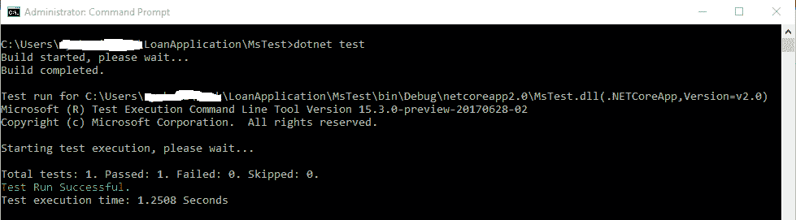
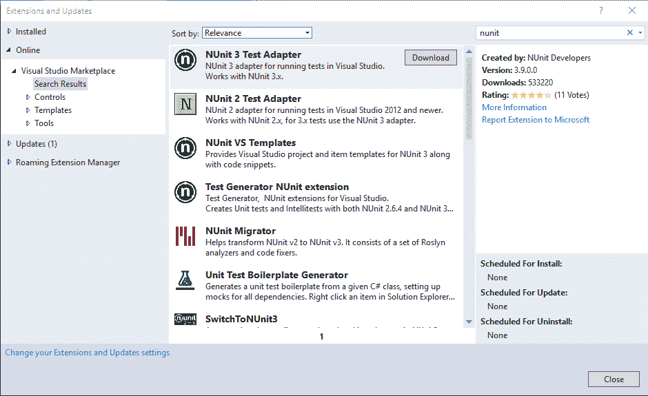
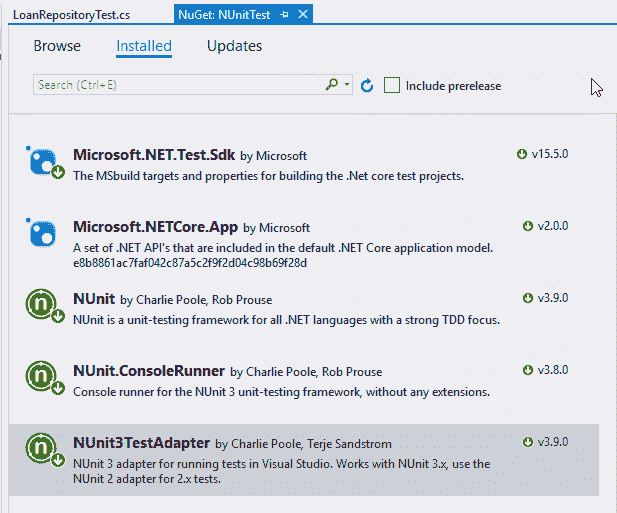
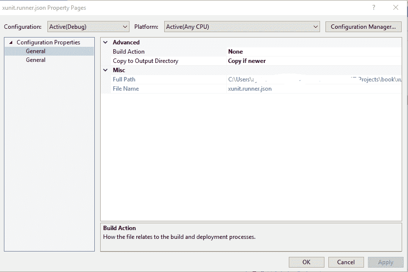
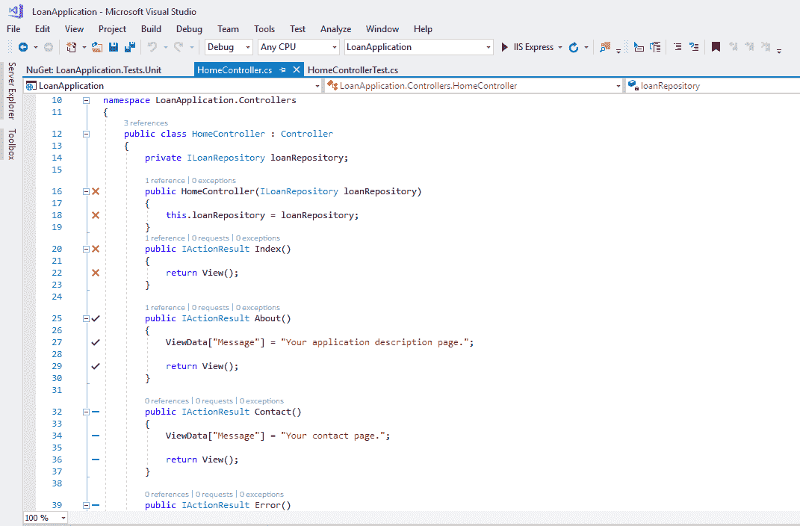

# 四、.NETCore单元测试

在过去的几年里，单元测试是软件开发中讨论最多的概念之一。 单元测试在软件开发中并不是一个新概念; 它已经存在了很长一段时间，从 Smalltalk 编程语言的早期就开始了。 基于对质量和健壮的软件应用越来越多的倡导，软件开发人员和测试人员已经开始意识到单元测试在软件产品质量改进方面所能提供的巨大好处。

通过单元测试，开发人员能够快速识别代码中的错误，这增加了开发团队对交付的软件产品质量的信心。 单元测试主要由程序员和测试执行，该活动涉及到将应用的需求和功能分解为可以单独测试的单元。

单元测试应该很小并且经常运行，特别是在对代码进行更改时，以确保代码库中的工作功能不会被破坏。 在进行 TDD 时，必须在编写要测试的代码之前编写单元测试。 测试通常是设计和编写代码的辅助工具，并且是代码设计和规范的有效文档。

在本章中，我们将解释如何创建基本单元测试，并使用 xUnit 断言证明单元测试的结果。 本章将涵盖以下主题:

*   一个好的单元测试的属性
*   当前针对.NET Core 和 C# 的单元测试框架生态系统
*   ASP 的单元测试注意事项。 净 MVC 核心
*   使用 xUnit 构建单元测试
*   用 xUnit 断言证明单元测试结果
*   测试运行程序可在.NET Core 和 Windows 上使用

# 一个好的单元测试的属性

单元测试是一段用来测试另一段代码的代码。 它有时被称为最低级别的测试，因为它用于在应用的最低级别测试代码。 单元测试调用被测试的方法或类来验证和断言关于被测试代码的逻辑、函数和行为的假设。

单元测试的主要目的是验证被测试的代码单元，以确定代码块是否按照设计的方式运行，而不是相反。 通过单元测试，可以证明单元代码的正确性，这只有在单元测试写得很好的情况下才能实现。 虽然单元测试将证明正确性并帮助发现代码中的 bug，但如果被测试的代码设计和编写很差，则代码质量可能不会得到改善。

当您正确地编写单元测试时，您可以在一定程度上确信您的应用将在发布时正确地运行。 通过测试套件的测试覆盖率能得到的,你可以测试的指标编写的方法、类、和其他对象在代码库中,你经常提供有意义的信息如何被运行,随着数量的多少次测试通过或失败。

有了可用的测试度量标准，参与软件开发的每个涉众都可以访问用于改进软件开发过程的客观信息。 当以迭代方式完成单元测试时，可以通过提高代码的可靠性和质量来增加代码的价值。 这可以通过测试代码的错误来实现——测试被反复运行很多次，这是一个被称为**回归测试**的概念，以定位在软件应用成熟和早期工作的组件中断时可能发生的错误。

# 可读的

单元测试的这个特点怎么强调都不过分。 与测试中的代码类似，单元测试应该易于阅读和理解。 编码标准和原则也适用于测试。 反模式，例如魔术数字或常量，应该避免，因为它们会使测试混乱，使它们难以阅读。 以下测试中的整数`10`是一个神奇的数字，因为它是直接使用的。 这会影响测试的可读性和清晰度:

```cs
[Fact]
 public void Test_CheckPasswordLength_ShouldReturnTrue() { 

    string password = "civic";

    bool isValid=false;
    if(password.Length >=10)
        isValid=true;

    Assert.True(isValid);
 }
```

有一个好的测试构建模式,可以采用,人们普遍称为**aaa**或**3 模式**——`Arrange`、`Act`,`Assert`——分离测试设置的验证。 您需要确保测试所需的输入数据被安排好，然后是对测试中的方法执行操作的代码行，并断言测试中的方法的结果满足期望:

```cs
 [Fact]
 public void Test_CompareTwoStrings_ShouldReturnTrue() { 
    string input = "civic";

    string reversed =  new string(input.Reverse().ToArray());

    Assert.Equal(reversed, input);
 }
```

虽然没有严格的测试命名约定，但您应该确保测试的名称代表特定的业务需求。 测试名应该具有预期的输入以及预期的输出`Test_CheckPasswordLength_ShouldReturnTrue`，这是因为，除了服务于测试特定于应用的功能之外，单元测试也是源代码的丰富文档源。

# 单位独立

单元测试基本上应该是一个单元，它应该以允许它独立运行的形式设计和编写。 被测试的单元，在本例中是一个方法，应该被编写成微妙地依赖于其他方法。 如果可能的话，方法需要的数据应该通过方法参数来获取，或者应该在单元内提供，它不应该要求或设置外部数据来发挥作用。

单元测试不应依赖于任何其他测试，也不应受任何其他测试的影响。 当单元测试相互依赖时，如果其中一个测试在运行时失败，那么所有其他依赖的测试也将失败。 被测试代码所需要的所有数据都应该由单元测试提供。

类似于*单一责任原则*[第二章中讨论](2.html),*开始使用.NETCore*,应该只有一个责任单位和随时关注程度的只有一次。 单元在任何时间点都应该有一个单一的任务，以允许它作为一个单元进行测试。 当你有一个方法实际上执行不止一个任务时，它只是一个单元的包装器，应该分解成基本单元以方便测试:

```cs
[Fact]
 public void Test_DeleteLoan_ShouldReturnNull() {

    loanRepository.ArchiveLoan(12);    
    loanRepository.DeleteLoan(12);    
    var loan=loanRepository.GetById(12); 

    Assert.Null(loan);
 }
```

这个代码片段中的测试的问题是同时发生了很多事情。 如果测试失败，则没有特定的方法来检查是哪个方法调用导致了失败。 为了清晰和易于维护，可以将该测试分解为不同的测试。

# 可重复的

单元测试应该很容易运行，而不必每次运行时都修改它。 从本质上说，一个测试应该准备好在不进行修改的情况下重复运行。 在接下来的测试中，`Test_DeleteLoan_ShouldReturnNull`测试方法是不可重复的，因为每次运行测试时都必须修改它。 为了避免这种情况，最好是模拟`loanRepository`对象:

```cs
[Fact]
 public void Test_DeleteLoan_ShouldReturnNull() { 
    loanRepository.DeleteLoan(12);

    var loan=loanRepository.GetLoanById(12); 

    Assert.Null(loan);
 }
```

# 可维护且运行速度快

单元测试应该以允许它们快速运行的方式编写。 测试应该很容易实现，并且开发团队的任何成员都应该能够运行它。 因为软件应用是动态的，并且在不断发展，所以当测试下的底层代码发生变化时，代码库的测试应该很容易维护。 要使测试运行得更快，请尽量减少依赖项。

通常，大多数程序员都弄错了单元测试的这一方面，他们编写的单元测试具有固有的依赖性，这反过来又使测试的运行速度变慢。 一个快速的经验法则告诉您，您的单元测试做错了什么，那就是它们运行得非常慢。 而且，当您的单元测试调用后端服务器或执行一些乏味的 I/O 操作时，这是测试气味的指示。

# 容易设置，不琐碎，并具有良好的覆盖

单元测试应该易于设置，并且与任何直接或外部依赖项解耦。 应该使用合适的 mock 框架来模拟外部依赖项。 适当的对象设置应该在设置方法或测试类构造函数中完成。

避免阻塞测试的冗余代码，并确保测试只包含与正在测试的方法相关的代码。 同样，应该为单元或方法编写测试。 例如，为类的 getter 和 setter 编写测试可能被认为太琐碎了。

最后，好的单元测试应该具有良好的代码覆盖率。 应该覆盖被测试方法中的所有执行路径，并且应该定义所有测试可以测试的标准。

# 面向.NET Core 和 C# 的单元测试框架生态系统

. net Core 开发平台被设计为完全支持测试。 这可以归因于所采用的体系结构。 它使得.NET Core 平台上的 TDD 相对简单和值得。

有几个单元测试框架可以在.NET 和.NET Core 中使用。 这些框架提供了简单而灵活的方法，可以直接从首选的 ide、代码编辑器、专用的测试运行器或有时通过命令行编写和执行单元测试。

在.NET 平台上有一个蓬勃发展的测试框架和套件生态系统。 框架包含各种适配器，这些适配器可用于创建单元测试项目以及持续集成和部署。

这种框架生态系统已经被.NET Core 平台所继承。 这使得在.NET Core 上练习 tdd 非常容易。 Visual Studio IDE 是开放和广泛的，这使得它可以更快、更容易地安装来自 NuGet 的不同测试框架的测试插件和适配器，以便在测试项目中使用。

有相当多的测试框架是免费和开源的，用于各种类型的测试。 最流行的框架是 MSTest、NUnit 和 xUnit.net。

# .NET 使用 MSTest 进行核心测试

Microsoft MSTest 是 Visual Studio 附带的默认测试框架，由 Microsoft 开发，它最初是.NET 框架的一部分，但也包含在.NET Core 中。 MSTest 框架用于编写负载、功能、UI 和单元测试。

MSTest 可以作为一个统一的应用平台支持，也可以用于测试广泛的应用——桌面、存储、**通用 Windows 平台**(**UWP**)和 ASP。 净的核心。 MSTest 作为 NuGet 包交付。

可以将基于 mstest 的单元测试项目添加到包含待测试项目的现有解决方案中，步骤如下:

1.  在“解决方案资源管理器”中右键单击现有的解决方案，选择“添加”并选择“新建项目”。 或者，为了从头开始创建一个新的测试项目，单击 File 菜单，选择 new，然后选择 project。
2.  在弹出的对话框中选择“Visual C#”，单击“.NET Core”选项。
3.  选择 MSTest 测试项目(。 NET Core)，并给项目起一个想要的名字。 然后单击 OK:


或者，在创建新项目或向现有解决方案中添加新项目时，选择 Class library(。 选项，并从 NuGet 中添加对 MSTest 的引用。 使用 NuGet 包管理器控制台或 GUI 选项将以下包从 NuGet 安装到类库项目中。 您可以在 NuGet 包管理器控制台运行以下命令:

```cs
Install-Package MSTest.TestFramework
Install-Package dotnet-test-mstest
```

不管使用哪种方法来创建 MSTest 测试项目，Visual Studio 都会自动创建一个`UnitTest1`或`Class1.cs`文件。 您可以重命名类或删除它以创建一个新的测试类，该类将使用 MSTest`TestClass`属性装饰，这表明该类将包含测试方法。

实际的测试方法将使用`TestMethod`属性进行修饰，并将其标记为测试，这将使测试可由 MSTest 测试运行器运行。 MSTest 有一个丰富的`Assert`助手类集合，可以用来验证单元测试的期望:

```cs
using Microsoft.VisualStudio.TestTools.UnitTesting;
using LoanApplication.Core.Repository;
namespace MsTest
{
    [TestClass]
    public class LoanRepositoryTest
    {
        private LoanRepository loanRepository;
        public LoanRepositoryTest()
        {
            loanRepository = new LoanRepository();
        }

        [TestMethod]
        public void Test_GetLoanById_ShouldReturnLoan()
        {            
            var loan = loanRepository.GetLoanById(12);
            Assert.IsNotNull(loan);
        }
    }
}
```

您可以在 Visual Studio 2017 的“测试资源管理器”窗口中运行`Test_GetLoanById_ShouldReturnLoan`测试方法。 可以从`Test`菜单中打开此窗口，选择 Windows，然后选择 Test Explorer。 右键单击测试并选择运行选定的测试:


您还可以从控制台运行测试。 打开命令提示窗口并将目录更改为包含测试项目的文件夹，或者如果要运行解决方案中的所有测试项目，则更改为解决方案文件夹。 执行`dotnet test`命令。 将生成项目，同时发现并执行可用测试:



# .NET Core 测试与 NUnit

NUnit 是一个最初从 Java 的 JUnit 移植而来的测试框架，可以用来测试在.NET 平台上用所有编程语言编写的项目。 目前在版本 3 中，它的开源测试框架是在 MIT 许可证下发布的。

NUnit 测试框架包括引擎和控制台运行器。 此外，它还有用于测试在移动设备上运行的应用的测试运行器——**Xamarin 运行器**。 NUnit 测试适配器和生成器基本上可以使使用 Visual Studio IDE 进行测试变得无缝且相对容易。

使用 NUnit 测试. net Core 或. net 标准应用需要使用 Visual Studio 测试适配器的 NUnit 3 版本。 为了能够创建一个 NUnit 测试项目，需要安装 NUnit 测试项目模板，这通常只需要执行一次。

通过以下步骤可以将 NUnit 适配器安装到 Visual Studio 2017 中:

1.  单击“工具”菜单，然后选择“扩展和更新”
2.  单击“在线”选项，并在搜索文本框中键入`nunit`以筛选可用的 NUnit 适配器
3.  选择“NUnit 3 Test Adapter”，单击“Download”

这将下载适配器并将其作为模板安装到 Visual Studio 2017 中，你必须重启 Visual Studio 才能生效:



或者，每次你想要创建一个测试项目时，你都可以直接从 NuGet 安装 NUnit 3 测试适配器。

要将一个 NUnit 测试项目添加到你现有的解决方案中，请遵循以下步骤:

1.  在“解决方案资源管理器”中右键单击解决方案，选择“添加”、“新建项目”。
2.  在对话框中，选择 Visual C#，然后选择. net Core 选项。
3.  选择类库(。 NET Core)，然后为项目指定所需的名称。
4.  从 NuGet 中添加`NUnit3TestAdapter`和`NUnit.ConsoleRunner`包到项目:



完成项目设置后，可以编写和运行单元测试。 与 MSTest 类似，NUnit 具有用于设置测试方法和测试类的属性。

属性用于将类标记为测试方法的容器。 `Test`属性用于修饰测试方法，并使这些方法可以从 NUnit 测试运行程序中调用。

NUnit 还有其他一些用于设置和测试的属性。 属性用于修饰在所有子测试运行之前只调用一次的方法。 一个类似的属性是`SetUp`，它用于修饰在每次测试运行之前调用的方法:

```cs
using LoanApplication.Core.Repository;
using NUnit;
using NUnit.Framework;
namespace MsTest
{
    [TestFixture]
    public class LoanRepositoryTest
    {
        private LoanRepository loanRepository;

        [OneTimeSetUp]
        public void SetupTest()
        {
            loanRepository = new LoanRepository();
        }

        [Test]
        public void Test_GetLoanById_ShouldReturnLoan()
        {            
            var loan = loanRepository.GetLoanById(12);
            Assert.IsNotNull(loan);
        }
    }
}
```

可以从“测试资源管理器”窗口运行测试，类似于使用 MSTest 测试项目运行测试的方式。 此外，可以使用`dotnet test`从命令行运行测试。 然而，你必须添加**microt.net . test . sdk Version 15.5.0**作为 NUnit 测试项目的参考:


# xUnit.net

xUnit.net 是一个面向.NET 平台的开源单元测试框架，用于测试用 f#、VB 编写的项目。 NET、C# 和其他符合.NET 的编程语言。 xUnit.net 是由 NUnit 版本 2 的发明者编写的，并在 Apache 2 下授权。

xUnit.net 可以用来测试传统的.NET 平台应用，包括控制台和 asp.net。 NET 应用、UWP 应用、移动设备应用和.NETCore应用。 网络核心的包容性。

与 NUnit 和 MSTest 不同，测试类分别用`TestFixture`和`TestClass`属性装饰，xUnit.net 测试类不需要属性装饰。 框架自动检测测试项目或程序集中所有公共类中的所有测试方法。

此外，测试设置和删除属性在 xUnit.net 中不可用，可以使用无参数的构造函数来设置测试对象或模拟依赖关系。 测试类可以实现`IDisposable`接口，并在`Dispose`方法中清理对象或依赖项:

```cs
public class TestClass : IDisposable
{
    public TestClass()
    {
        // do test class dependencies and object setup
    }
    public void Dispose()
    {
        //do cleanup here
    }
}
```

xUnit.net 支持两种主要类型的测试—事实和理论。 **事实**是永远正确的测验; 它们是没有参数的测试。 理论是只有通过一组特定的数据才会成立的测试; 它们基本上是参数化测试。 `[Fact]`和`[Theory]`属性分别用来修饰事实和理论测试:

```cs
[Fact]
public void TestMethod1()
{
    Assert.Equal(8, (4 * 2));
}

[Theory]
[InlineData("name")]
[InlineData("word")]
public void TestMethod2(string value)
{
    Assert.Equal(4, value.Length);
}
```

`[InlineData]`属性在`TestMethod2`中用于修饰理论测试，为测试执行期间使用的测试方法提供测试数据。

# 如何配置 xUnit.net

xUnit.net 的配置有两种方式。 xUnit.net 允许配置文件是基于 JSON 或 xml 的。 必须对测试中的每个程序集进行 xUnit.net 配置。 xUnit.net 所使用的配置文件取决于所测试应用的开发平台，但是 JSON 配置文件可以在所有平台上使用。

要使用 JSON 配置文件，在 Visual Studio 2017 中创建测试项目后，应该在测试项目的根文件夹中添加一个新的 JSON 文件，并将其命名为`xunit.runner.json`:


将文件添加到项目后，您必须指示 Visual Studio 将`.json`文件复制到项目的输出文件夹中，xUnit 测试运行器可以在该文件夹中找到该文件。 要做到这一点，你应该遵循以下步骤:

1.  从解决方案资源管理器中右键单击 JSON 配置文件。 从 Menu 选项中选择 Properties，这将显示一个标题为 xunit.runner.json Property Pages 的对话框。
2.  在“属性窗口”页面上，将“复制到输出目录”的选项从“永不”更改为“复制”(如果更新的话)，然后单击“确定”按钮:

**** 

这将确保在进行更改时始终将配置文件复制到输出文件夹。 xUnit 中受支持的配置元素被放在配置文件的顶级 JSON 对象中，如图所示:

```cs
{
  "appDomain": "ifAvailable",
  "methodDisplay": "classAndMethod",
  "diagnosticMessages": false,
  "internalDiagnosticMessages": false,
  "maxParallelThreads": 8
}
```

当使用具有 JSON 支持的 Visual Studio 版本时，它将根据配置文件名自动检测模式。 此外，在编辑`xunit.runner.json`文件时，上下文帮助将在 Visual Studio 智能感知中可用。 不同的配置元素及其可接受的值在这个表中解释:

| **键** | **值** |
| `appDomain` | 配置元素`appDomain`是`enum`JSON 模式类型，它可以接受三个值来确定是否使用应用域——`ifAvailable`、`required`和`denied`。 应用域只被桌面运行程序使用，并且将被非桌面运行程序忽略。默认值应该总是`ifAvailable`，这表示如果可用，应该使用应用域。 当设置为`required`时，它将需要使用应用域，如果设置为`denied`，则不会使用应用域。 |
| `diagnosticMessages`
 | `diagnosticMessages`配置元素是`boolean`JSON 模式类型，如果您想在测试发现和执行期间启用诊断消息，那么应该将其设置为`true`。 |
|  | `internalDiagnosticMessages`配置元素是`boolean`JSON 模式类型，如果您想在测试发现和执行期间启用内部诊断消息，那么应该将其设置为`true`。 |
| `longRunningTestSeconds`
 | 配置元素是`integer`JSON 模式类型。 如果要启用长时间运行的测试，应该将该值设置为正整数; 将该值设置为`0`将禁用配置。 您应该启用`diagnosticMessages`以获取长时间运行的测试的通知。 |
| `maxParallelThreads`
 | 配置元素是`integer`JSON 模式类型。 将该值设置为并行化时要使用的最大线程数。 将该值设置为`0`将保持默认行为，即计算机上的逻辑处理器数量。 设置为`-1`意味着您不希望设置用于测试并行化的线程数量的限制。 |
| `methodDisplay` | 配置元素是`enum`JSON 模式类型。 当将其设置为`method`时，显示名将是不包括类名的方法。 将该值设置为`classAndMethod`，这是默认值，表示将使用默认显示名，即类名和方法名。 |
| `parallelizeAssembly` | 配置元素是`boolean`JSON 模式类型。 将该值设置为`true`将使测试程序集与其他程序集并行。 |
| `parallelizeTestCollections` | 配置元素是`boolean`JSON 模式类型。 将该值设置为 true 将使测试在程序集中并行运行，从而允许不同测试集合中的测试并行运行。 同一测试集合中的测试仍将按顺序运行。 将此设置为`false`将禁用测试程序集中的并行化。 |
| `preEnumerateTheories` | 配置元素`preEnumerateTheories`是`boolean`JSON 模式类型，应该设置为`true`以预先枚举理论，以确保每个理论数据行都有一个单独的测试用例。 当将其设置为`false`时，将返回每个理论的单个测试用例，而无需提前枚举数据。 |
| `shadowCopy` | `shadowCopy`配置元素是`boolean`JSON 模式类型，如果您希望在不同应用域中运行测试时启用阴影复制，那么应该将其设置为`true`。 如果在没有应用域的情况下运行测试，则此配置元素将被忽略。 |

xUnit.net 中可以用于桌面和 PCL 测试项目的另一个配置文件选项是 XML 配置。 如果测试项目还没有`App.Config`文件，那么您应该将其添加到测试项目中。

在`App.Config`文件的`appSettings`部分下，您可以添加配置元素及其值。 当使用 XML 配置文件时，必须将 xUnit 附加到上表中解释的配置元素中。 例如，JSON 配置文件中的`appDomain`元素将被写入`xunit.appDomain`:

```cs
<?xml version="1.0" encoding="utf-8"?>
<configuration>
  <appSettings>
    <add key="xunit.appDomain" value="ifAvailable"/>
    <add key="xunit.diagnosticMessages" value="false"/>
  </appSettings>
</configuration>
```

# xUnit.net 测试

在 xUnit.net 中，有两个参与者负责运行使用框架- xUnit.net 运行器和测试框架编写的单元测试。 测试运行程序**是一个程序，它也可以是一个第三方插件，用于搜索程序集中的测试并激活发现的测试。 xUnit.net 测试运行程序依赖于`xunit.runner.utility`库来发现和执行测试。**

 **测试框架是实现测试发现和执行的代码。 测试框架根据`xunit.core.dll`和`xunit.execution.dll`库链接发现的测试。 库与单元测试一起存在。 `xunit.abstractions.dll`是 xUnit.net 的另一个有用库，它包含测试运行程序和测试框架在通信中使用的抽象。

# 测试的并行性

测试并行化**在 xUnit.net 版本 2 中被引入。 该特性允许开发人员并行运行多个测试。 测试并行化是必需的，因为大型代码库通常有数千个测试在运行，这些测试需要多次运行。**

这些代码库有大量的测试，因为需要确保特性的代码能够正常工作，而不会损坏。 由于计算机硬件技术的进步，它们还利用了现在用于运行并行测试的超高速计算资源。

您可以编写使用并行化的测试，并利用计算机上可用的核心，从而使测试运行得更快，或者让 xUnit.net 并行运行多个测试。 后者通常是首选，这可以确保测试可以以运行它们的计算机的速度运行。 在 xUnit.net 中，测试并行性可以是框架级别的，其中框架支持在同一程序集中并行运行多个测试，或者在测试运行器中并行运行，其中一个运行器可以并行运行多个测试程序集。

使用测试集合并行运行测试。 每个测试类都是一个测试集合，测试集合中的测试不会彼此并行运行。 例如，如果运行`LoanCalculatorTest`中的测试，则测试运行程序将顺序运行类中的两个测试，因为它们属于同一个测试集合:

```cs
public class LoanCalculatorTest
{
        [Fact]
        public void TestCalculateLoan()
        {
            Assert.Equal(16, (4*4));
        }

        [Fact]
        public void TestCalculateRate()
        {
            Assert.Equal(12, (4*3));
        }
}
```

独立测试类中的测试可以并行运行，因为它们属于独立的测试集合。 让我们修改`LoanCalculatorTest`，并将`TestCalculateRate`测试方法放入单独的测试类`RateCalculatorTest`:

```cs
public class LoanCalculatorTest
{
        [Fact]
        public void TestCalculateLoan()
        {
            Assert.Equal(16, (4*4));
        }
}

public class RateCalculatorTest
{
        [Fact]
        public void TestCalculateRate()
        {
            Assert.Equal(12, (4*3));
        }
}
```

如果我们运行测试，运行`TestCalculateLoan`和`TestCalculateRate`的总时间将会减少，因为它们位于不同的测试类中，这将它们放入不同的测试集合中。 另外，从“测试资源管理器”窗口中，您可以观察到用于标记两个测试的运行图标，以指示它们都在运行:


可以将独立测试类中的测试配置为不并行运行。 这是通过使用同名的`Collection`属性修饰类来实现的。 如果将`Collection`属性添加到`LoanCalculatorTest`和`RateCalculatorTest`:

```cs
[Collection("Do not run in parallel")]
public class LoanCalculatorTest
{
        [Fact]
        public void TestCalculateLoan()
        {
            Assert.Equal(16, (4*4));
        }
}

[Collection("Do not run in parallel")]
public class RateCalculatorTest
{
        [Fact]
        public void TestCalculateRate()
        {
            Assert.Equal(12, (4*3));
        }
}
```

`LoanCalculatorTest`和`RateCalculatorTest`类中的测试将不会并行运行，因为根据属性修饰，这些类属于同一个测试集合。

# ASP 的单元测试考虑。 净 MVC 核心

ASP。 根据 MVC 架构模式的原则，NET Core MVC 开发模式将 web 应用分为三个不同的部分:`Model`、`View`和`Controller`。 **模型-视图-控制器**(**MVC**)模式有助于创建易于测试和维护的 web 应用，并具有清晰的关注点和边界分离。

MVC 模式在表示逻辑和业务逻辑之间提供了清晰的分离，具有容易的可伸缩性和可维护性。 它最初是为桌面应用设计的，但后来在 web 应用中获得了大量的使用和流行。

ASP。 NET Core MVC 项目可以像测试其他类型的.NET Core 项目一样进行测试。 ASP。 NET Core 支持控制器类、razor 页面、页面模型、业务逻辑和应用数据访问层的单元测试。 要构建健壮的 MVC 应用，必须对各种应用组件进行隔离测试，然后在集成后进行测试。

# 单元测试控制器

ASP。 NET Core MVC Controller 类处理用户交互，将其转换为浏览器上的请求。 控制器获得适当的模型并选择一个视图来呈现以显示用户界面。 控制器从视图中读取用户的输入数据、事件和交互，并将其传递给模型。 控制器验证从视图接收到的输入，然后执行修改数据模型状态的业务操作。

`Controller`类应该是轻量级的，并且包含根据用户交互来呈现视图所需的最小逻辑，以方便测试和维护。 控制器应该验证模型的状态并确定有效性，调用执行业务逻辑验证和管理数据持久性的适当代码，然后向用户显示适当的视图。

当单元测试`Controller`类时，主要目的是测试控制器动作方法的独立行为，这应该在不与其他重要的 MVC 结构(如模型绑定、路由、过滤器和其他自定义控制器实用对象)混淆的情况下完成。 这些其他构造，如果是自定义编写的，应该以不同的方式进行单元测试，然后使用控制器使用集成测试作为一个整体进行测试。

回顾一下`LoanApplication`项目的`HomeController`类，`Controller`类包含了在 Visual Studio 中创建项目时添加的四个动作方法:

```cs
using System;
using System.Collections.Generic;
using System.Diagnostics;
using System.Linq;
using System.Threading.Tasks;
using Microsoft.AspNetCore.Mvc;
using LoanApplication.Models;

namespace LoanApplication.Controllers
{
    public class HomeController : Controller
    {
        public IActionResult Index()
        {
            return View();
        }

        public IActionResult About()
        {
            ViewData["Message"] = "Your application description page.";

            return View();
        }
    }
}
```

目前，`HomeController`类包含带有返回视图基本逻辑的操作方法。 为了对 MVC 项目进行单元测试，一个新的 xUnit.net 测试项目应该添加到解决方案中，以使测试与实际的项目代码分离。 将`HomeControllerTest`测试类添加到新创建的测试项目中。

将要写入的测试方法将验证`viewResult`对象是否同时由`HomeController`类的`Index`和`About`操作方法返回:

```cs
using System;
using System.Collections.Generic;
using System.Linq;
using System.Threading.Tasks;
using Microsoft.AspNetCore.Mvc;
using LoanApplication.Controllers;
using Xunit;

namespace LoanApplication.Tests.Unit.Controller
{
    public class HomeControllerTest
    {
        [Fact]
        public void TestIndex()
        {
            var homeController = new HomeController();
            var result = homeController.Index();
            var viewResult = Assert.IsType<ViewResult>(result);
        }

        [Fact]
        public void TestAbout()
        {
            var homeController = new HomeController();
            var result = homeController.About();
            var viewResult = Assert.IsType<ViewResult>(result);
        }
    }
}
```

在前面的控制器测试中编写的测试是基本的和非常简单的。 为了进一步演示控制器单元测试，可以更新`Controller`类代码以支持依赖注入，这将允许通过对象模拟来测试方法。 另外，通过使用`AddModelError`添加错误，可以测试无效的模型状态:

```cs
public class HomeController : Controller
{        
        private ILoanRepository loanRepository;

        public HomeController(ILoanRepository loanRepository)
        {
            this.loanRepository = loanRepository;
        }

        public IActionResult Index()
        {
            var loanTypes=loanRepository.GetLoanTypes();
            ViewData["LoanTypes"]=loanTypes;
            return View();
        }             
 }
```

`ILoanRepository`通过类构造函数注入到`HomeController`，在测试类中，`ILoanRepository`将使用 Moq 框架进行模拟。 在`TestIndex`测试方法中，根据`HomeController`类中的`Index`方法所需的`LoanType`列表设置模拟对象:

```cs
public class HomeControllerTest
{
    private Mock<ILoanRepository> loanRepository;
    private HomeController homeController;

    public HomeControllerTest()
    {
        loanRepository = new Mock<ILoanRepository>();
        loanRepository.Setup(x => x.GetLoanTypes()).Returns(GetLoanTypes());
        homeController = new HomeController(loanRepository.Object);
    }
    [Fact]
    public void TestIndex()
    {
       var result = homeController.Index();
       var viewResult = Assert.IsType<ViewResult>(result);
       var loanTypes = Assert.IsAssignableFrom<IEnumerable<LoanType>>(viewResult.ViewData["LoanTypes"]);
       Assert.Equal(2, loanTypes.Count());
    }

    private List<LoanType> GetLoanTypes()
    {
            var loanTypes = new List<LoanType>();
            loanTypes.Add(new LoanType()
            {
                Id = 1,
                Name = "Car Loan"
            });
            loanTypes.Add(new LoanType()
            {
                Id = 2,
                Name = "House Loan"
            });
            return loanTypes;
    }
 }
```

# 单元测试分页

在 ASP。 NET MVC 中，视图是用于呈现 web 应用用户界面的组件。 视图以合适且易于理解的输出格式(如 HTML、XML、XHTML 或 JSON)表示模型中包含的信息。 视图根据对模型执行的更新向用户生成输出。

**Razor pages**使得页面上的编码功能相对容易一些。 剃刀页面类似于剃刀视图，只是增加了`@page`指令。 `@page`指令必须是页面中的第一个指令，它会自动将文件转换为 MVC 操作来处理请求，而无需通过控制器。

在 ASP。 NET Core，可以测试剃须刀页面，以确保他们在隔离和作为一个集成的应用正确工作。 Razor 页面测试包括测试数据访问层代码、页面组件和页面模型。

下面的代码片段显示了一个单元测试，它验证了页面模型是否正确地重定向:

```cs
using Microsoft.AspNetCore.Http;
using Microsoft.AspNetCore.Mvc;
using Microsoft.AspNetCore.Mvc.ModelBinding;
using Microsoft.AspNetCore.Mvc.RazorPages;
using Microsoft.AspNetCore.Mvc.Routing;
using Microsoft.AspNetCore.Mvc.ViewFeatures;
using Microsoft.AspNetCore.Routing;
using Xunit;

public class ViewTest
{
    [Fact]
    public void TestResultView()
    {
        var httpContext = new DefaultHttpContext();
        var modelState = new ModelStateDictionary();
        var actionContext = new ActionContext(httpContext, new RouteData(), new PageActionDescriptor(), modelState);
        var modelMetadataProvider = new EmptyModelMetadataProvider();
        var viewData = new ViewDataDictionary(modelMetadataProvider, modelState);
        var pageContext = new PageContext(actionContext);
        pageContext.ViewData = viewData;
        var pageModel = new ResultModel();
        pageModel.PageContext = pageContext;
        pageModel.Url = new UrlHelper(actionContext);
        var result = pageModel.RedirectToPage();
        Assert.IsType<RedirectToPageResult>(result);
    }
}

public class ResultModel : PageModel
{
    public string Message { get; set; }
}
```

# 使用 xUnit 构建单元测试

与应用的代码库的结构方式类似，单元测试也应该结构化，以使其易于阅读并实现有效的源代码维护。 这是为了使用 Visual Studio IDE 中的测试运行器方便地维护和快速运行测试。

测试用例**是一个包含测试方法的测试类。 通常每个被测试的类都有一个测试类。 在开发人员中构造测试的另一种常见做法是为每个被测试的方法提供一个嵌套类，或者为被测试的类提供一个基测试类，为每个被测试的方法提供一个子类。 此外，还有每个特性的测试类方法，其中所有共同验证应用的一个特性的测试方法分组在一个测试用例中。**

 **这些测试结构方法促进了 DRY 原则，并在编写测试时从根本上促进了代码的可重用性。 没有一种方法最适合所有的目的，选择一种特定的方法应该基于应用开发的环境，并在与团队成员进行有效沟通之后进行。

one-class-per-test 或 one-class-per-method 路线取决于个人偏好和有时公约或协议当工作在一个团队中,每个方法都有其利弊。当你使用 one-class-per-test 方法,你都在被测试的类测试方法在测试类中, 与“一个类一个方法”的方法相反，在这种方法中，你在类中有一个测试，因为它们与被测试的方法相关，尽管有时在类中可能有多个测试，只要它们与方法相关:

```cs
public class HomeControllerTest
    {
        private Mock<ILoanRepository> loanRepository;
        private HomeController homeController;
        public HomeControllerTest()
        {
            loanRepository = new Mock<ILoanRepository>();
            loanRepository.Setup(x => x.GetLoanTypes()).Returns(GetLoanTypes());
            homeController = new HomeController(loanRepository.Object);
        }

        private List<LoanType> GetLoanTypes()
        {
            var loanTypes = new List<LoanType>();
            loanTypes.Add(new LoanType()
            {
                Id = 1,
                Name = "Car Loan"
            });
            loanTypes.Add(new LoanType()
            {
                Id = 2,
                Name = "House Loan"
            });
            return loanTypes;
        }       
    }
```

将创建两个测试类`IndexMethod`和`AboutMethod`。 这两个类都将扩展`HomeControllerTest`类，并各自拥有一个方法，遵循每个测试类一个方法的单元测试方法:

```cs
 public class IndexMethod :HomeControllerTest
        {
            [Fact]
            public void TestIndex()
            {               
                var result = homeController.Index();
                var viewResult = Assert.IsType<ViewResult>(result);
                var loanTypes = Assert.IsAssignableFrom<IEnumerable<LoanType>>(viewResult.ViewData["LoanTypes"]);
                Assert.Equal(3, loanTypes.Count());
            }            
        }

        public class AboutMethod : HomeControllerTest
        {
            [Fact]
            public void TestAbout()
            {
                var result = homeController.About();
                var viewResult = Assert.IsType<ViewResult>(result);
            }
        }
```

重要的是要注意，为测试用例和测试方法提供有意义和描述性的名称可以使它们有意义并易于理解。 测试方法的名称应该包含被测试的方法或特性的名称，这是适当的。 可选地，它可以进一步描述在测试方法的名称中添加预期结果，并以`Should`作为前缀:

```cs
[Fact]
public void TestAbout_ShouldReturnViewResult()
{
      var result = homeController.About();
      var viewResult = Assert.IsType<ViewResult>(result);
}
```

# xUnit.net 共享测试上下文

测试上下文设置是在测试类构造器中完成的，因为测试设置不适用于 xUnit。 对于每个测试，xUnit 都会创建一个测试类的新实例，这意味着会为每个测试运行类构造函数中的代码。

通常情况下，让单元测试类共享测试上下文是可取的，因为创建和清理测试上下文的开销可能很大。 xUnit 提供了三种方法来实现这一点:

*   **构造函数和**处理:共享设置或清理代码，而无需共享对象实例
*   **类 fixture**:在单个类中跨多个测试共享对象实例
*   **集合装置**:跨多个测试类共享对象实例

当您希望为测试类中的每个测试提供一个新的测试上下文时，您应该使用构造函数和 dispose。 在下面的代码中，将为`LoanModuleTest`类中的每个测试方法构造和处理上下文对象:

```cs
public class LoanModuleTest : IDisposable
{
    public LoanAppContext Context { get; private set; }

    public LoanModuleTest()
    {
        Context = new LoanAppContext();
    }

    public void Dispose()
    {
        Context=null;
    }

    [Fact]
    public void TestSaveLoan_ShouldReturnTrue()
    {
        Loan loan= new Loan{Description = "Car Loan"};
        Context.Loan.Add(loan);
        var isSaved=Context.Save();
        Assert.True(isSaved);
    }
}
```

当您打算创建一个测试上下文时，可以使用类 fixture 方法，该测试上下文将在类中的所有测试之间共享，并将在所有测试完成运行后清除。 要使用类 fixture，必须创建带有构造函数的 fixture 类，该构造函数将包含要共享的对象的代码。 测试类应该实现`IClassFixture<>`，你应该将 fixture 类作为构造函数参数添加到测试类:

```cs
public class EFCoreFixture : IDisposable
{
    public LoanAppContext Context { get; private set; }

    public EFCoreFixture()
    {
        Context = new LoanAppContext();
    }

    public void Dispose()
    {
        Context=null;
    }
}

```

以下代码片段中的`LoanModuleTest`类以`EFCoreFixture`作为参数传递来实现`IClassFixture`。 `EFCoreFixture`被注入到测试类构造函数:

```cs
public class LoanModuleTest : IClassFixture<EFCoreFixture>
{
    EFCoreFixture efCoreFixture;

    public LoanModuleTest(EFCoreFixture efCoreFixture)
    {
        this.efCoreFixture = efCoreFixture;
    }

    [Fact]
    public void TestSaveLoan_ShouldReturnTrue()
    {
        // test to persist using EF Core context
    }
}
```

与类 fixture 类似，集合 fixture 用于创建在测试之间共享的测试上下文，但这一次测试可以位于多个类中。 测试上下文创建将为所有测试类执行一次，而清理(如果实现了)将在测试类中的所有测试完成运行之后执行。

使用收集装置:

1.  使用类似于使用 fixture 类创建的构造函数创建 fixture 类。
2.  如果需要进行代码清理，可以在 fixture 类上实现`IDisposable`，代码清理将放在`Dispose`方法中:

```cs
public class EFCoreFixture : IDisposable
{
    public LoanAppContext Context { get; private set; }

    public EFCoreFixture()
    {
        Context = new LoanAppContext();
    }

    public void Dispose()
    {
        Context=null;
    }
}
```

3.  将创建一个定义类，这个定义类没有代码，并且添加了`ICollectionFixture<>`，因为它的目的是定义集合定义。 用`[CollectionDefinition]`属性装饰类，并为测试集合命名:

```cs
[CollectionDefinition("Context collection")]
public class ContextCollection : ICollectionFixture<EFCoreFixture>
{

}
```

4.  将`[Collection]`属性添加到测试类，并使用前面用于集合定义类属性的名称。
5.  如果测试类需要 fixture 的实例，则添加一个构造函数，将 fixture 作为参数:

```cs
[Collection("Context collection")]
public class LoanModuleTest 
{
    EFCoreFixture efCoreFixture;

    public LoanModuleTest(EFCoreFixture efCoreFixture)
    {
        this.efCoreFixture = efCoreFixture;
    }

    [Fact]
    public void TestSaveLoan_ShouldReturnTrue()
    {
        // test to persist using EF Core context
    }
}

[Collection("Context collection")]
public class RateModuleTest 
{
    EFCoreFixture efCoreFixture;

    public RateModuleTest(EFCoreFixture efCoreFixture)
    {
        this.efCoreFixture = efCoreFixture;
    }

    [Fact]
    public void TestUpdateRate_ShouldReturnTrue()
    {
        // test to persist using EF Core context
    }
}
```

# 使用 Visual Studio 2017 Enterprise 进行实时单元测试

Visual Studio 2017 企业版有一个实时单元测试特性，它可以自动运行受代码库更改影响的测试。 测试在后台运行，结果在 Visual Studio 中显示。 这是一个很酷的 IDE 特性，它为您提供对项目源代码所做的更改的即时反馈。

Visual Studio 中的实时单元测试目前支持 NUnit、MSTest 和 xUnit。 活动单元测试可以从工具菜单中配置-从顶层菜单中选择选项，并在选项对话框的左侧窗格中选择活动单元测试。 可用的实时单元测试配置选项可以在选项对话框中进行调整:

**** 

在“测试”菜单中选择“实时单元测试”并选择“开始”，可以启用“实时单元测试”:


启用“实时单元测试”后，将显示“实时单元测试”菜单上的其他可用选项。 除了“开始”，还有“暂停”、“停止”和“清除重置”。 菜单功能说明如下:

*   暂停:这将暂时暂停实时单元测试，这将保留收集的单元测试数据，但隐藏测试覆盖率`visualization.rk`，以跟上暂停时所做的所有编辑，并适当地更新符号
*   停止:停止实时单元测试并删除所有收集到的单元测试数据
*   Reset Clean:通过停止并再次启动实时单元测试来重新启动它
*   选项:打开选项对话框来配置实时单元测试

在下面的屏幕截图中，可以看到启用实时单元测试时的覆盖率可视化。 每一行代码都被更新并装饰成绿色、红色和蓝色，以表明这一行代码被通过的测试覆盖，一个失败的测试，或没有被任何测试覆盖:

**** 

# 用 xUnit.net 断言证明单元测试结果

xUnit.net 断言验证测试中的方法的行为。 断言验证预期结果的预期条件为真。 当断言失败时，终止当前测试的执行并抛出异常。 下表解释了 xUnit.net 中可用的断言:

| **断言** | **描述** |
| --- | --- |
| `Equal` | 验证一个对象是否等于另一个对象 |
| `NotEqual` | 验证一个对象不等于另一个对象 |
| `Same` | 验证两个对象的类型是否相同 |
| `NotSame` | 验证两个对象的类型是否相同 |
| `Contains` | 是不是一个重载的断言/方法并验证它是一个字符串包含给定的子字符串或包含对象的集合 |
| `DoesNotContain` | 是不是一个重载的断言/方法并验证它是一个字符串不包含给定的子字符串或集合不包含对象 |
| `DoesNotThrow` | 验证代码是否抛出异常 |
| `InRange` | 验证一个值是否在给定的包含范围内 |
| `IsAssignableFrom` | 验证对象是否是给定类型或派生类型 |
| `Empty` | 验证集合是否为空 |
| `NotEmpty` | 验证集合是否为空 |
| `False` | 验证一个表达式是否为假 |
| `True` | 验证一个表达式是否为真 |
| `IsType<T>` | 验证一个对象是否是给定类型 |
| `IsNotType<T>` | 验证一个对象不是给定类型 |
| `Null` | 验证一个对象引用是否为空 |
| `NotNull` | 验证一个对象引用不为空 |
| `NotInRange` | 验证一个值不在给定的包含范围内 |
| `Throws<T>` | 验证代码是否抛出准确的异常 |

下面的代码片段使用了上表中描述的一些 xUnit.net 断言方法。 `Assertions`单元测试方法展示了在 xUnit.net 中进行单元测试时如何使用断言方法来验证方法的行为:

```cs
        [Fact]
        public void Assertions()
        {
            Assert.Equal(8 , (4*2));
            Assert.NotEqual(6, (4 * 2));

            List<string> list = new List<String> { "Rick", "John" };
            Assert.Contains("John", list);
            Assert.DoesNotContain("Dani", list);

            Assert.Empty(new List<String>());
            Assert.NotEmpty(list);

            Assert.False(false);
            Assert.True(true);

            Assert.NotNull(list);
            Assert.Null(null); 
        }
```

# 测试运行程序可在.NET Core 和 Windows 上使用

. net 平台有一个大型的测试运行器生态系统，可以与流行的测试平台 NUnit、MSTest 和 xUnit 一起使用。 测试框架附带了测试运行器，以促进测试的平稳运行。 此外，还有一些开源和商业测试运行器可以与可用的测试平台一起使用，ReSharper 就是其中之一。

# ReSharper

**ReSharper**是一个针对.NET 开发者的 Visual Studio 扩展，由 JetBrains 开发。 它的测试运行器是目前在.NET 平台上可用的测试运行器中最受欢迎的，ReSharper 生产力工具提供了其他功能来提高程序员的生产力。 它有一个单元测试运行器，可以帮助您运行和调试基于 xUnit.net、NUnit、MSTest 和一些其他测试框架的单元测试。

ReShaper 可以为可用的测试框架检测在.NET 和.NET Core 平台上编写的测试。 ReSharper 将图标添加到编辑器中，可以单击这些图标来调试或运行测试:


单元测试由 ReSharper 使用*单元测试会话*窗口运行。 **ReSharper 的单元测试会话**窗口允许你并行运行任意数量的单元测试会话，彼此独立。 但是在调试模式下运行时，一次只能运行一个会话。

您可以使用单元测试树过滤测试，单元测试树为您提供测试的结构。 它显示哪些测试失败、通过或尚未运行。 此外，通过双击一个测试，你可以直接导航到源代码:


# 总结

单元测试可以提高代码的质量和应用的整体质量。 这些测试还可以作为源代码注释和文档的丰富来源。 创建高质量的单元测试是一种应该遵循本章中讨论的指导原则有意识地学习的技能。

在本章中，我们讨论了一个好的单元测试的属性。 我们还广泛讨论了使用 xUnit.net 框架中可用的测试特性进行单元测试的过程。 本文解释了 Visual Studio 2017 中的动态单元测试特性，并使用 xUnit.net`Fact`属性，断言用于创建基本单元测试。

在下一章中，我们将探讨数据驱动的单元测试，这是单元测试的另一个重要方面，它有助于使用来自不同来源的数据，如数据库或 CSV 文件，来执行单元测试。 这是通过 xUnit.net`Theory`属性实现的。****