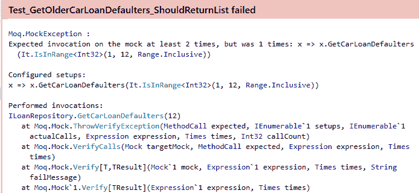
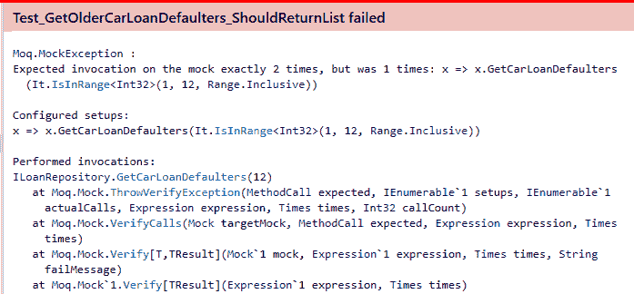
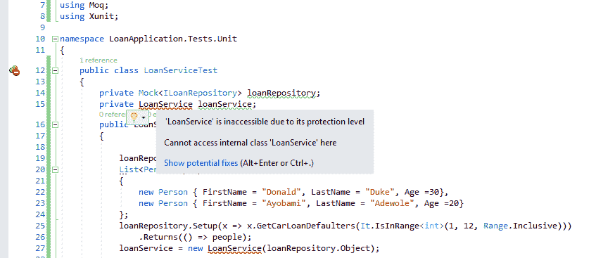

# 六、模拟的依赖性

在[第 5 章](5.html)、*数据驱动单元测试*中，我们讨论了使用 xUnit 框架进行数据驱动单元测试，该框架允许我们创建运行在来自不同来源的数据上的测试，例如平面文件、数据库或内联数据。 现在，我们将解释模拟依赖关系的概念，并探索如何使用 Moq 框架，使用用 Moq 创建的模拟对象，将正在测试的类与其依赖关系隔离开来。

无论是简单项目还是复杂项目，软件项目的代码库中通常存在对象依赖关系。 这是因为各种对象需要跨边界交互和共享信息。 然而，为了有效地对对象进行单元测试并隔离它们的行为，每个对象都必须进行隔离测试，而不考虑它对其他对象的依赖关系。

为了实现这一点，类中的依赖对象被替换为模拟对象，以允许被测试对象在隔离测试时有效，而不必经历构造依赖对象的痛苦， 它有时可能没有完全实现，或者在编写被测试对象时构造它是不切实际的。

**模拟对象**用于模拟或模拟真实对象，用于代码测试。 模拟对象用来代替真实对象; 它们是从真实的接口或类创建的，用于验证交互。 模拟对象是要测试的另一个类中引用的类的基本实例，用于模拟这些类的行为。 由于软件系统的组件需要交互和协作，所以使用模拟对象代替协作者。 使用模拟对象时，将验证用法是否正确，是否符合预期。 可以使用 mock 框架或库创建 mock，或者通过手写的 mock 对象为它们生成代码。

Moq 框架将在本章中详细探讨，并将用于创建模拟对象。 Moq 是一个功能齐全的 mock 框架，可以很容易地设置。 它可用于创建单元测试中使用的模拟对象。 Moq 有几个基本的和高级的功能，可以用来创建有用的模拟和编写良好的单元测试。

在本章中，我们将涵盖以下主题:

*   模仿对象的好处
*   模仿框架的缺点
*   手动滚动模拟 vs .使用 mocking 框架
*   使用 Moq 框架模拟对象

# 模仿对象的好处

在一个架构良好的软件系统中，通常有一些交互和协调的对象，以完成基于业务或自动化需求的一系列目标。 通常，这些对象是复杂的，并且依赖于其他外部组件或系统，如数据库、SOAP 或 REST 服务来进行数据和内部状态更新。

大多数开发人员都开始采用 TDD，因为实践它可以带来许多好处，而且他们意识到，编写没有 bug 且经过良好测试的高质量代码是程序员的责任。 然而，由于一些假设，一些开发人员反对模仿对象。 例如，向单元测试添加模拟对象会增加编写单元测试所需的总时间。 这个假设是错误的，因为使用模拟对象提供了几个好处，如下面的部分所述。

# 快速运行测试

单元测试的主要特征是它应该运行得非常快，并且即使在使用同一组数据多次执行时也应该给出一致的结果。 但是，为了有效地运行单元测试并维护高效且快速运行的单元测试的属性，重要的是在被测试代码中存在依赖项的地方设置模拟对象。

例如，在下面的代码片段中，`LoanRepository`类依赖于 Entity Framework 的`DbContext`类，它为数据库操作创建到数据库服务器的连接。 要为`LoanRepository`类中的`GetCarLoans`方法编写单元测试，就必须构造`DbContext`对象。 可以模拟`DbContext`对象，以避免每次为该类运行单元测试时打开和关闭数据库连接的昂贵操作:

```cs
public class LoanRepository
{
    private DbContext dbContext;

    public LoanRepository(DbContext dbContext)
    {
        this.dbContext=dbContext;
    }

    public List<CarLoan> GetCarLoans()
    {
        return dbContext.CarLoan;
    }
}
```

在软件系统中，基于需求，将需要访问外部系统，如大文件、数据库或 web 连接。 在单元测试中直接与这些外部系统交互增加了测试的运行时间。 因此，模拟这些外部系统以允许测试快速运行是可取的。 如果测试运行时间过长，显然会浪费生产时间，那么单元测试的好处就会丧失。 在这种情况下，开发人员可以在断言单元测试是浪费时间的情况下停止运行测试或完全停止单元测试。

# 依赖关系隔离

使用依赖项 mock，从技术上可以在代码中创建可以试验的依赖项的替代方案。 当您准备好依赖项的模拟实现时，您可以进行更改并隔离地测试更改的效果，因为测试将针对模拟对象而不是实际对象运行。

当您隔离了依赖关系之后，您就可以专注于正在运行的测试，从而将测试的范围限制在对测试真正重要的代码上。 从本质上说，通过缩小范围，您可以很容易地重构正在测试的代码以及测试本身，让您清楚地了解可以改进代码的区域。

为了在以下代码片段中单独测试`LoanRepository`类，可以模拟该类所依赖的`DbContext`对象。 这将把单元测试的范围限制到只有`LoanRepository`类:

```cs
public class LoanRepository
{
    private DbContext dbContext;

    public LoanRepository(DbContext dbContext)
    {
        this.dbContext=dbContext;
    }
}
```

此外，通过隔离依赖关系来保持较小的测试范围，可以使测试易于理解并便于维护。 通过不模仿依赖关系来增加测试的范围最终会使测试维护变得困难，并减少测试的高级详细覆盖。 由于必须对依赖项进行测试，由于范围的增加，这可能导致测试的细节较少。

# 重构遗留代码

遗留源代码是由您或其他人编写的代码，通常没有经过测试或使用旧的框架、架构或技术。 这样的代码库很难重写或维护。 有时，它可能是难以阅读和理解的复杂代码，因此很难更改。

当面临维护遗留代码库的艰巨任务时，特别是没有进行充分或适当测试的代码库，为此类代码编写单元测试可能非常困难，而且会浪费时间，并可能导致大量艰苦的工作。 但是，使用 mock 框架可以极大地简化重构过程，因为可以将编写的新代码与现有代码隔离开来，并使用 mock 对象进行测试。

# 广泛的测试覆盖率

通过模拟，您可以确定测试覆盖范围很广，因为您可以很容易地使用模拟对象来模拟可能的异常、执行场景和条件，否则如果没有模拟就很难做到这些。 例如，如果您有一个清除或删除数据库表的方法，那么在每次运行单元测试时，使用模拟对象测试该方法要比在活动数据库上运行它更安全。

# 模仿框架的缺点

虽然 mock 框架在 TDD 期间非常有用，因为它们通过使用模拟对象简化了单元测试，但是它们有一些局限性和缺点，可能会影响代码的设计，或者过度使用会导致创建包含不相关模拟对象的复杂测试。

# 接口爆炸

大多数模拟框架的体系结构都要求创建接口，以便模拟对象。 本质上，你不能直接模拟一个类; 它必须通过类实现的接口。 为了在单元测试期间模拟依赖项，将为每个要模拟的对象或依赖项创建一个接口，即使该接口在生产代码中不需要使用依赖项。 这会导致创建太多的接口，这种情况称为**接口爆炸**。

# 额外的复杂性

大多数模拟框架使用反射或创建代理来调用方法并创建单元测试中所需的模拟。 这个过程很慢，并且增加了单元测试过程的开销。 这是值得注意的，特别是当需要使用 mock 来模拟所有类和依赖项之间的交互时，这可能会导致一个 mock 返回其他 mock。

# 模拟爆炸

由于有几个 mock 框架可用，因此更容易熟悉 mock 概念并创建用于单元测试的 mock。 然而，开发人员可能开始过度模仿，在这种情况下，每个对象似乎都是模仿对象。 此外，拥有太多的模拟可能会导致编写脆弱的测试，使您的测试在接口更改时容易中断。 当您有太多的模拟时，这最终会减慢测试套件的速度，从而增加开发时间。

# 手动滚动模拟与使用 mock 框架

使用 mock 框架可以促进平滑的单元测试体验，特别是在单元测试带有依赖关系的代码部分时，其中创建了模拟对象并替换了依赖关系。 虽然使用 mock 框架更容易，但您有时可能更喜欢在单元测试中手动滚动模拟对象，而不会给项目或代码库增加额外的复杂性或额外的库。

手动卷模拟是为测试目的而创建的类，并用于替换生产对象。 这些创建的类将具有与生产类相同的方法，具有相同的定义和返回值，以便有效地模拟生产类，并在单元测试中作为依赖项的替代品。

# 模拟的概念

创建模拟的第一步应该是依赖项标识。 单元测试的目标应该是拥有干净的代码和运行得尽可能快且覆盖率高的测试。 您应该确定可能降低测试速度的依赖项。 它们是用于模仿的候选对象，例如，web 服务或数据库调用。

创建模拟对象的方法可以根据所模拟的依赖项的类型而有所不同。 但是，mock 的概念可以遵循以下基本概念:在调用方法时，模拟对象应该返回特定的预定义值。 应该有适当的验证机制，以确保调用模拟的方法，并且如果根据测试需求进行配置，模拟对象可以抛出异常。

了解模拟对象的类型对于有效地手摇模拟对象非常重要。 可以创建两种类型的模拟对象——动态模拟对象和静态模拟对象。 **动态对象**可以通过反射或代理类创建。 这类似于 mocking 框架的工作方式。 **静态模拟对象**可以通过拥有实现接口的类和实际的具体类(即要模拟的依赖项)来创建。 您实际上是在手动滚动模拟对象时创建静态模拟对象。

**反射**可用于创建模拟对象。 C# 中的反射是一个有用的构造，它允许您创建一个对象，该对象是一个类型的实例，还允许您获取或绑定一个类型到一个现有的对象，并调用该类型中的可用字段和方法。 此外，还可以使用反射创建描述模块和程序集的对象。

# 手摇模拟的好处

当您想要完全控制测试设置并指定测试设置的行为时，手动滚动模拟有时是一种有效的方法。 此外，当测试相对简单时，不可以使用 mock 框架; 最好是进行模拟并保持一切简单。

在使用 mock 框架时，对被模拟的实际对象进行更改将需要在使用模拟对象的任何地方对其进行更改。 这是因为对依赖项所做的更改将破坏测试。 例如，如果依赖对象上的方法名发生更改，则必须在动态模拟中进行更改。 因此，必须对代码库的几个部分进行更改。 使用手动卷模拟时，您只需要在某个点上进行更改，因为您可以控制提供给测试的方法。

# 模拟和存根

**mock**和**存根**都是相似的，因为它们用于替换类依赖关系或协作关系，大多数 mock 框架都提供了创建这两者的特性。 可以用与手卷 mock 相同的方式手卷存根。

那么，mock 和 stub 的真正区别是什么呢? mock 用于测试协作。 这包括验证实际协作者的期望。 模拟被编程为包含要接收的方法调用的详细信息的期望，而存根用于模拟协作者。 让我们用一个例子来进一步解释。

存根可以用来表示来自数据库的结果。 代替返回一组数据的数据库调用，可以创建一个 C# 列表，使用可以用于执行测试的数据。 如果测试的依赖关系交互之上的存根没有被验证，测试将只关心数据。

以下代码片段中的`LoanService`类有一个`GetBadCarLoans`方法，该方法接受要从数据库中检索的`Loan`对象列表:

```cs
public class LoanService
{    
    public List<Loan> GetBadCarLoans(List<Loan> carLoans)
    {
        List<Loan> badLoans= new List<Loan>();
        //do business logic computations on the loans
        return badLoans;
    }
}
```

`GetBadCarLoans`的测试方法,`Test_GetBadCarLoans_ShouldReturnLoans`,在以下代码片段使用存根,它是一个`Loan`列表对象作为一个参数传递到`GetBadCarLoans`的方法,而不是做一个数据库调用的列表`Loan``Test`用于对象类:

```cs
[Fact]
 public void Test_GetBadCarLoans_ShouldReturnLoans()
 {
    List<Loan> loans= new List<Loan>();
    loans.Add(new Loan{Amount=120000, Rate=12.5, ServiceYear=5, HasDefaulted=false});
    loans.Add(new Loan{Amount=150000, Rate=12.5, ServiceYear=4, HasDefaulted=true});
    loans.Add(new Loan{Amount=200000, Rate=12.5, ServiceYear=5, HasDefaulted=false});

    LoanService loanService= new LoanService();
    List<Loan> badLoans = loanService.GetBadCarLoans(loanDTO);
    Assert.NotNull(badLoans);
 }
```

以下代码片段中的`LoanService`类有一个`LoanRepository`DI，它连接到数据库以获取记录。 类有一个构造函数，其中注入了`ILoanRepository`对象。 `LoanService`类有一个`GetBadCarLoans`方法，该方法调用依赖项上的`GetCarLoan`方法，然后调用该方法从数据库中获取`Loan`对象列表:

```cs
public class LoanService
{
    private ILoanRepository loanRepository;

    public LoanService(ILoanRepository loanRepository)
    {
        this.loanRepository=loanRepository;
    }

    public List<Loan> GetBadCarLoans()
    {
        List<Loan> badLoans= new List<Loan>();
        var carLoans=loanRepository.GetCarLoans();
        //do business logic computations on the loans
        return badLoans;
    }
}
```

与使用存根时不同，mock 将验证是否调用了依赖项中的方法。 这意味着模拟对象将设置要在依赖项中调用的方法。 在以下代码片段中的`LoanServiceTest`类中，从`ILoanRepository`创建了一个模拟对象:

```cs
 public class LoanServiceTest
 {
        private Mock<ILoanRepository> loanRepository;
        private LoanService loanService;
        public LoanServiceTest()
        {
            loanRepository= new Mock<ILoanRepository>();
            List<Loan> loans = new List<Loan>
            {
                new Loan{Amount = 120000, Rate = 12.5, ServiceYear = 5, HasDefaulted = false },
                new Loan {Amount = 150000, Rate = 12.5, ServiceYear = 4, HasDefaulted = true },
                new Loan { Amount = 200000, Rate = 12.5, ServiceYear = 5, HasDefaulted = false }
            };
            loanRepository.Setup(x => x.GetCarLoans()).Returns(loans);
            loanService= new LoanService(loanRepository.Object);
        }

        [Fact]
        public void Test_GetBadCarLoans_ShouldReturnLoans()
        {
            List<Loan> badLoans = loanService.GetBadCarLoans();
            Assert.NotNull(badLoans);
        }
    }
```

在`LoanServiceTest`类的构造函数中，首先创建模拟对象返回的数据，然后创建在`loanRepository.Setup(x => x.GetCarLoans()).Returns(loans);`行中设置的方法。 然后将模拟对象传递给`LoanService`构造函数`loanService= new loanService(loanRepository.Object);`。

# 手卷模拟

我们可以手动滚动一个模拟对象来测试`LoanService`类。 要创建的模拟对象将实现`ILoanRepository`接口，并且仅用于单元测试，因为它在生产代码中不需要。 模拟对象将返回一个由`Loan`对象组成的列表，它将模拟对数据库的实际调用:

```cs
public class LoanRepositoryMock : ILoanRepository
{
    public List<Loan> GetCarLoans()
    {
        List<Loan> loans = new List<Loan>
        {
            new Loan{Amount = 120000, Rate = 12.5, ServiceYear = 5, HasDefaulted = false },
            new Loan {Amount = 150000, Rate = 12.5, ServiceYear = 4, HasDefaulted = true },
            new Loan { Amount = 200000, Rate = 12.5, ServiceYear = 5, HasDefaulted = false }
        };
        return loans;
    }
}
```

现在可以在`LoanService`类中使用创建的`LoanRepositoryMock`类来模拟`ILoanRepository`，而不是使用从模拟框架创建的模拟对象。 在`LoanServiceTest`类的构造函数中，`LoanRepositoryMock`类将被实例化并注入到`LoanService`类中，在`Test`类中使用:

```cs
public class LoanServiceTest
{
    private ILoanRepository loanRepository;
    private LoanService loanService;

    public LoanServiceTest()
    {
        loanRepository= new LoanRepositoryMock();
        loanService= new LoanService(loanRepository);
    }

    [Fact]
    public void Test_GetBadCarLoans_ShouldReturnLoans()
    {
        List<Loan> badLoans = loanService.GetBadCarLoans();
        Assert.NotNull(badLoans);
    }
}
```

因为使用`LoanRepositoryMock``ILoanRepository`接口的具体类,`LoanService`类的依赖,每当`GetCarLoans``ILoanRepository`接口调用方法,`LoanRepositoryMock`的`GetCarLoans`方法调用返回的数据所需的测试运行。

# 使用 Moq 框架模拟对象

选择用于模拟对象的模拟框架对于平稳的单元测试体验非常重要。 然而，这并没有成文的规则。 在选择测试中使用的模拟框架时，可以考虑模拟框架的一些因素和特性。

在选择 mock 框架时，性能和可用特性应该是首先考虑的因素。 您应该检查 mocking 框架创建 mock 的方式; 不能模拟使用继承、虚拟和静态方法的框架。 其他需要注意的特性可以是方法、属性、事件，即使框架支持 LINQ。

此外，没有什么比库的简单性和易用性更好的了。 您应该选择易于使用的框架，并提供可用特性的良好文档。 在本章的后续章节中，我们将使用 Moq 框架解释 mock 的其他概念，这是一个易于使用的强类型库。

在使用 Moq 时，模拟对象是使用反射为您创建的实际虚拟类，其中包含被模拟的接口中包含的方法的实现。 在 Moq 设置中，您将指定要 mock 的接口以及测试类有效运行测试所需的方法。

要使用 Moq，你需要通过 NuGet 包管理器或 NuGet 控制台安装这个库:

```cs
Install-Package Moq
```

为了解释 Moq 的 mocking，让我们创建一个带有两个方法的`ILoanRepository`接口:`GetCarLoan`，它以列表的形式从数据库中检索汽车贷款;`GetLoanTypes`，它返回一个对象列表:

```cs
public interface ILoanRepository
{
   List<LoanType> GetLoanTypes();
   List<Loan> GetCarLoans();
}
```

`LoanRepository`类使用实体框架作为数据访问和检索的 ORM，实现`ILoanRepository`。 这两种方法，`GetLoanTypes`和`GetCarLoans`，已经由`LoanRepository`类实现:

```cs
public class LoanRepository :ILoanRepository
{
    public List<LoanType> GetLoanTypes()
    {
        List<LoanType> loanTypes= new List<LoanType>();
        using (LoanContext context = new LoanContext())
        {
            loanTypes=context.LoanType.ToList();
        }
        return loanTypes;
    }

    public List<Loan> GetCarLoans()
    {
        List<Loan> loans = new List<Loan>();
        using (LoanContext context = new LoanContext())
        {
            loans = context.Loan.ToList();
        }
        return loans;
    }
}
```

让我们为`ILoanRepository`创建一个模拟对象来测试这两个方法，而不需要依赖于任何具体的类实现。

创建一个模拟对象很容易与 Moq:

```cs
Mock<ILoanRepository> loanRepository = new Mock<ILoanRepository>();
```

在前面的代码行中，创建了一个实现了`ILoanRepository`接口的模拟对象。 该对象可以作为`ILoanRepository`的常规实现使用，并注入到任何以`ILoanRepository`作为依赖项的类中。

# 模拟方法、属性和回调

在测试中使用模拟对象的方法之前，需要对它们进行设置。 这种设置最好是在创建模拟对象之后，在将对象注入需要依赖项的类之前，在测试类的构造函数中完成。

首先，必须创建要设置的方法返回的数据; 以下是测试中使用的虚拟数据:

```cs
List<Loan> loans = new List<Loan>
{
    new Loan{Amount = 120000, Rate = 12.5, ServiceYear = 5, HasDefaulted = false },
    new Loan {Amount = 150000, Rate = 12.5, ServiceYear = 4, HasDefaulted = true },
    new Loan { Amount = 200000, Rate = 12.5, ServiceYear = 5, HasDefaulted = false }
};
```

在设置方法时，返回的数据以及任何方法参数(如果适用)将被传递给它。 在下面的代码行中，使用作为返回数据传递的`Loan`对象的列表来设置`GetCarLoans`方法。 这意味着无论何时在单元测试中使用模拟对象调用`GetCarLoans`方法，之前创建的列表都将作为方法返回值返回:

```cs
Mock<ILoanRepository> loanRepository = new Mock<ILoanRepository>();
loanRepository.Setup(x => x.GetCarLoans()).Returns(loans);
```

您可以对方法返回值进行延迟计算。 这是使用 LINQ 时可用的语法糖:

```cs
loanRepository.Setup(x => x.GetCarLoans()).Returns(() => loans);
```

Moq 有一个`It`对象，它可以用来为正在建立的方法中的参数指定匹配条件。 `It`表示被匹配的参数。 假设`GetCarLoans`方法有一个字符串参数，`loanType,`方法设置的语法可以更改为包含参数和返回值:

```cs
loanRepository.Setup(x => x.GetCarLoans(It.IsAny<string>())).Returns(loans);
```

可以设置在每次调用时返回不同返回值的方法。 例如，`GetCarLoans`方法的设置可以在每次调用该方法时返回不同大小的列表:

```cs
Random random = new Random();
loanRepository.Setup(x => x.GetCarLoans()).Returns(loans).Callback(() => loans.GetRange(0,random.Next(1, 3));
```

在前面的代码片段中，在`1`和`3`之间生成一个随机数来设置。 这将确保`GetCarLoans`方法返回的列表的大小随着每次调用而变化。 第一次调用`GetCarLoans`方法时，将调用`Returns`方法，同时执行`Callback`中的代码，随后调用`GetCarLoans`方法。

最小起订量的一个特性是提供对例外情况的测试。 您可以设置该方法来测试异常。 在下面的方法设置中，`GetCarLoans`方法在被调用时抛出`InvalidOperationException`:

```cs
loanRepository.Setup(x => x.GetCarLoans()).Throws<InvalidOperationException>();
```

# 属性

如果有一个依赖项需要设置在方法调用中使用的属性，那么可以使用 Moq`SetupProperty`方法为这些属性设置虚拟值。 让我们为`ILoanRepository`接口添加两个属性`LoanType`和`Rate`:

```cs
public interface ILoanRepository
{
   LoanType LoanType{get;set;}
   float Rate {get;set;}

   List<LoanType> GetLoanTypes();
   List<Loan> GetCarLoans();
}
```

使用 Moq`SetupProperty`方法，你可以指定属性应该有一个行为，这本质上意味着无论何时请求该属性，`SetupProperty`方法中设置的值都会返回:

```cs
Mock<ILoanRepository> loanRepository = new Mock<ILoanRepository>();
loanRepository.Setup(x => x.LoanType, LoanType.CarLoan);
loanRepository.Setup(x => x.Rate, 12.5);
```

前面代码片段中的代码行将`LoanType`属性设置为 enum 值`CarLoan`，并将`Rate`设置为`12.5`。 每当在测试中请求属性时，设置的值将返回到调用点。

使用`SetupProperty`方法设置属性会自动将属性设置为存根，并允许跟踪属性的值，并为属性提供一个默认值。

此外，在设置属性时，可以使用`SetupSet`方法，该方法接受一个 lambda 表达式来指定调用属性设置器的类型，并允许您将值传递给表达式:

```cs
loanRepository.SetupSet(x => x.Rate = 12.5F);
```

与`SetupSet`相似的是`SetupGet`，它用于为属性 getter 调用指定类型上的设置:

```cs
loanRepository.SetupGet(x => x.Rate);
```

递归模拟允许您模拟复杂对象类型，特别是嵌套的复杂类型。 例如，您可能想要模拟`Loan`类型的`Person`复杂类型中的`Age`属性。 Moq 框架可以遍历这张图，以优雅的方式模拟属性:

```cs
loanRepository.SetupSet(x => x.CarLoan.Person.Age= 40);
```

您可以使用`SetupAllProperties`方法在一个 mock 上存根所有可用的属性。 此方法将指定模拟中的所有属性都有一个属性行为集。 通过为模拟中的每个属性生成默认值，默认属性是使用 Moq 框架的`Mock.DefaultProperty`属性生成的:

```cs
 loanRepository.SetupAllProperties();
```

# 匹配的参数

在使用 Moq 创建模拟对象时，可以匹配参数，以确保在测试期间传递预期的参数。 使用此特性，您可以在测试时调用方法时确定传入方法的参数的有效性。 这只适用于具有参数的方法，并且匹配将在方法设置期间完成。

使用 Moq 的`It`关键字，您可以在设置过程中为方法参数指定不同的表达式和验证。 让我们向`ILoanRepository`接口添加一个`GetCarLoanDefaulters`方法定义。 `LoanRepository`类中的实现接受一个整数参数，这是贷款的服务年，并返回汽车贷款违约者的列表。 方法代码如下所示:

```cs
public List<Person> GetCarLoanDefaulters(int year)
{
    List<Person> defaulters = new List<Person>();
    using (LoanContext context = new LoanContext())
    {
        defaulters = context.Loan.Where(c => c.HasDefaulted 
                     && c.ServiceYear == year).Select(c => c.Person).ToList();
    }
    return defaulters;
}
```

现在，让我们在`LoanServiceTest`构造器中设置`GetCarLoanDefaulters`方法，使用 Moq 的`It`关键字为`year`参数接受一个不同的值:

```cs
List<Person> people = new List<Person>
{
    new Person { FirstName = "Donald", LastName = "Duke", Age =30},
    new Person { FirstName = "Ayobami", LastName = "Adewole", Age =20}
};

Mock<ILoanRepository> loanRepository = new Mock<ILoanRepository>();
loanRepository.Setup(x => x.GetCarLoanDefaulters(It.IsInRange<int>(1, 5, Range.Inclusive))).Returns(people);
```

已经创建了一个对象列表`Person`，它将被传递给模拟设置的`Returns`方法。 `GetCarLoanDefaulters`方法现在将接受指定范围内的值，因为`It.IsInRange`方法已经使用了提供的上下限范围值。

在设置过程中，`It`类有其他有用的方法来指定方法的匹配条件，而不必指定特定的值:

*   `IsRegex`用于指定正则表达式来匹配字符串参数
*   `Is`用于指定与给定谓词匹配的值
*   `IsAny<>`用于匹配指定类型的任何值
*   `Ref<>`用于匹配`ref`参数中指定的任何值

您可以创建自定义匹配器并在方法设置中使用它。 例如，让我们为`GetCarLoanDefaulters`方法创建一个自定义匹配器`IsOutOfRange`，以确保不将大于`12`的值作为参数提供。 创建自定义匹配器是通过使用`Match.Create`:

```cs
public int IsOutOfRange() 
{ 
  return Match.Create<int>(x => x > 12);
}
```

创建的`IsOutOfRange`匹配器现在可以在模拟对象的方法设置中使用:

```cs
loanRepository.Setup(x => x.GetCarLoanDefaulters(IsOutOfRange())).Throws<ArgumentException>();
```

# 事件

Moq 有一个特性，允许您在模拟对象上引发事件。 要引发事件，可以使用`Raise`方法。 该方法有两个参数。 第一个是一个 Lambda 表达式，其中订阅了事件，以便在模拟中引发事件。 第二个参数提供一个将包含在事件中的参数。 要在带有空参数的`loanRepository`模拟对象上引发`LoanDefaulterNotification`事件，可以使用以下代码行:

```cs
Mock<ILoanRepository> loanRepository = new Mock<ILoanRepository>();
loanRepository.Raise(x => x.LoanDefaulterNotification+=null, EventArgs.Empty);
```

当您希望让模拟对象引发事件以响应操作或引发事件以响应方法调用时，将使用实际用例。 在 mock 上设置方法以允许引发事件时，mock 上的`Returns`方法被替换为`Raises`方法，这表明当在测试中调用方法时，应该引发一个事件:

```cs
loanRepository.Setup(x => x.GetCarLoans()).Raises(x=> x.LoanDefaulterNotification+=null, new LoanDefualterEventArgs{OK=true});
```

# 回调

使用 Moq 的`Callback`方法，您可以指定在调用方法之前和之后要调用的回调。 有些测试场景可能无法使用简单的模拟期望进行测试。 在这种复杂的场景中，可以在调用模拟对象时使用回调来执行特定的操作。 `Callback`方法接受一个动作参数，该参数将根据回调是在方法调用之前还是之后设置而执行。 操作可以是要计算的表达式，也可以是要调用的另一个方法。

例如，您可以设置一个回调，以便在调用特定方法后更改数据。 该特性允许您创建提供更多灵活性的测试，同时简化测试的复杂性。 让我们向`loanRepository`模拟对象添加一个回调。

回调函数可以是一个将要被调用的方法，也可以是一个你需要设置值的属性:

```cs
List<Person> people = new List<Person>
{
    new Person { FirstName = "Donald", LastName = "Duke", Age =30},
    new Person { FirstName = "Ayobami", LastName = "Adewole", Age =20}
};

Mock<ILoanRepository> loanRepository = new Mock<ILoanRepository>();

loanRepository.Setup(x => x.GetCarLoanDefaulters())
.Callback(() => CarLoanDefaultersCallbackAfter ())
.Returns(() => people)
.Callback(() => CarLoanDefaultersCallbackAfter());
```

前面的代码片段为方法设置设置了两个回调。 在调用实际的`GetCarLoanDefaulters`方法之前调用`CarLoanDefaultersCallback`方法，而`CarLoanDefaultersCallbackAfter`将在模拟对象上调用`GetCarLoanDefaulters`方法之后调用。 `CarLoanDefaultersCallback`向`List`添加一个新的`Person`对象，`CarLoanDefaultersCallback`移除列表中的第一个元素:

```cs
public void CarLoanDefaultersCallback()
{
    people.Add(new Person { FirstName = "John", LastName = "Doe", Age =40});
}

public void CarLoanDefaultersCallbackAfter()
{
    people.RemoveAt(0);
}
```

# 模拟定制

在使用 Moq 框架时，您可以进一步定制模拟对象，以增强有效的单元测试体验。 可以将`MockBehavior`enum 传递到 Moq 的`Mock`对象构造函数中，以指定 mock 的行为。 枚举成员为`Default`、`Strict`和`Loose`:

```cs
loanRepository= new Mock<ILoanRepository>(MockBehavior.Loose);
```

当选择`Loose`成员时，mock 将不会抛出任何异常。 将总是返回默认值。 这意味着引用类型将返回 null，而值类型将返回 0 或空数组和可枚举对象:

```cs
loanRepository= new Mock<ILoanRepository>(MockBehavior.Strict);
```

选择一个`Strict`成员将对没有正确设置的 mock 上的每个调用产生 mock 抛出异常。 最后，`Default`成员是 mock 的默认行为，它在技术上等同于`Loose`enum 成员。

# CallBase

`CallBase`，当在模拟构造过程中初始化时，用于指定如果没有匹配的设置，是否将为模拟依赖调用基类虚实现。 默认值为`false`。 这在模仿`System.Web`命名空间的 HTML/web 控件时很有用:

```cs
loanRepository= new Mock<ILoanRepository>{CallBase=true};
```

# 模拟库

而不是模拟对象创建代码散落在你的测试,你可以避免重复的代码通过使用`MockRepository`,可在 Moq 创建和验证模拟在一个位置,从而确保模拟配置可以通过设置`CallBase`,`DefaultValue`,`MockBehavior`和验证模拟在一个地方:

```cs
var mockRepository = new MockRepository(MockBehavior.Strict) { DefaultValue = DefaultValue.Mock };
var loanRepository = repository.Create<ILoanRepository>(MockBehavior.Loose);
var userRepository = repository.Create<IUserRepository>();
mockRepository.Verify();
```

在前面的代码片段中，使用`MockBehaviour.Strict`创建了一个模拟存储库，并创建了两个模拟对象，每个对象都使用`loanRepository`模拟，覆盖了存储库中指定的默认`MockBehaviour`。 最后一条语句是调用`Verify`方法，以验证存储库中创建的所有模拟对象的所有期望。

# 在一个模拟中实现多个接口

此外，您可以在一个 mock 中实现多个接口。 例如，我们可以创建一个实现`ILoanRepository`的 mock，然后使用`As<>`方法实现`IDisposable`接口，该方法用于向 mock 添加接口实现并为其指定设置:

```cs
var loanRepository = new Mock<ILoanRepository>();
loanRepository.Setup(x => x.GetCarLoanDefaulters(It.IsInRange<int>(1, 5, Range.Inclusive))).Returns(people);

loanRepository.As<IDisposable>().Setup(disposable => disposable.Dispose());
```

# 验证方法和属性调用与 Moq

模拟行为是在设置期间指定的。 这是对象和协作者的预期行为。 在进行单元测试时，mock 直到验证了所有被 mock 依赖项的调用才算完成。 了解方法被执行或属性被访问的次数是很有帮助的。

Moq 框架有有用的验证方法，可以用来验证模拟方法和属性。 此外，`Times`结构包含有用的成员，用于显示一个方法上允许的调用数量。

可以使用`Verify`方法来验证方法调用以及在模拟上执行的提供的参数是否匹配之前在模拟设置期间配置并与默认的`MockBehaviour`(即`Loose`)一起使用的参数。 为了解释 Moq 中的验证概念，让我们创建一个依赖于`ILoanRepository`数据的`LoanService`类，并向其添加一个方法`GetOlderCarLoanDefaulters`，以返回一个年龄大于`20`年的贷款违约者列表。 `ILoanRepository`通过构造函数注入`LoanService`:

```cs
public class LoanService
{
    private ILoanRepository loanRepository;
    public LoanService(ILoanRepository loanRepository)
    {
        this.loanRepository = loanRepository;
    }

    public List<Person> GetOlderCarLoanDefaulters(int year)
    {
        List<Person> defaulters = loanRepository.GetCarLoanDefaulters(year);
        var filteredDefaulters = defaulters.Where(x => x.Age > 20).ToList();
        return filteredDefaulters;
    }
}
```

为了测试`LoanService`类，我们将创建一个`LoanServiceTest`测试类，它使用依赖模拟来隔离`LoanService`以进行单元测试。 `LoanServiceTest`将包含一个构造函数，用于为`ILoanRepository`设置模拟，这是`LoanService`类所需要的:

```cs
public class LoanServiceTest
{
    private Mock<ILoanRepository> loanRepository;
    private LoanService loanService;
    public  LoanServiceTest()
    {
        loanRepository= new Mock<ILoanRepository>();
        List<Person> people = new List<Person>
        {
            new Person { FirstName = "Donald", LastName = "Duke", Age =30},
            new Person { FirstName = "Ayobami", LastName = "Adewole", Age =20}
        };
        loanRepository.Setup(x => x.GetCarLoanDefaulters(It.IsInRange<int>(1,12,Range.Inclusive))).Returns(() => people);
        loanService = new LoanService(loanRepository.Object);
   }
}
```

构造函数包含为`ILoanRepository`接口的`GetCarLoanDefaulters`方法设置的模拟，带有期望参数和返回值。 让我们创建一个测试方法`Test_GetOlderCarLoanDefaulters_ShouldReturnList`来测试`GetCarLoanDefaulters`。 在 assert 语句之后，有一个`Verify`方法来检查`GetCarLoanDefaulters`是否被调用过一次:

```cs
[Fact]
public void Test_GetOlderCarLoanDefaulters_ShouldReturnList()
{
    List<Person> defaulters = loanService.GetOlderCarLoanDefaulters(12);
    Assert.NotNull(defaulters);
    Assert.All(defaulters, x => Assert.Contains("Donald", x.FirstName));
    loanRepository.Verify(x => x.GetCarLoanDefaulters(It.IsInRange<int>(1, 12, Range.Inclusive)), Times.Once());
}
```

`Verify`方法有两个参数:要验证的方法和`Time`结构。 使用`Time.Once`，它指定被模拟的方法只应该被调用一次。

使用`Times.AtLeast(int callCount)`时，是为了指定在`callCount`参数值中指定的最小次数内调用一个被模拟的方法。 这可以用来验证一个方法被调用的次数:

```cs
[Fact]
public void Test_GetOlderCarLoanDefaulters_ShouldReturnList()
{
    List<Person> defaulters = loanService.GetOlderCarLoanDefaulters(12);
    Assert.NotNull(defaulters);
    Assert.All(defaulters, x => Assert.Contains("Donald", x.FirstName));
    loanRepository.Verify(x => x.GetCarLoanDefaulters(It.IsInRange<int>(1, 12, Range.Inclusive)), Times.AtLeast(2));
}
```

在前面的测试片段中，`Times.AtLeast(2)`被传递给`Verify`方法。 当运行测试时，`Moq.MoqException`将失败，因为`GetCarLoanDefaulters`方法在被测试的代码中只被调用一次:



`Times.AtLeastOnce`可用于指定至少调用一个模拟方法一次，这意味着该方法可以在被测试的代码中被多次调用。 我们可以修改`Test_GetOlderCarLoanDefaulters_ShouldReturnList`中的`Verify`方法，将第二个参数作为`Time.AtLeastOnce`，以在测试运行后验证`GetCarLoanDefaulters`在被测试的代码中至少调用了一次:

```cs
[Fact]
public void Test_GetOlderCarLoanDefaulters_ShouldReturnList()
{
    List<Person> defaulters = loanService.GetOlderCarLoanDefaulters(12);
    Assert.NotNull(defaulters);
    Assert.All(defaulters, x => Assert.Contains("Donald", x.FirstName));
    loanRepository.Verify(x => x.GetCarLoanDefaulters(It.IsInRange<int>(1, 12, Range.Inclusive)), Times.AtLeastOnce);
}
```

`Times.AtMost(int callCount)`可用于指定在测试代码中调用模拟方法的最大次数。 参数`callCount`用于传递方法的最大调用时间值。 这可以用来限制对模拟方法的调用。 如果该方法被调用的次数超过了指定的`callCount`值，则会引发 Moq 异常:

```cs
loanRepository.Verify(x => x.GetCarLoanDefaulters(It.IsInRange<int>(1, 12, Range.Inclusive)), Times.AtMost(1));
```

`Times.AtMostOnce`类似于`Time.Once`或`Time.AtLeastOnce`，但不同的是，mock 方法最多只能调用一次。 如果该方法被多次调用，则会抛出一个 Moq 异常，但如果该方法在代码运行时不被调用，则不会抛出异常:

```cs
loanRepository.Verify(x => x.GetCarLoanDefaulters(It.IsInRange<int>(1, 12, Range.Inclusive)), Times.AtMostOnce);
```

可以在`Verify`方法中使用`Times.Between(callCountFrom,callCountTo, Range)`来指定在`callCountFrom`和`callCountTo`之间调用模拟的方法，以及用于指定是否包含或排除指定范围的`Range`枚举:

```cs
loanRepository.Verify(x => x.GetCarLoanDefaulters(It.IsInRange<int>(1, 12, Range.Inclusive)), Times.Between(1,2,Range.Inclusive));
```

当您想要指定应该在指定的`callCount`处调用一个模拟的方法时，`Times.Exactly(callCount)`非常有用。 如果被 mock 的方法调用的次数少于指定的`callCount`，或者多于指定的`callCount`，那么将生成一个 Moq 异常，其中包含期望的详细描述以及失败的原因:

```cs
[Fact]
public void Test_GetOlderCarLoanDefaulters_ShouldReturnList()
{
    List<Person> defaulters = loanService.GetOlderCarLoanDefaulters(12);
    Assert.NotNull(defaulters);
    Assert.All(defaulters, x => Assert.Contains("Donald", x.FirstName));
    loanRepository.Verify(x => x.GetCarLoanDefaulters(It.IsInRange<int>(1, 12, Range.Inclusive)), Times.Exactly(2));
}
```

Let's check the code now:



同样重要的是`Times.Never`。 当使用时，它可以验证一个模拟方法从未被使用过。 当你不想调用一个被模拟的方法时，你可以使用这个:

```cs
loanRepository.Verify(x => x.GetCarLoanDefaulters(It.IsInRange<int>(1, 12, Range.Inclusive)), Times.Never);
```

模拟属性验证以与模拟方法相似的方式使用`VerifySet`和`VerifyGet`方法进行。 方法用于验证是否在模拟中设置了属性。 此外，`VerifyGet`方法用于验证是否在模拟中读取了属性，而不管属性中包含的值是多少:

```cs
loanRepository.VerifyGet(x => x.Rate);
```

要验证是否在 mock 上设置了属性，无论设置了什么值，都可以使用`VerifySet`方法，语法如下:

```cs
loanRepository.VerifySet(x => x.Rate);
```

有时，您可能需要验证是否为模拟上的属性分配了特定的值。 你可以通过在`VerifySet`方法中给属性赋值来验证:

```cs
loanRepository.VerifySet(x => x.Rate = 12.5);
```

Moq 4.8 中引入的`VerifyNoOtherCalls()`方法可以用来确定除了已经验证过的调用外，没有进行任何调用。 `VerifyAll()`方法用于验证所有的期望，不管它们是否被标记为可验证。

# LINQ to 模拟

**语言集成查询**(**LINQ**)是在.NET 4.0 中引入的语言结构，在.NET 框架中提供查询功能。 LINQ 有以声明式查询语法编写的查询表达式。 LINQ-LINQ 到 XML 有不同的实现，用于查询 XML 文档，LINQ 到实体，用于 ADO。 NET 实体框架操作，LINQ 对象用于查询.NET 集合、文件、字符串等。

在本章中，我们使用 Lambda 表达式语法创建了模拟对象。 Moq 框架中另一个令人兴奋的特性是**LINQ to mock**，它允许您使用类似于 LINQ 的语法来设置模拟。

LINQ to Mocks 对于简单的模拟和当您真正不关心验证时清除依赖关系非常有用。 可以使用`Of<>`方法创建指定类型的模拟对象。

你可以使用 LINQ to mock 在单个 mock 和递归 mock 上有多个设置，使用 LINQ 类似语法:

```cs
 var loanRepository = Mock.Of<ILoanRepository>
                    (x => x.Rate==12.5F &&
                         x.LoanType.Name=="CarLoan"&& LoanType.Id==3 );
```

在前面的模拟初始化中，在测试调用期间访问属性时，将`Rate`和`LoanType`属性设置为存根，并使用属性的默认值。

# 高级的 Moq 特性

有时候，Moq 提供的默认值可能不适合某些测试场景，您需要创建一个自定义的默认值生成方法来补充 Moq 当前提供的内容，即`DefaultValue.Empty`和`DefaultValue.Mock`。 这可以通过扩展`DefaultValueProvider`或`LookupOrFallbackDefaultValueProvider`来实现，它们在最小要求 4.8 及更高版本中可用:

```cs
public class TestDefaultValueProvider : LookupOrFallbackDefaultValueProvider
{
    public TestDefaultValueProvider()
    {
        base.Register(typeof(string), (type, mock) => string.empty);
        base.Register(typeof(List<>), (type, mock) => Activator.CreateInstance(type));
    }
}
```

`TestDefaultValueProvider`类创建了子类`LookupOrFallbackDefaultValueProvider`并为`string`和`List`实现默认值。 对于任何类型的`string`，将返回`string.empty`，并使用任意类型的`List`创建一个空列表。 `TestDefaultValueProvider`现在可以在模拟创建中使用，在`Mock`构造函数中:

```cs
var loanRepository = new Mock<ILoanRepository> { DefaultValueProvider = new TestDefaultValueProvider()};
var objectName = loanRepository.Object.Name;
```

前面代码片段中的`objectName`变量将包含一个零字符的字符串，因为`TestDefaultValueProvider`的实现指示应该给`string`类型分配一个空字符串。

# 模拟内部类型

根据项目需求，您可能需要为内部类型创建模拟对象。 C# 中的内部类型或成员只能在同一程序集中的文件中访问。 模拟内部类型可以通过向相关项目的`AssemblyInfo.cs`文件中添加自定义属性来完成。

如果包含内部类型的程序集还没有`AssemblyInfo.cs`文件，则可以添加该文件。 此外，如果程序集不是强命名的，则可以添加排除公钥的`InternalsVisibleTo`属性。 您必须指定与之共享可见性的项目的名称，在本例中应该是测试项目。

如果您将`LoanService`访问修饰符更改为内部，您将得到错误`LoanService`。 由于它的保护级别，它是不可访问的。 能够测试`LoanService`,不改变访问修饰符,然后将`AssemblyInfo.cs`文件添加到项目中,并添加所需的属性指定的测试项目名称为了分享大会,其中包含`LoanService`测试项目:



添加到`AssemblyInfo.cs`文件的属性如下所示:

```cs
[assembly:InternalsVisibleTo("LoanApplication.Tests.Unit")
```

# 总结

当与 xUnit.net 框架一起使用时，Moq 框架可以提供一个平滑的单元测试体验，并使整个 TDD 过程值得。 Moq 提供了强大的特性，如果有效地使用这些特性，可以简化对单元测试进行模拟的依赖项的创建。

使用 Moq 创建的模拟对象允许您在单元测试中替换已创建的模拟，以便隔离代码中的不同单元，以便进行测试和随后的重构，这有助于生成优雅的生产就绪代码。 此外，您还可以使用模拟对象来试验和测试依赖项中可用的特性，否则使用实时依赖项可能无法轻松实现这些特性。

在本章中，我们探讨了模拟的基础知识，以及在单元测试中广泛使用的模拟。 此外，我们配置了模拟来设置方法和属性并返回异常。 本文还解释了 Moq 库提供的一些其他特性，并介绍了模拟验证。

项目托管和持续集成将在下一章中讨论。 这将包括自动化测试运行的测试和企业方法，以确保能够提供关于代码覆盖率的质量反馈。