# 八、创建持续集成构建过程

持续的反馈、频繁的集成和及时的部署，这些都是持续集成实践的结果，可以大大降低与软件开发过程相关的风险。 开发团队可以提高生产力，减少部署所需的时间，并从 CI 中获得巨大的好处。

在[第七章](7.html),*持续集成和项目举办*,我们建立了 TeamCity,一个健壮的持续集成工具,可以简化和自动化管理源代码签到和变化的过程中,软件项目测试,构建和部署。 我们浏览了 TeamCity 中构建步骤的创建过程，并将其连接到 GitHub 中的`LoanApplication`项目中。 TeamCity 有内置功能，允许它连接到 GitHub 或 Bitbucket 上的软件项目。

CI 流程将许多不同的步骤组合成一个易于重复的流程。 这些步骤根据软件项目类型而有所不同，但是有一些步骤是通用的，并且适用于大多数项目。 这些步骤可以使用构建自动化系统来自动化。

在本章中，我们将配置 TeamCity 来使用一个叫做**Cake**的跨平台构建自动化系统，来清理、构建和恢复包依赖关系，并测试`LoanApplication`解决方案。 在本章的后面，我们将通过 Visual Studio Team Services**中的 Cake 任务来探索构建步骤的创建。 我们将涵盖以下议题:**

*   安装蛋糕引导程序
*   用 C# 编写构建脚本
*   Visual Studio 的蛋糕扩展
*   使用 Cake 任务构建步骤
*   与 Visual Studio 团队服务的 CI

# 安装蛋糕引导程序

**Cake**是一个跨平台的构建自动化框架。 它是一个构建自动化框架，用于编译代码、运行测试、复制文件和文件夹以及运行与构建相关的任务。 Cake 是开源的，源代码托管在 GitHub 上。

Cake 具有使使用文件系统路径变得容易的特性，并且具有操作 XML、启动进程、I/O 操作和解析 Visual Studio 解决方案的功能。 使用与 Cake 构建相关的活动可以使用 C# 领域特定的语言来自动化。

它为构建自动化使用基于依赖的编程模型，通过该模型，任务和任务之间的依赖一起声明。 基于依赖的模型是理想的，并且适合于构建自动化，因为大多数自动化构建步骤是幂等的。

蛋糕是真正的跨平台; 它的 NuGet 包，Cake。 CoreCLR，允许它运行在 Windows, Linux 和 Mac 使用。net Core。 它有一个 NuGet 包，可以依靠。net Framework 4.6.1 在 Windows 上运行。 此外，它可以使用 Mono 框架在 Linux 和 Max 上运行，推荐使用 Mono 版本 4.4.2。

不管使用的是哪种 CI 工具，Cake 在所有支持的工具中都具有一致的行为。 它广泛支持构建期间使用的大多数工具，包括**MSBuild**、**ILMerge**、**Wix**和**Signtool**。

# 安装

为了使用 Cake Bootstrapper，需要安装 Cake。 安装 Cake 并测试运行安装的简单方法是克隆或下载一个`.zip`文件，它是位于:[https://github.com/cake-build/example](https://github.com/cake-build/example)的 Cake 构建示例存储库。 示例存储库包含一个简单的项目和运行 Cake 脚本所需的所有文件。

在示例存储库中，有一些感兴趣的文件——`build.ps1`和`build.sh`。 它们是引导程序脚本，确保需要的依赖与蛋糕和必要的文件安装在一起。 这些脚本使调用 Cake 变得更容易。 `build.cake`文件是构建脚本; 构建脚本可以重命名，但是引导程序将在默认情况下定位`build.cake`文件。 `tools.config`/`packages.config`文件是指导引导程序脚本的包配置，引导程序脚本将 NuGet 包安装在`tools`文件夹中。

解压缩下载的示例存储库归档文件。 在 Windows 上，打开 PowerShell 提示符并通过运行`.\build.ps1`来执行引导程序脚本。 在 Linux 和 Mac 上，打开终端并运行`.\build.sh`。 引导程序脚本将检测到 Cake 没有安装在计算机上，并自动从 NuGet 下载它。

基于 bootstrapper 脚本的执行，在完成 Cake 下载后，下载的示例`build.cake`脚本将运行，它将清理输出目录，并在构建项目之前恢复引用的 NuGet 包。 当`build.cake`文件运行时，它应该清理测试项目、恢复 NuGet 包并在项目中运行单元测试。 `Run Settings`和`Test Run Summary`将会如下截图所示:


可以从 GitHub([https://github.com/cake-build/resources](https://github.com/cake-build/resources))托管的*Cake Resources*存储库下载安装 Cake Bootstrapper，其中包含配置文件和 Bootstrapper。 引导程序将下载 Cake 和构建脚本所需的必要工具，从而避免在源代码存储库中存储二进制文件。

# PowerShell 安全

通常，PowerShell 可以阻止`build.ps1`文件的运行。 您可能会在 PowerShell 屏幕上得到一个错误，即`build.ps1`无法加载，因为系统上禁用了运行脚本。 运行文件时的这种限制是由于 PowerShell 中提供的默认安全设置。

打开 PowerShell 窗口并将目录更改为前面下载的 Cake 构建示例存储库的文件夹，然后运行`.\build.ps1`命令。 如果系统上的执行策略没有从默认值更改，这应该会给你以下错误:

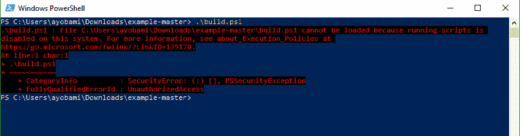

在 PowerShell 界面执行`Get-ExecutionPolicy -List`命令可以查看系统当前的执行策略配置; 该命令将显示一个包含可用范围和执行策略的表，如下面的屏幕所示。 基于你运行 PowerShell 的方式，你可能在你的实例上有不同的设置:

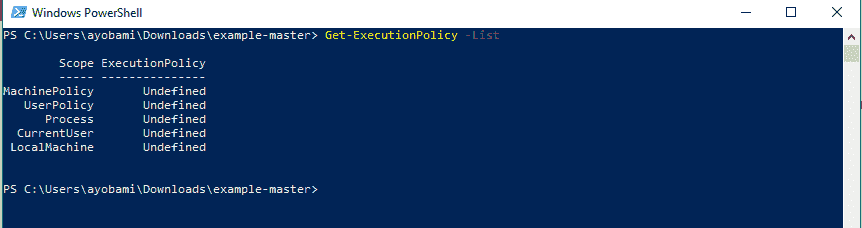

要更改执行策略以允许脚本随后运行，请运行`Set-ExecutionPolicy RemoteSigned -Scope Process`命令，该命令旨在将进程范围从 undefined 更改为`RemoteSigned`。 运行该命令将在 PowerShell 屏幕上显示一个警告，并提示您的 PC 可能面临安全风险。 输入*Y*为 Yes，然后按*输入*。 下面的屏幕截图显示了运行该命令时 PowerShell 屏幕上显示的内容:

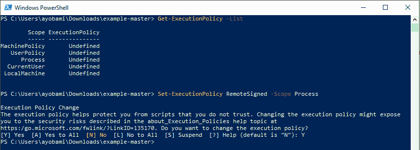

这将改变 PC 的执行策略，并允许 PowerShell 脚本运行。

# 蛋糕 Bootstrapper 安装步骤

安装 Cake Bootstrapper 的步骤在不同平台上是相似的，但差别不大。 请执行以下步骤建立引导程序。

# 步骤 1

导航到 Cake 资源存储库来下载 boostrapper。 对于 Windows，下载 PowerShell`build.ps1`文件，对于 Mac 和 Linux，下载`build.sh`bash 文件。

在 Windows 操作系统下，打开新的 PowerShell 窗口，执行如下命令:

```cs
Invoke-WebRequest https://cakebuild.net/download/bootstrapper/windows -OutFile build.ps1
```

在 Mac 上，从一个新的 shell 窗口运行以下命令:

```cs
curl -Lsfo build.sh https://cakebuild.net/download/bootstrapper/osx
```

在 Linux 操作系统中，打开新的 shell 运行如下命令:

```cs
curl -Lsfo build.sh https://cakebuild.net/download/bootstrapper/linux
```

# 步骤 2

创建一个 Cake 脚本来测试安装。 创建一个`build.cake`文件; 应与`build.sh`文件放在相同的位置:

```cs
var target = Argument("target", "Default");

Task("Default")
  .Does(() =>
{
  Information("Installation Successful");
});

RunTarget(target);
```

# 步骤 3

在*步骤 2*中创建的 Cake 脚本现在可以通过调用 Cake Bootstrapper 来运行。

在 Windows 上，您需要指示 PowerShell 允许运行脚本，这可以通过更改 Windows PowerShell 脚本执行策略来实现。 由于执行策略的原因，PowerShell 脚本执行可能会失败。

使用实例执行 Cake 脚本:

```cs
./build.ps1
```

在 Linux 或 Mac 上，您应该运行以下命令，以赋予当前所有者执行脚本的权限:

```cs
chmod +x build.sh
```

一旦运行了命令，就可以调用引导程序来运行在*步骤 2*中创建的 Cake 脚本:

```cs
./build.sh
```

# 用 C# 编写构建脚本

使用 Cake 自动化构建和部署任务，可以避免与项目部署相关的问题和头痛。 构建脚本通常包含构建和部署源代码以及配置文件和项目的其他构件所需的步骤和逻辑。

使用 Cake 资源存储库中可用的示例`build.cake`文件可以作为为项目编写构建脚本的起点。 然而，为了实现更多的目标，我们将介绍一些基本的 Cake 概念，这些概念可以促进编写用于自动化构建和部署任务的健壮脚本。

# 任务

使用 Cake 构建自动化的核心是任务。 Cake 中的**任务**是一个简单的工作单元，用来按照需要的定义顺序执行一个特定的行动或活动。 Cake 中的任务可以具有指定的标准、关联的依赖关系和错误处理。

任务可以通过使用`Task`方法定义，并将任务名称或标题作为参数传递给它:

```cs
Task("Action")
    .Does(() =>
{
    // Task code goes here
});
```

例如，以下代码片段中的`build`任务会清理`debugFolder`文件夹以删除内容。 当任务运行时，`CleanDirectory`方法将被调用:

```cs
var debugFolder = Directory("./bin/Debug");

Task("CleanFolder")
    .Does(() =>
{
    CleanDirectory(debugFolder);
});
```

Cake 允许你使用 C# 在任务中使用 async 和 await 特性来创建异步任务。 本质上，任务本身将与单个线程同步运行，但任务中包含的代码可以从异步编程特性中受益，并利用异步 api。

Cake 具有`DoesForEach`方法，可用于添加项集合或将项集合作为操作生成到任务的委托。 当一个委托被添加到一个任务时，该委托将在任务执行后执行:

```cs
Task("LongRunningTask")
    .Does(async () => 
    {
        // use await keyword to multi thread code
    }); 
```

通过将其链接到`Task`方法来定义`DoesForEach`，如下所示:

```cs
Task("ProcessCsv")
    .Does(() => 
{ 
})
.DoesForEach(GetFiles("**/*.csv"), (file) => 
{ 
    // Process each csv file. 
});
```

# TaskSetup 和 TaskTeardown

`TaskSetup`和`TaskTeardown`用于包装代码，以执行您希望构建在每个任务执行之前和之后执行的操作。 这些方法在执行配置初始化和自定义日志记录等操作时特别有用:

```cs
TaskSetup(setupContext =>
{
    var taskName =setupContext.Task.Name;
    // perform action
});

TaskTeardown(teardownContext =>
{
    var taskName =teardownContext.Task.Name;
    // perform action
});
```

与任务的`TaskSetup`和`TaskTeardown`类似，Cake 有`Setup`和`Teardown`方法，可用于执行打算在第一个任务之前和最后一个任务之后运行的操作。 这些方法在构建自动化中非常有用，例如，当您打算在运行任务之前启动一些服务器和服务，并在之后启动清理活动时，这些方法是很好的用例。 在`RunTarget`之前调用`Setup`或`Teardown`方法，以确保它们正常工作:

```cs
Setup(context =>
{
    // This will be executed BEFORE the first task.
});

Teardown(context =>
{
    // This will be executed AFTER the last task.
});
```

# 配置和预处理指令

可以通过使用环境变量、配置文件以及向 Cake 可执行文件传递参数来控制 Cake 操作。 这是基于一个指定的优先级，在该优先级中，配置文件覆盖传递到 Cake 的环境变量和参数，然后覆盖在环境变量和配置文件中定义的条目。

例如，如果您打算指定工具路径，即恢复工具时 cake 检查的目录，您可以创建`CAKE_PATHS_TOOLS`环境变量名并将其值设置为 cake tools 文件夹路径。

当使用配置文件时，该文件应该与`build.cake`文件放在相同的目录中。 Cake 工具的路径可以在配置文件中指定，就像下面的代码片段，它覆盖了在环境变量中设置的任何内容:

```cs
[Paths]
Tools=./tools
```

Cake 工具路径可以直接传递给 Cake，这将覆盖在环境变量和配置文件中的设置:

```cs
cake.exe --paths_tools=./tools
```

如果没有使用任何配置 Cake 的方法覆盖配置条目，那么 Cake 具有默认为配置条目使用的值。 这里显示了可用的配置项及其默认值，以及如何使用配置方法配置它们:

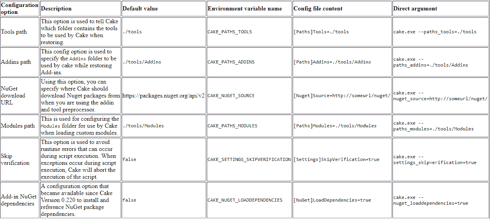

预处理器指令在 Cake 中用于引用程序集、名称空间和脚本。 预处理器行指令在脚本执行之前运行。

# 依赖关系

通常，你会创建一些任务，这些任务的执行取决于其他任务的完成; 要实现这一点，可以使用`IsDependentOn`和`IsDependeeOf`方法。 要创建一个依赖于另一个任务的任务，请使用`IsDependentOn`方法。 在下面的构建脚本中，Cake 将在`Task2`执行之前执行`Task1`:

```cs
Task("Task1")
    .Does(() =>
{
});

Task("Task2")
    .IsDependentOn("Task1")
    .Does(() =>
{
});

RunTarget("Task2");
```

使用`IsDependeeOf`方法，您可以定义具有反向关系的任务依赖关系。 这意味着在该任务中定义了依赖于该任务的任务。 前面的构建脚本可以重构为使用反向关系:

```cs
Task("Task1")
    .IsDependeeOf("Task2")
    .Does(() =>
{
});

Task("Task2")
    .Does(() =>
{
});

RunTarget("Task2");
```

# 标准

当在 Cake 脚本中使用标准时，它允许您控制构建脚本的执行流。 **标准**是执行任务必须满足的谓词。 该标准不影响后续任务的执行。 Criteria 用于根据指定的配置、环境状态、存储库分支和任何其他所需选项控制任务执行。

在最简单的形式中，您可以使用`WithCriteria`方法来指定特定任务的执行标准。 例如，如果您想只在下午清理`debugFolder`文件夹，您可以在以下脚本中指定条件:

```cs
var debugFolder = Directory("./bin/Debug");

Task("CleanFolder")
    .WithCriteria(DateTime.Now.Hour >= 12)
    .Does(() =>
{
    CleanDirectory(debugFolder);
});

RunTarget("CleanFolder");
```

你可以有一个任务，它的执行依赖于另一个任务; 在下面的脚本中，`CleanFolder`任务的标准将在创建任务时设置，而`ProcessCsv`任务评估的标准将在任务执行时执行:

```cs
var debugFolder = Directory("./bin/Debug");

Task("CleanFolder")
    .WithCriteria(DateTime.Now.Hour >= 12)
    .Does(() =>
{
    CleanDirectory(debugFolder);
});

Task("ProcessCsv")
    .WithCriteria(DateTime.Now.Hour >= 12)
    .IsDependentOn("CleanFolder")
    .Does(() => 
{ 
})
.DoesForEach(GetFiles("**/*.csv"), (file) => 
{ 
    // Process each csv file. 
});

RunTarget("ProcessCsv");
```

一个更有用的用例是编写一个带有检查本地构建和执行清理、构建和部署项目的操作标准的 Cake 脚本。 将定义四个任务，每个任务对应一个要执行的操作，第四个任务将这些操作连接在一起:

```cs
var isLocalBuild = BuildSystem.IsLocalBuild
Task("Clean")
    .WithCriteria(isLocalBuild)
    .Does(() =>
    {
        // clean all projects in the soution
    });

Task("Build")   
    .WithCriteria(isLocalBuild)
    .Does(() =>
    {    
        // build all projects in the soution
    });

Task("Deploy")    
    .WithCriteria(isLocalBuild)
    .Does(() => 
    {
        // Deploy to test server
    });    

Task("Main")
    .IsDependentOn("Clean")
    .IsDependentOn("Build")
    .IsDependentOn("Deploy")    
    .Does(() => 
    {
    });
RunTarget("Main");
```

# 蛋糕的错误处理，最后块

Cake 具有错误处理技术，您可以使用这些技术从错误中恢复或在构建过程中发生异常时妥善处理异常。 有时构建步骤调用外部服务或流程; 调用这些外部依赖关系可能会导致导致整体构建失败的错误。 一个健壮的构建应该在不停止整个构建过程的情况下处理此类异常。

`OnError`方法是一个任务扩展，当您需要对构建中生成的异常执行操作时使用它。 不需要强制终止脚本，你可以在`OnError`方法中编写代码来处理错误:

```cs
Task("Task1")
.Does(() =>
{
})
.OnError(exception =>
{
    // Code to handle exception.
});
```

有时你可能想忽略抛出的错误，只是继续执行生成异常的任务; 您可以使用`ContinueOnError`任务扩展来实现这一点。 当使用`ContinueOnError`方法时，不能使用`OnError`方法:

```cs
Task("Task1")
    .ContinueOnError()
    .Does(() =>
{
});
```

如果您希望报告在任务中生成的异常，并且仍然允许该异常传播并继续其过程，请使用`ReportError`方法。 如果由于任何原因，在`ReportError`方法中抛出了一个异常，它将被吞下去:

```cs
Task("Task1")
    .Does(() =>
{
})
.ReportError(exception =>
{  
    // Report generated exception.
});
```

此外，您可以使用`DeferOnError`方法将任何抛出的异常延迟到任务执行完成。 这将确保任务在抛出异常和脚本失败之前执行其中指定的所有操作:

```cs
Task("Task1")
    .Does(() => 
{ 
})
.DeferOnError();
```

最后，您可以使用`Finally`方法来执行任何操作，而不考虑任务执行的结果:

```cs
Task("Task1")
    .Does(() =>
{
})
.Finally(() =>
{  
    // Perform action.
});
```

# LoanApplication 构建脚本

为了演示 Cake 的强大功能，让我们编写一个 Cake 脚本来构建`LoanApplication`项目。 Cake 脚本将清理项目文件夹，恢复所有包引用，构建整个解决方案，并在解决方案中运行单元测试项目。

下面的脚本设置了在整个脚本中使用的参数，定义了清理`LoanApplication.Core`项目的`bin`文件夹的目录和任务，并使用`DotNetCoreRestore`方法恢复包。 可以使用`DotNetCoreRestore`方法恢复 NuGet 包，该方法使用`dotnet restore`命令:

```cs
//Arguments
var target = Argument("target", "Default");
var configuration = Argument("configuration", "Release");
var solution = "./LoanApplication.sln";

// Define directories.
var buildDir = Directory("./LoanApplication.Core/bin") + Directory(configuration);

//Tasks
Task("Clean")
    .Does(() =>
{
    CleanDirectory(buildDir);
});

Task("Restore-NuGet-Packages")
    .IsDependentOn("Clean")
    .Does(() =>
{
    Information("Restoring NuGet Packages");
    DotNetCoreRestore();
});
```

脚本的后面部分包含使用`DotNetCoreBuild`方法构建整个解决方案的任务，该方法使用`dotnet build`命令，使用`DotNetCoreBuildSettings`对象中提供的设置构建解决方案。 测试项目使用`DotNetCoreTest`方法执行，该方法使用`dotnet test`和`DotNetCoreTestSettings`对象中提供的设置运行解决方案中所有测试项目中的测试:

```cs
Task("Build")
    .IsDependentOn("Restore-NuGet-Packages")
    .Does(() =>
{
    Information("Build Solution");
    DotNetCoreBuild(solution,
           new DotNetCoreBuildSettings()
                {
                    Configuration = configuration
                });    
});

Task("Run-Tests")
    .IsDependentOn("Build")
    .Does(() =>
{
     var testProjects = GetFiles("./LoanApplication.Tests.Units/*.csproj");
        foreach(var project in testProjects)
        {
            DotNetCoreTool(
                projectPath: project.FullPath, 
                command: "xunit", 
                arguments: $"-configuration {configuration} -diagnostics -stoponfail"
            );
        }        
});

Task("Default")
    .IsDependentOn("Run-Tests");

RunTarget(target);
```

通过从 PowerShell 窗口调用 Bootstrapper，可以使用 Cake`build`来运行这个文件。 当 bootstrapper 被调用时，Cake 将使用`build`文件中可用的任务定义来开始执行所定义的构建任务。 当执行开始时，执行的进度和状态会显示在 PowerShell 窗口中:


每个任务的执行进度将显示在 PowerShell 窗口中，其中包括 Cake 当前正在进行的所有活动。 当构建执行完成时，脚本中每个任务的执行持续时间将与所有任务的总执行时间一起显示:


# 蛋糕扩展 Visual Studio

**Cake Extension for Visual Studio Add-in**为 Visual Studio 带来了对 Cake 构建脚本的语言支持。 该扩展支持新模板，任务运行器资源管理器，以及引导 Cake 文件的能力。 **VisualStudio 的蛋糕扩展**可以在**VisualStudio Market Place**([https://marketplace.visualstudio.com/items?itemName=vs-publisher-1392591.CakeforVisualStudio](https://marketplace.visualstudio.com/items?itemName=vs-publisher-1392591.CakeforVisualStudio))下载。

从市场上下载的`.vsix`文件本质上是一个`.zip`文件。 该文件包含要在 Visual Studio 中安装的 Cake 扩展名的内容。 当下载的`.vsix`文件运行时，它将安装 Visual Studio 2015 和 2017 的 Cake 支持:


# 蛋糕的模板

安装扩展后，创建新项目时，一个**蛋糕模板**将被添加到 Visual Studio 的可用选项中。 该扩展将添加四个不同的蛋糕项目模板类型:

*   **蛋糕丁**:这是一个创建蛋糕丁的项目模板
*   **Cake Addin 单元测试项目**:这是为 Cake Addin 创建单元测试的项目模板，它包含了一些示例作为指导
*   **Cake Addin 单元测试项目(空的)**:这是用于为 Cake Addin 创建单元测试的项目模板，但不包括示例
*   **Cake 模块**:该模板用于创建 Cake 模块，并附带示例

下图展示了不同的 Cake 项目模板:

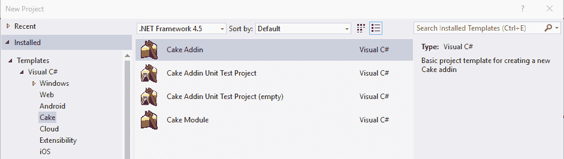

# 任务跑探险家

在使用 Cake 脚本进行构建自动化的 Visual Studio 解决方案中，当发现`build.cake`文件时，将触发 Cake 任务运行器。 Cake Extension 激活**Task Runner Explorer**集成，它允许你使用 Visual Studio 中直接包含的绑定运行 Cake 任务。

要打开任务运行程序管理器，右键单击蛋糕脚本(`build.cake`文件)，并从显示的上下文菜单中选择任务运行程序管理器; 它应该会打开任务运行器资源管理器，其中包含窗口中列出的 Cake 脚本中所有可用的任务:

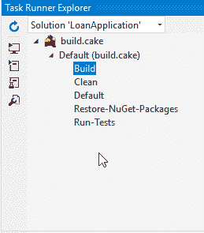

有时，当您右键单击蛋糕脚本时，任务运行器资源管理器可能不会显示在上下文菜单中。 如果是，单击视图菜单，选择其他 Windows，然后选择任务运行器资源管理器打开它:

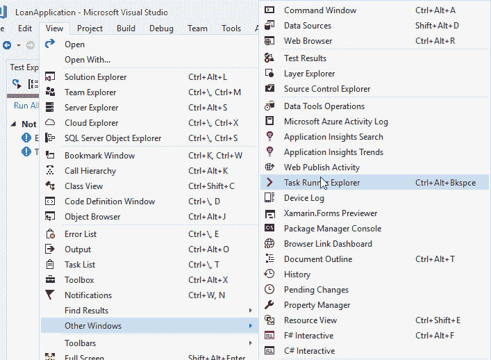

作为安装 Cake Extension 的结果，Visual Studio 的 Build 菜单现在将有一个 Cake Build 条目，它可以用来安装 Cake 配置文件、PowerShell 引导程序和 Bash 引导程序(如果它们还没有在解决方案中配置的话):

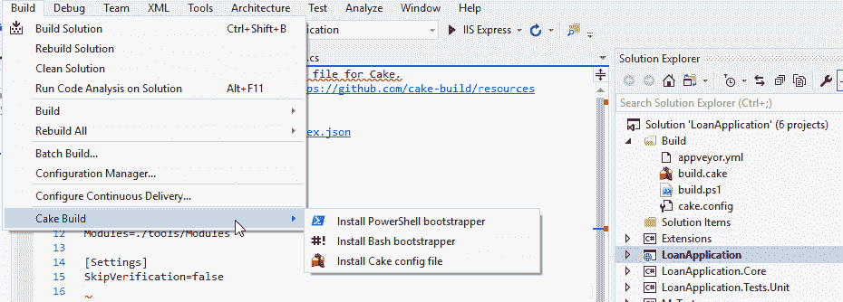

现在，您可以通过双击任务运行器或右键单击它并选择 Run，直接从任务运行器资源管理器执行每个任务。 任务执行进度将在任务运行器浏览器中显示:

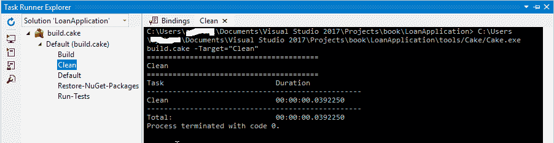

# 语法高亮显示

蛋糕扩展为 Visual Studio 添加了一个语法高亮功能。 这是 ide 的一个常见特性，其中源代码以不同的格式、颜色和字体呈现。 源代码突出显示是基于定义的组、类别和节来完成的。

安装扩展后，在 Visual Studio 中可以打开任何带有`.cake`扩展名的文件，并具有完整的任务和语法高亮显示。 目前 Visual Studio 中没有对`.cake`脚本文件的智能感知支持; 该特性预计将在稍后推出。

下面的截图显示了 Visual Studio 中`build.cake`文件的语法高亮显示:

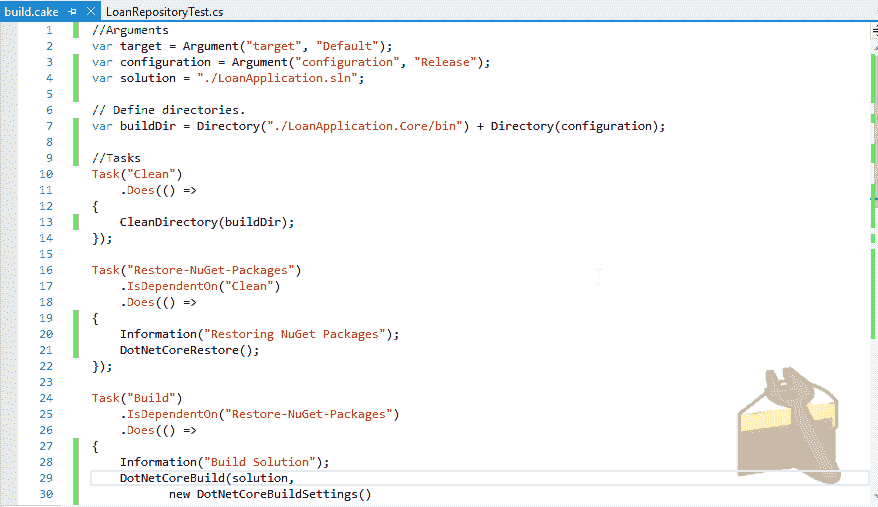

# 使用 Cake 任务构建步骤

使用任务运行器资源管理器运行用蛋糕脚本编写的构建任务更容易、更方便。 这通常通过 Visual Studio 的 Cake 扩展或直接调用 Cake 引导文件来完成。 然而，还有一种更有效的替代方法，即使用 TeamCity CI 工具运行 Cake 构建脚本。

TeamCity 构建步骤可以作为构建步骤执行过程的一部分来执行 Cake 脚本。 让我们创建一个构建步骤，通过以下步骤执行`LoanApplication`项目的 Cake 脚本:

*   单击“添加构建步骤”以打开“新建构建步骤”窗口。
*   在 Runner 类型中，选择 PowerShell，因为 Cake 引导程序文件将被 PowerShell 调用。
*   在文本字段中为构建步骤提供一个描述性名称。
*   在脚本选项中，选择文件。 这是因为它是一个将要被调用的`.ps1`文件，而不是一个直接的 PowerShell 脚本。
*   要选择脚本文件，单击树图标; 这将加载 GitHub 上的项目中可用的文件和文件夹。 在显示文件列表中选择`build.ps1`文件。
*   点击 Save 按钮保存更改并创建构建步骤:

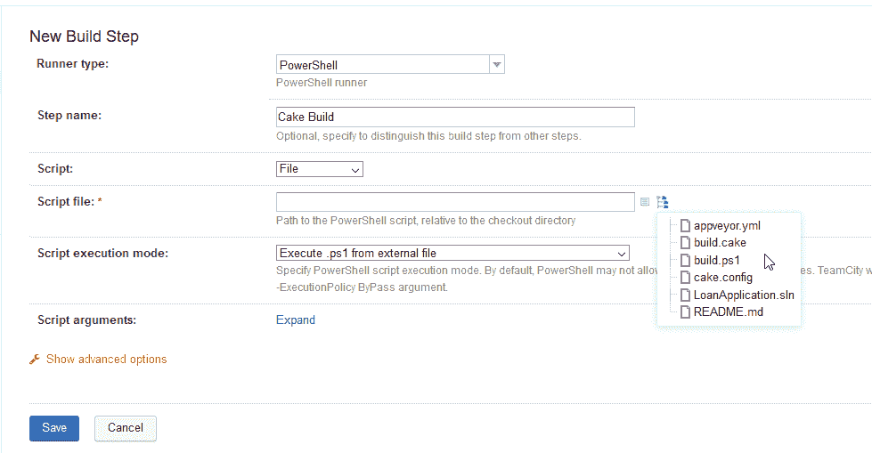

新的构建步骤应该出现在 TeamCity 中为项目配置的可用构建步骤列表中。 在“参数描述”选项卡中，关于构建步骤的信息将显示运行器类型和要执行的 PowerShell 文件，如下图所示:

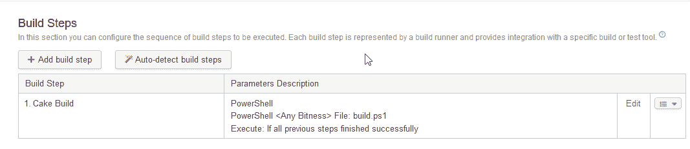

# 与 Visual Studio 团队服务的 CI

**Microsoft Visual Studio Team Services**(**VSTS**)是**Team Foundation Server**(**TFS**)的云版本。 它提供了很好的特性，允许开发人员在软件项目开发中进行协作。 与 TFS 类似，它通过增强与远程站点的连接性，提供了简单和简化的服务器管理体验。

VSTS 为实践 CI 和**连续交付**(**CD**)的开发团队提供了丰富的经验。 它支持用于源代码控制的 Git 存储库、易于理解的报告和用于监视软件项目总体进展的可定制仪表板。

此外，它还拥有内置的特性和工具，用于构建和发布管理、计划和跟踪项目、管理代码缺陷以及使用*看板*和*Scrum*方法的问题。 它同样拥有一个内置的 wiki，用于开发团队的信息传播。

你通过互联网连接到 VSTS，使用需要由开发人员创建的微软帐户。 然而,开发团队在一个组织可以配置的虚拟身份验证使用**Azure Active Directory**(**Azure 广告),或建立 Azure 广告与安全特性,如 IP 地址限制和多因素身份验证。**

# 在 VSTS 建立一个项目

要开始使用 VSTS，请导航到[https://www.visualstudio.com/team-services/](https://www.visualstudio.com/team-services/)创建一个免费帐户。 您可以使用 Microsoft 帐户(如果已经创建了一个帐户)或使用组织的 Active Directory 身份验证进行登录。 你应该被重定向到以下屏幕:

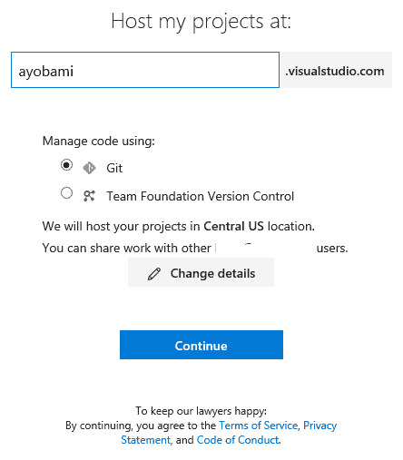

在 VSTS 中，每个帐户都有自己的自定义 URL，其中包含一个团队项目集合，例如[https://packt.visualstudio.com](https://packt.visualstudio.com)。 你应该指定 URL; 字段中，并选择要与项目一起使用的 Version 控件。 VSTS 目前支持 Git 和 Team Foundation 版本控制。 单击 continue 继续创建帐户。

创建帐户之后，单击 Projects 菜单导航到 Projects 页面，然后单击 New Project 创建一个新项目。 这将加载项目创建屏幕，您将在其中指定项目名称、描述、要使用的版本控件和工作项流程。 点击 Create 按钮，完成项目创建:


项目创建完成后，您将看到入门屏幕。 该屏幕提供了克隆现有项目或将现有项目推入其中的选项。 让我们导入之前在 GitHub 上创建的`LoanApplication`项目。 点击 Import 按钮开始导入过程:


在 Import 屏幕上，指定源类型和 GitHub 存储库的 URL，并提供 GitHub 登录凭据。 点击 Import 按钮开始导入过程:

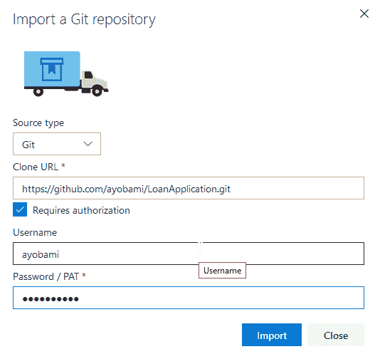

您将看到一个显示导入进度的屏幕。 导入过程可能需要一些时间，这取决于要导入的项目的大小。 当流程完成后，屏幕上会显示一条 Import 成功的消息:


点击点击这里导航到代码视图查看 VSTS 导入的文件和文件夹。 文件屏幕将显示项目中可用的文件和文件夹以及提交和日期细节:

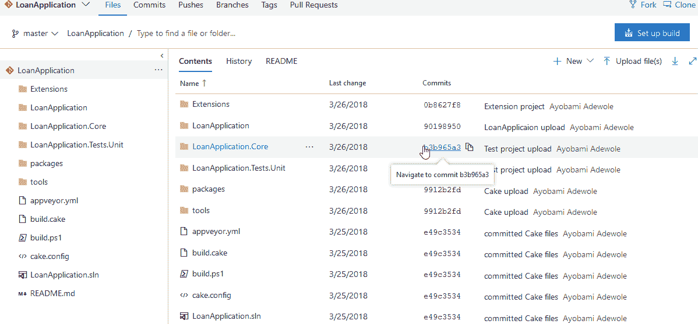

# 安装蛋糕到 VSTS

Cake 有一个 VSTS 扩展，允许您相对容易地直接从 VSTS 构建任务运行 Cake 脚本。 随着扩展安装到 VSTS，蛋糕脚本将不必使用 PowerShell 运行，就像在 TeamCity 运行蛋糕脚本。

在 Visual Studio Marketplace 上浏览蛋糕构建 URL:[https://marketplace.visualstudio.com/items/cake-build.cake](https://marketplace.visualstudio.com/items/cake-build.cake)。 点击获取它免费按钮开始安装蛋糕扩展到 VSTS:


点击获取免费按钮将重定向到 VSTS Visual Studio |市场集成页面。 在此页上，选择您打算安装 Cake 的帐户，并单击安装按钮:


当安装成功时，您将看到一条消息，说明一切都设置好了，类似于下面的截图。 点击 Proceed to account 按钮将你重定向到 VSTS 帐户页面:


# 添加构建任务

在将 Cake 成功安装到 VSTS 之后，您可以继续配置如何构建代码以及如何部署软件。 VSTS 为构建源代码和发布软件提供了简单的方法。

要创建一个由 Cake 支持的 VSTS 构建，请单击 build 和 Release，并选择 Builds 子菜单。 这将加载构建定义页面; 单击此页面上的+New 按钮开始构建创建过程。

将显示一个屏幕，其中选择了存储库，请参阅下面的屏幕截图。 屏幕提供了从不同来源选择存储库的选项:


在选择存储库源之后，单击 Continue 按钮来加载模板屏幕。 在此屏幕上，您可以选择用于配置生成的构建模板。 VSTS 为各种受支持的项目类型提供了特色模板。 每个模板都配置了与模板项目相关的构建步骤:

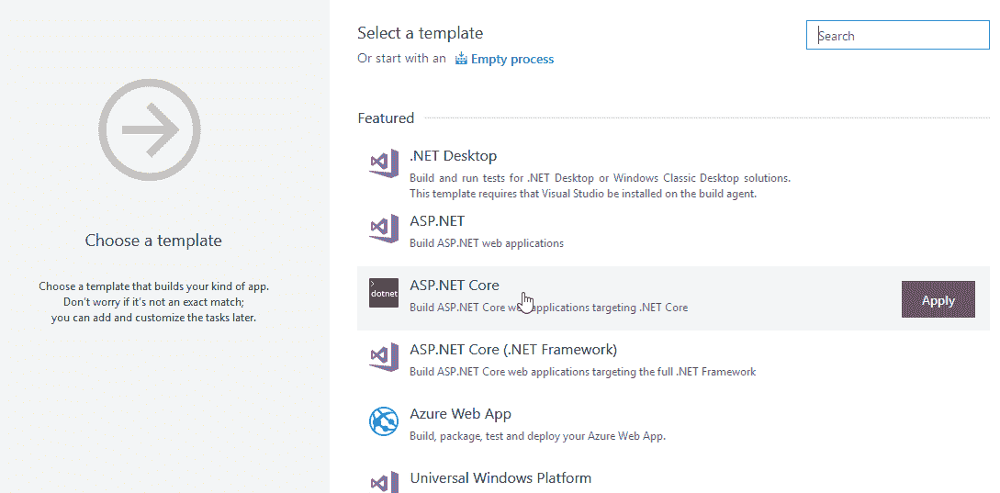

向下滚动到模板列表的底部，或者简单地在搜索框中键入`Empty`以选择 Empty 模板。 将鼠标悬停在模板上以激活 Apply 按钮，单击该按钮进入任务创建页面:


加载 Tasks 屏幕时，单击+按钮向构建添加任务。 滚动显示的任务模板的列表来选择 Cake 或使用搜索框来过滤列表到 Cake。 单击 Add 按钮将 Cake 任务添加到构建阶段可用的任务列表中:

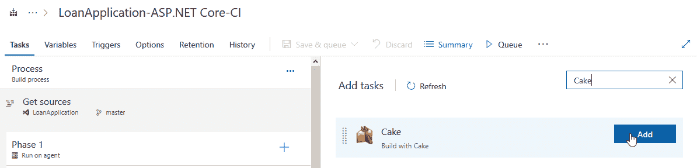

在添加了 Cake 任务之后，单击该任务以加载属性屏幕。 单击 Browse 按钮选择包含与构建任务关联的`LoanApplication`项目的构建脚本的`build.cake`文件。 您可以修改 Display 名称并更改 Target 和 verbose 属性。 同样，如果有参数要传递给 Cake 脚本，你可以在 provided 字段中提供它们:


点击保存&队列菜单，并选择保存&队列，以确保创建的构建将在托管代理上排队。 这将加载构建定义和队列屏幕，在这里你可以指定注释和代理队列:

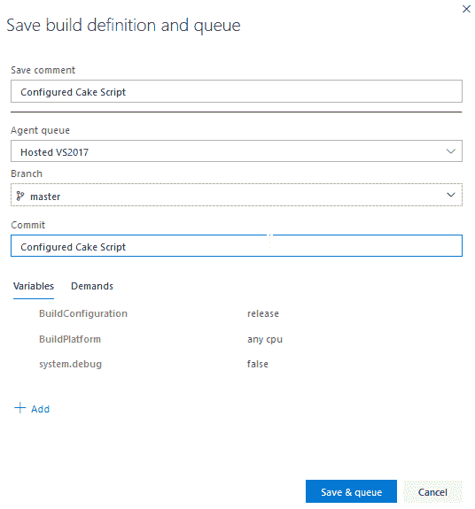

A hosted agent is the software that runs the build job. Using a hosted agent is the simplest and easiest way for build execution. The hosted agent is managed by the VSTS team.

如果构建成功排队，你应该在屏幕上获得一个显示构建号的通知，说明构建已经排队:


单击构建号导航到构建执行页面。 托管代理将处理队列，并在队列中为构建执行已配置的任务。 生成代理将显示生成执行的进度。 执行完成后，将报告构建的成功或失败:

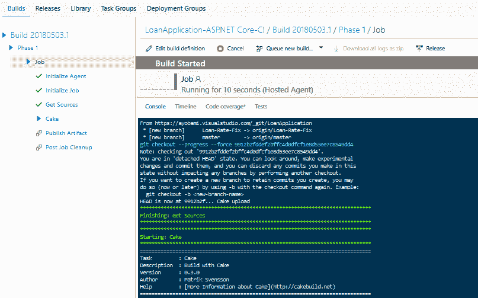

VSTS 提供了巨大的好处，并简化了 CI 和 CD 过程。 它提供的工具和特性允许不同的 IDE 轻松地与之集成，并使端到端开发和项目测试相对容易。

# 总结

在本章中，我们详细地探讨了 Cake 构建自动化。 我们介绍了安装 Cake 和 Cake Bootstrapper 的步骤。 稍后，我们探讨了编写 Cake 构建脚本和使用可用于各种构建活动的示例任务创建任务的过程。

此外，我们为`LoanApplication`项目创建了一个构建脚本，该构建脚本包含清理、恢复和构建解决方案中所有项目的任务，以及构建解决方案中包含的单元测试项目。

之后，我们在 TeamCity 中创建了一个构建步骤，通过使用 PowerShell 作为运行类型来执行 Cake 脚本。 在本章的后面，我们介绍了如何设置 Microsoft Visual Studio Team Services，将 Cake 安装到 VSTS 中，并使用 Cake 任务配置构建步骤。

在最后一章中，我们将探索如何使用 Cake 脚本执行 xUnit.net 测试。 在本章的后面，我们将探讨。net Core 版本控制、。net Core 打包和元包。 我们将打包`LoanApplication`项目用于 NuGet 发行。