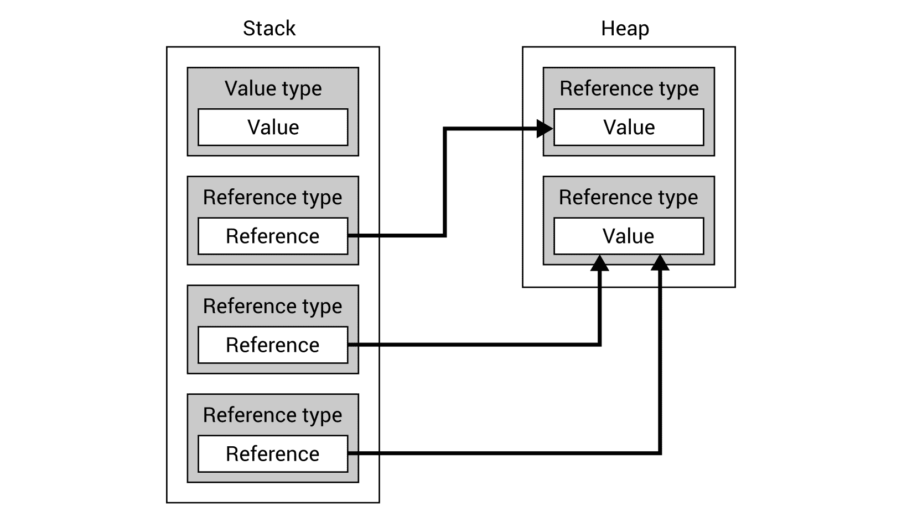
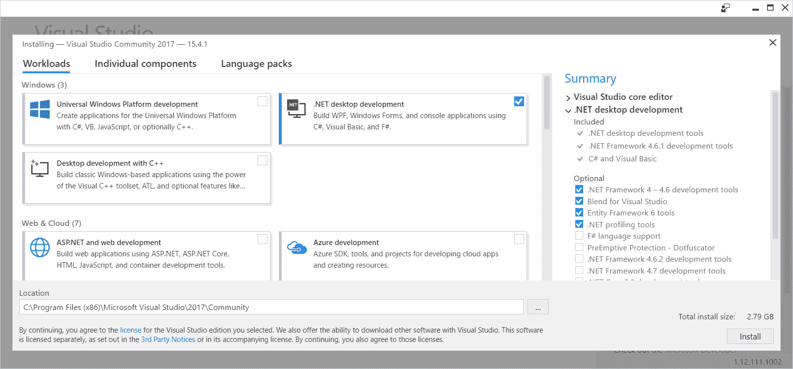

# 二、开始

开发应用程序当然是一件令人兴奋的事情，但它也具有挑战性，特别是当您需要解决一些涉及高级数据结构和算法的复杂问题时。在这种情况下，您通常需要考虑性能，以确保解决方案在资源有限的设备上顺利运行。这样的任务可能非常困难，不仅需要编程语言方面的重要知识，还需要数据结构和算法方面的重要知识。

您知道用另一个数据结构替换一个数据结构会导致性能结果提高数百倍吗？听起来不可能吗？也许吧，但这是真的！作为一个例子，我想给大家讲一个关于我参与的一个项目的小故事。其目的是优化在图的图表上查找块之间连接的算法。一旦图中的任何块移动，这些连接应该自动重新计算、刷新和重新绘制。当然，连接不能穿过街区，也不能与其他线路重叠，交叉点和方向改变的数量应该受到限制。根据图表的大小和复杂性，性能结果会有所不同。然而，在进行测试时，我们收到了相同测试用例的 1 ms 到近 800 ms 范围内的结果。最令人惊讶的是，如此巨大的进步主要是由。。。更改两个集合的数据结构。

现在，你可以问自己一个显而易见的问题：*在给定的情况下，我应该使用哪些数据结构，哪些算法可以用来解决一些常见的问题？*不幸的是，答案并不简单。然而，在这本书中，你会发现许多关于数据结构和算法的信息，这些信息是在 C# 编程语言的上下文中提供的，有许多示例、代码片段和详细的解释。这些内容可以帮助您回答上述问题，同时开发下一个伟大的解决方案，世界各地的许多人都可以使用这些解决方案！你准备好用数据结构和算法开始你的冒险了吗？如果是这样，让我们开始吧！

在本章中，您将介绍以下主题：

*   程序设计语言
*   数据类型
*   IDE 的安装和配置
*   创建项目
*   输入和输出
*   启动和调试

# 程序设计语言

作为一个开发人员，你肯定听说过很多编程语言，比如：AutoT0，C，java，T1，，T2，Java，T3，，T+4，T5，，T8，PHP，T9，或者 Ruby，Ty11。在所有这些方法中，您可以使用各种数据结构以及实现算法来解决基本问题和复杂问题。然而，每种语言都有自己的特殊性，在实现数据结构和相关算法时可以看到。如前所述，本书将只关注 C# 编程语言，这也是本节的主要主题。

C# language，发音为“C Sharp”，是一种现代、通用、强类型和面向对象的编程语言，可用于开发广泛的应用程序，如 web、移动、桌面、分布式和嵌入式解决方案，甚至游戏。它与各种其他技术和平台合作，包括 ASP.NET MVC、Windows 应用商店、Xamarin、Windows 窗体、XAML 和 Unity。因此，当您学习 C# 语言，以及在该编程语言的上下文中了解更多关于数据结构和算法的知识时，您可以使用这些技能创建多种特定类型的软件。

该语言的当前版本是 C# 7.1。值得一提的是，它在以下版本（例如，2.0、3.0 和 5.0）中的有趣历史，其中添加了新功能，以增加语言可能性并简化开发人员的工作。当您查看特定版本的发行说明时，您将看到该语言是如何随着时间的推移而得到改进和扩展的。

C 语言的语法类似于其他语言，如 java 或 C++。因此，如果您了解这些语言，您应该能够很容易地理解用 C# 编写的代码。例如，与前面提到的语言类似，代码由以分号（`;`结尾的语句组成，并使用花括号（`{`和`}`对语句进行分组，例如在`foreach`循环中。您还可以找到类似的代码构造，例如`if`语句或`while`和`for`循环。

使用 C# 语言开发各种应用程序还可以通过提供许多其他重要功能而简化，例如**语言集成查询**（**LINQ**），它允许开发人员以一致的方式从各种集合（如 SQL 数据库或 XML 文档）获取数据。还有一些方法可以缩短所需的代码，例如使用 lambda 表达式、表达式体成员、getter 和 setter 或字符串插值。值得一提的是，自动垃圾收集简化了释放内存的任务。当然，提到的解决方案只是在 C# 中开发时可用的非常有限的功能子集。您将在本书的以下部分看到其他一些内容，以及示例和详细描述。

# 数据类型

在用 C 语言开发应用程序时，可以使用不同的数据类型，分为两组，即**值类型**和**引用类型**。它们之间的区别非常简单——值类型的变量直接包含数据，而引用类型的变量只存储对数据的引用，如下所示：



如您所见，**值类型**将其实际**值**直接存储在**栈**内存中，而**引用类型**在此仅存储**引用**。实际值位于**堆**内存中。因此，也可能有两个或多个引用类型的变量引用完全相同的值。

当然，在编程时，值类型和引用类型之间的差异非常重要，您应该知道哪些类型属于所提到的组。否则，您可能会在代码中犯下很难找到的错误。例如，您应该记住在更新引用类型的数据时要小心，因为更改也可能反映在引用同一对象的其他变量中。此外，在使用 equals（`=`运算符比较两个对象时，您应该小心，因为在引用类型的两个实例中，您可以比较引用，而不是数据本身。

The C# language also supports **pointer types**, which can be declared as `type* identifier` or `void* identifier`. However, such types are beyond the scope of this book. You can read more about them at: [https://docs.microsoft.com/en-us/dotnet/csharp/programming-guide/unsafe-code-pointers/pointer-types](https://docs.microsoft.com/en-us/dotnet/csharp/programming-guide/unsafe-code-pointers/pointer-types).

# 值类型

为了让您更好地理解数据类型，让我们从分析第一组（即**值类型**开始，它可以进一步分为**结构**和**枚举**。

More information is available at: [https://docs.microsoft.com/en-us/dotnet/csharp/language-reference/keywords/value-types](https://docs.microsoft.com/en-us/dotnet/csharp/language-reference/keywords/value-types).

# 结构体

在 structs 中，您可以访问许多内置类型，这些类型既可以用作关键字，也可以用作`System`命名空间中的类型。

其中之一是`Boolean`类型（`bool`关键字），可以存储**逻辑值**，即`true`或`false`两个值中的一个。

对于**整数值的存储，**可以使用以下类型之一：`Byte`（`byte`关键字）、`SByte`（`sbyte`、`Int16`（`short`）、`UInt16`（`ushort`、`Int32`（`int`）、`UInt32`（`uint`）、`Int64`（`long`、`UInt64`（`ulong`）。它们的不同之处在于存储值的字节数，因此也在于可用值的范围。例如，`short`数据类型支持从-32768 到 32767 的值，而`uint`支持从 0 到 4294967295 的值。整数类型中的另一个类型是`Char`（`char`），它表示单个 Unicode 字符，例如`'a'`或`'M'`。

在**浮点值**的情况下，可以使用两种类型，即`Single`（`float`）和`Double`（`double`）。第一个使用 32 位，而第二个使用 64 位。因此，它们的精度差别很大。

此外，`Decimal`类型（`decimal`关键字）也可用。它使用 128 位，是货币计算的好选择。

C# 编程语言中的变量声明示例如下：

```cs
int number; 
```

您可以使用等号（`=`为变量赋值，如下所示：

```cs
number = 500; 
```

当然，声明和赋值可以在同一行中执行：

```cs
int number = 500; 
```

如果要声明并初始化一个**不可变值**，即**常量**，可以使用`const`关键字，如下代码行所示：

```cs
const int DAYS_IN_WEEK = 7; 
```

More information about the built-in data types, together with the complete list of ranges, is available at: [https://msdn.microsoft.com/library/cs7y5x0x.aspx](https://msdn.microsoft.com/library/cs7y5x0x.aspx).

# 枚举

除了结构之外，值类型还包含**枚举**。每个都有一组命名常量来指定可用的值集。例如，可以为可用语言或支持的货币创建枚举。示例定义如下所示：

```cs
enum Language { PL, EN, DE }; 
```

然后，可以使用定义的枚举作为数据类型，如下所示：

```cs
Language language = Language.PL; 
switch (language) 
{ 
    case Language.PL: /* Polish version */ break; 
    case Language.DE: /* German version */ break; 
    default: /* English version */ break; 
} 
```

值得一提的是，枚举允许您使用常量值替换某些*神奇字符串*（例如`"PL"`或`"DE"`，这对代码质量有积极影响。

You can also benefit from more advanced features of enumerations, such as changing the underlying type or specifying values for particular constants. You can find more information at: [https://docs.microsoft.com/en-us/dotnet/csharp/language-reference/keywords/enum](https://docs.microsoft.com/en-us/dotnet/csharp/language-reference/keywords/enum).

# 参考类型

第二组主要类型被命名为**参考类型**。作为快速提醒，引用类型的变量不直接包含数据，因为它只存储对数据的引用。在该组中，您可以找到三种内置类型，即`string`、`object`和`dynamic`。此外，还可以声明类、接口和委托。

More information about the reference types is available at: [https://docs.microsoft.com/en-us/dotnet/csharp/language-reference/keywords/reference-types](https://docs.microsoft.com/en-us/dotnet/csharp/language-reference/keywords/reference-types).

# 串

通常需要存储一些文本值。您可以使用`System`名称空间中的`String`内置引用类型来实现这一目标，该名称空间也可以使用`string`关键字。`string`类型是一个 Unicode 字符序列。它可以有零个字符，一个或多个字符，`string`变量可以设置为`null`。

您可以对`string`对象执行各种操作，例如使用`[]`操作符连接或访问特定字符，如下所示：

```cs
string firstName = "Marcin", lastName = "Jamro"; 
int year = 1988; 
string note = firstName + " " + lastName.ToUpper()  
   + " was born in " + year; 
string initials = firstName[0] + "." + lastName[0] + "."; 
```

开始时，声明了`firstName`变量，并为其分配了`"Marcin"`值。类似地，`"Jamro"`被设置为`lastName`变量的值。在第三行中，您连接了五个字符串（使用`+`运算符），即`firstName`的当前值、空格、`lastName`的当前值转换为大写字符串（通过调用`ToUpper`方法）、字符串`" was born in "`和`year`变量的当前值。在最后一行中，使用`[]`运算符获取`firstName`和`lastName`变量的第一个字符，并用两个点连接以形成首字母，即`M.J.`，它们存储为`initials`变量的值。

`Format`静态方法也可用于构造字符串，如下所示：

```cs
string note = string.Format("{0} {1} was born in {2}",  
   firstName, lastName.ToUpper(), year); 
```

在本例中，您使用三个格式项指定了**复合格式字符串**，即`firstName`（由`{0}`表示）、大写`lastName`（`{1}`）和`year`（`{2}`）。要格式化的对象指定为以下参数。

More information is available at: [https://docs.microsoft.com/en-us/dotnet/csharp/language-reference/keywords/string](https://docs.microsoft.com/en-us/dotnet/csharp/language-reference/keywords/string).

还值得一提的是**插值字符串**，它使用**插值表达式**来构造一个`string`。使用此方法创建`string`时，应将`$`字符置于`"`之前，如下例所示：

```cs
string note = $"{firstName} {lastName.ToUpper()}  
   was born in {year}"; 
```

More information is available at: [https://docs.microsoft.com/en-us/dotnet/csharp/language-reference/keywords/interpolated-strings](https://docs.microsoft.com/en-us/dotnet/csharp/language-reference/keywords/interpolated-strings).

# 对象

在`System`名称空间中声明的`Object`类在用 C# 语言开发应用程序时起着非常重要的作用，因为它是所有类的基类。这意味着内置值类型和内置引用类型以及用户定义的类型都是从`Object`类派生的，也可以使用`object`别名。

由于`object`类型是所有值类型的基本实体，这意味着可以将任何值类型的变量（例如`int`或`float`转换为`object`类型，也可以将`object`类型的变量转换回特定值类型。这种操作被命名为**装箱**（第一个）和**拆箱**（另一个）。详情如下:

```cs
int age = 28; 
object ageBoxing = age; 
int ageUnboxing = (int)ageBoxing; 
```

More information is available at: [https://docs.microsoft.com/en-us/dotnet/csharp/language-reference/keywords/object](https://docs.microsoft.com/en-us/dotnet/csharp/language-reference/keywords/object).

# 动态

除了已经描述的类型外，`dynamic`类型还可供开发人员使用。它允许在编译期间绕过类型检查，以便您可以在运行时执行它。这种机制在访问一些**ap****应用程序编程接口**（**API**时非常有用，但本书不使用。

More information is available at: [https://docs.microsoft.com/en-us/dotnet/csharp/language-reference/keywords/dynamic](https://docs.microsoft.com/en-us/dotnet/csharp/language-reference/keywords/dynamic).

# 班级

如前所述，C# 是一种面向对象的语言，支持类和各种成员的声明，包括构造函数、终结器、常量、字段、属性、索引器、事件、方法和运算符以及委托。此外，类支持继承和实现接口。静态、抽象和虚拟成员也可用。

示例类如下所示：

```cs
public class Person 
{ 
    private string _location = string.Empty; 
    public string Name { get; set; } 
    public int Age { get; set; } 

    public Person() => Name = "---"; 

    public Person(string name, int age) 
    { 
        Name = name; 
        Age = age; 
    } 

    public void Relocate(string location) 
    { 
        if (!string.IsNullOrEmpty(location)) 
        { 
            _location = location; 
        } 
    } 

    public float GetDistance(string location) 
    { 
        return DistanceHelpers.GetDistance(_location, location); 
    } 
} 
```

`Person`类包含`_location`私有字段，默认值设置为空字符串（`string.Empty`），两个公共属性（`Name`和`Age`），一个默认构造函数，使用**表达式体定义**将`Name`属性的值设置为`---`，一个额外的构造函数，它接受两个参数并设置属性值，`Relocate`方法更新私有字段的值，以及`GetDistance`方法，该方法从`DistanceHelpers`类调用`GetDistance`静态方法并返回两个城市之间的距离（以公里为单位）。

您可以使用`new`操作符创建该类的实例。然后，您可以对创建的对象执行各种操作，例如调用方法，如下所示：

```cs
Person person = new Person("Mary", 20); 
person.Relocate("Rzeszow"); 
float distance = person.GetDistance("Warsaw");  
```

More information is available at: [https://docs.microsoft.com/en-us/dotnet/csharp/language-reference/keywords/class](https://docs.microsoft.com/en-us/dotnet/csharp/language-reference/keywords/class).

# 接口

在上一节中，提到了一个类，它可以实现一个或多个**接口**。这意味着这样一个类必须实现在所有实现的接口中指定的所有方法、属性、事件和索引器。您可以使用`interface`关键字轻松地用 C 语言定义接口。

举个例子，让我们看看下面的代码：

```cs
public interface IDevice 
{ 
    string Model { get; set; } 
    string Number { get; set; } 
    int Year { get; set; } 

    void Configure(DeviceConfiguration configuration); 
    bool Start(); 
    bool Stop(); 
} 
```

`IDevice`接口包含三个属性，分别表示设备型号（`Model`）、序列号（`Number`）和生产年份（`Year`）。此外，它还有三种方法的签名，分别是`Configure`、`Start`、`Stop`。当类实现`IDevice`接口时，它应该包含所提到的属性和方法。

More information is available at: [https://docs.microsoft.com/en-us/dotnet/csharp/language-reference/keywords/interface](https://docs.microsoft.com/en-us/dotnet/csharp/language-reference/keywords/interface).

# 代表

`delegate`引用类型允许指定方法所需的签名。然后可以实例化和调用委托，如以下代码所示：

```cs
delegate double Mean(double a, double b, double c); 

static double Harmonic(double a, double b, double c) 
{ 
    return 3 / ((1 / a) + (1 / b) + (1 / c)); 
} 

static void Main(string[] args) 
{ 
    Mean arithmetic = (a, b, c) => (a + b + c) / 3; 
    Mean geometric = delegate (double a, double b, double c) 
    { 
        return Math.Pow(a * b * c, 1 / 3.0); 
    }; 
    Mean harmonic = Harmonic; 
    double arithmeticResult = arithmetic.Invoke(5, 6.5, 7); 
    double geometricResult = geometric.Invoke(5, 6.5, 7); 
    double harmonicResult = harmonic.Invoke(5, 6.5, 7); 
} 
```

在本例中，`Mean`委托指定了计算三个浮点数平均值的方法所需的签名。它使用 lambda 表达式（`arithmetic`、匿名方法（`geometric`）和命名方法（`harmonic`进行实例化。通过调用`Invoke`方法调用每个委托。

More information is available at: [https://docs.microsoft.com/en-us/dotnet/csharp/language-reference/keywords/delegate](https://docs.microsoft.com/en-us/dotnet/csharp/language-reference/keywords/delegate).

# IDE 的安装和配置

在阅读本书时，您将看到许多展示数据结构和算法的示例，以及详细的描述。代码中最重要的部分将直接显示在本书中。此外，还可以下载完整的源代码。当然，您只能阅读本书中的代码，但强烈建议您自己编写此类代码，然后启动并调试程序，以了解各种数据结构和算法的运行方式。

如前所述，本书中的示例将使用 C# 语言编写。为了简单起见，将创建基于控制台的应用程序，但此类数据结构也可以用于其他类型的解决方案。

示例项目将在**Microsoft Visual Studio 2017 社区**中创建。此**集成开发环境**（**IDE**）是开发各种项目的综合解决方案。要下载、安装和配置它，您应该：

1.  打开网站[https://www.visualstudio.com/downloads/](https://www.visualstudio.com/downloads/) 并从 Visual Studio 下载标题下方的 Visual Studio Community 2017 部分选择免费下载选项。安装程序的下载过程应自动开始。
2.  运行下载的文件并按照说明开始安装。显示显示可能选项的屏幕时，选择.NET 桌面开发选项，如以下屏幕截图所示。然后，单击安装。安装可能需要一些时间，但是可以使用获取和应用进度条来观察其进度。



3.  当消息安装成功时！如图所示，单击启动按钮启动 IDE。您将被要求使用 Microsoft 帐户登录。然后，您应该在“使用熟悉的环境开始”部分中选择合适的开发设置（如 Visual C）。此外，您应该从蓝色、蓝色（额外对比度）、深色和浅色中选择颜色主题。最后，单击开始 Visual Studio 按钮。

# 创建项目

在启动 IDE 之后，让我们继续创建一个新项目。阅读本书时，将多次执行此过程，以根据特定章节中提供的信息创建示例应用程序。

要创建新项目，请执行以下操作：

1.  单击主菜单中的文件|新建|项目。
2.  在新项目窗口的左侧选择已安装的| Visual C | | Windows 经典桌面，如以下屏幕截图所示。然后，点击控制台应用程序（.NETFramework）。还应键入项目名称（名称）和解决方案名称（解决方案名称），并通过按“浏览”按钮选择文件的位置（位置）。最后，单击“确定”自动创建项目并生成必要的文件：


祝贺您，您刚刚创建了第一个项目！但里面是什么？

让我们看一下解决方案资源管理器窗口，它显示了项目的结构。值得一提的是，该项目以相同的名称包含在解决方案中。当然，一个解决方案可以包含多个项目，这是开发更复杂应用程序时的常见场景。

If you cannot find the Solution Explorer window, you could open it by choosing the View | Solution Explorer option from the main menu. In a similar way, you could open other windows, such as Output or Class View. If you cannot find a suitable window (for example, C# Interactive) directly within the View option, let's try to find it in the View | Other Windows node.

自动生成的项目（名为`GettingStarted`）结构如下：

*   属性节点包含一个文件（`AssemblyInfo.cs`），其中包含有关应用程序的程序集的一般信息，例如其标题、版权和版本。使用属性执行配置，例如，`AssemblyTitleAttribute`和`AssemblyVersionAttribute`。
*   “引用”元素表示项目使用的其他程序集或项目。值得注意的是，通过从 references 元素的上下文菜单中选择 addreference 选项，可以轻松地添加引用。此外，您可以使用 NuGet 软件包管理器安装其他软件包，可以通过从引用上下文菜单中选择 Manage NuGet packages 启动该软件包管理器。

It is a good idea to take a look at packages already available before writing the complex module on your own because a suitable package could be already available for developers. In such a case, you could not only shorten the development time, but also reduce the chance of introducing mistakes.

*   `App.config`文件包含基于**可扩展标记语言**（**XML**）的应用程序配置，包括.NET Framework 平台支持的最低版本号。
*   `Program.cs`文件包含 C# 语言中主类的代码。您可以通过更改以下默认实现来调整应用程序的行为：

```cs
using System; 
using System.Collections.Generic; 
using System.Linq; 
using System.Text; 
using System.Threading.Tasks; 

namespace GettingStarted 
{ 
    class Program 
    { 
        static void Main(string[] args) 
        { 
        } 
    } 
} 
```

`Program.cs`文件的初始内容包含`GettingStarted`命名空间中`Program`类的定义。该类包含`Main`静态方法，该方法在应用程序启动时自动调用。五个`using`报表也包括在内，即`System`、`System.Collections.Generic`、`System.Linq`、`System.Text`和`System.Threading.Tasks`。

在继续之前，让我们来看看在文件资源管理器中的项目结构，而不是在解决方案资源管理器窗口中。这些结构完全相同吗？

You could open the directory with the project in the file explorer by choosing the Open Folder in File Explorer option from the context menu of the project node in the Solution Explorer window.

首先，您可以看到自动生成的`bin`和`obj`目录。两者都包含`Debug`和`Release`目录，其名称与 IDE 中的配置集相关。项目建成后，`bin`目录的子目录（即`Debug`或`Release`包含`.exe`、`.exe.config`和`.pdb`文件，而`obj`目录中的子目录例如包含`.cache`和一些临时`.cs`文件。更重要的是，没有`References`目录，但有`.csproj`和`.csproj.user`文件，项目配置基于 XML。同样，基于解决方案的`.sln`配置文件位于解决方案的目录中。

If you are using a **version control system**, such as **SVN** or **Git**, you could ignore the `bin` and `obj` directories, as well as the `.csproj.user` file. All of them can be generated automatically.

如果您想学习如何编写一些示例代码，以及如何启动和调试程序，让我们继续下一节。

# 输入和输出

本书以下部分所示的许多示例都需要与用户交互，尤其是通过读取输入数据和显示输出。如本节所述，您可以轻松地将这些功能添加到应用程序中。

# 从输入读取

应用程序可以使用`System`名称空间中`Console`静态类中的一些方法从**标准输入流**读取数据，例如`ReadLine`和`ReadKey`。这两种方法都在本节的示例中介绍。

让我们看看下面的代码行：

```cs
string fullName = Console.ReadLine(); 
```

在这里，您使用`ReadLine`方法。等待用户按下*回车*键。然后，输入的文本被存储为`fullName`字符串变量的值。

同样，您也可以读取其他类型的数据，如`int`，如下所示：

```cs
string numberString = Console.ReadLine(); 
int.TryParse(numberString, out int number); 
```

在这种情况下，调用相同的`ReadLine`方法，并将输入的文本存储为`numberString`变量的值。然后，您只需要将其解析为`int`并将其存储为`int`变量的值。你怎么能做到？使用`Int32`结构的`TryParse`静态方法，解决方案非常简单。值得一提的是，这种方法返回一个布尔值，指示解析过程是否已成功完成。因此，当提供的`string`表示不正确时，您可以执行一些额外的操作。

关于`DateTime`结构和`TryParseExact`静态方法，类似的场景如下例所示：

```cs
string dateTimeString = Console.ReadLine(); 
if (!DateTime.TryParseExact( 
    dateTimeString, 
    "M/d/yyyy HH:mm", 
    new CultureInfo("en-US"), 
    DateTimeStyles.None, 
    out DateTime dateTime)) 
{ 
    dateTime = DateTime.Now; 
} 
```

这个例子比上一个更复杂，所以让我们详细解释一下。首先，日期和时间的字符串表示形式存储为`dateTimeString`变量的值。然后调用`DateTime`结构的`TryParseExact`静态方法，传递五个参数，即日期和时间的字符串表示（`dateTimeString`）、日期和时间的预期格式（`M/d/yyyy HH:mm`）、支持的区域性（`en-US`）、附加样式（`None`）以及输出变量（`dateTime`）使用`out`参数修饰符通过引用传递。

如果解析未成功完成，则将当前日期和时间（`DateTime.Now`分配给`dateTime`变量。否则，`dateTime`变量包含与用户提供的`string`表示一致的`DateTime`实例。

While writing the part of code involving the `CultureInfo` class name, you could see the following error: `CS0246 The type or namespace name 'CultureInfo' could not be found (are you missing a using directive or an assembly reference?)`. This means that you do not have a suitable `using` statement at the top of the file. You can easily add one by clicking on the bulb icon shown in the left-hand margin of the line with the error and choosing the using System.Globalization; option. The IDE will automatically add the missing `using` statement and the error will disappear.

除了阅读整行文字外，您还可以了解用户按下了哪个字符或功能键。为此，您可以使用`ReadKey`方法，如下代码部分所示：

```cs
ConsoleKeyInfo key = Console.ReadKey(); 
switch (key.Key) 
{ 
    case ConsoleKey.S: /* Pressed S */ break; 
    case ConsoleKey.F1: /* Pressed F1 */ break; 
    case ConsoleKey.Escape: /* Pressed Escape */ break; 
} 
```

在调用`ReadKey`静态方法之后，一旦用户按下任何键，关于按下的键的信息被存储为`ConsoleKeyInfo`实例（在当前示例中为`key`）。然后，使用`Key`属性获取表示特定键的枚举值（即`ConsoleKey`）。最后，`switch`语句用于根据已按下的键执行操作。在所示示例中，支持三个键，即*S*、*F1*和*Esc*。

# 写入输出

现在，您知道如何读取输入数据，但如何向用户提问或在屏幕上显示结果？本节给出了答案和示例。

与读取数据的情况类似，使用来自`System`命名空间的`Console`静态类的方法，即`Write`和`WriteLine`执行与**标准输出流**相关的操作。让我们看看他们的行动！

要编写一些文本，只需调用`Write`方法，将文本作为参数传递。代码示例如下所示：

```cs
Console.Write("Enter a name: "); 
```

前一行导致显示以下输出：

```cs
    Enter a name: 
```

这里重要的是，书面文本后面没有行结束符。如果您想写一些文本并移动到下一行，可以使用`WriteLine`方法，如下代码段所示：

```cs
Console.WriteLine("Hello!"); 
```

执行这行代码后，将显示以下输出：

```cs
    Hello!
```

当然，您也可以在更复杂的场景中使用`Write`和`WriteLine`方法。例如，您可以将许多参数传递给`WriteLine`方法，即格式和附加参数，如代码的以下部分所示：

```cs
string name = "Marcin"; 
Console.WriteLine("Hello, {0}!", name); 
```

在这种情况下，该行将包含`Hello`、逗号、空格、`name`变量的值（即`Marcin`）以及感叹号。输出如下所示：

```cs
    Hello, Marcin!
```

下一个例子展示了一个更为复杂的场景，即写一行关于确认餐厅餐桌预订的内容。输出的格式应为`Table [number] has been booked for [count] people on [date] at [time]`。您可以使用`WriteLine`方法来实现此目标，如下所示：

```cs
string tableNumber = "A100"; 
int peopleCount = 4; 
DateTime reservationDateTime = new DateTime( 
    2017, 10, 28, 11, 0, 0); 
CultureInfo cultureInfo = new CultureInfo("en-US"); 
Console.WriteLine( 
    "Table {0} has been booked for {1} people on {2} at {3}", 
    tableNumber, 
    peopleCount, 
    reservationDateTime.ToString("M/d/yyyy", cultureInfo), 
    reservationDateTime.ToString("HH:mm", cultureInfo)); 
```

该示例以四个变量的声明开始，即`tableNumber`（`A100`）、`peopleCount`（`4`）和`reservationDateTime`（2017 年 10 月 28 日上午 11:00）以及`cultureInfo`（`en-US`）。然后，调用`WriteLine`方法传递五个参数，即格式字符串后跟参数，这些参数应显示在标有`{0}`、`{1}`、`{2}`和`{3}`的位置。值得一提的是最后两行，其中根据`reservationDateTime`变量的当前值创建了表示日期（或时间）的字符串。

执行此代码后，输出中将显示以下行：

```cs
    Table A100 has been booked for 4 people on 10/28/2017 at 11:00 
```

当然，在真实场景中，您将在同一代码中使用与读写相关的方法。例如，您可以要求用户提供一个值（使用`Write`方法），然后读取输入的文本（使用`ReadLine`方法）。

这个简单的例子在本章下一节中也很有用，如下所示。它允许用户输入与表格保留相关的数据，即表格编号和人数，以及保留日期。输入所有数据后，将显示确认信息。当然，用户将看到有关应提供的数据的信息：

```cs
using System; 
using System.Globalization; 

namespace GettingStarted 
{ 
    class Program 
    { 
        static void Main(string[] args) 
        { 
            CultureInfo cultureInfo = new CultureInfo("en-US"); 

            Console.Write("The table number: "); 
            string table = Console.ReadLine(); 

            Console.Write("The number of people: "); 
            string countString = Console.ReadLine(); 
            int.TryParse(countString, out int count); 

            Console.Write("The reservation date (MM/dd/yyyy): "); 
            string dateTimeString = Console.ReadLine(); 
            if (!DateTime.TryParseExact( 
                dateTimeString, 
                "M/d/yyyy HH:mm", 
                cultureInfo, 
                DateTimeStyles.None, 
                out DateTime dateTime)) 
            { 
                dateTime = DateTime.Now; 
            } 

            Console.WriteLine( 
                "Table {0} has been booked for {1} people on {2}  
                 at {3}", 
                table, 
                count, 
                dateTime.ToString("M/d/yyyy", cultureInfo), 
                dateTime.ToString("HH:mm", cultureInfo)); 
        } 
    } 
} 
```

前面的代码片段基于前面显示和描述的代码部分。启动程序并输入必要的数据后，输出可能如下所示：

```cs
    The table number: A100
    The number of people: 4
    The reservation date (MM/dd/yyyy): 10/28/2017 11:00
    Table A100 has been booked for 4 people on 10/28/2017 at 11:00
    Press any key to continue . . . 
```

创建代码时，最好提高其质量。与 IDE 相关的一个有趣的可能性是删除未使用的`using`语句，并对其余语句进行排序。通过从文本编辑器的上下文菜单中选择“删除并使用排序”选项，可以轻松执行此类操作。

# 启动和调试

不幸的是，编写的代码并不总是像预期的那样工作。在这种情况下，最好启动**调试**，查看程序的运行情况，找到问题的根源，并进行纠正。这项任务对于复杂的算法特别有用，因为在复杂的算法中，流程可能很复杂，因此仅通过阅读代码就很难进行分析。幸运的是，IDE 配备了各种调试功能，这些功能将在本节中介绍。

首先，让我们启动应用程序，看看它的实际运行情况！为此，您只需从下拉列表（本例中为 Debug）中选择一个正确的配置，然后单击主工具栏中带有绿色三角形和开始标题的按钮，或按*F5*。要停止调试，可以选择调试|停止调试或按*Shift*+*F5*。

You can also run the application without debugging. To do so, choose Debug | Start Without Debugging from the main menu or press *Ctrl* + *F5*.

如前所述，有各种调试技术，但让我们从基于断点的调试开始，因为它是提供巨大机会的最常见方法之一。您可以在任何代码行中放置一个**断点**。程序将在到达该行后立即停止，然后再执行。然后，您可以查看特定变量的值，以检查应用程序是否按预期工作。

要添加断点，您可以单击左边距（应放置断点的行旁边）或将光标放置在该行（应添加断点的位置）上，然后按*F9*键。在这两种情况下，将显示红色圆圈，并且给定行中的代码将标记为红色背景，如以下屏幕截图中的第 17 行所示：


当执行程序时到达带有断点的行时，该行将停止，并用黄色背景标记该行，边距图标将更改，如屏幕截图中的第 15 行所示。现在，只需将光标移到变量名称上，即可检查变量的值。当前值将显示在工具提示中。

也可以单击位于工具提示右侧的锁定图标，将其锁定在编辑器中。它的值将可见，而无需将光标移到变量名称上。该值一旦更改，就会自动刷新。结果显示在下面的屏幕截图中。

IDE 可以根据当前执行的操作调整其外观和功能。例如，在调试过程中，您可以访问一些特殊窗口，如局部变量、调用栈和诊断工具。第一个显示可用的局部变量及其类型和值。“调用栈”窗口显示有关以下被调用方法的信息。最后一个（即诊断工具）显示有关内存和 CPU 使用情况以及事件的信息。

此外，IDE 支持仅当相关布尔表达式的计算结果为`true`时才停止程序执行的条件断点。您可以通过从上下文菜单中选择“条件”选项向给定断点添加条件，右键单击左侧边距中的断点图标后会显示该菜单。然后，出现断点设置窗口，您应该在其中选中条件复选框并指定条件表达式，如下面的屏幕截图所示。在本例中，只有当`count`变量的值大于`5`时，即`count > 5`时，执行才会停止：


停止执行后，可以使用逐步调试技术。要将程序的执行移动到下一行（不包含另一个断点），您可以单击主工具栏中的单步图标或按*F10*。如果要单步执行该方法，只需单击单步执行按钮或按*F11*即可。当然，您也可以通过单击继续按钮或按*F5*转到下一个断点。

下一个有趣的特性是 IDE 中的即时窗口。它允许开发人员在程序停止执行时使用变量的当前值执行各种表达式。您只需在即时窗口中输入一个表达式，然后按*回车*键即可。该示例显示在以下屏幕截图中：


这里，通过执行`table.ToLower()`返回表号的小写版本。然后，计算当前日期和`dateTime`变量之间的总分钟数，并显示在窗口中。

# 总结

这只是本书的第一章，但其中包含了很多信息，在阅读其余章节时会很有用。在开始时，您看到使用适当的数据结构和算法不是一项容易的任务，但可能会对开发的解决方案的性能产生重大影响。然后，简要介绍了 C# 编程语言，重点介绍了各种数据类型，包括值数据类型和参考数据类型。还描述了类、接口和委托。

在本章的下一部分中，介绍了 IDE 的安装和配置过程。然后，您学习了如何创建一个新项目，并对其结构进行了详细描述。接下来，您了解了如何从标准输入流读取数据，以及如何将数据写入标准输出流。与读和写相关的操作也混合在一个示例中。

在本章末尾，您看到了如何运行示例程序，以及如何使用断点进行调试和逐步调试以找到问题的根源。此外，您还了解了即时窗口功能的可能性。

在本介绍之后，您应该准备好进入下一章，了解如何使用数组和列表以及附带的算法。走吧！