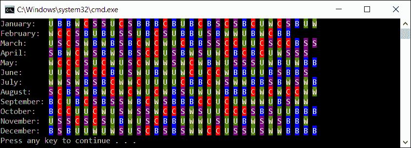
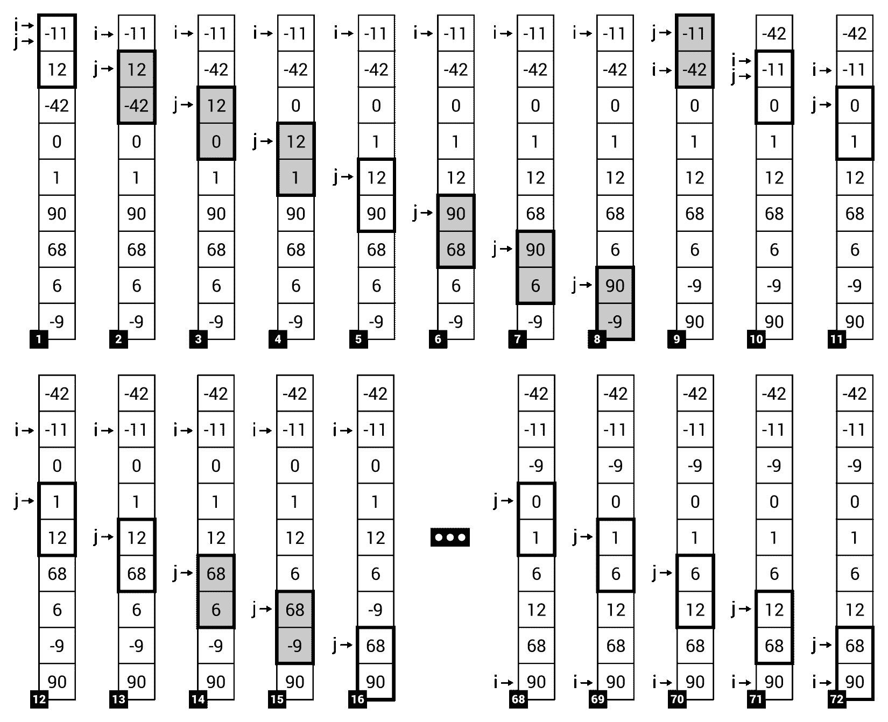
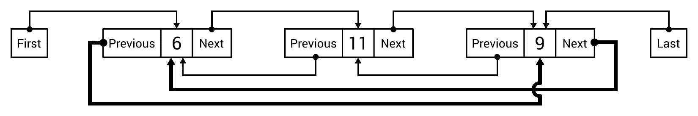
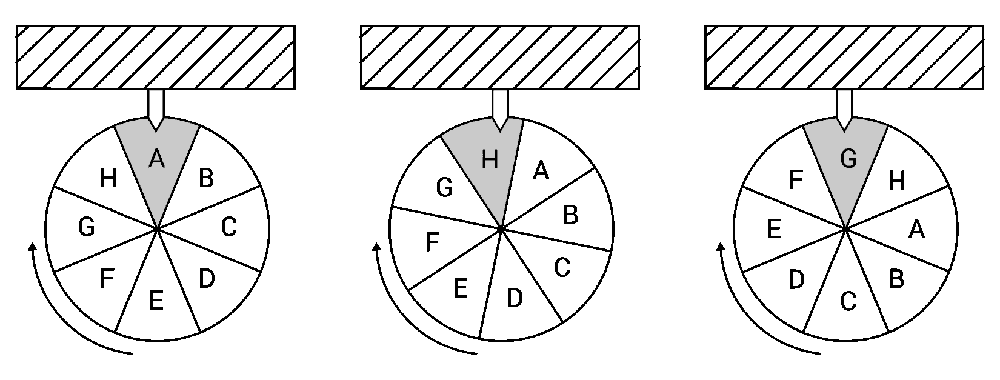

# 数组和列表

作为开发人员，您肯定在应用程序中存储了各种集合，例如用户数据、书籍和日志。存储此类数据的自然方法之一是使用数组和列表。然而，你有没有想过它们的变体？你听说过锯齿状数组或圆形链表吗？在本章中，您将看到这些数据结构的作用，以及示例和详细描述。这还不是全部，因为本章涉及许多关于数组和列表的主题，适合具有不同编程技能的开发人员。

在本章开头，将介绍阵列，并将其分为一维阵列、多维阵列和锯齿阵列。您还将了解四种排序算法，即选择、插入、气泡排序和快速排序。对于其中的每一个，您将看到一个基于插图的示例、实现代码和一个分步说明。

阵列有很多可能性。然而，使用 C 语言开发时可用的通用列表功能更强大。在本章的剩余部分，您将看到如何使用列表的一些变体，例如简单、排序、双链接和循环链接。对于每一个示例，都会显示一个示例的 C# 代码，并给出详细说明。

本章将介绍以下主题：

*   阵列
*   排序算法
*   简单列表
*   排序列表
*   链表
*   循环链表

# 阵列

让我们从数组数据结构开始。您可以使用它来存储许多相同类型的变量，例如`int`、`string`或用户定义的类。正如简介中提到的，在使用 C 语言开发应用程序时，您可以从以下图表中显示的几种阵列变体中获益。您不仅可以访问一维阵列（指示为**a**），还可以访问多维阵列（**b**）和锯齿阵列（**c**）。下图显示了所有这些示例：


重要的是数组中的元素数在初始化后不能更改。因此，您将无法轻松地在数组末尾添加新项或将其插入数组中的给定位置。如果您需要这些功能，可以使用本章中描述的其他数据结构，例如通用列表。

You can find more information about arrays at [https://docs.microsoft.com/en-us/dotnet/csharp/programming-guide/arrays/](https://docs.microsoft.com/en-us/dotnet/csharp/programming-guide/arrays/).

在这篇简短的描述之后，您应该准备好了解有关数组的特定变体的更多信息，并了解一些 C# 代码。因此，让我们继续讨论数组的最简单变体，即一维数组。

# 一维阵列

一维数组存储同一类型的项集合，这些项可由索引访问。重要的是要记住，C# 中数组的索引是基于零的。这意味着第一个元素的索引等于**0**，而数组的最后一个长度减去一。

示例阵列如上图所示（左侧，由**a**表示）。包含五个元素，值分别为：**9**、**-11**、**6**、**-12**、**1**。第一个元素的索引等于**0**，而最后一个元素的索引等于**4**。

要使用一维数组，需要声明并初始化它。声明非常简单，因为您只需要指定元素的类型和名称，如下所示：

```cs
type[] name; 
```

具有整数值的数组的声明如下所示：

```cs
int[] numbers;  
```

现在您知道了如何声明数组，但是初始化呢？要将数组元素初始化为默认值，可以使用`new`操作符，如下所示：

```cs
numbers = new int[5]; 
```

当然，您可以在同一行中组合声明和初始化，如下所示：

```cs
int[] numbers = new int[5]; 
```

不幸的是，所有元素当前都有默认值，即整数值的情况下为零。因此，您需要设置特定元素的值。您可以使用`[]`运算符和元素的索引来执行此操作，如以下代码段所示：

```cs
numbers[0] = 9; 
numbers[1] = -11; (...) 
numbers[4] = 1; 
```

此外，可以使用以下变体之一将数组元素的声明和初始化组合为特定值：

```cs
int[] numbers = new int[] { 9, -11, 6, -12, 1 }; 
int[] numbers = { 9, -11, 6, -12, 1 };  
```

当数组中的元素具有正确的值时，可以使用`[]`运算符并通过指定索引来获取值，如下代码行所示：

```cs
int middle = numbers[2];
```

这里，您从名为`numbers`的数组中获取第三个元素的值（索引等于`2`），并将其存储为`middle`变量的值。

More information about single-dimensional arrays is available at [https://docs.microsoft.com/en-us/dotnet/csharp/programming-guide/arrays/single-dimensional-arrays](https://docs.microsoft.com/en-us/dotnet/csharp/programming-guide/arrays/single-dimensional-arrays).

# 示例–月份名称

为了总结您已经了解到的关于一维数组的信息，让我们来看一个简单的示例，其中数组用于存储英文月份的名称。此类名称应自动获取，而不是在代码中硬编码。

实现如下所示：

```cs
string[] months = new string[12]; 

for (int month = 1; month <= 12; month++) 
{ 
    DateTime firstDay = new DateTime(DateTime.Now.Year, month, 1); 
    string name = firstDay.ToString("MMMM",  
        CultureInfo.CreateSpecificCulture("en")); 
    months[month - 1] = name; 
} 

foreach (string month in months) 
{ 
    Console.WriteLine($"-> {month}"); 
} 
```

首先，声明一个新的一维数组，并用默认值初始化它。它包含`12`元素来存储一年中月份的名称。然后，使用`for`循环迭代所有月份的数字，即从`1`到`12`。对于它们中的每一个，都会创建表示特定月份第一天的`DateTime`实例。

通过调用`DateTime`实例上的`ToString`方法，传递日期的正确格式（`MMMM`），并指定区域性（`en`在示例中），获得月份名称。然后，使用`[]`操作符和元素索引将名称存储在数组中。值得注意的是，该指数等于`month`变量的当前值减去 1。这种减法是必要的，因为数组中的第一个元素的索引等于零，而不是一。

代码的下一个有趣部分是`foreach`循环，它遍历数组的所有元素。控制台中每一行显示一行，即`->`之后的月份名称。结果如下：

```cs
    -> January
    -> February (...)
    -> November
    -> December
```

如前所述，一维数组不是唯一可用的变体。在下一节中，您将了解有关多维数组的更多信息。

# 多维阵列

C 语言中的数组不需要只有一维。也可以创建二维甚至三维阵列。首先，让我们来看看一个例子，说明一个二维数组的声明和初始化。

```cs
int[,] numbers = new int[5, 2]; 
```

如果要创建三维阵列，可以使用以下代码：

```cs
int[, ,] numbers = new int[5, 4, 3]; 
```

当然，您也可以将声明与初始化相结合，如以下示例所示：

```cs
int[,] numbers = new int[,] = 
{ 
    { 9, 5, -9 }, 
    { -11, 4, 0 }, 
    { 6, 115, 3 }, 
    { -12, -9, 71 }, 
    { 1, -6, -1 } 
};
```

对于从多维数组访问特定元素的方式，需要一些小的解释。让我们来看看下面的例子：

```cs
int number = numbers[2][1]; 
numbers[1][0] = 11; 
```

在第一行代码中，获取第三行（索引等于`2`）和第二列（索引等于`1`）的值（即`115`，并设置为`number`变量的值。另一行将第二行第一列中的`-11`替换为`11`。

More information about multi-dimensional arrays is available at [https://docs.microsoft.com/en-us/dotnet/csharp/programming-guide/arrays/multidimensional-arrays](https://docs.microsoft.com/en-us/dotnet/csharp/programming-guide/arrays/multidimensional-arrays).

# 示例–乘法表

第一个示例显示了二维数组上的基本操作，目的是表示乘法表。写入`1`到`10`范围内所有整数值的乘法结果，如下输出：

```cs
       1   2   3   4   5   6   7   8   9  10
       2   4   6   8  10  12  14  16  18  20
       3   6   9  12  15  18  21  24  27  30
       4   8  12  16  20  24  28  32  36  40
       5  10  15  20  25  30  35  40  45  50
       6  12  18  24  30  36  42  48  54  60
       7  14  21  28  35  42  49  56  63  70
       8  16  24  32  40  48  56  64  72  80
       9  18  27  36  45  54  63  72  81  90
      10  20  30  40  50  60  70  80  90 100

```

让我们来看看数组声明和初始化的方法：

```cs
int[,] results = new int[10, 10];
```

这里，创建了一个包含`10`行和`10`列的二维数组，并将其元素初始化为默认值，即零。

当数组准备就绪时，应该用乘法的结果填充它。这样的任务可以使用两个`for`循环执行：

```cs
for (int i = 0; i < results.GetLength(0); i++) 
{ 
    for (int j = 0; j < results.GetLength(1); j++) 
    { 
        results[i, j] = (i + 1) * (j + 1); 
    } 
} 
```

在前面的代码中，您可以找到对数组对象调用的`GetLength`方法。该方法返回特定维度中的元素数，即第一个（当传递`0`作为参数时）和第二个（传递`1`作为参数时）。在这两种情况下，都会根据数组初始化期间指定的值返回一个值`10`。

代码的另一个重要部分是在二维数组中设置元素值的方法。为此，您需要提供两个索引，例如`results[i, j]`。

最后，您只需要展示结果。您可以使用两个`for`循环来完成此操作，就像填充数组一样。这部分代码如下所示：

```cs
for (int i = 0; i < results.GetLength(0); i++) 
{ 
    for (int j = 0; j < results.GetLength(1); j++) 
    { 
        Console.Write("{0,4}", results[i, j]); 
    } 
    Console.WriteLine(); 
} 
```

在转换为`string`值后，乘法结果具有不同的长度，从一个字符（如`2*2`导致的`4`情况）到三个字符（从`10*10`导致的`100`。为了改进演示文稿，您需要将每个结果始终写在`4`字符上。因此，如果整数值占用较少的空间，则应添加前导空格。例如，结果 1 将显示三个前导空格（`___1`，其中`_`是空格），而`100`仅显示一个（`_100`。您可以通过在`Console`类中调用`Write`方法时使用适当的复合格式字符串（即`{0,4}`来实现这一目标。

# 示例-游戏地图

二维数组应用的另一个例子是显示游戏地图的程序。地图是一个有 11 行 10 列的矩形。阵列的每个元素都指定一种地形类型，如草地、沙子、水或墙。地图上的每个地方都应该以特定的颜色显示（如绿色代表草地），并使用一个描述地形类型的自定义字符（如`≈`代表水），如屏幕截图所示：


首先，让我们声明名为`TerrainEnum`的枚举值，它有四个常量，即`GRASS`、`SAND`、`WATER`和`WALL`，如下所示：

```cs
public enum TerrainEnum 
{ 
    GRASS, 
    SAND, 
    WATER, 
    WALL 
} 
```

To improve the readability of the whole project, it is recommended to declare the `TerrainEnum` type in a separate file, named `TerrainEnum.cs`. This rule should also be applied to all user-defined types, including classes.

然后，您创建了两种扩展方法，可以根据地形类型（分别为`GetColor`和`GetChar`）获得特定的颜色和角色。此类扩展方法在`TerrainEnumExtensions`类中声明，如下所示：

```cs
public static class TerrainEnumExtensions 
{ 
    public static ConsoleColor GetColor(this TerrainEnum terrain) 
    { 
        switch (terrain) 
        { 
            case TerrainEnum.GRASS: return ConsoleColor.Green; 
            case TerrainEnum.SAND: return ConsoleColor.Yellow; 
            case TerrainEnum.WATER: return ConsoleColor.Blue; 
            default: return ConsoleColor.DarkGray; 
        } 
    } 

    public static char GetChar(this TerrainEnum terrain) 
    { 
        switch (terrain) 
        { 
            case TerrainEnum.GRASS: return '\u201c'; 
            case TerrainEnum.SAND: return '\u25cb'; 
            case TerrainEnum.WATER: return '\u2248'; 
            default: return '\u25cf'; 
        } 
    } 
} 
```

值得一提的是，`GetChar`方法根据`TerrainEnum`值返回正确的 Unicode 字符。例如，在`WATER`常量的情况下，返回`'\u2248'`值，这是`≈`字符的表示。

Have you heard about the **extension methods**? If not, think of them as methods that are "added" to a particular existing type (both built-in or user-defined), which can be called in the same way as when they are defined directly as instance methods. The declaration of an extension method requires you to specify it within a static class as a static method with the first parameter indicating the type, to which you want to "add" this method, with the `this` keyword. You can find more information at [https://docs.microsoft.com/en-us/dotnet/csharp/programming-guide/classes-and-structs/extension-methods](https://docs.microsoft.com/en-us/dotnet/csharp/programming-guide/classes-and-structs/extension-methods).

让我们来看看在 OntT1R 类中的 OrthT0x 方法的主体。在这里，您可以配置映射，并在控制台中显示它。代码如下：

```cs
TerrainEnum[,] map = 
{ 
    { TerrainEnum.SAND, TerrainEnum.SAND, TerrainEnum.SAND,  
      TerrainEnum.SAND, TerrainEnum.GRASS, TerrainEnum.GRASS,  
      TerrainEnum.GRASS, TerrainEnum.GRASS, TerrainEnum.GRASS,  
      TerrainEnum.GRASS }, (...) 
    { TerrainEnum.WATER, TerrainEnum.WATER, TerrainEnum.WATER,  
      TerrainEnum.WATER, TerrainEnum.WATER, TerrainEnum.WATER,  
      TerrainEnum.WATER, TerrainEnum.WALL, TerrainEnum.WATER,  
      TerrainEnum.WATER } 
}; 
Console.OutputEncoding = UTF8Encoding.UTF8; 
for (int row = 0; row < map.GetLength(0); row++) 
{ 
    for (int column = 0; column < map.GetLength(1); column++) 
    { 
        Console.ForegroundColor = map[row, column].GetColor(); 
        Console.Write(map[row, column].GetChar() + " "); 
    } 
    Console.WriteLine(); 
} 
Console.ForegroundColor = ConsoleColor.Gray; 
```

对于获取特定地图位置的颜色和字符的方式，一些注释可能很有用。这两个操作都是使用`TerrainEnum`用户定义类型中“添加”的扩展方法执行的。因此，首先获取特定地图位置的`TerrainEnum`值（使用`[]`操作符和两个索引），然后调用合适的扩展方法`GetChar`或`GetColor`。要使用 Unicode 值，您不应该忘记通过设置`OutputEncoding`属性的`UTF8Encoding.UTF8`值来选择 UTF-8 编码。

到目前为止，您已经了解了单维和多维数组，但本书还有一个变体有待介绍。让我们继续阅读，了解更多。

# 锯齿阵列

本书中描述的最后一种阵列变体是锯齿阵列，也称为阵列的**阵列**。这听起来很复杂，但幸运的是，它非常简单。锯齿状数组可以理解为一维数组，其中每个元素都是另一个数组。当然，这样的内部数组可以有不同的长度，甚至可以不初始化。

如果查看下图，您将看到一个包含四个元素的锯齿状数组示例。第一个元素有一个包含三个元素的数组（`9`、`5`、`-9`），第二个元素有一个包含五个元素的数组（`0`、`-3`、`12`、`51`、`-3`），第三个元素没有初始化（`NULL`），而最后一个元素只有一个元素（`54`：


在继续本例之前，值得一提的是声明和初始化交错数组的方法，因为它与前面描述的数组有点不同。让我们看看下面的代码片段：

```cs
int[][] numbers = new int[4][]; 
numbers[0] = new int[] { 9, 5, -9 }; 
numbers[1] = new int[] { 0, -3, 12, 51, -3 }; 
numbers[3] = new int[] { 54 }; 
```

在第一行中，您可以看到包含四个元素的一维数组的声明。每个元素是另一个一维整数值数组。当执行第一行时，`numbers`数组被初始化为默认值，即`NULL`。因此，您需要手动初始化特定元素，如以下三行代码所示。值得注意的是，第三个元素没有初始化。

您也可以用不同的方式编写前面的代码，如下所示：

```cs
int[][] numbers = 
{ 
    new int[] { 9, 5, -9 }, 
    new int[] { 0, -3, 12, 51, -3 }, 
    NULL, 
    new int[] { 54 } 
}; 
```

对于从锯齿数组访问特定元素的方法，也需要一个小注释。您可以通过以下方式执行此操作：

```cs
int number = numbers[1][2]; 
number[1][3] = 50; 
```

第一行代码将`number`变量的值设置为`12`，也就是说，设置为数组中第三个元素（索引等于`2`）的值，这是锯齿数组的第二个元素。另一行将数组中第四个元素（锯齿数组的第二个元素）的值从`51`更改为`50`。

More information about jagged arrays is available at [https://docs.microsoft.com/en-us/dotnet/csharp/programming-guide/arrays/jagged-arrays](https://docs.microsoft.com/en-us/dotnet/csharp/programming-guide/arrays/jagged-arrays).

# 示例–年度运输计划

在介绍了锯齿阵列之后，让我们继续进行一个示例。你将看到如何制定一个计划，为全年制定交通计划。对于每个月的每一天，应用程序提取一种可用的交通工具。最后，程序显示生成的计划，如以下屏幕截图所示：



首先，让我们用表示可用交通类型的常量声明枚举类型，即汽车、公共汽车、地铁、自行车或步行，如下所示：

```cs
public enum TransportEnum 
{ 
    CAR, 
    BUS, 
    SUBWAY, 
    BIKE, 
    WALK 
} 
```

在下一步中，您将创建两个扩展方法，它们返回字符和颜色，用于在控制台中表示给定的运输方式。代码如下所示：

```cs
public static class TransportEnumExtensions 
{ 
    public static char GetChar(this TransportEnum transport) 
    { 
        switch (transport) 
        { 
            case TransportEnum.BIKE: return 'B'; 
            case TransportEnum.BUS: return 'U'; 
            case TransportEnum.CAR: return 'C'; 
            case TransportEnum.SUBWAY: return 'S'; 
            case TransportEnum.WALK: return 'W'; 
            default: throw new Exception("Unknown transport"); 
        } 
    }

    public static ConsoleColor GetColor( 
        this TransportEnum transport) 
    { 
        switch (transport) 
        { 
            case TransportEnum.BIKE: return ConsoleColor.Blue; 
            case TransportEnum.BUS: return ConsoleColor.DarkGreen; 
            case TransportEnum.CAR: return ConsoleColor.Red; 
            case TransportEnum.SUBWAY:  
                return ConsoleColor.DarkMagenta; 
            case TransportEnum.WALK:  
                return ConsoleColor.DarkYellow; 
            default: throw new Exception("Unknown transport"); 
        } 
    } 
} 
```

前面的代码不需要额外的澄清，因为它与本章中已经介绍的代码非常相似。现在让我们继续从`Program`类的`Main`方法中获取代码，这些代码将分部分显示和描述。

在第一部分中，将创建一个锯齿状数组并用适当的值填充。假设交错数组有 12 个元素，表示从当前年份开始的月份。每个元素都是一个带有`TransportEnum`值的一维数组。这种内部数组的长度取决于给定月份的天数。例如，1 月设置为 31 个元素，4 月设置为 30 个元素。代码如下所示：

```cs
Random random = new Random(); 
int transportTypesCount =  
    Enum.GetNames(typeof(TransportEnum)).Length; 
TransportEnum[][] transport = new TransportEnum[12][]; 
for (int month = 1; month <= 12; month++) 
{ 
    int daysCount = DateTime.DaysInMonth( 
        DateTime.Now.Year, month); 
    transport[month - 1] = new TransportEnum[daysCount]; 
    for (int day = 1; day <= daysCount; day++) 
    { 
        int randomType = random.Next(transportTypesCount); 
        transport[month - 1][day - 1] = (TransportEnum)randomType; 
    } 
} 
```

让我们分析前面的代码。开始时，会创建一个新的`Random`类实例。它将在以后用于从可用的交通工具中提取合适的交通工具。在下一行中，您将从`TransportEnum`枚举类型中获得常量的数量，即可用传输类型的数量。然后，创建交错数组，`for`循环用于迭代一年中的所有月份。在每次迭代中，获得天数（使用`DateTime`的`DaysInMonth`静态方法），并用零初始化数组（作为锯齿数组中的元素）。在下面的代码行中，您可以看到下一个`for`循环，它在一个月的所有日子中循环。在这个循环中，您绘制一个传输类型，并将其设置为一个数组中合适元素的值，该数组是交错数组的元素。

代码的下一部分与在控制台中显示计划的过程有关：

```cs
string[] monthNames = GetMonthNames(); 
int monthNamesPart = monthNames.Max(n => n.Length) + 2; 
for (int month = 1; month <= transport.Length; month++) 
{ 
    Console.Write( 
        $"{monthNames[month - 1]}:".PadRight(monthNamesPart)); 
    for (int day = 1; day <= transport[month - 1].Length; day++) 
    { 
        Console.ForegroundColor = ConsoleColor.White; 
        Console.BackgroundColor =  
            transport[month - 1][day - 1].GetColor(); 
        Console.Write(transport[month - 1][day - 1].GetChar()); 
        Console.BackgroundColor = ConsoleColor.Black; 
        Console.ForegroundColor = ConsoleColor.Gray; 
        Console.Write(" "); 
    } 
    Console.WriteLine(); 
} 
```

首先，使用`GetMonthNames`方法创建一个带有月份名称的一维数组，稍后将对其进行描述。然后，`monthNamesPart`变量的值被设置为存储月份名称所需的最大文本长度。为此，使用 LINQ 表达式从名称为月份的集合中查找文本的最大长度。为了保留冒号和空格的位置，所获得的结果增加了 2。

One of the great features of the C# language is its ability to use LINQ. Such a mechanism makes it possible to get data not only from various collections, but also from **Structured Query Language** (**SQL**) databases and **Extensible Markup Language** (**XML**) documents in a consistent way. You can read more at [https://docs.microsoft.com/dotnet/csharp/linq/index](https://docs.microsoft.com/dotnet/csharp/linq/index).

然后，使用`for`循环遍历锯齿数组的所有元素，即遍历所有月份。在每个迭代中，月份的名称将显示在控制台中。之后，下一个`for`循环用于迭代锯齿数组当前元素的所有元素，即一个月的所有天。对于每一个角色，都会设置适当的颜色（背景和前景），并显示合适的角色。

最后，让我们来看看 Apple T0 方法的实现：

```cs
private static string[] GetMonthNames() 
{ 
    string[] names = new string[12]; 
    for (int month = 1; month <= 12; month++) 
    { 
        DateTime firstDay = new DateTime( 
            DateTime.Now.Year, month, 1); 
        string name = firstDay.ToString("MMMM",  
            CultureInfo.CreateSpecificCulture("en")); 
        names[month - 1] = name; 
    } 
    return names; 
} 
```

此代码不需要额外的解释，因为它基于示例中已描述的一维数组代码。

# 排序算法

有许多算法在阵列上执行各种操作。但是，最常见的任务之一是对数组进行排序，使其元素按正确的顺序（升序或降序）排列。排序算法的主题涉及许多方法，包括选择排序、插入排序、冒泡排序和快速排序，本章这一部分将详细介绍这些方法。

# 选择排序

让我们从**选择排序**开始，这是最简单的排序算法之一。该算法将数组分为两部分，即排序和未排序。在接下来的迭代中，算法在未排序部分中找到最小的元素，并将其与未排序部分中的第一个元素交换。听起来很简单，不是吗？

为了更好地理解算法，让我们来看看下面的迭代，对于一个有九个元素的数组（Po.T0- 11 - Tyt1，Po.T2，12，T3，42），阿纳尔，T6，0，7，42，42，5，68，3，13，3，14，3，15，3。如下图所示：


为了简化分析，粗体线用于表示数组的已排序部分和未排序部分之间的边界。在开始时（*步骤 1*），边框正好位于数组的顶部，这意味着排序的部分是空的。因此，该算法在未排序部分（**-42**）中找到最小值，并将其与该部分中的第一个元素（**-11**）交换。结果如*步骤 2*所示，已排序部分包含一个元素（**-42**），而未排序部分包含八个元素。执行上述步骤几次，直到未排序零件中只剩下一个元素。最终结果如*步骤 9*所示。

现在您知道了选择排序算法是如何工作的，但上图中下列步骤左侧显示的`i`和`m`指示器执行的是什么角色？它们与该算法实现中使用的变量有关。因此，现在是用 C 语言查看代码的时候了。

算法实现通过`Sort`通用静态方法创建为`SelectionSort`静态类，如下代码片段所示：

```cs
public static class SelectionSort 
{ 
    public static void Sort<T>(T[] array) where T : IComparable 
    { 
        for (int i = 0; i < array.Length - 1; i++) 
        { 
            int minIndex = i; 
            T minValue = array[i]; 
            for (int j = i + 1; j < array.Length; j++) 
            { 
                if (array[j].CompareTo(minValue) < 0) 
                { 
                    minIndex = j; 
                    minValue = array[j]; 
                } 
            } 
            Swap(array, i, minIndex); 
        } 
    } (...) 
} 
```

`Sort`方法接受一个参数，即应该排序的数组（`array`。在该方法中，`for`循环用于迭代元素，直到未排序的部分中只剩下一项。因此，循环的迭代次数等于数组长度减去 1（`array.Length-1`。在每次迭代中，另一个`for`循环用于查找未排序部分中的最小值（`minValue`，从`i+1`索引到数组末尾），以及存储最小值的索引（`minIndex`，在上图中称为`m`指示器）。然后，使用`Swap`辅助方法，将未排序部分中的最小元素（索引等于`minIndex`）与未排序部分中的第一个元素（`i`索引）交换，其实现如下：

```cs
private static void Swap<T>(T[] array, int first, int second) 
{ 
    T temp = array[first]; 
    array[first] = array[second]; 
    array[second] = temp; 
} 
```

如果要测试选择排序算法的实现，可以在`Program`类的`Main`方法中放置以下代码：

```cs
int[] integerValues = { -11, 12, -42, 0, 1, 90, 68, 6, -9 }; 
SelectionSort.Sort(integerValues); 
Console.WriteLine(string.Join(" | ", integerValues)); 
```

在前面的代码中，声明并初始化了一个新数组。然后，调用`Sort`静态方法，将数组作为参数传递。最后，`string`值通过连接数组的元素（由`|`字符分隔）创建，并在控制台中显示，如下所示：

```cs
    -42 | -11 | -9 | 0 | 1 | 6 | 12 | 68 | 90
```

通过使用泛型方法，您可以轻松地使用创建的类对各种数组进行排序，例如浮点数或字符串。示例代码如下所示：

```cs
string[] stringValues = { "Mary", "Marcin", "Ann", "James",  
    "George", "Nicole" }; 
SelectionSort.Sort(stringValues); 
Console.WriteLine(string.Join(" | ", stringValues)); 
```

因此，您将收到以下输出：

```cs
    Ann | George | James | Marcin | Mary | Nicole
```

在谈到各种算法时，最重要的话题之一是**计算复杂度**，尤其是**时间复杂度**。它有一些变体，例如最坏或一般情况。复杂度可以解释为算法需要执行的基本操作的数量，具体取决于输入大小（*n*。时间复杂度可以使用**大 O 表示法**来指定，例如为*O（n）*、*O（n<sup>2</sup>*或*O（n log（n））*。然而，这意味着什么？*O（n）*符号表示操作数随输入大小线性增加（*n*。*O（n<sup>2</sup>*变体命名为**二次**，而*O（n log（n））*命名为***线性**。还有其他变体，例如*O（1），*，它是**常量**。*

 *在选择排序的情况下，最差时间复杂度和平均时间复杂度均为*O（n<sup>2</sup>*。为什么？让我们看看代码来回答这个问题。有两个循环（一个循环在另一个循环中），每个循环迭代数组的许多元素。因此，复杂性表示为*O（n<sup>2</sup>*。

More information about the selection sort and its implementations can be found at:

*   [https://en.wikipedia.org/wiki/Selection_sort](https://en.wikipedia.org/wiki/Selection_sort)
*   [https://en.wikibooks.org/wiki/Algorithm_Implementation/Sorting/Selection_sort](https://en.wikibooks.org/wiki/Algorithm_Implementation/Sorting/Selection_sort)

您刚刚了解了第一个排序算法！如果您对下一种排序方法感兴趣，那么让我们继续下一节，其中介绍了插入排序。

# 插入排序

**插入排序**是另一种算法，它可以以简单的方式对一维数组进行排序，如下图所示。类似地，与选择排序一样，数组分为两部分，即排序和未排序。但是，在开始时，第一个元素包含在已排序的部分中。在每次迭代中，算法从未排序的零件中提取第一个元素，并将其放置在排序零件中的适当位置，以使排序零件保持正确的顺序。重复这些操作，直到未排序的零件为空。

让我们来看看一个例子，用九个元素排序数组（Po.t0- 11 阿纳尔 T1，Po.T2，12 个 T3，42 个，42 个，5 个，42 个，0 个，7 个，9 个，9 个，9 个，9 个，90 个，11 个，68 个，13 个，13 个，6 个，15 个，9 个，17 个 9 个）如下图所示：


开始时，只有一个元素（**-11**）位于已排序部分（*步骤 1*）。然后，在未排序部分（**-42**）中找到最小的元素，并将其移动到排序部分中的正确位置，即数组的开头，执行一组交换操作（*步骤 2*和*3*）。因此，排序部分的长度增加为两个元素，即**-42**和**-11**。重复这些操作，直到未排序的部分为空（*步骤 22*。

插入排序的实现代码非常简单：

```cs
public static class InsertionSort 
{ 
    public static void Sort<T>(T[] array) where T : IComparable 
    { 
        for (int i = 1; i < array.Length; i++) 
        { 
            int j = i; 
            while (j > 0 && array[j].CompareTo(array[j - 1]) < 0) 
            { 
                Swap(array, j, j - 1); 
                j--; 
            } 
        } 
    } (...) 
} 
```

类似地，与选择排序的情况一样，在新类中提供实现，即`InsertionSort`。静态泛型`Sort`方法执行有关排序的操作，并将数组作为参数。在此方法中，`for`循环用于迭代未排序部分中的所有元素。因此，`i`变量的初始值被设置为`1`，而不是`0`。在`for`循环的每次迭代中，执行`while`循环以使用`Swap`将第一个元素从数组的未排序部分（索引等于`i`变量的值）移动到排序部分内的正确位置辅助方法，其实现与选择排序相同。测试插入排序的方法也非常类似，但是应该使用另一个类名，即，`InsertionSort`而不是`SelectionSort`。

More information about the insertion sort and its implementations can be found at:

*   [https://en.wikipedia.org/wiki/Insertion_sort](https://en.wikipedia.org/wiki/Insertion_sort)
*   [https://en.wikibooks.org/wiki/Algorithm_Implementation/Sorting/Insertion_sort](https://en.wikibooks.org/wiki/Algorithm_Implementation/Sorting/Insertion_sort)

最后，值得一提的是插入排序的时间复杂性。类似地，与选择排序的情况一样，最坏和平均时间复杂度都是*O（n<sup>2</sup>*。如果你看一下代码，你还会看到两个循环（`for`和`while`），一个循环放在另一个循环中，根据输入的大小，循环可以重复多次。

# 气泡排序

书中介绍的第三种排序算法是**气泡排序**。它的操作方式非常简单，因为算法只需迭代数组并比较相邻元素。如果它们的顺序不正确，则会进行交换。这听起来很简单，但该算法不是很有效，在大型集合中使用它可能会导致与性能相关的问题。

为了更好地理解算法是如何工作的，我们来看看下面的图表，该图显示了在对一个具有九个元素的一维数组进行排序时，该算法是如何操作的（Po.t0，11），T1，12，3，3，42，42；**68**、**6**、**-9**：



如您所见，在每个步骤中，算法都会比较阵列中的两个相邻元素，并在必要时交换它们。例如，在*步骤 1*中，对**-11**和**12**进行了比较，但顺序正确，因此不需要交换这些元素。在*步骤 2*中，比较下一个相邻元素（即**12**和**-42**。这一次，这些元素没有按正确的顺序放置，因此它们被交换。上述操作执行了几次。最后对数组进行排序，如*步骤 72*所示。

算法看起来很简单，但是实现呢？它也这么简单吗？幸运的是，是的！您只需要使用两个循环，比较相邻的元素，并在必要时交换它们。这就是全部！让我们看看下面的代码片段：

```cs
public static class BubbleSort 
{ 
    public static void Sort<T>(T[] array) where T : IComparable 
    { 
        for (int i = 0; i < array.Length; i++) 
        { 
            for (int j = 0; j < array.Length - 1; j++) 
            { 
                if (array[j].CompareTo(array[j + 1]) > 0) 
                { 
                    Swap(array, j, j + 1); 
                } 
            } 
        } 
    } (...) 
} 
```

在`BubbleSort`类中声明的`Sort`静态泛型方法包含冒泡排序算法的实现。如前所述，使用了两个`for`循环，以及`Swap`方法的比较和调用（与前面描述的排序算法相同）。此外，您可以使用类似的代码来测试实现，但不要忘记将类的名称替换为`BubbleSort`。

通过在实现中引入简单的修改，也可以使用更优化的冒泡排序算法。它基于这样一种假设，即在通过数组的一次迭代中未发现任何更改时，应停止比较。修改后的代码如下：

```cs
public static T[] Sort<T>(T[] array) where T : IComparable 
{ 
    for (int i = 0; i < array.Length; i++) 
    { 
        bool isAnyChange = false; 
        for (int j = 0; j < array.Length - 1; j++) 
        { 
            if (array[j].CompareTo(array[j + 1]) > 0) 
            { 
                isAnyChange = true; 
                Swap(array, j, j + 1); 
            } 
        } 

        if (!isAnyChange) 
        { 
            break; 
        } 
    } 
    return array; 
} 
```

通过引入这样一个简单的修改，可以显著减少比较的次数。在前面的示例中，它从 72 个步骤减少到 56 个步骤。

More information about the bubble sort and its implementations can be found at:

*   [https://en.wikipedia.org/wiki/Bubble_sort](https://en.wikipedia.org/wiki/Bubble_sort)
*   [https://en.wikibooks.org/wiki/Algorithm_Implementation/Sorting/Bubble_sort](https://en.wikibooks.org/wiki/Algorithm_Implementation/Sorting/Bubble_sort)

在转到下一个排序算法之前，值得一提的是冒泡排序的时间复杂性。正如您可能已经猜到的，最坏和平均情况与选择和插入排序的情况相同，即，*O（n<sup>2</sup>*。

# 快速分类

本书中描述的最后一种排序算法名为**快速排序**。它是流行的**分治算法**之一，将问题分解为一组较小的问题。此外，这种算法为开发人员提供了一种有效的排序方法。这是否意味着其理念和实施非常复杂？幸运的是，没有！在本节中，您将了解该算法的工作原理，以及它的实现代码。让我们开始吧！

算法是如何工作的？在开始时，它选择一些值（例如来自数组的第一个或中间元素）作为**枢轴**。然后，它对数组进行重新排序，使小于或等于轴的值放在它前面（形成较低的子数组），而大于轴的值放在它后面（较高的子数组）。这种过程称为**划分**。在这本书中，使用了**霍尔分区方案**，接下来，算法递归地对上述每个子阵列进行排序。当然，每个子阵列被进一步划分为下两个子阵列，依此类推。当一个子数组中有一个或零个元素时，递归调用停止，因为在这种情况下，没有什么可排序的。

前面的描述听起来有点复杂，所以让我们来看一个例子：


该示例显示了快速排序算法如何对包含九个元素的一维数组进行排序（**-11**、**12**、**-42**、**0**、**1**、**90**、**68**、**6**、**-9**）。在这种情况下，假设选择枢轴作为当前正在排序的子阵列的第一个元素的值。在*步骤 1*中，选择值**-11**作为枢轴。然后，需要对数组重新排序。因此，**-11**与**-42**交换，以及**12**与**-11**交换，以确保只有小于或等于枢轴（**-42**、**-11**的值在较低的子数组中，并且只有大于枢轴（【T34 12】的值其中，**0**、**1**、**90**、**68**、**6**、**-9**被放置在较高的子阵中。然后，对上述两个子阵，即（**-42**、**11**）和（**12**、**0**、**1**、**90**、【T6068】、**6**、**-9**递归调用算法，因此，它们的分析方法与输入数组相同。

例如，*步骤 5*显示选择值**12**作为枢轴。分区后，该子阵被划分为另外两个子阵，即（**-9**、**0**、**1**、**6**、**12**、**68**、**90**）。对于这两种情况，选择了其他枢轴元件，即**-9**和**68**。对阵列的所有剩余部分执行此类操作后，您将收到最终结果，如图右侧所示（*步骤 15*。

值得一提的是，在该算法的其他实现中，可以选择不同的枢轴。举个例子，让我们来看看当选择数组的中间元素的值时，下面的步骤将如何改变：


如果您理解了算法的工作原理，那么让我们继续实现。它比前面显示的示例更复杂，它使用**递归**调用子数组的排序方法。代码放在`QuickSort`类中：

```cs
public static class QuickSort 
{ 
    public static void Sort<T>(T[] array) where T : IComparable 
    { 
        Sort(array, 0, array.Length - 1); 
    } (...) 
} 
```

`QuickSort`类包含`Sort`方法的两个变体。第一个参数只接受一个参数，即应该排序的数组，如前面的代码段所示。它只是调用了`Sort`方法的另一个变体，它可以指定表示数组的哪一部分应该被排序的上下索引。`Sort`方法的另一个版本如下所示：

```cs
private static T[] Sort<T>(T[] array, int lower, int upper)  
    where T : IComparable 
{ 
    if (lower < upper) 
    { 
        int p = Partition(array, lower, upper); 
        Sort(array, lower, p); 
        Sort(array, p + 1, upper); 
    } 
    return array; 
}
```

`Sort`方法通过比较`lower`和`upper`变量的值来检查数组（或子数组）是否至少有两个元素。在这种情况下，它调用负责分区阶段的`Partition`方法，然后针对两个子阵列递归调用`Sort`方法，即较低（索引从`lower`到`p`）和较高（从`p+1`到`upper`）。

关于分区的代码如下所示：

```cs
private static int Partition<T>(T[] array, int lower, int upper)  
    where T : IComparable 
{ 
    int i = lower; 
    int j = upper; 
    T pivot = array[lower]; 
    // or: T pivot = array[(lower + upper) / 2]; 
    do 
    { 
        while (array[i].CompareTo(pivot) < 0) { i++; } 
        while (array[j].CompareTo(pivot) > 0) { j--; } 
        if (i >= j) { break; } 
        Swap(array, i, j); 
    } 
    while (i <= j); 
    return j; 
} 
```

开始时，选择枢轴值并将其存储为`pivot`变量的值。如前所述，可以通过各种方式选择它，例如通过获取第一个元素的值（如前面的代码片段中所示）、中间元素的值（如前面的代码中所示，作为注释），甚至作为随机值。然后，使用`do-while`循环，通过比较和交换元素，根据霍尔分区方案重新排列阵列。最后返回`j`变量的当前值。

The presented implementation is based on the Hoare partition scheme, the pseudocode and explanation of which are presented at [https://en.wikipedia.org/wiki/Quicksort](https://en.wikipedia.org/wiki/Quicksort). There are various possible ways in which to implement quicksort. You can find more information at [https://en.wikibooks.org/wiki/Algorithm_Implementation/Sorting/Quicksort](https://en.wikibooks.org/wiki/Algorithm_Implementation/Sorting/Quicksort).

时间复杂性如何？您认为它与选择、插入和冒泡排序相比是否有所不同？如果是这样，你是对的！它有*O（n log（n）】*平均时间复杂度，尽管它有*O（n<sup>2</sup>*最差的时间复杂度。

# 简单列表

数组是非常有用的数据结构，在许多算法中都有应用。但是，在某些情况下，由于它们的性质，它们的应用可能会很复杂，这不允许增加或减少已创建阵列的长度。如果不知道要存储在集合中的元素总数，应该怎么做？您是否需要创建一个非常大的数组，而不使用不必要的元素？这样的解决方案听起来不好，是吗？一种更好的方法是使用一种数据结构，以便在必要时动态增加集合的大小。

# 数组列表

满足此要求的第一个数据结构是**数组列表**，它由`System.Collections`命名空间中的`ArrayList`类表示。您可以使用这个类来存储大型数据集合，必要时可以轻松地向其中添加新元素。当然，您还可以删除它们、对项目进行计数，并查找存储在数组列表中的特定值的索引。

你怎么能做到这一点？让我们看看下面的代码：

```cs
ArrayList arrayList = new ArrayList(); 
arrayList.Add(5); 
arrayList.AddRange(new int[] { 6, -7, 8 }); 
arrayList.AddRange(new object[] { "Marcin", "Mary" }); 
arrayList.Insert(5, 7.8); 
```

在第一行中，创建了`ArrayList`类的一个新实例。然后，使用`Add`、`AddRange`和`Insert`方法将新元素添加到数组列表中。第一个（即`Add`）允许您在列表的末尾添加一个新项目。`AddRange`方法在数组列表的末尾添加元素集合，而`Insert`可用于将元素放置在集合中的指定位置。当执行上述代码时，数组列表将包含以下元素：`5`、`6`、`-7`、`8`、`"Marcin"`、`7.8`和`"Mary"`。如您所见，数组列表中存储的所有项目都属于类型`object`。因此，您可以同时将不同类型的数据放置在同一集合中。

If you want to specify a type of each element stored within the list, you can use the generic `List` class, described just after `ArrayList`.

值得一提的是，您可以使用索引轻松访问数组列表中的特定元素，如下两行代码所示：

```cs
object first = arrayList[0]; 
int third  = (int)arrayList[2]; 
```

让我们来看看第二行中的 Studio to St0 T0。这种强制转换是必要的，因为数组列表存储`object`值。与数组一样，在访问集合中的特定元素时使用基于零的索引。

当然，您可以使用`foreach`循环遍历所有项目，如下所示：

```cs
foreach (object element in arrayList) 
{ 
    Console.WriteLine(element); 
} 
```

还不止这些！`ArrayList`类具有一组属性和方法，您可以在使用上述数据结构开发应用程序时使用这些属性和方法。首先，让我们看一下 Tyl T1 和 Ty2 T2 属性：

```cs
int count = arrayList.Count; 
int capacity = arrayList.Capacity; 
```

第一个（`Count`返回数组列表中存储的元素数量，而另一个（`Capacity`表示数组列表中可以存储的元素数量。如果在向数组列表中添加新元素后检查`Capacity`属性的值，您将看到该值会自动增加，以便为新项目准备位置。下图显示了`Count`（如**A**和`Capacity`（**B**之间的区别）：


下一个常见而重要的任务是检查数组列表是否包含具有特定值的元素。您可以通过调用`Contains`方法来执行此操作，如下代码行所示：

```cs
bool containsMary = arrayList.Contains("Mary"); 
```

如果在数组列表中找到指定的值，则返回`true`值。否则返回`false`。使用此方法，可以检查集合中是否存在元素。但是，如何找到该元素的索引？为此，您可以使用`IndexOf`或`LastIndexOf`方法，如下代码行所示：

```cs
int minusIndex = arrayList.IndexOf(-7); 
```

`IndexOf`方法返回数组列表中元素第一次出现的索引，`LastIndexOf`返回最后一次出现的索引。如果未找到值，则该方法返回`-1`。

除了向数组列表添加一些项目外，还可以轻松删除添加的元素，如以下代码所示：

```cs
arrayList.Remove(5); 
```

要从数组列表中删除项目，可以使用多种方法，即`Remove`、`RemoveAt`和`RemoveRange`。第一个（`Remove`删除作为参数提供的值的第一次出现。`RemoveAt`方法删除索引等于作为参数传递的值的项，而另一种（`RemoveRange`方法可以从提供的索引开始删除指定数量的元素。此外，如果要删除所有元素，可以使用`Clear`方法。

在其他方法中，值得一提的是`Reverse`，它颠倒了数组列表中元素的顺序，以及`ToArray`，它返回一个包含`ArrayList`实例中存储的所有项的数组。

More information about the `ArrayList` class is available at [https://msdn.microsoft.com/library/system.collections.arraylist.aspx](https://msdn.microsoft.com/library/system.collections.arraylist.aspx).

# 通用列表

正如您所看到的，`ArrayList`类包含广泛的特性，但它有一个显著的缺点，即它不是强类型列表。如果您想从强类型列表中获益，可以使用表示集合的泛型`List`类，必要时可以增大或减小其大小。

泛型`List`类包含许多属性和方法，在开发存储数据的应用程序时非常有用。您将看到许多成员的命名与`ArrayList`类中的命名完全相同，例如`Count`和`Capacity`属性，以及`Add`、`AddRange`、`Clear`、`Contains`、`IndexOf`、`Insert`、`InsertRange`、`LastIndexOf`、`Remove`、`RemoveAt`、`RemoveRange`、`Reverse`和`ToArray`方法。您还可以使用索引和`[]`运算符从列表中获取特定元素。

除了已经描述的特性外，您还可以使用`System.Linq`名称空间中的一整套扩展方法，例如查找最小值或最大值（`Min`或`Max`），计算平均值（`Average`），按升序或降序（`OrderBy`或`OrderByDescending`）排序，以及检查列表中的所有元素是否满足条件（`All`。当然，这些并不是开发人员在使用 C# 语言中的通用列表创建应用程序时可以使用的唯一功能。

More information about the generic `List` class is available at [https://msdn.microsoft.com/library/6sh2ey19.aspx](https://msdn.microsoft.com/library/6sh2ey19.aspx).

让我们来看看两个例子，说明如何在实践中使用泛型列表。

# 示例–平均值

第一个示例使用泛型`List`类存储用户输入的浮点值（属于`double`类型）。键入数字后，将计算平均值并显示在控制台中。当用户输入不正确的值时，程序停止操作。

`Program`类中`Main`方法的代码如下：

```cs
List<double> numbers = new List<double>(); 
do 
{ 
    Console.Write("Enter the number: "); 
    string numberString = Console.ReadLine(); 
    if (!double.TryParse(numberString, NumberStyles.Float,  
        new NumberFormatInfo(), out double number)) 
    { 
        break; 
    } 

    numbers.Add(number); 
    Console.WriteLine($"The average value: {numbers.Average()}"); 
} 
while (true); 
```

开始时，创建了一个`List`类的实例。然后，在无限循环（`do-while`中），程序等待用户输入数字。如果正确，则将输入的值添加到列表中（通过调用`Add`方法），并计算列表元素的平均值（通过调用`Average`方法）并显示在控制台中。

因此，您可能会收到类似以下内容的输出：

```cs
    Enter the number: 10.5
    The average value: 10.5 (...)
    Enter the number: 1.5
    The average value: 4.875
```

在当前示例中，您已经了解了如何使用存储`double`值的列表。但是，它还能存储用户定义类的实例吗？当然您将在下一个示例中看到如何实现此目标。

# 示例–人员列表

关于`List`类的第二个示例展示了如何使用此数据结构创建一个非常简单的人员数据库。对于其中的每一个，都会存储一个名称、一个国家和一个年龄。当程序启动时，一些人的数据会添加到列表中。然后，数据被排序（使用 LINQ 表达式）并显示在控制台中。

让我们从`Person`类的声明开始，如下代码所示：

```cs
public class Person 
{ 
    public string Name { get; set; } 
    public int Age { get; set; } 
    public CountryEnum Country { get; set; } 
} 
```

该类包含三个公共属性，即`Name`、`Age`和`Country`。值得注意的是，`Country`属性属于`CountryEnum`类型，定义了三个常量，即`PL`（波兰）、`UK`（英国）和`DE`（德国），如下代码所示：

```cs
public enum CountryEnum 
{ 
    PL, 
    UK, 
    DE 
} 
```

在`Program`类的`Main`方法中应该添加以下部分代码。它创建了`List`类的一个新实例，并添加了几个不同姓名、国家和年龄的人的数据，如下所示：

```cs
List<Person> people = new List<Person>(); 
people.Add(new Person() { Name = "Marcin",  
    Country = CountryEnum.PL, Age = 29 });
people.Add(new Person() { Name = "Sabine",
    Country = CountryEnum.DE, Age = 25 }); (...) 
people.Add(new Person() { Name = "Ann",  
    Country = CountryEnum.PL, Age = 31 }); 
```

在下一行中，LINQ 表达式用于按人名升序对列表进行排序，并将结果转换为列表：

```cs
List<Person> results = people.OrderBy(p => p.Name).ToList();
```

然后，您可以使用`foreach`循环轻松迭代所有结果：

```cs
foreach (Person person in results) 
{ 
    Console.WriteLine($"{person.Name} ({person.Age} years)  
        from {person.Country}."); 
} 
```

运行程序后，将显示以下结果：

```cs
    Marcin (29 years) from PL. (...)
    Sabine (25 years) from DE.

```

这就是全部！现在让我们进一步讨论一下 LINQ 表达式，它不仅可以用于排序元素，还可以根据提供的条件执行项目过滤，甚至更多。

举个例子，让我们来看看下面的查询，使用的是：

```cs
List<string> names = people.Where(p => p.Age <= 30) 
    .OrderBy(p => p.Name) 
    .Select(p => p.Name) 
    .ToList();
```

它选择所有年龄小于或等于`30`岁的人的姓名（第`Select`条）（第`Where`条），按姓名排序（第`OrderBy`条）。然后执行查询，并将结果作为列表返回。

使用**查询语法**并结合调用`ToList`方法，可以完成相同的任务，如下例所示：

```cs
List<string> names = (from p in people 
                      where p.Age <= 30 
                      orderby p.Name 
                      select p.Name).ToList(); 
```

在本章的这一部分中，您已经了解了如何使用`ArrayList`类和泛型`List`类在集合中存储数据，集合的大小可以动态调整。然而，这并不是本章中列表相关主题的结尾。您准备好了解另一种数据结构了吗？它按照排序顺序维护元素？如果是这样，让我们继续下一节，重点是排序列表。

# 排序列表

在本章中，您已经学习了如何使用数组和列表存储数据。但是，您知道您甚至可以使用数据结构来确保元素被排序吗？如果没有，让我们了解一下`SortedList`泛型类（来自`System.Collections.Generic`名称空间），它是**键值对**的集合，按键排序，无需自行排序。值得一提的是，所有键必须是唯一的，不能等于`null`。

您可以使用`Add`方法轻松地将元素添加到集合中，并使用`Remove`方法删除指定项。在其他方法中，值得注意的是用于检查集合是否包含具有给定键或值的项的`ContainsKey`和`ContainsValue`，以及用于返回集合中给定键或值的索引的`IndexOfKey`和`IndexOfValue`。由于排序列表存储键值对，因此您还可以访问`Keys`和`Values`属性。使用索引和`[]`运算符可以轻松获得特定的键和值。

More information about the `SortedList` generic class is available at [https://msdn.microsoft.com/library/ms132319.aspx](https://msdn.microsoft.com/library/ms132319.aspx).

在简短的介绍之后，让我们来看看一个例子，它将演示如何使用这个数据结构，并且还将显示代码中与前面描述的 Ont0tf 类相比的一些显著差异。

# 示例–通讯簿

本例使用`SortedList`类创建一个非常简单的地址簿，该地址簿按人名排序。对于每个人，存储以下数据：`Name`、`Age`和`Country`。`Person`类的声明如下代码所示：

```cs
public class Person 
{ 
    public string Name { get; set; } 
    public int Age { get; set; } 
    public CountryEnum Country { get; set; } 
}
```

`Country`属性的值可以设置为`CountryEnum`中的一个常数：

```cs
public enum CountryEnum 
{ 
    PL, 
    UK, 
    DE 
} 
```

代码中最有趣的部分放在`Program`类中的`Main`方法中。这里，创建了一个新的`SortedList`泛型类实例，指定键和值的类型，即`string`和`Person`，如下代码所示：

```cs
SortedList<string, Person> people =  
    new SortedList<string, Person>(); 
```

然后，通过调用`Add`方法，传递两个参数，即键（即名称）和值（即`Person`类的实例），可以轻松地将数据添加到排序列表中，如下代码段所示：

```cs
people.Add("Marcin", new Person() { Name = "Marcin",  
    Country = CountryEnum.PL, Age = 29 });
people.Add("Sabine", new Person() { Name = "Sabine", 
    Country = CountryEnum.DE, Age = 25 }); (...) 
people.Add("Ann", new Person() { Name = "Ann",  
    Country = CountryEnum.PL, Age = 31 }); 
```

当所有数据都存储在集合中时，您可以使用`foreach`循环轻松地遍历其元素（键值对）。值得一提的是，循环中使用的变量类型是`KeyValuePair<string, Person>`。因此，您需要使用`Key`和`Value`属性分别访问键和值，如下所示：

```cs
foreach (KeyValuePair<string, Person> person in people) 
{ 
    Console.WriteLine($"{person.Value.Name} ({person.Value.Age}  
        years) from {person.Value.Country}."); 
} 
```

启动程序后，您将在控制台中收到以下结果：

```cs
    Ann (31 years) from PL. (...)
    Marcin (29 years) from PL. (...)
    Sabine (25 years) from DE.
```

如您所见，集合会自动按名称排序，这些名称用作已排序列表的键。但是，您需要记住，密钥必须是唯一的，因此在本例中不能添加多个同名的人。

# 链表

在使用`List`泛型类时，您可以使用索引轻松访问集合的特定元素。但是，当您获得单个元素时，如何移动到集合的下一个元素？可能吗？要做到这一点，可以考虑用 AUTT1 方法获取元素的索引。不幸的是，它返回集合中给定值第一次出现的索引，因此在这种情况下，它并不总是按预期工作。

最好有某种指向下一个元素的*指针*，如下图所示：


通过这种方法，您可以使用`Next`属性轻松地从一个元素导航到下一个元素。这种结构称为**单链表**。但是，是否可以通过添加`Previous`属性来进一步扩展它，以允许向前和向后导航？当然这种数据结构称为**双链表**，如下图所示：


如您所见，双链接列表包含指示列表中第一个元素的`First`属性。每个项目都有两个属性，分别指向上一个和下一个元素（`Previous`和`Next`。如果没有前面的元素，`Previous`属性等于`null`。类似地，当没有下一个元素时，`Next`属性设置为`null`。此外，双链接列表包含指示最后一个元素的`Last`属性。当列表中没有项目时，`First`和`Last`属性都设置为`null`。

但是，如果您想在基于 C# 的应用程序中使用这种数据结构，您是否需要自己实现这种数据结构？幸运的是，没有，因为它可以作为`System.Collections.Generic`命名空间中的`LinkedList`泛型类使用。

在创建类的实例时，需要指定类型参数，该参数指示列表中单个元素的类型，例如`int`或`string`。但是，单个节点的类型不仅仅是`int`或`string`，因为在这种情况下，您将无法访问与双链接列表相关的任何其他属性，例如`Previous`或`Next`。为了解决这个问题，每个节点都是`LinkedListNode`泛型类的一个实例，例如`LinkedListNode<int>`或`LinkedListNode<string>`。

对于向双链接列表中添加新节点的方法，需要进行一些附加说明。为此，您可以使用一组方法，即：

*   `AddFirst`：用于在列表开头添加元素
*   `AddLast`：用于在列表末尾添加元素
*   `AddBefore`：用于在列表中指定节点之前添加元素
*   `AddAfter`：用于在列表中指定节点后添加元素

所有这些方法都返回一个`LinkedListNode`类的实例。此外，还有其他方法，例如用于检查列表中是否存在指定值的`Contains`、`Clear`用于从列表中删除所有元素，以及`Remove`用于从列表中删除节点。

More information about the `LinkedList` generic class is available at [https://msdn.microsoft.com/library/he2s3bh7.aspx](https://msdn.microsoft.com/library/he2s3bh7.aspx).

在这篇简短的介绍之后，您应该准备好看一个示例，该示例演示了如何在实践中应用作为`LinkedList`类实现的双链接列表。

# 示例-图书阅读器

例如，您将准备一个简单的应用程序，允许用户通过更改页面来阅读书籍。按*N*键应能进入下一页（如有），按*P*键应能返回上一页（如有）。当前页面的内容以及页码应显示在控制台中，如以下屏幕截图所示：


让我们从`Page`类的声明开始，如下代码所示：

```cs
public class Page 
{ 
    public string Content { get; set; } 
} 
```

此类表示单个页面并包含`Content`属性。您应该在`Program`类中的`Main`方法中创建`Page`类的几个实例，代表本书的六页，如以下代码片段所示：

```cs
Page pageFirst = new Page() { Content = "Nowadays (...)" }; 
Page pageSecond = new Page() { Content = "Application (...)" }; 
Page pageThird = new Page() { Content = "A lot of (...)" }; 
Page pageFourth = new Page() { Content = "Do you know (...)" }; 
Page pageFifth = new Page() { Content = "While (...)" }; 
Page pageSixth = new Page() { Content = "Could you (...)" }; 
```

创建实例后，让我们继续使用一些与添加相关的方法来构建链表，如以下代码行所示：

```cs
LinkedList<Page> pages = new LinkedList<Page>(); 
pages.AddLast(pageSecond); 
LinkedListNode<Page> nodePageFourth = pages.AddLast(pageFourth); 
pages.AddLast(pageSixth); 
pages.AddFirst(pageFirst); 
pages.AddBefore(nodePageFourth, pageThird); 
pages.AddAfter(nodePageFourth, pageFifth); 
```

在第一行中，将创建一个新列表。然后，执行以下操作：

*   在列表末尾添加第二页数据（`[2]`
*   在列表末尾添加第四页数据（`[2, 4]`
*   在列表末尾添加第六页数据（`[2, 4, 6]`
*   在列表开头添加第一页数据（`[1, 2, 4, 6]`
*   在第四页节点前添加第三页数据（`[1, 2, 3, 4, 6]`
*   第四页节点后增加第五页数据（`[1, 2, 3, 4, 5, 6]`

代码的下一部分负责在控制台中显示页面，以及在按下相应的键后在页面之间导航。代码如下：

```cs
LinkedListNode<Page> current = pages.First; 
int number = 1; 
while (current != null) 
{ 
    Console.Clear(); 
    string numberString = $"- {number} -"; 
    int leadingSpaces = (90 - numberString.Length) / 2; 
    Console.WriteLine(numberString.PadLeft(leadingSpaces  
        + numberString.Length)); 
    Console.WriteLine(); 

    string content = current.Value.Content; 
    for (int i = 0; i < content.Length; i += 90) 
    { 
        string line = content.Substring(i); 
        line = line.Length > 90 ? line.Substring(0, 90) : line; 
        Console.WriteLine(line); 
    } 

    Console.WriteLine(); 
    Console.WriteLine($"Quote from "Windows Application  
        Development Cookbook" by Marcin  
        Jamro,{Environment.NewLine}published by Packt Publishing  
        in 2016."); 

    Console.WriteLine(); 
    Console.Write(current.Previous != null  
        ? "< PREVIOUS [P]" : GetSpaces(14)); 
    Console.Write(current.Next != null  
        ? "[N] NEXT >".PadLeft(76) : string.Empty); 
    Console.WriteLine(); 

    switch (Console.ReadKey(true).Key) 
    { 
        case ConsoleKey.N: 
            if (current.Next != null) 
            { 
                current = current.Next; 
                number++; 
            } 
            break; 
        case ConsoleKey.P: 
            if (current.Previous != null) 
            { 
                current = current.Previous; 
                number--; 
            } 
            break; 
        default: 
            return; 
    } 
} 
```

一些解释可能对这部分代码有用。在第一行中，`current`变量的值被设置为链表中的第一个节点。一般来说，`current`变量表示当前在控制台中显示的页面。然后，页码的初始值设置为`1`（`number`变量）。然而，代码中最有趣和复杂的部分显示在`while`循环中。

在循环中，控制台的当前内容被清除，用于显示页码的字符串被正确格式化以显示。前后添加`-`字符。此外，插入前导空格（使用`PadLeft`方法）以准备水平居中的字符串。

然后，页面内容被分成不超过 90 个字符的行，并写入控制台。对于分割字符串，使用了`Substring`方法和`Length`属性。以类似的方式，控制台中会显示附加信息（关于另一本书的引用）。值得一提的是，`Environment.NewLine`属性将换行符插入字符串的指定位置。然后，如果上一页或下一页可用，则显示`PREVIOUS`和`NEXT`标题。

在下面的代码部分中，程序等待直到用户按下任意键并且不在控制台中显示它（通过将`true`值作为参数传递）。当用户按下*N*键时，使用`Next`属性将`current`变量设置为下一个节点。当然，当下一页不可用时，不应执行该操作。以类似的方式处理*P*键，这会导致用户导航到上一页。值得一提的是，页面编号（`number`变量）随着`current`变量值的改变而改变。

最后，辅助`GetSpaces`方法代码如下：

```cs
private static string GetSpaces(int number) 
{ 
    string result = string.Empty; 
    for (int i = 0; i < number; i++) 
    { 
        result += " "; 
    } 
    return result; 
} 
```

这只是准备并返回带有指定空格数的`string`变量。

# 循环链表

在上一节中，您已经了解了双链接列表。如您所见，这种数据结构的实现允许使用`Previous`和`Next`属性在节点之间导航。但是，第一个节点的`Previous`属性设置为`null`，最后一个节点的`Next`属性也是如此。您知道吗，您可以轻松地扩展此方法来创建**循环链表**？

该数据结构如下图所示：



这里，第一个节点的`Previous`属性导航到最后一个，而最后一个节点的`Next`属性导航到第一个。这种数据结构在某些特定情况下很有用，正如您在开发实际示例时所看到的那样。

It is worth mentioning that the way of navigating between nodes does not need to be implemented as properties. It can also be replaced with methods, as you will see in the example within the following section.

# 实施

在简要介绍了循环链表的主题之后，是时候来看看实现代码了。让我们从以下代码片段开始：

```cs
public class CircularLinkedList<T> : LinkedList<T> 
{ 
    public new IEnumerator GetEnumerator() 
    { 
        return new CircularLinkedListEnumerator<T>(this); 
    } 
} 
```

循环链表的实现可以创建为扩展`LinkedList`的泛型类，如前面的代码所示。值得一提的是`GetEnumerator`方法的实现，它使用`CircularLinkedListEnumerator`类。通过创建它，您将能够使用`foreach`循环无限期地遍历循环链表的所有元素。

`CircularLinkedListEnumerator`类的代码如下：

```cs
public class CircularLinkedListEnumerator<T> : IEnumerator<T> 
{ 
    private LinkedListNode<T> _current; 
    public T Current => _current.Value; 
    object IEnumerator.Current => Current; 

    public CircularLinkedListEnumerator(LinkedList<T> list) 
    { 
        _current = list.First; 
    } 

    public bool MoveNext() 
    { 
        if (_current == null) 
        { 
            return false; 
        } 

        _current = _current.Next ?? _current.List.First; 
        return true; 
    } 

    public void Reset() 
    { 
        _current = _current.List.First; 
    } 

    public void Dispose() { } 
} 
```

`CircularLinkedListEnumerator`类实现`IEnumerator`接口。该类声明了表示列表迭代中当前节点（`_current`的`private`字段。它还包含两个属性，即`Current`和`IEnumerator.Current`，这两个属性是`IEnumerator`接口所必需的。构造函数只是根据作为参数传递的`LinkedList`类的实例设置`_current`变量的值。

代码中最重要的部分之一是`MoveNext`方法。当`_current`变量设置为`null`时，即如果列表中没有项目，则停止迭代。否则，如果下一个节点不可用，它会将当前元素更改为列表中的下一个或第一个节点。在`Reset`方法中，您只需将`_current`字段的值设置为列表中的第一个节点。

最后，您需要创建两个扩展方法，以便在尝试从列表中的最后一项获取下一个元素时导航到第一个元素，以及在尝试从列表中的第一项获取上一个元素时导航到最后一个元素。为了简化实现，这些特性将可用作`Next`和`Previous`方法，而不是`Next`和`Previous`属性，如上图所示。代码如下所示：

```cs
public static class CircularLinkedListExtensions 
{ 
    public static LinkedListNode<T> Next<T>( 
        this LinkedListNode<T> node) 
    { 
        if (node != null && node.List != null) 
        { 
            return node.Next ?? node.List.First; 
        } 
        return null; 
    } 

    public static LinkedListNode<T> Previous<T>( 
        this LinkedListNode<T> node) 
    { 
        if (node != null && node.List != null) 
        { 
            return node.Previous ?? node.List.Last; 
        } 
        return null; 
    } 
} 
```

第一种扩展方式`Next`检查节点是否存在，列表是否可用。在这种情况下，它返回节点的`Next`属性的值（如果该值不等于`null`），或者使用`First`属性返回对列表中第一个元素的引用。`Previous`方法的操作方式类似。

这就是全部！您刚刚完成了循环链表的基于 C# 的实现，该链表可以在以后的各种应用程序中使用。但是怎么做呢？让我们看看下面的例子，使用这个数据结构。

# 示例–旋转轮子

此示例模拟了一个游戏，其中用户以随机速度旋转轮子。车轮旋转越来越慢，直到停止。然后，用户可以从上一个停止位置再次旋转，如下图所示：



让我们进入`Program`类中`Main`方法的第一部分代码：

```cs
CircularLinkedList<string> categories =  
    new CircularLinkedList<string>(); 
categories.AddLast("Sport"); 
categories.AddLast("Culture"); 
categories.AddLast("History"); 
categories.AddLast("Geography"); 
categories.AddLast("People"); 
categories.AddLast("Technology"); 
categories.AddLast("Nature"); 
categories.AddLast("Science"); 
```

开始时，创建了一个新的`CircularLinkedList`类实例，它表示带有`string`元素的循环链表。然后，添加八个值，即`Sport`、`Culture`、`History`、`Geography`、`People`、`Technology`、`Nature`和`Science`。

代码的以下部分执行最重要的操作：

```cs
Random random = new Random(); 
int totalTime = 0; 
int remainingTime = 0; 
foreach (string category in categories) 
{ 
    if (remainingTime <= 0) 
    { 
        Console.WriteLine("Press [Enter] to start  
            or any other to exit."); 
        switch (Console.ReadKey().Key) 
        { 
            case ConsoleKey.Enter: 
                totalTime = random.Next(1000, 5000); 
                remainingTime = totalTime; 
                break; 
            default: 
                return; 
        } 
    } 

    int categoryTime = (-450 * remainingTime) / (totalTime - 50)  
        + 500 + (22500 / (totalTime - 50)); 
    remainingTime -= categoryTime; 
    Thread.Sleep(categoryTime); 

    Console.ForegroundColor = remainingTime <= 0  
        ? ConsoleColor.Red : ConsoleColor.Gray; 
    Console.WriteLine(category); 
    Console.ForegroundColor = ConsoleColor.Gray; 
} 
```

首先，声明三个变量，即用于绘制随机值（`random`），车轮旋转的总绘制时间（以毫秒为单位）（`totalTime`），以及车轮旋转的剩余时间（以毫秒为单位）（`remainingTime`）。

然后，使用`foreach`循环遍历循环链表中的所有元素。如果在这样一个循环中没有`break`或`return`指令，则由于循环链表的性质，它将无限期执行。如果到达最后一项，列表中的第一个元素将在下一次迭代中自动获取。

在循环中，检查剩余时间。如果小于或等于零，即车轮已停止或尚未启动，则向用户显示消息，程序等待，直到按下*Enter*键。在这种情况下，通过绘制旋转总时间并设置剩余时间来配置新的旋转操作。当用户按下任何其他键时，程序停止执行。

在下一步中，将计算循环的一次迭代时间。该公式可以在开始时提供较小的时间（车轮旋转较快），在结束时提供较大的时间（车轮旋转较慢）。然后，剩余时间减少，程序使用`Sleep`方法等待指定的毫秒数。

最后，如果显示最终结果，前景颜色将更改为红色，并且在控制台中显示纺车上当前选择的类别。

运行应用程序时，可以得到以下结果：

```cs
    Press [Enter] to start or any other to exit.
    Culture
    History
    Geography (...)
    Culture
    History
    Press [Enter] to start or any other to exit.
    Geography (...)
    Nature
    Science (...)
    People
    Technology
    Press [Enter] to start or any other to exit.
```

您已经完成了使用循环链表的示例。它是本章中描述的数据结构之一。如果您想简要总结所学的信息，让我们进入本主题的简短总结。

# 总结

数组和列表是开发各种应用程序时最常用的数据结构之一。然而，这个主题并不像看上去那么容易，因为即使是数组也可以分为几个变体，即一维数组、多维数组和交错数组，也称为数组的数组。

在列表的情况下，差异更加明显，正如您在简单、通用、排序、单链接、双链接和循环链接列表的情况下所看到的那样。幸运的是，内置实现可用于数组列表以及通用、排序和双链接列表。此外，您可以非常轻松地扩展双链接列表，使其表现为循环链接列表。因此，您可以从适当结构的特性中获益，而无需进行大量的开发工作。

可用的数据结构类型听起来相当复杂，但在本章中，您已经看到了特定数据结构的详细描述，以及基于 C# 的示例的实现代码。他们应该为你简化事情，并可以作为你未来项目的基础。

您准备好学习其他数据结构了吗？如果是这样，让我们继续下一章，阅读有关堆栈和队列的内容！*