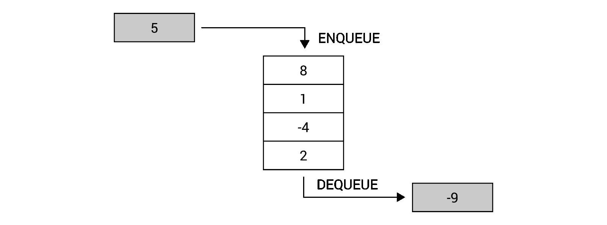
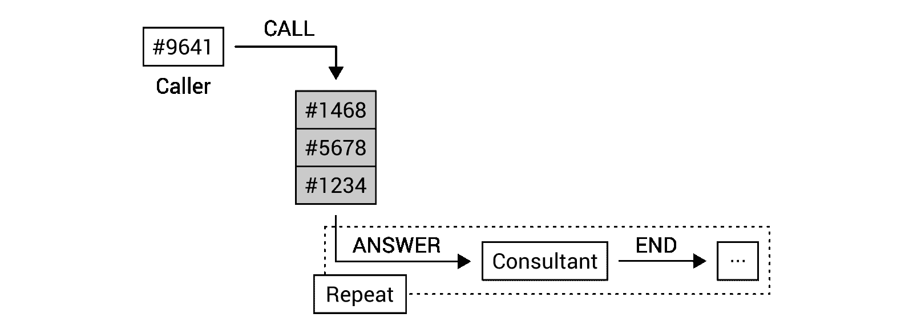
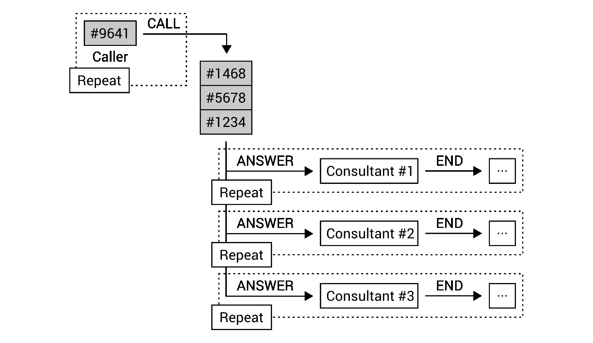
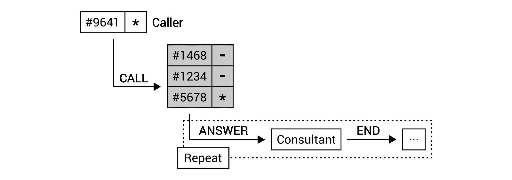

# 堆栈和队列

到目前为止，您已经了解了很多关于数组和列表的知识。然而，这些结构并不是唯一可用的结构。除此之外，还有一组更专业的数据结构，称为**有限访问数据结构**。

这是什么意思？为了解释名称，让我们暂时回到数组的主题，它属于**随机访问数据结构**组。它们之间的区别只有一个词，即有限或随机。如您所知，数组允许您存储数据并使用索引访问各种元素。因此，您可以很容易地从数组中获取第一个、中间的、*n*<sup>th</sup>或最后一个元素。因此，可以将其命名为随机访问数据结构。

然而，*有限*是什么意思？答案很简单，因为只有有限的访问数据结构，所以无法从结构中访问每个元素。因此，获取元素的方式是严格指定的。例如，您只能获取第一个或最后一个元素，但无法从数据结构中获取*n*<sup>th</sup>元素。有限访问数据结构的流行代表是堆栈和队列。

本章将介绍以下主题：

*   堆叠
*   排队
*   优先级队列

# 堆叠

首先，让我们讨论一个**堆栈**。它是一种易于理解的数据结构，可以使用一堆多个板的示例来表示，每个板都放在另一个板的顶部。您只能在桩顶部添加一个新板，并且只能从桩顶部获取一个板。如果不从顶部取下前六个板，则无法移除第七个板，并且无法将板添加到桩的中间。

堆栈以完全相同的方式运行！它允许您在顶部添加一个新元素（即**推**操作），然后从顶部移除元素（即**弹出**操作）。因此，堆栈符合**后进先出**原则，即**后进先出**。根据我们的板堆示例，最后添加的板（后进）将首先从板堆（先出）中移除。

具有 push 和 pop 操作的堆栈图如下所示：


这似乎很容易，不是吗？确实如此，您可以从使用`System.Collections.Generic`命名空间中内置的泛型`Stack`类的堆栈特性中获益。值得一提的是，此类中有三种方法，即：

*   `Push`，在堆栈顶部插入一个元素
*   `Pop`，从堆栈顶部移除一个元素并将其返回
*   `Peek`，从堆栈顶部返回元素而不移除它

当然，您还可以访问其他方法，例如从堆栈中删除所有元素（`Clear`），或者检查堆栈中是否存在给定元素（`Contains`）。您可以使用`Count`属性获取堆栈中的元素数。

值得注意的是，`Push`方法是*O（1）*操作，如果容量不需要增加，或者*O（n）*否则，其中*n*是堆栈中的元素数。`Pop`和`Peek`都是*O（1）*操作。

You can find more information about the `Stack` generic class at [https://msdn.microsoft.com/library/3278tedw.aspx](https://msdn.microsoft.com/library/3278tedw.aspx).

现在是看一些例子的时候了。走吧！

# 示例–反转单词

对于第一个示例，让我们尝试使用堆栈反转单词。您可以通过迭代形成字符串的字符，将每个字符添加到堆栈顶部，然后从堆栈中删除所有元素来实现这一点。最后，您会收到一个反转的单词，如下图所示，它显示了反转**MARCIN**单词的过程：


需要添加到`Program`类中`Main`方法的实现代码如下代码段所示：

```cs
Stack<char> chars = new Stack<char>(); 
foreach (char c in "LET'S REVERSE!") 
{ 
    chars.Push(c); 
} 

while (chars.Count > 0) 
{ 
    Console.Write(chars.Pop()); 
} 
Console.WriteLine(); 
```

在第一行中，创建了`Stack`类的一个新实例。值得一提的是，在这个场景中，堆栈只能包含`char`元素。然后，使用`foreach`循环遍历所有字符，并通过调用`Stack`实例上的`Push`方法将每个字符插入堆栈顶部。代码的其余部分由`while`循环组成，循环一直执行到堆栈为空。使用`Count`属性检查此条件。在每次迭代中，顶层元素从堆栈中移除（通过调用`Pop`并写入控制台中（使用`Console`类的`Write`静态方法）。

运行代码后，您将收到以下结果：

```cs
    !ESREVER S'TEL
```

# 例如：河内塔

下一个例子是一个非常复杂的堆栈应用程序。它与数学游戏**河内塔**有关。让我们从规则开始。游戏需要三根棍子，你可以把碟子放在上面。每个光盘都有不同的大小。开始时，将所有圆盘放置在第一根杆上，形成堆叠，从最小的（顶部）到最大的（底部），顺序如下：


游戏的目的是将所有碟片从第一棒（**从**移动到第二棒（**到**）。但是，在整个游戏过程中，您不能将较大的光盘放在较小的光盘上。此外，您一次只能移动一个光盘，当然，您只能从任何棒的顶部取出光盘。如何在杆之间移动圆盘以符合上述规则？问题可分为子问题。

让我们从仅移动一张光盘的示例开始。这种情况很简单，只需将盘从**从**杆移动到**到**杆即可，无需使用**辅助**杆。

更复杂的情况是移动两张光盘。在这种情况下，您应该将一个圆盘从**从**杆移动到**辅助**杆。然后，将剩余的光盘从**从**移动到**到**。最后，您只需将光盘从**辅助**移动到**到**。

如果要移动三张光盘，应首先使用前面描述的机制，将两张光盘从**从**移动到**辅助**。该操作将使用**至**杆作为辅助杆。然后，您将剩余的盘从**从**移动到**到**，然后使用中的**作为辅助杆，将两个盘从**辅助**移动到**到**杆。**

如您所见，您可以通过将*n-1*盘从**从**移动到**辅助**来解决移动*n*盘的问题，使用**到**作为辅助杆。然后，您应该将剩余的光盘从**从**移动到**到**。最后，您只需将*n-1*盘从**辅助**移动到**至**杆，使用的**作为辅助杆。**

这就是全部！既然您已经知道了基本规则，让我们继续代码。

首先，让我们关注`HanoiTower`类，它包含与游戏相关的逻辑。部分代码如下所示：

```cs
public class HanoiTower 
{ 
    public int DiscsCount { get; private set; } 
    public int MovesCount { get; private set; } 
    public Stack<int> From { get; private set; } 
    public Stack<int> To { get; private set; } 
    public Stack<int> Auxiliary { get; private set; } 
    public event EventHandler<EventArgs> MoveCompleted; (...) 
} 
```

该类包含五个属性，存储光盘总数（`DiscsCount`）、执行的移动次数（`MovesCount`）以及三个棒的表示形式（`From`、`To`、`Auxiliary`）。`MoveCompleted`事件也被声明。它将在每次移动后触发，以通知用户界面应该刷新。因此，您可以显示适当的内容，说明杆的当前状态。

除了属性和事件之外，该类还具有以下构造函数：

```cs
public HanoiTower(int discs) 
{ 
    DiscsCount = discs; 
    From = new Stack<int>(); 
    To = new Stack<int>(); 
    Auxiliary = new Stack<int>(); 
    for (int i = 1; i <= discs; i++) 
    { 
        int size = discs - i + 1; 
        From.Push(size); 
    } 
} 
```

构造函数只接受一个参数，即盘数（`discs`，并将其设置为`DiscsCount`属性的值。然后，创建`Stack`类的新实例，并将对它们的引用存储在`From`、`To`和`Auxiliary`属性中。最后，使用`for`循环创建必要数量的光盘，并将元素添加到第一个堆栈中（`From`。值得注意的是，`From`、`To`和`Auxiliary`堆栈只存储整数值（`Stack<int>`。每个整数值表示特定光盘的大小。由于杆间圆盘运动的规律，这些数据至关重要。

算法的操作是通过调用`Start`方法开始的，其代码如下所示：

```cs
public void Start() 
{ 
    Move(DiscsCount, From, To, Auxiliary); 
} 
```

该方法只调用`Move`递归方法，将光盘总数和引用作为参数传递给三个堆栈。然而，在`Move`方法中会发生什么？让我们看看里面：

```cs
public void Move(int discs, Stack<int> from, Stack<int> to,  
    Stack<int> auxiliary) 
{ 
    if (discs > 0) 
    { 
        Move(discs - 1, from, auxiliary, to); 

        to.Push(from.Pop()); 
        MovesCount++; 
        MoveCompleted?.Invoke(this, EventArgs.Empty); 

        Move(discs - 1, auxiliary, to, from); 
    } 
} 
```

正如您已经知道的，这个方法是递归调用的。因此，有必要指定一些退出条件，以防止无限次调用该方法。在这种情况下，当`discs`参数的值等于或小于零时，该方法将不会调用自身。如果该值大于零，则调用`Move`方法，但堆栈顺序改变。然后，将该元素从由第二个参数（`from`表示的堆栈中移除，并插入由第三个参数（`to`表示的堆栈顶部。在以下几行中，移动次数（`MovesCount`增加，`MoveCompleted`事件被触发。最后，再次调用`Move`方法，使用另一种配置的 rod order。通过多次调用此方法，光盘将从第一个（`From`杆）移动到第二个（`To`杆）。在`Move`方法中执行的操作与在杆之间移动*n*圆盘问题的描述一致，如本例引言中所述。

在创建了具有河内塔游戏逻辑的类之后，让我们看看如何创建用户界面，该界面允许您展示算法的以下动作。`Program`类中的必要更改如下：

```cs
private const int DISCS_COUNT = 10; 
private const int DELAY_MS = 250; 
private static int _columnSize = 30; 
```

首先，声明两个常量，即光盘总数（`DISCS_COUNT`，设置为`10`）和算法后续两次移动之间的延迟（以毫秒为单位）（`DELAY_MS`，设置为`250`）。此外，还声明了私有静态字段，它表示用于表示单个棒的字符数（`_columnSize`，设置为`30`。

`Program`类中的`Main`方法如下面的代码片段所示：

```cs
static void Main(string[] args) 
{ 
    _columnSize = Math.Max(6, GetDiscWidth(DISCS_COUNT) + 2); 
    HanoiTower algorithm = new HanoiTower(DISCS_COUNT); 
    algorithm.MoveCompleted += Algorithm_Visualize; 
    Algorithm_Visualize(algorithm, EventArgs.Empty); 
    algorithm.Start(); 
} 
```

首先，使用辅助`GetDiscWidth`方法计算单列（代表杆）的宽度，其代码将在后面显示。然后，创建`HanoiTower`类的一个新实例，并指示在触发`MoveCompleted`事件时调用`Algorithm_Visualize`方法。接下来，调用上述`Algorithm_Visualize`方法来表示游戏的初始状态。最后，调用`Start`方法开始在杆之间移动圆盘。

`Algorithm_Visualize`方法的代码如下：

```cs
private static void Algorithm_Visualize( 
    object sender, EventArgs e) 
{ 
    Console.Clear(); 

    HanoiTowers algorithm = (HanoiTowers)sender; 
    if (algorithm.DiscsCount <= 0) 
    { 
        return; 
    } 

    char[][] visualization = InitializeVisualization(algorithm); 
    PrepareColumn(visualization, 1, algorithm.DiscsCount,  
        algorithm.From); 
    PrepareColumn(visualization, 2, algorithm.DiscsCount,  
        algorithm.To); 
    PrepareColumn(visualization, 3, algorithm.DiscsCount,  
        algorithm.Auxiliary); 

    Console.WriteLine(Center("FROM") + Center("TO") +  
        Center("AUXILIARY")); 
    DrawVisualization(visualization); 
    Console.WriteLine(); 
    Console.WriteLine($"Number of moves: {algorithm.MovesCount}"); 
    Console.WriteLine($"Number of discs: {algorithm.DiscsCount}"); 

    Thread.Sleep(DELAY_MS); 
} 
```

算法的可视化应该在控制台中显示游戏的当前状态。因此，每当需要刷新时，`Algorithm_Visualize`方法就会清除控制台的当前内容（通过调用`Clear`方法）。然后，它调用`InitializeVisualization`方法来准备包含应该在控制台中写入的内容的锯齿状数组。此类内容由三列组成，通过调用`PrepareColumn`方法编写。调用之后，`visualization`数组包含的数据应该只显示在控制台中，而不需要任何额外的转换。为此，调用`DrawVisualization`方法。当然，标题和附加说明是使用`Console`类的`WriteLine`方法写入控制台的。

重要的角色由最后一行代码执行，其中调用了`Thread`类的`Sleep`方法（来自`System.Threading`名称空间）。它将当前线程挂起`DELAY_MS`毫秒。添加这样一行是为了以方便用户的方式呈现算法的以下步骤。

让我们看一看关于{ ToR.T0}方法的代码：

```cs
private static char[][] InitializeVisualization( 
    HanoiTowers algorithm) 
{ 
    char[][] visualization = new char[algorithm.DiscsCount][]; 

    for (int y = 0; y < visualization.Length; y++) 
    { 
        visualization[y] = new char[_columnSize * 3]; 
        for (int x = 0; x < _columnSize * 3; x++) 
        { 
            visualization[y][x] = ' '; 
        } 
    } 

    return visualization; 
} 
```

该方法声明了交错数组，行数等于磁盘总数（即`DiscsCount`属性）。列数等于`_columnSize`字段值乘以`3`（表示三根杆）。在该方法中，两个`for`循环用于遍历以下行（第一个`for`循环）和所有列（第二个`for`循环）。默认情况下，数组中的所有元素都用单个空格初始化。最后，返回初始化的数组。

要用棒的当前状态图填充上述锯齿状数组，需要调用`PrepareColumn`方法，其代码如下：

```cs
private static void PrepareColumn(char[][] visualization,  
    int column, int discsCount, Stack<int> stack) 
{ 
    int margin = _columnSize * (column - 1); 
    for (int y = 0; y < stack.Count; y++) 
    { 
        int size = stack.ElementAt(y); 
        int row = discsCount - (stack.Count - y); 
        int columnStart = margin + discsCount - size; 
        int columnEnd = columnStart + GetDiscWidth(size); 
        for (int x = columnStart; x <= columnEnd; x++) 
        { 
            visualization[row][x] = '='; 
        } 
    } 
} 
```

首先，计算左边距以在整个数组的正确部分中添加数据，即在正确的列范围内。然而，该方法的主要部分是`for`循环，其中迭代次数等于给定堆栈中的光盘数量。在每次迭代中，使用`ElementAt`扩展方法（从`System.Linq`名称空间）读取当前光盘的大小。接下来，计算一行的索引，其中应该显示光盘，以及列的开始索引和结束索引。最后，使用`for`循环在锯齿阵列的适当位置插入等号（`=`，作为`visualization`参数传递。

下一个可视化相关方法是`DrawVisualization`，具体如下：

```cs
private static void DrawVisualization(char[][] visualization) 
{ 
    for (int y = 0; y < visualization.Length; y++) 
    { 
        Console.WriteLine(visualization[y]); 
    } 
} 
```

该方法只是遍历作为`visualization`参数传递的锯齿状数组的所有元素，并为位于锯齿状数组中的每个数组调用`WriteLine`方法。因此，位于整个阵列中的数据被写入控制台。

辅助方法之一是`Center`。其目的是在作为参数传递的文本前后添加额外的空格，以使文本在列中居中。此方法的代码如下所示：

```cs
private static string Center(string text) 
{ 
    int margin = (_columnSize - text.Length) / 2; 
    return text.PadLeft(margin + text.Length) 
        .PadRight(_columnSize); 
} 
```

另一种方法是`GetDiscWidth`，它只返回以参数指定的大小呈现光盘所需的字符数。其代码如下：

```cs
private static int GetDiscWidth(int size) 
{ 
    return 2 * size - 1; 
} 
```

您已经添加了运行应用程序所需的代码，该应用程序将在河内塔数学游戏中呈现以下动作。让我们启动该应用程序并查看它的运行情况！

启动程序后，您将看到与以下类似的结果，其中所有光盘都位于第一根棒中（`FROM`）：

```cs
            FROM                  TO                AUXILIARY
             ==
            ====
           ======
          ========
         ==========
        ============
       ==============
      ================
     ==================
    ====================

```

在下一步中，将最小的圆盘从第一根杆的顶部（`FROM`）移动到第三根杆的顶部（`AUXILIARY`），如下图所示：

```cs
            FROM                  TO                AUXILIARY    

            ====
           ======
          ========
         ==========
        ============
       ==============
      ================
     ==================
    ====================                               ==

```

在进行许多其他移动时，您可以看到光盘是如何在所有三根杆之间移动的。中间状态之一如下所示：

```cs
            FROM                  TO                AUXILIARY          

            ====
         ==========
        ============
       ==============
      ================
     ==================         ======
    ====================       ========                ==

```

完成必要的移动后，所有光盘都将从第一张光盘（`FROM`）移动到第二张光盘（`TO`）。最终结果如下图所示：

```cs
            FROM                  TO                AUXILIARY
                                  ==
                                 ====
                                ======
                               ========
                              ==========
                             ============
                            ==============
                           ================
                          ==================
                         ====================

```

最后，值得一提的是完成河内塔游戏所需的动作数量。对于 10 张光盘，移动次数为 1023 次。如果只使用三张光盘，则移动次数仅为七次。一般来说，移动次数可以用公式*2<sup>n</sup>-1*计算，其中*n*为盘数。

这就是全部！在本节中，您已经学习了第一个受限访问数据结构，即堆栈。现在，是时候让您了解更多关于队列的信息了。让我们开始吧！

# 排队

**队列**是一种数据结构，可以使用结帐时在商店排队等候的人的例子来表示。新人站在队伍的尽头，下一个人从队伍的开始就被带到收银台。你不允许从中间选择一个人，并以不同的顺序为他或她服务。

队列数据结构以完全相同的方式运行。您只能在队列末尾添加新元素（即**入队列**操作），而只能从队列开头删除一个元素（即**出队列**操作）。因此，此数据结构符合**FIFO**原则，即**先进先出**。在这个示例中，关于在收银台的商店中排队等候的人，先来的人（先入）将在后来的人（先出）之前得到服务。

队列的操作如下图所示：



值得一提的是，队列是一种**递归数据结构**，类似于堆栈。这意味着队列可以是空的，也可以由第一个元素和队列的其余部分组成，这也形成了一个队列，如下图所示（队列的开头用灰色标记）：


队列数据结构似乎很容易理解，除了删除元素的方式外，它与堆栈类似。这是否意味着您也可以使用内置类在程序中使用队列？幸运的是，是的！可用的泛型类名为`Queue`，并在`System.Collections.Generic`命名空间中定义。

`Queue`类包含一组方法，例如：

*   `Enqueue`，在队列末尾添加一个元素
*   `Dequeue`，从开头移除一个元素并返回
*   `Peek`，从一开始就返回一个元素，而不删除它
*   `Clear`，从队列中删除所有元素
*   `Contains`，检查队列是否包含给定元素

`Queue`类还包含`Count`属性，该属性返回位于队列中的元素总数。它可用于轻松检查队列是否为空。

值得一提的是，`Enqueue`方法是*O（1）*操作，如果内部数组不需要重新分配，或者*O（n）*否则，其中*n*是队列中的元素数。`Dequeue`和`Peek`都是*O（1）*操作。

You can find more information about the `Queue` class at [https://msdn.microsoft.com/library/7977ey2c.aspx](https://msdn.microsoft.com/library/7977ey2c.aspx).

对于希望同时使用来自多个线程的队列的场景，附加注释是必需的。在这种情况下，需要选择队列的线程安全变量，该变量由来自`System.Collections.Concurrent`命名空间的`ConcurrentQueue`泛型类表示。此类包含一组内置方法，用于执行线程安全队列的各种操作，例如：

*   `Enqueue`，在队列末尾添加一个元素
*   `TryDequeue`，尝试从开头删除一个元素并返回它
*   `TryPeek`，尝试从一开始返回一个元素而不删除它

值得一提的是，`TryDequeue`和`TryPeek`都有一个带有`out`关键字的参数。如果操作成功，这些方法返回`true`，结果作为`out`参数的值返回。此外，`ConcurrentQueue`类还包含两个属性，`Count`用于获取集合中存储的元素数量，`IsEmpty`用于返回指示队列是否为空的值。

You can find more information about the `ConcurrentQueue` class at [https://msdn.microsoft.com/library/dd267265.aspx](https://msdn.microsoft.com/library/dd267265.aspx).

在这篇简短的介绍之后，您应该准备好进入两个示例，这两个示例在呼叫中心的上下文中表示一个队列，其中有许多呼叫者和一个或多个顾问。

# 示例–呼叫中心和一名顾问

第一个示例表示呼叫中心解决方案的简单方法，其中有许多呼叫者（具有不同的客户标识符），只有一名顾问按照等待呼叫出现的相同顺序接听呼叫。此场景如下图所示：



如上图所示，调用方执行四个调用。他们被添加到等待电话的队列中，即来自客户**【1234】****【5678】****【1468】**和**【9641】**的电话。当顾问有空时，他或她会接听电话。当通话结束时，顾问可以接听下一个等待的通话。根据此规则，顾问将按照以下顺序与客户交谈：**【1234】****【5678】****【1468】****。**

 **让我们看一下第一个类的代码，名为 EndoT0Ep，它表示由呼叫者执行的单个传入呼叫。其代码如下：

```cs
public class IncomingCall 
{ 
    public int Id { get; set; } 
    public int ClientId { get; set; } 
    public DateTime CallTime { get; set; } 
    public DateTime StartTime { get; set; } 
    public DateTime EndTime { get; set; } 
    public string Consultant { get; set; } 
} 
```

该类包含六个属性，分别表示呼叫的标识符（`Id`）、客户标识符（`ClientId`）、呼叫开始的日期和时间（`CallTime`）、应答的日期和时间（`StartTime`）以及结束的日期和时间（`EndTime`），以及顾问的姓名（`Consultant`。

这个实现最重要的部分与`CallCenter`类相关，它表示与调用相关的操作。其片段如下：

```cs
public class CallCenter 
{ 
    private int _counter = 0; 
    public Queue<IncomingCall> Calls { get; private set; } 

    public CallCenter() 
    { 
        Calls = new Queue<IncomingCall>(); 
    } 
} 
```

`CallCenter`类包含`_counter`字段以及`Calls`队列（包含`IncomingCall`实例），其中存储等待呼叫的数据。在构造函数中，将创建一个新的`Queue`泛型类实例，并将其引用分配给`Calls`属性。

当然，这个类也包含一些方法，比如`Call`，代码如下：

```cs
public void Call(int clientId) 
{ 
    IncomingCall call = new IncomingCall() 
    { 
        Id = ++_counter, 
        ClientId = clientId, 
        CallTime = DateTime.Now 
    }; 
    Calls.Enqueue(call); 
} 
```

在这里，您创建了`IncomingCall`类的一个新实例，并设置了它的属性值，即它的标识符（以及预递增`_counter`字段）、客户端标识符（使用`clientId`参数）和调用时间。通过调用`Enqueue`方法将创建的实例添加到队列中。

下一种方法是`Answer`，代表从排队等待时间最长的人（即位于队列开始处）接听呼叫的操作。`Answer`方法如以下代码片段所示：

```cs
public IncomingCall Answer(string consultant) 
{ 
    if (Calls.Count > 0) 
    { 
        IncomingCall call = Calls.Dequeue(); 
        call.Consultant = consultant; 
        call.StartTime = DateTime.Now; 
        return call; 
    } 
    return null; 
} 
```

在此方法中，检查队列是否为空。如果是，则该方法返回`null`，这意味着没有顾问可以接听的电话。否则，调用将从队列中移除（使用`Dequeue`方法），并通过设置顾问名称（使用`consultant`参数）和开始时间（到当前日期和时间）更新其属性。最后，返回调用的数据。

除了`Call`和`Answer`方法外，您还应该实现`End`方法，该方法在顾问结束与特定客户的通话时调用。在这种情况下，您只需设置结束时间，如下代码所示：

```cs
public void End(IncomingCall call) 
{ 
    call.EndTime = DateTime.Now; 
} 
```

`CallCenter`类中的最后一个方法名为`AreWaitingCalls`。它使用`Queue`类的`Count`属性返回一个值，该值指示队列中是否有等待的调用。其代码如下：

```cs
public bool AreWaitingCalls() 
{ 
    return Calls.Count > 0; 
} 
```

让我们进入`Program`类及其`Main`方法：

```cs
static void Main(string[] args) 
{ 
    Random random = new Random(); 

    CallCenter center = new CallCenter(); 
    center.Call(1234); 
    center.Call(5678); 
    center.Call(1468); 
    center.Call(9641); 

    while (center.AreWaitingCalls()) 
    { 
        IncomingCall call = center.Answer("Marcin"); 
        Log($"Call #{call.Id} from {call.ClientId}  
            is answered by {call.Consultant}."); 
        Thread.Sleep(random.Next(1000, 10000)); 
        center.End(call); 
        Log($"Call #{call.Id} from {call.ClientId}  
            is ended by {call.Consultant}."); 
    } 
} 
```

在这里，您创建了一个`Random`类的新实例（用于获取随机数），以及一个`CallCenter`类的实例。然后，模拟呼叫者拨打几个电话，即使用以下客户端标识符：`1234`、`5678`、`1468`和`9641`。代码中最有趣的部分位于`while`循环中，该循环一直执行到队列中没有等待的调用为止。在循环中，顾问应答呼叫（使用`Answer`方法）并生成日志（使用`Log`辅助方法）。然后，线程被挂起一个随机的毫秒数（1000 到 10000 之间），以模拟调用的不同长度。当此过程结束时，调用结束（通过调用`End`方法），并生成正确的日志。

本例所需代码的最后一部分是`Log`方法：

```cs
private static void Log(string text) 
{ 
    Console.WriteLine($"[{DateTime.Now.ToString("HH:mm:ss")}]  
        {text}"); 
} 
```

运行该示例时，您将收到与以下类似的结果：

```cs
    [15:24:36] Call #1 from 1234 is answered by Marcin.
    [15:24:40] Call #1 from 1234 is ended by Marcin.
    [15:24:40] Call #2 from 5678 is answered by Marcin.
    [15:24:48] Call #2 from 5678 is ended by Marcin.
    [15:24:48] Call #3 from 1468 is answered by Marcin.
    [15:24:53] Call #3 from 1468 is ended by Marcin.
    [15:24:53] Call #4 from 9641 is answered by Marcin.
    [15:24:57] Call #4 from 9641 is ended by Marcin.

```

这就是全部！您刚刚完成了关于队列数据结构的第一个示例。如果您想更多地了解队列的线程安全版本，让我们继续下一节，看看下一个示例。

# 示例–拥有众多顾问的呼叫中心

上一节中所示的示例经过了有意简化，以使理解队列更加简单。然而，现在是时候让它更贴近现实世界的问题了。在本节中，您将看到如何扩展它以支持许多顾问，如下图所示：



重要的是，呼叫者和顾问将同时工作。如果传入呼叫多于可用的顾问，则会将新呼叫添加到队列中，并等待有顾问可以接听该呼叫。如果有太多的顾问和很少的电话，顾问将等待一个电话。要执行此任务，您将创建几个线程，这些线程将访问队列。因此，您需要使用`ConcurrentQueue`类使用队列的线程安全版本。

让我们看一下代码！首先，您需要声明`IncomingCall`类，其代码与上一个示例完全相同：

```cs
public class IncomingCall 
{ 
    public int Id { get; set; } 
    public int ClientId { get; set; } 
    public DateTime CallTime { get; set; } 
    public DateTime StartTime { get; set; } 
    public DateTime EndTime { get; set; } 
    public string Consultant { get; set; } 
} 
```

`CallCenter`类中有各种必要的修改，例如用`ConcurrentQueue`泛型类的实例替换`Queue`类的实例。合适的片段显示在以下代码段中：

```cs
public class CallCenter 
{ 
    private int _counter = 0; 
    public ConcurrentQueue<IncomingCall> Calls  
        { get; private set; } 

    public CallCenter() 
    { 
        Calls = new ConcurrentQueue<IncomingCall>(); 
    } 
} 
```

由于`Enqueue`方法在`Queue`和`ConcurrentQueue`类中都可用，因此`Call`方法中最重要的部分无需更改。但是，在向队列添加新呼叫后，引入了一个小的修改来返回等待呼叫的数量。修改后的代码如下：

```cs
public int Call(int clientId) 
{ 
    IncomingCall call = new IncomingCall() 
    { 
        Id = ++_counter, 
        ClientId = clientId, 
        CallTime = DateTime.Now 
    }; 
    Calls.Enqueue(call); 
    return Calls.Count; 
} 
```

`ConcurrentQueue`类中不存在`Dequeue`方法。因此，您需要稍微修改`Answer`方法以使用`TryDequeue`方法，该方法返回一个值，指示是否从队列中删除元素。使用`out`参数返回删除的元素。代码的适用部分如下所示：

```cs
public IncomingCall Answer(string consultant) 
{ 
    if (Calls.Count > 0  
        && Calls.TryDequeue(out IncomingCall call)) 
    { 
        call.Consultant = consultant; 
        call.StartTime = DateTime.Now; 
        return call; 
    } 
    return null; 
} 
```

在`CallCenter`类中声明的其余方法，即`End`和`AreWaitingCalls`中不需要进一步修改。其代码如下：

```cs
public void End(IncomingCall call) 
{ 
    call.EndTime = DateTime.Now; 
}

public bool AreWaitingCalls() 
{ 
    return Calls.Count > 0; 
}
```

`Program`类中需要进行更多的更改。在这里，您需要启动四个线程。第一个代表呼叫者，另外三个代表顾问。首先，让我们来看看 AUTYT1 方法的代码：

```cs
static void Main(string[] args) 
{ 
    CallCenter center = new CallCenter(); 
    Parallel.Invoke( 
        () => CallersAction(center), 
        () => ConsultantAction(center, "Marcin",  
                  ConsoleColor.Red), 
        () => ConsultantAction(center, "James",  
                  ConsoleColor.Yellow), 
        () => ConsultantAction(center, "Olivia",  
                  ConsoleColor.Green)); 
} 
```

在这里，在创建了`CallCenter`实例之后，您使用`System.Threading.Tasks`命名空间中`Parallel`类的`Invoke`静态方法开始执行四个操作，即表示调用者和三个顾问。lambda 表达式用于指定将被调用的方法，即用于调用方相关操作的`CallersAction`和用于顾问相关任务的`ConsultantAction`。您还可以指定其他参数，例如给定顾问的名称和颜色。

`CallersAction`方法表示许多调用方以循环方式执行的操作。其代码显示在以下方框中：

```cs
private static void CallersAction(CallCenter center) 
{ 
    Random random = new Random(); 
    while (true) 
    { 
        int clientId = random.Next(1, 10000); 
        int waitingCount = center.Call(clientId); 
        Log($"Incoming call from {clientId},  
            waiting in the queue: {waitingCount}"); 
        Thread.Sleep(random.Next(1000, 5000)); 
    } 
}
```

代码最重要的部分是`while`循环，它被无限执行。在它里面，您会得到一个随机数作为客户机的标识符（`clientId`，并调用`Call`方法。将记录等待呼叫的数量以及客户端标识符。最后，与呼叫者相关的线程被挂起 1000 ms 到 5000 ms 之间的随机毫秒数，即 1 到 5 秒，以模拟呼叫者发出的另一个调用之间的延迟。

下一个方法名为`ConsultantAction`，在每个顾问的单独线程上执行。该方法采用三个参数，即`CallCenter`类的一个实例，以及顾问的名称和颜色。代码如下：

```cs
private static void ConsultantAction(CallCenter center,  
    string name, ConsoleColor color) 
{ 
    Random random = new Random(); 
    while (true) 
    { 
        IncomingCall call = center.Answer(name); 
        if (call != null) 
        { 
            Console.ForegroundColor = color; 
            Log($"Call #{call.Id} from {call.ClientId} is answered  
                by {call.Consultant}."); 
            Console.ForegroundColor = ConsoleColor.Gray; 

            Thread.Sleep(random.Next(1000, 10000)); 
            center.End(call); 

            Console.ForegroundColor = color; 
            Log($"Call #{call.Id} from {call.ClientId}  
                is ended by {call.Consultant}."); 
            Console.ForegroundColor = ConsoleColor.Gray; 

            Thread.Sleep(random.Next(500, 1000)); 
        } 
        else 
        { 
            Thread.Sleep(100); 
        } 
    } 
} 
```

与`CallersAction`方法类似，最重要和有趣的操作在无限`while`循环中执行。在其中，顾问尝试使用`Answer`方法接听第一个等待的电话。如果没有等待调用，线程将暂停 100 毫秒。否则，日志将以适当的颜色显示，具体取决于当前顾问。然后，线程被挂起 1 到 10 秒之间的随机时间段。在此之后，顾问结束调用，调用`End`方法表示，并生成日志。最后，线程被挂起 500 ms 到 1000 ms 之间的随机时间，这表示一个调用结束到另一个调用开始之间的延迟。

最后一个辅助方法名为`Log`，与前面的示例完全相同。其代码如下：

```cs
private static void Log(string text) 
{ 
    Console.WriteLine($"[{DateTime.Now.ToString("HH:mm:ss")}]  
        {text}"); 
} 
```

运行程序并等待一段时间后，您将收到与以下屏幕截图所示结果类似的结果：


祝贺您刚刚完成了两个示例，它们表示在呼叫中心场景中队列的应用。

It is a good idea to modify various parameters of the program, such as the number of consultants, as well as delay times, especially the delay between the following calls performed by the callers. Then, you will see how the algorithm works in the case when there are too many callers or consultants.

但是，您如何处理具有优先支持的客户？在当前解决方案中，他们将与具有标准支持计划的客户端在同一队列中等待。您是否需要创建两个队列并首先从优先队列中获取客户端？如果是这样，如果引入另一个支持计划，会发生什么？是否需要添加另一个队列并在代码中引入此类修改？幸运的是，没有！您可以使用另一种数据结构，即优先级队列，来支持这种场景，如下一节中详细解释的那样。

# 优先级队列

**优先级队列**可以通过为队列中的每个元素设置**优先级**来扩展队列的概念。值得一提的是，优先级可以简单地指定为整数值。但是，值越小或越大表示优先级越高，这取决于实现。在本章中，假设最高优先级等于 0，而较低优先级由 1、2、3 等指定。因此，**出列**操作将返回优先级最高的元素，该元素已首先添加到队列中，如下图所示：


让我们分析一下图表。首先，优先级队列包含两个具有相同优先级的元素（等于**1**），即**Marcin**和**Lily**。然后，添加优先级较高的**Mary**元素（**0**，这意味着该元素位于队列的开头，即在**Marcin**之前。在下一步中，**John**元素被添加为具有最低优先级的元素（**2**，因此它被添加到优先级队列的末尾。第三列显示添加了优先级等于**1**的**Emily**元素，即与**Marcin**和**Lily**相同。因此，在**莉莉**之后添加了**艾米丽**元素。根据上述规则，您添加以下元素，即优先级设置为**0**的**Sarah**和优先级等于**1**的**Luke**。最后的顺序显示在上图的右侧。

当然，您可以自己实现优先级队列。但是，您可以通过使用一个可用的 NuGet 包，即`OptimizedPriorityQueue`，来简化此任务。有关此套餐的更多信息，请访问[https://www.nuget.org/packages/OptimizedPriorityQueue](https://www.nuget.org/packages/OptimizedPriorityQueue) 。

您知道如何将此包添加到项目中吗？如果没有，则应遵循以下步骤：

1.  在解决方案资源管理器窗口中，从项目节点的上下文菜单中选择 Manage NuGet Packages。
2.  在打开的窗口中选择“浏览”选项卡。
3.  在搜索框中键入`OptimizedPriorityQueue`。
4.  单击 OptimizedPriorityQueue 项目。
5.  按下右侧的安装按钮。
6.  在“预览更改”窗口中单击“确定”。
7.  等待直到输出窗口中显示完成的消息。

`OptimizedPriorityQueue`库大大简化了优先级队列在各种应用程序中的应用。其中有`SimplePriorityQueue`泛型类，包含一些有用的方法，如：

*   `Enqueue`，向优先级队列添加元素
*   `Dequeue`，从开头移除一个元素并返回
*   `GetPriority`，返回元素的优先级
*   `UpdatePriority`，更新元素的优先级
*   `Contains`，检查优先级队列中是否存在元素
*   `Clear`删除优先级队列中的所有元素

您可以使用`Count`属性获取队列中的元素数。如果希望从优先级队列的开头获取元素而不删除它，可以使用`First`属性。此外，该类包含一组方法，这些方法在多线程场景中非常有用，例如`TryDequeue`和`TryRemove`。值得一提的是，`Enqueue`和`Dequeue`方法都是*O（logn）*操作。

在简要介绍了优先级队列主题之后，让我们继续讨论具有优先级支持的呼叫中心的示例，该示例将在下一节中介绍。

# 示例–具有优先支持的呼叫中心

作为优先级队列的一个示例，让我们介绍呼叫中心示例的一种简单方法，其中有许多呼叫者（具有不同的客户端标识符），只有一名顾问接听等待的呼叫，首先来自优先级队列，然后来自具有标准支持计划的客户端。

下图显示了上述场景。标准优先级的呼叫标记为**-**，支持优先级的呼叫标记为*****，如下图：



让我们看一下优先级队列中元素的顺序。目前，它只包含三个元素，将按以下顺序提供：**【5678】**（谁有优先支持）、**【1234】**和**【1468】**。然而，来自标识符为**的客户端的呼叫导致订单更改为**【5678】**、**【9641】**（由于优先支持）、**【1234】**和****。******

 ****是时候写一些代码了！首先，如前所述，不要忘记将`OptimizedPriorityQueue`包添加到项目中。当库配置正确后，可以继续实现`IncomingCall`类：

```cs
public class IncomingCall 
{ 
    public int Id { get; set; } 
    public int ClientId { get; set; } 
    public DateTime CallTime { get; set; } 
    public DateTime StartTime { get; set; } 
    public DateTime EndTime { get; set; } 
    public string Consultant { get; set; } 
    public bool IsPriority { get; set; } 
} 
```

这里，与前面介绍的简单呼叫中心应用程序场景相比，只有一个变化，即添加了`IsPriority`属性。指示当前呼叫是否具有优先级支持（`true`）或标准支持（`false`）。

`CallCenter`类中还需要进行一些修改，其片段如以下代码片段所示：

```cs
public class CallCenter 
{ 
    private int _counter = 0; 
    public SimplePriorityQueue<IncomingCall> Calls  
        { get; private set; } 

    public CallCenter() 
    { 
        Calls = new SimplePriorityQueue<IncomingCall>(); 
    } 
} 
```

如您所见，`Calls`属性的类型已从`Queue`更改为`SimplePriorityQueue`泛型类。`Call`方法需要进行以下更改，代码如下：

```cs
public void Call(int clientId, bool isPriority = false) 
{ 
    IncomingCall call = new IncomingCall() 
    { 
        Id = ++_counter, 
        ClientId = clientId, 
        CallTime = DateTime.Now, 
        IsPriority = isPriority 
    }; 
    Calls.Enqueue(call, isPriority ? 0 : 1); 
} 
```

在此方法中，使用参数设置`IsPriority`属性（前面提到）的值。此外，在调用`Enqueue`方法时，使用了两个参数，不仅是元素的值（一个`IncomingCall`类的实例），而且是优先级的整数值，即在支持优先级的情况下为`0`，否则为`1`。

`CallCenter`类的方法不再需要修改，即`Answer`、`End`和`AreWaitingCalls`中的方法。有关守则如下：

```cs
public IncomingCall Answer(string consultant) 
{ 
    if (Calls.Count > 0) 
    { 
        IncomingCall call = Calls.Dequeue(); 
        call.Consultant = consultant; 
        call.StartTime = DateTime.Now; 
        return call; 
    } 
    return null; 
}

public void End(IncomingCall call) 
{ 
    call.EndTime = DateTime.Now; 
}

public bool AreWaitingCalls() 
{ 
    return Calls.Count > 0; 
} 
```

最后，让我们看一看在 Type T2R 类中的{ To0T0}和 AuthT1 方法的代码：

```cs
static void Main(string[] args) 
{ 
    Random random = new Random(); 

    CallCenter center = new CallCenter(); 
    center.Call(1234); 
    center.Call(5678, true); 
    center.Call(1468); 
    center.Call(9641, true); 

    while (center.AreWaitingCalls()) 
    { 
        IncomingCall call = center.Answer("Marcin"); 
        Log($"Call #{call.Id} from {call.ClientId}  
            is answered by {call.Consultant} /  
            Mode: {(call.IsPriority ? "priority" : "normal")}."); 
        Thread.Sleep(random.Next(1000, 10000)); 
        center.End(call); 
        Log($"Call #{call.Id} from {call.ClientId}  
            is ended by {call.Consultant}."); 
    } 
} 
private static void Log(string text) 
{ 
    Console.WriteLine($"[{DateTime.Now.ToString("HH:mm:ss")}]  
        {text}"); 
} 
```

您可能会惊讶地发现，在这部分代码中只需要两个更改！原因是关于所用数据结构的逻辑隐藏在`CallCenter`类中。在`Program`类中，调用一些方法并使用`CallCenter`类公开的属性。您只需修改将呼叫添加到队列的方式，以及调整顾问接听呼叫时显示的日志，以显示呼叫的优先级。这就是全部！

运行应用程序时，您将收到与以下类似的结果：

```cs
    [15:40:26] Call #2 from 5678 is answered by Marcin / Mode:    
 **priority**.
    [15:40:35] Call #2 from 5678 is ended by Marcin.
    [15:40:35] Call #4 from 9641 is answered by Marcin / Mode: 
 **priority**.
    [15:40:39] Call #4 from 9641 is ended by Marcin.
    [15:40:39] Call #1 from 1234 is answered by Marcin / Mode: **normal**.
    [15:40:48] Call #1 from 1234 is ended by Marcin.
    [15:40:48] Call #3 from 1468 is answered by Marcin / Mode: **normal**.
    [15:40:57] Call #3 from 1468 is ended by Marcin.

```

正如你所看到的，电话的顺序是正确的。这意味着，具有优先支持的客户端的呼叫比具有标准支持计划的客户端的呼叫更早得到服务，尽管这类呼叫需要等待更长的时间才能应答。

# 总结

在本章中，您已经了解了三种有限访问数据结构，即堆栈、队列和优先级队列。值得记住的是，此类数据结构严格指定了访问元素的方式。所有这些都有各种各样的实际应用，本书中已经提到并描述了一些。

首先，您看到了堆栈如何根据后进先出原则进行操作。在这种情况下，只能在堆栈顶部添加元素（推操作），而只能从顶部删除元素（弹出操作）。堆栈已在两个示例中显示，即用于反转单词和求解河内塔数学游戏。

在本章的下一部分中，您将了解队列作为一种数据结构，它根据 FIFO 原理进行操作。在本例中，介绍了排队和出列操作。使用两个示例解释了队列，这两个示例都与模拟呼叫中心的应用程序有关。此外，您还学习了如何运行几个线程，以及如何使用队列的线程安全变体，该变体在使用 C#语言开发应用程序时可用。

本章中显示的第三种数据结构称为优先级队列，是支持特定元素优先级的队列的扩展。为了简化此数据结构的使用，我们向您展示了如何使用外部 NuGet 包。例如，呼叫中心场景已扩展为处理两个支持计划。

这只是本书的第三章，您已经学习了很多关于各种数据结构和算法的知识，这些知识在 C#中开发应用程序时非常有用！你有兴趣通过学习字典和集合来增加你的知识吗？如果是这样，让我们继续下一章，了解更多关于此类数据结构的信息！******