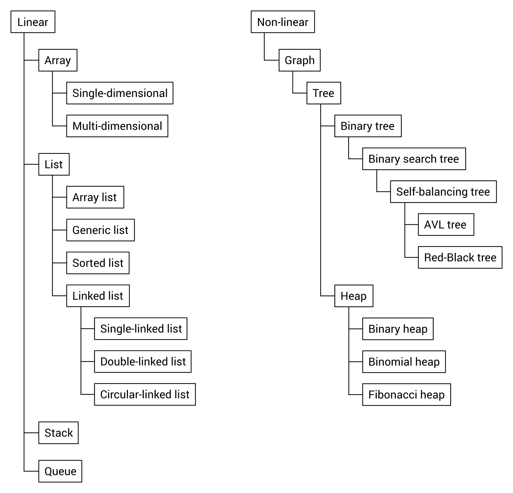
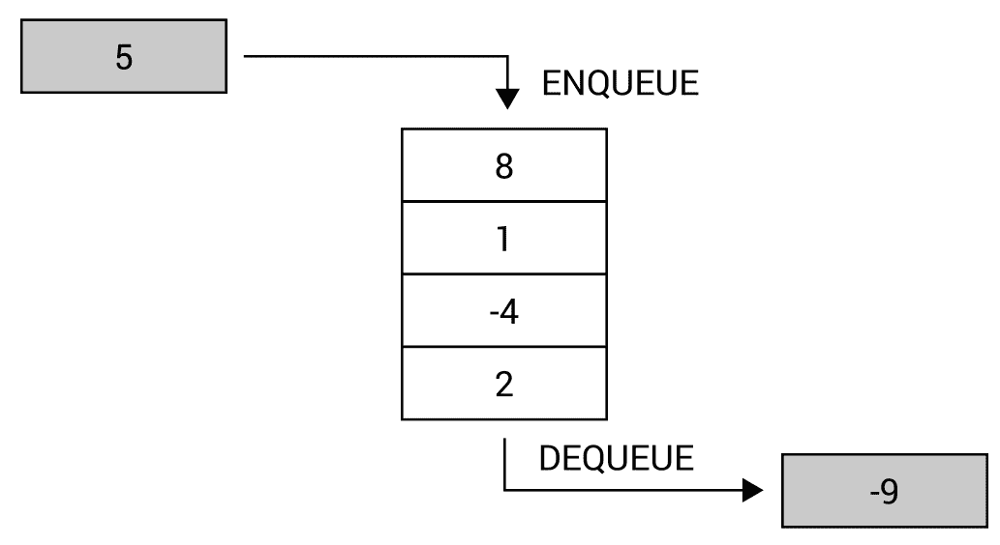

# 七、总结

在阅读本书的许多页面的同时，您已经了解了许多关于各种数据结构和算法的知识，这些知识可以在使用 C# 语言开发应用时使用。数组、列表、栈、队列、字典、散列集、树、堆和图，以及伴随的算法。这是一个相当广泛的主题，不是吗？现在是总结这些知识的时候了，同时也要提醒您一些特定结构的特定应用。

首先，您将看到数据结构的简要分类，分为两组，即线性和非线性。然后，考虑到各种数据结构应用的多样性。您将看到所描述的每个数据结构的简短摘要，以及有关使用特定数据结构可以解决的一些问题的信息。

你准备好开始读最后一章了吗？如果是这样的话，让我们来欣赏一下，看看你在阅读前几章时学到了多少主题。走吧！

本章将介绍以下主题：

*   数据结构分类
*   应用的多样性

# 数据结构分类

正如您在阅读本书时所看到的，有许多数据结构和许多配置变量。因此，选择合适的数据结构并非易事，这可能会对所开发解决方案的性能产生重大影响。甚至本书中提到的主题也形成了一个相当长的描述数据结构列表。因此，最好以某种方式对它们进行分类。

在本章中，所描述的数据结构分为线性和非线性两类。线性数据结构中的每个元素可以在逻辑上与后面或前面的元素相邻。在非线性数据结构的情况下，单个元素可以在逻辑上与多个其他元素相邻，而不一定只有一个或两个。它们可以在整个内存中自由分布。

让我们看一下下面的图表，它显示了根据上述标准对数据结构的分类：

如您所见，线性数据结构组包含数组、列表、栈和队列。当然，您还应该注意上述数据结构的各种子类型，例如链表的三种变体，链表是列表的子类型。

在非线性数据结构的情况下，图形起着最重要的作用，因为它还包括树子类型。此外，树包括二叉树和堆，而二叉搜索树是二叉树的一个子类型。同样，您可以描述本书中介绍和解释的其他数据结构之间的关系。

# 应用的多样性

你还记得书中所有的数据结构吗？由于所描述的主题数量很多，因此最好再次查看以下数据结构及其相关算法，仅以简短摘要的形式，提供一些实际应用的信息。

# 阵列

让我们从数组开始，这是第一章的两个主要主题之一。您可以使用此数据结构来存储许多相同类型的变量，例如`int`、`string`或用户定义的类。重要的假设是数组中的元素数在初始化后不能更改。此外，数组属于随机访问数据结构，这意味着您可以使用索引访问数组中的第一个、中间的、*n*-th 或最后一个元素。您可以从阵列的几个变体中获益，即一维、多维和锯齿状阵列，也称为阵列阵列。

所有这些变体如下图所示：

有很多阵列应用，作为开发人员，您可能已经多次使用过这种数据结构。在本书中，您已经了解了如何使用它存储各种数据，例如月份名称、乘法表，甚至是游戏地图。在最后一种情况下，您创建了一个与地图大小相同的二维阵列，其中每个元素指定特定类型的地形，例如草地或墙。

有许多算法在阵列上执行各种操作。但是，最常见的任务之一是对数组进行排序，使其元素按正确的顺序（升序或降序）排列。本书重点介绍四种算法，即选择排序、插入排序、冒泡排序以及快速排序。

# 列表

第一章中描述的下一组数据结构与列表相关。它们类似于数组，但可以在必要时动态增加集合的大小。在下图中，您可以看到列表的几个变体，即单链接、双链接和循环链接：

值得一提的是，内置实现可用于数组列表（`ArrayList`）及其通用（`List`）和排序（`SortedList`变体。后者可以理解为键值对的集合，总是按键排序。

简短的注释可能对单链接、双链接和循环链接列表有益。第一个数据结构使用`Next`属性可以轻松地从一个元素导航到下一个元素。但是，它可以通过添加`Previous`属性来进一步扩展，以允许向前和向后导航，形成双链接列表。在循环链表中，第一个节点的`Previous`属性导航到最后一个节点，而`Next`属性将最后一个节点链接到第一个节点。值得注意的是，双链接列表（`LinkedList`）有一个内置的实现，您可以很容易地扩展双链接列表，使其表现为循环链接列表。

列表有很多应用，可以解决各种应用中的各种问题。在本书中，您已经了解了如何利用列表存储一些浮点值并计算平均值，如何使用此数据结构创建简单的人员数据库，以及如何开发自动排序的通讯簿。此外，您还准备了一个简单的应用，该应用允许用户通过更改页面来阅读本书，以及用户随机旋转轮子的游戏。车轮旋转越来越慢，直到停止。然后，用户可以从上一个停止位置再次旋转，该位置显示了循环链表。

# 堆叠

本书的第三章重点介绍栈和队列。在本节中，让我们来看一个栈，它是有限访问数据结构的代表。此名称意味着您无法从结构中访问每个元素，并且严格指定了获取元素的方式。对于栈，只能在顶部添加新元素（推操作），并通过从顶部移除元素（弹出操作）来获取元素。因此，栈符合后进先出原则，即后进先出原则。

栈图如下所示：

当然，栈有许多实际应用。提到的一个例子是关于一堆许多板，每一块板都放在另一块板的上面。您只能在桩顶部添加新板，并且只能从桩顶部获取板。如果不从顶部取下前六个板，则无法移除第七个板，并且无法将板添加到桩的中间。您还了解了如何使用栈反转单词，以及如何将其应用于求解数学游戏《河内之塔》。

# 排队

第三章的另一个主要主题是队列。使用此数据结构时，只能在队列末尾添加新元素（排队操作），并且只能从队列开头移除元素（出列操作）。因此，该数据结构符合先进先出原则，即先进先出原则。

队列的示意图如下所示：

还可以使用优先级队列，它通过为每个元素设置优先级来扩展队列的概念。因此，`Dequeue`操作返回优先级最高的元素，该元素最早添加到队列中。

队列有许多实际应用。例如，队列可以用来表示在收银台等待的一排人。新人站在队伍的尽头，下一个人从队伍的开始就被带到收银台。你不能从中间挑选一个人为他们服务。此外，您还看到了呼叫中心解决方案的一些示例，其中有许多呼叫者（具有不同的客户标识符）和一名顾问，许多呼叫者和许多顾问，以及许多呼叫者（具有不同的计划，标准或优先支持），只有一名顾问接听等待的电话。

# 辞典

第四章的主题与词典和集合有关。首先，让我们看一本字典，它允许将键映射到值并执行快速查找。字典使用散列函数，可以理解为对的集合，每个对由一个键和一个值组成。字典有两个内置版本，即非泛型（`Hashtable`）和泛型（`Dictionary`）。字典的排序变体（`SortedDictionary`也可用。

哈希表的机制如下图所示：

由于哈希表的出色性能，这种数据结构经常用于许多实际应用，例如关联数组、数据库索引或缓存系统。在本书中，您已经了解了如何创建电话簿来存储条目，其中姓名是一个键，电话号码是一个值。在其他示例中，您开发了一个应用，帮助商店员工找到产品应放置的位置，并应用排序字典创建了一个简单的百科全书，用户可以在其中添加条目并显示其全部内容。

# 设置

另一种数据结构是集合，它是不同对象的集合，没有重复的元素，也没有任何特定的顺序。因此，您只能知道给定元素是否在集合中。这些集合与数学模型和运算（如并集、交集、减法和对称差分）密切相关。

存储各种类型数据的示例集如下所示：

在用 C 语言开发应用时，您可以受益于`HashSet`类提供的高性能、与集合相关的操作。例如，您已经了解了如何创建一个系统来处理一次性促销优惠券，并允许您检查扫描的优惠券是否已被使用。另一个例子是具有四个游泳池的水疗中心系统的报告服务。通过使用集合，您可以计算统计信息，例如某个池的访问者数量、最受欢迎的池以及至少访问一个池的人数。

# 树

下一个主题是关于树，它是由具有一个根的节点组成的数据结构。根节点不包含父节点，而所有其他节点都包含父节点。此外，每个节点可以有任意数量的子节点。同一节点的子节点可以称为同级节点，而没有子节点的节点称为叶节点。

一般来说，树中的每个节点可以包含任意数量的子节点。但是，在二叉树的情况下，一个节点不能包含两个子节点，也就是说，它可以不包含子节点，也可以只包含一个或两个，但是没有关于节点之间关系的规则。如果要使用二叉搜索树（BST），将引入下一条规则。它指出，对于任何节点，其左子树中所有节点的值都必须小于其值，其右子树中所有节点的值都必须大于其值。

示例性 BST 如下图所示：

另一组树称为自平衡树，它在添加和删除节点时始终保持树的平衡。它们的应用非常重要，因为它允许您形成正确排列的树，这对性能有积极影响。有各种各样的自平衡树，但 AVL 和红黑树（RBT）是最流行的。这本书对两者都作了简要的描述。

在讨论树的同时，介绍一些关于如何遍历树的方法也是有益的。在本书中，您学习了预订单、顺序和后订单变体。

树是一种数据结构，非常适合表示各种数据，例如公司的结构，分为几个部门，每个部门都有自己的结构。您还看到了一个示例，其中使用一棵树来安排一个简单的测验，测验由几个问题和答案组成，这些问题和答案取决于之前做出的决定。

# 堆

堆是树的另一个变体，它有两个版本，即最小堆和最大堆。对于每一项，必须满足附加属性。对于最小堆，每个节点的值必须大于或等于其父节点的值。对于最大堆，每个节点的值必须小于或等于其父节点的值。所提到的规则在确保根节点始终包含最小值（在最小堆中）或最大值（在最大堆中）方面起着至关重要的作用。因此，它是实现优先级队列的非常方便的数据结构。

堆存在于许多变体中，包括二进制堆，二进制堆还必须维护完整的二叉树规则，即每个节点不能包含两个以上的子节点，并且树的所有级别都必须完全填充，但最后一个级别除外，后者可以从左到右用右侧的一些空格填充。

示例性堆如下所示：

当然，二进制堆不是唯一可用的堆。其中，存在二项式堆和斐波那契堆。这本书中描述了所有三种变体。

堆的一个有趣应用是排序算法，名为 heap sort。

# 图

前一章与图相关，图是一种非常流行的数据结构，具有广泛的实际应用。提醒一下，图是由节点和边组成的数据结构。每条边连接两个节点。此外，图中还有一些边的变体，例如无向边和有向边，以及未加权边和加权边。图可以表示为邻接列表或邻接矩阵。

所有这些主题都在这本书中描述过，以及图遍历、寻找最小生成树、节点着色和寻找图中最短路径的问题。

示例图如下图所示：

图数据结构通常用于各种应用，它是表示各种数据的一种很好的方法，例如社交媒体网站上的好友结构。在这里，节点可以表示联系人，而边表示人与人之间的关系。因此，您可以很容易地检查两个联系人是否相互认识，或者安排两个特定人员之间的会议需要多少人参与。

图的另一个常见应用涉及到寻找路径的问题。例如，考虑到驾驶所需的距离或时间，您可以使用图在城市中的两点之间查找路径。可以使用图表示城市地图，其中节点是交点，边表示道路。当然，您应该为边指定权重，以指示在给定道路上行驶所需的距离或时间。

还有许多其他与图相关的应用。例如，如前一章所述，最小生成树可用于创建建筑物之间的连接平面图，以最低成本为所有建筑物提供电信电缆。

根据两个具有共同边界的 Voivodeship 不能具有相同颜色的规则，节点着色问题已用于为波兰地图上的 Voivodeship 着色。当然，颜色的数量应该受到限制。

本书中的另一个例子涉及 Dijkstra 在游戏地图中寻找最短路径的算法。任务是在考虑各种障碍物的情况下，找到一块木板上两个位置之间的最短路径。

# 最后一句话

你刚刚读完这本书的最后一章。首先，介绍了数据结构的分类，考虑了线性和非线性数据结构。在第一组中，您可以找到数组、列表、栈和队列，而第二组包括图、树、堆及其变体。在本章的下一部分中，考虑了各种数据结构应用的多样性。您已经看到了所描述的每个数据结构的简短摘要，以及有关使用特定数据结构（如队列或图）可以解决的一些问题的信息。为了使内容更易于理解，并提醒您注意前几章中的各种主题，本摘要配有数据结构的插图。

在本书的导言中，我邀请您从数据结构和算法开始您的冒险。在阅读以下章节、编写数百行代码和调试时，您有机会熟悉各种数据结构，从数组和列表开始，到栈、队列、字典和哈希集，最后是树、堆和图。我希望这本书仅仅是你在数据结构和算法方面漫长、富有挑战性和成功冒险的第一步。

我想感谢你阅读这本书。如果您对所述内容有任何疑问或问题，请使用[中显示的联系信息直接与我联系 http://jamro.biz](http://jamro.biz) 。我祝愿您在软件开发人员的职业生涯中一切顺利，并希望您有许多成功的项目！