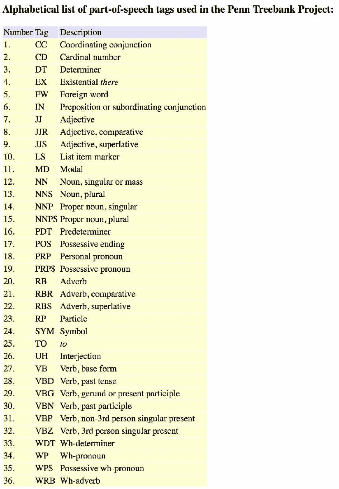
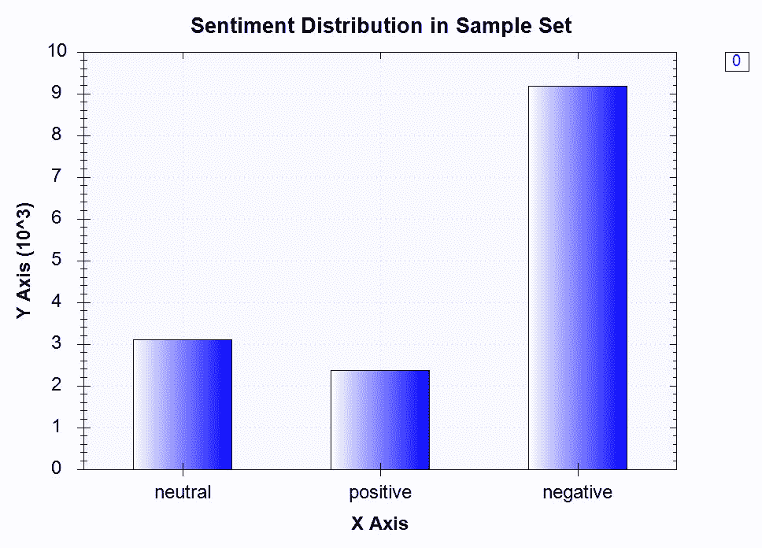
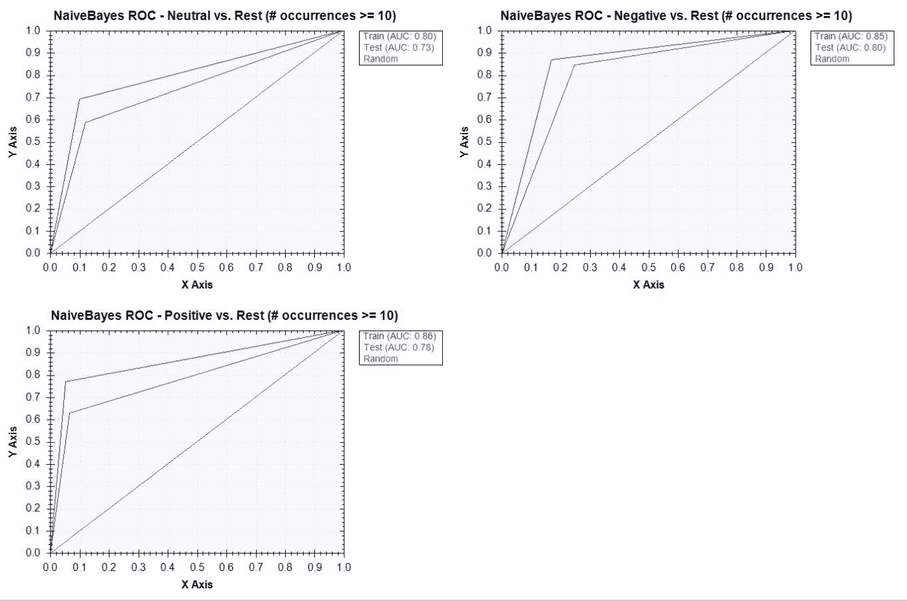
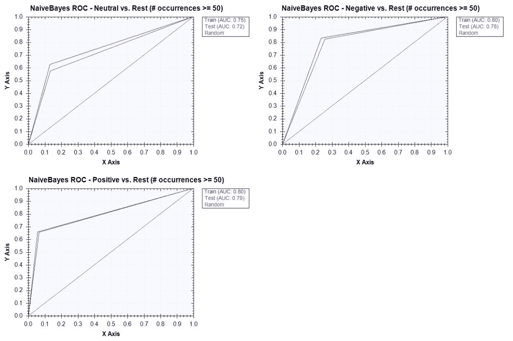

# 推特情绪分析

在本章中，我们将扩展在 C#中构建分类模型的知识。除了我们在上一章中使用的两个包 Accord.NET 和 Deedle 外，我们还将开始使用斯坦福 CoreNLP 包来应用更先进的**自然语言处理**（**NLP**）技术，如标记化、**词性**（**词性**标记，和柠檬化。使用这些软件包，我们本章的目标是建立一个多类别分类模型，预测推特的情绪。我们将使用一个原始的 Twitter 数据集，该数据集不仅包含文字，还包含表情符号，并将使用它来训练一个用于情绪预测的**机器学习**（**ML**）模型。我们将遵循与构建 ML 模型时相同的步骤。我们将从问题定义开始，然后是数据准备和分析、特征工程、模型开发和验证。在我们的功能工程步骤中，我们将扩展 NLP 技术的知识，并探索如何应用标记化、词性标记和柠檬化来构建更高级的文本功能。在模型构建步骤中，我们将探索一种新的分类算法——随机森林分类器，并将其性能与朴素贝叶斯分类器进行比较。最后，在我们的模型验证步骤中，我们将扩展我们在上一章中介绍的混淆矩阵、精确度和召回率的知识，并讨论**接收机工作特性**（**ROC**）曲线和**曲线下面积**（**AUC**）以及如何使用这些概念来评估我们的 ML 模型。

在本章中，我们将介绍以下内容：

*   使用 Stanford CoreNLP 软件包设置环境
*   Twitter 情绪分析项目的问题定义
*   使用 Stanford CoreNLP 进行数据准备
*   使用引理作为标记的数据分析
*   使用柠檬化和表情符号的特征工程
*   朴素贝叶斯与随机森林
*   使用 ROC 曲线和 AUC 指标进行模型验证

# 建立环境

在我们深入研究 Twitter 情绪分析项目之前，让我们使用本章将要用到的斯坦福 CoreNLP 软件包来设置我们的开发环境。使用 Standford CoreNLP 软件包准备好您的环境需要多个步骤，因此最好完成以下步骤：

1.  第一步是在 VisualStudio 中创建一个新的控制台应用程序（.NET Framework）项目。确保使用高于或等于 4.6.1 的.NET Framework 版本。如果您安装了旧版本，请转至[https://docs.microsoft.com/en-us/dotnet/framework/install/guide-for-developers](https://docs.microsoft.com/en-us/dotnet/framework/install/guide-for-developers) 并遵循安装指南。以下是项目设置页面的屏幕截图（请注意，您可以在顶部栏中选择您的.NET Framework 版本）：


2.  现在，让我们安装 StanfordCorenlp 包。您可以在 Package Manager 控制台中键入以下命令：

```cs
Install-Package Stanford.NLP.CoreNLP
```

The version we are going to use in this chapter is `Stanford.NLP.CoreNLP` 3.9.1\. Over time, the versions might change and you might have to update your installations.

3.  我们只需要再做一件事，我们的环境就可以开始使用这个包了。我们需要安装 corenlpmodels JAR，它包含用于解析、词性标记、**命名实体识别**（**NER**等工具的各种模型。按照此链接下载并解压缩斯坦福 CoreNLP:[https://stanfordnlp.github.io/CoreNLP/](https://stanfordnlp.github.io/CoreNLP/) 。下载并解压缩后，您将在其中看到多个文件。感兴趣的特定文件为`stanford-corenlp-<version-number>-models.jar`。我们需要将 jar 文件中的内容提取到一个目录中，以便能够加载 C#项目中的所有模型文件。您可以使用以下命令从`stanford-corenlp-<version-number>-models.jar`中提取内容：

```cs
jar xf stanford-corenlp-<version-number>-models.jar 
```

从 models jar 文件中提取完所有模型文件后，现在就可以开始在 C#项目中使用 Stanford CoreNLP 包了。

现在，让我们检查一下安装是否成功。下面的代码是对该示例（[的轻微修改 https://sergey-tihon.github.io/Stanford.NLP.NET/StanfordCoreNLP.html](https://sergey-tihon.github.io/Stanford.NLP.NET/StanfordCoreNLP.html) ：

```cs
using System;
using System.IO;
using java.util;
using java.io;
using edu.stanford.nlp.pipeline;
using Console = System.Console;

namespace Tokenizer
{
    class Program
    {
        static void Main()
        {
            // Path to the folder with models extracted from Step #3
            var jarRoot = @"<path-to-your-model-files-dir>";

            // Text for processing
            var text = "We're going to test our CoreNLP installation!!";

            // Annotation pipeline configuration
            var props = new Properties();
            props.setProperty("annotators", "tokenize, ssplit, pos, lemma");
            props.setProperty("ner.useSUTime", "0");

            // We should change current directory, so StanfordCoreNLP could find all the model files automatically
            var curDir = Environment.CurrentDirectory;
            Directory.SetCurrentDirectory(jarRoot);
            var pipeline = new StanfordCoreNLP(props);
            Directory.SetCurrentDirectory(curDir);

            // Annotation
            var annotation = new Annotation(text);
            pipeline.annotate(annotation);

            // Result - Pretty Print
            using (var stream = new ByteArrayOutputStream())
            {
                pipeline.prettyPrint(annotation, new PrintWriter(stream));
                Console.WriteLine(stream.toString());
                stream.close();
            }

            Console.ReadKey();
        }
    }
}
```

如果安装成功，您将看到类似以下内容的输出：


让我们仔细看看这个输出。标记是作为单个语义单元分组的字符序列。通常，标记是*单词*或*术语*。在每个令牌输出中，我们可以看到原始文本，如`We`、`'re`、`going`。`PartOfSpeech`标记是指每个单词的类别，如名词、动词和形容词。例如，本例中第一个标记`We`的`PartOfSpeech`标记为`PRP`，表示*人称代词*。本例中第二个标记`'re`的`PartOfSpeech`标记为`VBP`，代表*v**erb，非第三人称单数 present*。POS 标签的完整列表可在此处找到（[http://www.ling.upenn.edu/courses/Fall_2003/ling001/penn_treebank_pos.html](http://www.ling.upenn.edu/courses/Fall_2003/ling001/penn_treebank_pos.html) 或在以下屏幕截图中：



A list of POS tags

最后，在我们的标记化示例中，`Lemma`标记引用给定单词的标准形式。例如，`am`和`are`的引理是`be`。在我们的示例中，第三个标记中的单词`going`以`go`为引理。我们将在以下部分讨论如何将单词柠檬化用于特征工程。

# Twitter 情绪分析的问题定义

让我们开始我们的 Twitter 情绪分析项目，明确定义我们将要建立的模型以及它们将要预测的内容。你可能已经听说过**情绪分析**这个词了。情绪分析本质上是一个通过计算确定给定文本是否表达积极、中立或消极情绪的过程。社交媒体内容的情绪分析可以以多种方式使用。例如，营销人员可以使用它来确定营销活动的有效性，以及它如何影响消费者对某一产品或公司的意见和态度。情绪分析也可用于预测股市变化。对某家公司的正面新闻和总体正面情绪通常会使其股价朝着积极的方向移动，而对某家公司的新闻和社交媒体的情绪分析可以用来预测股价在不久的将来将如何移动。为了试验如何构建情绪分析模型，我们将使用一个预编译并标记的航空公司情绪 Twitter 数据集，该数据集最初来自 CrowdFlower 的 Everyone 数据库（[https://www.figure-eight.com/data-for-everyone/](https://www.figure-eight.com/data-for-everyone/) ）。然后，我们将应用一些 NLP 技术，特别是单词标记、词性标记和柠檬化，从原始推特数据构建有意义的文本和表情特征。由于我们希望预测每条推文的三种不同情绪（积极、中性和消极），我们将构建一个多类分类模型，并使用不同的学习算法朴素贝叶斯和随机森林进行实验。一旦我们建立了情绪分析模型，我们将主要通过以下三个指标来评估绩效：精确度、召回率和 AUC。

让我们总结一下 Twitter 情绪分析项目的问题定义：

*   有什么问题？我们需要一个推特情绪分析模型来计算识别推特中的情绪。
*   为什么这是个问题？识别和测量用户或消费者对某个主题（如产品、公司、广告等）的情绪，通常是衡量某些任务的影响和成功的重要工具。
*   解决这个问题的方法有哪些？我们将使用 StanfordCoreNLP 包应用各种 NLP 技术，如标记化、词性标记和柠檬化，从原始 Twitter 数据集构建有意义的功能。利用这些特性，我们将使用不同的学习算法进行实验，以构建一个情绪分析模型。我们将使用精确度、召回率和 AUC 度量来评估模型的性能。
*   成功的标准是什么？我们需要高准确率，同时又不牺牲太多的召回率，因为正确地将推特分类为三个情绪桶（积极、中性和消极）之一比更高的检索率更重要。此外，我们需要一个较高的 AUC 值，我们将在本章后面的章节中详细讨论。

# 使用 Stanford CoreNLP 进行数据准备

现在我们知道了本章的目标，是时候深入研究数据了。与上一章类似，我们将使用预编译和预标记的 Twitter 情绪数据。我们将使用 CrowdFlower 的 Everyone 数据库中的数据集（[https://www.figure-eight.com/data-for-everyone/](https://www.figure-eight.com/data-for-everyone/) ），您可以从这个链接下载数据：[https://www.kaggle.com/crowdflower/twitter-airline-sentiment](https://www.kaggle.com/crowdflower/twitter-airline-sentiment) 。我们这里的数据是大约 15000 条关于美国航空公司的推特。这些推特数据是从 2015 年 2 月开始收集的，然后被分为三个部分：正面、负面和中性。该链接为您提供两种类型的数据：CSV 文件和 SQLite 数据库。我们将为这个项目使用 CSV 文件。

一旦您下载了这些数据，我们需要为将来的分析和模型构建做好准备。数据集中感兴趣的两列是`airline_sentiment`和`text`。`airline_sentiment`栏包含关于情绪的信息，无论推特是正面、负面还是中性情绪，`text`栏包含原始推特文本。为了使这些原始数据随时可用于我们未来的数据分析和模型构建步骤，我们需要执行以下任务：

*   **清理不必要的文本**：很难证明文本的某些部分为我们的模型提供了许多可供学习的见解和信息，例如 URL、用户 ID 和原始数字。因此，准备原始数据的第一步是清理不必要的文本，这些文本不包含太多信息。在本例中，我们删除了 hashtags 中的 url、Twitter 用户 id、数字和散列符号。我们使用`Regex`将此类文本替换为空字符串。下面的代码说明了我们用来过滤这些文本的`Regex`表达式：

```cs
// 1\. Remove URL's
string urlPattern = @"https?:\/\/\S+\b|www\.(\w+\.)+\S*";
Regex rgx = new Regex(urlPattern);
tweet = rgx.Replace(tweet, "");

// 2\. Remove Twitter ID's
string userIDPattern = @"@\w+";
rgx = new Regex(userIDPattern);
tweet = rgx.Replace(tweet, "");

// 3\. Remove Numbers
string numberPattern = @"[-+]?[.\d]*[\d]+[:,.\d]*";
tweet = Regex.Replace(tweet, numberPattern, "");

// 4\. Replace Hashtag
string hashtagPattern = @"#";
tweet = Regex.Replace(tweet, hashtagPattern, "");
```

从这段代码中可以看出，有两种方法可以替换与`Regex`模式匹配的字符串。您可以实例化一个`Regex`对象，然后用另一个字符串替换匹配的字符串，如前两种情况所示。您也可以直接调用 static`Regex.Replace`方法来实现同样的目的，如前两种情况所示。静态方法将在每次调用`Regex.Replace`方法时创建一个`Regex`对象，因此如果在多个位置使用相同的模式，最好使用第一种方法：

*   **将相似的表情符号分组并编码在一起**：表情符号，如笑脸和悲伤的脸，经常用于推特中，并提供关于每条推特情感的有用见解。直观地说，一个用户将使用笑脸表情来推特积极事件，而另一个用户将使用悲伤表情来推特消极事件。然而，不同的笑脸表现出相似的积极情绪，可以组合在一起。例如，一个带括号的笑脸`:)`将与另一个带大写字母`D``:D`的笑脸具有相同的含义。因此，我们希望将这些相似的表情符号组合在一起，并将它们编码为一个组，而不是将它们分为不同的组。我们将使用 Romain Paulus 和 Jeffrey Pennington 共享的 R 代码（[https://nlp.stanford.edu/projects/glove/preprocess-twitter.rb](https://nlp.stanford.edu/projects/glove/preprocess-twitter.rb) ），将其翻译成 C#，然后将其应用于我们的原始 Twitter 数据集。下面是我们如何将表情符号`Regex`代码（用 R 编写）翻译成 C#，以便我们可以将类似的表情符号分组并编码在一起：

```cs
// 1\. Replace Smiley Faces
string smileyFacePattern = String.Format(@"{0}{1}[)dD]+|[)dD]+{1}{0}", eyesPattern, nosePattern);
tweet = Regex.Replace(tweet, smileyFacePattern, " emo_smiley ");

// 2\. Replace LOL Faces
string lolFacePattern = String.Format(@"{0}{1}[pP]+", eyesPattern, nosePattern);
tweet = Regex.Replace(tweet, lolFacePattern, " emo_lol ");

// 3\. Replace Sad Faces
string sadFacePattern = String.Format(@"{0}{1}\(+|\)+{1}{0}", eyesPattern, nosePattern);
tweet = Regex.Replace(tweet, sadFacePattern, " emo_sad ");

// 4\. Replace Neutral Faces
string neutralFacePattern = String.Format(@"{0}{1}[\/|l*]", eyesPattern, nosePattern);
tweet = Regex.Replace(tweet, neutralFacePattern, " emo_neutral ");

// 5\. Replace Heart
string heartPattern = "<3";
tweet = Regex.Replace(tweet, heartPattern, " emo_heart ");
```

*   **分组并将其他有用的表达编码在一起**：最后，还有一些表达可以帮助我们的模型检测推特的情绪。重复的标点符号，如`!!!`和`???`，以及拉长的单词，如`wayyyy`和`soooo`，可以提供一些关于推特情绪的额外信息。我们将分别对它们进行分组和编码，以便我们的模型可以从这些表达式中学习。下面的代码显示了我们如何对这些表达式进行编码：

```cs
// 1\. Replace Punctuation Repeat
string repeatedPunctuationPattern = @"([!?.]){2,}";
tweet = Regex.Replace(tweet, repeatedPunctuationPattern, " $1_repeat ");

// 2\. Replace Elongated Words (i.e. wayyyy -> way_emphasized)
string elongatedWordsPattern = @"\b(\S*?)(.)\2{2,}\b";
tweet = Regex.Replace(tweet, elongatedWordsPattern, " $1$2_emphasized ");
```

如代码所示，对于重复的标点符号，我们附加了一个带后缀的字符串，`_repeat`。例如，`!!!`将变成`!_repeat`，而`???`将变成`?_repeat`。对于拉长的单词，我们附加了一个带有后缀的字符串，`_emphasized`。例如，`wayyyy`将变成`way_emphasized`，而`soooo`将变成`so_emphasized`。

获取原始数据集、按照前面讨论的方式处理单个 Twitter 文本并将处理后的 Twitter 文本导出到另一个数据文件的完整代码可以在此存储库中找到：[https://github.com/yoonhwang/c-sharp-machine-learning/blob/master/ch.3/DataProcessor.cs](https://github.com/yoonhwang/c-sharp-machine-learning/blob/master/ch.3/DataProcessor.cs) 。让我们简单地浏览一下代码。它首先将原始`Tweets.csv`数据集读入 Deedle 数据帧（第 76-82 行）。然后，它调用一个名为`FormatTweets`的方法，其中包含所有原始 Twitter 文本的列序列。第 56-65 行中的`FormatTweets`方法代码如下所示：

```cs
private static string[] FormatTweets(Series<int, string> rows)
{
    var cleanTweets = rows.GetAllValues().Select((x, i) =>
    {
        string tweet = x.Value;
        return CleanTweet(tweet);
    });

    return cleanTweets.ToArray();
}
```

这个`FormatTweets`*方法迭代序列中的每个元素，即原始 tweets，并调用`CleanTweet`方法。在`CleanTweet`方法中，每个原始 tweet 都是针对我们之前定义的所有`Regex`模式运行的，然后按照前面讨论的方式进行处理。第 11-54 行中的`CleanTweet`方法如下所示：*

```cs
private static string CleanTweet(string rawTweet)
{
      string eyesPattern = @"[8:=;]";
      string nosePattern = @"['`\-]?";

      string tweet = rawTweet;
      // 1\. Remove URL's
      string urlPattern = @"https?:\/\/\S+\b|www\.(\w+\.)+\S*";
      Regex rgx = new Regex(urlPattern);
      tweet = rgx.Replace(tweet, "");
      // 2\. Remove Twitter ID's
      string userIDPattern = @"@\w+";
      rgx = new Regex(userIDPattern);
      tweet = rgx.Replace(tweet, "");
      // 3\. Replace Smiley Faces
      string smileyFacePattern = String.Format(@"{0}{1}[)dD]+|[)dD]+{1}{0}", eyesPattern, nosePattern);
      tweet = Regex.Replace(tweet, smileyFacePattern, " emo_smiley ");
      // 4\. Replace LOL Faces
      string lolFacePattern = String.Format(@"{0}{1}[pP]+", eyesPattern, nosePattern);
      tweet = Regex.Replace(tweet, lolFacePattern, " emo_lol ");
      // 5\. Replace Sad Faces
      string sadFacePattern = String.Format(@"{0}{1}\(+|\)+{1}{0}", eyesPattern, nosePattern);
      tweet = Regex.Replace(tweet, sadFacePattern, " emo_sad ");
      // 6\. Replace Neutral Faces
      string neutralFacePattern = String.Format(@"{0}{1}[\/|l*]", eyesPattern, nosePattern);
      tweet = Regex.Replace(tweet, neutralFacePattern, " emo_neutral ");
      // 7\. Replace Heart
      string heartPattern = "<3";
      tweet = Regex.Replace(tweet, heartPattern, " emo_heart ");
      // 8\. Replace Punctuation Repeat
      string repeatedPunctuationPattern = @"([!?.]){2,}";
      tweet = Regex.Replace(tweet, repeatedPunctuationPattern, " $1_repeat ");
      // 9\. Replace Elongated Words (i.e. wayyyy -> way_emphasized)
      string elongatedWordsPattern = @"\b(\S*?)(.)\2{2,}\b";
      tweet = Regex.Replace(tweet, elongatedWordsPattern, " $1$2_emphasized ");
      // 10\. Replace Numbers
      string numberPattern = @"[-+]?[.\d]*[\d]+[:,.\d]*";
      tweet = Regex.Replace(tweet, numberPattern, "");
      // 11\. Replace Hashtag
      string hashtagPattern = @"#";
      tweet = Regex.Replace(tweet, hashtagPattern, "");

      return tweet;
}
```

一旦清理和处理了所有原始 Twitter 推文，结果将作为一个单独的列添加到原始 Deedle 数据框中，列名为`tweet`。以下代码（第 89 行）显示了如何将字符串数组添加到数据帧中：

```cs
rawDF.AddColumn("tweet", processedTweets);
```

一旦到了这一步，我们需要做的唯一额外步骤就是导出处理后的数据。使用 Deedle data frame 的`SaveCsv`方法，您可以轻松地将数据帧导出到 CSV 文件中。以下代码显示了我们如何将处理后的数据导出到 CSV 文件中：

```cs
rawDF.SaveCsv(Path.Combine(dataDirPath, "processed-training.csv"));
```

现在我们有了干净的 Twitter 文本，让我们标记并创建 tweet 的矩阵表示。类似于我们在[第 2 章](02.html#QMFO0-5ebdf09927b7492888e31e8436526470)、*垃圾邮件过滤*中所做的，我们将把一个字符串分解成单词。然而，我们将使用我们在本章前一节中安装的 StanfordCorenlp 包，并使用我们在前一节中编写的示例代码。标记 tweet 并构建其矩阵表示的代码如下：

```cs
private static Frame<int, string> CreateWordVec(Series<int, string> rows, ISet<string> stopWords, bool useLemma=false)
        {
            // Path to the folder with models extracted from `stanford-corenlp-<version>-models.jar`
            var jarRoot = @"<path-to-model-files-dir>";

            // Annotation pipeline configuration
            var props = new Properties();
            props.setProperty("annotators", "tokenize, ssplit, pos, lemma");
            props.setProperty("ner.useSUTime", "0");

            // We should change current directory, so StanfordCoreNLP could find all the model files automatically
            var curDir = Environment.CurrentDirectory;
            Directory.SetCurrentDirectory(jarRoot);
            var pipeline = new StanfordCoreNLP(props);
            Directory.SetCurrentDirectory(curDir);

            var wordsByRows = rows.GetAllValues().Select((x, i) =>
            {
                var sb = new SeriesBuilder<string, int>();

                // Annotation
                var annotation = new Annotation(x.Value);
                pipeline.annotate(annotation);

                var tokens = annotation.get(typeof(CoreAnnotations.TokensAnnotation));
                ISet<string> terms = new HashSet<string>();

                foreach (CoreLabel token in tokens as ArrayList)
                {
                    string lemma = token.lemma().ToLower();
                    string word = token.word().ToLower();
                    string tag = token.tag();
                    //Console.WriteLine("lemma: {0}, word: {1}, tag: {2}", lemma, word, tag);

                    // Filter out stop words and single-character words
                    if (!stopWords.Contains(lemma) && word.Length > 1)
                    {
                        if (!useLemma)
                        {
                            terms.Add(word);
                        }
                        else
                        {
                            terms.Add(lemma);
                        }
                    }
                }

                foreach (string term in terms)
                {
                    sb.Add(term, 1);
                }

                return KeyValue.Create(i, sb.Series);
            });

            // Create a data frame from the rows we just created
            // And encode missing values with 0
            var wordVecDF = Frame.FromRows(wordsByRows).FillMissing(0);

            return wordVecDF;
        }
```

从代码中可以看出，此代码与上一节中的示例代码之间的主要区别在于，此代码迭代每个 tweet，并将令牌存储到 Deedle 的数据帧中。在[第 2 章](02.html#QMFO0-5ebdf09927b7492888e31e8436526470)*垃圾邮件过滤*中，我们使用一个热编码来分配矩阵中每个术语的值（0 对 1）。这里需要注意的一点是，我们如何使用引理或单词创建矩阵。单词是从每条推文中分解出来的原始未触及术语。例如，如果您使用单词作为标记，字符串`I am a data scientist`将被分解为`I`、`am`、`a`、`data`和`scientist`。引理是每个标记中单词的标准形式。例如，如果使用引理作为标记，则相同的字符串`I am a data scientist`将被分解为`I`、`be`、`a`、`data`和`scientist`。注意，`be`是`am`的引理。我们将在*特征工程中使用引理化和表情符号*部分讨论什么是引理，什么是引理化。

可在此处找到标记化和创建 tweet 矩阵表示的完整代码：[https://github.com/yoonhwang/c-sharp-machine-learning/blob/master/ch.3/TwitterTokenizer.cs](https://github.com/yoonhwang/c-sharp-machine-learning/blob/master/ch.3/TwitterTokenizer.cs) 。在这段代码中有几点需要注意。首先，让我们看看它是如何计算每个情绪的样本数的。以下代码段（第 122-127 行）显示了我们如何计算每个情绪的样本数：

```cs
// Look at the sentiment distributions in our sample set
var sampleSetDistribution = rawDF.GetColumn<string>(
    "airline_sentiment"
).GroupBy<string>(x => x.Value).Select(x => x.Value.KeyCount);
sampleSetDistribution.Print();
```

从这段代码中可以看到，我们首先得到情绪栏`airline_sentiment`，然后根据值对其进行分组，其中值可以是`neutral`、`negative`或`positive`。然后，它计算出现的次数并返回计数。

TwitterTokenizer 代码中需要注意的第二件事是我们如何用整数值编码情感。以下是您在完整代码的第 149–154 行中看到的内容：

```cs
tweetLemmaVecDF.AddColumn(
    "tweet_polarity", 
    rawDF.GetColumn<string>("airline_sentiment").Select(
        x => x.Value == "neutral" ? 0 : x.Value == "positive" ? 1 : 2
    )
);
```

从这个代码片段中可以看到，我们正在创建一个新列`tweet_polarity`，并将其添加到术语矩阵数据框中。我们取`airline_sentiment`列的值，编码`0`表示中性，`1`表示阳性，`2`表示阴性。我们将在未来的模型构建步骤中使用这个新添加的列。

最后，请注意我们是如何两次调用`CreateWordVec`方法的，一次不使用柠檬化（第 135-144 行），一次使用柠檬化（第 147-156 行）。如果我们用一个热编码创建一个术语矩阵，而不进行柠檬化，那么我们实际上是将所有单词作为术语矩阵中的单个标记。正如您可以想象的，这将创建一个比柠檬化更大、更稀疏的矩阵。我们将这两个代码都放在那里，供您探索这两个选项。您可以尝试使用以单词为列的矩阵构建 ML 模型，并将它们与以引理为列的矩阵进行比较。在本章中，我们将使用带引理的矩阵，而不是单词。

运行此代码时，它将输出一个条形图，显示样本集中的情绪分布。如下图所示，在我们的样本集中，我们有大约 3000 条中立推文、2000 条正面推文和 9000 条负面推文。图表如下所示：



# 使用引理作为标记的数据分析

现在是时候查看实际数据，寻找术语频率分布的任何模式或差异，以及推特的不同情绪。我们将获取上一步的输出，并获得每个情绪的前七个最常见代币的分布。在本例中，我们使用带有引理的术语矩阵。您可以随意对词汇矩阵进行相同的分析。分析每个 tweet 情绪中最常用的前 N 个标记的代码可以在这里找到：[https://github.com/yoonhwang/c-sharp-machine-learning/blob/master/ch.3/DataAnalyzer.cs](https://github.com/yoonhwang/c-sharp-machine-learning/blob/master/ch.3/DataAnalyzer.cs) 。

在这段代码中有一点需要注意。与前一章不同，我们需要计算中性、消极和积极三种情绪类别的术语频率。以下是完整代码的代码片段（第 54-73 行）：

```cs
var neutralTermFrequencies = ColumnWiseSum(
    tweetLemmaDF.Where(
        x => x.Value.GetAs<int>("tweet_polarity") == 0
    ),
    "tweet_polarity"
).Sort().Reversed;

var positiveTermFrequencies = ColumnWiseSum(
    tweetLemmaDF.Where(
        x => x.Value.GetAs<int>("tweet_polarity") == 1
    ),
    "tweet_polarity"
).Sort().Reversed;

var negativeTermFrequencies = ColumnWiseSum(
    tweetLemmaDF.Where(
        x => x.Value.GetAs<int>("tweet_polarity") == 2
    ),
    "tweet_polarity"
).Sort().Reversed;
```

从代码中可以看出，我们为每个情感类调用`ColumnWiseSum`方法，该方法的代码如下：

```cs
private static Series<string, double> ColumnWiseSum(Frame<int, string> frame, string exclude)
{
    var sb = new SeriesBuilder<string, double>();
    foreach(string colname in frame.ColumnKeys)
    {
        double frequency = frame[colname].Sum();
        if (!colname.Equals(exclude))
        {
            sb.Add(colname, frequency);
        }
    }

    return sb.ToSeries();
}
```

从这段代码中可以看到，它迭代每个列或项，并对该列中的所有值求和。由于我们使用了一个热编码，一个简单的列式求和将为我们提供 Twitter 数据集中每个术语的出现次数。计算完所有列式求和后，将它们作为 Deedle series 对象返回。根据这些结果，我们按频率对术语进行排序，并将这些信息存储到三个单独的文件中，`neutral-frequencies.csv`、`negative-frequencies.csv`和`positive-frequencies.csv`。在后面的章节中，我们将使用术语“频率输出”来进行特征工程和模型构建。

运行代码时，它将生成以下图表：


从图表中可以看出，不同情绪之间的分布存在一些明显的差异。像**感谢**和**伟大**这样的词是正面推文中七个最常出现的词中的两个，而像**延迟**和**取消**这样的词是负面推文中七个最常出现的词中的两个。凭直觉，这些都是有道理的。当你表达对某人或某事的积极感受时，通常会使用**感谢**和**很棒**这两个词。另一方面，**延误**和**取消**与航班或航空公司的负面事件相关。也许一些用户的航班被推迟或取消了，他们在推特上表达了自己的不满。另一件值得注意的有趣事情是`emo_smiley`一词在积极推文中是如何排在第七位的。如果您还记得，在上一步中，我们将所有笑脸表情符号（如`:)`、`:D`等）分组并编码为`emo_smiley`。这告诉我们，表情符号可能在我们的模型学习如何对每条推文的情绪进行分类方面发挥着重要作用。现在，我们已经大致了解了数据的外观，以及每种情绪都会出现哪些术语，让我们来谈谈本章将采用的特征工程技术。

# 使用柠檬化和表情符号的特征工程

在上一节中，我们简要地讨论了引理。让我们更深入地看看什么是引理和什么是勒姆化。根据一个词在句子中的使用方式和位置，该词将以不同的形式出现。例如，单词`like`可以采用`likes`或`liked`的形式，具体取决于之前出现的内容。如果我们只是将句子标记为单词，那么我们的程序将把单词`like`、`likes`和`liked`视为三个不同的标记。然而，这可能不是我们想要的。这三个词具有相同的含义，当我们构建模型时，将这些词作为一个标记组合在我们的功能集中会很有用。这就是柠檬化的作用。引理是单词的基本形式，引理化是根据每个单词在句子中使用的部分将每个单词转换成引理。在上例中，`like`是`likes`和`liked`的引理，系统地将`likes`和`liked`转化为`like`是引理化。

以下是使用 Stanford CoreNLP 的柠檬化示例：


在这里，你可以看到`likes`和`like`都被柠檬化为`like`。这是因为这两个词都用作句子中的动词，动词形式的引理是`like`。让我们看另一个例子：


这里，第一个`likes`和第二个`likes`有不同的引理。第一个有`like`作为它的引理，而第二个有`likes`作为它的引理。这是因为第一个用作动词，而第二个用作名词。从这些例子中可以看出，根据句子的不同部分，相同单词的引理可能不同。对文本数据集使用柠檬化可以极大地减少特征空间的稀疏性和维度，并且可以帮助模型更好地学习，而不会暴露在太多的噪声中。

与柠檬化类似，我们也将类似的表情符号分组到同一组中。这是基于这样的假设：相似的表情符号有相似的含义。例如，`:)`和`:D`的含义几乎相同，如果不完全相同的话。在另一种情况下，根据用户的不同，冒号和括号的位置可能不同。有些用户可能会键入`:)`，但有些用户可能会键入`(:`。然而，这两者之间唯一的不同是冒号和括号的位置，并且含义相同。在所有这些情况下，我们希望我们的模型学习相同的情绪，而不是制造任何噪音。正如我们在上一步中所做的那样，将类似的表情符号分组到同一组中，有助于减少模型不必要的噪音，并帮助他们从这些表情符号中学到最多。

# 朴素贝叶斯与随机森林

终于到了训练 ML 模型预测推特情绪的时候了。在本节中，我们将试验朴素贝叶斯和随机森林分类器。我们要做的两件事与前一章不同。首先，我们将把样本集分为一个序列集和一个验证集，而不是运行 k-fold 交叉验证。这也是一种经常使用的技术，模型只从样本集的一个子集学习，然后与其他模型一起测试和验证，而其他模型在训练时没有观察到。通过这种方式，我们可以测试模型在不可预见的数据集中的表现，并模拟它们在现实世界中的行为。我们将使用 Accord.NET 包中的`SplitSetValidation`类将样本集拆分为训练集和验证集，每个训练集都有预定义的比例，并为训练集安装一个学习算法。

其次，我们的目标变量不再是二进制的（0 或 1），这与之前的[第 2 章](02.html#QMFO0-5ebdf09927b7492888e31e8436526470)*中的垃圾邮件过滤*不同。相反，它可以取 0、1 或 2 中的任何值，其中 0 表示中性情绪推文，1 表示积极情绪推文，2 表示消极情绪推文。因此，我们现在处理的是多类分类问题，而不是二进制分类问题。在评估模型时，我们必须以不同的方式处理问题。我们必须修改前一章中的准确度、精确度和召回计算代码，以计算本项目中三个目标情绪类中每个类的数字。此外，当我们查看某些指标时，如 ROC 曲线和 AUC 时，我们必须使用一对一的方法，我们将在下一节中讨论。

让我们首先看看如何在 Accord.NET 框架中用`SplitSetValidation`类实例化我们的学习算法。以下是如何使用朴素贝叶斯分类器算法实例化`SplitSetValidation`*对象：*

```cs
var nbSplitSet = new SplitSetValidation<NaiveBayes<BernoulliDistribution>, double[]>()
{
    Learner = (s) => new NaiveBayesLearning<BernoulliDistribution>(),

    Loss = (expected, actual, p) => new ZeroOneLoss(expected).Loss(actual),

    Stratify = false,

    TrainingSetProportion = 0.8,

    ValidationSetProportion = 0.2
};
var nbResult = nbSplitSet.Learn(input, output);
```

正如您从前面的代码片段中所看到的，您在上一章中使用的代码与此处显示的代码之间的主要区别在于我们传递到`SplitSetValidation`对象上的两个参数—`TrainingSetProportion`*和`ValidationSetProportion`。顾名思义，您可以通过`TrainingSetProportion`*参数定义样本集中用于培训的百分比，以及通过`ValidationSetProportion`参数定义样本集中用于验证的百分比。在我们的代码片段中，我们告诉我们的程序使用 80%的样本进行培训，20%用于验证。在代码片段的最后一行中，我们将一个朴素贝叶斯分类模型拟合到从样本集中拆分出来的序列集。另外，请注意，我们使用`BernoulliDistribution`作为我们的朴素贝叶斯分类器，因为我们使用了一个热编码来编码我们的特征，并且我们的所有特征都有二进制值，类似于我们在上一章中所做的。**

 **与我们使用朴素贝叶斯分类器实例化`SplitSetValidation`对象的方式类似，您可以使用随机林分类器实例化另一个对象，如下所示：

```cs
var rfSplitSet = new SplitSetValidation<RandomForest, double[]>()
{
    Learner = (s) => new RandomForestLearning()
    {
        NumberOfTrees = 100, // Change this hyperparameter for further tuning

        CoverageRatio = 0.5, // the proportion of variables that can be used at maximum by each tree

        SampleRatio = 0.7 // the proportion of samples used to train each of the trees

    },

    Loss = (expected, actual, p) => new ZeroOneLoss(expected).Loss(actual),

    Stratify = false,

    TrainingSetProportion = 0.7,

    ValidationSetProportion = 0.3
};
var rfResult = rfSplitSet.Learn(input, output);
```

我们用随机森林作为模型，用`RandomForestLearning`作为学习算法来替换前面的代码。如果仔细观察，我们可以为`RandomForestLearning`调整一些超参数。第一个是`NumberOfTrees`。此超参数允许您选择进入随机林的决策树数。一般来说，在随机林中拥有更多的树会导致更好的性能，因为您实际上是在林中构建更多的决策树。然而，性能提升是以训练和预测时间为代价的。随着随机森林中树木数量的增加，训练和预测将需要更多的时间。这里需要注意的另外两个参数是`CoverageRatio`*和`SampleRatio`。`CoverageRatio`*设置在每棵树中使用的特征集的比例，`SampleRatio`*设置在每棵树中使用的列车集的比例。较高的`CoverageRatio`和*`SampleRatio`会提高森林中单个树木的表现，但也会增加树木之间的相关性。较低的树间相关性有助于减少泛化误差；因此，在单个树木的预测能力和树木之间的相关性之间找到一个良好的平衡对于建立一个良好的随机森林模型至关重要。调整和试验这些超参数的各种组合可以帮助您避免过度拟合问题，并在训练随机林模型时提高模型性能。我们建议您使用这些超参数的各种组合构建一些随机森林分类器，并试验它们对模型性能的影响。****

 ***我们用来训练朴素贝叶斯和随机森林分类模型并输出验证结果的完整代码可以在这里找到：[https://github.com/yoonhwang/c-sharp-machine-learning/blob/master/ch.3/TwitterSentimentModeling.cs](https://github.com/yoonhwang/c-sharp-machine-learning/blob/master/ch.3/TwitterSentimentModeling.cs) 。让我们仔细看看这个代码。在第 36-41 行中，它首先读取令牌矩阵文件`tweet-lemma.csv`，这是我们在数据准备步骤中构建的。然后在第 43-51 行中，我们读取术语频率文件`positive-frequencies.csv`和`negative-frequencies.csv`，这是我们在数据分析步骤中构建的。与上一章类似，我们根据第 64 行中出现的术语数量进行特征选择。在本例中，我们尝试使用 5、10、50、100 和 150 作为示例 tweet 中出现术语的最小数量的阈值。从第 65 行开始，我们迭代这些阈值，开始训练和评估朴素贝叶斯和随机森林分类器。每次在训练集上训练模型时，都会针对训练期间未观察到的验证集运行模型。

以下是完整代码（第 113-135 行）的一部分，该代码在序列和验证集上运行经过训练的朴素贝叶斯模型，以测量样本内和样本外的性能：

```cs
// Get in-sample & out-sample prediction results for NaiveBayes Classifier
var nbTrainedModel = nbResult.Model;

int[] nbTrainSetIDX = nbSplitSet.IndicesTrainingSet;
int[] nbTestSetIDX = nbSplitSet.IndicesValidationSet;

Console.WriteLine("* Train Set Size: {0}, Test Set Size: {1}", nbTrainSetIDX.Length, nbTestSetIDX.Length);

int[] nbTrainPreds = new int[nbTrainSetIDX.Length];
int[] nbTrainActual = new int[nbTrainSetIDX.Length];
for (int i = 0; i < nbTrainPreds.Length; i++)
{
   nbTrainActual[i] = output[nbTrainSetIDX[i]];
   nbTrainPreds[i] = nbTrainedModel.Decide(input[nbTrainSetIDX[i]]);
}

int[] nbTestPreds = new int[nbTestSetIDX.Length];
int[] nbTestActual = new int[nbTestSetIDX.Length];
for (int i = 0; i < nbTestPreds.Length; i++)
{
   nbTestActual[i] = output[nbTestSetIDX[i]];
   nbTestPreds[i] = nbTrainedModel.Decide(input[nbTestSetIDX[i]]);
}
```

以下是完整代码（第 167-189 行）的一部分，该代码在序列和验证集上运行经过训练的随机林模型，以测量样本内和样本外的性能：

```cs
// Get in-sample & out-sample prediction results for RandomForest Classifier
var rfTrainedModel = rfResult.Model;

int[] rfTrainSetIDX = rfSplitSet.IndicesTrainingSet;
int[] rfTestSetIDX = rfSplitSet.IndicesValidationSet;

Console.WriteLine("* Train Set Size: {0}, Test Set Size: {1}", rfTrainSetIDX.Length, rfTestSetIDX.Length);

int[] rfTrainPreds = new int[rfTrainSetIDX.Length];
int[] rfTrainActual = new int[rfTrainSetIDX.Length];
for (int i = 0; i < rfTrainPreds.Length; i++)
{
    rfTrainActual[i] = output[rfTrainSetIDX[i]];
    rfTrainPreds[i] = rfTrainedModel.Decide(input[rfTrainSetIDX[i]]);
}

int[] rfTestPreds = new int[rfTestSetIDX.Length];
int[] rfTestActual = new int[rfTestSetIDX.Length];
for (int i = 0; i < rfTestPreds.Length; i++)
{
    rfTestActual[i] = output[rfTestSetIDX[i]];
    rfTestPreds[i] = rfTrainedModel.Decide(input[rfTestSetIDX[i]]);
}
```

让我们仔细看看这些。为了简洁起见，我们只看一下随机森林模型的情况，因为对于朴素贝叶斯分类器也是如此。在第 168 行中，我们首先从学习的结果中获得经过训练的模型。然后，我们从第 170-171 行的`SplitSetValidation`对象中获取样本内（训练集）和样本外（测试/验证集）集的索引，以便我们可以迭代每一行或记录并进行预测。我们对第 175-181 行中的样本内训练集和第 183-189 行中的样本外验证集重复此过程两次。

一旦我们得到了训练集和测试集上的预测结果，我们就通过一些验证方法运行这些结果（第 138-141 行用于朴素贝叶斯分类器，第 192-196 行用于随机森林分类器）。我们专门为本项目的模型验证编写了两种方法-`PrintConfusionMatrix`和`DrawROCCurve`。`PrintConfusionMatrix`*是我们在[第 2 章](02.html#QMFO0-5ebdf09927b7492888e31e8436526470)*垃圾邮件过滤*中的更新版本，现在它打印一个 3 x 3 混淆矩阵，而不是一个 2 x 2 混淆矩阵。另一方面，`DrawROCCurve`*方法为本项目引入了一些新概念和新的模型验证方法。让我们在下一节中更详细地讨论我们在本项目中使用的那些新的评估指标。**

 **# 模型验证–ROC 曲线和 AUC

如前所述，我们在本章中使用了不同的模型验证指标：ROC 曲线和 AUC。ROC 曲线是在不同阈值下真实阳性率与假阳性率的曲线图。曲线中的每个点表示在某一概率阈值下对应的真阳性率和假阳性率对。它通常用于在不同的候选模型中选择最佳和最优化的模型。

ROC 曲线下的面积（AUC）衡量模型区分这两个类别的能力。在二元分类的情况下，AUC 测量模型区分积极结果和消极结果的程度。由于我们在本项目中处理的是一个多类分类问题，因此我们使用一对一的方法来构建 ROC 曲线并计算 AUC。例如，一条 ROC 曲线可以将正面推文视为正面结果，将中性和负面推文视为负面结果，而另一条 ROC 曲线可以将中性推文视为正面结果，将正面和负面推文视为负面结果。如下图所示，我们为我们构建的每个模型绘制了三个 ROC 图，一个是中性对休息（积极和消极），一个是积极对休息（中立和消极），一个是消极对休息（中立和积极）。AUC 值越高，模型越好，因为它表明模型能够以更好的机会区分积极类和消极类。

以下图表显示了在**10**处出现的最小术语数量的朴素贝叶斯分类器的 ROC 曲线：



下表显示了 Naive Bayes 分类器的 ROC 曲线，其术语出现的最少次数为**50**：



以下图表显示了 Naive Bayes 分类器的 ROC 曲线，其术语出现的最少次数为**150**：


从图表中可以看出，我们还可以通过查看训练和测试结果曲线之间的差距，从 ROC 图表中检测过度拟合问题。间隙越大，模型越过拟合。如果你看第一种情况，我们只过滤掉那些出现在 tweet 中少于十次的词，两条曲线之间的差距很大。当我们增加阈值时，我们可以看到间隙减小。在选择最终模型时，我们希望训练 ROC 曲线和测试/验证 ROC 曲线尽可能小。由于这种解决方案是以牺牲模型性能为代价的，因此我们需要为这种权衡找到正确的截止线。

现在让我们来看一个随机森林分类器的示例。以下是拟合随机森林分类器的示例结果：


集成方法，如随机森林，通常能很好地解决分类问题，通过集成更多的树可以提高精度。然而，它们也有一些局限性，其中一个局限性在之前随机森林分类器的样本结果中显示。与所有基于决策树的模型一样，随机森林模型往往过拟合，特别是当它试图从许多分类变量中学习时。从随机森林分类器的 ROC 曲线可以看出，训练和测试 ROC 曲线之间的差距很大，尤其是与朴素贝叶斯分类器的 ROC 曲线相比。最小项出现次数阈值为 150 的朴素贝叶斯分类器在训练和测试 ROC 曲线之间几乎没有间隙，而相同阈值的随机森林分类器在两条 ROC 曲线之间显示出较大间隙。在处理这样一个有大量分类变量的数据集时，我们需要注意选择哪种模型，并特别注意调整超参数，例如随机森林模型的`NumberOfTrees`、`CoverageRatio`和`SampleRatio`*、*。

# 总结

在本章中，我们为 Twitter 情绪分析构建并训练了更高级的分类模型。我们将在上一章学到的知识应用于具有更复杂文本数据的多类分类问题。我们首先使用 Stanford CoreNLP 软件包设置环境，在数据准备和分析步骤中，我们使用该软件包进行标记化、词性标记和柠檬化。然后，我们通过标记化和柠檬化 tweet，将原始 Twitter 数据集转换为一个热编码矩阵。在这个数据准备步骤中，我们还讨论了如何使用 Regex 将类似的表情组合在一起，并从 tweet 中删除不必要的文本，如 url、Twitter id 和原始数字。在我们的数据分析步骤中，我们进一步分析了常用术语和表情符号的分布，我们看到了将类似表情符号化和分组在一起有助于减少数据集中不必要的噪音。根据前面步骤的数据和见解，我们尝试使用朴素贝叶斯和随机森林分类器构建多类分类模型。在构建这些模型时，我们介绍了一种常用的模型验证技术，其中我们将样本集分为两个子集，即序列集和验证集，并使用序列集拟合模型和验证集评估模型性能。我们还介绍了新的模型验证指标，ROC 曲线和 AUC，我们可以使用它们在候选模型中选择最佳和最优化的模型。

在下一章中，我们将切换并开始建立回归模型，其中目标变量是连续变量。我们将使用汇率数据集来构建时间序列特征，并探索回归问题的其他 ML 模型。我们还将讨论回归模型的性能评估如何不同于分类模型。*********