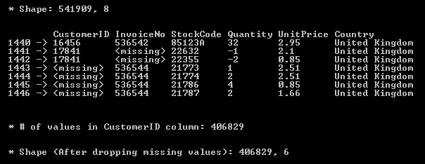
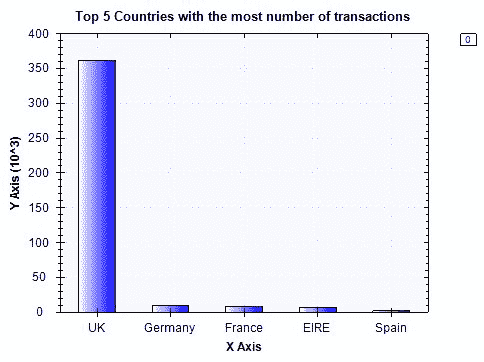
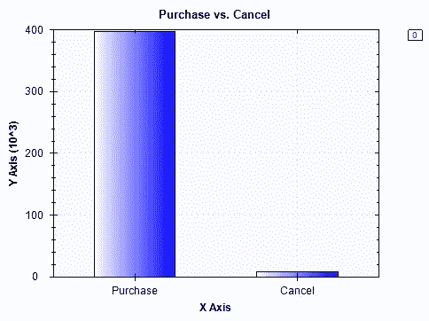
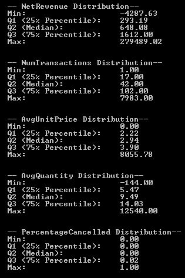
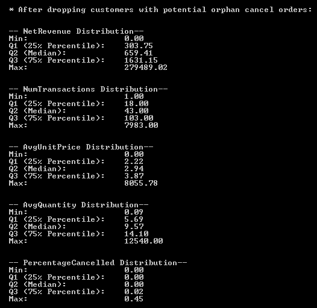
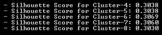

# 客户细分

在本章中，我们将学习无监督学习模型，以及如何使用这些模型从数据中提取见解。到目前为止，我们一直专注于监督学习，我们的**机器学习**（**ML**）模型已经知道他们试图预测的目标变量。我们已经建立了垃圾邮件过滤和 Twitter 情绪分析的分类模型。我们还建立了汇率预测和房价公允价值预测的回归模型。到目前为止，我们建立的所有这些 ML 模型都是有监督的学习算法，模型学习将给定的输入映射到预期的结果。然而，在某些情况下，我们更感兴趣的是从数据集中发现隐藏的见解和推断，我们可以使用无监督的学习算法来完成这些任务。

在本章中，我们将使用一个在线零售数据集，其中包含客户购买的商品的价格和数量信息。我们将通过查看采购订单的项目价格和数量分布与取消订单的分布有何不同来探索数据。我们还将了解在线商店活动在不同国家的传播情况。然后，我们将获取此事务级数据，并将其转换和聚合为客户级数据。当我们将这些数据转换为以客户为中心的视图时，我们将讨论如何为无监督学习算法构建与规模无关的功能。有了此功能集，我们将使用 k-means 聚类算法来构建客户细分，并提取每个细分中客户行为的见解。我们将引入一个新的验证度量，剪影系数，来评估聚类结果。

在本章中，我们将介绍以下主题：

*   客户细分项目的问题定义
*   在线零售数据集的数据分析
*   特征工程和聚合
*   使用 k-均值聚类算法的无监督学习
*   使用轮廓系数进行聚类模型验证

# 问题定义

让我们更详细地讨论我们将要解决哪些问题并为其构建集群模型。无论您是试图向您的客户发送营销电子邮件，还是仅仅想更好地了解您的客户及其在在线商店中的行为，您都需要分析和识别不同类型和细分的客户。一些客户可能会一次购买大量物品（大宗买家），一些客户可能主要购买昂贵或奢侈品（奢侈品买家），或者一些客户可能已经购买了一到两件物品，但再也没有回来（未购买物品的客户）。根据这些行为模式，您的营销活动应该有所不同。例如，发送有关奢侈品促销的电子邮件可能会促使奢侈品买家登录网店购买某些商品，但这样的电子邮件活动对大宗买家来说并不奏效。另一方面，发送电子邮件宣传经常批量购买的物品，如办公用品的钢笔和笔记本，可能会让批量买家登录在线商店并下订单，但这可能对奢侈品买家没有吸引力。通过根据客户的行为模式识别客户群体并使用定制的营销活动，您可以优化营销渠道。

为了建立客户细分模型，我们将使用一个在线零售数据集，其中包含 2010 年 1 月 12 日至 2011 年 9 月 12 日期间英国在线零售商店发生的所有交易。此数据集可在 UCI 机器学习库中获得，并可从以下链接下载：[http://archive.ics.uci.edu/ml/datasets/online+零售# ](http://archive.ics.uci.edu/ml/datasets/online+retail#)。利用这些数据，我们将构建包含净收入、平均商品价格和每位客户的平均购买量等信息的功能。利用这些特性，我们将使用**k-means 聚类算法**构建一个聚类模型，该算法将客户群聚类为不同的细分。我们将使用**轮廓系数**指标来评估集群的质量，并推断出要构建的最佳客户群数量。

总结客户细分项目的问题定义：

*   有什么问题？我们需要一个将客户细分为不同集群的集群模型，以便我们能够更好地理解和了解客户的行为模式。
*   为什么这是个问题？没有适合所有不同类型客户的一刀切的营销活动。我们需要分别为大宗买家和奢侈品买家建立定制的营销活动。此外，我们还必须以不同于其他客户类型的未授权客户为目标，让他们重新参与产品。营销信息越个性化，客户参与的可能性就越大。如果我们有一个 ML 模型，根据在线商店上的行为模式将我们的客户群分为不同的部分，这将是一个很大的优势。
*   解决这个问题的方法有哪些？**我们将使用包含 2010 年至 2011 年年中所有交易的在线零售数据集来汇总关键特征，如净收入、平均单价和每位客户的平均购买量。然后，我们将使用 k-means 聚类算法来建立聚类模型，并使用轮廓系数来评估聚类质量和选择最佳聚类数。**
***   成功的标准是什么？我们不需要太多的集群，因为这会使解释和理解不同的客户模式变得更加困难。我们将使用轮廓系数得分来告诉我们用于客户细分的最佳集群数量。**

 **# 在线零售数据集的数据分析

现在是查看数据集的时候了。您可以点击此链接：[http://archive.ics.uci.edu/ml/datasets/online+零售](http://archive.ics.uci.edu/ml/datasets/online+retail#)，点击左上角`Data Folder`链接，下载`Online Retail.xlsx`文件。您可以将文件保存为 CSV 格式，并将其加载到 Deedle 数据框中。

# 处理缺失值

由于我们将汇总每个客户的交易数据，因此我们需要检查`CustomerID`列中是否有任何缺失值。下面的屏幕截图显示了一些没有`CustomerID`的记录：



我们将从`CustomerID`、`Description`、`Quantity`、`UnitPrice`和`Country`列中删除那些缺少值的记录。以下代码段显示了如何删除那些列中缺少值的记录：

```cs
// 1\. Missing CustomerID Values
ecommerceDF
    .Columns[new string[] { "CustomerID", "InvoiceNo", "StockCode", "Quantity", "UnitPrice", "Country" }]
    .GetRowsAt(new int[] { 1440, 1441, 1442, 1443, 1444, 1445, 1446 })
    .Print();
Console.WriteLine("\n\n* # of values in CustomerID column: {0}", ecommerceDF["CustomerID"].ValueCount);

// Drop missing values
ecommerceDF = ecommerceDF
    .Columns[new string[] { "CustomerID", "Description", "Quantity", "UnitPrice", "Country" }]
    .DropSparseRows();

// Per-Transaction Purchase Amount = Quantity * UnitPrice
ecommerceDF.AddColumn("Amount", ecommerceDF["Quantity"] * ecommerceDF["UnitPrice"]);

Console.WriteLine("\n\n* Shape (After dropping missing values): {0}, {1}\n", ecommerceDF.RowCount, ecommerceDF.ColumnCount);
Console.WriteLine("* After dropping missing values and unnecessary columns:");
ecommerceDF.GetRowsAt(new int[] { 0, 1, 2, 3, 4 }).Print();
// Export Data
ecommerceDF.SaveCsv(Path.Combine(dataDirPath, "data-clean.csv"));
```

我们使用 Deedle 数据框的`DropSparseRows`方法删除我们感兴趣的列中所有缺少值的记录。然后，我们在数据框中附加一列`Amount`，这是给定交易的总价。我们可以用单价乘以数量来计算这个值。

正如您从上一张图像中看到的，在删除丢失的值之前，我们有 541909 条记录。从我们感兴趣的列中删除缺少值的记录后，数据帧中的记录数最终为 406829。现在，我们有一个数据帧，其中包含所有事务的`CustomerID`、`Description`、`Quantity`、`UnitPrice`和`Country`信息。

# 变量分布

让我们开始看看数据集中的分布。首先，我们将看一看交易量排名前五的国家。我们用于按国家汇总记录并统计每个国家发生的交易数量的代码如下：

```cs
// 2\. Number of transactions by country
var numTransactionsByCountry = ecommerceDF
    .AggregateRowsBy<string, int>(
        new string[] { "Country" },
        new string[] { "CustomerID" },
        x => x.ValueCount
    ).SortRows("CustomerID");

var top5 = numTransactionsByCountry
    .GetRowsAt(new int[] {
        numTransactionsByCountry.RowCount-1, numTransactionsByCountry.RowCount-2,
        numTransactionsByCountry.RowCount-3, numTransactionsByCountry.RowCount-4,
        numTransactionsByCountry.RowCount-5 });
top5.Print();

var topTransactionByCountryBarChart = DataBarBox.Show(
    top5.GetColumn<string>("Country").Values.ToArray().Select(x => x.Equals("United Kingdom") ? "UK" : x),
    top5["CustomerID"].Values.ToArray()
);
topTransactionByCountryBarChart.SetTitle(
    "Top 5 Countries with the most number of transactions"
 );
```

从这个代码片段中可以看到，我们正在使用 Deedle 数据框架中的`AggregateRowsBy`方法按国家对记录进行分组，并计算每个国家的交易总数。然后，我们使用`SortRows`方法对结果数据帧进行排序，并选取前五名国家。运行此代码时，您将看到以下条形图：



前五名国家的交易数量如下所示：


正如预期的那样，在联合王国发生的交易数量最多。德国和法国是交易量第二和第三大的国家。

让我们开始看看我们将用于集群模型购买数量、单价和净额的特性的分布。我们将从三个方面研究这些分布。首先，我们将获得每个功能的总体分布，无论交易是用于购买还是取消。其次，我们将只查看采购订单，不包括取消订单。第三，我们将只查看取消订单的分配。

获取交易数量分布的代码如下：

```cs
// 3\. Per-Transaction Quantity Distributions
Console.WriteLine("\n\n-- Per-Transaction Order Quantity Distribution-- ");
double[] quantiles = Accord.Statistics.Measures.Quantiles(
    ecommerceDF["Quantity"].ValuesAll.ToArray(),
    new double[] { 0, 0.25, 0.5, 0.75, 1.0 }
);
Console.WriteLine(
    "Min: \t\t\t{0:0.00}\nQ1 (25% Percentile): \t{1:0.00}\nQ2 (Median): \t\t{2:0.00}\nQ3 (75% Percentile): \t{3:0.00}\nMax: \t\t\t{4:0.00}",
    quantiles[0], quantiles[1], quantiles[2], quantiles[3], quantiles[4]
);

Console.WriteLine("\n\n-- Per-Transaction Purchase-Order Quantity Distribution-- ");
quantiles = Accord.Statistics.Measures.Quantiles(
    ecommerceDF["Quantity"].Where(x => x.Value >= 0).ValuesAll.ToArray(),
    new double[] { 0, 0.25, 0.5, 0.75, 1.0 }
);
Console.WriteLine(
    "Min: \t\t\t{0:0.00}\nQ1 (25% Percentile): \t{1:0.00}\nQ2 (Median): \t\t{2:0.00}\nQ3 (75% Percentile): \t{3:0.00}\nMax: \t\t\t{4:0.00}",
    quantiles[0], quantiles[1], quantiles[2], quantiles[3], quantiles[4]
);

Console.WriteLine("\n\n-- Per-Transaction Cancel-Order Quantity Distribution-- ");
quantiles = Accord.Statistics.Measures.Quantiles(
    ecommerceDF["Quantity"].Where(x => x.Value < 0).ValuesAll.ToArray(),
    new double[] { 0, 0.25, 0.5, 0.75, 1.0 }
);
Console.WriteLine(
    "Min: \t\t\t{0:0.00}\nQ1 (25% Percentile): \t{1:0.00}\nQ2 (Median): \t\t{2:0.00}\nQ3 (75% Percentile): \t{3:0.00}\nMax: \t\t\t{4:0.00}",
    quantiles[0], quantiles[1], quantiles[2], quantiles[3], quantiles[4]
);
```

与前一章一样，我们使用`Quantiles`方法计算`quartiles`-最小值、25%百分位、中位数、75%百分位和最大值。一旦我们得到每笔交易订单数量的总体分布，我们将查看采购订单和取消订单的分布。在我们的数据集中，取消订单在`Quantity`列中用负数编码。为了将取消订单与采购订单分开，我们可以简单地从数据中过滤出正数量和负数量，如下代码所示：

```cs
// Filtering out cancel orders to get purchase orders only
ecommerceDF["Quantity"].Where(x => x.Value >= 0)
// Filtering out purchase orders to get cancel orders only
ecommerceDF["Quantity"].Where(x => x.Value < 0)
```

为了获得每笔交易单价的`quartiles`，我们使用以下代码：

```cs
// 4\. Per-Transaction Unit Price Distributions
Console.WriteLine("\n\n-- Per-Transaction Unit Price Distribution-- ");
quantiles = Accord.Statistics.Measures.Quantiles(
    ecommerceDF["UnitPrice"].ValuesAll.ToArray(),
    new double[] { 0, 0.25, 0.5, 0.75, 1.0 }
);
Console.WriteLine(
    "Min: \t\t\t{0:0.00}\nQ1 (25% Percentile): \t{1:0.00}\nQ2 (Median): \t\t{2:0.00}\nQ3 (75% Percentile): \t{3:0.00}\nMax: \t\t\t{4:0.00}",
    quantiles[0], quantiles[1], quantiles[2], quantiles[3], quantiles[4]
);
```

同样，我们可以使用以下代码计算每笔交易总金额的`quartiles`：

```cs
// 5\. Per-Transaction Purchase Price Distributions
Console.WriteLine("\n\n-- Per-Transaction Total Amount Distribution-- ");
quantiles = Accord.Statistics.Measures.Quantiles(
    ecommerceDF["Amount"].ValuesAll.ToArray(),
    new double[] { 0, 0.25, 0.5, 0.75, 1.0 }
);
Console.WriteLine(
    "Min: \t\t\t{0:0.00}\nQ1 (25% Percentile): \t{1:0.00}\nQ2 (Median): \t\t{2:0.00}\nQ3 (75% Percentile): \t{3:0.00}\nMax: \t\t\t{4:0.00}",
    quantiles[0], quantiles[1], quantiles[2], quantiles[3], quantiles[4]
);

Console.WriteLine("\n\n-- Per-Transaction Purchase-Order Total Amount Distribution-- ");
quantiles = Accord.Statistics.Measures.Quantiles(
    ecommerceDF["Amount"].Where(x => x.Value >= 0).ValuesAll.ToArray(),
    new double[] { 0, 0.25, 0.5, 0.75, 1.0 }
);
Console.WriteLine(
    "Min: \t\t\t{0:0.00}\nQ1 (25% Percentile): \t{1:0.00}\nQ2 (Median): \t\t{2:0.00}\nQ3 (75% Percentile): \t{3:0.00}\nMax: \t\t\t{4:0.00}",
    quantiles[0], quantiles[1], quantiles[2], quantiles[3], quantiles[4]
);

Console.WriteLine("\n\n-- Per-Transaction Cancel-Order Total Amount Distribution-- ");
quantiles = Accord.Statistics.Measures.Quantiles(
    ecommerceDF["Amount"].Where(x => x.Value < 0).ValuesAll.ToArray(),
    new double[] { 0, 0.25, 0.5, 0.75, 1.0 }
);
Console.WriteLine(
    "Min: \t\t\t{0:0.00}\nQ1 (25% Percentile): \t{1:0.00}\nQ2 (Median): \t\t{2:0.00}\nQ3 (75% Percentile): \t{3:0.00}\nMax: \t\t\t{4:0.00}",
    quantiles[0], quantiles[1], quantiles[2], quantiles[3], quantiles[4]
);
```

运行代码时，您将看到每个交易订单数量、单价和总金额分布的以下输出：


如果您查看此输出中总订单数量的分布，您会注意到，从第一个四分位数（25%）开始，数量为正。这表明取消订单远少于采购订单，这对在线零售商店来说是件好事。让我们看看采购订单和取消订单在数据集中是如何划分的。

使用以下代码，您可以绘制条形图来比较采购订单数和取消订单数：

```cs
// 6\. # of Purchase vs. Cancelled Transactions
var purchaseVSCancelBarChart = DataBarBox.Show(
    new string[] { "Purchase", "Cancel" },
    new double[] {
        ecommerceDF["Quantity"].Where(x => x.Value >= 0).ValueCount ,
        ecommerceDF["Quantity"].Where(x => x.Value < 0).ValueCount
    }
);
purchaseVSCancelBarChart.SetTitle(
    "Purchase vs. Cancel"
 );
```

运行此代码时，您将看到以下条形图：



如前一个分发输出所示，取消订单的数量远少于采购订单的数量。有了这些分析结果，我们将在下一节开始为客户细分的聚类模型构建功能。

此数据分析步骤的完整代码可通过以下链接找到：[https://github.com/yoonhwang/c-sharp-machine-learning/blob/master/ch.6/DataAnalyzer.cs](https://github.com/yoonhwang/c-sharp-machine-learning/blob/master/ch.6/DataAnalyzer.cs) 。

# 特征工程和数据聚合

我们现在拥有的数据集中的记录表示单个事务。然而，我们希望建立一个集群模型，将客户集群到不同的细分市场。为了做到这一点，我们需要按客户转换和聚合数据。换句话说，我们需要将属于每个客户的所有交易按照`CustomerID`和`aggregate`进行分组，通过求和、计数或取平均值。让我们先看一个例子。以下代码按`CustomerID`对交易级别数据进行分组，并计算净收入、交易总数、取消订单总数、平均单价和平均订单数量：

```cs
// 1\. Net Revenue per Customer
var revPerCustomerDF = ecommerceDF.AggregateRowsBy<double, double>(
    new string[] { "CustomerID" },
    new string[] { "Amount" },
    x => x.Sum()
);
// 2\. # of Total Transactions per Customer
var numTransactionsPerCustomerDF = ecommerceDF.AggregateRowsBy<double, double>(
    new string[] { "CustomerID" },
    new string[] { "Quantity" },
    x => x.ValueCount
);
// 3\. # of Cancelled Transactions per Customer
var numCancelledPerCustomerDF = ecommerceDF.AggregateRowsBy<double, double>(
    new string[] { "CustomerID" },
    new string[] { "Quantity" },
    x => x.Select(y => y.Value >= 0 ? 0.0 : 1.0).Sum()
);
// 4\. Average UnitPrice per Customer
var avgUnitPricePerCustomerDF = ecommerceDF.AggregateRowsBy<double, double>(
    new string[] { "CustomerID" },
    new string[] { "UnitPrice" },
    x => x.Sum() / x.ValueCount
);
// 5\. Average Quantity per Customer
var avgQuantityPerCustomerDF = ecommerceDF.AggregateRowsBy<double, double>(
    new string[] { "CustomerID" },
    new string[] { "Quantity" },
    x => x.Sum() / x.ValueCount
);
```

正如您从这段代码中看到的，我们在 Deedle 数据帧中使用`AggregateRowsBy`方法，并为每个聚合传递一个自定义`aggFunc`。在第一个示例中，我们计算每个客户的净收入，然后将每个客户的所有购买金额相加。对于第二个特性，我们计算事务数以计算每个客户的订单总数。为了计算每个客户的平均订单数量，我们将所有订单数量相加，然后除以交易数量。从本例中可以看出，`AggregateRowsBy`方法在需要使用自定义`aggregation`函数转换和聚合数据帧时非常方便。

计算完所有这些特征后，我们需要将所有数据合并到一个位置。我们创建了一个新的空数据框，并将每个聚合特性作为单独的列添加到新的数据框中。以下代码显示了如何创建要素数据框：

```cs
// Aggregate all results
var featuresDF = Frame.CreateEmpty<int, string>();
featuresDF.AddColumn("CustomerID", revPerCustomerDF.GetColumn<double>("CustomerID"));
featuresDF.AddColumn("Description", ecommerceDF.GetColumn<string>("Description"));
featuresDF.AddColumn("NetRevenue", revPerCustomerDF.GetColumn<double>("Amount"));
featuresDF.AddColumn("NumTransactions", numTransactionsPerCustomerDF.GetColumn<double>("Quantity"));
featuresDF.AddColumn("NumCancelled", numCancelledPerCustomerDF.GetColumn<double>("Quantity"));
featuresDF.AddColumn("AvgUnitPrice", avgUnitPricePerCustomerDF.GetColumn<double>("UnitPrice"));
featuresDF.AddColumn("AvgQuantity", avgQuantityPerCustomerDF.GetColumn<double>("Quantity"));
featuresDF.AddColumn("PercentageCancelled", featuresDF["NumCancelled"] / featuresDF["NumTransactions"]);

Console.WriteLine("\n\n* Feature Set:");
featuresDF.Print();
```

正如您从这个代码片段中看到的，我们创建了一个额外的特性，`PercentageCancelled`，同时我们将这些聚合的特性附加到新的数据框中。`PercentageCancelled`功能只保存有关取消多少交易或订单的信息。

为了更仔细地观察这些特征的分布，我们编写了一个 helper 函数来计算给定特征的`quartiles`，并打印出结果。此帮助器函数的代码如下所示：

```cs
private static void PrintQuartiles(Frame<int, string> df, string colname)
{
    Console.WriteLine("\n\n-- {0} Distribution-- ", colname);
    double[] quantiles = Accord.Statistics.Measures.Quantiles(
        df[colname].ValuesAll.ToArray(),
        new double[] { 0, 0.25, 0.5, 0.75, 1.0 }
    );
    Console.WriteLine(
        "Min: \t\t\t{0:0.00}\nQ1 (25% Percentile): \t{1:0.00}\nQ2 (Median): \t\t{2:0.00}\nQ3 (75% Percentile): \t{3:0.00}\nMax: \t\t\t{4:0.00}",
        quantiles[0], quantiles[1], quantiles[2], quantiles[3], quantiles[4]
    );
}
```

使用此帮助函数`PrintQuartiles`，下面的代码片段显示了我们如何计算和显示刚才创建的功能的`quartiles`：

```cs
// NetRevenue feature distribution
PrintQuartiles(featuresDF, "NetRevenue");
// NumTransactions feature distribution
PrintQuartiles(featuresDF, "NumTransactions");
// AvgUnitPrice feature distribution
PrintQuartiles(featuresDF, "AvgUnitPrice");
// AvgQuantity feature distribution
PrintQuartiles(featuresDF, "AvgQuantity");
// PercentageCancelled feature distribution
PrintQuartiles(featuresDF, "PercentageCancelled");
```

此代码的输出如下所示：



如果你仔细看，有一件事是值得关注的。少数客户的净收入为负，平均数量为负。这表明一些客户的取消订单多于采购订单。然而，这很奇怪。要取消订单，首先需要有采购订单。这表明我们的数据集不完整，并且有一些孤立的取消订单没有匹配的以前的采购订单。由于我们无法返回时间并为那些有孤立取消订单的客户提取更多数据，因此处理此问题的最简单方法是删除那些有孤立取消订单的客户。以下代码显示了我们可以用来删除此类客户的一些标准：

```cs
// 1\. Drop Customers with Negative NetRevenue
featuresDF = featuresDF.Rows[
    featuresDF["NetRevenue"].Where(x => x.Value >= 0.0).Keys
];
// 2\. Drop Customers with Negative AvgQuantity
featuresDF = featuresDF.Rows[
    featuresDF["AvgQuantity"].Where(x => x.Value >= 0.0).Keys
];
// 3\. Drop Customers who have more cancel orders than purchase orders
featuresDF = featuresDF.Rows[
    featuresDF["PercentageCancelled"].Where(x => x.Value < 0.5).Keys
];
```

正如您从这个代码片段中所看到的，我们会删除任何净收入为负、平均数量为负、取消订单百分比超过 50%的客户。删除这些客户后，生成的分布如下所示：



从这些分布中可以看出，每个特征的比例都非常不同。`NetRevenue`从 0 到 279489.02，而`PercentageCancelled`从 0 到 0.45。我们将把这些特征转换成百分位数，这样我们就可以把所有的特征都放在 0 到 1 的同一个尺度上。以下代码显示了如何计算每个特征的百分位数：

```cs
// Create Percentile Features
featuresDF.AddColumn(
    "NetRevenuePercentile",
    featuresDF["NetRevenue"].Select(
        x => StatsFunctions.PercentileRank(featuresDF["NetRevenue"].Values.ToArray(), x.Value)
    )
);
featuresDF.AddColumn(
    "NumTransactionsPercentile",
    featuresDF["NumTransactions"].Select(
        x => StatsFunctions.PercentileRank(featuresDF["NumTransactions"].Values.ToArray(), x.Value)
    )
);
featuresDF.AddColumn(
    "AvgUnitPricePercentile",
    featuresDF["AvgUnitPrice"].Select(
        x => StatsFunctions.PercentileRank(featuresDF["AvgUnitPrice"].Values.ToArray(), x.Value)
    )
);
featuresDF.AddColumn(
    "AvgQuantityPercentile",
    featuresDF["AvgQuantity"].Select(
        x => StatsFunctions.PercentileRank(featuresDF["AvgQuantity"].Values.ToArray(), x.Value)
    )
);
featuresDF.AddColumn(
    "PercentageCancelledPercentile",
    featuresDF["PercentageCancelled"].Select(
        x => StatsFunctions.PercentileRank(featuresDF["PercentageCancelled"].Values.ToArray(), x.Value)
    )
);
Console.WriteLine("\n\n\n* Percentile Features:");
featuresDF.Columns[
    new string[] { "NetRevenue", "NetRevenuePercentile", "NumTransactions", "NumTransactionsPercentile" }
].Print();
```

正如您从这个代码片段中注意到的，我们使用的是`StatsFunctions.PercentileRank`方法，它是`CenterSpace.NMath.Stats`包的一部分。您可以在**软件包管理器**控制台中使用以下命令轻松安装此软件包：

```cs
Install-Package CenterSpace.NMath.Stats
```

使用`StatsFunctions.PercentileRank`方法，我们可以计算每个记录的百分位数。以下输出显示了`NetRevenue`和`NumTransactions`特性的结果：


从这个输出中可以看到，这两个特性的值现在都在 0 到 1 之间，而不是大范围。我们将在下一节构建聚类模型时使用这些百分比特征。

此功能工程步骤的完整代码可在以下链接中找到：[https://github.com/yoonhwang/c-sharp-machine-learning/blob/master/ch.6/FeatureEngineering.cs](https://github.com/yoonhwang/c-sharp-machine-learning/blob/master/ch.6/FeatureEngineering.cs) 。

# 无监督学习–k-均值聚类

现在是开始构建集群模型的时候了。在本项目中，我们将尝试根据以下三个特征将客户分为不同的细分市场：`NetRevenuePercentile`、`AvgUnitPricePercentile`和`AvgQuantityPercentile`，以便我们可以根据客户的消费习惯分析项目选择。在我们开始将 k-means 聚类算法拟合到我们的特征集之前，我们需要采取一个重要的步骤。我们需要规范化我们的特征，这样我们的聚类模型就不会将某些特征置于其他特征之上。如果特征的方差不同，那么聚类算法可以对方差较小的特征赋予更多的权重，并倾向于将它们聚类在一起。以下代码显示了如何规范化每个功能：

```cs
string[] features = new string[] { "NetRevenuePercentile", "AvgUnitPricePercentile", "AvgQuantityPercentile" };
Console.WriteLine("* Features: {0}\n\n", String.Join(", ", features));

var normalizedDf = Frame.CreateEmpty<int, string>();
var average = ecommerceDF.Columns[features].Sum() / ecommerceDF.RowCount;
foreach(string feature in features)
{
    normalizedDf.AddColumn(feature, (ecommerceDF[feature] - average[feature]) / ecommerceDF[feature].StdDev());
}
```

现在我们已经规范化了变量，让我们开始构建集群模型。为了建立一个 k-means 聚类模型，我们需要事先知道我们想要的聚类数。因为我们不知道最好的集群数量是多少，所以我们将尝试几个不同数量的集群，并依靠验证指标，即轮廓分数，来告诉我们最佳集群数量是多少。以下代码显示了如何构建使用 k-means 聚类算法的聚类模型：

```cs
int[] numClusters = new int[] { 4, 5, 6, 7, 8 };
List<string> clusterNames = new List<string>();
List<double> silhouetteScores = new List<double>();
for(int i = 0; i < numClusters.Length; i++)
{
    KMeans kmeans = new KMeans(numClusters[i]);
    KMeansClusterCollection clusters = kmeans.Learn(sampleSet);
    int[] labels = clusters.Decide(sampleSet);

    string colname = String.Format("Cluster-{0}", numClusters[i]);
    clusterNames.Add(colname);

    normalizedDf.AddColumn(colname, labels);
    ecommerceDF.AddColumn(colname, labels);

    Console.WriteLine("\n\n\n##################### {0} ###########################", colname);

    Console.WriteLine("\n\n* Centroids for {0} clusters:", numClusters[i]);

    PrintCentroidsInfo(clusters.Centroids, features);
    Console.WriteLine("\n");

    VisualizeClusters(normalizedDf, colname, "NetRevenuePercentile", "AvgUnitPricePercentile");
    VisualizeClusters(normalizedDf, colname, "AvgUnitPricePercentile", "AvgQuantityPercentile");
    VisualizeClusters(normalizedDf, colname, "NetRevenuePercentile", "AvgQuantityPercentile");

    for (int j = 0; j < numClusters[i]; j++)
    {
        GetTopNItemsPerCluster(ecommerceDF, j, colname);
    }

    double silhouetteScore = CalculateSilhouetteScore(normalizedDf, features, numClusters[i], colname);
    Console.WriteLine("\n\n* Silhouette Score: {0}", silhouetteScore.ToString("0.0000"));

    silhouetteScores.Add(silhouetteScore);
    Console.WriteLine("\n\n############################################################## \n\n\n");
}
```

从这个代码片段中可以看到，我们将尝试使用`4`、`5`、`6`、`7`和`8`集群构建集群模型。我们可以使用`Accord.NET`框架中的`KMeans`类实例化一个 k-means 聚类算法对象。使用`Learn`方法，我们可以用我们拥有的特征集训练一个 k-均值聚类模型。然后，我们可以使用`Decide`方法获得每个记录的集群标签。

运行此代码时，它将输出每个簇的质心。以下是 4 簇聚类模型的簇质心输出：


从这个输出中可以看到，标签为 3 的集群是一个拥有高净收入、中高平均单价和中高平均数量的客户集群。因此，这些客户是高价值客户，他们带来的收入最多，购买的商品价格高于平均水平，数量高于平均水平。相反，标记为 1 的集群是净收入低、平均单价高、平均数量中低的客户集群。因此，这些顾客平均购买数量昂贵的商品，并不会为在线商店带来那么多收入。从本例中您可能会注意到，您已经可以看到不同集群之间的一些模式。现在，让我们看看每个细分市场中哪些客户购买最多。以下是为 4 集群集群模型的每个细分市场购买的前 10 项：


每个细分市场的前 10 项商品列表让您大致了解每个细分市场的客户购买最多的商品种类。这超出了本章的范围，但您可以进一步分析项目描述中的单个单词，并使用词频分析，如我们在[第 2 章](02.html# QMFO0-5ebdf09927b7492888e31e8436526470)、*垃圾邮件过滤*和[第 3 章](03.html# 12AK80-5ebdf09927b7492888e31e8436526470)、*推特情绪分析*中所做的。可视化聚类结果的另一种方法是绘制分段的散点图。下图显示了四类聚类模型的散点图`NetRevenuePercentile`与`AvgQuantityPercentile`：


下图显示了四类聚类模型的散点图`AvgUnitPricePercentile` 与`AvgQuantityPercentile`：


下图显示了四类聚类模型的散点图`NetRevenuePercentile`与`AvgUnitPricePercentile`：


从这些图中可以看出，散点图是一种很好的方法，可以直观地显示每个簇是如何形成的，以及每个簇的边界是什么样的。例如，如果您查看`NetRevenuePercentile`与`AvgUnitPricePercentile`的散点图，集群 1 的平均单价较高，净收入较低。这与我们通过观察星团质心得到的结果一致。对于更高的维度和更多的簇，使用散点图进行可视化变得更困难。然而，通常情况下，在图表中可视化有助于更容易地从这些聚类分析中得出见解。让我们开始研究如何评估簇质量，并使用轮廓系数选择最佳簇数。

此 k-means 聚类步骤中使用的完整代码可在以下链接中找到：[https://github.com/yoonhwang/c-sharp-machine-learning/blob/master/ch.6/Clustering.cs](https://github.com/yoonhwang/c-sharp-machine-learning/blob/master/ch.6/Clustering.cs) 。

# 使用轮廓系数进行聚类模型验证

**轮廓系数**或**轮廓分数**提供了一种评估集群质量的简单方法。轮廓系数测量对象与其自身簇相对于其他簇的密切关系。计算轮廓系数的方法如下：；对于每条记录，`i`，计算该记录与同一集群中所有其他记录之间的平均距离，并拨打该号码`a<sub class="calibre65">i</sub>`。然后，为所有其他集群计算记录与每个其他集群中的所有记录之间的平均距离，取最低的平均距离，并拨打该号码`b<sub class="calibre65">i</sub>`。一旦你有了这两个数字，从`b<sub class="calibre65">i</sub>`中减去`a<sub class="calibre65">i</sub>`，然后除以`a<sub class="calibre65">i</sub>`和`b<sub class="calibre65">i</sub>`之间的最大数字。对数据集中的所有记录重复此过程，并计算平均值以获得轮廓系数。以下是计算单个数据点轮廓系数的公式：


为了获得最终的轮廓值，您需要遍历数据点并取轮廓值的平均值。轮廓系数介于-1 和 1 之间。越接近 1，簇质量越好。以下代码显示了我们如何实现此公式：

```cs
private static double CalculateSilhouetteScore(Frame<int, string> df, string[] features, int numCluster, string clusterColname)
{
    double[][] data = BuildJaggedArray(df.Columns[features].ToArray2D<double>(), df.RowCount, features.Length);

    double total = 0.0;
    for(int i = 0; i < df.RowCount; i++)
    {
        double sameClusterAverageDistance = 0.0;
        double differentClusterDistance = 1000000.0;

        double[] point = df.Columns[features].GetRowAt<double>(i).Values.ToArray();
        double cluster = df[clusterColname].GetAt(i);

        for(int j = 0; j < numCluster; j++)
        {
            double averageDistance = CalculateAverageDistance(df, features, clusterColname, j, point);

            if (cluster == j)
            {
                sameClusterAverageDistance = averageDistance;
            } else
            {
                differentClusterDistance = Math.Min(averageDistance, differentClusterDistance);
            }
        }

        total += (differentClusterDistance - sameClusterAverageDistance) / Math.Max(sameClusterAverageDistance, differentClusterDistance);
    }

    return total / df.RowCount;
}
```

用于计算数据点与群集中所有点之间的平均距离的辅助函数如下所示：

```cs
private static double CalculateAverageDistance(Frame<int, string> df, string[] features, string clusterColname, int cluster, double[] point)
{
    var clusterDF = df.Rows[
        df[clusterColname].Where(x => (int)x.Value == cluster).Keys
    ];
    double[][] clusterData = BuildJaggedArray(
        clusterDF.Columns[features].ToArray2D<double>(),
        clusterDF.RowCount,
        features.Length
    );

    double averageDistance = 0.0;
    for (int i = 0; i < clusterData.Length; i++)
    {
        averageDistance += Math.Sqrt(
            point.Select((x, j) => Math.Pow(x - clusterData[i][j], 2)).Sum()
        );
    }
    averageDistance /= (float)clusterData.Length;

    return averageDistance;
}
```

从代码中可以看到，我们迭代每个数据点，并开始计算给定数据点与不同集群中所有其他记录之间的平均距离。然后，我们取不同簇的最低平均距离与同一簇内的平均距离之差，除以这两个数字的最大值。一旦我们遍历了所有的数据点，我们取这个轮廓值的平均值，并返回它作为聚类模型的轮廓系数。

当您为具有不同数量集群的集群模型运行此代码时，您将看到类似于以下内容的输出：



从这个输出中可以看到，当我们将簇的数量增加到某个点时，轮廓分数增加，然后下降。在我们的例子中，具有六个聚类的 k-means 聚类模型表现最好，六个聚类似乎是我们数据集的最佳选择。

通常，仅仅看轮廓系数不足以决定最佳簇数。例如，一个拥有大量集群的集群模型可以获得很好的轮廓分数，但这无助于我们从这样的集群模型中得出任何见解。由于聚类分析主要用于解释性分析，以便从数据中得出见解和识别隐藏模式，因此，能够解释聚类结果是很重要的。将轮廓分数与二维或三维散点图配对将帮助您找到最佳数量的簇，以选择并确定对数据集和项目最有意义的簇。

# 总结

在本章中，我们探讨了无监督学习，以及如何利用无监督学习获得见解和识别数据中隐藏的模式。与迄今为止我们所从事的其他项目不同，我们没有我们的 ML 模型可以学习的特定目标变量。我们刚刚有了一个原始的在线零售数据集，其中包含客户在网上商店购买的商品、数量和单价的信息。使用这个给定的数据集，我们将事务级数据转换为客户级数据，并创建了许多聚合特性。我们学习了如何利用 Deedle 数据框架中的`AggregateRowsBy`方法创建聚合特征，并将数据集转换为以客户为中心的视图。然后，我们简要讨论了一个新的库`CenterSpace.NMath.Stats`，它可以用于各种统计计算。更具体地说，我们使用`StatsFunctions.PercentileRank`方法计算给定特征的每个记录的百分位数。

我们介绍了如何使用`Accord.NET`框架来适应 k-means 聚类算法。使用 k-means 聚类算法，我们能够建立一些不同数量的聚类模型。我们讨论了如何以 4-集群聚类模型为例得出见解，以及如何将客户分为不同的客户群，其中一个客户群的客户特征为高净收入、高于平均单价和高于平均数量，另一个客户群的客户特征为低净收入，平均单价高，数量低于平均水平，等等。然后，我们查看了每个客户群体最常购买的前 10 项商品，并在我们的功能空间中创建了不同客户群体的散点图。

最后，我们使用**S****ilhouette 系数**来评估聚类质量，并学习如何将其作为选择最佳聚类数的标准之一。

从下一章开始，我们将开始为音频和图像数据集构建模型。在下一章中，我们将讨论如何使用音乐音频数据集构建音乐流派推荐模型。我们将学习如何建立一个排名系统，其中输出是单个类别的可能性排名。我们还将了解用于评估此类排名模型的指标类型。**