# 七、音乐类型推荐

在本章中，我们将回到监督学习。我们使用学习算法（如逻辑回归、朴素贝叶斯、随机森林和**支持向量机**（**SVM**）为分类和回归问题构建了许多监督学习算法。然而，我们构建的这些模型的输出数量始终是一个。在我们的推特情感分析项目中，输出只能是正面、负面或中性。另一方面，在我们的房价预测项目中，产出是预测房价的对数。与我们以前的项目不同，我们希望我们的**机器学习**（**ML**模型）能够输出多个值。推荐系统就是一个例子，我们需要 ML 模型来生成排名有序的预测。

在本章中，我们将使用一个包含各种音频功能的数据集，该数据集是从大量音乐录音中编译而成的。有了这些数据，我们将探索音频特征的值，如频谱的峰度和偏度，是如何分布在不同类型的歌曲中的。然后，我们将开始构建多个 ML 模型，输出属于每种音乐类型的给定歌曲的预测概率，而不是只为给定歌曲生成最可能类型的一个预测输出。一旦我们建立了这些模型，我们将进一步整合这些基础模型的预测结果，为歌曲音乐类型的最终推荐建立一个元模型。我们将使用一个不同的模型验证度量，Po.T0.平均倒数排名 T1（SurtT2，MRR OutT3），以评估我们的排名模型。

在本章中，我们将介绍以下主题：

*   音乐类型推荐项目的问题定义
*   音频特征数据集的数据分析
*   音乐类型分类的 ML 模型
*   基于集合的学习模型
*   评估推荐/排名排序模型

# 问题定义

让我们深入了解更多细节，并正确定义我们将要解决的问题以及我们将为此项目构建的机器学习模型。Pandora 和 Spotify 等音乐流媒体服务需要音乐推荐系统，通过这些系统，他们可以推荐和播放听众可能喜欢的歌曲。建立音乐推荐系统的方法不止一种。一种方法是查看其他类似用户听了什么，定义类似用户的方法是查看他们听过的歌曲的历史。但是，如果用户对平台不熟悉，或者我们没有足够的他或她所听歌曲的历史记录，这种方法将无法很好地工作。在这种情况下，我们不能依赖历史数据。相反，最好使用用户当前正在收听的歌曲的属性来推荐其他音乐。在音乐推荐中起重要作用的一个歌曲属性是流派。目前正在平台上收听音乐的用户很可能希望继续收听相同或类似的音乐。假设您正在听器乐，音乐流应用程序突然播放摇滚乐。这将不会是一个平稳的过渡，也不会是一个良好的用户体验，因为您很可能希望继续听器乐。通过正确识别歌曲类型并推荐合适的歌曲类型播放，您可以避免干扰音乐流媒体服务的用户体验。

为了建立一个音乐类型推荐模型，我们将使用**FMA：一个用于音乐分析的数据集**，其中包含超过 100000 首曲目的大量数据。数据集包含相册、标题、音频属性等信息，完整数据集可通过以下链接找到并下载：[https://github.com/mdeff/fma](https://github.com/mdeff/fma) 。有了这些数据，我们将再选择感兴趣的特征，并构建大量的 ML 模型，输出属于不同音乐类型的每首歌曲的概率。然后，我们将根据概率对类型进行排序。我们将试验各种学习算法，如逻辑回归、朴素贝叶斯和支持向量机。我们将更进一步，使用 ensembling 技术将这些模型的输出作为另一个 ML 模型的输入，该模型生成最终预测和推荐输出。我们将使用 MRR 作为评估我们的音乐类型推荐模型的指标。

总结我们对音乐类型推荐项目的问题定义：

*   有什么问题？我们需要一个推荐模型，根据歌曲属于每种音乐类型的可能性对音乐类型进行排序，以便我们能够正确识别歌曲的类型，并推荐下一步播放的歌曲。
*   为什么这是个问题？**对于那些新加入该平台的用户来说，使用历史数据进行音乐推荐是不可靠的，因为他们没有足够的历史数据进行好的音乐推荐。在这种情况下，我们必须使用音频和其他功能来确定下一步播放什么音乐。正确识别和推荐音乐类型是确定下一步播放哪首歌曲的第一步。**
***   解决这个问题的方法有哪些？我们将使用公开的音乐数据，这些数据不仅包含有关专辑、歌曲标题和歌手的信息，还包含许多音频功能的信息。然后，我们将构建输出概率的 ML 模型，并使用该概率输出对给定歌曲的排序类型进行排序。*   成功的标准是什么？我们希望正确的音乐类型能够成为最受欢迎的音乐类型之一。我们将使用 MRR 作为评估排名模型的指标。**

 **# 音频特征数据集的数据分析

让我们开始查看音频功能数据集。为了专注于为音乐类型建立推荐模型，我们从**FMA（一个用于音乐分析的数据集**）中缩减了原始数据集。您可以从以下链接下载此数据：[https://github.com/yoonhwang/c-sharp-machine-learning/blob/master/ch.7/sample.csv](https://github.com/yoonhwang/c-sharp-machine-learning/blob/master/ch.7/sample.csv) 。

# 目标变量分布

我们将首先查看这个项目的目标变量的分布，并计算出样本集中每个类型的记录数。下面的代码片段显示了我们如何通过目标变量`genre_top`聚合样本集，并计算每个类型的记录数：

```cs
var genreCount = featuresDF.AggregateRowsBy<string, int>(
    new string[] { "genre_top" },
    new string[] { "track_id" },
    x => x.ValueCount
).SortRows("track_id");

genreCount.Print();

var barChart = DataBarBox.Show(
    genreCount.GetColumn<string>("genre_top").Values.ToArray().Select(x => x.Substring(0,3)),
    genreCount["track_id"].Values.ToArray()
).SetTitle(
    "Genre Count"
);
```

与前几章类似，我们在 Deedle 数据框架中使用了`AggregateRowsBy`方法来计算每个流派的记录数。然后，我们使用`DataBarBox`类创建一个条形图，直观地显示目标变量的分布。正如您从这个代码片段（第 10 行）中看到的，我们使用每个类型的前三个字母作为条形图中每个类型的标签。

运行此代码时，您将看到目标变量分布的以下输出：


下图显示了目标变量分布的条形图：


从这张图表可以看出，在我们的样本集中，器乐（**Ins**）音乐的数量最多，其次是电子音乐（**Ele**）和摇滚音乐（**Roc**）。虽然这个样本集包含某些特定体裁的歌曲比其他体裁的多，但这是一个相对平衡的集，其中一个或两个体裁不占样本记录的大部分。现在，让我们来看看一些特性的分布。

# 音频功能–MFCC

在本项目中，我们将重点关注完整数据集所具有的功能子集。我们将使用**Mel 频率倒谱系数**（**MFCC**及其统计分布作为 ML 模型的特征。简单地说，**MFCC**是声谱的表示，我们将使用其统计分布、峰度、偏度、最小值、最大值、平均值、中值和标准偏差。如果查看从上一步下载的示例集，您将看到列是根据相应的统计分布命名的。我们首先来看看这些特征的分布。以下代码片段显示了我们如何计算每个功能的四分位数：

```cs
foreach (string col in featuresDF.ColumnKeys)
{
    if (col.StartsWith("mfcc"))
    {
        int idx = int.Parse(col.Split('.')[2]);
        if(idx <= 4)
        {
            Console.WriteLine(String.Format("\n\n-- {0} Distribution -- ", col));
            double[] quantiles = Accord.Statistics.Measures.Quantiles(
                featuresDF[col].ValuesAll.ToArray(),
                new double[] { 0, 0.25, 0.5, 0.75, 1.0 }
            );
            Console.WriteLine(
                "Min: \t\t\t{0:0.00}\nQ1 (25% Percentile): \t{1:0.00}\nQ2 (Median): \t\t{2:0.00}\nQ3 (75% Percentile): \t{3:0.00}\nMax: \t\t\t{4:0.00}",
                quantiles[0], quantiles[1], quantiles[2], quantiles[3], quantiles[4]
            );
        }
    }
}
```

与前几章类似，我们使用`Accord.Statistics.Measures`类中的`Quantiles`方法计算四分位数，这三个数字将值分为四个子集——最小值和中位数之间的中间数字（25<sup class="calibre64">第</sup>百分位数）、中位数（50<sup class="calibre64">第</sup>百分位数），中位数和最大值之间的中间数（75<sup class="calibre64">第</sup>百分位数）。正如您在本代码片段的第 6 行中所看到的，我们只展示了前四个系数的统计分布。对于进一步的实验，您可以查看所有 MFCC 特性的分布，而不仅仅限于这四个。让我们快速看一下几个发行版。

前四个系数的峰度分布如下所示：

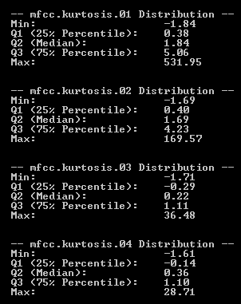

从这个输出可以看出，大多数峰度值介于-2 和 5 之间，但也有峰度值较大的情况。现在让我们看看前四个系数的偏度分布：

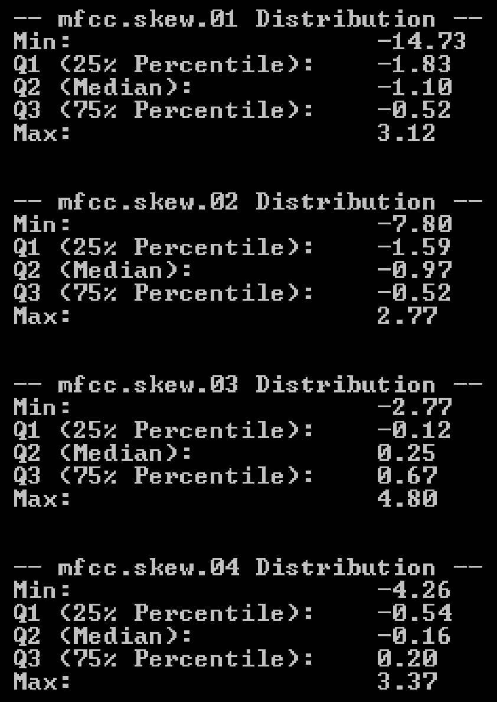

偏度在较窄的范围内变化。通常，偏度值似乎介于-15 和 5 之间。最后，让我们看看前四个系数的平均值分布：

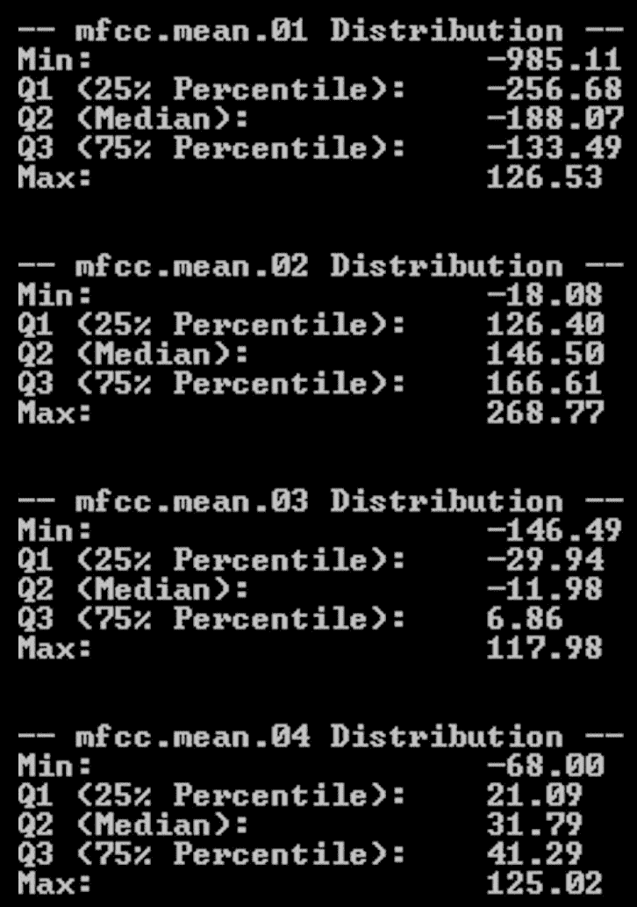

从这个输出中可以看出，平均值似乎有所不同，范围很广。它可以取-1000 到 300 之间的任何值。

现在我们已经大致了解了音频特征的分布情况，让我们看看是否可以在不同类型的特征分布中找到任何差异。我们将绘制散点图，*x*轴是每个特征的索引，*y*轴是给定特征的值。让我们先看看这些图，因为通过一些视觉效果会更容易理解。

下图显示了四种不同类型的峰度分布：


如前所述，*x*轴表示每个特征的索引。由于 MFCC 的峰度有 20 个单独的特征，因此 x 值范围为 1 到 20。另一方面，*y*轴显示给定特征的分布。从这张图表中可以看出，不同流派之间的特征分布存在一些差异，这将有助于我们的 ML 模型学习如何正确预测给定歌曲的流派。

以下图表显示了四种不同类型的偏度分布：

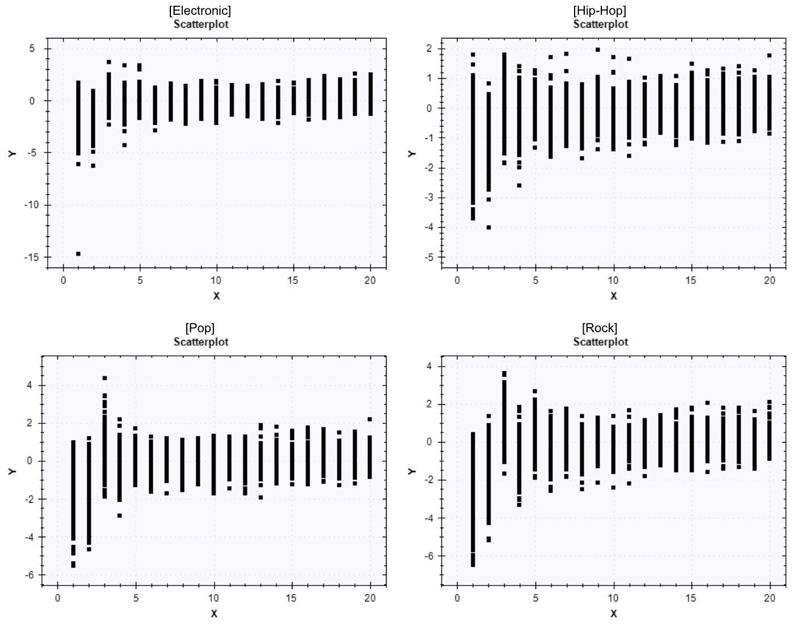

最后，以下图表显示了四种不同类型的平均分布：

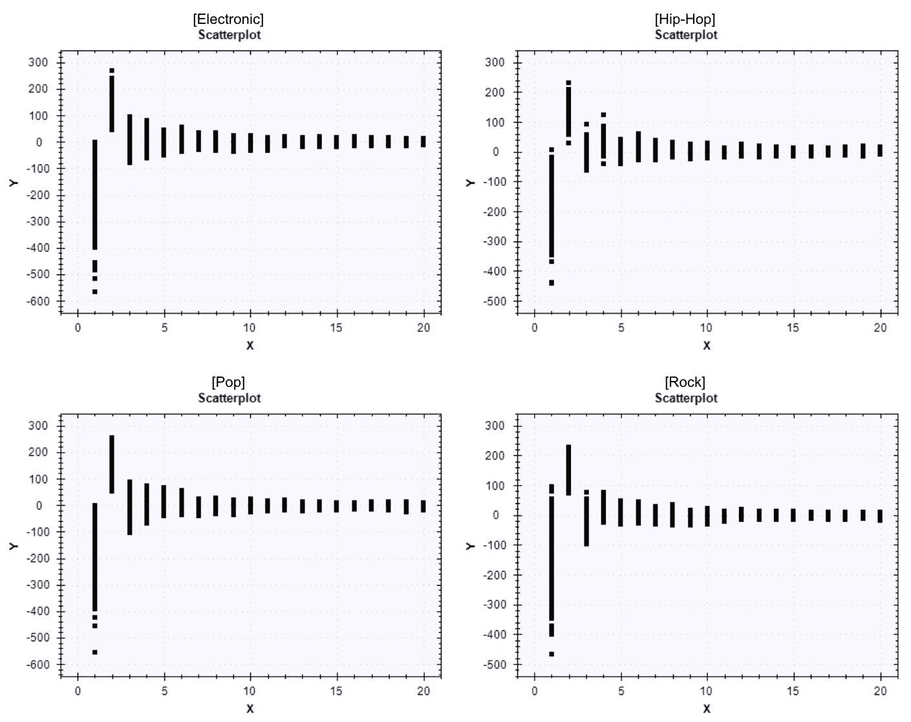

与峰度和偏度相比，每个特征的平均值在不同类型中的分布似乎更为相似。

为了创建这些图表，我们使用了`ScatterplotBox`类。以下代码显示了我们如何创建前面的图表：

```cs
string[] attributes = new string[] { "kurtosis", "min", "max", "mean", "median", "skew", "std" };
foreach (string attribute in attributes)
{
    string[] featureColumns = featuresDF.ColumnKeys.Where(x => x.Contains(attribute)).ToArray();
    foreach (string genre in genreCount.GetColumn<string>("genre_top").Values)
    {
        var genreDF = featuresDF.Rows[
            featuresDF.GetColumn<string>("genre_top").Where(x => x.Value == genre).Keys
        ].Columns[featureColumns];

        ScatterplotBox.Show(
            BuildXYPairs(
                genreDF.Columns[featureColumns].ToArray2D<double>(),
                genreDF.RowCount,
                genreDF.ColumnCount
            )
        ).SetTitle(String.Format("{0}-{1}", genre, attribute));
    }
}
```

从这段代码中可以看到，我们开始迭代第 2 行的不同统计分布（`kurtosis`、`min`、`max`等等），对于这些统计分布，我们从第 7 行的`featuresDF`中选择感兴趣的列。然后，我们编写并使用了一个 helper 函数，该函数为散点图构建了一个 x-y 对数组，并使用`ScatterplotBox`类的`Show`方法进行显示。

为散点图构建 x-y 对的辅助函数的代码如下所示：

```cs
private static double[][] BuildXYPairs(double[,] ary2D, int rowCount, int columnCount)
{
    double[][] ary = new double[rowCount*columnCount][];
    for (int i = 0; i < rowCount; i++)
    {
        for (int j = 0; j < columnCount; j++)
        {
            ary[i * columnCount + j] = new double[2];
            ary[i * columnCount + j][0] = j + 1;
            ary[i * columnCount + j][1] = ary2D[i, j];
        }
    }
    return ary;
}
```

从这段代码中可以看到，此方法将特征的索引作为 x 值，并将特征的值作为 y 值。

此数据分析步骤的完整代码可在此链接中找到：[https://github.com/yoonhwang/c-sharp-machine-learning/blob/master/ch.7/DataAnalyzer.cs](https://github.com/yoonhwang/c-sharp-machine-learning/blob/master/ch.7/DataAnalyzer.cs) 。

# 音乐类型分类的 ML 模型

我们现在将开始构建音乐流派分类的 ML 模型。在这个项目中，我们的 ML 模型的输出将采用稍微不同的形式。与我们建立的其他监督学习模型不同，我们希望我们的模型能够输出给定歌曲的每种类型的可能性或概率。因此，模型输出不是一个值，我们希望我们的模型输出八个值，其中每个值将表示给定歌曲属于八种类型中的每种类型的概率：电子、实验、民谣、嘻哈、器乐、国际、流行和摇滚。为了实现这一点，我们将使用每个模型类中的`Probabilities`方法，而不是我们目前使用的`Decide`方法。

# 逻辑回归

我们要试验的第一个模型是逻辑回归。以下代码显示了我们如何为训练集和测试集构建 80/20 分割的逻辑回归分类器：

```cs
// 1\. Train a LogisticRegression Classifier
Console.WriteLine("\n---- Logistic Regression Classifier ----\n");
var logitSplitSet = new SplitSetValidation<MultinomialLogisticRegression, double[]>()
{
    Learner = (s) => new MultinomialLogisticLearning<GradientDescent>()
    {
        MiniBatchSize = 500
    },

    Loss = (expected, actual, p) => new ZeroOneLoss(expected).Loss(actual),

    Stratify = false,

    TrainingSetProportion = 0.8,

    ValidationSetProportion = 0.2,

};

var logitResult = logitSplitSet.Learn(input, output);

var logitTrainedModel = logitResult.Model;

// Store train & test set indexes to train other classifiers on the same train set
// and test on the same validation set
int[] trainSetIDX = logitSplitSet.IndicesTrainingSet;
int[] testSetIDX = logitSplitSet.IndicesValidationSet;
```

您应该已经熟悉了，我们使用`SplitSetValidation`将样本集分为训练集和测试集。我们使用 80%的样本集进行培训，另外 20%用于测试和评估我们的模型。我们使用`MultinomialLogisticRegression`作为我们的多类分类器模型，使用`MultinomialLogisticLearning`和`GradientDescent`作为我们的学习算法。与前几章类似，我们使用`ZeroOneLoss`作为分类器的`Loss`函数。

正如您在这段代码的底部所看到的，我们正在将经过训练的逻辑回归分类器模型存储到一个单独的变量`logitTrainedModel`，以及训练集和测试集的索引中，以用于训练和测试其他学习算法。我们这样做是为了能够对不同 ML 模型之间的模型性能进行正面比较。

使用经过训练的逻辑回归模型进行样本内和样本外预测的代码如下：

```cs
// Get in-sample & out-of-sample predictions and prediction probabilities for each class
double[][] trainProbabilities = new double[trainSetIDX.Length][];
int[] logitTrainPreds = new int[trainSetIDX.Length];
for (int i = 0; i < trainSetIDX.Length; i++)
{
    logitTrainPreds[i] = logitTrainedModel.Decide(input[trainSetIDX[i]]);
    trainProbabilities[i] = logitTrainedModel.Probabilities(input[trainSetIDX[i]]);
}

double[][] testProbabilities = new double[testSetIDX.Length][];
int[] logitTestPreds = new int[testSetIDX.Length];
for (int i = 0; i < testSetIDX.Length; i++)
{
    logitTestPreds[i] = logitTrainedModel.Decide(input[testSetIDX[i]]);
    testProbabilities[i] = logitTrainedModel.Probabilities(input[testSetIDX[i]]);
}
```

如前所述，我们使用的是来自`MultinomialLogisticRegression`模型的`Probabilities`方法，该方法输出一系列概率，每个指数表示给定歌曲成为相应音乐类型的概率。以下代码显示了我们如何对每种类型进行编码：

```cs
IDictionary<string, int> targetVarCodes = new Dictionary<string, int>
{
    { "Electronic", 0 },
    { "Experimental", 1 },
    { "Folk", 2 },
    { "Hip-Hop", 3 },
    { "Instrumental", 4 },
    { "International", 5 },
    { "Pop", 6 },
    { "Rock", 7 }
};
featuresDF.AddColumn("target", featuresDF.GetColumn<string>("genre_top").Select(x => targetVarCodes[x.Value]));
```

让我们尝试使用与逻辑回归模型相同的训练集和测试集索引来训练另一个 ML 模型。

# 高斯核支持向量机

使用以下代码，可以训练多类 SVM 模型：

```cs
// 2\. Train a Gaussian SVM Classifier
Console.WriteLine("\n---- Gaussian SVM Classifier ----\n");
var teacher = new MulticlassSupportVectorLearning<Gaussian>()
{
    Learner = (param) => new SequentialMinimalOptimization<Gaussian>()
    {
        Epsilon = 2,
        Tolerance = 1e-2,
        Complexity = 1000,
        UseKernelEstimation = true
    }
};
// Train SVM model using the same train set that was used for Logistic Regression Classifier
var svmTrainedModel = teacher.Learn(
    input.Where((x,i) => trainSetIDX.Contains(i)).ToArray(),
    output.Where((x, i) => trainSetIDX.Contains(i)).ToArray()
);
```

正如您从这段代码中看到的，我们之前构建的 SVM 模型之间有一个细微的区别。我们使用的是`MulticlassSupportVectorLearning`而不是[第 5 章](05.html# 1LCVG0-5ebdf09927b7492888e31e8436526470)、*房屋和财产的公允价值*中使用的`LinearRegressionNewtonMethod`或`FanChenLinSupportVectorRegression`。这是因为我们现在有一个多类分类问题，需要对此类 SVM 模型使用不同的学习算法。正如我们在前面的另一章中所讨论的，可以调整超参数，例如`Epsilon`、`Tolerance`和`Complexity`，并且您应该尝试使用其他值以获得更好的性能模型。

这里需要注意的一点是，当我们训练我们的 SVM 模型时，我们使用与我们用于构建逻辑回归模型相同的训练集。正如您在代码的底部所看到的，我们在序列集中使用与我们之前用于逻辑回归模型的索引相同的子选择记录。这是为了确保我们能够正确地对该支持向量机模型与逻辑回归模型的性能进行正面比较。

与前一个逻辑回归模型的情况类似，我们使用经过训练的 SVM 模型，使用以下代码进行样本内和样本外预测：

```cs
// Get in-sample & out-of-sample predictions and prediction probabilities for each class
double[][] svmTrainProbabilities = new double[trainSetIDX.Length][];
int[] svmTrainPreds = new int[trainSetIDX.Length];
for (int i = 0; i < trainSetIDX.Length; i++)
{
    svmTrainPreds[i] = svmTrainedModel.Decide(input[trainSetIDX[i]]);
    svmTrainProbabilities[i] = svmTrainedModel.Probabilities(input[trainSetIDX[i]]);
}

double[][] svmTestProbabilities = new double[testSetIDX.Length][];
int[] svmTestPreds = new int[testSetIDX.Length];
for (int i = 0; i < testSetIDX.Length; i++)
{
    svmTestPreds[i] = svmTrainedModel.Decide(input[testSetIDX[i]]);
    svmTestProbabilities[i] = svmTrainedModel.Probabilities(input[testSetIDX[i]]);
}
```

`MulticlassSupportVectorMachine`类还提供了`Probabilities`方法，通过该方法，我们可以获得属于这八种类型的歌曲的可能性。我们将这些概率输出存储到单独的变量`svmTrainProbabilities`和`svmTestProbabilities`，用于我们未来的模型评估和模型集成。

# 朴素贝叶斯

我们将为音乐流派分类建立一个更多的机器学习模型。我们将训练一个朴素贝叶斯分类器。以下代码显示了如何为具有连续值的输入构建朴素贝叶斯分类器：

```cs
// 3\. Train a NaiveBayes Classifier
Console.WriteLine("\n---- NaiveBayes Classifier ----\n");
var nbTeacher = new NaiveBayesLearning<NormalDistribution>();

var nbTrainedModel = nbTeacher.Learn(
    input.Where((x, i) => trainSetIDX.Contains(i)).ToArray(),
    output.Where((x, i) => trainSetIDX.Contains(i)).ToArray()
);
```

从这段代码中可以看到，我们使用`NormalDistribution`作为`NaiveBayesLearning`的发行版。与前几章不同，我们将单词计数作为朴素贝叶斯分类器的特征，我们的音频特征具有连续值。在这种情况下，我们需要构建一个高斯朴素贝叶斯分类器。与我们构建 SVM 模型时类似，我们使用用于逻辑回归模型的相同训练集训练朴素贝叶斯分类器。

以下代码显示了如何使用经过训练的朴素贝叶斯分类器获得样本内和样本外预测的概率输出：

```cs
// Get in-sample & out-of-sample predictions and prediction probabilities for each class
double[][] nbTrainProbabilities = new double[trainSetIDX.Length][];
int[] nbTrainPreds = new int[trainSetIDX.Length];
for (int i = 0; i < trainSetIDX.Length; i++)
{
    nbTrainProbabilities[i] = nbTrainedModel.Probabilities(input[trainSetIDX[i]]);
    nbTrainPreds[i] = nbTrainedModel.Decide(input[trainSetIDX[i]]);
}

double[][] nbTestProbabilities = new double[testSetIDX.Length][];
int[] nbTestPreds = new int[testSetIDX.Length];
for (int i = 0; i < testSetIDX.Length; i++)
{
    nbTestProbabilities[i] = nbTrainedModel.Probabilities(input[testSetIDX[i]]);
    nbTestPreds[i] = nbTrainedModel.Decide(input[testSetIDX[i]]);
}
```

与`MulticlassSupportVectorMachine`和`MultinomialLogisticRegression`类类似，`NaiveBayes`模型也提供了`Probabilities`方法。正如您从代码中看到的，我们将样本内和样本外记录的预测概率存储到两个单独的变量中，`nbTrainProbabilities`和`nbTestProbabilities`。

在下一节中，我们将了解如何组合和集成我们迄今为止构建的这些模型。构建 ML 模型的完整代码可在以下链接中找到：[https://github.com/yoonhwang/c-sharp-machine-learning/blob/master/ch.7/Modeling.cs](https://github.com/yoonhwang/c-sharp-machine-learning/blob/master/ch.7/Modeling.cs) 。

# 基于集合的学习模型

集成学习是将经过训练的模型组合在一起，以提高它们的预测能力。我们在前几章中构建的随机森林分类器就是集成学习的一个例子。它构建了一个决策树森林，在这里，使用样本集中的一部分样本和特征对单个树进行训练。这种集成学习方法称为**装袋**。本章中我们将使用的系综方法是**叠加**。堆叠是指使用其他模型的输出构建新的 ML 模型，这些模型称为**基础学习模型**。

在本项目中，我们将在前一节中构建的 logistic 回归、SVM 和朴素贝叶斯模型的预测概率输出的基础上构建一个新的朴素贝叶斯分类器模型。我们需要做的第一件事是利用基本模型的概率输出构建一个新模型，即构建训练输入。以下代码显示了我们如何组合基本模型的所有输出：

```cs
// 4\. Ensembling Base Models
Console.WriteLine("\n-- Building Meta Model --");
double[][] combinedTrainProbabilities = new double[trainSetIDX.Length][];
for (int i = 0; i < trainSetIDX.Length; i++)
{
    List<double> combined = trainProbabilities[i]
        .Concat(svmTrainProbabilities[i])
        .Concat(nbTrainProbabilities[i])
        .ToList();
    combined.Add(logitTrainPreds[i]);
    combined.Add(svmTrainPreds[i]);
    combined.Add(nbTrainPreds[i]);

    combinedTrainProbabilities[i] = combined.ToArray();
}

double[][] combinedTestProbabilities = new double[testSetIDX.Length][];
for (int i = 0; i < testSetIDX.Length; i++)
{
    List<double> combined = testProbabilities[i]
        .Concat(svmTestProbabilities[i])
        .Concat(nbTestProbabilities[i])
        .ToList();
    combined.Add(logitTestPreds[i]);
    combined.Add(svmTestPreds[i]);
    combined.Add(nbTestPreds[i]);

    combinedTestProbabilities[i] = combined.ToArray();
}
Console.WriteLine("\n* input shape: ({0}, {1})\n", combinedTestProbabilities.Length, combinedTestProbabilities[0].Length);
```

正如您从这段代码中所看到的，我们将目前构建的所有三个模型的预测概率串联起来。使用这个概率输出数据作为输入，我们将使用朴素贝叶斯学习算法构建一个新的元模型。以下代码是我们如何训练此元模型的：

```cs
// Build meta-model using NaiveBayes Learning Algorithm
var metaModelTeacher = new NaiveBayesLearning<NormalDistribution>();
var metamodel = metaModelTeacher.Learn(
    combinedTrainProbabilities, 
    output.Where((x, i) => trainSetIDX.Contains(i)).ToArray()
);
```

从这段代码中，您可以看到我们仍然在使用`NormalDistribution`，因为输入是一组连续值。然后，我们使用我们之前训练的基础学习模型的组合概率输出来训练这种新的朴素贝叶斯分类器。与前面的步骤类似，我们使用`Probabilities`方法从该元模型获得预测输出，并将这些结果存储到单独的变量中。使用此新元模型获得列车和测试集预测输出的代码如下：

```cs
// Get in-sample & out-of-sample predictions and prediction probabilities for each class
double[][] metaTrainProbabilities = new double[trainSetIDX.Length][];
int[] metamodelTrainPreds = new int[trainSetIDX.Length];
for (int i = 0; i < trainSetIDX.Length; i++)
{
    metaTrainProbabilities[i] = metamodel.Probabilities(combinedTrainProbabilities[i]);
    metamodelTrainPreds[i] = metamodel.Decide(combinedTrainProbabilities[i]);
}

double[][] metaTestProbabilities = new double[testSetIDX.Length][];
int[] metamodelTestPreds = new int[testSetIDX.Length];
for (int i = 0; i < testSetIDX.Length; i++)
{
    metaTestProbabilities[i] = metamodel.Probabilities(combinedTestProbabilities[i]);
    metamodelTestPreds[i] = metamodel.Decide(combinedTestProbabilities[i]);
}
```

现在我们已经构建了所有模型，让我们开始看看这些模型的性能。在下一节中，我们将评估基本模型以及我们刚刚构建的元模型的性能。

# 评估推荐/排名排序模型

评估按结果排序的推荐模型与评估分类模型有很大不同。除了模型预测是对是错之外，我们还关心推荐模型中正确结果的排名。换言之，预测正确结果为第二名的模型比预测正确结果为第四名或第五名的模型更好。例如，当您在搜索引擎上搜索某个内容时，在第一页的顶部获取最合适的文档是很好的，但是在第一页上将该文档作为第二个或第三个链接仍然可以，只要它不出现在第一页或下一页的底部。我们将在以下部分讨论评估此类推荐和排名模型的一些方法。

# 预测精度

首先也是最简单的衡量标准是准确度。对于我们建立的第一个逻辑回归模型，我们可以使用以下代码获得精度：

```cs
Console.WriteLine(String.Format("train accuracy: {0:0.0000}", 1-logitResult.Training.Value));
Console.WriteLine(String.Format("validation accuracy: {0:0.0000}", 1-logitResult.Validation.Value));
```

对于以下模型、SVM 和朴素贝叶斯分类器，我们可以使用以下代码计算训练集和测试集预测的准确性：

```cs
Console.WriteLine(
    String.Format(
        "train accuracy: {0:0.0000}",
        1 - new ZeroOneLoss(output.Where((x, i) => trainSetIDX.Contains(i)).ToArray()).Loss(nbTrainPreds)
    )
);
Console.WriteLine(
    String.Format(
        "validation accuracy: {0:0.0000}",
        1 - new ZeroOneLoss(output.Where((x, i) => testSetIDX.Contains(i)).ToArray()).Loss(nbTestPreds)
    )
);
```

我们将`SplitSetValidation`类用于第一个逻辑回归模型，因此在模型拟合时计算精度。然而，对于后续的模型，我们分别训练了 SVM 和朴素贝叶斯模型，因此我们需要使用`ZeroOneLoss`类来计算精度。

运行此代码时，您将看到逻辑回归模型的精度输出，如下所示：

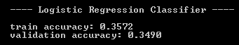

对于朴素贝叶斯模型，精度结果如下所示：


对于 SVM 模型，输出如下所示：

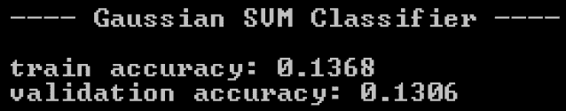

最后，元模型的精度结果如下所示：


从这些结果中，我们可以看出，朴素贝叶斯分类器在 42%的时间里预测了正确的类型，表现最好。在预测精度方面，logistic 回归模型为第二高精度的次优模型，SVM 模型为最差模型。有趣的是，我们用其他三个模型的输出构建的元模型没有表现得那么好。它比 SVM 模型做得更好，但比朴素贝叶斯和逻辑回归分类器做得更差。

# 混淆矩阵

接下来我们要看的是混淆矩阵。在[第 2 章](02.html# QMFO0-5ebdf09927b7492888e31e8436526470)、*垃圾邮件过滤*中的二元分类案例中，我们探讨了混淆矩阵为 2 x 2 矩阵的情况。然而，在这个项目中，我们的模型有`8`结果，混淆矩阵的形状将是 8 x 8。让我们首先看看如何构建这样一个混淆矩阵：

```cs
// Build confusion matrix
string[] confMatrix = BuildConfusionMatrix(
    output.Where((x, i) => testSetIDX.Contains(i)).ToArray(), logitTestPreds, 8
);

System.IO.File.WriteAllLines(Path.Combine(dataDirPath, "logit-conf-matrix.csv"), confMatrix);
```

助手函数`BuildConfusionMatrix`的代码如下所示：

```cs
private static string[] BuildConfusionMatrix(int[] actual, int[] preds, int numClass)
{
    int[][] matrix = new int[numClass][];
    for(int i = 0; i < numClass; i++)
    {
        matrix[i] = new int[numClass];
    }

    for(int i = 0; i < actual.Length; i++)
    {
        matrix[actual[i]][preds[i]] += 1;
    }

    string[] lines = new string[numClass];
    for(int i = 0; i < matrix.Length; i++)
    {
        lines[i] = string.Join(",", matrix[i]);
    }

    return lines;
}
```

一旦你运行这段代码，你将得到一个 8 x 8 的矩阵，其中的行是实际的和观察到的类型，列是从模型中预测的类型。以下是我们的逻辑回归模型的混淆矩阵：


粗体数字表示模型正确预测的记录数。例如，该逻辑回归模型将**79 首**歌曲正确预测为**电子**，而**33 首**歌曲被预测为**电子**，它们实际上是**实验**。这里值得注意的一点是，这种逻辑回归模型在预测流行歌曲方面做得不太好。它对流行音乐只有一个预测，但这个预测是错误的，这首歌实际上是一首**嘻哈**歌曲。现在让我们看看朴素贝叶斯分类器预测的混淆矩阵：

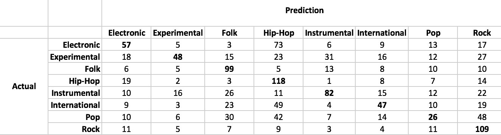

从准确度结果来看，混淆矩阵看起来比逻辑回归更好。与逻辑回归分类器相比，每个类别中较高比例的预测是正确的。朴素的贝叶斯分类器似乎对**流行**歌曲也有更好的表现。

以下是 SVM 分类器的混淆矩阵：

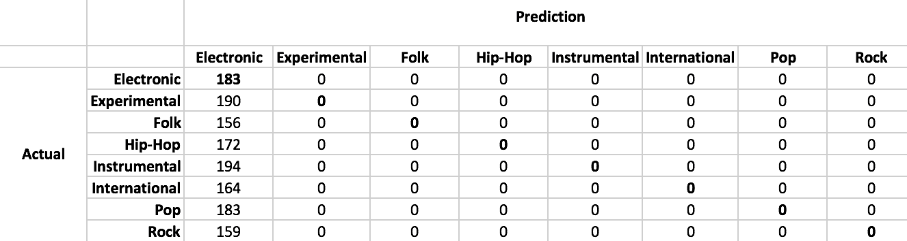

正如预期的那样，预测结果并不好。SVM 模型预测 100%的记录为**电子**。最后，让我们看看元模型是如何做到的：


这个混淆矩阵看起来比 SVM 模型稍微好一点。然而，大多数预测是**器乐**或**国际**，只有少数记录被预测为其他类型。

查看混淆矩阵是检查模型错误分类并找出模型的优缺点的好方法。这些结果与准确度结果很好地一致，其中朴素贝叶斯分类器优于所有其他模型，而元模型则表现不佳，尽管它不是我们构建的四个模型中最差的。

# 平均倒数排名

下一个评估指标是 MRR。MRR 可用于模型生成结果列表，并测量排名的总体质量。让我们先看看等式：

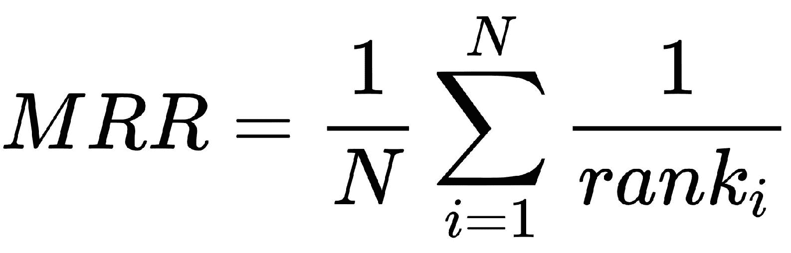

如你所见，它是秩的倒数之和的平均值。考虑下面的例子：


在第一个例子中，正确的体裁排名第二，因此倒数排名为**1/2**。第二个例子的正确体裁是排名第一的，因此倒数排名是**1/1**，即**1**。按照这个过程，我们可以得到所有记录的倒数秩，最终的 MRR 值只是这些倒数秩的平均值。这告诉我们排名的总体质量。在本例中，**MRR**为**0.57**，高于 1/2。因此，这个 MRR 数字表明，平均而言，正确的类型出现在模型预测的前两个类型中。

为了计算模型的 MRR，我们首先需要将概率输出转换为排名，然后根据转换后的模型输出计算 MRR。以下代码片段显示了我们如何计算模型的 MRR：

```cs
// Calculate evaluation metrics
int[][] logitTrainPredRanks = GetPredictionRanks(trainProbabilities);
int[][] logitTestPredRanks = GetPredictionRanks(testProbabilities);

double logitTrainMRRScore = ComputeMeanReciprocalRank(
    logitTrainPredRanks,
    output.Where((x, i) => trainSetIDX.Contains(i)).ToArray()
);
double logitTestMRRScore = ComputeMeanReciprocalRank(
    logitTestPredRanks,
    output.Where((x, i) => testSetIDX.Contains(i)).ToArray()
);

Console.WriteLine("\n---- Logistic Regression Classifier ----\n");
Console.WriteLine(String.Format("train MRR score: {0:0.0000}", logitTrainMRRScore));
Console.WriteLine(String.Format("validation MRR score: {0:0.0000}", logitTestMRRScore));
```

此代码使用两个助手函数`GetPredictionRanks`和`ComputeMeanReciprocalRank`。`GetPredictionRanks`方法将模型的概率输出转换为排名，`ComputeMeanReciprocalRank`方法根据排名计算 MRR。助手函数`GetPredictionRanks`如下所示：

```cs
private static int[][] GetPredictionRanks(double[][] predProbabilities)
{
    int[][] rankOrdered = new int[predProbabilities.Length][];

    for(int i = 0; i< predProbabilities.Length; i++)
    {
        rankOrdered[i] = Matrix.ArgSort<double>(predProbabilities[i]).Reversed();
    }

    return rankOrdered;
}
```

我们正在使用`Accord.Math`软件包中的`Matrix.ArgSort`方法对每个记录的类型进行排序。`Matrix.ArgSort`按概率升序排序后返回流派索引。然而，我们希望它们按降序排列，以便最有可能的流派排在第一位。这就是为什么我们使用`Reversed`方法颠倒已排序索引的顺序。

助手函数`ComputeMeanReciprocalRank`如下所示：

```cs
private static double ComputeMeanReciprocalRank(int[][] rankOrderedPreds, int[] actualClasses)
{
    int num = rankOrderedPreds.Length;
    double reciprocalSum = 0.0;

    for(int i = 0; i < num; i++)
    {
        int predRank = 0;
        for(int j = 0; j < rankOrderedPreds[i].Length; j++)
        {
            if(rankOrderedPreds[i][j] == actualClasses[i])
            {
                predRank = j + 1;
            }
        }
        reciprocalSum += 1.0 / predRank;
    }

    return reciprocalSum / num;
}
```

这是我们之前讨论的 MRR 计算公式的实现。此方法迭代每个记录并获得正确类型的排名。然后，它对秩进行倒数，对所有倒数求和，最后将该和除以记录数，得到 MRR 数。

让我们开始看看迄今为止我们已经建立的模型的 MRR 分数。以下输出显示了`Logistic Regression Classifier`的 MRR 分数：

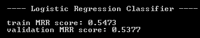

朴素贝叶斯分类器的样本内和样本外 MRR 分数如下所示：

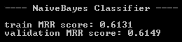

SVM 分类器的结果如下：


最后，元模型的 MRR 分数如下所示：

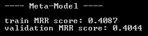

从这些输出中，我们可以看到朴素贝叶斯分类器在`0.61`左右具有最好的 MRR 分数，而 SVM 分类器在`0.33`左右具有最差的 MRR 分数。元模型的 MRR 分数约为`0.4`。这与我们在前面步骤中查看预测精度和混淆矩阵得到的结果一致。从这些 MRR 分数中，我们可以看出，对于朴素贝叶斯分类器来说，正确的类型通常位于前两位。另一方面，对于 SVM 分类器来说，正确的类型通常排在顶部的第三位，而对于元模型来说，则排在前三位。从这些案例中可以看出，我们可以通过查看 MRR 度量来了解排名的整体质量。

# 总结

在本章中，我们建立了第一个推荐模型，对每个结果的可能性进行排序。本章首先定义了我们将要解决的问题以及我们将要使用的建模和评估方法。然后，我们查看了样本集中变量的分布。首先，我们观察了目标变量在不同类别或流派之间的分布情况，并注意到这是一个平衡良好的样本集，没有一个流派占据我们数据集中的大部分样本。然后，我们研究了音频特征的分布。在本项目中，我们主要关注 MFCC 及其统计分布，如峰度、偏度、最小值和最大值。通过查看这些特征的四分位数和散点图，我们确认了不同音乐类型的特征分布不同。

在我们的模型构建步骤中，我们试验了三种学习算法：逻辑回归、支持向量机和朴素贝叶斯。因为我们正在构建多类分类模型，所以我们必须使用与前几章不同的学习算法。我们学习了如何在 Accord.NET 框架中使用`MultinomialLogisticRegression`和`MulticlassSupportVectorMachine`类，以及何时将`NormalDistribution`用于`NaiveBayesLearning`。然后，我们讨论了如何构建一个元模型，该模型集成了基础学习模型的预测结果，以提高 ML 模型的预测能力。最后，我们讨论了评估排名模型与其他分类模型的区别，并查看了评估 ML 模型的准确性、混淆矩阵和 MRR 度量。

在下一章中，我们将使用手写数字图像数据集来构建分类器，将每个图像分类为相应的数字。我们将讨论一些降低特征集维数的技术，以及如何将它们应用于图像数据集。我们还将讨论如何使用作为深度学习支柱的 Accord.NET 框架在 C# 中构建神经网络。**