# 手写数字识别

我们研究了如何使用多类分类模型构建推荐模型。在本章中，我们将扩展使用图像数据集构建多类分类模型的知识和经验。图像识别是一个著名的**机器学习**（**ML**）问题，也是目前正在积极研究的课题之一。识别手写字母和数字是一个在我们生活中具有很高适用性的图像识别问题。应用手写图像识别系统的一个很好的例子是邮局使用的地址识别系统。使用这种技术，邮局现在可以自动、更快速地识别手写的地址，并加快和改进整体邮寄服务。

在本章中，我们将建立手写数字识别的机器学习模型。我们将从一个包含 40000 多幅手写数字图像的逐像素灰度信息的数据集开始。我们将查看每个像素中值的分布，并讨论此灰度图像数据集的稀疏程度。然后，我们将讨论何时以及如何应用降维技术，更具体地说是**主成分分析**（**PCA**），以及我们如何从该技术中获益于我们的图像识别项目。我们将探索不同的学习算法，如逻辑回归和朴素贝叶斯，还将介绍如何使用 Accord.NET 框架构建**人工神经网络**（**ANN**），它构成深度学习技术的主干。然后，我们将通过查看各种评估指标来比较这些 ML 模型的预测性能，并讨论哪个模型在手写数字识别项目中表现最好。

在本章中，我们将介绍以下主题：

*   手写数字识别项目的问题定义
*   图像数据集的数据分析
*   特征工程与降维
*   手写数字识别的 ML 模型
*   多类分类模型的评价

# 问题定义

图像识别技术可以应用到我们的日常生活中，并且很容易在日常生活中找到。在邮局，图像识别系统用于以编程方式理解手写地址。社交网络服务，如 Facebook，使用图像识别技术自动为人添加标签，例如，当你想在照片中为人添加标签时。此外，正如本书第一章中简要提到的，微软的 Kinect 将图像识别技术用于其运动传感游戏。在这些实际应用中，我们将尝试构建一个手写数字识别系统。可以想象，这种数字图像识别模型和系统可以用于邮局的自动手写地址识别。在我们能够教机器识别和理解手写数字之前，人们必须仔细查看每个字母，找出每个字母的目的地和来源。然而，现在我们可以训练机器理解手写地址，邮寄过程变得更加容易和快捷。

为了建立一个手写数字识别模型，我们将使用**MNIST**数据集，该数据集拥有 60000 多幅手写数字图像。**MNIST**数据集包含 28 x 28 个灰度图像。您可以在以下链接中找到更多信息：[http://yann.lecun.com/exdb/mnist/](http://yann.lecun.com/exdb/mnist/) 。对于这个项目，我们将使用一个经过清理和处理的 MNIST 数据集，可以在以下链接找到：[https://www.kaggle.com/c/digit-recognizer/data](https://www.kaggle.com/c/digit-recognizer/data) 。有了这些数据，我们将首先了解数字在数据集中的分布情况，以及特征集的稀疏程度。然后，我们将使用 PCA 进行降维，并可视化不同类别之间特征分布的差异。利用 PCA 转换的数据，我们将训练几个 ML 模型来比较它们的预测性能。在 logistic 回归和朴素贝叶斯分类算法的基础上，我们将用 ANN 进行实验，因为它对图像数据集很有效。我们将观察准确度、精确度与召回率以及曲线下的**面积**（**AUC**），以比较不同机器学习模型的预测性能。

总结我们对手写数字识别项目的问题定义：

*   有什么问题？我们需要一个手写数字识别模型，该模型可以将每个手写图像分类为相应的数字类，以便将其用于地址识别系统等应用。
*   为什么这是个问题？如果没有这样一个模型，就需要大量的人力来按地址识别和组织信件。如果我们有一种能够识别手写数字的技术，它可以大大减少完成同样任务所需的人力。
*   解决这个问题的方法有哪些？我们将使用包含大量手写数字图像示例的公开数据。利用这些数据，我们将建立机器学习模型，可以将每幅图像分类为 10 位数字中的一位。
*   成功的标准是什么？我们需要一个机器学习模型，该模型能够用相应的数字准确地对每个图像进行分类。由于该模型最终将用于地址识别，因此我们需要高准确率，即使我们不得不牺牲召回率。

# 图像数据集的数据分析

让我们开始研究这个图像数据集。如前一节所述，我们将使用此链接中的数据：[https://www.kaggle.com/c/digit-recognizer/data](https://www.kaggle.com/c/digit-recognizer/data) 。您可以从链接下载`train.csv`数据，并将其存储在一个可以将其加载到 C# 环境中的位置。

# 目标变量分布

我们首先要看的是目标变量的分布。我们的目标变量编码在`label`列中，它可以取 0 到 9 之间的值，并表示图像所属的数字。下面的代码片段显示了我们如何通过目标变量聚合数据，并计算每个数字的示例数：

```cs
var digitCount = featuresDF.AggregateRowsBy<string, int>(
    new string[] { "label" },
    new string[] { "pixel0" },
    x => x.ValueCount
).SortRows("pixel0");

digitCount.Print();

var barChart = DataBarBox.Show(
    digitCount.GetColumn<string>("label").Values.ToArray(),
    digitCount["pixel0"].Values.ToArray()
).SetTitle(
    "Digit Count"
);
```

与其他章节一样，我们在 Deedle 的数据框架中使用了`AggregateRowsBy`方法，通过目标变量`label`聚合数据，统计每个标签中的记录数，并根据计数进行排序。与前几章类似，我们使用`DataBarBox`类显示数据集中目标变量分布的条形图。以下是运行此代码时将看到的条形图：

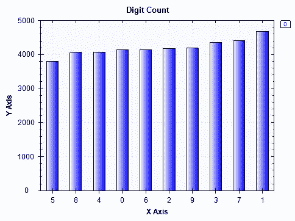

在控制台输出中，您将看到以下内容：

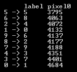

从条形图和控制台输出中可以看到，数据集中数字`1`最多，数字`5`最少。但是，数据集中没有一个类可以接受大多数示例，而且目标变量非常平衡，分布在不同的类中。

# 手写数字图像

在我们开始研究功能集之前，让我们先看看手写数字的实际图像。在数据集的每个记录中，我们都有 28 x 28 图像中每个图像 784 像素的灰度值。为了从这个平坦的数据集构建图像，我们需要首先将 784 个像素值的每个数组转换为二维数组。下面的代码显示了我们编写的帮助函数，该函数用于从展开数组创建图像：

```cs
private static void CreateImage(int[] rows, string digit)
{
    int width = 28;
    int height = 28;
    int stride = width * 4;
    int[,] pixelData = new int[width, height];

    for (int i = 0; i < width; ++i)
    {
        for (int j = 0; j < height; ++j)
        {
            byte[] bgra = new byte[] { (byte)rows[28 * i + j], (byte)rows[28 * i + j], (byte)rows[28 * i + j], 255 };
            pixelData[i, j] = BitConverter.ToInt32(bgra, 0);
        }
    }

    Bitmap bitmap;
    unsafe
    {
        fixed (int* ptr = &pixelData[0, 0])
        {
            bitmap = new Bitmap(width, height, stride, PixelFormat.Format32bppRgb, new IntPtr(ptr));
        }
    }
    bitmap.Save(
        String.Format(@"\\Mac\Home\Documents\c-sharp-machine-learning\ch.8\input-data\{0}.jpg", digit)
    );
}
```

从这段代码中可以看到，它首先初始化一个二维整数数组`pixelData`，该数组将存储像素数据。因为我们知道每个图像都是 28 x 28 的图像，所以我们将把展平数据中的前 28 个像素作为二维整数数组中的第一行，第二组 28 个像素作为第二行，以此类推。在`for`循环中，我们将每个像素的值转换为**蓝绿红阿尔法**（**BGRA**字节数组，名为`bgra`。正如我们所知，图像是灰度的，我们可以对蓝色、绿色和红色分量使用相同的值。一旦我们将展平的像素数据转换为 28 x 28 二维整数数组，我们现在就可以构建手写数字图像的图像。我们正在使用`Bitmap`类来重建这些手写数字图像。以下代码显示了我们如何使用此帮助器函数为每个数字生成图像：

```cs
ISet<string> exportedLabels = new HashSet<string>();
for(int i = 0; i < featuresDF.RowCount; i++)
{
    exportedLabels.Add(featuresDF.Rows[i].GetAs<string>("label"));

    CreateImage(
        featuresDF.Rows[i].ValuesAll.Select(x => (int)x).Where((x, idx) => idx > 0).ToArray(),
        featuresDF.Rows[i].GetAs<string>("label")
    );

    if(exportedLabels.Count() >= 10)
    {
        break;
    }
}
```

运行此代码时，您将看到以下图像存储在本地驱动器上：

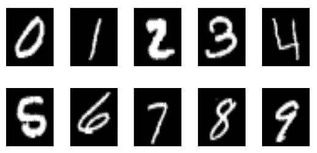

您可以使用相同的代码生成更多图像，这将帮助您更好地了解手写数字的原始图像是什么样子。

# 图像特征-像素

现在让我们看一下图像特征。在我们的数据集中，每个图像中的每个像素都有表示灰度值的整数值。这将有助于理解每个像素可以取值的范围，以及我们是否能够发现该像素数据在不同手写数字类别之间的分布存在任何明显差异。

我们首先来看像素数据的个别分布。以下代码片段显示了如何计算数据集中每个像素的四分位数：

```cs
List<string> featureCols = new List<string>();
foreach (string col in featuresDF.ColumnKeys)
{
    if (featureCols.Count >= 20)
    {
        break;
    }

    if (col.StartsWith("pixel"))
    {
        if (featuresDF[col].Max() > 0)
        {
            featureCols.Add(col);

            Console.WriteLine(String.Format("\n\n-- {0} Distribution -- ", col));
            double[] quantiles = Accord.Statistics.Measures.Quantiles(
                featuresDF[col].ValuesAll.ToArray(),
                new double[] { 0, 0.25, 0.5, 0.75, 1.0 }
            );
            Console.WriteLine(
                "Min: \t\t\t{0:0.00}\nQ1 (25% Percentile): \t{1:0.00}\nQ2 (Median): \t\t{2:0.00}\nQ3 (75% Percentile): \t{3:0.00}\nMax: \t\t\t{4:0.00}",
                quantiles[0], quantiles[1], quantiles[2], quantiles[3], quantiles[4]
            );
        }

    }
}
```

与前几章的情况类似，我们使用`Accord.Statistics.Measures`中的`Quantiles`方法获得每个像素的四分位数。正如您可能从前面的章节中回忆到的，四分位数是将数据分为四个部分的值。换句话说，第一个四分位数（`Q1`表示 25%的百分位数，即最小值和中值之间的中点。第二个四分位数（`Q2`）表示中值，第三个四分位数（`Q3`）表示 75%的百分位数，即中值和最大值之间的中点。在这个代码示例中，我们只计算前 20 个像素的四分位数，这些像素的值不是 0，如第 4-7 行和第 11 行所示。运行此代码时，您将获得如下输出：

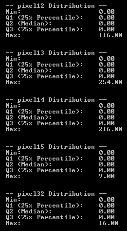

这里，我们只展示前五个分布。从该输出中可以看到，大多数像素值为 0。如果您查看我们在上一节中重建的图像，图像中的大多数像素是黑色的，只有一部分像素用于显示数字。在我们的像素数据中，这些黑色像素被编码为`0`，因此，对于相应的图像，预期许多像素具有 0 值。

让我们建立一些散点图，这样我们可以更好地直观地理解这些数据。以下代码为每个手写数字构建前 20 个非零像素特征分布的散点图：

```cs
string[] featureColumns = featureCols.ToArray();

foreach (string label in digitCount.GetColumn<string>("label").Values)
{
    var subfeaturesDF = featuresDF.Rows[
        featuresDF.GetColumn<string>("label").Where(x => x.Value == label).Keys
    ].Columns[featureColumns];

    ScatterplotBox.Show(
        BuildXYPairs(
            subfeaturesDF.Columns[featureColumns].ToArray2D<double>(),
            subfeaturesDF.RowCount,
            subfeaturesDF.ColumnCount
        )
    ).SetTitle(String.Format("Digit: {0} - 20 sample Pixels", label));
}
```

如果仔细看一下这段代码，我们首先从`featureCols`、`List`对象构建一个`featureColumns`字符串数组。`List`对象`featureCols`是前 20 个像素的列表，这些像素的值不是 0，这是在我们计算四分位数时根据前面的代码构建的。我们使用的是上一章中使用的相同辅助函数`BuildXYPairs`，用于将数据帧转换为 x-y 对数组，其中`x`值是每个像素的索引，`y`值是实际像素值。使用这个辅助函数，我们使用`ScatterplotBox`类显示散点图，该散点图显示 20 个样本像素中每个像素的像素分布。

以下是 0 位的散点图：

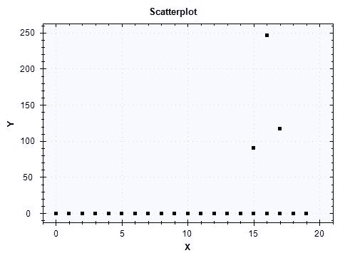

对于 0 位类中的所有图像，前 20 个像素中的大多数具有 0 值。在这个散点图中显示的 20 个像素中，只有三个像素的值不是 0。让我们看看这些像素在不同数字类别中的分布。

以下散点图适用于 1 位类别：


与 0 位类的情况类似，在我们这里展示的 20 个像素中，大多数都有 0 个值，只有三个像素的值不是 0。与之前 0 位数类的散点图相比，1 位数类的像素数据分布略有不同。

以下内容适用于 2 位数的类别：


这个散点图显示了我们在这里显示的 20 个像素的完全不同的分布。这 20 个像素中的大多数像素的值在 0 到 255 之间，只有少数像素的所有图像的值都为 0。这种特征集分布上的差异将帮助我们的 ML 模型学习如何正确分类手写数字。

最后，我们将再看一个散点图，我们将看到目标变量如何分布在两个不同的像素上。我们使用以下代码生成样本二维散点图：

```cs
double[][] twoPixels = featuresDF.Columns[
    new string[] { featureColumns[15], featureColumns[16] }
].Rows.Select(
    x => Array.ConvertAll<object, double>(x.Value.ValuesAll.ToArray(), o => Convert.ToDouble(o))
).ValuesAll.ToArray();

ScatterplotBox.Show(
    String.Format("{0} vs. {1}", featureColumns[15], featureColumns[16]), 
    twoPixels,
    featuresDF.GetColumn<int>("label").Values.ToArray()
);
```

为了便于说明，我们选择了第十五个和第十六个索引特征，结果是`pixel43`和`pixel44`。运行此代码时，您将看到以下散点图：

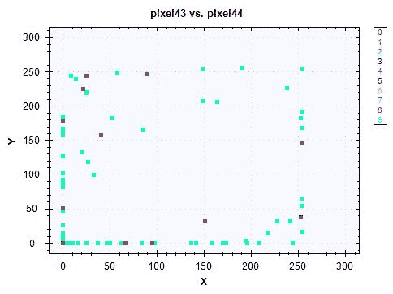

我们可以看到不同类别之间的一些区别，但由于`pixel43`和`pixel44`的大多数像素值均为 0，因此通过查看散点图很难在不同的目标类别之间画出清晰的区别。在下一节中，我们将研究如何使用 PCA 及其主成分来创建散点图的另一个版本，该散点图可以帮助我们在可视化数据时识别不同目标类别之间的更清晰区别。

此数据分析步骤的完整代码可在此链接中找到：[https://github.com/yoonhwang/c-sharp-machine-learning/blob/master/ch.8/DataAnalyzer.cs](https://github.com/yoonhwang/c-sharp-machine-learning/blob/master/ch.8/DataAnalyzer.cs) 。

# 特征工程与降维

到目前为止，我们已经研究了目标变量和像素数据的分布。在本节中，我们将开始讨论为 ML 建模步骤构建训练集和测试集，然后讨论如何使用 PCA**进行降维，以及如何使用主成分可视化数据。**

 **# 将样本集拆分为系列与测试集

在这一步中，我们要做的第一项任务是将数据集随机分成训练集和测试集。让我们首先看看代码：

```cs
double trainSetProportiona = 0.7;

var rnd = new Random();
var trainIdx = featuresDF.RowKeys.Where((x, i) => rnd.NextDouble() <= trainSetProportiona);
var testIdx = featuresDF.RowKeys.Where((x, i) => !trainIdx.Contains(i));

var trainset = featuresDF.Rows[trainIdx];
var testset = featuresDF.Rows[testIdx];

var trainLabels = trainset.GetColumn<int>("label").Values.ToArray();

string[] nonZeroPixelCols = trainset.ColumnKeys.Where(x => trainset[x].Max() > 0 && !x.Equals("label")).ToArray();

double[][] data = trainset.Columns[nonZeroPixelCols].Rows.Select(
    x => Array.ConvertAll<object, double>(x.Value.ValuesAll.ToArray(), o => Convert.ToDouble(o))
).ValuesAll.ToArray();
```

正如您从前面的代码中看到的，我们将大约 70%的数据用于培训，其余用于测试。这里，我们使用`Random`类生成随机数，使用记录的索引将样本集拆分为训练集和测试集。一旦我们构建了训练集和测试集，我们将删除所有图像中具有 0 值的列或像素（第 12 行）。这是因为如果一个特性在不同的目标类之间没有变化，那么它就没有关于这些目标类的任何信息可供 ML 模型学习。

现在我们有了训练集和测试集，让我们检查一下目标类在训练集和测试集中的分布情况。以下代码可用于聚合：

```cs
var digitCount = trainset.AggregateRowsBy<string, int>(
    new string[] { "label" },
    new string[] { "pixel0" },
    x => x.ValueCount
).SortRows("pixel0");

digitCount.Print();

var barChart = DataBarBox.Show(
    digitCount.GetColumn<string>("label").Values.ToArray(),
    digitCount["pixel0"].Values.ToArray()
).SetTitle(
    "Train Set - Digit Count"
);

digitCount = testset.AggregateRowsBy<string, int>(
    new string[] { "label" },
    new string[] { "pixel0" },
    x => x.ValueCount
).SortRows("pixel0");

digitCount.Print();

barChart = DataBarBox.Show(
    digitCount.GetColumn<string>("label").Values.ToArray(),
    digitCount["pixel0"].Values.ToArray()
).SetTitle(
    "Test Set - Digit Count"
);
```

运行此代码时，您将看到列车组中目标变量分布的下图：

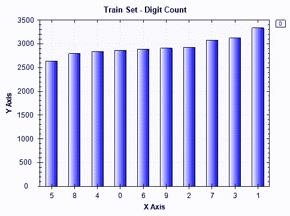

下面是我们看到的测试集：


这些分布看起来与我们在数据分析步骤中看到的类似，当时我们分析了整个数据集中的目标变量分布。现在让我们开始讨论如何将 PCA 应用于我们的列车组。

# PCA 降维

当我们分析数据时，我们看到许多特征或像素值为 0。在这种情况下，应用 PCA 有助于降低数据的维数，同时最大限度地减少降低的维数带来的信息损失。简单地说，主成分分析通过原始特征的线性组合来解释数据集及其结构。所以，每个主成分都是特征的线性组合。让我们开始看看如何使用 Accord.NET 框架在 C# 中运行 PCA。

以下是如何初始化和训练 PCA：

```cs
var pca = new PrincipalComponentAnalysis(
    PrincipalComponentMethod.Standardize
);
pca.Learn(data);
```

一旦`PrincipalComponentAnalysis`使用数据进行训练，它包含关于每个主成分的线性组合的所有信息，并且可以应用于转换其他数据。在应用 PCA 之前，我们使用`PrincipalComponentMethod.Standardize`标准化我们的数据。这是因为主成分分析对每个特征的尺度都很敏感。因此，我们希望在应用 PCA 之前对数据集进行标准化。

为了对其他数据进行 PCA 变换，可以使用`Transform`方法，如下代码段所示：

```cs
double[][] transformed = pca.Transform(data);
```

现在，我们已经了解了如何将 PCA 应用于数据集，让我们看看前两个主成分，看看是否可以在目标变量分布中找到任何明显的模式。下面的代码显示了如何使用颜色编码的目标类构建前两个组件的散点图：

```cs
double[][] first2Components = transformed.Select(x => x.Where((y, i) => i < 2).ToArray()).ToArray();

ScatterplotBox.Show("Component # 1 vs. Component # 2", first2Components, trainLabels);
```

运行此代码后，您将看到以下散点图：

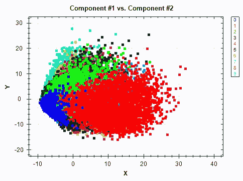

当您将此图表与我们在数据分析步骤中查看的`pixel43`和`pixel44`之间的图表进行比较时，这看起来非常不同。从前两个主成分的散点图中，我们可以看出目标类更容易识别。虽然它不能与这两个组件完全分离，但我们可以看到，如果我们将更多的组件组合到分析和建模中，将更容易将一个目标类与另一个目标类分离。

主成分分析的另一个重要方面是每个主成分解释的方差量。让我们看看下面的代码：

```cs
DataSeriesBox.Show(
    pca.Components.Select((x, i) => (double)i),
    pca.Components.Select(x => x.CumulativeProportion)
).SetTitle("Explained Variance");

System.IO.File.WriteAllLines(
    Path.Combine(dataDirPath, "explained-variance.csv"),
    pca.Components.Select((x, i) => String.Format("{0},{1:0.0000}", i, x.CumulativeProportion))
);
```

我们可以使用`CumulativeProportion`属性检索每个 PCA 分量解释的数据中方差的累积比例。为了得到每个 PCA 分量解释的单个比例，可以使用每个 PCA 分量的`Proportion`属性。然后，我们将使用`DataSeriesBox`类绘制一个折线图，以显示每个分量解释的方差的累积比例。

运行此代码时，将生成以下绘图：

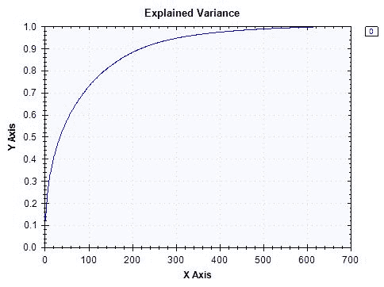

从图中可以看出，数据集中约 90%的方差可以用前 200 个分量来解释。有了 600 个组件，我们可以解释数据集中几乎 100%的差异。与原始数据集中作为特征的 784 像素总数相比，这大大降低了数据的维数。根据您希望为您的 ML 模型捕获多少差异，您可以使用此图表来决定最适合您的建模过程的组件数量。

最后，我们需要导出训练集和测试集，以便我们可以将它们用于下面的模型构建步骤。您可以使用以下代码导出 PCA 转换的序列和测试集：

```cs
Console.WriteLine("exporting train set...");
var trainTransformed = pca.Transform(
    trainset.Columns[nonZeroPixelCols].Rows.Select(
        x => Array.ConvertAll<object, double>(x.Value.ValuesAll.ToArray(), o => Convert.ToDouble(o))
    ).ValuesAll.ToArray()
);

System.IO.File.WriteAllLines(
    Path.Combine(dataDirPath, "pca-train.csv"),
    trainTransformed.Select((x, i) => String.Format("{0},{1}", String.Join(",", x), trainset["label"].GetAt(i)))
);

Console.WriteLine("exporting test set...");
var testTransformed = pca.Transform(
    testset.Columns[nonZeroPixelCols].Rows.Select(
        x => Array.ConvertAll<object, double>(x.Value.ValuesAll.ToArray(), o => Convert.ToDouble(o))
    ).ValuesAll.ToArray()
);
System.IO.File.WriteAllLines(
    Path.Combine(dataDirPath, "pca-test.csv"),
    testTransformed.Select((x, i) => String.Format("{0},{1}", String.Join(",", x), testset["label"].GetAt(i)))
);
```

此功能工程和降维步骤的完整代码可在以下链接中找到：[https://github.com/yoonhwang/c-sharp-machine-learning/blob/master/ch.8/FeatureEngineering.cs](https://github.com/yoonhwang/c-sharp-machine-learning/blob/master/ch.8/FeatureEngineering.cs) 。

# 手写数字识别的 ML 模型

现在我们已经为构建 ML 模型做好了一切准备，让我们开始构建这些模型。在本节中，我们将介绍如何基于 PCA 结果对特征进行子选择，然后讨论如何为手写数字识别模型构建逻辑回归和朴素贝叶斯分类器。我们将介绍一种新的学习模型，神经网络，并解释如何使用 Accord.NET 框架为本项目构建一个学习模型。

# 加载数据

构建用于手写数字识别的 ML 模型的第一步是加载我们从上一节构建的数据。您可以使用以下代码加载我们之前创建的列车和测试集：

```cs
// Load the data into a data frame
string trainDataPath = Path.Combine(dataDirPath, "pca-train.csv");
Console.WriteLine("Loading {0}\n\n", trainDataPath);
var trainDF = Frame.ReadCsv(
    trainDataPath,
    hasHeaders: false,
    inferTypes: true
);

string testDataPath = Path.Combine(dataDirPath, "pca-test.csv");
Console.WriteLine("Loading {0}\n\n", testDataPath);
var testDF = Frame.ReadCsv(
    testDataPath,
    hasHeaders: false,
    inferTypes: true
);

string[] colnames = trainDF.ColumnKeys.Select(
    (x, i) => i < trainDF.ColumnKeys.Count() - 1 ? String.Format("component-{0}", i + 1) : "label"
).ToArray();

trainDF.RenameColumns(colnames);
testDF.RenameColumns(colnames);
```

对于本章中不同模型的实验，我们将使用主成分来累计解释数据集中约 70%的方差。查看以下代码，了解我们如何筛选感兴趣的组件：

```cs
// Capturing 70% of the variance
string[] featureCols = colnames.Where((x, i) => i <= 90).ToArray();

double[][] trainInput = BuildJaggedArray(
    trainDF.Columns[featureCols].ToArray2D<double>(), trainDF.RowCount, featureCols.Length
);
int[] trainOutput = trainDF.GetColumn<int>("label").ValuesAll.ToArray();

double[][] testInput = BuildJaggedArray(
    testDF.Columns[featureCols].ToArray2D<double>(), testDF.RowCount, featureCols.Length
);
int[] testOutput = testDF.GetColumn<int>("label").ValuesAll.ToArray();
```

正如您在代码的第一行中所看到的，我们将前 91 个组件（直到第 90 个索引）作为我们模型的特性。如果您回忆起上一步，或者查看由组件解释的累积方差比例图，您将看到前 91 个组件捕获了数据集中约 70%的方差。然后，我们创建一个二维的 double 数组，用于训练和测试我们的 ML 模型。下面的代码显示了帮助函数`BuildJaggedArray`，我们编写该函数是为了将数据帧转换为二维数组：

```cs
private static double[][] BuildJaggedArray(double[,] ary2d, int rowCount, int colCount)
{
    double[][] matrix = new double[rowCount][];
    for(int i = 0; i < rowCount; i++)
    {
        matrix[i] = new double[colCount];
        for(int j = 0; j < colCount; j++)
        {
            matrix[i][j] = double.IsNaN(ary2d[i, j]) ? 0.0 : ary2d[i, j];
        }
    }
    return matrix;
}
```

# 逻辑回归分类器

我们将在手写体数字识别中试验的第一个学习算法是 logistic 回归。我们编写了一个名为`BuildLogitModel`的方法，它接收模型的输入和输出，训练逻辑回归分类器，然后评估性能。以下代码显示了如何编写此方法：

```cs
private static void BuildLogitModel(double[][] trainInput, int[] trainOutput, double[][] testInput, int[] testOutput)
{
    var logit = new MultinomialLogisticLearning<GradientDescent>()
    {
        MiniBatchSize = 500
    };
    var logitModel = logit.Learn(trainInput, trainOutput);

    int[] inSamplePreds = logitModel.Decide(trainInput);
    int[] outSamplePreds = logitModel.Decide(testInput);

    // Accuracy
    double inSampleAccuracy = 1 - new ZeroOneLoss(trainOutput).Loss(inSamplePreds);
    double outSampleAccuracy = 1 - new ZeroOneLoss(testOutput).Loss(outSamplePreds);
    Console.WriteLine("* In-Sample Accuracy: {0:0.0000}", inSampleAccuracy);
    Console.WriteLine("* Out-of-Sample Accuracy: {0:0.0000}", outSampleAccuracy);

    // Build confusion matrix
    int[][] confMatrix = BuildConfusionMatrix(
        testOutput, outSamplePreds, 10
    );
    System.IO.File.WriteAllLines(
        Path.Combine(
            @"<path-to-dir>", 
            "logit-conf-matrix.csv"
        ),
        confMatrix.Select(x => String.Join(",", x))
    );

    // Precision Recall
    PrintPrecisionRecall(confMatrix);
    DrawROCCurve(testOutput, outSamplePreds, 10, "Logit");
}
```

与上一章类似，我们使用`MultinomialLogisticLearning`类来训练逻辑回归分类器。一旦对该模型进行了培训，我们就开始使用各种评估指标进行评估，我们将在下一节详细讨论这些指标。

# 朴素贝叶斯分类器

我们将要试验的第二个模型是朴素贝叶斯分类器。与前面涉及 logistic 回归分类器的案例类似，我们编写了一个辅助函数`BuildNBModel`，它接收输入和输出，训练朴素贝叶斯分类器，然后评估训练后的模型。代码如下所示：

```cs
private static void BuildNBModel(double[][] trainInput, int[] trainOutput, double[][] testInput, int[] testOutput)
{
    var teacher = new NaiveBayesLearning<NormalDistribution>();
    var nbModel = teacher.Learn(trainInput, trainOutput);

    int[] inSamplePreds = nbModel.Decide(trainInput);
    int[] outSamplePreds = nbModel.Decide(testInput);

    // Accuracy
    double inSampleAccuracy = 1 - new ZeroOneLoss(trainOutput).Loss(inSamplePreds);
    double outSampleAccuracy = 1 - new ZeroOneLoss(testOutput).Loss(outSamplePreds);
    Console.WriteLine("* In-Sample Accuracy: {0:0.0000}", inSampleAccuracy);
    Console.WriteLine("* Out-of-Sample Accuracy: {0:0.0000}", outSampleAccuracy);

    // Build confusion matrix
    int[][] confMatrix = BuildConfusionMatrix(
        testOutput, outSamplePreds, 10
    );
    System.IO.File.WriteAllLines(
        Path.Combine(
            @"<path-to-dir>",
            "nb-conf-matrix.csv"
        ),
        confMatrix.Select(x => String.Join(",", x))
    );

    // Precision Recall
    PrintPrecisionRecall(confMatrix);
    DrawROCCurve(testOutput, outSamplePreds, 10, "NB");
}
```

您可能还记得上一章，我们使用`NaiveBayesLearning`类来训练朴素贝叶斯分类器。我们使用的是`NormalDistribution`，因为我们的 ML 模型的所有特征都是前一 PCA 步骤中的主成分，这些成分的值都是连续值。

# 神经网络分类器

最后一个我们将要实验的学习算法是 ANN。您可能已经知道，神经网络模型是所有深度学习技术的支柱。众所周知，神经网络模型对图像数据集的性能很好，因此我们将比较此模型与其他模型的性能，以了解与其他分类模型相比，使用神经网络可以获得多大的性能增益。为了使用 Accord.NET 框架在 C# 中建立神经网络模型，您需要首先安装`Accord.Neuro`包。您可以在**NuGet package Manager 控制台**中使用以下命令安装`Accord.Neuro`包：

```cs
Install-Package Accord.Neuro
```

现在让我们看看如何使用 Accord.NET 框架在 C# 中构建神经网络模型。代码如下所示：

```cs
private static void BuildNNModel(double[][] trainInput, int[] trainOutput, double[][] testInput, int[] testOutput)
{
    double[][] outputs = Accord.Math.Jagged.OneHot(trainOutput);

    var function = new BipolarSigmoidFunction(2);
    var network = new ActivationNetwork(
        new BipolarSigmoidFunction(2), 
        91, 
        20,
        10
    );

    var teacher = new LevenbergMarquardtLearning(network);

    Console.WriteLine("\n-- Training Neural Network");
    int numEpoch = 10;
    double error = Double.PositiveInfinity;
    for (int i = 0; i < numEpoch; i++)
    {
        error = teacher.RunEpoch(trainInput, outputs);
        Console.WriteLine("* Epoch {0} - error: {1:0.0000}", i + 1, error);
    }
    Console.WriteLine("");

    List<int> inSamplePredsList = new List<int>();
    for (int i = 0; i < trainInput.Length; i++)
    {
        double[] output = network.Compute(trainInput[i]);
        int pred = output.ToList().IndexOf(output.Max());
        inSamplePredsList.Add(pred);
    }

    List<int> outSamplePredsList = new List<int>();
    for (int i = 0; i < testInput.Length; i++)
    {
        double[] output = network.Compute(testInput[i]);
        int pred = output.ToList().IndexOf(output.Max());
        outSamplePredsList.Add(pred);
    }
}
```

让我们仔细看看这个代码。我们首先将训练标签从一维数组转换为二维数组，其中列是目标类，如果给定记录属于给定目标类，则值为 1，如果不属于给定目标类，则值为 0。我们正在使用`Accord.Math.Jagged.OneHot`方法对训练标签执行一次热编码。然后，我们使用`ActivationNetwork`类构建了一个神经网络。`ActivationNetwork`类接受三个参数：激活函数、输入计数和有关层的信息。对于激活函数，我们使用了一个 sigmoid 函数`BipolarSigmoidFunction`。输入计数很简单，因为我们将要用来训练这个模型的特性数量是 91。对于这个模型，我们只使用了一个包含 20 个神经元的隐藏层。对于更深层次的神经网络，可以使用多个隐藏层，也可以在每个隐藏层中使用不同数量的神经元进行实验。最后，`ActivationNetwork`构造函数的最后一个参数表示输出计数。因为目标变量是 digit 类，所以它可以取 0 到 9 之间的值，因此我们需要的输出神经元数量是 10。一旦这个网络建立起来，我们就可以使用`LevenbergMarquardtLearning`学习算法来训练网络。

一旦我们建立了网络和学习算法，我们就可以开始训练神经网络模型了。您可能已经知道，在学习阶段，神经网络模型需要在数据集中运行多次（历次），以获得更好的可预测性。您可以使用`RunEpoch`方法在每个历元中训练和更新神经网络模型。为了节省时间，我们只运行了 10 个阶段来训练我们的神经网络模型。但是，我们建议您尝试增加此值，因为它可以提高神经网络模型的性能。下面显示了在每个历元中训练和更新神经网络模型时，误差测量是如何减少的：

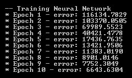

从这个输出中可以看出，误差度量在每个历元中都会显著降低。这里需要注意的一点是，误差度量的减少量在每个额外的历元中都会减少。当您构建具有大量历元的神经网络模型时，您可以监控每次运行中的增益量，并在没有更显著的性能增益时决定停止。

我们用于模型构建步骤的完整代码可以在以下链接中找到：[https://github.com/yoonhwang/c-sharp-machine-learning/blob/master/ch.8/Modeling.cs](https://github.com/yoonhwang/c-sharp-machine-learning/blob/master/ch.8/Modeling.cs) 。

# 多类分类模型的评价

在本节中，我们将评估上一节中构建的三个模型。我们将重温我们之前用于分类模型的验证指标，并将每个模型的性能与其他模型进行比较。

# 混淆矩阵

首先，让我们看看混淆矩阵。以下代码显示了如何使用预测输出和实际输出构建混淆矩阵：

```cs
private static int[][] BuildConfusionMatrix(int[] actual, int[] preds, int numClass)
{
    int[][] matrix = new int[numClass][];
    for (int i = 0; i < numClass; i++)
    {
        matrix[i] = new int[numClass];
    }

    for (int i = 0; i < actual.Length; i++)
    {
        matrix[actual[i]][preds[i]] += 1;
    }

    return matrix;
}
```

此方法与我们在上一章中编写的方法类似，只是它返回一个二维数组，而不是字符串数组。在下一节中，我们将使用这个二维数组输出来计算精度和召回率。

逻辑回归分类器的混淆矩阵如下所示：

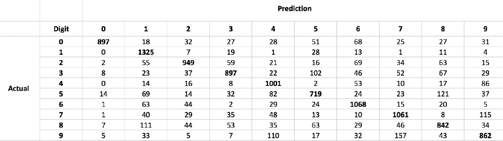

对于朴素贝叶斯分类器，您将得到一个类似下表的混淆矩阵：


最后，对于神经网络模型，混淆矩阵如下所示：


从这些混淆矩阵来看，神经网络模型优于其他两个模型，逻辑回归模型似乎排在第二位。

# 准确度和精密度/召回率

我们要看的第二个指标是精度度量。我们使用`ZeroOneLoss`来计算损失，然后从`1`中减去它，得到准确的数字。计算精度度量的代码如下所示：

```cs
// Accuracy
double inSampleAccuracy = 1 - new ZeroOneLoss(trainOutput).Loss(inSamplePreds);
double outSampleAccuracy = 1 - new ZeroOneLoss(testOutput).Loss(outSamplePreds);
Console.WriteLine("* In-Sample Accuracy: {0:0.0000}", inSampleAccuracy);
Console.WriteLine("* Out-of-Sample Accuracy: {0:0.0000}", outSampleAccuracy);
```

第三和第四个指标是准确率和召回率。与以前不同，我们有 10 个类用于目标预测。因此，我们必须分别计算每个目标类的准确率和召回率。代码如下所示：

```cs
private static void PrintPrecisionRecall(int[][] confMatrix)
{
    for (int i = 0; i < confMatrix.Length; i++)
    {
        int totalActual = confMatrix[i].Sum();
        int correctPredCount = confMatrix[i][i];

        int totalPred = 0;
        for(int j = 0; j < confMatrix.Length; j++)
        {
            totalPred += confMatrix[j][i];
        }

        double precision = correctPredCount / (float)totalPred;
        double recall = correctPredCount / (float)totalActual;

        Console.WriteLine("- Digit {0}: precision - {1:0.0000}, recall - {2:0.0000}", i, precision, recall);
    }

}
```

正如您从这段代码中所看到的，这个`PrintPrecisionRecall`方法的输入是我们在上一节中构建的混淆矩阵。在该方法中，它迭代每个目标类，并计算精度和召回率。

以下是我们计算逻辑回归模型的准确度、精密度和召回率时得到的输出：

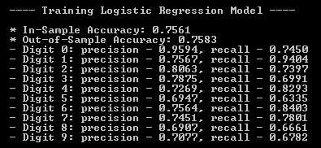

对于朴素贝叶斯模型，我们得到了以下度量结果：

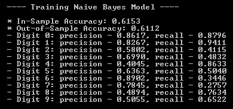

最后，对于神经网络模型，性能结果如下所示：


从这些结果中您可能会注意到，神经网络模型的性能优于其他两个模型。与逻辑回归和朴素贝叶斯模型相比，神经网络模型的总体准确率和准确率/召回率最高。逻辑回归模型似乎是我们建立的三个模型中第二好的模型。

# 一对一 AUC

我们要看的最后一个评估指标是**接收机工作特性**（**ROC**）曲线和 AUC。在本章中，当我们构建 ROC 曲线和 AUC 时，我们需要做的一件事是，我们需要为每个目标类构建一个 ROC 曲线和 AUC。让我们先看一下代码：

```cs
private static void DrawROCCurve(int[] actual, int[] preds, int numClass, string modelName)
{
    ScatterplotView spv = new ScatterplotView();
    spv.Dock = DockStyle.Fill;
    spv.LinesVisible = true;

    Color[] colors = new Color[] {
        Color.Blue, Color.Red, Color.Orange, Color.Yellow, Color.Green,
        Color.Gray, Color.LightSalmon, Color.LightSkyBlue, Color.Black, Color.Pink
    };

    for (int i = 0; i < numClass; i++)
    {
        // Build ROC for Train Set
        bool[] expected = actual.Select(x => x == i ? true : false).ToArray();
        int[] predicted = preds.Select(x => x == i ? 1 : 0).ToArray();

        var trainRoc = new ReceiverOperatingCharacteristic(expected, predicted);
        trainRoc.Compute(1000);

        // Get Train AUC
        double auc = trainRoc.Area;
        double[] xVals = trainRoc.Points.Select(x => 1 - x.Specificity).ToArray();
        double[] yVals = trainRoc.Points.Select(x => x.Sensitivity).ToArray();

        // Draw ROC Curve
        spv.Graph.GraphPane.AddCurve(
            String.Format(
                "Digit: {0} - AUC: {1:0.00}",
                i, auc
            ),
            xVals, yVals, colors[i], SymbolType.None
        );
        spv.Graph.GraphPane.AxisChange();
    }

    spv.Graph.GraphPane.Title.Text = String.Format(
        "{0} ROC - One vs. Rest",
        modelName
    );

    Form f1 = new Form();
    f1.Width = 700;
    f1.Height = 500;
    f1.Controls.Add(spv);
    f1.ShowDialog();
}
```

从我们编写的这个`DrawROCCurve`方法可以看出，我们在`for`循环中迭代每个目标类，如果每个标签与目标类匹配，则通过编码`1`重新格式化预测和实际标签，如果每个标签与目标类匹配，则重新格式化为 0。完成编码后，我们可以使用`ReceiverOperatingCharacteristic`类计算 AUC 并构建 ROC 曲线。

以下是逻辑回归模型的 ROC 曲线：

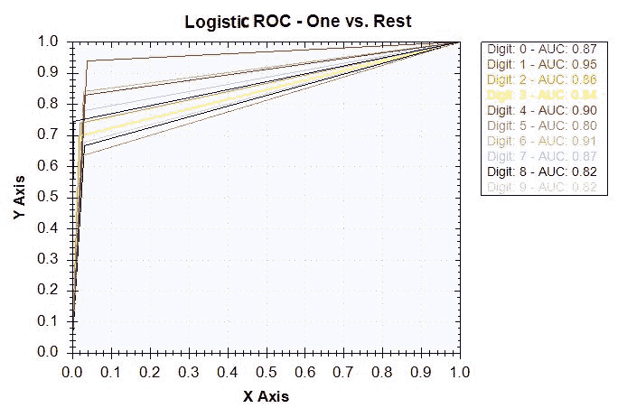

对于朴素贝叶斯模型，ROC 曲线如下所示：

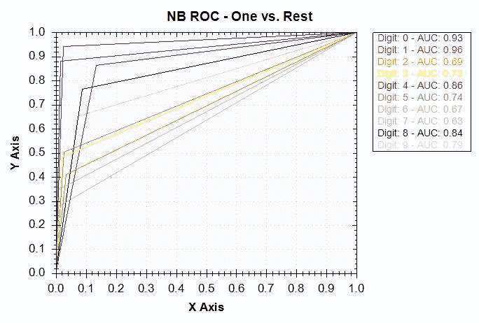

最后，神经网络模型的 ROC 曲线如下所示：

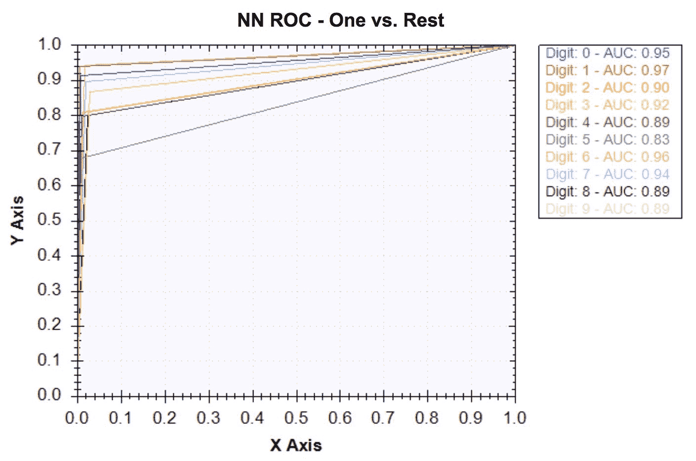

正如我们之前研究的指标所预期的那样，神经网络模型的结果最好，逻辑回归模型次之。对于朴素贝叶斯模型，有一些数字计算得不好。例如，朴素贝叶斯模型难以很好地对数字 6 和 7 进行分类。然而，对于神经网络，所有目标类的 AUC 数都接近 1，这表明该模型经过良好训练，可以识别手写图像的数字。

通过观察混淆矩阵、准确度、准确度和召回率以及 ROC 曲线，我们可以得出结论，在我们在本章中训练的三个分类器中，神经网络模型工作得最好。这再次证明了神经网络在图像数据集和图像识别问题上的有效性。

# 总结

在本章中，我们建立了第一个能够识别灰度图像中手写数字的图像识别模型。本章开始时，我们讨论了此类模型如何在实际应用中广泛应用，以及我们计划如何构建手写数字识别模型。然后，我们开始查看数据集。我们首先查看目标类的分布，看看样本集是否是一个平衡良好的集。当我们分析像素数据时，我们注意到大多数像素值为 0，我们可以通过从像素数据重建图像直观地理解它。在特征工程步骤中，我们讨论了如何使用 PCA 进行降维。

利用这些 PCA 变换的特征，我们开始构建各种机器学习模型。在我们已经熟悉的 logistic 回归和朴素贝叶斯模型的基础上，我们引入了一个新的 ML 模型，即神经网络。我们学习了如何使用`BipolarSigmoidFunction`作为激活函数初始化`ActivationNetwork`模型。然后，我们开始用`LevenbergMarquardtLearning`学习算法对神经网络进行 10 个阶段的训练。我们看到了错误度量在每个额外的历元中是如何减少的，并且讨论了错误率中的增益量是如何减少额外历元的回报的。在模型评估步骤中，我们为分类模型组合了多个验证度量。对于我们在本章中建立的机器学习模型，我们研究了混淆矩阵、预测准确率、准确率和召回率，以及 ROC 曲线和 AUC。我们注意到神经网络模型的性能优于其他两个模型，这再次证明了神经网络模型对于图像数据非常有效。

在下一章中，我们将切换设备并开始构建异常检测模型。我们将使用 PCA 进行网络攻击检测项目。利用网络入侵数据集，我们将讨论如何使用 PCA 检测网络攻击，并运行多个实验，以找到通知我们潜在网络攻击的最佳阈值。**