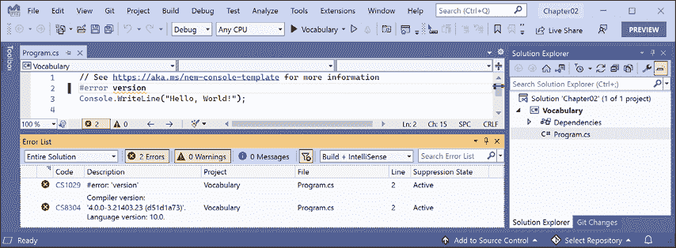
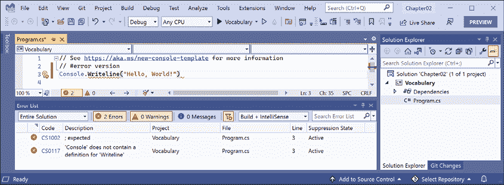
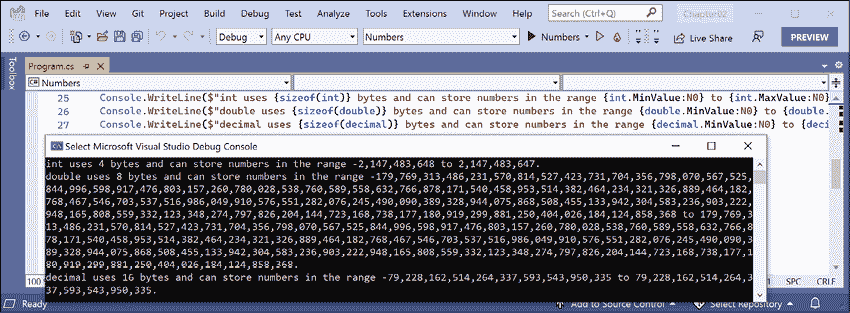
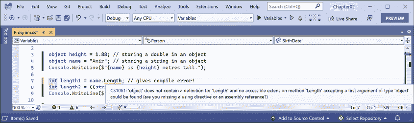
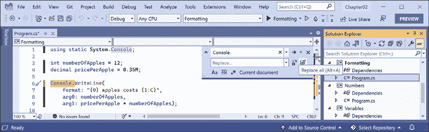
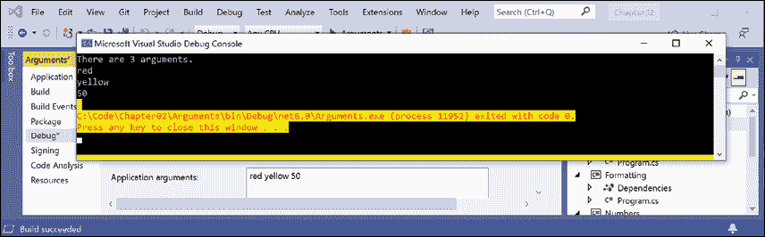
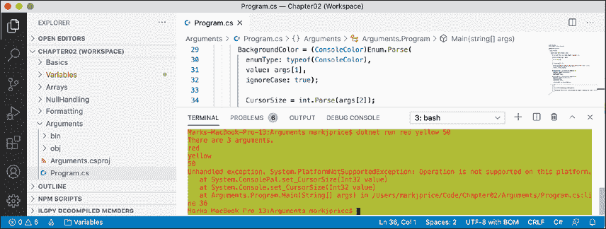

# 二、谈谈 C#

本章介绍了 C# 编程语言的基础知识。在本章的课程中，您将学习如何使用 C# 语法编写语句，并了解您每天将使用的一些常用词汇。除此之外，在本章结束时，您将有信心知道如何临时存储和处理计算机内存中的信息。

本章涵盖以下主题：

*   介绍 C# 语言
*   理解 C# 语法和词汇
*   使用变量
*   探索有关控制台应用的更多信息

# 介绍 C# 语言

这本书的这一部分是关于 C 语言的，你每天都会用到 C 语言的语法和词汇来为你的应用编写源代码。

编程语言与人类语言有许多相似之处，只是在编程语言中，你可以像苏斯博士一样，自己编单词！

在苏斯博士 1950 年写的一本书中，*如果我经营动物园*，他说：

> “然后，为了向他们展示，我将航行到卡特罗，带回一辆 It 卡奇、一辆 Preep、一辆 Proo、一辆 Nerkle、一辆书呆子和一辆泡泡泡纱！”

## 理解语言版本和特性

本书的这一部分涵盖了 C# 编程语言，主要是为初学者编写的，因此它涵盖了所有开发人员都需要知道的基本主题，从声明变量到存储数据，再到如何定义自己的自定义数据类型。

这本书涵盖了从 1.0 版到最新 10.0 版的 C 语言的特性。

如果您已经对旧版本的 C# 有了一定的了解，并且很高兴了解最新版本的 C# 中的新功能，那么我将在下面列出语言版本及其重要的新功能，以及您可以了解这些功能的章节号和主题标题，从而使您能够更轻松地了解它们。

### C# 1.0

C# 1.0 于 2002 年发布，包含了静态类型面向对象现代语言的所有重要特性，正如您将在*章节**2*到*6*中看到的。

### C# 2.0

C# 2.0 于 2005 年发布，专注于使用泛型实现强数据类型化，以提高代码性能和减少类型错误，包括下表中列出的主题：

<colgroup><col> <col> <col></colgroup> 
| 特色 | 章 | 话题 |
| 可空值类型 | 6. | 使值类型可为 null |
| 仿制药 | 6. | 使用泛型使类型更加可重用 |

### C# 3.0

C# 3.0 于 2007 年发布，专注于通过**语言集成查询**（**LINQ**）以及匿名类型和 lambda 表达式等相关功能启用声明式编码，包括下表所列主题：

<colgroup><col> <col> <col></colgroup> 
| 特色 | 章 | 话题 |
| 隐式类型的局部变量 | 2. | 推断局部变量的类型 |
| 林克 | 11 | *第 11 章**使用 LINQ*查询和操作数据中的所有主题 |

### C# 4.0

C# 4.0 于 2010 年发布，重点是提高与动态语言（如 F# 和 Python）的互操作性，包括下表中列出的主题：

<colgroup><col> <col> <col></colgroup> 
| 特色 | 章 | 话题 |
| 动态类型 | 2. | 存储动态类型 |
| 命名/可选参数 | 5. | 可选参数和命名参数 |

### C# 5.0

C# 5.0 于 2012 年发布，主要通过在编写类似同步语句的内容时自动实现复杂状态机来简化异步操作支持，包括下表中列出的主题：

<colgroup><col> <col> <col></colgroup> 
| 特色 | 章 | 话题 |
| 简化的异步任务 | 12 | 理解异步和等待 |

### C# 6.0

C# 6.0 于 2015 年发布，重点对语言进行了细微的改进，包括下表中列出的主题：

<colgroup><col> <col> <col></colgroup> 
| 特色 | 章 | 话题 |
| `static`进口 | 2. | 简化控制台的使用 |
| 插值字符串 | 2. | 向用户显示输出 |
| 身体健全的成员 | 5. | 定义只读属性 |

### C# 7.0

C# 7.0 于 2017 年 3 月发布，专注于添加功能性语言功能，如元组和模式匹配，以及对语言的细微改进，包括下表中列出的主题：

<colgroup><col> <col> <col></colgroup> 
| 特色 | 章 | 话题 |
| 二进制文字和数字分隔符 | 2. | 存储整数 |
| 模式匹配 | 3. | 与`if`语句的模式匹配 |
| `out`变量 | 5. | 控制参数的传递方式 |
| 多元组 | 5. | 将多个值与元组组合 |
| 局部函数 | 6. | 定义局部函数 |

### C# 7.1

C# 7.1 于 2017 年 8 月发布，专注于对语言的细微改进，包括下表中列出的主题：

<colgroup><col> <col> <col></colgroup> 
| 特色 | 章 | 话题 |
| 默认文字表达式 | 5. | 使用默认文本设置字段 |
| 推断元组元素名称 | 5. | 推断元组名称 |
| `async`主管道 | 12 | 提高控制台应用的响应能力 |

### C# 7.2

C# 7.2 于 2017 年 11 月发布，重点对语言进行了细微改进，包括下表所列主题：

<colgroup><col> <col> <col></colgroup> 
| 特色 | 章 | 话题 |
| 数字文本中的前导下划线 | 2. | 存储整数 |
| 非尾随命名参数 | 5. | 可选参数和命名参数 |
| `private protected`访问修饰符 | 5. | 理解访问修饰符 |
| 您可以使用元组类型测试`==`和`!=` | 5. | 比较元组 |

### C# 7.3

C# 7.3 于 2018 年 5 月发布，重点关注面向性能的安全代码，该代码改进了`ref`变量、指针和`stackalloc`。这些都是高级的，对于大多数开发人员来说很少需要，所以本书不介绍它们。

### C# 8

C# 8 于 2019 年 9 月发布，重点关注与空处理相关的语言的重大变化，包括下表中列出的主题：

<colgroup><col> <col> <col></colgroup> 
| 特色 | 章 | 话题 |
| 可空引用类型 | 6. | 使引用类型为空 |
| 切换表达式 | 3. | 用开关表达式简化`switch`语句 |
| 默认接口方法 | 6. | 理解默认接口方法 |

### C# 9

C# 9 于 2020 年 11 月发布，专注于记录类型、模式匹配的改进和最低限度的代码控制台应用，包括下表中列出的主题：

<colgroup><col> <col> <col></colgroup> 
| 特色 | 章 | 话题 |
| 最小代码控制台应用 | 1. | 顶级课程 |
| 目标类型新 | 2. | 使用目标类型的 new 实例化对象 |
| 增强模式匹配 | 5. | 与对象的模式匹配 |
| 记录 | 5. | 处理记录 |

### C# 10

C# 10 于 2021 年 11 月发布，专注于减少常见场景所需代码量的功能，包括下表中列出的主题：

<colgroup><col> <col> <col></colgroup> 
| 特色 | 章 | 话题 |
| 全局命名空间导入 | 2. | 导入名称空间 |
| 常量字符串文字 | 2. | 使用插值字符串格式化 |
| 文件作用域名称空间 | 5. | 简化命名空间声明 |
| 所需属性 | 5. | 要求在实例化期间设置属性 |
| 记录结构 | 6. | 使用记录结构类型 |
| 空参数检查 | 6. | 检查方法参数中是否为 null |

## 理解 C# 标准

多年来，微软向标准机构提交了一些 C# 版本，如下表所示：

<colgroup><col> <col> <col></colgroup> 
| C 版本 | ECMA 标准 | ISO/IEC 标准 |
| 1 | ECMA-334:2003 | ISO/IEC 23270:2003 |
| 2 | ECMA-334:2006 | ISO/IEC 23270:2006 |
| 5 | ECMA-334:2017 | ISO/IEC 23270:2018 |

C# 6 的标准仍然是一个草案，添加 C# 7 特性的工作正在进行中。微软在 2014 年实现了 C# 开源。

目前有三个公共 GitHub 存储库，用于尽可能开放 C# 和相关技术的工作，如下表所示：

<colgroup><col> <col></colgroup> 
| 描述 | 链接 |
| C 语言设计 | [https://github.com/dotnet/csharplang](https://github.com/dotnet/csharplang) |
| 编译器实现 | [https://github.com/dotnet/roslyn](https://github.com/dotnet/roslyn) |
| 描述语言的标准 | [https://github.com/dotnet/csharpstandard](https://github.com/dotnet/csharpstandard) |

## 发现您的 C# 编译器版本

用于 C# 和 Visual Basic 的.NET 语言编译器（也称为 Roslyn）以及单独的用于 F# 的编译器作为.NET SDK 的一部分分发。要使用特定版本的 C#，必须至少安装该版本的.NET SDK，如下表所示：

<colgroup><col> <col> <col></colgroup> 
| .NETSDK | 罗斯林编译器 | 默认 C 语言 |
| 1.0.4 | 2.0 - 2.2 | 7 |
| 1.1.4 | 2.3 - 2.4 | 7.1 |
| 2.1.2 | 2.6 - 2.7 | 7.2 |
| 2.1.200 | 2.8 - 2.10 | 7.3 |
| 3 | 3.0 - 3.4 | 8 |
| 5 | 3.8 | 9 |
| 6 | 3.9 - 3.10 | 10 |

创建类库时，您可以选择以.NET 标准以及现代.NET 版本为目标。它们有默认的 C 语言版本，如下表所示：

<colgroup><col> <col></colgroup> 
| .NET 标准 | C# |
| 2 | 7.3 |
| 2.1 | 8 |

### 如何输出 SDK 版本

让我们看看您有哪些.NET SDK 和 C# 语言编译器版本：

1.  在 macOS 上，启动**终端**。在 Windows 上，启动**命令提示符**。
2.  要确定可用的.NET SDK 版本，请输入以下命令：

    ```cs
    dotnet --version 
    ```

3.  请注意，撰写本文时的版本为 6.0.100，这表明它是 SDK 的初始版本，没有任何错误修复或新功能，如以下输出所示：

    ```cs
    6.0.100 
    ```

### 启用特定语言版本编译器

VisualStudio 和`dotnet`命令行界面等开发工具假定您希望在默认情况下使用 C# 语言编译器的最新主要版本。在 C# 8.0 发布之前，C# 7.0 是最新的主要版本，默认使用。要在 C# point 版本（如 7.1、7.2 或 7.3）中使用改进，您必须在项目文件中添加一个`<LangVersion>`配置元素，如以下标记所示：

```cs
<LangVersion>7.3</LangVersion> 
```

在使用.NET 6.0 发布 C# 10.0 后，如果 Microsoft 发布了 C# 10.1 编译器，并且您希望使用其新的语言功能，则必须向项目文件中添加配置元素，如以下标记所示：

```cs
<LangVersion>10.1</LangVersion> 
```

`<LangVersion>`的潜在值如下表所示：

<colgroup><col> <col></colgroup> 
| 朗格文 | 描述 |
| 7, 7.1, 7.2, 7.38, 9, 10 | 输入特定的版本号将使用已安装的编译器。 |
| 后期主要 | 使用最高主数字，例如，2019 年 8 月为 7.0，2019 年 10 月为 8.0，2020 年 11 月为 9.0，2021 年 11 月为 10.0。 |
| `latest` | 使用最高大调和最高小调数字，例如，2017 年为 7.2，2018 年为 7.3，2019 年为 8，2022 年初可能为 10.1。 |
| `preview` | 使用可用的最高预览版本，例如，2021 年 7 月安装了.NET 6.0 preview 6 的 10.0。 |

创建新项目后，您可以编辑`.csproj`文件并添加`<LangVersion>`元素，如下面标记中突出显示的所示：

```cs
<Project Sdk="Microsoft.NET.Sdk">
  <PropertyGroup>
    <OutputType>Exe</OutputType>
    <TargetFramework>net6.0</TargetFramework>
 **<LangVersion>preview</LangVersion>**
  </PropertyGroup>
</Project> 
```

您的项目必须针对`net6.0`使用 C# 10 的全部功能。

**良好实践**：如果您正在使用 Visual Studio 代码，但尚未这样做，请安装名为**MSBuild project tools**的 VisualStudio 代码扩展。这将在编辑`.csproj`文件时为您提供智能感知，包括使用适当的值轻松添加`<LangVersion>`元素。

# 理解 C# 语法和词汇

要学习简单的 C# 语言功能，您可以使用.NET 交互式笔记本，这样就不需要创建任何类型的应用。

要了解其他一些 C 语言功能，您需要创建一个应用。最简单的应用类型是控制台应用。

让我们从 C# 的语法和词汇基础开始。在本章中，您将创建多个控制台应用，每个应用都显示 C 语言的相关功能。

## 显示编译器版本

我们将从编写显示编译器版本的代码开始：

1.  如果你已经完成了*第一章*，*你好，C#！欢迎使用.NET！*，那么您已经有了一个`Code`文件夹。如果没有，那么您需要创建它。
2.  使用您首选的代码编辑器创建新的控制台应用，如下表所示：
    1.  项目模板：**控制台应用【C#】**/`console`
    2.  工作区/解决方案文件和文件夹：`Chapter02`
    3.  Project file and folder: `Vocabulary`

        **良好实践**：如果您忘记了如何创建工作区或没有完成上一章，则*第 1 章*、*您好，C# 中给出了创建多个项目的工作区/解决方案的分步说明！欢迎使用.NET！*。

1.  打开`Program.cs`文件，在文件顶部的注释下添加一条语句，将 C# version 显示为错误，如下代码所示：

    ```cs
    # error version 
    ```

2.  运行控制台应用：
    1.  在 Visual Studio 代码中，在终端中输入命令`dotnet run`。
    2.  在 Visual Studio 中，导航到**调试****启动而不调试**。当提示继续并运行上次成功构建时，单击**否**。
3.  Note the compiler version and language version appear as a compiler error message number `CS8304`, as shown in *Figure 2.1*:

    <figure class="mediaobject"></figure>

    图 2.1：显示 C 语言版本的编译器错误

4.  Visual Studio 代码**问题**窗口或 Visual Studio**错误列表**窗口中的错误消息显示语言版本为`10.0`的`Compiler version: '4.0.0...'`。
5.  注释掉导致错误的语句，如下代码所示：

    ```cs
    // # error version 
    ```

6.  请注意，编译器错误消息将消失。

## 理解 C# 语法

C# 的语法包括语句和块。要记录代码，可以使用注释。

**良好实践**：注释不应该是记录代码的唯一方式。为变量和函数选择合理的名称、编写单元测试和创建实际文档是记录代码的其他方法。

## 声明

在英语中，我们用句号表示句子的结尾。一个句子可以由多个单词和短语组成，单词的顺序是语法的一部分。例如，在英语中，我们说“黑猫”

形容词*black*位于名词*cat*之前。而法语语法有不同的顺序；形容词出现在名词“le chat noir”之后。从中重要的是顺序很重要。

C# 表示带有分号的**语句**的结尾。一条语句可以由多个**变量**和**表达式**组成。例如，在下面的语句中，`totalPrice`是一个变量，`subtotal + salesTax`是一个表达式：

```cs
var totalPrice = subtotal + salesTax; 
```

表达式由一个名为`subtotal`的操作数、一个名为`+`的运算符和另一个名为`salesTax`的操作数组成。操作数和运算符的顺序很重要。

## 评论

在编写代码时，您可以使用双斜杠`//`添加注释来解释代码。通过插入`//`编译器将忽略`//`之后的所有内容，直到行尾，如下代码所示：

```cs
// sales tax must be added to the subtotal
var totalPrice = subtotal + salesTax; 
```

要编写多行注释，请在注释开头使用`/*`，在注释结尾使用`*/`，如下代码所示：

```cs
/*
This is a multi-line comment.
*/ 
```

**良好实践**：设计良好的代码，包括具有良好命名参数和类封装的函数签名，可以在某种程度上自我记录。当您发现自己在代码中添加了太多的注释和解释时，请扪心自问：我是否可以重写（也称为重构）这段代码，使其在没有长注释的情况下更易于理解？

您的代码编辑器具有命令，可以更轻松地添加和删除注释字符，如下表所示：

*   **Visual Studio 2022 for Windows**：导航至**编辑****高级****注释选择**或**取消注释选择**
*   **Visual Studio Code**: Navigate to **Edit** | **Toggle Line Comment** or **Toggle Block Comment**

    **良好实践**：您**通过在代码语句上方或之后添加描述性文本来注释**代码。您可以**注释掉**代码，方法是在语句之前或周围添加注释字符，使其处于非活动状态。**取消注释**表示删除注释字符。

## 阻碍

在英语中，我们以新行开头表示新段落。C# 表示代码的**块**使用了花括号`{ }`。

块以一个声明开始，以指示正在定义的内容。例如，一个块可以定义许多语言构造的开始和结束，包括名称空间、类、方法或类似于`foreach`的语句。

在本章及后续章节中，您将了解有关名称空间、类和方法的更多信息，但现在简要介绍其中的一些概念：

*   **名称空间**包含类之类的类型以将它们组合在一起。
*   **类**包含包含方法的对象的成员。
*   **方法**包含实现对象可以执行的操作的语句。

## 语句和块的示例

在针对.NET 5.0 的控制台应用的项目模板中，请注意，项目模板已经为您编写了 C# 的语法示例。我已经在语句和块中添加了一些注释，如下代码所示：

```cs
using System; // a semicolon indicates the end of a statement
namespace Basics
{ // an open brace indicates the start of a block
  class Program
  {
    static void Main(string[] args)
    {
      Console.WriteLine("Hello World!"); // a statement
    }
  }
} // a close brace indicates the end of a block 
```

## 理解 C# 词汇

C# 词汇由**关键字**、**符号字符**和**类型**组成。

您将在本书中看到的一些预定义保留关键字包括`using`、`namespace`、`class`、`static`、`int`、`string`、`double`、`bool`、`if`、`switch`、`break`、`while`、`do`、`for`、`foreach`、`and`、`or`、`not`、`record`和`init`。

您将看到的一些符号字符包括`"`、`'`、`+`、`-`、`*`、`/`、`%`、`@`和`$`。

还有一些上下文关键字在特定上下文中只有特殊意义。

然而，这仍然意味着该语言中实际只有大约 100 个 C# 关键字。

## 比较编程语言和人类语言

英语中有超过 250000 个不同的单词，那么 C# 如何摆脱只有大约 100 个关键词的局面呢？此外，如果 C# 只占英语单词数的 0.0416%，为什么它这么难学？

人类语言和编程语言之间的一个关键区别是，开发人员需要能够用新的含义定义新的“单词”。除了 C# 语言中的大约 100 个关键字外，本书还将向您介绍其他开发人员定义的数十万个“单词”中的一些，但您还将学习如何定义自己的“单词”

全世界的程序员都必须学习英语，因为大多数编程语言都使用英语单词，如名称空间和类。有一些编程语言使用其他人类语言，如阿拉伯语，但它们很少。如果您有兴趣了解更多信息，此 YouTube 视频将演示一种阿拉伯语编程语言：[https://youtu.be/dkO8cdwf6v8](https://youtu.be/dkO8cdwf6v8) 。

## 更改 C# 语法的颜色方案

默认情况下，VisualStudio 代码和 VisualStudio 以蓝色显示 C# 关键字，以使它们更容易与其他代码区分开来。两个工具都允许您自定义配色方案：

1.  在 Visual Studio 代码中，导航到**代码****首选项****颜色主题**（在 Windows 的**文件**菜单上）。
2.  选择一个颜色主题。作为参考，我将使用**灯光+（默认灯光）**颜色主题，以便屏幕截图在印刷书籍中看起来很好。
3.  在 Visual Studio 中，导航到**工具****选项**。
4.  在**选项**对话框中，选择**字体和颜色**，然后选择要自定义的显示项目。

## 编写正确代码的帮助

诸如记事本之类的纯文本编辑器不能帮助您编写正确的英语。同样，记事本也不能帮你写正确的 C。

Microsoft Word 可以帮助你写英语，它用红色的波浪形符号突出拼写错误，用单词表示“icecream”应该是冰激凌或冰激凌，用蓝色波浪形符号突出语法错误，例如一个句子应该有大写的首字母。

类似地，Visual Studio 代码的 C# 扩展名和 Visual Studio 通过突出显示拼写错误（如方法名称应为`WriteLine`加大写 L）和语法错误（如语句必须以分号结尾）来帮助您编写 C# 代码。

C# 扩展不断监视您键入的内容，并通过突出显示彩色曲线的问题来提供反馈，类似于 Microsoft Word。

让我们看看它的实际行动：

1.  在`Program.cs`中，将`WriteLine`方法中的`L`改为小写。
2.  删除语句末尾的分号。
3.  In Visual Studio Code, navigate to **View** | **Problems**, or in Visual Studio navigate to **View** | **Error List**, and note that a red squiggle appears under the code mistakes and details are shown, as you can see in *Figure 2.2*:

    <figure class="mediaobject"></figure>

    图 2.2：显示两个编译错误的错误列表窗口

4.  修复两个编码错误。

## 导入名称空间

`System`是名称空间，类似于类型的地址。要准确地指某人的位置，您可以使用来指代`Oxford.HighStreet.BobSmith`，它告诉我们在牛津市的大街上寻找一个名叫鲍勃·史密斯的人。

`System.Console.WriteLine`告诉编译器在名称空间`System`中名为`Console`的类型中查找名为`WriteLine`的方法。为了简化我们的代码，6.0 之前的每个.NET 版本的**控制台应用**项目模板都在代码文件的顶部添加了一条语句，告诉编译器始终在`System`名称空间中查找未加名称空间前缀的类型，如以下代码所示：

```cs
using System; // import the System namespace 
```

我们称之为*导入名称空间*。导入名称空间的效果是，该名称空间中的所有可用类型都将对您的程序可用，而无需输入名称空间前缀，并且在编写代码时将在 IntelliSense 中看到。

.NET 交互式笔记本电脑自动导入了大多数名称空间。

### 隐式全局导入名称空间

传统上，每个需要导入名称空间的`.cs`文件都必须以`using`语句开始导入这些名称空间。几乎所有的`.cs`文件都需要`System`和`System.Linq`这样的名称空间，因此每个`.cs`文件的前几行通常至少有几个`using`语句，如下代码所示：

```cs
using System;
using System.Linq;
using System.Collections.Generic; 
```

使用 ASP.NET Core 创建网站和服务时，每个文件通常需要导入几十个名称空间。

C# 10 引入了一些简化名称空间导入的新特性。

首先，`global using`语句意味着您只需要在一个`.cs`文件中导入名称空间，它将在所有`.cs`文件中都可用。您可以将`global using`语句放在`Program.cs`文件中，但我建议为那些名为`GlobalUsings.cs`或`GlobalNamespaces.cs`的语句创建一个单独的文件，如下代码所示：

```cs
global using System;
global using System.Linq;
global using System.Collections.Generic; 
```

**良好实践**：随着开发人员逐渐习惯这个新的 C# 特性，我希望这个文件的命名约定会成为标准。

第二，任何以.NET 6.0 为目标的项目，因此使用 C# 10 编译器在`obj`文件夹中生成一个`.cs`文件，以隐式全局导入一些常见名称空间，如`System`。隐式导入的名称空间的特定列表取决于所针对的 SDK，如下表所示：

<colgroup><col> <col></colgroup> 
| SDK | 隐式导入的名称空间 |
| `Microsoft.NET.Sdk` | `System``System.Collections.Generic``System.IO``System.Linq``System.Net.Http``System.Threading``System.Threading.Tasks` |
| `Microsoft.NET.Sdk.Web` | 同`Microsoft.NET.Sdk`和：`System.Net.Http.Json``Microsoft.AspNetCore.Builder``Microsoft.AspNetCore.Hosting``Microsoft.AspNetCore.Http``Microsoft.AspNetCore.Routing``Microsoft.Extensions.Configuration``Microsoft.Extensions.DependencyInjection``Microsoft.Extensions.Hosting``Microsoft.Extensions.Logging` |
| `Microsoft.NET.Sdk.Worker` | 同`Microsoft.NET.Sdk`和：`Microsoft.Extensions.Configuration``Microsoft.Extensions.DependencyInjection``Microsoft.Extensions.Hosting``Microsoft.Extensions.Logging` |

让我们看看当前自动生成的隐式导入文件：

1.  在**解决方案浏览器**中，选择`Vocabulary`项目，切换**显示所有文件**按钮，注意编译器生成的`bin`和`obj`文件夹可见。
2.  展开`obj`文件夹，展开`Debug`文件夹，展开`net6.0`文件夹，打开名为`Vocabulary.GlobalUsings.g.cs`的文件。
3.  注意这个文件是编译器为目标为.NET 6.0 的项目自动创建的，它导入了一些常用的名称空间，包括`System.Threading`，如下代码所示：

    ```cs
    // <autogenerated />
    global using global::System;
    global using global::System.Collections.Generic;
    global using global::System.IO;
    global using global::System.Linq;
    global using global::System.Net.Http;
    global using global::System.Threading;
    global using global::System.Threading.Tasks; 
    ```

4.  关闭`Vocabulary.GlobalUsings.g.cs`文件。
5.  在**解决方案资源管理器**中，选择项目，然后向项目文件添加其他条目，以控制隐式导入哪些名称空间，如以下标记中突出显示的：

    ```cs
    <Project Sdk="Microsoft.NET.Sdk">
      <PropertyGroup>
        <OutputType>Exe</OutputType>
        <TargetFramework>net6.0</TargetFramework>
        <Nullable>enable</Nullable>
        <ImplicitUsings>enable</ImplicitUsings>
      </PropertyGroup>
     **<ItemGroup>**
     **<Using Remove=****"System.Threading"** **/>**
     **<Using Include=****"System.Numerics"** **/>**
     **</ItemGroup>**
    </Project> 
    ```

6.  将更改保存到项目文件中。
7.  展开文件夹，展开`Debug`文件夹，展开`net6.0`文件夹，打开名为`Vocabulary.GlobalUsings.g.cs`的文件。
8.  注意：该文件现在导入的是`System.Numerics`而不是`System.Threading`，如下代码中突出显示的：

    ```cs
    // <autogenerated />
    global using global::System;
    global using global::System.Collections.Generic;
    global using global::System.IO;
    global using global::System.Linq;
    global using global::System.Net.Http;
    global using global::System.Threading.Tasks;
    **global****using****global****::System.Numerics;** 
    ```

9.  关闭`Vocabulary.GlobalUsings.g.cs`文件。

通过删除项目文件中的条目，可以为所有 SDK 禁用隐式导入的命名空间功能，如以下标记所示：

```cs
<ImplicitUsings>enable</ImplicitUsings> 
```

## 动词是方法

在英语中，动词是 doing 或 action，比如 run 和 jump。在 C# 中，做或动作词被称为**方法**。有数十万种方法可供 C# 使用。在英语中，动词根据动作发生的时间而改变书写方式。例如，阿米尔*过去跳*，贝丝*现在跳*，他们*过去跳*，查理*将来也会跳*。

在 C# 中，像`WriteLine`这样的方法会根据动作的细节改变调用或执行它们的方式。这称为重载，我们将在*第 5 章**中更详细地介绍，使用面向对象编程*构建您自己的类型。但是现在，考虑下面的例子：

```cs
// outputs the current line terminator string
// by default, this is a carriage-return and line feed
Console.WriteLine();
// outputs the greeting and the current line terminator string
Console.WriteLine("Hello Ahmed");
// outputs a formatted number and date and the current line terminator string
Console.WriteLine("Temperature on {0:D} is {1}°C.", 
  DateTime.Today, 23.4); 
```

另一种类比是，有些单词拼写相同，但根据上下文有不同的含义。

## 名词是类型、变量、字段和属性

在英语中，名词是指事物的名称。例如，Fido 是一只狗的名字。“狗”这个词告诉我们菲多是什么类型的东西，所以为了让菲多拿球，我们会使用他的名字。

在 C# 中，它们的等价物是**类型**、**变量**、**字段**和**属性**。例如：

*   `Animal`和`Car`为类型；它们是用来分类事物的名词。
*   `Head`和`Engine`可能是字段或属性；属于`Animal`和`Car`的名词。
*   `Fido`和`Bob`为变量；指特定对象的名词。

有成千上万的类型可供 C# 使用，尽管你注意到我怎么没有说，“C# 中有成千上万的类型？”区别很微妙但很重要。C# 语言中只有少数几个类型关键字，如`string`和`int`，严格来说，C# 没有定义任何类型。类似于类型的关键字如`string`是**别名**，表示运行 C# 的平台提供的类型。

重要的是要知道 C# 不能单独存在；毕竟，它是一种运行在.NET 变体上的语言。理论上，有人可以为 C 编写一个使用不同平台、不同底层类型的编译器。实际上，C# 的平台是.NET，它为 C# 提供了数万种类型，包括 C# 关键字别名`int`映射到的`System.Int32`，以及许多更复杂的类型，如`System.Xml.Linq.XDocument`。

值得注意的是，术语**类型**经常与**类**混淆。您是否曾经玩过室内游戏*二十个问题*，也称为*动物、植物或矿物*？在游戏中，任何东西都可以归类为动物、植物或矿物。在 C# 中，每种**类型**都可以分为`class`、`struct`、`enum`、`interface`或`delegate`。您将在*第 6 章**实现接口和继承类*中了解这些内容的含义。例如，C# 关键字`string`是一个`class`，但`int`是一个`struct`。因此，最好使用术语**类型**来指代两者。

## 揭示 C# 词汇的范围

我们知道 C# 中有 100 多个关键字，但有多少类型？让我们编写一些代码来了解在我们的简单控制台应用中有多少类型（及其方法）可供 C# 使用。

现在不要担心这段代码是如何工作的，但要知道它使用了一种称为**反射**的技术：

1.  我们将首先导入`Program.cs`文件顶部的`System.Reflection`名称空间，如以下代码所示：

    ```cs
    using System.Reflection; 
    ```

2.  删除写入`Hello World!`的语句，并将其替换为以下代码：

    ```cs
    Assembly? assembly = Assembly.GetEntryAssembly();
    if (assembly == null) return;
    // loop through the assemblies that this app references
    foreach (AssemblyName name in assembly.GetReferencedAssemblies())
    {
      // load the assembly so we can read its details
      Assembly a = Assembly.Load(name);
      // declare a variable to count the number of methods
      int methodCount = 0;
      // loop through all the types in the assembly
      foreach (TypeInfo t in a.DefinedTypes)
      {
        // add up the counts of methods
        methodCount += t.GetMethods().Count();
      }
      // output the count of types and their methods
      Console.WriteLine(
        "{0:N0} types with {1:N0} methods in {2} assembly.",
        arg0: a.DefinedTypes.Count(),
        arg1: methodCount, arg2: name.Name);
    } 
    ```

3.  Run the code. You will see the actual number of types and methods that are available to you in the simplest application when running on your OS. The number of types and methods displayed will be different depending on the operating system that you are using, as shown in the following outputs:

    ```cs
    // Output on Windows
    0 types with 0 methods in System.Runtime assembly.
    106 types with 1,126 methods in System.Linq assembly.
    44 types with 645 methods in System.Console assembly.
    // Output on macOS
    0 types with 0 methods in System.Runtime assembly.
    103 types with 1,094 methods in System.Linq assembly.
    57 types with 701 methods in System.Console assembly. 
    ```

    为什么`System.Runtime`程序集包含零类型？此组件是特殊的，因为它只包含**类型的转发器**，而不包含实际类型。类型转发器表示已在.NET 之外或出于某些其他高级原因实现的类型。

4.  Add statements to the top of the file after importing the namespace to declare some variables, as shown highlighted in the following code:

    ```cs
    using System.Reflection;
    **// declare some unused variables using types**
    **// in additional assemblies**
    **System.Data.DataSet ds;**
    **HttpClient client;** 
    ```

    通过声明在其他程序集中使用类型的变量，这些程序集将与我们的应用一起加载，这允许我们的代码查看其中的所有类型和方法。编译器将警告您有未使用的变量，但这不会阻止代码运行。

5.  再次运行控制台应用并查看结果，结果应类似于以下输出：

    ```cs
    // Output on Windows
    0 types with 0 methods in System.Runtime assembly.
    383 types with 6,854 methods in System.Data.Common assembly.
    456 types with 4,590 methods in System.Net.Http assembly.
    106 types with 1,126 methods in System.Linq assembly.
    44 types with 645 methods in System.Console assembly.
    // Output on macOS
    0 types with 0 methods in System.Runtime assembly.
    376 types with 6,763 methods in System.Data.Common assembly.
    522 types with 5,141 methods in System.Net.Http assembly.
    103 types with 1,094 methods in System.Linq assembly.
    57 types with 701 methods in System.Console assembly. 
    ```

现在，你更好地理解了为什么学习 C# 是一项挑战，因为学习 C# 的类型和方法太多了。方法只是一个类型可以拥有的成员的一个类别，您和其他程序员不断地定义新的类型和成员！

# 使用变量

所有应用都处理数据。数据输入、数据处理，然后数据输出。

数据通常从文件、数据库或用户输入进入我们的程序，它可以临时放入变量中，这些变量将存储在运行程序的内存中。当程序结束时，内存中的数据丢失。数据通常输出到文件和数据库，或输出到屏幕或打印机。使用变量时，首先要考虑变量在内存中占用了多少空间，其次要考虑它的处理速度。

我们通过选择合适的类型来控制这一点。您可以将简单的常见类型（如`int`和`double`视为大小不同的存储盒，其中较小的存储盒占用的内存较少，但处理速度可能不快；例如，在 64 位操作系统上添加 16 位数字的处理速度可能不如添加 64 位数字的处理速度快。这些箱子中的一些可能堆放在附近，一些可能被扔到更远的地方。

## 命名和赋值

事物有命名约定，遵循这些约定是一个很好的实践，如下表所示：

<colgroup><col> <col> <col></colgroup> 
| 命名约定 | 例子 | 用于 |
| 骆驼箱 | `cost`、`orderDetail`、`dateOfBirth` | 局部变量，私有字段 |
| 标题案例又称帕斯卡案例 | `String`、`Int32`、`Cost`、`DateOfBirth`、`Run` | 类型、非私有字段和其他成员（如方法） |

**良好实践**：遵循一套一致的命名约定将使您的代码易于被其他开发人员（以及您自己）理解。

下面的代码块显示了一个声明命名局部变量并使用`=`符号为其赋值的示例。您应该注意，您可以使用 C# 6.0，`nameof`中引入的关键字输出变量名称：

```cs
// let the heightInMetres variable become equal to the value 1.88
double heightInMetres = 1.88;
Console.WriteLine($"The variable {nameof(heightInMetres)} has the value
{heightInMetres}."); 
```

前面代码中双引号中的消息将包装到第二行，因为打印页面的宽度太窄。在代码编辑器中输入这样的语句时，请在一行中键入所有语句。

## 文字值

当你赋值给一个变量时，你经常，但不总是，赋值给一个**文本**值。但什么是文字值？文字是表示固定值的符号。数据类型的文字值有不同的符号，在接下来的几节中，您将看到使用文字符号为变量赋值的示例。

## 存储文本

对于文本，单个字母（如`A`字母）存储为`char`类型。

**良好实践**：事实上，它可能比这更复杂。埃及象形文字 A002（U+13001）需要两个`System.Char`值（称为代理项对）来表示：`\uD80C`和`\uDC01`。不要总是假设一个`char`等于一个字母，否则可能会在代码中引入奇怪的 bug。

`char`是在文字值周围使用单引号赋值的，或者是分配一个虚构函数调用的返回值，如下代码所示：

```cs
char letter = 'A'; // assigning literal characters
char digit = '1'; 
char symbol = '$';
char userChoice = GetSomeKeystroke(); // assigning from a fictitious function 
```

对于文本，多个字母（如`Bob`）存储为`string`类型，并在文本值周围使用双引号进行赋值，或分配函数调用的返回值，如以下代码所示：

```cs
string firstName = "Bob"; // assigning literal strings
string lastName = "Smith";
string phoneNumber = "(215) 555-4256";
// assigning a string returned from a fictitious function
string address = GetAddressFromDatabase(id: 563); 
```

### 理解逐字字符串

在`string`变量中存储文本时，可以包含转义序列，转义序列使用反斜杠表示特殊字符，如制表符和新行，如下代码所示：

```cs
string fullNameWithTabSeparator = "Bob\tSmith"; 
```

但是，如果您在 Windows 上存储文件的路径，并且其中一个文件夹名称以`T`开头，如下面的代码所示，该怎么办？

```cs
string filePath = "C:\televisions\sony\bravia.txt"; 
```

编译器会将`\t`转换为制表符，您会得到错误！

您必须以`@`符号作为前缀才能使用逐字逐句的文字`string`，如下代码所示：

```cs
string filePath = @"C:\televisions\sony\bravia.txt"; 
```

总结如下：

*   **文字字符串**：包含在双引号字符中的字符。他们可以使用转义字符，如`\t`作为制表符。要表示反斜杠，请使用两个：`\\`。
*   **逐字字符串**：前缀为`@`的文本字符串，用于禁用转义字符，以便反斜杠就是反斜杠。它还允许`string`值跨越多行，因为空格字符被视为自身而不是编译器的指令。
*   **插值字符串**：一个以`$`为前缀的文字字符串，用于启用嵌入的格式化变量。在本章后面，您将了解更多有关这方面的信息。

## 存储数字

数字是我们想要进行算术计算的数据，例如乘法。电话号码不是一个号码。要决定变量是否应存储为数字，请询问自己是否需要对该数字执行算术运算，或者该数字是否包含非数字字符（如括号或连字符）以格式化该数字，如（414）555-1234。在这种情况下，数字是一个字符序列，因此应将其存储为`string`。

数字可以是自然数，例如 42，用于计数（也称为整数）；它们也可以是负数，例如-42（称为整数）；或者，它们可以是实数，例如 3.9（带小数部分），在计算中称为单精度或双精度浮点数。

让我们探索数字：

1.  使用您首选的代码编辑器将新的**控制台应用**添加到名为`Numbers`的`Chapter02`工作区/解决方案中：
    1.  在 Visual Studio 代码中，选择`Numbers`作为活动的 OmniSharp 项目。当您看到弹出警告消息说所需资产丢失时，单击**是**添加它们。
    2.  在 Visual Studio 中，将启动项目设置为当前选择。
2.  在`Program.cs`中删除已有代码，然后键入语句，使用各种数据类型声明一些数字变量，如下代码所示：

    ```cs
    // unsigned integer means positive whole number or 0
    uint naturalNumber = 23;
    // integer means negative or positive whole number or 0
    int integerNumber = -23;
    // float means single-precision floating point
    // F suffix makes it a float literal
    float realNumber = 2.3F;
    // double means double-precision floating point
    double anotherRealNumber = 2.3; // double literal 
    ```

### 存储整数

你可能知道计算机把所有东西都存储为比特。位的值为 0 或 1。这被称为**二进制数系统**。人类使用**十进制数字系统**。

十进制数字系统，也称为基数 10，以 10 为其**基数**，这意味着有 10 位数字，从 0 到 9。虽然它是人类文明最常用的数字基础，但其他数字基础系统在科学、工程和计算领域也很流行。二进制数系统，也被称为基数 2，有两个作为基数，这意味着有两个数字，0 和 1。

下表显示了计算机如何存储十进制数字 10。记下 8 列和 2 列中值为 1 的位；8 + 2 = 10:

<colgroup><col> <col> <col> <col> <col> <col> <col> <col></colgroup> 
| 128 | 64 | 32 | 16 | 8. | 4. | 2. | 1. |
| 0 | 0 | 0 | 0 | 1. | 0 | 1. | 0 |

所以，十进制中的`10`是二进制中的`00001010`。

#### 使用数字分隔符提高易读性

C# 7.0 及更高版本中的两个改进是使用下划线字符`_`作为数字分隔符，以及支持二进制文字。

您可以在数字文字的任何位置插入下划线，包括十进制、二进制或十六进制符号，以提高易读性。

例如，您可以将 100 万的值以十进制表示，即以 10 为基数，写成`1_000_000`。

您甚至可以使用印度常见的 2/3 分组：`10_00_000`。

#### 使用二进制表示法

要使用二进制表示法，即基数 2，仅使用 1s 和 0s，请以`0b`开始数字文字。要使用十六进制表示法，即以 16 为基数，使用 0 到 9 和 A 到 F，请以`0x`开始数字文字。

### 探索整数

让我们输入一些代码来查看一些示例：

1.  在`Program.cs`中，键入语句，使用下划线分隔符声明一些数字变量，如下代码所示：

    ```cs
    // three variables that store the number 2 million
    int decimalNotation = 2_000_000;
    int binaryNotation = 0b_0001_1110_1000_0100_1000_0000; 
    int hexadecimalNotation = 0x_001E_8480;
    // check the three variables have the same value
    // both statements output true 
    Console.WriteLine($"{decimalNotation == binaryNotation}"); 
    Console.WriteLine(
      $"{decimalNotation == hexadecimalNotation}"); 
    ```

2.  运行代码并注意结果是三个数字都相同，如以下输出中的所示：

    ```cs
    True
    True 
    ```

计算机总是可以使用`int`类型或其兄弟类型之一，如`long`和`short`精确地表示整数。

## 存储实数

计算机不能总是精确地表示实数，也就是十进制或非整数。`float`和`double`类型使用单精度和双精度浮点存储实数。

大多数编程语言实现了 IEEE 浮点运算标准。IEEE 754 是由**电气与电子工程师学会**（**IEEE**于 1985 年制定的浮点算法技术标准。

下面的表显示了计算机如何以二进制表示法表示数字`12.75`。注意 8、4、½和¼列中的值为`1`的位。

8 + 4 + ½ + ¼ = 12¾ = 12.75.

<colgroup><col> <col> <col> <col> <col> <col> <col> <col> <col> <col> <col> <col> <col></colgroup> 
| 128 | 64 | 32 | 16 | 8. | 4. | 2. | 1. | . | ½ | ¼ | 1/8 | 1/16 |
| 0 | 0 | 0 | 0 | 1. | 1. | 0 | 0 | . | 1. | 1. | 0 | 0 |

所以，十进制中的`12.75`是二进制中的`00001100.1100`。如您所见，数字`12.75`可以使用位精确表示。然而，有些数字不能，我们将很快探索这一点。

### 编写代码探索数字大小

C# 有一个名为`sizeof()`的操作符，它返回一个类型在内存中使用的字节数。某些类型具有名为`MinValue`和`MaxValue`的成员，它们返回可存储在该类型变量中的最小值和最大值。我们现在将使用这些功能创建一个控制台应用来探索数字类型：

1.  In `Program.cs`, type statements to show the size of three number data types, as shown in the following code:

    ```cs
    Console.WriteLine($"int uses {sizeof(int)} bytes and can store numbers in the range {int.MinValue:N0} to {int.MaxValue:N0}."); 
    Console.WriteLine($"double uses {sizeof(double)} bytes and can store numbers in the range {double.MinValue:N0} to {double.MaxValue:N0}."); 
    Console.WriteLine($"decimal uses {sizeof(decimal)} bytes and can store numbers in the range {decimal.MinValue:N0} to {decimal.MaxValue:N0}."); 
    ```

    本书中打印页面的宽度使`string`值（双引号中）环绕多行。您必须在一行中键入它们，否则将出现编译错误。

2.  Run the code and view the output, as shown in *Figure 2.3*:

    <figure class="mediaobject"></figure>

    图 2.3：常用数字数据类型的大小和范围信息

一个`int`变量使用四个字节的内存，可以存储多达 20 亿左右的正数或负数。`double`变量使用 8 字节的内存，可以存储更大的值！`decimal`变量使用 16 字节的内存，可以存储大的数字，但没有`double`类型大。

但是你可能会问自己，变量为什么能够比`decimal`变量存储更大的数字，而它只占用了一半的内存空间？好吧，现在让我们看看！

### 比较双精度和十进制类型

您将现在编写一些代码来比较`double`和`decimal`值。虽然不难理解，但现在不要担心理解语法：

1.  键入声明两个`double`变量的语句，将它们相加并与预期结果进行比较，然后将结果写入控制台，如下代码所示：

    ```cs
    Console.WriteLine("Using doubles:"); 
    double a = 0.1;
    double b = 0.2;
    if (a + b == 0.3)
    {
      Console.WriteLine($"{a} + {b} equals {0.3}");
    }
    else
    {
      Console.WriteLine($"{a} + {b} does NOT equal {0.3}");
    } 
    ```

2.  运行代码并查看结果，如以下输出所示：

    ```cs
    Using doubles:
    0.1 + 0.2 does NOT equal 0.3 
    ```

在使用逗号作为十进制分隔符的区域设置中，结果看起来会略有不同，如以下输出所示：

```cs
0,1 + 0,2 does NOT equal 0,3 
```

`double`类型不能保证准确，因为像`0.1`这样的数字实际上不能表示为浮点值。

根据经验，只有在准确度不重要时，尤其是在比较两个数字相等时，才应使用`double`。例如，当您测量一个人的身高时，您只会使用大于或小于进行比较，而不会使用等于。

上述代码的问题通过计算机如何存储数字`0.1`或其倍数来说明。为了用二进制表示`0.1`，计算机在 1/16 列中存储 1，在 1/32 列中存储 1，在 1/256 列中存储 1，在 1/512 列中存储 1，依此类推。

十进制的数字`0.1`是`0.00011001100110011`……二进制的，永远重复：

<colgroup><col> <col> <col> <col> <col> <col> <col> <col> <col> <col> <col> <col> <col> <col> <col></colgroup> 
| 4. | 2. | 1. | . | ½ | ¼ | 1/8 | 1/16 | 1/32 | 1/64 | 1/128 | 1/256 | 1/512 | 1/1024 | 1/2048 |
| 0 | 0 | 0 | . | 0 | 0 | 0 | 1. | 1. | 0 | 0 | 1. | 1. | 0 | 0 |

**良好实践**：切勿使用`==`比较`double`值。在第一次海湾战争期间，美国爱国者导弹连在计算中使用了`double`值。这一错误导致它无法跟踪和拦截来袭的伊拉克飞毛腿导弹，28 名士兵丧生；您可以在[上阅读相关信息 https://www.ima.umn.edu/~arnold/diseases/patriot.html](https://www.ima.umn.edu/~arnold/disasters/patriot.html)。

1.  复制并粘贴您以前编写的语句（使用`double`变量的语句）。
2.  修改语句使用`decimal`并将变量重命名为`c`和`d`，如下代码所示：

    ```cs
    Console.WriteLine("Using decimals:");
    decimal c = 0.1M; // M suffix means a decimal literal value
    decimal d = 0.2M;
    if (c + d == 0.3M)
    {
      Console.WriteLine($"{c} + {d} equals {0.3M}");
    }
    else
    {
      Console.WriteLine($"{c} + {d} does NOT equal {0.3M}");
    } 
    ```

3.  运行代码并查看结果，如以下输出所示：

    ```cs
    Using decimals:
    0.1 + 0.2 equals 0.3 
    ```

`decimal`类型是准确的，因为它将数字存储为一个大整数，并移动小数点。例如，`0.1`存储为`1`，并带有将小数点向左移动一位的注释。`12.75`存储为`1275`，并带有将小数点向左移动两位的注释。

**良好做法**：整数使用`int`。对于无法与其他值进行相等比较的实数，使用`double`；可以比较小于或大于的`double`值，以此类推。使用`decimal`进行货币、CAD 图纸、一般工程，以及任何对实数准确性很重要的地方。

`double`类型有一些有用的特殊值：`double.NaN`表示非数字（例如，除以零的结果），`double.Epsilon`表示可存储在`double`中的最小正数，`double.PositiveInfinity`和`double.NegativeInfinity`表示无限大的正负值。

## 存储布尔值

布尔值只能包含两个文本值`true`或`false`中的一个，如下代码所示：

```cs
bool happy = true; 
bool sad = false; 
```

它们最常用于分支和循环。您还不需要完全理解它们，因为它们在*第 3 章*、*控制流、转换类型和处理异常*中有更多介绍。

## 存储任何类型的对象

有一种名为`object`的特殊类型可以存储任何类型的数据，但其灵活性取决于梅西耶代码的成本和可能较差的性能。由于这两个原因，你应该尽可能避免。以下步骤显示了在需要使用对象类型时如何使用它们：

1.  使用您首选的代码编辑器将新的**控制台应用**添加到名为`Variables`的`Chapter02`工作区/解决方案中。
2.  在 Visual Studio 代码中，选择`Variables`作为活动的 OmniSharp 项目。当您看到弹出警告消息说所需资产丢失时，单击**是**添加它们。
3.  在`Program.cs`中，键入语句来声明和使用一些使用`object`类型的变量，如下代码所示：

    ```cs
    object height = 1.88; // storing a double in an object 
    object name = "Amir"; // storing a string in an object
    Console.WriteLine($"{name} is {height} metres tall.");
    int length1 = name.Length; // gives compile error!
    int length2 = ((string)name).Length; // tell compiler it is a string
    Console.WriteLine($"{name} has {length2} characters."); 
    ```

4.  Run the code and note that the fourth statement cannot compile because the data type of the `name` variable is not known by the compiler, as shown in *Figure 2.4*:

    <figure class="mediaobject"></figure>

    图 2.4：对象类型没有长度属性

5.  在无法编译的语句开头添加注释双斜杠，以“注释掉”语句，使其处于非活动状态。
6.  再次运行代码并注意，如果程序员明确地告诉编译器，`object`变量包含一个`string`，并在前面加上类似`(string)`的强制转换表达式，编译器可以访问`string`的长度，如以下输出所示：

    ```cs
    Amir is 1.88 metres tall. 
    Amir has 4 characters. 
    ```

`object`类型从 C# 的第一个版本开始就有了，但是 C# 2.0 和更高版本有一个更好的替代称为**泛型**，我们将在*第 6 章*中介绍*实现接口和继承类*，这将为我们提供我们想要的灵活性，但是没有性能开销。

## 存储动态类型

还有一种特殊的类型名为`dynamic`，它也可以存储任何类型的数据，但是甚至比`object`更重要，它的灵活性是以性能为代价的。`dynamic`关键字是在 C# 4.0 中引入的。但是，与`object`不同，存储在变量中的值可以在没有显式强制转换的情况下调用其成员。让我们使用一个`dynamic`类型：

1.  添加语句来声明一个`dynamic`变量，然后分配一个`string`文本值，然后分配一个整数值，然后分配一个整数值数组，如下代码所示：

    ```cs
    // storing a string in a dynamic object
    // string has a Length property
    dynamic something = "Ahmed";
    // int does not have a Length property
    // something = 12;
    // an array of any type has a Length property
    // something = new[] { 3, 5, 7 }; 
    ```

2.  添加语句输出`dynamic`变量的长度，如下代码所示：

    ```cs
    // this compiles but would throw an exception at run-time
    // if you later store a data type that does not have a
    // property named Length
    Console.WriteLine($"Length is {something.Length}"); 
    ```

3.  运行代码并注意它是有效的，因为`string`值确实有`Length`属性，如以下输出所示：

    ```cs
    Length is 5 
    ```

4.  取消对分配`int`值的语句的注释。
5.  运行代码并注意运行时错误，因为`int`没有`Length`属性，如以下输出所示：

    ```cs
    Unhandled exception. Microsoft.CSharp.RuntimeBinder.RuntimeBinderException: 'int' does not contain a definition for 'Length' 
    ```

6.  取消对分配数组的语句的注释。
7.  运行代码并记录输出，因为包含三个`int`值的数组具有`Length`属性，如以下输出所示：

    ```cs
    Length is 3 
    ```

`dynamic`的一个限制是代码编辑器不能显示 IntelliSense 来帮助您编写代码。这是，因为编译器无法在构建时检查类型。相反，CLR 在运行时检查该成员，如果该成员丢失，则抛出异常。

异常是一种表示运行时出现问题的方法。您将在*第 3 章*、*控制流、转换类型和处理异常*中了解更多关于它们以及如何处理它们的信息。

## 声明局部变量

局部变量在方法内部声明，它们仅在该方法执行期间存在，一旦该方法返回，分配给任何局部变量的内存将被释放。

严格来说，值类型被释放，而引用类型必须等待垃圾回收。您将在*第 6 章*、*实现接口和继承类*中了解值类型和引用类型的区别。

### 指定局部变量的类型

让我们来探索使用特定类型声明的局部变量，并使用类型推断：

1.  Type 语句使用特定类型声明某些局部变量并为其赋值，如以下代码所示：

    ```cs
    int population = 66_000_000; // 66 million in UK
    double weight = 1.88; // in kilograms
    decimal price = 4.99M; // in pounds sterling
    string fruit = "Apples"; // strings use double-quotes
    char letter = 'Z'; // chars use single-quotes
    bool happy = true; // Booleans have value of true or false 
    ```

根据您的代码编辑器和配色方案，它将在每个变量名称下显示绿色曲线，并使其文本颜色变浅，以警告您该变量已分配，但其值从未使用过。

### 推断局部变量的类型

您可以使用`var`关键字来声明局部变量。编译器将根据您在赋值运算符`=`之后赋值的值推断类型。

没有小数点的文字数字被推断为`int`变量，也就是说，除非添加后缀，如下表所述：

*   `L`：推断`long`
*   `UL`：推断`ulong`
*   `M`：推断`decimal`
*   `D`：推断`double`
*   `F`：推断`float`

带小数点的文字数字被推断为`double`，除非您添加`M`后缀，在这种情况下，它推断出`decimal`变量，或者`F`后缀，在这种情况下，它推断出`float`变量。

双引号表示一个`string`变量，单引号表示一个`char`变量，`true`和`false`值推断出一个`bool`类型：

1.  将前面的语句修改为使用`var`，如下代码所示：

    ```cs
    var population = 66_000_000; // 66 million in UK
    var weight = 1.88; // in kilograms
    var price = 4.99M; // in pounds sterling
    var fruit = "Apples"; // strings use double-quotes
    var letter = 'Z'; // chars use single-quotes
    var happy = true; // Booleans have value of true or false 
    ```

2.  将鼠标悬停在每个`var`关键字上，注意代码编辑器会显示一个工具提示，其中包含已推断类型的信息。
3.  At the top of the class file, import the namespace for working with XML to enable us to declare some variables using types in that namespace, as shown in the following code:

    ```cs
    using System.Xml; 
    ```

    **良好实践**：如果您使用的是.NET 交互式笔记本，则在编写主代码的代码单元上方的单独代码单元中添加`using`语句。然后点击**执行单元**以确保名称空间被导入。它们将在随后的代码单元中可用。

4.  Under the previous statements, add statements to create some new objects, as shown in the following code:

    ```cs
    // good use of var because it avoids the repeated type
    // as shown in the more verbose second statement
    var xml1 = new XmlDocument(); 
    XmlDocument xml2 = new XmlDocument();
    // bad use of var because we cannot tell the type, so we
    // should use a specific type declaration as shown in
    // the second statement
    var file1 = File.CreateText("something1.txt"); 
    StreamWriter file2 = File.CreateText("something2.txt"); 
    ```

    **良好实践**：虽然使用`var`很方便，但一些开发人员避免使用它，以便于代码读取器理解正在使用的类型。就我个人而言，我只在类型明显时才使用它。例如，在前面的代码语句中，第一个语句与第二个语句一样清楚地说明了`xml`变量的类型，但它较短。但是，第三条语句在显示`file`变量的类型方面并不清楚，因此第四条语句更好，因为它显示的类型是`StreamWriter`。如果有疑问，请详细说明！

### 使用目标类型的 new 实例化对象

通过C# 9，微软为实例化对象引入了另一种语法，称为**目标类型新**。实例化对象时，可以先指定类型，然后使用`new`，不需要重复类型，如下代码所示：

```cs
XmlDocument xml3 = new(); // target-typed new in C# 9 or later 
```

如果您有一个需要设置字段或属性的类型，则可以推断该类型，如以下代码所示：

```cs
class Person
{
  public DateTime BirthDate;
}
Person kim = new();
kim.BirthDate = new(1967, 12, 26); // instead of: new DateTime(1967, 12, 26) 
```

**良好实践**：使用 target-typed new 来实例化对象，除非您必须使用版本 9 C# 之前的编译器。在本书的其余部分，我都使用了 target-typed new。请让我知道，如果你发现任何案件，我错过了！

## 获取和设置类型的默认值

除了`string`之外，大多数原始类型都是**值类型**，这意味着它们必须有一个值。通过使用`default()`运算符并将类型作为参数传递，可以确定类型的默认值。您可以使用`default`关键字为指定类型的默认值。

`string`类型为**参考类型**。这意味着`string`变量包含值的内存地址，而不是值本身。引用类型变量可以有一个`null`值，这是一个表示该变量没有引用任何东西（尚未）的文本。`null`是所有引用类型的默认值。

您将在*第 6 章*、*实现接口和继承类*中了解更多关于值类型和引用类型的信息。

让我们探讨一下默认值：

1.  添加语句显示`int`、`bool`、`DateTime`、`string`的默认值，如下代码所示：

    ```cs
    Console.WriteLine($"default(int) = {default(int)}"); 
    Console.WriteLine($"default(bool) = {default(bool)}"); 
    Console.WriteLine($"default(DateTime) = {default(DateTime)}"); 
    Console.WriteLine($"default(string) = {default(string)}"); 
    ```

2.  运行代码并查看结果，注意如果您没有在英国运行日期和时间的输出，其格式可能会有所不同，`null`值输出为空`string`，如以下输出所示：

    ```cs
    default(int) = 0 
    default(bool) = False
    default(DateTime) = 01/01/0001 00:00:00 
    default(string) = 
    ```

3.  添加语句来声明一个数字，分配一个值，然后将其重置为默认值，如下代码所示：

    ```cs
    int number = 13;
    Console.WriteLine($"number has been set to: {number}");
    number = default;
    Console.WriteLine($"number has been reset to its default: {number}"); 
    ```

4.  运行代码并查看结果，如以下输出所示：

    ```cs
    number has been set to: 13
    number has been reset to its default: 0 
    ```

## 在数组中存储多个值

当需要存储同一类型的多个值时，可以声明一个**数组**。例如，可能在需要在`string`数组中存储四个名称时执行此操作。

接下来编写的代码将为存储四个`string`值的数组分配内存。然后，它将在索引位置 0 到 3 处存储`string`值（数组的下界通常为零，因此最后一项的索引比数组的长度小一个）。

**良好实践**：不要假设所有数组都从零开始计数。NET 中最常见的数组类型是**szArray**，这是一种一维零索引数组，它们使用正常的`[]`语法。但是.NET 也有**mdArray**，一个多维数组，它们不必有零的下限。这些很少使用，但你应该知道它们存在。

最后，它将使用`for`语句循环数组中的每个项，我们将在*第 3 章**中更详细地介绍*控制流、转换类型和处理异常*。*

让我们看看如何使用数组：

1.  键入语句来声明并使用一个`string`值数组，如下代码所示：

    ```cs
    string[] names; // can reference any size array of strings
    // allocating memory for four strings in an array
    names = new string[4];
    // storing items at index positions
    names[0] = "Kate";
    names[1] = "Jack"; 
    names[2] = "Rebecca"; 
    names[3] = "Tom";
    // looping through the names
    for (int i = 0; i < names.Length; i++)
    {
      // output the item at index position i
      Console.WriteLine(names[i]);
    } 
    ```

2.  运行代码并记录结果，如以下输出所示：

    ```cs
    Kate 
    Jack 
    Rebecca 
    Tom 
    ```

在内存分配时，数组的大小总是固定的，因此在实例化它们之前，需要决定要存储多少项。

在上述三个步骤中定义数组的另一种方法是使用数组初始值设定项语法，如以下代码所示：

```cs
string[] names2 = new[] { "Kate", "Jack", "Rebecca", "Tom" }; 
```

使用`new[]`语法为数组分配内存时，必须在大括号中至少有一项，以便编译器可以推断数据类型。

数组在临时存储多个项目时非常有用，但在动态添加和删除项目时，集合是一个更灵活的选项。您现在不必担心集合，因为我们将在*第 8 章*中介绍它们，*使用常见的.NET 类型*。

# 探索有关控制台应用的更多信息

我们已经创建并使用了基本的控制台应用，但我们现在正处于一个阶段，应该更深入地研究它们。

控制台应用基于文本，在命令行上运行。它们通常执行需要编写脚本的简单任务，例如编译文件或加密配置文件的一部分。

同样，他们也可以通过传递参数来控制自己的行为。

例如，使用具有指定名称的 F# 语言创建新的控制台应用，而不是使用当前文件夹的名称，如以下命令行所示：

```cs
dotnet new console -lang "F#" --name "ExploringConsole" 
```

## 向用户显示输出

控制台应用执行的两个最常见的任务是写入和读取数据。我们已经在使用`WriteLine`方法进行输出，但是如果我们不希望在行尾返回回车符，我们可以使用`Write`方法。

### 使用编号的位置参数设置格式

生成格式化字符串的一种方法是使用编号的位置参数。

此功能由`Write`和`WriteLine`等方法支持，对于不支持此功能的方法，可以使用`string`的`Format`方法格式化`string`参数。

本节中的前几个代码示例将用于.NET 交互式笔记本，因为它们是关于输出到控制台的。在本节后面，您将了解如何通过控制台获取输入，遗憾的是，笔记本电脑不支持这一点。

让我们开始格式化：

1.  使用您首选的代码编辑器将新的**控制台应用**添加到名为`Formatting`的`Chapter02`工作区/解决方案中。
2.  在Visual Studio 代码中，选择`Formatting`作为活动的 OmniSharp 项目。
3.  在`Program.cs`中，输入语句声明一些数字变量并写入控制台，如下代码所示：

    ```cs
    int numberOfApples = 12; 
    decimal pricePerApple = 0.35M;
    Console.WriteLine(
      format: "{0} apples costs {1:C}", 
      arg0: numberOfApples,
      arg1: pricePerApple * numberOfApples);
    string formatted = string.Format(
      format: "{0} apples costs {1:C}",
      arg0: numberOfApples,
      arg1: pricePerApple * numberOfApples);
    //WriteToFile(formatted); // writes the string into a file 
    ```

`WriteToFile`方法是一种不存在的用于说明该想法的方法。

**良好实践**：一旦您对字符串的格式设置更为熟悉，您应该停止命名参数，例如，停止使用`format:`、`arg0:`和`arg1:`。前面的代码使用了一种非规范的样式来显示学习时，`0`和`1`来自何处。

### 使用插值字符串格式化

C# 6.0 和之后有一个方便的功能，名为**插值字符串**。前缀为`$`的`string`可以在变量或表达式的名称周围使用大括号来输出该变量或表达式在`string`中该位置的当前值，如下所示：

1.  在`Program.cs`文件底部输入一条语句，如下代码所示：

    ```cs
    Console.WriteLine($"{numberOfApples} apples costs {pricePerApple * numberOfApples:C}"); 
    ```

2.  运行代码并查看结果，如以下部分输出所示：

    ```cs
     12 apples costs £4.20 
    ```

简而言之，格式化的`string`值，内插的`string`更容易让人阅读。但对于书中的代码示例，其中的行需要覆盖多行，这可能很棘手。对于本书中的许多代码示例，我将使用编号的位置参数。

避免插入字符串的另一个原因是它们无法从要本地化的资源文件中读取。

在 C# 10 之前，字符串常量只能通过使用串联进行组合，如下代码所示：

```cs
private const string firstname = "Omar";
private const string lastname = "Rudberg";
private const string fullname = firstname + " " + lastname; 
```

使用 C# 10，现在可以使用插值字符串，如以下代码所示：

```cs
private const string fullname = "{firstname} {lastname}"; 
```

这仅适用于组合字符串常量值。它无法处理其他类型，如需要运行时数据类型转换的数字。

### 理解格式字符串

可以使用逗号或冒号后的格式字符串格式化变量或表达式。

`N0`格式的字符串表示一个带有 1000 个分隔符且没有小数位数的数字，`C`格式的字符串表示货币。货币格式将由当前线程确定。

例如，如果你在英国的电脑上运行此代码，你将得到英镑，逗号作为千位分隔符，但如果你在德国的电脑上运行此代码，你将得到欧元，点作为千位分隔符。

格式项的完整语法为：

```cs
{ index [, alignment ] [ : formatString ] } 
```

每个格式项都可以有一个对齐方式，这在输出值表时非常有用，其中一些值表可能需要在字符宽度内左对齐或右对齐。对齐值是整数。正整数表示右对齐，负整数表示左对齐。

例如，要输出一个水果表以及每个水果的数量，我们可能需要将 10 个字符的列中的名称左对齐，并将格式为数字的计数与 6 个字符的列中的零位小数右对齐：

1.  在`Program.cs`底部，输入以下语句：

    ```cs
    string applesText = "Apples"; 
    int applesCount = 1234;
    string bananasText = "Bananas"; 
    int bananasCount = 56789;
    Console.WriteLine(
      format: "{0,-10} {1,6:N0}",
      arg0: "Name",
      arg1: "Count");
    Console.WriteLine(
      format: "{0,-10} {1,6:N0}",
      arg0: applesText,
      arg1: applesCount);
    Console.WriteLine(
      format: "{0,-10} {1,6:N0}",
      arg0: bananasText,
      arg1: bananasCount); 
    ```

2.  运行代码并注意对齐和编号格式的效果，如以下输出所示：

    ```cs
    Name          Count
    Apples        1,234
    Bananas      56,789 
    ```

## 从用户处获取文本输入

我们可以使用`ReadLine`方法从用户处获取文本输入。此方法等待用户键入一些文本，然后只要用户按 Enter 键，用户键入的任何内容都将作为`string`值返回。

**良好实践**：如果本节使用的是.NET 交互式笔记本，请注意它不支持使用`Console.ReadLine()`从控制台读取输入。相反，您必须设置文字值，如以下代码所示：`string? firstName = "Gary";`。这通常更快，因为您可以简单地更改文字`string`值并单击**执行单元**按钮，而无需每次输入不同的`string`值时重新启动控制台应用。

让我们从用户那里获取输入：

1.  键入语句，询问用户姓名和年龄，然后输出他们输入的内容，如以下代码所示：

    ```cs
    Console.Write("Type your first name and press ENTER: "); 
    string? firstName = Console.ReadLine();
    Console.Write("Type your age and press ENTER: "); 
    string? age = Console.ReadLine();
    Console.WriteLine(
      $"Hello {firstName}, you look good for {age}."); 
    ```

2.  运行代码，然后输入姓名和年龄，如以下输出所示：

    ```cs
    Type your name and press ENTER: Gary 
    Type your age and press ENTER: 34 
    Hello Gary, you look good for 34. 
    ```

`string?`数据类型声明末尾的问号表示我们确认可以从对`ReadLine`的调用中返回`null`（空）值。您将在*第 6 章*、*实现接口和继承类*中了解更多信息。

## 简化控制台的使用

在 C# 6.0 及更高版本中，`using`语句不仅可以用于导入名称空间，还可以通过导入静态类来进一步简化代码。这样，我们就不需要在整个代码中输入`Console`类型名称。您可以使用代码编辑器的查找和替换功能删除我们之前编写的`Console`时间：

1.  在`Program.cs`文件顶部，为`System.Console`类**静态导入**添加一条语句，如下代码所示：

    ```cs
    using static System.Console; 
    ```

2.  选择代码中的第一个`Console.`，确保您也选择了单词`Console`后面的点。
3.  In Visual Studio, navigate to **Edit** | **Find and Replace** | **Quick Replace**, or in Visual Studio Code, navigate to **Edit** | **Replace**, and note that an overlay dialog appears ready for you to enter what you would like to replace **Console.** with, as shown in *Figure 2.5*:

    <figure class="mediaobject"></figure>

    图 2.5：使用 Visual Studio 中的替换功能简化代码

4.  将替换框留空，点击**全部替换**按钮（替换框右侧两个按钮中的第二个），然后点击右上角的十字关闭替换框。

## 从用户处获取密钥输入

我们可以使用`ReadKey`方法从用户处获取密钥输入。此方法等待用户按下键或键组合，然后返回`ConsoleKeyInfo`值。

您将无法使用.NET 交互式笔记本执行对`ReadKey`方法的调用，但如果您已经创建了控制台应用，那么让我们来探索阅读按键：

1.  键入语句，要求用户按任意组合键，然后输出相关信息，如下代码所示：

    ```cs
    Write("Press any key combination: "); 
    ConsoleKeyInfo key = ReadKey(); 
    WriteLine();
    WriteLine("Key: {0}, Char: {1}, Modifiers: {2}",
      arg0: key.Key, 
      arg1: key.KeyChar,
      arg2: key.Modifiers); 
    ```

2.  运行代码，按 K 键，并记录结果，如以下输出所示：

    ```cs
    Press any key combination: k 
    Key: K, Char: k, Modifiers: 0 
    ```

3.  运行代码，按住 Shift 键并按 K 键，记录结果，如以下输出所示：

    ```cs
    Press any key combination: K  
    Key: K, Char: K, Modifiers: Shift 
    ```

4.  运行代码，按 F12 键，并记录结果，如以下输出所示：

    ```cs
    Press any key combination: 
    Key: F12, Char: , Modifiers: 0 
    ```

在 Visual Studio 代码内的终端中运行控制台应用时，某些键盘组合将在应用处理之前被代码编辑器或操作系统捕获。

## 向控制台应用传递参数

您可能想知道如何获取可能传递给控制台应用的任何参数。

在 6.0 版本之前的每个版本的.NET 中，控制台应用项目模板都很明显，如下代码所示：

```cs
using System;
namespace Arguments
{
  class Program
  {
    static void Main(string[] args)
    {
      Console.WriteLine("Hello World!");
    }
  }
} 
```

`string[] args`参数在`Program`类的`Main`方法中声明和传递。它们是用于将参数传递到控制台应用的数组。但在顶级程序中，.NET6.0 及更高版本中的 console 应用项目模板所使用的，`Program`类及其`Main`方法与`args`字符串数组的声明一起被隐藏。诀窍是你必须知道它仍然存在。

命令行参数由空格分隔。其他字符（如连字符和冒号）被视为参数值的一部分。

要在参数值中包含空格，请将参数值用单引号或双引号括起来。

假设我们希望能够在命令行中输入前景和背景的一些颜色的名称，以及终端窗口的尺寸。我们可以通过从`args`数组中读取颜色和数字来读取它们，该数组总是被传递到`Main`方法，也就是控制台应用的入口点：

1.  使用您首选的代码编辑器将新的**控制台应用**添加到名为`Arguments`的`Chapter02`工作区/解决方案中。您将无法使用.NET 交互式笔记本，因为您无法将参数传递给笔记本。
2.  在 Visual Studio 代码中，选择`Arguments`作为活动的 OmniSharp 项目。
3.  Add a statement to statically import the `System.Console` type and a statement to output the number of arguments passed to the application, as shown in the following code:

    ```cs
    using static System.Console;
    WriteLine($"There are {args.Length} arguments."); 
    ```

    **良好实践**：记住在将来的所有项目中静态导入`System.Console`类型以简化代码，因为这些说明不会每次重复。

4.  运行代码并查看结果，如以下输出所示：

    ```cs
    There are 0 arguments. 
    ```

5.  If you are using Visual Studio, then navigate to **Project** | **Arguments** **Properties**, select the **Debug** tab, and in the **Application arguments** box, enter some arguments, save the changes, and then run the console application, as shown in *Figure 2.6*:

    <figure class="mediaobject"></figure>

    图 2.6：在 VisualStudio 项目属性中输入应用参数

6.  如果您使用的是 Visual Studio 代码，那么在终端中，`dotnet run`命令后输入一些参数，如以下命令行所示：

    ```cs
    dotnet run firstarg second-arg third:arg "fourth arg" 
    ```

7.  注意，结果指示四个参数，如以下输出所示：

    ```cs
    There are 4 arguments. 
    ```

8.  要枚举或迭代（即循环）这四个参数的值，请在输出数组长度后添加以下语句：

    ```cs
    foreach (string arg in args)
    {
      WriteLine(arg);
    } 
    ```

9.  再次运行代码，注意结果显示了四个参数的详细信息，如以下输出所示：

    ```cs
    There are 4 arguments. 
    firstarg
    second-arg 
    third:arg 
    fourth arg 
    ```

## 使用参数设置选项

现在，我们将使用这些参数允许用户为输出窗口的背景、前景和光标大小选择颜色。光标大小可以是从 1（表示光标单元格底部的一条线）到 100（表示光标单元格高度的百分比）的整数值。

已导入`System`命名空间，以便编译器了解`ConsoleColor`和`Enum`类型：

1.  Add statements to warn the user if they do not enter three arguments and then parse those arguments and use them to set the color and dimensions of the console window, as shown in the following code:

    ```cs
    if (args.Length < 3)
    {
      WriteLine("You must specify two colors and cursor size, e.g.");
      WriteLine("dotnet run red yellow 50");
      return; // stop running
    }
    ForegroundColor = (ConsoleColor)Enum.Parse(
      enumType: typeof(ConsoleColor),
      value: args[0],
      ignoreCase: true);
    BackgroundColor = (ConsoleColor)Enum.Parse(
      enumType: typeof(ConsoleColor),
      value: args[1],
      ignoreCase: true);
    CursorSize = int.Parse(args[2]); 
    ```

    仅 Windows 支持设置`CursorSize`。

2.  In Visual Studio, navigate to **Project** | **Arguments Properties**, and change the arguments to: `red yellow 50`, run the console app, and note the cursor is half the size and the colors have changed in the window, as shown in *Figure 2.7*:

    <figure class="mediaobject"></figure>

    图 2.7：在窗口上设置颜色和光标大小

3.  In Visual Studio Code, run the code with arguments to set the foreground color to red, the background color to yellow, and the cursor size to 50%, as shown in the following command:

    ```cs
    dotnet run red yellow 50 
    ```

    在 macOS 上，您将看到一个未处理的异常，如图 2.8 所示：

    <figure class="mediaobject"></figure>

图 2.8：不受支持的 macOS 上的未处理异常

尽管编译器没有给出错误或警告，但在运行时，某些平台上的某些 API 调用可能会失败。虽然在 Windows 上运行的控制台应用可以更改光标大小，但在 macOS 上，它不能更改光标大小，如果您尝试，它会发出抱怨。

## 处理不支持 API 的平台

那么我们如何解决这个问题呢？我们可以通过使用异常处理程序来解决这个问题。您将在*第 3 章*中了解`try-catch`语句的更多细节，*控制流、转换类型和处理异常*，所以现在只需输入代码：

1.  修改代码，将更改光标大小的行包装在一个`try`语句中，如以下代码所示：

    ```cs
    try
    {
      CursorSize = int.Parse(args[2]);
    }
    catch (PlatformNotSupportedException)
    {
      WriteLine("The current platform does not support changing the size of the cursor.");
    } 
    ```

2.  如果要在 macOS 上运行代码，则会发现异常被捕获，并向用户显示更友好的消息。

处理操作系统差异的另一种方式是在`System`命名空间中使用`OperatingSystem`类，如下代码所示：

```cs
if (OperatingSystem.IsWindows())
{
  // execute code that only works on Windows
}
else if (OperatingSystem.IsWindowsVersionAtLeast(major: 10))
{
  // execute code that only works on Windows 10 or later
}
else if (OperatingSystem.IsIOSVersionAtLeast(major: 14, minor: 5))
{
  // execute code that only works on iOS 14.5 or later
}
else if (OperatingSystem.IsBrowser())
{
  // execute code that only works in the browser with Blazor
} 
```

`OperatingSystem`类具有与其他常见操作系统（如 Android、iOS、Linux、macOS，甚至浏览器）等效的方法，这对于 Blazor web 组件非常有用。

处理不同平台的第三种方法是使用条件编译语句。

有四个预处理器指令控制条件编译：`# if`、`# elif`、`# else`和`# endif`。

您可以使用`# define`定义符号，如下代码所示：

```cs
# define MYSYMBOL 
```

许多符号会自动为您定义，如下表所示：

<colgroup><col> <col></colgroup> 
| 目标框架 | 象征 |
| .NET 标准 | `NETSTANDARD2_0`、`NETSTANDARD2_1`等 |
| 现代.NET | `NET6_0`、`NET6_0_ANDROID`、`NET6_0_IOS`、`NET6_0_WINDOWS`等 |

然后您可以编写只针对指定平台编译的语句，如下代码所示：

```cs
# if NET6_0_ANDROID
// compile statements that only works on Android
# elif NET6_0_IOS
// compile statements that only works on iOS
# else
// compile statements that work everywhere else
# endif 
```

# 实践与探索

通过回答一些问题来测试你的知识和理解能力，进行一些实际操作，并通过更深入的研究来探索本章所涵盖的主题。

## 练习 2.1–测试您的知识

为了得到这些问题的最佳答案，你需要做自己的研究。我想让你“在书外思考”，所以我故意不提供书中的所有答案。

我想鼓励你养成在别处寻求帮助的好习惯，遵循“教人钓鱼”的原则

1.  您可以在 C 文件中键入什么语句来发现编译器和语言版本？
2.  C# 中的两种注释是什么？
3.  逐字字符串和插入字符串之间的区别是什么？
4.  为什么在使用`float`和`double`值时要小心？
5.  您如何确定像`double`这样的类型在内存中使用了多少字节？
6.  什么时候使用`var`关键字？
7.  创建类实例（如`XmlDocument`）的最新方法是什么？
8.  为什么在使用`dynamic`类型时要小心？
9.  如何右对齐格式字符串？
10.  What character separates arguments for a console application?

    *附录*、*关于考试你的知识问题的答案*可从 GitHub 存储库自述文件中的链接下载：[https://github.com/markjprice/cs10dotnet6](https://github.com/markjprice/cs10dotnet6) 。

## 练习 2.2–测试您的数字类型知识

您会为以下“数字”选择什么类型？

1.  某人的电话号码
2.  身高
3.  人的年龄
4.  薪水
5.  一本书的 ISBN
6.  书价
7.  书的装运重量
8.  一个国家的人口
9.  宇宙中恒星的数量
10.  英国各中小企业的员工人数（每家企业最多约 50000 名员工）

## 练习 2.3–练习数字大小和范围

在`Chapter02`解决方案/工作区中，创建一个名为`Exercise02`的控制台应用项目，该项目输出以下每种数字类型使用的内存字节数以及它们可以拥有的最小值和最大值：`sbyte`、`byte`、`short`、`ushort`、`int`、`uint`、`long`、`ulong`、`float`、`double`，及`decimal`。

运行控制台应用的结果应该类似于*图 2.9*：

<figure class="mediaobject"></figure>

图 2.9：输出数字类型大小的结果

所有练习的代码解决方案都可以通过以下链接从 GitHub 存储库下载或克隆：[https://github.com/markjprice/cs10dotnet6](https://github.com/markjprice/cs10dotnet6) 。

## 练习 2.4–探索主题

使用下页上的链接了解有关本章所涵盖主题的更多详细信息：

[https://github.com/markjprice/cs10dotnet6/blob/main/book-links.md# chapter-2---口语-c](https://github.com/markjprice/cs10dotnet6/blob/main/book-links.md# chapter-2---speaking-c)

# 总结

在本章中，您学习了如何：

*   声明具有指定类型或推断类型的变量。
*   对数字、文本和布尔值使用一些内置类型。
*   在数字类型之间进行选择。
*   控制控制台应用中的输出格式。

在下一章中，您将学习运算符、分支、循环、类型之间的转换以及如何处理异常。