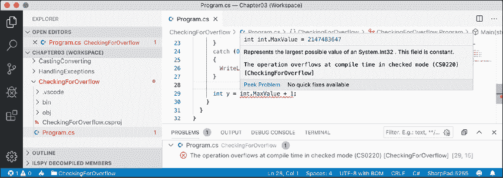

# 三、控制流、转换类型和处理异常

本章介绍如何编写代码，对变量执行简单操作、做出决策、执行模式匹配、重复语句或块、将变量或表达式值从一种类型转换为另一种类型、处理异常以及检查数字变量中的溢出。

本章涵盖以下主题：

*   变量操作
*   理解选择语句
*   理解迭代语句
*   类型之间的转换和转换
*   异常处理
*   检查溢出

# 变量操作

**运算符**对**操作数**应用简单的运算，如加法和乘法，如变量和文字值。它们通常返回一个新的值，该值是可以分配给变量的操作的结果。

大多数运算符都是二进制的，这意味着它们处理两个操作数，如以下伪代码所示：

```cs
var resultOfOperation = firstOperand operator secondOperand; 
```

二进制运算符的示例包括加法和乘法，如以下代码所示：

```cs
int x = 5;
int y = 3;
int resultOfAdding = x + y;
int resultOfMultiplying = x * y; 
```

有些运算符是一元运算符，这意味着它们处理单个操作数，可以在操作数之前或之后应用，如以下伪代码所示：

```cs
var resultOfOperation = onlyOperand operator; 
var resultOfOperation2 = operator onlyOperand; 
```

一元运算符的示例包括递增运算符和以字节为单位检索类型或其大小，如以下代码所示：

```cs
int x = 5;
int postfixIncrement = x++;
int prefixIncrement = ++x;
Type theTypeOfAnInteger = typeof(int); 
int howManyBytesInAnInteger = sizeof(int); 
```

三值运算符作用于三个操作数，如以下伪代码所示：

```cs
var resultOfOperation = firstOperand firstOperator 
  secondOperand secondOperator thirdOperand; 
```

## 探索一元运算符

两个常用的一元运算符用于递增和递减数字。让我们编写一些示例代码来说明它们是如何工作的：

1.  如果你已经完成了前面的章节，那么你已经有了一个`Code`文件夹。如果没有，那么您需要创建它。
2.  使用您首选的编码工具创建新的控制台应用，如下表所示：
    1.  项目模板：**控制台应用**/`console`
    2.  工作区/解决方案文件和文件夹：`Chapter03`
    3.  项目文件和文件夹：`Operators`
3.  在`Program.cs`顶部，静态导入`System.Console`。
4.  在`Program.cs`中，声明两个名为`a`和`b`的整数变量，将`a`设置为`3`，在将结果赋给`b`的同时增加`a`，然后输出它们的值，如下代码所示：

    ```cs
    int a = 3; 
    int b = a++;
    WriteLine($"a is {a}, b is {b}"); 
    ```

5.  Before running the console application, ask yourself a question: what do you think the value of `b` will be when output? Once you've thought about that, run the code, and compare your prediction against the actual result, as shown in the following output:

    ```cs
    a is 4, b is 3 
    ```

    变量`b`有值`3`，因为`++`操作符在赋值之后执行*；这被称为**后缀操作符**。如果需要在*赋值之前增加*，则使用**前缀运算符**。*

6.  复制并粘贴语句，然后修改它们以重命名变量并使用前缀运算符，如下代码所示：

    ```cs
    int c = 3;
    int d = ++c; // increment c before assigning it
    WriteLine($"c is {c}, d is {d}"); 
    ```

7.  Rerun the code and note the result, as shown in the following output:

    ```cs
    a is 4, b is 3
    c is 4, d is 4 
    ```

    **良好实践**：由于在与赋值组合时，递增运算符和递减运算符的前缀和后缀混淆，Swift 编程语言设计师决定在版本 3 中放弃对该运算符的支持。我建议在 C# 中使用`++`和`--`运算符时不要将其与赋值运算符`=`结合使用。将操作作为单独的语句执行。

## 探索二进制算术运算符

增量和减量是一元算术运算符。其他算术运算符通常为二进制运算符，允许对两个数字执行算术运算，如下所示：

1.  添加声明语句，为两个名为`e`和`f`的整数变量赋值，然后对这两个数字应用五个常用的二进制算术运算符，如下代码所示：

    ```cs
    int e = 11; 
    int f = 3;
    WriteLine($"e is {e}, f is {f}"); 
    WriteLine($"e + f = {e + f}"); 
    WriteLine($"e - f = {e - f}"); 
    WriteLine($"e * f = {e * f}"); 
    WriteLine($"e / f = {e / f}"); 
    WriteLine($"e % f = {e % f}"); 
    ```

2.  Run the code and note the result, as shown in the following output:

    ```cs
    e is 11, f is 3 
    e + f = 14
    e - f = 8 
    e * f = 33 
    e / f = 3 
    e % f = 2 
    ```

    要理解应用于整数时的除法`/`和模运算`%`，您需要回想小学时代。想象你有十一颗糖果和三个朋友。

    你怎么能把糖果分给你的朋友呢？你可以给每个朋友三颗糖果，剩下两颗。这两个糖是**模**，也就是除以后的**余数**。如果你有十二个糖果，那么每个朋友都会得到四个，并且没有剩下的，所以剩下的将是 0。

3.  添加语句来声明并为名为`g`的`double`变量赋值，以显示整数和实数除法之间的差异，如下代码所示：

    ```cs
    double g = 11.0;
    WriteLine($"g is {g:N1}, f is {f}"); 
    WriteLine($"g / f = {g / f}"); 
    ```

4.  运行代码并记录结果，如以下输出所示：

    ```cs
    g is 11.0, f is 3
    g / f = 3.6666666666666665 
    ```

如果第一个操作数是浮点数，例如值为`11.0`的`g`，则除法运算符返回浮点数，例如`3.6666666666665`，而不是整数。

## 赋值运算符

您已经在使用最常见的赋值运算符`=`。

为了使您的代码更简洁，您可以将赋值运算符与算术运算符等其他运算符组合，如下代码所示：

```cs
int p = 6;
p += 3; // equivalent to p = p + 3;
p -= 3; // equivalent to p = p - 3;
p *= 3; // equivalent to p = p * 3;
p /= 3; // equivalent to p = p / 3; 
```

## 探索逻辑运算符

逻辑运算符对布尔值进行操作，因此它们返回`true`或`false`。让我们探讨对两个布尔值进行操作的二进制逻辑运算符：

1.  使用您首选的编码工具将新的控制台应用添加到名为`BooleanOperators`的`Chapter03`工作区/解决方案中。
    1.  在 Visual Studio 代码中，选择`BooleanOperators`作为活动的 OmniSharp 项目。当您看到弹出警告消息说所需资产丢失时，单击**是**添加它们。
    2.  In Visual Studio, set the start up project for the solution to the current selection.

        **良好实践**：记住静态导入`System.Console`类型以简化语句。

1.  在`Program.cs`中，添加语句声明两个值为`true`和`false`的布尔变量，然后输出真值表，显示应用 and、OR 和 XOR（异或）逻辑运算符的结果，如下代码所示：

    ```cs
    bool a = true;
    bool b = false;
    WriteLine($"AND  | a     | b    ");
    WriteLine($"a    | {a & a,-5} | {a & b,-5} ");
    WriteLine($"b    | {b & a,-5} | {b & b,-5} ");
    WriteLine();
    WriteLine($"OR   | a     | b    ");
    WriteLine($"a    | {a | a,-5} | {a | b,-5} ");
    WriteLine($"b    | {b | a,-5} | {b | b,-5} ");
    WriteLine();
    WriteLine($"XOR  | a     | b    ");
    WriteLine($"a    | {a ^ a,-5} | {a ^ b,-5} ");
    WriteLine($"b    | {b ^ a,-5} | {b ^ b,-5} "); 
    ```

2.  运行代码并记录结果，如以下输出所示：

    ```cs
    AND  | a     | b    
    a    | True  | False 
    b    | False | False 
    OR   | a     | b    
    a    | True  | True  
    b    | True  | False 
    XOR  | a     | b    
    a    | False | True  
    b    | True  | False 
    ```

对于 AND`&`逻辑运算符，两个操作数都必须为`true`才能使结果为`true`。对于 OR`|`逻辑运算符，任一操作数都可以是`true`，结果可以是`true`。对于 XOR`^`逻辑运算符，任何一个操作数都可以是`true`（但不能同时是两个！），结果都可以是`true`。

## 探索条件逻辑运算符

条件逻辑运算符与逻辑运算符类似，但使用两个符号代替一个符号，例如，`&&`代替`&`的，或者`||`代替`|`。

在*第 4 章**编写、调试和测试函数*中，您将更详细地了解函数，但我现在需要介绍函数来解释条件逻辑运算符，也称为短路布尔运算符。

函数执行语句，然后返回值。该值可以是布尔运算中使用的类似于`true`的布尔值。让我们使用条件逻辑运算符：

1.  At the bottom of `Program.cs`, write statements to declare a function that writes a message to the console and returns `true`, as shown in the following code:

    ```cs
    static bool DoStuff()
    {
      WriteLine("I am doing some stuff.");
      return true;
    } 
    ```

    **良好实践**：如果您使用的是.NET Interactive Notebook，请在单独的代码单元中编写`DoStuff`函数，然后执行该函数，使其上下文可供其他代码单元使用。

2.  在前面的`WriteLine`语句之后，对`a`和`b`变量进行 AND`&`操作，调用函数的结果，如下代码所示：

    ```cs
    WriteLine();
    WriteLine($"a & DoStuff() = {a & DoStuff()}"); 
    WriteLine($"b & DoStuff() = {b & DoStuff()}"); 
    ```

3.  运行代码，查看结果，注意函数被调用了两次，一次用于 a，一次用于 b，如以下输出所示：

    ```cs
    I am doing some stuff. 
    a & DoStuff() = True
    I am doing some stuff. 
    b & DoStuff() = False 
    ```

4.  将`&`操作符更改为`&&`操作符，如下代码所示：

    ```cs
    WriteLine($"a && DoStuff() = {a && DoStuff()}"); 
    WriteLine($"b && DoStuff() = {b && DoStuff()}"); 
    ```

5.  Run the code, view the result, and note that the function does run when combined with the `a` variable. It does not run when combined with the `b` variable because the `b` variable is `false` so the result will be `false` anyway, so it does not need to execute the function, as shown in the following output:

    ```cs
    I am doing some stuff. 
    a && DoStuff() = True
    b && DoStuff() = False // DoStuff function was not executed! 
    ```

    **良好实践**：现在您可以了解为什么条件逻辑运算符被描述为短路。它们可以让你的应用更高效，但在你认为函数总是会被调用的情况下，它们也会引入一些微妙的错误。当与引起副作用的功能结合使用时，避免使用它们是最安全的。

## 探索按位和二进制移位运算符

按位运算符影响数字中的位。二进制移位运算符可以执行一些常见的算术运算，比传统运算符快得多，例如，任何乘以因子 2 的乘法运算。

让我们探讨按位和二进制移位运算符：

1.  使用您首选的编码工具将新的**控制台应用**添加到名为`BitwiseAndShiftOperators`的`Chapter03`工作区/解决方案中。
2.  在 Visual Studio 代码中，选择`BitwiseAndShiftOperators`作为活动的 OmniSharp 项目。当您看到弹出警告信息表示所需资产丢失时，单击**是**添加它们。
3.  在`Program.cs`中，键入语句声明两个值为 10 和 6 的整变量，然后输出应用 and、OR 和 XOR 位运算符的结果，如下代码所示：

    ```cs
    int a = 10; // 00001010
    int b = 6;  // 00000110
    WriteLine($"a = {a}");
    WriteLine($"b = {b}");
    WriteLine($"a & b = {a & b}"); // 2-bit column only 
    WriteLine($"a | b = {a | b}"); // 8, 4, and 2-bit columns 
    WriteLine($"a ^ b = {a ^ b}"); // 8 and 4-bit columns 
    ```

4.  运行代码并记录结果，如以下输出所示：

    ```cs
    a = 10
    b = 6
    a & b = 2 
    a | b = 14
    a ^ b = 12 
    ```

5.  在`Program.cs`中，添加语句输出应用左移位运算符将变量`a`的位移动三列、将`a`乘以 8、将`b`变量的位右移一列的结果，如下代码所示：

    ```cs
    // 01010000 left-shift a by three bit columns
    WriteLine($"a << 3 = {a << 3}");
    // multiply a by 8
    WriteLine($"a * 8 = {a * 8}");
    // 00000011 right-shift b by one bit column
    WriteLine($"b >> 1 = {b >> 1}"); 
    ```

6.  运行代码并记录结果，如以下输出所示：

    ```cs
    a << 3 = 80
    a * 8 = 80
    b >> 1 = 3 
    ```

`80`的结果是因为其中的位向左移动了三列，所以 1 位移到 64 位和 16 位列中，64+16=80。这相当于乘以 8，但 CPU 可以执行更快的位移位。这 3 个结果是因为`b`中的 1 位被移到了 2 位和 1 位列中。

**良好实践**：请记住，当对整数值进行操作时，`&`和`|`符号是位运算符，而当对布尔值（如`true`和`false`进行操作时，`&`和`|`符号是逻辑运算符。

我们可以通过将整数值转换为 0 和 1 的二进制字符串来说明这些操作：

1.  在`Program.cs`底部添加一个函数，将整数值转换为最多八个零和一的二进制（Base2）`string`，如下代码所示：

    ```cs
    static string ToBinaryString(int value)
    {
      return Convert.ToString(value, toBase: 2).PadLeft(8, '0');
    } 
    ```

2.  在函数上方，添加语句输出`a`、`b`以及各种位运算符的结果，如下代码所示：

    ```cs
    WriteLine();
    WriteLine("Outputting integers as binary:");
    WriteLine($"a =     {ToBinaryString(a)}");
    WriteLine($"b =     {ToBinaryString(b)}");
    WriteLine($"a & b = {ToBinaryString(a & b)}");
    WriteLine($"a | b = {ToBinaryString(a | b)}");
    WriteLine($"a ^ b = {ToBinaryString(a ^ b)}"); 
    ```

3.  运行代码并记录结果，如以下输出所示：

    ```cs
    Outputting integers as binary:
    a =     00001010
    b =     00000110
    a & b = 00000010
    a | b = 00001110
    a ^ b = 00001100 
    ```

## 杂项操作员

`nameof`和`sizeof`是使用类型时方便的操作员：

*   `nameof`将变量、类型或成员的短名称（不带命名空间）作为`string`值返回，这在输出异常消息时非常有用。
*   `sizeof`返回简单类型的字节大小，用于确定数据存储的效率。

还有很多其他的运营商；例如，变量与其成员之间的点称为**成员访问操作符**，函数或方法名称末尾的圆括号称为**调用操作符**，如下代码所示：

```cs
int age = 47;
// How many operators in the following statement?
char firstDigit = age.ToString()[0];
// There are four operators:
// = is the assignment operator
// . is the member access operator
// () is the invocation operator
// [] is the indexer access operator 
```

# 理解选择语句

每个应用都需要能够从选项中进行选择，并沿着不同的代码路径进行分支。C# 中的两个选择语句是`if`和`switch`。您可以在所有代码中使用`if`，但`switch`可以在一些常见场景中简化代码，例如，当一个变量可能有多个值，每个值都需要不同的处理时。

## 使用 if 语句进行分支

`if`语句通过计算布尔表达式来确定遵循哪个分支。如果表达式为`true`，则执行块。`else`块是可选的，如果`if`表达式为`false`则执行。`if`语句可以嵌套。

`if`语句可以与其他`if`语句组合成`else if`分支，如下代码所示：

```cs
if (expression1)
{
  // runs if expression1 is true
}
else if (expression2)
{
  // runs if expression1 is false and expression2 if true
}
else if (expression3)
{
  // runs if expression1 and expression2 are false
  // and expression3 is true
}
else
{
  // runs if all expressions are false
} 
```

每个`if`语句的布尔表达式独立于其他语句，并且与`switch`语句不同，不需要引用单个值。

让我们编写一些代码来探索选择语句，如`if`：

1.  使用您首选的编码工具将新的**控制台应用**添加到名为`SelectionStatements`的`Chapter03`工作区/解决方案中。
2.  在 Visual Studio 代码中，选择`SelectionStatements`作为活动的 OmniSharp 项目。
3.  在`Program.cs`中，输入语句检查密码是否至少包含八个字符，如下代码所示：

    ```cs
    string password = "ninja";
    if (password.Length < 8)
    {
      WriteLine("Your password is too short. Use at least 8 characters.");
    }
    else
    {
      WriteLine("Your password is strong.");
    } 
    ```

4.  运行代码并记录结果，如以下输出所示：

    ```cs
     Your password is too short. Use at least 8 characters. 
    ```

### 为什么在 if 语句中总是使用大括号

由于每个块中只有一条语句，因此前面的代码可以在不使用大括号的情况下编写，如下代码中的所示：

```cs
if (password.Length < 8)
  WriteLine("Your password is too short. Use at least 8 characters."); 
else
  WriteLine("Your password is strong."); 
```

这种风格的`if`语句应该避免，因为它可能会引入严重的 bug，例如，苹果 iPhone iOS 操作系统中臭名昭著的“gotofail bug”。

2012 年 9 月，苹果 iOS 6 发布 18 个月后，其**安全套接字层**（**SSL**）加密代码出现漏洞，这意味着任何运行 Safari（该设备的 web 浏览器）的用户，如果试图连接到银行等安全网站，由于意外跳过了一项重要检查，因此未正确保护。

仅仅因为你可以省略花括号并不意味着你应该这样做。没有它们，您的代码就不会“更高效”；相反，它的可维护性较差，并且可能更危险。

## 与 if 语句匹配的模式

C# 7.0 及更高版本引入的一个特性是模式匹配。`if`语句可以使用`is`关键字结合声明局部变量，使代码更安全：

1.  添加语句，以便如果名为`o`的变量中存储的值是一个`int`，则将该值分配给名为`i`的局部变量，然后该变量可以在`if`语句中使用。这比使用名为`o`的变量更安全，因为我们确信`i`是一个`int`变量，而不是其他变量，如以下代码所示：

    ```cs
    // add and remove the "" to change the behavior
    object o = "3"; 
    int j = 4;
    if (o is int i)
    {
      WriteLine($"{i} x {j} = {i * j}");
    }
    else
    {
      WriteLine("o is not an int so it cannot multiply!");
    } 
    ```

2.  运行代码并查看结果，如以下输出所示：

    ```cs
    o is not an int so it cannot multiply! 
    ```

3.  删除`"3"`值周围的双引号字符，以便名为`o`的变量中存储的值是`int`类型，而不是`string`类型。
4.  重新运行代码查看结果，如以下输出所示：

    ```cs
    3 x 4 = 12 
    ```

## 使用 switch 语句进行分支

`switch`语句与`if`语句不同，因为`switch`将单个表达式与多个可能的`case`语句列表进行比较。每个`case`语句都与单个表达式相关。每个`case`节必须以以下内容结尾：

*   `break`关键字（如下面代码中的案例 1）
*   或`goto``case`关键字（如下面代码中的案例 2）
*   或者它们应该没有语句（如下面代码中的案例 3）
*   或者引用命名标签的`goto`关键字（如下面代码中的案例 5）
*   或`return`关键字退出当前功能（代码中未显示）

让我们编写一些代码来探索`switch`语句：

1.  Type statements for a `switch` statement. You should note that the penultimate statement is a label that can be jumped to, and the first statement generates a random number between 1 and 6 (the number 7 in the code is an exclusive upper bound). The `switch` statement branches are based on the value of this random number, as shown in the following code:

    ```cs
    int number = (new Random()).Next(1, 7); 
    WriteLine($"My random number is {number}");
    switch (number)
    {
      case 1: 
        WriteLine("One");
        break; // jumps to end of switch statement
      case 2:
        WriteLine("Two");
        goto case 1;
      case 3: // multiple case section
      case 4:
        WriteLine("Three or four");
        goto case 1;
      case 5:
        goto A_label;
      default:
        WriteLine("Default");
        break;
    } // end of switch statement
    WriteLine("After end of switch");
    A_label:
    WriteLine($"After A_label"); 
    ```

    **良好实践**：您可以使用`goto`关键字跳转到另一个案例或标签。大多数程序员都不喜欢`goto`关键字，但在某些情况下，它可以很好地解决代码逻辑问题。然而，你应该少用它。

2.  多次运行代码以查看在各种随机数情况下发生的情况，如以下示例输出所示：

    ```cs
    // first random run
    My random number is 4 
    Three or four
    One
    After end of switch
    After A_label
    // second random run
    My random number is 2 
    Two
    One
    After end of switch
    After A_label
    // third random run
    My random number is 6
    Default
    After end of switch
    After A_label
    // fourth random run
    My random number is 1 
    One
    After end of switch
    After A_label
    // fifth random run
    My random number is 5
    After A_label 
    ```

## 与 switch 语句的模式匹配

与`if`语句一样，`switch`语句支持 C# 7.0 及更高版本中的模式匹配。`case`值不再需要是文字值；它们可以是模式。

我们来看一个使用文件夹路径与`switch`语句进行模式匹配的示例。如果您使用的是 macOS，请交换设置 path 变量的注释语句，并将“我的用户名”替换为您的用户文件夹名称：

1.  添加语句以声明文件的`string`路径，将其作为只读或可写流打开，然后根据流的类型和功能显示消息，如以下代码所示：

    ```cs
    // string path = "/Users/markjprice/Code/Chapter03";
    string path = @"C:\Code\Chapter03";
    Write("Press R for read-only or W for writeable: "); 
    ConsoleKeyInfo key = ReadKey();
    WriteLine();
    Stream? s;
    if (key.Key == ConsoleKey.R)
    {
      s =  File.Open(
        Path.Combine(path, "file.txt"), 
        FileMode.OpenOrCreate, 
        FileAccess.Read);
    }
    else
    {
      s =  File.Open( 
        Path.Combine(path, "file.txt"), 
        FileMode.OpenOrCreate, 
        FileAccess.Write);
    }
    string message; 
    switch (s)
    {
      case FileStream writeableFile when s.CanWrite:
        message = "The stream is a file that I can write to.";
        break;
      case FileStream readOnlyFile:
        message = "The stream is a read-only file.";
        break;
      case MemoryStream ms:
        message = "The stream is a memory address.";
        break;
      default: // always evaluated last despite its current position
        message = "The stream is some other type.";
        break;
      case null:
        message = "The stream is null.";
        break;
    }
    WriteLine(message); 
    ```

2.  运行代码并注意名为`s`的变量被声明为`Stream`类型，因此它可以是流的任何子类型，例如内存流或文件流。在这段代码中，流是使用`File.Open`方法创建的，该方法返回一个文件流，并且根据您的按键，它将是可写或只读的，因此结果将是一条描述情况的消息，如以下输出所示：

    ```cs
    The stream is a file that I can write to. 
    ```

在.NET 中，`Stream`有多种亚型，包括`FileStream`和`MemoryStream`。在 C# 7.0 及更高版本中，您的代码可以更简洁地根据流的子类型进行分支，并声明和分配一个局部变量以安全地使用它。您将在*第 9 章*、*处理文件、流和序列化*中了解更多关于`System.IO`名称空间和`Stream`类型的信息。

此外，`case`语句可以包含`when`关键字，以执行更具体的模式匹配。在前面代码中的第一个 case 语句中，`s`仅当流为`FileStream`且其`CanWrite`属性为`true`时才是匹配项。

## 用 switch 表达式简化 switch 语句

在 C# 8.0 或更高版本中，您可以使用**开关表达式**简化`switch`语句。

大多数`switch`语句非常简单，但它们需要大量的输入。`switch`表达式旨在简化您需要键入的代码，同时在所有情况下都返回一个值以设置单个变量的情况下仍表达相同的意图。`switch`表达式使用 lambda，`=>`表示返回值。

让我们使用`switch`表达式实现前面使用`switch`语句的代码，以便比较这两种样式：

1.  Type statements to set the message based on what type and capabilities the stream has, using a `switch` expression, as shown in the following code:

    ```cs
    message = s switch
    {
      FileStream writeableFile when s.CanWrite
        => "The stream is a file that I can write to.", 
      FileStream readOnlyFile
        => "The stream is a read-only file.", 
      MemoryStream ms
        => "The stream is a memory address.", 
      null
        => "The stream is null.",
      _
        => "The stream is some other type."
    };
    WriteLine(message); 
    ```

    的主要区别在于删除了`case`和`break`关键字。下划线字符`_`用于表示默认返回值。

2.  运行代码，注意结果与前面相同。

# 理解迭代语句

迭代语句在条件为 true 时或对集合中的每个项重复语句块。使用哪种陈述的选择是基于易于理解以解决逻辑问题和个人偏好的结合。

## 与 while 语句循环

`while`语句对布尔表达式求值，并在其为真时继续循环。让我们探讨迭代语句：

1.  使用您首选的编码工具将新的**控制台应用**添加到名为`IterationStatements`的`Chapter03`工作区/解决方案。
2.  在 Visual Studio 代码中，选择`IterationStatements`作为活动的 OmniSharp 项目。
3.  在`Program.cs`中，输入语句定义一个`while`语句，当整数变量的值小于 10 时循环，如下代码所示：

    ```cs
    int x = 0;
    while (x < 10)
    {
      WriteLine(x);
      x++;
    } 
    ```

4.  运行代码并查看结果，结果应该是 0 到 9，如以下输出所示：

    ```cs
    0
    1
    2
    3
    4
    5
    6
    7
    8
    9 
    ```

## 与 do 语句循环

`do`语句与`while`类似，只是布尔表达式在块的底部而不是顶部被检查，这意味着块总是至少执行一次，如下所示：

1.  键入语句定义一个`do`循环，如下代码所示：

    ```cs
    string? password;
    do
    {
      Write("Enter your password: "); 
      password = ReadLine();
    }
    while (password != "Pa$$w0rd");
    WriteLine("Correct!"); 
    ```

2.  运行代码，注意系统会提示您重复输入密码，直到您正确输入密码，如以下输出所示：

    ```cs
    Enter your password: password 
    Enter your password: 12345678 
    Enter your password: ninja
    Enter your password: correct horse battery staple 
    Enter your password: Pa$$w0rd
    Correct! 
    ```

3.  作为可选挑战，添加语句，以便用户在显示错误消息之前只能尝试十次。

## 与 for 语句循环

`for`语句与`while`类似，只是更简洁。它结合了：

*   一个**初始值设定项表达式**，在循环开始时执行一次。
*   一个**条件表达式**，在循环开始时的每次迭代中执行，以检查循环是否应继续。
*   一个**迭代器表达式**，在语句底部的每个循环上执行。

`for`语句通常与整数计数器一起使用。让我们探索一些代码：

1.  键入一条`for`语句，输出数字 1 到 10，如下代码所示：

    ```cs
    for (int y = 1; y <= 10; y++)
    {
      WriteLine(y);
    } 
    ```

2.  运行代码查看结果，结果应该是数字 1 到 10。

## 与 foreach 语句循环

`foreach`语句与前三个迭代语句有点不同。

它用于对序列中的每个项执行语句块，例如数组或集合。每个项通常是只读的，如果在迭代过程中修改了序列结构（例如，通过添加或删除项），则会引发异常。

请尝试以下示例：

1.  输入语句到创建一个字符串变量数组，然后输出每个字符串变量的长度，如下代码所示：

    ```cs
    string[] names = { "Adam", "Barry", "Charlie" };
    foreach (string name in names)
    {
      WriteLine($"{name} has {name.Length} characters.");
    } 
    ```

2.  运行代码并查看结果，如以下输出所示：

    ```cs
    Adam has 4 characters. 
    Barry has 5 characters. 
    Charlie has 7 characters. 
    ```

### 了解 foreach 如何在内部工作

任何表示多个项的类型（如数组或集合）的创建者都应该确保程序员可以使用`foreach`语句枚举该类型的项。

从技术上讲，`foreach`语句适用于遵循以下规则的任何类型：

1.  该类型必须有一个名为`GetEnumerator`的方法返回一个对象。
2.  返回的对象必须具有名为`Current`的属性和名为`MoveNext`的方法。
3.  `MoveNext`方法必须更改`Current`的值，如果有更多项需要枚举，则返回`true`，如果没有更多项，则返回`false`。

有名为`IEnumerable`和`IEnumerable<T>`的接口正式定义了这些规则，但从技术上讲，编译器不需要类型来实现这些接口。

编译器将上例中的`foreach`语句转换为类似以下伪代码的代码：

```cs
IEnumerator e = names.GetEnumerator();
while (e.MoveNext())
{
  string name = (string)e.Current; // Current is read-only!
  WriteLine($"{name} has {name.Length} characters.");
} 
```

由于使用了迭代器，`foreach`语句中声明的变量不能用于修改当前项的值。

# 类型之间的转换和转换

通常需要在不同类型之间转换变量值。例如，数据输入通常在控制台以文本形式输入，因此它最初存储在`string`类型的变量中，但随后需要将其转换为日期/时间、数字或其他数据类型，具体取决于它的存储和处理方式。

有时，在执行计算之前，您需要在数字类型之间进行转换，例如在整数和浮点之间进行转换。

转换又称为**铸造**，有两种变体：**隐式**和**显式**。隐式施法是自动进行的，而且是安全的，这意味着你不会丢失任何信息。

显式强制转换必须手动执行，因为它可能会丢失信息，例如数字的精度。通过显式强制转换，您告诉 C# 编译器您理解并接受风险。

## 隐式和显式转换数字

将一个`int`变量隐式转换为一个`double`变量是安全的，因为不会丢失任何信息，如下所示：

1.  使用您首选的编码工具将新的**控制台应用**添加到名为`CastingConverting`的`Chapter03`工作区/解决方案中。
2.  在 Visual Studio 代码中，选择`CastingConverting`作为活动的 OmniSharp 项目。
3.  在`Program.cs`中，键入语句声明并分配`int`变量和`double`变量，然后在分配给`double`变量时隐式转换整数的值，如下代码所示：

    ```cs
    int a = 10;
    double b = a; // an int can be safely cast into a double
    WriteLine(b); 
    ```

4.  键入语句声明并分配一个`double`变量和一个`int`变量，然后在分配给`int`变量时隐式转换`double`值，如下代码所示：

    ```cs
    double c = 9.8;
    int d = c; // compiler gives an error for this line
    WriteLine(d); 
    ```

5.  Run the code and note the error message, as shown in the following output:

    ```cs
    Error: (6,9): error CS0266: Cannot implicitly convert type 'double' to 'int'. An explicit conversion exists (are you missing a cast?) 
    ```

    此错误消息也将出现在 Visual Studio 错误列表或 Visual Studio 代码问题窗口中。

    您不能将`double`变量隐式转换为`int`变量，因为它可能不安全，并且可能会丢失数据，例如小数点后的值。您必须使用一对圆括号将`double`变量显式转换为`int`变量，圆括号围绕要转换`double`类型的类型。这对圆括号是**铸造操作员**。即使如此，您也必须注意小数点后的部分将在没有警告的情况下被删除，因为您已选择执行显式转换，因此了解其后果。

6.  修改`d`变量的赋值语句，如下代码所示：

    ```cs
    int d = (int)c;
    WriteLine(d); // d is 9 losing the .8 part 
    ```

7.  Run the code to view the results, as shown in the following output:

    ```cs
    10
    9 
    ```

    在大整数和小整数之间转换值时，必须执行类似的操作。再次提醒您注意您可能会丢失信息，因为任何太大的值都会复制其位，然后以您可能无法预料的方式进行解释！

8.  输入语句以声明一个长 64 位变量并将其分配给一个 int 32 位变量，这两种方法都使用一个可以工作的小值和一个不能工作的太大值，如以下代码所示：

    ```cs
    long e = 10; 
    int f = (int)e;
    WriteLine($"e is {e:N0} and f is {f:N0}"); 
    e = long.MaxValue;
    f = (int)e;
    WriteLine($"e is {e:N0} and f is {f:N0}"); 
    ```

9.  运行代码查看结果，如以下输出所示：

    ```cs
    e is 10 and f is 10
    e is 9,223,372,036,854,775,807 and f is -1 
    ```

10.  将`e`的值修改为 50 亿，如下代码所示：

    ```cs
    e = 5_000_000_000; 
    ```

11.  运行代码查看结果，如以下输出所示：

    ```cs
    e is 5,000,000,000 and f is 705,032,704 
    ```

## 使用系统转换。转换类型

使用 cast 运算符的另一种方法是使用`System.Convert`类型。`System.Convert`类型可以转换为所有 C# 数字类型，也可以转换为布尔值、字符串、日期和时间值。

让我们编写一些代码来了解这一点：

1.  在`Program.cs`顶部，静态导入`System.Convert`类，如下代码所示：

    ```cs
    using static System.Convert; 
    ```

2.  在`Program.cs`的底部，键入语句，声明并为`double`变量赋值，将其转换为整数，然后将这两个值写入控制台，如下代码所示：

    ```cs
    double g = 9.8;
    int h = ToInt32(g); // a method of System.Convert
    WriteLine($"g is {g} and h is {h}"); 
    ```

3.  运行代码并查看结果，如以下输出所示：

    ```cs
    g is 9.8 and h is 10 
    ```

铸造和转换的一个区别是转换将`double`值`9.8`四舍五入到`10`，而不是在小数点后修剪零件。

## 舍入数

现在您已经看到 cast 操作符修剪实数的小数部分，`System.Convert`方法向上或向下取整。但是，四舍五入的规则是什么？

### 了解默认舍入规则

在英国的 5 至 11 岁儿童小学，学生们被教导如果小数部分为.5 或更高，则将*向上取整*，如果小数部分小于，则将*向下取整*。

让我们来探讨一下 C# 是否遵循同样的小学规则：

1.  键入语句来声明并分配一个`double`值数组，将每个值转换成整数，然后将结果写入控制台，如下面的代码所示：

    ```cs
    double[] doubles = new[]
      { 9.49, 9.5, 9.51, 10.49, 10.5, 10.51 };
    foreach (double n in doubles)
    {
      WriteLine($"ToInt32({n}) is {ToInt32(n)}");
    } 
    ```

2.  运行代码并查看结果，如以下输出所示：

    ```cs
    ToInt32(9.49) is 9
    ToInt32(9.5) is 10
    ToInt32(9.51) is 10
    ToInt32(10.49) is 10
    ToInt32(10.5) is 10
    ToInt32(10.51) is 11 
    ```

我们已经证明，C# 中的四舍五入规则与小学规则有细微的不同：

*   如果小数部分小于中点，它总是将*向下舍入*。
*   如果小数部分大于中点，它总是将*向上取整。*
*   如果小数部分为中点，则将*向上取整*；如果非小数部分为*偶数*，则将*向下取整*。

这条规则被称为**银行家取整**，它是首选规则，因为它在向上取整或向下取整时通过交替减少偏差。遗憾的是，JavaScript 等其他语言使用小学规则。

## 控制取整规则

您可以使用`Math`类的`Round`方法控制舍入规则：

1.  键入语句，使用“远离零”舍入规则对每个`double`值进行舍入，也称为舍入“向上”，然后将结果写入控制台，如以下代码所示：

    ```cs
    foreach (double n in doubles)
    {
      WriteLine(format:
        "Math.Round({0}, 0, MidpointRounding.AwayFromZero) is {1}",
        arg0: n,
        arg1: Math.Round(value: n, digits: 0,
                mode: MidpointRounding.AwayFromZero));
    } 
    ```

2.  Run the code and view the result, as shown in the following output:

    ```cs
    Math.Round(9.49, 0, MidpointRounding.AwayFromZero) is 9
    Math.Round(9.5, 0, MidpointRounding.AwayFromZero) is 10
    Math.Round(9.51, 0, MidpointRounding.AwayFromZero) is 10
    Math.Round(10.49, 0, MidpointRounding.AwayFromZero) is 10
    Math.Round(10.5, 0, MidpointRounding.AwayFromZero) is 11
    Math.Round(10.51, 0, MidpointRounding.AwayFromZero) is 11 
    ```

    **良好实践**：对于您使用的每种编程语言，检查其舍入规则。它们可能无法按您期望的方式工作！

## 从任何类型转换为字符串

最常见的转换是从任何类型转换为一个`string`变量，作为人类可读文本输出，因此所有类型都有一个名为`ToString`的方法，它们从`System.Object`类继承。

`ToString`方法将任何变量的当前值转换为文本表示。有些类型不能合理地表示为文本，因此它们返回名称空间和类型名。

让我们将一些类型转换为`string`：

1.  键入语句来声明一些变量，将它们转换为它们的`string`表示形式，并将它们写入控制台，如下代码所示：

    ```cs
    int number = 12; 
    WriteLine(number.ToString());
    bool boolean = true; 
    WriteLine(boolean.ToString());
    DateTime now = DateTime.Now; 
    WriteLine(now.ToString());
    object me = new(); 
    WriteLine(me.ToString()); 
    ```

2.  运行代码并查看结果，如以下输出所示：

    ```cs
    12
    True
    02/28/2021 17:33:54
    System.Object 
    ```

## 从二进制对象转换为字符串

当您有一个二进制对象（如图像或视频）要存储或传输时，您有时不想发送原始位，因为您不知道这些位如何被误解，例如，通过传输它们的网络协议或正在读取存储二进制对象的另一个操作系统。

最安全的做法是将二进制对象转换为安全字符的`string`。程序员称之为**Base64**编码。

`Convert`类型有一对方法`ToBase64String`和`FromBase64String`，由为您执行此转换。让我们看看他们的行动：

1.  Type statements to create an array of bytes randomly populated with byte values, write each byte nicely formatted to the console, and then write the same bytes converted to Base64 to the console, as shown in the following code:

    ```cs
    // allocate array of 128 bytes
    byte[] binaryObject = new byte[128];
    // populate array with random bytes
    (new Random()).NextBytes(binaryObject); 
    WriteLine("Binary Object as bytes:");
    for(int index = 0; index < binaryObject.Length; index++)
    {
      Write($"{binaryObject[index]:X} ");
    }
    WriteLine();
    // convert to Base64 string and output as text
    string encoded = ToBase64String(binaryObject);
    WriteLine($"Binary Object as Base64: {encoded}"); 
    ```

    默认情况下，`int`值将以十进制表示法输出，即 base10。您可以使用`:X`等格式代码，使用十六进制表示法对值进行格式设置。

2.  运行代码并查看结果，如以下输出所示：

    ```cs
    Binary Object as bytes:
    B3 4D 55 DE 2D E BB CF BE 4D E6 53 C3 C2 9B 67 3 45 F9 E5 20 61 7E 4F 7A 81 EC 49 F0 49 1D 8E D4 F7 DB 54 AF A0 81 5 B8 BE CE F8 36 90 7A D4 36 42
    4 75 81 1B AB 51 CE 5 63 AC 22 72 DE 74 2F 57 7F CB E7 47 B7 62 C3 F4 2D
    61 93 85 18 EA 6 17 12 AE 44 A8 D B8 4C 89 85 A9 3C D5 E2 46 E0 59 C9 DF
    10 AF ED EF 8AA1 B1 8D EE 4A BE 48 EC 79 A5 A 5F 2F 30 87 4A C7 7F 5D C1 D
    26 EE
    Binary Object as Base64: s01V3i0Ou8++TeZTw8KbZwNF +eUgYX5PeoHsSfBJHY7U99tU r6CBBbi+zvg2kHrUNkIEdYEbq1HOBWOsInLedC9Xf8vnR7diw/QtYZOFGOoGFxKuRKgNuEyJha k81eJG4FnJ3xCv7e+KobGN7kq+SO x5pQpfLzCHSsd/XcENJu4= 
    ```

## 从字符串解析为数字或日期和时间

第二种最常见的转换是从字符串转换为数字或日期和时间值。

`ToString`的对立面是`Parse`。只有少数类型有`Parse`方法，包括所有数字类型和`DateTime`。

让我们看看`Parse`的实际行动：

1.  键入语句，从字符串中解析整数和日期时间值，然后将结果写入控制台，如下代码所示：

    ```cs
    int age = int.Parse("27");
    DateTime birthday = DateTime.Parse("4 July 1980");
    WriteLine($"I was born {age} years ago."); 
    WriteLine($"My birthday is {birthday}."); 
    WriteLine($"My birthday is {birthday:D}."); 
    ```

2.  Run the code and view the result, as shown in the following output:

    ```cs
    I was born 27 years ago.
    My birthday is 04/07/1980 00:00:00\. 
    My birthday is 04 July 1980. 
    ```

    默认情况下，日期和时间值以短日期和时间格式输出。您可以使用`D`等格式代码，仅输出使用长日期格式的日期部分。

    **良好实践**：使用标准日期和时间格式说明符，如下链接所示：[https://docs.microsoft.com/en-us/dotnet/standard/base-types/standard-date-and-time-format-strings# table-格式说明符的定义](https://docs.microsoft.com/en-us/dotnet/standard/base-types/standard-date-and-time-format-strings# table-of-format-specifiers)

### 使用解析时出错

`Parse`方法的一个问题是，如果`string`无法转换，它会给出错误。

1.  键入一条语句，尝试将包含字母的字符串解析为整数变量，如下代码所示：

    ```cs
    int count = int.Parse("abc"); 
    ```

2.  运行代码并查看结果，如以下输出所示：

    ```cs
    Unhandled Exception: System.FormatException: Input string was not in a correct format. 
    ```

与前面的异常消息一样，您将看到堆栈跟踪。我没有在这本书中包括堆栈跟踪，因为它们占用了太多的空间。

### 使用 TryParse 方法避免异常

为了避免错误，您可以使用方法代替`TryParse`方法。`TryParse`尝试转换输入`string`，如果可以转换，则返回`true`，如果不能转换，则返回`false`。

转换工作时，`out`关键字是允许`TryParse`方法设置计数变量所必需的。

让我们看看`TryParse`的实际行动：

1.  将`int``count`声明替换为使用`TryParse`方法的语句，并要求用户输入个蛋的计数，如下代码所示：

    ```cs
    Write("How many eggs are there? "); 
    string? input = ReadLine(); // or use "12" in notebook
    if (int.TryParse(input, out int count))
    {
      WriteLine($"There are {count} eggs.");
    }
    else
    {
      WriteLine("I could not parse the input.");
    } 
    ```

2.  运行代码，输入`12`，查看结果，如以下输出所示：

    ```cs
    How many eggs are there? 12
    There are 12 eggs. 
    ```

3.  运行代码，输入`twelve`（或在笔记本中将`string`值改为`"twelve"`，查看结果，如以下输出所示：

    ```cs
    How many eggs are there? twelve
    I could not parse the input. 
    ```

您也可以使用`System.Convert`类型的方法将`string`值转换为其他类型；但是，与`Parse`方法一样，如果无法转换，则会出现错误。

# 异常处理

您已经看到了在转换类型时发生错误的几种情况。当出现问题时，有些语言会返回错误代码。NET 使用的异常比具有多种用途的返回值更丰富，并且仅用于故障报告。当这种情况发生时，我们说抛出了一个*运行时异常*。

当抛出异常时，线程被挂起，如果调用代码定义了一个`try-catch`语句，那么它就有机会处理异常。如果当前方法不处理它，则给它的调用方法一个机会，依此类推。

如您所见，控制台应用或.NET 交互式笔记本的默认行为是输出有关异常的消息，包括堆栈跟踪，然后停止运行代码。申请被终止。这比允许代码在可能损坏的状态下继续执行要好。您的代码应该只捕获和处理它理解并能够正确修复的异常。

**良好实践**：尽可能避免编写会抛出异常的代码，可能是通过执行`if`语句检查。有时不能，有时最好允许调用代码的更高级别组件捕获异常。您将在*第 4 章*、*编写、调试和测试函数*中学习如何进行此操作。

## 在 try 块中包装容易出错的代码

当您知道一条语句可能导致错误时，您应该将该语句包装在一个`try`块中。例如，将从文本解析为数字可能会导致错误。只有当`try`块中的语句引发异常时，`catch`块中的任何语句才会执行。

我们不必在`catch`区内做任何事情。让我们看看这一点：

1.  使用您首选的编码工具将新的**控制台应用**添加到名为`HandlingExceptions`的`Chapter03`工作区/解决方案中。
2.  在 Visual Studio 代码中，选择`HandlingExceptions`作为活动的 OmniSharp 项目。
3.  Type statements to prompt the user to enter their age and then write their age to the console, as shown in the following code:

    ```cs
    WriteLine("Before parsing"); 
    Write("What is your age? "); 
    string? input = ReadLine(); // or use "49" in a notebook
    try
    {
      int age = int.Parse(input); 
      WriteLine($"You are {age} years old.");
    }
    catch
    {
    }
    WriteLine("After parsing"); 
    ```

    您将看到以下编译器消息：`Warning CS8604 Possible null reference argument for parameter 's' in 'int int.Parse(string s)'.`默认情况下，在新的.NET 6 项目中，Microsoft 已启用可为空的引用类型，因此您将看到更多类似这样的编译器警告。在生产代码中，您应该添加代码来检查`null`并适当处理这种可能性。在这本书中，我将不包括这些`null`检查，因为代码样本不是为产品质量而设计的，到处的`null`检查将使代码混乱，并耗尽有价值的页面。在这种情况下，`input`不可能是`null`，因为用户必须按 Enter 键才能返回`ReadLine`，这将返回一个空的`string`。在本书的代码示例中，您将看到数百个潜在的`null`变量示例。对于书籍代码示例，可以安全地忽略这些警告。您只需要在编写自己的生产代码时发出类似的警告。您将在*第 6 章*、*实现接口和继承类*中了解有关 null 处理的更多信息。

    此代码包含两条消息，分别表示解析前的*和*解析后的*，以明确代码的流程。随着示例代码变得越来越复杂，这些将特别有用。*

4.  运行代码，输入`49`，查看结果，如以下输出所示：

    ```cs
    Before parsing
    What is your age? 49
    You are 49 years old. 
    After parsing 
    ```

5.  运行代码，输入`Kermit`，查看结果，如以下输出所示：

    ```cs
    Before parsing
    What is your age? Kermit
    After parsing 
    ```

执行代码时，捕获错误异常，未输出默认消息和堆栈跟踪，控制台应用继续运行。这比默认行为要好，但查看发生的错误类型可能会有用。

**良好实践**：您不应该在生产代码中使用这样的空`catch`语句，因为它“吞咽”异常并隐藏潜在问题。如果您不能或不想正确处理异常，至少应该记录异常，或者重新显示异常，以便更高级别的代码可以决定。您将了解如何登录*第四章*、*编写、调试和测试功能*。

### 捕获所有异常

要获取可能发生的任何类型的异常的信息，您可以向`catch`块声明一个类型为`System.Exception`的变量：

1.  将异常变量声明添加到`catch`块中，并使用它将异常信息写入控制台，如下代码所示：

    ```cs
    catch (Exception ex)
    {
      WriteLine($"{ex.GetType()} says {ex.Message}");
    } 
    ```

2.  运行代码，再次输入`Kermit`并查看结果，如以下输出所示：

    ```cs
    Before parsing
    What is your age? Kermit
    System.FormatException says Input string was not in a correct format. 
    After parsing 
    ```

### 捕获特定异常

现在我们知道发生了哪种特定类型的异常，我们可以通过捕获该类型的异常 a 并定制我们向用户显示的消息来改进代码：

1.  保留现有的`catch`块，并在其上方为格式异常类型添加一个新的`catch`块，如下高亮显示的代码所示：

    ```cs
    **catch (FormatException)**
    **{**
     **WriteLine(****"The age you entered is not a valid number format."****);**
    **}**
    catch (Exception ex)
    {
      WriteLine($"{ex.GetType()} says {ex.Message}");
    } 
    ```

2.  Run the code, enter `Kermit` again, and view the result, as shown in the following output:

    ```cs
    Before parsing
    What is your age? Kermit
    The age you entered is not a valid number format. 
    After parsing 
    ```

    我们希望留下下面更一般的捕获的原因是可能会发生其他类型的异常。

3.  Run the code, enter `9876543210`, and view the result, as shown in the following output:

    ```cs
    Before parsing
    What is your age? 9876543210
    System.OverflowException says Value was either too large or too small for an Int32.
    After parsing 
    ```

    让我们为这种类型的异常添加另一个`catch`块。

4.  保留现有的`catch`块，为溢出异常类型添加一个新的`catch`块，如下高亮显示的代码所示：

    ```cs
    **catch (OverflowException)**
    **{**
     **WriteLine(****"Your age is a valid number format but it is either too big or small."****);**
    **}**
    catch (FormatException)
    {
      WriteLine("The age you entered is not a valid number format.");
    } 
    ```

5.  运行代码，输入`9876543210`，查看结果，如以下输出所示：

    ```cs
    Before parsing
    What is your age? 9876543210
    Your age is a valid number format but it is either too big or small. 
    After parsing 
    ```

捕获异常的顺序很重要。正确的顺序与异常类型的继承层次结构有关。您将在*第 5 章**中学习继承，使用面向对象编程*构建您自己的类型。但是，不要太担心这个问题，如果您以错误的顺序得到异常，编译器将给您生成错误。

**良好实践**：避免过度捕获异常。通常应该允许它们向上传播调用堆栈，以便在一个级别上进行处理，在这个级别上，可以了解更多有关可能改变其处理逻辑的情况的信息。您将在*第 4 章*、*编写、调试和测试函数*中了解这一点。

### 过滤器捕捉

您还可以使用`when`关键字向 catch 语句添加过滤器，如下代码所示：

```cs
Write("Enter an amount: ");
string? amount = ReadLine();
try
{
  decimal amountValue = decimal.Parse(amount);
}
catch (FormatException) when (amount.Contains("$"))
{
  WriteLine("Amounts cannot use the dollar sign!");
}
catch (FormatException)
{
  WriteLine("Amounts must only contain digits!");
} 
```

# 检查溢出

前面，我们看到在数字类型之间转换时，可能会丢失信息，例如，从`long`变量转换为`int`变量时。如果类型中存储的值太大，它将溢出。

## 正在使用 checked 语句引发溢出异常

`checked`语句告诉.NET 在发生溢出时抛出异常，而不是允许它以静默方式发生，这是出于性能原因而默认执行的。

我们将`int`变量的初始值设置为其最大值减去 1。然后，我们将它增加几次，每次输出它的值。一旦超过其最大值，它就会溢出到其最小值，并从那里继续递增。让我们看看这一点：

1.  使用您首选的编码工具将新的**控制台应用**添加到名为`CheckingForOverflow`的`Chapter03`工作区/解决方案中。
2.  在 Visual Studio 代码中，选择`CheckingForOverflow`作为活动的 OmniSharp 项目。
3.  在`Program.cs`中，键入语句声明一个整数，并将其赋值为一个小于其最大可能值的整数，然后将其递增并将其值写入控制台三次，如下代码所示：

    ```cs
    int x = int.MaxValue - 1; 
    WriteLine($"Initial value: {x}"); 
    x++;
    WriteLine($"After incrementing: {x}"); 
    x++;
    WriteLine($"After incrementing: {x}"); 
    x++;
    WriteLine($"After incrementing: {x}"); 
    ```

4.  运行代码并查看结果，结果显示值以静默方式溢出并环绕为大负值，如以下输出所示：

    ```cs
    Initial value: 2147483646
    After incrementing: 2147483647
    After incrementing: -2147483648
    After incrementing: -2147483647 
    ```

5.  现在，让编译器通过使用`checked`语句块包装语句来警告我们溢出，如以下代码中突出显示的：

    ```cs
    **checked**
    **{**
      int x = int.MaxValue - 1; 
      WriteLine($"Initial value: {x}"); 
      x++;
      WriteLine($"After incrementing: {x}"); 
      x++;
      WriteLine($"After incrementing: {x}"); 
      x++;
      WriteLine($"After incrementing: {x}");
    **}** 
    ```

6.  运行代码并查看显示正在检查溢出并引发异常的结果，如以下输出所示：

    ```cs
    Initial value: 2147483646
    After incrementing: 2147483647
    Unhandled Exception: System.OverflowException: Arithmetic operation resulted in an overflow. 
    ```

7.  与任何其他异常一样，我们应该将这些语句包装在一个`try`语句块中，并为用户显示一条更好的错误消息，如下代码所示：

    ```cs
    try
    {
      // previous code goes here
    }
    catch (OverflowException)
    {
      WriteLine("The code overflowed but I caught the exception.");
    } 
    ```

8.  运行代码并查看结果，如以下输出所示：

    ```cs
    Initial value: 2147483646
    After incrementing: 2147483647
    The code overflowed but I caught the exception. 
    ```

## 使用 unchecked 语句禁用编译器溢出检查

上一节是关于*运行时*的默认溢出行为，以及如何使用`checked`语句更改该行为。本节介绍*编译时*溢出行为以及如何使用`unchecked`语句更改该行为。

相关关键字为`unchecked`。此关键字关闭编译器在代码块内执行的溢出检查。让我们看看如何做到这一点：

1.  在前面语句的末尾键入以下语句。编译器不会编译此语句，因为它知道它将溢出：

    ```cs
    int y = int.MaxValue + 1; 
    ```

2.  Hover your mouse pointer over the error, and note a compile-time check is shown as an error message, as shown in *Figure 3.1*:

    <figure class="mediaobject"></figure>

    图 3.1：问题窗口中的编译时检查

3.  要禁用编译时检查，请将语句包装在`unchecked`块中，将`y`的值写入控制台，减量并重复，如下代码所示：

    ```cs
    unchecked
    {
      int y = int.MaxValue + 1; 
      WriteLine($"Initial value: {y}"); 
      y--;
      WriteLine($"After decrementing: {y}"); 
      y--;
      WriteLine($"After decrementing: {y}");
    } 
    ```

4.  运行代码并查看结果，如以下输出所示：

    ```cs
    Initial value: -2147483648
    After decrementing: 2147483647
    After decrementing: 2147483646 
    ```

当然，很少有人会明确地关闭这样的检查，因为它允许发生溢出。但也许你可以想象一个场景，你可能想要这种行为。

# 实践与探索

通过回答一些问题来测试你的知识和理解，进行一些实际操作，并对本章的主题进行更深入的研究。

## 练习 3.1–测试您的知识

回答以下问题：

1.  将`int`变量除以`0`会发生什么情况？
2.  当你将一个`double`变量除以`0`会发生什么？
3.  当`int`变量溢出时会发生什么情况，也就是说，将其设置为超出其范围的值？
4.  `x = y++;`和`x = ++y;`之间有什么区别？
5.  在循环语句中使用时，`break`、`continue`和`return`之间有什么区别？
6.  `for`声明的三个部分是什么？需要哪一个？
7.  `=`和`==`操作符之间有什么区别？
8.  下面的语句是否编译？

    ```cs
    for ( ; true; ) ; 
    ```

9.  下划线`_`在`switch`表达式中表示什么？
10.  使用`foreach`语句枚举的对象必须实现什么接口？

## 练习 3.2–探索循环和溢出

如果执行此代码会发生什么？

```cs
int max = 500;
for (byte i = 0; i < max; i++)
{
  WriteLine(i);
} 
```

在名为`Exercise02`的`Chapter03`中创建一个控制台应用，并输入前面的代码。运行控制台应用并查看输出。会发生什么？

您可以添加什么代码（不要更改前面的任何代码）来警告我们该问题？

## 练习 3.3–练习回路和运算符

**FizzBuzz**是一款让孩子们学习除法的集体单词游戏。玩家轮流递增计数，将任何可被三除的数字替换为*嘶嘶*，将任何可被五除的数字替换为*嘶嘶*，将任何可被二者除的数字替换为*嘶嘶嘶嘶*。

在名为`Exercise03`的`Chapter03`中创建一个控制台应用，输出一个模拟的 FizzBuzz 游戏，最多可输出 100 个。输出应类似于*图 3.2*：

<figure class="mediaobject"></figure>

图 3.2：模拟的 FizzBuzz 游戏输出

## 练习 3.4–实践异常处理

在名为`Exercise04`的`Chapter03`中创建一个控制台应用，要求用户输入两个 0-255 范围内的数字，然后将第一个数字除以第二个：

```cs
Enter a number between 0 and 255: 100
Enter another number between 0 and 255: 8
100 divided by 8 is 12 
```

编写异常处理程序以捕获任何抛出的错误，如以下输出所示：

```cs
Enter a number between 0 and 255: apples
Enter another number between 0 and 255: bananas 
FormatException: Input string was not in a correct format. 
```

## 练习 3.5–测试您对操作员的知识

执行以下语句后，`x`和`y`的值是多少？

1.  增量和加法运算符：

    ```cs
    x = 3;
    y = 2 + ++x; 
    ```

2.  二进制移位运算符：

    ```cs
    x = 3 << 2;
    y = 10 >> 1; 
    ```

3.  位运算符：

    ```cs
    x = 10 & 8;
    y = 10 | 7; 
    ```

## 练习 3.6–探索主题

使用下一页上的链接可以更详细地了解本章所涵盖的主题：

[https://github.com/markjprice/cs10dotnet6/blob/main/book-links.md# chapter-3---控制流量和转换类型](https://github.com/markjprice/cs10dotnet6/blob/main/book-links.md# chapter-3---controlling-flow-and-converting-types)

# 总结

在本章中，您尝试了一些运算符，学习了如何分支和循环，如何在类型之间转换，以及如何捕获异常。

现在，您已经准备好学习如何通过定义函数重用代码块，如何将值传递到代码块中并返回值，以及如何跟踪代码中的错误并将其压扁！