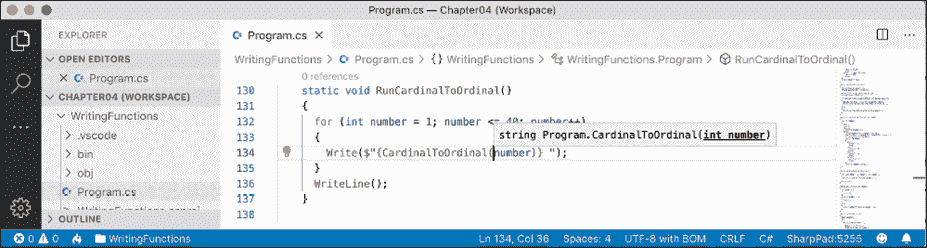
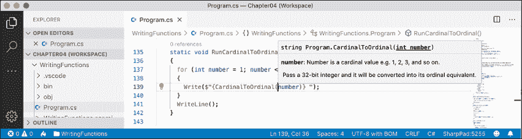
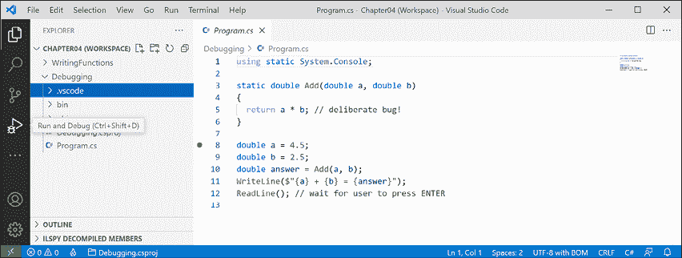
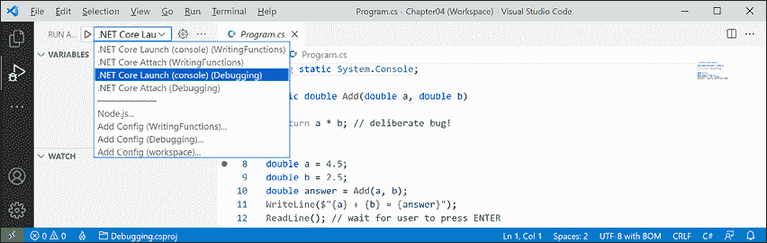
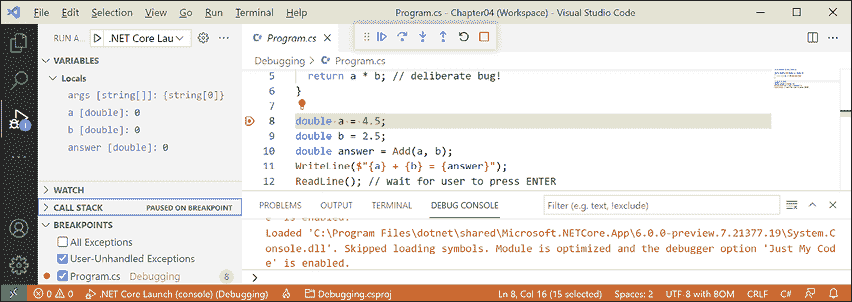
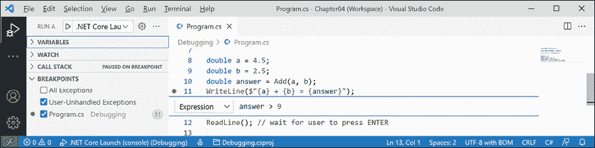
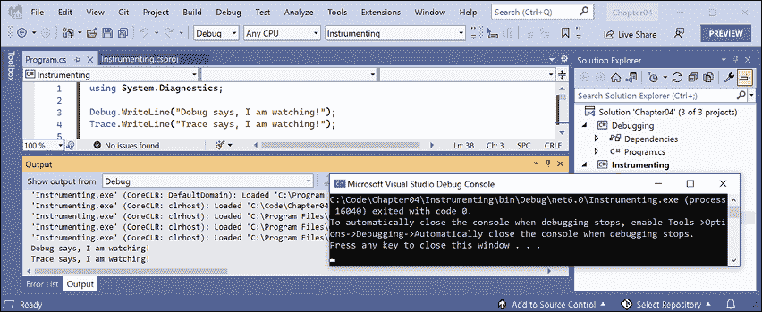
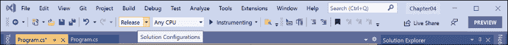
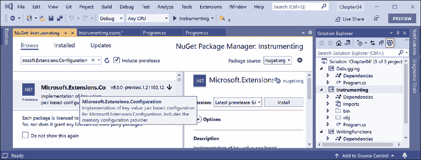
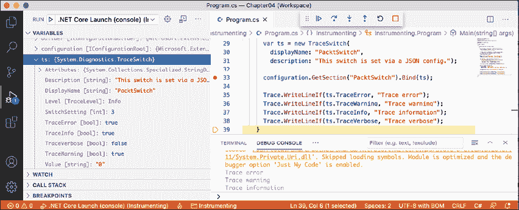

# 四、编写、调试和测试函数

本章介绍如何编写函数以重用代码、在开发过程中调试逻辑错误、在运行时记录异常、对代码进行单元测试以消除错误，以及确保稳定性和可靠性。

本章涵盖以下主题：

*   书写功能
*   开发过程中的调试
*   运行时日志记录
*   单元测试
*   在函数中抛出和捕获异常

# 书写功能

编程的一个基本原则是**不要重复自己**（**干式**）。

在编程时，如果您发现自己一遍又一遍地编写相同的语句，那么将这些语句转换为函数。函数就像完成一个小任务的小程序。例如，您可以编写一个函数来计算销售税，然后在财务应用程序的许多地方重用该函数。

与程序一样，函数通常有输入和输出。它们有时被描述为黑匣子，在黑匣子的一端喂入一些原材料，另一端出现一个制成品。一旦创建，您就不需要考虑它们是如何工作的。

## 时刻表示例

假设您希望帮助您的孩子学习他们的时刻表，因此您希望能够轻松地为数字生成时刻表，例如 12 时刻表：

```cs
1 x 12 = 12
2 x 12 = 24
...
12 x 12 = 144 
```

您之前在本书前面已经了解了`for`语句，因此您知道当存在规则模式时，可以使用它生成重复的输出行，如 12 倍表，如下代码所示：

```cs
for (int row = 1; row <= 12; row++)
{
  Console.WriteLine($"{row} x 12 = {row * 12}");
} 
```

但是，我们不想输出 12 倍表，而是想让它更灵活，这样它就可以输出任意数字的时间表。我们可以通过创建一个函数来实现这一点。

### 编写一个 times 表函数

让我们通过创建一个函数来探索函数，以输出数字 0 到 255 乘以 1 到 12 的任意时刻表：

1.  使用您首选的编码工具创建新的控制台应用程序，如下表所示：
    1.  项目模板：**控制台应用**/`console`
    2.  工作区/解决方案文件和文件夹：`Chapter04`
    3.  项目文件和文件夹：`WritingFunctions`
2.  静态导入`System.Console`。
3.  In `Program.cs`, write statements to define a function named `TimesTable`, as shown in the following code:

    ```cs
    static void TimesTable(byte number)
    {
      WriteLine($"This is the {number} times table:");
      for (int row = 1; row <= 12; row++)
      {
        WriteLine($"{row} x {number} = {row * number}");
      }
      WriteLine();
    } 
    ```

    在上述代码中，请注意以下事项：

    *   `TimesTable`必须有一个`byte`值作为名为`number`的参数传递给它。
    *   `TimesTable`是一个`static`方法，因为它将被`static`方法`Main`调用。
    *   `TimesTable`没有向调用者返回值，因此在其名称前用`void`关键字声明。
    *   `TimesTable`使用`for`语句输出传递给它的`number`的时刻表。
4.  After the statement that statically imports the `Console` class and before the `TimesTable` function, call the function and pass in a `byte` value for the `number` parameter, for example, `6`, as shown highlighted in the following code:

    ```cs
    using static System.Console;
    **TimesTable(****6****);** 
    ```

    **良好实践**：如果一个函数有一个或多个参数，而仅仅传递值可能无法提供足够的含义，那么您可以选择指定参数的名称及其值，如以下代码所示：`TimesTable(number: 6)`。

5.  运行代码，然后查看结果，如以下输出所示：

    ```cs
    This is the 6 times table:
    1 x 6 = 6
    2 x 6 = 12
    3 x 6 = 18
    4 x 6 = 24
    5 x 6 = 30
    6 x 6 = 36
    7 x 6 = 42
    8 x 6 = 48
    9 x 6 = 54
    10 x 6 = 60
    11 x 6 = 66
    12 x 6 = 72 
    ```

6.  将传递到`TimesTable`函数的数字更改为`0`和`255`之间的其他`byte`值，并确认输出时间表正确。
7.  请注意，如果您尝试传递非`byte`编号，例如`int`或`double`或`string`，则返回错误，如以下输出所示：

    ```cs
    Error: (1,12): error CS1503: Argument 1: cannot convert from 'int' to 'byte' 
    ```

## 编写返回值的函数

之前的函数执行了操作（循环和写入控制台），但没有返回值。假设您需要计算销售或增值税（VAT）。在欧洲，增值税税率从瑞士的 8%到匈牙利的 27%不等。在美国，俄勒冈州的销售税从 0%到加利福尼亚州的 8.25%不等。

税率一直在变化，并且根据许多因素而变化。你不需要联系我就可以告诉我弗吉尼亚州的税率是 6%。非常感谢。

让我们实现一个函数来计算世界各地的税收：

1.  Add a function named `CalculateTax`, as shown in the following code:

    ```cs
    static decimal CalculateTax(
      decimal amount, string twoLetterRegionCode)
    {
      decimal rate = 0.0M;
      switch (twoLetterRegionCode)
      {
        case "CH": // Switzerland
          rate = 0.08M;
          break;
        case "DK": // Denmark
        case "NO": // Norway
          rate = 0.25M;
          break;
        case "GB": // United Kingdom
        case "FR": // France
          rate = 0.2M;
          break;
        case "HU": // Hungary
          rate = 0.27M;
          break;
        case "OR": // Oregon
        case "AK": // Alaska
        case "MT": // Montana
          rate = 0.0M;
          break;
        case "ND": // North Dakota
        case "WI": // Wisconsin
        case "ME": // Maine
        case "VA": // Virginia
          rate = 0.05M;
          break;
        case "CA": // California
          rate = 0.0825M;
          break;
        default: // most US states
          rate = 0.06M;
          break;
      }
      return amount * rate;
    } 
    ```

    在前面的代码中，注意以下几点：

    *   `CalculateTax`有两个输入：一个名为`amount`的参数表示花费的金额，另一个名为`twoLetterRegionCode`的参数表示花费金额所在的区域。
    *   `CalculateTax`将使用`switch`报表进行计算，然后将该金额所欠的增值税或增值税作为`decimal`值返还；因此，在函数名之前，我们已经声明返回值的数据类型为`decimal`。
2.  注释掉`TimesTable`方法调用，调用`CalculateTax`方法，传递`149`等金额值和`FR`等有效区号，如下代码所示：

    ```cs
    // TimesTable(6);
    decimal taxToPay = CalculateTax(amount: 149, twoLetterRegionCode: "FR"); 
    WriteLine($"You must pay {taxToPay} in tax."); 
    ```

3.  运行代码并查看结果，如以下输出所示：

    ```cs
    You must pay 29.8 in tax. 
    ```

我们可以使用`{taxToPay:C}`将`taxToPay`输出格式化为货币，但它将使用您当地的文化来决定如何格式化货币符号和小数。例如，在英国，我会看到`£29.80`。

你能想到写的`CalculateTax`函数有什么问题吗？如果用户输入诸如`fr`或`UK`之类的代码，会发生什么情况？如何重写函数以改进它？用`switch`*表达式*代替`switch`*语句*会更清晰吗？

## 将数字从基数转换为序数

用于计数的数字被称为基数数字，例如1、2 和 3，而用于排序的数字是**序数**数字，例如，1、2 和 3。让我们创建一个将基数转换为序数的函数：

1.  Write a function named `CardinalToOrdinal` that converts a cardinal `int` value into an ordinal `string` value; for example, it converts 1 into 1st, 2 into 2nd, and so on, as shown in the following code:

    ```cs
    static string CardinalToOrdinal(int number)
    {
      switch (number)
      {
        case 11: // special cases for 11th to 13th
        case 12:
        case 13:
          return $"{number}th";
        default:
          int lastDigit = number % 10;
          string suffix = lastDigit switch
          {
            1 => "st",
            2 => "nd",
            3 => "rd",
            _ => "th"
          };
          return $"{number}{suffix}";
      }
    } 
    ```

    根据上述代码，请注意以下事项：

    *   `CardinalToOrdinal`有一个输入：`int`类型的参数名为`number`，一个输出：`string`类型的返回值。
    *   使用`switch`*语句*处理 11、12、13 的特殊情况。
    *   一个`switch`*表达式*则处理所有其他情况：如果最后一位数字为 1，则使用`st`作为后缀；如果最后一位为 2，则使用`nd`作为后缀；如果最后一位为 3，则使用`rd`作为后缀；如果最后一个数字是其他数字，则使用`th`作为后缀。
2.  编写一个名为`RunCardinalToOrdinal`的函数，使用`for`语句从 1 循环到 40，对每个数字调用`CardinalToOrdinal`函数，并将返回的`string`写入控制台，以空格分隔，如下代码所示：

    ```cs
    static void RunCardinalToOrdinal()
    {
      for (int number = 1; number <= 40; number++)
      {
        Write($"{CardinalToOrdinal(number)} ");
      }
      WriteLine();
    } 
    ```

3.  注释掉`CalculateTax`语句，调用`RunCardinalToOrdinal`方法，如下代码所示：

    ```cs
    // TimesTable(6);
    // decimal taxToPay = CalculateTax(amount: 149, twoLetterRegionCode: "FR"); 
    // WriteLine($"You must pay {taxToPay} in tax.");
    RunCardinalToOrdinal(); 
    ```

4.  运行代码并查看结果，如以下输出所示：

    ```cs
    1st 2nd 3rd 4th 5th 6th 7th 8th 9th 10th 11th 12th 13th 14th 15th 16th 17th 18th 19th 20th 21st 22nd 23rd 24th 25th 26th 27th 28th 29th 30th 31st 32nd 33rd 34th 35th 36th 37th 38th 39th 40th 
    ```

## 用递归计算阶乘

5 的阶乘是 120，因为阶乘的计算方法是将起始数乘以比自身小的一，然后再乘以比自身小的一，依此类推，直到该数减为 1。这里可以看到一个例子：5x4x3x2x1=120。

阶乘是这样写的：5！，感叹号读作 bang，so 5！=120，也就是说，*五次爆炸等于一百二十次*。Bang 是阶乘的一个好名字，因为它们的大小增长非常快，就像爆炸一样。

我们将编写一个名为`Factorial`的函数；这将计算作为参数传递给它的`int`的阶乘。我们将使用一种称为**递归**的巧妙技术，这意味着在其实现中直接或间接调用自身的函数：

1.  Add a function named `Factorial`, and a function to call it, as shown in the following code:

    ```cs
    static int Factorial(int number)
    {
      if (number < 1)
      {
        return 0;
      }
      else if (number == 1)
      {
        return 1;
      }
      else
      {
        return number * Factorial(number - 1);
      }
    } 
    ```

    如前所述，上述代码中有几个值得注意的元素，包括：

    *   如果输入参数`number`为零或负，`Factorial`返回`0`。
    *   如果输入参数`number`为`1`，则`Factorial`返回`1`，因此停止自身调用。
    *   如果输入参数`number`大于一（在所有其他情况下都是如此），则`Factorial`将该数字乘以调用自身并传递一个小于`number`的结果。这使得函数递归。

    **更多信息**：递归很聪明，但它可能会导致问题，例如由于每次函数调用都使用内存来存储数据，导致函数调用过多而导致堆栈溢出，最终会使用过多的内存。在 C# 等语言中，迭代是一种更实用、更简洁的解决方案。您可以通过以下链接了解更多信息：[https://en.wikipedia.org/wiki/Recursion_（计算机科学）# 递归与迭代](https://en.wikipedia.org/wiki/Recursion_(computer_science)# Recursion_versus_iteration)。

1.  添加一个名为`RunFactorial`的函数，该函数使用`for`语句输出数字从 1 到 14 的阶乘，在其循环中调用`Factorial`函数，然后输出结果，使用代码`N0`格式化，即数字格式使用小数点后零位的千位分隔符，如以下代码所示：

    ```cs
    static void RunFactorial()
    {
      for (int i = 1; i < 15; i++)
      {
        WriteLine($"{i}! = {Factorial(i):N0}");
      }
    } 
    ```

2.  注释掉`RunCardinalToOrdinal`方法调用并调用`RunFactorial`方法。
3.  运行代码并查看结果，如以下输出所示：

    ```cs
    1! = 1
    2! = 2
    3! = 6
    4! = 24
    5! = 120
    6! = 720
    7! = 5,040
    8! = 40,320
    9! = 362,880
    10! = 3,628,800
    11! = 39,916,800
    12! = 479,001,600
    13! = 1,932,053,504
    14! = 1,278,945,280 
    ```

这在之前的输出中并不明显，但是 13 和更高的阶乘溢出了`int`类型，因为它们太大了。12! 是 479001600，大约是 5 亿。`int`变量中可存储的最大正值约为 20 亿。13! 是 6227020800，约为 60 亿，当存储在 32 位整数中时，它会无声地溢出，而不会显示任何问题。

您还记得我们可以做些什么来得到数字溢出的通知吗？

当发生溢出时，您应该如何获得通知？当然，我们可以用 13 分钟解决这个问题！还有 14 个！通过使用`long`（64 位整数）而不是`int`（32 位整数），我们将很快再次达到溢出限制。

本节的重点是了解数字可能溢出，以及如何显示而不是忽略它，而不是具体如何计算高于 12！的阶乘！。

1.  修改`Factorial`功能检查溢出，如下代码中突出显示：

    ```cs
    **checked** **// for overflow**
    **{**
      return number * Factorial(number - 1);
    **}** 
    ```

2.  在调用`Factorial`函数时，修改`RunFactorial`函数处理溢出异常，如下代码所示：

    ```cs
    **try**
    **{**
      WriteLine($"{i}! = {Factorial(i):N0}");
    **}**
    **catch (System.OverflowException)**
    **{**
     **WriteLine(****$"****{i}****! is too big for a 32-bit integer."****);**
    **}** 
    ```

3.  运行代码并查看结果，如以下输出所示：

    ```cs
    1! = 1
    2! = 2
    3! = 6
    4! = 24
    5! = 120
    6! = 720
    7! = 5,040
    8! = 40,320
    9! = 362,880
    10! = 3,628,800
    11! = 39,916,800
    12! = 479,001,600
    13! is too big for a 32-bit integer.
    14! is too big for a 32-bit integer. 
    ```

## 用 XML 注释记录函数

默认情况下，调用`CardinalToOrdinal`等函数时，代码编辑器会显示一个包含基本信息的工具提示，如*图 4.1*所示：

<figure class="mediaobject"></figure>

图 4.1：显示默认简单方法签名的工具提示

让我们通过添加额外信息来改进工具提示：

1.  如果您使用的 Visual Studio 代码具有**C**扩展名，则应导航到**视图****命令调色板****首选项：打开设置（UI）**，然后搜索`formatOnType`并确保已启用。C# XML 文档注释是 VisualStudio2022 的内置功能。
2.  在`CardinalToOrdinal`函数上方的一行中，键入三个前斜杠`///`，注意它们被扩展为一个 XML 注释，该注释识别函数有一个名为`number`的参数。
3.  为 XML 文档注释输入适当的信息以进行摘要，并描述输入参数和`CardinalToOrdinal`函数的返回值，如所示以下代码：

    ```cs
    /// <summary>
    /// Pass a 32-bit integer and it will be converted into its ordinal equivalent.
    /// </summary>
    /// <param name="number">Number is a cardinal value e.g. 1, 2, 3, and so on.</param>
    /// <returns>Number as an ordinal value e.g. 1st, 2nd, 3rd, and so on.</returns> 
    ```

4.  现在，在调用该函数时，会看到更多的细节，如*图 4.2*：

    <figure class="mediaobject"></figure>

    所示

图 4.2：显示更详细方法签名的工具提示

在撰写第六版时，C# XML 文档注释在.NET 交互式笔记本中不起作用。

**良好实践**：向所有函数添加 XML 文档注释。

## 在函数实现中使用 lambda

F# 是微软的强类型函数式第一编程语言，它与 C# 一样编译成 IL，由.NET 执行。从 lambda 演算演变而来的函数语言；仅基于函数的计算系统。代码看起来更像数学函数，而不是配方中的步骤。

函数式语言的一些重要属性在以下列表中定义：

*   **模块化**：用 C# 定义函数的好处同样适用于函数式语言。将大型复杂代码库分解为更小的部分。
*   **不变性**：C# 意义上的变量不存在。函数中的任何数据值都不能更改。相反，可以从现有数据值创建新的数据值。这减少了 bug。
*   **可维护性**：代码越来越清晰（对于有数学倾向的程序员来说！）。

自 C# 6 以来，微软一直致力于为该语言添加功能，以支持更具功能性的方法。以为例，在 C# 7 中添加**元组**和**模式匹配**，在 C# 8 中添加**非空引用类型**，在 C# 9 中改进模式匹配并添加记录，即**不可变对象**。

在 C# 6 中，微软增加了对**表达式体功能成员**的支持。现在我们来看一个例子。

数字的**斐波那契序列**总是以 0 和 1 开头。然后使用将前两个数字相加的规则生成序列的其余部分，如以下数字序列所示：

```cs
0 1 1 2 3 5 8 13 21 34 55 ... 
```

序列中的下一项是 34+55，即 89。

我们将使用斐波那契序列来说明命令式函数和声明式函数实现之间的区别：

1.  添加一个名为`FibImperative`的函数，该函数将以命令式风格编写，如下代码所示：

    ```cs
    static int FibImperative(int term)
    {
      if (term == 1)
      {
        return 0;
      }
      else if (term == 2)
      {
        return 1;
      }
      else
      {
        return FibImperative(term - 1) + FibImperative(term - 2);
      }
    } 
    ```

2.  添加一个名为`RunFibImperative`的函数，在循环从 1 到 30 的`for`语句中调用`FibImperative`，如下代码所示：

    ```cs
    static void RunFibImperative()
    {
      for (int i = 1; i <= 30; i++)
      {
        WriteLine("The {0} term of the Fibonacci sequence is {1:N0}.",
          arg0: CardinalToOrdinal(i),
          arg1: FibImperative(term: i));
      }
    } 
    ```

3.  注释掉其他方法调用并调用`RunFibImperative`方法。
4.  运行代码并查看结果，如以下输出所示：

    ```cs
    The 1st term of the Fibonacci sequence is 0.
    The 2nd term of the Fibonacci sequence is 1.
    The 3rd term of the Fibonacci sequence is 1.
    The 4th term of the Fibonacci sequence is 2.
    The 5th term of the Fibonacci sequence is 3.
    The 6th term of the Fibonacci sequence is 5.
    The 7th term of the Fibonacci sequence is 8.
    The 8th term of the Fibonacci sequence is 13.
    The 9th term of the Fibonacci sequence is 21.
    The 10th term of the Fibonacci sequence is 34.
    The 11th term of the Fibonacci sequence is 55.
    The 12th term of the Fibonacci sequence is 89.
    The 13th term of the Fibonacci sequence is 144.
    The 14th term of the Fibonacci sequence is 233.
    The 15th term of the Fibonacci sequence is 377.
    The 16th term of the Fibonacci sequence is 610.
    The 17th term of the Fibonacci sequence is 987.
    The 18th term of the Fibonacci sequence is 1,597.
    The 19th term of the Fibonacci sequence is 2,584.
    The 20th term of the Fibonacci sequence is 4,181.
    The 21st term of the Fibonacci sequence is 6,765.
    The 22nd term of the Fibonacci sequence is 10,946.
    The 23rd term of the Fibonacci sequence is 17,711.
    The 24th term of the Fibonacci sequence is 28,657.
    The 25th term of the Fibonacci sequence is 46,368.
    The 26th term of the Fibonacci sequence is 75,025.
    The 27th term of the Fibonacci sequence is 121,393.
    The 28th term of the Fibonacci sequence is 196,418.
    The 29th term of the Fibonacci sequence is 317,811.
    The 30th term of the Fibonacci sequence is 514,229. 
    ```

5.  添加一个名为`FibFunctional`的函数以声明式编写，如下代码所示：

    ```cs
    static int FibFunctional(int term) => 
      term switch
      {
        1 => 0,
        2 => 1,
        _ => FibFunctional(term - 1) + FibFunctional(term - 2)
      }; 
    ```

6.  添加一个函数，在循环从 1 到 30 的`for`语句中调用它，如下代码所示：

    ```cs
    static void RunFibFunctional()
    {
      for (int i = 1; i <= 30; i++)
      {
        WriteLine("The {0} term of the Fibonacci sequence is {1:N0}.",
          arg0: CardinalToOrdinal(i),
          arg1: FibFunctional(term: i));
      }
    } 
    ```

7.  注释掉`RunFibImperative`方法调用，并调用`RunFibFunctional`方法。
8.  运行代码并查看结果（与之前相同）。

# 开发过程中的调试

在本节中，您将学习如何在开发时调试问题。必须使用具有调试工具（如 Visual Studio 或 Visual Studio 代码）的代码编辑器。在撰写本文时，您无法使用.NET 交互式笔记本调试代码，但这将在将来添加。

**更多信息**：有些人觉得为 Visual Studio 代码设置 OmniSharp 调试器很棘手。我已经包含了最常见问题的说明，但是如果您仍然有问题，请尝试阅读以下链接中的信息：[https://github.com/OmniSharp/omnisharp-vscode/blob/master/debugger.md](https://github.com/OmniSharp/omnisharp-vscode/blob/master/debugger.md)

## 创建带有故意错误的代码

让我们通过创建一个带有故意错误的控制台应用程序来探索调试，然后我们将使用代码编辑器中的调试器工具来跟踪和修复：

1.  使用您首选的编码工具将新的**控制台应用程序**添加到名为`Debugging`的`Chapter04`工作区/解决方案中。
2.  在 Visual Studio 代码中，选择`Debugging`作为活动的 OmniSharp 项目。当您看到弹出警告消息说所需资产丢失时，单击**是**添加它们。
3.  在 Visual Studio 中，将解决方案的启动项目设置为当前选择。
4.  在`Program.cs`中，添加一个带有故意 bug 的函数，如下代码所示：

    ```cs
    static double Add(double a, double b)
    {
      return a * b; // deliberate bug!
    } 
    ```

5.  在`Add`函数下面，编写语句来声明和设置一些变量，然后使用 buggy 函数将它们添加到一起，如下代码所示：

    ```cs
    double a = 4.5;
    double b = 2.5;
    double answer = Add(a, b); 
    WriteLine($"{a} + {b} = {answer}");
    WriteLine("Press ENTER to end the app.");
    ReadLine(); // wait for user to press ENTER 
    ```

6.  运行 console 应用程序并查看结果，如以下部分输出所示：

    ```cs
    4.5 + 2.5 = 11.25 
    ```

但是等等，有一只虫子！添加到 2.5 的 4.5 应该是 7，而不是 11.25！

我们将使用调试工具来搜寻和挤压缺陷。

## 设置断点并开始调试

断点允许我们标记一行代码，以便暂停检查程序状态并查找 bug。

### 使用 VisualStudio2022

让我们设置一个断点，然后使用 Visual Studio 2022 开始调试：

1.  单击声明名为`a`的变量的语句。
2.  Navigate to **Debug** | **Toggle Breakpoint** or press F9\. A red circle will then appear in the margin bar on the left-hand side and the statement will be highlighted in red to indicate that a breakpoint has been set, as shown in *Figure 4.3*:

    <figure class="mediaobject"></figure>

    图 4.3：使用 Visual Studio 2022 切换断点

    可以使用相同的操作关闭断点。也可以在边距中单击鼠标左键以打开和关闭断点，或右键单击断点以查看更多选项，例如删除、禁用或编辑现有断点的条件或操作。

3.  导航至**调试****开始调试**或按 F5。VisualStudio 启动控制台应用程序，然后在遇到断点时暂停。这称为中断模式。出现标题为**局部变量**（显示局部变量的当前值）、**手表 1**（显示您定义的任何手表表达式）、**调用堆栈**、**异常设置**和**即时窗口**的额外窗口。此时会出现**调试**工具栏。接下来要执行的行以黄色突出显示，黄色箭头指向边距栏的行，如*图 4.4*：

    <figure class="mediaobject"></figure>

    所示

图 4.4:VisualStudio2022 中的中断模式

如果您不想了解如何使用 Visual Studio 代码开始调试，则可以跳过下一节，继续使用调试工具栏导航标题为*的部分。*

### 使用 VisualStudio 代码

让我们设置一个断点，然后使用 Visual Studio 代码开始调试：

1.  单击声明名为`a`的变量的语句。
2.  Navigate to **Run** | **Toggle Breakpoint** or press F9\. A red circle will appear in the margin bar on the left-hand side to indicate that a breakpoint has been set, as shown in *Figure 4.5*:

    <figure class="mediaobject"></figure>

    图 4.5：使用 Visual Studio 代码切换断点

    可以使用相同的操作关闭断点。也可以在边距中单击鼠标左键以打开和关闭断点，或单击鼠标右键以查看更多选项，例如删除、编辑或禁用现有断点；或者在断点不存在时添加断点、条件断点或日志点。

    日志点，也称为跟踪点，表示您希望记录一些信息，而不必在该点实际停止执行代码。

3.  导航至**视图****运行**，或在左侧导航栏中点击**运行调试**图标（三角形“播放”按钮和“bug”），如*图 4.5*所示。
4.  At the top of the **DEBUG** window, click on the dropdown to the right of the **Start Debugging** button (green triangular "play" button), and select **.NET Core Launch (console) (Debugging)**, as shown in *Figure 4.6*:

    <figure class="mediaobject"></figure>

    图 4.6：使用 Visual Studio 代码选择要调试的项目

    **良好实践**：如果您在**调试**项目的下拉列表中没有看到选项，那是因为该项目没有需要调试的资产。这些资产存储在`.vscode`文件夹中。要为项目创建`.vscode`文件夹，请导航到**视图****命令调色板**，选择**OmniSharp：选择项目**，然后选择**调试**项目。几秒钟后，当出现提示时，**需要构建和调试的资产在“调试”中丢失。添加它们？**点击**是**添加缺失资产。

5.  At the top of the **DEBUG** window, click the **Start Debugging** button (green triangular "play" button), or navigate to **Run** | **Start Debugging**, or press F5\. Visual Studio Code starts the console application and then pauses when it hits the breakpoint. This is known as break mode. The line that will be executed next is highlighted in yellow, and a yellow block points at the line from the margin bar, as shown in *Figure 4.7*:

    <figure class="mediaobject"></figure>

    图 4.7:VisualStudio 代码中的中断模式

## 使用调试工具栏导航

Visual Studio 代码显示了一个带有按钮的浮动工具栏，以便于访问调试功能。Visual Studio 2022 在其**标准**工具栏中有一个按钮用于启动或继续调试，其余工具则有一个单独的**调试**工具栏。

两者均如*图 4.8*所示，如下表所示：

<figure class="mediaobject"></figure>

图 4.8:VisualStudio2022 和 VisualStudio 代码中的调试工具栏

*   **继续**/F5：此按钮将从当前位置继续运行程序，直到结束或碰到另一个断点。
*   **跨过**/F10、**跨入**/F11、**跨出**/Shift+F11（点上方的蓝色箭头）：这些按钮以各种方式逐步遍历代码语句，稍后您将看到。
*   **重启**/Ctrl 或 Cmd+Shift+F5（圆形箭头）：此按钮将停止，然后立即重启程序，并再次连接调试器。
*   **停止**/Shift+F5（红色方块）：此按钮将停止调试会话。

## 调试窗口

调试时，Visual Studio 代码和 Visual Studio 都会显示额外的窗口，允许您在单步执行代码时监视有用的信息，如变量。

以下列表中介绍了最有用的窗口：

*   **变量**，包括**局部变量**，自动显示任意局部变量的名称、值、类型。在逐步浏览代码时，请注意此窗口。
*   **手表**或**手表 1**，显示手动输入的变量和表达式的值。
*   **调用堆栈**，显示函数调用的堆栈。
*   **断点**，显示所有断点并允许对其进行更精细的控制。

在中断模式下，编辑区域底部还有一个有用的窗口：

*   **调试控制台**或**即时窗口**可与您的代码进行实时交互。例如，您可以通过输入变量名来查询程序状态。例如，您可以通过键入`1+2`并按 Enter 键来询问诸如“1+2 是什么？”之类的问题，如*图 4.9*：

    <figure class="mediaobject"></figure>

    所示

图 4.9：询问程序状态

## 单步执行代码

让我们探索使用 Visual Studio 或 Visual Studio 代码逐步完成代码的一些方法：

1.  导航至**运行/调试****步进**，或点击工具栏中的**步进**按钮，或按 F11。黄色突出显示向前移动一行。
2.  导航至**运行/调试****单步跳过**，或点击工具栏中的**单步跳过**按钮，或按 F10。黄色突出显示向前移动一行。目前，您可以看到使用**步进**或**步过**没有区别。
3.  You should now be on the line that calls the `Add` method, as shown in *Figure 4.10*:

    <figure class="mediaobject"></figure>

    图 4.10：进入和越过代码

    当您即将执行方法调用时，可以看到**步进**和**步过**之间的差异：

    *   如果您点击**步进**，调试器将*步进*方法，这样您就可以单步通过该方法中的每一行。
    *   如果点击上方的**步骤，整个方法一次执行；它不会跳过方法而不执行它。**
4.  点击**进入**进入方法内部。
5.  将鼠标指针悬停在代码编辑窗口中的`a`或`b`参数上，注意会出现一个显示其当前值的工具提示。
6.  选择表达式`a * b`，右击表达式，选择**添加到手表**或**添加手表**。表达式被添加到**WATCH**窗口中，表示该操作符将`a`乘以`b`得到结果`11.25`。
7.  在**手表**或**手表 1**窗口中，右键单击表达式并选择**删除表达式**或**删除手表**。
8.  通过在`Add`函数中将`*`更改为`+`来修复此错误。
9.  通过点击圆形箭头**重启**按钮或按 Ctrl 或 Cmd+Shift+F5 停止调试、重新编译、重启调试。
10.  跨过功能，花一分钟时间记录它现在如何正确计算，然后单击**继续**按钮或按**F5**。
11.  With Visual Studio Code, note that when writing to the console during debugging, the output appears in the **DEBUG CONSOLE** window instead of the **TERMINAL** window, as shown in *Figure 4.11*:

    <figure class="mediaobject"></figure>

    图 4.11：调试期间写入调试控制台

## 自定义断点

很容易生成更复杂的断点：

1.  如果仍在调试，请单击调试工具栏中的**停止**按钮，或导航到**运行/调试**|**停止调试**，或按 Shift+F5。
2.  导航至**运行****删除所有断点**或**调试****删除所有断点**。
3.  点击输出答案的`WriteLine`语句。
4.  按 F9 键或导航到**运行/调试****切换断点**设置断点。
5.  In Visual Studio Code, right-click the breakpoint and choose **Edit Breakpoint...**, and then enter an expression, such as the `answer` variable must be greater than 9, and note the expression must evaluate to true for the breakpoint to activate, as shown in *Figure 4.12*:

    <figure class="mediaobject"></figure>

    图 4.12：使用 Visual Studio 代码使用表达式自定义断点

6.  在 Visual Studio 中，右键单击断点并选择**条件。。。**，然后输入一个表达式，如`answer`变量必须大于 9，注意表达式的计算结果必须为 true，断点才能激活。
7.  开始调试并注意未命中断点。
8.  停止调试。
9.  编辑断点或其条件，并将其表达式更改为小于 9。
10.  开始调试并注意断点已命中。
11.  停止调试。
12.  Edit the breakpoint or its conditions, (in Visual Studio click **Add condition**) and select **Hit Count**, then enter a number such as `3`, meaning that you would have to hit the breakpoint three times before it activates, as shown in *Figure 4.13*:

    <figure class="mediaobject"></figure>

    图 4.13：使用 Visual Studio 2022 使用表达式和热计数自定义断点

13.  Hover your mouse over the breakpoint's red circle to see a summary, as shown in *Figure 4.14*:

    <figure class="mediaobject"></figure>

    图 4.14:VisualStudio 代码中自定义断点的摘要

您现在已经使用一些调试工具修复了一个 bug，并看到了设置断点的一些高级可能性。

# 开发和运行期间的日志记录

一旦您相信代码中的所有 bug 都已被删除，您将编译一个发布版本并部署应用程序，以便人们可以使用它。但是，没有任何代码是没有 bug 的，并且在运行时可能会发生意外错误。

众所周知，最终用户不善于记住、承认并准确描述错误发生时他们在做什么，因此您不应该依赖他们准确地提供有用的信息来重现问题，以了解问题的原因，然后修复问题。相反，您可以**插入代码**，这意味着记录感兴趣的事件。

**良好实践**：在整个应用程序中添加代码以记录正在发生的事情，尤其是发生异常时，这样您就可以查看日志并使用它们跟踪问题并修复问题。虽然我们将在*第 10 章*、*使用实体框架核心*处理数据、以及*第 15 章*使用模型-视图-控制器模式构建网站中再次看到日志记录，但日志记录是一个庞大的主题，因此我们只能在本书中介绍基础知识。

## 了解日志记录选项

.NET 包括一些内置的方法，通过添加日志功能来检测代码。我们将在本书中介绍基本知识。但在日志记录领域，第三方创造了一个功能强大的解决方案丰富的生态系统，扩展了微软提供的功能。我不能提出具体的建议，因为最好的日志框架取决于您的需要。但我在下面的列表中列出了一些常见的问题：

*   ApacheLog4Net
*   NLog
*   塞里洛格

## 检测调试和跟踪

有两种类型可以使用向代码中添加简单的日志记录：`Debug`和`Trace`。

在我们更详细地研究它们之前，让我们先来看看每一个的简要概述：

*   `Debug`类用于添加仅在开发期间写入的日志记录。
*   `Trace`类用于添加在开发和运行时编写的日志记录。

您已经看到了`Console`类型及其`WriteLine`方法写入控制台窗口的用法。还有一对名为`Debug`和`Trace`的类型，它们在写入的位置上具有更大的灵活性。

`Debug`和`Trace`类写入任何跟踪侦听器。跟踪侦听器是一种类型，当调用`WriteLine`方法时，可以将其配置为在任意位置写入输出。NET 提供了几个跟踪侦听器，包括一个输出到控制台的跟踪侦听器，您甚至可以通过继承`TraceListener`类型来创建自己的跟踪侦听器。

### 写入默认跟踪侦听器

一个跟踪监听器`DefaultTraceListener`类自动配置并写入 Visual Studio 代码的**调试控制台**窗口或 Visual Studio 的**调试**窗口。您可以使用代码配置其他跟踪侦听器。

让我们看看跟踪侦听器的作用：

1.  使用您首选的编码工具将新的**控制台应用程序**添加到名为`Instrumenting`的`Chapter04`工作区/解决方案中。
2.  在 Visual Studio 代码中，选择`Instrumenting`作为活动的 OmniSharp 项目。当您看到弹出警告消息说所需资产丢失时，单击**是**添加它们。
3.  在`Program.cs`中，导入`System.Diagnostics`名称空间。
4.  编写来自`Debug`和`Trace`类的消息，如下代码所示：

    ```cs
    Debug.WriteLine("Debug says, I am watching!");
    Trace.WriteLine("Trace says, I am watching!"); 
    ```

5.  在 Visual Studio 中，导航到**查看****输出**，并确保选择了**显示输出自：****调试**。
6.  Start debugging the `Instrumenting` console application, and note that **DEBUG CONSOLE** in Visual Studio Code or the **Output** window in Visual Studio 2022 shows the two messages, mixed with other debugging information, such as loaded assembly DLLs, as shown in *Figures 4.15* and *4.16*:

    <figure class="mediaobject"></figure>

    图 4.15:VisualStudioCodeDebug 控制台以蓝色显示了这两条消息

    <figure class="mediaobject"></figure>

    图 4.16:VisualStudio2022 输出窗口显示调试输出，包括两条消息

## 配置跟踪侦听器

现在，我们将配置另一个将写入文本文件的跟踪侦听器：

1.  Before the `Debug` and `Trace` calls to `WriteLine`, add a statement to create a new text file on the desktop and pass it into a new trace listener that knows how to write to a text file, and enable automatic flushing for its buffer, as shown highlighted in the following code:

    ```cs
    **// write to a text file in the project folder**
    **Trace.Listeners.Add(****new** **TextWriterTraceListener(**
     **File.CreateText(Path.Combine(Environment.GetFolderPath(**
     **Environment.SpecialFolder.DesktopDirectory),** **"log.txt"****))));**
    **// text writer is buffered, so this option calls**
    **// Flush() on all listeners after writing**
    **Trace.AutoFlush =** **true****;**
    Debug.WriteLine("Debug says, I am watching!");
    Trace.WriteLine("Trace says, I am watching!"); 
    ```

    **良好实践**：表示文件的任何类型通常都会实现缓冲区以提高性能。数据不是立即写入文件，而是写入内存缓冲区，只有在缓冲区已满时，数据才会写入文件的一个块中。这种行为在调试时可能会令人困惑，因为我们不会立即看到结果！启用`AutoFlush`表示每次写入后自动调用`Flush`方法。

2.  在 Visual Studio 代码中，通过在`Instrumenting`项目的**终端**窗口中输入以下命令来运行控制台应用程序的发布配置，并注意不会出现任何情况：

    ```cs
    dotnet run --configuration Release 
    ```

3.  In Visual Studio 2022, in the standard toolbar, select **Release** in the **Solution Configurations** dropdown list, as shown in *Figure 4.17*:

    <figure class="mediaobject"></figure>

    图 4.17：在 Visual Studio 中选择版本配置

4.  在 VisualStudio 2022 中，导航至**调试**|**无调试启动**运行控制台应用程序的发布配置。
5.  在桌面上，打开名为`log.txt`的文件，注意其中包含消息`Trace says, I am watching!`。
6.  在 Visual Studio 代码中，通过在`Instrumenting`项目的**终端**窗口中输入以下命令来运行控制台应用程序的调试配置：

    ```cs
    dotnet run --configuration Debug 
    ```

7.  在 Visual Studio 中，在标准工具栏中，在**解决方案配置**下拉列表中选择**调试**，然后导航到**调试**|**启动调试**运行控制台应用程序。
8.  在桌面上，打开名为`log.txt`的文件，注意它同时包含消息`Debug says, I am watching!`和`Trace says, I am watching!`。

**良好实践**：当使用`Debug`配置运行时，`Debug`和`Trace`都处于活动状态，并将写入任何跟踪侦听器。使用`Release`配置运行时，只有`Trace`会写入任何跟踪侦听器。因此，您可以在整个代码中自由地使用`Debug.WriteLine`调用，因为您知道当您构建应用程序的发布版本时，这些调用将被自动剥离，因此不会影响性能。

## 切换跟踪级别

即使在发布之后，`Trace.WriteLine`调用仍留在代码中。因此，如果能够很好地控制它们的输出时间，那就太好了。这是我们可以通过**跟踪开关**来实现的。

跟踪开关的值可以使用数字或字进行设置。例如，数字`3`可以替换为单词`Info`，如下表所示：

<colgroup><col> <col> <col></colgroup> 
| 数字 | 单词 | 描述 |
| 0 | 关 | 这将不会输出任何内容。 |
| 1. | 错误 | 这将只输出错误。 |
| 2. | 警告 | 这将输出错误和警告。 |
| 3. | 信息 | 这将输出错误、警告和信息。 |
| 4. | 冗长的 | 这将输出所有级别。 |

让我们探索使用跟踪开关。首先，我们将向我们的项目添加一些 NuGet 包，以便能够从 JSON`appsettings`文件加载配置设置。

### 在 Visual Studio 代码中将包添加到项目中

VisualStudio 代码没有向项目添加 NuGet 包的机制，因此我们将使用命令行工具：

1.  导航至`Instrumenting`项目的**终端**窗口。
2.  输入以下命令：

    ```cs
    dotnet add package Microsoft.Extensions.Configuration 
    ```

3.  输入以下命令：

    ```cs
    dotnet add package Microsoft.Extensions.Configuration.Binder 
    ```

4.  输入以下命令：

    ```cs
    dotnet add package Microsoft.Extensions.Configuration.Json 
    ```

5.  Enter the following command:

    ```cs
    dotnet add package Microsoft.Extensions.Configuration.FileExtensions 
    ```

    `dotnet add package`将对 NuGet 包的引用添加到项目文件中。它将在构建过程中下载。`dotnet add reference`将项目对项目的引用添加到项目文件中。如果在构建过程中需要，将编译引用的项目。

### 在 Visual Studio 2022 中将包添加到项目中

VisualStudio 具有用于添加软件包的图形用户界面。

1.  在**解决方案资源管理器**中，右键点击**仪表化**项目，选择**管理 NuGet Packages**。
2.  选择**浏览**选项卡。
3.  在搜索框中，输入`Microsoft.Extensions.Configuration`。
4.  Select each of these NuGet packages and click the **Install** button, as shown in *Figure 4.18*:
    1.  `Microsoft.Extensions.Configuration`
    2.  `Microsoft.Extensions.Configuration.Binder`
    3.  `Microsoft.Extensions.Configuration.Json`
    4.  `Microsoft.Extensions.Configuration.FileExtensions`

    <figure class="mediaobject"></figure>

    图 4.18：使用 Visual Studio 2022 安装 NuGet 软件包

**良好实践**：还有包用于从 XML 文件、INI 文件、环境变量和命令行加载配置。使用最合适的技术在项目中设置配置。

### 审查项目包

添加 NuGet 包后，我们可以看到项目文件中的引用：

1.  打开`Instrumenting.csproj`（双击 Visual Studio**解决方案资源管理器**中的**仪表化**项目），并在`<ItemGroup>`部分记录添加的 NuGet 软件包，如以下标记中突出显示的：

    ```cs
    <Project Sdk="Microsoft.NET.Sdk">
      <PropertyGroup>
        <OutputType>Exe</OutputType>
        <TargetFramework>net6.0</TargetFramework>
        <Nullable>enable</Nullable>
        <ImplicitUsings>enable</ImplicitUsings>
      </PropertyGroup>
     **<ItemGroup>**
     **<PackageReference**
     **Include=****"Microsoft.Extensions.Configuration"**
     **Version=****"6.0.0"** **/>**
     **<PackageReference**
     **Include=****"Microsoft.Extensions.Configuration.Binder"**
     **Version=****"6.0.0"** **/>**
     **<PackageReference**
     **Include=****"Microsoft.Extensions.Configuration.FileExtensions"**
     **Version=****"6.0.0"** **/>**
     **<PackageReference**
     **Include=****"Microsoft.Extensions.Configuration.Json"**
     **Version=****"6.0.0"** **/>**
     **</ItemGroup>**
    </Project> 
    ```

2.  将名为`appsettings.json`的文件添加到`Instrumenting`项目文件夹中。
3.  修改`appsettings.json`定义一个名为`PacktSwitch`的`Level`值的设置，如下代码所示：

    ```cs
    {
      "PacktSwitch": {
        "Level": "Info"
      }
    } 
    ```

4.  在 Visual Studio 2022 中，在**解决方案资源管理器**中，右键单击`appsettings.json`，选择**属性**，然后在**属性**窗口中，将**复制到输出目录**更改为**复制，如果更新**。这是必要的，因为与在项目文件夹中运行控制台应用程序的 Visual Studio 代码不同，Visual Studio 在`Instrumenting\bin\Debug\net6.0`或`Instrumenting\bin\Release\net6.0`中运行控制台应用程序。
5.  在`Program.cs`顶部，导入`Microsoft.Extensions.Configuration`名称空间。
6.  在`Program.cs`的末尾添加一些语句，创建一个配置生成器，在当前文件夹中查找名为`appsettings.json`的文件，构建配置，创建跟踪开关，通过绑定到配置设置其级别，然后输出四个跟踪开关级别，如下代码所示：

    ```cs
    ConfigurationBuilder builder = new();
    builder.SetBasePath(Directory.GetCurrentDirectory())
      .AddJsonFile("appsettings.json", 
        optional: true, reloadOnChange: true);
    IConfigurationRoot configuration = builder.Build(); 
    TraceSwitch ts = new(
      displayName: "PacktSwitch",
      description: "This switch is set via a JSON config."); 
    configuration.GetSection("PacktSwitch").Bind(ts);
    Trace.WriteLineIf(ts.TraceError, "Trace error"); 
    Trace.WriteLineIf(ts.TraceWarning, "Trace warning"); 
    Trace.WriteLineIf(ts.TraceInfo, "Trace information"); 
    Trace.WriteLineIf(ts.TraceVerbose, "Trace verbose"); 
    ```

7.  在`Bind`语句上设置断点。
8.  Start debugging the `Instrumenting` console app.In the **VARIABLES** or **Locals** window, expand the `ts` variable expression, and note that its `Level` is `Off` and its `TraceError`, `TraceWarning`, and so on are all `false`, as shown in *Figure 4.19*:

    <figure class="mediaobject"></figure>

    图 4.19：在 Visual Studio 2022 中查看跟踪开关变量属性

9.  点击**步进**或**步过**按钮或按 F11 或 F10 进入`Bind`方法调用，注意`ts`变量 watch 表达式更新到`Info`级别。
10.  Step into or over the four calls to `Trace.WriteLineIf` and note that all levels up to `Info` are written to the **DEBUG CONSOLE** or **Output - Debug** window, but not `Verbose`, as shown in *Figure 4.20*:

    <figure class="mediaobject"></figure>

    图 4.20:VisualStudio 代码中调试控制台中显示的不同跟踪级别

11.  停止调试。
12.  修改`appsettings.json`将级别设置为`2`，表示警告，如下 JSON 文件所示：

    ```cs
    {
      "PacktSwitch": { 
        "Level": "2"
      }
    } 
    ```

13.  保存更改。
14.  在 Visual Studio 代码中，通过在`Instrumenting`项目的**终端**窗口中输入以下命令来运行控制台应用程序：

    ```cs
    dotnet run --configuration Release 
    ```

15.  在 Visual Studio 中，在标准工具栏中，在**解决方案配置**下拉列表中选择**发布**，然后导航到**调试**|**无调试启动**运行控制台应用程序。
16.  打开名为`log.txt`的文件，注意这次只有跟踪错误和警告级别是四个潜在跟踪级别的输出，如下文本文件所示：

    ```cs
    Trace says, I am watching! 
    Trace error
    Trace warning 
    ```

如果未传递参数，则默认跟踪开关级别为`Off`（0），因此不会输出任何开关级别。

# 单元测试

修复代码中的 bug 是昂贵的。在开发过程中发现 bug 越早，修复 bug 的成本就越低。

单元测试是在开发过程早期发现 bug 的好方法。一些开发人员甚至遵循程序员在编写代码之前应该创建单元测试的原则，这被称为**测试驱动开发**（**TDD**。

微软有一个专有的单元测试框架，称为**MS 测试**。还有一个名为**NUnit**的框架。但是，我们将使用免费的开源第三方框架**xUnit.net**。xUnit 是由建造 NUnit 的同一个团队创建的，但他们修复了以前犯下的错误。xUnit 具有更好的可扩展性和更好的社区支持。

## 了解测试类型

单元测试只是众多测试类型中的一种，如下表所述：

<colgroup><col> <col></colgroup> 
| 测试类型 | 描述 |
| 单元 | 测试最小的代码单元，通常是一个方法或函数。单元测试是在一个与依赖项隔离的代码单元上执行的，如果需要的话，可以模拟它们。每个单元应该有多个测试：一些具有典型输入和预期输出，一些具有测试边界的极端输入值，一些具有故意错误的输入以测试异常处理。 |
| 整合 | 测试较小的单元和较大的组件是否作为单个软件一起工作。有时涉及到与没有源代码的外部组件集成。 |
| 系统 | 测试软件将在其中运行的整个系统环境。 |
| 表演 | 测试软件的性能；例如，您的代码必须在 20 毫秒内将充满数据的网页返回给访问者。 |
| 负载 | 测试您的软件在保持所需性能的同时可以同时处理多少请求，例如，网站的 10000 名并发访问者。 |
| 用户接受度 | 测试用户是否可以使用您的软件愉快地完成他们的工作。 |

## 创建需要测试的类库

首先，我们将创建一个需要测试的函数。我们将在类库项目中创建它。类库是可由其他.NET 应用程序分发和引用的代码包：

1.  使用您喜欢的编码工具将新的**类库**添加到名为`CalculatorLib`的`Chapter04`工作区/解决方案中。`dotnet new`模板名为`classlib`。
2.  将名为`Class1.cs`的文件重命名为`Calculator.cs`。
3.  修改该文件以定义一个`Calculator`类（带有一个故意的 bug！），如下代码所示：

    ```cs
    namespace Packt
    {
      public class Calculator
      {
        public double Add(double a, double b)
        {
          return a * b;
        }
      }
    } 
    ```

4.  编译类库项目：
    1.  在 VisualStudio2022 中，导航到**构建****构建计算器 lib**。
    2.  在 Visual Studio 代码中，在**终端**中输入命令`dotnet build`。
5.  使用您喜欢的编码工具将新的**xUnit 测试项目【C#】**添加到名为`CalculatorLibUnitTests`的`Chapter04`工作区/解决方案中。`dotnet new`模板名为`xunit`。
6.  如果您正在使用 Visual Studio，请在**解决方案资源管理器**中选择`CalculatorLibUnitTests`项目，导航到**项目****添加项目引用……**，选中该框选择`CalculatorLib`项目，然后单击**确定**。
7.  如果您使用的是 Visual Studio 代码，请使用`dotnet add reference`命令或单击名为`CalculatorLibUnitTests.csproj`的文件，并修改配置以添加一个项目组，其中包含对`CalculatorLib`项目的项目引用，如以下标记中突出显示的：

    ```cs
    <Project Sdk="Microsoft.NET.Sdk">
      <PropertyGroup>
        <TargetFramework>net6.0</TargetFramework>
        <Nullable>enable</Nullable>
        <IsPackable>false</IsPackable>
      </PropertyGroup>
      <ItemGroup>
        <PackageReference Include="Microsoft.NET.Test.Sdk" Version="16.10.0" />
        <PackageReference Include="xunit" Version="2.4.1" />
        <PackageReference Include="xunit.runner.visualstudio" Version="2.4.3">
          <IncludeAssets>runtime; build; native; contentfiles; 
            analyzers; buildtransitive</IncludeAssets>
          <PrivateAssets>all</PrivateAssets>
        </PackageReference>
        <PackageReference Include="coverlet.collector" Version="3.0.2">
          <IncludeAssets>runtime; build; native; contentfiles; 
            analyzers; buildtransitive</IncludeAssets>
          <PrivateAssets>all</PrivateAssets>
        </PackageReference>
      </ItemGroup>
     **<ItemGroup>**
     **<ProjectReference**
     **Include=****"..\CalculatorLib\CalculatorLib.csproj"** **/>**
     **</ItemGroup>**
    </Project> 
    ```

8.  建造项目`CalculatorLibUnitTests`项目。

## 编写单元测试

编写良好的单元测试将包括三个部分：

*   **排列**：这部分将声明和实例化输入和输出的变量。
*   **动作**：该部分将执行您正在测试的单元。在我们的例子中，这意味着调用我们想要测试的方法。
*   **断言**：此部分将对输出进行一个或多个断言。断言是一种信念，如果不是真的，则表示测试失败。例如，当添加 2 和 2 时，我们希望结果为 4。

现在，我们将为`Calculator`类编写一些单元测试：

1.  将文件`UnitTest1.cs`重命名为`CalculatorUnitTests.cs`后打开。
2.  在 Visual Studio 代码中，将类重命名为`CalculatorUnitTests`。（重命名文件时，Visual Studio 会提示您重命名该类。）
3.  导入`Packt`名称空间。
4.  将`CalculatorUnitTests`类修改为增加 2 和 2，增加 2 和 3 两种测试方法，如下代码所示：

    ```cs
    using Packt; 
    using Xunit;
    namespace CalculatorLibUnitTests
    {
      public class CalculatorUnitTests
      {
        [Fact]
        public void TestAdding2And2()
        {
          // arrange 
          double a = 2; 
          double b = 2;
          double expected = 4;
          Calculator calc = new();
          // act
          double actual = calc.Add(a, b);
          // assert
          Assert.Equal(expected, actual);
        }
        [Fact]
        public void TestAdding2And3()
        {
          // arrange 
          double a = 2; 
          double b = 3;
          double expected = 5;
          Calculator calc = new();
          // act
          double actual = calc.Add(a, b);
          // assert
          Assert.Equal(expected, actual);
        }
      }
    } 
    ```

### 使用 VisualStudio 代码运行单元测试

现在我们已经准备好运行单元测试，并看到结果：

1.  在`CalculatorLibUnitTest`项目的**终端**窗口中，运行测试，如下命令所示：

    ```cs
    dotnet test 
    ```

2.  Note that the results indicate that two tests ran, one test passed, and one test failed, as shown in *Figure 4.21*:

    <figure class="mediaobject"></figure>

    图 4.21:Visual Studio 代码终端中的单元测试结果

### 使用 VisualStudio 运行单元测试

现在我们已经准备好运行单元测试并查看结果：

1.  导航至**测试****运行所有测试**。
2.  在**测试资源管理器**中，注意结果表明运行了两个测试，一个测试通过，一个测试失败，如*图 4.22*：

    <figure class="mediaobject"></figure>

    所示

图 4.22:VisualStudio2022 的测试浏览器中的单元测试结果

### 修复错误

现在，您可以修复该错误：

1.  修复`Add`方法中的错误。
2.  再次运行单元测试，看看 bug 现在已经修复，并且两个测试都通过了。

# 在函数中抛出和捕获异常

在*第 3 章**中*控制流、转换类型、处理异常*中，向您介绍了异常以及如何使用`try-catch`语句处理异常。但是，只有当您有足够的信息来缓解问题时，才应该捕获并处理异常。如果没有，那么应该允许异常通过调用堆栈向上传递到更高的级别。*

## 了解使用错误和执行错误

**使用错误**are 当程序员误用函数时，通常通过传递无效值作为参数。程序员可以通过更改代码来传递有效值来避免这些错误。当一些程序员第一次学习 C# 和.NET 时，他们有时认为异常总是可以避免的，因为他们认为所有的错误都是使用错误。应在生产运行时之前修复所有使用错误。

**执行错误**是指运行时发生的无法通过编写“更好”代码修复的事情。执行错误可以被分为**程序错误**和**系统错误**。如果您试图访问网络资源，但网络已关闭，则需要能够通过记录异常来处理该系统错误，并可能会退出一段时间，然后重试。但是一些系统错误，例如内存不足，根本无法处理。如果您试图打开一个不存在的文件，您可能能够捕获该错误，并通过创建一个新文件以编程方式进行处理。程序错误可以通过编写智能代码以编程方式修复。系统错误通常无法通过编程方式修复。

## 函数中通常抛出异常

很少应该定义新类型的异常以指示使用错误。NET 已经定义了许多您应该使用的。

使用参数定义自己的函数时，代码应检查参数值，如果参数值的值会妨碍函数正常运行，则引发异常。

例如，如果参数不应为`null`，则抛出`ArgumentNullException`。对于其他问题，抛出`ArgumentException`、`NotSupportedException`或`InvalidOperationException`。对于任何异常，请包含一条消息，该消息描述了问题，供必须阅读该问题的人（通常是类库和函数的开发人员读者，如果是 GUI 应用程序的最高级别，则为最终用户），如以下代码所示：

```cs
static void Withdraw(string accountName, decimal amount)
{
  if (accountName is null)
  {
    throw new ArgumentNullException(paramName: nameof(accountName));
  }
  if (amount < 0)
  {
    throw new ArgumentException(
      message: $"{nameof(amount)} cannot be less than zero.");
  }
  // process parameters
} 
```

好实践：如果函数不能成功地执行其操作，则应该考虑函数失败并通过抛出异常来报告它。

您永远不需要编写`try-catch`语句来捕获这些使用类型错误。您希望应用程序终止。这些异常会导致调用函数的程序员修复代码以防止出现问题。在生产部署之前，应将其固定。这并不意味着您的代码不需要抛出使用错误类型异常。您应该强制其他程序员正确调用您的函数！

## 理解调用堆栈

NET 控制台应用程序的入口点是`Program`类的`Main`方法，无论您是否明确定义了该类和方法，或者它是否由顶级程序功能为您创建。

`Main`方法会调用其他方法，调用其他方法等等，这些方法可以在当前项目中，也可以在引用的项目和 NuGet 包中，如*图 4.23*所示：

<figure class="mediaobject"></figure>

图 4.23：创建调用堆栈的方法调用链

让我们创建一个类似的方法链来探索我们可以在哪里捕获和处理异常：

1.  使用您喜欢的编码工具将新的**类库**添加到名为`CallStackExceptionHandlingLib`的`Chapter04`工作区/解决方案中。
2.  将`Class1.cs`文件重命名为`Calculator.cs`。
3.  打开`Calculator.cs`并修改其内容，如下代码所示：

    ```cs
    using static System.Console;
    namespace Packt;
    public class Calculator
    {
      public static void Gamma() // public so it can be called from outside
      {
        WriteLine("In Gamma");
        Delta();
      }
      private static void Delta() // private so it can only be called internally
      {
        WriteLine("In Delta");
        File.OpenText("bad file path");
      }
    } 
    ```

4.  使用您首选的编码工具将新的**控制台应用程序**添加到名为`CallStackExceptionHandling`的`Chapter04`工作区/解决方案中。
5.  在 Visual Studio 代码中，选择`CallStackExceptionHandling`作为活动的 OmniSharp 项目。当您看到弹出警告消息说所需资产丢失时，单击**是**添加它们。
6.  在`CallStackExceptionHandling`项目中，添加对`CallStackExceptionHandlingLib`项目的引用。
7.  在`Program.cs`中，添加语句定义两个方法和对它们的链式调用，类库中的方法，如下代码所示：

    ```cs
    using Packt;
    using static System.Console;
    WriteLine("In Main");
    Alpha();
    static void Alpha()
    {
      WriteLine("In Alpha");
      Beta();
    }
    static void Beta()
    {
      WriteLine("In Beta");
      Calculator.Gamma();
    } 
    ```

8.  运行控制台应用程序，并记录结果，如以下部分输出所示：

    ```cs
    In Main
    In Alpha
    In Beta
    In Gamma
    In Delta
    Unhandled exception. System.IO.FileNotFoundException: Could not find file 'C:\Code\Chapter04\CallStackExceptionHandling\bin\Debug\net6.0\bad file path'.
       at Microsoft.Win32.SafeHandles.SafeFileHandle.CreateFile(...
       at Microsoft.Win32.SafeHandles.SafeFileHandle.Open(...
       at System.IO.Strategies.OSFileStreamStrategy..ctor(...
       at System.IO.Strategies.FileStreamHelpers.ChooseStrategyCore(...
       at System.IO.Strategies.FileStreamHelpers.ChooseStrategy(...
       at System.IO.StreamReader.ValidateArgsAndOpenPath(...
       at System.IO.File.OpenText(String path) in ...
       at Packt.Calculator.Delta() in C:\Code\Chapter04\CallStackExceptionHandlingLib\Calculator.cs:line 16
       at Packt.Calculator.Gamma() in C:\Code\Chapter04\CallStackExceptionHandlingLib\Calculator.cs:line 10
       at <Program>$.<<Main>$>g__Beta|0_1() in C:\Code\Chapter04\CallStackExceptionHandling\Program.cs:line 16
       at <Program>$.<<Main>$>g__Alpha|0_0() in C:\Code\Chapter04\CallStackExceptionHandling\Program.cs:line 10
       at <Program>$.<Main>$(String[] args) in C:\Code\Chapter04\CallStackExceptionHandling\Program.cs:line 5 
    ```

注意以下几点：

*   调用堆栈颠倒了。从底部开始，您会看到：
    *   第一个调用是自动生成的`Program`类中的`Main`入口点函数。这是参数作为`string`数组传入的地方。
    *   第二个调用是对`Alpha`函数的调用。
    *   第三个调用是对`Beta`函数的调用。
    *   第四个调用是对`Gamma`函数的调用。
    *   第五个调用是对`Delta`函数的调用。此函数试图通过传递错误文件路径来打开文件。这会导致抛出异常。任何带有`try-catch`语句的函数都可以捕获此异常。如果没有，则会自动向上传递调用堆栈，直到到达顶部，.NET 在顶部输出异常（以及此调用堆栈的详细信息）。

## 在哪里捕捉异常

程序员可以决定是在故障点附近捕获异常，还是在调用堆栈的更高层集中捕获异常。这使您的代码得以简化和标准化。您可能知道调用异常可能会引发一种或多种类型的异常，但不需要在调用堆栈的当前点处理其中任何一种。

## 转述例外

有时，您希望捕获异常，记录它，然后重新播放它。有三种方法可以在`catch`块中重新引发异常，如下表所示：

1.  要抛出捕获的异常及其原始调用堆栈，请调用`throw`。
2.  要像在调用堆栈中的当前级别抛出一样抛出捕获的异常，请使用捕获的异常调用`throw`，例如`throw ex`。这通常是一种糟糕的做法，因为您丢失了一些用于调试的潜在有用信息。
3.  要将捕获到的异常包装到另一个异常中，该异常可以在消息中包含更多信息，以帮助调用方理解问题，请抛出一个新异常，并将捕获到的异常作为`innerException`参数传递。

如果我们调用`Gamma`函数时可能发生错误，那么我们可以捕获异常，然后执行三种重新触发异常的技术之一，如下代码所示：

```cs
try
{
  Gamma();
}
catch (IOException ex)
{
  LogException(ex);
  // throw the caught exception as if it happened here
  // this will lose the original call stack
  throw ex;
  // rethrow the caught exception and retain its original call stack
  throw;
  // throw a new exception with the caught exception nested within it
  throw new InvalidOperationException(
    message: "Calculation had invalid values. See inner exception for why.",
    innerException: ex);
} 
```

让我们通过调用堆栈示例来了解这一点：

1.  在`CallStackExceptionHandling`项目中，在`Program.cs`中，在`Beta`函数中，围绕`Gamma`函数的调用添加一条`try-catch`语句，如下代码所示：

    ```cs
    static void Beta()
    {
      WriteLine("In Beta");
    **try**
     **{**
     **Calculator.Gamma();**
     **}**
     **catch (Exception ex)**
     **{**
     **WriteLine(****$"Caught this:** **{ex.Message}****"****);**
    **throw** **ex;**
     **}**
    } 
    ```

2.  请注意，`ex`下方的绿色曲线，警告您将丢失调用堆栈信息。
3.  运行 console 应用程序，注意输出不包括调用堆栈的一些细节，如以下输出所示：

    ```cs
    Caught this: Could not find file 'C:\Code\Chapter04\CallStackExceptionHandling\bin\Debug\net6.0\bad file path'.
    Unhandled exception. System.IO.FileNotFoundException: Could not find file 'C:\Code\Chapter04\CallStackExceptionHandling\bin\Debug\net6.0\bad file path'.
    File name: 'C:\Code\Chapter04\CallStackExceptionHandling\bin\Debug\net6.0\bad file path'
       at <Program>$.<<Main>$>g__Beta|0_1() in C:\Code\Chapter04\CallStackExceptionHandling\Program.cs:line 25
       at <Program>$.<<Main>$>g__Alpha|0_0() in C:\Code\Chapter04\CallStackExceptionHandling\Program.cs:line 11
       at <Program>$.<Main>$(String[] args) in C:\Code\Chapter04\CallStackExceptionHandling\Program.cs:line 6 
    ```

4.  重新浏览时删除`ex`。
5.  运行控制台应用程序，注意输出包括调用堆栈的所有细节。

## 实现 tester-doer 模式

**tester-doer 模式**可以避免一些抛出的异常（但不能完全消除它们）。此模式使用成对的函数：一个用于执行测试，另一个用于执行如果测试未通过将失败的操作。

.NET 本身实现了这种模式。例如，在通过调用`Add`方法将项添加到集合之前，可以测试它是否为只读，这将导致`Add`失败并因此引发异常。

例如，在从银行帐户提款之前，您可以测试该帐户是否未透支，如以下代码所示：

```cs
if (!bankAccount.IsOverdrawn())
{
  bankAccount.Withdraw(amount);
} 
```

### 测试员-实干者模式的问题

tester-doer模式会增加性能开销，因此您也可以实现**try 模式**，它实际上将测试和 do 部分合并到一个功能中，正如我们在`TryParse`中看到的那样。

当您使用多个线程时，tester-doer 模式会出现另一个问题。在这种情况下，一个线程可以调用 test 函数并返回 ok。但随后执行另一个线程来更改状态。然后，原始线程继续执行，假设一切正常，但情况并非如此。这称为竞争条件。我们将在*第 12 章**使用多任务*提高性能和可伸缩性中了解如何处理它。

如果您实现自己的 try pattern 函数失败，记得将`out`参数设置为其类型的默认值，然后返回`false`，如下代码所示：

```cs
static bool TryParse(string? input, out Person value)
{
  if (someFailure)
  {
    value = default(Person);
    return false;
  }
  // successfully parsed the string into a Person
  value = new Person() { ... };
  return true;
} 
```

# 实践与探索

通过回答一些问题来测试你的知识和理解能力，进行一些实际操作，并对本章所涉及的主题进行更深入的研究。

## 练习 4.1–测试您的知识

回答以下问题。如果您陷入困境，请尝试在必要时用谷歌搜索答案，同时记住，如果您完全陷入困境，答案在附录中：

1.  C# 关键字`void`是什么意思？
2.  命令式和函数式编程风格之间有什么区别？
3.  在 Visual Studio 代码或 Visual Studio 中，按 F5、Ctrl 或 Cmd+F5、Shift+F5 和 Ctrl 或 Cmd+Shift+F5 有什么区别？
4.  `Trace.WriteLine`方法将其输出写入何处？
5.  五个跟踪级别是什么？
6.  `Debug`类和`Trace`类之间有什么区别？
7.  编写单元测试时，三个“a”是什么？
8.  当使用 xUnit 编写单元测试时，您必须用什么属性装饰测试方法？
9.  什么`dotnet`命令执行 xUnit 测试？
10.  在不丢失堆栈跟踪的情况下，您应该使用什么语句来重新显示捕获到的名为`ex`的异常？

## 练习 4.2–通过调试和单元测试练习编写函数

素数因子是最小素数的组合，当它们相乘时，将产生原始数。考虑下面的例子：

*   4 的基本因子为：2x2
*   7 的主要因素是：7
*   30 的基本因子为：5x3x2
*   40 的基本因子为：5x2x2
*   50 的基本因子为：5x5x2

创建一个名为`PrimeFactors`的工作区/解决方案，包含三个项目：一个类库，其方法名为`PrimeFactors`，当传递一个`int`变量作为参数时，返回一个`string`显示其主要因素；单元测试项目；和一个控制台应用程序来使用它。

为了简单起见，您可以假设输入的最大数字为 1000。

使用调试工具和编写单元测试，确保函数在多个输入下正常工作，并返回正确的输出。

## 练习 4.3–探索主题

使用下页上的链接了解有关本章所涵盖主题的更多详细信息：

[https://github.com/markjprice/cs10dotnet6/blob/main/book-links.md# chapter-4---编写调试测试功能](https://github.com/markjprice/cs10dotnet6/blob/main/book-links.md# chapter-4---writing-debugging-and-testing-functions)

# 总结

在本章中，您学习了如何以命令式和函数式的方式编写带有输入参数和返回值的可重用函数，以及如何使用 Visual Studio 和 Visual Studio 代码调试和诊断功能修复其中的任何错误。最后，您学习了如何在函数中抛出和捕获异常，并了解了调用堆栈。

在下一章中，您将学习如何使用面向对象编程技术构建自己的类型。