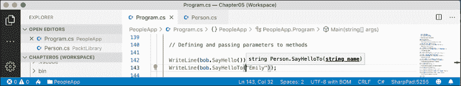

# 五、使用面向对象编程构建自己的类型

本章是关于使用**面向对象编程**（**OOP**制作您自己的类型。您将了解类型可以拥有的所有不同类别的成员，包括存储数据的字段和执行操作的方法。您将使用 OOP 概念，如聚合和封装。您还将了解语言功能，例如元组语法支持、out 变量、推断元组名称和默认文本。

本章将涵盖以下主题：

*   谈面向对象编程
*   构建类库
*   使用字段存储数据
*   编写和调用方法
*   使用属性和索引器控制访问
*   与对象的模式匹配
*   处理记录

# 谈面向对象编程

现实世界中的对象是一种东西，如汽车或人，而编程中的对象通常代表现实世界中的某种东西，如产品或银行账户，但这也可以是更抽象的东西。

在 C# 中，我们使用`class`（大部分）或`struct`（有时）C# 关键字来定义对象类型。您将在*第 6 章*、*实现接口和继承类*中了解类和结构之间的区别。可以将类型视为对象的蓝图或模板。

下面简要介绍 OOP 的概念：

*   **封装**是与对象相关的数据和动作的组合。例如，`BankAccount`类型可能有`Balance`和`AccountName`等数据，也可能有`Deposit`和`Withdraw`等动作。封装时，您通常希望控制什么可以访问这些操作和数据，例如，限制如何从外部访问或修改对象的内部状态。
*   **构图**是关于物体是由什么构成的。例如，一个`Car`由不同的部分组成，例如四个`Wheel`对象、几个`Seat`对象和一个`Engine`对象。
*   **聚合**是关于可以与对象组合的内容。例如，一个`Person`不是`Car`对象的一部分，但它们可以坐在驾驶员的`Seat`中，然后成为汽车的`Driver`——两个单独的对象聚合在一起，形成一个新的组件。
*   **继承**是通过让**子类**派生自**基**或**超类**来重用代码。基类中的所有功能由**派生的**类继承并在其中可用。例如，基本或超级`Exception`类的某些成员在所有异常中具有相同的实现，而子类或派生`SqlException`类继承这些成员，并具有仅与 SQL 数据库异常发生时相关的额外成员，如数据库连接的属性。
*   **抽象**是关于捕捉对象的核心思想，忽略细节或细节。C# 有一个`abstract`关键字，将这个概念形式化。如果一个类不是显式的**抽象**，那么它可以被描述为**具体的**。基类或超类通常是抽象的，例如，超类`Stream`是抽象的，其子类`FileStream`和`MemoryStream`是具体的。只有具体的类可以用来创建对象；抽象类只能用作其他类的基础，因为它们缺少一些实现。抽象是一种微妙的平衡。如果您使一个类更抽象，那么更多的类将能够从中继承，但同时，共享的功能将更少。
*   **多态性**是关于允许派生类重写继承操作以提供自定义行为。

# 构建类库

类库程序集将类型分组到易于部署的单元（DLL 文件）中。除了了解单元测试外，您还只创建了控制台应用程序或.NET 交互式笔记本来包含代码。要使编写的代码在多个项目中可重用，应该像 Microsoft 一样将其放入类库程序集中。

## 创建类库

第一个任务是创建一个可重用的.NET 类库：

1.  使用首选的编码工具创建新的类库，如下表所示：
    1.  项目模板：**类库**/`classlib`
    2.  工作区/解决方案文件和文件夹：`Chapter05`
    3.  项目文件和文件夹：`PacktLibrary`
2.  打开`PacktLibrary.csproj`文件，注意默认情况下类库以.NET 6 为目标，因此只能与其他与.NET 6 兼容的程序集一起使用，如以下标记所示：

    ```cs
    <Project Sdk="Microsoft.NET.Sdk">
      <PropertyGroup>
        <TargetFramework>net6.0</TargetFramework>
        <Nullable>enable</Nullable>
        <ImplicitUsings>enable</ImplicitUsings>
      </PropertyGroup>
    </Project> 
    ```

3.  将框架修改为目标.NET Standard 2.0，并删除启用可空和隐式使用的条目，如以下标记中突出显示的：

    ```cs
    <Project Sdk="Microsoft.NET.Sdk">
      <PropertyGroup>
     **<TargetFramework>netstandard****2.0****</TargetFramework>**
      </PropertyGroup>
    </Project> 
    ```

4.  保存并关闭文件。
5.  删除名为`Class1.cs`的文件。
6.  编译项目，以便其他项目以后可以引用它：
    1.  在 Visual Studio 代码中，输入以下命令：`dotnet build`。
    2.  在 Visual Studio 中，导航到**构建****构建包库**。

**良好实践**：要使用最新的 C# 语言和.NET 平台功能，请将类型放入.NET 6 类库中。要支持.NET 旧版.NET 平台，如.NET 核心、.NET 框架和 Xamarin，请将可重用的类型放入.NET 标准 2.0 类库中。

## 在命名空间中定义类

下一个任务是定义一个代表个人的类：

1.  添加名为`Person.cs`的新类文件。
2.  静态导入`System.Console`。
3.  将名称空间设置为`Packt.Shared`。

**良好实践**：我们这样做是因为将类放在逻辑命名的名称空间中很重要。更好的名称空间名称应该是特定于域的，例如，对于与高级数字相关的类型，`System.Numerics`。在本例中，我们将创建的类型是`Person`、`BankAccount`和`WondersOfTheWorld`，它们没有典型的域，因此我们将使用更通用的`Packt.Shared`。

您的类文件现在应该如下代码所示：

```cs
using System;
using static System.Console;
namespace Packt.Shared
{
  public class Person
  {
  }
} 
```

请注意，C# 关键字`public`是在上课前应用的。该关键字是一个**访问修饰符**，它允许任何其他代码访问该类。

如果未显式应用`public`关键字，则只能在定义该关键字的程序集中访问该关键字。这是因为类的隐式访问修饰符是`internal`。我们需要这个类在程序集之外可以访问，所以我们必须确保它是`public`。

### 简化命名空间声明

如果您的目标是.NET 6.0，因此使用 C# 10 或更高版本，为了简化代码，您可以使用分号结束名称空间声明并删除大括号，如以下代码所示：

```cs
using System; 
namespace Packt.Shared; // the class in this file is in this namespace
public class Person
{
} 
```

这称为文件范围的命名空间声明。每个文件只能有一个文件范围的命名空间。在本章后面，我们将在面向.NET6.0 的类库中使用它。

**良好实践**：将您创建的每个类型放入其自己的文件中，以便可以使用文件范围的命名空间声明。

## 理解成员

此类型中尚未封装任何成员。我们将在以下页面上创建一些。成员可以是字段、方法或两者的专用版本。您可以在此处找到它们的描述：

*   **字段**用于存储数据。还有三个专门的字段类别，如以下项目符号所示：
    *   **常数**：数据不变。编译器将数据复制到任何读取它的代码中。
    *   **只读**：类实例化后数据不能更改，但实例化时可以从外部源计算或加载数据。
    *   **事件**：数据引用一个或多个您希望在发生事件时执行的方法，例如单击按钮或响应来自其他代码的请求。事件将在*第 6 章*、*实现接口和继承类*中介绍。
*   **方法**用于执行语句。当您在*第 4 章*、*编写、调试和测试函数*中学习函数时，您看到了一些示例。还有四种特殊类型的方法：
    *   **构造函数**：语句在使用`new`关键字分配内存实例化类时执行。
    *   **属性**：获取或设置数据时执行语句。数据通常存储在字段中，但可以在外部存储或在运行时计算。属性是封装字段的首选方法，除非需要公开字段的内存地址。
    *   **索引器**：语句在使用“数组”语法`[]`获取或设置数据时执行。
    *   **运算符**：在您的类型的操作数上使用像`+`和`/`这样的运算符时，会执行语句。

## 实例化类

在部分中，我们将创建`Person`类的一个实例。

### 引用程序集

在可以实例化一个类之前，我们需要从另一个项目中引用包含它的程序集。我们将在控制台应用程序中使用该类：

1.  使用您首选的编码工具将新的控制台应用程序添加到名为`PeopleApp`的`Chapter05`工作区/解决方案中。
2.  如果您使用的是 Visual Studio 代码：
    1.  选择`PeopleApp`作为激活的 OmniSharp 项目。当您看到弹出警告消息说所需资产丢失时，单击**是**添加它们。
    2.  编辑`PeopleApp.csproj`为`PacktLibrary`添加一个项目引用，如下标记中突出显示：

        ```cs
        <Project Sdk="Microsoft.NET.Sdk">
          <PropertyGroup>
            <OutputType>Exe</OutputType>
            <TargetFramework>net6.0</TargetFramework>
            <Nullable>enable</Nullable>
            <ImplicitUsings>enable</ImplicitUsings>
          </PropertyGroup>
         **<ItemGroup>**
         **<ProjectReference Include=****"../PacktLibrary/PacktLibrary.csproj"** **/>**
         **</ItemGroup>**
        </Project> 
        ```

    3.  在终端中，输入编译`PeopleApp`项目及其依赖项`PacktLibrary`项目的命令，如下命令所示：

        ```cs
        dotnet build 
        ```

3.  如果您使用的是 Visual Studio：
    1.  将解决方案的启动项目设置为当前选择。
    2.  在**解决方案浏览器**中，选择`PeopleApp`项目，导航至**项目****添加项目参考……**，勾选框选择`PacktLibrary`项目，然后点击**确定**。
    3.  导航至**构建****构建 PeopleApp**。

## 导入命名空间以使用类型

现在，我们已经准备好编写语句来使用`Person`类：

1.  在`PeopleApp`项目/文件夹中，打开`Program.cs`。
2.  在`Program.cs`文件的顶部，删除注释，添加语句来导入我们`Person`类的名称空间，并静态导入`Console`类，如下代码所示：

    ```cs
    using Packt.Shared;
    using static System.Console; 
    ```

3.  In `Program.cs`, add statements to:
    *   创建一个`Person`类型的实例。
    *   使用实例本身的文本描述输出实例。

    `new`关键字为对象分配内存并初始化任何内部数据。我们可以用`var`来代替`Person`类名，但是我们需要在`new`关键字后面指定`Person`，如下代码所示：

    ```cs
    // var bob = new Person(); // C# 1.0 or later
    Person bob = new(); // C# 9.0 or later
    WriteLine(bob.ToString()); 
    ```

    您可能会想，“为什么`bob`变量有一个名为`ToString`的方法？`Person`类是空的！”别担心，我们马上就会知道！

4.  运行代码并查看结果，如以下输出所示：

    ```cs
    Packt.Shared.Person 
    ```

## 理解对象

尽管我们的`Person`类没有显式地选择从类型继承，但所有类型最终都直接或间接地从名为`System.Object`的特殊类型继承。

`System.Object`类型中`ToString`方法的实现只输出完整的名称空间和类型名。

回到最初的`Person`类中，我们可以显式地告诉编译器`Person`继承自`System.Object`类型，如下代码所示：

```cs
public class Person : System.Object 
```

当类 B 从类 A 继承时，我们说 A 是基类或超类，B 是派生类或子类。在这种情况下，`System.Object`是基类或超类，`Person`是派生类或子类。

您也可以使用 C# 别名关键字`object`，如下代码所示：

```cs
public class Person : object 
```

### 从 System.Object 继承

让我们让我们的类显式继承自`object`，然后检查所有对象都有哪些成员：

1.  修改您的`Person`类以显式继承自`object`。
2.  点击`object`关键字内并按 F12，或右键点击`object`关键字并选择**进入定义**。

您将看到 Microsoft 定义的`System.Object`类型及其成员。这是您还不需要了解的细节，但请注意，它有一个名为`ToString`的方法，如*图 5.1*所示：

<figure class="mediaobject"></figure>

图 5.1：系统对象类定义

**良好实践**：假设其他程序员知道如果未指定继承，则该类将从`System.Object`继承。

# 在字段中存储数据

在本节中，我们将在类中定义一个字段选择，以存储有关个人的信息。

## 定义字段

比如说我们已经确定一个人由名字和出生日期组成。我们将把这两个值封装在一个人的内部，并且这些值将在其外部可见。

在`Person`类中，编写语句声明两个用于存储人名和出生日期的公共字段，如下代码所示：

```cs
public class Person : object
{
  // fields
  public string Name;
  public DateTime DateOfBirth;
} 
```

您可以对字段使用任何类型，包括数组和集合，如列表和字典。如果需要在一个命名字段中存储多个值，则可以使用这些值。在这个例子中，一个人只有一个名字和一个出生日期。

## 理解访问修饰符

封装的一部分是选择成员的可见程度。

注意，正如我们对类所做的那样，我们显式地将`public`关键字应用于这些字段。如果我们没有，那么它们将隐式地`private`给类，这意味着它们只能在类内部访问。

有四个访问修饰符关键字和两个访问修饰符关键字组合，可以应用于类成员，如字段或方法，如下表所示：

<colgroup><col> <col></colgroup> 
| 访问修饰符 | 描述 |
| `private` | 成员只能在类型内部访问。这是默认设置。 |
| `internal` | 成员可以在同一程序集中的类型和任何类型内访问。 |
| `protected` | 成员可以在类型内部以及从该类型继承的任何类型中访问。 |
| `public` | 会员随处可见。 |
| `internal``protected` | 成员可以在类型内部、同一程序集中的任何类型以及从该类型继承的任何类型中访问。相当于名为`internal_or_protected`的虚构访问修饰符。 |
| `private``protected` | 成员可以在类型以及从该类型继承并位于同一程序集中的任何类型内访问。相当于名为`internal_and_protected`的虚构访问修饰符。此组合仅适用于 C# 7.2 或更高版本。 |

**良好实践**：对所有类型成员显式应用一个访问修饰符，即使您希望对成员使用隐式访问修饰符，即`private`。此外，字段通常应该是`private`或`protected`，然后您应该创建`public`属性来获取或设置字段值。这是因为它控制访问。您将在本章后面的部分中执行此操作。

## 设置和输出字段值

现在，我们将在您的代码中使用这些字段：

1.  在`Program.cs`的顶部，确保导入了`System`名称空间。我们需要这样做才能使用`DateTime`类型。
2.  After instantiating `bob`, add statements to set his name and date of birth, and then output those fields formatted nicely, as shown in the following code:

    ```cs
    bob.Name = "Bob Smith";
    bob.DateOfBirth = new DateTime(1965, 12, 22); // C# 1.0 or later
    WriteLine(format: "{0} was born on {1:dddd, d MMMM yyyy}", 
      arg0: bob.Name,
      arg1: bob.DateOfBirth); 
    ```

    我们也可以使用字符串插值，但对于长字符串，它将覆盖多行，这在印刷书籍中可能更难阅读。在本书的代码示例中，请记住，`{0}`是`arg0`的占位符，依此类推。

3.  Run the code and view the result, as shown in the following output:

    ```cs
    Bob Smith was born on Wednesday, 22 December 1965 
    ```

    根据您的区域设置（即语言和文化），您的输出可能会有所不同。

    `arg1`的格式代码由几个部分组成。`dddd`指一周中某一天的名称。`d`是指当月的天数。`MMMM`表示月份名称。小写的`m`表示时间值中的分钟。`yyyy`指本年度的完整数字。`yy`意味着两位数的年份。

    您还可以使用短括号**对象初始值设定项**语法初始化字段。让我们看看如何。

4.  在现有代码下面添加语句，以创建另一个名为 Alice 的新人。将她写入控制台时，请注意出生日期的不同格式代码，如以下代码所示：

    ```cs
    Person alice = new()
    {
      Name = "Alice Jones",
      DateOfBirth = new(1998, 3, 7) // C# 9.0 or later
    };
    WriteLine(format: "{0} was born on {1:dd MMM yy}",
      arg0: alice.Name,
      arg1: alice.DateOfBirth); 
    ```

5.  运行代码并查看结果，如以下输出所示：

    ```cs
    Alice Jones was born on 07 Mar 98 
    ```

## 使用枚举类型存储值

有时，一个值需要是一组有限的选项之一。例如，世界上有七个古老的奇迹，一个人可能有一个最喜欢的。在其他情况下，值需要是一组有限选项的组合。例如，一个人可能有一份他们想参观的古代世界奇迹的清单。我们可以通过定义一个`enum`类型来存储这些数据。

`enum`类型是存储一个或多个选项的非常有效的方法，因为在内部，它使用整数值与`string`描述的查找表组合：

1.  在名为`WondersOfTheAncientWorld.cs`的`PacktLibrary`项目中添加一个新文件。
2.  Modify the `WondersOfTheAncientWorld.cs` file, as shown in the following code:

    ```cs
    namespace Packt.Shared
    {
      public enum WondersOfTheAncientWorld
      {
        GreatPyramidOfGiza,
        HangingGardensOfBabylon,
        StatueOfZeusAtOlympia,
        TempleOfArtemisAtEphesus,
        MausoleumAtHalicarnassus,
        ColossusOfRhodes,
        LighthouseOfAlexandria
      }
    } 
    ```

    **良好实践**：如果您使用的是在.NET 交互式笔记本中编写代码，则包含`enum`的代码单元格必须位于定义`Person`类的代码单元格之上。

3.  在`Person`类中，将以下语句添加到字段列表中：

    ```cs
    public WondersOfTheAncientWorld FavoriteAncientWonder; 
    ```

4.  在`Program.cs`中增加以下语句：

    ```cs
    bob.FavoriteAncientWonder = WondersOfTheAncientWorld.StatueOfZeusAtOlympia;
    WriteLine(
      format: "{0}'s favorite wonder is {1}. Its integer is {2}.",
      arg0: bob.Name,
      arg1: bob.FavoriteAncientWonder,
      arg2: (int)bob.FavoriteAncientWonder); 
    ```

5.  运行代码并查看结果，如以下输出所示：

    ```cs
    Bob Smith's favorite wonder is StatueOfZeusAtOlympia. Its integer is 2. 
    ```

为了提高效率，`enum`值在内部存储为`int`。`int`值从`0`开始自动分配，因此我们`enum`中的第三世界奇迹的值为`2`。您可以指定未在`enum`中列出的`int`值。它们将以`int`值而不是名称输出，因为找不到匹配项。

## 使用枚举类型存储多个值

对于 bucket list，我们可以创建一个数组或集合`enum`的实例，集合将在本章后面的中解释，但是有更好的方法。我们可以使用`enum`**标志**将多项选择组合成一个值：

1.  Modify the `enum` by decorating it with the `[System.Flags]` attribute, and explicitly set a `byte` value for each wonder that represents different bit columns, as shown highlighted in the following code:

    ```cs
    namespace Packt.Shared
    {
     **[****System.Flags****]**
      public enum WondersOfTheAncientWorld **:** **byte**
      {
        **None                     =** **0b****_0000_0000,** **// i.e. 0**
        GreatPyramidOfGiza       **=** **0b****_0000_0001,** **// i.e. 1**
        HangingGardensOfBabylon  **=** **0b****_0000_0010,** **// i.e. 2**
        StatueOfZeusAtOlympia    **=** **0b****_0000_0100,** **// i.e. 4**
        TempleOfArtemisAtEphesus **=** **0b****_0000_1000,** **// i.e. 8**
        MausoleumAtHalicarnassus **=** **0b****_0001_0000,** **// i.e. 16**
        ColossusOfRhodes         **=** **0b****_0010_0000,** **// i.e. 32**
        LighthouseOfAlexandria   **=** **0b****_0100_0000** **// i.e. 64**
      }
    } 
    ```

    我们为每个选项分配显式值，当查看存储在内存中的位时，这些值不会重叠。我们还应该用`System.Flags`属性装饰`enum`类型，这样当返回值时，它可以自动与多个值匹配，以逗号分隔`string`，而不是返回`int`值。

    通常情况下，`enum`类型在内部使用`int`变量，但由于我们不需要那么大的值，我们可以通过告诉它使用`byte`变量，将内存需求减少 75%，即每个值减少 1 字节，而不是 4 字节。

    如果我们想表明我们的清单包括*巴比伦空中花园*和*哈利卡纳索斯陵墓*古代世界奇观，那么我们希望将`16`和`2`位设置为`1`。换句话说，我们将存储值`18`：

    <colgroup><col> <col> <col> <col> <col> <col> <col></colgroup> 
    | 64 | 32 | 16 | 8. | 4. | 2. | 1. |
    | 0 | 0 | 1. | 0 | 0 | 1. | 0 |

2.  在`Person`类中，将以下语句添加到字段列表中，如以下代码所示：

    ```cs
    public WondersOfTheAncientWorld BucketList; 
    ```

3.  在`Program.cs`中，添加语句，使用`|`运算符（按位逻辑 OR）组合枚举值来设置桶列表。我们也可以使用枚举类型中的数字 18 设置值，如注释所示，但我们不应该这样做，因为这会使代码更难理解，如以下代码所示：

    ```cs
    bob.BucketList = 
      WondersOfTheAncientWorld.HangingGardensOfBabylon
      | WondersOfTheAncientWorld.MausoleumAtHalicarnassus;
    // bob.BucketList = (WondersOfTheAncientWorld)18;
    WriteLine($"{bob.Name}'s bucket list is {bob.BucketList}"); 
    ```

4.  运行代码并查看结果，如以下输出所示：

    ```cs
    Bob Smith's bucket list is HangingGardensOfBabylon, MausoleumAtHalicarnassus 
    ```

**良好实践**：使用`enum`值存储离散选项的组合。如果最多有八个选项，则从`byte`派生`enum`类型；如果最多有 16 个选项，则从`ushort`派生；如果最多有 32 个选项，则从`uint`派生；如果最多有 64 个选项，则从`ulong`派生`enum`类型。

# 使用集合存储多个值

现在让我们添加一个字段来存储一个人的孩子。这是聚合的一个示例，因为子类是与当前人员相关但不属于人员本身的类的实例。我们将使用一个通用的`List<T>`集合类型，它可以存储任何类型的有序集合。您将在*第 8 章*、*中了解有关集合的更多信息，该章节将介绍如何使用常见的.NET 类型*。现在，只需遵循以下步骤：

1.  在`Person.cs`中导入`System.Collections.Generic`名称空间，如下代码所示：

    ```cs
    using System.Collections.Generic; // List<T> 
    ```

2.  在`Person`类中声明一个新字段，如下代码所示：

    ```cs
    public List<Person> Children = new List<Person>(); 
    ```

将`List<Person>`大声读作“人员列表”，例如，“名为`Children`的属性的类型是`Person`实例的列表。”我们将类库显式更改为 target.NET Standard 2.0（使用 C# 7 编译器），因此无法使用 target typed new 初始化`Children`字段。如果我们让它以.NET 6.0 为目标，那么我们可以使用 target-typed-new，如下代码所示：

```cs
public List<Person> Children = new(); 
```

我们必须确保集合已初始化为`Person`列表的新实例，然后才能向其添加项，否则，该字段将为`null`，当我们尝试使用其任何成员（如`Add`时，它将抛出运行时异常。

## 理解泛型集合

`List<T>`类型中的尖括号是 C# 的特性，称为**泛型**，该特性于 2005 年随 C# 2.0 引入。这是一个用于创建集合**强类型**的奇特术语，也就是说，编译器明确知道集合中可以存储什么类型的对象。泛型可以提高代码的性能和正确性。

**强类型**与**静态类型**具有不同的含义。旧的`System.Collection`类型是静态类型，包含弱类型`System.Object`项。较新的`System.Collection.Generic`类型是静态类型的，包含强类型`<T>`实例。

讽刺的是，术语*泛型*意味着我们可以使用更具体的静态类型！

1.  In `Program.cs`, add statements to add two children for `Bob` and then show how many children he has and what their names are, as shown in the following code:

    ```cs
    bob.Children.Add(new Person { Name = "Alfred" }); // C# 3.0 and later
    bob.Children.Add(new() { Name = "Zoe" }); // C# 9.0 and later
    WriteLine(
      $"{bob.Name} has {bob.Children.Count} children:");
    for (int childIndex = 0; childIndex < bob.Children.Count; childIndex++)
    {
      WriteLine($"  {bob.Children[childIndex].Name}");
    } 
    ```

    我们也可以使用`foreach`语句来枚举集合。作为一个额外的挑战，更改`for`语句以使用`foreach`输出相同的信息。

2.  运行代码并查看结果，如以下输出所示：

    ```cs
    Bob Smith has 2 children:
      Alfred
      Zoe 
    ```

## 使磁场静止

到目前为止，我们创建的字段都是**实例**成员，这意味着创建的类的每个实例都存在不同的字段值。`alice`和`bob`变量具有不同的`Name`值。

有时，您希望定义一个字段，该字段只有一个值可在所有实例中共享。

这些被称为**静态***成员*，因为字段不是唯一可以是静态的成员。让我们看看使用`static`字段可以实现什么：

1.  在`PacktLibrary`项目中，添加一个名为`BankAccount.cs`的新类文件。
2.  Modify the class to give it three fields, two instance fields and one static field, as shown in the following code:

    ```cs
    namespace Packt.Shared
    {
      public class BankAccount
      {
        public string AccountName; // instance member
        public decimal Balance; // instance member
        public static decimal InterestRate; // shared member
      }
    } 
    ```

    `BankAccount`的每个实例都有自己的`AccountName`和`Balance`值，但所有实例将共享一个`InterestRate`值。

3.  In `Program.cs`, add statements to set the shared interest rate and then create two instances of the `BankAccount` type, as shown in the following code:

    ```cs
    BankAccount.InterestRate = 0.012M; // store a shared value
    BankAccount jonesAccount = new(); // C# 9.0 and later
    jonesAccount.AccountName = "Mrs. Jones"; 
    jonesAccount.Balance = 2400;
    WriteLine(format: "{0} earned {1:C} interest.",
      arg0: jonesAccount.AccountName,
      arg1: jonesAccount.Balance * BankAccount.InterestRate);
    BankAccount gerrierAccount = new(); 
    gerrierAccount.AccountName = "Ms. Gerrier"; 
    gerrierAccount.Balance = 98;
    WriteLine(format: "{0} earned {1:C} interest.",
      arg0: gerrierAccount.AccountName,
      arg1: gerrierAccount.Balance * BankAccount.InterestRate); 
    ```

    `:C`是一种格式代码，告诉.NET 使用货币格式来表示数字。在*第 8 章**中，您将学习如何控制决定货币符号的文化。现在，它将使用默认的操作系统安装。我住在英国伦敦，因此我的产出显示为英镑（英镑）。*

4.  运行代码并查看附加输出：

    ```cs
    Mrs. Jones earned £28.80 interest. 
    Ms. Gerrier earned £1.18 interest. 
    ```

字段不是唯一可以是静态的成员。构造函数、方法、属性和其他成员也可以是静态的。

## 使场为常数

如果字段的值永远不会改变，您可以使用`const`关键字并在编译时指定一个文本值：

1.  在`Person.cs`中增加以下代码：

    ```cs
     // constants
    public const string Species = "Homo Sapien"; 
    ```

2.  要获取常量字段的值，必须写入类的名称，而不是类实例的名称。在`Program.cs`中，添加一条语句，将 Bob 的名字和物种写入控制台，如下代码所示：

    ```cs
    WriteLine($"{bob.Name} is a {Person.Species}"); 
    ```

3.  Run the code and view the result, as shown in the following output:

    ```cs
    Bob Smith is a Homo Sapien 
    ```

    Microsoft 类型中的`const`字段示例包括`System.Int32.MaxValue`和`System.Math.PI`，因为这两个值都不会改变，如*图 5.2*所示：

    <figure class="mediaobject"></figure>

图 5.2：常数示例

**良好实践**：常数并不总是最佳选择，原因有两个：值必须在编译时已知，并且必须可以表示为文字`string`、`Boolean`或数值。在编译时，`const`字段的每个引用都会替换为文本值，因此，如果值在将来的版本中发生更改，并且您不重新编译引用它的任何程序集以获取新值，则不会反映该值。

## 将字段设置为只读

通常，对于不应更改的字段，更好的选择是将其标记为只读：

1.  在`Person.cs`中添加一条语句，声明一个实例只读字段来存储一个人的家园星球，如下代码所示：

    ```cs
    // read-only fields
    public readonly string HomePlanet = "Earth"; 
    ```

2.  在`Program.cs`中，添加一条语句，将 Bob 的名字和 home planet 写入控制台，如下代码所示：

    ```cs
    WriteLine($"{bob.Name} was born on {bob.HomePlanet}"); 
    ```

3.  运行代码并查看结果，如以下输出所示：

    ```cs
    Bob Smith was born on Earth 
    ```

**良好实践**：在常量字段上使用只读字段有两个重要原因：可以在运行时计算或加载值，并且可以使用任何可执行语句表示。因此，可以使用构造函数或字段赋值设置只读字段。对字段的每个引用都是活动引用，因此调用代码将正确反映将来的任何更改。

您还可以声明`static``readonly`字段，这些字段的值将在该类型的所有实例中共享。

## 使用构造函数初始化字段

字段通常需要在运行时初始化。您可以在构造函数中执行此操作，当您使用`new`关键字创建类实例时，将调用该构造函数。构造函数在使用类型的代码设置任何字段之前执行。

1.  在`Person.cs`中，在已有只读`HomePlanet`字段后添加语句，定义第二个只读字段，然后在构造函数中设置`Name`和`Instantiated`字段，如下代码所示：

    ```cs
    // read-only fields
    public readonly string HomePlanet = "Earth";
    **public****readonly** **DateTime Instantiated;**
    **// constructors**
    **public****Person****()**
    **{**
    **// set default values for fields**
    **// including read-only fields**
     **Name =** **"Unknown"****;** 
     **Instantiated = DateTime.Now;**
    **}** 
    ```

2.  在`Program.cs`中，添加语句实例化一个新人，然后输出其初始字段值，如下代码所示：

    ```cs
    Person blankPerson = new();
    WriteLine(format:
      "{0} of {1} was created at {2:hh:mm:ss} on a {2:dddd}.",
      arg0: blankPerson.Name,
      arg1: blankPerson.HomePlanet,
      arg2: blankPerson.Instantiated); 
    ```

3.  运行代码并查看结果，如以下输出所示：

    ```cs
    Unknown of Earth was created at 11:58:12 on a Sunday 
    ```

### 定义多个构造函数

一个类型中可以有多个构造函数。这对于鼓励开发人员为字段设置初始值特别有用：

1.  在`Person.cs`中，添加语句以定义第二个构造函数，该构造函数允许开发人员设置个人姓名和家园行星的初始值，如以下代码所示：

    ```cs
    public Person(string initialName, string homePlanet)
    {
      Name = initialName;
      HomePlanet = homePlanet;
      Instantiated = DateTime.Now;
    } 
    ```

2.  在`Program.cs`中添加语句，使用两个参数的构造函数创建另一个人，如下代码所示：

    ```cs
    Person gunny = new(initialName: "Gunny", homePlanet: "Mars");
    WriteLine(format:
      "{0} of {1} was created at {2:hh:mm:ss} on a {2:dddd}.",
      arg0: gunny.Name,
      arg1: gunny.HomePlanet,
      arg2: gunny.Instantiated); 
    ```

3.  运行代码并查看结果：

    ```cs
    Gunny of Mars was created at 11:59:25 on a Sunday 
    ```

构造函数是方法的一个特殊类别。让我们更详细地看一下方法。

# 编写和调用方法

**方法**是执行语句块类型的成员。它们是属于某一类型的函数。

## 从方法返回值

方法可以返回单个值或不返回任何值：

*   一个执行某些操作但不返回值的方法在方法名称前用`void`类型表示这一点。
*   执行某些操作并返回值的方法在方法名称之前使用返回值的类型指示此操作。

例如，在下一个任务中，您将创建两个方法：

*   `WriteToConsole`：这将执行一个操作（向控制台写入一些文本），但不会从方法返回任何内容，由`void`关键字表示。
*   `GetOrigin`：返回一个文本值，由`string`关键字表示。

让我们编写代码：

1.  在`Person.cs`中，添加语句来定义我前面描述的两种方法，如下代码所示：

    ```cs
    // methods
    public void WriteToConsole()
    {
      WriteLine($"{Name} was born on a {DateOfBirth:dddd}.");
    }
    public string GetOrigin()
    {
      return $"{Name} was born on {HomePlanet}.";
    } 
    ```

2.  在`Program.cs`中添加语句调用这两个方法，如下代码所示：

    ```cs
    bob.WriteToConsole(); 
    WriteLine(bob.GetOrigin()); 
    ```

3.  运行代码并查看结果，如以下输出所示：

    ```cs
    Bob Smith was born on a Wednesday. 
    Bob Smith was born on Earth. 
    ```

## 使用元组组合多个返回值

每个方法只能返回具有单个类型的单个值。该类型可以是简单类型，如上例中的`string`，也可以是复杂类型，如`Person`，或者是集合类型，如`List<Person>`。

假设我们想要定义一个名为`GetTheData`的方法，该方法需要同时返回`string`值和`int`值。我们可以用一个`string`字段和一个`int`字段定义一个名为`TextAndNumber`的新类，并返回该复杂类型的实例，如下代码所示：

```cs
public class TextAndNumber
{
  public string Text;
  public int Number;
}
public class LifeTheUniverseAndEverything
{
  public TextAndNumber GetTheData()
  {
    return new TextAndNumber
    {
      Text = "What's the meaning of life?",
      Number = 42
    };
  }
} 
```

但是定义一个类只是将两个值组合在一起是不必要的，因为在现代版本的 C# 中，我们可以使用**元组**。元组是将两个或多个值组合成单个单元的有效方法。我把它们读作 tuh-ples，但我听到其他开发人员把它们读作 too-ples。我猜是梅趾，马趾，宝泰趾，宝塔趾。

元组从 F# 等一些语言的第一个版本开始就已经成为它们的一部分，但是.NET 只是在 2010 年使用`System.Tuple`类型的.NET 4.0 中增加了对元组的支持。

### 元组的语言支持

直到 2017 年的 C# 7.0，C# 才添加了对使用括号字符`()`的元组的语言语法支持，同时，.NET 添加了一种新的`System.ValueTuple`类型，该类型在一些常见场景中比旧的.NET 4.0`System.Tuple`类型更有效。C# 元组语法使用更有效的语法。

让我们探索元组：

1.  在`Person.cs`中，添加语句定义一个方法，该方法返回一个组合了`string`和`int`的元组，如下代码所示：

    ```cs
    public (string, int) GetFruit()
    {
      return ("Apples", 5);
    } 
    ```

2.  在`Program.cs`中，添加语句调用`GetFruit`方法，然后输出元组字段自动命名为`Item1`和`Item2`，如下代码所示：

    ```cs
    (string, int) fruit = bob.GetFruit();
    WriteLine($"{fruit.Item1}, {fruit.Item2} there are."); 
    ```

3.  运行代码并查看结果，如以下输出所示：

    ```cs
    Apples, 5 there are. 
    ```

### 命名元组的字段

要访问元组的字段，默认名称为`Item1`、`Item2`等。

您可以显式指定字段名：

1.  在`Person.cs`中，添加语句，定义一个返回具有命名字段的元组的方法，如下代码所示：

    ```cs
    public (string Name, int Number) GetNamedFruit()
    {
      return (Name: "Apples", Number: 5);
    } 
    ```

2.  在`Program.cs`中，添加语句调用方法并输出元组的命名字段，如下代码所示：

    ```cs
    var fruitNamed = bob.GetNamedFruit();
    WriteLine($"There are {fruitNamed.Number} {fruitNamed.Name}."); 
    ```

3.  运行代码并查看结果，如以下输出所示：

    ```cs
    There are 5 Apples. 
    ```

### 推断元组名称

如果您是从另一个对象构造元组，您可以使用 C# 7.1 中引入的一个称为**元组名称推断**的特性。

在`Program.cs`中创建两个元组，分别由`string`和`int`值组成，如下代码所示：

```cs
var thing1 = ("Neville", 4);
WriteLine($"{thing1.Item1} has {thing1.Item2} children.");
var thing2 = (bob.Name, bob.Children.Count); 
WriteLine($"{thing2.Name} has {thing2.Count} children."); 
```

在 C# 7.0 中，两个东西都将使用`Item1`和`Item2`命名方案。在 C# 7.1 及更高版本中，`thing2`可以推断出名称`Name`和`Count`。

### 解构元组

您还可以将元组解构为单独的变量。解构声明的语法与命名字段元组相同，但元组没有命名变量，如下代码所示：

```cs
// store return value in a tuple variable with two fields
(string TheName, int TheNumber) tupleWithNamedFields = bob.GetNamedFruit();
// tupleWithNamedFields.TheName
// tupleWithNamedFields.TheNumber
// deconstruct return value into two separate variables
(string name, int number) = GetNamedFruit();
// name
// number 
```

这样做的效果是将元组拆分为多个部分，并将这些部分分配给新变量。

1.  在`Program.cs`中，添加语句解构`GetFruit`方法返回的元组，如下代码所示：

    ```cs
    (string fruitName, int fruitNumber) = bob.GetFruit();
    WriteLine($"Deconstructed: {fruitName}, {fruitNumber}"); 
    ```

2.  运行代码并查看结果，如以下输出所示：

    ```cs
    Deconstructed: Apples, 5 
    ```

### 解构类型

元组不是唯一可以解构的类型。任何类型都可以使用名为`Deconstruct`的特殊方法将对象分解为多个部分。让我们为`Person`类实现一些：

1.  在`Person.cs`中，添加两个`Deconstruct`方法，为我们要解构的部分定义了`out`参数，如下代码所示：

    ```cs
    // deconstructors
    public void Deconstruct(out string name, out DateTime dob)
    {
      name = Name;
      dob = DateOfBirth;
    }
    public void Deconstruct(out string name, 
      out DateTime dob, out WondersOfTheAncientWorld fav)
    {
      name = Name;
      dob = DateOfBirth;
      fav = FavoriteAncientWonder;
    } 
    ```

2.  在`Program.cs`中增加语句解构`bob`，如下代码所示：

    ```cs
    // Deconstructing a Person
    var (name1, dob1) = bob;
    WriteLine($"Deconstructed: {name1}, {dob1}");
    var (name2, dob2, fav2) = bob;
    WriteLine($"Deconstructed: {name2}, {dob2}, {fav2}"); 
    ```

3.  运行代码并查看结果，如以下输出所示：

    ```cs
    Deconstructed: Bob Smith, 22/12/1965 00:00:00
    Deconstructed: Bob Smith, 22/12/1965 00:00:00, StatueOfZeusAtOlympia
    B 
    ```

## 定义参数并将参数传递给方法

方法可以将参数传递给他们，以改变他们的行为。参数的定义有点像变量声明，但在方法的括号内，正如您在本章前面的构造函数中看到的。让我们看更多的例子：

1.  在`Person.cs`中增加语句定义两种方法，第一种不带参数，第二种只带一个参数，如下代码所示：

    ```cs
    public string SayHello()
    {
      return $"{Name} says 'Hello!'";
    }
    public string SayHelloTo(string name)
    {
      return $"{Name} says 'Hello {name}!'";
    } 
    ```

2.  在`Program.cs`中，添加语句调用这两个方法，并将返回值写入控制台，如下代码所示：

    ```cs
    WriteLine(bob.SayHello()); 
    WriteLine(bob.SayHelloTo("Emily")); 
    ```

3.  运行代码并查看结果：

    ```cs
    Bob Smith says 'Hello!'
    Bob Smith says 'Hello Emily!' 
    ```

当键入调用方法的语句时，IntelliSense 会显示一个工具提示，其中包含任何参数的名称和类型，以及方法的返回类型，如*图 5.3*所示：

<figure class="mediaobject"></figure>

图 5.3：无重载方法的 IntelliSense 工具提示

## 重载方法

与有两个不同的方法名称不同，我们可以为两个方法提供相同的名称。这是允许的，因为每个方法都有不同的签名。

**方法签名**是调用方法时可以传递的参数类型的列表。重载方法只能在返回类型上有所不同。

1.  在`Person.cs`中，将`SayHelloTo`方法的名称更改为`SayHello`。
2.  在`Program.cs`中，将方法调用更改为使用`SayHello`方法，注意该方法的快速信息告诉您它有一个额外的重载 1/2 和 2/2，如*图 5.4*：

    <figure class="mediaobject"></figure>

    所示

图 5.4：重载方法的 IntelliSense 工具提示

**良好实践**：使用重载的方法简化类，使其看起来方法更少。

## 传递可选参数和命名参数

简化方法的另一种方法是使参数可选。通过在方法参数列表中为指定一个默认值，可以将参数设置为可选。可选参数必须始终位于参数列表的最后。

现在，我们将创建一个具有三个可选参数的方法：

1.  在`Person.cs`中增加语句定义方法，如下代码所示：

    ```cs
    public string OptionalParameters(
      string command  = "Run!",
      double number = 0.0,
      bool active = true)
    {
      return string.Format(
        format: "command is {0}, number is {1}, active is {2}",
        arg0: command,
        arg1: number,
        arg2: active);
    } 
    ```

2.  在`Program.cs`中，添加一条语句调用该方法并将其返回值写入控制台，如下代码所示：

    ```cs
    WriteLine(bob.OptionalParameters()); 
    ```

3.  Watch IntelliSense appear as you type the code. You will see a tooltip, showing the three optional parameters with their default values, as shown in *Figure 5.5*:

    <figure class="mediaobject"></figure>

    图 5.5:IntelliSense 在键入代码时显示可选参数

4.  运行代码并查看结果，如以下输出所示：

    ```cs
    command is Run!, number is 0, active is True 
    ```

5.  在`Program.cs`中增加语句，传递`command`参数的`string`值和`number`参数的`double`值，如下代码所示：

    ```cs
    WriteLine(bob.OptionalParameters("Jump!", 98.5)); 
    ```

6.  运行代码并查看结果，如以下输出所示：

    ```cs
    command is Jump!, number is 98.5, active is True 
    ```

`command`和`number`参数的默认值已被替换，但`active`的默认值仍然是`true`。

### 调用方法时命名参数值

在调用方法时，可选参数通常与命名参数结合在一起，因为命名参数允许以不同于其声明方式的顺序传递值。

1.  在`Program.cs`中，添加一条语句，为`command`参数传递`string`值，为`number`参数传递`double`值，但使用命名参数，这样就可以交换它们传递的顺序，如下代码所示：

    ```cs
    WriteLine(bob.OptionalParameters(
      number: 52.7, command: "Hide!")); 
    ```

2.  Run the code and view the result, as shown in the following output:

    ```cs
    command is Hide!, number is 52.7, active is True 
    ```

    您甚至可以使用命名参数跳过可选参数。

3.  在`Program.cs`中增加一条语句，使用位置顺序传递`command`参数的`string`值，跳过`number`参数，使用命名的`active`参数，如下代码所示：

    ```cs
    WriteLine(bob.OptionalParameters("Poke!", active: false)); 
    ```

4.  运行代码并查看结果，如以下输出所示：

    ```cs
    command is Poke!, number is 0, active is False 
    ```

## 控制参数的传递方式

当一个参数被传递到一个方法中时，可以通过以下三种方式之一进行传递：

*   按**值**（这是默认值）：将它们视为仅在中的*。*
*   通过**引用**作为`ref`参数：将其视为*输入和输出*。
*   作为一个`out`参数：将其视为仅*输出*。

让我们看一些传入和传出参数的示例：

1.  在`Person.cs`中增加语句定义一个方法，该方法有三个参数，一个`in`参数，一个`ref`参数，一个`out`参数，如下方法所示：

    ```cs
    public void PassingParameters(int x, ref int y, out int z)
    {
      // out parameters cannot have a default
      // AND must be initialized inside the method
      z = 99;
      // increment each parameter
      x++; 
      y++; 
      z++;
    } 
    ```

2.  在`Program.cs`中，添加语句来声明一些`int`变量并将其传递到方法中，如下代码所示：

    ```cs
    int a = 10; 
    int b = 20; 
    int c = 30;
    WriteLine($"Before: a = {a}, b = {b}, c = {c}"); 
    bob.PassingParameters(a, ref b, out c); 
    WriteLine($"After: a = {a}, b = {b}, c = {c}"); 
    ```

3.  运行代码并查看结果，如以下输出所示：

    ```cs
    Before: a = 10, b = 20, c = 30 
    After: a = 10, b = 21, c = 100 
    ```

    *   默认情况下，将变量作为参数传递时，将传递其当前值，而不是变量本身。因此，`x`具有`a`变量值的副本。`a`变量保留其原始值`10`。
    *   当将变量作为`ref`参数传递时，对该变量的引用被传递到方法中。因此，`y`是对`b`的引用。当`y`参数递增时，`b`变量递增。
    *   将变量作为`out`参数传递时，会将对该变量的引用传递到方法中。因此，`z`是对`c`的引用。`c`变量的值将被方法内执行的任何代码替换。我们可以通过不给`c`变量赋值`30`来简化`Main`方法中的代码，因为无论如何它都会被替换。

### 简化输出参数

在 C# 7.0 及更高版本中，我们可以简化使用 out 变量的代码。

在`Program.cs`中，添加语句来声明更多的变量，包括一个名为`f`的`out`参数内联声明，如下代码所示：

```cs
int d = 10; 
int e = 20;
WriteLine($"Before: d = {d}, e = {e}, f doesn't exist yet!");
// simplified C# 7.0 or later syntax for the out parameter 
bob.PassingParameters(d, ref e, out int f); 
WriteLine($"After: d = {d}, e = {e}, f = {f}"); 
```

## 理解 ref 返回

在 C# 7.0 或更高版本中，`ref`关键字不只是用于将参数传递给方法的；也可应用于`return`值。这允许外部变量引用内部变量，并在方法调用后修改其值。这在高级场景中可能很有用，例如，将占位符传递到大数据结构中，但这超出了本书的范围。

## 使用部分

在处理多个团队成员的大型项目时，或者在处理特别大且复杂的类实现时，能够在多个文件中拆分类的定义非常有用。您可以使用`partial`关键字来执行此操作。

想象一下我们想向`Person`类添加语句，这些语句是由一个工具（如从数据库读取模式信息的对象关系映射器）自动生成的。如果该类定义为`partial`，那么我们可以将该类拆分为自动生成的代码文件和手动编辑的代码文件。

让我们编写一些模拟此示例的代码：

1.  在`Person.cs`中添加`partial`关键字，如下代码中突出显示：

    ```cs
    namespace Packt.Shared
    {
      public **partial** class Person
      { 
    ```

2.  在`PacktLibrary`项目/文件夹中，添加一个名为`PersonAutoGen.cs`的新类文件。
3.  将语句添加到新文件中，如下代码所示：

    ```cs
    namespace Packt.Shared
    {
      public partial class Person
      {
      }
    } 
    ```

我们为本章编写的其余代码将写入`PersonAutoGen.cs`文件中。

# 使用属性和索引器控制访问

之前，您创建了一个名为`GetOrigin`的方法，该方法返回一个包含此人姓名和来源的`string`。像 Java 这样的语言经常这样做。C# 有一个更好的方法：属性。

属性只是一个方法（或一对方法），当您想要获取或设置值时，它的行为和外观就像一个字段，从而简化了语法。

## 定义只读属性

`readonly`属性只有`get`实现。

1.  In `PersonAutoGen.cs`, in the `Person` class, add statements to define three properties:
    1.  第一个属性将使用适用于所有 C# 版本的属性语法（尽管它使用 C# 6 及更高版本的字符串插值语法），执行与`GetOrigin`方法相同的角色。
    2.  第二个属性将使用 C# 6 及更高版本的 lambda 表达式体`=>`语法返回问候消息。
    3.  第三个属性将计算此人的年龄。

    以下是代码：

    ```cs
    // a property defined using C# 1 - 5 syntax
    public string Origin
    {
      get
      {
        return $"{Name} was born on {HomePlanet}";
      }
    }
    // two properties defined using C# 6+ lambda expression body syntax
    public string Greeting => $"{Name} says 'Hello!'";
    public int Age => System.DateTime.Today.Year - DateOfBirth.Year; 
    ```

    **良好实践**：这不是计算某人年龄的最佳方法，但我们没有学习如何从出生日期计算年龄。如果您需要正确执行此操作，请阅读以下链接上的讨论：[https://stackoverflow.com/questions/9/how-do-i-calculate-someones-age-in-c](https://stackoverflow.com/questions/9/how-do-i-calculate-someones-age-in-c)

2.  在`Program.cs`中，添加语句获取属性，如下代码所示：

    ```cs
    Person sam = new()
    {
      Name = "Sam",
      DateOfBirth = new(1972, 1, 27)
    };
    WriteLine(sam.Origin); 
    WriteLine(sam.Greeting); 
    WriteLine(sam.Age); 
    ```

3.  运行代码并查看结果，如以下输出所示：

    ```cs
    Sam was born on Earth 
    Sam says 'Hello!'
    49 
    ```

输出显示为 49，因为我在 2021 年 8 月 15 日 Sam 49 岁时运行了 console 应用程序。

## 定义可设置属性

要创建可设置属性，您必须使用较旧的语法，并提供一对方法，不仅是`get`部分，而且是`set`部分：

1.  In `PersonAutoGen.cs`, add statements to define a `string` property that has both a `get` and `set` method (also known as a getter and setter), as shown in the following code:

    ```cs
    public string FavoriteIceCream { get; set; } // auto-syntax 
    ```

    虽然您没有手动创建一个字段来存储此人最喜欢的冰淇淋，但它仍然存在，由编译器自动为您创建。

    有时，您需要更多地控制设置属性时发生的事情。在这种情况下，您必须使用更详细的语法并手动创建一个`private`字段来存储属性的值。

2.  In `PersonAutoGen.cs`, add statements to define a `string` field and `string` property that has both a `get` and `set`, as shown in the following code:

    ```cs
    private string favoritePrimaryColor;
    public string FavoritePrimaryColor
    {
      get
      {
        return favoritePrimaryColor;
      }
      set
      {
        switch (value.ToLower())
        {
          case "red":
          case "green":
          case "blue":
            favoritePrimaryColor = value;
            break;
          default:
            throw new System.ArgumentException(
              $"{value} is not a primary color. " + 
              "Choose from: red, green, blue.");
        }
      }
    } 
    ```

    **良好实践**：避免向 getter 和 setter 添加太多代码。这可能表明您的设计存在问题。考虑添加私有方法，然后在 SET 和 GETTES 中调用这些方法来简化实现。

3.  在`Program.cs`中，添加语句设置 Sam 最喜欢的冰淇淋和颜色，然后写出来，如下代码所示：

    ```cs
    sam.FavoriteIceCream = "Chocolate Fudge";
    WriteLine($"Sam's favorite ice-cream flavor is {sam.FavoriteIceCream}."); 
    sam.FavoritePrimaryColor = "Red";
    WriteLine($"Sam's favorite primary color is {sam.FavoritePrimaryColor}."); 
    ```

4.  Run the code and view the result, as shown in the following output:

    ```cs
    Sam's favorite ice-cream flavor is Chocolate Fudge. 
    Sam's favorite primary color is Red. 
    ```

    如果尝试将颜色设置为除红色、绿色或蓝色以外的任何值，则代码将引发异常。然后调用代码可以使用`try`语句来显示错误消息。

    **良好实践**：当您想验证在 XAML 中绑定数据时可以存储什么值时，请使用属性而不是字段，我们将在*第 19 章**中介绍，使用.NET MAUI*构建移动和桌面应用程序，当你想读写一个字段而不使用像`GetAge`和`SetAge`这样的方法对时。

## 要求在实例化期间设置属性

C# 10 引入了`required`修饰符。如果您在属性上使用它，编译器将确保您在实例化它时将属性设置为一个值，如下代码所示：

```cs
public class Book
{
  public required string Isbn { get; set; }
  public string Title { get; set; }
} 
```

如果您试图在不设置`Isbn`属性的情况下实例化`Book`，您将看到编译器错误，如以下代码中的所示：

```cs
Book novel = new(); 
```

`required`关键字可能无法进入.NET6 的最终发行版本，因此将此部分视为理论。

## 定义索引器

索引器允许调用代码使用数组语法访问属性。例如，`string`类型定义一个**索引器**，以便调用代码可以访问`string`中的单个字符。

我们将定义一个索引器，以简化对个人子女的访问：

1.  In `PersonAutoGen.cs`, add statements to define an indexer to get and set a child using the index of the child, as shown in the following code:

    ```cs
    // indexers
    public Person this[int index]
    {
      get
      {
        return Children[index]; // pass on to the List<T> indexer
      }
      set
      {
        Children[index] = value;
      }
    } 
    ```

    您可以重载索引器，以便对其参数使用不同的类型。例如，除了传递一个`int`值外，还可以传递一个`string`值。

2.  在`Program.cs`中，添加语句将两个子项添加到`Sam`，然后使用较长的`Children`字段和较短的索引器语法访问第一个子项和第二个子项，如下代码所示：

    ```cs
    sam.Children.Add(new() { Name = "Charlie" }); 
    sam.Children.Add(new() { Name = "Ella" });
    WriteLine($"Sam's first child is {sam.Children[0].Name}"); 
    WriteLine($"Sam's second child is {sam.Children[1].Name}");
    WriteLine($"Sam's first child is {sam[0].Name}"); 
    WriteLine($"Sam's second child is {sam[1].Name}"); 
    ```

3.  运行代码并查看结果，如以下输出所示：

    ```cs
    Sam's first child is Charlie 
    Sam's second child is Ella 
    Sam's first child is Charlie 
    Sam's second child is Ella 
    ```

# 与对象的模式匹配

在*第 3 章*中*控制流程、转换类型、处理异常*中，您已经了解了基本模式匹配。在本节中，我们将更详细地探讨模式匹配。

## 创建和引用.NET 6 类库

增强的模式匹配功能仅在支持 C# 9 或更高版本的现代.NET 类库中可用。

1.  使用您首选的编码工具将名为`PacktLibraryModern`的新类库添加到名为`Chapter05`的工作区/解决方案中。
2.  在`PeopleApp`项目中，添加对`PacktLibraryModern`类库的引用，如以下标记中突出显示的：

    ```cs
    <Project Sdk="Microsoft.NET.Sdk">
      <PropertyGroup>
        <OutputType>Exe</OutputType>
        <TargetFramework>net6.0</TargetFramework>
        <Nullable>enable</Nullable>
        <ImplicitUsings>enable</ImplicitUsings>
      </PropertyGroup>
      <ItemGroup>
        <ProjectReference Include="../PacktLibrary/PacktLibrary.csproj" />
     **<ProjectReference** 
     **Include=****"../PacktLibraryModern/PacktLibraryModern.csproj"** **/>**
      </ItemGroup>
    </Project> 
    ```

3.  建设`PeopleApp`项目。

## 定义航班乘客

在本例中，我们将定义一些表示航班上各种类型乘客的类，然后我们将使用带模式匹配的切换表达式来确定他们的航班成本。

1.  在`PacktLibraryModern`项目/文件夹中，将文件`Class1.cs`重命名为`FlightPatterns.cs`。
2.  在`FlightPatterns.cs`中增加语句定义三种不同性质的旅客类型，如下代码所示：

    ```cs
    namespace Packt.Shared; // C# 10 file-scoped namespace
    public class BusinessClassPassenger
    {
      public override string ToString()
      {
        return $"Business Class";
      }
    }
    public class FirstClassPassenger
    {
      public int AirMiles { get; set; }
      public override string ToString()
      {
        return $"First Class with {AirMiles:N0} air miles";
      }
    }
    public class CoachClassPassenger
    {
      public double CarryOnKG { get; set; }
      public override string ToString()
      {
        return $"Coach Class with {CarryOnKG:N2} KG carry on";
      }
    } 
    ```

3.  In `Program.cs`, add statements to define an object array containing five passengers of various types and property values, and then enumerate them, outputting the cost of their flight, as shown in the following code:

    ```cs
    object[] passengers = {
      new FirstClassPassenger { AirMiles = 1_419 },
      new FirstClassPassenger { AirMiles = 16_562 },
      new BusinessClassPassenger(),
      new CoachClassPassenger { CarryOnKG = 25.7 },
      new CoachClassPassenger { CarryOnKG = 0 },
    };
    foreach (object passenger in passengers)
    {
      decimal flightCost = passenger switch
      {
        FirstClassPassenger p when p.AirMiles > 35000 => 1500M, 
        FirstClassPassenger p when p.AirMiles > 15000 => 1750M, 
        FirstClassPassenger _                         => 2000M,
        BusinessClassPassenger _                      => 1000M,
        CoachClassPassenger p when p.CarryOnKG < 10.0 => 500M, 
        CoachClassPassenger _                         => 650M,
        _                                             => 800M
      };
      WriteLine($"Flight costs {flightCost:C} for {passenger}");
    } 
    ```

    查看上述代码时，注意以下事项：

    *   要对对象的属性进行模式匹配，必须命名一个局部变量，然后将其用于类似于`p`的表达式中。
    *   要仅对类型进行模式匹配，可以使用`_`放弃局部变量。
    *   switch 表达式还使用`_`表示其默认分支。
4.  运行代码并查看结果，如以下输出所示：

    ```cs
    Flight costs £2,000.00 for First Class with 1,419 air miles 
    Flight costs £1,750.00 for First Class with 16,562 air miles 
    Flight costs £1,000.00 for Business Class
    Flight costs £650.00 for Coach Class with 25.70 KG carry on 
    Flight costs £500.00 for Coach Class with 0.00 KG carry on 
    ```

## C# 9 或更高版本中对模式匹配的增强

前面的示例使用 C# 8。现在我们来看看 C# 9 和更高版本中的一些增强功能。首先，您在进行类型匹配时不再需要使用下划线来放弃：

1.  在`Program.cs`中，注释掉 C# 8 语法，添加 C# 9 及更高版本的语法，修改头等舱乘客的分支使用嵌套的 switch 表达式和对`>`等条件的新支持，如下代码所示：

    ```cs
    decimal flightCost = passenger switch
    {
      /* C# 8 syntax
      FirstClassPassenger p when p.AirMiles > 35000 => 1500M,
      FirstClassPassenger p when p.AirMiles > 15000 => 1750M,
      FirstClassPassenger                           => 2000M, */
      // C# 9 or later syntax
      FirstClassPassenger p => p.AirMiles switch
      {
        > 35000 => 1500M,
        > 15000 => 1750M,
        _       => 2000M
      },
      BusinessClassPassenger                        => 1000M,
      CoachClassPassenger p when p.CarryOnKG < 10.0 => 500M,
      CoachClassPassenger                           => 650M,
      _                                             => 800M
    }; 
    ```

2.  运行代码以查看结果，并注意它们与以前相同。

您还可以将关系模式与属性模式结合使用，以避免嵌套开关表达式，如以下代码所示：

```cs
FirstClassPassenger { AirMiles: > 35000 } => 1500,
FirstClassPassenger { AirMiles: > 15000 } => 1750M,
FirstClassPassenger => 2000M, 
```

# 处理记录

在我们深入研究 C# 9 及更高版本的新记录语言特性之前，让我们先看看其他相关的新特性。

## 仅初始化属性

在本章中，您使用了对象初始化语法来实例化对象并设置初始属性。这些属性也可以在实例化后更改。

有时您希望像`readonly`字段一样处理属性，以便可以在实例化期间而不是之后设置它们。新的`init`关键字启用此功能。可代替`set`关键字使用：

1.  在`PacktLibraryModern`项目/文件夹中，添加一个名为`Records.cs`的新文件。
2.  在`Records.cs`中定义一个不可变的 person 类，如下代码所示：

    ```cs
    namespace Packt.Shared; // C# 10 file-scoped namespace
    public class ImmutablePerson
    {
      public string? FirstName { get; init; }
      public string? LastName { get; init; }
    } 
    ```

3.  在`Program.cs`中，添加语句实例化一个新的不可变的 person，然后尝试更改它的一个属性，如下代码所示：

    ```cs
    ImmutablePerson jeff = new() 
    {
      FirstName = "Jeff",
      LastName = "Winger"
    };
    jeff.FirstName = "Geoff"; 
    ```

4.  编译控制台应用程序并注意编译错误，如以下输出所示：

    ```cs
    Program.cs(254,7): error CS8852: Init-only property or indexer 'ImmutablePerson.FirstName' can only be assigned in an object initializer, or on 'this' or 'base' in an instance constructor or an 'init' accessor. [/Users/markjprice/Code/Chapter05/PeopleApp/PeopleApp.csproj] 
    ```

5.  注释掉实例化后设置`FirstName`属性的尝试。

## 理解记录

Init-only 属性提供了对 C# 的一些不变性。您可以通过使用**记录**进一步了解这个概念。这些是通过使用`record`关键字而不是`class`关键字来定义的。这可以使整个对象不可变，并且在比较时它就像一个值。我们将在*第 6 章**实现接口和继承类*中更详细地讨论类、记录和值类型的相等性和比较。

记录不应具有实例化后更改的任何状态（属性和字段）。取而代之的是，您可以从任何状态已更改的现有记录中创建新记录。这被称为非破坏性突变。为此，C# 9 引入了`with`关键字：

1.  在`Records.cs`中添加一条名为`ImmutableVehicle`的记录，如下代码所示：

    ```cs
    public record ImmutableVehicle
    {
      public int Wheels { get; init; }
      public string? Color { get; init; }
      public string? Brand { get; init; }
    } 
    ```

2.  在`Program.cs`中，添加语句创建`car`，然后创建`car`的变异副本，如下代码所示：

    ```cs
    ImmutableVehicle car = new() 
    {
      Brand = "Mazda MX-5 RF",
      Color = "Soul Red Crystal Metallic",
      Wheels = 4
    };
    ImmutableVehicle repaintedCar = car 
      with { Color = "Polymetal Grey Metallic" }; 
    WriteLine($"Original car color was {car.Color}.");
    WriteLine($"New car color is {repaintedCar.Color}."); 
    ```

3.  运行代码查看结果，并记录变异副本中汽车颜色的变化，如以下输出所示：

    ```cs
    Original car color was Soul Red Crystal Metallic.
    New car color is Polymetal Grey Metallic. 
    ```

## 记录中的位置数据成员

使用位置数据成员可以大大简化定义记录的语法。

### 简化记录中的数据成员

与使用带花括号的对象初始化语法不同，有时您可能更喜欢提供带有位置参数的构造函数，正如您在本章前面看到的。您还可以将其与解构器结合使用，将对象拆分为各个部分，如以下代码所示：

```cs
public record ImmutableAnimal
{
  public string Name { get; init; } 
  public string Species { get; init; }
  public ImmutableAnimal(string name, string species)
  {
    Name = name;
    Species = species;
  }
  public void Deconstruct(out string name, out string species)
  {
    name = Name;
    species = Species;
  }
} 
```

可以为您生成属性、构造函数和解构器：

1.  在`Records.cs`中，添加语句，使用称为位置记录的简化语法定义另一条记录，如下代码所示：

    ```cs
    // simpler way to define a record
    // auto-generates the properties, constructor, and deconstructor
    public record ImmutableAnimal(string Name, string Species); 
    ```

2.  在`Program.cs`中，添加语句来构造和解构不可变动物，如下代码所示：

    ```cs
    ImmutableAnimal oscar = new("Oscar", "Labrador");
    var (who, what) = oscar; // calls Deconstruct method 
    WriteLine($"{who} is a {what}."); 
    ```

3.  运行应用程序并查看结果，如以下输出所示：

    ```cs
    Oscar is a Labrador. 
    ```

当我们在*第 6 章*、*实现接口和继承类*中查看 C# 10 对创建`struct`记录的支持时，您将再次看到记录。

# 实践与探索

通过回答一些问题来测试你的知识和理解，进行一些实际操作，并通过更深入的研究来探索本章的主题。

## 练习 5.1–测试您的知识

回答以下问题：

1.  访问修饰符关键字的六种组合是什么？它们的作用是什么？
2.  当应用于类型成员时，`static`、`const`和`readonly`关键字之间有什么区别？
3.  构造函数做什么？
4.  当您要存储组合值时，为什么要将`[Flags]`属性应用于`enum`类型？
5.  `partial`关键字为什么有用？
6.  什么是元组？
7.  `record`关键字有什么作用？
8.  超载是什么意思？
9.  字段和属性之间有什么区别？
10.  如何使方法参数成为可选的？

## 练习 5.2–探索主题

使用下页上的链接了解有关本章所涵盖主题的更多详细信息：

[https://github.com/markjprice/cs10dotnet6/blob/main/book-links.md# chapter-5---使用面向对象编程构建自己的类型](https://github.com/markjprice/cs10dotnet6/blob/main/book-links.md# chapter-5---building-your-own-types-with-object-oriented-programming)

# 总结

在本章中，您学习了如何使用 OOP 创建自己的类型。您了解了类型可以具有的一些不同类型的成员，包括存储数据的字段和执行操作的方法，并且使用了 OOP 概念，例如聚合和封装。您看到了如何使用现代 C# 特性的示例，如关系和属性模式匹配增强、仅初始化属性和记录。

在下一章中，您将通过定义委托和事件、实现接口和继承现有类来进一步了解这些概念。