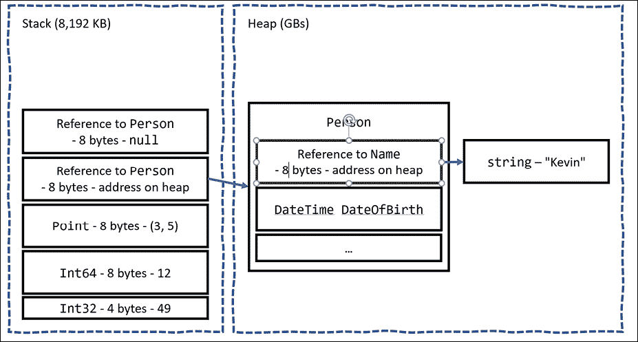
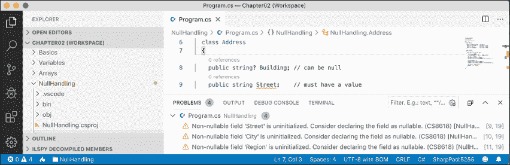
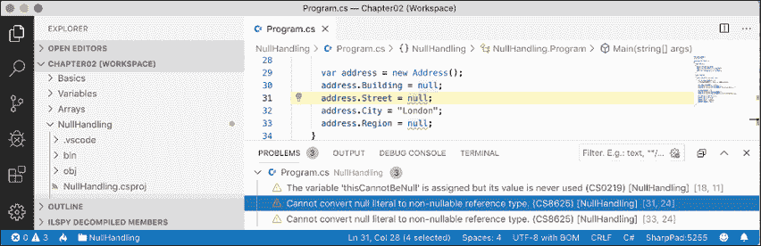
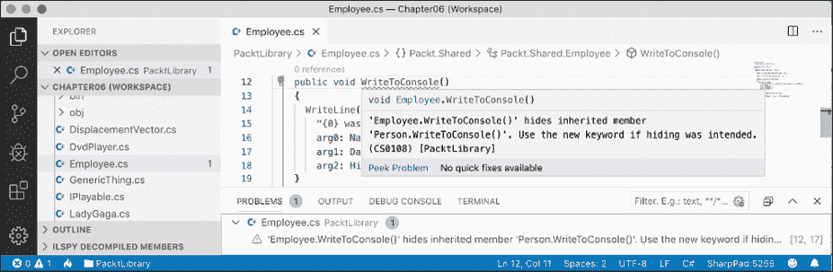
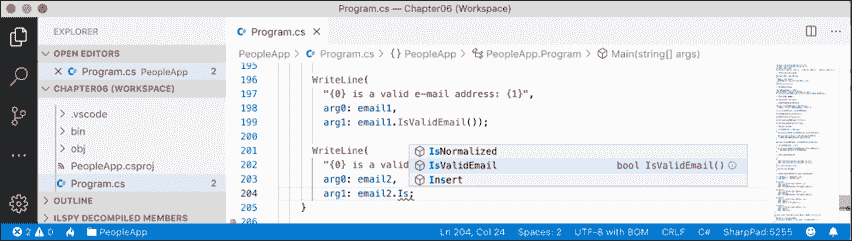

# 六、实现接口和继承类

本章是关于使用**面向对象编程**（**OOP**从现有类型派生新类型。您将了解如何定义用于执行简单操作的运算符和本地函数，以及用于在类型之间交换消息的委托和事件。您将实现通用功能的接口。您将了解泛型以及引用和值类型之间的区别。您将创建从基类继承的派生类以重用功能、重写继承的类型成员和使用多态性。最后，您将学习如何创建扩展方法以及如何在继承层次结构中的类之间转换。

本章涵盖以下主题：

*   设置类库和控制台应用
*   更多关于方法
*   提出和处理事件
*   使类型与泛型安全地可重用
*   实现接口
*   使用引用和值类型管理内存
*   使用空值
*   从类继承
*   在继承层次结构中强制转换
*   继承和扩展.NET 类型
*   使用分析器编写更好的代码

# 设置类库和控制台应用

我们将在开始定义一个工作区/解决方案，其中包含两个项目，如*第 5 章*中创建的、*使用面向对象编程*构建您自己的类型。即使您完成了该章中的所有练习，也请按照以下说明操作，因为我们将在类库中使用 C# 10 功能，因此它需要以.NET 6.0 而不是.NET 标准 2.0 为目标：

1.  使用您首选的编码工具创建名为`Chapter06`的新工作区/解决方案。
2.  添加类库项目，如以下列表中所定义：
    1.  项目模板：**类库**/`classlib`
    2.  工作区/解决方案文件和文件夹：`Chapter06`
    3.  项目文件和文件夹：`PacktLibrary`
3.  添加控制台应用项目，如以下列表中所定义：
    1.  项目模板：**控制台应用**/`console`
    2.  工作区/解决方案文件和文件夹：`Chapter06`
    3.  项目文件和文件夹：`PeopleApp`
4.  在`PacktLibrary`项目的中，将名为`Class1.cs`的文件重命名为`Person.cs`。
5.  修改文件内容，如下代码所示：

    ```cs
    using static System.Console;
    namespace Packt.Shared;
    public class Person : object
    {
      // fields
      public string? Name;    // ? allows null
      public DateTime DateOfBirth;
      public List<Person> Children = new(); // C# 9 or later
      // methods
      public void WriteToConsole() 
      {
        WriteLine($"{Name} was born on a {DateOfBirth:dddd}.");
      }
    } 
    ```

6.  在`PeopleApp`项目中，为`PacktLibrary`添加一个项目引用，如下标记中突出显示：

    ```cs
    <Project Sdk="Microsoft.NET.Sdk">
      <PropertyGroup>
        <OutputType>Exe</OutputType>
        <TargetFramework>net6.0</TargetFramework>
        <Nullable>enable</Nullable>
        <ImplicitUsings>enable</ImplicitUsings>
      </PropertyGroup>
     **<ItemGroup>**
     **<ProjectReference**
     **Include=****"..\PacktLibrary\PacktLibrary.csproj"** **/>**
     **</ItemGroup>**
    </Project> 
    ```

7.  建造项目，并记录表明两个项目均已成功建造的输出。

# 更多关于方法

我们可能希望`Person`的两个实例能够生育。我们可以通过编写方法来实现这一点。实例方法是对象对自身所做的动作；静态方法是类型执行的操作。

你选择哪一个取决于什么对行动最有意义。

**良好实践**：同时使用静态和实例方法来执行类似的操作通常是有意义的。例如，`string`既有`Compare`静态方法，也有`CompareTo`实例方法。这就把如何使用功能的选择权交给了使用您的类型的程序员，给了他们更多的灵活性。

## 使用方法实现功能

让我们从使用静态和实例方法实现一些功能开始：

1.  Add one instance method and one static method to the `Person` class that will allow two `Person` objects to procreate, as shown in the following code:

    ```cs
    // static method to "multiply"
    public static Person Procreate(Person p1, Person p2)
    {
      Person baby = new()
      {
        Name = $"Baby of {p1.Name} and {p2.Name}"
      };
      p1.Children.Add(baby);
      p2.Children.Add(baby);
      return baby;
    }
    // instance method to "multiply"
    public Person ProcreateWith(Person partner)
    {
      return Procreate(this, partner);
    } 
    ```

    注意以下几点：

    *   在名为`Procreate`的`static`方法中，要生成的`Person`对象作为名为`p1`和`p2`的参数传递。
    *   创建了一个名为`baby`的新`Person`类，其名称由两个已经生育的人的组合组成。稍后可以通过设置返回的`baby`变量的`Name`属性来更改此设置。
    *   `baby`对象被添加到两个父对象的`Children`集合中，然后返回。类是引用类型，这意味着添加了对存储在内存中的`baby`对象的引用，而不是`baby`对象的克隆。在本章后面，您将了解引用类型和值类型之间的区别。
    *   在名为`ProcreateWith`的实例方法中，要生成的`Person`对象作为名为`partner`的参数传递，并与`this`一起传递给静态`Procreate`方法，以重用方法实现。`this`是引用类的当前实例的关键字。

    **良好实践**：创建新对象或修改现有对象的方法应返回对该对象的引用，以便调用方可以访问结果。

1.  在`PeopleApp`项目的中，在`Program.cs`文件的顶部，删除注释并导入`Person`类的名称空间，静态导入`Console`类型，如下代码所示：

    ```cs
    using Packt.Shared;
    using static System.Console; 
    ```

2.  在`Program.cs`中，创建三个人并让他们彼此生育，注意要在`string`中添加双引号字符，必须在其前面加上反斜杠字符`\"`，如下代码所示：

    ```cs
    Person harry = new() { Name = "Harry" }; 
    Person mary = new() { Name = "Mary" }; 
    Person jill = new() { Name = "Jill" };
    // call instance method
    Person baby1 = mary.ProcreateWith(harry); 
    baby1.Name = "Gary";
    // call static method
    Person baby2 = Person.Procreate(harry, jill);
    WriteLine($"{harry.Name} has {harry.Children.Count} children."); 
    WriteLine($"{mary.Name} has {mary.Children.Count} children."); 
    WriteLine($"{jill.Name} has {jill.Children.Count} children."); 
    WriteLine(
      format: "{0}'s first child is named \"{1}\".",
      arg0: harry.Name,
      arg1: harry.Children[0].Name); 
    ```

3.  运行代码并查看结果，如下输出所示：

    ```cs
    Harry has 2 children. 
    Mary has 1 children. 
    Jill has 1 children.
    Harry's first child is named "Gary". 
    ```

## 使用运算符实现功能

`System.String`类有一个名为`Concat`的`static`方法，该方法连接两个字符串值并返回结果，如下代码所示：

```cs
string s1 = "Hello "; 
string s2 = "World!";
string s3 = string.Concat(s1, s2); 
WriteLine(s3); // Hello World! 
```

调用像`Concat`这样的方法是可行的，但程序员使用`+`符号运算符将两个`string`值“相加”可能更自然，如下代码所示：

```cs
string s3 = s1 + s2; 
```

一个著名的圣经短语是*向前并繁殖*，意思是生育。让我们编写代码，`*`（乘法）符号将允许两个`Person`对象生成。

我们通过为`*`符号定义`static`操作符来实现这一点。语法更像一个方法，因为实际上，操作符*是*一个方法，但使用符号而不是方法名，这使得语法更简洁。

1.  In `Person.cs`, create a `static` operator for the `*` symbol, as shown in the following code:

    ```cs
    // operator to "multiply"
    public static Person operator *(Person p1, Person p2)
    {
      return Person.Procreate(p1, p2);
    } 
    ```

    **良好实践**：与方法不同，运算符不会出现在类型的 IntelliSense 列表中。对于您定义的每个操作符，也要创建一个方法，因为程序员可能不清楚该操作符是否可用。然后，操作符的实现可以调用该方法，重用您编写的代码。提供方法的第二个原因是并非每个语言编译器都支持运算符；例如，尽管 Visual Basic 和 F# 支持*等算术运算符，但其他语言不要求支持 C# 支持的所有运算符。

2.  在`Program.cs`中，在调用`Procreate`方法后，在写入控制台的语句之前，使用`*`操作员制作另一个婴儿，如下代码中突出显示：

    ```cs
    // call static method
    Person baby2 = Person.Procreate(harry, jill);
    **// call an operator**
    **Person baby3 = harry * mary;** 
    ```

3.  运行代码并查看结果，如以下输出所示：

    ```cs
    Harry has 3 children. 
    Mary has 2 children. 
    Jill has 1 children.
    Harry's first child is named "Gary". 
    ```

## 使用本地函数实现功能

C# 7.0 中引入的一种语言特性是定义**局部函数**的能力。

局部函数是局部变量的等价方法。换句话说，它们是只能从定义它们的包含方法中访问的方法。在其他语言中，它们有时被称为**嵌套**或**内部函数**。

局部函数可以被定义在方法的任何地方：顶部，底部，或者是 T1，甚至在中间的某个地方！

我们将使用局部函数实现阶乘计算：

1.  在`Person.cs`中，添加语句定义一个`Factorial`函数，该函数使用自身内部的局部函数来计算结果，如下代码所示：

    ```cs
    // method with a local function
    public static int Factorial(int number)
    {
      if (number < 0)
      {
        throw new ArgumentException(
          $"{nameof(number)} cannot be less than zero.");
      }
      return localFactorial(number);
      int localFactorial(int localNumber) // local function
      {
        if (localNumber < 1) return 1;
        return localNumber * localFactorial(localNumber - 1);
      }
    } 
    ```

2.  在`Program.cs`中，添加一条语句调用`Factorial`函数并将返回值写入控制台，如下代码所示：

    ```cs
    WriteLine($"5! is {Person.Factorial(5)}"); 
    ```

3.  运行代码并查看结果，如以下输出所示：

    ```cs
    5! is 120 
    ```

# 提出和处理事件

方法通常被描述为对象可以在自身或相关对象上执行的*操作*。例如，`List<T>`可以向自身添加项目或清除自身，`File`可以在文件系统中创建或删除文件。

事件通常被描述为发生在对象上的*动作。例如，在一个用户界面中，`Button`有一个`Click`事件，点击按钮，并且`FileSystemWatcher`监听文件系统的更改通知，并引发目录或文件更改时触发的`Created`和`Deleted`等事件。*

另一种看待事件的方式是，它们提供了一种在两个对象之间交换消息的方式。

事件是建立在**代表**之上的，所以让我们先看看代表是什么以及他们是如何工作的。

## 使用委托调用方法

您已经看到了调用或执行方法的最常见方式：使用`.`操作符使用其名称访问方法。例如，`Console.WriteLine`告诉`Console`类型访问其`WriteLine`方法。

调用或执行方法的另一种方式是使用委托。如果您使用过支持**函数指针**的语言，那么可以将委托视为**类型安全的方法指针**。

换句话说，委托包含一个方法的内存地址，该方法的与委托匹配相同的签名，因此可以使用正确的参数类型安全地调用它。

例如，假设`Person`类中有一个方法必须将`string`类型作为其唯一参数传递，并返回一个`int`类型，如下代码所示：

```cs
public int MethodIWantToCall(string input)
{
  return input.Length; // it doesn't matter what the method does
} 
```

我可以在名为`p1`的`Person`实例上调用此方法，如下所示：

```cs
int answer = p1.MethodIWantToCall("Frog"); 
```

或者，我可以定义一个具有匹配签名的委托来间接调用该方法。请注意，参数的名称不必匹配。只有参数类型和返回值必须匹配，如以下代码所示：

```cs
delegate int DelegateWithMatchingSignature(string s); 
```

现在，我可以创建委托的一个实例，将其指向该方法，最后调用委托（该委托调用该方法），如以下代码所示：

```cs
// create a delegate instance that points to the method
DelegateWithMatchingSignature d = new(p1.MethodIWantToCall);
// call the delegate, which calls the method
int answer2 = d("Frog"); 
```

你可能会想，“这有什么意义？”嗯，它提供了灵活性。

例如，我们可以使用委托创建需要按顺序调用的方法队列。需要执行的排队操作在服务中很常见，以提供更好的可伸缩性。

另一个例子是允许多个操作并行执行。代理具有对在不同线程上运行的异步操作的内置支持，可以提供更好的响应能力。您将在*第 12 章**中学习如何使用多任务*提高性能和可伸缩性。

最重要的示例是，委托允许我们实现事件，用于在不需要相互了解的不同对象之间发送消息。事件是组件之间松散耦合的一个例子，因为组件不需要了解彼此，它们只需要知道事件签名。

委托和事件是 C# 中最令人困惑的两个特性，需要几次尝试才能理解，所以如果您感到迷茫，请不要担心！

## 定义和处理委托

Microsoft 有两个预定义的委托用于事件。他们的签名简单而灵活，如下代码所示：

```cs
public delegate void EventHandler(
  object? sender, EventArgs e);
public delegate void EventHandler<TEventArgs>(
  object? sender, TEventArgs e); 
```

**良好实践**：当您想用自己的类型定义事件时，应该使用这两个预定义委托中的一个。

让我们探索学员和活动：

1.  Add statements to the `Person` class and note the following points, as shown in the following code:
    *   它定义了一个名为`Shout`的`EventHandler`委托字段。
    *   它定义了一个`int`字段来存储`AngerLevel`。
    *   它定义了一个名为`Poke`的方法。
    *   每次有人被戳，他们的`AngerLevel`都会增加。一旦它们的`AngerLevel`达到三个，它们就会引发`Shout`事件，但前提是至少有一个事件委托指向代码中其他地方定义的方法；也就是说，它不是`null`：

    ```cs
    // delegate field
    public EventHandler? Shout;
    // data field
    public int AngerLevel;
    // method
    public void Poke()
    {
      AngerLevel++;
      if (AngerLevel >= 3)
      {
        // if something is listening...
        if (Shout != null)
        {
          // ...then call the delegate
          Shout(this, EventArgs.Empty);
        }
      }
    } 
    ```

    在调用对象的某个方法之前检查对象是否不是`null`是非常常见的。C# 6.0 及更高版本允许在`.`运算符前面使用`?`符号简化`null`检查，如下代码所示：

    ```cs
    Shout?.Invoke(this, EventArgs.Empty); 
    ```

2.  At the bottom of `Program.cs`, add a method with a matching signature that gets a reference to the `Person` object from the `sender` parameter and outputs some information about them, as shown in the following code:

    ```cs
    static void Harry_Shout(object? sender, EventArgs e)
    {
      if (sender is null) return;
      Person p = (Person)sender;
      WriteLine($"{p.Name} is this angry: {p.AngerLevel}.");
    } 
    ```

    微软对处理事件的方法名的约定是`ObjectName_EventName`。

3.  在`Program.cs`中，添加一条语句将方法分配给委托字段，如下代码所示：

    ```cs
    harry.Shout = Harry_Shout; 
    ```

4.  将`Poke`方法分配给`Shout`事件后，添加语句调用`Poke`方法四次，如下代码所示：

    ```cs
    harry.Shout = Harry_Shout;
    **harry.Poke();**
    **harry.Poke();**
    **harry.Poke();**
    **harry.Poke();** 
    ```

5.  运行代码并查看结果，注意哈利在头两次被戳时什么也没说，并且在至少被戳了三次后才愤怒到大叫，如以下输出所示：

    ```cs
    Harry is this angry: 3\. 
    Harry is this angry: 4. 
    ```

## 定义和处理事件

现在，您已经了解了委托如何实现事件最重要的功能：能够为可由完全不同的代码段实现的方法定义签名，然后调用该方法以及连接到委托字段的任何其他方法。

但是关于事件的什么呢？他们没有你想象的那么重要。

将方法分配给委托字段时，不应像前面的示例中那样使用简单赋值运算符。

委托是多播的，这意味着您可以将多个委托分配给单个委托字段。我们可以使用`+=`操作符来代替`=`赋值，这样我们就可以向同一委托字段添加更多方法。调用委托时，将调用所有指定的方法，尽管您无法控制调用它们的顺序。

如果`Shout`委托字段已经引用了一个或多个方法，通过分配一个方法，它将替换所有其他方法。对于用于事件的委托，我们通常希望确保程序员只使用`+=`运算符或`-=`运算符来分配和删除方法：

1.  为了加强这一点，在`Person.cs`中，将`event`关键字添加到委托字段声明中，如以下代码中突出显示的：

    ```cs
    public **event** EventHandler? Shout; 
    ```

2.  Build the `PeopleApp` project and note the compiler error message, as shown in the following output:

    ```cs
    Program.cs(41,13): error CS0079: The event 'Person.Shout' can only appear on the left hand side of += or -= 
    ```

    这（几乎）就是`event`关键字所做的一切！如果一个委托字段永远不会分配多个方法，那么从技术上讲，您不需要“事件”，但指出您的意思以及您希望将委托字段用作事件仍然是一种良好的实践。

3.  将方法赋值修改为使用`+=`，如下代码所示：

    ```cs
    harry.Shout += Harry_Shout; 
    ```

4.  运行代码并注意其行为与以前相同。

# 使类型与泛型安全地可重用

2005 年，在 C# 2.0 和.NET Framework 2.0 的支持下，微软引入了一个名为**泛型**的功能，该功能使您的类型更安全、更高效地可重用。它允许程序员将类型作为参数传递，这与将对象作为参数传递的方式类似。

## 使用非泛型类型

首先，让我们看一个使用非泛型类型的示例，这样您就可以理解泛型设计用来解决的问题，例如弱类型的参数和值，以及使用`System.Object`导致的性能问题。

`System.Collections.Hashtable`可用于存储多个值，每个值都有一个唯一的键，以后可用于快速查找其值。键和值都可以是任何对象，因为它们被声明为`System.Object`。虽然这在存储值类型（如整数）时提供了灵活性，但速度较慢，而且由于添加项时不进行类型检查，因此更容易引入错误。

让我们编写一些代码：

1.  在`Program.cs`中，创建一个非泛型集合`System.Collections.Hashtable`的实例，然后向其中添加四项，如下代码所示：

    ```cs
    // non-generic lookup collection
    System.Collections.Hashtable lookupObject = new();
    lookupObject.Add(key: 1, value: "Alpha");
    lookupObject.Add(key: 2, value: "Beta");
    lookupObject.Add(key: 3, value: "Gamma");
    lookupObject.Add(key: harry, value: "Delta"); 
    ```

2.  添加语句定义一个值为`2`的`key`并在哈希表中查找其值，如下代码所示：

    ```cs
    int key = 2; // lookup the value that has 2 as its key
    WriteLine(format: "Key {0} has value: {1}",
      arg0: key,
      arg1: lookupObject[key]); 
    ```

3.  添加语句以使用`harry`对象查找其值，如下代码所示：

    ```cs
    // lookup the value that has harry as its key
    WriteLine(format: "Key {0} has value: {1}",
      arg0: harry,
      arg1: lookupObject[harry]); 
    ```

4.  运行代码并注意其工作，如以下输出所示：

    ```cs
    Key 2 has value: Beta
    Key Packt.Shared.Person has value: Delta 
    ```

尽管代码可以工作，但仍有可能出现错误，因为实际上任何类型都可以用于键或值。如果另一个开发人员使用了您的查找对象，并希望所有项都是某个类型，那么他们可能会将它们强制转换为该类型并获得异常，因为某些值可能是不同的类型。包含大量项的查找对象也会导致性能不佳。

**良好实践**：避免使用`System.Collections`命名空间中的类型。

## 使用泛型类型

`System.Collections.Generic.Dictionary<TKey, TValue>`可用于存储多个值，每个值都有一个唯一的键，以后可用于快速查找其值。键和值都可以是任何对象，但是当您第一次实例化集合时，必须告诉编译器键和值的类型。您可以通过在尖括号`<>`、`TKey`和`TValue`中指定**通用参数**的类型来完成此操作。

**良好实践**：当泛型类型有一个可定义类型时，应将其命名为`T`，例如`List<T>`，其中`T`是列表中存储的类型。当泛型类型有多个可定义的类型时，它们应该使用`T`作为名称前缀，并有一个合理的名称，例如`Dictionary<TKey, TValue>`。

这提供了灵活性，速度更快，并且更容易避免错误，因为在添加项目时会进行类型检查。

让我们编写一些代码来使用泛型解决问题：

1.  在`Program.cs`中，创建泛型查找集合`Dictionary<TKey, TValue>`的一个实例，然后向其中添加四项，如下代码所示：

    ```cs
    // generic lookup collection
    Dictionary<int, string> lookupIntString = new();
    lookupIntString.Add(key: 1, value: "Alpha");
    lookupIntString.Add(key: 2, value: "Beta");
    lookupIntString.Add(key: 3, value: "Gamma");
    lookupIntString.Add(key: harry, value: "Delta"); 
    ```

2.  注意使用`harry`作为键时的编译错误，如以下输出所示：

    ```cs
    /Users/markjprice/Code/Chapter06/PeopleApp/Program.cs(98,32): error CS1503: Argument 1: cannot convert from 'Packt.Shared.Person' to 'int' [/Users/markjprice/Code/Chapter06/PeopleApp/PeopleApp.csproj] 
    ```

3.  将`harry`替换为`4`。
4.  添加语句将`key`设置为`3`并使用它在字典中查找其值，如下代码所示：

    ```cs
    key = 3;
    WriteLine(format: "Key {0} has value: {1}",
      arg0: key,
      arg1: lookupIntString[key]); 
    ```

5.  运行代码并注意其工作，如以下输出所示：

    ```cs
    Key 3 has value: Gamma 
    ```

# 实现接口

接口是连接不同类型以产生新事物的一种方式。把它们想象成乐高积木上的鞋钉™ 砖块，允许它们“粘”在一起，或插头和插座的电气标准。

如果一个类型实现了一个接口，那么它向.NET 的其余部分承诺它支持特定的功能。这就是为什么它们有时被描述为合同。

## 公共接口

以下是您的类型可能需要实现的一些常见接口：

<colgroup><col> <col> <col></colgroup> 
| 界面 | 方法 | 描述 |
| `IComparable` | `CompareTo(other)` | 这定义了一个比较方法，类型实现该方法来对其实例进行排序。 |
| `IComparer` | `Compare(first, second)` | 这定义了一个比较方法，辅助类型实现该方法来对主类型的实例进行排序或排序。 |
| `IDisposable` | `Dispose()` | 这定义了一种释放非托管资源比等待终结器更有效的处置方法（有关更多详细信息，请参阅本章后面的*释放非托管资源*部分）。 |
| `IFormattable` | `ToString(format, culture)` | 这定义了一个区域性感知方法，用于将对象的值格式化为字符串表示形式。 |
| `IFormatter` | `Serialize(stream, object)``Deserialize(stream)` | 这定义了将对象转换为字节流或从字节流转换为存储或传输的方法。 |
| `IFormatProvider` | `GetFormat(type)` | 这定义了一种基于语言和区域格式化输入的方法。 |

## 排序时比较对象

您想要实现的最常见的接口之一是`IComparable`。它有一个方法名为`CompareTo`。它有两个变体，一个用于可空的`object`类型，另一个用于可空的泛型类型`T`，如下代码所示：

```cs
namespace System
{
  public interface IComparable
  {
    int CompareTo(object? obj);
  }
  public interface IComparable<in T>
  {
    int CompareTo(T? other);
  }
} 
```

例如，如果`string`小于所比较的`string`，则`string`类型通过返回`-1`来执行`IComparable`，如果大于，则返回`1`。如果`int`小于所比较的`int`或`1`大于，则`int`类型通过返回`-1`来执行`IComparable`。

如果一个类型实现了一个`IComparable`接口，那么数组和集合可以对其进行排序。

在我们为`Person`类实现`IComparable`接口及其`CompareTo`方法之前，让我们看看当我们尝试对`Person`实例数组进行排序时会发生什么：

1.  在`Program.cs`中，添加创建`Person`实例数组并将项目写入控制台的语句，然后尝试对数组排序并再次将项目写入控制台，如下代码所示：

    ```cs
    Person[] people =
    {
      new() { Name = "Simon" },
      new() { Name = "Jenny" },
      new() { Name = "Adam" },
      new() { Name = "Richard" }
    };
    WriteLine("Initial list of people:"); 
    foreach (Person p in people)
    {
      WriteLine($"  {p.Name}");
    }
    WriteLine("Use Person's IComparable implementation to sort:");
    Array.Sort(people);
    foreach (Person p in people)
    {
      WriteLine($"  {p.Name}");
    } 
    ```

2.  运行代码，将引发异常。正如消息所解释的，要解决问题，我们的类型必须实现`IComparable`，如以下输出所示：

    ```cs
    Unhandled Exception: System.InvalidOperationException: Failed to compare two elements in the array. ---> System.ArgumentException: At least one object must implement IComparable. 
    ```

3.  In `Person.cs`, after inheriting from `object`, add a comma and enter `IComparable<Person>`, as shown in the following code:

    ```cs
    public class Person : object, IComparable<Person> 
    ```

    您的代码编辑器将在新代码下画一条红色曲线，警告您尚未实现承诺的方法。如果您点击灯泡并选择**实现界面**选项，您的代码编辑器可以为您编写框架实现。

4.  向下滚动到`Person`类的底部，找到为您编写的方法，删除抛出`NotImplementedException`错误的语句，如下面代码中突出显示的：

    ```cs
    public int CompareTo(Person? other)
    {
    **throw****new** **NotImplementedException();**
    } 
    ```

5.  Add a statement to call the `CompareTo` method of the `Name` field, which uses the `string` type's implementation of `CompareTo` and return the result, as shown highlighted in the following code:

    ```cs
    public int CompareTo(Person? other)
    {
      if (Name is null) return 0;
    **return** **Name.CompareTo(other?.Name);** 
    } 
    ```

    我们选择通过比较两个`Person`实例的`Name`字段来比较它们。`Person`因此，实例将按名称的字母顺序排序。为了简单起见，我没有在这些示例中添加`null`检查。

6.  运行代码并注意这次它的工作方式是正常的，如以下输出所示：

    ```cs
    Initial list of people:
      Simon
      Jenny
      Adam
      Richard
    Use Person's IComparable implementation to sort:
      Adam
      Jenny
      Richard
      Simon 
    ```

**良好实践**：如果有人想要对您类型的数组或实例集合进行排序，则实现`IComparable`接口。

## 使用单独的类比较对象

有时，您无法访问某个类型的源代码，并且它可能无法实现`IComparable`接口。幸运的是，还有另一种方法可以对类型的实例进行排序。您可以创建一个单独的类型，它实现了一个稍微不同的接口，名为`IComparer`：

1.  在`PacktLibrary`项目中，添加一个名为`PersonComparer.cs`的新类文件，其中包含一个实现`IComparer`接口的类，该接口将比较两个人，即两个`Person`实例。通过比较其`Name`字段的长度来实现，或者如果名称的长度相同，则通过按字母顺序比较名称来实现，如以下代码所示：

    ```cs
    namespace Packt.Shared;
    public class PersonComparer : IComparer<Person>
    {
      public int Compare(Person? x, Person? y)
      {
        if (x is null || y is null)
        {
          return 0;
        }
        // Compare the Name lengths...
        int result = x.Name.Length.CompareTo(y.Name.Length);
        // ...if they are equal...
        if (result == 0)
        {
          // ...then compare by the Names...
          return x.Name.CompareTo(y.Name);
        }
        else // result will be -1 or 1
        {
          // ...otherwise compare by the lengths.
          return result; 
        }
      }
    } 
    ```

2.  在`Program.cs`中，添加语句，使用此替代实现对数组进行排序，如下代码所示：

    ```cs
    WriteLine("Use PersonComparer's IComparer implementation to sort:"); 
    Array.Sort(people, new PersonComparer());
    foreach (Person p in people)
    {
      WriteLine($"  {p.Name}");
    } 
    ```

3.  运行代码并查看结果，如以下输出所示：

    ```cs
    Use PersonComparer's IComparer implementation to sort:
      Adam
      Jenny
      Simon
      Richard 
    ```

这一次，当对`people`数组进行排序时，我们显式要求排序算法使用`PersonComparer`类型，这样人们会先用最短的名字进行排序，如 Adam，最后用最长的名字进行排序，如 Richard；当两个或多个名字的长度相等时，按字母顺序排序，就像珍妮和西蒙一样。

## 隐式和显式接口实现

接口可以隐式和显式实现。隐式实现更简单、更常见。只有当一个类型必须有多个具有相同名称和签名的方法时，才需要显式实现。

例如，`IGamePlayer`和`IKeyHolder`可能都有一个名为`Lose`的方法，参数相同，因为游戏和钥匙都可能丢失。在必须实现两个接口的类型中，`Lose`只能有一个实现是隐式方法。如果两个接口可以共享同一个实现，则这是可行的，但如果不能共享，则另一个`Lose`方法必须以不同的方式实现并显式调用，如以下代码所示：

```cs
public interface IGamePlayer
{
  void Lose();
}
public interface IKeyHolder
{
  void Lose();
}
public class Person : IGamePlayer, IKeyHolder
{
  public void Lose() // implicit implementation
  {
    // implement losing a key
  }
  void IGamePlayer.Lose() // explicit implementation
  {
    // implement losing a game
  }
}
// calling implicit and explicit implementations of Lose
Person p = new();
p.Lose(); // calls implicit implementation of losing a key
((IGamePlayer)p).Lose(); // calls explicit implementation of losing a game
IGamePlayer player = p as IGamePlayer;
player.Lose(); // calls explicit implementation of losing a game 
```

## 使用默认实现定义接口

C# 8.0 中引入的语言特性是接口的**默认实现**。让我们看看它的实际行动：

1.  在`PacktLibrary`项目中，添加一个名为`IPlayable.cs`的新文件。
2.  修改语句，定义一个公共`IPlayable`接口，有两种方式，分别为`Play`和`Pause`，如下代码所示：

    ```cs
    namespace Packt.Shared;
    public interface IPlayable
    {
      void Play();
      void Pause();
    } 
    ```

3.  在`PacktLibrary`项目中，添加一个名为`DvdPlayer.cs`的新类文件。
4.  Modify the statements in the file to implement the `IPlayable` interface, as shown in the following code:

    ```cs
    using static System.Console;
    namespace Packt.Shared;
    public class DvdPlayer : IPlayable
    {
      public void Pause()
      {
        WriteLine("DVD player is pausing.");
      }
      public void Play()
      {
        WriteLine("DVD player is playing.");
      }
    } 
    ```

    这很有用，但如果我们决定添加第三个名为`Stop`的方法，该怎么办？在 C# 8.0 之前，如果至少有一种类型实现了原始接口，那么这是不可能的。接口的一个要点是它是一个固定的合同。

    C# 8.0 允许接口在发布后添加新成员，只要它们有默认实现。C# 纯粹主义者不喜欢这个想法，但出于实际原因，例如避免破坏更改或必须定义一个全新的接口，它是有用的，而 Java 和 Swift 等其他语言也支持类似的技术。

    支持默认接口实现需要对底层平台进行一些基本更改，因此只有当目标框架为.NET 5.0 或更高版本、.NET Core 3.0 或更高版本，或.NET Standard 2.1 时，才支持 C#。因此，.NET Framework 不支持它们。

5.  修改`IPlayable`接口，增加一个`Stop`方法，默认实现，如下代码所示：

    ```cs
    **using****static** **System.Console;**
    namespace Packt.Shared;
    public interface IPlayable
    {
      void Play();
      void Pause();
    **void****Stop****()** **// default interface implementation**
     **{**
     **WriteLine(****"Default implementation of Stop."****);**
     **}**
    } 
    ```

6.  构建`PeopleApp`项目，注意尽管`DvdPlayer`类没有实现`Stop`，但项目编译成功。将来，我们可以通过在`DvdPlayer`类中实现来覆盖`Stop`的默认实现。

# 使用引用和值类型管理内存

我已经多次提到引用类型。让我们更详细地看看它们。

有两种类型的内存：**堆栈**内存和**堆**内存。借助现代操作系统，堆栈和堆可以位于物理或虚拟内存中的任何位置。

堆栈内存使用起来更快（因为它是由 CPU 直接管理的，并且因为它使用后进先出机制，所以更可能在一级或二级缓存中存储数据），但大小有限，而堆内存速度较慢，但数量更多。

例如，在 macOS 终端中，我可以输入命令`ulimit -a`来发现堆栈大小被限制为 8192 KB，而其他内存是“无限的”。堆栈内存的有限量就是为什么很容易填满它并获得“堆栈溢出”的原因

## 定义引用和值类型

有三个 C# 关键字可用于定义对象类型：`class`、`record`和`struct`。所有人都可以有相同的成员，比如字段和方法。它们之间的一个区别是如何分配内存。

当您使用`record`或`class`定义类型时，您定义的是**引用类型**。这意味着对象本身的内存是在堆上分配的，只有对象的内存地址（以及一点开销）存储在堆栈上。

当您使用`record struct`或`struct`定义类型时，您定义的是**值类型**。这意味着对象本身的内存是在堆栈上分配的。

如果`struct`使用的字段类型不是`struct`类型，那么这些字段将存储在堆上，这意味着该对象的数据同时存储在堆栈和堆中！

以下是最常见的结构类型：

*   **编号**`System`**类型**：`byte`、`sbyte`、`short`、`ushort`、`int`、`uint`、`long`、`ulong`、`float`、`double`、`decimal`
*   **其他**`System`**类型**：`char`、`DateTime`和`bool`
*   `System.Drawing`**类型**：`Color`、`Point`和`Rectangle`

几乎所有其他类型都是`class`类型，包括`string`。

除了类型数据在内存中的存储位置不同之外，另一个主要区别是您不能从`struct`继承。

## 引用和值类型如何存储在内存中

假设您有一个声明一些变量的控制台应用，如以下代码所示：

```cs
int number1 = 49;
long number2 = 12;
System.Drawing.Point location = new(x: 4, y: 5);
Person kevin = new() { Name = "Kevin", 
  DateOfBirth = new(year: 1988, month: 9, day: 23) };
Person sally; 
```

让我们回顾一下当这些语句执行时，堆栈和堆上分配了哪些内存，如*图 6.1*所示，如下表所示：

*   `number1`变量是一种值类型（也称为`struct`），因此它是在堆栈上分配的，它使用 4 字节的内存，因为它是一个 32 位整数。其值 49 直接存储在变量中。
*   `number2`变量也是一种值类型，因此它也在堆栈上分配，并且它使用 8 个字节，因为它是 64 位整数。
*   `location`变量也是一种值类型，因此在堆栈上分配，它使用 8 个字节，因为它由两个 32 位整数组成，`x`和`y`。
*   `kevin`变量是一种引用类型（也称为`class`），因此 64 位内存地址（假设为 64 位操作系统）在堆栈上分配了 8 个字节，堆上分配了足够的字节来存储`Person`的实例。
*   `sally`变量是引用类型，因此在堆栈上为 64 位内存地址分配 8 个字节。它当前为`null`，这意味着堆中尚未为其分配内存。

<figure class="mediaobject"></figure>

图 6.1：如何在堆栈和堆中分配值和引用类型

为引用类型分配的所有内存都存储在堆上。如果像`DateTime`这样的值类型用于像`Person`这样的引用类型的字段，那么`DateTime`值存储在堆上。

如果值类型具有引用类型的字段，则值类型的该部分存储在堆上。`Point`是由两个字段组成的值类型，这两个字段本身都是值类型，因此可以在堆栈上分配整个对象。如果`Point`值类型有一个引用类型的字段，比如`string`，那么`string`字节将存储在堆上。

## 类型相等

通常使用`==`和`!=`运算符比较两个变量。对于引用类型和值类型，这两个运算符的行为不同。

当您检查两个值类型变量的相等性时，.NET 会逐字比较堆栈上这两个变量的值，如果它们相等，则返回`true`，如下代码所示：

```cs
int a = 3;
int b = 3;
WriteLine($"a == b: {(a == b)}"); // true 
```

当您检查两个引用类型变量是否相等时，.NET 会比较这两个变量的内存地址，如果相等，则返回`true`，如下代码所示：

```cs
Person a = new() { Name = "Kevin" };
Person b = new() { Name = "Kevin" };
WriteLine($"a == b: {(a == b)}"); // false 
```

这是因为它们不是同一个对象。如果两个变量都指向堆上的同一个对象，则它们将相等，如以下代码所示：

```cs
Person a = new() { Name = "Kevin" };
Person b = a;
WriteLine($"a == b: {(a == b)}"); // true 
```

此行为的一个例外是`string`类型。它是引用类型，但已重写相等运算符，使它们的行为与值类型类似，如以下代码所示：

```cs
string a = "Kevin";
string b = "Kevin";
WriteLine($"a == b: {(a == b)}"); // true 
```

您可以对类执行类似的操作，使相等运算符返回`true`，即使它们不是相同的对象（堆上的相同内存地址），但如果它们的字段具有相同的值，则返回`true`，但这超出了本书的范围。或者，使用`record class`，因为他们的好处之一是为您实现此行为。

## 定义结构类型

让我们来探索定义您自己的值类型：

1.  在`PacktLibrary`项目中，添加一个名为`DisplacementVector.cs`的文件。
2.  修改文件，如下代码所示，注意如下：

    ```cs
    namespace Packt.Shared;
    public struct DisplacementVector
    {
      public int X;
      public int Y;
      public DisplacementVector(int initialX, int initialY)
      {
        X = initialX;
        Y = initialY;
      }
      public static DisplacementVector operator +(
        DisplacementVector vector1,
        DisplacementVector vector2)
      {
        return new(
          vector1.X + vector2.X,
          vector1.Y + vector2.Y);
      }
    } 
    ```

    *   使用`struct`而不是`class`声明类型。
    *   它有两个`int`字段，分别命名为`X`和`Y`。
    *   它有一个用于设置`X`和`Y`初始值的构造函数。
    *   它有一个用于将两个实例相加的运算符，该运算符返回一个类型为的新实例，其中`X`添加到`X`，而`Y`添加到`Y`。
3.  在`Program.cs`中，添加语句创建`DisplacementVector`的两个新实例，将它们添加在一起，并输出结果，如下代码所示：

    ```cs
    DisplacementVector dv1 = new(3, 5); 
    DisplacementVector dv2 = new(-2, 7); 
    DisplacementVector dv3 = dv1 + dv2;
    WriteLine($"({dv1.X}, {dv1.Y}) + ({dv2.X}, {dv2.Y}) = ({dv3.X}, {dv3.Y})"); 
    ```

4.  运行代码并查看结果，如以下输出所示：

    ```cs
    (3, 5) + (-2, 7) = (1, 12) 
    ```

**良好实践**：如果您的类型中所有字段使用的总字节数小于等于 16 字节，则您的类型仅对其字段使用值类型，并且您永远不会希望从您的类型派生，那么 Microsoft 建议您使用`struct`。如果您的类型使用超过 16 字节的堆栈内存，如果它的字段使用引用类型，或者您可能希望从中继承，则使用`class`。

## 使用记录结构类型

C# 10 引入了将`record`关键字用于`struct`类型以及类类型的能力。

我们可以定义`DisplacementVector`类型，如下代码所示：

```cs
public record struct DisplacementVector(int X, int Y); 
```

通过此更改，Microsoft 建议如果要定义一个`record class`，即使`class`关键字是可选的，也要显式指定`class`，如下代码所示：

```cs
public record class ImmutableAnimal(string Name); 
```

## 释放非托管资源

在前一章中，我们看到可以使用构造函数初始化字段，并且一个类型可以有多个构造函数。设想一个构造函数分配一个非托管资源；也就是说，任何不受.NET 控制的东西，比如操作系统控制下的文件或互斥体。非托管资源必须手动释放，因为.NET 无法使用其自动垃圾收集功能为我们执行此操作。

垃圾收集是一个高级主题，因此对于这个主题，我将展示一些代码示例，但您不需要自己编写代码。

每种类型都可以有一个**终结器**，当需要释放资源时，.NET 运行时将调用该终结器。终结器与构造函数具有相同的名称；也就是说，类型名，但它的前缀是波浪号`~`。

不要将终结器（也称为**析构函数**与`Deconstruct`方法混淆。析构函数释放资源；也就是说，它会破坏内存中的对象。`Deconstruct`方法返回一个分解为其组成部分的对象，并使用 C# 解构语法，例如，在处理元组时：

```cs
public class Animal
{
  public Animal() // constructor
  {
    // allocate any unmanaged resources
  }
  ~Animal() // Finalizer aka destructor
  {
    // deallocate any unmanaged resources
  }
} 
```

前面的代码示例是处理非托管资源时应执行的最低要求。但是只提供终结器的问题是.NET 垃圾收集器需要两个垃圾收集来完全释放为此类型分配的资源。

尽管是可选的，但建议还提供一种方法，允许使用您的类型的开发人员显式释放资源，以便垃圾回收器可以立即确定地释放非托管资源（如文件）的托管部分，然后在一次垃圾收集而不是两轮垃圾收集中释放对象的托管内存部分。

通过实现`IDisposable`接口，有一个标准的机制来实现这一点，如下例所示：

```cs
public class Animal : IDisposable
{
  public Animal()
  {
    // allocate unmanaged resource
  }
  ~Animal() // Finalizer
  {
    Dispose(false);
  }
  bool disposed = false; // have resources been released?
  public void Dispose()
  {
    Dispose(true);
    // tell garbage collector it does not need to call the finalizer
    GC.SuppressFinalize(this); 
  }
  protected virtual void Dispose(bool disposing)
  {
    if (disposed) return;
    // deallocate the *unmanaged* resource
    // ...
    if (disposing)
    {
      // deallocate any other *managed* resources
      // ...
    }
    disposed = true;
  }
} 
```

有两种`Dispose`方法，一种`public`和一种`protected`：

*   `public void Dispose`方法将由使用您的类型的开发人员调用。调用时，需要释放非托管和托管资源。
*   内部使用带有`bool`参数的`protected virtual void Dispose`方法来实现资源的释放。它需要检查`disposing`参数和`disposed`字段，因为如果终结器线程已经运行并且调用了`~Animal`方法，那么只需要释放非托管资源。

对`GC.SuppressFinalize(this)`的调用通知垃圾收集器它不再需要运行终结器，并消除第二次垃圾收集的需要。

## 确保调用 Dispose

当某人使用实现了`IDisposable`的类型时，他们可以确保用`using`语句调用公共`Dispose`方法，如下代码所示：

```cs
using (Animal a = new())
{
  // code that uses the Animal instance
} 
```

编译器将您的代码转换为如下内容，这保证即使发生异常，`Dispose`方法仍将被调用：

```cs
Animal a = new(); 
try
{
  // code that uses the Animal instance
}
finally
{
  if (a != null) a.Dispose();
} 
```

您将看到使用`IDisposable`、`using`语句和`try`释放非托管资源的实际示例。。。*第 9 章*中的`finally`块*处理文件、流和序列化*。

# 使用空值

您已经了解了如何在`struct`变量中存储数字等原始值。但是如果一个变量还没有值呢？我们如何表明这一点？C# 有一个`null`值的概念，可以用来表示变量尚未设置。

## 使值类型可为 null

默认情况下，像`int`和`DateTime`这样的值类型必须始终有一个值，因此它们的名称。有时，例如，当读取存储在允许空值、缺失值或空值的数据库中的值时，允许值类型为`null`很方便。我们称之为**可空值类型**。

您可以通过在声明变量时向类型添加问号作为后缀来启用此功能。

让我们看一个例子：

1.  使用您首选的编码工具将新的**控制台应用**添加到名为`NullHandling`的`Chapter06`工作区/解决方案中。本节需要一个包含项目文件的完整应用，因此您将无法使用.NET 交互式笔记本。
2.  在 Visual Studio 代码中，选择`NullHandling`作为活动的 OmniSharp 项目。在 Visual Studio 中，将`NullHandling`设置为启动项目。
3.  在`Program.cs`中，输入语句，对`int`变量声明并赋值，包括`null`，如下代码所示：

    ```cs
    int thisCannotBeNull  = 4; 
    thisCannotBeNull = null; // compile error!
    int? thisCouldBeNull = null; 
    WriteLine(thisCouldBeNull); 
    WriteLine(thisCouldBeNull.GetValueOrDefault());
    thisCouldBeNull = 7; 
    WriteLine(thisCouldBeNull); 
    WriteLine(thisCouldBeNull.GetValueOrDefault()); 
    ```

4.  注释掉给出编译错误的语句。
5.  运行代码并查看结果，如以下输出所示：

    ```cs
    0
    7
    7 
    ```

第一行为空，因为它正在输出`null`值！

## 理解可空引用类型

`null`值的使用在许多语言中非常普遍，以至于许多有经验的程序员从未质疑过它存在的必要性。但在很多情况下，如果不允许变量有`null`值，我们可以编写更好、更简单的代码。

C# 8 语言最重要的变化是引入了可空和不可空引用类型。“但是等等！”您可能会想，“引用类型已经可以为空了！”

您可能是对的，但是在 C# 8 及更高版本中，通过设置文件或项目级别选项以启用此有用的新功能，可以将引用类型配置为不再允许`null`值。因为这对 C# 来说是一个很大的改变，微软决定让这项功能选择加入。

这项新的 C# 语言功能需要多年的时间才能产生影响，因为数千个现有的 library软件包和应用将期待旧的行为。直到.NET6，甚至微软都没有时间在所有主要的.NET 软件包中完全实现这一新功能。

在过渡期间，您可以为自己的项目选择几种方法：

*   **默认**：无需更改。不支持不可为 null 的引用类型。
*   **选择加入项目，选择退出文件**：在项目级别启用该功能，对于任何需要与旧行为保持兼容的文件，选择退出。这是微软在内部使用的方法，同时它更新自己的软件包以使用这一新功能。
*   **选择加入文件**：仅对单个文件启用该功能。

## 启用可为 null 和不可为 null 的引用类型

要在项目级别启用该功能，请将以下内容添加到项目文件中：

```cs
<PropertyGroup>
  ...
  <Nullable>enable</Nullable>
</PropertyGroup> 
```

现在，这在以.NET6.0 为目标的项目模板中默认完成。

要在文件级禁用功能，请在代码文件顶部添加以下内容：

```cs
# nullable disable 
```

要在文件级别启用该功能，请将以下内容添加到代码文件的顶部：

```cs
# nullable enable 
```

## 声明不可为 null 的变量和参数

如果您启用了可为空的引用类型，并且希望为引用类型分配`null`值，那么您必须使用与使值类型可为空相同的语法，即在类型声明后添加`?`符号。

那么，可空引用类型是如何工作的呢？让我们看一个例子。存储地址信息时，您可能希望强制为街道、城市和地区设置一个值，但建筑物可以保留为空，即`null`：

1.  在`NullHandling.csproj`中，在`Program.cs`中，在文件的底部添加声明一个包含四个字段的`Address`类的语句，如下代码所示：

    ```cs
    class Address
    {
      public string? Building; 
      public string Street; 
      public string City; 
      public string Region;
    } 
    ```

2.  After a few seconds, note the warnings about non-nullable fields, like `Street` not being initialized, as shown in *Figure 6.2*:

    <figure class="mediaobject"></figure>

    图 6.2:PROBLEMS 窗口中关于不可为空字段的警告消息

3.  将空的`string`值分配给三个不可为空的字段中的每一个，如以下代码所示：

    ```cs
    public string Street = string.Empty; 
    public string City = string.Empty; 
    public string Region = string.Empty; 
    ```

4.  在`Program.cs`中，在文件顶部静态导入`Console`，然后添加语句实例化`Address`并设置其属性，如下代码所示：

    ```cs
    Address address = new(); 
    address.Building = null; 
    address.Street = null; 
    address.City = "London"; 
    address.Region = null; 
    ```

5.  Note the warnings, as shown in *Figure 6.3*:

    <figure class="mediaobject"></figure>

    图 6.3：关于向不可为 null 的字段分配 null 的警告消息

因此，这就是为什么新的语言特性被命名为空引用类型。从 C# 8.0 的开始，未经修饰的引用类型可以变为不可为 null，并且使用与值类型相同的语法使引用类型可为 null。

## 检查空值

检查可为 null 的引用类型或可为 null 的值类型变量当前是否包含`null`非常重要，因为如果不包含，可能会抛出`NullReferenceException`，从而导致错误。在使用可为空的变量之前，应检查`null`值，如下代码所示：

```cs
// check that the variable is not null before using it
if (thisCouldBeNull != null)
{
  // access a member of thisCouldBeNull
  int length = thisCouldBeNull.Length; // could throw exception
  ...
} 
```

C# 7 引入了`is`与`!`（非）操作符组合作为`!=`的替代，如下代码所示：

```cs
if (!(thisCouldBeNull is null))
{ 
```

C# 9 引入了`is not`作为更清晰的替代方案，如下代码所示：

```cs
if (thisCouldBeNull is not null)
{ 
```

如果您试图使用可能为`null`的变量的成员，请使用空条件运算符`?.`，如下代码所示：

```cs
string authorName = null;
// the following throws a NullReferenceException
int x = authorName.Length;
// instead of throwing an exception, null is assigned to y
int? y = authorName?.Length; 
```

有时您希望为结果分配一个变量，或者如果变量为`null`，则使用替代值，如`3`。您可以使用空合并运算符`??`执行此操作，如以下代码所示：

```cs
// result will be 3 if authorName?.Length is null 
int result = authorName?.Length ?? 3; 
Console.WriteLine(result); 
```

**良好实践**：即使启用了可空引用类型，也应该检查`null`的不可空参数并抛出一个`ArgumentNullException`。

### 检查方法参数中是否为 null

使用参数定义方法时，最好检查`null`值。

在 C# 的早期版本中，您必须编写`if`语句来检查`null`参数值，然后为任何参数`null`抛出一个`ArgumentNullException`，如下代码所示：

```cs
public void Hire(Person manager, Person employee)
{
  if (manager == null)
  {
    throw new ArgumentNullException(nameof(manager));
  }
  if (employee == null)
  {
    throw new ArgumentNullException(nameof(employee));
  }
  ...
} 
```

C# 11 可能会引入一个新的`!!`后缀来为您实现这一点，如下代码所示：

```cs
public void Hire(Person manager!!, Person employee!!)
{
  ...
} 
```

`if`语句和异常抛出已经为您完成。

# 从类继承

我们先前创建的`Person`类型是从`object`派生（继承）而来的，后者是`System.Object`的别名。现在，我们将创建一个继承自`Person`的子类：

1.  在`PacktLibrary`项目中，添加一个名为`Employee.cs`的新类文件。
2.  修改其内容，定义一个派生自`Person`的名为`Employee`的类，如下代码所示：

    ```cs
    using System;
    namespace Packt.Shared;
    public class Employee : Person
    {
    } 
    ```

3.  在`Program.cs`中，添加语句创建`Employee`类的实例，如下代码所示：

    ```cs
    Employee john = new()
    {
      Name = "John Jones",
      DateOfBirth = new(year: 1990, month: 7, day: 28)
    };
    john.WriteToConsole(); 
    ```

4.  运行代码并查看结果，如以下输出所示：

    ```cs
    John Jones was born on a Saturday. 
    ```

注意，`Employee`类继承了`Person`的所有成员。

## 扩展类以添加功能

现在，我们将添加一些特定于员工的成员来扩展该类。

1.  在`Employee.cs`中，添加语句来定义员工代码和雇佣日期的两个属性，如下代码所示：

    ```cs
    public string? EmployeeCode { get; set; } 
    public DateTime HireDate { get; set; } 
    ```

2.  在`Program.cs`中，添加语句设置 John 的员工代码和聘用日期，如下代码所示：

    ```cs
    john.EmployeeCode = "JJ001";
    john.HireDate = new(year: 2014, month: 11, day: 23); 
    WriteLine($"{john.Name} was hired on {john.HireDate:dd/MM/yy}"); 
    ```

3.  运行代码并查看结果，如以下输出所示：

    ```cs
    John Jones was hired on 23/11/14 
    ```

## 隐藏成员

到目前为止，`WriteToConsole`方法继承自`Person`，只输出员工姓名和出生日期。我们可能希望更改此方法对员工的作用：

1.  在`Employee.cs`中，添加语句重新定义`WriteToConsole`方法，如下代码所示：

    ```cs
    **using****static** **System.Console;** 
    namespace Packt.Shared;
    public class Employee : Person
    {
      public string? EmployeeCode { get; set; }
      public DateTime HireDate { get; set; }
    **public****void****WriteToConsole****()**
     **{**
     **WriteLine(format:**
    **"{0} was born on {1:dd/MM/yy} and hired on {2:dd/MM/yy}"****,**
     **arg0: Name,**
     **arg1: DateOfBirth,**
     **arg2: HireDate);**
     **}**
    } 
    ```

2.  运行代码并查看结果，如以下输出所示：

    ```cs
    John Jones was born on 28/07/90 and hired on 01/01/01 
    John Jones was hired on 23/11/14 
    ```

您的编码工具警告您，您的方法现在通过在方法名称下绘制一个曲线来隐藏`Person`方法，**问题**/**错误列表**窗口包含更多细节，编译器将在您构建和运行控制台应用时输出警告，如*所示图 6.4*：

<figure class="mediaobject"></figure>

图 6.4：隐藏方法警告

如警告所述，您可以通过将`new`关键字应用于该方法来隐藏此消息，以表明您有意替换旧方法，如以下代码中突出显示的：

```cs
public **new** void WriteToConsole() 
```

## 压倒一切的成员

与其隐藏方法，不如**覆盖**方法。只有在基类选择允许重写时，才能通过将`virtual`关键字应用于任何应该允许重写的方法来重写。

让我们看一个例子：

1.  在`Program.cs`中，添加一条语句，使用`string`表示将`john`变量的值写入控制台，如下代码所示：

    ```cs
    WriteLine(john.ToString()); 
    ```

2.  运行代码，注意`ToString`方法是从`System.Object`继承的，因此实现返回名称空间和类型名称，如以下输出所示：

    ```cs
    Packt.Shared.Employee 
    ```

3.  In `Person.cs`, override this behavior by adding a `ToString` method to output the name of the person as well as the type name, as shown in the following code:

    ```cs
    // overridden methods
    public override string ToString()
    {
      return $"{Name} is a {base.ToString()}";
    } 
    ```

    `base`关键字允许子类访问其超类的成员；即继承或派生的**基类**。

4.  运行代码并查看结果。现在，当调用`ToString`方法时，它输出人员的姓名，并返回`ToString`的基类实现，如下面的输出所示：

    ```cs
     John Jones is a Packt.Shared.Employee 
    ```

**良好实践**：许多现实世界的 API，例如 Microsoft 的 Entity Framework Core、Castle 的 DynamicProxy 和 Episerver 的内容模型，都要求将您在类中定义的属性标记为`virtual`，以便可以重写它们。仔细决定哪些方法和属性成员应标记为`virtual`。

## 从抽象类继承

在本章前面，您了解了一些接口，这些接口可以定义一组成员，类型必须具有才能满足基本的功能级别。它们非常有用，但它们的主要限制是，在 C# 8 之前，它们无法提供自己的任何实现。

如果您仍然需要创建可用于.NET Framework 和其他不支持.NET 标准 2.1 的平台的类库，则这是一个特别的问题。

在那些早期的平台中，您可以使用抽象类作为纯接口和完全实现的类之间的中间站。

当一个类被标记为`abstract`时，这意味着它不能被实例化，因为您指示该类不完整。它需要更多的实现才能被实例化。

例如，`System.IO.Stream`类是抽象的，因为它实现了所有流都需要但不完整的公共功能，所以不能使用`new Stream()`实例化它。

让我们比较一下两种类型的接口和两种类型的类，如下代码所示：

```cs
public interface INoImplementation // C# 1.0 and later
{
  void Alpha(); // must be implemented by derived type
}
public interface ISomeImplementation // C# 8.0 and later
{
  void Alpha(); // must be implemented by derived type
  void Beta()
  {
    // default implementation; can be overridden
  }
}
public abstract class PartiallyImplemented // C# 1.0 and later
{
  public abstract void Gamma(); // must be implemented by derived type
  public virtual void Delta() // can be overridden
  {
    // implementation
  }
}
public class FullyImplemented : PartiallyImplemented, ISomeImplementation
{
  public void Alpha()
  {
    // implementation
  }
  public override void Gamma()
  {
    // implementation
  }
}
// you can only instantiate the fully implemented class
FullyImplemented a = new();
// all the other types give compile errors
PartiallyImplemented b = new(); // compile error!
ISomeImplementation c = new(); // compile error!
INoImplementation d = new(); // compile error! 
```

## 防止继承和重写

通过将`sealed`关键字应用于的定义，可以防止其他开发人员从您的类继承。任何人都不能从 Scrooge McDuck 继承，如下代码所示：

```cs
public sealed class ScroogeMcDuck
{
} 
```

NET 中`sealed`的一个例子是`string`类。Microsoft 在`string`类中实施了一些极端优化，这些优化可能会受到继承的负面影响，因此 Microsoft 阻止了这种情况。

通过对方法应用`sealed`关键字，可以防止有人进一步重写类中的`virtual`方法。没有人可以改变 Lady Gaga 的演唱方式，如下代码所示：

```cs
using static System.Console;
namespace Packt.Shared;
public class Singer
{
  // virtual allows this method to be overridden
  public virtual void Sing()
  {
    WriteLine("Singing...");
  }
}
public class LadyGaga : Singer
{
  // sealed prevents overriding the method in subclasses
  public sealed override void Sing()
  {
    WriteLine("Singing with style...");
  }
} 
```

您只能密封一个重写的方法。

## 理解多态性

您现在已经看到了两种改变继承的方法行为的方法。我们可以使用`new`关键字*隐藏*（称为**非多态性继承**），也可以*覆盖*（称为**多态性继承**）。

这两种方法都可以通过使用`base`关键字访问基类或超类的成员，那么有什么区别呢？

这完全取决于持有对象引用的变量的类型。例如，`Person`类型的变量可以保存对`Person`类的引用，或从`Person`派生的任何类型的引用。

让我们看看这会如何影响您的代码：

1.  在`Employee.cs`中，添加语句覆盖`ToString`方法，将员工姓名和代码写入控制台，如下代码所示：

    ```cs
    public override string ToString()
    {
      return $"{Name}'s code is {EmployeeCode}";
    } 
    ```

2.  在`Program.cs`中，编写语句创建一个名为 Alice 的新员工，并将其存储在`Person`类型的变量中，同时调用变量的`WriteToConsole`和`ToString`方法，如下代码所示：

    ```cs
    Employee aliceInEmployee = new()
      { Name = "Alice", EmployeeCode = "AA123" };
    Person aliceInPerson = aliceInEmployee; 
    aliceInEmployee.WriteToConsole(); 
    aliceInPerson.WriteToConsole(); 
    WriteLine(aliceInEmployee.ToString()); 
    WriteLine(aliceInPerson.ToString()); 
    ```

3.  运行代码并查看结果，如以下输出所示：

    ```cs
    Alice was born on 01/01/01 and hired on 01/01/01 
    Alice was born on a Monday
    Alice's code is AA123 
    Alice's code is AA123 
    ```

当一个方法被`new`隐藏时，编译器不够聪明，无法知道该对象是`Employee`，因此调用`Person`中的`WriteToConsole`方法。

当一个方法被`virtual`和`override`重写时，编译器足够聪明，知道尽管变量被声明为`Person`类，但对象本身是`Employee`类，因此调用`ToString`的`Employee`实现。

下表总结了构件修改器及其效果：

<colgroup><col> <col> <col> <col></colgroup> 
| 变量类型 | 成员修饰符 | 执行的方法 | 课堂上 |
| `Person` |  | `WriteToConsole` | `Person` |
| `Employee` | `new` | `WriteToConsole` | `Employee` |
| `Person` | `virtual` | `ToString` | `Employee` |
| `Employee` | `override` | `ToString` | `Employee` |

在我看来，多态性对大多数程序员来说都是学术性的。如果你有了这个概念，那很酷；但是，如果不是，我建议你不要担心。有些人喜欢说，理解多态性对所有 C# 程序员来说都很重要，这让其他人感到自卑，但我认为并非如此。

你可以在 C# 方面取得成功，而且永远不需要解释多态性，就像赛车手不需要解释燃油喷射背后的工程学一样。

**良好实践**：您应该尽可能使用`virtual`和`override`而不是`new`来更改继承方法的实现。

# 在继承层次结构中强制转换

类型之间的转换与类型之间的转换略有不同。强制转换是在类似类型之间进行的，比如 16 位整数和 32 位整数之间，或者是在超类和它的一个子类之间。转换是在不同类型之间进行的，例如文本和数字之间。

## 隐式铸造

在前面的示例中，您看到了派生类型的实例如何存储在其基类型（或其基的基类型等）的变量中。当我们这样做时，它被称为**隐式投射**。

## 显式铸造

另一种方式是显式强制转换，必须在要强制转换为的类型周围使用括号作为前缀：

1.  在`Program.cs`中添加一条语句，将`aliceInPerson`变量赋值给一个新的`Employee`变量，如下代码所示：

    ```cs
    Employee explicitAlice = aliceInPerson; 
    ```

2.  Your coding tool displays a red squiggle and a compile error, as shown in *Figure 6.5*:

    <figure class="mediaobject"></figure>

    图 6.5：缺少显式转换编译错误

3.  将语句更改为将分配的变量命名为带强制转换的前缀为`Employee`类型，如以下代码所示：

    ```cs
    Employee explicitAlice = (Employee)aliceInPerson; 
    ```

## 避免铸造异常

编译人员现在很高兴；但是，因为`aliceInPerson`可能是不同的派生类型，比如`Student`而不是`Employee`，我们需要小心。在代码更复杂的实际应用中，此变量的当前值可能已设置为`Student`实例，然后此语句将抛出`InvalidCastException`错误。

我们可以通过写一个`try`语句来处理这个问题，但有更好的方法。我们可以使用`is`关键字检查对象的类型：

1.  将显式 cast 语句包装在一个`if`语句中，如下面代码中突出显示的：

    ```cs
    **if** **(aliceInPerson** **is** **Employee)**
    **{**
     **WriteLine(****$"****{****nameof****(aliceInPerson)}** **IS an Employee"****);** 
      Employee explicitAlice = (Employee)aliceInPerson;
    **// safely do something with explicitAlice**
    **}** 
    ```

2.  Run the code and view the result, as shown in the following output:

    ```cs
    aliceInPerson IS an Employee 
    ```

    您可以使用声明模式进一步简化代码，这将避免执行显式强制转换，如下代码所示：

    ```cs
    if (aliceInPerson is Employee explicitAlice)  
    {
      WriteLine($"{nameof(aliceInPerson)} IS an Employee"); 
      // safely do something with explicitAlice
    } 
    ```

    或者，您也可以使用`as`关键字进行强制转换。如果无法强制转换类型，`as`关键字将返回`null`，而不是抛出异常。

3.  In `Main`, add the statements to cast Alice using the `as` keyword and then check whether the return value is not null, as shown in the following code:

    ```cs
    Employee? aliceAsEmployee = aliceInPerson as Employee; // could be null
    if (aliceAsEmployee != null)
    {
      WriteLine($"{nameof(aliceInPerson)} AS an Employee");
      // safely do something with aliceAsEmployee
    } 
    ```

    由于访问`null`变量的成员将抛出`NullReferenceException`错误，因此在使用结果之前，应始终检查`null`。

4.  运行代码并查看结果，如以下输出所示：

    ```cs
    aliceInPerson AS an Employee 
    ```

如果您想在 Alice 不是员工时执行语句块，该怎么办？

在过去，您必须使用`!`（非）运算符，如下代码所示：

```cs
if (!(aliceInPerson is Employee)) 
```

使用 C# 9及更高版本，您可以使用`not`关键字，如下面代码中的所示：

```cs
if (aliceInPerson is not Employee) 
```

**良好实践**：在派生类型之间进行强制转换时，使用`is`和`as`关键字避免抛出异常。如果您不这样做，您必须为`InvalidCastException`编写`try`-`catch`语句。

# 继承和扩展.NET 类型

.NET 预先构建了包含数十万种类型的类库。与创建自己的全新类型不同，您通常可以先从 Microsoft 的某个类型派生来继承其部分或全部行为，然后重写或扩展它。

## 继承异常

作为继承的一个例子，我们将派生一种新类型的异常：

1.  在`PacktLibrary`项目中，添加一个名为`PersonException.cs`的新类文件。
2.  Modify the contents of the file to define a class named `PersonException` with three constructors, as shown in the following code:

    ```cs
    namespace Packt.Shared;
    public class PersonException : Exception
    {
      public PersonException() : base() { }
      public PersonException(string message) : base(message) { }
      public PersonException(string message, Exception innerException)
        : base(message, innerException) { }
    } 
    ```

    与普通方法不同，构造函数不是继承的，因此我们必须在`System.Exception`中显式声明并显式调用基本构造函数实现，以使那些可能希望在自定义异常中使用这些构造函数的程序员能够使用它们。

3.  在`Person.cs`中，添加语句定义一个方法，该方法在日期/时间参数早于某人的出生日期时抛出异常，如下代码所示：

    ```cs
    public void TimeTravel(DateTime when)
    {
      if (when <= DateOfBirth)
      {
        throw new PersonException("If you travel back in time to a date earlier than your own birth, then the universe will explode!");
      }
      else
      {
        WriteLine($"Welcome to {when:yyyy}!");
      }
    } 
    ```

4.  在`Program.cs`中，添加语句以测试当员工 John Jones 试图将时间旅行回溯太远时会发生什么，如以下代码所示：

    ```cs
    try
    {
      john.TimeTravel(when: new(1999, 12, 31));
      john.TimeTravel(when: new(1950, 12, 25));
    }
    catch (PersonException ex)
    {
      WriteLine(ex.Message);
    } 
    ```

5.  运行代码并查看结果，如以下输出所示：

    ```cs
    Welcome to 1999!
    If you travel back in time to a date earlier than your own birth, then the universe will explode! 
    ```

**良好实践**：定义您自己的异常时，为它们提供三个明确调用内置构造函数的相同构造函数。

## 无法继承时扩展类型

前面，我们看到了如何使用`sealed`修饰符来防止继承。

微软已经将`sealed`关键字应用于`System.String`类，这样就没有人可以继承并可能破坏字符串的行为。

我们还能给字符串添加新方法吗？是的，如果我们使用一个名为**扩展方法**的语言特性，是在 C# 3.0 中引入的。

### 使用静态方法重用功能

自从 C# 的第一个版本以来，我们已经能够创建`static`方法来重用功能，例如验证`string`是否包含电子邮件地址的能力。该实现将使用一个正则表达式，您将在*第 8 章**中了解有关该正则表达式的更多信息，该正则表达式将用于处理常见的.NET 类型*。

让我们编写一些代码：

1.  在`PacktLibrary`项目中，添加一个名为`StringExtensions`的新类，如下代码所示，注意如下：

    ```cs
    using System.Text.RegularExpressions;
    namespace Packt.Shared;
    public class StringExtensions
    {
      public static bool IsValidEmail(string input)
      {
        // use simple regular expression to check
        // that the input string is a valid email
        return Regex.IsMatch(input,
          @"[a-zA-Z0-9\.-_]+@[a-zA-Z0-9\.-_]+");
      }
    } 
    ```

    *   该类导入用于处理正则表达式的命名空间。
    *   `IsValidEmail`方法是`static`，它使用`Regex`类型检查与简单电子邮件模式的匹配情况，该模式在`@`符号前后查找有效字符。
2.  在`Program.cs`中，添加语句验证两个电子邮件地址示例，如下代码所示：

    ```cs
    string email1 = "pamela@test.com"; 
    string email2 = "ian&test.com";
    WriteLine("{0} is a valid e-mail address: {1}", 
      arg0: email1,
      arg1: StringExtensions.IsValidEmail(email1));
    WriteLine("{0} is a valid e-mail address: {1}",
      arg0: email2,
      arg1: StringExtensions.IsValidEmail(email2)); 
    ```

3.  运行代码并查看结果，如以下输出所示：

    ```cs
    pamela@test.com is a valid e-mail address: True 
    ian&test.com is a valid e-mail address: False 
    ```

这是可行的，但是扩展方法可以减少我们必须键入的代码量，并简化此函数的使用。

### 使用扩展方法重用功能

将`static`方法简单化为扩展方法：

1.  In `StringExtensions.cs`, add the `static` modifier before the class, and add the `this` modifier before the `string` type, as highlighted in the following code:

    ```cs
    public **static** class StringExtensions
    {
      public static bool IsValidEmail(**this** string input)
      { 
    ```

    这两个更改告诉编译器，它应该将该方法视为扩展`string`类型的方法。

2.  In `Program.cs`, add statements to use the extension method for `string` values that need to be checked for valid email addresses, as shown in the following code:

    ```cs
    WriteLine("{0} is a valid e-mail address: {1}",
      arg0: email1,
      arg1: email1.IsValidEmail());
    WriteLine("{0} is a valid e-mail address: {1}", 
      arg0: email2,
      arg1: email2.IsValidEmail()); 
    ```

    注意调用`IsValidEmail`方法的语法中的微妙简化。较旧、较长的语法仍然有效。

3.  The `IsValidEmail` extension method now appears to be a method just like all the actual instance methods of the `string` type, such as `IsNormalized` and `Insert`, as shown in *Figure 6.6*:

    <figure class="mediaobject"></figure>

    图 6.6：扩展方法与实例方法一起出现在 IntelliSense 中

4.  运行代码并查看结果，结果与之前相同。

**良好实践**：扩展方法不能替换或覆盖现有实例方法。例如，您不能重新定义`Insert`方法。扩展方法将在 IntelliSense 中显示为重载，但实例方法将优先于具有相同名称和签名的扩展方法进行调用。

虽然扩展方法似乎不会带来很大的好处，但在*第 11 章**中，您将看到使用 LINQ*查询和操作数据时，扩展方法的一些极其强大的用途。

# 使用分析器编写更好的代码

.NET 分析程序会发现潜在的问题并提出解决方案。**StyleCop**是一款常用的分析工具，用于帮助您编写更好的 C# 代码。

让我们看一下的实际操作，建议在针对.NET 5.0 时如何改进控制台应用的项目模板中的代码，以便控制台应用已经有了一个`Program`类和一个`Main`方法：

1.  使用首选代码编辑器添加控制台应用项目，如以下列表中所定义：
    1.  项目模板：**控制台应用**/`console -f net5.0`
    2.  工作区/解决方案文件和文件夹：`Chapter06`
    3.  项目文件和文件夹：`CodeAnalyzing`
    4.  目标框架：**.NET 5.0（当前版本）**
2.  在`CodeAnalyzing`项目中，为`StyleCop.Analyzers`添加一个包参考。
3.  向名为`stylecop.json`的项目中添加一个 JSON 文件，用于控制 StyleCop 设置。
4.  Modify its contents, as shown in the following markup:

    ```cs
    {
      "$schema": "https://raw.githubusercontent.com/DotNetAnalyzers/StyleCopAnalyzers/master/StyleCop.Analyzers/StyleCop.Analyzers/Settings/stylecop.schema.json",
      "settings": {
      }
    } 
    ```

    在代码编辑器中编辑`stylecop.json`文件时，`$schema`项启用 IntelliSense。

5.  编辑项目文件，将目标框架更改为`net6.0`，添加条目以将名为`stylecop.json`的文件配置为不包含在已发布的部署中，并将其作为开发过程中处理的附加文件启用，如以下标记中突出显示的：

    ```cs
    <Project Sdk="Microsoft.NET.Sdk">
      <PropertyGroup>
        <OutputType>Exe</OutputType>
        <TargetFramework>net6.0</TargetFramework>
      </PropertyGroup>
     **<ItemGroup>**
     **<None Remove=****"stylecop.json"** **/>**
     **</ItemGroup>**
     **<ItemGroup>**
     **<AdditionalFiles Include=****"stylecop.json"** **/>**
     **</ItemGroup>**
      <ItemGroup>
        <PackageReference Include="StyleCop.Analyzers" Version="1.2.0-*">
          <PrivateAssets>all</PrivateAssets>
          <IncludeAssets>runtime; build; native; contentfiles; analyzers</IncludeAssets>
        </PackageReference>
      </ItemGroup>
    </Project> 
    ```

6.  构建您的项目。
7.  You will see warnings for everything it thinks is wrong, as shown in *Figure 6.7*:

    <figure class="mediaobject"></figure>

    图 6.7:StyleCop 代码分析器警告

8.  例如，它希望将`using`指令放在名称空间声明中，如下面的输出所示：

    ```cs
    C:\Code\Chapter06\CodeAnalyzing\Program.cs(1,1): warning SA1200: Using directive should appear within a namespace declaration [C:\Code\Chapter06\CodeAnalyzing\CodeAnalyzing.csproj] 
    ```

## 抑制警告

要抑制警告，您有几个选项，包括添加代码和设置配置。

使用属性抑制，如下代码所示：

```cs
[assembly:SuppressMessage("StyleCop.CSharp.OrderingRules", "SA1200:UsingDirectivesMustBePlacedWithinNamespace", Justification = "Reviewed.")] 
```

要禁止使用指令，请执行以下代码：

```cs
# pragma warning disable SA1200 // UsingDirectivesMustBePlacedWithinNamespace
using System;
# pragma warning restore SA1200 // UsingDirectivesMustBePlacedWithinNamespace 
```

让我们通过修改`stylecop.json`文件来抑制警告：

1.  在`stylecop.json`中，添加一个配置选项，将`using`语句设置为允许在名称空间之外，如以下标记中突出显示的：

    ```cs
    {
      "$schema": "https://raw.githubusercontent.com/DotNetAnalyzers/StyleCopAnalyzers/master/StyleCop.Analyzers/StyleCop.Analyzers/Settings/stylecop.schema.json",
      "settings": {
        "orderingRules": {
          "usingDirectivesPlacement": "outsideNamespace"
        }
      }
    } 
    ```

2.  建立项目，注意 SA1200 警告已经消失。
3.  在`stylecop.json`中，将 using directives placement 设置为`preserve`，允许在名称空间内外使用`using`语句，如下标记所示：

    ```cs
    "orderingRules": {
      "usingDirectivesPlacement": "preserve"
    } 
    ```

### 修正代码

现在，让我们修复所有其他警告：

1.  在`CodeAnalyzing.csproj`中，添加一个元素以自动生成文档的 XML 文件，如以下标记中突出显示的：

    ```cs
    <Project Sdk="Microsoft.NET.Sdk">
      <PropertyGroup>
        <OutputType>Exe</OutputType>
        <TargetFramework>net6.0</TargetFramework>
     **<GenerateDocumentationFile>****true****</GenerateDocumentationFile>**
      </PropertyGroup> 
    ```

2.  在`stylecop.json`中，添加一个配置选项，为公司名称和版权文本的文档提供值，如以下标记中突出显示的：

    ```cs
    {
      "$schema": "https://raw.githubusercontent.com/DotNetAnalyzers/StyleCopAnalyzers/master/StyleCop.Analyzers/StyleCop.Analyzers/Settings/stylecop.schema.json",
      "settings": {
        "orderingRules": {
          "usingDirectivesPlacement": "preserve"
        },
    **"documentationRules"****: {**
    **"companyName"****:** **"Packt"****,**
    **"copyrightText"****:** **"Copyright (c) Packt. All rights reserved."**
     **}**
      }
    } 
    ```

3.  在`Program.cs`中，为包含公司和版权文本的文件头添加注释，将`using System;`声明移动到名称空间中，并为类和方法设置显式访问修饰符和 XML 注释，如下代码所示：

    ```cs
    // <copyright file="Program.cs" company="Packt">
    // Copyright (c) Packt. All rights reserved.
    // </copyright>
    namespace CodeAnalyzing
    {
      using System;
      /// <summary>
      /// The main class for this console app.
      /// </summary>
      public class Program
      {
        /// <summary>
        /// The main entry point for this console app.
        /// </summary>
        /// <param name="args">A string array of arguments passed to the console app.</param>
        public static void Main(string[] args)
        {
          Console.WriteLine("Hello World!");
        }
      }
    } 
    ```

4.  构建项目。
5.  展开`bin/Debug/net6.0`文件夹，注意自动生成的名为`CodeAnalyzing.xml`的文件，如以下标记中的所示：

    ```cs
    <?xml version="1.0"?>
    <doc>
        <assembly>
            <name>CodeAnalyzing</name>
        </assembly>
        <members>
            <member name="T:CodeAnalyzing.Program">
                <summary>
                The main class for this console app.
                </summary>
            </member>
            <member name="M:CodeAnalyzing.Program.Main(System.String[])">
                <summary>
                The main entry point for this console app.
                </summary>
                <param name="args">A string array of arguments passed to the console app.</param>
            </member>
        </members>
    </doc> 
    ```

### 理解共同建议

在代码文件中，您应该对内容进行排序，如下表所示：

1.  外部别名指令
2.  使用指令
3.  名称空间
4.  代表
5.  枚举类型
6.  接口
7.  结构体
8.  班级

在类、记录、结构或接口中，应该对内容进行排序，如下表所示：

1.  领域
2.  建设者
3.  析构函数（终结器）
4.  代表
5.  事件
6.  枚举类型
7.  接口
8.  性质
9.  索引器
10.  方法
11.  结构体
12.  嵌套的类和记录

**良好实践**：您可以通过以下链接了解所有 StyleCop 规则：[https://github.com/DotNetAnalyzers/StyleCopAnalyzers/blob/master/DOCUMENTATION.md](https://github.com/DotNetAnalyzers/StyleCopAnalyzers/blob/master/DOCUMENTATION.md) 。

# 实践与探索

通过回答一些问题来测试你的知识和理解力。获得一些实践，并通过更深入的研究探索本章的主题。

## 练习 6.1–测试您的知识

回答以下问题：

1.  什么是代表？
2.  什么是活动？
3.  基类和派生类如何相关，派生类如何访问基类？
4.  `is`和`as`操作符之间有什么区别？
5.  哪个关键字用于防止派生类或进一步重写方法？
6.  哪个关键字用于防止类被实例化为`new`关键字？
7.  哪个关键字用于允许覆盖成员？
8.  析构函数和解构方法有什么区别？
9.  所有异常都应该有哪些构造函数的签名？
10.  什么是扩展方法，如何定义扩展方法？

## 练习 6.2–练习创建继承层次结构

通过以下步骤探索继承层次结构：

1.  将名为`Exercise02`的新控制台应用添加到您的`Chapter06`解决方案/工作区。
2.  创建一个名为`Shape`的类，其属性名为`Height`、`Width`和`Area`。
3.  添加三个派生自它的类——`Rectangle`、`Square`和`Circle`——以及您认为合适的、正确覆盖和实现`Area`属性的任何其他成员。
4.  在`Main`中，添加语句，为每个形状创建一个实例，如下代码所示：

    ```cs
    Rectangle r = new(height: 3, width: 4.5);
    WriteLine($"Rectangle H: {r.Height}, W: {r.Width}, Area: {r.Area}"); 
    Square s = new(5);
    WriteLine($"Square H: {s.Height}, W: {s.Width}, Area: {s.Area}"); 
    Circle c = new(radius: 2.5);
    WriteLine($"Circle H: {c.Height}, W: {c.Width}, Area: {c.Area}"); 
    ```

5.  运行控制台应用并确保结果类似于以下输出：

    ```cs
    Rectangle H: 3, W: 4.5, Area: 13.5
    Square H: 5, W: 5, Area: 25
    Circle H: 5, W: 5, Area: 19.6349540849362 
    ```

## 练习 6.3–探索主题

使用下页上的链接了解有关本章所涵盖主题的更多信息：

[https://github.com/markjprice/cs10dotnet6/blob/main/book-links.md# chapter-6---实现接口和继承类](https://github.com/markjprice/cs10dotnet6/blob/main/book-links.md# chapter-6---implementing-interfaces-and-inheriting-classes)

# 总结

在本章中，您学习了本地函数和运算符、委托和事件、使用继承和 OOP 实现接口、泛型和派生类型。您还学习了基类和派生类，以及如何重写类型成员、使用多态性和类型间的强制转换。

在下一章中，您将了解.NET 是如何打包和部署的，并在后续章节中了解它为您提供的实现常见功能（如文件处理、数据库访问、加密和多任务处理）的类型。