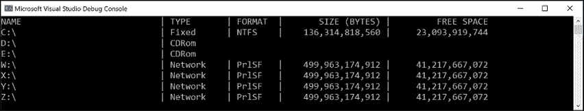

# 09

# 使用文件、流和序列化

本章介绍对文件和流的读写、文本编码和序列化。

我们将讨论以下主题：

*   管理文件系统
*   用溪流读写
*   编码和解码文本
*   序列化对象图
*   控制 JSON 处理

# 管理文件系统

您的应用程序通常需要对不同环境中的文件和目录执行输入和输出操作。`System`和`System.IO`名称空间包含用于此目的的类。

## 处理跨平台环境和文件系统

让我们探讨一下如何处理跨平台环境，如 Windows 与 Linux或 macOS 之间的差异。Windows、macOS 和 Linux 的路径不同，因此我们将首先探讨.NET 如何处理这一问题：

1.  使用您首选的代码编辑器创建名为`Chapter09`的新解决方案/工作区。
2.  添加控制台应用程序项目，如以下列表中所定义：
    1.  项目模板：**控制台应用**/`console`
    2.  工作区/解决方案文件和文件夹：`Chapter09`
    3.  项目文件和文件夹：`WorkingWithFileSystems`
3.  在`Program.cs`中添加语句，静态导入`System.Console`、`System.IO.Directory`、`System.Environment`和`System.IO.Path`类型，如下代码所示：

    ```cs
    using static System.Console; 
    using static System.IO.Directory; 
    using static System.IO.Path; 
    using static System.Environment; 
    ```

4.  In `Program.cs`, create a static `OutputFileSystemInfo` method, and write statements in it to do the following:
    *   输出路径和目录分隔字符。
    *   输出当前目录的路径。
    *   为系统文件、临时文件和文档输出一些特殊路径。

    ```cs
    static void OutputFileSystemInfo()
    {
      WriteLine("{0,-33} {1}", arg0: "Path.PathSeparator",
        arg1: PathSeparator);
      WriteLine("{0,-33} {1}", arg0: "Path.DirectorySeparatorChar",
        arg1: DirectorySeparatorChar);
      WriteLine("{0,-33} {1}", arg0: "Directory.GetCurrentDirectory()",
        arg1: GetCurrentDirectory());
      WriteLine("{0,-33} {1}", arg0: "Environment.CurrentDirectory", 
        arg1: CurrentDirectory);
      WriteLine("{0,-33} {1}", arg0: "Environment.SystemDirectory", 
        arg1: SystemDirectory);
      WriteLine("{0,-33} {1}", arg0: "Path.GetTempPath()", 
        arg1: GetTempPath());
      WriteLine("GetFolderPath(SpecialFolder");
      WriteLine("{0,-33} {1}", arg0: " .System)", 
        arg1: GetFolderPath(SpecialFolder.System));
      WriteLine("{0,-33} {1}", arg0: " .ApplicationData)", 
        arg1: GetFolderPath(SpecialFolder.ApplicationData));
      WriteLine("{0,-33} {1}", arg0: " .MyDocuments)", 
        arg1: GetFolderPath(SpecialFolder.MyDocuments));
      WriteLine("{0,-33} {1}", arg0: " .Personal)", 
        arg1: GetFolderPath(SpecialFolder.Personal));
    } 
    ```

    `Environment`类型还有许多我们在代码中没有使用的有用成员，包括`GetEnvironmentVariables`方法、`OSVersion`和`ProcessorCount`属性。

5.  在`Program.cs`中函数上方调用方法`OutputFileSystemInfo`，如下代码所示：

    ```cs
    OutputFileSystemInfo(); 
    ```

6.  Run the code and view the result, as shown in *Figure 9.1*:

    <figure class="mediaobject"></figure>

    图 9.1：运行应用程序以显示 Windows 上的文件系统信息

当使用带有 Visual Studio 代码的`dotnet run`运行控制台应用程序时，`CurrentDirectory`将是项目文件夹，而不是`bin`中的文件夹。

**良好实践**：Windows 对目录分隔符字符使用反斜杠`\`。macOS 和 Linux 使用正斜杠`/`作为目录分隔符。组合路径时，不要假设代码中使用了什么字符。

## 管理驱动器

要管理驱动器，请使用`DriveInfo`类型，该类型有一个静态方法，返回有关连接到计算机的所有驱动器的信息。每个驱动器都有一个驱动器类型。

让我们来探索驱动器：

1.  Create a `WorkWithDrives` method, and write statements to get all the drives and output their name, type, size, available free space, and format, but only if the drive is ready, as shown in the following code:

    ```cs
    static void WorkWithDrives()
    {
      WriteLine("{0,-30} | {1,-10} | {2,-7} | {3,18} | {4,18}",
        "NAME", "TYPE", "FORMAT", "SIZE (BYTES)", "FREE SPACE");
      foreach (DriveInfo drive in DriveInfo.GetDrives())
      {
        if (drive.IsReady)
        {
          WriteLine(
            "{0,-30} | {1,-10} | {2,-7} | {3,18:N0} | {4,18:N0}",
            drive.Name, drive.DriveType, drive.DriveFormat,
            drive.TotalSize, drive.AvailableFreeSpace);
        }
        else
        {
          WriteLine("{0,-30} | {1,-10}", drive.Name, drive.DriveType);
        }
      }
    } 
    ```

    **良好实践**：在读取`TotalSize`等属性之前，请检查驱动器是否已准备就绪，否则您将看到可移动驱动器引发异常。

2.  在`Program.cs`中，注释掉前面的方法调用，并添加一个对`WorkWithDrives`的调用，如下面代码中突出显示的：

    ```cs
    **// OutputFileSystemInfo();**
    **WorkWithDrives();** 
    ```

3.  Run the code and view the result, as shown in *Figure 9.2*:

    <figure class="mediaobject"></figure>

    图 9.2：显示 Windows 上的驱动器信息

## 管理目录

要管理目录，请使用`Directory`、`Path`和`Environment`静态类。这些类型包括许多使用文件系统的成员。

构造自定义路径时，必须小心编写代码，以使其不会对平台做出任何假设，例如，目录分隔符字符的使用：

1.  创建一个`WorkWithDirectories`方法，并编写语句来执行以下操作：

    ```cs
    static void WorkWithDirectories()
    {
      // define a directory path for a new folder
      // starting in the user's folder
      string newFolder = Combine(
        GetFolderPath(SpecialFolder.Personal),
        "Code", "Chapter09", "NewFolder");
      WriteLine($"Working with: {newFolder}");
      // check if it exists
      WriteLine($"Does it exist? {Exists(newFolder)}");
      // create directory 
      WriteLine("Creating it...");
      CreateDirectory(newFolder);
      WriteLine($"Does it exist? {Exists(newFolder)}");
      Write("Confirm the directory exists, and then press ENTER: ");
      ReadLine();
      // delete directory 
      WriteLine("Deleting it...");
      Delete(newFolder, recursive: true);
      WriteLine($"Does it exist? {Exists(newFolder)}");
    } 
    ```

    *   通过为目录名创建字符串数组，然后将它们与`Path`类型的`Combine`方法正确组合，在用户的主目录下定义自定义路径。
    *   使用`Directory`类的`Exists`方法检查自定义目录路径是否存在。
    *   使用`Directory`类的`CreateDirectory`和`Delete`方法创建并删除目录，包括其中的文件和子目录：
2.  在`Program.cs`中，注释掉前面的方法调用，并添加对`WorkWithDirectories`的调用。
3.  运行代码并查看结果，使用您喜爱的文件管理工具确认该目录已创建，然后按 Enter 键删除，如下输出所示：

    ```cs
    Working with: /Users/markjprice/Code/Chapter09/NewFolder Does it exist? False
    Creating it...
    Does it exist? True
    Confirm the directory exists, and then press ENTER:
    Deleting it...
    Does it exist? False 
    ```

## 管理文件

在处理文件时，您可以静态导入文件类型，就像我们对目录类型所做的那样，但是，对于下一个示例，我们不会这样做，因为它有一些与目录类型相同的方法，它们会发生冲突。文件类型的名称足够短，在本例中无关紧要。步骤如下：

1.  创建一个`WorkWithFiles`方法，并编写语句来执行以下操作：

    ```cs
    static void WorkWithFiles()
    {
      // define a directory path to output files
      // starting in the user's folder
      string dir = Combine(
        GetFolderPath(SpecialFolder.Personal), 
        "Code", "Chapter09", "OutputFiles");
      CreateDirectory(dir);
      // define file paths
      string textFile = Combine(dir, "Dummy.txt");
      string backupFile = Combine(dir, "Dummy.bak");
      WriteLine($"Working with: {textFile}");
      // check if a file exists
      WriteLine($"Does it exist? {File.Exists(textFile)}");
      // create a new text file and write a line to it
      StreamWriter textWriter = File.CreateText(textFile);
      textWriter.WriteLine("Hello, C#!");
      textWriter.Close(); // close file and release resources
      WriteLine($"Does it exist? {File.Exists(textFile)}");
      // copy the file, and overwrite if it already exists
      File.Copy(sourceFileName: textFile,
        destFileName: backupFile, overwrite: true);
      WriteLine(
        $"Does {backupFile} exist? {File.Exists(backupFile)}");
      Write("Confirm the files exist, and then press ENTER: ");
      ReadLine();
      // delete file
      File.Delete(textFile);
      WriteLine($"Does it exist? {File.Exists(textFile)}");
      // read from the text file backup
      WriteLine($"Reading contents of {backupFile}:");
      StreamReader textReader = File.OpenText(backupFile); 
      WriteLine(textReader.ReadToEnd());
      textReader.Close();
    } 
    ```

    1.  检查文件是否存在。
    2.  创建一个文本文件。
    3.  在文件中写入一行文本。
    4.  关闭文件以释放系统资源和文件锁（这通常在`try-finally`语句块内完成，以确保即使在写入文件时发生异常，文件也会关闭）。
    5.  将文件复制到备份。
    6.  删除原始文件。
    7.  读取备份文件内容后关闭：
2.  在`Program.cs`中，注释掉前面的方法调用，并添加对`WorkWithFiles`的调用。
3.  运行代码并查看结果，如以下输出所示：

    ```cs
    Working with: /Users/markjprice/Code/Chapter09/OutputFiles/Dummy.txt 
    Does it exist? False
    Does it exist? True
    Does /Users/markjprice/Code/Chapter09/OutputFiles/Dummy.bak exist? True 
    Confirm the files exist, and then press ENTER:
    Does it exist? False
    Reading contents of /Users/markjprice/Code/Chapter09/OutputFiles/Dummy.bak:
    Hello, C#! 
    ```

## 管理路径

有时，您需要处理路径的一部分；例如，您可能只想提取文件夹名、文件名或扩展名。有时，您需要生成临时文件夹和文件名。您可以使用`Path`类的静态方法执行此操作：

1.  在`WorkWithFiles`方法末尾添加以下语句：

    ```cs
    // Managing paths
    WriteLine($"Folder Name: {GetDirectoryName(textFile)}"); 
    WriteLine($"File Name: {GetFileName(textFile)}"); 
    WriteLine("File Name without Extension: {0}",
      GetFileNameWithoutExtension(textFile)); 
    WriteLine($"File Extension: {GetExtension(textFile)}"); 
    WriteLine($"Random File Name: {GetRandomFileName()}"); 
    WriteLine($"Temporary File Name: {GetTempFileName()}"); 
    ```

2.  Run the code and view the result, as shown in the following output:

    ```cs
    Folder Name: /Users/markjprice/Code/Chapter09/OutputFiles 
    File Name: Dummy.txt
    File Name without Extension: Dummy 
    File Extension: .txt
    Random File Name: u45w1zki.co3 
    Temporary File Name:
    /var/folders/tz/xx0y_wld5sx0nv0fjtq4tnpc0000gn/T/tmpyqrepP.tmp 
    ```

    `GetTempFileName`创建一个零字节文件并返回其名称，供您使用。`GetRandomFileName`只返回一个文件名；它不会创建文件。

## 获取文件信息

要获取有关文件或目录的更多信息，例如，其大小或上次访问的时间，您可以创建`FileInfo`或`DirectoryInfo`类的实例。

`FileInfo`和`DirectoryInfo`都继承自`FileSystemInfo`，因此它们都有`LastAccessTime`和`Delete`等成员，以及特定于自身的额外成员，如下表所示：

<colgroup><col> <col></colgroup> 
| 班 | 成员 |
| `FileSystemInfo` | 字段：`FullPath`、`OriginalPath`属性：`Attributes`、`CreationTime`、`CreationTimeUtc`、`Exists`、`Extension`、`FullName`、`LastAccessTime`、`LastAccessTimeUtc`、`LastWriteTime`、`LastWriteTimeUtc`、`Name`方法：`Delete`、`GetObjectData`、`Refresh` |
| `DirectoryInfo` | 属性：`Parent`、`Root`方法：`Create`、`CreateSubdirectory`、`EnumerateDirectories`、`EnumerateFiles`、`EnumerateFileSystemInfos`、`GetAccessControl`、`GetDirectories`、`GetFiles`、`GetFileSystemInfos`、`MoveTo`、`SetAccessControl` |
| `FileInfo` | 属性：`Directory`、`DirectoryName`、`IsReadOnly`、`Length`方法：`AppendText`、`CopyTo`、`Create`、`CreateText`、`Decrypt`、`Encrypt`、`GetAccessControl`、`MoveTo`、`Open`、`OpenRead`、`OpenText`、`OpenWrite`、`Replace`、`SetAccessControl` |

让我们编写一些代码，使用`FileInfo`实例高效地对一个文件执行多个操作：

1.  在`WorkWithFiles`方法的末尾添加语句，为备份文件创建`FileInfo`实例，并将相关信息写入控制台，如下代码所示：

    ```cs
    FileInfo info = new(backupFile); 
    WriteLine($"{backupFile}:"); 
    WriteLine($"Contains {info.Length} bytes");
    WriteLine($"Last accessed {info.LastAccessTime}"); 
    WriteLine($"Has readonly set to {info.IsReadOnly}"); 
    ```

2.  运行代码并查看结果，如以下输出所示：

    ```cs
    /Users/markjprice/Code/Chapter09/OutputFiles/Dummy.bak: 
    Contains 11 bytes
    Last accessed 26/10/2021 09:08:26 
    Has readonly set to False 
    ```

由于操作系统可以使用不同的行尾，因此操作系统上的字节数可能不同。

## 控制如何使用文件

处理文件时，通常需要控制文件的打开方式。`File.Open`方法具有重载，可使用`enum`值指定其他选项。

`enum`类型如下：

*   `FileMode`：控制您想要对文件执行的操作，如`CreateNew`、`OpenOrCreate`或`Truncate`。
*   `FileAccess`：控制您需要的访问级别，如`ReadWrite`。
*   `FileShare`：控制对文件的锁定，以允许其他进程具有指定的访问级别，如`Read`。

您可能希望打开一个文件并从中读取，并允许其他进程也读取它，如以下代码所示：

```cs
FileStream file = File.Open(pathToFile,
  FileMode.Open, FileAccess.Read, FileShare.Read); 
```

文件属性也有一个`enum`，如下所示：

*   `FileAttributes`：检查`FileSystemInfo`-派生类型的`Attributes`属性中是否有`Archive`和`Encrypted`等值。

您可以检查文件或目录的属性，如以下代码所示：

```cs
FileInfo info = new(backupFile); 
WriteLine("Is the backup file compressed? {0}",
  info.Attributes.HasFlag(FileAttributes.Compressed)); 
```

# 用溪流读写

**流**是一个可以读取和写入的字节序列。虽然可以像数组一样处理文件，通过知道文件中一个字节的位置来提供随机访问，但将文件作为一个流处理是有用的，在这个流中，可以按顺序访问字节。

流还可以用于处理终端输入和输出以及网络资源，如不提供随机访问且无法搜索（即移动）到某个位置的套接字和端口。您可以编写代码来处理某些任意字节，而不知道或不关心这些字节来自何处。您的代码只是读取或写入流，另一段代码处理字节实际存储的位置。

## 理解抽象流和具体流

有一个名为`Stream`的`abstract`类，它代表任何类型的流。记住，`abstract`类不能使用`new`实例化；它们只能被继承。

有许多具体类继承自这个基类，包括`FileStream`、`MemoryStream`、`BufferedStream`、`GZipStream`和`SslStream`，因此它们的工作方式都是相同的。所有流都实现`IDisposable`，因此它们有一个`Dispose`方法来释放非托管资源。

下表描述了`Stream`类的一些普通成员：

<colgroup><col> <col></colgroup> 
| 成员 | 描述 |
| `CanRead`、`CanWrite` | 这些属性确定是否可以读取和写入流。 |
| `Length`、`Position` | 这些属性确定流中的总字节数和当前位置。这些属性可能会引发某些类型流的异常。 |
| `Dispose` | 此方法关闭流并释放其资源。 |
| `Flush` | 如果流具有缓冲区，则此方法将缓冲区中的字节写入流，并清除缓冲区。 |
| `CanSeek` | 此属性确定是否可以使用`Seek`方法。 |
| `Seek` | 此方法将当前位置移动到其参数中指定的位置。 |
| `Read`、`ReadAsync` | 这些方法将指定数量的字节从流中读取到字节数组中，并前进位置。 |
| `ReadByte` | 此方法从流中读取下一个字节并前进位置。 |
| `Write`、`WriteAsync` | 这些方法将字节数组的内容写入流中。 |
| `WriteByte` | 此方法将一个字节写入流。 |

### 理解存储流

下表中描述了一些表示字节存储位置的存储流：

<colgroup><col> <col> <col></colgroup> 
| 名称空间 | 班 | 描述 |
| `System.IO` | `FileStream` | 存储在文件系统中的字节。 |
| `System.IO` | `MemoryStream` | 当前进程中存储在内存中的字节。 |
| `System.Net.Sockets` | `NetworkStream` | 存储在网络位置的字节。 |

`FileStream`已在.NET 6 中重新编写，以便在 Windows 上具有更高的性能和可靠性。

### 理解函数流

某些功能流本身不存在，但只能“插入”其他流以添加功能，如下表所示：

<colgroup><col> <col> <col></colgroup> 
| 名称空间 | 班 | 描述 |
| `System.Security.Cryptography` | `CryptoStream` | 这将对流进行加密和解密。 |
| `System.IO.Compression` | `GZipStream`、`DeflateStream` | 这些压缩和解压缩流。 |
| `System.Net.Security` | `AuthenticatedStream` | 这将跨流发送凭据。 |

### 理解流助手

虽然有时您需要在较低级别上处理流，但大多数情况下，您可以将帮助器类插入到链中，以使事情变得更简单。流的所有助手类型都实现了`IDisposable`，因此它们有一个`Dispose`方法来释放非托管资源。

下表中描述了一些用于处理常见场景的帮助器类：

<colgroup><col> <col> <col></colgroup> 
| 名称空间 | 班 | 描述 |
| `System.IO` | `StreamReader` | 这将以纯文本的形式从底层流中读取。 |
| `System.IO` | `StreamWriter` | 这将以纯文本的形式写入底层流。 |
| `System.IO` | `BinaryReader` | 这将以.NET 类型读取流。例如，`ReadDecimal`方法从底层流中读取下 16 个字节作为`decimal`值，`ReadInt32`方法读取下 4 个字节作为`int`值。 |
| `System.IO` | `BinaryWriter` | 这将以.NET 类型写入流。例如，带有`decimal`参数的`Write`方法向底层流写入 16 个字节，带有`int`参数的`Write`方法向底层流写入 4 个字节。 |
| `System.Xml` | `XmlReader` | 这将使用 XML 格式读取底层流。 |
| `System.Xml` | `XmlWriter` | 这将使用 XML 格式写入底层流。 |

## 写入文本流

让我们键入一些代码将文本写入流：

1.  使用您的首选代码编辑器将名为`WorkingWithStreams`的新控制台应用程序添加到`Chapter09`解决方案/工作区：
    1.  在 Visual Studio 中，将解决方案的启动项目设置为当前选择。
    2.  在 Visual Studio 代码中，选择`WorkingWithStreams`作为活动的 OmniSharp 项目。
2.  在`WorkingWithStreams`项目中，在`Program.cs`中导入`System.Xml`名称空间，静态导入`System.Console`、`System.Environment`和`System.IO.Path`类型。
3.  在`Program.cs`的底部，定义一个名为`Viper`的静态类，其中包含一个名为`Callsigns`的`string`值静态数组，如下代码所示：

    ```cs
    static class Viper
    {
      // define an array of Viper pilot call signs
      public static string[] Callsigns = new[]
      {
        "Husker", "Starbuck", "Apollo", "Boomer",
        "Bulldog", "Athena", "Helo", "Racetrack"
      };
    } 
    ```

4.  在`Viper`类之上，定义一个`WorkWithText`方法，该方法枚举毒蛇呼号，将每一个呼号写在一个单独的文本文件中，如以下代码所示：

    ```cs
    static void WorkWithText()
    {
      // define a file to write to
      string textFile = Combine(CurrentDirectory, "streams.txt");
      // create a text file and return a helper writer
      StreamWriter text = File.CreateText(textFile);
      // enumerate the strings, writing each one
      // to the stream on a separate line
      foreach (string item in Viper.Callsigns)
      {
        text.WriteLine(item);
      }
      text.Close(); // release resources
      // output the contents of the file
      WriteLine("{0} contains {1:N0} bytes.",
        arg0: textFile,
        arg1: new FileInfo(textFile).Length);
      WriteLine(File.ReadAllText(textFile));
    } 
    ```

5.  在名称空间导入下面，调用`WorkWithText`方法。
6.  运行代码并查看结果，如以下输出所示：

    ```cs
    /Users/markjprice/Code/Chapter09/WorkingWithStreams/streams.txt contains
    60 bytes. 
    Husker 
    Starbuck 
    Apollo 
    Boomer 
    Bulldog 
    Athena 
    Helo 
    Racetrack 
    ```

7.  打开创建的文件，检查其中是否包含呼号列表。

## 写入 XML 流

编写 XML 元素有两种方式，如下所示：

*   `WriteStartElement`和`WriteEndElement`：当一个元素可能有子元素时，使用此对。
*   `WriteElementString`：当元素没有子元素时使用此选项。

现在，让我们尝试将`string`值的 Viper pilot 呼号数组存储在 XML 文件中：

1.  创建一个枚举呼号的`WorkWithXml`方法，将每个呼号作为一个元素写入一个 XML 文件，如下代码所示：

    ```cs
    static void WorkWithXml()
    {
      // define a file to write to
      string xmlFile = Combine(CurrentDirectory, "streams.xml");
      // create a file stream
      FileStream xmlFileStream = File.Create(xmlFile);
      // wrap the file stream in an XML writer helper
      // and automatically indent nested elements
      XmlWriter xml = XmlWriter.Create(xmlFileStream,
        new XmlWriterSettings { Indent = true });
      // write the XML declaration
      xml.WriteStartDocument();
      // write a root element
      xml.WriteStartElement("callsigns");
      // enumerate the strings writing each one to the stream
      foreach (string item in Viper.Callsigns)
      {
        xml.WriteElementString("callsign", item);
      }
      // write the close root element
      xml.WriteEndElement();
      // close helper and stream
      xml.Close();
      xmlFileStream.Close();
      // output all the contents of the file
      WriteLine("{0} contains {1:N0} bytes.",
        arg0: xmlFile,
        arg1: new FileInfo(xmlFile).Length);
      WriteLine(File.ReadAllText(xmlFile));
    } 
    ```

2.  在`Program.cs`中，注释掉前面的方法调用，并向`WorkWithXml`方法添加一个调用。
3.  运行代码并查看结果，如以下输出所示：

    ```cs
    /Users/markjprice/Code/Chapter09/WorkingWithStreams/streams.xml contains
    310 bytes.
    <?xml version="1.0" encoding="utf-8"?>
    <callsigns>
      <callsign>Husker</callsign>
      <callsign>Starbuck</callsign>
      <callsign>Apollo</callsign>
      <callsign>Boomer</callsign>
      <callsign>Bulldog</callsign>
      <callsign>Athena</callsign>
      <callsign>Helo</callsign>
      <callsign>Racetrack</callsign>
    </callsigns> 
    ```

## 处理文件资源

当您打开一个文件进行读写操作时，您正在使用.NET 之外的资源。这些被称为**非托管资源**，必须在您完成工作后进行处置。为了确定它们何时被处理，我们可以在`finally`块中调用`Dispose`方法。

让我们改进一下以前使用 XML 的代码，以正确处置其非托管资源：

1.  Modify the `WorkWithXml` method, as shown highlighted in the following code:

    ```cs
    static void WorkWithXml()
    {
     **FileStream? xmlFileStream =** **null****;** 
     **XmlWriter? xml =** **null****;**
    **try**
     **{**
        // define a file to write to
        string xmlFile = Combine(CurrentDirectory, "streams.xml");
        // create a file stream
     **xmlFileStream = File.Create(xmlFile);**
        // wrap the file stream in an XML writer helper
        // and automatically indent nested elements
     **xml = XmlWriter.Create(xmlFileStream,**
    **new** **XmlWriterSettings { Indent =** **true** **});**
        // write the XML declaration
        xml.WriteStartDocument();
        // write a root element
        xml.WriteStartElement("callsigns");
        // enumerate the strings writing each one to the stream
        foreach (string item in Viper.Callsigns)
        {
          xml.WriteElementString("callsign", item);
        }
        // write the close root element
        xml.WriteEndElement();
        // close helper and stream
        xml.Close();
        xmlFileStream.Close();
        // output all the contents of the file
        WriteLine($"{0} contains {1:N0} bytes.",
          arg0: xmlFile,
          arg1: new FileInfo(xmlFile).Length);
        WriteLine(File.ReadAllText(xmlFile));
     **}**
     **catch (Exception ex)**
     **{**
    **// if the path doesn't exist the exception will be caught**
     **WriteLine(****$"****{ex.GetType()}** **says** **{ex.Message}****"****);**
     **}**
    **finally**
     **{**
    **if** **(xml !=** **null****)**
     **{** 
     **xml.Dispose();**
     **WriteLine(****"The XML writer's unmanaged resources have been disposed."****);**
    **if** **(xmlFileStream !=** **null****)**
     **{**
     **xmlFileStream.Dispose();**
     **WriteLine(****"The file stream's unmanaged resources have been disposed."****);**
     **}**
     **}**
     **}**
    } 
    ```

    您也可以返回并修改以前创建的其他方法，但我将把它作为可选练习留给您。

2.  运行代码并查看结果，如以下输出所示：

    ```cs
    The XML writer's unmanaged resources have been disposed. 
    The file stream's unmanaged resources have been disposed. 
    ```

**良好实践**：调用`Dispose`方法前，检查对象是否为空。

### 使用 using 语句简化处理

您可以简化需要检查`null`对象的代码，然后使用`using`语句调用其`Dispose`方法。通常，我建议使用`using`而不是手动调用`Dispose`，除非您需要更高级别的控制。

令人困惑的是，关键字有两种用途：导入名称空间和生成一条`finally`语句，该语句在实现`IDisposable`的对象上调用`Dispose`。

编译器将一个`using`语句块更改为一个没有`catch`语句的`try`-`finally`语句。您可以使用嵌套的`try`语句；因此，如果您确实希望捕获任何异常，您可以，如以下代码示例所示：

```cs
using (FileStream file2 = File.OpenWrite(
  Path.Combine(path, "file2.txt")))
{
  using (StreamWriter writer2 = new StreamWriter(file2))
  {
    try
    {
      writer2.WriteLine("Welcome, .NET!");
    }
    catch(Exception ex)
    {
      WriteLine($"{ex.GetType()} says {ex.Message}");
    }
  } // automatically calls Dispose if the object is not null
} // automatically calls Dispose if the object is not null 
```

您甚至可以通过不显式指定`using`语句的大括号和缩进来进一步简化代码，如下代码所示：

```cs
using FileStream file2 = File.OpenWrite(
  Path.Combine(path, "file2.txt"));
using StreamWriter writer2 = new(file2);
try
{
  writer2.WriteLine("Welcome, .NET!");
}
catch(Exception ex)
{
  WriteLine($"{ex.GetType()} says {ex.Message}");
} 
```

## 压缩流

XML 相对冗长，因此它比纯文本占用更多的字节空间。让我们看看如何使用一种称为 GZIP 的通用压缩算法来压缩 XML：

1.  在`Program.cs`顶部，导入用于压缩的名称空间，如下代码所示：

    ```cs
    using System.IO.Compression; // BrotliStream, GZipStream, CompressionMode 
    ```

2.  添加一个`WorkWithCompression`方法，该方法使用`GZipStream`实例创建一个压缩文件，其中包含与之前相同的 XML 元素，然后在读取并输出到控制台时对其进行解压缩，如下代码所示：

    ```cs
    static void WorkWithCompression()
    {
      string fileExt = "gzip";
      // compress the XML output
      string filePath = Combine(
        CurrentDirectory, $"streams.**{fileExt}**");
      FileStream file = File.Create(filePath);
      Stream compressor = new GZipStream(file, CompressionMode.Compress);
      using (compressor)
      {
        using (XmlWriter xml = XmlWriter.Create(compressor))
        {
          xml.WriteStartDocument();
          xml.WriteStartElement("callsigns");
          foreach (string item in Viper.Callsigns)
          {
            xml.WriteElementString("callsign", item);
          }
          // the normal call to WriteEndElement is not necessary
          // because when the XmlWriter disposes, it will
          // automatically end any elements of any depth
        }
      } // also closes the underlying stream
      // output all the contents of the compressed file
      WriteLine("{0} contains {1:N0} bytes.",
        filePath, new FileInfo(filePath).Length);
      WriteLine($"The compressed contents:");
      WriteLine(File.ReadAllText(filePath));
      // read a compressed file
      WriteLine("Reading the compressed XML file:");
      file = File.Open(filePath, FileMode.Open);
      Stream decompressor = new GZipStream(file,
        CompressionMode.Decompress);
      using (decompressor)
      {
        using (XmlReader reader = XmlReader.Create(decompressor))
        {
          while (reader.Read()) // read the next XML node
          {
            // check if we are on an element node named callsign
            if ((reader.NodeType == XmlNodeType.Element)
              && (reader.Name == "callsign"))
            {
              reader.Read(); // move to the text inside element
              WriteLine($"{reader.Value}"); // read its value
            }
          }
        }
      }
    } 
    ```

3.  在`Program.cs`中，将呼叫保留到`WorkWithXml`，并添加一个呼叫到`WorkWithCompression`，如下代码所示：

    ```cs
    // WorkWithText();
    **WorkWithXml();**
    **WorkWithCompression();** 
    ```

4.  运行代码并比较 XML 文件和压缩 XML 文件的大小。在没有压缩的情况下，其大小小于相同 XML 的一半，如以下编辑输出所示：

    ```cs
    /Users/markjprice/Code/Chapter09/WorkingWithStreams/streams.xml contains 310 bytes.
    /Users/markjprice/Code/Chapter09/WorkingWithStreams/streams.gzip contains 150 bytes. 
    ```

## Brotli 算法的压缩

在.NETCore2.1 中，微软引入了 Brotli 压缩算法的实现。在性能上，Brotli 与 DEFLATE 和 GZIP 中使用的算法类似，但输出密度约为 20%。步骤如下：

1.  修改`WorkWithCompression`方法，使其具有一个可选参数，指示是否应使用 Brotli，并默认使用 Brotli，如下代码中突出显示：

    ```cs
    static void WorkWithCompression(**bool** **useBrotli =** **true**)
    {
      string fileExt = **useBrotli ?** **"brotli"** **:** **"gzip"****;**
      // compress the XML output
      string filePath = Combine(
        CurrentDirectory, $"streams.{fileExt}");
      FileStream file = File.Create(filePath);
     **Stream compressor;**
    **if** **(useBrotli)**
     **{**
     **compressor =** **new** **BrotliStream(file, CompressionMode.Compress);**
     **}**
    **else**
     **{**
     **compressor =** **new** **GZipStream(file, CompressionMode.Compress);**
     **}**
      using (compressor)
      {
        using (XmlWriter xml = XmlWriter.Create(compressor))
        {
          xml.WriteStartDocument();
          xml.WriteStartElement("callsigns");
          foreach (string item in Viper.Callsigns)
          {
            xml.WriteElementString("callsign", item);
          }
        }
      } // also closes the underlying stream
      // output all the contents of the compressed file
      WriteLine("{0} contains {1:N0} bytes.",
        filePath, new FileInfo(filePath).Length);
      WriteLine($"The compressed contents:");
      WriteLine(File.ReadAllText(filePath));
      // read a compressed file
      WriteLine("Reading the compressed XML file:");
      file = File.Open(filePath, FileMode.Open);
     **Stream decompressor;**
    **if** **(useBrotli)**
     **{**
     **decompressor =** **new** **BrotliStream(**
     **file, CompressionMode.Decompress);**
     **}**
    **else**
     **{**
     **decompressor =** **new** **GZipStream(**
     **file, CompressionMode.Decompress);**
     **}**
      using (decompressor)
      {
        using (XmlReader reader = XmlReader.Create(decompressor))
        {
          while (reader.Read())
          {
            // check if we are on an element node named callsign
            if ((reader.NodeType == XmlNodeType.Element)
              && (reader.Name == "callsign"))
            {
              reader.Read(); // move to the text inside element
              WriteLine($"{reader.Value}"); // read its value
            }
          }
        }
      }
    } 
    ```

2.  在`Program.cs`顶部附近，调用`WorkWithCompression`两次，一次使用 Brotli 默认，一次使用 GZIP，如下代码所示：

    ```cs
    WorkWithCompression(); 
    WorkWithCompression(useBrotli: false); 
    ```

3.  运行代码，比较两个压缩 XML 文件的大小。Brotli 的密度大于 21%，如以下编辑输出所示：

    ```cs
    /Users/markjprice/Code/Chapter09/WorkingWithStreams/streams.brotli contains 118 bytes.
    /Users/markjprice/Code/Chapter09/WorkingWithStreams/streams.gzip contains 150 bytes. 
    ```

# 编码和解码文本

文本字符可以用不同的方式表示。例如，可以使用莫尔斯电码将字母表编码为一系列点和破折号，以便通过电报线传输。

以类似的方式，计算机中的文本以位（1 和 0）的形式存储，表示代码空间中的代码点。大多数代码点表示单个字符，但它们也可以具有其他含义，如格式化。

例如，ASCII 有一个包含 128 个代码点的代码空间。NET 使用名为**Unicode**的标准对文本进行内部编码。Unicode 有超过一百万个代码点。

有时，您需要将文本移到.NET 之外，以供不使用 Unicode 或使用 Unicode 变体的系统使用，因此了解如何在编码之间转换非常重要。

下表列出了计算机常用的一些替代文本编码：

<colgroup><col> <col></colgroup> 
| 编码 | 描述 |
| ASCII 码 | 这将使用字节的低七位对有限范围的字符进行编码。 |
| UTF-8 | 这将每个 Unicode 代码点表示为一到四个字节的序列。 |
| UTF-7 | 这是为了在 7 位通道上比 UTF-8 更有效，但它存在安全性和健壮性问题，因此建议 UTF-8 优于 UTF-7。 |
| UTF-16 | 这将每个 Unicode 代码点表示为一个或两个 16 位整数的序列。 |
| UTF-32 | 这将每个 Unicode 代码点表示为 32 位整数，因此是固定长度编码，而其他 Unicode 编码都是可变长度编码。 |
| ANSI/ISO 编码 | 这提供了对用于支持特定语言或语言组的各种代码页的支持。 |

**良好实践**：在今天的大多数情况下，UTF-8 是一个良好的默认值，这就是为什么它实际上是默认编码，即`Encoding.Default`。

## 将字符串编码为字节数组

让我们探索文本编码：

1.  使用您首选的代码编辑器将名为`WorkingWithEncodings`的新控制台应用程序添加到`Chapter09`解决方案/工作区。
2.  在 Visual Studio 代码中，选择`WorkingWithEncodings`作为活动的 OmniSharp 项目。
3.  在`Program.cs`中，导入`System.Text`名称空间，静态导入`Console`类。
4.  添加语句，使用用户选择的编码方式对`string`进行编码，循环遍历每个字节，然后解码回`string`并输出，如下代码所示：

    ```cs
    WriteLine("Encodings"); 
    WriteLine("[1] ASCII");
    WriteLine("[2] UTF-7");
    WriteLine("[3] UTF-8");
    WriteLine("[4] UTF-16 (Unicode)");
    WriteLine("[5] UTF-32"); 
    WriteLine("[any other key] Default");
    // choose an encoding
    Write("Press a number to choose an encoding: "); 
    ConsoleKey number = ReadKey(intercept: false).Key; 
    WriteLine();
    WriteLine();
    Encoding encoder = number switch
    {
      ConsoleKey.D1 => Encoding.ASCII,
      ConsoleKey.D2 => Encoding.UTF7,
      ConsoleKey.D3 => Encoding.UTF8,
      ConsoleKey.D4 => Encoding.Unicode,
      ConsoleKey.D5 => Encoding.UTF32,
      _             => Encoding.Default
    };
    // define a string to encode
    string message = "Café cost: £4.39";
    // encode the string into a byte array
    byte[] encoded = encoder.GetBytes(message);
    // check how many bytes the encoding needed
    WriteLine("{0} uses {1:N0} bytes.",
      encoder.GetType().Name, encoded.Length);
    WriteLine();
    // enumerate each byte 
    WriteLine($"BYTE HEX CHAR"); 
    foreach (byte b in encoded)
    {
      WriteLine($"{b,4} {b.ToString("X"),4} {(char)b,5}");
    }
    // decode the byte array back into a string and display it
    string decoded = encoder.GetString(encoded); 
    WriteLine(decoded); 
    ```

5.  运行代码并注意警告以避免使用`Encoding.UTF7`，因为它是不安全的。当然，如果您需要使用该编码生成文本以与另一个系统兼容，那么它需要保留在.NET 中的一个选项。
6.  按 1 选择 ASCII，并注意在输出字节时，磅符号（£）和重音 e（é）不能用 ASCII 表示，因此它使用问号代替。

    ```cs
    BYTE  HEX  CHAR
      67   43     C
      97   61     a
     102   66     f
      63   3F     ?
      32   20      
     111   6F     o
     115   73     s
     116   74     t
      58   3A     :
      32   20      
      63   3F     ?
      52   34     4
      46   2E     .
      51   33     3
      57   39     9
    Caf? cost: ?4.39 
    ```

7.  重新运行代码并按 3 选择 UTF-8，注意 UTF-8 需要两个额外的字节用于两个字符，每个字符需要 2 个字节（总共 18 个字节，而不是 16 个字节），但它可以对字符进行编码和解码。

    ```cs
    UTF8EncodingSealed uses 18 bytes.
    BYTE  HEX  CHAR
      67   43     C
      97   61     a
     102   66     f
     195   C3     Ã
     169   A9     ©
      32   20      
     111   6F     o
     115   73     s
     116   74     t
      58   3A     :
      32   20      
     194   C2     Â
     163   A3     £
      52   34     4
      46   2E     .
      51   33     3
      57   39     9
    Café cost: £4.39 
    ```

8.  重新运行代码，按 4 选择 Unicode（UTF-16），注意UTF-16 每个字符需要两个字节，总共 32 个字节，可以对字符进行编码和解码。NET 内部使用此编码来存储`char`和`string`值。

## 对文件中的文本进行编码和解码

使用流帮助器类时，如`StreamReader`和`StreamWriter`，可以指定要使用的编码。当您向助手写入时，文本将自动编码，当您从助手读取时，字节将自动解码。

要指定编码，请将编码作为第二个参数传递给助手类型的构造函数，如下代码所示：

```cs
StreamReader reader = new(stream, Encoding.UTF8); 
StreamWriter writer = new(stream, Encoding.UTF8); 
```

**良好实践**：通常，您无法选择使用哪种编码，因为您将生成一个文件供其他系统使用。但是，如果这样做，请选择一个使用最少字节数的字符，但可以存储所需的每个字符。

# 序列化对象图

**序列化**是使用指定格式将活动对象转换为字节序列的过程。**反序列化**是相反的过程。您可以这样做来保存活动对象的当前状态，以便将来可以重新创建它。例如，保存游戏的当前状态，以便明天可以在同一地点继续。序列化对象通常存储在文件或数据库中。

您可以指定的格式有几十种，但最常见的两种格式是**可扩展标记语言**（**XML**）和**JavaScript 对象表示法**（**JSON**）。

**良好实践**：JSON 更紧凑，最适合 web 和移动应用。XML 更详细，但在更多遗留系统中得到更好的支持。使用 JSON 最小化序列化对象图的大小。在向 web 应用程序和移动应用程序发送对象图时，JSON 也是一个不错的选择，因为 JSON 是 JavaScript 的本机序列化格式，移动应用程序通常在有限的带宽上进行调用，因此字节数很重要。

.NET 有多个将在 XML 和 JSON 之间序列化的类。我们将从`XmlSerializer`和`JsonSerializer`开始。

## 序列化为 XML

让我们先看看 XML，它可能是世界上最常用的序列化格式（目前）。为了展示一个典型的例子，我们将定义一个自定义类来存储关于一个人的信息，然后使用嵌套的`Person`实例列表创建一个对象图：

1.  使用您首选的代码编辑器将名为`WorkingWithSerialization`的新控制台应用程序添加到`Chapter09`解决方案/工作区。
2.  在 Visual Studio 代码中，选择`WorkingWithSerialization`作为活动的 OmniSharp 项目。
3.  添加一个名为`Person`的类，该类的`Salary`属性为`protected`，这意味着它只能由自身和派生类访问。为了填充薪资，该类有一个带有单个参数的构造函数来设置初始薪资，如以下代码所示：

    ```cs
    namespace Packt.Shared;
    public class Person
    {
      public Person(decimal initialSalary)
      {
        Salary = initialSalary;
      }
      public string? FirstName { get; set; }
      public string? LastName { get; set; }
      public DateTime DateOfBirth { get; set; }
      public HashSet<Person>? Children { get; set; }
      protected decimal Salary { get; set; }
    } 
    ```

4.  在`Program.cs`中，导入名称空间进行 XML 序列化，静态导入`Console`、`Environment`和`Path`类，如下代码所示：

    ```cs
    using System.Xml.Serialization; // XmlSerializer
    using Packt.Shared; // Person 
    using static System.Console; 
    using static System.Environment; 
    using static System.IO.Path; 
    ```

5.  添加语句创建`Person`实例的对象图，如下代码所示：

    ```cs
    // create an object graph
    List<Person> people = new()
    {
      new(30000M) 
      {
        FirstName = "Alice",
        LastName = "Smith",
        DateOfBirth = new(1974, 3, 14)
      },
      new(40000M) 
      {
        FirstName = "Bob",
        LastName = "Jones",
        DateOfBirth = new(1969, 11, 23)
      },
      new(20000M)
      {
        FirstName = "Charlie",
        LastName = "Cox",
        DateOfBirth = new(1984, 5, 4),
        Children = new()
        {
          new(0M)
          {
            FirstName = "Sally",
            LastName = "Cox",
            DateOfBirth = new(2000, 7, 12)
          }
        }
      }
    };
    // create object that will format a List of Persons as XML
    XmlSerializer xs = new(people.GetType());
    // create a file to write to
    string path = Combine(CurrentDirectory, "people.xml");
    using (FileStream stream = File.Create(path))
    {
      // serialize the object graph to the stream
      xs.Serialize(stream, people);
    }
    WriteLine("Written {0:N0} bytes of XML to {1}",
      arg0: new FileInfo(path).Length,
      arg1: path);
    WriteLine();
    // Display the serialized object graph
    WriteLine(File.ReadAllText(path)); 
    ```

6.  运行代码，查看结果，注意抛出异常，如以下输出所示：

    ```cs
    Unhandled Exception: System.InvalidOperationException: Packt.Shared.Person cannot be serialized because it does not have a parameterless constructor. 
    ```

7.  In `Person`, add a statement to define a parameterless constructor, as shown in the following code:

    ```cs
    public Person() { } 
    ```

    构造函数不需要做任何事情，但它必须存在，以便`XmlSerializer`可以在反序列化过程中调用它来实例化新的`Person`实例。

8.  重新运行代码并查看结果，注意对象图被序列化为类似`<FirstName>Bob</FirstName>`的 XML 元素，`Salary`属性不包括在内，因为它不是`public`属性，如以下输出所示：

    ```cs
    Written 752 bytes of XML to
    /Users/markjprice/Code/Chapter09/WorkingWithSerialization/people.xml
    <?xml version="1.0"?>
    <ArrayOfPerson xmlns:xsi="http://www.w3.org/2001/XMLSchema-instance" xmlns:xsd="http://www.w3.org/2001/XMLSchema">
      <Person>
        <FirstName>Alice</FirstName>
        <LastName>Smith</LastName>
        <DateOfBirth>1974-03-14T00:00:00</DateOfBirth>
      </Person>
      <Person>
        <FirstName>Bob</FirstName>
        <LastName>Jones</LastName>
        <DateOfBirth>1969-11-23T00:00:00</DateOfBirth>
      </Person>
      <Person>
        <FirstName>Charlie</FirstName>
        <LastName>Cox</LastName>
        <DateOfBirth>1984-05-04T00:00:00</DateOfBirth>
        <Children>
          <Person>
            <FirstName>Sally</FirstName>
            <LastName>Cox</LastName>
            <DateOfBirth>2000-07-12T00:00:00</DateOfBirth>
          </Person>
        </Children>
      </Person>
    </ArrayOfPerson> 
    ```

## 生成压缩 XML

我们可以使用属性而不是某些字段的元素使 XML 更加紧凑：

1.  在`Person`中，导入`System.Xml.Serialization`名称空间，以便可以使用`[XmlAttribute]`属性装饰某些属性。
2.  使用`[XmlAttribute]`属性装饰名字、姓氏和出生日期属性，并为每个属性设置一个短名称，如以下代码中突出显示的：

    ```cs
    **[****XmlAttribute(****"fname"****)****]**
    public string FirstName { get; set; }
    **[****XmlAttribute(****"lname"****)****]**
    public string LastName { get; set; }
    **[****XmlAttribute(****"dob"****)****]**
    public DateTime DateOfBirth { get; set; } 
    ```

3.  运行代码并注意，通过将属性值输出为 XML 属性，文件大小已从 752 字节减少到 462 字节，节省了超过三分之一的空间，如以下输出所示：

    ```cs
    Written 462 bytes of XML to /Users/markjprice/Code/Chapter09/ WorkingWithSerialization/people.xml
    <?xml version="1.0"?>
    <ArrayOfPerson xmlns:xsi="http://www.w3.org/2001/XMLSchema-instance" xmlns:xsd="http://www.w3.org/2001/XMLSchema">
      <Person fname="Alice" lname="Smith" dob="1974-03-14T00:00:00" />
      <Person fname="Bob" lname="Jones" dob="1969-11-23T00:00:00" />
      <Person fname="Charlie" lname="Cox" dob="1984-05-04T00:00:00">
        <Children>
          <Person fname="Sally" lname="Cox" dob="2000-07-12T00:00:00" />
        </Children>
      </Person>
    </ArrayOfPerson> 
    ```

## 反序列化 XML 文件

现在让我们尝试将 XML 文件反序列化回内存中的活动对象：

1.  添加语句打开 XML 文件，然后对其进行反序列化，如下代码所示：

    ```cs
    using (FileStream xmlLoad = File.Open(path, FileMode.Open))
    {
      // deserialize and cast the object graph into a List of Person
      List<Person>? loadedPeople =
        xs.Deserialize(xmlLoad) as List<Person>;
      if (loadedPeople is not null)
      {
        foreach (Person p in loadedPeople)
        {
          WriteLine("{0} has {1} children.", 
            p.LastName, p.Children?.Count ?? 0);
        }
      }
    } 
    ```

2.  运行代码并注意人员已成功从 XML 文件加载，然后枚举，如以下输出所示：

    ```cs
    Smith has 0 children. 
    Jones has 0 children. 
    Cox has 1 children. 
    ```

还有许多其他属性可用于控制生成的 XML。

如果不使用任何注释，`XmlSerializer`在反序列化时使用属性名执行不区分大小写的匹配。

**良好实践**：当使用`XmlSerializer`时，请记住只包含公共字段和属性，并且类型必须具有无参数构造函数。可以使用属性自定义输出。

## 使用 JSON 序列化

用于处理 JSON 序列化格式的最流行的.NET 库之一是 Newtonsoft.JSON，称为 JSON.NET。它成熟而强大。让我们看看它的实际行动：

1.  在`WorkingWithSerialization`项目中，添加`Newtonsoft.Json`最新版本的包参考，如下标记所示：

    ```cs
    <ItemGroup>
      <PackageReference Include="Newtonsoft.Json" 
        Version="13.0.1" />
    </ItemGroup> 
    ```

2.  构建`WorkingWithSerialization`项目以恢复包。
3.  在`Program.cs`中，添加语句创建一个文本文件，然后将人员序列化为 JSON，如下代码所示：

    ```cs
    // create a file to write to
    string jsonPath = Combine(CurrentDirectory, "people.json");
    using (StreamWriter jsonStream = File.CreateText(jsonPath))
    {
      // create an object that will format as JSON
      Newtonsoft.Json.JsonSerializer jss = new();
      // serialize the object graph into a string
      jss.Serialize(jsonStream, people);
    }
    WriteLine();
    WriteLine("Written {0:N0} bytes of JSON to: {1}",
      arg0: new FileInfo(jsonPath).Length,
      arg1: jsonPath);
    // Display the serialized object graph
    WriteLine(File.ReadAllText(jsonPath)); 
    ```

4.  运行代码，注意 JSON 需要的字节数不到包含元素的 XML 的一半。它甚至比使用属性的 XML 文件更小，如以下输出所示：

    ```cs
    Written 366 bytes of JSON to: /Users/markjprice/Code/Chapter09/ WorkingWithSerialization/people.json [{"FirstName":"Alice","LastName":"Smith","DateOfBirth":"1974-03-
    14T00:00:00","Children":null},{"FirstName":"Bob","LastName":"Jones","Date
    OfBirth":"1969-11-23T00:00:00","Children":null},{"FirstName":"Charlie","L astName":"Cox","DateOfBirth":"1984-05-04T00:00:00","Children":[{"FirstNam e":"Sally","LastName":"Cox","DateOfBirth":"2000-07-12T00:00:00","Children ":null}]}] 
    ```

## 高性能 JSON 处理

.NET Core 3.0引入了一个用于处理 JSON 的新名称空间`System.Text.Json`，该名称空间通过利用`Span<T>`等 API 进行性能优化。

此外，像 Json.NET 这样的旧库是通过读取 UTF-16 实现的。使用 UTF-8 读写 JSON 文档会更高效，因为大多数网络协议（包括 HTTP）都使用 UTF-8，您可以避免将 UTF-8 与 JSON.NET 的 Unicode`string`值进行代码转换。

通过新的 API，Microsoft 实现了 1.3 倍到 5 倍的改进，具体取决于场景。

Json.NET 的原始作者詹姆斯·牛顿·金（James Newton King）加入了微软，并一直与微软合作开发新的 Json 类型。正如他在讨论新 JSON API 的评论中所说，“JSON.NET 不会消失”，如图 9.3 所示：

<figure class="mediaobject"></figure>

图 9.3:Json.NET 原始作者的评论

让我们看看如何使用新的 JSON API 反序列化 JSON 文件：

1.  在`WorkingWithSerialization`项目中，在`Program.cs`中导入新的 JSON 类，使用别名进行序列化，以避免与我们之前使用的 JSON.NET 名称冲突，如下代码所示：

    ```cs
    using NewJson = System.Text.Json.JsonSerializer; 
    ```

2.  添加语句以打开 JSON 文件，反序列化并输出人员子女的姓名和计数，如下代码所示：

    ```cs
    using (FileStream jsonLoad = File.Open(jsonPath, FileMode.Open))
    {
      // deserialize object graph into a List of Person
      List<Person>? loadedPeople = 
        await NewJson.DeserializeAsync(utf8Json: jsonLoad,
          returnType: typeof(List<Person>)) as List<Person>;
      if (loadedPeople is not null)
      {
        foreach (Person p in loadedPeople)
        {
          WriteLine("{0} has {1} children.",
            p.LastName, p.Children?.Count ?? 0);
        }
      }
    } 
    ```

3.  运行代码并查看结果，如以下输出所示：

    ```cs
    Smith has 0 children. 
    Jones has 0 children. 
    Cox has 1 children. 
    ```

**良好实践**：选择 Json.NET 以提高开发人员的生产力和大型功能集，或者选择`System.Text.Json`以提高性能。

# 控制 JSON 处理

有许多选项可以控制 JSON 的处理方式，如下表所示：

*   包括和不包括字段。
*   设置套管策略。
*   选择区分大小写的策略。
*   在紧凑和美化的空白之间进行选择。

让我们看看一些实际行动：

1.  使用您首选的代码编辑器将名为`WorkingWithJson`的新控制台应用程序添加到`Chapter09`解决方案/工作区。
2.  在 Visual Studio 代码中，选择`WorkingWithJson`作为活动的 OmniSharp 项目。
3.  在`WorkingWithJson`项目中，在`Program.cs`中删除已有代码，导入两个主要名称空间用于 JSON，然后静态导入`System.Console`、`System.Environment`和`System.IO.Path`类型，如下代码所示：

    ```cs
    using System.Text.Json; // JsonSerializer
    using System.Text.Json.Serialization; // [JsonInclude]
    using static System.Console;
    using static System.Environment;
    using static System.IO.Path; 
    ```

4.  在`Program.cs`底部定义一个名为`Book`的类，如下代码所示：

    ```cs
    public class Book
    {
      // constructor to set non-nullable property
      public Book(string title)
      {
        Title = title;
      }
      // properties
      public string Title { get; set; }
      public string? Author { get; set; }
      // fields
      [JsonInclude] // include this field
      public DateOnly PublishDate;
      [JsonInclude] // include this field
      public DateTimeOffset Created;
      public ushort Pages;
    } 
    ```

5.  在`Book`类上方，添加语句，创建`Book`类的实例，并将其序列化为 JSON，如下代码所示：

    ```cs
    Book csharp10 = new(title: 
      "C# 10 and .NET 6 - Modern Cross-platform Development")
    { 
      Author = "Mark J Price",
      PublishDate = new(year: 2021, month: 11, day: 9),
      Pages = 823,
      Created = DateTimeOffset.UtcNow,
    };
    JsonSerializerOptions options = new()
    {
      IncludeFields = true, // includes all fields
      PropertyNameCaseInsensitive = true,
      WriteIndented = true,
      PropertyNamingPolicy = JsonNamingPolicy.CamelCase,
    };
    string filePath = Combine(CurrentDirectory, "book.json");
    using (Stream fileStream = File.Create(filePath))
    {
      JsonSerializer.Serialize<Book>(
        utf8Json: fileStream, value: csharp10, options);
    }
    WriteLine("Written {0:N0} bytes of JSON to {1}",
      arg0: new FileInfo(filePath).Length,
      arg1: filePath);
    WriteLine();
    // Display the serialized object graph 
    WriteLine(File.ReadAllText(filePath)); 
    ```

6.  Run the code and view the result, as shown in the following output:

    ```cs
    Written 315 bytes of JSON to C:\Code\Chapter09\WorkingWithJson\bin\Debug\net6.0\book.json
    {
      "title": "C# 10 and .NET 6 - Modern Cross-platform Development",
      "author": "Mark J Price",
      "publishDate": {
        "year": 2021,
        "month": 11,
        "day": 9,
        "dayOfWeek": 2,
        "dayOfYear": 313,
        "dayNumber": 738102
      },
      "created": "2021-08-20T08:07:02.3191648+00:00",
      "pages": 823
    } 
    ```

    注意以下几点：

    *   JSON 文件是 315 字节。
    *   成员名称使用大小写，例如，`publishDate`。这对于使用 JavaScript 的浏览器中的后续处理是最好的。
    *   由于设置了选项，所有字段都包括在内，包括`pages`。
    *   JSON 经过美化，便于人类阅读。
    *   `DateTimeOffset`值以单个标准字符串格式存储。
    *   `DateOnly`值存储为一个对象，具有`year`和`month`等日期部分的子属性。
7.  在`Program.cs`中，设置`JsonSerializerOptions`时，注释掉套管策略的设置，写入缩进，并包含字段。
8.  Run the code and view the result, as shown in the following output:

    ```cs
    Written 230 bytes of JSON to C:\Code\Chapter09\WorkingWithJson\bin\Debug\net6.0\book.json
    {"Title":"C# 10 and .NET 6 - Modern Cross-platform Development","Author":"Mark J Price","PublishDate":{"Year":2021,"Month":11,"Day":9,"DayOfWeek":2,"DayOfYear":313,"DayNumber":738102},"Created":"2021-08-20T08:12:31.6852484+00:00"} 
    ```

    注意以下几点：

    *   JSON 文件是 230 字节，减少了 25%以上。
    *   成员名称使用普通大小写，例如`PublishDate`。
    *   `Pages`字段丢失。由于`PublishDate`和`Created`字段上的`[JsonInclude]`属性，其他字段被包括在内。
    *   JSON 结构紧凑，空白最少，可以节省传输或存储的带宽。

## 用于处理 HTTP 响应的新 JSON 扩展方法

在.NET 5 中，Microsoft对`HttpResponse`的`System.Text.Json`命名空间中的类型添加了改进，您将在*第 16 章*、*构建和使用 Web 服务*中看到。

## 从 Newtonsoft 迁移到新 JSON

如果您有使用 Newtonsoft Json.NET 库的现有代码，并且您希望迁移到新的`System.Text.Json`命名空间，那么 Microsoft 有相关的特定文档，您可以在以下链接中找到：

[https://docs.microsoft.com/en-us/dotnet/standard/serialization/system-text-json-migrate-from-newtonsoft-how-to](https://docs.microsoft.com/en-us/dotnet/standard/serialization/system-text-json-migrate-from-newtonsoft-how-to)

# 实践与探索

通过回答一些问题来测试您的知识和理解，进行一些实际操作，并通过更深入的研究来探索本章的主题。

## 练习 9.1–测试您的知识

回答以下问题：

1.  使用`File`类和`FileInfo`类有什么区别？
2.  流的`ReadByte`方法和`Read`方法有什么区别？
3.  什么时候使用`StringReader`、`TextReader`和`StreamReader`类？
4.  `DeflateStream`类型做什么？
5.  UTF-8 编码每个字符使用多少字节？
6.  什么是对象图？
7.  为了最大限度地减少空间需求，最好选择哪种序列化格式？
8.  要实现跨平台兼容性，最好选择哪种序列化格式？
9.  为什么使用`"\Code\Chapter01"`这样的`string`值来表示路径是不好的，您应该怎么做呢？
10.  在哪里可以找到有关 NuGet 包及其依赖项的信息？

## 练习 9.2–练习序列化为 XML

在`Chapter09`解决方案/工作区中，创建一个名为`Exercise02`的控制台应用程序，该应用程序创建一个形状列表，使用序列化将其保存到使用 XML 的文件系统中，然后将其反序列化回：

```cs
// create a list of Shapes to serialize
List<Shape> listOfShapes = new()
{
  new Circle { Colour = "Red", Radius = 2.5 },
  new Rectangle { Colour = "Blue", Height = 20.0, Width = 10.0 },
  new Circle { Colour = "Green", Radius = 8.0 },
  new Circle { Colour = "Purple", Radius = 12.3 },
  new Rectangle { Colour = "Blue", Height = 45.0, Width = 18.0 }
}; 
```

形状应具有名为`Area`的只读属性，以便在反序列化时，可以输出形状列表，包括其区域，如下所示：

```cs
List<Shape> loadedShapesXml = 
  serializerXml.Deserialize(fileXml) as List<Shape>;
foreach (Shape item in loadedShapesXml)
{
  WriteLine("{0} is {1} and has an area of {2:N2}",
    item.GetType().Name, item.Colour, item.Area);
} 
```

这是运行控制台应用程序时输出的外观：

```cs
Loading shapes from XML:
Circle is Red and has an area of 19.63 
Rectangle is Blue and has an area of 200.00 
Circle is Green and has an area of 201.06 
Circle is Purple and has an area of 475.29 
Rectangle is Blue and has an area of 810.00 
```

## 练习 9.3–探索主题

使用下页上的链接了解有关本章所涵盖主题的更多详细信息：

[https://github.com/markjprice/cs10dotnet6/blob/main/book-links.md#chapter-9---处理文件流和序列化](https://github.com/markjprice/cs10dotnet6/blob/main/book-links.md#chapter-9---working-with-files-streams-and-serialization)

# 总结

在本章中，您学习了如何读取和写入文本文件和 XML 文件，如何压缩和解压缩文件，如何编码和解码文本，以及如何将对象序列化为 JSON 和 XML（并再次反序列化）。

在下一章中，您将学习如何使用 EntityFrameworkCore 处理数据库。