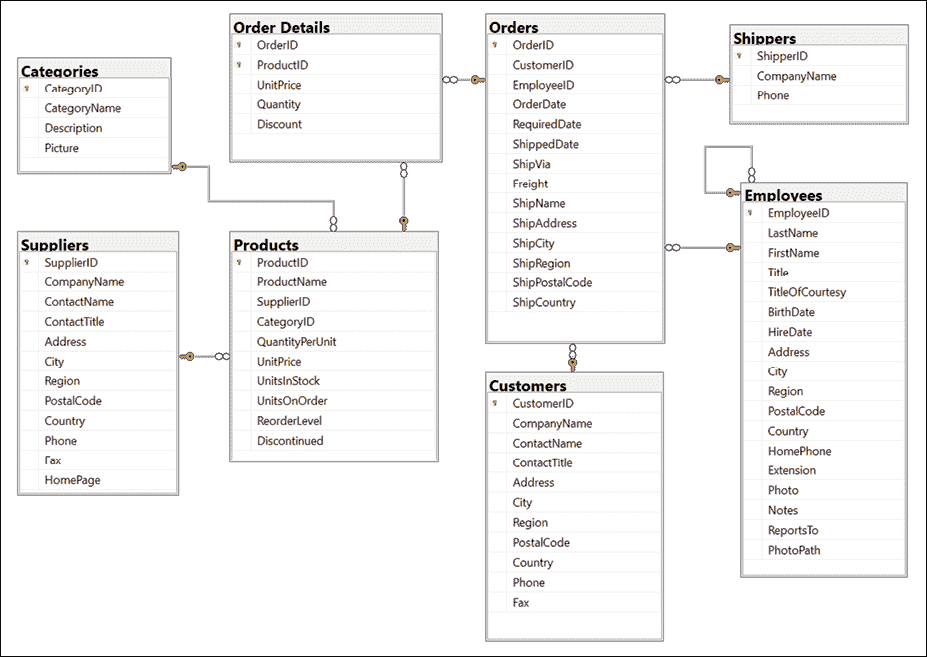
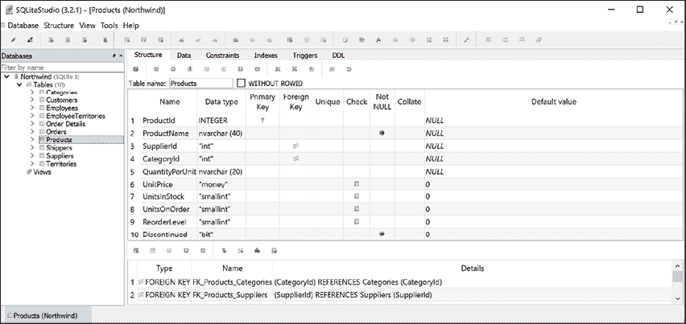
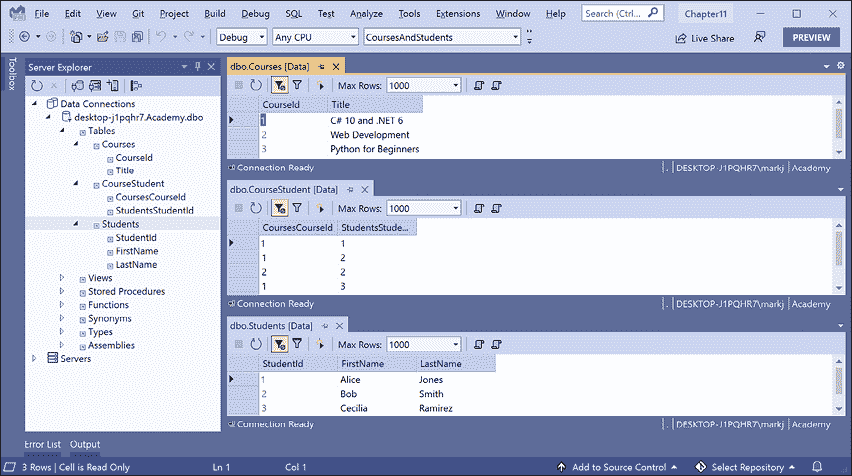

# 十、使用实体框架核心处理数据

本章介绍使用名为**实体框架核心**（**EF 核心**的对象到数据存储映射技术，对数据存储进行读写操作，如 Microsoft SQL Server、SQLite 和 Azure Cosmos DB。

本章将涵盖以下主题：

*   了解现代数据库
*   建立 EF 核心
*   定义 EF 核心模型
*   查询 EF 核心模型
*   EF 核加载模式
*   使用 efcore 处理数据
*   处理事务
*   代码优先 EF 核心模型

# 了解现代数据库

最常见的两个存储数据的位置是在**关系数据库管理系统**（**RDBMS**）中，如 Microsoft SQL Server、PostgreSQL、MySQL 和 SQLite，或在**NoSQL**数据库中，如 Microsoft AzureCosmos DB、Redis、MongoDB 和 Apache Cassandra。

## 理解遗留实体框架

**实体框架****EF**是 2008 年末随着 Service Pack 1 作为.NET Framework 3.5 的一部分首次发布的。从那时起，实体框架不断发展，微软观察到程序员如何在现实世界中使用**对象关系映射**（**ORM**工具。

ORM 使用映射定义将表中的列与类中的属性相关联。然后，程序员可以以他们熟悉的方式与不同类型的对象交互，而不必知道如何将值存储在关系表或 NoSQL 数据存储提供的其他结构中。

NET Framework 中包含的 EF 版本为**实体框架 6**（**EF6**。它成熟、稳定，支持 EDMX（XML 文件）方式定义模型以及复杂的继承模型，以及其他一些高级功能。

EF 6.3 及更高版本作为一个单独的包从.NET Framework 中提取，因此它可以在.NET Core 3.0 及更高版本上得到支持。这使得 web 应用和服务等现有项目能够跨平台移植和运行。然而，EF6 应该被视为一种遗留技术，因为它在跨平台运行时有一些限制，并且不会添加新功能。

### 使用遗留实体框架 6.3 或更高版本

要在.NET Core 3.0 或更高版本的项目中使用传统实体框架，必须在项目文件中向其添加包引用，如以下标记所示：

```cs
<PackageReference Include="EntityFramework" Version="6.4.4" /> 
```

**良好实践**：仅在迁移使用传统 EF6 的 WPF 应用时使用传统 EF6。本书是关于现代跨平台开发的，因此，在本章的其余部分，我将只介绍现代实体框架的核心。您不需要在本章的项目中引用上面所示的遗留 EF6 包。

## 理解实体框架核心

真正的跨平台版本**EF Core**与传统实体框架不同。虽然 EF Core 有一个类似的名称，但您应该知道它与 EF6 的区别。最新的 EF 内核是 6.0 版，与.NET 6.0 相匹配。

EF Core 5 及更高版本仅支持.NET 5 及更高版本。EF Core 3.0 及更高版本仅在支持.NET 标准 2.1（即.NET Core 3.0 及更高版本）的平台上运行。它不支持.NET 标准 2.0 平台，如.NET Framework 4.8。

与传统的 RDBMS 一样，EF Core 支持基于云的、非关系的、无模式的现代数据存储，如 Microsoft Azure Cosmos DB 和 MongoDB，有时还支持第三方提供商。

EF Core 有很多改进，本章无法涵盖所有改进。我将重点介绍所有.NET 开发人员都应该了解的基础知识和一些更酷的新特性。

使用 EF Core 有两种方法：

1.  **数据库优先**：数据库已经存在，所以您可以构建一个与其结构和特性相匹配的模型。
2.  **先编码**：不存在数据库，所以您先建立一个模型，然后使用 EF Core 创建一个与其结构和特性相匹配的数据库。

我们将首先在现有数据库中使用 efcore。

## 创建用于使用 EF Core 的控制台应用

首先，我们将为本章创建一个控制台应用项目：

1.  使用您首选的代码编辑器创建名为`Chapter10`的新解决方案/工作区。
2.  添加控制台应用项目，如以下列表中所定义：
    1.  项目模板：**控制台应用**/`console`
    2.  工作区/解决方案文件和文件夹：`Chapter10`
    3.  项目文件和文件夹：`WorkingWithEFCore`

## 使用示例关系数据库

要了解如何使用.NET 管理 RDBMS，最好有一个示例，这样您就可以在一个具有中等复杂性和大量示例记录的 RDBMS 上进行练习。微软提供了几个示例数据库，其中大多数对于我们的需求来说过于复杂，因此我们将使用一个在 20 世纪 90 年代初首次创建的数据库**Northwind**。

让我们花一点时间看看北风数据库的图表。当我们在本书中编写代码和查询时，您可以使用以下图表：

<figure class="mediaobject"></figure>

图 10.1:Northwind 数据库表和关系

您将在本章后面编写代码来处理`Categories`和`Products`表，以及后面章节中的其他表。但在此之前，请注意：

*   每个类别都有一个唯一的标识符、名称、描述和图片。
*   每个产品都有一个唯一的标识符、名称、单价、库存单位和其他字段。
*   通过存储类别的唯一标识符，每个产品都与类别相关联。
*   `Categories`和`Products`之间的关系是一对多，这意味着每个类别可以有零个或多个产品。

## 使用 Microsoft SQL Server for Windows

微软为 Windows、Linux 和 Docker 容器提供了各种版本的流行且功能强大的 SQL Server 产品。我们将使用一个可以独立运行的免费版本，称为 SQLServerDeveloperEdition。您还可以使用可与 Visual Studio for Windows 一起安装的 Express edition 或免费 SQL Server LocalDB edition。

如果您没有 Windows 计算机或希望使用跨平台数据库系统，则可以跳过主题*使用 SQLite*。

### 下载和安装 SQL Server

您可以通过以下链接下载 SQL Server 版本：

[https://www.microsoft.com/en-us/sql-server/sql-server-downloads](https://www.microsoft.com/en-us/sql-server/sql-server-downloads)

1.  下载**开发者**版。
2.  运行安装程序。
3.  选择**自定义**安装类型。
4.  为安装文件选择一个文件夹，然后单击**安装**。
5.  等待下载 1.5 GB 的安装程序文件。
6.  在**SQL Server 安装中心**中，点击**安装**，然后点击**新建 SQL Server 单机安装或向现有安装**添加功能。
7.  选择**开发者**作为免费版，点击**下一步**。
8.  接受许可条款，然后单击**下一步**。
9.  查看安装规则，修复所有问题，然后单击**下一步**。
10.  在**功能选择**中，选择**数据库引擎服务**，然后点击**下一步**。
11.  在**实例配置**中，选择**默认实例**，点击**下一步**。如果您已经配置了一个默认实例，那么您可以创建一个命名实例，可能称为`cs10dotnet6`。
12.  在**服务器配置**中，注意**SQL Server****数据库引擎**配置为自动启动。将**SQL Server 浏览器**设置为自动启动，然后点击**下一步**。
13.  在**数据库引擎配置**中，在**服务器配置**页签上，将**认证模式**设置为**混合**，将**sa**账号密码设置为强密码，点击**添加当前用户**，然后点击**下一步**。
14.  在**准备安装**中，查看将要采取的操作，然后单击**安装**。
15.  在**完成**中，记录所采取的成功操作，然后单击**关闭**。
16.  在**SQL Server 安装中心**中，在**安装**中，点击**安装 SQL Server 管理工具**。
17.  在浏览器窗口中，点击下载 SSMS 的最新版本。
18.  运行安装程序并单击**安装**。
19.  安装完成后，如果需要，单击**重新启动**或**关闭**。

## 为 SQL Server 创建 Northwind 示例数据库

现在我们可以运行一个数据库脚本来创建 Northwind 示例数据库：

1.  如果您之前没有下载或克隆本书的 GitHub 存储库，那么现在就使用以下链接进行下载或克隆：[https://github.com/markjprice/cs10dotnet6/](https://github.com/markjprice/cs10dotnet6/) 。
2.  从本地 Git 存储库中的以下路径复制脚本以创建 SQL Server 的 Northwind 数据库：`/sql-scripts/Northwind4SQLServer.sql`到`WorkingWithEFCore`文件夹中。
3.  启动**SQL Server 管理工作室**。
4.  In the **Connect to Server** dialog, for **Server name**, enter `.` (a dot) meaning the local computer name, and then click **Connect**.

    如果必须创建一个命名实例，如`cs10dotnet6`，则输入`.\cs10dotnet6`

5.  导航到**文件****打开****文件。。。**。
6.  浏览选择`Northwind4SQLServer.sql`文件，然后点击**打开**。
7.  在工具栏中，点击**执行**，并注意**命令成功完成**消息。
8.  在**对象浏览器**中，展开**北风**数据库，然后展开**表**。
9.  Right-click **Products**, click **Select Top 1000 Rows**, and note the returned results, as shown in *Figure 10.2*:

    <figure class="mediaobject"></figure>

    图 10.2:SQLServerManagementStudio 中的 Products 表

10.  在**对象浏览器**工具栏中，点击**断开**按钮。
11.  退出 SQLServerManagementStudio。

## 使用服务器资源管理器管理 Northwind 示例数据库

我们不必使用 SQL Server ManagementStudio 来执行数据库脚本。我们也可以使用 Visual Studio 中的工具，包括**SQL Server 对象资源管理器**和**服务器资源管理器**：

1.  在 Visual Studio 中，选择**查看****服务器资源管理器**。
2.  在**服务器资源管理器**窗口中，右键点击**数据连接**并选择**添加连接。。。**。
3.  If you see the **Choose Data Source** dialog, as shown in *Figure 10.3*, select **Microsoft SQL Server** and then click **Continue**:

    <figure class="mediaobject"></figure>

    图 10.3：选择 SQL Server 作为数据源

4.  在的**添加连接**对话框中，输入服务器名称为`.`，输入数据库名称为`Northwind`，然后点击**确定**。
5.  在**服务器资源管理器**中，展开数据连接及其表。您应该看到 13 个表格，包括**类别**和**产品**表格。
6.  右键点击**产品**表格，选择**显示表格数据**，注意返回 77 行产品。
7.  要查看**产品**表列和类型的详细信息，请右键单击**产品**并选择**打开表定义**，或双击**服务器资源管理器**中的表。

## 使用 SQLite

SQLite 是一种小型、跨平台、自包含的 RDBMS，可在公共领域中使用。它是 iOS（iPhone 和 iPad）和 Android 等移动平台上最常见的 RDBMS。即使在上一节中使用 Windows 并设置 SQL Server，也可能需要设置 SQLite。我们编写的代码将同时使用这两种方法，看到细微的差异可能会很有趣。

### 为 macOS 设置 SQLite

SQLite 作为名为`sqlite3`的命令行应用包含在`/usr/bin/`目录下的 macOS 中。

### 为 Windows 设置 SQLite

在 Windows 上，我们需要将 SQLite 文件夹添加到系统路径中，以便在命令提示符或终端输入命令时可以找到：

1.  启动您喜爱的浏览器并导航到以下链接：[https://www.sqlite.org/download.html](https://www.sqlite.org/download.html) 。
2.  向下滚动页面至针对 Windows 的**预编译二进制文件部分。**
3.  点击**sqlite-tools-win32-x86-3360000.zip**。注意：本书出版后，该文件的版本号可能会更高。
4.  将 ZIP 文件解压缩到名为`C:\Sqlite\`的文件夹中。
5.  导航至**Windows 设置**。
6.  搜索`environment`并选择**编辑系统环境变量**。在非英语版本的 Windows 上，请搜索本地语言中的等效词以查找设置。
7.  点击环境变量按钮。
8.  在**系统变量**中，在列表中选择**路径**，然后点击**编辑…**。
9.  点击**新建**，输入`C:\Sqlite`，然后按 enter 键。
10.  点击**确定**。
11.  点击**确定**。
12.  点击**确定**。
13.  关闭**窗口设置**。

### 为其他操作系统设置 SQLite

SQLite 可以从以下链接下载并安装到其他操作系统：[https://www.sqlite.org/download.html](https://www.sqlite.org/download.html) 。

## 为 SQLite 创建 Northwind 示例数据库

现在我们可以使用 SQL 脚本为 SQLite 创建 Northwind 示例数据库：

1.  如果您之前没有克隆本书的 GitHub 存储库，那么现在就使用以下链接进行克隆：[https://github.com/markjprice/cs10dotnet6/](https://github.com/markjprice/cs10dotnet6/) 。
2.  从本地 Git 存储库中的以下路径复制脚本以创建 SQLite 的 Northwind 数据库：`/sql-scripts/Northwind4SQLite.sql`到`WorkingWithEFCore`文件夹中。
3.  在`WorkingWithEFCore`文件夹中启动命令行：
    1.  在 Windows 上，启动**文件管理器**，右键点击`WorkingWithEFCore`文件夹，在文件夹中选择**新建命令提示符或在 Windows 终端**中选择**打开。**
    2.  在 macOS 上，启动**Finder**，右键点击`WorkingWithEFCore`文件夹，在文件夹中选择**新建终端。**
4.  输入命令，使用 SQLite 执行 SQL 脚本并创建`Northwind.db`数据库，如下命令所示：

    ```cs
    sqlite3 Northwind.db -init Northwind4SQLite.sql 
    ```

5.  请耐心等待，因为此命令可能需要一段时间来创建数据库结构。最终，您将看到 SQLite 命令提示符，如以下输出所示：

    ```cs
    -- Loading resources from Northwind4SQLite.sql 
    SQLite version 3.36.0 2021-08-24 15:20:15
    Enter ".help" for usage hints.
    sqlite> 
    ```

6.  在 Windows 上按 Ctrl+C 或在 macOS 上按 Ctrl+D 退出 SQLite 命令模式。
7.  保持终端或命令提示窗口打开，因为您很快就会再次使用它。

## 使用 SQLiteStudio 管理 Northwind 示例数据库

您可以使用名为**SQLiteStudio**的跨平台图形数据库管理器轻松管理 SQLite 数据库：

1.  导航到以下链接，[https://sqlitestudio.pl](https://sqlitestudio.pl) ，下载并将应用解压缩到您的首选位置。
2.  启动**SQLiteStudio**。
3.  在**数据库**菜单中，选择**添加数据库**。
4.  在**数据库**对话框中，在**文件**部分，点击黄色文件夹按钮浏览本地计算机上已有的数据库文件，选择`WorkingWithEFCore`文件夹中的`Northwind.db`文件，然后点击**确定**。
5.  右键点击**北风**数据库，选择**连接数据库**。您将看到脚本创建的 10 个表。（SQLite 的脚本比 SQL Server 的脚本简单；它不会创建那么多的表或其他数据库对象。）
6.  右键点击**产品**表格，选择**编辑表格**。
7.  In the table editor window, note the structure of the `Products` table, including column names, data types, keys, and constraints, as shown in *Figure 10.4*:

    <figure class="mediaobject"></figure>

    图 10.4:SQLiteStudio 中的表编辑器显示了 Products 表的结构

8.  In the table editor window, click the **Data** tab, and you will see 77 products, as shown in *Figure 10.5*:

    <figure class="mediaobject"></figure>

    图 10.5:Data 选项卡显示 Products 表中的行

9.  在**数据库**窗口中，右键点击**北风**并选择**与数据库**断开连接。
10.  退出 SQLiteStudio。

# 建立 EF 核心

在我们深入探讨使用 EF Core 管理数据的实用性之前，让我们先简单谈谈在 EF Core 数据提供商之间进行选择。

## 选择 EF 核心数据库提供程序

为了管理特定数据库中的数据，我们需要知道如何高效地与该数据库通信的类。

EF Core 数据库提供程序是针对特定数据存储优化的类集。甚至还有一个提供者可以将数据存储在当前进程的内存中，这对于高性能单元测试非常有用，因为它可以避免撞击外部系统。

它们作为 NuGet 包分发，如下表所示：

<colgroup><col> <col></colgroup> 
| 要管理此数据存储 | 安装此 NuGet 软件包 |
| Microsoft SQL Server 2012 或更高版本 | `Microsoft.EntityFrameworkCore.SqlServer` |
| SQLite 3.7 或更高版本 | `Microsoft.EntityFrameworkCore.SQLite` |
| MySQL | `MySQL.Data.EntityFrameworkCore` |
| 记忆中 | `Microsoft.EntityFrameworkCore.InMemory` |
| Azure 宇宙数据库 SQL API | `Microsoft.EntityFrameworkCore.Cosmos` |
| Oracle DB 11.2 | `Oracle.EntityFrameworkCore` |

您可以根据需要在同一项目中安装任意多个 EF 核心数据库提供程序。每个包都包括共享类型以及特定于提供程序的类型。

## 连接到数据库

要连接到 SQLite 数据库，我们只需要知道数据库文件名，使用参数`Filename`进行设置。

要将连接到 SQL Server 数据库，我们需要知道多条信息，如下表所示：

*   服务器的名称（以及实例（如果有）。
*   数据库的名称。
*   安全信息，例如用户名和密码，或者我们是否应该自动传递当前登录用户的凭据。

我们在**连接字符串**中指定此信息。

为了向后兼容，我们可以在 SQL Server 连接字符串中为各种参数使用多个可能的关键字，如下表所示：

*   `Data Source`或`server`或`addr`：这些关键字是服务器的名称（可选实例）。您可以使用点`.`表示本地服务器。
*   `Initial Catalog`或`database`：这些关键字是数据库的名称。
*   `Integrated Security`或`trusted_connection`：这些关键字设置为`true`或`SSPI`以传递线程的当前用户凭证。
*   `MultipleActiveResultSets`：将该关键字设置为`true`，使单个连接可以同时处理多个表，提高效率。它用于从相关表延迟加载行。

如上表所述，当您编写连接 SQL Server 数据库的代码时，您需要知道其服务器名称。服务器名称取决于您将连接到的 SQL server 的版本和版本，如下表所示：

<colgroup><col> <col></colgroup> 
| SQL Server 版本 | 服务器名称\实例名称 |
| 本地数据库 2012 | `(localdb)\v11.0` |
| LocalDB 2016 或更高版本 | `(localdb)\mssqllocaldb` |
| 表示 | `.\sqlexpress` |
| 完整/开发人员（默认实例） | `.` |
| 完整/开发人员（命名实例） | `.\cs10dotnet6` |

**良好实践**：使用点`.`作为本地计算机名称的缩写。请记住，SQL server 的服务器名称由两部分组成：计算机名称和 SQL server 实例名称。您可以在自定义安装期间提供实例名称。

## 定义 Northwind 数据库上下文类

`Northwind`类将用于表示数据库。若要使用 EF Core，该类必须从`DbContext`继承。此类了解如何与数据库通信，以及如何动态生成 SQL 语句来查询和操作数据。

您的`DbContext`-派生类应该有一个名为`OnConfiguring`的重写方法，该方法将设置数据库连接字符串。

为了便于您尝试 SQLite 和 SQL Server，我们将创建一个同时支持这两种技术的项目，并在运行时使用一个`string`字段进行控制：

1.  在`WorkingWithEFCore`项目中，为 SQL Server 和 SQLite 添加对 EF 核心数据提供程序的包引用，如以下标记所示：

    ```cs
    <ItemGroup>
      <PackageReference
        Include="Microsoft.EntityFrameworkCore.Sqlite" 
        Version="6.0.0" />
      <PackageReference
        Include="Microsoft.EntityFrameworkCore.SqlServer" 
        Version="6.0.0" />
    </ItemGroup> 
    ```

2.  构建项目以恢复包。
3.  添加名为`ProjectConstants.cs`的类文件。
4.  在`ProjectConstants.cs`中，定义一个带有公共字符串常量的类来存储要使用的数据库提供程序名称，如下代码所示：

    ```cs
    namespace Packt.Shared;
    public class ProjectConstants
    {
      public const string DatabaseProvider = "SQLite"; // or "SQLServer"
    } 
    ```

5.  在`Program.cs`中，导入`Packt.Shared`名称空间并输出数据库提供者，如下代码所示：

    ```cs
    WriteLine($"Using {ProjectConstants.DatabaseProvider} database provider."); 
    ```

6.  添加一个名为`Northwind.cs`的类文件。
7.  In `Northwind.cs`, define a class named `Northwind`, import the main namespace for EF Core, make the class inherit from `DbContext`, and in an `OnConfiguring` method, check the `provider` field to either use SQLite or SQL Server, as shown in the following code:

    ```cs
    using Microsoft.EntityFrameworkCore; // DbContext, DbContextOptionsBuilder
    using static System.Console;
    namespace Packt.Shared;
    // this manages the connection to the database
    public class Northwind : DbContext
    {
      protected override void OnConfiguring(
        DbContextOptionsBuilder optionsBuilder)
      {
        if (ProjectConstants.DatabaseProvider == "SQLite")
        {
          string path = Path.Combine(
            Environment.CurrentDirectory, "Northwind.db");
          WriteLine($"Using {path} database file.");
          optionsBuilder.UseSqlite($"Filename={path}");
        }
        else
        {
          string connection = "Data Source=.;" + 
            "Initial Catalog=Northwind;" + 
            "Integrated Security=true;" +
            "MultipleActiveResultSets=true;";
          optionsBuilder.UseSqlServer(connection);
        }
      }
    } 
    ```

    如果您使用的是 Visual Studio for Windows，则编译后的应用将在`WorkingWithEFCore\bin\Debug\net6.0`文件夹中执行，因此它将找不到数据库文件。

8.  在**解决方案资源管理器**中，右键点击`Northwind.db`文件，选择**属性**。
9.  在**属性**中，将**复制到输出目录**设置为**始终复制**。
10.  Open `WorkingWithEFCore.csproj` and note the new elements, as shown in the following markup:

    ```cs
    <ItemGroup>
      <None Update="Northwind.db">
        <CopyToOutputDirectory>Always</CopyToOutputDirectory>
      </None>
    </ItemGroup> 
    ```

    如果您使用的是 Visual Studio 代码，那么编译后的应用将在`WorkingWithEFCore`文件夹中执行，这样它将在不复制数据库文件的情况下找到数据库文件。

11.  运行 console 应用并注意显示您选择使用哪个数据库提供程序的输出。

# 定义 EF 核心模型

EF Core 在运行时使用**约定**、**注释属性**和**Fluent API**语句的组合来构建实体模型，以便以后在类上执行的任何操作都可以自动转换为在实际数据库上执行的操作。实体类表示表的结构，类的实例表示该表中的一行。

首先，我们将通过代码示例回顾定义模型的三种方法，然后我们将创建一些实现这些技术的类。

## 使用 EF 核心约定定义模型

我们将编写的代码将使用以下约定：

*   假设表的名称与`DbContext`类中`DbSet<T>`属性的名称匹配，例如`Products`。
*   假定列的名称与实体模型类中的属性名称匹配，例如，`ProductId`。
*   假设数据库中的`string`.NET 类型为`nvarchar`类型。
*   假设数据库中的`int`.NET 类型为`int`类型。
*   假设主键是名为`Id`或`ID`的属性，或者当实体模型类名为`Product`时，则可以将该属性命名为`ProductId`或`ProductID`。如果此属性是整数类型或`Guid`类型，则也假定它是`IDENTITY`列（插入时自动赋值的列类型）。

**良好实践**：还有许多其他约定，您应该知道，您甚至可以定义自己的约定，但这超出了本书的范围。您可以通过以下链接阅读相关信息：[https://docs.microsoft.com/en-us/ef/core/modeling/](https://docs.microsoft.com/en-us/ef/core/modeling/)

## 使用 EF 核心注释属性定义模型

约定通常不足以将类完全映射到数据库对象。向模型添加更多智能的一个简单方法是应用注释属性。

下表显示了一些常见属性：

<colgroup><col> <col></colgroup> 
| 属性 | 描述 |
| `[Required]` | 确保该值不是`null`。 |
| `[StringLength(50)]` | 确保该值的长度不超过 50 个字符。 |
| `[RegularExpression(expression)]` | 确保值与指定的正则表达式匹配。 |
| `[Column(TypeName = "money", Name = "UnitPrice")]` | 指定表中使用的列类型和列名。 |

例如，在数据库中，产品名称的最大长度为 40，且值不能为空，如以下**数据定义语言**（**DDL**代码中突出显示的所示，该代码定义了如何创建名为`Products`的表及其列、数据类型、键和其他约束：

```cs
CREATE TABLE Products (
    ProductId       INTEGER       PRIMARY KEY,
    ProductName     NVARCHAR (40) NOT NULL,
    SupplierId      "INT",
    CategoryId      "INT",
    QuantityPerUnit NVARCHAR (20),
    UnitPrice       "MONEY"       CONSTRAINT DF_Products_UnitPrice DEFAULT (0),
    UnitsInStock    "SMALLINT"    CONSTRAINT DF_Products_UnitsInStock DEFAULT (0),
    UnitsOnOrder    "SMALLINT"    CONSTRAINT DF_Products_UnitsOnOrder DEFAULT (0),
    ReorderLevel    "SMALLINT"    CONSTRAINT DF_Products_ReorderLevel DEFAULT (0),
    Discontinued    "BIT"         NOT NULL
                                  CONSTRAINT DF_Products_Discontinued DEFAULT (0),
    CONSTRAINT FK_Products_Categories FOREIGN KEY (
        CategoryId
    )
    REFERENCES Categories (CategoryId),
    CONSTRAINT FK_Products_Suppliers FOREIGN KEY (
        SupplierId
    )
    REFERENCES Suppliers (SupplierId),
    CONSTRAINT CK_Products_UnitPrice CHECK (UnitPrice >= 0),
    CONSTRAINT CK_ReorderLevel CHECK (ReorderLevel >= 0),
    CONSTRAINT CK_UnitsInStock CHECK (UnitsInStock >= 0),
    CONSTRAINT CK_UnitsOnOrder CHECK (UnitsOnOrder >= 0) 
); 
```

在`Product`类中，我们可以应用属性来指定，如下代码所示：

```cs
[Required] 
[StringLength(40)]
public string ProductName { get; set; } 
```

当.NET 类型和数据库类型之间没有明显的映射时，可以使用属性。

例如，在数据库中，`Products`表的`UnitPrice`列类型为`money`。NET 没有`money`类型，所以应该使用`decimal`，如下代码所示：

```cs
[Column(TypeName = "money")]
public decimal? UnitPrice { get; set; } 
```

另一个例子是`Categories`表，如下 DDL 代码所示：

```cs
CREATE TABLE Categories (
    CategoryId   INTEGER       PRIMARY KEY,
    CategoryName NVARCHAR (15) NOT NULL,
    Description  "NTEXT",
    Picture      "IMAGE"
); 
```

`Description`列的长度可以超过`nvarchar`变量可以存储的最大 8000 个字符，因此需要映射到`ntext`，如下代码所示：

```cs
[Column(TypeName = "ntext")]
public string Description { get; set; } 
```

## 使用 EF Core Fluent API 定义模型

最后一种可以定义模型的方法是使用 Fluent API。此 API 可以代替属性使用，也可以将作为属性的补充使用。例如，为了定义`ProductName`属性，可以在数据库上下文类的`OnModelCreating`方法中编写一条等价的 Fluent API 语句，而不是用两个属性来修饰该属性，如下代码所示：

```cs
modelBuilder.Entity<Product>()
  .Property(product => product.ProductName)
  .IsRequired()
  .HasMaxLength(40); 
```

这使得实体模型类更简单。

### 使用 fluentapi 理解数据种子设定

Fluent API 的另一个好处是提供初始数据来填充数据库。EF Core 自动计算出必须执行的插入、更新或删除操作。

例如，如果我们想要确保一个新数据库在`Product`表中至少有一行，那么我们将调用`HasData`方法，如下代码所示：

```cs
modelBuilder.Entity<Product>()
  .HasData(new Product
  {
    ProductId = 1,
    ProductName = "Chai",
    UnitPrice = 8.99M
  }); 
```

我们的模型将映射到一个已经填充了数据的现有数据库，因此我们不需要在代码中使用这种技术。

## 为 Northwind 表建立 EF 核心模型

既然已经了解了定义 EF 核心模型的方法，那么让我们构建一个模型来表示`Northwind`数据库中的两个表。

两个实体类将相互引用，为了避免编译器错误，我们将首先创建没有任何成员的类：

1.  在`WorkingWithEFCore`项目中，添加两个名为`Category.cs`和`Product.cs`的类文件。
2.  在`Category.cs`中定义一个名为`Category`的类，如下代码所示：

    ```cs
    namespace Packt.Shared;
    public class Category
    {
    } 
    ```

3.  在`Product.cs`中定义一个名为`Product`的类，如下代码所示：

    ```cs
    namespace Packt.Shared;
    public class Product
    {
    } 
    ```

### 定义类别和产品实体类

`Category`类，也称为实体模型，将用于表示`Categories`表中的一行。此表有四列，如以下 DDL 所示：

```cs
CREATE TABLE Categories (
    CategoryId   INTEGER       PRIMARY KEY,
    CategoryName NVARCHAR (15) NOT NULL,
    Description  "NTEXT",
    Picture      "IMAGE"
); 
```

我们将使用约定来定义：

*   四个属性中的三个（我们不会映射`Picture`列）。
*   主键。
*   与`Products`表的一对多关系。

为了将`Description`列映射到正确的数据库类型，我们需要用`Column`属性修饰`string`属性。

在本章的后面部分，我们将使用 Fluent API 定义`CategoryName`不能为空，且最多不超过 15 个字符。

走吧：

1.  Modify the `Category` entity model class, as shown in the following code:

    ```cs
    using System.ComponentModel.DataAnnotations.Schema; // [Column]
    namespace Packt.Shared;
    public class Category
    {
      // these properties map to columns in the database
      public int CategoryId { get; set; }
      public string? CategoryName { get; set; }
      [Column(TypeName = "ntext")]
      public string? Description { get; set; }
      // defines a navigation property for related rows
      public virtual ICollection<Product> Products { get; set; }
      public Category()
      {
        // to enable developers to add products to a Category we must
        // initialize the navigation property to an empty collection
        Products = new HashSet<Product>();
      }
    } 
    ```

    `Product`类将用于表示`Products`表中的一行，该表有十列。

    不需要将表中的所有列作为类的属性包含在内。我们将只映射六个属性：`ProductId`、`ProductName`、`UnitPrice`、`UnitsInStock`、`Discontinued`和`CategoryId`。

    无法使用类实例读取或设置未映射到属性的列。如果使用该类创建新对象，则表中的新行将具有`NULL`或该行中未映射列值的其他默认值。必须确保缺少的列是可选的，或者由数据库设置了默认值，否则将在运行时引发异常。在这个场景中，行已经有了数据值，我决定在这个应用中不需要读取这些值。

    我们可以通过定义一个具有不同名称的属性（如`Cost`）来重命名一个列，然后使用`[Column]`属性装饰该属性并指定其列名，如`UnitPrice`。

    最后一个属性`CategoryId`与一个`Category`属性相关联，该属性将用于将每个产品映射到其父类别。

2.  修改`Product`类，如下代码所示：

    ```cs
    using System.ComponentModel.DataAnnotations; // [Required], [StringLength]
    using System.ComponentModel.DataAnnotations.Schema; // [Column]
    namespace Packt.Shared;
    public class Product
    {
      public int ProductId { get; set; } // primary key
      [Required]
      [StringLength(40)]
      public string ProductName { get; set; } = null!;
      [Column("UnitPrice", TypeName = "money")]
      public decimal? Cost { get; set; } // property name != column name
      [Column("UnitsInStock")]
      public short? Stock { get; set; }
      public bool Discontinued { get; set; }
      // these two define the foreign key relationship
      // to the Categories table
      public int CategoryId { get; set; }
      public virtual Category Category { get; set; } = null!;
    } 
    ```

与两个实体相关的两个属性`Category.Products`和`Product.Category`均标记为`virtual`。这允许 EF Core 继承和重写属性以提供额外功能，例如延迟加载。

## 向 Northwind 数据库上下文类添加表

在您的`DbContext`派生类中，必须至少定义一个`DbSet<T>`类型的属性。这些属性表示表。为了告诉 EF Core 每个表都有哪些列，`DbSet<T>`属性使用泛型指定一个表示表中一行的类。该实体模型类具有表示其列的属性。

`DbContext`派生的类可以有一个名为`OnModelCreating`的重写方法。在这里，您可以编写流畅的 API 语句，作为用属性装饰实体类的替代方案。

让我们编写一些代码：

1.  修改`Northwind`类，添加语句，为两个表定义两个属性和一个`OnModelCreating`方法，如下代码所示：

    ```cs
    public class Northwind : DbContext
    {
    **// these properties map to tables in the database**
    **public** **DbSet<Category>? Categories {** **get****;** **set****; }**
    **public** **DbSet<Product>? Products {** **get****;** **set****; }**
      protected override void OnConfiguring(
        DbContextOptionsBuilder optionsBuilder)
      {
        ...
      }
    **protected****override****void****OnModelCreating****(**
     **ModelBuilder modelBuilder****)**
     **{**
    **// example of using Fluent API instead of attributes**
    **// to limit the length of a category name to 15**
     **modelBuilder.Entity<Category>()**
     **.Property(category => category.CategoryName)**
     **.IsRequired()** **// NOT NULL**
     **.HasMaxLength(****15****);**
    **if** **(ProjectConstants.DatabaseProvider ==** **"SQLite"****)**
     **{**
    **// added to "fix" the lack of decimal support in SQLite**
     **modelBuilder.Entity<Product>()**
     **.Property(product => product.Cost)**
     **.HasConversion<****double****>();**
     **}**
     **}**
    } 
    ```

在 EF Core 3.0 及更高版本中，SQLite 数据库提供程序不支持用于排序和其他操作的`decimal`类型。我们可以通过告诉模型在使用 SQLite 数据库提供程序时，`decimal`值可以转换为`double`值来解决这个问题。这实际上不会在运行时执行任何转换。

既然您已经看到了一些手动定义实体模型的示例，那么让我们来看一个可以为您完成部分工作的工具。

## 设置 dotnet ef 工具

.NET 有一个名为`dotnet`的命令行工具。它可以通过使用 EF Core 的有用功能进行扩展。它可以执行设计时任务，如创建和应用从旧模型到新模型的迁移，以及从现有数据库生成模型代码。

`dotnet``ef`命令行工具未自动安装。您必须将此软件包安装为**全局**或**本地工具**。如果已安装该工具的旧版本，则应卸载任何现有版本：

1.  在命令提示符或终端，检查您是否已经将`dotnet-ef`安装为全局工具，如以下命令所示：

    ```cs
    dotnet tool list --global 
    ```

2.  检查列表中是否安装了旧版本的工具，如.NET Core 3.1 的版本，如以下输出所示：

    ```cs
    Package Id      Version     Commands
    -------------------------------------
    dotnet-ef       3.1.0       dotnet-ef 
    ```

3.  如果已经安装了旧版本，则卸载该工具，如以下命令所示：

    ```cs
    dotnet tool uninstall --global dotnet-ef 
    ```

4.  安装最新版本，如下命令所示：

    ```cs
    dotnet tool install --global dotnet-ef --version 6.0.0 
    ```

5.  如有必要，按照任何特定于操作系统的说明将`dotnet tools`目录添加到 PATH 环境变量中，如安装`dotnet-ef`工具的输出中所述。

## 使用现有数据库构建模型

脚手架是使用工具创建类的过程，这些类表示使用逆向工程的现有数据库的模型。一个好的脚手架工具允许您扩展自动生成的类，然后在不丢失扩展类的情况下重新生成这些类。

如果您知道永远不会使用该工具重新生成类，那么可以随意更改自动生成的类的代码。该工具生成的代码只是最佳近似值。

**良好实践**：当你更了解某个工具时，不要害怕否决它。

让我们看看该工具是否生成与我们手动生成的模型相同的模型：

1.  将`Microsoft.EntityFrameworkCore.Design`包添加到`WorkingWithEFCore`项目中。
2.  At a command prompt or terminal in the `WorkingWithEFCore` folder, generate a model for the `Categories` and `Products` tables in a new folder named `AutoGenModels`, as shown in the following command:

    ```cs
    dotnet ef dbcontext scaffold "Filename=Northwind.db" Microsoft.EntityFrameworkCore.Sqlite --table Categories --table Products --output-dir AutoGenModels --namespace WorkingWithEFCore.AutoGen --data-annotations --context Northwind 
    ```

    注意以下几点：

    *   命令动作：`dbcontext scaffold`
    *   连接字符串：`"Filename=Northwind.db"`
    *   数据库提供程序：`Microsoft.EntityFrameworkCore.Sqlite`
    *   要为其生成模型的表：`--table Categories --table Products`
    *   输出文件夹：`--output-dir AutoGenModels`
    *   名称空间：`--namespace WorkingWithEFCore.AutoGen`
    *   要使用数据注释以及 Fluent API:`--data-annotations`
    *   从[database_name]context:`--context Northwind`重命名上下文

    对于 SQL Server，更改数据库提供程序和连接字符串，如以下命令所示：

    ```cs
    dotnet ef dbcontext scaffold "Data Source=.;Initial Catalog=Northwind;Integrated Security=true;" Microsoft.EntityFrameworkCore.SqlServer --table Categories --table Products --output-dir AutoGenModels --namespace WorkingWithEFCore.AutoGen --data-annotations --context Northwind 
    ```

1.  注意构建消息和警告，如以下输出所示：

    ```cs
    Build started...
    Build succeeded.
    To protect potentially sensitive information in your connection string, you should move it out of source code. You can avoid scaffolding the connection string by using the Name= syntax to read it from configuration - see https://go.microsoft.com/fwlink/?linkid=2131148\. For more guidance on storing connection strings, see http://go.microsoft.com/fwlink/?LinkId=723263.
    Skipping foreign key with identity '0' on table 'Products' since principal table 'Suppliers' was not found in the model. This usually happens when the principal table was not included in the selection set. 
    ```

2.  打开文件夹，记录自动生成的三个类文件：`Category.cs`、`Northwind.cs`和`Product.cs`。
3.  Open `Category.cs` and note the differences compared to the one you created manually, as shown in the following code:

    ```cs
    using System;
    using System.Collections.Generic;
    using System.ComponentModel.DataAnnotations;
    using System.ComponentModel.DataAnnotations.Schema; 
    using Microsoft.EntityFrameworkCore;
    namespace WorkingWithEFCore.AutoGen
    {
      [Index(nameof(CategoryName), Name = "CategoryName")]
      public partial class Category
      {
        public Category()
        {
          Products = new HashSet<Product>();
        }
        [Key]
        public long CategoryId { get; set; }
        [Required]
        [Column(TypeName = "nvarchar (15)")] // SQLite
        [StringLength(15)] // SQL Server
        public string CategoryName { get; set; }
        [Column(TypeName = "ntext")]
        public string? Description { get; set; }
        [Column(TypeName = "image")]
        public byte[]? Picture { get; set; }
        [InverseProperty(nameof(Product.Category))]
        public virtual ICollection<Product> Products { get; set; }
      }
    } 
    ```

    注以下内容：

    *   它用 EF Core 5.0 中引入的`[Index]`属性装饰实体类。这表示应具有索引的属性。在早期版本中，仅支持 Fluent API 来定义索引。由于我们使用的是现有的数据库，因此不需要这样做。但是，如果我们想从代码中重新创建一个新的空数据库，那么就需要这些信息。
    *   数据库中的表名为`Categories`，但`dotnet-ef`工具使用**人性化器**第三方库自动将类名单数化为`Category`，这是创建单个实体时更自然的名称。
    *   实体类是使用`partial`关键字声明的，这样您就可以创建一个匹配的`partial`类来添加额外的代码。这允许您重新运行该工具并重新生成实体类，而不会丢失额外的代码。
    *   `CategoryId`属性用`[Key]`属性修饰，表示它是该实体的主键。此属性的数据类型对于 SQL Server 为`int`，对于 SQLite 为`long`。
    *   `Products`属性使用`[InverseProperty]`属性定义与`Product`实体类上`Category`属性的外键关系。
4.  打开`Product.cs`并注意与手动创建的差异。
5.  Open `Northwind.cs` and note the differences compared to the one you created manually, as shown in the following edited-for-space code:

    ```cs
    using Microsoft.EntityFrameworkCore; 
    namespace WorkingWithEFCore.AutoGen
    {
      public partial class Northwind : DbContext
      {
        public Northwind()
        {
        }
        public Northwind(DbContextOptions<Northwind> options)
          : base(options)
        {
        }
        public virtual DbSet<Category> Categories { get; set; } = null!;
        public virtual DbSet<Product> Products { get; set; } = null!;
        protected override void OnConfiguring(
          DbContextOptionsBuilder optionsBuilder)
        {
          if (!optionsBuilder.IsConfigured)
          {
    # warning To protect potentially sensitive information in your connection string, you should move it out of source code. You can avoid scaffolding the connection string by using the Name= syntax to read it from configuration - see https://go.microsoft.com/fwlink/?linkid=2131148\. For more guidance on storing connection strings, see http://go.microsoft.com/fwlink/?LinkId=723263.
            optionsBuilder.UseSqlite("Filename=Northwind.db");
          }
        }
        protected override void OnModelCreating(ModelBuilder modelBuilder)
        {
          modelBuilder.Entity<Category>(entity =>
          {
            ...
          });
          modelBuilder.Entity<Product>(entity =>
          {
            ...
          });
          OnModelCreatingPartial(modelBuilder);
        }
        partial void OnModelCreatingPartial(ModelBuilder modelBuilder);
      }
    } 
    ```

    注以下内容：

    *   `Northwind`数据上下文类是`partial`，允许您在将来对其进行扩展和重新生成。
    *   它有两个构造函数：一个默认参数减去一个，另一个允许传入选项。这在希望在运行时指定连接字符串的应用中非常有用。
    *   表示`Categories`和`Products`表的两个`DbSet<T>`属性被设置为`null`宽恕值，以防止编译时出现静态编译器分析警告。它在运行时没有效果。
    *   在`OnConfiguring`方法中，如果构造函数中未指定选项，则默认使用连接字符串在当前文件夹中查找数据库文件。它有一个编译器警告，提醒您不要在此连接字符串中硬编码安全信息。
    *   在`OnModelCreating`方法中，使用 Fluent API 配置两个实体类，然后调用名为`OnModelCreatingPartial`的分部方法。这允许您在自己的 partial`Northwind`类中实现该 partial 方法，以添加自己的 Fluent API 配置，如果重新生成模型类，该配置将不会丢失。
6.  关闭自动生成的类文件。

## 配置预约模型

除了支持 SQLite 数据库提供程序使用的`DateOnly`和`TimeOnly`类型外，EF Core 6 引入的新功能之一是配置预约定模型。

随着模型变得越来越复杂，依靠约定来发现实体类型及其属性并成功地将其映射到表和列变得越来越困难。如果您可以在使用约定分析和构建模型之前对其进行配置，这将非常有用。

例如，您可能希望定义一个约定，即所有`string`属性的默认长度应为 50 个字符，或者实现自定义接口的任何属性类型都不应映射，如以下代码所示：

```cs
protected override void ConfigureConventions(
  ModelConfigurationBuilder configurationBuilder)
{
  configurationBuilder.Properties<string>().HaveMaxLength(50);
  configurationBuilder.IgnoreAny<IDoNotMap>();
} 
```

在本章的其余部分中，我们将使用您手动创建的类。

# 查询 EF 核心模型

现在我们有了一个映射到 Northwind 数据库及其两个表的模型，我们可以编写一些简单的 LINQ 查询来获取数据。您将在*第 11 章*中学习更多关于编写 LINQ 查询的内容，*使用 LINQ*查询和操作数据。

现在，只需编写代码并查看结果：

1.  在`Program.cs`顶部，导入主 EF 核心名称空间，以允许使用`Include`扩展方法从相关表中预取：

    ```cs
    using Microsoft.EntityFrameworkCore; // Include extension method 
    ```

2.  在`Program.cs`的底部，定义一个`QueryingCategories`方法，并添加语句来完成这些任务，如下代码所示：

    ```cs
    static void QueryingCategories()
    {
      using (Northwind db = new())
      {
        WriteLine("Categories and how many products they have:");
        // a query to get all categories and their related products
        IQueryable<Category>? categories = db.Categories?
          .Include(c => c.Products);
        if (categories is null)
        {
          WriteLine("No categories found.");
          return;
        }
        // execute query and enumerate results
        foreach (Category c in categories)
        {
          WriteLine($"{c.CategoryName} has {c.Products.Count} products.");
        }
      }
    } 
    ```

    *   创建将管理数据库的`Northwind`类的实例。数据库上下文实例是为工作单元中较短的生命周期而设计的。它们应该尽快被处理掉，所以我们将在`using`声明中对其进行总结。在*第 14 章*中*使用 ASP.NETCore 剃须刀页面*构建网站，您将学习如何使用依赖注入获取数据库上下文。
    *   为包括其相关产品的所有类别创建查询。
    *   通过类别枚举，输出每个类别的产品名称和数量：
3.  在`Program.cs`顶部，输出数据库提供者名称后，调用`QueryingCategories`方法，如下代码所示：

    ```cs
    WriteLine($"Using {ProjectConstants.DatabaseProvider} database provider.");
    **QueryingCategories();** 
    ```

4.  运行代码并查看结果（如果使用 SQLite 数据库提供程序使用 Visual Studio 2022 for Windows 运行），如以下输出所示：

    ```cs
    Using SQLite database provider.
    Categories and how many products they have: 
    Using C:\Code\Chapter10\WorkingWithEFCore\bin\Debug\net6.0\Northwind.db database file.
    Beverages has 12 products.
    Condiments has 12 products. 
    Confections has 13 products. 
    Dairy Products has 10 products. 
    Grains/Cereals has 7 products. 
    Meat/Poultry has 6 products.
    Produce has 5 products. 
    Seafood has 12 products. 
    ```

如果使用 SQLite 数据库提供程序使用 Visual Studio 代码运行，则路径将是`WorkingWithEFCore`文件夹。如果使用 SQL Server 数据库提供程序运行，则没有数据库文件路径输出。

**警告！**如果在 Visual Studio 2022 中使用 SQLite 时看到以下异常，最可能的问题是`Northwind.db`文件没有复制到输出目录。确保**复制到输出目录**设置为**始终复制**：

`Unhandled exception. Microsoft.Data.Sqlite.SqliteException (0x80004005): SQLite Error 1: 'no such table: Categories'.`

## 筛选包含的实体

EF Core 5.0 引入了**过滤包含**，这意味着您可以在`Include`方法调用中指定一个 lambda 表达式来过滤结果中返回哪些实体：

1.  在`Program.cs`的底部，定义一个`FilteredIncludes`方法，并添加语句来完成这些任务，如下代码所示：

    ```cs
    static void FilteredIncludes()
    {
      using (Northwind db = new())
      {
        Write("Enter a minimum for units in stock: ");
        string unitsInStock = ReadLine() ?? "10";
        int stock = int.Parse(unitsInStock);
        IQueryable<Category>? categories = db.Categories?
          .Include(c => c.Products.Where(p => p.Stock >= stock));
        if (categories is null)
        {
          WriteLine("No categories found.");
          return;
        }
        foreach (Category c in categories)
        {
          WriteLine($"{c.CategoryName} has {c.Products.Count} products with a minimum of {stock} units in stock.");
          foreach(Product p in c.Products)
          {
            WriteLine($"  {p.ProductName} has {p.Stock} units in stock.");
          }
        }
      }
    } 
    ```

    *   创建将管理数据库的`Northwind`类的实例。
    *   提示用户输入库存单位的最小值。
    *   创建一个类别查询，该类别的产品在库存中的单位数最少。
    *   通过类别和产品进行枚举，输出每个类别的名称和库存单位：
2.  在`Program.cs`中，注释掉`QueryingCategories`方法并调用`FilteredIncludes`方法，如下代码中突出显示：

    ```cs
    WriteLine($"Using {ProjectConstants.DatabaseProvider} database provider.");
    **// QueryingCategories();**
    **FilteredIncludes();** 
    ```

3.  运行代码，输入库存单位的最小值，如`100`，并查看结果，如以下输出所示：

    ```cs
    Enter a minimum for units in stock: 100
    Beverages has 2 products with a minimum of 100 units in stock.
      Sasquatch Ale has 111 units in stock.
      Rhönbräu Klosterbier has 125 units in stock.
    Condiments has 2 products with a minimum of 100 units in stock.
      Grandma's Boysenberry Spread has 120 units in stock.
      Sirop d'érable has 113 units in stock.
    Confections has 0 products with a minimum of 100 units in stock. 
    Dairy Products has 1 products with a minimum of 100 units in stock.
      Geitost has 112 units in stock.
    Grains/Cereals has 1 products with a minimum of 100 units in stock.
      Gustaf's Knäckebröd has 104 units in stock.
    Meat/Poultry has 1 products with a minimum of 100 units in stock.
      Pâté chinois has 115 units in stock.
    Produce has 0 products with a minimum of 100 units in stock. 
    Seafood has 3 products with a minimum of 100 units in stock.
      Inlagd Sill has 112 units in stock.
      Boston Crab Meat has 123 units in stock. 
      Röd Kaviar has 101 units in stock. 
    ```

### Windows 控制台中的 Unicode 字符

在 Windows 10 Fall Creators 更新之前，Microsoft 在 Windows 的版本上提供的控制台存在限制。默认情况下，控制台不能在名称 Rhönbräu 中显示 Unicode 字符。

如果您有这个问题，那么您可以在运行应用之前，在提示符处输入以下命令，将控制台中的代码页（也称为字符集）临时更改为 Unicode UTF-8：

```cs
chcp 65001 
```

## 过滤和分类产品

让我们探索一个更复杂的查询，它将过滤和排序数据：

1.  在`Program.cs`的底部，定义一个`QueryingProducts`方法，并添加语句进行如下操作，如下代码所示：

    ```cs
    static void QueryingProducts()
    {
      using (Northwind db = new())
      {
        WriteLine("Products that cost more than a price, highest at top."); 
        string? input;
        decimal price;
        do
        {
          Write("Enter a product price: ");
          input = ReadLine();
        } while (!decimal.TryParse(input, out price));
        IQueryable<Product>? products = db.Products?
          .Where(product => product.Cost > price)
          .OrderByDescending(product => product.Cost);
        if (products is null)
        {
          WriteLine("No products found.");
          return;
        }
        foreach (Product p in products)
        {
          WriteLine(
            "{0}: {1} costs {2:$#,## 0.00} and has {3} in stock.",
            p.ProductId, p.ProductName, p.Cost, p.Stock);
        }
      }
    } 
    ```

    *   创建将管理数据库的`Northwind`类的实例。
    *   提示用户输入产品的价格。与前面的代码示例不同，我们将循环，直到输入是有效的价格。
    *   使用 LINQ 为成本高于价格的产品创建查询。
    *   循环浏览结果，输出 Id、名称、成本（格式为美元）和库存单位数：
2.  在`Program.cs`中，注释掉前面的方法，并调用`QueryingProducts`方法
3.  运行代码，当提示输入产品价格时，输入`50`，并查看结果，如以下输出所示：

    ```cs
    Products that cost more than a price, highest at top. 
    Enter a product price: 50
    38: Côte de Blaye costs $263.50 and has 17 in stock.
    29: Thüringer Rostbratwurst costs $123.79 and has 0 in stock. 
    9: Mishi Kobe Niku costs $97.00 and has 29 in stock.
    20: Sir Rodney's Marmalade costs $81.00 and has 40 in stock. 
    18: Carnarvon Tigers costs $62.50 and has 42 in stock.
    59: Raclette Courdavault costs $55.00 and has 79 in stock. 
    51: Manjimup Dried Apples costs $53.00 and has 20 in stock. 
    ```

## 获取生成的 SQL

您可能想知道，我们编写的 C# 查询生成的 SQL 语句写得有多好。EF Core 5.0 引入了一种快速简便的方法来查看生成的 SQL：

1.  在`FilteredIncludes`方法中，在使用`foreach`语句枚举查询之前，添加一条语句输出生成的 SQL，如下代码所示：

    ```cs
    **WriteLine(****$"ToQueryString:** **{categories.ToQueryString()}****"****);**
    foreach (Category c in categories) 
    ```

2.  在`Program.cs`中，注释掉对`QueryingProducts`方法的调用，并取消对`FilteredIncludes`方法调用的注释。
3.  运行代码，输入库存单位的最小值，如`99`，并查看结果（使用 SQLite 运行时），如以下输出所示：

    ```cs
    Enter a minimum for units in stock: 99 
    Using SQLite database provider.
    ToQueryString: .param set @_stock_0 99
    SELECT "c"."CategoryId", "c"."CategoryName", "c"."Description", 
    "t"."ProductId", "t"."CategoryId", "t"."UnitPrice", "t"."Discontinued", 
    "t"."ProductName", "t"."UnitsInStock"
    FROM "Categories" AS "c" 
    LEFT JOIN (
        SELECT "p"."ProductId", "p"."CategoryId", "p"."UnitPrice",
    "p"."Discontinued", "p"."ProductName", "p"."UnitsInStock" 
        FROM "Products" AS "p"
        WHERE ("p"."UnitsInStock" >= @_stock_0)
    ) AS "t" ON "c"."CategoryId" = "t"."CategoryId" 
    ORDER BY "c"."CategoryId", "t"."ProductId"
    Beverages has 2 products with a minimum of 99 units in stock.
      Sasquatch Ale has 111 units in stock. 
      Rhönbräu Klosterbier has 125 units in stock.
    ... 
    ```

注意，名为`@_stock_0`的 SQL 参数已设置为最小库存值`99`。

对于 SQLServer，生成的 SQL 略有不同，例如，它在对象名称周围使用方括号而不是双引号，如下输出所示：

```cs
Enter a minimum for units in stock: 99
Using SqlServer database provider.
ToQueryString: DECLARE @__stock_0 smallint = CAST(99 AS smallint);
SELECT [c].[CategoryId], [c].[CategoryName], [c].[Description], [t].[ProductId], [t].[CategoryId], [t].[UnitPrice], [t].[Discontinued], [t].[ProductName], [t].[UnitsInStock]
FROM [Categories] AS [c]
LEFT JOIN (
    SELECT [p].[ProductId], [p].[CategoryId], [p].[UnitPrice], [p].[Discontinued], [p].[ProductName], [p].[UnitsInStock]
    FROM [Products] AS [p]
    WHERE [p].[UnitsInStock] >= @__stock_0
) AS [t] ON [c].[CategoryId] = [t].[CategoryId]
ORDER BY [c].[CategoryId], [t].[ProductId] 
```

## 使用自定义日志记录提供程序记录 EF Core

为了监控 EF 核心和数据库之间的交互，我们可以启用日志记录。这需要执行以下两项任务：

*   注册**日志记录提供程序**。
*   一个**记录器**的实现。

让我们看一个实际的例子：

1.  将名为`ConsoleLogger.cs`的文件添加到项目中。
2.  修改文件定义两个类，一个实现`ILoggerProvider`，一个实现`ILogger`，如下代码所示，注意如下：

    ```cs
    using Microsoft.Extensions.Logging; // ILoggerProvider, ILogger, LogLevel
    using static System.Console;
    namespace Packt.Shared;
    public class ConsoleLoggerProvider : ILoggerProvider
    {
      public ILogger CreateLogger(string categoryName)
      {
        // we could have different logger implementations for
        // different categoryName values but we only have one
        return new ConsoleLogger();
      }
      // if your logger uses unmanaged resources,
      // then you can release them here
      public void Dispose() { }
    }
    public class ConsoleLogger : ILogger
    {
      // if your logger uses unmanaged resources, you can
      // return the class that implements IDisposable here
      public IDisposable BeginScope<TState>(TState state)
      {
        return null;
      }
      public bool IsEnabled(LogLevel logLevel)
      {
        // to avoid overlogging, you can filter on the log level
        switch(logLevel)
        {
          case LogLevel.Trace:
          case LogLevel.Information:
          case LogLevel.None:
            return false;
          case LogLevel.Debug:
          case LogLevel.Warning:
          case LogLevel.Error:
          case LogLevel.Critical:
          default:
            return true;
        };
      }
      public void Log<TState>(LogLevel logLevel,
        EventId eventId, TState state, Exception? exception,
        Func<TState, Exception, string> formatter)
      {
        // log the level and event identifier
        Write($"Level: {logLevel}, Event Id: {eventId.Id}");
        // only output the state or exception if it exists
        if (state != null)
        {
          Write($", State: {state}");
        }
        if (exception != null)
        {
          Write($", Exception: {exception.Message}");
        }
        WriteLine();
      }
    } 
    ```

    *   `ConsoleLoggerProvider`返回`ConsoleLogger`的实例。它不需要任何非托管资源，因此`Dispose`方法不做任何事情，但它必须存在。
    *   对于日志级别`None`、`Trace`和`Information`禁用`ConsoleLogger`。它已为所有其他日志级别启用。
    *   `ConsoleLogger`通过写入`Console`来实现其`Log`方法：
3.  在`Program.cs`顶部，添加语句导入日志记录所需的名称空间，如下代码所示：

    ```cs
    using Microsoft.EntityFrameworkCore.Infrastructure;
    using Microsoft.Extensions.DependencyInjection; 
    using Microsoft.Extensions.Logging; 
    ```

4.  我们已经使用了`ToQueryString`方法来获取`FilteredIncludes`的 SQL，因此我们不需要向该方法添加日志记录。对于`QueryingCategories`和`QueryingProducts`方法，立即在`Northwind`数据库上下文的`using`块中添加语句，以获取日志工厂并注册自定义控制台记录器，如以下代码中突出显示的：

    ```cs
    using (Northwind db = new())
    {
     **ILoggerFactory loggerFactory = db.GetService<ILoggerFactory>();** 
     **loggerFactory.AddProvider(****new** **ConsoleLoggerProvider());** 
    ```

5.  在`Program.cs`的顶部，注释掉对`FilteredIncludes`方法的调用，并取消对`QueryingProducts`方法调用的注释。
6.  运行代码并查看日志，日志部分显示在以下输出中：

    ```cs
    ...
    Level: Debug, Event Id: 20000, State: Opening connection to database 'main' on server '/Users/markjprice/Code/Chapter10/WorkingWithEFCore/Northwind.db'.
    Level: Debug, Event Id: 20001, State: Opened connection to database 'main' on server '/Users/markjprice/Code/Chapter10/WorkingWithEFCore/Northwind.db'.
    Level: Debug, Event Id: 20100, State: Executing DbCommand [Parameters=[@__price_0='?'], CommandType='Text', CommandTimeout='30']
    SELECT "p"."ProductId", "p"."CategoryId", "p"."UnitPrice", "p"."Discontinued", "p"."ProductName", "p"."UnitsInStock"
    FROM "Products" AS "p"
    WHERE "p"."UnitPrice" > @__price_0
    ORDER BY "product"."UnitPrice" DESC
    ... 
    ```

根据您选择的数据库提供程序和代码编辑器以及 EF Core 的未来改进，您的日志可能与上面显示的日志有所不同。现在，请注意，不同的事件（如打开连接或执行命令）具有不同的事件 ID。

### 按特定于提供程序的值筛选日志

事件 id 值及其含义将特定于.NET 数据提供程序。如果我们想知道 LINQ 查询是如何被转换成 SQL 语句并正在执行的，那么要输出的事件 Id 的`Id`值为`20100`：

1.  修改`ConsoleLogger`中的`Log`方法，只输出`Id`为`20100`的事件，如下代码所示：

    ```cs
    public void Log<TState>(LogLevel logLevel, EventId eventId,
      TState state, Exception? exception,
      Func<TState, Exception, string> formatter)
    {
    **if** **(eventId.Id ==** **20100****)**
     **{**
        // log the level and event identifier
        Write("Level: {0}, Event Id: {1}, Event: {2}",
          logLevel, eventId.Id, eventId.Name);
        // only output the state or exception if it exists
        if (state != null)
        {
          Write($", State: {state}");
        }
        if (exception != null)
        {
          Write($", Exception: {exception.Message}");
        }
        WriteLine();
     **}**
    } 
    ```

2.  在`Program.cs`中，取消对`QueryingCategories`方法的注释，并注释掉其他方法，以便我们可以监视连接两个表时生成的 SQL 语句。
3.  运行代码，并注意记录的以下 SQL 语句，如以下为空格编辑的输出所示：

    ```cs
    Using SQLServer database provider.
    Categories and how many products they have:
    Level: Debug, Event Id: 20100, State: Executing DbCommand [Parameters=[], CommandType='Text', CommandTimeout='30']
    SELECT [c].[CategoryId], [c].[CategoryName], [c].[Description], [p].[ProductId], [p].[CategoryId], [p].[UnitPrice], [p].[Discontinued], [p].[ProductName], [p].[UnitsInStock]
    FROM [Categories] AS [c]
    LEFT JOIN [Products] AS [p] ON [c].[CategoryId] = [p].[CategoryId]
    ORDER BY [c].[CategoryId], [p].[ProductId]
    Beverages has 12 products.
    Condiments has 12 products.
    Confections has 13 products.
    Dairy Products has 10 products.
    Grains/Cereals has 7 products.
    Meat/Poultry has 6 products.
    Produce has 5 products.
    Seafood has 12 products. 
    ```

### 使用查询标记进行日志记录

在记录 LINQ 查询时，在复杂场景中关联日志消息可能很棘手。EF Core 2.2 引入了查询标签功能，允许您向日志中添加 SQL 注释。

您可以使用`TagWith`方法对 LINQ 查询进行注释，如下代码所示：

```cs
IQueryable<Product>? products = db.Products?
  .TagWith("Products filtered by price and sorted.")
  .Where(product => product.Cost > price)
  .OrderByDescending(product => product.Cost); 
```

这将向日志中添加 SQL 注释，如以下输出所示：

```cs
-- Products filtered by price and sorted. 
```

## 相似模式匹配

EF Core 支持`Like`等常用 SQL 语句进行模式匹配：

1.  在`Program.cs`底部增加一个名为`QueryingWithLike`的方法，如下代码所示，注意：

    ```cs
    static void QueryingWithLike()
    {
      using (Northwind db = new())
      {
        ILoggerFactory loggerFactory = db.GetService<ILoggerFactory>();
        loggerFactory.AddProvider(new ConsoleLoggerProvider());
        Write("Enter part of a product name: ");
        string? input = ReadLine();
        IQueryable<Product>? products = db.Products?
          .Where(p => EF.Functions.Like(p.ProductName, $"%{input}%"));
        if (products is null)
        {
          WriteLine("No products found.");
          return;
        }
        foreach (Product p in products)
        {
          WriteLine("{0} has {1} units in stock. Discontinued? {2}", 
            p.ProductName, p.Stock, p.Discontinued);
        }
      }
    } 
    ```

    *   我们已经启用了日志记录。
    *   我们提示用户输入产品名称的一部分，然后使用`EF.Functions.Like`方法搜索`ProductName`属性中的任何位置。
    *   对于每个匹配的产品，我们都会输出其名称、库存以及是否停产：
2.  在`Program.cs`中，注释掉已有的方法，并调用`QueryingWithLike`。
3.  运行代码，输入部分产品名称，如`che`，并查看结果，如以下输出所示：

    ```cs
    Using SQLServer database provider.
    Enter part of a product name: che
    Level: Debug, Event Id: 20100, State: Executing DbCommand [Parameters=[@__Format_1='?' (Size = 40)], CommandType='Text', CommandTimeout='30']
    SELECT "p"."ProductId", "p"."CategoryId", "p"."UnitPrice",
    "p"."Discontinued", "p"."ProductName", "p"."UnitsInStock" FROM "Products" AS "p"
    WHERE "p"."ProductName" LIKE @__Format_1
    Chef Anton's Cajun Seasoning has 53 units in stock. Discontinued? False 
    Chef Anton's Gumbo Mix has 0 units in stock. Discontinued? True
    Queso Manchego La Pastora has 86 units in stock. Discontinued? False 
    Gumbär Gummibärchen has 15 units in stock. Discontinued? False 
    ```

EF Core 6.0 引入了另一个有用的函数`EF.Functions.Random`，它映射到一个返回 0 到 1 之间的伪随机数的数据库函数。例如，可以将随机数乘以表中的行数，从该表中选择一个随机行。

## 定义全局过滤器

Northwind 产品可以停产，因此确保停产产品不会在结果中返回可能很有用，即使程序员在查询中不使用`Where`将其过滤掉：

1.  在`Northwind.cs`中，修改`OnModelCreating`方法，增加一个全局过滤器，删除停产产品，如下代码所示：

    ```cs
    protected override void OnModelCreating(ModelBuilder modelBuilder)
    {
      ...
    **// global filter to remove discontinued products**
     **modelBuilder.Entity<Product>()**
     **.HasQueryFilter(p => !p.Discontinued);**
    } 
    ```

2.  运行代码，输入部分产品名称`che`，查看结果，注意**厨师安东的秋葵汤**现在缺失，因为生成的 SQL 语句包含`Discontinued`列的过滤器，如以下输出中突出显示的：

    ```cs
    SELECT "p"."ProductId", "p"."CategoryId", "p"."UnitPrice",
    "p"."Discontinued", "p"."ProductName", "p"."UnitsInStock" 
    FROM "Products" AS "p"
    WHERE **("p"."Discontinued" = 0)** AND "p"."ProductName" LIKE @__Format_1 
    Chef Anton's Cajun Seasoning has 53 units in stock. Discontinued? False 
    Queso Manchego La Pastora has 86 units in stock. Discontinued? False 
    Gumbär Gummibärchen has 15 units in stock. Discontinued? False 
    ```

# EF 核加载模式

EF 堆芯常用的加载方式有三种：

*   **急加载**：提前加载数据。
*   **延迟加载**：在需要之前自动加载数据。
*   **显式加载**：手工加载数据。

在本节中，我们将分别介绍它们。

## 即时加载实体

在`QueryingCategories`方法中，代码当前使用`Categories`属性循环每个类别，输出类别名称和该类别中的产品数量。

这是因为在编写查询时，我们通过调用相关产品的`Include`方法启用了急切加载。

让我们看看如果我们不调用`Include`会发生什么：

1.  修改查询注释掉`Include`方法调用，如下代码所示：

    ```cs
    IQueryable<Category>? categories =
      db.Categories; //.Include(c => c.Products); 
    ```

2.  在`Program.cs`中，注释掉`QueryingCategories`之外的所有方法。
3.  运行代码并查看结果，如以下部分输出所示：

    ```cs
    Beverages has 0 products. 
    Condiments has 0 products. 
    Confections has 0 products.
    Dairy Products has 0 products. 
    Grains/Cereals has 0 products. 
    Meat/Poultry has 0 products.
    Produce has 0 products. 
    Seafood has 0 products. 
    ```

`foreach`中的每个项目都是`Category`类的一个实例，该类有一个名为`Products`的属性，即该类别中的产品列表。由于原始查询仅从`Categories`表中选择，因此对于每个类别，此属性为空。

## 启用延迟加载

EF Core 2.1 引入了延迟加载，可以自动加载缺失的相关数据。要启用延迟加载，开发人员必须：

*   引用代理的 NuGet 包。
*   将延迟加载配置为使用代理。

让我们看看这一点：

1.  在`WorkingWithEFCore`项目中，为 EF 核心代理添加一个包引用，如以下标记所示：

    ```cs
    <PackageReference
      Include="Microsoft.EntityFrameworkCore.Proxies" 
      Version="6.0.0" /> 
    ```

2.  构建项目以恢复包。
3.  Open `Northwind.cs`, and call an extension method to use lazy loading proxies at the top of the `OnConfiguring` method, as shown highlighted in the following code:

    ```cs
    protected override void OnConfiguring(
      DbContextOptionsBuilder optionsBuilder)
    {
     **optionsBuilder.UseLazyLoadingProxies();** 
    ```

    现在，每次循环枚举并尝试读取`Products`属性时，延迟加载代理将检查它们是否已加载。如果没有，它将通过执行一个`SELECT`语句为我们“惰性地”加载它们，只加载当前类别的产品集，然后将正确的计数返回到输出。

4.  运行代码，注意产品计数现在是正确的。但是您将看到，延迟加载的问题是，需要多次往返数据库服务器才能最终获取所有数据，如以下部分输出所示：

    ```cs
    Categories and how many products they have:
    Level: Debug, Event Id: 20100, State: Executing DbCommand [Parameters=[], CommandType='Text', CommandTimeout='30']
    SELECT "c"."CategoryId", "c"."CategoryName", "c"."Description" FROM "Categories" AS "c"
    Level: Debug, Event Id: 20100, State: Executing DbCommand [Parameters=[@ p_0='?'], CommandType='Text', CommandTimeout='30'] 
    SELECT "p"."ProductId", "p"."CategoryId", "p"."UnitPrice",
    "p"."Discontinued", "p"."ProductName", "p"."UnitsInStock"
    FROM "Products" AS "p"
    WHERE ("p"."Discontinued" = 0) AND ("p"."CategoryId" = @ p_0) 
    Beverages has 11 products.
    Level: Debug, Event ID: 20100, State: Executing DbCommand [Parameters=[@ p_0='?'], CommandType='Text', CommandTimeout='30'] 
    SELECT "p"."ProductId", "p"."CategoryId", "p"."UnitPrice",
    "p"."Discontinued", "p"."ProductName", "p"."UnitsInStock"
    FROM "Products" AS "p"
    WHERE ("p"."Discontinued" = 0) AND ("p"."CategoryId" = @ p_0) 
    Condiments has 11 products. 
    ```

## 显式加载实体

另一种类型的加载是显式加载。它的工作方式与延迟加载类似，不同之处在于您可以精确控制加载的相关数据以及加载的时间：

1.  在`Program.cs`顶部，导入变更跟踪名称空间，使我们能够使用`CollectionEntry`类手动加载相关实体，如下代码所示：

    ```cs
    using Microsoft.EntityFrameworkCore.ChangeTracking; // CollectionEntry 
    ```

2.  在`QueryingCategories`方法中，修改语句以禁用延迟加载，然后提示用户是否要启用即时加载和显式加载，如下代码所示：

    ```cs
    IQueryable<Category>? categories;
      // = db.Categories;
      // .Include(c => c.Products);
    db.ChangeTracker.LazyLoadingEnabled = false; 
    Write("Enable eager loading? (Y/N): ");
    bool eagerloading = (ReadKey().Key == ConsoleKey.Y); 
    bool explicitloading = false;
    WriteLine();
    if (eagerloading)
    {
      categories = db.Categories?.Include(c => c.Products);
    }
    else
    {
      categories = db.Categories;
      Write("Enable explicit loading? (Y/N): ");
      explicitloading = (ReadKey().Key == ConsoleKey.Y);
      WriteLine();
    } 
    ```

3.  在`foreach`循环中，在`WriteLine`方法调用之前，添加语句检查是否启用显式加载，如果启用显式加载，则提示用户是否要显式加载各个类别，如下代码所示：

    ```cs
    if (explicitloading)
    {
      Write($"Explicitly load products for {c.CategoryName}? (Y/N): "); 
      ConsoleKeyInfo key = ReadKey();
      WriteLine();
      if (key.Key == ConsoleKey.Y)
      {
        CollectionEntry<Category, Product> products =
          db.Entry(c).Collection(c2 => c2.Products);
        if (!products.IsLoaded) products.Load();
      }
    }
    WriteLine($"{c.CategoryName} has {c.Products.Count} products."); 
    ```

4.  运行代码：
    1.  按`N`可禁用急加载。
    2.  然后按`Y`启用显式加载。
    3.  对于每个类别，按`Y`或`N`可根据需要加载其产品。

我选择只加载八个类别中的两个类别的产品，饮料和海鲜，如以下为 space 编辑的输出所示：

```cs
Categories and how many products they have:
Enable eager loading? (Y/N): n 
Enable explicit loading? (Y/N): y
Level: Debug, Event Id: 20100, State: Executing DbCommand [Parameters=[], CommandType='Text', CommandTimeout='30']
SELECT "c"."CategoryId", "c"."CategoryName", "c"."Description" FROM "Categories" AS "c"
Explicitly load products for Beverages? (Y/N): y
Level: Debug, Event Id: 20100, State: Executing DbCommand [Parameters=[@ p_0='?'], CommandType='Text', CommandTimeout='30'] 
SELECT "p"."ProductId", "p"."CategoryId", "p"."UnitPrice",
"p"."Discontinued", "p"."ProductName", "p"."UnitsInStock"
FROM "Products" AS "p"
WHERE ("p"."Discontinued" = 0) AND ("p"."CategoryId" = @ p_0)
Beverages has 11 products.
Explicitly load products for Condiments? (Y/N): n 
Condiments has 0 products.
Explicitly load products for Confections? (Y/N): n 
Confections has 0 products.
Explicitly load products for Dairy Products? (Y/N): n 
Dairy Products has 0 products.
Explicitly load products for Grains/Cereals? (Y/N): n 
Grains/Cereals has 0 products.
Explicitly load products for Meat/Poultry? (Y/N): n 
Meat/Poultry has 0 products.
Explicitly load products for Produce? (Y/N): n 
Produce has 0 products.
Explicitly load products for Seafood? (Y/N): y
Level: Debug, Event ID: 20100, State: Executing DbCommand [Parameters=[@ p_0='?'], CommandType='Text', CommandTimeout='30'] 
SELECT "p"."ProductId", "p"."CategoryId", "p"."UnitPrice",
"p"."Discontinued", "p"."ProductName", "p"."UnitsInStock"
FROM "Products" AS "p"
WHERE ("p"."Discontinued" = 0) AND ("p"."CategoryId" = @ p_0) 
Seafood has 12 products. 
```

好实践：TT1：仔细考虑哪种加载模式对代码是最好的。懒惰的加载可以让你成为一个懒惰的数据库开发人员！在以下链接上阅读更多关于加载模式的信息：[https://docs.microsoft.com/en-us/ef/core/querying/related-data](https://docs.microsoft.com/en-us/ef/core/querying/related-data)

# 使用 efcore 处理数据

使用 EF Core 插入、更新和删除实体是一项容易完成的任务。

`DbContext`自动维护变更跟踪，因此本地实体可以跟踪多个变更，包括添加新实体、修改现有实体、删除实体。当您准备将这些更改发送到基础数据库时，请调用`SaveChanges`方法。将返回成功更改的实体数。

## 插入实体

让我们从如何向表中添加新行开始：

1.  在`Program.cs`中创建一个名为`AddProduct`的新方法，如下代码所示：

    ```cs
    static bool AddProduct(
      int categoryId, string productName, decimal? price)
    {
      using (Northwind db = new())
      {
        Product p = new()
        {
          CategoryId = categoryId,
          ProductName = productName,
          Cost = price
        };
        // mark product as added in change tracking
        db.Products.Add(p);
        // save tracked change to database
        int affected = db.SaveChanges();
        return (affected == 1);
      }
    } 
    ```

2.  In `Program.cs`, create a new method named `ListProducts` that outputs the Id, name, cost, stock, and discontinued properties of each product sorted with the costliest first, as shown in the following code:

    ```cs
    static void ListProducts()
    {
      using (Northwind db = new())
      {
        WriteLine("{0,-3} {1,-35} {2,8} {3,5} {4}",
          "Id", "Product Name", "Cost", "Stock", "Disc.");
        foreach (Product p in db.Products
          .OrderByDescending(product => product.Cost))
        {
          WriteLine("{0:000} {1,-35} {2,8:$#,## 0.00} {3,5} {4}",
            p.ProductId, p.ProductName, p.Cost, p.Stock, p.Discontinued);
        }
      }
    } 
    ```

    请记住，`1,-35`表示 35 个字符宽的列中的左对齐参数 1，`3,5`表示 5 个字符宽的列中的右对齐参数 3。

3.  在`Program.cs`中，注释掉之前的方法调用，然后调用`AddProduct`和`ListProducts`，如下代码所示：

    ```cs
    // QueryingCategories();
    // FilteredIncludes();
    // QueryingProducts();
    // QueryingWithLike();
    if (AddProduct(categoryId: 6, 
      productName: "Bob's Burgers", price: 500M))
    {
      WriteLine("Add product successful.");
    }
    ListProducts(); 
    ```

4.  运行代码，查看结果，注意新产品已经添加，如以下部分输出所示：

    ```cs
    Add product successful.
    Id  Product Name              Cost Stock Disc.
    078 Bob's Burgers          $500.00       False
    038 Côte de Blaye          $263.50    17 False
    020 Sir Rodney's Marmalade  $81.00    40 False
    ... 
    ```

## 更新实体

现在，让我们修改表中的现有行：

1.  在`Program.cs`中，添加一种方法，将名称以开头的第一个产品的价格（在我们的示例中，我们将使用 Bob）增加指定金额，如$20，如下代码所示：

    ```cs
    static bool IncreaseProductPrice(
      string productNameStartsWith, decimal amount)
    {
      using (Northwind db = new())
      {
        // get first product whose name starts with name
        Product updateProduct = db.Products.First(
          p => p.ProductName.StartsWith(productNameStartsWith));
        updateProduct.Cost += amount;
        int affected = db.SaveChanges();
        return (affected == 1);
      }
    } 
    ```

2.  在`Program.cs`中，注释掉调用`AddProduct`的整个`if`块，并在调用列表产品之前添加对`IncreaseProductPrice`的调用，如下面代码中突出显示的：

    ```cs
    **/***
    if (AddProduct(categoryId: 6, 
      productName: "Bob's Burgers", price: 500M))
    {
      WriteLine("Add product successful.");
    }
    ***/**
    **if** **(IncreaseProductPrice(**
     **productNameStartsWith:** **"Bob"****, amount:** **20****M))**
    **{**
     **WriteLine(****"Update product price successful."****);**
    **}**
    ListProducts(); 
    ```

3.  运行代码，查看结果，注意 Bob's Burgers 的现有实体价格上涨了 20 美元，如以下部分输出所示：

    ```cs
    Update product price successful.
    Id  Product Name              Cost Stock Disc.
    078 Bob's Burgers          $520.00       False
    038 Côte de Blaye          $263.50    17 False
    020 Sir Rodney's Marmalade  $81.00    40 False
    ... 
    ```

## 删除实体

您可以使用`Remove`方法删除单个实体。当您希望删除多个实体时，`RemoveRange`更有效。

现在让我们看看如何从表中删除行：

1.  在`Program.cs`的底部，添加一个方法，删除所有名称以指定值开头的产品（本例中为 Bob），如下代码所示：

    ```cs
    static int DeleteProducts(string productNameStartsWith)
    {
      using (Northwind db = new())
      {
        IQueryable<Product>? products = db.Products?.Where(
          p => p.ProductName.StartsWith(productNameStartsWith));
        if (products is null)
        {
          WriteLine("No products found to delete.");
          return 0;
        }
        else
        {
          db.Products.RemoveRange(products);
        }
        int affected = db.SaveChanges();
        return affected;
      }
    } 
    ```

2.  在`Program.cs`中，注释掉调用`IncreaseProductPrice`的整个`if`语句块，并添加对`DeleteProducts`的调用，如下代码所示：

    ```cs
    int deleted = DeleteProducts(productNameStartsWith: "Bob");
    WriteLine($"{deleted} product(s) were deleted."); 
    ```

3.  运行代码并查看结果，如以下输出所示：

    ```cs
    1 product(s) were deleted. 
    ```

如果多个产品名称以 Bob 开头，则它们都将被删除。作为可选挑战，修改语句以添加三个以 Bob 开头的新产品，然后删除它们。

## 池数据库上下文

`DbContext`类是一次性的，按照单个工作单元的原理设计。在前面的代码示例中，我们在`using`块中创建了所有源自`DbContext`的 Northwind 实例，以便在每个工作单元结束时正确调用`Dispose`。

与 EF Core 相关的 ASP.NET Core 的一个特性是，它通过在构建网站和服务时汇集数据库上下文，使代码更加高效。这允许您创建和处理任意数量的`DbContext`派生对象，因为您知道您的代码仍然尽可能高效。

# 处理事务

每次调用`SaveChanges`方法时，都会启动**隐式****事务**，这样，如果出现问题，它将自动回滚所有更改。如果事务中的多个更改成功，则提交事务和所有更改。

事务通过在发生一系列更改时应用锁来防止读写，从而维护数据库的完整性。

交易为**ACID**，是下表中解释的首字母缩略词：

*   **A 代表原子**。要么事务中的所有操作都提交，要么都不提交。
*   **C 表示一致**。事务前后数据库的状态是一致的。这取决于您的代码逻辑；例如，当在银行账户之间转账时，由您的业务逻辑确保，如果您在一个账户中借记 100 美元，则在另一个账户中贷记 100 美元。
*   **I 代表隔离的**。在事务期间，更改对其他进程隐藏。您可以从中选择多个隔离级别（请参阅下表）。级别越高，数据的完整性越好。但是，必须应用更多的锁，这将对其他进程产生负面影响。快照是一种特殊情况，因为它创建多个行副本以避免锁定，但这会在事务发生时增加数据库的大小。
*   **D 表示耐用**。如果在事务期间发生故障，则可以恢复该故障。这通常实现为两阶段提交和事务日志。一旦事务被提交，即使随后出现错误，它也能保证持久。持久的反面是不稳定的。

## 使用隔离级别控制事务

开发者可以通过设置**隔离级别**来控制事务，如下表所示：

<colgroup><col> <col> <col></colgroup> 
| 隔离水平 | 锁 | 允许存在完整性问题 |
| `ReadUncommitted` | 没有一个 | 脏读、不可重复读和幻象数据 |
| `ReadCommitted` | 编辑时，它会应用读取锁定来阻止其他用户读取记录，直到事务结束 | 不可重复读取和虚拟数据 |
| `RepeatableRead` | 在读取时，它应用编辑锁来阻止其他用户编辑记录，直到事务结束 | 虚拟数据 |
| `Serializable` | 应用密钥范围锁以防止任何影响结果的操作，包括插入和删除 | 没有一个 |
| `Snapshot` | 没有一个 | 没有一个 |

## 定义显式事务

您可以使用数据库上下文的`Database`属性控制显式事务：

1.  在`Program.cs`中，导入 EF Core 存储命名空间使用`IDbContextTransaction`接口，如下代码所示：

    ```cs
    using Microsoft.EntityFrameworkCore.Storage; // IDbContextTransaction 
    ```

2.  在`DeleteProducts`方法中，在`db`变量实例化后，添加语句启动显式事务并输出其隔离级别。在方法的底部，提交事务并关闭大括号，如下面代码中突出显示的：

    ```cs
    static int DeleteProducts(string name)
    {
      using (Northwind db = new())
      {
    **using** **(IDbContextTransaction t = db.Database.BeginTransaction())**
     **{**
     **WriteLine(****"Transaction isolation level: {0}"****,**
     **arg0: t.GetDbTransaction().IsolationLevel);**
          IQueryable<Product>? products = db.Products?.Where(
            p => p.ProductName.StartsWith(name));
          if (products is null)
          {
            WriteLine("No products found to delete.");
            return 0;
          }
          else
          {
            db.Products.RemoveRange(products);
          }
          int affected = db.SaveChanges();
     **t.Commit();**
          return affected;
     **}**
      }
    } 
    ```

3.  运行代码并使用 SQL Server 查看结果，如以下输出所示：

    ```cs
    Transaction isolation level: ReadCommitted 
    ```

4.  运行代码，使用 SQLite 查看结果，如下输出所示：

    ```cs
    Transaction isolation level: Serializable 
    ```

# 代码优先 EF 核心模型

有时您将没有现有的数据库。相反，您首先将 EF 核心模型定义为代码，然后 EF 核心可以使用创建和删除 API 生成匹配的数据库。

**良好实践**：创建和删除 API 只能在开发过程中使用。发布应用后，您不希望它删除生产数据库！

例如，我们可能需要创建一个应用来管理学院的学生和课程。一个学生可以报名参加多个课程。一门课程可以有多个学生参加。这是学生和课程之间多对多关系的一个例子。

让我们对这个例子进行建模：

1.  使用您首选的代码编辑器将名为`CoursesAndStudents`的新控制台应用添加到`Chapter10`解决方案/工作区。
2.  在 Visual Studio 中，将解决方案的启动项目设置为当前选择。
3.  在 Visual Studio 代码中，选择`CoursesAndStudents`作为活动的 OmniSharp 项目。
4.  在`CoursesAndStudents`项目中，为以下包添加包参考：
    *   `Microsoft.EntityFrameworkCore.Sqlite`
    *   `Microsoft.EntityFrameworkCore.SqlServer`
    *   `Microsoft.EntityFrameworkCore.Design`
5.  构建`CoursesAndStudents`项目以恢复包。
6.  添加名为`Academy.cs`、`Student.cs`和`Course.cs`的类。
7.  修改`Student.cs`，注意它是一个 POCO（普通的旧 CLR 对象），没有修饰类的属性，如下代码所示：

    ```cs
    namespace CoursesAndStudents;
    public class Student
    {
      public int StudentId { get; set; }
      public string? FirstName { get; set; }
      public string? LastName { get; set; }
      public ICollection<Course>? Courses { get; set; }
    } 
    ```

8.  修改`Course.cs`，注意我们已经用一些属性装饰`Title`属性，为模型提供更多信息，如下代码所示：

    ```cs
    using System.ComponentModel.DataAnnotations;
    namespace CoursesAndStudents;
    public class Course
    {
      public int CourseId { get; set; }
      [Required]
      [StringLength(60)]
      public string? Title { get; set; }
      public ICollection<Student>? Students { get; set; }
    } 
    ```

9.  Modify `Academy.cs`, as shown in the following code:

    ```cs
    using Microsoft.EntityFrameworkCore;
    using static System.Console;
    namespace CoursesAndStudents;
    public class Academy : DbContext
    {
      public DbSet<Student>? Students { get; set; }
      public DbSet<Course>? Courses { get; set; }
      protected override void OnConfiguring(
        DbContextOptionsBuilder optionsBuilder)
      {
        string path = Path.Combine(
          Environment.CurrentDirectory, "Academy.db");
        WriteLine($"Using {path} database file.");
        optionsBuilder.UseSqlite($"Filename={path}");
        // optionsBuilder.UseSqlServer(@"Data Source=.;Initial Catalog=Academy;Integrated Security=true;MultipleActiveResultSets=true;");
      }
      protected override void OnModelCreating(ModelBuilder modelBuilder)
      {
        // Fluent API validation rules
        modelBuilder.Entity<Student>()
            .Property(s => s.LastName).HasMaxLength(30).IsRequired();
          // populate database with sample data
          Student alice = new() { StudentId = 1, 
            FirstName = "Alice", LastName = "Jones" };
          Student bob = new() { StudentId = 2, 
            FirstName = "Bob", LastName = "Smith" };
          Student cecilia = new() { StudentId = 3, 
            FirstName = "Cecilia", LastName = "Ramirez" };
          Course csharp = new() 
          { 
            CourseId = 1,
            Title = "C# 10 and .NET 6", 
          };
          Course webdev = new()
          {
            CourseId = 2,
            Title = "Web Development",
          };
          Course python = new()
          {
            CourseId = 3,
            Title = "Python for Beginners",
          };
          modelBuilder.Entity<Student>()
            .HasData(alice, bob, cecilia);
          modelBuilder.Entity<Course>()
            .HasData(csharp, webdev, python);
          modelBuilder.Entity<Course>()
            .HasMany(c => c.Students)
            .WithMany(s => s.Courses)
            .UsingEntity(e => e.HasData(
              // all students signed up for C# course
              new { CoursesCourseId = 1, StudentsStudentId = 1 },
              new { CoursesCourseId = 1, StudentsStudentId = 2 },
              new { CoursesCourseId = 1, StudentsStudentId = 3 },
              // only Bob signed up for Web Dev
              new { CoursesCourseId = 2, StudentsStudentId = 2 },
              // only Cecilia signed up for Python
              new { CoursesCourseId = 3, StudentsStudentId = 3 }
            ));
      }
    } 
    ```

    **良好实践**：使用匿名类型为多对多关系中的中间表提供数据。属性名称遵循命名约定`NavigationPropertyNamePropertyName`，例如`Courses`是导航属性名称，`CourseId`是属性名称，因此`CoursesCourseId`将是匿名类型的属性名称。

10.  在`Program.cs`中，在文件顶部导入 EF Core 的名称空间并处理任务，静态导入`Console`，如下代码所示：

    ```cs
    using Microsoft.EntityFrameworkCore; // for GenerateCreateScript()
    using CoursesAndStudents; // Academy
    using static System.Console; 
    ```

11.  在`Program.cs`中，添加语句创建`Academy`数据库上下文实例，如果数据库存在，则使用该语句删除数据库，从模型中创建数据库并输出其使用的 SQL 脚本，然后枚举学生及其课程，如下代码所示：

    ```cs
    using (Academy a = new())
    {
      bool deleted = await a.Database.EnsureDeletedAsync();
      WriteLine($"Database deleted: {deleted}");
      bool created = await a.Database.EnsureCreatedAsync();
      WriteLine($"Database created: {created}");
      WriteLine("SQL script used to create database:");
      WriteLine(a.Database.GenerateCreateScript());
      foreach (Student s in a.Students.Include(s => s.Courses))
      {
        WriteLine("{0} {1} attends the following {2} courses:",
          s.FirstName, s.LastName, s.Courses.Count);
        foreach (Course c in s.Courses)
        {
          WriteLine($"  {c.Title}");
        }
      }
    } 
    ```

12.  Run the code, and note that the first time you run the code it will not need to delete the database because it does not exist yet, as shown in the following output:

    ```cs
    Using C:\Code\Chapter10\CoursesAndStudents\bin\Debug\net6.0\Academy.db database file.
    Database deleted: False
    Database created: True
    SQL script used to create database:
    CREATE TABLE "Courses" (
        "CourseId" INTEGER NOT NULL CONSTRAINT "PK_Courses" PRIMARY KEY AUTOINCREMENT,
        "Title" TEXT NOT NULL
    );
    CREATE TABLE "Students" (
        "StudentId" INTEGER NOT NULL CONSTRAINT "PK_Students" PRIMARY KEY AUTOINCREMENT,
        "FirstName" TEXT NULL,
        "LastName" TEXT NOT NULL
    );
    CREATE TABLE "CourseStudent" (
        "CoursesCourseId" INTEGER NOT NULL,
        "StudentsStudentId" INTEGER NOT NULL,
        CONSTRAINT "PK_CourseStudent" PRIMARY KEY ("CoursesCourseId", "StudentsStudentId"),
        CONSTRAINT "FK_CourseStudent_Courses_CoursesCourseId" FOREIGN KEY ("CoursesCourseId") REFERENCES "Courses" ("CourseId") ON DELETE CASCADE,
        CONSTRAINT "FK_CourseStudent_Students_StudentsStudentId" FOREIGN KEY ("StudentsStudentId") REFERENCES "Students" ("StudentId") ON DELETE CASCADE
    );
    INSERT INTO "Courses" ("CourseId", "Title")
    VALUES (1, 'C# 10 and .NET 6');
    INSERT INTO "Courses" ("CourseId", "Title")
    VALUES (2, 'Web Development');
    INSERT INTO "Courses" ("CourseId", "Title")
    VALUES (3, 'Python for Beginners');
    INSERT INTO "Students" ("StudentId", "FirstName", "LastName")
    VALUES (1, 'Alice', 'Jones');
    INSERT INTO "Students" ("StudentId", "FirstName", "LastName")
    VALUES (2, 'Bob', 'Smith');
    INSERT INTO "Students" ("StudentId", "FirstName", "LastName")
    VALUES (3, 'Cecilia', 'Ramirez');
    INSERT INTO "CourseStudent" ("CoursesCourseId", "StudentsStudentId")
    VALUES (1, 1);
    INSERT INTO "CourseStudent" ("CoursesCourseId", "StudentsStudentId")
    VALUES (1, 2);
    INSERT INTO "CourseStudent" ("CoursesCourseId", "StudentsStudentId")
    VALUES (2, 2);
    INSERT INTO "CourseStudent" ("CoursesCourseId", "StudentsStudentId")
    VALUES (1, 3);
    INSERT INTO "CourseStudent" ("CoursesCourseId", "StudentsStudentId")
    VALUES (3, 3);
    CREATE INDEX "IX_CourseStudent_StudentsStudentId" ON "CourseStudent" ("StudentsStudentId");
    Alice Jones attends the following 1 course(s):
      C# 10 and .NET 6
    Bob Smith attends the following 2 course(s):
      C# 10 and .NET 6
      Web Development
    Cecilia Ramirez attends the following 2 course(s):
      C# 10 and .NET 6
      Python for Beginners 
    ```

    注以下内容：

    *   `Title`柱为`NOT NULL`，因为模型上装饰了`[Required]`。
    *   由于模型使用了`IsRequired()`，所以`LastName`列为`NOT NULL`。
    *   创建了一个名为`CourseStudent`的中间表来保存关于哪些学生参加哪些课程的信息。
13.  使用 Visual Studio Server Explorer 或 SQLiteStudio 连接到`Academy`数据库并查看表，如*图 10.6*：

    <figure class="mediaobject"></figure>

    所示

图 10.6：使用 Visual Studio 2022 服务器资源管理器在 SQL Server 中查看 Academy 数据库

## 了解迁移

发布使用数据库的项目后，可能以后需要更改实体数据模型，从而更改数据库结构。在这一点上，您不应该使用`Ensure`方法。相反，您需要使用一个允许增量更新数据库模式的系统，同时保留数据库中的任何现有数据。EF 核心迁移就是这个系统。

迁移变得很复杂，因此超出了本书的范围。您可以通过以下链接了解他们：[https://docs.microsoft.com/en-us/ef/core/managing-schemas/migrations/](https://docs.microsoft.com/en-us/ef/core/managing-schemas/migrations/)

# 实践与探索

通过回答一些问题来测试你的知识和理解，进行一些实际操作，并通过更深入的研究来探索本章的主题。

## 练习 10.1–测试您的知识

回答以下问题：

1.  对于表示表的属性，例如数据库上下文的`Products`属性，您会使用什么类型？
2.  对于表示一对多关系的属性，您会使用什么类型，例如，`Category`实体的`Products`属性？
3.  主键的 EF 核心约定是什么？
4.  何时可以在实体类中使用注释属性？
5.  为什么选择 Fluent API 而不是注释属性？
6.  事务隔离级别`Serializable`意味着什么？
7.  `DbContext.SaveChanges()`方法返回什么？
8.  即时加载和显式加载之间的区别是什么？
9.  如何定义 EF 核心实体类以匹配下表？

    ```cs
    CREATE TABLE Employees(
      EmpId INT IDENTITY,
      FirstName NVARCHAR(40) NOT NULL,
      Salary MONEY
    ) 
    ```

10.  将实体导航属性声明为`virtual`有什么好处？

## 练习 10.2–练习使用不同序列化格式导出数据

在`Chapter10`解决方案/工作区中，创建一个名为`Exercise02`的控制台应用，查询 Northwind 数据库中的所有类别和产品，然后使用至少三种.NET 可用的序列化格式序列化数据。哪种序列化格式使用的字节数最少？

## 练习 10.3–探索主题

使用下页上的链接了解有关本章所涵盖主题的更多详细信息：

[https://github.com/markjprice/cs10dotnet6/blob/main/book-links.md# chapter-10---使用实体框架核心](https://github.com/markjprice/cs10dotnet6/blob/main/book-links.md# chapter-10---working-with-data-using-entity-framework-core)处理数据

## 练习 10.4–探索 NoSQL 数据库

本章重点介绍 RDBMS，如 SQL Server 和 SQLite。如果您希望了解更多关于 NoSQL 数据库的信息，如 Cosmos DB 和 MongoDB，以及如何将它们与 EF Core 一起使用，那么我建议您访问以下链接：

*   **欢迎来到 Azure Cosmos DB**：[https://docs.microsoft.com/en-us/azure/cosmos-db/introduction](https://docs.microsoft.com/en-us/azure/cosmos-db/introduction)
*   **使用 NoSQL 数据库作为持久性基础设施**：[https://docs.microsoft.com/en-us/dotnet/standard/microservices-architecture/microservice-ddd-cqrs-patterns/nosql-database-persistence-infrastructure](https://docs.microsoft.com/en-us/dotnet/standard/microservices-architecture/microservice-ddd-cqrs-patterns/nosql-database-persistence-infrastructure)
*   **实体框架核心文档数据库提供者**：[https://github.com/BlueshiftSoftware/EntityFrameworkCore](https://github.com/BlueshiftSoftware/EntityFrameworkCore)

# 总结

在本章中，您学习了如何连接到现有数据库，如何执行简单的 LINQ 查询并处理结果，如何使用筛选的包含，如何添加、修改和删除数据，以及如何为现有数据库（如 Northwind）构建实体数据模型。您还学习了如何定义代码优先模型，并使用它创建新的数据库并用数据填充它。

在下一章中，您将学习如何编写更高级的 LINQ 查询以进行选择、筛选、排序、加入和分组。