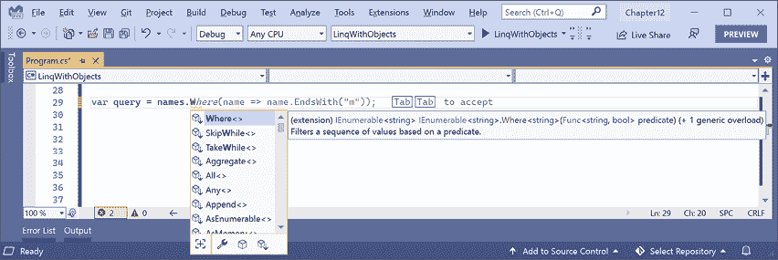

# 十一、使用 LINQ 查询和操作数据

本章是关于**语言集成查询**（**LINQ**表达式。LINQ 是一组语言扩展，它增加了处理项目序列的能力，然后过滤、排序并将它们投影到不同的输出中。

本章将涵盖以下主题：

*   编写 LINQ 表达式
*   使用 LINQ 处理集合
*   使用带 EF 核的 LINQ
*   用语法糖使 LINQ 语法变甜
*   使用具有并行 LINQ 的多线程
*   创建自己的 LINQ 扩展方法
*   使用 LINQ 转换为 XML

# 编写 LINQ 表达式

虽然我们在*第 10 章*中写了一些 LINQ 表达式，*使用实体框架核心*处理数据，但它们并不是的重点，因此我没有正确解释 LINQ 是如何工作的，所以现在让我们花点时间来正确理解它们。

## 林克是怎么了？

LINQ 有几个部分；有些是必需的，有些是可选的：

*   **扩展方法（必选）**：包括`Where`、`OrderBy`、`Select`等示例。这些就是提供 LINQ 功能的原因。
*   **LINQ 提供程序（必需）**：这些提供程序包括用于处理内存对象的 LINQ to 对象、用于处理存储在外部数据库中并使用 EF Core 建模的数据的 LINQ to 实体，以及用于处理存储为 XML 的数据的 LINQ to XML。这些提供程序以特定于不同类型数据的方式执行 LINQ 表达式。
*   **Lambda 表达式（可选）**：可以使用它们代替命名方法来简化 LINQ 查询，例如用于过滤的`Where`方法的条件逻辑。
*   **LINQ 查询理解语法（可选）**：包括 C# 关键字，如`from`、`in`、`where`、`orderby`、`descending`和`select`。这些是一些 LINQ 扩展方法的别名，它们的使用可以简化您编写的查询，特别是如果您已经有过使用其他查询语言的经验，例如**结构化查询语言**（**SQL**）。

当程序员第一次接触 LINQ 时，他们通常认为 LINQ 查询理解语法就是 LINQ，但讽刺的是，这是 LINQ 中可选的部分之一！

## 使用可枚举类构建 LINQ 表达式

诸如`Where`和`Select`之类的 LINQ 扩展方法由`Enumerable`静态类附加到任何类型，称为实现`IEnumerable<T>`的**序列**。

例如，any 类型的数组实现了`IEnumerable<T>`类，其中`T`是数组中项目的类型。这意味着所有数组都支持 LINQ 来查询和操作它们。

所有泛型集合，如`List<T>`、`Dictionary<TKey, TValue>`、`Stack<T>`和`Queue<T>`都实现了`IEnumerable<T>`，因此它们也可以通过 LINQ 进行查询和操作。

`Enumerable`定义了 50 多种扩展方式，如下表所示：

<colgroup><col> <col></colgroup> 
| 方法 | 描述 |
| `First`、`FirstOrDefault`、`Last`、`LastOrDefault` | 获取序列中的第一个或最后一个项目，或者引发异常，或者返回类型的默认值，例如，如果没有第一个或最后一个项目，则返回`int`的`0`和`null`的参考类型。 |
| `Where` | 返回与指定筛选器匹配的项目序列。 |
| `Single`、`SingleOrDefault` | 返回与特定筛选器匹配的项或引发异常，或者如果没有完全匹配的项，则返回该类型的默认值。 |
| `ElementAt`、`ElementAtOrDefault` | 在指定的索引位置返回项或引发异常，如果该位置没有项，则返回类型的默认值。NET 6 中新增的重载可以通过`Index`而不是`int`传递，这在处理`Span<T>`序列时效率更高。 |
| `Select`、`SelectMany` | 将项目投影到不同的形状（即不同的类型）中，并展平项目的嵌套层次结构。 |
| `OrderBy`、`OrderByDescending`、`ThenBy`、`ThenByDescending` | 按指定的字段或属性对项目进行排序。 |
| `Reverse` | 颠倒项目的顺序。 |
| `GroupBy`、`GroupJoin`、`Join` | 分组和/或连接两个序列。 |
| `Skip`、`SkipWhile` | 跳过一些项目；或在表达式为`true`时跳过。 |
| `Take`、`TakeWhile` | 采取一些项目；或者在表达式为`true`时使用。NET 6 中新增的是一个`Take`重载，可以传递一个`Range`，例如，`Take(range: 3..^5)`意味着从开始开始引入 3 项，从结束引入 5 项，或者可以使用`Take(4..)`代替`Skip(4)`。 |
| `Aggregate`、`Average`、`Count`、`LongCount`、`Max`、`Min`、`Sum` | 计算聚合值。 |
| `TryGetNonEnumeratedCount` | `Count()`检查序列上是否实现了`Count`属性并返回其值，或者它枚举整个序列以计数其项。NET 6 中的新方法是此方法，它只检查`Count`，如果缺少，则返回`false`，并将`out`参数设置为`0`，以避免潜在的不良操作。 |
| `All`、`Any`、`Contains` | 如果所有或任何项与筛选器匹配，或者如果序列包含指定项，则返回`true`。 |
| `Cast` | 将项强制转换为指定类型。在编译器可能会抱怨的情况下，将非泛型对象转换为泛型类型非常有用。 |
| `OfType` | 删除与指定类型不匹配的项。 |
| `Distinct` | 删除重复的项目。 |
| `Except`、`Intersect`、`Union` | 执行返回集合的操作。集合不能有重复的项。尽管输入可以是任何序列，因此输入可以有重复项，但结果始终是一个集合。 |
| `Chunk` | 将序列分为大小不同的批。 |
| `Append`、`Concat`、`Prepend` | 执行序列合并操作。 |
| `Zip` | 根据项目的位置对两个序列执行匹配操作，例如，第一个序列中位置 1 处的项目与第二个序列中位置 1 处的项目匹配。NET6 中的新功能是对三个序列进行匹配操作。以前，为了达到相同的目标，您必须运行两次序列重载。 |
| `ToArray`、`ToList`、`ToDictionary`、`ToHashSet`、`ToLookup` | 将序列转换为数组或集合。这些是执行 LINQ 表达式的唯一扩展方法。 |
| `DistinctBy`、`ExceptBy`、`IntersectBy`、`UnionBy`、`MinBy`、`MaxBy` | NET6 中新增的是`By`扩展方法。它们允许对项目的子集而不是整个项目执行比较。例如，与通过比较整个`Person`对象来删除重复项不同，您可以通过仅比较其`LastName`和`DateOfBirth`来删除重复项。 |

`Enumerable`类也有一些方法不是扩展方法，如下表所示：

<colgroup><col> <col></colgroup> 
| 方法 | 描述 |
| `Empty<T>` | 返回指定类型`T`的空序列。将空序列传递给需要`IEnumerable<T>`的方法非常有用。 |
| `Range` | 返回带有`count`项的`start`值的整数序列。例如，`Enumerable.Range(start: 5, count: 3)`将包含整数 5、6 和 7。 |
| `Repeat` | 返回一个序列，该序列包含相同的`element`重复`count`次。例如，`Enumerable.Repeat(element: "5", count: 3)`将包含`string`值“5”、“5”和“5”。 |

### 理解延期执行

LINQ 使用**延迟执行**。重要的是要理解调用这些扩展方法中的大多数不会执行查询并获得结果。大多数扩展方法返回一个 LINQ 表达式，它表示一个*问题*，而不是*答案*。让我们探讨一下：

1.  使用您首选的代码编辑器创建名为`Chapter11`的新解决方案/工作区。
2.  添加控制台应用项目，如以下列表中所定义：
    1.  项目模板：**控制台应用**/`console`
    2.  工作区/解决方案文件和文件夹：`Chapter11`
    3.  项目文件和文件夹：`LinqWithObjects`
3.  在`Program.cs`中删除已有代码，静态导入`Console`。
4.  添加语句为在办公室工作的人员定义一系列的`string`值，如下代码所示：

    ```cs
    // a string array is a sequence that implements IEnumerable<string>
    string[] names = new[] { "Michael", "Pam", "Jim", "Dwight", 
      "Angela", "Kevin", "Toby", "Creed" };
    WriteLine("Deferred execution");
    // Question: Which names end with an M?
    // (written using a LINQ extension method)
    var query1 = names.Where(name => name.EndsWith("m"));
    // Question: Which names end with an M?
    // (written using LINQ query comprehension syntax)
    var query2 = from name in names where name.EndsWith("m") select name; 
    ```

5.  要询问问题并获得答案，即执行查询，您必须**通过调用`ToArray`或`ToLookup`等“To”方法之一或通过枚举查询来实现**，如以下代码所示：

    ```cs
    // Answer returned as an array of strings containing Pam and Jim
    string[] result1 = query1.ToArray();
    // Answer returned as a list of strings containing Pam and Jim
    List<string> result2 = query2.ToList();
    // Answer returned as we enumerate over the results
    foreach (string name in query1)
    {
      WriteLine(name); // outputs Pam
      names[2] = "Jimmy"; // change Jim to Jimmy
      // on the second iteration Jimmy does not end with an M
    } 
    ```

6.  运行控制台应用并记录结果，如以下输出所示：

    ```cs
    Deferred execution
    Pam 
    ```

由于延迟执行，在输出第一个结果`Pam`后，如果原始数组值发生变化，那么在循环时，由于`Jim`已经变成`Jimmy`并且没有以`M`结尾，所以只输出`Pam`。

在深入研究之前，让我们放慢脚步，看看一些常见的 LINQ 扩展方法，以及如何使用它们，一次一个。

## 使用 Where 筛选实体

使用 LINQ 最常见的原因是使用`Where`扩展方法按顺序过滤项目。让我们通过定义名称序列来探索过滤，然后对其应用 LINQ 操作：

1.  在项目文件中，注释掉启用隐式使用的元素，如以下标记中突出显示的：

    ```cs
    <Project Sdk="Microsoft.NET.Sdk">
      <PropertyGroup>
        <OutputType>Exe</OutputType>
        <TargetFramework>net6.0</TargetFramework>
        <Nullable>enable</Nullable>
     **<!--<ImplicitUsings>enable</ImplicitUsings>-->**
      </PropertyGroup>
    </Project> 
    ```

2.  在`Program.cs`中，尝试调用名称数组上的`Where`扩展方法，如下代码所示：

    ```cs
    WriteLine("Writing queries"); 
    var query = names.W 
    ```

3.  As you try to type the `Where` method, note that it is missing from the IntelliSense list of members of a string array, as shown in *Figure 11.1*:

    <figure class="mediaobject"></figure>

    图 11.1：缺少 Where 扩展方法的 IntelliSense

    这是因为`Where`是一种扩展方法。它在数组类型上不存在。为了使`Where`扩展方法可用，我们必须导入`System.Linq`名称空间。默认情况下，这在新的.NET6 项目中隐式导入，但我们禁用了它。

4.  在项目文件中，取消对启用隐式使用的元素的注释。
5.  Retype the `Where` method and note that the IntelliSense list now includes the extension methods added by the `Enumerable` class, as shown in *Figure 11.2*:

    <figure class="mediaobject"></figure>

    图 11.2:IntelliSense 现在显示 LINQ 可枚举扩展方法

6.  当您为`Where`方法键入括号时，IntelliSense告诉我们，要调用`Where`，必须传入`Func<string, bool>`委托的实例。
7.  输入一个表达式来创建一个`Func<string, bool>`委托的新实例，现在请注意，我们还没有提供方法名称，因为我们将在下一步中定义它，如下面的代码所示：

    ```cs
    var query = names.Where(new Func<string, bool>( )) 
    ```

`Func<string, bool>`委托告诉我们，对于传递给该方法的每个`string`变量，该方法必须返回一个`bool`值。如果该方法返回`true`，则表示我们应该在结果中包含`string`，如果该方法返回`false`，则表示我们应该将其排除。

## 以命名方法为目标

让我们定义一个只包含长度超过四个字符的名称的方法：

1.  在`Program.cs`的底部，定义一个只包含超过四个字符的名称的方法，如下代码所示：

    ```cs
    static bool NameLongerThanFour(string name)
    {
      return name.Length > 4;
    } 
    ```

2.  在`NameLongerThanFour`方法上方，将方法名称传递到`Func<string, bool>`委托中，然后循环查询项，如下面代码中突出显示的：

    ```cs
    var query = names.Where(
      new Func<string, bool>(**NameLongerThanFour**));
    **foreach** **(****string** **item** **in** **query)**
    **{**
     **WriteLine(item);**
    **}** 
    ```

3.  运行代码并查看结果，注意只列出长度超过四个字母的名称，如以下输出所示：

    ```cs
    Writing queries
    Michael 
    Dwight 
    Angela 
    Kevin 
    Creed 
    ```

## 通过删除显式委托实例化简化代码

我们可以通过删除`Func<string, bool>`委托的显式实例化来简化代码，因为 C# 编译器可以为我们实例化委托：

1.  要通过查看逐步改进的代码来帮助您学习，请复制并粘贴查询
2.  注释掉第一个示例，如下代码所示：

    ```cs
    // var query = names.Where(
    //   new Func<string, bool>(NameLongerThanFour)); 
    ```

3.  修改副本以删除委托的显式实例化，如下代码所示：

    ```cs
    var query = names.Where(NameLongerThanFour); 
    ```

4.  运行代码并注意它具有相同的行为。

## 以 lambda 表达式为目标

使用**lambda 表达式**代替命名方法，我们可以进一步简化代码。

虽然 lambda 表达式一开始看起来很复杂，但它只是一个无名函数。它使用`=>`（读作“goes to”）符号表示返回值：

1.  Copy and paste the query, comment the second example, and modify the query, as shown in the following code:

    ```cs
    var query = names.Where(name => name.Length > 4); 
    ```

    请注意，lambda 表达式的语法包括`NameLongerThanFour`方法的所有重要部分，但仅此而已。lambda 表达式只需定义以下内容：

    *   输入参数名称：`name`
    *   返回值表达式：`name.Length > 4`

    `name`输入参数的类型是根据序列包含`string`值的事实推断出来的，返回类型必须是委托定义的`bool`值，才能使`Where`工作，因此`=>`符号后面的表达式必须返回`bool`值。

    编译器为我们完成了大部分工作，因此我们的代码可以尽可能简洁。

2.  运行代码并注意它具有相同的行为。

## 排序实体

其他常用的扩展方法有`OrderBy`和`ThenBy`，用于排序序列。

如果前面的方法返回另一个序列，即实现`IEnumerable<T>`接口的类型，则可以链接扩展方法。

### 使用 OrderBy 按单个属性排序

让我们继续与当前项目合作，探索排序：

1.  Append a call to `OrderBy` to the end of the existing query, as shown in the following code:

    ```cs
    var query = names
      .Where(name => name.Length > 4)
      .OrderBy(name => name.Length); 
    ```

    **良好实践**：格式化 LINQ 语句，使每个扩展方法调用在其自己的行上进行，以便于阅读。

2.  运行代码，注意名称现在是按最短优先排序的，如以下输出所示：

    ```cs
    Kevin 
    Creed 
    Dwight 
    Angela 
    Michael 
    ```

要将最长的名称放在第一位，可以使用`OrderByDescending`。

### 使用 ThenBy 按后续属性排序

我们可能希望按多个属性进行排序，例如，按字母顺序对相同长度的名称进行排序：

1.  在现有查询的末尾添加对`ThenBy`方法的调用，如下面代码中突出显示的：

    ```cs
    var query = names
      .Where(name => name.Length > 4)
      .OrderBy(name => name.Length)
     **.ThenBy(name => name);** 
    ```

2.  运行代码并注意以下排序顺序中的细微差异。在一组相同长度的名称中，名称按照`string`的完整值按字母顺序排序，因此`Creed`在`Kevin`之前，而`Angela`在`Dwight`之前，如下输出所示：

    ```cs
    Creed 
    Kevin 
    Angela 
    Dwight 
    Michael 
    ```

## 使用 var 或指定类型声明查询

在编写LINQ 表达式时，可以方便地使用`var`声明查询对象。这是因为在处理 LINQ 表达式时，类型会经常更改。例如，我们的查询以`IEnumerable<string>`开始，当前为`IOrderedEnumerable<string>`：

1.  将鼠标悬停在`var`关键字上，注意其类型为`IOrderedEnumerable<string>`
2.  将`var`替换为实际类型，如下代码所示：

    ```cs
    **IOrderedEnumerable<****string****>** query = names
      .Where(name => name.Length > 4)
      .OrderBy(name => name.Length)
      .ThenBy(name => name); 
    ```

**良好实践**：完成查询后，您可以将声明的类型从`var`更改为实际类型，以便更清楚地了解类型。这很容易，因为您的代码编辑器可以告诉您它是什么。

## 按类型筛选

`Where`扩展方法非常适合按文本和数字等值进行过滤。但是，如果序列包含多个类型，并且您希望按特定类型进行筛选并尊重任何继承层次结构，该怎么办？

假设您有一系列异常。有数百种异常类型构成了一个复杂的层次结构，部分如*图 11.3*所示：

<figure class="mediaobject"></figure>

图 11.3：部分异常继承层次结构

让我们探讨按类型筛选：

1.  在`Program.cs`中定义异常派生对象列表，如下代码所示：

    ```cs
    WriteLine("Filtering by type");
    List<Exception> exceptions = new()
    {
      new ArgumentException(), 
      new SystemException(),
      new IndexOutOfRangeException(),
      new InvalidOperationException(),
      new NullReferenceException(),
      new InvalidCastException(),
      new OverflowException(),
      new DivideByZeroException(),
      new ApplicationException()
    }; 
    ```

2.  使用`OfType<T>`扩展方法写入语句，删除非算术异常的异常，只将算术异常写入控制台，如下代码所示：

    ```cs
    IEnumerable<ArithmeticException> arithmeticExceptionsQuery = 
      exceptions.OfType<ArithmeticException>();
    foreach (ArithmeticException exception in arithmeticExceptionsQuery)
    {
      WriteLine(exception);
    } 
    ```

3.  运行代码并注意结果仅包括`ArithmeticException`类型或`ArithmeticException`派生类型的异常，如以下输出所示：

    ```cs
    System.OverflowException: Arithmetic operation resulted in an overflow.
    System.DivideByZeroException: Attempted to divide by zero. 
    ```

## 使用 LINQ 处理设备和行李

集合是数学中最基本的概念之一。**集合**是一个或多个独特对象的集合。**多集**又称**包**，是一个的集合，其中包含一个或多个可以复制的对象。

你可能还记得学校里教过维恩图解。常用的集合操作包括集合之间的**相交**或**并集**。

让我们创建一个控制台应用，它将为学徒队列定义三个`string`值数组，然后对它们执行一些常见的集合和多集合操作：

1.  使用您首选的代码编辑器将名为`LinqWithSets`的新控制台应用添加到`Chapter11`解决方案/工作区：
    1.  在 Visual Studio 中，将解决方案的启动项目设置为当前选择。
    2.  在 Visual Studio 代码中，选择`LinqWithSets`作为活动的 OmniSharp 项目。
2.  在`Program.cs`中删除已有代码，静态导入`Console`类型，如下代码所示：

    ```cs
    using static System.Console; 
    ```

3.  在`Program.cs`的底部，添加以下方法，将任何`string`变量序列作为逗号分隔的单个`string`输出到控制台输出，并提供可选说明，如下代码所示：

    ```cs
    static void Output(IEnumerable<string> cohort, string description = "")
    {
      if (!string.IsNullOrEmpty(description))
      {
        WriteLine(description);
      }
      Write(" ");
      WriteLine(string.Join(", ", cohort.ToArray()));
      WriteLine();
    } 
    ```

4.  在`Output`方法上方，添加语句定义三个名称数组，输出，然后对其进行各种设置操作，如下代码所示：

    ```cs
    string[] cohort1 = new[]
      { "Rachel", "Gareth", "Jonathan", "George" }; 
    string[] cohort2 = new[]
      { "Jack", "Stephen", "Daniel", "Jack", "Jared" }; 
    string[] cohort3 = new[]
      { "Declan", "Jack", "Jack", "Jasmine", "Conor" }; 
    Output(cohort1, "Cohort 1");
    Output(cohort2, "Cohort 2");
    Output(cohort3, "Cohort 3"); 
    Output(cohort2.Distinct(), "cohort2.Distinct()"); 
    Output(cohort2.DistinctBy(name => name.Substring(0, 2)), 
      "cohort2.DistinctBy(name => name.Substring(0, 2)):");
    Output(cohort2.Union(cohort3), "cohort2.Union(cohort3)"); 
    Output(cohort2.Concat(cohort3), "cohort2.Concat(cohort3)"); 
    Output(cohort2.Intersect(cohort3), "cohort2.Intersect(cohort3)"); 
    Output(cohort2.Except(cohort3), "cohort2.Except(cohort3)"); 
    Output(cohort1.Zip(cohort2,(c1, c2) => $"{c1} matched with {c2}"), 
      "cohort1.Zip(cohort2)"); 
    ```

5.  运行代码并查看结果，如以下输出所示：

    ```cs
    Cohort 1
      Rachel, Gareth, Jonathan, George 
    Cohort 2
      Jack, Stephen, Daniel, Jack, Jared 
    Cohort 3
      Declan, Jack, Jack, Jasmine, Conor 
    cohort2.Distinct()
      Jack, Stephen, Daniel, Jared 
    cohort2.DistinctBy(name => name.Substring(0, 2)):
      Jack, Stephen, Daniel 
    cohort2.Union(cohort3)
      Jack, Stephen, Daniel, Jared, Declan, Jasmine, Conor 
    cohort2.Concat(cohort3)
      Jack, Stephen, Daniel, Jack, Jared, Declan, Jack, Jack, Jasmine, Conor 
    cohort2.Intersect(cohort3)
      Jack 
    cohort2.Except(cohort3)
      Stephen, Daniel, Jared 
    cohort1.Zip(cohort2)
      Rachel matched with Jack, Gareth matched with Stephen, Jonathan matched with Daniel, George matched with Jack 
    ```

使用`Zip`时，如果两个序列中的项目数量不等，则某些项目将没有匹配的伙伴。没有伴侣的人，如`Jared`，将不包括在结果中。

对于`DistinctBy`示例，我们没有通过比较全名来删除重复项，而是定义了一个 lambda 键选择器来通过比较前两个字符来删除重复项，因此`Jared`被删除，因为`Jack`已经是以`Ja`开头的名称。

到目前为止，我们已经使用 LINQ 对象提供程序来处理内存中的对象。接下来，我们将使用 LINQtoEntities 提供程序处理存储在数据库中的实体。

# 使用带 EF 核的 LINQ

我们已经研究过过滤和排序的 LINQ 查询，但没有一个查询会改变序列中项目的形状。这被称为**投影**，因为是关于将一个形状的项目投影到另一个形状。为了了解投影，最好使用更多的复杂类型，因此在下一个项目中，我们将使用 Northwind 样本数据库中的实体序列，而不是使用`string`序列。

我将给出使用 SQLite 的说明，因为它是跨平台的，但如果您更喜欢使用 SQLServer，请随意使用。如果您愿意，我已经包含了一些注释代码来启用 SQL Server。

## 构建 EF 核心模型

我们必须定义一个 EF 核心模型来表示我们将使用的数据库和表。我们将手动定义模型，以进行完全控制，并防止在`Categories`和`Products`表之间自动定义关系。稍后，您将使用 LINQ 连接两个实体集：

1.  使用您首选的代码编辑器将名为`LinqWithEFCore`的新控制台应用添加到`Chapter11`解决方案/工作区。
2.  在 Visual Studio 代码中，选择`LinqWithEFCore`作为活动的 OmniSharp 项目。
3.  在`LinqWithEFCore`项目中，添加对 SQLite 和/或 SQL Server 的 EF 核心提供程序的包引用，如以下标记所示：

    ```cs
    <ItemGroup>
      <PackageReference
        Include="Microsoft.EntityFrameworkCore.Sqlite"
        Version="6.0.0" />
      <PackageReference
        Include="Microsoft.EntityFrameworkCore.SqlServer"
        Version="6.0.0" />
    </ItemGroup> 
    ```

4.  构建项目以恢复包。
5.  将`Northwind4Sqlite.sql`文件复制到`LinqWithEFCore`文件夹中。
6.  在命令提示符或终端上，通过执行以下命令创建 Northwind 数据库：

    ```cs
    sqlite3 Northwind.db -init Northwind4Sqlite.sql 
    ```

7.  请耐心等待，因为此命令可能需要一段时间来创建数据库结构。最终您将看到 SQLite 命令提示符，如以下输出所示：

    ```cs
     -- Loading resources from Northwind.sql 
    SQLite version 3.36.0 2021-08-02 15:20:15
    Enter ".help" for usage hints.
    sqlite> 
    ```

8.  在 macOS 上按 cmd+D 或在 Windows 上按 Ctrl+C 退出 SQLite 命令模式。
9.  将三个类文件添加到项目中，分别命名为`Northwind.cs`、`Category.cs`和`Product.cs`。
10.  修改名为`Northwind.cs`的类文件，如下代码所示：

    ```cs
    using Microsoft.EntityFrameworkCore; // DbContext, DbSet<T>
    namespace Packt.Shared;
    // this manages the connection to the database
    public class Northwind : DbContext
    {
      // these properties map to tables in the database
      public DbSet<Category>? Categories { get; set; }
      public DbSet<Product>? Products { get; set; }
      protected override void OnConfiguring(
        DbContextOptionsBuilder optionsBuilder)
      {
        string path = Path.Combine(
          Environment.CurrentDirectory, "Northwind.db");
        optionsBuilder.UseSqlite($"Filename={path}");
        /*
        string connection = "Data Source=.;" +
            "Initial Catalog=Northwind;" +
            "Integrated Security=true;" +
            "MultipleActiveResultSets=true;";
        optionsBuilder.UseSqlServer(connection);
        */
      }
      protected override void OnModelCreating(
        ModelBuilder modelBuilder)
      {
        modelBuilder.Entity<Product>()
          .Property(product => product.UnitPrice)
          .HasConversion<double>();
      }
    } 
    ```

11.  修改名为`Category.cs`的类文件，如下代码所示：

    ```cs
    using System.ComponentModel.DataAnnotations;
    namespace Packt.Shared;
    public class Category
    {
      public int CategoryId { get; set; }
      [Required]
      [StringLength(15)]
      public string CategoryName { get; set; } = null!;
      public string? Description { get; set; }
    } 
    ```

12.  修改名为`Product.cs`的类文件，如下代码所示：

    ```cs
    using System.ComponentModel.DataAnnotations; 
    using System.ComponentModel.DataAnnotations.Schema;
    namespace Packt.Shared;
    public class Product
    {
      public int ProductId { get; set; }
      [Required]
      [StringLength(40)]
      public string ProductName { get; set; } = null!;
      public int? SupplierId { get; set; }
      public int? CategoryId { get; set; }
      [StringLength(20)]
      public string? QuantityPerUnit { get; set; }
      [Column(TypeName = "money")] // required for SQL Server provider
      public decimal? UnitPrice { get; set; }
      public short? UnitsInStock { get; set; }
      public short? UnitsOnOrder { get; set; }
      public short? ReorderLevel { get; set; }
      public bool Discontinued { get; set; }
    } 
    ```

13.  Build the project and fix any compiler errors.

    如果您使用的是 Visual Studio 2022 for Windows，则编译后的应用将在`LinqWithEFCore\bin\Debug\net6.0`文件夹中执行，因此它将找不到数据库文件，除非我们指示它应始终复制到输出目录。

14.  在**解决方案资源管理器**中，右键点击`Northwind.db`文件，选择**属性**。
15.  在**属性**中，将**复制到输出目录**设置为**始终复制**。

## 过滤和排序序列

现在让我们编写语句来过滤和排序表中的行序列：

1.  在`Program.cs`中，使用 LINQ 静态导入用于 EF Core 和实体模型的`Console`类型和名称空间，如下代码所示：

    ```cs
    using Packt.Shared; // Northwind, Category, Product
    using Microsoft.EntityFrameworkCore; // DbSet<T>
    using static System.Console; 
    ```

2.  At the bottom of `Program.cs`, write a method to filter and sort products, as shown in the following code:

    ```cs
    static void FilterAndSort()
    {
      using (Northwind db = new())
      {
        DbSet<Product> allProducts = db.Products;
        IQueryable<Product> filteredProducts = 
          allProducts.Where(product => product.UnitPrice < 10M);
        IOrderedQueryable<Product> sortedAndFilteredProducts = 
          filteredProducts.OrderByDescending(product => product.UnitPrice);
        WriteLine("Products that cost less than $10:");
        foreach (Product p in sortedAndFilteredProducts)
        {
          WriteLine("{0}: {1} costs {2:$#,## 0.00}",
            p.ProductId, p.ProductName, p.UnitPrice);
        }
        WriteLine();
      }
    } 
    ```

    `DbSet<T>`实现了`IEnumerable<T>`，因此 LINQ 可以用来查询和操作为 EF 核心构建的模型中实体的集合。（实际上，我应该说是`TEntity`而不是`T`，但是这个泛型类型的名称没有功能效果。唯一的要求是该类型是一个`class`，该名称只是表示该类应该是一个实体模型。）

    您可能还注意到，序列实现了`IQueryable<T>`（或调用排序 LINQ 方法后的`IOrderedQueryable<T>`，而不是`IEnumerable<T>`或`IOrderedEnumerable<T>`。

    这表明我们正在使用 LINQ 提供程序，该提供程序使用表达式树在内存中构建查询。它们以树状数据结构表示代码，并支持创建动态查询，这对于为外部数据提供程序（如 SQLite）构建 LINQ 查询非常有用。

    LINQ 表达式将转换为另一种查询语言，如 SQL。使用`foreach`枚举查询或调用`ToArray`等方法将强制执行查询并具体化结果。

3.  在`Program.cs`中导入名称空间后，调用`FilterAndSort`方法。
4.  运行代码并查看结果，如以下输出所示：

    ```cs
    Products that cost less than $10:
    41: Jack's New England Clam Chowder costs $9.65 
    45: Rogede sild costs $9.50
    47: Zaanse koeken costs $9.50
    19: Teatime Chocolate Biscuits costs $9.20 
    23: Tunnbröd costs $9.00
    75: Rhönbräu Klosterbier costs $7.75 
    54: Tourtière costs $7.45
    52: Filo Mix costs $7.00 
    13: Konbu costs $6.00
    24: Guaraná Fantástica costs $4.50 
    33: Geitost costs $2.50 
    ```

虽然这个查询输出我们想要的信息，但它这样做效率很低，因为它从`Products`表中获取所有列，而不是我们需要的三列，这相当于下面的 SQL 语句：

```cs
SELECT * FROM Products; 
```

在*第 10 章*中*使用实体框架核心*处理数据，您学习了如何记录针对 SQLite 执行的 SQL 命令，以便您自己能够看到这一点。

## 将序列投影为新类型

在研究投影之前，我们需要回顾对象初始化语法。如果定义了一个类，那么可以使用类名`new()`和大括号实例化一个对象来设置字段和属性的初始值，如下代码所示：

```cs
public class Person
{
  public string Name { get; set; }
  public DateTime DateOfBirth { get; set; }
}
Person knownTypeObject = new()
{
  Name = "Boris Johnson",
  DateOfBirth = new(year: 1964, month: 6, day: 19)
}; 
```

C# 3.0 及更高版本允许使用`var`关键字实例化**匿名类型**的实例，如下代码所示：

```cs
var anonymouslyTypedObject = new
{
  Name = "Boris Johnson",
  DateOfBirth = new DateTime(year: 1964, month: 6, day: 19)
}; 
```

虽然我们没有指定类型，但编译器可以从名为`Name`和`DateOfBirth`的两个属性的设置中推断匿名类型。编译器可以从指定的值推断两个属性的类型：一个文本`string`和一个日期/时间值的新实例。

当编写 LINQ 查询以将现有类型投影到新类型而无需显式定义新类型时，此功能特别有用。由于类型是匿名的，因此只能使用`var`声明的局部变量。

让我们通过添加对`Select`方法的调用，将`Product`类的实例投影到只有三个属性的新匿名类型的实例中，从而使针对数据库表执行的 SQL 命令更加高效：

1.  在`FilterAndSort`中，添加一条语句扩展 LINQ 查询，使用`Select`方法只返回我们需要的三个属性（即表列），并修改`foreach`语句使用`var`关键字和投影 LINQ 表达式，如下代码中突出显示：

    ```cs
    IOrderedQueryable<Product> sortedAndFilteredProducts = 
      filteredProducts.OrderByDescending(product => product.UnitPrice);
    **var** **projectedProducts = sortedAndFilteredProducts**
     **.Select(product =>** **new****// anonymous type**
     **{**
     **product.ProductId,**
     **product.ProductName,** 
     **product.UnitPrice**
     **});**
    WriteLine("Products that cost less than $10:");
    foreach (**var** **p** **in** **projectedProducts**)
    { 
    ```

2.  Hover your mouse over the `new` keyword in the `Select` method call and the `var` keyword in the `foreach` statement and note that it is an anonymous type, as shown in *Figure 11.4*:

    <figure class="mediaobject"></figure>

    图 11.4:LINQ 投影期间使用的匿名类型

3.  运行代码，确认输出与之前相同。

## 连接和分组序列

有两种扩展方式用于连接和分组：

*   **连接**：此方法有四个参数：要连接的序列、*左侧*序列上要匹配的一个或多个属性、*右侧*序列上要匹配的一个或多个属性，以及一个投影。
*   **GroupJoin**：此方法参数相同，但它将匹配项组合成一个组对象，匹配值为`Key`属性，多个匹配项为`IEnumerable<T>`类型。

### 连接序列

在使用两个表时，让我们探讨一下这些方法：`Categories`和`Products`：

1.  At the bottom of `Program.cs`, create a method to select categories and products, join them, and output them, as shown in the following code:

    ```cs
    static void JoinCategoriesAndProducts()
    {
      using (Northwind db = new())
      {
        // join every product to its category to return 77 matches
        var queryJoin = db.Categories.Join(
          inner: db.Products,
          outerKeySelector: category => category.CategoryId,
          innerKeySelector: product => product.CategoryId,
          resultSelector: (c, p) =>
            new { c.CategoryName, p.ProductName, p.ProductId });
        foreach (var item in queryJoin)
        {
          WriteLine("{0}: {1} is in {2}.",
            arg0: item.ProductId,
            arg1: item.ProductName,
            arg2: item.CategoryName);
        }
      }
    } 
    ```

    在连接中，有两个序列，*外部*和*内部*。在前面的示例中，`categories`是外部序列，`products`是内部序列。

2.  在`Program.cs`顶部，注释掉对`FilterAndSort`和`JoinCategoriesAndProducts`的调用。
3.  运行代码并查看结果。请注意，77 种产品中的每种产品都有一行输出，如以下输出所示（编辑为仅包括前 10 项）：

    ```cs
    1: Chai is in Beverages. 
    2: Chang is in Beverages.
    3: Aniseed Syrup is in Condiments.
    4: Chef Anton's Cajun Seasoning is in Condiments. 
    5: Chef Anton's Gumbo Mix is in Condiments.
    6: Grandma's Boysenberry Spread is in Condiments. 
    7: Uncle Bob's Organic Dried Pears is in Produce. 
    8: Northwoods Cranberry Sauce is in Condiments.
    9: Mishi Kobe Niku is in Meat/Poultry. 
    10: Ikura is in Seafood.
    ... 
    ```

4.  在已有查询结束时，调用`OrderBy`方法按`CategoryName`排序，如下代码所示：

    ```cs
    .OrderBy(cp => cp.CategoryName); 
    ```

5.  运行代码并查看结果。请注意，77 个产品中的每一个都有一行输出，结果首先显示`Beverages`类别中的所有产品，然后是`Condiments`类别，以此类推，如以下部分输出所示：

    ```cs
    1: Chai is in Beverages. 
    2: Chang is in Beverages.
    24: Guaraná Fantástica is in Beverages. 
    34: Sasquatch Ale is in Beverages.
    35: Steeleye Stout is in Beverages. 
    38: Côte de Blaye is in Beverages. 
    39: Chartreuse verte is in Beverages. 
    43: Ipoh Coffee is in Beverages.
    67: Laughing Lumberjack Lager is in Beverages. 
    70: Outback Lager is in Beverages.
    75: Rhönbräu Klosterbier is in Beverages. 
    76: Lakkalikööri is in Beverages.
    3: Aniseed Syrup is in Condiments.
    4: Chef Anton's Cajun Seasoning is in Condiments.
    ... 
    ```

### 群连接序列

1.  At the bottom of `Program.cs`, create a method to group and join, show the group name, and then show all the items within each group, as shown in the following code:

    ```cs
    static void GroupJoinCategoriesAndProducts()
    {
      using (Northwind db = new())
      {
        // group all products by their category to return 8 matches
        var queryGroup = db.Categories.AsEnumerable().GroupJoin(
          inner: db.Products,
          outerKeySelector: category => category.CategoryId,
          innerKeySelector: product => product.CategoryId,
          resultSelector: (c, matchingProducts) => new
          {
            c.CategoryName,
            Products = matchingProducts.OrderBy(p => p.ProductName)
          });
        foreach (var category in queryGroup)
        {
          WriteLine("{0} has {1} products.",
            arg0: category.CategoryName,
            arg1: category.Products.Count());
          foreach (var product in category.Products)
          {
            WriteLine($" {product.ProductName}");
          }
        }
      }
    } 
    ```

    如果我们没有调用`AsEnumerable`方法，则会引发运行时异常，如以下输出所示：

    ```cs
    Unhandled exception. System.ArgumentException:  Argument type 'System.Linq.IOrderedQueryable`1[Packt.Shared.Product]' does not match the corresponding member type 'System.Linq.IOrderedEnumerable`1[Packt.Shared.Product]' (Parameter 'arguments[1]') 
    ```

    这是因为并非所有 LINQ 扩展方法都可以从表达式树转换为其他一些查询语法，如 SQL。在这些情况下，我们可以通过调用`AsEnumerable`方法从`IQueryable<T>`转换为`IEnumerable<T>`，强制查询处理使用 LINQ to EF Core 只将数据带入应用，然后使用 LINQ to Objects 在内存中执行更复杂的处理。但是，这通常效率较低。

2.  在`Program.cs`顶部，注释掉前面的方法调用并调用`GroupJoinCategoriesAndProducts`。
3.  运行代码，查看结果，并注意每个类别内的产品已按名称排序，如查询中定义的以及以下部分输出所示：

    ```cs
    Beverages has 12 products.
      Chai
      Chang
      Chartreuse verte
      Côte de Blaye
      Guaraná Fantástica
      Ipoh Coffee
      Lakkalikööri
      Laughing Lumberjack Lager
      Outback Lager
      Rhönbräu Klosterbier
      Sasquatch Ale
      Steeleye Stout
    Condiments has 12 products.
      Aniseed Syrup
      Chef Anton's Cajun Seasoning
      Chef Anton's Gumbo Mix
    ... 
    ```

## 聚合序列

有 LINQ 扩展方法来执行聚合功能，例如`Average`和`Sum`。让我们编写一些代码，以查看这些方法中的一些方法如何从`Products`表中聚合信息：

1.  在`Program.cs`的底部，创建一个方法来显示聚合扩展方法的使用，如下代码所示：

    ```cs
    static void AggregateProducts()
    {
      using (Northwind db = new())
      {
        WriteLine("{0,-25} {1,10}",
          arg0: "Product count:",
          arg1: db.Products.Count());
        WriteLine("{0,-25} {1,10:$#,## 0.00}",
          arg0: "Highest product price:",
          arg1: db.Products.Max(p => p.UnitPrice));
        WriteLine("{0,-25} {1,10:N0}",
          arg0: "Sum of units in stock:",
          arg1: db.Products.Sum(p => p.UnitsInStock));
        WriteLine("{0,-25} {1,10:N0}",
          arg0: "Sum of units on order:",
          arg1: db.Products.Sum(p => p.UnitsOnOrder));
        WriteLine("{0,-25} {1,10:$#,## 0.00}",
          arg0: "Average unit price:",
          arg1: db.Products.Average(p => p.UnitPrice));
        WriteLine("{0,-25} {1,10:$#,## 0.00}",
          arg0: "Value of units in stock:",
          arg1: db.Products
            .Sum(p => p.UnitPrice * p.UnitsInStock));
      }
    } 
    ```

2.  在`Program.cs`顶部，注释掉前面的方法并调用`AggregateProducts`
3.  运行代码并查看结果，如以下输出所示：

    ```cs
    Product count:                    77
    Highest product price:       $263.50
    Sum of units in stock:         3,119
    Sum of units on order:           780
    Average unit price:           $28.87
    Value of units in stock:  $74,050.85 
    ```

# 用语法糖使 LINQ 语法变甜

C# 3.0 在 2008 年引入了一些新的语言关键字，使有 SQL 经验的程序员更容易编写 LINQ 查询。这种语法糖是有时被称为**LINQ 查询理解语法**。

考虑以下数组的值：

```cs
string[] names = new[] { "Michael", "Pam", "Jim", "Dwight", 
  "Angela", "Kevin", "Toby", "Creed" }; 
```

要对名称进行筛选和排序，可以使用扩展方法和 lambda 表达式，如下代码所示：

```cs
var query = names
  .Where(name => name.Length > 4)
  .OrderBy(name => name.Length)
  .ThenBy(name => name); 
```

或者，您也可以通过使用查询理解语法获得相同的结果，如以下代码所示：

```cs
var query = from name in names
  where name.Length > 4
  orderby name.Length, name 
  select name; 
```

编译器将查询理解语法更改为等效的扩展方法和 lambda 表达式。

LINQ 查询理解语法始终需要`select`关键字。在使用扩展方法和 lambda 表达式时，`Select`扩展方法是可选的，因为如果不调用`Select`，那么整个项都会被隐式选中。

并非所有的扩展方法都有 C# 关键字等价物，例如，`Skip`和`Take`扩展方法，它们通常用于实现对大量数据的分页。

无法仅使用查询理解语法编写跳过和接受的查询，因此我们可以使用所有扩展方法编写查询，如以下代码所示：

```cs
var query = names
  .Where(name => name.Length > 4)
  .Skip(80)
  .Take(10); 
```

或者您可以将查询理解语法包装在括号中，然后切换到使用扩展方法，如下代码所示：

```cs
var query = (from name in names
  where name.Length > 4
  select name)
  .Skip(80)
  .Take(10); 
```

**良好实践**：学习 lambda 表达式的扩展方法和编写 LINQ 查询的查询理解语法方法，因为您可能需要维护同时使用这两种方法的代码。

# 使用具有并行 LINQ 的多线程

默认情况下，只有一个线程用于执行 LINQ查询。**并行 LINQ**（**PLINQ**）是一种让多个线程执行 LINQ 查询的简单方法。

**良好实践**：不要认为使用并行线程会提高应用的性能。始终测量真实世界的计时和资源使用情况。

## 创建受益于多线程的应用

为了让它发挥作用，我们将从一些代码开始，这些代码只使用一个线程来计算 45 个整数的斐波那契数。我们将使用`StopWatch`类型来测量性能的变化。

我们将使用操作系统工具来监控 CPU 和 CPU 核心的使用情况。如果您没有多个 CPU 或至少多个内核，那么本练习将不会显示太多！

1.  使用您首选的代码编辑器将名为`LinqInParallel`的新控制台应用添加到`Chapter11`解决方案/工作区。
2.  在 Visual Studio 代码中，选择`LinqInParallel`作为活动的 OmniSharp 项目。
3.  在`Program.cs`中，删除已有语句，然后导入`System.Diagnostics`名称空间，这样我们就可以使用`StopWatch`类型，静态导入`System.Console`类型。
4.  添加语句以创建秒表来记录计时，在启动计时器之前等待按键，创建 45 个整数，计算每个整数的最后一个斐波那契数，停止计时器，并显示经过的毫秒数，如以下代码所示：

    ```cs
    Stopwatch watch = new(); 
    Write("Press ENTER to start. "); 
    ReadLine();
    watch.Start();
    int max = 45;
    IEnumerable<int> numbers = Enumerable.Range(start: 1, count: max);
    WriteLine($"Calculating Fibonacci sequence up to {max}. Please wait...");
    int[] fibonacciNumbers = numbers
      .Select(number => Fibonacci(number)).ToArray(); 
    watch.Stop();
    WriteLine("{0:#,## 0} elapsed milliseconds.",
      arg0: watch.ElapsedMilliseconds);
    Write("Results:");
    foreach (int number in fibonacciNumbers)
    {
      Write($" {number}");
    }
    static int Fibonacci(int term) =>
      term switch
      {
        1 => 0,
        2 => 1,
        _ => Fibonacci(term - 1) + Fibonacci(term - 2)
      }; 
    ```

5.  运行代码，但不要按 Enter 键启动秒表，因为我们需要确保监控工具显示处理器活动。

### 使用 Windows

1.  如果您正在使用 Windows，则右键单击 Windows**开始**按钮或按 Ctrl+Alt+Delete，然后单击**任务管理器**。
2.  在**任务管理器**窗口底部，点击**更多详细信息**。
3.  在**任务管理器**窗口顶部，单击**性能**选项卡。
4.  右键点击**CPU 利用率**图形，选择**将图形更改为**，然后选择**逻辑处理器**。

### 使用 macOS

1.  如果您正在使用 macOS，则启动**活动监视器**。
2.  导航至**查看****更新频率非常频繁（1 秒）**。
3.  要查看 CPU 图表，请导航至**窗口****CPU 历史记录**。

### 适用于所有操作系统

1.  重新排列监视工具和代码编辑器，使它们并排排列。
2.  Wait for the CPUs to settle and then press Enter to start the stopwatch and run the query. The result should be a number of elapsed milliseconds, as shown in the following output:

    ```cs
    Press ENTER to start. 
    Calculating Fibonacci sequence up to 45\. Please wait...
    17,624 elapsed milliseconds.
    Results: 0 1 1 2 3 5 8 13 21 34 55 89 144 233 377 610 987 1597 2584 4181 6765 10946 17711 28657 46368 75025 121393 196418 317811 514229 832040 1346269 2178309 3524578 5702887 9227465 14930352 24157817 39088169 63245986 102334155 165580141 267914296 433494437 701408733 
    ```

    监控工具可能会显示，一个或两个 CPU 使用最多，随时间交替使用。其他人可能同时执行后台任务，如垃圾收集器，因此其他 CPU 或内核不会完全平坦，但工作肯定不会均匀地分布在所有可能的 CPU 或内核中。另外，请注意，一些逻辑处理器的最大值为 100%。

3.  In `Program.cs`, modify the query to make a call to the `AsParallel` extension method and to sort the resulting sequence because when processing in parallel the results can become misordered, as shown highlighted in the following code:

    ```cs
    int[] fibonacciNumbers = numbers.**AsParallel()**
      .Select(number => Fibonacci(number))
     **.OrderBy(number => number)**
      .ToArray(); 
    ```

    **良好实践**：永远不要在查询结束时呼叫`AsParallel`。这没用。您必须在调用`AsParallel`后至少执行一个操作，该操作才能并行化。NET6 引入了一个代码分析器，可以警告这种类型的误用。

4.  运行代码，等待监视工具中的 CPU 图表结算，然后按 Enter 键启动秒表并运行查询。这一次，应用应该在更短的时间内完成（尽管它可能不像您希望的那样短，因为管理这些多线程需要额外的努力！）：

    ```cs
    Press ENTER to start. 
    Calculating Fibonacci sequence up to 45\. Please wait...
    9,028 elapsed milliseconds.
    Results: 0 1 1 2 3 5 8 13 21 34 55 89 144 233 377 610 987 1597 2584 4181 6765 10946 17711 28657 46368 75025 121393 196418 317811 514229 832040 1346269 2178309 3524578 5702887 9227465 14930352 24157817 39088169 63245986 102334155 165580141 267914296 433494437 701408733 
    ```

5.  监控工具应该显示所有 CPU 都被平等地用于执行 LINQ 查询，并且注意，没有一个逻辑处理器的最大输出为 100%，因为工作分布更均匀。

您将在*第 12 章**中了解更多关于管理多线程的内容，使用多任务*提高性能和可伸缩性。

# 创建自己的 LINQ 扩展方法

在*第 6 章**实现接口和继承类*中，您学习了如何创建自己的扩展方法。要创建 LINQ 扩展方法，只需扩展`IEnumerable<T>`类型。

**良好实践**：将您自己的扩展方法放在一个单独的类库中，以便可以轻松地将它们部署为自己的程序集或 NuGet 包。

我们将以改进`Average`扩展方法为例。一个受过良好教育的学童会告诉你，*平均值*可能意味着三件事之一：

*   **平均值**：求和并除以计数。
*   **模式**：最常见的号码。
*   Po.T0.中位 T1：顺序排列时的中间数。

微软实施的`Average`扩展方法计算*平均值*。我们可能想为`Mode`和`Median`定义我们自己的扩展方法：

1.  在`LinqWithEFCore`项目中，添加一个名为`MyLinqExtensions.cs`的新类文件。
2.  修改类，如下代码所示：

    ```cs
    namespace System.Linq; // extend Microsoft's namespace
    public static class MyLinqExtensions
    {
      // this is a chainable LINQ extension method
      public static IEnumerable<T> ProcessSequence<T>(
        this IEnumerable<T> sequence)
      {
        // you could do some processing here
        return sequence;
      }
      public static IQueryable<T> ProcessSequence<T>(
        this IQueryable<T> sequence)
      {
        // you could do some processing here
        return sequence;
      }
      // these are scalar LINQ extension methods
      public static int? Median(
        this IEnumerable<int?> sequence)
      {
        var ordered = sequence.OrderBy(item => item);
        int middlePosition = ordered.Count() / 2;
        return ordered.ElementAt(middlePosition);
      }
      public static int? Median<T>(
        this IEnumerable<T> sequence, Func<T, int?> selector)
      {
        return sequence.Select(selector).Median();
      }
      public static decimal? Median(
        this IEnumerable<decimal?> sequence)
      {
        var ordered = sequence.OrderBy(item => item);
        int middlePosition = ordered.Count() / 2;
        return ordered.ElementAt(middlePosition);
      }
      public static decimal? Median<T>(
        this IEnumerable<T> sequence, Func<T, decimal?> selector)
      {
        return sequence.Select(selector).Median();
      }
      public static int? Mode(
        this IEnumerable<int?> sequence)
      {
        var grouped = sequence.GroupBy(item => item);
        var orderedGroups = grouped.OrderByDescending(
          group => group.Count());
        return orderedGroups.FirstOrDefault()?.Key;
      }
      public static int? Mode<T>(
        this IEnumerable<T> sequence, Func<T, int?> selector)
      {
        return sequence.Select(selector)?.Mode();
      }
      public static decimal? Mode(
        this IEnumerable<decimal?> sequence)
      {
        var grouped = sequence.GroupBy(item => item);
        var orderedGroups = grouped.OrderByDescending(
          group => group.Count());
        return orderedGroups.FirstOrDefault()?.Key;
      }
      public static decimal? Mode<T>(
        this IEnumerable<T> sequence, Func<T, decimal?> selector)
      {
        return sequence.Select(selector).Mode();
      }
    } 
    ```

如果该类位于单独的类库中，要使用 LINQ 扩展方法，只需引用类库程序集，因为`System.Linq`命名空间已隐式导入。

**警告！**上述扩展方法中除一种外，其他所有扩展方法都不能用于 LINQ to SQLite 或 LINQ to SQL Server 所使用的`IQueryable`序列，因为我们尚未实现将代码转换为 SQL 等底层查询语言的方法。

### 尝试可链接扩展方法

首先，我们将尝试将`ProcessSequence`方法与其他扩展方法链接：

1.  在`Program.cs`中，在`FilterAndSort`方法中，修改`Products`的 LINQ 查询，调用您的自定义可链接扩展方法，如下代码所示：

    ```cs
    DbSet<Product>? allProducts = db.Products;
    if (allProducts is null)
    {
      WriteLine("No products found.");
      return;
    }
    **IQueryable<Product> processedProducts = allProducts.ProcessSequence();**
    IQueryable<Product> filteredProducts = **processedProducts**
      .Where(product => product.UnitPrice < 10M); 
    ```

2.  在`Program.cs`中，取消对`FilterAndSort`方法的注释，并注释掉对其他方法的任何调用。
3.  运行代码并注意，您看到的输出与之前相同，因为您的方法没有修改序列。但现在您知道如何使用自己的功能扩展 LINQ 表达式。

### 尝试模式和中值方法

其次，我们将尝试使用`Mode`和`Median`方法来计算其他类型的平均值：

1.  在`Program.cs`的底部，使用您的自定义扩展方法和内置的`Average`扩展方法，创建一个方法来输出产品的`UnitsInStock`和`UnitPrice`的平均值、中值和模式，如下代码所示：

    ```cs
    static void CustomExtensionMethods()
    {
      using (Northwind db = new())
      {
        WriteLine("Mean units in stock: {0:N0}",
          db.Products.Average(p => p.UnitsInStock));
        WriteLine("Mean unit price: {0:$#,## 0.00}",
          db.Products.Average(p => p.UnitPrice));
        WriteLine("Median units in stock: {0:N0}",
          db.Products.Median(p => p.UnitsInStock));
        WriteLine("Median unit price: {0:$#,## 0.00}",
          db.Products.Median(p => p.UnitPrice));
        WriteLine("Mode units in stock: {0:N0}",
          db.Products.Mode(p => p.UnitsInStock));
        WriteLine("Mode unit price: {0:$#,## 0.00}",
          db.Products.Mode(p => p.UnitPrice));
      }
    } 
    ```

2.  在`Program.cs`中，注释任何以前的方法调用并调用`CustomExtensionMethods`。
3.  运行代码并查看结果，如以下输出中的所示：

    ```cs
    Mean units in stock: 41 
    Mean unit price: $28.87 
    Median units in stock: 26 
    Median unit price: $19.50 
    Mode units in stock: 0 
    Mode unit price: $18.00 
    ```

共有四种产品，单价为 18 美元。共有五种产品，库存量为 0 台。

# 使用 LINQ 转换为 XML

**LINQ to XML**是一个LINQ 提供者，允许您查询和操作 XML。

## 使用 linqtoxml 生成 XML

让我们创建一个将`Products`表转换为 XML 的方法：

1.  在`LinqWithEFCore`项目中，在`Program.cs`顶部导入`System.Xml.Linq`名称空间。
2.  在`Program.cs`的底部，创建一个以 XML 格式输出产品的方法，如下代码所示：

    ```cs
    static void OutputProductsAsXml()
    {
      using (Northwind db = new())
      {
        Product[] productsArray = db.Products.ToArray();
        XElement xml = new("products",
          from p in productsArray
          select new XElement("product",
            new XAttribute("id",  p.ProductId),
            new XAttribute("price", p.UnitPrice),
           new XElement("name", p.ProductName)));
        WriteLine(xml.ToString());
      }
    } 
    ```

3.  在`Program.cs`中，注释前面的方法调用和调用`OutputProductsAsXml`。
4.  运行代码，查看结果，注意生成的 XML 的结构与前面代码中 LINQ to XML 语句声明性描述的元素和属性相匹配，如以下部分输出所示：

    ```cs
    <products>
      <product id="1" price="18">
        <name>Chai</name>
      </product>
      <product id="2" price="19">
        <name>Chang</name>
      </product>
    ... 
    ```

## 使用 linqtoxml 读取 XML

您可能希望使用 LINQ to XML 轻松查询或处理 XML 文件：

1.  在`LinqWithEFCore`项目中，添加一个名为`settings.xml`的文件。
2.  Modify its contents, as shown in the following markup:

    ```cs
    <?xml version="1.0" encoding="utf-8" ?>
    <appSettings>
      <add key="color" value="red" />
      <add key="size" value="large" />
      <add key="price" value="23.99" />
    </appSettings> 
    ```

    如果您正在使用 Visual Studio 2022 for Windows，则编译后的应用将在`LinqWithEFCore\bin\Debug\net6.0`文件夹中执行，因此它将找不到`settings.xml`文件，除非我们指示它应始终复制到输出目录。

3.  在**解决方案资源管理器**中，右键点击`settings.xml`文件，选择**属性**。
4.  在**属性**中，将**复制到输出目录**设置为**始终复制**。
5.  在`Program.cs`的底部，创建一个方法来完成这些任务，如下代码所示：

    ```cs
    static void ProcessSettings()
    {
      XDocument doc = XDocument.Load("settings.xml");
      var appSettings = doc.Descendants("appSettings")
        .Descendants("add")
        .Select(node => new
        {
          Key = node.Attribute("key")?.Value,
          Value = node.Attribute("value")?.Value
        }).ToArray();
      foreach (var item in appSettings)
      {
        WriteLine($"{item.Key}: {item.Value}");
      }
    } 
    ```

    *   加载 XML 文件。
    *   使用 LINQ to XML 搜索名为`appSettings`的元素及其名为`add`的子元素。
    *   将 XML 投影到具有`Key`和`Value`属性的匿名类型数组中。
    *   枚举数组以显示结果：
6.  在`Program.cs`中，注释前面的方法调用和调用`ProcessSettings`。
7.  运行代码并查看结果，如以下输出所示：

    ```cs
    color: red 
    size: large 
    price: 23.99 
    ```

# 实践与探索

通过回答一些问题来测试你的知识和理解能力，进行一些实际操作，并对本章所涉及的主题进行更深入的研究。

## 练习 11.1–测试您的知识

回答以下问题：

1.  LINQ 的两个必需部分是什么？
2.  您将使用哪个 LINQ 扩展方法从类型返回属性子集？
3.  您将使用哪种 LINQ 扩展方法来过滤序列？
4.  列出五种执行聚合的 LINQ 扩展方法。
5.  `Select`和`SelectMany`扩展方法的区别是什么？
6.  `IEnumerable<T>`和`IQueryable<T>`之间有什么区别？如何在它们之间切换？
7.  像`Func<T1, T2, T>`这样的泛型`Func`委托中的最后一个类型参数`T`代表什么？
8.  以`OrDefault`结尾的 LINQ 扩展方法有什么好处？
9.  为什么查询理解语法是可选的？
10.  如何创建自己的 LINQ 扩展方法？

## 练习 11.2–使用 LINQ 练习查询

在`Chapter11`解决方案/工作区中，创建一个名为`Exercise02`的控制台应用，提示用户输入一个城市，然后列出该城市 Northwind 客户的公司名称，如以下输出所示：

```cs
Enter the name of a city: London 
There are 6 customers in London: 
Around the Horn
B's Beverages 
Consolidated Holdings 
Eastern Connection 
North/South
Seven Seas Imports 
```

然后，通过显示客户已经居住的所有独特城市的列表来增强应用，作为用户进入首选城市之前的提示，如以下输出所示：

```cs
Aachen, Albuquerque, Anchorage, Århus, Barcelona, Barquisimeto, Bergamo, Berlin, Bern, Boise, Bräcke, Brandenburg, Bruxelles, Buenos Aires, Butte, Campinas, Caracas, Charleroi, Cork, Cowes, Cunewalde, Elgin, Eugene, Frankfurt a.M., Genève, Graz, Helsinki, I. de Margarita, Kirkland, Kobenhavn, Köln, Lander, Leipzig, Lille, Lisboa, London, Luleå, Lyon, Madrid, Mannheim, Marseille, México D.F., Montréal, München, Münster, Nantes, Oulu, Paris, Portland, Reggio Emilia, Reims, Resende, Rio de Janeiro, Salzburg, San Cristóbal, San Francisco, Sao Paulo, Seattle, Sevilla, Stavern, Strasbourg, Stuttgart, Torino, Toulouse, Tsawassen, Vancouver, Versailles, Walla Walla, Warszawa 
```

## 练习 11.3–探索主题

使用以下页面上的链接了解有关本章所涵盖主题的更多详细信息：

[https://github.com/markjprice/cs10dotnet6/blob/main/book-links.md# chapter-11---使用 linq](https://github.com/markjprice/cs10dotnet6/blob/main/book-links.md# chapter-11---querying-and-manipulating-data-using-linq)查询和操作数据

# 总结

在本章中，您学习了如何编写 LINQ 查询，以选择、投影、筛选、排序、连接和分组多种不同格式的数据，包括 XML，这些都是您每天要执行的任务。

在下一章中，您将使用`Task`类型来提高应用的性能。