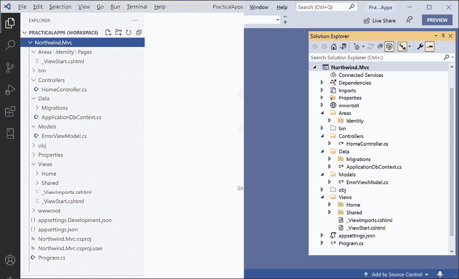
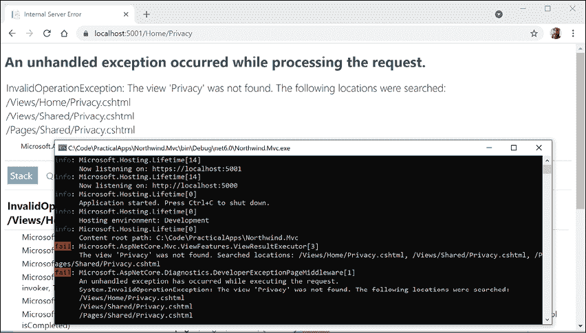
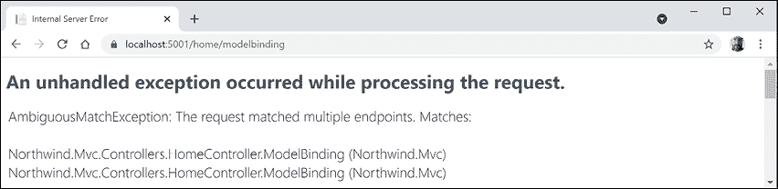
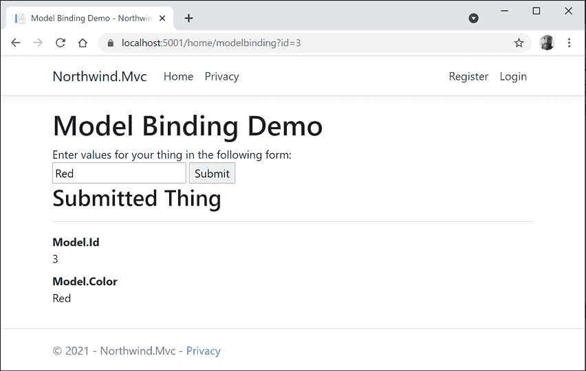
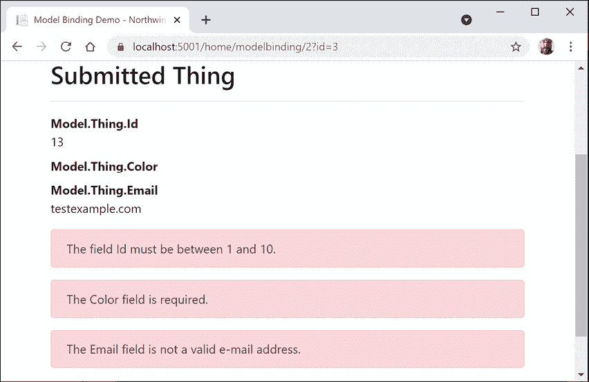

# 十五、使用模型-视图-控制器模式构建网站

本章介绍如何使用 Microsoft ASP.NET Core MVC 在服务器端构建具有现代 HTTP 体系结构的网站，包括构成 ASP.NET Core MVC 项目的启动配置、身份验证、授权、路由、请求和响应管道、模型、视图和控制器。

本章将涵盖以下主题：

*   建立 ASP.NETCore MVC 网站
*   探索 ASP.NETCore MVC 网站
*   自定义 ASP.NETCore MVC 网站
*   查询数据库并使用显示模板
*   使用异步任务提高可伸缩性

# 建立 ASP.NETCore MVC 网站

ASP.NETCore剃须刀页面非常适合于简单网站。对于更复杂的网站，最好采用更正式的结构来管理这种复杂性。

这就是**模型视图控制器**（**MVC**设计模式的有用之处。它使用剃须刀页面等技术，但允许在技术问题之间进行更清晰的分离，如下表所示：

*   **模型**：表示网站上使用的数据实体和视图模型的类。
*   **视图**：Razor 文件，即`.cshtml`文件，用于将视图模型中的数据呈现为 HTML 网页。Blazor 使用`.razor`文件扩展名，但不要将它们与 Razor 文件混淆！
*   **控制器**：当 HTTP 请求到达 web 服务器时执行代码的类。控制器方法通常创建一个可能包含实体模型的视图模型，并将其传递给视图以生成 HTTP 响应，并发送回 web 浏览器或其他客户端。

了解使用 MVC 设计模式进行 web 开发的最佳方法是查看一个工作示例。

## 创建 ASP.NETCore MVC 网站

您将使用项目模板创建一个 ASP.NETCore MVC 网站项目，该项目有一个用于验证和授权用户的数据库。VisualStudio2022 默认使用 SQL Server LocalDB 作为帐户数据库。VisualStudio 代码（或者更准确地说，`dotnet`工具）默认使用 SQLite，您可以指定一个开关来使用 SQLServerLocalDB。

让我们看看它的实际行动：

1.  使用您首选的代码编辑器添加 MVC 网站项目，该项目的身份验证帐户存储在数据库中，如下表所示：
    1.  项目模板：**ASP.NETCore Web App（模型视图控制器）**/`mvc`
    2.  语言：C#
    3.  工作区/解决方案文件和文件夹：`PracticalApps`
    4.  项目文件和文件夹：`Northwind.Mvc`
    5.  选项：**认证类型：个人账户**/`--auth Individual`
    6.  对于 Visual Studio，将所有其他选项保留为默认值
2.  在 Visual Studio 代码中，选择`Northwind.Mvc`作为活动的 OmniSharp 项目。
3.  建设`Northwind.Mvc`项目。
4.  在命令行或终端，使用`help`开关查看此项目模板的其他选项，如以下命令所示：

    ```cs
    dotnet new mvc --help 
    ```

5.  注意结果，如以下部分输出所示：

    ```cs
    ASP.NET Core Web App (Model-View-Controller) (C#)
    Author: Microsoft
    Description: A project template for creating an ASP.NET Core application with example ASP.NET Core MVC Views and Controllers. This template can also be used for RESTful HTTP services.
    This template contains technologies from parties other than Microsoft, see https://aka.ms/aspnetcore/6.0-third-party-notices for details. 
    ```

有许多选项，特别是与身份验证相关的选项，如下表所示：

<colgroup><col> <col></colgroup> 
| 开关 | 描述 |
| `-au&# 124;--auth` | 要使用的身份验证类型：`None`（默认）：此选项还允许您禁用 HTTPS。`Individual`：在数据库中存储注册用户及其密码的个人身份验证（默认为 SQLite）。我们将在为本章创建的项目中使用它。`IndividualB2C`：Azure AD B2C 个人认证。`SingleOrg`：单个租户的组织身份验证。`MultiOrg`：多租户的组织认证。`Windows`：Windows 身份验证。主要用于内部网。 |
| `-uld&# 124;--use-local-db` | 是否使用 SQL Server LocalDB 而不是 SQLite。仅当指定了`--auth Individual`或`--auth IndividualB2C`时，此选项才适用。该值为可选的`bool`，默认为`false`。 |
| `-rrc&# 124;--razor-runtime-compilation` | 确定项目是否配置为在`Debug`版本中使用 Razor 运行时编译。这可以提高调试期间启动的性能，因为它可以推迟 Razor 视图的编译。该值为可选的`bool`，默认为`false`。 |
| `-f&# 124;--framework` | 项目的目标框架。值可以是：`net6.0`（默认）、`net5.0`或`netcoreapp3.1` |

## 为 SQL Server LocalDB 创建身份验证数据库

如果您使用 Visual Studio 2022 创建 MVC 项目，或者您使用带有`-uld`或`--use-local-db`开关的`dotnet new mvc`，则用于身份验证和授权的数据库将存储在 SQL Server LocalDB 中。但该数据库尚不存在。让我们现在就创建它。

在命令提示符或终端的`Northwind.Mvc`文件夹中，输入运行数据库迁移的命令，以便创建用于存储身份验证凭据的数据库，如下命令所示：

```cs
dotnet ef database update 
```

如果您使用`dotnet new`创建了 MVC 项目，那么用于身份验证和授权的数据库将存储在 SQLite 中，并且已经创建了名为`app.db`的文件。

身份验证数据库的连接字符串名为`DefaultConnection`，存储在 MVC 网站项目根文件夹的`appsettings.json`文件中。

对于 SQL Server LocalDB（带有截断的连接字符串），请参见以下标记：

```cs
{
  "ConnectionStrings": {
    "DefaultConnection": "Server=(localdb)\\mssqllocaldb;Database=aspnet-Northwind.Mvc-...;Trusted_Connection=True;MultipleActiveResultSets=true"
  }, 
```

对于 SQLite，请参见以下标记：

```cs
{
  "ConnectionStrings": {
    "DefaultConnection": "DataSource=app.db;Cache=Shared"
  }, 
```

## 探索默认的 ASP.NETCore MVC 网站

让我们回顾一下默认 ASP.NETCore MVC 网站项目模板的行为：

1.  在`Northwind.Mvc`项目中，展开`Properties`文件夹，打开`launchSettings.json`文件，并注意为`HTTPS`和`HTTP`项目配置的随机端口号（您的端口号将不同），如下标记所示：

    ```cs
    "profiles": {
      "Northwind.Mvc": {
        "commandName": "Project",
        "dotnetRunMessages": true,
        "launchBrowser": true,
        "applicationUrl": "https://localhost:7274;http://localhost:5274",
        "environmentVariables": {
          "ASPNETCORE_ENVIRONMENT": "Development"
        }
      }, 
    ```

2.  将`HTTPS`的端口号更改为`5001`，将`HTTP`的端口号更改为`5000`，如下标记所示：

    ```cs
    "applicationUrl": "https://localhost:5001;http://localhost:5000", 
    ```

3.  保存对`launchSettings.json`文件的更改。
4.  启动网站。
5.  启动 Chrome 并打开**开发者工具**。
6.  导航至`http://localhost:5000/`并注意以下事项，如*图 15.1*所示：

    <figure class="mediaobject"></figure>

    *   HTTP 请求会自动重定向到端口`5001`上的 HTTPS。
    *   顶部导航菜单，链接至**主页**、**隐私**、**注册**和**登录**。如果视口宽度等于或小于 575 像素，则导航将折叠到汉堡包菜单中。
    *   网站名称**Northwind.Mvc**，如页眉和页脚所示。

图 15.1:ASP.NETCore MVC 项目模板网站主页

### 了解访客登记

默认情况下，密码必须至少有一个非字母数字字符，必须至少有一个数字（0-9），并且必须至少有一个大写字母（A-Z）。当我只是在探索时，我会在这样的场景中使用`Pa$$w0rd`。

MVC 项目模板遵循**双选择加入**（**DOI**的最佳实践，这意味着在填写注册电子邮件和密码后，会向电子邮件地址发送一封电子邮件，访问者必须点击该电子邮件中的链接以确认他们想要注册。

我们尚未配置电子邮件提供商发送该电子邮件，因此我们必须模拟该步骤：

1.  在顶部导航菜单中，点击**注册**。
2.  输入电子邮件和密码，然后单击**注册**按钮。（我使用了`test@example.com`和`Pa$$w0rd`）
3.  点击带有文本**的链接【点击此处】确认您的账户**，注意您被重定向到一个**确认电子邮件**网页，您可以自定义该网页。
4.  在顶部导航菜单中，点击**登录**，输入您的电子邮件和密码（注意，有一个可选的复选框来记住您，如果访客忘记了密码或他们想注册为新访客，则会有链接），然后点击**登录**按钮。
5.  单击顶部导航菜单中的电子邮件地址。这将导航到帐户管理页面。请注意，您可以设置电话号码、更改电子邮件地址、更改密码、启用双因素身份验证（如果您添加了验证器应用），以及下载和删除您的个人数据。
6.  关闭Chrome 并关闭 web 服务器。

## 审查 MVC 网站项目结构

在您的代码编辑器中，在 Visual Studio**解决方案资源管理器**（打开**显示所有文件**或在 Visual Studio 代码**资源管理器**中，查看 MVC 网站项目的结构，如*图 15.2*所示：

<figure class="mediaobject"></figure>

图 15.2:ASP.NETCore MVC 项目的默认文件夹结构

稍后我们将更详细地了解其中一些部分，但现在请注意以下几点：

*   `Areas`：此文件夹包含嵌套文件夹和将您的网站项目与**ASP.NETCore标识**集成所需的文件，用于身份验证。
*   `bin`、`obj`：这些文件夹包含构建过程中需要的临时文件以及项目编译的程序集。
*   `Controllers`：此文件夹包含 C# 类，这些类具有获取模型并将其传递给视图的方法（称为操作），例如`HomeController.cs`。
*   `Data`：此文件夹包含 ASP.NETCore标识系统使用的实体框架核心迁移类，用于提供用于身份验证和授权的数据存储，例如`ApplicationDbContext.cs`。
*   `Models`：此文件夹包含 C# 类，这些类表示控制器收集并传递给视图的所有数据，例如`ErrorViewModel.cs`。
*   `Properties`：此文件夹包含 Windows 上 IIS 或 IIS Express 的配置文件，用于在开发期间启动名为`launchSettings.json`的网站。此文件仅在本地开发计算机上使用，未部署到生产网站。
*   `Views`：此文件夹包含`.cshtml`Razor 文件，这些文件结合 HTML 和 C# code 动态生成 HTML 响应。`_ViewStart`文件设置默认布局，`_ViewImports`导入所有视图中使用的通用名称空间，如标记帮助器：
    *   `Home`：此子文件夹包含主页和隐私页面的 Razor 文件。
    *   `Shared`：此子文件夹包含共享布局的 Razor 文件、一个错误页面以及两个用于登录和验证脚本的部分视图。
*   `wwwroot`：此文件夹包含网站使用的静态内容，例如用于样式设置的 CSS、JavaScript 库、用于此网站项目的 JavaScript 以及一个`favicon.ico`文件。您还可以在这里放置图像和其他静态文件资源，如 PDF 文档。项目模板包括引导库和 jQuery 库。
*   `app.db`：这是存储注册访问者的SQLite 数据库。（如果使用 SQL Server LocalDB，则不需要它。）
*   `appsettings.json`和`appsettings.Development.json`：这些文件包含您的网站可以在运行时加载的设置，例如，ASP.NETCore标识系统的数据库连接字符串和日志记录级别。
*   `Northwind.Mvc.csproj`：此文件包含项目设置，如使用 Web.NET SDK、SQLite 条目以确保将`app.db`文件复制到网站的输出文件夹，以及项目所需的 NuGet 软件包列表，包括：
    *   `Microsoft.AspNetCore.Diagnostics.EntityFrameworkCore`
    *   `Microsoft.AspNetCore.Identity.EntityFrameworkCore`
    *   `Microsoft.AspNetCore.Identity.UI`
    *   `Microsoft.EntityFrameworkCore.Sqlite`或`Microsoft.EntityFrameworkCore.SqlServer`
    *   `Microsoft.EntityFrameworkCore.Tools`
*   `Program.cs`：该文件定义了一个隐藏的`Program`类，该类包含`Main`入口点。它构建了一个处理传入 HTTP 请求的管道，并使用默认选项（如配置 Kestrel web 服务器和加载`appsettings`）托管网站。它添加和配置网站所需的服务，例如，用于身份验证的 ASP.NETCore标识、用于标识数据存储的 SQLite 或 SQL Server 等，以及应用的路由。

## 查看 ASP.NETCore标识数据库

打开`appsettings.json`查找用于 ASP.NETCore标识数据库的连接字符串，如以下标记中突出显示的针对 SQL Server LocalDB 的所示：

```cs
{
  "ConnectionStrings": {
    "DefaultConnection": "**Server=(localdb)\\mssqllocaldb;Database=aspnet-Northwind.Mvc-2F6A1E12-F9CF-480C-987D-FEFB4827DE22;Trusted_Connection=True;MultipleActiveResultSets=true**"
  },
  "Logging": {
    "LogLevel": {
      "Default": "Information",
      "Microsoft": "Warning",
      "Microsoft.Hosting.Lifetime": "Information"
    }
  },
  "AllowedHosts": "*"
} 
```

如果您使用 SQL Server LocalDB 作为标识数据存储，那么您可以使用**服务器资源管理器**连接到数据库。您可以复制并粘贴`appsettings.json`文件中的连接字符串（但删除`(localdb)`和`mssqllocaldb`之间的第二个反斜杠）。

如果您安装了SQLite 工具，如 SQLiteStudio，则可以打开 SQLite`app.db`数据库文件。

然后，您可以看到 ASP.NETCore标识系统用于注册用户和角色的表，包括用于存储已注册访问者的`AspNetUsers`表。

**良好实践**：ASP.NETCore MVC 项目模板遵循良好实践，存储密码散列，而不是密码本身，您将在*第 20 章**保护您的数据和应用*中了解更多信息。

# 探索 ASP.NETCore MVC 网站

让我们浏览一下构成现代 ASP.NETCore MVC 网站的各个部分。

## 了解 ASP.NETCore MVC 初始化

适当地我们将从探索 MVC 网站的默认初始化和配置开始：

1.  Open the `Program.cs` file and note that it uses the top-level program feature (so there is a hidden `Program` class with a `Main` method). This file can be considered to be divided into four important sections from top to bottom.

    .NET 5 和早期的 ASP.NETCore项目模板使用`Startup`类将这些部分分离为单独的方法，但对于.NET 6，Microsoft 鼓励将所有内容放在一个`Program.cs`文件中。

2.  The first section imports some namespaces, as shown in the following code:

    ```cs
    using Microsoft.AspNetCore.Identity; // IdentityUser
    using Microsoft.EntityFrameworkCore; // UseSqlServer, UseSqlite
    using Northwind.Mvc.Data; // ApplicationDbContext 
    ```

    请记住，默认情况下，许多其他名称空间是使用.NET 6 及更高版本的隐式 usings 功能导入的。构建项目，然后可以在以下路径中找到全局导入的名称空间：`obj\Debug\net6.0\Northwind.Mvc.GlobalUsings.g.cs`。

3.  The second section creates and configures a web host builder. It registers an application database context using SQL Server or SQLite with its database connection string loaded from the `appsettings.json` file for its data storage, adds ASP.NET Core Identity for authentication and configures it to use the application database, and adds support for MVC controllers with views, as shown in the following code:

    ```cs
    var builder = WebApplication.CreateBuilder(args);
    // Add services to the container.
    var connectionString = builder.Configuration
      .GetConnectionString("DefaultConnection");
    builder.Services.AddDbContext<ApplicationDbContext>(options =>
      options.UseSqlServer(connectionString)); // or UseSqlite
    builder.Services.AddDatabaseDeveloperPageExceptionFilter();
    builder.Services.AddDefaultIdentity<IdentityUser>(options => 
      options.SignIn.RequireConfirmedAccount = true)
      .AddEntityFrameworkStores<ApplicationDbContext>();
    builder.Services.AddControllersWithViews(); 
    ```

    `builder`对象有两个常用对象：`Configuration`和`Services`：

    *   `Configuration`包含可以设置配置的所有位置的合并值：`appsettings.json`、环境变量、命令行参数等
    *   `Services`是已注册的依赖项服务的集合

    对`AddDbContext`的调用是注册依赖项服务的一个示例。ASP.NETCore实现了**依赖注入**（**DI**）设计模式，以便控制器等其他组件可以通过其构造函数请求所需的服务。开发人员在`Program.cs`的本节中注册这些服务（或者如果使用`Startup`类，则在其`ConfigureServices`方法中注册。）

4.  The third section configures the HTTP request pipeline. It configures a relative URL path to run database migrations if the website runs in development, or a friendlier error page and HSTS for production. HTTPS redirection, static files, routing, and ASP.NET Identity are enabled, and an MVC default route and Razor Pages are configured, as shown in the following code:

    ```cs
    // Configure the HTTP request pipeline.
    if (app.Environment.IsDevelopment())
    {
      app.UseMigrationsEndPoint();
    }
    else
    {
      app.UseExceptionHandler("/Home/Error");
      // The default HSTS value is 30 days. You may want to change this for production scenarios, see https://aka.ms/aspnetcore-hsts.
      app.UseHsts();
    }
    app.UseHttpsRedirection();
    app.UseStaticFiles();
    app.UseRouting();
    app.UseAuthentication();
    app.UseAuthorization();
    app.MapControllerRoute(
      name: "default",
      pattern: "{controller=Home}/{action=Index}/{id?}");
    app.MapRazorPages(); 
    ```

    我们在*第 14 章**使用 ASP.NETCore剃须刀页面*构建网站中学习了关于这些方法和功能的大部分内容。

    **良好实践**：扩展方法`UseMigrationsEndPoint`的作用是什么？你可以阅读官方文件，但没有多大帮助。例如，它不会告诉我们默认情况下定义的相对 URL 路径：[https://docs.microsoft.com/en-us/dotnet/api/microsoft.aspnetcore.builder.migrationsendpointextensions.usemigrationsendpoint](https://docs.microsoft.com/en-us/dotnet/api/microsoft.aspnetcore.builder.migrationsendpointextensions.usemigrationsendpoint) 。幸运的是，ASP.NETCore是开源的，因此我们可以阅读源代码并在以下链接中发现它的功能：[https://github.com/dotnet/aspnetcore/blob/main/src/Middleware/Diagnostics.EntityFrameworkCore/src/MigrationsEndPointOptions.cs# L18](https://github.com/dotnet/aspnetcore/blob/main/src/Middleware/Diagnostics.EntityFrameworkCore/src/MigrationsEndPointOptions.cs# L18) 。养成探索 ASP.NETCore源代码的习惯，以了解其工作原理。

    除了`UseAuthentication`和`UseAuthorization`方法外，在`Program.cs`这一节中最重要的新方法是`MapControllerRoute`，它映射了一条默认路径供 MVC 使用。此路由非常灵活，因为它将映射到几乎所有传入的 URL，您将在下一个主题中看到。

    尽管在本章中我们不会创建任何 Razor 页面，但我们需要保留映射 Razor 页面支持的方法调用，因为我们的 MVC 网站使用 ASP.NETCore标识进行身份验证和授权，并且它使用 Razor 类库作为其用户界面组件，如访客注册和登录。

5.  第四部分（也是最后一部分）有一个线程阻塞方法调用，该调用运行网站并等待传入的 HTTP 请求响应，如以下代码所示：

    ```cs
    app.Run(); // blocking call 
    ```

## 了解默认 MVC 路由

路由的职责是发现要实例化的控制器类的名称和要执行的操作方法，并将可选的`id`参数传递给将生成 HTTP 响应的方法。

为 MVC 配置了默认路由，如下代码所示：

```cs
endpoints.MapControllerRoute(
  name: "default",
  pattern: "{controller=Home}/{action=Index}/{id?}"); 
```

路由模式在花括号`{}`中有称为**段**的部分，它们类似于方法的命名参数。这些段的值可以是任何`string`。URL 中的段不区分大小写。

路由模式查看浏览器请求的任何 URL 路径，并将其匹配以提取`controller`的名称、`action`的名称和可选的`id`值（“T3”符号使其成为可选的）。

如果用户尚未输入这些名称，则会对控制器使用默认值`Home`，对操作使用默认值`Index`（`=`赋值为命名段设置默认值）。

下表包含示例 URL 以及默认路由如何计算控制器和操作的名称：

<colgroup><col> <col> <col> <col></colgroup> 
| 统一资源定位地址 | 控制器 | 行动 | 身份证件 |
| `/` | 家 | 指数 |  |
| `/Muppet` | 布偶 | 指数 |  |
| `/Muppet/Kermit` | 布偶 | 克米特 |  |
| `/Muppet/Kermit/Green` | 布偶 | 克米特 | 绿色 |
| `/Products` | 产品 | 指数 |  |
| `/Products/Detail` | 产品 | 细节 |  |
| `/Products/Detail/3` | 产品 | 细节 | 3. |

## 了解控制器和操作

在 MVC 中，C 代表*控制器*。通过路由和传入 URL，ASP.NET Core 知道控制器的名称，因此它将查找用`[Controller]`属性修饰的类或从用该属性修饰的类派生的，例如，Microsoft 提供的名为`ControllerBase`的类，如下代码所示：

```cs
namespace Microsoft.AspNetCore.Mvc
{
  //
  // Summary:
  // A base class for an MVC controller without view support.
  [Controller]
  public abstract class ControllerBase
  {
... 
```

### 理解 ControllerBase 类

正如您在 XML 注释中看到的，`ControllerBase`不支持视图。用于创建 web 服务，如*第 16 章*、*构建和使用 web 服务*所示。

`ControllerBase`有许多有用的属性用于处理当前 HTTP 上下文，如下表所示：

<colgroup><col> <col></colgroup> 
| 所有物 | 描述 |
| `Request` | 只是 HTTP 请求。例如，标题、查询字符串参数、作为可读取流的请求主体、内容类型和长度以及 cookie。 |
| `Response` | 只是 HTTP 响应。例如，标题、作为可写入的流的响应主体、内容类型和长度、状态代码和 cookie。还有像`OnStarting`和`OnCompleted`这样的代理，您可以将方法挂接到它们。 |
| `HttpContext` | 关于当前 HTTP 上下文的所有信息，包括请求和响应、连接信息、服务器上使用中间件启用的功能集合，以及用于身份验证和授权的`User`对象。 |

### 理解控制器类

Microsoft 提供了另一个名为`Controller`的类，如果您的类确实需要视图支持，则可以继承该类，如下代码所示：

```cs
namespace Microsoft.AspNetCore.Mvc
{
  //
  // Summary:
  // A base class for an MVC controller with view support.
  public abstract class Controller : ControllerBase,
    IActionFilter, IFilterMetadata, IAsyncActionFilter, IDisposable
  {
... 
```

`Controller`具有许多用于处理视图的有用属性，如下表所示：

<colgroup><col> <col></colgroup> 
| 所有物 | 描述 |
| `ViewData` | 控制器可以存储在视图中可访问的键/值对的字典。字典的生存期仅适用于当前请求/响应。 |
| `ViewBag` | 一个动态对象，它包装了`ViewData`，为设置和获取字典值提供了更友好的语法。 |
| `TempData` | 控制器可以存储在视图中可访问的键/值对的字典。字典的生存期是针对同一访问者会话的当前请求/响应和下一个请求/响应。这对于在初始请求期间存储值、使用重定向进行响应，然后在后续请求中读取存储的值非常有用。 |

`Controller`有许多使用视图的有用方法，如下表所示：

<colgroup><col> <col></colgroup> 
| 所有物 | 描述 |
| `View` | 执行呈现完整响应的视图后返回一个`ViewResult`，例如，动态生成的网页。可以使用约定选择视图，也可以使用字符串名称指定视图。模型可以传递给视图。 |
| `PartialView` | 执行作为完整响应一部分的视图后返回一个`PartialViewResult`，例如，动态生成的 HTML 块。可以使用约定选择视图，也可以使用字符串名称指定视图。模型可以传递给视图。 |
| `ViewComponent` | 执行动态生成 HTML 的组件后返回一个`ViewComponentResult`。必须通过指定组件的类型或名称来选择组件。对象可以作为参数传递。 |
| `Json` | 返回一个包含 JSON 序列化对象的`JsonResult`。这对于作为 MVC 控制器的一部分实现简单的 Web API 非常有用，MVC 控制器主要返回 HTML 供用户查看。 |

### 了解控制员的职责

控制人的职责如下：

*   确定控制器需要处于有效状态并在其类构造函数中正常运行的服务。
*   使用操作名称标识要执行的方法。
*   从 HTTP 请求中提取参数。
*   使用这些参数获取构造视图模型所需的任何附加数据，并将其传递给客户端的适当视图。例如，如果客户端是 web 浏览器，则呈现 HTML 的视图最合适。其他客户端可能更喜欢其他呈现，如 PDF 文件或 Excel 文件等文档格式，或 JSON 或 XML 等数据格式。
*   将视图中的结果作为带有适当状态代码的 HTTP 响应返回给客户端。

让我们回顾一下用于生成主页、隐私和错误页面的控制器：

1.  展开`Controllers`文件夹
2.  打开名为`HomeController.cs`的文件
3.  注意，如以下代码中的所示：

    ```cs
    using Microsoft.AspNetCore.Mvc; // Controller, IActionResult
    using Northwind.Mvc.Models; // ErrorViewModel
    using System.Diagnostics; // Activity
    namespace Northwind.Mvc.Controllers;
    public class HomeController : Controller
    {
      private readonly ILogger<HomeController> _logger;
      public HomeController(ILogger<HomeController> logger)
      {
        _logger = logger;
      }
      public IActionResult Index()
      {
        return View();
      }
      public IActionResult Privacy()
      {
        return View();
      }
      [ResponseCache(Duration = 0,
        Location = ResponseCacheLocation.None, NoStore = true)]
      public IActionResult Error()
      {
        return View(new ErrorViewModel { RequestId = 
          Activity.Current?.Id ?? HttpContext.TraceIdentifier });
      }
    } 
    ```

    *   额外的名称空间被导入，我为其添加了注释，以显示需要它们的类型。
    *   声明一个私有只读字段来存储对构造函数中设置的`HomeController`的记录器的引用。
    *   所有三个操作方法都调用一个名为`View`的方法，并将结果作为`IActionResult`接口返回给客户端。
    *   `Error`动作方法将一个视图模型传递到它的视图中，该视图具有用于跟踪的请求 ID。将不会缓存错误响应：

如果访问者导航到`/`或`/Home`路径，那么它相当于`/Home/Index`，因为这些是默认路由中控制器和操作的默认名称。

## 理解视图搜索路径约定

`Index`和`Privacy`方法在实现上是相同的，但它们返回不同的网页。这是因为**约定**。对`View`方法的调用在不同路径中查找 Razor 文件以生成网页。

让我们故意打断其中一个页面名称，以便可以看到默认情况下搜索的路径：

1.  在`Northwind.Mvc`项目中，展开`Views`文件夹，然后展开`Home`文件夹。
2.  将`Privacy.cshtml`文件重命名为`Privacy2.cshtml`。
3.  启动网站。
4.  Start Chrome, navigate to `https://localhost:5001/`, click **Privacy**, and note the paths that are searched for a view to render the web page (including in `Shared` folders for MVC views and Razor Pages), as shown in *Figure 15.3*:

    <figure class="mediaobject"></figure>

    图 15.3：显示视图默认搜索路径的异常

5.  关闭 Chrome 并关闭 web 服务器。
6.  将`Privacy2.cshtml`文件重命名回`Privacy.cshtml`。

您已经看到了视图搜索路径约定，如下表所示：

*   特定剃须刀视图：`/Views/{controller}/{action}.cshtml`
*   共享剃须刀视图：`/Views/Shared/{action}.cshtml`
*   共享剃须刀页面：`/Pages/Shared/{action}.cshtml`

## 理解测井

您刚刚看到一些错误被捕获并写入控制台。您可以使用记录器以相同的方式将消息写入控制台。

1.  在`Controllers`文件夹中的`HomeController.cs`中，在`Index`方法中添加语句，使用记录器向控制台写入一些不同级别的消息，如下代码所示：

    ```cs
    _logger.LogError("This is a serious error (not really!)");
    _logger.LogWarning("This is your first warning!");
    _logger.LogWarning("Second warning!");
    _logger.LogInformation("I am in the Index method of the HomeController."); 
    ```

2.  启动`Northwind.Mvc`网站项目。
3.  启动 web 浏览器并导航到该网站的主页。
4.  在命令提示或终端，注意消息，如以下输出所示：

    ```cs
    fail: Northwind.Mvc.Controllers.HomeController[0]
          This is a serious error (not really!)
    warn: Northwind.Mvc.Controllers.HomeController[0]
          This is your first warning!
    warn: Northwind.Mvc.Controllers.HomeController[0]
          Second warning!
    info: Northwind.Mvc.Controllers.HomeController[0]
          I am in the Index method of the HomeController. 
    ```

5.  关闭 Chrome 并关闭 web 服务器。

## 了解过滤器

当您需要向多个控制器和操作添加一些功能时，您可以使用或定义自己的过滤器，这些过滤器作为属性类实现。

可以在以下级别应用过滤器：

*   在操作级别，通过使用属性修饰操作方法。这只会影响单操作方法。
*   在控制器级别，通过使用属性装饰控制器类。这将影响控制器的所有方法。
*   在全局级，调用`AddControllersWithViews`方法时，在`MvcOptions`实例的`Filters`集合中增加可以配置 MVC 的属性类型，如下代码所示：

    ```cs
    builder.Services.AddControllersWithViews(options =>
      {
        options.Filters.Add(typeof(MyCustomFilter));
      }); 
    ```

### 使用筛选器保护操作方法

您可能希望确保控制器类的一个特定操作方法只能由某些安全角色的成员调用。您可以通过使用`[Authorize]`属性装饰方法来完成此操作，如下表所述：

*   `[Authorize]`：仅允许经过身份验证（非匿名、登录）的访问者访问此操作方法。
*   `[Authorize(Roles = "Sales,Marketing")]`：仅允许指定角色的访问者访问此操作方法。

让我们看一个例子：

1.  在`HomeController.cs`中，导入`Microsoft.AspNetCore.Authorization`名称空间。
2.  在`Privacy`方法中添加一个属性，仅允许名为`Administrators`的组/角色成员的登录用户访问，如下面代码中突出显示的：

    ```cs
    **[****Authorize(Roles =** **"Administrators"****)****]**
    public IActionResult Privacy() 
    ```

3.  启动网站。
4.  单击**隐私**并注意您已重定向到登录页面。
5.  输入您的电子邮件和密码。
6.  点击**登录**并注意您被拒绝访问。
7.  关闭Chrome 并关闭 web 服务器。

### 启用角色管理并以编程方式创建角色

默认情况下，ASP.NETCore MVC 项目中未启用角色管理，因此我们必须在创建角色之前先启用它，然后我们将创建一个控制器，该控制器将以编程方式创建一个`Administrators`角色（如果它不存在），并为该角色分配一个测试用户：

1.  在`Program.cs`中，在 ASP.NETCore身份及其数据库的设置中，添加对`AddRoles`的调用以启用角色管理，如下代码所示：

    ```cs
    services.AddDefaultIdentity<IdentityUser>(
      options => options.SignIn.RequireConfirmedAccount = true)
     **.AddRoles<IdentityRole>()** **// enable role management**
      .AddEntityFrameworkStores<ApplicationDbContext>(); 
    ```

2.  In `Controllers`, add an empty controller class named `RolesController.cs` and modify its contents, as shown in the following code:

    ```cs
    using Microsoft.AspNetCore.Identity; // RoleManager, UserManager
    using Microsoft.AspNetCore.Mvc; // Controller, IActionResult
    using static System.Console;
    namespace Northwind.Mvc.Controllers;
    public class RolesController : Controller
    {
      private string AdminRole = "Administrators";
      private string UserEmail = "test@example.com";
      private readonly RoleManager<IdentityRole> roleManager;
      private readonly UserManager<IdentityUser> userManager;
      public RolesController(RoleManager<IdentityRole> roleManager,
        UserManager<IdentityUser> userManager)
      {
        this.roleManager = roleManager;
        this.userManager = userManager;
      }
      public async Task<IActionResult> Index()
      {
        if (!(await roleManager.RoleExistsAsync(AdminRole)))
        {
          await roleManager.CreateAsync(new IdentityRole(AdminRole));
        }
        IdentityUser user = await userManager.FindByEmailAsync(UserEmail);
        if (user == null)
        {
          user = new();
          user.UserName = UserEmail;
          user.Email = UserEmail;
          IdentityResult result = await userManager.CreateAsync(
            user, "Pa$$w0rd");
          if (result.Succeeded)
          {
            WriteLine($"User {user.UserName} created successfully.");
          }
          else
          { 
            foreach (IdentityError error in result.Errors)
            {
              WriteLine(error.Description);
            }
          }
        }
        if (!user.EmailConfirmed)
        {
          string token = await userManager
            .GenerateEmailConfirmationTokenAsync(user);
          IdentityResult result = await userManager
            .ConfirmEmailAsync(user, token);
          if (result.Succeeded)
          {
            WriteLine($"User {user.UserName} email confirmed successfully.");
          }
          else
          {
            foreach (IdentityError error in result.Errors)
            {
              WriteLine(error.Description);
            }
          }
        }
        if (!(await userManager.IsInRoleAsync(user, AdminRole)))
        {
          IdentityResult result = await userManager
            .AddToRoleAsync(user, AdminRole);
          if (result.Succeeded)
          {
            WriteLine($"User {user.UserName} added to {AdminRole} successfully.");
          }
          else
          {
            foreach (IdentityError error in result.Errors)
            {
              WriteLine(error.Description);
            }
          }
        }
        return Redirect("/");
      }
    } 
    ```

    注以下内容：

    *   两个字段用于角色名称和用户的电子邮件。
    *   构造函数获取并存储注册的用户和角色管理器依赖项服务。
    *   如果`Administrators`角色不存在，我们使用角色管理器创建它。
    *   我们试图通过电子邮件找到一个测试用户，如果它不存在，则创建它，然后将该用户分配给 `Administrators`角色。
    *   由于网站使用 DOI，我们必须生成一个电子邮件确认令牌，并使用它来确认新用户的电子邮件地址。
    *   成功消息和任何错误都会写入控制台。
    *   您将自动重定向到主页。
3.  启动网站。
4.  单击**隐私**并注意您已重定向到登录页面。
5.  输入您的电子邮件和密码。（我用了`mark@example.com`）
6.  点击**登录**并注意，您仍然被拒绝访问。
7.  点击**主页**。
8.  在地址栏中，手动输入`roles`作为相对 URL 路径，如下链接所示：`https://localhost:5001/roles`。
9.  查看写入控制台的成功消息，如以下输出所示：

    ```cs
    User test@example.com created successfully.
    User test@example.com email confirmed successfully.
    User test@example.com added to Administrators successfully. 
    ```

10.  点击**退出**，因为您必须退出并重新登录才能加载您在登录后创建的角色成员身份。
11.  再次尝试访问**隐私**页面，输入以编程方式创建的新用户的电子邮件，例如`test@example.com`及其密码，然后单击**登录**，您现在应该可以访问了。
12.  关闭 Chrome 并关闭 web 服务器。

### 使用筛选器缓存响应

为了提高响应时间和可伸缩性，您可能希望通过使用`[ResponseCache]`属性对操作方法生成的 HTTP 响应进行缓存。

您可以通过设置参数来控制响应的缓存位置和缓存时间，如下表所示：

*   `Duration`：以秒为单位。设置以秒为单位的`max-age`HTTP 响应头。常见的选择是一小时（3600 秒）和一天（86400 秒）。
*   `Location`：`ResponseCacheLocation`值、`Any`、`Client`或`None`中的一个。设置`cache-control`HTTP 响应头。
*   `NoStore`：如果`true`，则忽略`Duration`和`Location`，并将缓存控制 HTTP 响应头设置为`no-store`。

让我们看一个例子：

1.  在`HomeController.cs`中，为`Index`方法添加一个属性，将响应缓存在浏览器或服务器与浏览器之间的任何代理上 10 秒，如下代码所示：

    ```cs
    **[****ResponseCache(Duration = 10, Location = ResponseCacheLocation.Any)****]**
    public IActionResult Index() 
    ```

2.  在`Views`中，在`Home`中，打开`Index.cshtml`，并添加一个段落以长格式输出当前时间，包括秒，如下标记所示：

    ```cs
    <p class="alert alert-primary">@DateTime.Now.ToLongTimeString()</p> 
    ```

3.  启动网站。
4.  在主页上记下时间。
5.  点击**注册**。
6.  单击**主页**并注意主页上的时间是相同的，因为使用了页面的缓存版本。
7.  点击**注册**。至少等 10 秒钟。
8.  点击**主页**并注意时间已更新。
9.  点击**登录**，输入您的电子邮件和密码，然后点击**登录**。
10.  在主页上记下时间。
11.  点击**隐私**。
12.  点击**主页**，注意页面未缓存。
13.  查看控制台并注意警告消息，该消息解释您的缓存已被覆盖，因为访问者已登录，在此场景中，ASP.NET Core 使用防伪令牌，不应缓存它们，如以下输出所示：

    ```cs
    warn: Microsoft.AspNetCore.Antiforgery.DefaultAntiforgery[8]
          The 'Cache-Control' and 'Pragma' headers have been overridden and set to 'no-cache, no-store' and 'no-cache' respectively to prevent caching of this response. Any response that uses antiforgery should not be cached. 
    ```

14.  关闭 Chrome 并关闭 web 服务器。

### 使用过滤器定义自定义管线

您可能希望为操作方法定义简化路由，而不是使用默认路由。

例如，要显示隐私页面，当前需要以下 URL 路径，该路径指定控制器和操作：

```cs
https://localhost:5001/home/privacy 
```

我们可以简化路线，如以下链接所示：

```cs
https://localhost:5001/private 
```

让我们看看如何做到这一点：

1.  在`HomeController.cs`中，为`Privacy`方法添加一个属性，定义一个简化的路由，如下代码所示：

    ```cs
    **[****Route(****"private"****)****]**
    [Authorize(Roles = "Administrators")]
    public IActionResult Privacy() 
    ```

2.  启动网站。
3.  在地址栏中，输入以下 URL 路径：

    ```cs
    https://localhost:5001/private 
    ```

4.  输入您的电子邮件和密码，点击**登录**，注意简化路径显示**隐私**页面。
5.  关闭 Chrome 并关闭 web 服务器。

## 理解实体和视图模型

在 MVC 中，M代表*车型*。模型表示响应请求所需的数据。常用的模型有两种：实体模型和视图模型。

**实体模型**表示 SQL Server 或 SQLite 等数据库中的实体。根据请求，可能需要从数据存储中检索一个或多个实体。实体模型是使用类定义的，因为它们可能需要更改，然后用于更新基础数据存储。

我们希望在响应请求时显示的所有数据都是**MVC 模型**，有时称为**视图模型**，因为它是传递到视图中以呈现为响应格式（如 HTML 或 JSON）的模型。视图模型应该是不可变的，因此它们通常是使用记录定义的。

例如，以下 HTTP`GET`请求可能意味着浏览器正在请求产品编号 3 的产品详细信息页面：

[http://www.example.com/products/details/3](http://www.example.com/products/details/3)

控制器需要使用 ID route 值 3 来检索该产品的实体，并将其传递给视图，然后该视图可以将模型转换为 HTML 以在浏览器中显示。

想象一下，当一个用户来到我们的网站时，我们想向他们展示一系列类别、产品列表以及我们本月的访客数量。

我们将参考您在*第 13 章*中创建的北风数据库的实体框架核心实体数据模型，*介绍 C# 和.NET*的实际应用：

1.  在`Northwind.Mvc`项目中，为 SQLite 或 SQL Server 添加对`Northwind.Common.DataContext`的项目引用，如以下标记所示：

    ```cs
    <ItemGroup>
      <!-- change Sqlite to SqlServer if you prefer -->
      <ProjectReference Include=
    "..\Northwind.Common.DataContext.Sqlite\Northwind.Common.DataContext.Sqlite.csproj" />
    </ItemGroup> 
    ```

2.  构建`Northwind.Mvc`项目以编译其依赖项。
3.  如果您正在使用 SQL Server，或者可能希望在 SQL Server 和 SQLite 之间切换，则在`appsettings.json`中，为使用 SQL Server 的 Northwind 数据库添加一个连接字符串，如以下标记中突出显示的那样：

    ```cs
    {
      "ConnectionStrings": {
        "DefaultConnection": "Server=(localdb)\\mssqllocaldb;Database=aspnet-Northwind.Mvc-DC9C4FAF-DD84-4FC9-B925-69A61240EDA7;Trusted_Connection=True;MultipleActiveResultSets=true",
    **"NorthwindConnection"****:** **"Server=.;Database=Northwind;Trusted_Connection=True;MultipleActiveResultSets=true"**
      }, 
    ```

4.  在`Program.cs`中，导入名称空间以处理实体模型类型，如以下代码所示：

    ```cs
    using Packt.Shared; // AddNorthwindContext extension method 
    ```

5.  在`builder.Build`方法调用之前，添加语句加载相应的连接字符串，然后注册`Northwind`数据库上下文，如下代码所示：

    ```cs
    // if you are using SQL Server
    string sqlServerConnection = builder.Configuration
      .GetConnectionString("NorthwindConnection");
    builder.Services.AddNorthwindContext(sqlServerConnection);
    // if you are using SQLite default is ..\Northwind.db
    builder.Services.AddNorthwindContext(); 
    ```

6.  Add a class file to the `Models` folder and name it `HomeIndexViewModel.cs`.

    **良好实践**：虽然 MVC 项目模板创建的`ErrorViewModel`类不遵循此约定，但我建议您对视图模型类使用命名约定`{Controller}{Action}ViewModel`。

7.  修改语句以定义一条记录，该记录具有三个属性，用于统计访客数量、类别和产品列表，如以下代码所示：

    ```cs
    using Packt.Shared; // Category, Product
    namespace Northwind.Mvc.Models;
    public record HomeIndexViewModel
    (
      int VisitorCount,
      IList<Category> Categories,
      IList<Product> Products
    ); 
    ```

8.  在`HomeController.cs`中导入`Packt.Shared`名称空间，如下代码所示：

    ```cs
    using Packt.Shared; // NorthwindContext 
    ```

9.  Add a field to store a reference to a `Northwind` instance, and initialize it in the constructor, as shown highlighted in the following code:

    ```cs
    public class HomeController : Controller
    {
      private readonly ILogger<HomeController> _logger;
    **private****readonly** **NorthwindContext db;**
      public HomeController(ILogger<HomeController> logger,
     **NorthwindContext injectedContext****)**
      {
        _logger = logger;
     **db = injectedContext;**
      }
    ... 
    ```

    ASP.NET Core 将使用构造函数参数注入，使用您在`Program.cs`中指定的连接字符串传递`NorthwindContext`数据库上下文的实例。

10.  修改`Index`动作方法中的语句，为该方法创建视图模型的实例，使用`Random`类模拟访客数量，生成 1 到 1000 之间的数字，使用`Northwind`数据库获取类别和产品列表，然后将模型传递给视图，如以下代码所示：

    ```cs
    [ResponseCache(Duration = 10, Location = ResponseCacheLocation.Any)]
    public IActionResult Index()
    {
      _logger.LogError("This is a serious error (not really!)");
      _logger.LogWarning("This is your first warning!");
      _logger.LogWarning("Second warning!");
      _logger.LogInformation("I am in the Index method of the HomeController.");
     **HomeIndexViewModel model =** **new**
     **(**
     **VisitorCount: (****new** **Random()).Next(****1****,** **1001****),**
     **Categories: db.Categories.ToList(),**
     **Products: db.Products.ToList()**
     **);**
    **return** **View(model);** **// pass model to view**
    } 
    ```

记住视图搜索约定：当在控制器的动作方法中调用`View`方法时，ASP.NET Core MVC 在`Views`文件夹中查找与当前控制器同名的子文件夹，即`Home`。然后，它将查找与当前操作同名的文件，即`Index.cshtml`。它还将在`Shared`文件夹中搜索与动作方法名称匹配的视图，并在`Pages`文件夹中搜索 Razor 页面。

## 理解观点

在 MVC 中，V 代表*视图*。视图的职责是将模型转换为 HTML 或其他格式。

有多个**视图引擎**可用于执行此操作。默认视图引擎称为**Razor**，使用`@`符号表示服务器端代码执行。ASP.NET Core 2.0 引入的 Razor 页面功能使用相同的视图引擎，因此可以使用相同的 Razor 语法。

让我们修改主页视图以呈现类别和产品列表：

1.  展开`Views`文件夹，然后展开`Home`文件夹。
2.  打开`Index.cshtml`文件，注意包裹在`@{ }`中的 C 代码块。这将首先执行，并可用于存储需要传递到共享布局文件（如网页标题）中的数据，如以下代码所示：

    ```cs
    @{
      ViewData["Title"] = "Home Page";
    } 
    ```

3.  Note the static HTML content in the `<div>` element that uses Bootstrap for styling.

    **良好实践**：除了定义您自己的样式外，还可以将您的样式建立在实现响应式设计的公共库（如 Bootstrap）上。

    与 Razor 页面一样，有一个名为`_ViewStart.cshtml`的文件，由`View`方法执行。它用于设置应用于所有视图的默认值。

    例如，它将所有视图的`Layout`属性设置为共享布局文件，如以下标记所示：

    ```cs
    @{
      Layout = "_Layout";
    } 
    ```

4.  在`Views`文件夹中，打开`_ViewImports.cshtml`文件，注意它导入了一些名称空间，然后添加了 ASP.NETCore标记助手，如下代码所示：

    ```cs
    @using Northwind.Mvc 
    @using Northwind.Mvc.Models
    @addTagHelper *, Microsoft.AspNetCore.Mvc.TagHelpers 
    ```

5.  在`Shared`文件夹中，打开`_Layout.cshtml`文件。
6.  注意，标题是从前面在`Index.cshtml`视图中设置的`ViewData`字典中读取的，如以下标记所示：

    ```cs
    <title>@ViewData["Title"] – Northwind.Mvc</title> 
    ```

7.  注意呈现支持引导和站点样式表的链接，其中`~`表示`wwwroot`文件夹，如以下标记所示：

    ```cs
    <link rel="stylesheet" 
      href="~/lib/bootstrap/dist/css/bootstrap.css" />
    <link rel="stylesheet" href="~/css/site.css" /> 
    ```

8.  注意标题中导航栏的呈现，如以下标记所示：

    ```cs
    <body>
      <header>
        <nav class="navbar ..."> 
    ```

9.  Note the rendering of a collapsible `<div>` containing a partial view for logging in and hyperlinks to allow users to navigate between pages using ASP.NET Core tag helpers with attributes like `asp-controller` and `asp-action`, as shown in the following markup:

    ```cs
    <div class=
      "navbar-collapse collapse d-sm-inline-flex justify-content-between">
      <ul class="navbar-nav flex-grow-1">
        <li class="nav-item">
          <a class="nav-link text-dark" asp-area=""
            asp-controller="Home" asp-action="Index">Home</a>
        </li>
        <li class="nav-item">
          <a class="nav-link text-dark"
            asp-area="" asp-controller="Home" 
            asp-action="Privacy">Privacy</a>
        </li>
      </ul>
      <partial name="_LoginPartial" />
    </div> 
    ```

    `<a>`元素使用名为`asp-controller`和`asp-action`的标记辅助属性来指定单击链接时将执行的控制器名称和操作名称。如果您想导航到 Razor 类库中的某个功能，比如您在上一章中创建的`employees`组件，那么您可以使用`asp-area`来指定功能名称。

10.  Note the rendering of the body inside the `<main>` element, as shown in the following markup:

    ```cs
    <div class="container">
      <main role="main" class="pb-3">
        @RenderBody()
      </main>
    </div> 
    ```

    `RenderBody`方法在共享布局中的该点为页面（如`Index.cshtml`文件）注入特定 Razor 视图的内容。

11.  注意页面底部`<script>`元素的呈现，这样不会减慢页面的显示，并且您可以将自己的脚本块添加到名为`scripts`的可选定义部分，如以下标记所示：

    ```cs
    <script src="~/lib/jquery/dist/jquery.min.js"></script>
    <script src="~/lib/bootstrap/dist/js/bootstrap.bundle.min.js">
    </script>
    <script src="~/js/site.js" asp-append-version="true"></script> 
    @await RenderSectionAsync("scripts", required: false) 
    ```

当在任何元素（如``或`<script>`中使用`true`值以及`src`属性指定`asp-append-version`时，将调用图像标记辅助对象（该辅助对象的名称不好，因为它不仅影响图像！）。

其工作原理是自动附加一个名为`v`的查询字符串值，该值是从引用的源文件的散列中生成的，如下面生成的输出示例所示：

```cs
<script src="~/js/site.js? v=Kl_dqr9NVtnMdsM2MUg4qthUnWZm5T1fCEimBPWDNgM"></script> 
```

如果`site.js`文件中的单个字节发生更改，则其哈希值将不同，因此，如果浏览器或 CDN 正在缓存脚本文件，则它将破坏缓存的副本，并将其替换为新版本。

# 自定义 ASP.NETCore MVC 网站

现在，您已经查看了基本 MVC 网站的结构，接下来将对其进行自定义和扩展。您已经为`Northwind`数据库注册了一个 EF 核心模型，因此下一个任务是在主页上输出一些数据。

## 定义自定义样式

主页将显示 Northwind 数据库中 77 种产品的列表。为了有效利用空间，我们希望将列表显示为三列。为此，我们需要自定义网站的样式表：

1.  在`wwwroot\css`文件夹中，打开`site.css`文件。
2.  在文件的底部，添加一个新样式，该样式将应用于具有`product-columns`ID 的元素，如以下代码所示：

    ```cs
    # product-columns
    {
      column-count: 3;
    } 
    ```

## 设置类别图像

Northwind 数据库包含八个类别的表格，但它们没有图像，网站通过一些彩色图片看起来更好：

1.  在`wwwroot`文件夹中，创建一个名为`images`的文件夹。
2.  在`images`文件夹中，添加名为`category1.jpeg`、`category2.jpeg`等八个图像文件，最多添加`category8.jpeg`。

您可以通过以下链接从本书的 GitHub 存储库下载图像：[https://github.com/markjprice/cs10dotnet6/tree/mastimg/Categories](https://github.com/markjprice/cs10dotnet6/tree/mastimg/Categories)

## 理解 Razor 语法

在自定义主页视图之前，让我们先查看一个示例 Razor 文件，该文件具有一个初始 Razor 代码块，该块实例化一个带有价格和数量的订单，然后在网页上输出有关该订单的信息，如以下标记所示：

```cs
@{
  Order order = new()
  {
    OrderId = 123,
    Product = "Sushi",
    Price = 8.49M,
    Quantity = 3
  };
}
<div>Your order for @order.Quantity of @order.Product has a total cost of $@ order.Price * @order.Quantity</div> 
```

前面的 Razor 文件将导致以下错误输出：

```cs
Your order for 3 of Sushi has a total cost of $8.49 * 3 
```

尽管 Razor标记可以使用`@object.property`语法包含任何单个属性的值，但您应该将表达式括在括号中，如以下标记所示：

```cs
<div>Your order for @order.Quantity of @order.Product has a total cost of $@ (order.Price * order.Quantity)</div> 
```

前面的 Razor 表达式产生以下正确输出：

```cs
Your order for 3 of Sushi has a total cost of $25.47 
```

## 定义类型化视图

为了在编写视图时提高的智能感知能力，您可以使用顶部的`@model`指令定义视图所期望的类型：

1.  在`Views\Home`文件夹中，打开`Index.cshtml`。
2.  At the top of the file, add a statement to set the model type to use the `HomeIndexViewModel`, as shown in the following code:

    ```cs
    @model HomeIndexViewModel 
    ```

    现在，每当我们在这个视图中输入`Model`时，您的代码编辑器就会知道模型的正确类型，并为其提供 IntelliSense。

    在视图中输入代码时，请记住以下几点：

    *   声明模型的类型，使用`@model`（带小写字母 m）。
    *   与模型实例交互，使用`@Model`（大写 M）。

    让我们继续自定义主页的视图。

3.  在初始 Razor 代码块中，添加一条语句，为当前项声明一个`string`变量，并在现有`<div>`元素下，将新标记添加到旋转木马中的输出类别，并将产品作为无序列表，如以下标记所示：

    ```cs
    @using Packt.Shared
    @model HomeIndexViewModel 
    @{
      ViewData["Title"] = "Home Page";
      string currentItem = "";
    }
    <div class="text-center">
      <h1 class="display-4">Welcome</h1>
      <p>Learn about <a href="https://docs.microsoft.com/aspnet/core">building Web apps with ASP.NET Core</a>.</p>
      <p class="alert alert-primary">@DateTime.Now.ToLongTimeString()</p>
    </div>
    @if (Model is not null)
    {
    <div id="categories" class="carousel slide" data-ride="carousel" 
         data-interval="3000" data-keyboard="true">
      <ol class="carousel-indicators">
      @for (int c = 0; c < Model.Categories.Count; c++)
      {
        if (c == 0)
        {
          currentItem = "active";
        }
        else
        {
          currentItem = "";
        }
        <li data-target="# categories" data-slide-to="@c"  
            class="@currentItem"></li>
      }
      </ol>
      <div class="carousel-inner">
      @for (int c = 0; c < Model.Categories.Count; c++)
      {
        if (c == 0)
        {
          currentItem = "active";
        }
        else
        {
          currentItem = "";
        }
        <div class="carousel-item @currentItem">
          
          <div class="carousel-caption d-none d-md-block">
            <h2>@Model.Categories[c].CategoryName</h2>
            <h3>@Model.Categories[c].Description</h3>
            <p>
              <a class="btn btn-primary"  
                href="/category/@Model.Categories[c].CategoryId">View</a>
            </p>
          </div>
        </div>
      }
      </div>
      <a class="carousel-control-prev" href="# categories" 
        role="button" data-slide="prev">
        <span class="carousel-control-prev-icon" 
          aria-hidden="true"></span>
        <span class="sr-only">Previous</span>
      </a>
      <a class="carousel-control-next" href="# categories" 
        role="button" data-slide="next">
        <span class="carousel-control-next-icon" aria-hidden="true"></span>
        <span class="sr-only">Next</span>
      </a>
    </div>
    }
    <div class="row">
      <div class="col-md-12">
        <h1>Northwind</h1>
        <p class="lead">
          We have had @Model?.VisitorCount visitors this month.
        </p>
        @if (Model is not null)
        {
        <h2>Products</h2>
        <div id="product-columns">
          <ul>
          @foreach (Product p in @Model.Products)
          {
            <li>
              <a asp-controller="Home"
                 asp-action="ProductDetail"
                 asp-route-id="@p.ProductId">
                @p.ProductName costs 
    @(p.UnitPrice is null ? "zero" : p.UnitPrice.Value.ToString("C"))
              </a>
            </li>
          }
          </ul>
        </div>
        }
      </div>
    </div> 
    ```

在回顾上述标记时，请注意以下事项：

*   可以很容易地将静态 HTML 元素（如`<ul>`和`<li>`与 C# 代码混合在一起，以输出类别转盘和产品名称列表。
*   具有`id`属性`product-columns`的`<div>`元素将使用我们前面定义的自定义样式，因此该元素中的所有内容将显示在三列中。
*   每个类别的``元素在 Razor 表达式周围使用括号，以确保编译器不会将`.jpeg`作为表达式的一部分，如以下标记所示：`img/category@(Model.Categories[c].CategoryID).jpeg"`
*   产品链接的`<a>`元素使用标记帮助器生成 URL 路径。点击这些超链接将由`HomeController`及其`ProductDetail`动作方法处理。此操作方法尚不存在，但您将在本章后面添加它。产品 ID 作为名为`id`的路由段传递，如以下怡保咖啡 URL 路径所示：`https://localhost:5001/Home/ProductDetail/43`。

## 查看自定义主页

让我们看看我们定制主页的结果：

1.  启动`Northwind.Mvc`网站项目。
2.  Note the home page has a rotating carousel showing categories, a random number of visitors, and a list of products in three columns, as shown in *Figure 15.4*:

    <figure class="mediaobject"></figure>

    图 15.4：更新的 Northwind MVC 网站主页

    目前，单击任何类别或产品链接上的会出现**404 Not Found**错误，因此让我们看看如何实现使用传递的参数查看产品或类别详细信息的页面。

3.  关闭 Chrome 并关闭 web 服务器。

## 使用路由值传递参数

传递简单参数的一种方式是使用默认路由中定义的`id`段：

1.  In the `HomeController` class, add an action method named `ProductDetail`, as shown in the following code:

    ```cs
    public IActionResult ProductDetail(int? id)
    {
      if (!id.HasValue)
      {
        return BadRequest("You must pass a product ID in the route, for example, /Home/ProductDetail/21");
      }
      Product? model = db.Products
        .SingleOrDefault(p => p.ProductId == id);
      if (model == null)
      {
        return NotFound($"ProductId {id} not found.");
      }
      return View(model); // pass model to view and then return result
    } 
    ```

    注意以下几点：

    *   此方法使用 ASP.NET Core 的一个名为**模型绑定**的功能，将路由中传递的`id`自动匹配到方法中名为`id`的参数。
    *   在该方法内部，我们检查`id`是否没有值，如果没有，我们调用`BadRequest`方法返回一个`400`状态码，其中包含一条解释正确 URL 路径格式的自定义消息。
    *   否则，我们可以连接到数据库并尝试使用`id`值检索产品。
    *   如果我们找到一个产品，我们就把它传递给一个视图；否则，我们调用`NotFound`方法返回`404`状态代码和一条自定义消息，解释在数据库中找不到具有该 ID 的产品。
2.  在`Views/Home`文件夹中，添加一个名为`ProductDetail.cshtml`的新文件。
3.  修改内容，如下标记所示：

    ```cs
    @model Packt.Shared.Product 
    @{
      ViewData["Title"] = "Product Detail - " + Model.ProductName;
    }
    <h2>Product Detail</h2>
    <hr />
    <div>
      <dl class="dl-horizontal">
        <dt>Product Id</dt>
        <dd>@Model.ProductId</dd>
        <dt>Product Name</dt>
        <dd>@Model.ProductName</dd>
        <dt>Category Id</dt>
        <dd>@Model.CategoryId</dd>
        <dt>Unit Price</dt>
        <dd>@Model.UnitPrice.Value.ToString("C")</dd>
        <dt>Units In Stock</dt>
        <dd>@Model.UnitsInStock</dd>
      </dl>
    </div> 
    ```

4.  启动`Northwind.Mvc`项目。
5.  当主页显示产品列表时，单击其中一个，例如，第二个产品**Chang**。
6.  Note the URL path in the browser's address bar, the page title shown in the browser tab, and the product details page, as shown in *Figure 15.5*:

    <figure class="mediaobject"></figure>

    图 15.5:Chang 的产品详细信息页面

7.  查看**开发者工具**。
8.  编辑 Chrome 地址框中的 URL 以请求不存在的产品 ID，如 99，并注意 404 未找到状态代码和自定义错误响应。

## 更详细地了解模型绑定

模型绑定器功能强大，默认绑定器对您有很大帮助。在默认路由确定要实例化的控制器类和要调用的操作方法后，如果该方法具有参数，则需要设置这些参数的值。

模型绑定器通过查找 HTTP 请求中传递的参数值作为以下任何类型的参数来实现此目的：

*   **路由参数**，与前面章节中的`id`类似，如下 URL 路径所示：`/Home/ProductDetail/2`
*   **查询字符串参数**，如下 URL 路径所示：`/Home/ProductDetail?id=2`
*   **表单参数**，如下标记所示：

    ```cs
    <form action="post" action="/Home/ProductDetail">
      <input type="text" name="id" value="2" />
      <input type="submit" />
    </form> 
    ```

模型活页夹几乎可以填充任何类型：

*   简单类型，如`int`、`string`、`DateTime`和`bool`。
*   由`class`、`record`或`struct`定义的复杂类型。
*   集合类型，如数组和列表。

让我们创建一个稍微做作的示例来说明使用默认模型绑定器可以实现什么：

1.  在`Models`文件夹中，添加一个名为`Thing.cs`的新文件。
2.  修改内容，为名为`Id`的可空整数和名为`Color`的`string`定义一个具有两个属性的类，如下代码所示：

    ```cs
    namespace Northwind.Mvc.Models;
    public class Thing
    {
      public int? Id { get; set; }
      public string? Color { get; set; }
    } 
    ```

3.  在`HomeController`中增加两个新的动作方式，一个是用表单显示页面，一个是用新的模型类型显示带参数的东西，如下代码所示：

    ```cs
    public IActionResult ModelBinding()
    {
      return View(); // the page with a form to submit
    }
    public IActionResult ModelBinding(Thing thing)
    {
      return View(thing); // show the model bound thing
    } 
    ```

4.  在`Views\Home`文件夹中，添加一个名为`ModelBinding.cshtml`的新文件。
5.  修改其内容，如下标记所示：

    ```cs
    @model Thing 
    @{
      ViewData["Title"] = "Model Binding Demo";
    }
    <h1>@ViewData["Title"]</h1>
    <div>
      Enter values for your thing in the following form:
    </div>
    <form method="POST" action="/home/modelbinding?id=3">
      <input name="color" value="Red" />
      <input type="submit" />
    </form>
    @if (Model != null)
    {
    <h2>Submitted Thing</h2>
    <hr />
    <div>
      <dl class="dl-horizontal">
        <dt>Model.Id</dt>
        <dd>@Model.Id</dd>
        <dt>Model.Color</dt>
        <dd>@Model.Color</dd>
      </dl>
    </div>
    } 
    ```

6.  在`Views/Home`中，打开`Index.cshtml`，在第一个`<div>`中，添加一个新的段落，带有指向模型绑定页面的链接，如下标记所示：

    ```cs
    <p><a asp-action="ModelBinding" asp-controller="Home">Binding</a></p> 
    ```

7.  启动网站。
8.  在首页点击**绑定**。
9.  Note the unhandled exception about an ambiguous match, as shown in *Figure 15.6*:

    <figure class="mediaobject"></figure>

    图 15.6：未处理的不明确操作方法不匹配异常

10.  关闭 Chrome 并关闭 web 服务器。

### 消除歧义的行动方法

尽管 C# 编译器可以通过注意签名不同来区分这两种方法，但从 HTTP 请求的路由角度来看，这两种方法都是潜在的匹配。我们需要一种特定于 HTTP 的方法来消除操作方法的歧义。

我们可以通过为动作创建不同的名称，或者指定一个方法应用于特定的 HTTP 动词，如`GET`、`POST`或`DELETE`。这就是我们解决问题的方法：

1.  In `HomeController`, decorate the second `ModelBinding` action method to indicate that it should be used for processing HTTP `POST` requests, that is, when a form is submitted, as shown highlighted in the following code:

    ```cs
    **[****HttpPost****]**
    public IActionResult ModelBinding(Thing thing) 
    ```

    另一个`ModelBinding`动作方法将隐式地用于所有其他类型的 HTTP 请求，如`GET`、`PUT`、`DELETE`等。

2.  启动网站。
3.  在主页面上点击**绑定**。
4.  Click the **Submit** button and note the value for the `Id` property is set from the query string parameter and the value for the color property is set from the form parameter, as shown in *Figure 15.7*:

    <figure class="mediaobject"></figure>

    图 15.7：模型绑定演示页面

5.  关闭 Chrome 并关闭 web 服务器。

### 传递路由参数

现在，我们将使用 route 参数设置属性：

1.  修改表单的动作，将值`2`作为路由参数传递，如下标记中突出显示：

    ```cs
    <form method="POST" action="/home/modelbinding**/2**?id=3"> 
    ```

2.  启动网站。
3.  在主页面上点击**绑定**。
4.  点击**提交**按钮，注意`Id`属性的值是从 route 参数设置的，`Color`属性的值是从 form 参数设置的。
5.  关闭 Chrome 并关闭 web 服务器。

### 传递表单参数

现在，我们将使用表单参数设置属性：

1.  修改表单的操作，将值 1 作为表单参数传递，如以下标记中突出显示的：

    ```cs
    <form method="POST" action="/home/modelbinding/2?id=3">
     **<input name=****"id"****value****=****"1"** **/>**
      <input name="color" value="Red" />
      <input type="submit" />
    </form> 
    ```

2.  启动网站。
3.  在主页面上点击**绑定**。
4.  点击**提交**按钮，注意`Id`和`Color`属性的值都是通过表单参数设置的。

**良好实践**：如果您有多个同名参数，那么记住表单参数的优先级最高，查询字符串参数的优先级最低，用于自动模型绑定。

## 验证模型

模型绑定过程可能会导致错误，例如，如果模型已使用验证规则进行修饰，则会导致数据类型转换或验证错误。什么数据已经绑定，任何绑定或验证错误都存储在`ControllerBase.ModelState`中。

让我们通过将一些验证规则应用于绑定模型，然后在视图中显示无效数据消息，来探索如何处理模型状态：

1.  在`Models`文件夹中，打开`Thing.cs`。
2.  导入`System.ComponentModel.DataAnnotations`名称空间。
3.  用 validation 属性修饰`Id`属性，将允许的数字范围限制在 1 到 10 之间，一个用于确保访问者提供颜色，并添加一个带有正则表达式的新`Email`属性进行验证，如下代码中突出显示：

    ```cs
    public class Thing
    {
     **[****Range(1, 10)****]**
      public int? Id { get; set; }
     **[****Required****]**
      public string? Color { get; set; }
     **[****EmailAddress****]**
    **public****string****? Email {** **get****;** **set****; }**
    } 
    ```

4.  在`Models`文件夹中，添加一个名为`HomeModelBindingViewModel.cs`的新文件。
5.  修改其内容，定义一条带属性的记录来存储绑定模型，一个标志指示有错误，以及一系列错误消息，如下代码所示：

    ```cs
    namespace Northwind.Mvc.Models;
    public record HomeModelBindingViewModel
    (
      Thing Thing,
      bool HasErrors, 
      IEnumerable<string> ValidationErrors
    ); 
    ```

6.  在`HomeController`中，在处理 HTTP`POST`的`ModelBinding`方法中，注释掉之前传递给视图的语句，而是添加语句来创建视图模型的实例。验证模型并存储一组错误消息，然后将视图模型传递给视图，如以下代码中突出显示的：

    ```cs
    [HttpPost]
    public IActionResult ModelBinding(Thing thing)
    {
     **HomeModelBindingViewModel model =** **new****(**
     **thing,**
     **!ModelState.IsValid,** 
     **ModelState.Values**
     **.SelectMany(state => state.Errors)**
     **.Select(error => error.ErrorMessage)**
     **);**
    **return** **View(model);**
    } 
    ```

7.  在`Views\Home`中，打开`ModelBinding.cshtml`。
8.  修改模型类型声明以使用视图模型类，如以下标记所示：

    ```cs
    @model Northwind.Mvc.Models.HomeModelBindingViewModel 
    ```

9.  添加一个`<div>`以显示任何模型验证错误，并更改对象属性的输出，因为视图模型已更改，如以下标记中突出显示的：

    ```cs
    <form method="POST" action="/home/modelbinding/2?id=3">
      <input name="id" value="1" />
      <input name="color" value="Red" />
      <input name="email" value="test@example.com" />
      <input type="submit" />
    </form>
    @if (Model != null)
    {
      <h2>Submitted Thing</h2>
      <hr />
      <div>
        <dl class="dl-horizontal">
          <dt>Model**.Thing**.Id</dt>	
          <dd>@Model**.Thing**.Id</dd>	
          <dt>Model**.Thing**.Color</dt>
          <dd>@Model**.Thing**.Color</dd>
    **<****dt****>****Model.Thing.Email****</****dt****>**
    **<****dd****>****@Model.Thing.Email****</****dd****>**
        </dl>
      </div>
      @if (Model.HasErrors)
      {
        <div>
          @foreach(string errorMessage in Model.ValidationErrors)
          {
            <div class="alert alert-danger" role="alert">@errorMessage</div>
          }
        </div>
      }
    } 
    ```

10.  启动网站。
11.  在主页面上点击**绑定**。
12.  点击**提交**按钮，注意`1`、`Red`、`test@example.com`为有效值。
13.  Enter an `Id` of `13`, clear the color textbox, delete the `@` from the email address, click the **Submit** button, and note the error messages, as shown in *Figure 15.8*:

    <figure class="mediaobject"></figure>

    图 15.8：带有现场验证的模型绑定演示页面

14.  关闭Chrome 并关闭 web 服务器。

**良好实践**：Microsoft 使用什么正则表达式来实现`EmailAddress`验证属性？请点击以下链接查看：[https://github.com/microsoft/referencesource/blob/5697c29004a34d80acdaf5742d7e699022c64ecd/System.ComponentModel.DataAnnotations/DataAnnotations/EmailAddressAttribute.cs# L54](https://github.com/microsoft/referencesource/blob/5697c29004a34d80acdaf5742d7e699022c64ecd/System.ComponentModel.DataAnnotations/DataAnnotations/EmailAddressAttribute.cs# L54)

## 理解视图帮助器方法

在为 ASP.NET Core MVC 创建视图时，可以使用`Html`对象及其方法生成标记。

一些有用的方法包括：

*   `ActionLink`：使用此选项生成锚定`<a>`元素，该元素包含指向指定控制器和操作的 URL 路径。例如，`Html.ActionLink(linkText: "Binding", actionName: "ModelBinding", controllerName: "Home")`将生成`<a href="/home/modelbinding">Binding</a>`。您可以使用锚定标记帮助器实现相同的结果：`<a asp-action="ModelBinding" asp-controller="Home">Binding</a>`。
*   `AntiForgeryToken`：在`<form>`中使用此选项插入包含防伪令牌的`<hidden>`元素，该防伪令牌将在提交表单时进行验证。
*   `Display`和`DisplayFor`：使用显示模板为相对于当前模型的表达式生成 HTML 标记。有用于.NET 类型的内置显示模板，可以在`DisplayTemplates`文件夹中创建自定义模板。在区分大小写的文件系统上，文件夹名称区分大小写。
*   `DisplayForModel`：使用此选项为整个模型而不是单个表达式生成 HTML 标记。
*   `Editor`和`EditorFor`：使用编辑器模板为相对于当前模型的表达式生成 HTML 标记。对于使用`<label>`和`<input>`元素的.NET 类型，有内置的编辑器模板，可以在`EditorTemplates`文件夹中创建自定义模板。在区分大小写的文件系统上，文件夹名称区分大小写。
*   `EditorForModel`：使用此选项为整个模型而不是单个表达式生成 HTML 标记。
*   `Encode`：使用此选项将对象或字符串安全地编码为 HTML。例如，字符串值`"<script>"`将被编码为`"&lt;script&gt;"`。这通常是不必要的，因为 Razor`@`符号默认编码字符串值。
*   `Raw`：使用此选项来呈现字符串值*，而不使用*编码为 HTML。
*   `PartialAsync`和`RenderPartialAsync`：使用它们为局部视图生成 HTML 标记。您可以选择传递模型和查看数据。

我们来看一个例子：

1.  在`Views/Home`中，打开`ModelBinding.cshtml`。
2.  将`Email`属性的呈现修改为使用`DisplayFor`，如下标记所示：

    ```cs
    <dd>@Html.DisplayFor(model => model.Thing.Email)</dd> 
    ```

3.  启动网站。
4.  点击**绑定**。
5.  点击**提交**。
6.  请注意，电子邮件地址是可单击的超链接，而不仅仅是文本。
7.  关闭 Chrome 并关闭 web 服务器。
8.  在`Models/Thing.cs`中，注释掉`Email`属性上方的`[EmailAddress]`属性。
9.  启动网站。
10.  点击**绑定**。
11.  点击**提交**。
12.  注意，电子邮件地址只是文本。
13.  关闭 Chrome 并关闭 web 服务器。
14.  在`Models/Thing.cs`中，取消注释`[EmailAddress]`属性。

将`Email`属性修饰为`[EmailAddress]`验证属性，并使用`DisplayFor`呈现，通知 ASP.NET Core 将该值视为电子邮件地址，从而将其呈现为可点击链接。

# 查询数据库并使用显示模板

让我们创建一个新的操作方法，该方法可以向其传递查询字符串参数，并使用该参数查询 Northwind 数据库中成本高于指定价格的产品。

在前面的示例中，我们定义了一个视图模型，其中包含需要在视图中呈现的每个值的属性。在本例中，将有两个值：产品列表和访问者输入的价格。为了避免为视图模型定义类或记录，我们将传递产品列表作为模型，并将最高价格存储在`ViewData`集合中。

让我们实现此功能：

1.  在`HomeController`中，导入`Microsoft.EntityFrameworkCore`名称空间。我们需要这个来添加`Include`扩展方法，以便我们可以包括相关实体，正如您在*第 10 章*中所了解的，*使用实体框架核心*处理数据。
2.  增加一个新的动作方式，如下代码所示：

    ```cs
    public IActionResult ProductsThatCostMoreThan(decimal? price)
    {
      if (!price.HasValue)
      {
        return BadRequest("You must pass a product price in the query string, for example, /Home/ProductsThatCostMoreThan?price=50");
      }
      IEnumerable<Product> model = db.Products
        .Include(p => p.Category)
        .Include(p => p.Supplier)
        .Where(p => p.UnitPrice > price);
      if (!model.Any())
      {
        return NotFound(
          $"No products cost more than {price:C}.");
      }
      ViewData["MaxPrice"] = price.Value.ToString("C");
      return View(model); // pass model to view
    } 
    ```

3.  在`Views/Home`文件夹中，添加一个名为`ProductsThatCostMoreThan.cshtml`的新文件。
4.  修改内容，如所示，代码如下：

    ```cs
    @using Packt.Shared
    @model IEnumerable<Product> 
    @{
      string title =
        "Products That Cost More Than " + ViewData["MaxPrice"]; 
      ViewData["Title"] = title;
    }
    <h2>@title</h2>
    @if (Model is null)
    {
      <div>No products found.</div>
    }
    else
    {
      <table class="table">
        <thead>
          <tr>
            <th>Category Name</th>
            <th>Supplier's Company Name</th>
            <th>Product Name</th>
            <th>Unit Price</th>
            <th>Units In Stock</th>
          </tr>
        </thead>
        <tbody>
        @foreach (Product p in Model)
        {
          <tr>
            <td>
              @Html.DisplayFor(modelItem => p.Category.CategoryName)
            </td>
            <td>
              @Html.DisplayFor(modelItem => p.Supplier.CompanyName)
            </td>
            <td>
              @Html.DisplayFor(modelItem => p.ProductName)
            </td>
            <td>
              @Html.DisplayFor(modelItem => p.UnitPrice)
            </td>
            <td>
              @Html.DisplayFor(modelItem => p.UnitsInStock)
            </td>
          </tr>
        }
        <tbody>
      </table>
    } 
    ```

5.  在`Views/Home`文件夹中，打开`Index.cshtml`。
6.  在访客计数下方和**产品**标题及其产品列表上方添加以下表单元素。这将提供一个表单供用户输入价格。然后用户可以点击**提交**调用只显示成本高于输入价格的产品的动作方法：

    ```cs
    <h3>Query products by price</h3>
    <form asp-action="ProductsThatCostMoreThan" method="GET">
      <input name="price" placeholder="Enter a product price" />
      <input type="submit" />
    </form> 
    ```

7.  启动网站。
8.  在主页上，以表格形式输入价格，例如，`50`，然后点击**提交**。
9.  Note the table of the products that cost more than the price that you entered, as shown in *Figure 15.9*:

    <figure class="mediaobject"></figure>

    图 15.9：成本超过 50 英镑的产品筛选列表

10.  关闭 Chrome 并关闭 web 服务器。

# 使用异步任务提高可伸缩性

在构建桌面或移动应用时，可以使用多个任务（及其底层线程）来提高响应能力，因为当一个线程忙于任务时，另一个线程可以处理与用户的交互。

任务和线程在服务器端也很有用，特别是对于处理文件的网站，或者从商店或 web 服务请求数据的网站，可能需要一段时间才能响应。但它们对 CPU 受限的复杂计算是有害的，所以让它们像正常情况一样同步处理。

当 HTTP 请求到达 web 服务器时，将从其池中分配一个线程来处理该请求。但是，如果该线程必须等待资源，那么它将被阻止处理更多的传入请求。如果网站同时收到的请求多于其池中的线程，则其中一些请求将响应服务器超时错误，**503 服务不可用**。

锁定的线程没有执行有用的工作。他们*可以*处理其他请求中的一个，但前提是我们在网站中实现异步代码。

每当线程等待它需要的资源时，它都可以返回到线程池并处理不同的传入请求，从而提高网站的可伸缩性，也就是说，增加它可以处理的并发请求的数量。

为什么不拥有一个更大的线程池呢？在现代操作系统中，池中的每个线程都有一个 1MB 堆栈。异步方法使用的内存量较小。它还消除了在池中创建新线程的需要，这需要时间。向池中添加新线程的速率通常为每两秒一个，与在异步线程之间切换相比，这是一个很长的时间。

**良好实践**：使您的控制器动作方法异步。

## 使控制器动作方法异步

很容易使现有的动作方法异步：

1.  将`Index`action 方法修改为异步，返回一个任务，并等待对异步方法的调用来获取类别和产品，如下面代码中突出显示的：

    ```cs
    public **async** **Task<IActionResult>** Index()
    {
      HomeIndexViewModel model = new
      (
        VisitorCount = (new Random()).Next(1, 1001),
        Categories = **await** db.Categories.ToList**Async**(),
        Products = **await** db.Products.ToList**Async**()
      );
      return View(model); // pass model to view
    } 
    ```

2.  以类似方式修改的`ProductDetail`动作方式，如下代码所示：

    ```cs
    public **async** **Task<IActionResult>** ProductDetail(int? id)
    {
      if (!id.HasValue)
      {
        return BadRequest("You must pass a product ID in the route, for example,
    /Home/ProductDetail/21");
      }
      Product? model = **await** db.Products
        .SingleOrDefault**Async**(p => p.ProductId == id);
      if (model == null)
      {
        return NotFound($"ProductId {id} not found.");
      }
      return View(model); // pass model to view and then return result
    } 
    ```

3.  启动网站，注意网站的功能是相同的，但相信它现在可以更好地扩展。
4.  关闭 Chrome 并关闭 web 服务器。

# 实践与探索

通过回答一些问题来测试你的知识和理解，进行一些实际操作，并通过更深入的研究来探索本章的主题。

## 练习 15.1–测试您的知识

回答以下问题：

1.  当在`Views`文件夹中创建具有特殊名称`_ViewStart`和`_ViewImports`的文件时，它们做什么？
2.  默认 ASP.NETCore MVC 路由中定义的三个段的名称是什么，它们代表什么，哪些是可选的？
3.  默认的模型绑定器做什么，它可以处理哪些数据类型？
4.  在像`_Layout.cshtml`这样的共享布局文件中，如何输出当前视图的内容？
5.  在像`_Layout.cshtml`这样的共享布局文件中，如何输出当前视图可以为其提供内容的节，以及视图如何为该节提供内容？
6.  当在控制器的动作方法中调用`View`方法时，按照约定为视图搜索哪些路径？
7.  如何指示访问者的浏览器将响应缓存 24 小时？
8.  为什么即使您自己没有创建任何页面，也要启用 Razor 页面？
9.  ASP.NETCore MVC 如何识别可以充当控制器的类？
10.  ASP.NETCore MVC 在哪些方面使测试网站更容易？

## 练习 15.2–通过实现类别详细信息页面来练习实现 MVC

`Northwind.Mvc`项目有一个显示类别的主页，但当点击`View`按钮时，网站返回一个`404 Not Found`错误，例如，对于以下 URL：

`https://localhost:5001/category/1`

通过添加显示类别详细信息页面的功能来扩展`Northwind.Mvc`项目。

## 练习 15.3–通过理解和实施异步操作方法来练习提高可伸缩性

几年前，Stephen Cleary 为 MSDN 杂志写了一篇优秀的文章，解释了为 ASP.NET 实现异步操作方法的可伸缩性优势。同样的原则也适用于 ASP.NETCore，但更重要的是，与本文中描述的旧 ASP.NET 不同，ASP.NETCore支持异步过滤器和其他组件。

通过以下链接阅读文章：

[https://docs.microsoft.com/en-us/archive/msdn-magazine/2014/october/async-programming-introduction-to-async-await-on-asp-net](https://docs.microsoft.com/en-us/archive/msdn-magazine/2014/october/async-programming-introduction-to-async-await-on-asp-net)

## 练习 15.4–练习 MVC 控制器的单元测试

控制器是您网站的业务逻辑运行的地方，因此使用单元测试测试该逻辑的正确性非常重要，正如您在*第 4 章*、*编写、调试和测试功能*中所学到的。

为`HomeController`编写一些单元测试。

**良好实践**：您可以通过以下链接阅读有关如何对控制器进行单元测试的更多信息：[https://docs.microsoft.com/en-us/aspnet/core/mvc/controllers/testing](https://docs.microsoft.com/en-us/aspnet/core/mvc/controllers/testing)

## 练习 15.5–探索主题

使用下页上的链接了解有关本章所涵盖主题的更多信息：

[https://github.com/markjprice/cs10dotnet6/blob/main/book-links.md# chapter-15---使用模型-视图-控制器模式](https://github.com/markjprice/cs10dotnet6/blob/main/book-links.md# chapter-15---building-websites-using-the-model-view-controller-pattern)构建网站

# 总结

在本章中，您学习了如何通过注册和注入依赖性服务（如数据库上下文和记录器）以易于单元测试的方式构建大型复杂网站，并且更易于与使用 ASP.NET Core MVC 的程序员团队进行管理。您了解了配置、身份验证、路由、模型、视图和控制器。

在下一章中，您将学习如何构建和使用使用 HTTP 作为通信层的服务，即 web 服务。