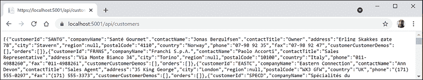
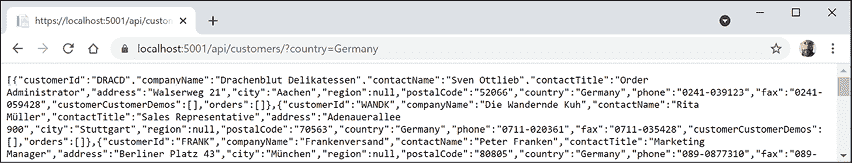
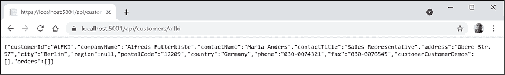
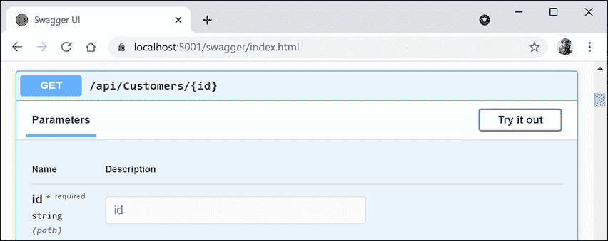
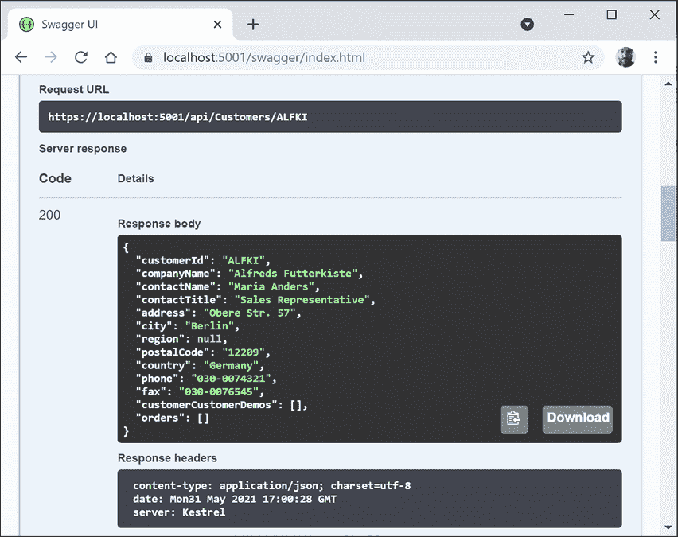
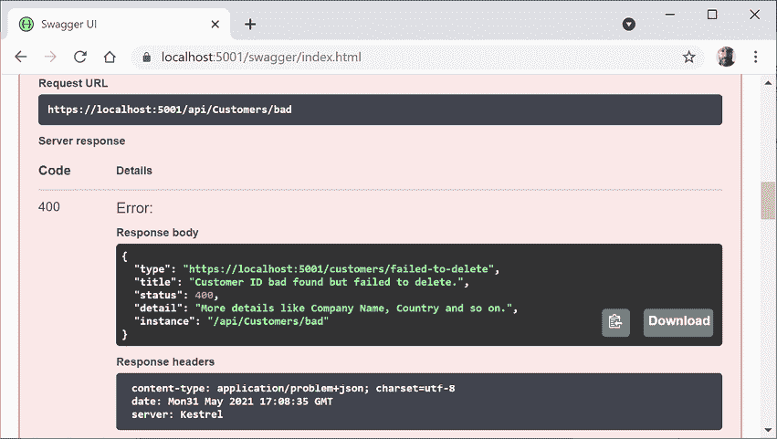
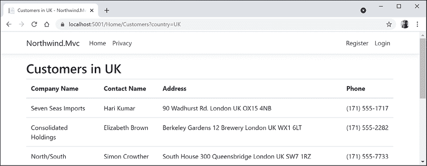
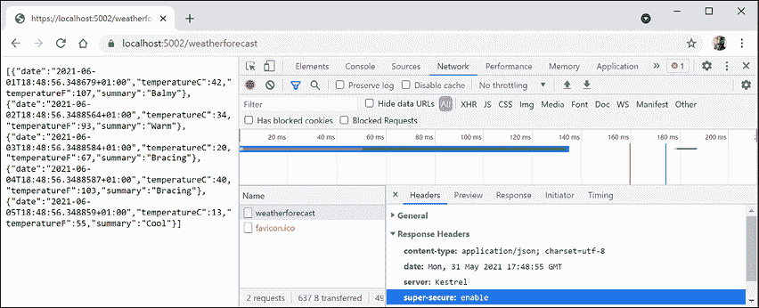

# 16

# 构建和使用 Web 服务

本章介绍如何使用 ASP.NET 核心 web API 构建 web 服务（也称为 HTTP 或 REST 服务），并使用 HTTP 客户端使用 web 服务，这些客户端可以是任何其他类型的.NET 应用程序，包括网站、移动或桌面应用程序。

本章需要您在*第 10 章*、*使用实体框架核心*和*第 13 章*至*15*中学习的关于 C#和.NET 的实际应用以及使用 ASP.NET 核心构建网站的知识和技能。**

在本章中，我们将介绍以下主题：

*   使用 ASP.NET 核心 web API 构建 web 服务
*   记录和测试 web 服务
*   使用 HTTP 客户端使用 web 服务
*   为 web 服务实现高级功能
*   使用最小 API 构建 web 服务

# 使用 ASP.NET 核心 web API 构建 web 服务

在我们构建一个现代 web 服务之前，我们需要介绍一些背景知识，为本章设置上下文。

## 理解 web 服务首字母缩略词

虽然 HTTP 最初设计为请求和响应 HTML 和其他供人类查看的资源，但它也适用于构建服务。

Roy Fielding 在他的博士论文中描述了**代表性状态转移**（**REST**）架构风格，指出HTTP 标准将适用于建筑服务，因为它定义了以下内容：

*   唯一标识资源的 URI，如`https://localhost:5001/api/products/23`。
*   方法在这些资源上执行常见任务，如`GET`、`POST`、`PUT`和`DELETE`。
*   协商请求和响应中交换内容的媒体类型的能力，如 XML 和 JSON。当客户端指定一个请求头（如`Accept: application/xml,*/*;q=0.8`）时，就会发生内容协商。ASP.NET 核心 Web API 使用的默认响应格式是 JSON，这意味着其中一个响应头将是`Content-Type: application/json; charset=utf-8`。

**Web 服务**使用 HTTP 通信标准，因此它们有时被称为 HTTP 或 RESTful 服务。HTTP 或 RESTful 服务是本章的主题。

Web 服务还可以表示实现一些**WS-*标准**的**简单对象访问协议**（**SOAP**服务）。这些标准允许在不同系统上实现的客户端和服务相互通信。WS-*标准最初由 IBM 根据其他公司（如 Microsoft）的输入定义。

### 了解 WINDOWS 通信基础（WCF）

.NETFramework 3 和以后包括一个 AutoT0A.远程过程调用 AUT1 T1（Po.T2E.RPC SoeT3），该技术名为 OutT4。Windows 通信基金会 Ty5 T5。RPC 技术允许一个系统上的代码通过网络在另一个系统上执行代码。

WCF 使开发人员能够轻松创建服务，包括实现 WS-*标准的 SOAP服务。后来，它还支持构建 Web/HTTP/REST 风格的服务，但如果这就是您所需要的，那么它的设计就过于复杂了。

如果您有现有的 WCF 服务并且希望将其移植到现代.NET，那么有一个开源项目在 2021 年 2 月发布了第一个**通用**（**GA**）。您可以通过以下链接阅读相关内容：

[https://corewcf.github.io/blog/2021/02/19/corewcf-ga-release](https://corewcf.github.io/blog/2021/02/19/corewcf-ga-release)

### WCF 的替代方案

微软推荐的 WCF 替代方案是**gRPC**。gRPC 是一个由 Google 创建的现代跨平台开源 RPC 框架（在 gRPC 中非正式地称为“g”）。您将在*第 18 章*、*建筑和消费专业服务*中了解更多关于 gRPC 的信息。

## 了解 Web API 的 HTTP 请求和响应

HTTP 定义了标准类型的请求和标准代码，以指示类型的响应。其中大多数可用于实现 Web API 服务。

最常见的请求类型是`GET`，用于检索由唯一路径标识的资源，具有可接受的媒体类型等附加选项，设置为请求头，如下例所示：

```cs
GET /path/to/resource
Accept: application/json 
```

常见的响应包括成功和多种类型的失败，如下表所示：

<colgroup><col> <col></colgroup> 
| 状态码 | 描述 |
| `200 OK` | 路径格式正确，资源已成功找到，序列化为可接受的媒体类型，然后在响应正文中返回。响应头指定了`Content-Type`、`Content-Length`和`Content-Encoding`，例如 GZIP。 |
| `301 Moved Permanently` | 随着时间的推移，web 服务可能会更改其资源模型，包括用于标识现有资源的路径。web 服务可以通过返回此状态代码和具有新路径的名为`Location`的响应头来指示新路径。 |
| `302 Found` | 类似于`301`。 |
| `304 Not Modified` | 如果请求包含`If-Modified-Since`头，那么 web 服务可以使用此状态代码进行响应。响应正文为空，因为客户端应使用其资源的缓存副本。 |
| `400 Bad Request` | 请求无效，例如，它使用了使用整数 ID 的产品的路径，但缺少 ID 值。 |
| `401 Unauthorized` | 请求有效，找到了资源，但客户端未提供凭据或无权访问该资源。重新认证可以启用访问，例如，通过添加或更改`Authorization`请求头。 |
| `403 Forbidden` | 请求有效，找到了资源，但客户端无权访问该资源。重新验证不会解决此问题。 |
| `404 Not Found` | 请求有效，但找不到资源。如果稍后重复请求，则可以找到资源。要指示永远找不到资源，请返回`410 Gone`。 |
| `406 Not Acceptable` | 如果请求具有仅列出 web 服务不支持的媒体类型的`Accept`头。例如，如果客户端请求 JSON，但 web 服务只能返回 XML。 |
| `451 Unavailable for Legal Reasons` | 在美国托管的网站可能会对来自欧洲的请求返回此信息，以避免遵守《通用数据保护条例》（GDPR）。这个数字被选为小说《华氏 451 度》的参考号，小说中的书籍被禁止和焚烧。 |
| `500 Server Error` | 请求是有效的，但在处理请求时服务器端出现了问题。稍后再重试可能有效。 |
| `503 Service Unavailable` | web 服务正忙，无法处理该请求。以后再试可能有用。 |

其他常见类型的 HTTP 请求包括创建、修改或删除资源的`POST`、`PUT`、`PATCH`或`DELETE`。

要创建一个新的资源，您可以使用包含新资源的主体发出`POST`请求，如下代码所示：

```cs
POST /path/to/resource
Content-Length: 123
Content-Type: application/json 
```

要创建新资源或更新现有资源，您可以使用包含现有资源的全新版本的正文发出`PUT`请求，如果该资源不存在，则创建该资源，如果确实存在，则替换该资源（有时称为**upsert**操作），如以下代码所示：

```cs
PUT /path/to/resource
Content-Length: 123
Content-Type: application/json 
```

为了更有效地更新现有资源，您可以使用只包含需要更改属性的对象的主体发出`PATCH`请求，如下代码所示：

```cs
PATCH /path/to/resource
Content-Length: 123
Content-Type: application/json 
```

要删除现有资源，您可以发出`DELETE`请求，如下代码所示：

```cs
DELETE /path/to/resource 
```

除了上表所示的`GET`请求响应外，创建、修改或删除资源的所有类型的请求都有其他可能的常见响应，如下表所示：

<colgroup><col> <col></colgroup> 
| 状态码 | 描述 |
| `201 Created` | 新资源创建成功，名为`Location`的响应头包含其路径，响应体包含新创建的资源。立即`GET`-资源应返回`200`。 |
| `202 Accepted` | 无法立即创建新资源，因此请求将排队等待后续处理，并立即`GET`-资源可能返回`404`。正文可以包含一个资源，该资源指向某种形式的状态检查器或资源何时可用的估计。 |
| `204 No Content` | 通常用于响应`DELETE`请求，因为删除后返回正文中的资源通常没有意义！有时用于响应`POST`、`PUT`或`PATCH`请求，如果客户不需要确认请求已正确处理。 |
| `405 Method Not Allowed` | 当请求使用不受支持的方法时返回。例如，设计为只读的 web 服务可能会明确禁止`PUT`、`DELETE`等。 |
| `415 Unsupported Media Type` | 当请求正文中的资源使用 web 服务无法处理的媒体类型时返回。例如，如果主体包含 XML 格式的资源，但 web 服务只能处理 JSON。 |

## 创建 ASP.NET 核心 Web API 项目

我们将构建一个 web 服务，提供一种使用 ASP.NET Core 处理 Northwind 数据库中数据的方法，以便数据可由任何平台上的任何客户端应用程序使用，该应用程序可发出 HTTP 请求并接收 HTTP 响应：

1.  使用首选的代码编辑器添加新项目，如下表所示：
    1.  项目模板：**ASP.NET 核心 Web API**/`webapi`
    2.  工作区/解决方案文件和文件夹：`PracticalApps`
    3.  项目文件和文件夹：`Northwind.WebApi`
    4.  Visual Studio 其他选项：**验证类型**：无，**配置 HTTPS**：选中，**启用 Docker**：清除，**启用****OpenAPI 支持**：选中。
2.  在 Visual Studio 代码中，选择`Northwind.WebApi`作为活动的 OmniSharp 项目。
3.  建设`Northwind.WebApi`项目。
4.  In the `Controllers` folder, open and review `WeatherForecastController.cs`, as shown in the following code:

    ```cs
    using Microsoft.AspNetCore.Mvc;
    namespace Northwind.WebApi.Controllers;
    [ApiController]
    [Route("[controller]")]
    public class WeatherForecastController : ControllerBase
    {
      private static readonly string[] Summaries = new[]
      {
        "Freezing", "Bracing", "Chilly", "Cool", "Mild",
        "Warm", "Balmy", "Hot", "Sweltering", "Scorching"
      };
      private readonly ILogger<WeatherForecastController> _logger;
      public WeatherForecastController(
        ILogger<WeatherForecastController> logger)
      {
        _logger = logger;
      }
      [HttpGet]
      public IEnumerable<WeatherForecast> Get()
      {
        return Enumerable.Range(1, 5).Select(index =>
          new WeatherForecast
          {
            Date = DateTime.Now.AddDays(index),
            TemperatureC = Random.Shared.Next(-20, 55),
            Summary = Summaries[Random.Shared.Next(Summaries.Length)]
          })
          .ToArray();
      }
    } 
    ```

    查看上述代码时，请注意以下事项：

    *   `Controller`类继承自`ControllerBase`。这比 MVC 中使用的`Controller`类更简单，因为它没有`View`这样的方法通过将视图模型传递给 Razor 文件来生成 HTML 响应。
    *   `[Route]`属性注册`/weatherforecast`相对 URL，供客户端用于发出 HTTP 请求，该请求将由该控制器处理。例如，`https://localhost:5001/weatherforecast/`的 HTTP 请求将由该控制器处理。一些开发人员喜欢在控制器名称前加上`api/`，这是一种约定，用于在混合项目中区分 MVC 和 Web API。如果您使用如图所示的`[controller]`，则在类名中使用`Controller`之前的字符，在本例中为`WeatherForecast`，或者您可以简单地输入一个不带方括号的不同名称，例如`[Route("api/forecast")]`。
    *   `[ApiController]`属性是在 ASP.NET Core 2.1 中引入的，它为控制器启用 REST 特定的行为，如对无效模型的自动 HTTP`400`响应，您将在本章后面看到。
    *   `[HttpGet]`属性注册`Controller`类中的`Get`方法来响应 HTTP`GET`请求，其实现使用共享的`Random`对象返回一个具有随机温度的`WeatherForecast`对象数组，以及未来五天天气的`Bracing`或`Balmy`摘要。
5.  添加第二个`Get`方法，该方法允许调用通过实现以下内容来指定预测应提前多少天：
    *   在原始方法上方添加注释，以显示其响应的操作方法和 URL 路径。
    *   添加一个名为`days`的整数参数的新方法。
    *   将原来的`Get`方法实现代码语句剪切粘贴到新的`Get`方法中。
    *   修改新方法，创建一个不超过请求天数的整数`IEnumerable`，修改原`Get`方法，调用新`Get`方法，传递值`5`。

您的方法应如以下代码中突出显示的那样：

```cs
**// GET /weatherforecast**
[HttpGet]
public IEnumerable<WeatherForecast> Get() **// original method**
{
  **return** **Get(****5****);** **// five day forecast**
}
**// GET /weatherforecast/7**
**[****HttpGet(****"{days:int}"****)****]**
**public** **IEnumerable<WeatherForecast>** **Get****(****int** **days****)** **// new method**
{
**return** **Enumerable.Range(****1****, days).Select(index =>**
    new WeatherForecast
    {
      Date = DateTime.Now.AddDays(index),
      TemperatureC = Random.Shared.Next(-20, 55),
      Summary = Summaries[Random.Shared.Next(Summaries.Length)]
    })
    .ToArray();
} 
```

在`[HttpGet]`属性中，注意将`days`参数约束为`int`值的路由格式模式`{days:int}`。

## 查看 web 服务的功能

现在，我们将测试 web 服务的功能：

1.  如果您使用的是 Visual Studio，请在**属性**中打开`launchSettings.json`文件，注意默认情况下，它将启动浏览器并导航到`/swagger`相对 URL 路径，如以下标记中突出显示的：

    ```cs
    "profiles": {
      "Northwind.WebApi": {
        "commandName": "Project",
        "dotnetRunMessages": "true",
    **"launchBrowser"****:** **true****,**
    **"launchUrl"****:** **"swagger"****,**
        "applicationUrl": "https://localhost:5001;http://localhost:5000",
        "environmentVariables": {
          "ASPNETCORE_ENVIRONMENT": "Development"
        }
      }, 
    ```

2.  修改名为`Northwind.WebApi`的配置文件，将`launchBrowser`设置为`false`。
3.  对于`applicationUrl`，将`HTTP`的随机端口号更改为`5000`，将`HTTPS`的随机端口号更改为`5001`。
4.  启动 web 服务项目。
5.  启动 Chrome。
6.  Navigate to `https://localhost:5001/` and note you will get a `404` status code response because we have not enabled static files and there is not an `index.html`, nor is there an MVC controller with a route configured, either. Remember that this project is not designed for a human to view and interact with, so this is expected behavior for a web service.

    GitHub 上的解决方案被配置为使用端口`5002`，因为我们将在本书后面更改其配置。

7.  在 Chrome 中，显示**开发者工具**。
8.  Navigate to `https://localhost:5001/weatherforecast` and note the Web API service should return a JSON document with five random weather forecast objects in an array, as shown in *Figure 16.1*:

    <figure class="mediaobject"></figure>

    图 16.1：来自天气预报 web 服务的请求和响应

9.  关闭**开发者工具**。
10.  Navigate to `https://localhost:5001/weatherforecast/14` and note the response when requesting a two-week weather forecast, as shown in *Figure 16.2*:

    <figure class="mediaobject"></figure>

    图 16.2：作为 JSON 文档的两周天气预报

11.  关闭 Chrome 并关闭 web 服务器。

## 为 Northwind 数据库创建 web 服务

与 MVC 控制器不同，Web API 控制器不调用 Razor 视图来返回 HTML 响应，供网站访问者在浏览器中查看。相反，他们使用内容与发出 HTTP 请求的客户端应用程序协商，以返回 HTTP 响应中编码的 XML、JSON 或 X-WWW-FORM-Url 等格式的数据。

然后，客户端应用程序必须反序列化协商格式中的数据。现代 web 服务最常用的格式是**JavaScript 对象表示法**（**JSON**），因为它紧凑，在使用客户端技术构建**单页应用程序**（**SPAs**）时与浏览器中的 JavaScript 本机协同工作，做出反应，然后 Vue。

我们将参考您在*第 13 章*中创建的北风数据库的实体框架核心实体数据模型，*介绍 C#和.NET*的实际应用：

1.  在`Northwind.WebApi`项目中，为 SQLite 或 SQL Server 添加对`Northwind.Common.DataContext`的项目引用，如以下标记所示：

    ```cs
    <ItemGroup>
      <!-- change Sqlite to SqlServer if you prefer -->
      <ProjectReference Include=
    "..\Northwind.Common.DataContext.Sqlite\Northwind.Common.DataContext.Sqlite.csproj" />
    </ItemGroup> 
    ```

2.  构建项目并修复代码中的任何编译错误。
3.  打开`Program.cs`并导入名称空间以使用 web 媒体格式化程序和共享 Packt 类，如下代码所示：

    ```cs
    using Microsoft.AspNetCore.Mvc.Formatters;
    using Packt.Shared; // AddNorthwindContext extension method
    using static System.Console; 
    ```

4.  在调用`AddControllers`之前添加一条语句来注册`Northwind`数据库上下文类（它将使用 SQLite 或 SQL Server，具体取决于您在项目文件中引用的数据库提供程序），如下代码所示：

    ```cs
    // Add services to the container.
    builder.Services.AddNorthwindContext(); 
    ```

5.  在对`AddControllers`的调用中，添加一个 lambda 块和语句，将默认输出格式化程序的名称和支持的媒体类型写入控制台，然后添加 XML 序列化程序格式化程序，如下代码所示：

    ```cs
    builder.Services.AddControllers(options =>
    {
      WriteLine("Default output formatters:");
      foreach (IOutputFormatter formatter in options.OutputFormatters)
      {
        OutputFormatter? mediaFormatter = formatter as OutputFormatter;
        if (mediaFormatter == null)
        {
          WriteLine($"  {formatter.GetType().Name}");
        }
        else // OutputFormatter class has SupportedMediaTypes
        {
          WriteLine("  {0}, Media types: {1}",
            arg0: mediaFormatter.GetType().Name,
            arg1: string.Join(", ",
              mediaFormatter.SupportedMediaTypes));
        }
      }
    })
    .AddXmlDataContractSerializerFormatters()
    .AddXmlSerializerFormatters(); 
    ```

6.  启动 web 服务。
7.  在命令提示符或终端中，请注意有四个默认输出格式化程序，包括将`null`值转换为`204 No Content`的格式化程序和支持纯文本、字节流和 JSON 响应的格式化程序，如下输出所示：

    ```cs
    Default output formatters: 
      HttpNoContentOutputFormatter
      StringOutputFormatter, Media types: text/plain
      StreamOutputFormatter
      SystemTextJsonOutputFormatter, Media types: application/json, text/json, application/*+json 
    ```

8.  关闭 web 服务器。

## 为实体创建数据存储库

定义并实现一个数据存储库以提供 CRUD 操作是一个良好的实践。CRUD 首字母缩略词包括以下操作：

*   C 代表创建
*   R 用于检索（或读取）
*   U 更新
*   D 表示删除

我们将为 Northwind 中的`Customers`表创建一个数据存储库。此表中只有 91 个客户，因此我们将在内存中存储整个表的副本，以提高读取客户记录时的可扩展性和性能。

**良好实践**：在真正的 web 服务中，您应该使用分布式缓存，如 Redis，一种开源数据结构存储，可以用作高性能、高可用性数据库、缓存或消息代理。

我们将遵循现代良好实践，使存储库 API 异步。它将由`Controller`类使用构造函数参数注入进行实例化，因此会创建一个新实例来处理每个 HTTP 请求：

1.  在`Northwind.WebApi`项目中，创建一个名为`Repositories`的文件夹。
2.  将两个类文件添加到名为`ICustomerRepository.cs`和`CustomerRepository.cs`的`Repositories`文件夹中。
3.  `ICustomerRepository`接口将定义五种方法，如下代码所示：

    ```cs
    using Packt.Shared; // Customer
    namespace Northwind.WebApi.Repositories;
    public interface ICustomerRepository
    {
      Task<Customer?> CreateAsync(Customer c);
      Task<IEnumerable<Customer>> RetrieveAllAsync();
      Task<Customer?> RetrieveAsync(string id);
      Task<Customer?> UpdateAsync(string id, Customer c);
      Task<bool?> DeleteAsync(string id);
    } 
    ```

4.  `CustomerRepository`类将实现这五个方法，记住在它们内部使用`await`的方法必须标记为`async`，如下代码所示：

    ```cs
    using Microsoft.EntityFrameworkCore.ChangeTracking; // EntityEntry<T>
    using Packt.Shared; // Customer
    using System.Collections.Concurrent; // ConcurrentDictionary
    namespace Northwind.WebApi.Repositories;
    public class CustomerRepository : ICustomerRepository
    {
      // use a static thread-safe dictionary field to cache the customers
      private static ConcurrentDictionary
        <string, Customer>? customersCache;
      // use an instance data context field because it should not be
      // cached due to their internal caching
      private NorthwindContext db;
      public CustomerRepository(NorthwindContext injectedContext)
      {
        db = injectedContext;
        // pre-load customers from database as a normal
        // Dictionary with CustomerId as the key,
        // then convert to a thread-safe ConcurrentDictionary
        if (customersCache is null)
        {
          customersCache = new ConcurrentDictionary<string, Customer>(
            db.Customers.ToDictionary(c => c.CustomerId));
        }
      }
      public async Task<Customer?> CreateAsync(Customer c)
      {
        // normalize CustomerId into uppercase
        c.CustomerId = c.CustomerId.ToUpper();
        // add to database using EF Core
        EntityEntry<Customer> added = await db.Customers.AddAsync(c);
        int affected = await db.SaveChangesAsync();
        if (affected == 1)
        {
          if (customersCache is null) return c;
          // if the customer is new, add it to cache, else
          // call UpdateCache method
          return customersCache.AddOrUpdate(c.CustomerId, c, UpdateCache);
        }
        else
        {
          return null;
        }
      }
      public Task<IEnumerable<Customer>> RetrieveAllAsync()
      {
        // for performance, get from cache
        return Task.FromResult(customersCache is null 
            ? Enumerable.Empty<Customer>() : customersCache.Values);
      }
      public Task<Customer?> RetrieveAsync(string id)
      {
        // for performance, get from cache
        id = id.ToUpper();
        if (customersCache is null) return null!;
        customersCache.TryGetValue(id, out Customer? c);
        return Task.FromResult(c);
      }
      private Customer UpdateCache(string id, Customer c)
      {
        Customer? old;
        if (customersCache is not null)
        {
          if (customersCache.TryGetValue(id, out old))
          {
            if (customersCache.TryUpdate(id, c, old))
            {
              return c;
            }
          }
        }
        return null!;
      }
      public async Task<Customer?> UpdateAsync(string id, Customer c)
      {
        // normalize customer Id
        id = id.ToUpper();
        c.CustomerId = c.CustomerId.ToUpper();
        // update in database
        db.Customers.Update(c);
        int affected = await db.SaveChangesAsync();
        if (affected == 1)
        {
          // update in cache
          return UpdateCache(id, c);
        }
        return null;
      }
      public async Task<bool?> DeleteAsync(string id)
      {
        id = id.ToUpper();
        // remove from database
        Customer? c = db.Customers.Find(id);
        if (c is null) return null;
        db.Customers.Remove(c);
        int affected = await db.SaveChangesAsync();
        if (affected == 1)
        {
          if (customersCache is null) return null;
          // remove from cache
          return customersCache.TryRemove(id, out c);
        }
        else
        {
          return null;
        }
      }
    } 
    ```

## 实现 webapi 控制器

有一些有用的属性和方法用于实现返回数据而不是 HTML 的控制器。

对于 MVC 控制器，类似于`/home/index`的路由告诉我们控制器类名称和动作方法名称，例如`HomeController`类和`Index`动作方法。

对于 Web API 控制器，类似于`/weatherforecast`的路由只告诉我们控制器类名，例如`WeatherForecastController`。要确定要执行的操作方法名称，我们必须将 HTTP 方法（如`GET`和`POST`映射到控制器类中的方法。

您应该使用以下属性装饰控制器方法，以指示它们将响应的 HTTP 方法：

*   `[HttpGet]`、`[HttpHead]`：这些操作方法响应`GET`或`HEAD`请求，以检索资源并返回资源及其响应头或仅返回响应头。
*   `[HttpPost]`：此操作方法响应`POST`创建新资源或执行服务定义的其他操作的请求。
*   `[HttpPut]`、`[HttpPatch]`：这些操作方法通过替换现有资源或更新其属性的子集来响应`PUT`或`PATCH`更新现有资源的请求。
*   `[HttpDelete]`：此动作方法响应`DELETE`删除资源的请求。
*   `[HttpOptions]`：此动作方法响应`OPTIONS`请求。

### 理解操作方法返回类型

action 方法可以返回.NET 类型，如单个`string`值、由`class`、`record`或`struct`定义的复杂对象或复杂对象集合。如果注册了合适的序列化程序，ASP.NET 核心 Web API 将它们序列化为 HTTP 请求`Accept`头中设置的请求数据格式，例如 JSON。

为了更好地控制响应，有一些助手方法在.NET 类型周围返回一个`ActionResult`包装器。

如果操作方法可以基于输入或其他变量返回不同的返回类型，则将其返回类型声明为`IActionResult`。如果操作方法只返回一个类型，但状态码不同，则将其返回类型声明为`ActionResult<T>`。

**良好实践**：用`[ProducesResponseType]`属性修饰动作方法，以指示客户端在响应中应该期望的所有已知类型和 HTTP 状态代码。然后可以公开这些信息，以记录客户机应该如何与您的 web 服务交互。将其视为正式文档的一部分。在本章后面，您将学习如何安装代码分析器，以便在您没有像这样装饰您的操作方法时向您发出警告。

例如，一个基于 id 参数获取产品的操作方法将被修饰为三个属性——一个表示它响应`GET`请求并具有 id 参数，两个表示它成功时以及客户端提供无效产品 id 时会发生什么，如以下代码所示：

```cs
[HttpGet("{id}")]
[ProducesResponseType(200, Type = typeof(Product))] 
[ProducesResponseType(404)]
public IActionResult Get(string id) 
```

`ControllerBase`类提供了一些方法，可以方便地返回不同的响应，如下表所示：

<colgroup><col> <col></colgroup> 
| 方法 | 描述 |
| `Ok` | 返回一个`200`状态代码和一个转换为客户端首选格式的资源，如 JSON 或 XML。通常用于响应`GET`请求。 |
| `CreatedAtRoute` | 返回`201`状态代码和新资源的路径。通常用于响应`POST`请求，以创建可快速执行的资源。 |
| `Accepted` | 返回一个`202`状态代码，指示请求正在处理中但尚未完成。通常用于响应`POST`、`PUT`、`PATCH`或`DELETE`请求，该请求会触发需要很长时间才能完成的后台进程。 |
| `NoContentResult` | 返回一个`204`状态代码和一个空的响应正文。当响应不需要包含受影响的资源时，通常用于响应`PUT`、`PATCH`或`DELETE`请求。 |
| `BadRequest` | 返回一个`400`状态代码和一个可选消息字符串，其中包含更多详细信息。 |
| `NotFound` | 返回一个`404`状态代码和一个自动填充的`ProblemDetails`正文（需要兼容版本 2.2 或更高版本）。 |

## 配置客户存储库和 Web API 控制器

现在，您将配置存储库，以便可以从 Web API 控制器中调用它。

当 web 服务启动时，您将为存储库注册一个作用域依赖项服务实现，然后使用构造函数参数注入将其放入一个新的 web API 控制器中，以便与客户一起工作。

为了展示使用路由区分 MVC 和 Web API 控制器的示例，我们将使用客户控制器的通用`/api`URL 前缀约定：

1.  打开`Program.cs`并导入`Northwind.WebApi.Repositories`名称空间。
2.  Add a statement before the call to the `Build` method, which will register the `CustomerRepository` for use at runtime as a scoped dependency, as shown highlighted in the following code:

    ```cs
    **builder.Services.AddScoped<ICustomerRepository, CustomerRepository>();**
    var app = builder.Build(); 
    ```

    **良好实践**：我们的存储库使用注册为作用域依赖项的数据库上下文。您只能在其他作用域依赖项中使用作用域依赖项，因此我们无法将存储库注册为单例。您可以通过以下链接了解更多信息：[https://docs.microsoft.com/en-us/dotnet/core/extensions/dependency-injection#scoped](https://docs.microsoft.com/en-us/dotnet/core/extensions/dependency-injection#scoped)

3.  在`Controllers`文件夹中，添加一个名为`CustomersController.cs`的新类。
4.  在`CustomersController`类文件中，添加语句定义一个 Web API 控制器类与客户一起工作，如下代码所示：

    ```cs
    using Microsoft.AspNetCore.Mvc; // [Route], [ApiController], ControllerBase
    using Packt.Shared; // Customer
    using Northwind.WebApi.Repositories; // ICustomerRepository
    namespace Northwind.WebApi.Controllers;
    // base address: api/customers
    [Route("api/[controller]")]
    [ApiController]
    public class CustomersController : ControllerBase
    {
      private readonly ICustomerRepository repo;
      // constructor injects repository registered in Startup
      public CustomersController(ICustomerRepository repo)
      {
        this.repo = repo;
      }
      // GET: api/customers
      // GET: api/customers/?country=[country]
      // this will always return a list of customers (but it might be empty)
      [HttpGet]
      [ProducesResponseType(200, Type = typeof(IEnumerable<Customer>))]
      public async Task<IEnumerable<Customer>> GetCustomers(string? country)
      {
        if (string.IsNullOrWhiteSpace(country))
        {
          return await repo.RetrieveAllAsync();
        }
        else
        {
          return (await repo.RetrieveAllAsync())
            .Where(customer => customer.Country == country);
        }
      }
      // GET: api/customers/[id]
      [HttpGet("{id}", Name = nameof(GetCustomer))] // named route
      [ProducesResponseType(200, Type = typeof(Customer))]
      [ProducesResponseType(404)]
      public async Task<IActionResult> GetCustomer(string id)
      {
        Customer? c = await repo.RetrieveAsync(id);
        if (c == null)
        {
          return NotFound(); // 404 Resource not found
        }
        return Ok(c); // 200 OK with customer in body
      }
      // POST: api/customers
      // BODY: Customer (JSON, XML)
      [HttpPost]
      [ProducesResponseType(201, Type = typeof(Customer))]
      [ProducesResponseType(400)]
      public async Task<IActionResult> Create([FromBody] Customer c)
      {
        if (c == null)
        {
          return BadRequest(); // 400 Bad request
        }
        Customer? addedCustomer = await repo.CreateAsync(c);
        if (addedCustomer == null)
        {
          return BadRequest("Repository failed to create customer.");
        }
        else
        {
          return CreatedAtRoute( // 201 Created
            routeName: nameof(GetCustomer),
            routeValues: new { id = addedCustomer.CustomerId.ToLower() },
            value: addedCustomer);
        }
      }
      // PUT: api/customers/[id]
      // BODY: Customer (JSON, XML)
      [HttpPut("{id}")]
      [ProducesResponseType(204)]
      [ProducesResponseType(400)]
      [ProducesResponseType(404)]
      public async Task<IActionResult> Update(
        string id, [FromBody] Customer c)
      {
        id = id.ToUpper();
        c.CustomerId = c.CustomerId.ToUpper();
        if (c == null || c.CustomerId != id)
        {
          return BadRequest(); // 400 Bad request
        }
        Customer? existing = await repo.RetrieveAsync(id);
        if (existing == null)
        {
          return NotFound(); // 404 Resource not found
        }
        await repo.UpdateAsync(id, c);
        return new NoContentResult(); // 204 No content
      }
      // DELETE: api/customers/[id]
      [HttpDelete("{id}")]
      [ProducesResponseType(204)]
      [ProducesResponseType(400)]
      [ProducesResponseType(404)]
      public async Task<IActionResult> Delete(string id)
      {
        Customer? existing = await repo.RetrieveAsync(id);
        if (existing == null)
        {
          return NotFound(); // 404 Resource not found
        }
        bool? deleted = await repo.DeleteAsync(id);
        if (deleted.HasValue && deleted.Value) // short circuit AND
        {
          return new NoContentResult(); // 204 No content
        }
        else
        {
          return BadRequest( // 400 Bad request
            $"Customer {id} was found but failed to delete.");
        }
      }
    } 
    ```

查看此 Web API 控制器类时，请注意以下事项：

*   `Controller`类注册了一条以`api/`开头并包含控制器名称的路由，即`api/customers`。
*   构造函数使用依赖注入来获取注册的存储库，以便与客户合作。
*   对客户执行 CRUD 操作有五种操作方法：两种`GET`方法（针对所有客户或一个客户）、`POST`（创建）、`PUT`（更新）和`DELETE`。
*   `GetCustomers`方法可以将`string`参数与国家名称一起传递。如果丢失，则返回所有客户。如果存在，则用于按国家筛选客户。
*   `GetCustomer`方法有一个显式命名为`GetCustomer`的路由，因此可以在插入新客户后使用它生成 URL。
*   `Create`和`Update`方法都用`[FromBody]`装饰`customer`参数，告诉模型绑定器用`POST`请求主体中的值填充它。
*   `Create`方法返回一个使用`GetCustomer`路由的响应，以便客户端知道将来如何获取新创建的资源。我们正在匹配两种方法来创建并获得客户。
*   `Create`和`Update`方法不需要检查 HTTP 请求主体中传递的客户的模型状态，如果由于控制器用`[ApiController]`修饰而无效，则返回一个包含模型验证错误详细信息的`400 Bad Request`，这是为您做的。

当服务接收到 HTTP 请求时，它将创建`Controller`类的实例，调用适当的操作方法，以客户端首选的格式返回响应，并释放控制器使用的资源，包括存储库及其数据上下文。

## 指定问题详细信息

ASP.NET Core 2.1 及更高版本中添加的功能是用于指定问题详细信息的 web 标准的实现。

在启用 ASP.NET Core 2.2 或更高版本兼容性的项目中，在以`[ApiController]`装饰的 Web API 控制器中，返回`IActionResult`并返回客户端错误状态代码（即`4xx`的操作方法将自动在响应体中包含`ProblemDetails`类的序列化实例。

如果您想要控制，那么您可以自己创建一个`ProblemDetails`实例并包含其他信息。

让我们模拟一个需要将自定义数据返回到客户端的错误请求：

1.  在`Delete`方法实现的顶部，添加语句检查`id`是否与文字字符串值`"bad"`匹配，如果匹配，则返回一个自定义的问题细节对象，如下代码所示：

    ```cs
    // take control of problem details
    if (id == "bad")
    {
      ProblemDetails problemDetails = new()
      {
        Status = StatusCodes.Status400BadRequest,
        Type = "https://localhost:5001/customers/failed-to-delete",
        Title = $"Customer ID {id} found but failed to delete.",
        Detail = "More details like Company Name, Country and so on.",
        Instance = HttpContext.Request.Path
      };
      return BadRequest(problemDetails); // 400 Bad Request
    } 
    ```

2.  稍后将测试此功能。

## 控制 XML 序列化

在`Program.cs`中，我们添加了`XmlSerializer`，以便我们的 Web API 服务可以在客户端请求时返回 XML 和 JSON。

但是，`XmlSerializer`不能序列化接口，我们的实体类使用`ICollection<T>`定义相关的子实体。例如，这会在运行时对`Customer`类及其`Orders`属性发出警告，如下输出所示：

```cs
warn: Microsoft.AspNetCore.Mvc.Formatters.XmlSerializerOutputFormatter[1]
An error occurred while trying to create an XmlSerializer for the type 'Packt.Shared.Customer'.
System.InvalidOperationException: There was an error reflecting type 'Packt.Shared.Customer'.
---> System.InvalidOperationException: Cannot serialize member 'Packt.
Shared.Customer.Orders' of type 'System.Collections.Generic.ICollection`1[[Packt. Shared.Order, Northwind.Common.EntityModels, Version=1.0.0.0, Culture=neutral, PublicKeyToken=null]]', see inner exception for more details. 
```

在将`Customer`序列化为 XML 时，我们可以通过排除`Orders`属性来防止此警告：

1.  在`Northwind.Common.EntityModels.Sqlite`和`Northwind.Common.EntityModels.SqlServer`项目中，打开`Customers.cs`。
2.  导入`System.Xml.Serialization`名称空间，以便我们可以使用`[XmlIgnore]`属性。
3.  用一个属性装饰`Orders`属性，在序列化时忽略它，如下面代码中突出显示的：

    ```cs
    [InverseProperty(nameof(Order.Customer))]
    **[****XmlIgnore****]**
    public virtual ICollection<Order> Orders { get; set; } 
    ```

4.  在`Northwind.Common.EntityModels.SqlServer`项目中，也用`[XmlIgnore]`装饰`CustomerCustomerDemos`物业。

# 记录和测试 web 服务

通过使用浏览器发出 HTTP`GET`请求，您可以轻松测试 web 服务。为了测试其他HTTP 方法，我们需要一个更高级的工具。

## 使用浏览器测试 GET 请求

您将使用 Chrome 对`GET`请求的三种实现进行测试—针对所有客户、特定国家/地区的客户以及使用其唯一客户 ID 的单个客户：

1.  启动`Northwind.WebApi`web 服务。
2.  启动 Chrome。
3.  Navigate to `https://localhost:5001/api/customers` and note the JSON document returned, containing all 91 customers in the Northwind database (unsorted), as shown in *Figure 16.3*:

    <figure class="mediaobject"></figure>

    图 16.3:Northwind 数据库中作为 JSON 文档的客户

4.  Navigate to `https://localhost:5001/api/customers/?country=Germany` and note the JSON document returned, containing only the customers in Germany, as shown in *Figure 16.4*:

    <figure class="mediaobject"></figure>

    图 16.4：作为 JSON 文档的德国客户列表

    如果返回的是空数组，请确保使用正确的大小写输入了国家名称，因为数据库查询区分大小写。例如，比较`uk`和`UK`的结果。

5.  Navigate to `https://localhost:5001/api/customers/alfki` and note the JSON document returned containing only the customer named **Alfreds Futterkiste**, as shown in *Figure 16.5*:

    <figure class="mediaobject"></figure>

    图 16.5：作为 JSON 文档的特定客户信息

与国家名称不同，我们不需要担心客户`id`值的大小写，因为在控制器类中，我们将`string`值规范化为代码中的大写。

但是我们如何测试其他 HTTP 方法，例如`POST`、`PUT`和`DELETE`？我们如何记录我们的 web 服务，以便任何人都能轻松理解如何与之交互？

为了解决第一个问题，我们可以安装一个名为**REST 客户端**的 Visual Studio 代码扩展。为了解决第二个问题，我们可以使用世界上最流行的记录和测试 HTTP API 的技术**Swagger**。但是首先，让我们看看 VisualStudio 代码扩展有什么可能。

有许多用于测试 Web API 的工具，例如，**邮递员**。虽然邮递员很受欢迎，但我更喜欢**REST 客户端**，因为它不会隐藏实际发生的事情。我觉得邮递员太贵了。但我鼓励你探索不同的工具，找到适合你风格的工具。您可以通过以下链接了解更多关于邮递员的信息：[https://www.postman.com/](https://www.postman.com/)

## 使用 REST 客户端扩展测试 HTTP 请求

REST 客户端是一个扩展，允许您发送任何类型的 HTTP 请求，并在Visual Studio 代码中查看响应。即使您喜欢使用 Visual Studio 作为代码编辑器，安装 Visual Studio 代码以使用 REST 客户端之类的扩展也是很有用的。

### 使用 REST 客户端发出 GET 请求

我们将首先创建一个用于测试`GET`请求的文件：

1.  如果您有尚未安装华超茂（`humao.rest-client`的 REST 客户端，请立即在 Visual Studio 代码中安装。
2.  在您首选的代码编辑器中，启动`Northwind.WebApi`项目 web 服务。
3.  在 Visual Studio 代码中，在`PracticalApps`文件夹中创建一个`RestClientTests`文件夹，然后打开该文件夹。
4.  在`RestClientTests`文件夹中，创建一个名为`get-customers.http`的文件，并修改其内容，以包含一个 HTTP`GET`请求来检索所有客户，如下代码所示：

    ```cs
    GET https://localhost:5001/api/customers/ HTTP/1.1 
    ```

5.  In Visual Studio Code, navigate to **View** | **Command Palette**, enter `rest client`, select the command **Rest Client: Send Request**, and press Enter, as shown in *Figure 16.6*:

    <figure class="mediaobject"></figure>

    图 16.6：使用 REST 客户端发送 HTTP GET 请求

6.  注意**响应**垂直显示在一个新的选项卡式窗格中，您可以通过拖放选项卡将打开的选项卡重新排列为水平布局。
7.  输入更多的`GET`请求，每个请求由三个散列符号分隔，以测试在不同国家/地区获取客户以及使用其 ID 获取单个客户，如以下代码所示：

    ```cs
    ###
    GET https://localhost:5001/api/customers/?country=Germany HTTP/1.1 
    ###
    GET https://localhost:5001/api/customers/?country=USA HTTP/1.1 
    Accept: application/xml
    ###
    GET https://localhost:5001/api/customers/ALFKI HTTP/1.1 
    ###
    GET https://localhost:5001/api/customers/abcxy HTTP/1.1 
    ```

8.  点击每个请求上方的**发送请求**链接进行发送；以为例，`GET`有一个请求头，以 XML 而不是 JSON 的形式请求美国客户，如*图 16.7*所示：

    <figure class="mediaobject"></figure>

图 16.7：使用 REST 客户端发送 XML 请求并获得响应

### 使用 REST 客户端发出其他请求

接下来，我们将创建一个文件，用于测试其他请求，如`POST`：

1.  在`RestClientTests`文件夹中，创建一个名为`create-customer.http`的文件，并将其内容修改为定义一个`POST`请求以创建一个新的客户，注意 REST 客户端将在您键入常见 HTTP 请求时提供 IntelliSense，如下代码所示：

    ```cs
    POST https://localhost:5001/api/customers/ HTTP/1.1 
    Content-Type: application/json
    Content-Length: 301
    {
      "customerID": "ABCXY",
      "companyName": "ABC Corp",
      "contactName": "John Smith",
      "contactTitle": "Sir",
      "address": "Main Street",
      "city": "New York",
      "region": "NY",
      "postalCode": "90210",
      "country":  "USA",
      "phone": "(123) 555-1234",
      "fax": null,
      "orders": null
    } 
    ```

2.  Due to different line endings in different operating systems, the value for the `Content-Length` header will be different on Windows and macOS or Linux. If the value is wrong, then the request will fail. To discover the correct content length, select the body of the request and then look in the status bar for the number of characters, as shown in *Figure 16.8*:

    <figure class="mediaobject"></figure>

    图 16.8：检查正确的内容长度

3.  发送请求并注意响应为`201 Created`。还要注意新创建的客户的位置（即 URL）为`https://localhost:5001/api/Customers/abcxy`，并且在响应体中包含新创建的客户，如*图 16.9*：

    <figure class="mediaobject"></figure>

    所示

图 16.9：添加新客户

我将留给您一个可选挑战，创建 REST 客户机文件，测试更新客户（使用`PUT`）和删除客户（使用`DELETE`）。对确实存在的客户和不存在的客户进行测试。本书的 GitHub 存储库中提供了解决方案。

现在，我们已经看到了一种快速简便的方法来测试我们的服务，这也是学习 HTTP 的好方法，那么外部开发人员呢？我们希望让他们尽可能容易地学习，然后致电我们的服务。为此，我们将大摇大摆。

## 理解虚张声势

Swagger 最重要的部分是**OpenAPI 规范**，它为您的 API 定义了一个 REST 风格的契约，以人机可读的格式详细说明了的所有资源和操作，以便于开发、发现和集成。

开发人员可以使用 Web API 的 OpenAPI 规范，以其首选语言或库自动生成强类型客户端代码。

对我们来说，另一个有用的特性是**招摇过市 UI**，因为它会自动为您的 API 生成文档，并具有内置的可视化测试功能。

让我们回顾一下如何使用`Swashbuckle`包为我们的 web 服务启用 Swagger：

1.  如果 web 服务正在运行，请关闭 web 服务器。
2.  打开`Northwind.WebApi.csproj`并注意`Swashbuckle.AspNetCore`的包装参考，如以下标记所示：

    ```cs
    <ItemGroup>
      <PackageReference Include="Swashbuckle.AspNetCore" Version="6.1.5" />
    </ItemGroup> 
    ```

3.  将`Swashbuckle.AspNetCore`包的版本更新为最新版本，例如，在 2021 年 9 月撰写本文时，它是`6.2.1`。
4.  在`Program.cs`中，注意微软 OpenAPI 模型名称空间的导入，如下代码所示：

    ```cs
    using Microsoft.OpenApi.Models; 
    ```

5.  导入 Swashback 的 SwaggerUI 命名空间，如下代码所示：

    ```cs
    using Swashbuckle.AspNetCore.SwaggerUI; // SubmitMethod 
    ```

6.  大约在`Program.cs`的一半，注意添加招摇支持的声明，包括 Northwind 服务的文档，表明这是您服务的第一个版本，并更改标题，如以下代码中突出显示的：

    ```cs
    builder.Services.AddSwaggerGen(c =>
      {
        c.SwaggerDoc("v1", new()
          { Title = "**Northwind Service API**", Version = "v1" });
      }); 
    ```

7.  在配置 HTTP 请求管道的部分中，请注意在开发模式下使用 Swagger 和 Swagger UI 的语句，并为 OpenAPI 规范 JSON 文档定义端点。
8.  添加代码以明确列出我们希望在 web 服务中支持的 HTTP 方法，并更改端点名称，如以下代码中突出显示的：

    ```cs
    var app = builder.Build();
    // Configure the HTTP request pipeline.
    if (builder.Environment.IsDevelopment())
    {
      app.UseSwagger(); 
      app.UseSwaggerUI(c =>
     **{**
     **c.SwaggerEndpoint(****"/swagger/v1/swagger.json"****,**
    **"Northwind Service API Version 1"****);**
     **c.SupportedSubmitMethods(****new****[] {** 
     **SubmitMethod.Get, SubmitMethod.Post,**
     **SubmitMethod.Put, SubmitMethod.Delete });**
     **});**
    } 
    ```

## 使用 Swagger UI 测试请求

现在，您可以使用 Swagger 测试 HTTP 请求了：

1.  启动`Northwind.WebApi`web 服务。
2.  在 Chrome 中，导航到`https://localhost:5001/swagger/`并注意**客户**和**天气预报**Web API控制器以及 API 使用的**模式**都已被发现和记录。
3.  Click **GET /api/Customers/{id}** to expand that endpoint and note the required parameter for the **id** of a customer, as shown in *Figure 16.10*:

    <figure class="mediaobject"></figure>

    图 16.10：检查 Swagger 中 GET 请求的参数

4.  Click **Try it out**, enter an **id** of `ALFKI`, and then click the wide blue **Execute** button, as shown in *Figure 16.11*:

    <figure class="mediaobject"></figure>

    图 16.11：点击执行按钮前输入客户 id

5.  Scroll down and note the **Request URL**, **Server response** with **Code**, and **Details** including **Response body** and **Response headers**, as shown in *Figure 16.12*:

    <figure class="mediaobject"></figure>

    图 16.12：成功招摇过市请求中的 ALFKI 信息

6.  向上滚动至页面顶部，点击**POST/api/Customers**展开该部分，然后点击**试用**。
7.  点击**请求主体**框内，修改 JSON 定义新客户，如下 JSON 所示：

    ```cs
    {
      "customerID": "SUPER",
      "companyName": "Super Company",
      "contactName": "Rasmus Ibensen",
      "contactTitle": "Sales Leader",
      "address": "Rotterslef 23",
      "city": "Billund",
      "region": null,
      "postalCode": "4371",
      "country": "Denmark",
      "phone": "31 21 43 21",
      "fax": "31 21 43 22"
    } 
    ```

8.  Click **Execute**, and note the **Request URL**, **Server response** with **Code**, and **Details** including **Response body** and **Response headers**, noting that a response code of `201` means the customer was successfully created, as shown in *Figure 16.13*:

    <figure class="mediaobject"></figure>

    图 16.13：成功添加新客户

9.  Scroll back up to the top of the page, click **GET /api/Customers**, click **Try it out**, enter `Denmark` for the country parameter, and click **Execute**, to confirm that the new customer was added to the database, as shown in *Figure 16.14*:

    <figure class="mediaobject"></figure>

    图 16.14：在丹麦成功获得客户，包括新添加的客户

10.  Click **DELETE /api/Customers/{id}**, click **Try it out**, enter `super` for the **id**, click **Execute**, and note that the **Server response Code** is `204`, indicating that it was successfully deleted, as shown in *Figure 16.15*:

    <figure class="mediaobject"></figure>

    图 16.15：成功删除客户

11.  Click **Execute** again, and note that the **Server response Code** is `404`, indicating that the customer does not exist anymore, and the **Response body** contains a problem details JSON document, as shown in *Figure 16.16*:

    <figure class="mediaobject"></figure>

    图 16.16：删除的客户不再存在

12.  Enter `bad` for the **id**, click **Execute** again, and note that the **Server response Code** is `400`, indicating that the customer did exist but failed to be deleted (in this case, because the web service is simulating this error), and the **Response body** contains a custom problem details JSON document, as shown in *Figure 16.17*:

    <figure class="mediaobject"></figure>

    图 16.17：客户确实存在，但未能删除

13.  Use the `GET` methods to confirm that the new customer has been deleted from the database (there were originally only two customers in Denmark).

    我将通过使用`PUT`将测试更新留给现有客户给读者。

14.  关闭 Chrome 并关闭 web 服务器。

## 启用 HTTP 日志记录

HTTP 日志记录是可选的中间件组件，用于记录有关 HTTP 请求和 HTTP 响应的信息，包括以下内容：

*   有关 HTTP 请求的信息
*   标题
*   身体
*   有关 HTTP 响应的信息

这在 web 服务中对于审计和调试场景很有价值，但要小心，因为它可能会对性能产生负面影响。您还可能会记录**个人身份信息**（**PII**），这可能会在某些司法管辖区导致合规问题。

让我们看看 HTTP 日志记录的作用：

1.  在`Program.cs`中，导入使用 HTTP 日志的名称空间，如下代码所示：

    ```cs
    using Microsoft.AspNetCore.HttpLogging; // HttpLoggingFields 
    ```

2.  在服务配置部分，添加一条配置 HTTP 日志的语句，如下代码所示：

    ```cs
    builder.Services.AddHttpLogging(options =>
    {
      options.LoggingFields = HttpLoggingFields.All;
      options.RequestBodyLogLimit = 4096; // default is 32k
      options.ResponseBodyLogLimit = 4096; // default is 32k
    }); 
    ```

3.  在 HTTP 管道配置部分，在调用使用路由之前添加一条添加 HTTP 日志记录的语句，如下代码所示：

    ```cs
    app.UseHttpLogging(); 
    ```

4.  启动`Northwind.WebApi`web 服务。
5.  启动 Chrome。
6.  导航到`https://localhost:5001/api/customers`。
7.  在命令提示符或终端中，注意已记录请求和响应，如以下输出所示：

    ```cs
    info: Microsoft.AspNetCore.HttpLogging.HttpLoggingMiddleware[1]
          Request:
          Protocol: HTTP/1.1
          Method: GET
          Scheme: https
          PathBase:
          Path: /api/customers
          QueryString:
          Connection: keep-alive
          Accept: */*
          Accept-Encoding: gzip, deflate, br
          Host: localhost:5001
    info: Microsoft.AspNetCore.HttpLogging.HttpLoggingMiddleware[2]
          Response:
          StatusCode: 200
          Content-Type: application/json; charset=utf-8
          ...
          Transfer-Encoding: chunked 
    ```

8.  关闭 Chrome并关闭 web 服务器。

现在，您可以构建使用 web 服务的应用程序了。

# 使用 HTTP 客户端使用 web 服务

现在我们已经构建并测试了我们的 Northwind 服务，我们将学习如何使用`HttpClient`类及其工厂从任何.NET 应用程序调用它。

## 理解 HttpClient

使用 web 服务最简单的方法是使用`HttpClient`类。然而，许多人错误地使用它，因为它实现了`IDisposable`，而且微软自己的文档显示它的使用情况很差。有关这方面的更多讨论，请参阅 GitHub 存储库中的书籍链接。

通常，当类型实现`IDisposable`时，您应该在`using`语句中创建它，以确保尽快处理它。`HttpClient`是不同的，因为它是共享的、可重入的，并且部分是线程安全的。

问题在于如何管理底层网络套接字。底线是，对于应用程序生命周期中使用的每个 HTTP 端点，您应该使用它的单个实例。这将允许每个`HttpClient`实例设置适合其使用的端点的默认值，同时有效地管理底层网络套接字。

## 使用 HttpClientFactory 配置 HTTP 客户端

微软意识到了这个问题，在 ASP.NET Core 2.1 中，他们引入了`HttpClientFactory`来鼓励最佳实践；这就是我们将要使用的技术。

在下面的示例中，我们将使用 Northwind MVC 网站作为 Northwind Web API 服务的客户端。由于两者都需要同时托管在 web 服务器上，我们首先需要将它们配置为使用不同的端口号，如下表所示：

*   Northwind Web API 服务将使用`HTTPS`监听端口`5002`。
*   Northwind MVC 网站将继续使用`HTTP`在`5000`端口收听，使用`HTTPS`在`5001`端口收听。

让我们配置这些端口：

1.  在`Northwind.WebApi`项目中，在`Program.cs`中增加对`UseUrls`的扩展方法调用，为`HTTPS`指定端口`5002`，如下代码所示：

    ```cs
    var builder = WebApplication.CreateBuilder(args);
    **builder.WebHost.UseUrls(****"https://localhost:5002/"****);** 
    ```

2.  在`Northwind.Mvc`项目中，打开`Program.cs`并导入使用 HTTP 客户端工厂的名称空间，如下代码所示：

    ```cs
    using System.Net.Http.Headers; // MediaTypeWithQualityHeaderValue 
    ```

3.  添加一条语句，允许`HttpClientFactory`与命名客户端在端口`5002`上使用 HTTPS 调用 Northwind Web API 服务，并请求 JSON 作为默认响应格式，如下代码所示：

    ```cs
    builder.Services.AddHttpClient(name: "Northwind.WebApi",
      configureClient: options =>
      {
        options.BaseAddress = new Uri("https://localhost:5002/");
        options.DefaultRequestHeaders.Accept.Add(
          new MediaTypeWithQualityHeaderValue(
          "application/json", 1.0));
      }); 
    ```

## 在控制器中将客户作为 JSON 获取

我们现在可以创建一个 MVC 控制器操作方法，该方法使用工厂创建 HTTP 客户端，向客户发出`GET`请求，并使用`System.Net.Http.Json`程序集和命名空间中.NET 5 引入的方便扩展方法反序列化 JSON 响应：

1.  打开`Controllers/HomeController.cs`并声明一个字段来存储 HTTP 客户端工厂，如下代码所示：

    ```cs
    private readonly IHttpClientFactory clientFactory; 
    ```

2.  在构造函数中设置字段，如下代码中突出显示：

    ```cs
    public HomeController(
      ILogger<HomeController> logger,
      NorthwindContext injectedContext**,**
     **IHttpClientFactory httpClientFactory**)
    {
      _logger = logger;
      db = injectedContext;
     **clientFactory = httpClientFactory;**
    } 
    ```

3.  创建一个新的操作方法，用于调用 Northwind Web API 服务、获取所有客户并将其传递给视图，如以下代码所示：

    ```cs
    public async Task<IActionResult> Customers(string country)
    {
      string uri;
      if (string.IsNullOrEmpty(country))
      {
        ViewData["Title"] = "All Customers Worldwide";
        uri = "api/customers/";
      }
      else
      {
        ViewData["Title"] = $"Customers in {country}";
        uri = $"api/customers/?country={country}";
      }
      HttpClient client = clientFactory.CreateClient(
        name: "Northwind.WebApi");
      HttpRequestMessage request = new(
        method: HttpMethod.Get, requestUri: uri);
      HttpResponseMessage response = await client.SendAsync(request);
      IEnumerable<Customer>? model = await response.Content
        .ReadFromJsonAsync<IEnumerable<Customer>>();
      return View(model);
    } 
    ```

4.  在`Views/Home`文件夹中，创建一个名为`Customers.cshtml`的 Razor 文件。
5.  修改Razor 文件以呈现客户，如下标记所示：

    ```cs
    @using Packt.Shared
    @model IEnumerable<Customer>
    <h2>@ViewData["Title"]</h2>
    <table class="table">
      <thead>
        <tr>
          <th>Company Name</th>
          <th>Contact Name</th>
          <th>Address</th>
          <th>Phone</th>
        </tr>
      </thead>
      <tbody>
        @if (Model is not null)
        {
          @foreach (Customer c in Model)
          {
            <tr>
              <td>
                @Html.DisplayFor(modelItem => c.CompanyName)
              </td>
              <td>
                @Html.DisplayFor(modelItem => c.ContactName)
              </td>
              <td>
                @Html.DisplayFor(modelItem => c.Address) 
                @Html.DisplayFor(modelItem => c.City)
                @Html.DisplayFor(modelItem => c.Region)
                @Html.DisplayFor(modelItem => c.Country) 
                @Html.DisplayFor(modelItem => c.PostalCode)
              </td>
              <td>
                @Html.DisplayFor(modelItem => c.Phone)
              </td>
            </tr>
          }
        }
      </tbody>
    </table> 
    ```

6.  在`Views/Home/Index.cshtml`中，在呈现访客数量后添加一个表单，允许访客进入一个国家并查看客户，如以下标记所示：

    ```cs
    <h3>Query customers from a service</h3>
    <form asp-action="Customers" method="get">
      <input name="country" placeholder="Enter a country" />
      <input type="submit" />
    </form> 
    ```

## 支持跨源资源共享

**跨源资源共享**（**CORS**）是基于 HTTP 头的标准，用于在客户端和服务器位于不同域（源）时保护 web 资源。它允许服务器指示允许从其自身以外的来源（由域、方案或端口的组合定义）加载资源。

由于我们的 web 服务托管在端口`5002`上，而我们的 MVC 网站托管在端口`5000`和`5001`上，因此它们被认为是不同的来源，因此无法共享资源。

在服务器上启用 CORS 并将我们的 web 服务配置为只允许来自 MVC 网站的请求将非常有用：

1.  在`Northwind.WebApi`项目中，打开`Program.cs`。
2.  在服务配置部分添加一条语句，添加对 CORS 的支持，如下代码所示：

    ```cs
    builder.Services.AddCors(); 
    ```

3.  在 HTTP pipeline configuration 部分中添加一条语句，在调用`UseEndpoints`之前，使用 CORS 并允许来自任何源代码为`https://localhost:5001`的网站（如 Northwind MVC）的`GET`、`POST`、`PUT`和`DELETE`请求，如下代码所示：

    ```cs
    app.UseCors(configurePolicy: options =>
    {
      options.WithMethods("GET", "POST", "PUT", "DELETE");
      options.WithOrigins(
        "https://localhost:5001" // allow requests from the MVC client
      );
    }); 
    ```

4.  启动`Northwind.WebApi`项目，确认 web 服务只在端口`5002`上监听，如以下输出所示：

    ```cs
    info: Microsoft.Hosting.Lifetime[14]
      Now listening on: https://localhost:5002 
    ```

5.  启动`Northwind.Mvc`项目，确认网站正在监听端口`5000`和`5002`，如输出所示：

    ```cs
    info: Microsoft.Hosting.Lifetime[14]
      Now listening on: https://localhost:5001
    info: Microsoft.Hosting.Lifetime[14]
      Now listening on: http://localhost:5000 
    ```

6.  启动 Chrome。
7.  In the customer form, enter a country like `Germany`, `UK`, or `USA`, click **Submit**, and note the list of customers, as shown in *Figure 16.18*:

    <figure class="mediaobject"></figure>

    图 16.18：英国的客户

8.  点击浏览器中的**后退**按钮，清除国家文本框，点击**提交**，并记录全球客户列表。
9.  在命令提示符或终端中，请注意，`HttpClient`写入它发出的每个 HTTP 请求和它收到的 HTTP 响应，如以下输出所示：

    ```cs
    info: System.Net.Http.HttpClient.Northwind.WebApi.ClientHandler[100]
      Sending HTTP request GET https://localhost:5002/api/customers/?country=UK
    info: System.Net.Http.HttpClient.Northwind.WebApi.ClientHandler[101]
      Received HTTP response headers after 931.864ms - 200 
    ```

10.  关闭 Chrome 并关闭 web 服务器。

您已经成功构建了一个 web 服务，并从 MVC 网站调用了它。

# 为 web 服务实现高级功能

现在您已经了解了构建 web 服务并从客户端调用它的基本原理，让我们来看一些更高级的功能。

## 实现健康检查 API

有许多付费的服务执行站点可用性测试，这些测试是基本的 ping，其中一些对 HTTP 响应进行了更高级的分析。

ASP.NET Core 2.2 及更高版本使实现更详细的网站健康检查变得容易。例如，您的网站可能是实时的，但它准备好了吗？它能从数据库中检索数据吗？

让我们向 web 服务添加基本的运行状况检查功能：

1.  在`Northwind.WebApi`项目中，添加项目引用以启用实体框架核心数据库健康检查，如以下标记所示：

    ```cs
    <PackageReference Include=  
      "Microsoft.Extensions.Diagnostics.HealthChecks.EntityFrameworkCore"   
      Version="6.0.0" /> 
    ```

2.  构建项目。
3.  In `Program.cs`, at the bottom of the services configuration section, add a statement to add health checks, including to the Northwind database context, as shown in the following code:

    ```cs
    builder.Services.AddHealthChecks()
      .AddDbContextCheck<NorthwindContext>(); 
    ```

    默认情况下，数据库上下文检查调用 EF Core 的`CanConnectAsync`方法。您可以通过调用`AddDbContextCheck`方法自定义运行什么操作。

4.  在 HTTP 管道配置部分，在调用`MapControllers`之前，添加一条使用基本健康检查的语句，如下代码所示：

    ```cs
    app.UseHealthChecks(path: "/howdoyoufeel"); 
    ```

5.  启动 web 服务。
6.  启动 Chrome。
7.  导航到`https://localhost:5002/howdoyoufeel`并注意 web 服务以纯文本响应响应：`Healthy`。
8.  在命令提示符或终端，注意为测试数据库运行状况而执行的 SQL 语句，如以下输出所示：

    ```cs
    Level: Debug, Event Id: 20100, State: Executing DbCommand [Parameters=[], CommandType='Text', CommandTimeout='30']
    SELECT 1 
    ```

9.  关闭 Chrome并关闭 web 服务器。

## 实现开放 API 分析器和约定

在本章中，您学习了如何通过手动使用属性装饰控制器类，使 Swagger 能够记录 web服务。

在 ASP.NET Core 2.2 或更高版本中，存在反映控制器类的 API 分析器，这些控制器类已使用`[ApiController]`属性进行注释以自动记录。分析器采用一些 API 约定。

要使用它，您的项目必须启用 OpenAPI 分析器，如以下标记中突出显示的：

```cs
<PropertyGroup>
  <TargetFramework>net6.0</TargetFramework>
  <Nullable>enable</Nullable>
  <ImplicitUsings>enable</ImplicitUsings>
 **<IncludeOpenAPIAnalyzers>****true****</IncludeOpenAPIAnalyzers>**
</PropertyGroup> 
```

安装后，未正确修饰的控制器应具有警告（绿色曲线）和编译源代码时的警告。例如，`WeatherForecastController`类。

然后，自动代码修复可以添加适当的`[Produces]`和`[ProducesResponseType]`属性，尽管这目前仅适用于 Visual Studio。在 VisualStudio 代码中，您将看到有关分析器认为应该添加属性的位置的警告，但您必须自己添加属性。

## 实现瞬时故障处理

当客户端应用程序或网站调用 web 服务时，它可能来自世界的另一端。客户端和服务器之间的网络问题可能会导致与您的实现代码无关的问题。如果客户端打电话失败，应用程序不应该放弃。如果它再试一次，问题现在可能已经解决了。我们需要一种方法来处理这些临时故障。

为了处理这些暂时性故障，Microsoft 建议您使用第三方库 Polly 实现指数退避的自动重试。您定义了一个策略，库将处理其他所有事情。

**良好实践**：您可以通过以下链接了解 Polly 如何使您的 web 服务更可靠：[https://docs.microsoft.com/en-us/dotnet/architecture/microservices/implement-resilient-applications/implement-http-call-retries-exponential-backoff-polly](https://docs.microsoft.com/en-us/dotnet/architecture/microservices/implement-resilient-applications/implement-http-call-retries-exponential-backoff-polly)

## 添加安全 HTTP 头

ASP.NET Core 内置了对常见安全 HTTP 头（如 HST）的支持。但是还有更多的 HTTP 头，您应该考虑实现。

添加这些头的最简单方法是使用中间件类：

1.  在`Northwind.WebApi`项目/文件夹中，创建一个名为`SecurityHeadersMiddleware.cs`的文件并修改其语句，如下代码所示：

    ```cs
    using Microsoft.Extensions.Primitives; // StringValues
    public class SecurityHeaders
    {
      private readonly RequestDelegate next;
      public SecurityHeaders(RequestDelegate next)
      {
        this.next = next;
      }
      public Task Invoke(HttpContext context)
      {
        // add any HTTP response headers you want here
        context.Response.Headers.Add(
          "super-secure", new StringValues("enable"));
        return next(context);
      }
    } 
    ```

2.  在`Program.cs`中，在 HTTP 管道配置部分，在调用`UseEndpoints`之前添加一条注册中间件的语句，如下代码所示：

    ```cs
    app.UseMiddleware<SecurityHeaders>(); 
    ```

3.  启动 web 服务。
4.  启动 Chrome。
5.  显示**开发者工具**及其**网络**选项卡，记录请求和响应。
6.  导航到`https://localhost:5002/weatherforecast`。
7.  Note the custom HTTP response header that we added named `super-secure`, as shown in *Figure 16.19*:

    <figure class="mediaobject"></figure>

    图 16.19：添加名为超级安全的自定义 HTTP 头

# 使用最小 API 构建 web 服务

对于.NET6，微软投入了大量精力，在 C#10 语言的中添加了新功能，并简化了 ASP.NET 核心库，从而能够使用最少的 API 创建 web 服务。

您可能还记得 WebAPI 项目模板中提供的天气预报服务。它显示了如何使用控制器类使用伪造数据返回五天天气预报。现在，我们将使用最少的 API 重新创建天气服务。

首先，天气服务有一个类来表示单个天气预报。我们需要在多个项目中使用该类，因此让我们为此创建一个类库：

1.  使用首选的代码编辑器添加新项目，如下表所示：
    1.  项目模板：**类库**/`classlib`
    2.  工作区/解决方案文件和文件夹：`PracticalApps`
    3.  项目文件和文件夹：`Northwind.Common`
2.  将`Class1.cs`重命名为`WeatherForecast.cs`。
3.  修改`WeatherForecast.cs`，如下代码所示：

    ```cs
    namespace Northwind.Common
    {
      public class WeatherForecast
      {
        public static readonly string[] Summaries = new[]
        {
          "Freezing", "Bracing", "Chilly", "Cool", "Mild",
          "Warm", "Balmy", "Hot", "Sweltering", "Scorching"
        };
        public DateTime Date { get; set; }
        public int TemperatureC { get; set; }
        public int TemperatureF => 32 + (int)(TemperatureC / 0.5556);
        public string? Summary { get; set; }
      }
    } 
    ```

## 使用最少的 API 构建天气服务

现在，让我们使用最少的 API 重新创建天气服务。它将监听端口`5003`并启用 CORS 支持，因此请求只能来自 MVC 网站，并且只允许`GET`请求：

1.  使用首选的代码编辑器添加新项目，如下表所示：
    1.  项目模板：**ASP.NET 核心空**/`web`
    2.  工作区/解决方案文件和文件夹：`PracticalApps`
    3.  项目文件和文件夹：`Minimal.WebApi`
    4.  Visual Studio 其他选项：**身份验证类型**：无，**配置 HTTPS**：选中，**启用 Docker**：清除，**启用 OpenAPI 支持**：选中。
2.  在 Visual Studio 代码中，选择`Minimal.WebApi`作为活动的 OmniSharp 项目。
3.  在`Minimal.WebApi`项目中，为`Northwind.Common`项目添加一个项目引用，如下标记所示：

    ```cs
    <ItemGroup>
      <ProjectReference Include="..\Northwind.Common\Northwind.Common.csproj" />
    </ItemGroup> 
    ```

4.  建设`Minimal.WebApi`项目。
5.  Modify `Program.cs`, as shown highlighted in the following code:

    ```cs
    **using** **Northwind.Common;** **// WeatherForecast**
    var builder = WebApplication.CreateBuilder(args);
    **builder.WebHost.UseUrls(****"https://localhost:5003"****);**
    **builder.Services.AddCors();**
    var app = builder.Build();
    **// only allow the MVC client and only GET requests**
    **app.UseCors(configurePolicy: options =>**
    **{**
     **options.WithMethods(****"GET"****);**
     **options.WithOrigins(****"https://localhost:5001"****);**
    **});**
    **app.MapGet(****"/api/weather"****, () =>** 
    **{**
    **return** **Enumerable.Range(****1****,** **5****).Select(index =>**
    **new** **WeatherForecast**
     **{**
     **Date = DateTime.Now.AddDays(index),**
     **TemperatureC = Random.Shared.Next(****-20****,** **55****),**
     **Summary = WeatherForecast.Summaries[**
     **Random.Shared.Next(WeatherForecast.Summaries.Length)]**
     **})**
     **.ToArray();**
    **});**
    app.Run(); 
    ```

    **良好实践**：对于简单的 web 服务，避免创建控制器类，而是使用最少的 API 将所有配置和实现放在一个地方`Program.cs`。

6.  在**属性**中，修改`launchSettings.json`配置`Minimal.WebApi`配置文件，使用 URL 中的端口`5003`启动浏览器，如在以下标记中突出显示：

    ```cs
    "profiles": {
      "Minimal.WebApi": {
        "commandName": "Project",
        "dotnetRunMessages": "true",
        "launchBrowser": true,
    **"applicationUrl"****:** **"https://localhost:5003/api/weather"****,**
        "environmentVariables": {
          "ASPNETCORE_ENVIRONMENT": "Development"
        } 
    ```

## 测试最低天气服务

在为服务创建客户端之前，让我们测试一下它是否以 JSON 的形式返回预测：

1.  启动 web 服务项目。
2.  如果您未使用 Visual Studio 2022，请启动 Chrome 并导航到`https://localhost:5003/api/weather`。
3.  请注意，Web API 服务应返回一个 JSON 文档，其中包含数组中的五个随机天气预报对象。
4.  关闭 Chrome 并关闭 web 服务器。

## 将天气预报添加到 Northwind 网站主页

最后，让我们在北风网站中添加一个 HTTP客户端，这样它就可以调用天气服务并在主页上显示天气预报：

1.  在`Northwind.Mvc`项目中，为`Northwind.Common`添加一个项目引用，如下标记中突出显示：

    ```cs
    <ItemGroup>
      <!-- change Sqlite to SqlServer if you prefer -->
      <ProjectReference Include="..\Northwind.Common.DataContext.Sqlite\Northwind.Common.DataContext.Sqlite.csproj" />
     **<ProjectReference Include=****"..\Northwind.Common\Northwind.Common.csproj"** **/>**
    </ItemGroup> 
    ```

2.  在`Program.cs`中添加一条语句，配置 HTTP 客户端调用`5003`端口上的最小服务，如下代码所示：

    ```cs
    builder.Services.AddHttpClient(name: "Minimal.WebApi",
      configureClient: options =>
      {
        options.BaseAddress = new Uri("https://localhost:5003/");
        options.DefaultRequestHeaders.Accept.Add(
          new MediaTypeWithQualityHeaderValue(
          "application/json", 1.0));
      }); 
    ```

3.  在`HomeController.cs`中导入`Northwind.Common`名称空间，在`Index`方法中，在get 中添加语句，使用 HTTP 客户端调用气象服务获取天气预报并存储在`ViewData`中，如下代码所示：

    ```cs
    try
    {
      HttpClient client = clientFactory.CreateClient(
        name: "Minimal.WebApi");
      HttpRequestMessage request = new(
        method: HttpMethod.Get, requestUri: "api/weather");
      HttpResponseMessage response = await client.SendAsync(request);
      ViewData["weather"] = await response.Content
        .ReadFromJsonAsync<WeatherForecast[]>();
    }
    catch (Exception ex)
    {
      _logger.LogWarning($"The Minimal.WebApi service is not responding. Exception: {ex.Message}");
      ViewData["weather"] = Enumerable.Empty<WeatherForecast>().ToArray();
    } 
    ```

4.  在`Views/Home`中，在`Index.cshtml`中导入`Northwind.Common`名称空间，然后在顶部代码块中从`ViewData`字典中获取天气预报，如下标记所示：

    ```cs
    @{
      ViewData["Title"] = "Home Page";
      string currentItem = "";
     **WeatherForecast[]? weather = ViewData[****"weather"****]** **as** **WeatherForecast[];**
    } 
    ```

5.  在第一个`<div>`中，在呈现当前时间后，添加标记以枚举天气预报，除非没有天气预报，并将其呈现在表格中，如下标记所示：

    ```cs
    <p>
      <h4>Five-Day Weather Forecast</h4>
      @if ((weather is null) || (!weather.Any()))
      {
        <p>No weather forecasts found.</p>
      }
      else
      {
      <table class="table table-info">
        <tr>
          @foreach (WeatherForecast w in weather)
          {
            <td>@w.Date.ToString("ddd d MMM") will be @w.Summary</td>
          }
        </tr>
      </table>
      }
    </p> 
    ```

6.  启动`Minimal.WebApi`服务。
7.  启动`Northwind.Mvc`网站。
8.  Navigate to `https://localhost:5001/`, and note the weather forecast, as shown in *Figure 16.20*:

    <figure class="mediaobject"></figure>

    图 16.20:Northwind 网站主页上的五天天气预报

9.  查看 MVC 网站的命令提示符或终端，注意指示请求在大约 83ms 内发送到最小 API web 服务`api/weather`端点的信息消息，如以下输出所示：

    ```cs
    info: System.Net.Http.HttpClient.Minimal.WebApi.LogicalHandler[100]
          Start processing HTTP request GET https://localhost:5003/api/weather
    info: System.Net.Http.HttpClient.Minimal.WebApi.ClientHandler[100]
          Sending HTTP request GET https://localhost:5003/api/weather
    info: System.Net.Http.HttpClient.Minimal.WebApi.ClientHandler[101]
          Received HTTP response headers after 76.8963ms - 200
    info: System.Net.Http.HttpClient.Minimal.WebApi.LogicalHandler[101]
          End processing HTTP request after 82.9515ms – 200 
    ```

10.  停止`Minimal.WebApi`服务，刷新浏览器，注意几秒钟后 MVC 网站主页出现，没有天气预报。
11.  关闭 Chrome 并关闭 web 服务器。

# 实践与探索

通过回答一些问题来测试你的知识和理解，进行一些实际操作，并通过更深入的研究来探索本章的主题。

## 练习 16.1–测试您的知识

回答以下问题：

1.  您应该从哪个类继承来为 ASP.NET 核心 Web API 服务创建控制器类？
2.  如果您使用`[ApiController]`属性装饰控制器类，以获得默认行为，如对无效模型的自动`400`响应，那么您还必须做什么？
3.  您必须做什么来指定响应 HTTP 请求将执行哪个控制器操作方法？
4.  在调用操作方法时，您必须做什么来指定预期的响应？
5.  列出可以调用的三种方法以返回具有不同状态代码的响应。
6.  列出测试 web 服务的四种方法。
7.  为什么不在`using`语句中包装您对`HttpClient`的使用，以便在完成时处理它，即使它实现了`IDisposable`接口，您应该使用什么来代替？
8.  缩写词 CORS 代表什么？为什么在 web 服务中启用它很重要？
9.  使用 ASP.NET Core 2.2 及更高版本，如何使客户端能够检测 web 服务是否正常？
10.  端点路由提供了什么好处？

## 练习 16.2–练习使用 HttpClient 创建和删除客户

扩展`Northwind.Mvc`网站项目，让访问者可以填写表格创建新客户，或搜索客户，然后将其删除。MVC 控制器应调用 Northwind web 服务来创建和删除客户。

## 练习 16.3–探索主题

使用下页上的链接了解有关本章所涵盖主题的更多详细信息：

[https://github.com/markjprice/cs10dotnet6/blob/main/book-links.md#chapter-16---构建和使用 web 服务](https://github.com/markjprice/cs10dotnet6/blob/main/book-links.md#chapter-16---building-and-consuming-web-services)

# 总结

在本章中，您学习了如何构建 ASP.NET 核心 Web API 服务，该服务可以由任何平台上的任何应用程序调用，这些应用程序可以发出 HTTP 请求并处理 HTTP 响应。

您还学习了如何使用 Swagger 测试和记录 web 服务 API，以及如何高效地使用服务。

在下一章中，您将学习使用 Blazor 构建用户界面，Blazor 是微软酷炫的新组件技术，它使开发人员能够使用 C#而不是 JavaScript 为网站构建客户端单页应用程序（SPA）、桌面混合应用程序以及潜在的移动应用程序。