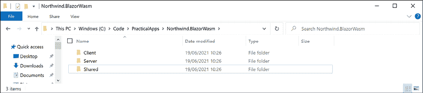
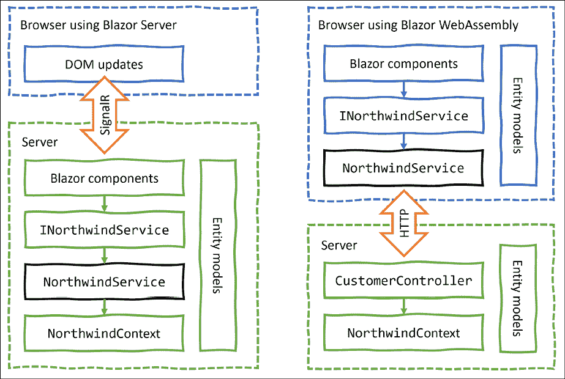
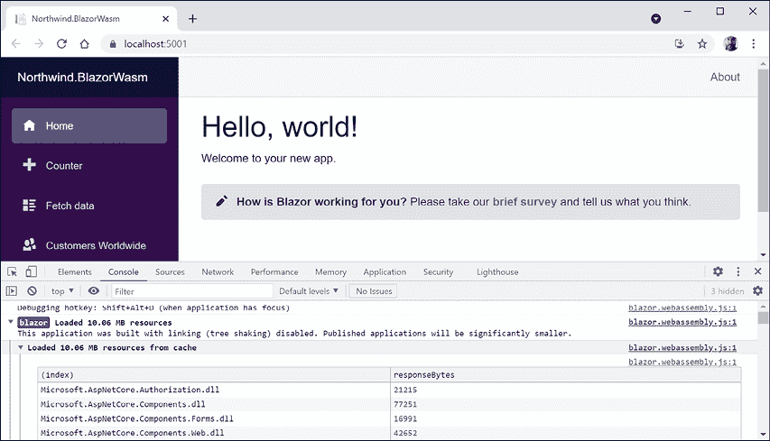
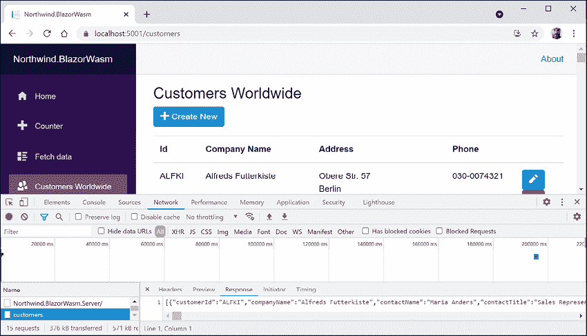
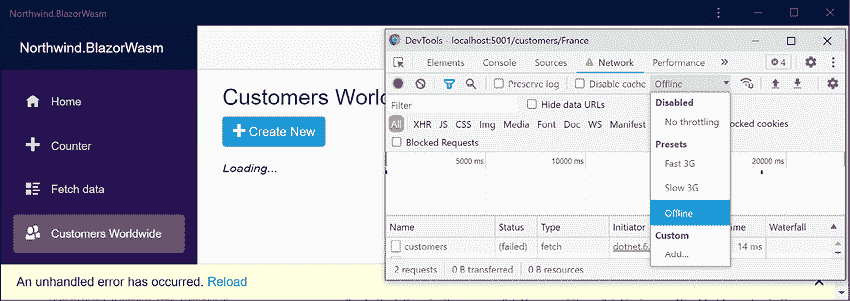

# 十七、使用 Blazor 构建用户界面

本章介绍如何使用 Blazor 构建用户界面。我将描述 Blazor 的不同口味及其优缺点。

您将学习如何构建 Blazor 组件，这些组件可以在 web 服务器或 web 浏览器上执行其代码。当使用 Blazor 服务器托管时，它使用 Signal 将所需的更新传递给浏览器中的用户界面。当使用 Blazor WebAssembly 托管时，组件在客户端执行其代码，并且必须进行 HTTP 调用才能与服务器交互。

在本章中，我们将介绍以下主题：

*   理解 Blazor
*   比较 Blazor 项目模板
*   使用 Blazor 服务器构建组件
*   为 Blazor 组件抽象服务
*   使用 Blazor WebAssembly 构建构件
*   改进 Blazor WebAssembly 应用程序

# 理解 Blazor

Blazor 允许您使用 C# 而不是 JavaScript 构建共享组件和交互式 web 用户界面。2019 年 4 月，微软宣布 Blazor“不再是实验性的，我们承诺将其作为受支持的 web UI 框架发布，包括支持在 WebAssembly 上的浏览器中运行客户端。”Blazor 在所有现代浏览器上都受支持。

## JavaScript 和朋友

传统上，任何需要在 web 浏览器中执行的代码都是使用 JavaScript 编程语言编写的，或者使用**将**转换（转换或编译）为 JavaScript 的更高级技术编写的。这是因为所有浏览器都支持 JavaScript 已经有 20 年了，所以它已经成为在客户端实现业务逻辑的最低公分母。

然而，JavaScript 确实存在一些问题。尽管它表面上与 C# 和 Java 等 C 风格语言有相似之处，但实际上，一旦你深入到表面之下，它就大不相同了。它是一种动态类型的伪函数语言，使用原型而不是类继承来实现对象重用。它可能看起来像人类，但当你发现它实际上是一只 Skrull 时，你会感到惊讶。

如果我们可以在 web 浏览器中使用与服务器端相同的语言和库，那不是很好吗？

## Silverlight–使用插件的 C# 和.NET

微软之前曾试图通过一种名为 Silverlight 的技术来实现这一目标。当 Silverlight 2.0 于 2008 年发布时，C# 和.NET 开发人员可以利用他们的技能构建库和可视化组件，这些库和组件由 Silverlight 插件在 web 浏览器中执行。

到 2011 年和 Silverlight 5.0，苹果在 iPhone 上的成功以及史蒂夫·乔布斯对 Flash 等浏览器插件的憎恨最终导致微软放弃 Silverlight，因为与 Flash 一样，Silverlight 也被禁止在 iPhone 和 iPad 上使用。

## WebAssembly–Blazor 的目标

最近浏览器的发展给了微软另一次尝试的机会。2017 年，**WebAssembly 共识**已经完成，现在所有主流浏览器都支持它：Chrome（Chrome、Edge、Opera、Brave）、Firefox 和 WebKit（Safari）。Microsoft 的 Internet Explorer 不支持 Blazor，因为它是一款旧式 web 浏览器。

**WebAssembly**（**Wasm**是一种用于虚拟机的二进制指令格式，它提供了一种在 web 上以接近本机速度运行以多种语言编写的代码的方法。Wasm 被设计为编译高级语言（如 C#）的可移植目标。

## 了解 Blazor 托管模型

Blazor 是一种单一编程或应用模式，具有多种托管模式：

*   **Blazor 服务器**在服务器端运行，因此您编写的 C# 代码可以完全访问您的业务逻辑可能需要的所有资源，而无需进行身份验证。然后，它使用信号器将用户界面更新传达给客户端。
*   服务器必须保持与每个客户机的实时信号器连接，并跟踪每个客户机的当前状态，因此如果需要支持大量客户机，Blazor 服务器的扩展性就不好。它于 2019 年 9 月作为 ASP.NET Core 3.0 的一部分首次发布，并包含在.NET 5.0 及更高版本中。
*   **Blazor WebAssembly**在客户端运行，因此您编写的 C# 代码只能访问浏览器中的资源，必须进行 HTTP 调用（可能需要身份验证），才能访问服务器上的资源。它于 2020 年 5 月作为 ASP.NET Core 3.1 的扩展首次发布，版本为 3.2，因为它是最新版本，因此不在 ASP.NET Core 3.1 的长期支持范围内。Blazor WebAssembly 3.2 版本使用了 Mono 运行时和 Mono 库。NET5 及更高版本使用 Mono 运行时和.NET5 库。“*Blazor WebAssembly 在没有任何 JIT 的.NET IL 解释器上运行，因此它不会赢得任何速度竞争。尽管在.NET 5 中，我们已经取得了一些显著的速度改进，我们希望在.NET 6 中进一步改进。”*——丹尼尔·罗斯
*   **.NET 毛伊岛 Blazor 应用程序**又名**Blazor Hybrid**，运行在的.NET 进程中，使用本地互操作通道将其web UI 呈现给 web 视图控件，并托管在.NET 毛伊岛应用程序中。它在概念上类似于使用 Node.js 的电子应用程序。我们将在在线章节*第 19 章*中看到这种托管模式，*使用.NET 毛伊岛*构建移动和桌面应用程序。

这种多主机模型意味着，经过仔细规划，开发人员可以编写 Blazor 组件一次，然后在 web 服务器端、web 客户端或桌面应用程序中运行它们。

尽管 Internet Explorer 11 支持 Blazor 服务器，但 Blazor WebAssembly 不支持。

Blazor WebAssembly可选支持**渐进式 Web 应用程序**（**PWAs**），这意味着网站访问者可以使用浏览器菜单将应用程序添加到桌面，并离线运行应用程序。

## 了解 Blazor 组件

了解 Blazor 用于创建**用户界面组件**非常重要。组件定义了如何呈现用户界面、对用户事件做出反应，并且可以组合和嵌套，并编译成 NuGet Razor 类库进行打包和分发。

例如，您可以创建一个名为`Rating.razor`的组件，如以下标记所示：

```cs
<div>
@for (int i = 0; i < Maximum; i++)
{
  if (i < Value)
  {
    <span class="oi oi-star-filled" />
  }
  else
  {
    <span class="oi oi-star-empty" />
  }
}
</div>
@code {
  [Parameter]
  public byte Maximum { get; set; }
  [Parameter]
  public byte Value { get; set; }
} 
```

代码可以存储在名为`Rating.razor.cs`的单独代码隐藏文件中，而不是同时包含标记和`@code`块的单个文件。此文件中的类必须是`partial`并且与组件具有相同的名称。

您可以然后在网页上使用该组件，如以下标记所示：

```cs
<h1>Review</h1>
<Rating id="rating" Maximum="5" Value="3" />
<textarea id="comment" /> 
```

有许多内置 Blazor 组件，包括用于在网页的`<head>`部分设置`<title>`之类的元素的组件，还有许多第三方将为通用目的向您出售组件。

将来，Blazor 可能不仅仅局限于使用 web 技术创建用户界面组件。微软有一项名为**Blazor 移动绑定**的实验性技术，允许开发者使用 Blazor 构建移动用户界面组件。它没有使用 HTML 和 CSS 来构建 web 用户界面，而是使用 XAML 和.NETMAUI 来构建跨平台的图形用户界面。

## Blazor 和 Razor 有什么区别？

您可能想知道 Blazor 组件为什么使用`.razor`作为文件扩展名。Razor 是一种模板标记语法，允许 HTML 和 C# 的混合。支持 Razor 语法的老技术使用`.cshtml`文件扩展名来表示 C# 和 HTML 的混合。

Razor 语法用于：

*   使用`.cshtml`文件扩展名的 ASP.NETCore MVC**视图**和**部分视图**。业务逻辑被分成一个控制器类，该类将视图视为将视图模型推送到的模板，然后将其输出到网页。
*   使用`.cshtml`文件扩展名的**剃须刀页面**。业务逻辑可以嵌入或分离到使用`.cshtml.cs`文件扩展名的文件中。输出是一个网页。
*   使用`.razor`文件扩展名的**Blazor 组件**。输出不是网页，尽管布局可用于包装组件，使其输出为网页，`@page`指令可用于分配定义 URL 路径的路由，以将组件检索为网页。

# 比较 Blazor 项目模板

了解 Blazor 服务器和 Blazor WebAssembly 托管模型之间选择的一种方法是查看它们默认项目模板中的差异。

## 查看 Blazor 服务器项目模板

让我们看看 Blazor 服务器项目的默认模板。大多数情况下，您会看到它与 ASP.NET Core Razor Pages 模板相同，只是添加了一些关键内容：

1.  使用首选的代码编辑器添加新项目，如下表所示：
    1.  项目模板：**Blazor 服务器 App**/`blazorserver`
    2.  工作区/解决方案文件和文件夹：`PracticalApps`
    3.  项目文件和文件夹：`Northwind.BlazorServer`
    4.  其他 Visual Studio 选项：**身份验证类型**：**无**；**配置 HTTPS**：选中；**启用 Docker**：已清除
2.  在 Visual Studio 代码中，选择`Northwind.BlazorServer`作为活动的 OmniSharp 项目。
3.  建设`Northwind.BlazorServer`项目。
4.  在`Northwind.BlazorServer`项目/文件夹中，打开`Northwind.BlazorServer.csproj`并注意它与使用 Web SDK 并以.NET 6.0 为目标的 ASP.NETCore项目相同。
5.  打开`Program.cs`，注意它与 ASP.NETCore项目几乎相同。不同之处包括配置服务的部分及其对`AddServerSideBlazor`方法的调用，如以下代码中突出显示的：

    ```cs
     builder.Services.AddRazorPages();
      **builder.Services.AddServerSideBlazor();**
      builder.Services.AddSingleton<WeatherForecastService>(); 
    ```

6.  还要注意配置 HTTP 管道的部分，它添加了对`MapBlazorHub`和`MapFallbackToPage`方法的调用，这些方法将 ASP.NETCore应用配置为接受 Blazor 组件的传入信号器连接，而其他请求返回到名为`_Host.cshtml`的 Razor 页面，如以下代码中突出显示的：

    ```cs
    app.UseRouting();
    **app.MapBlazorHub();**
    **app.MapFallbackToPage(****"/_Host"****);**
    app.Run(); 
    ```

7.  在`Pages`文件夹中，打开`_Host.cshtml`并注意它设置了一个名为`_Layout`的共享布局，并呈现一个在服务器上预呈现的`App`类型的 Blazor 组件，如下标记所示：

    ```cs
    @page "/"
    @namespace  Northwind.BlazorServer.Pages 
    @addTagHelper *, Microsoft.AspNetCore.Mvc.TagHelpers 
    @{
      Layout = "_Layout";
    }
    <component type="typeof(App)" render-mode="ServerPrerendered" /> 
    ```

8.  In the `Pages` folder, open the shared layout file named `_Layout.cshtml`, as shown in the following markup:

    ```cs
    @using Microsoft.AspNetCore.Components.Web
    @namespace Northwind.BlazorServer.Pages
    @addTagHelper *, Microsoft.AspNetCore.Mvc.TagHelpers
    <!DOCTYPE html>
    <html lang="en">
    <head>
      <meta charset="utf-8" />
      <meta name="viewport"
            content="width=device-width, initial-scale=1.0" />
      <base href="~/" />
      <link rel="stylesheet" href="css/bootstrap/bootstrap.min.css" />
      <link href="css/site.css" rel="stylesheet" />
      <link href="Northwind.BlazorServer.styles.css" rel="stylesheet" />
      <component type="typeof(HeadOutlet)" render-mode="ServerPrerendered" />
    </head>
    <body>
      @RenderBody()
      <div id="blazor-error-ui">
        <environment include="Staging,Production">
          An error has occurred. This application may no longer respond until reloaded.
        </environment>
        <environment include="Development">
          An unhandled exception has occurred. See browser dev tools for details.
        </environment>
        <a href="" class="reload">Reload</a>
        <a class="dismiss"></a>
      </div>
      <script src="_framework/blazor.server.js"></script>
    </body>
    </html> 
    ```

    查看上述标记时，请注意以下事项：

    *   `<div id="blazor-error-ui">`用于显示 Blazor 错误，当出现错误时，该错误将显示为网页底部的黄色条
    *   `blazor.server.js`的脚本块管理返回服务器的信号器连接
9.  In the `Northwind.BlazorServer` folder, open `App.razor` and note that it defines a `Router` for all components found in the current assembly, as shown in the following code:

    ```cs
    <Router AppAssembly="@typeof(App).Assembly">
      <Found Context="routeData">
        <RouteView RouteData="@routeData"
                   DefaultLayout="@typeof(MainLayout)" />
        <FocusOnNavigate RouteData="@routeData" Selector="h1" />
      </Found>
      <NotFound>
        <PageTitle>Not found</PageTitle>
        <LayoutView Layout="@typeof(MainLayout)">
          <p>Sorry, there's nothing at this address.</p>
        </LayoutView>
      </NotFound>
    </Router> 
    ```

    查看上述标记时，请注意以下事项：

    *   如果找到匹配的路由，则执行`RouteView`，将组件的默认布局设置为`MainLayout`，并将任何路由数据参数传递给组件。
    *   如果没有找到匹配的路由，则执行`LayoutView`，在`MainLayout`中呈现内部标记（在本例中，是一个简单的段落元素，带有一条消息，告诉访问者此地址没有任何内容）。
10.  在`Shared`文件夹中，打开`MainLayout.razor`并注意，它为一个侧边栏定义了`<div>`，该侧边栏包含一个导航菜单，该菜单由本项目中的`NavMenu.razor`组件文件实现，内容定义了一个 HTML5 元素，如`<main>`和`<article>`，如下代码所示：

    ```cs
    @inherits LayoutComponentBase
    <PageTitle>Northwind.BlazorServer</PageTitle>
    <div class="page">
      <div class="sidebar">
        <NavMenu />
      </div>
      <main>
        <div class="top-row px-4">
          <a href="https://docs.microsoft.com/aspnet/" 
             target="_blank">About</a>
        </div>
        <article class="content px-4">
          @Body
        </article>
      </main>
    </div> 
    ```

11.  在`Shared`文件夹中，打开`MainLayout.razor.css`，注意它包含组件的独立 CSS 样式。
12.  在`Shared`文件夹中，打开`NavMenu.razor`并注意它有三个菜单项用于**主页**、**计数器**和**获取数据**。这些是使用 Microsoft 提供的名为`NavLink`的 Blazor 组件创建的，如以下标记所示：

    ```cs
    <div class="top-row ps-3 navbar navbar-dark">
      <div class="container-fluid">
        <a class="navbar-brand" href="">Northwind.BlazorServer</a>
        <button title="Navigation menu" class="navbar-toggler" 
                @onclick="ToggleNavMenu">
          <span class="navbar-toggler-icon"></span>
        </button>
      </div>
    </div>
    <div class="@NavMenuCssClass" @onclick="ToggleNavMenu">
      <nav class="flex-column">
        <div class="nav-item px-3">
          <NavLink class="nav-link" href="" Match="NavLinkMatch.All">
            <span class="oi oi-home" aria-hidden="true"></span> Home
          </NavLink>
        </div>
        <div class="nav-item px-3">
          <NavLink class="nav-link" href="counter">
            <span class="oi oi-plus" aria-hidden="true"></span> Counter
          </NavLink>
        </div>
        <div class="nav-item px-3">
          <NavLink class="nav-link" href="fetchdata">
            <span class="oi oi-list-rich" aria-hidden="true"></span> Fetch data
          </NavLink>
        </div>
      </nav>
    </div>
    @code {
      private bool collapseNavMenu = true;
      private string? NavMenuCssClass => collapseNavMenu ? "collapse" : null;
      private void ToggleNavMenu()
      {
        collapseNavMenu = !collapseNavMenu;
      }
    } 
    ```

13.  在`Pages`文件夹中，打开`FetchData.razor`并注意它定义了一个组件，该组件从注入的依赖性天气服务获取天气预报，然后将其呈现在表格中，如以下代码所示：

    ```cs
    @page "/fetchdata"
    <PageTitle>Weather forecast</PageTitle>
    @using Northwind.BlazorServer.Data
    @inject WeatherForecastService ForecastService
    <h1>Weather forecast</h1>
    <p>This component demonstrates fetching data from a service.</p> 
    @if (forecasts == null)
    {
      <p><em>Loading...</em></p>
    }
    else
    {
      <table class="table">
        <thead>
          <tr>
            <th>Date</th>
            <th>Temp. (C)</th>
            <th>Temp. (F)</th>
            <th>Summary</th>
          </tr>
        </thead>
        <tbody>
        @foreach (var forecast in forecasts)
        {
          <tr>
            <td>@forecast.Date.ToShortDateString()</td>
            <td>@forecast.TemperatureC</td>
            <td>@forecast.TemperatureF</td>
            <td>@forecast.Summary</td>
           </tr>
        }
        </tbody>
      </table>
    }
    @code {
      private WeatherForecast[]? forecasts;
      protected override async Task OnInitializedAsync()
      {
        forecasts = await ForecastService.GetForecastAsync(DateTime.Now);
      }
    } 
    ```

14.  在`Data`文件夹中打开`WeatherForecastService.cs`，注意*不是*Web API 控制器类；只是一个普通类，返回随机的天气数据，如下代码所示：

    ```cs
    namespace Northwind.BlazorServer.Data
    {
      public class WeatherForecastService
      {
        private static readonly string[] Summaries = new[]
        {
          "Freezing", "Bracing", "Chilly", "Cool", "Mild", "Warm",
          "Balmy", "Hot", "Sweltering", "Scorching"
        };
        public Task<WeatherForecast[]> GetForecastAsync(DateTime startDate)
        {
          return Task.FromResult(Enumerable.Range(1, 5)
            .Select(index => new WeatherForecast
              {
                Date = startDate.AddDays(index),
                TemperatureC = Random.Shared.Next(-20, 55),
                Summary = Summaries[Random.Shared.Next(Summaries.Length)]
              }).ToArray());
        }
      }
    } 
    ```

### 理解 CSS 和 JavaScript 隔离

Blazor 组件通常需要提供自己的 CSS，以便将样式或 JavaScript 应用于无法在 C# 中执行的活动，如访问浏览器 API。为了确保这不会与站点级 CSS 和 JavaScript 冲突，Blazor 支持 CSS 和 JavaScript 隔离。如果您有一个名为`Index.razor`的组件，只需创建一个名为`Index.razor.css`的 CSS 文件。此文件中定义的样式将替代项目中的任何其他样式。

## 了解 Blazor 到页面组件的路由

我们在`App.razor`文件中看到的`Router`组件支持到组件的路由。创建组件实例的标记看起来像 HTML 标记，其中标记的名称是组件类型。组件可以使用元素（例如，`<Rating Stars="5" />`）嵌入到网页上，也可以路由到 Razor 页面或 MVC 控制器。

### 如何定义可路由页面组件

要创建可路由页面组件，请将`@page`指令添加到组件的`.razor`文件的顶部，如以下标记所示：

```cs
@page "customers" 
```

前面的代码相当于用`[Route]`属性修饰的 MVC 控制器，如下代码所示：

```cs
[Route("customers")]
public class CustomersController
{ 
```

`Router`组件在其`AppAssembly`参数中专门扫描带有`[Route]`属性的组件，并注册它们的 URL 路径。

任何单个页面组件都可以有多个`@page`指令来注册多个路由。

在运行时，页面组件将与您指定的任何特定布局合并，就像 MVC 视图或 Razor 页面一样。默认情况下，Blazor 服务器项目模板将`MainLayout.razor`定义为页面组件的布局。

**良好实践**：按照惯例，将可路由页面组件放入`Pages`文件夹中。

### 如何导航 Blazor 路线

Microsoft提供了一个名为`NavigationManager`的依赖服务，该服务了解 Blazor 路由和`NavLink`组件。

`NavigateTo`方法用于转到指定的 URL。

### 如何传递路由参数

Blazor routes可以包含不区分大小写的命名参数，通过使用`[Parameter]`属性将参数绑定到代码块中的属性，您的代码可以最轻松地访问传递的值，如下标记所示：

```cs
@page "/customers/{country}"
<div>Country parameter as the value: @Country</div>
@code {
  [Parameter]
  public string Country { get; set; }
} 
```

处理缺少默认值的参数的推荐方法是在参数后加上`?`后缀，并在`OnParametersSet`方法中使用 null 合并运算符，如下图所示：

```cs
@page "/customers/{country?}"
<div>Country parameter as the value: @Country</div>
@code {
  [Parameter]
  public string Country { get; set; }
  protected override void OnParametersSet()
  {
    // if the automatically set property is null
    // set its value to USA
    Country = Country ?? "USA";
  }
} 
```

### 理解基本组件类

`OnParametersSet`方法是由组件默认继承的基类`ComponentBase`定义的，如下代码所示：

```cs
using Microsoft.AspNetCore.Components;
public abstract class ComponentBase : IComponent, IHandleAfterRender, IHandleEvent
{
  // members not shown
} 
```

`ComponentBase`有一些有用的方法可以调用和重写，如下表所示：

<colgroup><col> <col></colgroup> 
| 方法 | 描述 |
| `InvokeAsync` | 调用此方法在关联渲染器的同步上下文上执行函数。 |
| `OnAfterRender`、`OnAfterRenderAsync` | 重写这些方法以在每次呈现组件后调用代码。 |
| `OnInitialized`、`OnInitializedAsync` | 重写这些方法以在组件从渲染树中的父组件接收到其初始参数后调用代码。 |
| `OnParametersSet`、`OnParametersSetAsync` | 重写这些方法，以便在组件收到参数并将值指定给属性后调用代码。 |
| `ShouldRender` | 重写此方法以指示组件是否应渲染。 |
| `StateHasChanged` | 调用此方法以使组件重新渲染。 |

Blazor组件可以以类似 MVC 视图和 Razor 页面的方式共享布局。

创建一个`.razor`组件文件，但将其显式继承自`LayoutComponentBase`，如下标记所示：

```cs
@inherits LayoutComponentBase
<div>
  ...
  @Body
  ...
</div> 
```

基类有一个名为`Body`的属性，您可以在布局中的正确位置在标记中呈现该属性。

为`App.razor`文件及其`Router`组件中的组件设置默认布局。要显式设置组件的布局，请使用`@layout`指令，如以下标记所示：

```cs
@page "/customers"
@layout AlternativeLayout
<div>
  ...
</div> 
```

### 如何将导航链接组件用于路线

在 HTML 中，使用`<a>`元素定义导航链接，如以下标记所示：

```cs
<a href="/customers">Customers</a> 
```

在 Blazor 中，使用组件`<NavLink>`，如下标记所示：

```cs
<NavLink href="/customers">Customers</NavLink> 
```

`NavLink`组件优于锚元素，因为如果其`href`与当前位置 URL 匹配，它会自动将其类设置为`active`。如果您的 CSS 使用不同的类名，那么您可以在`NavLink.ActiveClass`属性中设置类名。

默认情况下，在匹配算法中，`href`是路径*前缀*，所以如果`NavLink`的`href`为`/customers`，如前面的代码示例所示，则会匹配以下所有路径，并将其全部设置为具有`active`类样式：

```cs
/customers
/customers/USA
/customers/Germany/Berlin 
```

为确保匹配算法只对*所有*路径进行匹配，将`Match`参数设置为`NavLinkMatch.All`，如下代码所示：

```cs
<NavLink href="/customers" Match="NavLinkMatch.All">Customers</NavLink> 
```

如果您设置了其他属性，例如`target`，它们将传递给生成的基础`<a>`元素。

## 运行 Blazor 服务器项目模板

既然我们已经查看了项目模板和 Blazor 服务器特有的重要部分，我们可以启动网站并查看其行为：

1.  在`Properties`文件夹中，打开`launchSettings.json`。
2.  修改`applicationUrl`为`HTTP`使用端口`5000`，为`HTTPS`使用端口`5001`，如下标记所示：

    ```cs
    "profiles": {
      "Northwind.BlazorServer": {
        "commandName": "Project",
        "dotnetRunMessages": true,
        "launchBrowser": true,
    **"applicationUrl"****:** **"https://localhost:5001;http://localhost:5000"****,**
        "environmentVariables": {
          "ASPNETCORE_ENVIRONMENT": "Development"
        }
      }, 
    ```

3.  启动网站。
4.  启动 Chrome。
5.  导航到`https://localhost:5001/`。
6.  In the left navigation menu, click **Fetch data**, as shown in *Figure 17.1*:

    <figure class="mediaobject"></figure>

    图 17.1：将天气数据提取到 Blazor 服务器应用程序中

7.  In the browser address bar, change the route to `/apples` and note the missing message, as shown in *Figure 17.2*:

    <figure class="mediaobject"></figure>

    图 17.2：缺少的组件消息

8.  关闭 Chrome 并关闭 web 服务器。

## 查看 Blazor WebAssembly 项目模板

现在我们将创建一个 Blazor WebAssembly 项目。如果代码与 Blazor 服务器项目中的代码相同，我将不在书中显示代码：

1.  Use your preferred code editor to add a new project to the `PracticalApps` solution or workspace, as defined in the following list:
    1.  项目模板：**Blazor WebAssembly App**/`blazorwasm`
    2.  开关：`--pwa --hosted`
    3.  工作区/解决方案文件和文件夹：`PracticalApps`
    4.  项目文件和文件夹：`Northwind.BlazorWasm`
    5.  **认证类型**：**无**
    6.  **配置 HTTPS**：勾选
    7.  **ASP.NETCore托管**：选中
    8.  **渐进式 Web 应用**：已选中

    查看生成的文件夹和文件时，请注意，将生成三个项目，如下表所述：

    *   `Northwind.BlazorWasm.Client`是`Northwind.BlazorWasm\Client`文件夹中的 Blazor WebAssembly 项目。
    *   `Northwind.BlazorWasm.Server`是`Northwind.BlazorWasm\Server`文件夹中的一个 ASP.NETCore项目网站，用于托管天气服务，该服务的实现与以前相同，用于返回随机天气预报，但作为适当的 Web API 控制器类实现。该项目文件包含对`Shared`和`Client`的项目引用，以及一个支持服务器端 Blazor WebAssembly 的包引用。
    *   `Northwind.BlazorWasm.Shared`是`Northwind.BlazorWasm\Shared`文件夹中包含气象服务模型的类库。

    文件夹结构简化，如*图 17.3*所示：

    <figure class="mediaobject"></figure>

    图 17.3:Blazor WebAssembly 项目模板的文件夹结构

    有两种方法可以部署 Blazor WebAssembly 应用程序。您可以通过将`Client`项目发布的文件放置在任何静态托管 web 服务器中来部署该项目。它可以配置为调用您在*第 16 章*中创建的天气服务*构建和使用 Web 服务*，或者您可以部署`Server`项目，该项目引用`Client`应用程序，同时托管天气服务和 Blazor WebAssembly 应用程序。该应用程序与任何其他静态资产一起放置在服务器网站`wwwroot`文件夹中。您可以通过以下链接了解更多关于这些选择的信息：[https://docs.microsoft.com/en-us/aspnet/core/blazor/host-and-deploy/webassembly](https://docs.microsoft.com/en-us/aspnet/core/blazor/host-and-deploy/webassembly)

2.  在`Client`文件夹中，打开`Northwind.BlazorWasm.Client.csproj`，注意它使用 BlazorWebAssembly SDK，引用了两个 WebAssembly 包和`Shared`项目，以及 PWA 支持所需的服务人员，如下标记所示：

    ```cs
    <Project Sdk="Microsoft.NET.Sdk.BlazorWebAssembly">
      <PropertyGroup>
        <TargetFramework>net6.0</TargetFramework>
        <Nullable>enable</Nullable>
        <ImplicitUsings>enable</ImplicitUsings>
        <ServiceWorkerAssetsManifest>service-worker-assets.js
          </ServiceWorkerAssetsManifest>
      </PropertyGroup>
      <ItemGroup>
        <PackageReference Include=
          "Microsoft.AspNetCore.Components.WebAssembly" 
          Version="6.0.0" />
        <PackageReference Include=
          "Microsoft.AspNetCore.Components.WebAssembly.DevServer" 
          Version="6.0.0" PrivateAssets="all" />
      </ItemGroup>
      <ItemGroup>
        <ProjectReference Include=
          "..\Shared\Northwind.BlazorWasm.Shared.csproj" />
      </ItemGroup>
      <ItemGroup>
        <ServiceWorker Include="wwwroot\service-worker.js" 
          PublishedContent="wwwroot\service-worker.published.js" />
      </ItemGroup>
    </Project> 
    ```

3.  在`Client`文件夹中，打开`Program.cs`，注意主机生成器是为`WebAssembly`而不是服务器端 ASP.NETCore，并且它注册了一个依赖服务来进行 HTTP 请求，这是 Blazor WebAssembly 应用程序非常常见的要求，如下代码所示：

    ```cs
    using Microsoft.AspNetCore.Components.Web;
    using Microsoft.AspNetCore.Components.WebAssembly.Hosting;
    using Northwind.BlazorWasm.Client;
    var builder = WebAssemblyHostBuilder.CreateDefault(args); 
    builder.RootComponents.Add<App>("# app");
    builder.RootComponents.Add<HeadOutlet>("head::after");
    builder.Services.AddScoped(sp => new HttpClient
      { BaseAddress = new Uri(builder.HostEnvironment.BaseAddress) });
    await builder.Build().RunAsync(); 
    ```

4.  在`wwwroot`文件夹中，打开`index.html`并记录支持离线工作的`manifest.json`和`service-worker.js`文件，以及下载Blazor WebAssembly 所有 NuGet 软件包的`blazor.webassembly.js`脚本，如下标记所示：

    ```cs
    <!DOCTYPE html>
    <html>
    <head>
      <meta charset="utf-8" />
      <meta name="viewport" content="width=device-width, initial-scale=1.0, maximum-scale=1.0, user-scalable=no" />
      <title>Northwind.BlazorWasm</title>
      <base href="/" />
      <link href="css/bootstrap/bootstrap.min.css" rel="stylesheet" />
      <link href="css/app.css" rel="stylesheet" />
      <link href="Northwind.BlazorWasm.Client.styles.css" rel="stylesheet" />
      <link href="manifest.json" rel="manifest" />
      <link rel="apple-touch-icon" sizes="512x512" href="icon-512.png" />
      <link rel="apple-touch-icon" sizes="192x192" href="icon-192.png" />
    </head>
    <body>
      <div id="app">Loading...</div>
      <div id="blazor-error-ui">
        An unhandled error has occurred.
        <a href="" class="reload">Reload</a>
        <a class="dismiss"></a>
      </div>
      <script src="_framework/blazor.webassembly.js"></script>
      <script>navigator.serviceWorker.register('service-worker.js');</script>
    </body>
    </html> 
    ```

5.  注意以下`.razor`文件与 Blazor 服务器项目中的文件相同：
    *   `App.razor`
    *   `Shared\MainLayout.razor`
    *   `Shared\NavMenu.razor`
    *   `Shared\SurveyPrompt.razor`
    *   `Pages\Counter.razor`
    *   `Pages\Index.razor`
6.  在`Pages`文件夹中，打开`FetchData.razor`并注意标记与 Blazor 服务器类似，只是注入了依赖服务以进行 HTTP 请求，如以下部分标记中突出显示的：

    ```cs
    @page "/fetchdata"
    @using Northwind.BlazorWasm.Shared
    **@inject HttpClient Http**
    <h1>Weather forecast</h1>
    ...
    @code {
      private WeatherForecast[]? forecasts;
      protected override async Task OnInitializedAsync()
      {
     **forecasts =** **await**
     **Http.GetFromJsonAsync<WeatherForecast[]>(****"WeatherForecast"****);**
      }
    } 
    ```

7.  启动`Northwind.BlazorWasm.Server`项目。
8.  注意该应用程序的功能与之前相同。Blazor 组件代码在浏览器内部执行，而不是在服务器上执行。天气服务正在 web 服务器上运行。
9.  关闭 Chrome 并关闭 web 服务器。

# 使用 Blazor 服务器构建组件

在本节中，我们将构建一个组件，用于在 Northwind 数据库中列出、创建和编辑客户。我们将首先天真地为 Blazor 服务器构建它，然后重构它以与 Blazor 服务器和 Blazor WebAssembly 一起工作。

## 定义和测试简单组件

我们将向现有 Blazor 服务器项目中添加新组件：

1.  In the `Northwind.BlazorServer` project (*not* the `Northwind.BlazorWasm.Server` project), in the `Pages` folder, add a new file named `Customers.razor`. In Visual Studio, the project item is named **Razor Component**.

    **良好实践**：组件文件名必须以大写字母开头，否则会出现编译错误！

2.  添加语句以输出`Customers`组件的标题，并定义一个代码块，该代码块定义用于存储国家名称的属性，如以下标记所示：

    ```cs
    <h3>Customers@(string.IsNullOrWhiteSpace(Country) ? " Worldwide" : " in " + Country)</h3>
    @code {
      [Parameter]
      public string? Country { get; set; }
    } 
    ```

3.  在`Pages`文件夹中的`Index.razor`组件中，在文件底部添加语句两次实例化`Customers`组件，一次将`Germany`作为国家参数传递，一次不设置国家，如下标记所示：

    ```cs
    <Customers Country="Germany" />
    <Customers /> 
    ```

4.  启动`Northwind.BlazorServer`网站项目。
5.  启动铬。
6.  Navigate to `https://localhost:5001/` and note the `Customers` components, as shown in *Figure 17.4*:

    <figure class="mediaobject"></figure>

    图 17.4:Country 参数设置为 Germany 而未设置的 Customers 组件

7.  关闭 Chrome 并关闭 web 服务器。

## 使组件成为可路由页面组件

将此组件转换为具有国家/地区路由参数的可路由页面组件非常简单：

1.  在`Pages`文件夹中的`Customers.razor`组件中，在文件顶部添加一条语句，用可选的国家/地区路由参数注册`/customers`作为其路由，如下标记所示：

    ```cs
    @page "/customers/{country?}" 
    ```

2.  In the `Shared` folder, open `NavMenu.razor` and add two list item elements for our routable page component to show customers worldwide and in Germany that both use an icon of people, as shown in the following markup:

    ```cs
    <div class="nav-item px-3">
      <NavLink class="nav-link" href="customers" Match="NavLinkMatch.All">
        <span class="oi oi-people" aria-hidden="true"></span>
        Customers Worldwide
      </NavLink>
    </div>
    <div class="nav-item px-3">
      <NavLink class="nav-link" href="customers/Germany">
        <span class="oi oi-people" aria-hidden="true"></span>
        Customers in Germany
      </NavLink>
    </div> 
    ```

    我们在“客户”菜单项中使用了一个人物图标。您可以在以下链接中看到其他可用图标：[https://iconify.design/icon-sets/oi/](https://iconify.design/icon-sets/oi/)

3.  启动网站项目。
4.  启动 Chrome。
5.  导航到`https://localhost:5001/`。
6.  在左侧导航菜单中，点击**德国客户**，注意国家名称已正确传递给页面组件，并且该组件使用与其他页面组件相同的共享布局，如`Index.razor`。
7.  关闭 Chrome 并关闭 web 服务器。

## 将实体放入组件中

既然您已经看到了组件的最低实现，我们可以为它添加一些有用的功能。在这种情况下，我们将使用 Northwind 数据库上下文从数据库中获取客户：

1.  在`Northwind.BlazorServer.csproj`中，为 SQL Server 或 SQLite 添加对 Northwind 数据库上下文项目的引用，如以下标记所示：

    ```cs
    <ItemGroup>
      <!-- change Sqlite to SqlServer if you prefer -->
      <ProjectReference Include="..\Northwind.Common.DataContext.Sqlite
    \Northwind.Common.DataContext.Sqlite.csproj" />
    </ItemGroup> 
    ```

2.  建设`Northwind.BlazorServer`项目。
3.  在`Program.cs`中，导入用于处理 Northwind 数据库上下文的名称空间，如下代码所示：

    ```cs
    using Packt.Shared; // AddNorthwindContext extension method 
    ```

4.  在配置服务的部分中，添加一条语句以在 dependency services 集合中注册 Northwind 数据库上下文，如以下代码所示：

    ```cs
    builder.Services.AddNorthwindContext(); 
    ```

5.  Open `_Imports.razor` and import namespaces for working with the Northwind entities so that Blazor components that we build do not need to import the namespaces individually, as shown in the following markup:

    ```cs
    @using Packt.Shared  @* Northwind entities *@ 
    ```

    `_Imports.razor`文件仅适用于`.razor`文件。如果您使用代码隐藏`.cs`文件来实现组件代码，那么它们必须单独导入名称空间，或者使用全局 using 隐式导入名称空间。

6.  在`Pages`文件夹的`Customers.razor`中，添加语句注入北风数据库上下文，然后用它输出一个所有客户的表，如下代码所示：

    ```cs
    @using Microsoft.EntityFrameworkCore  @* ToListAsync extension method *@
    @page "/customers/{country?}" 
    @inject NorthwindContext db
    <h3>Customers @(string.IsNullOrWhiteSpace(Country) 
          ? "Worldwide" : "in " + Country)</h3>
    @if (customers == null)
    {
    <p><em>Loading...</em></p>
    }
    else
    {
    <table class="table">
      <thead>
        <tr>
          <th>Id</th>
          <th>Company Name</th>
          <th>Address</th>
          <th>Phone</th>
          <th></th>
        </tr>
      </thead>
      <tbody>
      @foreach (Customer c in customers)
      {
        <tr>
          <td>@c.CustomerId</td>
          <td>@c.CompanyName</td>
          <td>
            @c.Address<br/>
            @c.City<br/>
            @c.PostalCode<br/>
            @c.Country
          </td>
          <td>@c.Phone</td>
          <td>
            <a class="btn btn-info" href="editcustomer/@c.CustomerId">
              <i class="oi oi-pencil"></i></a>
            <a class="btn btn-danger" 
               href="deletecustomer/@c.CustomerId">
              <i class="oi oi-trash"></i></a>
          </td>
        </tr>
      }
      </tbody>
    </table>
    }
    @code {
      [Parameter]
      public string? Country { get; set; }
      private IEnumerable<Customer>? customers;
      protected override async Task OnParametersSetAsync()
      {
        if (string.IsNullOrWhiteSpace(Country))
        {
          customers = await db.Customers.ToListAsync();
        }
        else
        {
          customers = await db.Customers
            .Where(c => c.Country == Country).ToListAsync();
        }
      }
    } 
    ```

7.  启动`Northwind.BlazorServer`项目网站。
8.  启动 Chrome。
9.  导航到`https://localhost:5001/`。
10.  In the left navigation menu, click **Customers Worldwide**, and note that the table of customers loads from the database and renders in the web page, as shown in *Figure 17.5*:

    <figure class="mediaobject"></figure>

    图 17.5：全球客户名单

11.  在左侧导航菜单中点击**德国客户**，注意客户表被过滤，只显示德国客户。
12.  在浏览器地址栏中，将`Germany`更改为`UK`，并注意客户表已过滤，仅显示英国客户。
13.  在左侧导航菜单中，点击**主页**，注意客户组件作为页面上的嵌入式组件使用时也能正常工作。
14.  单击任何编辑或删除按钮，注意它们返回一条消息，上面写着`Sorry, there's nothing at this address`。因为我们还没有实现这个功能。
15.  关闭浏览器。
16.  关闭 web 服务器。

# 为 Blazor 组件抽象服务

目前，Blazor 组件直接调用 Northwind 数据库上下文来获取客户。此在 Blazor 服务器中运行良好，因为组件在服务器上执行。但是这个组件在 Blazor WebAssembly 中托管时无法工作。

现在，我们将创建一个本地依赖项服务，以便更好地重用组件：

1.  在`Northwind.BlazorServer`项目的`Data`文件夹中，添加一个名为`INorthwindService.cs`的新文件。（Visual Studio 项目项模板名为**接口**）
2.  修改其内容以定义抽象 CRUD 操作的本地服务的契约，如以下代码所示：

    ```cs
    namespace Packt.Shared;
    public interface INorthwindService
    {
      Task<List<Customer>> GetCustomersAsync();
      Task<List<Customer>> GetCustomersAsync(string country);
      Task<Customer?> GetCustomerAsync(string id);
      Task<Customer> CreateCustomerAsync(Customer c);
      Task<Customer> UpdateCustomerAsync(Customer c);
      Task DeleteCustomerAsync(string id);
    } 
    ```

3.  在`Data`文件夹中，添加一个名为`NorthwindService.cs`的新文件并修改其内容，使用 Northwind 数据库上下文实现`INorthwindService`接口，如下代码所示：

    ```cs
    using Microsoft.EntityFrameworkCore; 
    namespace Packt.Shared;
    public class NorthwindService : INorthwindService
    {
      private readonly NorthwindContext db;
      public NorthwindService(NorthwindContext db)
      {
        this.db = db;
      }
      public Task<List<Customer>> GetCustomersAsync()
      {
        return db.Customers.ToListAsync();
      }
      public Task<List<Customer>> GetCustomersAsync(string country)
      {
        return db.Customers.Where(c => c.Country == country).ToListAsync();
      }
      public Task<Customer?> GetCustomerAsync(string id)
      {
        return db.Customers.FirstOrDefaultAsync
          (c => c.CustomerId == id);
      }
      public Task<Customer> CreateCustomerAsync(Customer c)
      {
        db.Customers.Add(c); 
        db.SaveChangesAsync();
        return Task.FromResult(c);
      }
      public Task<Customer> UpdateCustomerAsync(Customer c)
      {
        db.Entry(c).State = EntityState.Modified;
        db.SaveChangesAsync();
        return Task.FromResult(c);
      }
      public Task DeleteCustomerAsync(string id)
      {
        Customer? customer = db.Customers.FirstOrDefaultAsync
          (c => c.CustomerId == id).Result;
        if (customer == null)
        {
          return Task.CompletedTask;
        }
        else
        {
          db.Customers.Remove(customer); 
          return db.SaveChangesAsync();
        }
      }
    } 
    ```

4.  在`Program.cs`中，在服务配置部分，添加一条语句，将`NorthwindService`注册为实现`INorthwindService`接口的临时服务，如下代码所示：

    ```cs
    builder.Services.AddTransient<INorthwindService, NorthwindService>(); 
    ```

5.  在`Pages`文件夹中，打开`Customers.razor`并将注入 Northwind数据库上下文的指令替换为注入注册的 Northwind 服务的指令，如下代码所示：

    ```cs
    @inject INorthwindService service 
    ```

6.  修改`OnParametersSetAsync`方法调用服务，如下代码所示：

    ```cs
    protected override async Task OnParametersSetAsync()
    {
      if (string.IsNullOrWhiteSpace(Country))
      {
     **customers =** **await** **service.GetCustomersAsync();**
      }
      else
      {
     **customers =** **await** **service.GetCustomersAsync(Country);**
      }
    } 
    ```

7.  启动`Northwind.BlazorServer`网站项目，确认其功能与之前相同。

## 使用 EditForm 组件定义表单

Microsoft 为构建表单提供现成的组件。我们将使用它们为客户提供、创建和编辑功能。

微软提供了`EditForm`组件和`InputText`等多个表单元素，使 Blazor 更容易使用表单。

`EditForm`可以设置一个模型，将其绑定到具有属性和事件处理程序的对象，以进行自定义验证，并识别模型类上的标准 Microsoft 验证属性，如以下代码所示：

```cs
<EditForm Model="@customer" OnSubmit="ExtraValidation">
  <DataAnnotationsValidator />
  <ValidationSummary />
  <InputText id="name" @bind-Value="customer.CompanyName" />
  <button type="submit">Submit</button>
</EditForm>
@code {
  private Customer customer = new();
  private void ExtraValidation()
  {
    // perform any extra validation
  }
} 
```

作为`ValidationSummary`组件的替代，您可以使用`ValidationMessage`组件在单个表单元素旁边显示消息。

## 构建和使用客户表单组件

现在我们可以创建共享组件来创建或编辑客户：

1.  在`Shared`文件夹中，创建一个名为`CustomerDetail.razor`的新文件。（Visual Studio 项目项模板名为**Razor 组件**。此组件将在多个页面组件上重用。
2.  修改其内容，定义一个表单来编辑客户的属性，如下代码所示：

    ```cs
    <EditForm Model="@Customer" OnValidSubmit="@OnValidSubmit">
      <DataAnnotationsValidator />
      <div class="form-group">
        <div>
          <label>Customer Id</label>
          <div>
            <InputText @bind-Value="@Customer.CustomerId" />
            <ValidationMessage For="@(() => Customer.CustomerId)" />
          </div>
        </div>
      </div>
      <div class="form-group ">
        <div>
          <label>Company Name</label>
          <div>
            <InputText @bind-Value="@Customer.CompanyName" />
            <ValidationMessage For="@(() => Customer.CompanyName)" />
          </div>
        </div>
      </div>
      <div class="form-group ">
        <div>
          <label>Address</label>
          <div>
            <InputText @bind-Value="@Customer.Address" />
            <ValidationMessage For="@(() => Customer.Address)" />
          </div>
        </div>
      </div>
      <div class="form-group ">
        <div>
          <label>Country</label>
          <div>
            <InputText @bind-Value="@Customer.Country" />
            <ValidationMessage For="@(() => Customer.Country)" />
          </div>
        </div>
      </div>
      <button type="submit" class="btn btn-@ButtonStyle">
        @ButtonText
      </button>
    </EditForm>
    @code { 
      [Parameter]
      public Customer Customer { get; set; } = null!;
      [Parameter]
      public string ButtonText { get; set; } = "Save Changes";
      [Parameter]
      public string ButtonStyle { get; set; } = "info";
      [Parameter]
      public EventCallback OnValidSubmit { get; set; }
    } 
    ```

3.  在`Pages`文件夹中，创建一个名为`CreateCustomer.razor`的新文件。这将是一个可路由页面组件。
4.  修改其内容，使用客户明细组件创建新客户，如下代码所示：

    ```cs
    @page "/createcustomer"
    @inject INorthwindService service 
    @inject NavigationManager navigation
    <h3>Create Customer</h3>
    <CustomerDetail ButtonText="Create Customer"
                    Customer="@customer" 
                    OnValidSubmit="@Create" />
    @code {
      private Customer customer = new();
      private async Task Create()
      {
        await service.CreateCustomerAsync(customer);
        navigation.NavigateTo("customers");
      }
    } 
    ```

5.  在`Pages`文件夹中，打开名为`Customers.razor`的文件，在`<h3>`元素后，添加一个带有按钮的`<div>`元素，导航到`createcustomer`页面组件，如下标记所示：

    ```cs
    <div class="form-group">
      <a class="btn btn-info" href="createcustomer">
      <i class="oi oi-plus"></i> Create New</a>
    </div> 
    ```

6.  在`Pages`文件夹中，创建一个名为`EditCustomer.razor`的新文件并修改其内容，以使用 customer detail 组件编辑并保存对现有客户的更改，如下代码所示：

    ```cs
    @page "/editcustomer/{customerid}" 
    @inject INorthwindService service 
    @inject NavigationManager navigation
    <h3>Edit Customer</h3>
    <CustomerDetail ButtonText="Update"
                    Customer="@customer" 
                    OnValidSubmit="@Update" />
    @code { 
      [Parameter]
      public string CustomerId { get; set; } 
      private Customer? customer = new();
      protected async override Task OnParametersSetAsync()
      {
        customer = await service.GetCustomerAsync(CustomerId);
      }
      private async Task Update()
      {
        if (customer is not null)
        {
          await service.UpdateCustomerAsync(customer);
        }
        navigation.NavigateTo("customers");
      }
    } 
    ```

7.  在`Pages`文件夹中新建一个名为`DeleteCustomer.razor`的文件，修改其内容，使用客户明细组件显示即将删除的客户，如下代码所示：

    ```cs
    @page "/deletecustomer/{customerid}" 
    @inject INorthwindService service 
    @inject NavigationManager navigation
    <h3>Delete Customer</h3>
    <div class="alert alert-danger">
      Warning! This action cannot be undone!
    </div>
    <CustomerDetail ButtonText="Delete Customer"
                    ButtonStyle="danger" 
                    Customer="@customer" 
                    OnValidSubmit="@Delete" />
    @code { 
      [Parameter]
      public string CustomerId { get; set; } 
      private Customer? customer = new();
      protected async override Task OnParametersSetAsync()
      {
        customer = await service.GetCustomerAsync(CustomerId);
      }
      private async Task Delete()
      {
        if (customer is not null)
        {
          await service.DeleteCustomerAsync(CustomerId);
        }
        navigation.NavigateTo("customers");
      }
    } 
    ```

## 测试客户表单组件

现在我们可以测试客户表单组件以及如何使用它创建、编辑和删除客户：

1.  启动`Northwind.BlazorServer`网站项目。
2.  启动 Chrome。
3.  导航到`https://localhost:5001/`。
4.  导航至**全球客户**并点击**+新建**按钮。
5.  Enter an invalid **Customer Id** like `ABCDEF`, leave the textbox, and note the validation message, as shown in *Figure 17.6*:

    <figure class="mediaobject"></figure>

    图 17.6：创建新客户并输入无效的客户 ID

6.  将**客户 Id**更改为`ABCDE`，为其他文本框输入值，点击**创建客户**按钮。
7.  当客户列表出现时，向下滚动至页面底部以查看新客户。
8.  在**ABCDE**客户行，点击**编辑**图标按钮，更改地址，点击**更新**按钮，注意客户记录已经更新。
9.  在**ABCDE**客户行，点击**删除**图标按钮，注意警告，点击**删除客户**按钮，注意客户记录已被删除。
10.  关闭 Chrome 并关闭 web 服务器。

# 使用 Blazor WebAssembly 构建构件

现在，我们将在 Blazor WebAssembly 项目中重用相同的功能，以便您可以清楚地看到关键的区别。

由于我们在`INorthwindService`接口中抽象了本地依赖服务，因此我们将能够重用所有组件和该接口，以及实体模型类。唯一需要重写的部分是`NorthwindService`类的实现。不直接调用`NorthwindContext`类，而是调用服务器端的客户 Web API 控制器，如*图 17.7*所示：

<figure class="mediaobject"></figure>

图 17.7：比较使用 Blazor 服务器和 Blazor WebAssembly 的实现

## 为 Blazor WebAssembly 配置服务器

首先，我们需要一个 web 服务，客户端应用程序可以调用该服务来获取和管理客户。如果您完成了*第 16 章**构建和消费 Web 服务*，那么您在`Northwind.WebApi`服务项目中有一个客户服务可以使用。然而，为了使本章更加独立，让我们在`Northwind.BlazorWasm.Server`项目中构建一个客户 Web API 控制器：

**警告！**与以前的项目不同，实体模型和数据库等共享项目的相对路径引用是两级的，例如`"..\.."`。

1.  在`Server`项目/文件夹中，打开`Northwind.BlazorWasm.Server.csproj`并添加语句以引用 SQL Server 或 SQLite 的 Northwind 数据库上下文项目，如以下标记所示：

    ```cs
    <ItemGroup>
      <!-- change Sqlite to SqlServer if you prefer -->
      <ProjectReference Include="..\..\Northwind.Common.DataContext.Sqlite
    \Northwind.Common.DataContext.Sqlite.csproj" />
    </ItemGroup> 
    ```

2.  建设`Northwind.BlazorWasm.Server`项目。
3.  在`Server`项目/文件夹中，打开`Program.cs`并添加一条语句，导入名称空间用于处理 Northwind 数据库上下文，如下代码所示：

    ```cs
    using Packt.Shared; 
    ```

4.  在配置服务的部分中，添加一条语句来注册 SQL Server 或 SQLite 的 Northwind 数据库上下文，如以下代码所示：

    ```cs
    // if using SQL Server
    builder.Services.AddNorthwindContext();
    // if using SQLite
    builder.Services.AddNorthwindContext(
      relativePath: Path.Combine("..", "..")); 
    ```

5.  在`Server`项目中，在`Controllers`文件夹中创建一个名为`CustomersController.cs`的文件，并添加语句，定义一个 Web API 控制器类，使用与前面类似的 CRUD 方法，如下代码所示：

    ```cs
    using Microsoft.AspNetCore.Mvc; // [ApiController], [Route]
    using Microsoft.EntityFrameworkCore; // ToListAsync, FirstOrDefaultAsync
    using Packt.Shared; // NorthwindContext, Customer
    namespace Northwind.BlazorWasm.Server.Controllers;
    [ApiController]
    [Route("api/[controller]")]
    public class CustomersController : ControllerBase
    {
      private readonly NorthwindContext db;
      public CustomersController(NorthwindContext db)
      {
        this.db = db;
      }
      [HttpGet]
      public async Task<List<Customer>> GetCustomersAsync()
      {
        return await db.Customers.ToListAsync(); 
      }
      [HttpGet("in/{country}")] // different path to disambiguate
      public async Task<List<Customer>> GetCustomersAsync(string country)
      {
        return await db.Customers
          .Where(c => c.Country == country).ToListAsync();
      }
      [HttpGet("{id}")]
      public async Task<Customer?> GetCustomerAsync(string id)
      {
        return await db.Customers
          .FirstOrDefaultAsync(c => c.CustomerId == id);
      }
      [HttpPost]
      public async Task<Customer?> CreateCustomerAsync
        (Customer customerToAdd)
      {
        Customer? existing = await db.Customers.FirstOrDefaultAsync
          (c => c.CustomerId == customerToAdd.CustomerId);
        if (existing == null)
        {
          db.Customers.Add(customerToAdd);
          int affected = await db.SaveChangesAsync();
          if (affected == 1)
          {
            return customerToAdd;
          }
        }
        return existing;
      }
      [HttpPut]
      public async Task<Customer?> UpdateCustomerAsync(Customer c)
      {
        db.Entry(c).State = EntityState.Modified;
        int affected = await db.SaveChangesAsync();
        if (affected == 1)
        {
          return c;
        }
        return null;
      }
      [HttpDelete("{id}")]
      public async Task<int> DeleteCustomerAsync(string id)
      {
        Customer? c = await db.Customers.FirstOrDefaultAsync
          (c => c.CustomerId == id);
        if (c != null)
        {
          db.Customers.Remove(c);
          int affected = await db.SaveChangesAsync();
          return affected;
        }
        return 0;
      }
    } 
    ```

## 为 Blazor WebAssembly 配置客户端

其次，我们可以重用 Blazor 服务器项目中的组件。由于组件是相同的，我们可以复制它们，只需要对抽象的 Northwind 服务的本地实现进行更改：

1.  在`Client`项目中，打开`Northwind.BlazorWasm.Client.csproj`并添加语句以引用 SQL Server 或 SQLite 的 Northwind 实体模型库项目（不是数据库上下文项目），如以下标记所示：

    ```cs
    <ItemGroup>
      <!-- change Sqlite to SqlServer if you prefer -->
      <ProjectReference Include="..\..\Northwind.Common.EntityModels.Sqlite\
    Northwind.Common.EntityModels.Sqlite.csproj" />
    </ItemGroup> 
    ```

2.  建设`Northwind.BlazorWasm.Client`项目。
3.  在`Client`项目中，打开`_Imports.razor`并导入`Packt.Shared`名称空间，使 Northwind 实体模型类型在所有 Blazor 组件中都可用，如下代码所示：

    ```cs
    @using Packt.Shared 
    ```

4.  在`Client`项目中，在`Shared`文件夹中打开`NavMenu.razor`并为全球和法国的客户添加`NavLink`元素，如下标记所示：

    ```cs
    <div class="nav-item px-3">
      <NavLink class="nav-link" href="customers" Match="NavLinkMatch.All">
        <span class="oi oi-people" aria-hidden="true"></span>
        Customers Worldwide
      </NavLink>
    </div>
    <div class="nav-item px-3">
      <NavLink class="nav-link" href="customers/France">
        <span class="oi oi-people" aria-hidden="true"></span>
        Customers in France
      </NavLink>
    </div> 
    ```

5.  将`CustomerDetail.razor`组件从`Northwind.BlazorServer`项目的`Shared`文件夹复制到`Northwind.BlazorWasm`项目的`Shared`文件夹。
6.  将以下可路由页面组件从`Northwind.BlazorServer`项目的`Pages`文件夹复制到`Northwind.BlazorWasm``Client`项目的`Pages`文件夹：
    *   `CreateCustomer.razor`
    *   `Customers.razor`
    *   `DeleteCustomer.razor`
    *   `EditCustomer.razor`
7.  在`Client`项目中，创建一个`Data`文件夹。
8.  将`INorthwindService.cs`文件从`Northwind.BlazorServer`项目的`Data`文件夹复制到`Client`项目的`Data`文件夹中。
9.  在`Data`文件夹中，添加一个名为`NorthwindService.cs`的新文件。
10.  通过`HttpClient`调用客户 Web API 服务，修改其内容实现`INorthwindService`接口，如下代码所示：

    ```cs
    using System.Net.Http.Json; // GetFromJsonAsync, ReadFromJsonAsync
    using Packt.Shared; // Customer
    namespace Northwind.BlazorWasm.Client.Data
    {
      public class NorthwindService : INorthwindService
      {
        private readonly HttpClient http;
        public NorthwindService(HttpClient http)
        {
          this.http = http;
        }
        public Task<List<Customer>> GetCustomersAsync()
        {
          return http.GetFromJsonAsync
            <List<Customer>>("api/customers");
        }
        public Task<List<Customer>> GetCustomersAsync(string country)
        {
          return http.GetFromJsonAsync
            <List<Customer>>($"api/customers/in/{country}");
        }
        public Task<Customer> GetCustomerAsync(string id)
        {
          return http.GetFromJsonAsync
            <Customer>($"api/customers/{id}");
        }
        public async Task<Customer>
          CreateCustomerAsync (Customer c)
        {
          HttpResponseMessage response = await 
            http.PostAsJsonAsync("api/customers", c);
          return await response.Content
            .ReadFromJsonAsync<Customer>();
        }
        public async Task<Customer> UpdateCustomerAsync(Customer c)
        {
          HttpResponseMessage response = await 
            http.PutAsJsonAsync("api/customers", c);
          return await response.Content
            .ReadFromJsonAsync<Customer>();
        }
        public async Task DeleteCustomerAsync(string id)
        {
          HttpResponseMessage response = await     
            http.DeleteAsync($"api/customers/{id}");
        }
      }
    } 
    ```

11.  在`Program.cs`中，导入`Packt.Shared`和`Northwind.BlazorWasm.Client.Data`名称空间。
12.  在服务配置部分，添加一条语句注册 Northwind 依赖服务，如下代码所示：

    ```cs
    builder.Services.AddTransient<INorthwindService, NorthwindService>(); 
    ```

## 测试 Blazor WebAssembly 组件和服务

现在我们可以启动 Blazor WebAssembly 服务器托管项目，测试组件是否与调用客户 Web API 服务的抽象 Northwind 服务一起工作：

1.  在`Server`项目/文件夹中，启动`Northwind.BlazorWasm.Server`网站项目。
2.  启动 Chrome，显示**开发者工具**，选择**网络**页签。
3.  导航到`https://localhost:5001/`。您的端口号将不同，因为它是随机分配的。查看控制台输出以了解它是什么。
4.  Select the **Console** tab and note that Blazor WebAssembly has loaded .NET assemblies into the browser cache and that they take about 10 MB of space, as shown in *Figure 17.8*:

    <figure class="mediaobject"></figure>

    图 17.8:Blazor WebAssembly 将.NET 程序集加载到浏览器缓存中

5.  选择网络选项卡。
6.  In the left navigation menu, click **Customers Worldwide** and note the HTTP `GET` request with the JSON response containing all customers, as shown in *Figure 17.9*:

    <figure class="mediaobject"></figure>

    图 17.9：HTTP GET 请求和包含所有客户的 JSON 响应

7.  Click the **+ Create New** button, complete the form to add a new customer as before, and note the HTTP `POST` request made, as shown in *Figure 17.10*:

    <figure class="mediaobject"></figure>

    图 17.10：创建新客户的 HTTP POST 请求

8.  重复前面的步骤，编辑并删除新创建的客户。
9.  关闭 Chrome 并关闭 web 服务器。

# 改进 Blazor WebAssembly 应用程序

改进 Blazor WebAssembly 应用程序有很多常见的方法。现在我们来看一些最流行的。

## 启用 Blazor WebAssembly AOT

默认情况下，Blazor WebAssembly 使用的.NET 运行时使用 WebAssembly 中编写的解释器执行 IL 解释。与其他.NET 应用程序不同，它不使用即时（JIT）编译器，因此 CPU 密集型工作负载的性能低于您可能希望的性能。

在.NET 6 中，Microsoft 已添加了对**提前**（**AOT**编译）的支持，但您必须明确选择加入，因为尽管它可以显著提高运行时性能，AOT 编译在本书所述的小项目上可能需要几分钟，而在大型项目上可能需要更长的时间。编译后的应用程序的大小也比没有 AOT 时大，通常是大小的两倍。因此，决定使用 AOT 是基于编译和浏览器下载时间增加的平衡，运行时间可能要快得多。

AOT 是微软一项调查中最受欢迎的功能，缺乏 AOT 被认为是一些开发人员尚未采用.NET 开发**单页应用程序**（**SPA**的主要原因。

让我们为名为**.NET WebAssembly 构建工具**的 Blazor AOT 安装所需的额外工作负载，然后为 Blazor WebAssembly 项目启用 AOT：

1.  在命令提示符或具有管理员权限的终端中，安装 Blazor AOT 工作负载，如以下命令所示：

    ```cs
    dotnet workload install wasm-tools 
    ```

2.  注意这些消息，如以下部分输出所示：

    ```cs
    ...
    Installing pack Microsoft.NET.Runtime.MonoAOTCompiler.Task version 6.0.0...
    Installing pack Microsoft.NETCore.App.Runtime.AOT.Cross.browser-wasm version 6.0.0...
    Successfully installed workload(s) wasm-tools. 
    ```

3.  修改`Northwind.BlazorWasm.Client`项目文件以启用 AOT，如以下标记中突出显示的：

    ```cs
    <PropertyGroup>
      <TargetFramework>net6.0</TargetFramework>
      <Nullable>enable</Nullable>
      <ImplicitUsings>enable</ImplicitUsings>
      <ServiceWorkerAssetsManifest>service-worker-assets.js
        </ServiceWorkerAssetsManifest>
     **<RunAOTCompilation>****true****</RunAOTCompilation>**
    </PropertyGroup> 
    ```

4.  发布`Northwind.BlazorWasm.Client`项目，如下命令所示：

    ```cs
    dotnet publish -c Release 
    ```

5.  注意75 个组件应用了 AOT，如以下部分输出所示：

    ```cs
     Northwind.BlazorWasm.Client -> C:\Code\PracticalApps\Northwind.BlazorWasm\Client\bin\Release\net6.0\Northwind.BlazorWasm.Client.dll
      Northwind.BlazorWasm.Client (Blazor output) -> C:\Code\PracticalApps\Northwind.BlazorWasm\Client\bin\Release\net6.0\wwwroot
      Optimizing assemblies for size, which may change the behavior of the app. Be sure to test after publishing. See: https://aka.ms/dotnet-illink
      AOT'ing 75 assemblies
      [1/75] Microsoft.Extensions.Caching.Abstractions.dll -> Microsoft.Extensions.Caching.Abstractions.dll.bc
      ...
      [75/75] Microsoft.EntityFrameworkCore.Sqlite.dll -> Microsoft.EntityFrameworkCore.Sqlite.dll.bc
      Compiling native assets with emcc. This may take a while ...
      ...
      Linking with emcc. This may take a while ...
      ...
      Optimizing dotnet.wasm ...
      Compressing Blazor WebAssembly publish artifacts. This may take a while... 
    ```

6.  等待进程完成。即使在现代多核 CPU 上，该过程也可能需要 20 分钟左右。
7.  导航到`Northwind.BlazorWasm\Client\bin\release\net6.0\publish`文件夹，注意下载的大小从 10MB 增加到 112MB。

没有 AOT，下载的 Blazor WebAssembly 应用程序占用了大约 10MB 的空间。使用 AOT 时，大约需要 112MB。这种规模的增加将影响网站访问者的体验。

AOT 的使用是在较慢的初始下载和较快的潜在执行之间的平衡。根据应用程序的具体情况，AOT 可能不值得。

## 探索渐进式 Web 应用支持

Blazor WebAssembly项目中的**Progressive Web App（PWA）**支持意味着该 Web App 获得以下好处：

*   在访问者明确决定进入完整的应用程序体验之前，它将充当普通网页。
*   安装应用程序后，从操作系统的“开始”菜单或桌面启动它。
*   它直观地显示在自己的应用程序窗口中，而不是浏览器选项卡中。
*   它离线工作。
*   它会自动更新。

让我们看看普华永道在行动中的支持：

1.  启动`Northwind.BlazorWasm.Server`网络主机项目。
2.  导航到`https://localhost:5001/`或任何您的端口号。
3.  In Chrome, in the address bar on the right, click the icon with the tooltip **Install Northwind.BlazorWasm**, as shown in *Figure 17.11*:

    <figure class="mediaobject"></figure>

    图 17.11：将 Northwind.BlazorWasm 安装为应用程序

4.  点击**安装**按钮。
5.  近铬。如果应用程序自动运行，您可能还需要关闭它。
6.  从 Windows“开始”菜单或 macOS 启动板启动**Northwind.BlazorWasm**应用程序，注意它有完整的应用程序体验。
7.  在标题栏右侧，点击三点菜单，注意你可以卸载该应用程序，但还不能卸载。
8.  导航至**开发者工具**。在 Windows 上，按 F12 或 Ctrl+Shift+I。在 macOS 上，按 Cmd+Shift+I。
9.  选择**网络**选项卡，然后在**节流**下拉列表中选择**离线**预设。
10.  In the left navigation menu, click **Home** and then click **Customers Worldwide**, and note the failure to load any customers and the error message at the bottom of the app window, as shown in *Figure 17.12*:

    <figure class="mediaobject"></figure>

    图 17.12：网络离线时无法加载任何客户

11.  在**开发者工具**中，将**节流**设置回**禁用状态：无节流**。
12.  点击应用程序底部黄色错误栏中的**重新加载**链接，注意功能恢复。
13.  你可以现在卸载 PWA 应用程序，或者干脆关闭它。

### 实现 PWAs 的离线支持

我们可以在本地缓存来自 Web API 服务的 HTTP`GET`响应，在本地存储新的、修改的或删除的客户，然后在恢复网络连接后通过发出存储的 HTTP 请求与服务器同步，从而改善体验。但这需要花费大量的努力才能很好地实现，因此它超出了本书的范围。

## 了解 Blazor WebAssembly 的浏览器兼容性分析器

有了.NET 6，Microsoft 为所有工作负载统一了.NET 库。然而，尽管在理论上，这意味着 Blazor WebAssembly 应用程序可以完全访问所有.NET API，但实际上，它在浏览器沙箱中运行，因此存在一些限制。如果调用不受支持的 API，这将抛出一个`PlatformNotSupportedException`。

为了预先警告不受支持的 API，您可以添加一个平台兼容性分析器，当您的代码使用浏览器不支持的 API 时，该分析器将向您发出警告。

**Blazor WebAssembly App**和**Razor 类库**项目模板自动启用浏览器兼容性检查。

要手动激活浏览器兼容性检查，例如，在**类库**项目中，向项目文件添加一个条目，如以下标记所示：

```cs
<ItemGroup>
  <SupportedPlatform Include="browser" />
</ItemGroup> 
```

Microsoft装饰不支持的 API，如下代码所示：

```cs
[UnsupportedOSPlatform("browser")]
public void DoSomethingOutsideTheBrowserSandbox()
{
  ...
} 
```

**良好实践**：如果您创建的库不应该在 Blazor WebAssembly 应用程序中使用，那么您应该以同样的方式装饰您的 API。

## 在类库中共享 Blazor 组件

我们目前在 Blazor 服务器项目和 Blazor WebAssembly 项目中复制了组件。最好在类库项目中定义一次，并从另外两个 Blazor 项目中引用它们。

让我们创建一个新的 Razor 类库：

1.  使用首选的代码编辑器添加新项目，如下表所示：
    1.  项目模板：**剃须刀类库**/`razorclasslib`
    2.  工作区/解决方案文件和文件夹：`PracticalApps`
    3.  项目文件和文件夹：`Northwind.Blazor.Customers`
    4.  支持页面和视图：选中
2.  在`Northwind.Blazor.Customers`项目中，向`Northwind.Common.EntityModels.Sqlite`或`SqlServer`项目添加项目引用。
3.  在`Northwind.Blazor.Customers`项目中，添加一个条目来检查浏览器兼容性，如以下标记中突出显示的：

    ```cs
    <Project Sdk="Microsoft.NET.Sdk.Razor">
      <PropertyGroup>
        <TargetFramework>net6.0</TargetFramework>
        <Nullable>enable</Nullable>
        <ImplicitUsings>enable</ImplicitUsings>
        <AddRazorSupportForMvc>true</AddRazorSupportForMvc>
      </PropertyGroup>
      <ItemGroup>
        <FrameworkReference Include="Microsoft.AspNetCore.App" />
      </ItemGroup>
      <ItemGroup>
        <ProjectReference Include="..\Northwind.Common.EntityModels.Sqlite
    \Northwind.Common.EntityModels.Sqlite.csproj" />
      </ItemGroup>
     **<ItemGroup>**
     **<SupportedPlatform Include=****"browser"** **/>**
     **</ItemGroup>**
    </Project> 
    ```

4.  在`Northwind.BlazorServer`项目中，为`Northwind.Blazor.Customers`项目添加项目引用。
5.  建造项目`Northwind.BlazorServer`项目。
6.  在`Northwind.Blazor.Customers`项目中，删除`Areas`文件夹及其所有内容。
7.  将`_Imports.razor`文件从`Northwind.BlazorServer`项目的根目录复制到`Northwind.Blazor.Customers`项目的根目录。
8.  在`_Imports.razor`中，删除`Northwind.BlazorServer`名称空间的两个导入，并添加一条语句导入将包含我们共享 Blazor 组件的名称空间，如以下代码所示：

    ```cs
    @using Northwind.Blazor.Customers.Shared 
    ```

9.  创建三个名为`Data`、`Pages`和`Shared`的文件夹。
10.  将`INorthwindService.cs`从`Northwind.BlazorServer`项目的`Data`文件夹移动到`Northwind.Blazor.Customers`项目的`Data`文件夹。
11.  将所有组件从`Northwind.BlazorServer`项目的`Shared`文件夹移动到`Northwind.Blazor.Customers`项目的`Shared`文件夹。
12.  Move the `CreateCustomer.razor`, `Customers.razor`, `EditCustomer.razor`, and `DeleteCustomer.razor` components from the `Northwind.BlazorServer` project's `Pages` folder to the `Northwind.Blazor.Customers` project's `Pages` folder.

    我们将保留其他页面组件，因为它们依赖于未正确重构的天气服务。

13.  在`Northwind.BlazorServer`项目中，在`_Imports.razor`中删除`Northwind.BlazorServer.Shared`的`using`语句，并在类库中添加导入页面和共享组件的语句，如下代码所示：

    ```cs
    @using Northwind.Blazor.Customers.Pages
    @using Northwind.Blazor.Customers.Shared 
    ```

14.  In the `Northwind.BlazorServer` project, in `App.razor`, add a parameter to tell the `Router` component to scan the additional assembly to set up the routes for the page components in the class library, as shown highlighted in the following code:

    ```cs
    <Router AppAssembly="@typeof(App).Assembly"
            **AdditionalAssemblies=****"new[] { typeof(Customers).Assembly }"**> 
    ```

    **良好实践**：指定哪个类并不重要，只要它在外部组件中。我选择`Customers`是因为它是最重要、最明显的组件类。

15.  Start the `Northwind.BlazorServer` project and note that it has the same behavior as before.

    **良好实践**：您现在可以在其他 Blazor 服务器项目中重用 Blazor 组件。但是，您不能在 Blazor WebAssembly 项目中使用该类库，因为它依赖于整个 ASP.NETCore工作负载。创建与这两种托管模型一起工作的 Blazor 组件库超出了本书的范围。

## 与 JavaScript 的互操作

默认情况下，Blazor 组件无法访问浏览器功能，如本地存储、地理位置和媒体捕获，或任何 JavaScript 库，如 React 或 Vue。如果需要与它们交互，可以使用 JavaScript 互操作。

让我们看一个使用浏览器窗口的警报框和本地存储的示例，每个访问者可以无限期地保存多达 5 MB 的数据：

1.  在`Northwind.BlazorServer`项目中，在`wwwroot`文件夹中添加一个名为`scripts`的文件夹。
2.  在`scripts`文件夹中，添加一个名为`interop.js`的文件。
3.  修改其内容，如下代码所示：

    ```cs
    function messageBox(message) {
      window.alert(message);
    }
    function setColorInStorage() {
      if (typeof (Storage) !== "undefined") {
        localStorage.setItem("color", 
          document.getElementById("colorBox").value);
      }
    }
    function getColorFromStorage() {
      if (typeof (Storage) !== "undefined") {
        document.getElementById("colorBox").value = 
          localStorage.getItem("color");
      }
    } 
    ```

4.  在`Pages`文件夹中的`_Layout.cshtml`中，在添加 Blazor 服务器支持的`script`元素之后，添加一个引用您刚才创建的 JavaScript 文件的`script`元素，如下代码所示：

    ```cs
    <script src="scripts/interop.js"></script> 
    ```

5.  在`Pages`文件夹的`Index.razor`中，删除两个`Customers`组件实例，然后添加按钮和代码块，使用 Blazor JavaScript 运行时依赖服务调用 JavaScript 函数，如下代码所示：

    ```cs
    <button type="button" class="btn btn-info" @onclick="AlertBrowser">
      Poke the browser</button>
    <hr />
    <input id="colorBox" />
    <button type="button" class="btn btn-info" @onclick="SetColor">
      Set Color</button>
    <button type="button" class="btn btn-info" @onclick="GetColor">
      Get Color</button>
    @code {
      [Inject]
      public IJSRuntime JSRuntime { get; set; } = null!;
      public async Task AlertBrowser()
      {
        await JSRuntime.InvokeVoidAsync(
          "messageBox", "Blazor poking the browser");
      }
    public async Task SetColor()
      {
        await JSRuntime.InvokeVoidAsync("setColorInStorage");
      }
      public async Task GetColor()
      {
        await JSRuntime.InvokeVoidAsync("getColorFromStorage");
      }
    } 
    ```

6.  启动`Northwind.BlazorServer`项目。
7.  启动 Chrome 并导航至`https://localhost:5001/`。
8.  在主页的文本框中，输入`red`，然后点击**设置颜色**按钮。
9.  Show **Developer Tools**, select the **Application** tab, expand **Local Storage**, select `https://localhost:5001`, and note the key-value pair `color-red`, as shown in *Figure 17.13*:

    <figure class="mediaobject"></figure>

    图 17.13：使用 JavaScript 互操作在浏览器本地存储中存储颜色

10.  关闭 Chrome 并关闭 web 服务器。
11.  启动`Northwind.BlazorServer`项目。
12.  启动Chrome 并导航至`https://localhost:5001/`。
13.  在主页上，单击**获取颜色**按钮，注意文本框中显示的值`red`，在访客会话之间从本地存储检索。
14.  关闭 Chrome 并关闭 web 服务器。

## Blazor 组件库

有许多 Blazor 组件库。付费组件库来自 Telerik、DevExpress 和 Syncfusion 等公司。开源 Blazor 组件库包括以下内容：

*   Radzen Blazor 组件：[https://blazor.radzen.com/](https://blazor.radzen.com/)
*   非常棒的开源 Blazor 项目：[https://awesomeopensource.com/projects/blazor](https://awesomeopensource.com/projects/blazor)

# 实践与探索

通过回答一些问题来测试你的知识和理解，进行一些实际操作，并通过更深入的研究来探索本章的主题。

## 练习 17.1–测试你的知识

回答以下问题：

1.  Blazor 的两种主要托管模型是什么，它们有什么不同？
2.  在 Blazor 服务器网站项目中，与 ASP.NETCore MVC 网站项目相比，Startup 类中需要哪些额外的配置？
3.  Blazor 的好处之一是能够使用 C# 和.NET 而不是 JavaScript 实现客户端组件。Blazor 组件需要任何 JavaScript 吗？
4.  在 Blazor 项目中，`App.razor`文件做什么？
5.  使用`<NavLink>`组件有什么好处？
6.  如何将值传递到组件中？
7.  使用`<EditForm>`组件有什么好处？
8.  设置参数后，如何执行某些语句？
9.  当组件出现时，如何执行某些语句？
10.  Blazor 服务器和 Blazor WebAssembly 项目之间`Program`类的两个关键区别是什么？

## 练习 17.2–通过创建时间表组件进行练习

创建一个基于名为`Number`的参数呈现时间表的组件，然后用两种方法测试组件。

首先，将组件的实例添加到`Index.razor`文件中，如以下标记所示：

```cs
<timestable Number="6" /> 
```

其次，通过在浏览器地址栏中输入路径，如以下链接所示：

`https://localhost:5001/timestable/6`

## 练习 17.3–通过创建国家/地区导航项目进行练习

向`CustomersController`类添加一个操作方法，以返回国家名称列表。

在共享的`NavMenu`组件中，调用客户的 web 服务获取国家名称列表并循环浏览，为每个国家创建一个菜单项。

## 练习 17.4–探索主题

使用下页上的链接了解有关本章所涵盖主题的更多详细信息：

[https://github.com/markjprice/cs10dotnet6/blob/main/book-links.md# chapter-17---使用 blazor](https://github.com/markjprice/cs10dotnet6/blob/main/book-links.md# chapter-17---building-user-interfaces-using-blazor)构建用户界面

# 总结

在本章中，您学习了如何为服务器和 WebAssembly 构建 Blazor 组件。您看到了这两种托管模型之间的一些关键区别，比如应该如何使用依赖关系服务管理数据。