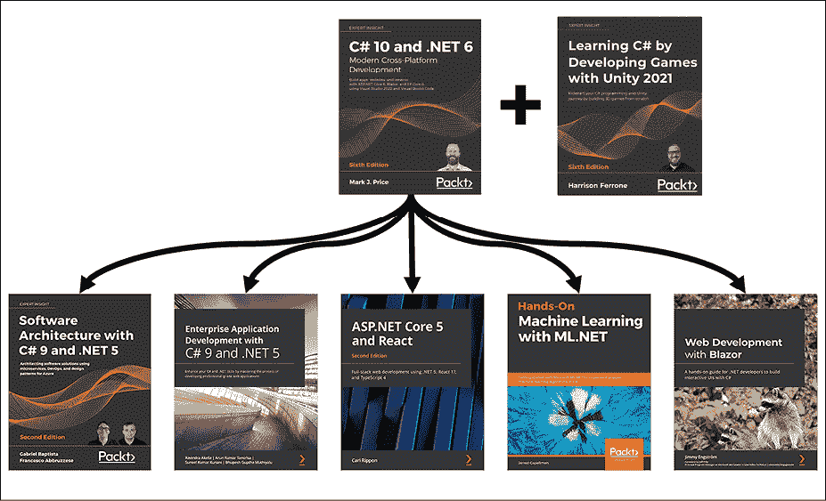

# 后记

我希望这本书与市场上的其他书有所不同。我希望你觉得这是一本轻松有趣的书，每一个主题都有实用的实践演练。

本结语包含以下简短部分：

*   C#和.NET 学习旅程的下一步
*   .NET 毛伊岛延迟
*   下一版将于 2022 年 11 月出版
*   祝你好运

# C#和.NET 学习旅程的下一步

对于您想要了解的主题，我希望 GitHub 存储库中的注释、良好实践提示和链接为您指明了正确的方向：

[https://github.com/markjprice/cs10dotnet6/blob/main/book-links.md](https://github.com/markjprice/cs10dotnet6/blob/main/book-links.md)

## 用设计指南提高你的技能

现在，您已经了解了使用 C#和.NET 进行开发的基本原理，您已经准备好通过学习更详细的设计指南来提高代码的质量。

早在.NET Framework 时代早期，Microsoft 就出版了一本关于.NET 开发各个领域的良好实践的书。这些建议仍然非常适用于现代.NET 开发。

涵盖以下主题：

*   命名原则
*   类型设计指南
*   构件设计指南
*   可扩展性设计
*   例外情况的设计指南
*   使用指南
*   通用设计模式

为了使指导尽可能容易地遵循，建议简单地用术语“To T0”做标记。

Microsoft 已通过以下链接提供了本书的摘录：

[https://docs.microsoft.com/en-us/dotnet/standard/design-guidelines/](https://docs.microsoft.com/en-us/dotnet/standard/design-guidelines/)

我强烈建议您检查所有准则，并将它们应用到代码中。

## 帮助你进一步学习的书籍

如果你想从我的出版商那里寻找其他涉及相关主题的书籍，有很多可供选择。我推荐 Harrison Ferrone 的*通过使用 Unity 2021*开发游戏来学习 C#，作为我学习 C#书的有趣补充。

还有很多书将 C#和.NET 更进一步，如*图 18.1*所示：

<figure class="mediaobject"></figure>

图 18.1：将 C#和.NET 学习推向更高层次的打包书

# .NET 毛伊岛延迟

微软计划用.NET6 发布.NETMAUI。但该团队在 2021 年 9 月意识到，他们将无法实现这一目标。他们还需要六个月来确保它满足质量和性能预期。您可以通过以下链接阅读关于.NET MAUI 延迟的官方公告：

[https://devblogs.microsoft.com/dotnet/update-on-dotnet-maui/](https://devblogs.microsoft.com/dotnet/update-on-dotnet-maui/)

我预计.NET MAUI 将在 2022 年 5 月的 Microsoft Build 大会上发布产品。在此之前，团队将发布每月预览。虽然我不能做出承诺，但我希望使用这本书的 GitHub 存储库中的预览发布.NETMaui 章节的更新，或者至少使用最终的 GA 版本发布更新。

# 下一版将于 2022 年 11 月出版

我已经开始编写第七版，我们计划在 2022 年 11 月发布.NET7.0 时发布。虽然我不希望在 Blazor 或.NETMaui 级别上有重大的新特性，但我确实希望.NET7.0 对.NET 的所有方面都做出有价值的改进。

如果您对希望涵盖或扩展的主题有建议，或者您发现了需要在文本或代码中纠正的错误，请通过本书的 GitHub 存储库（位于以下链接）告诉我详细信息：

[https://github.com/markjprice/cs10dotnet6](https://github.com/markjprice/cs10dotnet6)

# 祝你好运

我祝你所有的 C#和.NET 项目好运！

# 分享你的想法

现在您已经完成了*C#10 和.NET6-现代跨平台开发，第六版*，我们很想听听您的想法！如果您是从亚马逊购买本书，请[点击此处直接进入本书的亚马逊评论页面](https://packt.link/r/1801077363)，分享您的反馈或在您购买本书的网站上留下评论。

您的评论对我们和技术界都很重要，将帮助我们确保提供高质量的内容。