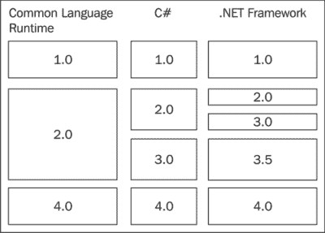

# 二、C# 的演变

在这一章中，我们回顾了 C# 的整个历史，直到最新的版本。我们将无法涵盖所有内容，但我们将触及主要特征，尤其是与历史相关的特征。每个版本都带来了独特的功能，这些功能将成为未来版本创新的基石。

# C # 1.0–开始时

当引入 C# 时，微软希望利用许多其他语言和运行时的最佳特性。它是一种面向对象的语言，有一个运行时，可以主动为您管理内存。这种语言(和框架)的一些特征是:

*   面向对象的
*   托管内存
*   丰富的基类库
*   公共语言运行时
*   类型安全

不管你的技术背景如何，C# 中有一些东西是你可以理解的。

## 运行时间

要说 C# 是不可能的，先不说运行时，叫**公共语言运行时** ( **CLR** ) 。CLR 的主要基础之一是与多种语言互操作的能力，这意味着您可以用多种不同的语言编写程序，并且可以在相同的运行时运行。这种互操作性是通过同意一组通用的数据类型来实现的，称为 **通用类型系统**。

之前。NET 框架中，不同语言之间确实没有明确的相互交流机制。一个环境中的字符串可能与另一种语言中的字符串概念不匹配，它们会被空终止吗？它们是用 ASCII 编码的吗？这个数字是如何表示的？根本没有办法知道，因为每种语言都有自己的特点。当然，人们试图想出解决这个问题的办法。

在 Windows 世界中，最著名的解决方案是使用**组件对象模型** ( **COM** ) ，它使用类型库来描述其中包含的类型。通过导出此类型库，程序可以与其他进程进行对话，这些进程可能是使用另一种技术编写的，也可能不是，因为您正在共享有关如何通信的详细信息。然而，这并不是没有复杂性，任何使用 Visual Basic 6 编写 COM 库的人都可以告诉你。这个过程通常有些不透明，因为工具抽象出了底层技术，而且部署是一场噩梦。甚至有一个著名的短语来描述它，DLL 地狱。

那个。NET 框架在某种程度上是对这个问题的回应。它在图中引入了通用类型系统，这是在 CLR 上运行的每种语言都需要遵守的规则，包括字符串和数值类型等通用数据类型、对象继承的工作方式以及类型可见性。

为了获得最大的灵活性，不直接编译为本机二进制代码，而是使用程序代码的中间表示作为实际的二进制映像，该映像被分发和执行，称为**MSIL**T2。然后在您第一次运行程序时编译这个 MSIL，这样就可以针对运行程序的特定处理器架构进行优化(**准时制** ( **JIT** )编译器)。这意味着在服务器和桌面上运行的程序可能会根据硬件而具有不同的性能特征。在过去，你必须编译两个不同的版本。


固有的多语言支持的另一个好处是，它充当了迁移策略。许多不同的语言与 C# 同时出现。拥有各种语言的现有代码库的公司可以很容易地将他们的程序转换成. NET 友好版本，该版本与 CLR 兼容，然后从其他语言中使用它。NET 语言，如 C#。一些语言包括:

*   **VB.NET**:这是流行的 Visual Basic 6 的天然继承者。
*   **J#** :这是. NET 的版本的 Java 语言。
*   **C++的托管扩展**:有了一个标志，一些新的关键字和语法，你可以使用一个现有的 c++应用，并将其编译成与 CLR 兼容的版本。

虽然这些语言中有许多已经发布，并被认为是完全受支持的，但如今真正保留下来的是 VB.Net 和 C#，以及在较小程度上的 C++/CLI。多年来，许多新的语言如 F# 、IronPython 、IronRuby 在 CLR 上如雨后春笋般涌现，它们在开发中保持活跃，社区充满活力。

## 内存管理

公共语言运行库提供了一个**垃圾收集器** ，这意味着当一个对象不再被其他对象引用时，将自动收集内存。这当然不是一个新概念；JavaScript 和 Visual Basic 等许多语言都支持垃圾收集。另一方面，非托管语言允许您在堆上手动分配内存，如果您愿意的话。虽然这种能力在你能实现的低层次解决方案方面给了你更多的权力，但它也给了你更多犯错的机会。

以下是 CLR 允许的两种数据类型:

*   **值类型**:这些数据类型是使用`struct`关键字创建的
*   **参考类型**:这些数据类型是使用`class`关键字创建的

C# 中的每一个原语数据类型，比如`int`、`float`，都是`struct`，而每一个类都是引用类型。关于这些类型如何在内部分配(堆栈还是堆)有一些语义，但是对于日常使用来说，这些差异通常并不重要。

当然，您可以创建自己的两种自定义类型。例如，下面是一个简单的值类型:

```cs
public struct Person
{
    public int Age;
    public string Name;
}
```

通过更改单个关键字，可以将此对象更改为引用类型，如下所示:

```cs
public class Person
{
    public int Age;
    public string Name;
}
```

`struct`实例和`class`实例有两个主要区别。首先，`struct`实例不能继承或被继承。然而，`class`实例是创建面向对象层次结构的主要工具。

其次，`class`实例参与垃圾收集过程，而`struct`实例不参与，至少不直接参与。互联网上的许多讨论倾向于将值类型的内存分配策略概括为在堆栈上分配，而引用类型在堆上分配(见下图)，但这并不是全部情况:


这通常是有一定道理的，因为当你在一个方法中实例化`class`时，它将总是在堆上，而创建一个值类型，比如`int`实例将会在栈上。但是，如果值类型被包装在引用类型中，例如，当值类型是`class`实例中的字段时，那么它将与类数据的其余部分一起被分配到堆中。

## 语法特征

C# 这个名字是对 C 语言的厚颜无耻的引用，就像 C++是 C(加上一些东西)一样，C# 在语法上也与 C 和 C++很大程度上相似，尽管有一些明显的变化。与 C 不同，C# 是一种面向对象的语言，但它有一些有趣的特性，使得它比其他面向对象的语言更容易、更高效地编写。

这方面的一个例子是属性获取器和设置器。在其他语言中，如果您想要控制如何公开对`class`实例数据的访问和修改，您必须将字段设为私有，这样外人就不能直接更改它。然后，您将创建两个方法，一个以`get`为前缀检索值，另一个以`set`为前缀检索值。在 C# 中，编译器负责为您生成那些方法对。请看下面的代码:

```cs
private int _value;

public int Value
{
    get { return _value; }
    set { _value = value; }
}
```

另一个有趣的创新是 C# 如何提供一流的事件支持。在 Java 等其他语言中，它们通过例如拥有一个名为`setOnClickListener(OnClickListener listener)` 的方法来近似事件。要使用它，您必须定义一个实现`OnClickListener`接口的新类，并将其传入。这种技术确实有效，但是可能有点冗长。使用 C#，您可以定义所谓的**委托** 来将一个方法表示为适当的、独立的对象，如下所示:

```cs
public delegate void MyClickDelegate(string value);
```

该`delegate`可用作一个类的事件，如下所示:

```cs
public class MyClass
{
    public event MyClickDelegate OnClick;
}
```

要在事件发生时注册通知，您只需创建委托，并使用`+=`语法将其添加到委托列表中，如下所示:

```cs
public void Initialize()
{
    MyClass obj = new MyClass();
    obj.OnClick += new MyClickDelegate(obj_OnClick);
}

void obj_OnClick(string value)
{
    // react to the event
}
```

该语言会自动将委托添加到委托列表中，每当引发事件时都会通知该列表。在 Java 中，这种行为必须手动实现。

当 C# 启动时，还有许多其他有趣的语法特性，比如异常的工作方式、using 语句等等。但是为了简洁起见，让我们继续。

## 基础类库

默认情况下，C# 附带了一个丰富而庞大的框架，称为 **基础类库** ( **BCL** )。如下图所示，BCL 提供了广泛的功能:


该图显示了基类库中包含的一些名称空间(重点是几个)。虽然还有大量其他名称空间，但这些是最重要的几个名称空间，它们为微软和第三方发布的许多功能和库提供了基础架构。

在学习如何编程时，您发现的数据结构类型之一是处理信息收集的数据结构类型。通常，您会学习使用数组编写大多数程序和算法。不过有了数组，你必须提前知道集合的大小。`System.Collections`命名空间附带了一组数据结构集合，使得处理未知数量的数据变得容易。

在我编写的第一个程序中(在前一章中有简要描述)，我使用了一个预分配的数组。为了简单起见，数组被分配了任意多的元素，这样我就不会用完数组中的空间。当然，这在专业编写的非琐碎程序中永远不会起作用，因为如果遇到比预期更大的数据集，您要么会耗尽空间，要么会浪费内存。在这里，我们可以使用最基本的集合类型之一`ArrayList`集合来克服这个问题，如下所示:

```cs
// first, collect the paycheck amount
Console.WriteLine("How much were you paid? ");
string input = Console.ReadLine();
float paycheckAmount = float.Parse(input);

// now, collect all of the bills
Console.WriteLine("What bills do you have to pay? ");
ArrayList bills = new ArrayList();
input = Console.ReadLine();
while (input != "")
{
    float billAmount = float.Parse(input);
    bills.Add(billAmount);
    input = Console.ReadLine();
}

// finally, summ the bills and do the final output
float totalBillAmount = 0;
for (int i = 0; i < bills.Count; i++)
{
    float billAmount = (float)bills[i];
    totalBillAmount += billAmount;
}

if (paycheckAmount > totalBillAmount)
{
    Console.WriteLine("You will have {0:c} left over after paying bills", paycheckAmount - totalBillAmount);
}
else if (paycheckAmount < totalBillAmount)
{
    Console.WriteLine("Not enough money, you need to find an extra {0:c}", totalBillAmount - paycheckAmount);
}
else
{
    Console.WriteLine("Just enough to cover bills");
}
```

如您所见，`ArrayList`集合的一个实例是创建的，但是没有指定大小。这是因为集合类型在内部管理它们的大小。这种抽象减轻了你的尺寸责任，所以你可以担心更大的事情。

其他一些可用的收集类型如下:

*   `HashTable` : 此类型允许您提供查找键和值。它通常用于创建非常简单的内存数据库。
*   `Stack`:这是一个先进先出的数据结构。
*   `Queue`:这个是先进先出的数据结构。

看着具体的集合，类并没有真正讲述整个故事。如果您遵循继承链，您会注意到每个集合都实现了一个名为`IEnumerable`的接口。这将成为整个语言中最重要的界面之一，因此尽早熟悉它很重要。

`IEnumerable`，还有姊妹类，`IEnumerator` ，抽象出枚举超过一个集合的项目的概念。您总是会看到这些接口串联使用，而且非常简单。您可以看到如下内容:

```cs
namespace System.Collections
{
    public interface IEnumerable
    {
        IEnumerator GetEnumerator();
    }

    public interface IEnumerator
    {
        object Current { get; }
        bool MoveNext();
        void Reset();
    }
}
```

乍一看，你可能想知道为什么集合要实现`IEnumerable`，它有一个返回`IEnumerator`的单一方法，而不是直接实现`IEnumerator`。枚举器负责枚举集合。但这是有充分理由的。如果集合本身是枚举数，那么您将不能同时迭代同一个集合。因此，对`GetEnumerator()` 的每次调用通常都会返回一个单独的枚举器，尽管这绝不是一个要求。

虽然界面非常简单，但事实证明拥有这种抽象是非常强大的。C# 实现了一种很好的简写语法，可以迭代一个集合，而不必使用必须传入的索引变量进行常规的`for`循环。下面的代码对此进行了解释:

```cs
int[] numbers = new int[3];
numbers[0] = 1;
numbers[1] = 2;
numbers[2] = 3;

foreach (int number in numbers)
{
    Console.WriteLine(number);
}
```

`foreach`语法起作用，因为它是编译器实际生成的代码的简写。它将生成代码来与幕后的可枚举对象进行交互。因此，前面示例中的循环看起来像编译后的 MSIL，如下所示:

```cs
IEnumerator enumerator = numbers.GetEnumerator();

while (enumerator.MoveNext())
{
    int number = (int)enumerator.Current;
    Console.WriteLine(number);
}
```

再一次，我们有一个 C# 编译器生成代码的例子，它不同于您实际编写的代码。这将是 C# 进化的关键，使您编写的通用代码模式更容易表达，从而提高效率和生产力。

对一些开发人员来说，C# 刚问世时是对 Java 的廉价模仿。但对像我这样的开发人员来说，这是一股新鲜空气，它提供了比 VBScript 等解释语言更高的性能，比 C++等语言更安全、更简单，比 JavaScript 等语言更低级。

# C# 2.0

C# 语言、运行时和的第一次重大更新。NET 框架是一个大框架。这个版本的重点是让语言更简洁，更容易写。

## 语法更新

第一次更新给属性语法增加了一个小功能。在 1.0 中，如果您想要一个只读属性，您唯一的选择就是排除 setter，如下所示:

```cs
private int _value;

public int Value
{
    get { return _value; }
}
```

所有内部逻辑都必须直接与`_value`成员交互。在许多情况下，这很好，除了需要某种逻辑来控制何时以及如何允许您更改该值的情况。或者类似地，如果需要引发事件，您必须创建一个私有方法，如下所示:

```cs
private void SetValue(int value)
{
    if (_value < 5)
        _value = value;
}
```

C# 2.0 中没有了，因为您现在可以创建如下的私有 setter:

```cs
private int _value;

public int Value
{
    get { return _value; }
    private set
    {
        if (_value < 5)
            _value = value;
    }
}
```

一个小特性，但是它增加了一致性，因为独立的 getter 和 setter 方法是 C# 试图从第一个版本中摆脱的东西之一。

另一个有趣的补充是**可空**类型。对于值类型，编译器不允许您将它们设置为空值，但是，您现在有了一个新的键字符，可以用来表示可为空的值类型，如下所示:

```cs
int? number = null;
if (number.HasValue)
{
    int actualValue = number.Value;
    Console.WriteLine(actualValue);
}
```

只需添加问题标记，值类型就被标记为可空，您可以使用`.HasValue`和`.Value`属性来决定在空的情况下该做什么。

## 匿名方法

与其他语言相比，委托是 C# 的一个很好的补充。它们是事件系统的构建模块。然而，在 C# 1.0 中实现它们的一个缺点是，它们使读取代码变得更加困难，因为当事件被引发时执行的代码实际上是写在其他地方的。延续代码简化的趋势，**匿名方法**让你内联编写代码。例如，给定以下委托定义:

```cs
public delegate void ProcessNameDelegate(string name);
```

您可以使用匿名方法创建委托的实例，如下所示:

```cs
ProcessNameDelegate myDelegate = delegate(string name)
{
    Console.WriteLine("Processing Name = " + name);
};

myDelegate("Joel");
```

这段代码是内联的，很短，很容易理解。它还允许您使用委托，就像 JavaScript 等其他语言中的一流函数一样。但它不仅仅是简单地更容易阅读。如果要将参数传递给不接受 C# 1.0 中参数的委托，则必须创建一个自定义类来包装方法实现和存储值。这样，当调用委托(从而执行目标方法)时，它就可以访问该值。任何早期的多线程代码都充满了如下代码:

```cs
public class CustomThreadStarter
{
    private int value;
    public CustomThreadStarter(int val)
    {
        this.value = val;
    }

    public void Execute()
    {
        // do something with 'value'
    }
}
```

这个类在构造函数中接受一个值，并将其存储在私有成员中。然后，当调用委托时，可以使用该值，就像在这种情况下使用它来启动一个新线程一样。这在以下代码中显示:

```cs
CustomThreadStarter starter = new CustomThreadStarter(55);
ThreadStart start = new ThreadStart(starter.Execute);
Thread thread = new Thread(start);
thread.Start();
```

通过匿名委托，编译器可以介入并大大简化前面提到的使用模式，如下所示:

```cs
int value = 55;
Thread thread = new Thread(delegate()
    {
        // do something with 'value'
        Console.WriteLine(value);
    });
thread.Start();
```

这看起来可能很简单，但是这里有一些严重的编译器魔法。编译器分析了代码，意识到匿名方法需要方法体中的`value`变量，并自动生成了一个类似于我们在 C# 1.0 中必须创建的`CustomThreadStarter` 的类。结果是你能容易地阅读的代码，因为它都在那里，就在与其余的上下文中。

## 部分班

在 C# 1.0 中，使用代码生成器来自动化定制集合等事情是很常见的做法。当您想要将自己的方法和属性添加到生成的代码中时，通常必须从类继承，或者在某些情况下，直接编辑生成的文件。这意味着您必须非常小心，避免重新生成代码，或者冒覆盖您的自定义逻辑的风险。在许多第一代工具中，您会发现类似以下的注释:

```cs
// <auto-generated>
//     This code was generated by a tool.
//     Runtime Version:2.0.50727.3053
//
//     Changes to this file may cause incorrect behavior and will be lost if
//     the code is regenerated.
// </auto-generated>
```

C# 2.0 在你的武器库中增加了一个额外的关键词`partial`。有了**分部**类，你可以在多个文件中拆分你的类。要看到这一点，请创建以下类:

```cs
// A.generated.cs
public partial class A
{
    public string Name;
}
```

这表示自动生成的代码。注意文件文件名中包含`.generated`；这是一个被采用的惯例，尽管这不是工作所必需的，只是两个文件是同一个项目的一部分。然后在一个单独的文件中，您可以包含实现的其余部分，如下所示:

```cs
// A.cs
public partial class A
{
    public int Age;
}
```

所有成员在运行时对结果类型都是可用的，因为编译器会小心地将类缝合在一起。您可以随意重新生成第一个文件，而不会有覆盖您的更改的风险。

## 仿制药

C# 2.0 的主要特性添加是**泛型**，它允许您创建可以与多种类型的对象重用的类。过去，这种编程只能通过两种方式完成。您可以为参数使用公共基类，以便从该类继承的任何对象都可以传入，而不管具体的实现如何。这在某种程度上是可行的，但是当您想要创建一个非常通用的数据结构时，它就变得非常有限了。另一种方法实际上只是第一种方法的衍生。不要使用自己定义的基类，而是一直沿着继承树向上，对类型参数使用`object`。

这样做是因为。NET 派生自`object`，所以可以传入任何东西。这是原始集合类使用的方法。但即使这样也有问题，尤其是当涉及到传递值类型时，由于拳击的影响。您还必须每次都将类型从对象中抛出。

谢天谢地，所有这些问题都可以通过使用泛型来缓解，如下所示:

```cs
public class Message<T>
{
    public T Value;
}
```

在这个例子中，我们定义了一个名为`T`的**泛型类型参数** 。泛型类型参数的实际名称可以是任何东西，`T`只是用作约定。实例化`Message`类时，可以使用以下语法指定要存储在`Value`属性中的对象类型:

```cs
Message<int> message = new Message<int>();
message.Value = 3;
int variable = message.Value;
```

因此，您可以为该字段分配一个整数，而不用担心性能，因为该值不会被装箱。当您想要使用它时，也不必像使用对象时那样强制转换它。

仿制药超级强大，但也不是万能的。为了强调一个关键的不足，我们将回顾 2.0 第一次发布时几乎每个 C# 开发人员尝试的第一件事——泛型数学。数学密集型应用的开发人员可能会在他们的领域中使用数学库。例如，游戏开发人员(或者实际上，任何做任何涉及 2D 或 3D 空间计算的事情的人)总是需要一个良好的`Vector`结构，如下所示:

```cs
public struct Vector
{
    public float X;
    public float Y;

    public void Add(Vector other)
    {
        this.X += other.X;
        this.Y += other.Y;
    }
}
```

但问题是它使用的是`float`数据类型进行计算。如果你想推广它并支持其他数字类型，如`int`、`double`或`decimal`，你会怎么做？乍一看，您会认为可以使用泛型来支持这种情况，如下所示:

```cs
public struct Vector<T>
{
    public T X;
    public T Y;

    public void Add(Vector<T> other)
    {
        this.X += other.X;
        this.Y += other.Y;
    }
}
```

对此进行编译将导致错误，**运算符“+=”不能应用于“T”和“T”**类型的操作数。这是因为，默认情况下，只有来自`object`数据类型的成员可用于泛型参数，因为编译器无法知道在您使用的类型上定义了哪些方法(以及扩展操作)。

值得庆幸的是，微软在某种程度上预见到了这一点，并添加了一些名为**泛型类型约束** 的东西。这些约束让您向编译器提示调用方将被允许使用哪种类型，这反过来意味着您可以使用您约束的功能。例如，请看下面的代码:

```cs
public void WriteIt<T>(T list) where T : IEnumerable
{
    foreach (object item in list)
    {
        Console.WriteLine(item);
    }
}
```

在这里，我们添加了一个约束，要求类型参数`T`必须是`IEnumerable`。因此，您可以编写代码，并且知道任何调用此方法的调用方只会使用实现`IEnumerable`接口的类型作为类型参数，这是安全的。您可以使用的其他一些参数约束如下:

*   `class`:这个表示类型参数必须是引用类型。
*   `struct`:这个表示只允许值类型。
*   `new()`:这里必须是没有这个类型参数的公共构造函数。它将允许您使用类似`T value = new T()`的语法来创建类型参数的新实例。否则，您唯一能做的就是类似`T value = default(T)`的事情，它将为引用类型返回 null，为数值基元返回零。
*   `<name of interface>` : 这限制了类型参数使用这里提到的界面，如前面提到的`IEnumerable`所示。
*   `<name of class>`:与此约束一起使用的任何类型都必须是此类型，或者在继承链的某个点从该类型继承。

不幸的是，因为数值数据结构是值类型，所以它们不能继承，因此在类型约束中没有通用类型可以使用，该约束将为您提供数学运算所需的数学运算符。

作为一般的经验法则，泛型在“框架”风格的代码中最有用，也就是说应用的一般基础设施，或者数据结构，比如集合。事实上，C# 2.0 中出现了一些很棒的新集合类型。

## 通用系列

泛型对于集合来说是完美的，因为集合本身并不需要与它包含的对象进行交互；它只需要一个地方放它们。因此，对于集合，类型参数没有约束。所有新的通用集合都可以在命名空间中找到，如下所示:

```cs
using System.Collections.Generic;
```

正如我们之前讨论的，C# 1.0 中最基本的集合类型是`ArrayList`集合，这在当时非常有效。然而，值类型将被装箱，因为它使用`object`作为其有效载荷类型，并且每次您想要拉出一个值时，您必须将该对象投射到您的目标对象类型中。有了仿制药，我们现在有`List<T>`如下:

```cs
List<int> list = new List<int>();
list.Add(1);
list.Add(2);
list.Add(3);

int value = list[1]; // returns 2;
```

用法实际上与`ArrayList`集合相同，但是具有泛型的性能优势。可用作泛型类的一些其他类型如下:

*   `Queue<T>`:这个和非通用`Queue`、 **先进先出** ( **先进先出**)一样。
*   `Stack<T>`:这里和非通用版的`Stack`、 **后进先出** ( **LIFO** )没有区别。
*   `Dictionary<T, K>`:这个代替了 C# 1.0 中的`Hashtable`集合。它为每个字典项的键和值使用两个通用参数。这意味着您可以使用字符串以外的键。

## 迭代器方法

也许 C# 2.0 中更独特的特性之一是迭代器方法。它们是一种让编译器在序列上自动生成自定义迭代的方式。诚然，这种描述有点抽象，所以最简单的解释方法是使用一些代码，如下所示:

```cs
private static IEnumerable<string> GetStates()
{
    yield return "Orlando";
    yield return "New York";
    yield return "Atlanta";
    yield return "Los Angeles";
}
```

在前面的方法中，您看到了一个返回`IEnumerable<string>`的方法。然而，在方法体中，只有四行连续的代码使用`yield`关键字。这告诉编译器生成一个自定义枚举器，该枚举器将方法分解为两个收益之间的每个独立部分，以便在调用方枚举返回值时执行该方法。这在以下代码中显示:

```cs
foreach (string state in GetStates())
{
    Console.WriteLine(state);
}
// outputs Orlando, New York, Atlanta, and Los Angeles
```

有很多不同的方法来处理和使用迭代器，但这里的亮点是 C# 编译器在这个版本中变得越来越聪明。它能够接受你的代码并扩展它。这使您可以在更高的抽象级别上编写代码，这是 C# 发展过程中的一个持续主题。

# C# 3.0

如果你以为 C# 2.0 是大更新，那 3.0 版本更大！很难在一章(更不用说一章的一部分)中公正地对待它。因此，我们将重点关注主要特性，尤其是与 C# 的发展相关的特性。

首先，我们应该谈谈 C#、CLR 和。NET 框架。到目前为止，它们大多都有相同的版本(即 C# 2.0、CLR 2.0 和。NET Framework 2.0)，但是他们发布了。NET 框架(3.0)，没有语言或 CLR 更改。然后用。NET 3.5，他们发布了 C# 3.0。下图解释了这些差异:


很困惑，我知道。虽然 C# 语言和。NET 框架得到了升级，CLR 保持不变。这很难让人相信，尤其是考虑到所有的新特性，但这表明了 CLR 的开发人员是多么有远见，以及 C# 语言/编译器是多么精心设计和可扩展，他们能够在没有新的运行时支持的情况下添加新的特性。

## 语法更新

像往常一样，我们将开始回顾这个版本语言的句法变化。首先是属性，正如您将会记得的，它已经是对旧式的 getter 和 setter 方法的改进。在 C# 3.0 中，编译器可以自动为简单的 getters 和 setters 生成后备字段，如下所示:

```cs
public string Name { get; set; }
```

仅这一特性就从具有许多属性的类中删除了许多代码行。引入的另一个好特性是**对象初始化器** 。以下面这个简单的类为例:

```cs
public class Person
{
    public string Name { get; set; }
    public int Age { get; set; }
}
```

如果您想要创建一个实例并对其进行初始化，通常需要编写如下代码:

```cs
Person person = new Person();
person.Name = "Layla";
person.Age = 11;
```

但是有了对象初始化器，您可以在对象实例化的同时这样做，如下所示:

```cs
Person person = new Person { Name = "Layla", Age = 11 };
```

编译器实际上会生成与之前几乎相同的代码，因此没有语义差异。但是您可以用更简洁、更易读的方式编写代码。集合得到了类似的处理，因为您现在可以使用以下语法初始化数组:

```cs
int[] numbers = { 1, 2, 3, 4, 5 };
```

众所周知，字典的初始化非常繁琐，现在可以非常容易地创建如下:

```cs
Dictionary<string, int> states = new Dictionary<string,int>
{
    { "NY", 1 },
    { "FL", 2 },
    { "NJ", 3 }
};
```

这些改进中的每一个都使得键入代码的行为变得更加容易和快速。但是 C# 语言设计者似乎并不满足于此。每次实例化一个新的变量，你都被迫写出整个类型名，当你开始进入复杂的泛型类型时，这会给你的程序增加很多额外的字符。不要害怕！你甚至不需要在 C# 3.0 中这么做！请看下面的代码:

```cs
var num = 8;
var name = "Ashton";
var map = new Dictionary<string, int>();
```

只要明确等式右侧分配的是什么类型，编译器就可以负责算出左侧的类型。机敏的读者无疑会从 JavaScript 中认出`var`这个关键词。虽然看起来很相似，但根本不一样。C# 仍然是静态类型的，这意味着每个变量在编译时都必须是已知的。以下代码不会编译:

```cs
var num = 8;
num = "Tabbitha";
```

所以，实际上，这只是一个帮助你输入更少字符的捷径，编译器只是真的很擅长推断这些东西。事实上，这并不是它唯一能推断的。如果有足够的上下文，还可以推断泛型类型参数。例如，考虑以下简单的通用方法:

```cs
public string ConvertToString<T>(T value)
{
    return value.ToString();
}
```

当您调用它时，编译器可以查看传入的类的类型，而不是在调用中声明类型，并简单地假设这是应该用于类型参数的类型，如下所示:

```cs
string s = ConvertToString(234);
```

在这一点上，我想 C# 语言团队中的某个人会说:“当我们让现有的语法成为可选的时候，为什么不完全取消对类定义的需求呢！”看起来他们就是这么做的。如果需要一个数据类型来保存几个字段，可以按照如下方式内联声明它:

```cs
var me = new { Name = "Joel", Age = 31 };
```

编译器将自动创建一个与您刚刚创建的类型相匹配的类。这个特性有几个限制:必须使用`var`关键字，不能从方法返回匿名类型。当您正在编写算法并且需要快速但复杂的数据类型时，这非常有用。

所有这些小的语法变化加起来，使 C# 语言成为一种乐趣。它们也是我们将要讨论的下一个重要特性的先导。

## LINQ

**语言集成查询** ( **LINQ** )是c# 3.0 的旗舰功能。它承认现代程序的大部分都是围绕着以这样或那样的方式查询数据这一事实。LINQ 是一组多样的特性，它为语言提供了一流的支持，可以从多种来源查询数据。它通过围绕查询的概念提供强大的抽象，然后添加语言支持来做到这一点。

C# 语言团队以 SQL 已经是处理基于集合的数据的优秀语法为前提。但是，不幸的是，它不是语言的一部分；它需要一个不同的运行时，例如 SQL Server，并且只在该上下文中工作。LINQ 不需要这样的上下文切换，所以您可以简单地获取对数据源的引用，然后进行查询。

从概念上讲，您可以对一个集合执行以下高级操作:

*   **过滤**:这是执行的，在这里你根据一些标准从集合中排除项目
*   **聚合**:这个涉及到常见的聚合动作，比如分组、求和
*   **投影**:这个正在提取或者从集合中转换物品

下面是一个简单的 LINQ 查询的样子:

```cs
int[] numbers = { 1, 2, 3, 4, 5, 6 };

IEnumerable<int> query = from num in numbers
                            where num > 3
                            select num;

foreach (var num in query)
{
    Console.WriteLine(num);
}
// outputs 4, 5, and 6
```

它看起来有点像 SQL。多年来，关于语法为什么不像在 SQL 中那样以 select 语句开始一直有很多问题，但原因归结于工具。当您开始键入时，他们希望您能够在键入查询的每个部分时获得智能感知。通过从“from”开始，您实际上是在告诉编译器在查询的剩余部分将使用什么类型，这意味着它可以为您提供类型时间支持。

LINQ 有趣的一点是它对任何人都有效。想一想，你程序中的每一个集合现在都很容易搜索。这还不是全部，您还可以聚合和塑造输出。例如，假设您想要获得每个州的城市计数，如下所示:

```cs
var cities = new[]
{
    new { City="Orlando", State="FL" },
    new { City="Miami", State="FL" },
    new { City="New York", State="NY" },
    new { City="Allendale", State="NJ" }
};

var query = from city in cities
            group city by city.State into state
            select new { Name = state.Key, Cities = state };

foreach (var state in query)
{
    Console.WriteLine("{0} has {1} cities in this collection", state.Name, state.Cities.Count());
}
```

此查询使用 group by 子句按公共键对值进行分组，在本例中是按状态分组。最后的输出也是一个新的匿名类型，它有两个属性，名称和该州的城市集合。运行这个程序将为佛罗里达州输出这个，因为佛罗里达州在这个集合中有两个城市。

到目前为止，在这些例子中，我们一直在使用所谓的**查询语法** 。这很好，因为它对那些了解 SQL 的人来说非常熟悉。然而，就像 SQL 一样，更复杂的查询有时会变得相当冗长和复杂。还有另一种方式来编写 LINQ 查询，对一些人来说，这种方式更容易理解，或许更灵活一点，叫做**【LINQ】方法语法**，它建立在语言的另一个新特性之上。

## 延伸方法

通常，扩展类型功能的唯一方式是从类继承并将特性添加到子类型中。所有用户都必须使用新的类型才能获得新类型的好处。但是，这可能并不总是一个选项，例如，如果您正在使用具有值类型的第三方库(因为您不能从值类型继承)。假设我们在第三方库中有以下`struct`，我们无权修改源代码:

```cs
public struct Point
{
    public float X;
    public float Y;
}
```

使用扩展方法，您可以向该类型添加新方法，如下所示:

```cs
public static class PointExtensions
{
    public static void Add(this Point value, Point other)
    {
        value.X += other.X;
        value.Y += other.Y;
    }
}
```

扩展方法必须放在公共静态类中。方法本身将是静态的，并将在第一个参数上使用`this`关键字来表示要附加的类型。使用前面的方法看起来该方法一直是类型的一部分，如下所示:

```cs
var point = new Point { X = 28.5381f, Y = 81.3794f };
var other = new Point { X = -2.6809f, Y = -1.1011f };

point.Add(other);
Console.WriteLine("{0}, {1}", point.X, point.Y);
// outputs "25.8572, 80.2783"
```

您可以将扩展方法添加到任何类型，无论是值类型还是引用类型。接口和密封类也可以扩展。如果你看看 C# 3.0 中的所有变化，你会注意到你现在写的代码变少了，因为编译器在幕后为你生成了越来越多的代码。其结果是代码看起来类似于其他一些动态语言，如 JavaScript。

# C# 4.0

随着语言的第四次迭代，微软试图通过将每个组件的版本增加到 4.0 来简化它在前几个版本中造成的版本混乱。



C# 4.0 为语言带来了更多的动态功能，并继续使 C# 成为一种非常强大但敏捷的语言。添加的一些特性主要是为了使与本机平台代码的互操作更容易。协方差、对方差和可选参数等简化了操作过程，例如，调用互操作程序集与 Microsoft Word 进行交互。总的来说，不是什么惊天动地的事情，至少对你的普通日常开发人员来说是这样。

然而，随着一个新的关键词`dynamic`的加入，C# 离成为一门非常有活力的语言又近了一步；或者至少继承了动态语言的许多特性。还记得引入泛型时，如果您有一个空的类型参数(也就是说，没有类型约束)，它会被视为一个对象。编译器没有关于该类型在运行时可以访问哪种方法和属性的附加信息，因此您只能作为一个对象与之交互。

在 C# 4.0 中，您现在有了一种编写代码的方法，可以在运行时绑定到正确的属性和方法。下面是一个简单的例子:

```cs
dynamic o = GetAString() ;

string s = o.Substring(2, 3);
```

### 类型

如果您正在从框架的早期版本迁移项目，请确保在使用动态编程时添加对`Microsoft.CSharp.dll,`的引用。如果不存在，您将收到编译错误。

在这个假设的场景中，你有一个返回`string`的方法。接收`GetAString()`方法返回值的变量标有`dynamic`关键字。这意味着您在该对象上调用的每个属性和方法都将在运行时被动态评估。这使得 C# 除了自己定制的动态类型之外，还可以轻松地与动态语言互操作，比如 IronPython 和 IronRuby。

这是否意味着 C# 不再是静态类型化的？不，恰恰相反；C# 仍然是静态类型的，只是在这种情况下，您已经告诉编译器以不同的方式处理这段代码。它通过重写您的动态代码来使用**动态语言运行时**(**DLR**)来实现这一点，该动态语言运行时实际上编译出您的代码的表达式树，并在运行时进行评估。

通过继承名为`DynamicObject` 的内置类，您可以轻松创建自己的动态对象，如下所示:

```cs
public class Bag : DynamicObject
{
    private Dictionary<string, object> members = new Dictionary<string, object>();

    public override IEnumerable<string> GetDynamicMemberNames()
    {
        return members.Keys;
    }

    public override bool TryGetMember(GetMemberBinder binder, out object result)
    {
        return members.TryGetValue(binder.Name, out result);
    }

    public override bool TrySetMember(SetMemberBinder binder, object value)
    {
        members[binder.Name] = value;
        return true;
    }
}
```

在这个简单的例子中，我们从`DynamicObject`继承并覆盖了一些方法来获取和设置成员值。这些值存储在内部字典中，以便当数据链路连接器要求时，您可以拉出的正确值。使用这个类很容易让人联想到对象在 JavaScript 中有多灵活。请看下面的代码:

```cs
dynamic bag = new Bag();

bag.Name = "Joel";
bag.Age = 31;
bag.CalcDoubleAge = new Func<int>(() => bag.Age * 2);

Console.WriteLine(bag.CalcDoubleAge());
```

如果需要存储新值，只需设置属性。如果要定义一个新方法，可以使用委托作为成员的值。当然，您必须意识到这不会像拥有一个常规的静态类型类那样快，每个值都必须在运行时被查找，并且因为值在内部存储为对象，所以任何值类型都将被装箱。但有时这些缺点是完全可以接受的，尤其是当它可以简化您的代码时。

# 总结

对我来说，这是一个惊人的旅程，看着 C# 从最初的版本发展到今天。每个后续版本都比前一个版本更强大，并且始终有一个非常坚实的代码简化主题。编译器本身已经越来越擅长为您生成代码，这样您就可以在程序中实现非常强大的功能，而不会有口头实现基础设施(泛型、迭代器、LINQ 和 DLR)的认知负担

在这一章中，我们看了每个 C# 版本中引入的一些主要特性

*   **C# 1.0** :内存管理、基类库、属性、事件等语法特性。
*   **C# 2.0** :泛型、迭代器方法、分部类、匿名方法以及语法更新，比如属性和可空类型上的可见性修饰符。
*   **C# 3.0** : **语言集成查询** ( **LINQ** )、扩展方法、自动属性、对象初始值设定项、类型推断(`var`)和匿名类型。
*   **C # 4.0**:**动态语言运行时** ( **DLR** )以及协同和反向差异

现在，我们转到最新版本，C # 5.0。Iliquamet quae volor aut ium ea doleseq uibusam，quiasped utem atet etur sus。