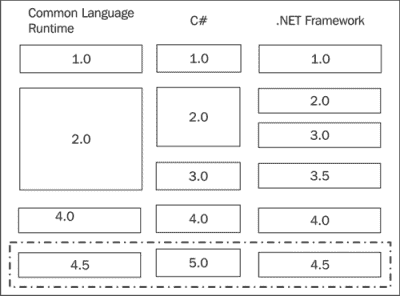
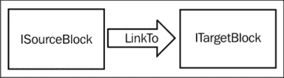

# 三、异步实战

我们将探索在 5.0 版本中对 C# 来说是新的特性。值得注意的是，它们中的大多数都与添加到语言中的内置异步特性有关，这使得您可以轻松地使用运行软件的硬件来充分发挥其潜力。我们还将讨论**任务并行库** ( **TPL** )，它引入了异步编程的原语，C# 5.0 语言对轻松异步的支持，TPL 数据流，基于代理的异步编程的更高级抽象，以及利用新的异步特性的框架改进，例如对 I/O API 的改进。

综合考虑，最新发布的.NET Framework 非常庞大，本章中介绍的概念将作为本书其余部分所涵盖的材料的参考。

# 异步

当我们谈论 C# 5.0 时，主要的话题是新的异步编程特性。**异步**是什么意思？嗯，它可能意味着一些不同的东西，但在我们的上下文中，它只是同步的对立面。当您将程序的执行分解成异步块时，您就获得了并行并行执行它们的能力。

> 成功之坑:与顶峰、顶峰或穿越沙漠通过许多考验和惊喜寻找胜利的旅程形成鲜明对比的是，我们希望我们的客户通过使用我们的平台和框架简单地陷入成功的实践中。就我们容易陷入麻烦的程度而言，我们失败了。-里科·马里亚尼

不幸的是，构建异步软件并不总是容易的，但是有了 C# 5.0，你会发现它是多么容易。如下图所示，同时执行多个动作可以为程序带来各种积极的品质:


并行执行可以提高程序的执行性能。最好的方法是通过一个例子，一个在桌面软件世界中经常经历的例子。

假设您有一个正在开发的应用，该软件应该满足以下要求:

1.  当用户点击一个按钮时，启动对 web 服务的调用。
2.  完成 web 服务调用后，将结果存储到数据库中。
3.  最后，绑定结果并显示给用户。

这种天真的解决方案有很多问题。首先，许多开发人员编写代码的方式是，当我们等待接收这些 web 服务调用的结果时，用户界面将完全没有响应。然后，一旦结果最终到达，我们继续让用户等待，同时我们将结果存储在数据库中，在这种情况下，用户不关心这个操作。

过去缓解这类问题的主要工具是编写多线程代码。这当然不是什么新鲜事，因为多线程硬件以及利用这种硬件的软件功能已经存在多年。大多数编程语言并没有在这个硬件之上提供一个非常好的抽象层，经常让(或要求)你直接针对硬件线程进行编程。

谢天谢地，微软引入了一个新的库来简化编写高并发程序的任务，这将在下一节中解释。

## 任务并行库

**任务并行库** ( **第三方物流** ) 于年推出.NET 4.0(和 C# 4.0 一起)。我们没有在[第二章](2.html "Chapter 2. Evolution of C#")、*c#*进化中涉及到，有几个原因。首先，这是一个巨大的话题，不可能在这么小的空间里被恰当地审视。其次，它与 C# 5.0 中的新异步特性高度相关，以至于它们是构建新特性的文字基础。因此，在这一节中，我们将介绍第三方物流的基础知识，以及一些关于它如何工作以及为什么工作的背景信息。

第三方物流引入了一种新的类型`Task`类型，它将*必须做的事情*的概念抽象成一个对象。乍一看，你可能认为这个抽象已经以`Thread`类的形式存在了。虽然`Task`和`Thread`之间有一些相似之处，但是它们的实现有着完全不同的含义。

使用`Thread`类，您可以直接针对操作系统支持的最低并行级别进行编程，如以下代码所示:

```cs
Thread thread = new Thread(new ThreadStart(() =>
{
Thread.Sleep(1000);
Console.WriteLine("Hello, from the Thread");
    }));
thread.Start();

Console.WriteLine("Hello, from the main thread");
thread.Join();
```

在前面的例子中，我们创建了一个新的`Thread`类，当它启动时会休眠一秒钟，然后从线程中写出文本**你好。我们调用`thread.Start()`后，主线程上的代码立即继续，从主线程**写**你好。一秒钟后，我们看到文本从背景线程打印到屏幕上。**

从某种意义上说，这个使用`Thread`类的例子显示了将执行分支到后台线程是多么容易，同时允许主线程继续执行，不受阻碍。然而，使用`Thread`类作为您的“并发原语”的问题是，该类本身是实现的指示，也就是说，将创建一个操作系统线程。就抽象而言，它根本不是真正的抽象；您的代码必须管理线程的生命周期，同时处理线程正在执行的任务。

如果您有多个任务要执行，生成多个线程可能是灾难性的，因为操作系统只能生成有限数量的线程。对于性能密集型应用，线程应该被视为重量级资源，这意味着您应该避免使用太多线程，并尽可能长时间地保持它们的活动状态。正如你所想象的那样.NET Framework 没有简单地让你在没有任何帮助的情况下针对进行编程。早期版本的框架有一个以`ThreadPool`形式处理这个问题的机制，它允许你排队一个工作单元，并让线程池管理线程池的生命周期。当一个线程变得可用时，您的工作项就会被执行。下面是一个使用线程池的简单示例:

```cs
int[] numbers = { 1, 2, 3, 4 };

foreach (var number in numbers)
{
ThreadPool.QueueUserWorkItem(new WaitCallback(o =>
        {
Thread.Sleep(500);
            string tabs = new String('\t', (int)o);
Console.WriteLine("{0}processing #{1}", tabs, o);
        }), number);
}
```

此示例模拟多个任务，这些任务应该并行执行。我们从一个数字数组开始，对于每个数字，我们希望对一个将休眠半秒钟的工作项进行排队，然后写入控制台。这比自己尝试管理多个线程要好得多，因为如果有更多的工作，池将负责生成更多的线程。当达到并发线程的配置限制时，它将保留工作项，直到有一个线程可以处理它。如果你直接使用线程，这些都是你自己要做的工作。

然而，线程池也不是没有它的复杂性。首先，它没有提供在工作项完成时同步的方法。如果想在作业完成时得到通知，就必须自己编写通知代码，无论是通过引发事件，还是使用线程同步原语，如`ManualResetEvent` 。您还必须注意不要将太多的工作项排队，否则您可能会遇到线程池大小的系统限制。

有了第三方物流，我们现在有了一个称为`Task`的并发原语。考虑以下代码:

```cs
Task task = Task.Factory.StartNew(() =>
    {
Thread.Sleep(1000);
Console.WriteLine("Hello, from the Task");
    });

Console.WriteLine("Hello, from the main thread");

task.Wait();
```

乍一看，代码看起来与使用`Thread`的示例非常相似，但它们非常不同。一个很大的区别是`Task`并不是承诺实现。第三方物流在幕后使用一些非常有趣的算法来管理工作负载和系统资源，事实上，它允许您通过使用自定义调度器和同步上下文来自定义这些算法。这使您可以高度控制程序的并行执行。

处理多个任务，就像我们处理线程池一样，也更容易，因为每个任务都内置了同步特性。为了演示快速并行化任意数量的任务有多简单，我们从相同的整数数组开始，如前面的线程池示例所示:

```cs
int[] numbers = { 1, 2, 3, 4 };
```

因为`Task`可以被认为是一个表示异步任务的原语类型，所以我们可以把它看作数据。这意味着我们可以使用 Linq 这样的工具将数字数组投影到任务列表中，如下所示:

```cs
var tasks = numbers.Select(number =>
Task.Factory.StartNew(() =>
    {
Thread.Sleep(500);
        string tabs = new String('\t', number);
Console.WriteLine("{0}processing #{1}", tabs, number);
    }));
```

最后，如果我们想等到所有的任务都完成后再继续，我们可以通过调用下面的方法来轻松实现:

```cs
Task.WaitAll(tasks.ToArray());
```

一旦代码到达此方法，它将等到数组中的每个任务完成后再继续。这种级别的控制非常方便，尤其是当您考虑到，在过去，您将不得不依赖许多不同的同步技术来实现在几行第三方语言代码中完成的非常相同的结果时。

就我们到目前为止讨论的使用模式而言，生成任务的进程和子进程之间仍然存在很大的脱节。将值传递到后台任务中非常容易，但是当您想要检索一个值并使用它做一些事情时，棘手的部分就来了。考虑以下要求:

1.  打个网络电话检索一些数据。
2.  向数据库查询一些配置数据。
3.  处理网络数据的结果以及配置数据。

下图显示了逻辑:


对数据库的网络调用和查询可以并行进行。就我们目前对任务的了解，这不是问题。然而，如果不是因为第三方物流为这种情况提供了支持，根据这些任务的结果采取行动会稍微复杂一些。

还有一种额外的`Task`，在这种情况下特别有用，称为`Task<T>`。这种通用版本的任务期望运行中的任务在完成时最终返回值。任务的客户端可以通过任务的`.Result`属性访问该值。当您调用该属性时，如果任务完成并且结果可用，它将立即返回。但是，如果任务没有完成，它将阻止当前线程中的执行，直到完成为止。

使用这种可以保证结果的任务，您可以编写程序，这样您就可以计划和启动所需的并行性，并以非常符合逻辑的方式处理响应。请看下面的代码:

```cs
varwebTask = Task.Factory.StartNew(() =>
    {
WebClient client = new WebClient();
        return client.DownloadString("http://bing.com");
    });

vardbTask = Task.Factory.StartNew(() =>
    {
        // do a lengthy database query
        return new
        {
WriteToConsole=true
        };
    });

if (dbTask.Result.WriteToConsole)
{
Console.WriteLine(webTask.Result);
}
else
{
ProcessWebResult(webTask.Result);
}
```

在前面的例子中，我们有两个任务，`webTask`和`dbTask`，它们将同时执行。`webTask` 只是从[http://bing.com](http://bing.com)下载 HTML。由于访问网络的动态性，通过互联网访问东西是出了名的不稳定，所以你永远不知道这要花多长时间。使用`dbTask`任务，我们正在模拟访问数据库以返回一些存储的设置。虽然在这个简单的例子中，我们只是返回一个静态匿名类型，但是数据库访问通常会通过网络访问不同的服务器；同样，这是一个 I/O 绑定的任务，就像通过互联网下载一些东西一样。

我们可以简单地访问任务的`.Result`属性，而不是像对`Task.WaitAll`那样等待它们两个都执行。如果任务完成，结果将被返回，执行可以继续，如果没有，程序将简单地等待，直到它完成。

这种无需手动处理任务同步就能编写代码的能力非常棒，因为程序员脑子里记住的概念越少，他/她可以投入到程序中的资源就越多。

### 类型

如果您想知道这个返回值的任务的概念来自哪里，您可以在以下位置查找与“未来”和“承诺”相关的资源:

[http://en.wikipedia.org/wiki/Promise_%28programming%29](http://en.wikipedia.org/wiki/Promise_%28programming%29)

最简单来说，这是一个“承诺”在“未来”给你一个结果的构造，这正是`Task<T>`所做的。

### 任务可组合性

对异步任务进行适当的抽象使得协调多个异步活动变得更加容易。一旦第一个任务已经启动，第三方物流允许你使用所谓的**延续** 将许多任务组合成一个有凝聚力的整体。请看下面的代码:

```cs
Task<string> task = Task.Factory.StartNew(() =>
{
WebClient client = new WebClient();
    return client.DownloadString("http://bing.com");
});

task.ContinueWith(webTask =>
    {
Console.WriteLine(webTask.Result);
    });
```

每个任务对象都有`.ContinueWith`方法，可以让你将另一个任务链接到它上面。一旦第一个任务完成，这个继续任务将开始执行。与前面的例子不同，我们依赖`.Result`方法来等待任务完成——从而在主线程完成时潜在地保持它——延续将异步运行。这是一种更好的组合任务的方法，因为您可以编写不会阻塞用户界面线程的任务，这将导致非常灵敏的应用。

任务可组合性并不仅仅停留在提供延续，尽管第三方物流也为任务必须启动多个子任务的场景提供了考虑。您能够控制这些子任务的完成如何影响父任务。在下面的示例中，我们将启动一个任务，该任务将依次启动多个子任务:

```cs
int[] numbers = { 1, 2, 3, 4, 5, 6 };

varmainTask = Task.Factory.StartNew(() =>
    {
        // create a new child task
foreach (intnum in numbers)
        {
int n = num;
Task.Factory.StartNew(() =>
                {
Thread.SpinWait(1000);
int multiplied = n * 2;
Console.WriteLine("Child Task #{0}, result {1}", n, multiplied);
                });
        }
    });
mainTask.Wait();
Console.WriteLine("done");
```

每个子任务都将写入控制台，这样您就可以看到子任务和父任务的行为。当您执行前一个程序时，会产生以下输出:

```cs
Child Task # 1, result 2
Child Task # 2, result 4
done
Child Task # 3, result 6
Child Task # 6, result 12
Child Task # 5, result 10
Child Task # 4, result 8

```

请注意，虽然在编写**完成**之前，您已经在外部任务上调用了`.Wait()`方法，但是在任务结束后，子任务的执行会持续一段时间。这是因为，默认情况下，子任务是分离的，这意味着它们的执行与启动它的任务无关。

### 类型

在前面的示例代码中，一个不相关但重要的部分是，您会注意到，在任务中使用循环变量之前，我们将它分配给了一个中间变量。

```cs
int n = num;
Task.Factory.StartNew(() =>
    {	
int multiplied = n * 2;
```

如果你还记得我们在[第二章](2.html "Chapter 2. Evolution of C#")、*c#*的进化中对延续的讨论，你的直觉会建议你应该能够在 lambda 表达式中直接使用`num`。这实际上与闭包的工作方式有关，并且是试图在循环中“传入”值时常见的误解。因为闭包实际上创建了对值的引用，而不是将值复制到中，所以每次循环迭代时，使用循环值最终都会改变，并且您将不会获得预期的行为。

如您所见，减轻这种情况的一个简单方法是在将值传递到 lambda 表达式之前，将其设置为局部变量。这样，它就不会引用在使用前发生变化的整数。

但是，您可以选择将子任务标记为`Attached`，如下所示:

```cs
Task.Factory.StartNew(
    () =>DoSomething(),
TaskCreationOptions.AttachedToParent);
```

`TaskCreationOptions` 枚举有许多不同的选项。具体来说，在这种情况下，将任务附加到其父任务的能力意味着父任务在所有子任务完成之前不会完成。

`TaskCreationOptions`中的其他选项让你给任务调度器提示和指令。从文档中，以下是所有这些选项的描述:

*   `None`:这个指定应该使用默认行为。
*   `PreferFairness`:这是给`TaskScheduler`类的一个提示，要尽可能公平的安排任务，意思是越早安排的任务越有可能越早运行，越晚安排的任务越有可能越晚运行。
*   `LongRunning`:这个指定任务将是一个长时间运行的粗粒度操作。它向`TaskScheduler`类提供了超额认购可能得到保证的提示。
*   `AttachedToParent`:此指定任务附加到任务层次结构中的父任务。
*   `DenyChildAttach`:此指定如果试图将子任务附加到创建的任务，将引发类型为`InvalidOperationException`的异常。
*   `HideScheduler`:这防止环境调度器被视为创建的任务中的当前调度器。这意味着在创建的任务中执行的操作，如`StartNew`或`ContinueWith`，将把`Default`视为当前调度程序。

关于这些选项以及第三方物流的工作方式，最好的部分是它们大多数只是暗示。因此，您可以建议您正在启动的任务是长时间运行的，或者您更希望排定的任务先运行，但这并不保证会是这种情况。该框架将负责以最有效的方式完成任务，因此，如果您更喜欢公平，但某项任务花费的时间太长，它将开始执行其他任务，以确保它保持最佳地使用可用资源。

### 任务的错误处理

任务世界中的错误处理需要特殊的考虑。总之，当抛出异常时，CLR 将展开堆栈帧，寻找合适的 try/catch 处理程序来处理错误。如果异常到达堆栈顶部，应用就会崩溃。

然而，对于异步程序，没有单一的线性执行栈。因此，当您的代码启动一个任务时，并不清楚在任务内部抛出的异常会发生什么。例如，请看下面的代码:

```cs
Task t = Task.Factory.StartNew(() =>
{
    throw new Exception("fail");
});
```

此异常不会作为未处理的异常出现，如果在代码中不处理它，应用也不会崩溃。事实上，它是由任务机器处理的。但是，如果调用`.Wait()`方法，异常会在该点冒泡到调用线程。这在以下示例中显示:

```cs
try
{
t.Wait();
}
catch (Exception ex)
{
Console.WriteLine(ex.Message);
}
```

当您执行时，它将打印出有点无用的消息**发生了一个或多个错误**，而不是**失败**消息，即异常中包含的实际消息。这是因为在任务中发生的未处理异常将被包装在`AggregateException`异常中，您可以在处理任务异常时专门处理该异常。请看下面的代码:

```cs
catch (AggregateException ex)
{
foreach (var inner in ex.InnerExceptions)
    {
Console.WriteLine(inner.Message);
    }
}
```

如果你想一想，这是有意义的，因为任务可以与延续和子任务组合，这是一个很好的方式来表示这个任务引起的所有*错误*。如果您希望在更精细的级别上处理异常，您也可以传递一个特殊的`TaskContinuationOptions`参数，如下所示:

```cs
Task.Factory.StartNew(() =>
    {
        throw new Exception("Fail");
    }).ContinueWith(t =>
        {
            // log the exception
Console.WriteLine(t.Exception.ToString());
        }, TaskContinuationOptions.OnlyOnFaulted);
```

只有当附加到该任务的任务出现故障时(例如，出现未处理的异常)，该延续任务才会运行。当然，错误处理是开发人员在编写代码时经常会忽略的事情，所以熟悉在异步世界中处理异常的各种方法是很重要的。

## 异步并等待

既然异步的基础已经奠定，我们准备好最后开始讨论 C# 5.0 了。我们将要讨论的第一个特性很可能是对我们开发应用的方式的最大影响——异步编程使用了引入`async`和`await` 关键词的新语言特性。

在我们走得太远之前，让我们快速回顾一下版本控制的情况。虽然当 CLR、C# 和.NET 框架全部增加到 4.0，它已经倒退到令人困惑的领域。下图显示了版本之间的比较:



C# 5.0 附带.NET 4.5，其中也包含了新版本的公共语言运行库。因此，当您开发 C# 5.0 应用时，您通常会以 4.5 版本的框架为目标。

### 类型

如果您绝对需要将 4.0 版本的框架作为目标，您可以下载用于 Visual Studio 2012 的*异步目标包*，它将为您提供编译和部署 C# 5.0 应用的能力.NET 4.0。但是，请记住，这仅适用于 C# 5.0 语言功能，例如异步/等待。另一个框架在中更新.NET 4.5 将不可用。

考虑到任务并行库是在框架的早期版本中引入的，您可能会问自己到底有什么新的东西。不同的是，语言本身现在积极参与程序的异步操作。让我们从一个简单的例子开始，展示这个特性的作用:

```cs
public async void DoSomethingAsync()
{
Console.WriteLine("Async: method starting");

awaitTask.Delay(1000);

Console.WriteLine("Async: method completed");
}
```

从程序员的逻辑角度来看，这是一个非常简单的方法。它写到控制台说**异步:方法开始**，然后等待一秒钟，最后写到**异步:方法完成**。特别注意那个方法中的两个关键词:`async`和`await`。

在程序的另一部分中，我们在调用方法之前和之后调用写入控制台的方法，如下所示:

```cs
Console.WriteLine("Parent: Starting async method");

DoSomethingAsync();

Console.WriteLine("Parent: Finished calling async method");
```

除了两个新的关键字，这段代码看起来完全是连续的。在不知道`async`如何工作的情况下，您可能会认为写入控制台的消息会以这种模式出现:`parent`、`async`、`async`、`parent`。虽然这是语句的编写顺序，但这不是它们的执行顺序。您可以看到以下示例:

```cs
Parent: Starting async method
Child: Async method starting
Parent: Finished calling async method
Child: Async method completed
```

由于方法或其一部分是异步执行的，所以语句没有顺序。这里发生的是，编译器正在分析方法，并以这样一种方式分解它，即`await`关键字之后发生的一切都异步发生。调用线程的执行立即返回并继续，并且`await`调用之后的一切都继续执行。

大多数开发人员第一次遇到这种情况的第一反应是，“什么！?"

虽然一开始看起来很难理解，但是一旦你理解了编译器是如何处理的，你就可以开始构建一个对你有帮助的心智模型。如果我们使用第三方语言编写相同的异步方法，它看起来会如下所示:

```cs
public void DoSomethingAsyncWithTasks()
{
Console.WriteLine("Child: Async method starting");

var context = TaskScheduler.FromCurrentSynchronizationContext();

Task.Delay(1000)
        .ContinueWith(t =>
            {
Console.WriteLine("Child: Async method completed");
            }, context);
}
```

在这个方法中，我们突出显示了原始方法中的代码行。调用返回`Task`的`Task.Delay`方法，开始任务(在本例中，只需等待一秒钟)。然后下一行代码被放入一个延续中，一旦调用任务完成就会执行。

这个重写代码的另一个有趣的，也许更重要的特性是，延续将在与异步任务之前的代码相同的同步上下文中运行。所以它实际上会在 wait 关键字之前的代码所在的线程上运行。在处理用户界面代码时，这一点变得尤为重要，因为如果不引发异常，就无法从主用户界面线程以外的线程设置属性值或调用用户界面控件方法。

### 类型

很明显，这并不是编译器生成的。在幕后，它将创建一个状态机，代表重写代码执行的每个阶段。当您开始拥有调用和等待异步方法的循环时，这可能会变得非常复杂。

尽管如此，从逻辑上讲，前面的例子与编译器在这种情况下生成的是相同的。所以与其花很多时间去解释编译器在做什么，不如为你能处理的行为创建一个逻辑思维模型。

到目前为止，您会注意到我们给出的每个示例都在一个方法中完成了异步工作，然后被另一个等待值的方法调用。方法或函数是异步难题的核心部分。就像处理任务一样，您可以从异步方法返回值。

在这个例子中，我们有一个将`Task<string>`设置为返回类型的异步方法:

```cs
public asyncTask<string>GetStringAsynchronously()
{
    await Task.Delay(1000);

return "This string was delayed";
}
```

因为这个方法是用`async`关键字修饰的，所以您可以返回一个实际的字符串，而不需要将其包装在一个任务中。当调用方等待结果时，它将是一个字符串，因此您可以将其视为简单的返回类型，如下所示:

```cs
public async void CallAsynchronousStringMethod ()
{
string value = await GetStringAsynchronously();

Console.WriteLine(value);
}
```

我们再次看到，您能够处理异步操作，而不必担心执行它们的基础设施。正如我们前面展示的，当我们重写前面的方法来使用任务时，编译器如何处理返回值就变得显而易见了。请看下面的代码:

```cs
var context = TaskScheduler.FromCurrentSynchronizationContext();

GetStringAsynchronously()
    .ContinueWith(task =>
        {
string value = task.Result;
Console.WriteLine(value);
        }, context);
```

### 编写异步调用

考虑编译器用任务和延续重写异步方法的方式很有帮助的另一个原因是，它保持了第三方语言一直被使用的事实。这意味着您可以将新的关键字与任务的所有现有特性结合使用，以便并行化您的应用来满足您的需求。记住这一点很重要，因为如果你每次都使用`await`关键字，你可能会错过并行的机会。

在下面的示例中，我们两次调用异步方法。该方法返回`Task<string>`，因此我们将返回值放入变量中，并使用 `Task.WhenAll`方法等待直到它们都完成，而不是调用`await`(逻辑上)保持第二个任务的执行，如下所示:

```cs
private async void Sample_04()
{
    Task<string>firstTask = GetAsyncString("first task");
    Task<string>secondTask = GetAsyncString("second task");

    await Task.WhenAll(firstTask, secondTask);

Console.WriteLine("done with both tasks");
}

public async Task<string>GetAsyncString(string value)
{
Console.WriteLine("Starting task for '{0}'", value);

    await Task.Delay(1000);

    return value;
}
```

这允许两个任务同时执行，并且仍然给你使用 await 关键字编写程序的能力。

### 异步方法的错误处理

使用异步方法处理错误非常简单。因为 C# 编译器已经在完全重写方法以等待手头的任务完成后再继续，所以它允许您使用自 C# 1.0 以来一直使用的基于异常的错误处理方法。

以下是从`Task`引发异常的异步方法示例:

```cs
private async Task ThisWillThrowAnException()
{
Console.WriteLine("About to start an async task that throws an exception");

    await Task.Factory.StartNew(() =>
    {
        throw new Exception("fail");
    });
}
```

正如我们在*任务的错误处理*一节中所讨论的，如果您作为常规任务与该方法的返回值进行交互，那么异常将不会在与调用代码相同的上下文中直接引发。要么在任务上调用`.Wait`方法时引发，要么在特殊延续中处理。但是如果您将`await`与方法一起使用，那么您可以将代码包装在一个`try` / `catch`块中，如下所示:

```cs
try
{
    await ThisWillThrowAnException();
}
catch (Exception ex)
{
Console.WriteLine(ex.ToString());
}
```

当从`async`方法引发未处理的异常时，该代码的执行将无缝转换到`catch`块。这意味着，如果异常是从异步上下文中抛出的，您不必真正考虑如何处理异常，只需像处理常规同步代码一样`catch`它们。

### 异步的影响

到目前为止，我们刚刚讨论了中发布的异步编程特性的机制.NET 4.0 和 C# 5.0。然而，使并行软件应用易于编程的重要性值得再次强调。有几个因素突出了这些新发展的重要性。

第一个是摩尔定律，著名的说法是，中央处理器中的晶体管数量可能每年翻一番。虽然这一定律多年来一直适用，但在过去的十年里，随着单个中央处理器在商业上的可行性，成本和热度已经达到了一些实际极限。因此，制造商开始制造带有多个 CPU 的计算机。这些新设计仍然设法跟上摩尔定律的预测，但是程序必须专门编写以利用硬件。

`async`影响的另一个巨大因素是分布式计算的兴起。如今，将程序设计为运行在多台计算机上的独立程序变得越来越流行。由于一台计算机和另一台计算机之间通过网络(或互联网)进行通信的延迟，这些对等或客户端-服务器体系结构很少受中央处理器的限制。当面对这种架构时，能够并行化计算变得非常非常重要，这样用户界面就不会等待网络调用完成。

展望未来，利用机会使用并行性的软件应用将在性能和可用性方面占优。许多最大的互联网公司，如谷歌，已经在利用大规模并行化来解决非常大的问题，这些问题在一台计算机上根本无法计算。`async`关键词让你几乎不用去想怎么利用它，什么时候利用它(几乎)。

## 的改进.NET 4.5 框架

除了所有的 C# 5.0 语言改进之外.NET Framework 4.5 也给表带来了一些的改进。当然，这些改进对所有人都是可用的.NET 语言(即 VB.NET)，但是随着它们与 C# 5.0 一起变得可用，它们值得一提。

### 第三方物流数据流

框架中一个有趣的新成员是**第三方物流数据流**库，它旨在改进应用的架构。库的 NuGet 描述描述了库:

> 第三方物流数据流是一个用于构建并发应用的. NET 框架库。它通过用于进程内消息传递、数据流和流水线的原语来促进面向参与者/代理的设计。TDF 建立在任务并行库(TPL)提供的 API 和调度基础设施之上，并与 C# 提供的异步语言支持相集成。

可以通过搜索第三方物流数据流，或者访问位于[https://nuget.org/packages/Microsoft.Tpl.Dataflow](https://nuget.org/packages/Microsoft.Tpl.Dataflow)的 NuGet 网站来安装。

如描述中所述，数据流建立在任务并行库之上，我相信您在这个版本中已经开始看到这一趋势，在这个版本中，第三方语言，以及扩展的 C# 5 的`async` / `await`，帮助您并行化您的程序；它这样做并没有说明如何在更高层次上构建应用。相比之下，第三方物流数据流库为应用不同部分之间的通信提供了各种构件。

第三方物流数据流引入了两个接口，就像`IEnumerable`一样，既简单又含义深刻。下图显示了这些接口:



我们从`ITargetBlock<T>` 开始，这是一个代码块，将处理大量发布的消息。您将主要通过调用`.Post`方法向该块发布消息来与它进行交互。等式的另一边是`ISourceBlock<T>`，它是数据的来源。这些接口以及第三方物流数据流库附带的具体实现一起帮助您创建结构化为离散生产者和消费者的应用。

### 动作块< T >

`ActionBlock<T>`块是`ITargetBlock<T>`最简单的实现。它在构造函数中接受一个委托，该委托定义当消息被发送给它时将采取什么操作。下面是如何定义一个简单的块来接受一个字符串并将其写入控制台:

```cs
var block = new ActionBlock<string>(s =>
{
Console.WriteLine(s);
});
```

一旦定义了块，就可以开始向它发布消息了。动作块异步执行，这不是必需的，只是为了展示这个实现如何处理消息的发布。请看下面的代码:

```cs
for (inti = 0; i< 30; i++)
{
block.Post("Processing #" + i.ToString());
}
```

这里我们看到一个非常简单的循环，它迭代 30 次，并将一个字符串发布到目标操作。一旦定义了目标块，就可以使用第三方物流数据流库附带的许多不同的源块实现来创建非常有趣的路由场景。

### 变压器块< T >

你会发现非常有用的一个东西就是`TransformBlock<T, K>`积木。顾名思义，转换块允许您接收一种数据，并可能将其转换为另一种数据。在下面的例子中，我们将创建两个块；`TransformBlock`将取一个整数并将其转换成字符串。结果输出将被发送到`ActionBlock`，它接受一个字符串进行处理。请看下面的示例代码:

```cs
TransformBlock<int, string> transform = new TransformBlock<int, string>(i =>
    {
        // take the integer input, and convert to a string
        return string.Format("squared = {0}", i * i);
    });

ActionBlock<string> target = new ActionBlock<string>(value =>
    {
        // now use the string generated by the transform block
Console.WriteLine(value);
    });

transform.LinkTo(target);

```

转换块的输入和输出类型以通用参数的形式指定。您可以使用`.LinkTo`方法将动作块添加到数据流链的末尾，该方法将源块的所有输出定向到目标。下面的代码对此进行了解释:

```cs
for (inti = 0; i< 30; i++) transform.Post(i);
```

当您将整数发布到转换块时，您将看到消息首先流经转换块，然后被路由到操作块。

### 批块

下图中显示的另一种可以帮助您处理信息流的源块是**批处理块**:


通常，如果处理每条消息都有一定的成本，例如数据库的信息查询，这种批处理会很有用。很多时候，在这种情况下，您可以批处理查询值，一次对多个消息进行单个数据库查找，并随着批处理大小的增加分摊查找成本。请看下面的例子:

```cs
var batch = new BatchBlock<string>(5);

var processor = new ActionBlock<string[]>(values =>
    {
Console.WriteLine("Processing {0} items:", values.Length);
foreach (var item in values)
      {
Console.WriteLine("\titem: {0}", item);
      }
    });

batch.LinkTo(processor);

for (inti = 0; i< 32; i++)
{
batch.Post(i.ToString());
}
```

您可以将批处理块视为一种特定类型的转换块，它在前端获取消息的单个实例，等待指定数量的消息到达，然后将该组作为数组传递给目标块。当您的系统需要进行一些设置时，例如查找它收到的每条消息的参考数据，这可能会很有用。如果可以一批处理多条消息，那么初始化的成本可以随时间摊销。您处理的消息越多，成本就越低。以下示例显示了这是如何实现的:

```cs
// manually trigger
batch.TriggerBatch();
```

如果您知道消息数量没有达到阈值，也可以手动触发批处理。这样，如果您的系统必须在一定时间内处理一条消息，您可以处理一批较小的消息。

### 广播封锁

下图所示的广播块是一个有趣的源块:


它的工作方式是，您可以将多个目标块链接到广播公司。当一条信息被发送到广播公司时，它会被勤奋地传递给每一个目标。这个块的一个显而易见的应用是编写一个必须同时服务多个客户端的服务器应用。然后，每个客户端由链接到广播公司的目标块表示。无论何时你需要通知每一个客户，你都可以给广播公司发一条信息。请看下面的例子:

```cs
var broadcast = new BroadcastBlock<string>(value =>
{
    return value;
});

broadcast.LinkTo(new ActionBlock<string>(value =>Console.WriteLine("receiver # 1: {0}", value)));
broadcast.LinkTo(new ActionBlock<string>(value =>Console.WriteLine("receiver # 2: {0}", value)));
broadcast.LinkTo(new ActionBlock<string>(value =>Console.WriteLine("receiver # 3: {0}", value)));
broadcast.LinkTo(new ActionBlock<string>(value =>Console.WriteLine("receiver # 4: {0}", value)));

broadcast.Post("value posted");
```

在这个例子中，我们链接了四个独立的动作块。当我们发布**值时，我们将在控制台输出中看到四个单独的收据验证。在某种程度上，这与 C# 语言中现有的事件系统非常相似。**

### 异步 I/O

利用新的`async` / `await`特性，一些非常核心的特性.NET 框架已经发展。也就是说，输入/输出功能包括流、网络和文件操作。这是巨大的，因为如前所述，输入/输出绑定操作正在主导现代应用的执行时间。因此，应用编程接口中处理这些操作的任何改进都可以被视为一个好迹象。

最低级别是对`Stream`原料药的添加。从.NET 1.0，这一直是我最喜欢的抽象概念之一，因为它可以以多种不同的方式使用。对文件、网络套接字或数据库的读写都使用流应用编程接口来表示一系列大小未知的字节。当然，这里的限制因素是，根据您使用的流实现，性能和延迟可能会有很大的不同。因此，您不应该像向内存流中写入代码一样向网络流中写入代码，因为性能会有很大的不同。

但是对于`async`，这种情况发生了变化，因为`Stream`类已经收到了该类中所有方法的新的可调用版本。在下面的示例中，我们编写了一个异步方法，该方法获取一组数字，并将它们写入字符串，如下所示:

```cs
private static async void WriteNumbersToStream(Stream stream, IEnumerable<int> numbers)
{   
StreamWriter writer = new StreamWriter(stream);

foreach (intnum in numbers)
    {
        await writer.WriteLineAsync(num.ToString());   
    }
}
```

虽然像这样的代码以前也可以用类似的方式编写，但是像`.WriteLineAsync`这样的方法的添加让您可以编写简单的代码，而无需担心流会阻碍调用线程的执行。

由于流应用编程接口的基础改进，其他领域，如读写文件，也有所改进。请看下面的代码:

```cs
private static async void WriteContentstoConsoleAsync(string filename)
{
FileStream file = File.OpenRead(filename);

StreamReader reader = new StreamReader(file);
    while (!reader.EndOfStream)
    {
        string line = await reader.ReadLineAsync();
Console.WriteLine(line);
    }
}
```

老实说，我不能告诉你这些年来我见过多少次这种方法的变体，当然，是用非异步的方式编写的。如果没有异步，如果你试图读取一个非常大的文件，这个方法绝对会阻塞。这方面的一个完美例子是每一个版本的 Windows 都附带的记事本应用。如果您试图打开一个非常大的文件，请做好等待的准备，因为当文件从磁盘流出时，接口将被冻结。

但是使用异步版本，无论文件大小如何，接口都不会陷入困境。这就是`async`的伟大之处，它接受了开发人员可能会编写的那种代码，并使其使得常见的性能问题(如缓冲)不会对应用的性能产生太大影响。这是“成功坑”的一个完美例子。

## 来电者属性

唯一的非异步相关的改进是**呼叫者属性**。在 Java 中，有一个非常常见的约定，它让您指定一个名为`TAG`的类级静态变量，该变量将包含该类的一些有用的字符串标识符，如下所示:

```cs
private static final String TAG = "NameOfThisClass";
```

任何时候想要向系统日志(`logcat`)中写入信息，只需使用`TAG`变量，就可以轻松识别日志输出中的信息，如下所示:

```cs
Log.e(TAG, "some log message");
```

所以任何时候你需要记录一些东西，调用者负责自我报告关于在哪里以及为什么会记录的元数据。当然，需要像这样的元数据来进行日志记录跨越了语言，所以 C# 语言设计者最终添加了一个不错的小特性来帮助您。

C# 一直有一个非常强大的反射系统，所以总是可以在日志方法中查看堆栈信息。这简化了日志调用，因为调用者不必做任何特别的事情。但是，由于编译器优化，当应用在发布模式下编译时，此方法容易返回意外结果。此外，一些相关的类已经被排除在可移植的库中。

现在，您可以在 C# 5 中添加一些编译器优化的参数来记录方法。调用方法时，编译器将插入适当的元数据，以便在运行时返回正确的值，如下所示:

```cs
public void Log([CallerMemberName]string name = null)
{
Console.WriteLine("The caller is named {0}", name);
}
```

以下是您可以使用的另外两个属性:

*   `[CallerFilePath]`:这个给你调用者所在文件的路径
*   `[CallerLineNumber]`:这个就是调用方法的确切行号

# 总结

在本章中，我们探索了 C# 5 中的异步编程世界，并了解了以下内容:

*   软件中的异步性，以及扩展的并发性，是解锁最佳性能的关键。
*   任务并行库是所有新的异步编程特性的基本构件。深入了解第三方物流将会非常有用。
*   C# 5.0 语言支持简单异步，这是该语言最重要的升级之一。它建立在第三方物流的基础上，使构建响应迅速、性能卓越的应用变得简单。
*   第三方物流数据流为基于代理的异步编程提供了更高级别的抽象，可以帮助您创建易于维护的程序。
*   利用新的异步特性的框架改进，例如对输入/输出 API 的改进，帮助您利用分布式计算的世界。

展望未来，我相信这些特性将使用 C# 编写快速、无错误和可维护的程序变得非常容易。这里涵盖的概念可以作为本书其余材料的参考。