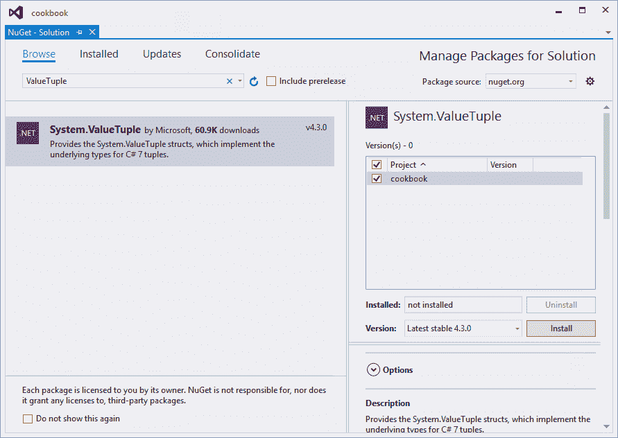
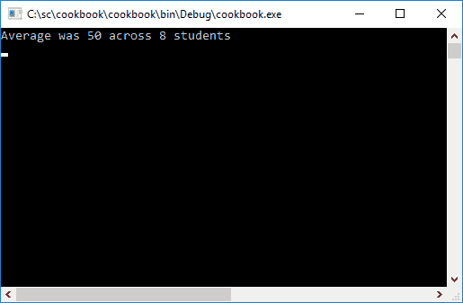
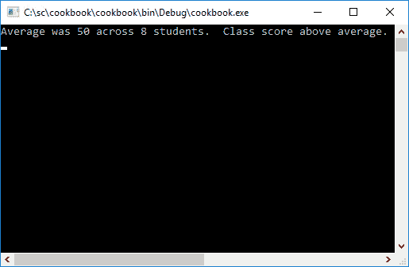
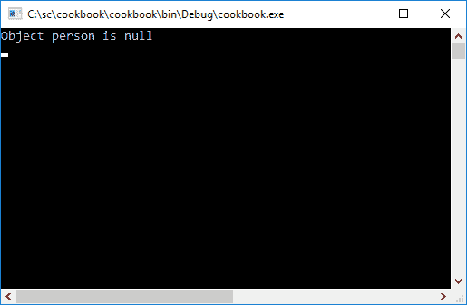
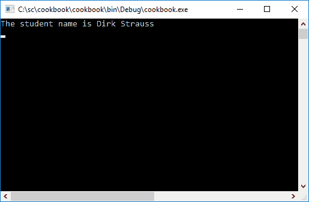
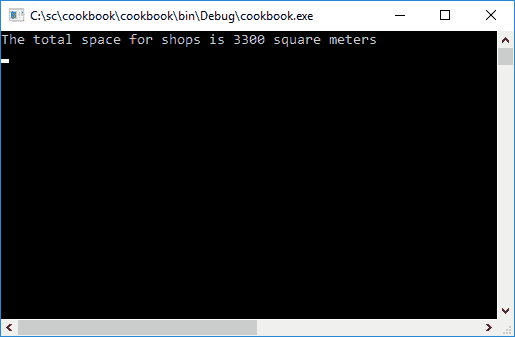
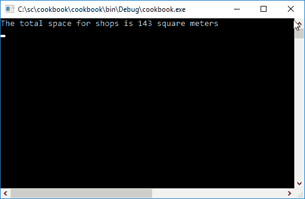
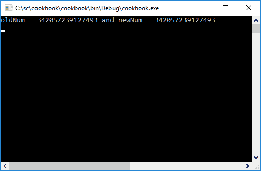
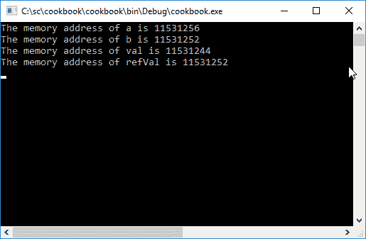

# C# 7.0 中的新特性

在第一章中，我们将通过以下方法来介绍 C# 7.0 的特性:

*   使用元组-开始
*   使用元组-更深入
*   模式匹配
*   输出变量
*   解构
*   本地功能
*   文字的改进
*   Ref 返回和局部变量
*   通用异步返回类型
*   访问器、构造器和终结器的表达式主体
*   抛出表达式

# 介绍

C# 7.0 给 C#语言带来了许多新的功能。如果在 C# 6.0 发布后，你还想要更多，那么 C# 7.0 将不会让你失望。它专注于消费数据、简化代码和提高性能。C#程序经理 Mads Torgersen 指出，C# 7.0 迄今为止最大的特点是**元组**。另一个是**模式匹配**。这两个特性(以及其他特性)受到了全球 C#开发人员的热情欢迎。因此，毫无疑问，开发人员将立即开始实现 C# 7.0 中引入的这些新特性。因此，尽快掌握 C# 7.0 所提供的内容并在您的开发项目中实现新的语言特性将是非常有益的。

在本书中，我将使用 Visual Studio 2017 的发布候选版本。从撰写本文到 Visual Studio 2017 最终发布，一些特性和做事方法可能会发生变化。

# 使用元组-开始

我曾遇到过许多希望从一个方法中返回多个值的情况。正如 Mads Torgersen 指出的那样，现有的可供开发人员选择的方案并不是最优的。因此，C# 7.0 引入了**元组类型**和**元组文字**，让开发人员可以轻松地从方法中返回多个值。开发人员在创建元组时也可以高枕无忧。元组是结构，是值类型。这意味着它们是在本地创建的，并通过复制内容来传递。元组也是可变的，元组元素是公共可变字段。我个人对使用元组非常兴奋。让我们在下面的食谱中更详细地探索元组。

# 准备好了

首先，在 Visual Studio 2017 中创建一个常规控制台应用程序。简单地称你创建的项目为烹饪书。在 C# 7.0 中使用元组之前，我需要添加一个 NuGet 包。请记住，我使用的是 Visual Studio 的发布候选版本。从现在到产品的最终发布，这个过程可能会改变。

1.  为此，转到工具，获取包管理器，然后单击管理获取解决方案包....


2.  选择“浏览”选项卡，并在搜索框中键入值元组。系统。应该显示微软 NuGet 包的值元组。选择“管理解决方案包”下的烹饪书项目，然后单击“安装”按钮。

Take note that I am using Visual Studio 2017 RC while writing portions of this book. You probably will not need to add `System.ValueTuple` from NuGet some time in the future after the final release. Adding `System.ValueTuple` from NuGet might, however, remain a requirement. Only time will tell.



3.  Visual Studio 现在将显示一个提示，提示您检查即将对项目进行的更改。只需点击确定按钮。最后，您需要提供微软要求的许可协议。只需点击“我接受”按钮。Visual Studio 现在将开始 NuGet 包安装。它将在输出窗口中向您显示其进度。


完成所有这些后，我的 Visual Studio 解决方案如下所示:


现在，您将准备好创建第一个使用元组的方法。让我们看看下一步怎么做。

# 怎么做...

1.  首先，在 Visual Studio 控制台应用程序的`Program.cs`文件中创建一个新类。你可以给你的班级起任何名字，但是为了这本书的目的，我将简单地称我的班级为`Chapter1`。您的代码现在应该如下所示:

```cs
        namespace cookbook
        {
          class Program
          {
            static void Main(string[] args)
            {

            }
          }

          public class Chapter1
          {

          }
        }

```

2.  这是我们将在本章中使用的格式。让我们假设我们想写一个方法，需要计算可变数量学生的平均分数。没有一个年级每个班的学生人数相同。因此，我们希望我们的方法返回计算出的平均分数的班级学生人数。更改`static void main`方法以包含分数列表。我们还创建了一个`Chapter1`类的新实例，并调用了方法`GetAverageAndCount()`，该方法将用于返回我们需要的两个值。

I will be hardcoding this for illustration purposes; in reality, though these scores can be for any number of students. Be sure to add the values exactly as I have in the code listing as I will be illustrating a final gotcha at the end of this recipe.

```cs
        static void Main(string[] args)
        {
          int[] scores = { 17, 46, 39, 62, 81, 79, 52, 24 };
          Chapter1 ch1 = new Chapter1();
          var s = ch1.GetAverageAndCount(scores);
        }

```

3.  正是在这里，我们可以利用元组的力量来声明`Chapter1`类中的`GetAverageAndCount()`方法。它接受整数分数数组，如下所示:

```cs
        public (int, int) GetAverageAndCount(int[] scores)
        {

        }

```

4.  密切关注返回元组类型`(int, int)`。我们只从`GetAverageAndCount()`方法返回两个值，但实际上，如果需要，您可以返回几个值。为了运行您的代码示例，我们将创建此方法的虚拟实现。为此，只需包含一个返回两个零的元组文本。

```cs
        public (int, int) GetAverageAndCount(int[] scores)
        {
          var returnTuple = (0, 0);
          return returnTuple;
        }

```

5.  回到调用 Tuple 返回方法的`static void Main`方法，编写代码消耗返回值。您创建的每个元组都会公开名为`Item1`、`Item2`、`Item3`等的成员。这些用于获取元组返回方法返回的值。

```cs
        static void Main(string[] args)
        {
          int[] scores = { 17, 46, 39, 62, 81, 79, 52, 24 };
          Chapter1 ch1 = new Chapter1();
          var s = ch1.GetAverageAndCount(scores);
          WriteLine($"Average was {s.Item1} across {s.Item2} students");
          ReadLine();
        }

```

6.  请务必在命名空间前添加以下`using`指令。

```cs
        using static System.Console;

```

7.  您会注意到我们使用了`s.Item1`和`s.Item2`来引用从我们的`GetAverageAndCount()`方法返回的返回值。虽然这是完全合法的，但它不是很有描述性，并且很难推断返回变量的用法。这基本上意味着你必须记住`Item1`是平均值，`Item2`是计数值。或许，情况正好相反？`Item1`是计数，`Item2`是平均值吗？真的要看你在`GetAverageAndCount()`方法里面做了什么(可以随时间变化)。因此，我们的元组返回方法可以增强如下:

```cs
        public (int average, int studentCount) 
          GetAverageAndCount(int[] scores)
        {
          var returnTuple = (0, 0);
          return returnTuple;
        }

```

8.  元组返回类型现在可以为其元素声明变量名。这使得`GetAverageAndCount()`方法的调用方很容易知道哪个值是哪个。您仍然可以继续使用`s.Item1`和`s.Item2`，但是现在相应地更改`static void Main`方法中的调用代码要容易得多:

```cs
        static void Main(string[] args)
        {
          int[] scores = { 17, 46, 39, 62, 81, 79, 52, 24 };
          Chapter1 ch1 = new Chapter1();
          var s = ch1.GetAverageAndCount(scores);
          WriteLine($"Average was {s.average} across {
            s.studentCount} students");
          ReadLine();
        }

```

9.  改变`WriteLine`中的插值字符串，我们看到 Tuple 返回的值的用法更加清晰。现在您知道第一个值是平均值，第二个值是用于计算平均值的学生人数。然而，元组允许开发人员有更多的灵活性。还记得`GetAverageAndCount()`方法中的元组文字吗？我们只是在虚拟实现中添加了如下内容:

```cs
        var returnTuple = (0, 0);

```

10.  C# 7.0 还允许开发人员向元组文字添加名称。在`GetAverageAndCount()`方法中，更改您的元组文字如下:

```cs
        var returnTuple = (ave:0, sCount:0);

```

11.  我刚刚将第一个值命名为`ave`(代表平均值)，将第二个值命名为`sCount`(代表学生人数)。这真是令人兴奋的事情！在修改了元组文字之后，`GetAverageAndCount()`方法的虚拟实现应该如下所示:

```cs
        public (int average, int studentCount) 
          GetAverageAndCount(int[] scores)
        {
          var returnTuple = (ave:0, sCount:0);
          return returnTuple;
        }

```

Tuples play really nicely together. As long as the Tuple types match up, you do not have to worry that the `ave` and `sCount` names in the Tuple literal don't match the `average` and `studentCount` names of the return type.

# 它是如何工作的...

到目前为止，我们已经看到，当您需要从一个方法中返回几个值时，元组给了开发人员很大的灵活性。虽然`GetAverageAndCount()`的虚拟实现只是返回零值元组文字，但它让您知道元组是如何连接到的。这个食谱是下一个食谱的基础。我鼓励你彻底检查这两个食谱，以便从理解元组和如何使用它们中获得全部好处。

# 使用元组-更深入

我现在将开始向我们在之前的食谱中创建的`GetAverageAndCount()`方法的虚拟实现中添加更多的肉。如果你是元组的新手，并且还没有完成之前的食谱，我鼓励你在开始完成这个食谱之前先这样做。

# 准备好了

您需要完成配方*中的代码步骤使用元组-入门，*才能完成该配方。确保您已经添加了前面配方中指定的所需 NuGet 包。

# 怎么做...

1.  让我们再看一下调用代码。我们可以通过去掉`var s`来进一步简化`static void Main`方法中的代码。当我们调用`GetAverageAndCount()`方法时，我们将元组返回到`var s`中。

```cs
        var s = ch1.GetAverageAndCount(scores);

```

2.  我们不必这么做。C# 7.0 允许我们立即将元组拆分为以下各个部分:

```cs
        var (average, studentCount) = ch1.GetAverageAndCount(scores);

```

3.  我们现在可以直接使用元组返回的值，如下所示:

```cs
        WriteLine($"Average was {average} across {studentCount} students");

```

4.  在我们实施`GetAverageAndCount()`方法之前，请确保您的`static void Main`方法如下所示:

```cs
        static void Main(string[] args)
        {
          int[] scores = { 17, 46, 39, 62, 81, 79, 52, 24 };
          Chapter1 ch1 = new Chapter1();
          var (average, studentCount) = ch1.GetAverageAndCount(scores);
          WriteLine($"Average was {average} across {
            studentCount} students");
          ReadLine();
        }

```

5.  其次，确保`GetAverageAndCount()`方法的虚拟实现如下所示:

```cs
        public (int average, int studentCount) 
          GetAverageAndCount(int[] scores)
        {
          var returnTuple = (ave:0, sCount:0);
          return returnTuple;
        }

```

6.  继续运行您的控制台应用程序。您将看到两个值`average`和`studentCount`是从我们的虚拟实现`GetAverageAndCount()`中返回的。


7.  这些值显然仍然为零，因为我们没有在方法内部定义任何逻辑。我们接下来会做这个。在我们编写实现之前，请确保您添加了以下`using`语句:

```cs
        using System.Linq;

```

8.  因为我们使用整数数组作为变量`scores`，所以我们可以很容易地返回我们需要的结果。LINQ 允许我们简单地通过书写`scores.Sum()`来得到包含在`scores`数组中的学生分数的总和。我们也可以通过写`scores.Count()`很容易地从`scores`数组中得到学生分数的计数。因此，从逻辑上讲，平均值是分数的总和除以学生分数的总数`(scores.Sum()/scores.Count())`。然后，我们将这些值放入我们的`returnTuple`文字中，如下所示:

```cs
        public (int average, int studentCount) 
          GetAverageAndCount(int[] scores)
        {
          var returnTuple = (ave:0, sCount:0);
          returnTuple = (returnTuple.ave = scores.Sum()/scores.Count(),
                         returnTuple.sCount = scores.Count());
          return returnTuple;
        }

```

9.  运行控制台应用程序，查看如下显示的结果:



10.  我们可以看到类平均值并不是太大，但是这对我们的代码来说并不重要。另一段不太好的代码是这样一行:

```cs
        returnTuple = (returnTuple.ave = scores.Sum()/scores.Count(), 
                       returnTuple.sCount = scores.Count());

```

11.  它很笨重，读起来不太好。让我们稍微简化一下。还记得我之前提到过，只要元组的类型匹配，元组就能很好地一起工作吗？这意味着我们可以做到:

```cs
        public (int average, int studentCount)
          GetAverageAndCount(int[] scores)
        {
          var returnTuple = (ave:0, sCount:0);
          returnTuple = (scores.Sum()/scores.Count(), scores.Count());
          return returnTuple;
        }

```

12.  再次运行控制台应用程序，注意结果保持不变:


13.  那么，为什么我们一开始就给元组起了字面名呢？嗯，它允许你在你的`GetAverageAndCount()`方法中很容易地引用它们。在方法中使用`foreach`循环也非常有用。考虑以下场景。除了返回学生分数的计数和平均值之外，如果班级平均值低于某个阈值，我们还需要返回一个额外的布尔值。对于这个例子，我们将使用一个叫做`CheckIfBelowAverage()`的扩展方法，它将把一个`threshold`值作为一个整数参数。首先创建一个名为`ExtensionMethods`的新静态类。

```cs
        public static class ExtensionMethods
        {

        }

```

14.  在`static`类中，创建一个名为`CheckIfBelowAverage()`的新方法，并向其传递一个名为`threshold`的整数值。这个扩展方法的实现非常简单，所以我在这里就不多赘述了。

```cs
        public static bool CheckIfBelowAverage(
          this int classAverage, int threshold)
        {
          if (classAverage < threshold)
          {
            // Notify head of department
            return true;
          }
          else
            return false;
        }

```

15.  在`Chapter1`类中，通过更改其签名并传递需要应用的阈值来重载`GetAverageAndCount()`方法。您会记得我提到一个 Tuple 返回类型方法可以返回几个值，而不仅仅是两个。在本例中，我们将返回第三个值`belowAverage`，它将指示计算出的类平均值是否低于我们传递给它的阈值。

```cs
        public (int average, int studentCount, bool belowAverage) 
          GetAverageAndCount(int[] scores, int threshold)
        {

        }

```

16.  修改元组文字，将其添加到`subAve`，并默认为`true`，因为类平均值为零在逻辑上将低于我们传递给它的任何阈值。

```cs
        var returnTuple = (ave: 0, sCount: 0, subAve: true);

```

17.  我们现在可以对我们在元组文本中定义的`returnTuple.ave`值调用扩展方法`CheckIfBelowAverage()`，并通过它传递`threshold`变量。当我们使用元组来调用扩展方法时，给出元组字面逻辑名称是多么有用就变得显而易见了。

```cs
        returnTuple = (scores.Sum() / scores.Count(), scores.Count(), 
                       returnTuple.ave.CheckIfBelowAverage(threshold));

```

18.  您已完成的`GetAverageAndCount()`方法将如下所示:

```cs
        public (int average, int studentCount, bool belowAverage) 
          GetAverageAndCount(int[] scores, int threshold)
        {
          var returnTuple = (ave: 0, sCount: 0, subAve: true);
          returnTuple = (scores.Sum() / scores.Count(), scores.Count(), 
          returnTuple.ave.CheckIfBelowAverage(threshold)); 
          return returnTuple;
        }

```

19.  修改您的调用代码以使用重载的`GetAverageAndCount()`方法，如下所示:

```cs
        int threshold = 51;
        var (average, studentCount, belowAverage) = ch1.GetAverageAndCount(
                                                   scores, threshold);

```

20.  最后，将插值字符串修改如下:

```cs
        WriteLine($"Average was {average} across {studentCount}
                  students. {(average < threshold ? 
                  " Class score below average." : 
                  " Class score above average.")}");

```

21.  您的`static void Main`方法中的完整代码现在应该如下所示:

```cs
        static void Main(string[] args)
        {
          int[] scores = { 17, 46, 39, 62, 81, 79, 52, 24 };
          Chapter1 ch1 = new Chapter1();
          int threshold = 51;
          var (average, studentCount, belowAverage) = 
               ch1.GetAverageAndCount(scores, threshold);
          WriteLine($"Average was {average} across {studentCount} 
                    students. {(average < threshold ? 
                    " Class score below average." : 
                    " Class score above average.")}");
          ReadLine();
        }

```

22.  运行您的控制台应用程序来查看结果。


23.  要测试三元运算符`?`在插值字符串中是否正常工作，请将阈值修改为低于返回的平均值。

```cs
        int threshold = 40;

```

24.  第二次运行您的控制台应用程序将获得及格的平均课程分数。



25.  最后，有一个突出的问题，我需要用这个食谱来强调。我相信你已经明白了这一点。如果没有，不用担心。这有点鬼鬼祟祟的。这就是我在本食谱开始时提到的问题，我故意想把它包括进来，以说明代码中的错误。我们的学生分数定义如下:

```cs
        int[] scores = { 17, 46, 39, 62, 81, 79, 52, 24 };

```

26.  这些加起来等于 400，因为只有 8 个分数，这个值会正确计算出来，因为它除以一个整数 *(400 / 8 = 50)* 。但是如果我们有另一个学生分数会发生什么呢？让我们来看看。按如下方式修改您的分数数组:

```cs
        int[] scores = { 17, 46, 39, 62, 81, 79, 52, 24, 49 };

```

27.  再次运行您的控制台应用程序并查看结果。


28.  这里的问题是平均值不正确。应该是 49.89。我们知道我们想要一个双精度值(除非您的应用程序打算返回一个整数)。因此，我们需要注意在返回类型和元组文本中正确地转换值。我们还需要在扩展方法`CheckIfBelowAverage()`中处理这个。首先，按如下方式更改扩展方法签名，使其作用于一个 double。

```cs
        public static bool CheckIfBelowAverage(
          this double classAverage, int threshold)
        {

        }

```

29.  然后我们需要将 Tuple 方法返回类型中`average`变量的数据类型更改如下:

```cs
        public (double average, int studentCount, bool belowAverage) 
               GetAverageAndCount(int[] scores, int threshold)
        {

        }

```

30.  然后，使用`ave: 0D`修改元组文字使`ave`为双精度。

```cs
        var returnTuple = (ave: 0D, sCount: 0, subAve: true);

```

31.  将平均值计算到一个`double`。

```cs
        returnTuple = ((double)scores.Sum() / scores.Count(),
          scores.Count(), 
        returnTuple.ave.CheckIfBelowAverage(threshold));

```

32.  将以下`using`语句添加到您的应用中:

```cs
        using static System.Math;

```

33.  最后，使用`Round`方法将插值字符串中的`average`变量格式化为两位小数。

```cs
        WriteLine($"Average was {Round(average,2)} across {studentCount}
                  students. {(average < threshold ? 
                             " Class score below average." : 
                             " Class score above average.")}");

```

34.  如果一切都做对了，你的`GetAverageAndCount()`方法应该如下:

```cs
        public (double average, int studentCount, bool belowAverage) 
               GetAverageAndCount(int[] scores, int threshold)
        {
          var returnTuple = (ave: 0D, sCount: 0, subAve: true);
          returnTuple = ((double)scores.Sum() / scores.Count(), 
                          scores.Count(),   
                          returnTuple.ave.CheckIfBelowAverage(
                          threshold));
          return returnTuple;
        }

```

35.  您的调用代码也应该如下所示:

```cs
        static void Main(string[] args)
        {
          int[] scores = { 17, 46, 39, 62, 81, 79, 52, 24, 49 }; 
          Chapter1 ch1 = new Chapter1();
          int threshold = 40;
          var (average, studentCount, belowAverage) = 
               ch1.GetAverageAndCount(scores, threshold);
          WriteLine($"Average was {Round(average,2)} across 
                    {studentCount} students. {(average < threshold ? 
                    " Class score below average." : 
                    " Class score above average.")}");
          ReadLine();
        }

```

36.  运行控制台应用程序，查看学生分数的正确舍入平均值。


# 它是如何工作的...

元组是结构，因此值类型是在本地创建的。因此，您不必担心即时使用和分配元组，也不必担心它会产生大量的分配。它们的内容只是在传递时被复制。元组是可变的，元素是公共范围的可变字段。因此，使用这个配方中的代码示例，我可以执行以下操作:

```cs
returnTuple = (returnTuple.ave + 15, returnTuple.sCount - 1);

```

C# 7.0 允许我首先更新平均值(向上移动平均值)，然后递减计数字段。元组是 C# 7.0 的一个非常强大的特性，当它被正确实现时，将对许多开发人员有很大的好处。

# 模式匹配

C# 7.0 引入了一个模式匹配的函数式编程语言共有的方面。这种新的结构可以用不同的方式测试价值。为了实现这一点，C# 7.0 中的两种语言结构已经得到了增强，以利用模式。这些措施如下:

*   `is`的表情
*   `switch`语句中的`case`子句

关于 is 表达式，开发人员现在可以在右边有一个模式，而不仅仅是一个类型。说到`switch`语句，`case`子句现在可以匹配模式了。`switch`语句不再局限于原始类型，可以打开任何东西。先来看看`is`的表情。

# 准备好

为了说明模式匹配的概念，假设以下场景。我们有两种对象类型叫做`Student`和`Professor`。我们想最小化代码，所以我们想创建一个单一的方法来输出从对象传递给它的数据。该对象可以是`Student`或`Professor`对象。该方法需要找出它正在处理的对象，并相应地采取行动。但是首先，我们需要在控制台应用程序中做一些事情来设置:

1.  确保您添加了以下`using`语句。

```cs
        using System.Collections.Generic;

```

2.  现在需要创建两个新的类，分别叫做`Student`和`Professor`。`Student`类的代码需要如下所示:

```cs
        public class Student
        {
          public string Name { get; set; }
          public string LastName { get; set; } 
          public List<int> CourseCodes { get; set; }
        }

```

3.  接下来，`Professor`类的代码需要如下所示:

```cs
        public class Professor
        {
          public string Name { get; set; }
          public string LastName { get; set; }
          public List<string> TeachesSubjects { get; set; }
        }

```

要了解模式匹配的发展方向，我们首先需要了解我们的发展方向。我将通过向您展示开发人员如何在 C# 7.0 之前编写这段代码来开始下一节。

# 怎么做...

1.  在`Chapter1`类中，创建一个名为`OutputInformation()`的新方法，该方法以人物对象为参数。

```cs
        public void OutputInformation(object person)
        {

        }

```

2.  在这个方法中，我们需要检查传递给它的是什么类型的对象。传统上，我们需要执行以下操作:

```cs
        if (person is Student)
        {
          Student student = (Student)person;
          WriteLine($"Student {student.Name} {student.LastName}
                    is enrolled for courses {String.Join<int>(
                    ", ", student.CourseCodes)}");
        }

        if (person is Professor)
        {
          Professor prof = (Professor)person;
          WriteLine($"Professor {prof.Name} {prof.LastName} 
                    teaches {String.Join<string>(",", prof.TeachesSubjects)}");
        }

```

3.  我们有两个`if`语句。我们期待一个`Student`物体或者一个`Professor`物体。完整的`OutputInformation()`方法应该如下:

```cs
        public void OutputInformation(object person)
        {
          if (person is Student)
          {
            Student student = (Student)person;
            WriteLine($"Student {student.Name} {student.LastName}
                      is enrolled for courses {String.Join<int>
                      (", ", student.CourseCodes)}");
          }
          if (person is Professor)
          {
            Professor prof = (Professor)person;
            WriteLine($"Professor {prof.Name} {prof.LastName}
                      teaches {String.Join<string>
                      (",", prof.TeachesSubjects)}");
            }
          }

```

4.  从`static void Main`开始调用这个方法已经足够简单了。这些对象相似，但它们包含的列表不同。一个`Student`对象展示了一个课程代码列表，而一个`Professor`展示了一个教授给学生的科目列表。

```cs
        static void Main(string[] args)
        {
          Chapter1 ch1 = new Chapter1();

          Student student = new Student();
          student.Name = "Dirk";
          student.LastName = "Strauss";
          student.CourseCodes = new List<int> { 203, 202, 101 };

          ch1.OutputInformation(student);

          Professor prof = new Professor();
          prof.Name = "Reinhardt";
          prof.LastName = "Botha";
          prof.TeachesSubjects = new List<string> {
               "Mobile Development", "Cryptography" };

          ch1.OutputInformation(prof);
        }

```

5.  运行控制台应用程序，查看运行中的`OutputInformation()`方法。


6.  虽然我们在控制台应用程序中看到的信息是我们所期望的，但是我们可以通过模式匹配来简化`OutputInformation()`方法中的代码。为此，请按如下方式修改代码:

```cs
        if (person is Student student)
        {

        }
        if (person is Professor prof)
        {

        }

```

7.  第一个`if`表达式检查对象`person`是否属于`Student`类型。如果是，它将该值存储在`student`变量中。第二个`if`表达也是同样的逻辑。如果为真，`person`的值存储在变量`prof`中。为了让代码执行到达每个`if`表达式的大括号之间的代码，条件必须评估为真。因此，我们可以将`person`对象转换为`Student`或`Professor`类型，直接使用`student`或`prof`变量，如下所示:

```cs
        if (person is Student student)
        {
          WriteLine($"Student {student.Name} {student.LastName}
                    is enrolled for courses {String.Join<int>
                    (", ", student.CourseCodes)}");
        }
        if (person is Professor prof)
        {
          WriteLine($"Professor {prof.Name} {prof.LastName}
                    teaches {String.Join<string>
                    (",", prof.TeachesSubjects)}");
        }

```

8.  再次运行控制台应用程序，您将看到输出与之前完全相同。然而，我们已经编写了更好的代码，使用类型模式匹配来确定要显示的正确输出。


9.  然而，模式并不止于此。您也可以在常量模式中使用它们，这是最简单的模式类型。让我们看看常数`null`的检查。通过模式匹配，我们可以增强我们的`OutputInformation()`方法，如下所示:

```cs
        public void OutputInformation(object person)
        {
          if (person is null)
          {
            WriteLine($"Object {nameof(person)} is null");
          }
        }

```

10.  更改调用`OutputInformation()`方法的代码，并将其设置为`null`。

```cs
        Student student = null;

```

11.  运行您的控制台应用程序并查看显示的消息。



It is good practice to use the `nameof` keyword here. If the variable name `person` ever has to change, the corresponding output will be changed also.

12.  最后，对 C# 7.0 中的`switch`语句进行了改进，以利用模式匹配。C# 7.0 允许我们打开任何东西，不仅仅是基本类型和字符串。`case`从句现在用的是模式，真的很刺激。让我们看看如何在下面的代码示例中实现这一点。我们将继续使用`Student`和`Professor`类型来说明`switch`语句中的模式匹配概念。修改`OutputInformation()`方法，将样板`switch`语句包含如下。`switch`声明仍然有违约，但它现在可以做得更多。

```cs
        public void OutputInformation(object person)
        {
          switch (person)
          {
            default:
              WriteLine("Unknown object detected");
            break;
          }
        }

```

13.  我们可以展开`case`语句来检查`Professor`类型。如果它将一个对象与`Professor`类型匹配，它可以作用于该对象，并将其用作`case`语句正文中的`Professor`类型。这意味着我们可以称之为`Professor`-特定的`TeachesSubjects`属性。我们是这样做的:

```cs
        switch (person)
        {
          case Professor prof:
            WriteLine($"Professor {prof.Name} {prof.LastName}
                      teaches {String.Join<string>
                      (",", prof.TeachesSubjects)}");
          break;
          default:
            WriteLine("Unknown object detected");
          break;
        }

```

14.  我们也可以对`Student`类型做同样的操作。将`switch`的代码更改如下:

```cs
        switch (person)
        {
          case Student student:
            WriteLine($"Student {student.Name} {student.LastName}
                      is enrolled for courses {String.Join<int>
                      (", ", student.CourseCodes)}");
          break;
          case Professor prof:
            WriteLine($"Professor {prof.Name} {prof.LastName}
                      teaches {String.Join<string>
                      (",", prof.TeachesSubjects)}");
          break;
          default:
            WriteLine("Unknown object detected");
          break;
        }

```

15.  `case`语句的最后一个(也是最大的)特征还有待说明。我们还可以实现一个`when`条件，类似于我们在 C# 6.0 中看到的异常过滤器。`when`条件简单地计算为一个布尔值，并进一步过滤它触发的输入。要看到这一点，相应地改变`switch`:

```cs
        switch (person)
        {
          case Student student when (student.CourseCodes.Contains(203)):
          WriteLine($"Student {student.Name} {student.LastName}
                    is enrolled for course 203.");
          break;
          case Student student:
          WriteLine($"Student {student.Name} {student.LastName}
                    is enrolled for courses {String.Join<int>
                    (", ", student.CourseCodes)}");
          break;
          case Professor prof:
          WriteLine($"Professor {prof.Name} {prof.LastName}
                    teaches {String.Join<string>(",",
                    prof.TeachesSubjects)}");
          break;
          default:
            WriteLine("Unknown object detected");
          break;
        }

```

16.  最后，为了完整地检查空值，我们可以修改我们的`switch`语句来满足这些要求。因此，完整的`switch`声明如下:

```cs
        switch (person)
       {
          case Student student when (student.CourseCodes.Contains(203)):
            WriteLine($"Student {student.Name} {student.LastName} 
                      is enrolled for course 203.");
          break;
          case Student student:
          WriteLine($"Student {student.Name} {student.LastName} 
                    is enrolled for courses {String.Join<int>
                    (", ", student.CourseCodes)}");
          break;
          case Professor prof:
          WriteLine($"Professor {prof.Name} {prof.LastName}
                    teaches {String.Join<string>
                    (",", prof.TeachesSubjects)}");
          break;
          case null:
            WriteLine($"Object {nameof(person)} is null");
          break;
          default:
            WriteLine("Unknown object detected");
          break;
        }

```

17.  再次运行控制台应用程序，您将看到包含`when`条件的第一个案例语句是为`Student`类型触发的。


# 它是如何工作的...

通过模式匹配，我们看到模式被用来测试一个值是否是某种类型的。

You will also hear some developers say that they test whether the value has a certain *shape*.

当我们找到一个匹配时，我们可以得到特定于该类型(或形状)的信息。我们在代码中看到了这一点，其中我们访问了特定于`Student`类型的`CourseCodes`属性和特定于`Professor`类型的`TeachesSubjects`属性。

最后，你现在需要仔细注意你的`case`陈述的顺序，这很重要。使用`when`子句的`case`语句比简单检查`Student`类型的语句更具体。这意味着`when`案需要发生在`Student`案之前，因为这两个案件都属于`Student`类型。如果`Student`情况发生在`when`条款之前，则不会触发具有课程代码 203 的`Students`的`switch`。

另一个需要记住的重要事情是`default`子句总是最后被求值，不管它出现在`switch`语句的什么地方。因此，把它作为`switch`声明的最后一句话是一种好的做法。

# 输出变量

C# 7.0 重新审视了`out`变量。这是一个很小的改变，但是确实提高了代码的可读性和流程。以前，我们首先必须声明一个变量，用作方法中的 out 参数。在 C# 7.0 中，我们不再需要这样做。

# 准备好了

我们将使用一个常用的方法来测试一个值是否是特定类型的。是的，你猜对了，我们将使用`TryParse`。我已经能听到你们中的一些人在呻吟(还是只有我？).使用`TryParse `(反正对我来说)是一件苦乐参半的事情。能够尝试并解析一些东西来测试它是否有效是很棒的，但是`out`变量的使用从来没有像我希望的那样整洁。如果您不熟悉`TryParse`方法，它是一种测试值是否解析为特定类型的方法。如果是，`TryParse`将返回一个布尔值`true`；否则将返回`false`。

# 怎么做...

1.  下面的代码示例将说明我们过去如何必须使用`TryParse`来检查字符串值是否是有效的整数。你会注意到我们必须声明整数变量`intVal`，它被用作`out`变量。`intVal`变量只是挂在半空中，通常没有初始化，等待在`TryParse`中使用。

```cs
        string sValue = "500";

        int intVal;
        if (int.TryParse(sValue, out intVal))
        {
          WriteLine($"{intVal} is a valid integer");
          // Do something with intVal
        }

```

2.  在 C# 7.0 中，这已经被简化了，如下面的代码示例所示。我们现在可以将`out`变量声明为输出参数，如下所示:

```cs
        if (int.TryParse(sValue, out int intVal))
        {
          WriteLine($"{intVal} is a valid integer");
          // Do something with intVal
        }

```

3.  这是一个小小的变化，但是非常好。运行控制台应用程序并检查显示的输出。


4.  当我们将`out`变量声明为`out`参数的参数时，编译器将能够推断出类型应该是什么。这意味着我们也可以使用`var`这个关键词，就像这样:

```cs
        if (int.TryParse(sValue, out var intVal))
        {
          WriteLine($"{intVal} is a valid integer");
          // Do something with intVal
        }

```

# 它是如何工作的...

C# 7.0 对`out`变量的改动不大。然而，对于那些经常使用它的开发人员来说，它们是一个主要的便利。到目前为止，在本章中，我们已经看到了元组、模式匹配和`out`变量的使用。我们可以很容易地将我们所学的东西结合起来，创造出真正独特的东西。考虑使用扩展方法、元组和`out`变量。我们可以很容易地创建一个名为`ToInt()`的扩展方法，其实现如下:

```cs
public static (string originalValue, int integerValue, bool isInteger) ToInt(this string stringValue)
{
  var t = (original: stringValue, toIntegerValue: 0, isInt: false);
  if (int.TryParse(stringValue, out var iValue)) 
  {
    t.toIntegerValue = iValue; t.isInt = true;
  }
  return t;
}

```

我们创建一个元组文本，在`TryParse`返回假的情况下返回。如果`TryParse`是`true`，我设置`t.toIntegerValue`和`t.isInt`值。调用扩展方法的代码如下所示:

```cs
var (original, intVal, isInteger) = sValue.ToInt();
if (isInteger)
{
  WriteLine($"{original} is a valid integer");
  // Do something with intVal
}

```

当您运行控制台应用程序时，您将看到输出与之前完全相同。这正好说明了 C# 7.0 中新特性相互结合时的威力。在混合中加入一些模式匹配，我们将有一个非常有效的扩展方法。我让你们继续玩这个。有很多要发现的。

# 解构

元组可以使用解构声明来使用。这只是将一个元组分割成单独的部分，并将这些部分分配给新的变量。这叫**解构**，不仅仅是为元组预留的。

# 准备好

还记得我们在本章开头使用元组的时候吗？我们使用类似下面的代码来获取元组文本返回的值。

```cs
var (average, studentCount) = ch1.GetAverageAndCount(scores);

```

这是将元组的各个部分解构成新的变量`average`和`studentCount`。然而，我不想再看元组了。我想做的是展示如何在任何类型上实现解构声明。要做到这一点，我们需要做的就是确保类型有一个解构器方法。我们将修改我们现有的`Student`类来添加一个解构器。

# 怎么做...

1.  如果您之前创建了`Student`类，那么在您的代码中应该有类似的内容:

```cs
        public class Student
        {
          public string Name { get; set; }
          public string LastName { get; set; }
          public List<int> CourseCodes { get; set; }
        }

```

2.  要创建解构器，请在您的`Student`类中添加一个`Deconstruct`方法。您会注意到这是一个采用两个`out`参数的`void`方法(在本例中)。然后，我们只需将`Name`和`LastName`的值分配给`out`参数。

If we wanted to deconstruct more values in the `Student` class, we would pass in more `out` parameters, one for each value we wanted to deconstruct.

```cs
        public void Deconstruct(out string name, out string lastName)
        {
          name = Name;
          lastName = LastName;
        }

```

3.  您修改的`Student`类现在应该如下所示:

```cs
        public class Student
        {
          public string Name { get; set; }
          public string LastName { get; set; }
          public List<int> CourseCodes { get; set; }

          public void Deconstruct(out string name, out string lastName)
          {
            name = Name;
            lastName = LastName;
          }
        }

```

4.  消费我们的`Student`类(就像我们消费元组一样)现在可以如下完成:

```cs
        Student student = new Student();
        student.Name = "Dirk";
        student.LastName = "Strauss";

        var (FirstName, Surname) = student;
        WriteLine($"The student name is {FirstName} {Surname}");

```

5.  运行控制台应用程序将显示从`Student`类返回的解构值。



6.  解构器也可以很容易地用于扩展方法。这是扩展现有类型以包含解构声明的一个很好的方法。为了实现这一点，我们需要从我们的`Student`类中移除解构器。你现在可以评论一下，但本质上这就是我们所追求的:

```cs
        public class Student
        {
          public string Name { get; set; }
          public string LastName { get; set; }
          public List<int> CourseCodes { get; set; }
        }

```

7.  `Student`类现在不包含解构器。转到扩展方法类，添加以下扩展方法:

```cs
        public static void Deconstruct(this Student student, 
                 out string firstItem, out string secondItem)
        {
          firstItem = student.Name;
          secondItem = student.LastName;
        }

```

8.  扩展方法仅作用于`Student`类型。它遵循了先前在`Student`类中创建的解构器的相同基本实现。再次运行控制台应用程序，您将看到与之前相同的结果。唯一不同的是，代码现在使用扩展方法来解构`Student`类中的值。


# 它是如何工作的...

在代码示例中，我们将学生姓名设置为特定值。这只是为了说明解构的使用。更有可能的情况是将学生编号传递给`Student`类(可能在构造函数中)，如下所示:

```cs
Student student = new Student(studentNumber);

```

`Student`类中的实现将使用构造函数中传递的学生编号执行数据库查找。这将返回学生详细信息。`Student`类更可能的实现可能如下所示:

```cs
public class Student
{
  public Student(string studentNumber)
  {
    (Name, LastName) = GetStudentDetails(studentNumber);
  }
  public string Name { get; private set; }
  public string LastName { get; private set; }
  public List<int> CourseCodes { get; private set; }

  public void Deconstruct(out string name, out string lastName)
  {
    name = Name;
    lastName = LastName;
  }

  private (string name, string surname) GetStudentDetails(string studentNumber)
  {
    var detail = (n: "Dirk", s: "Strauss");
    // Do something with student number to return the student details
    return detail;
  }
}

```

你会注意到`GetStudentDetails()`方法只是一个伪实现。这是数据库查找开始的地方，值将从这里返回。调用`Student`类的代码现在更有意义了。我们称之为`Student`班，给它传一个学号，解构它找到学生的名和姓。

```cs
Student student = new Student("S20323742");
var (FirstName, Surname) = student;
WriteLine($"The student name is {FirstName} {Surname}");

```

# 本地功能

本地函数的使用起初可能看起来有点奇怪。事实上，它们在大多数函数式语言中经常使用。C# 7.0 现在允许我们做同样的事情。那么到底什么是局部函数呢？好吧，把它当成特定方法的辅助方法。这个助手方法只有在从特定的方法中使用时才真正有意义，并且对应用程序中的其他方法没有用处。因此，在你现有的方法中使用它*是有意义的。有些人可能认为扩展方法可能同样适用，但是扩展方法确实应该用来扩展许多其他方法的功能。在下面的代码示例中，局部函数的用处将变得显而易见。*

# 准备好了

没有什么需要你事先特别准备或设置才能使用本地功能。为了说明局部函数的使用，我将创建一个方法，在公共面积空间从总建筑面积中减去后，计算建筑的建筑面积。

# 怎么做...

1.  创建一个名为`GetShopfloorSpace()`的方法，该方法采用三个参数:公共面积空间、建筑宽度和建筑长度。

```cs
        public Building GetShopfloorSpace(int floorCommonArea,
                         int buildingWidth, int buildingLength)
        {

        }

```

2.  我们正在返回一个`Building`类型，所以创建一个名为`Building`的类，它有一个名为`TotalShopFloorSpace`的属性。

```cs
        public class Building
        { 
          public int TotalShopFloorSpace { get; set; } 
        }

```

3.  我们的局部函数将简单地取建筑物的`width`和`length`来计算总建筑面积，然后从中减去`common`面积来得到商店的可用建筑面积。本地函数如下所示:

```cs
        int CalculateShopFloorSpace(int common, int width, int length)
        {
          return (width * length) - common;
        }

```

4.  这就是有趣的地方。在`GetShopfloorSpace()`方法中添加本地函数，并在下面的代码示例中添加其余代码:

```cs
        public Building GetShopfloorSpace(int floorCommonArea,
                         int buildingWidth, int buildingLength)
        {
          Building building = new Building();

          building.TotalShopFloorSpace = CalculateShopFloorSpace(
                   floorCommonArea, buildingWidth, buildingLength);

          int CalculateShopFloorSpace(int common, int width, int length)
          {
            return (width * length) - common;
          }

          return building;
        }

```

5.  在调用代码中，`static void Main`方法内部，调用方法如下:

```cs
        Chapter1 ch1 = new Chapter1();
        Building bldng = ch1.GetShopfloorSpace(200, 35, 100);
        WriteLine($"The total space for shops is 
                  {bldng.TotalShopFloorSpace} square meters");

```

6.  运行您的控制台应用程序，并看到如下所示的输出:



# 它是如何工作的...

局部函数的美妙之处在于，您可以从方法内部的任何地方调用它们。为了说明这一点，在`GetShopfloorSpace()`方法的`return`语句之前添加下面一行代码。这基本上覆盖了我们最初传递给方法的任何内容。

```cs
building.TotalShopFloorSpace = CalculateShopFloorSpace(10, 9, 17);

```

修改后的方法现在如下所示:

```cs
public Building GetShopfloorSpace(int floorCommonArea, int buildingWidth, int buildingLength)
{
  Building building = new Building();

  building.TotalShopFloorSpace = CalculateShopFloorSpace(
           floorCommonArea, buildingWidth, buildingLength);

  int CalculateShopFloorSpace(int common, int width, int length)
  {
    return (width * length) - common;
  }

  building.TotalShopFloorSpace = CalculateShopFloorSpace(10, 9, 17);

  return building;
}

```

再次运行您的控制台应用程序。这一次，你会发现价值观完全不同。对局部函数的第二次调用覆盖了第一次调用，并说明局部函数可以在包含它的整个方法中被调用。



我能想到几个我过去可能会用到这个的例子。这不是我认为我会经常使用的东西。然而，这是对 C#语言的一个很好的补充，并且对开发人员来说是很好的补充。

# 文字的改进

这是对 C#语言的另一个小改进，但我相信这将是开发人员经常使用的改进。我年轻时的第一份工作是在一家物流公司工作。这些人过去向大众汽车公司提供零部件，最关键的零部件是从德国或其他地方空运过来的。我永远也不会忘记物流人员在不经意间的交谈中，经常抛来抛去的 9 位数和 12 位数的运输号码。我想知道他们是如何在一年中记住数百个不同的运输号码的。听了一会儿后，我注意到他们说这些数字时，每隔三个数字就有一点停顿。即使只看 12 位数字 395024102833，视觉上也很吃力。想象一下一天做几次这样的事情，包括记住下一批货物的快速搬运者(我甚至不打算进入打印的货物清单，这是一场噩梦)。因此，更容易把这个数字想象成 395-024-102-833，这就更容易发现模式。这实际上正是 C# 7.0 现在允许开发人员对文本所做的事情。

# 准备好

数字文字有时很难阅读。这就是为什么 C# 7.0 引入了下划线(`_`)作为数字文字内部的数字分隔符。C# 7.0 还引入了二进制文字，允许您直接指定位模式，而不需要知道十六进制。

# 怎么做...

1.  将以下代码行添加到您的项目中。很明显`newNum`字面更容易阅读，尤其是三人一组阅读。

```cs
        var oldNum = 342057239127493;
        var newNum = 342_057_239_127_493;
        WriteLine($"oldNum = {oldNum} and newNum = {newNum}");

```

2.  如果运行控制台应用程序，您将看到两个数字文字的值完全相同:



3.  同样的逻辑也适用于二进制文字。您现在可以按如下方式表达它们:

```cs
        var binLit = 0b1010_1100_0011_0010_0001_0000;

```

# 它是如何工作的...

这只是字面量的语法糖。我确信在后台还有更多的事情要做，但是在您的代码中实现这一点非常简单。

# Ref 返回和局部变量

在 C#中通过引用传递对象并不是什么新鲜事。这是使用`ref`关键字完成的。然而，在 C# 7.0 中，您现在可以通过引用返回对象，并通过引用将这些对象存储在局部变量中。

# 准备好了

理解`ref`关键词的概念很重要。当您传递`ref`参数时，您使用的是变量本身，而不仅仅是变量的值。这意味着，如果值改变，内存中的原始位置将被更新，而不仅仅是参数的副本。这在下面的例子中变得更加清楚。

# 怎么做...

1.  在`Chapter1`类内部，创建一个名为`GetLargest()`的新方法。方法没什么特别的。它只获取两个值中最大的一个，并将其返回给调用代码。

```cs
        public int GetLargest(int valueA, int valueB)
        {
          if (valueA > valueB)
            return valueA;
          else
            return valueB;
        }

```

2.  创建另一个同名的方法。只有这一次，添加`ref`关键字。

```cs
        public ref int GetLargest(ref int valueA, ref int valueB)
        {
          if (valueA > valueB)
            return ref valueA;
          else
            return ref valueB;
        }

```

3.  在`static void Main`方法中，为`Chapter1`类创建一个实例，并调用`GetLargest()`方法。增加变量`val`并将变量值写入控制台窗口。

```cs
        int a = 10;
        int b = 20;
        Chapter1 ch1 = new Chapter1();
        int val = ch1.GetLargest(a, b);
        val += 25;

        WriteLine($"val = {val} a = {a} b = {b} ");

```

4.  然后，在前一个调用代码之后编写下面的代码，但是调用`ref ch1.GetLargest()`方法。增加`refVal`变量，并将变量值写入控制台窗口。

```cs
        ref int refVal = ref ch1.GetLargest(ref a, ref b);
        refVal += 25;

        WriteLine($"refVal = {refVal} a = {a} b = {b} ");

```

5.  运行您的控制台应用程序，并考虑显示的输出。


# 它是如何工作的...

在控制台窗口中，您将看到两种截然不同的结果。简单来说，第一行的变量`a`就是变量`a`，变量`b`就是变量`b`，变量`val`就是变量`val`。

第二行，变量`a`为变量`a`，变量`b`为变量`b`，变量`refVal`为变量`b`。这就是`ref`关键词的全部症结。在第一个`GetLargest()`方法中，我们将最大值返回到变量`val`中。这个值是 20。变量`val`和变量`b`彼此没有关系，因为它们在内存中被分配了不同的空间。

在第二个`GetLargest()`方法中，我们将最大的变量本身(也就是`b`)返回到变量`refVal`中。变量`refVal`因此成为变量`b`的别名，因为它们都指向内存中分配的相同空间。为了更清楚地说明这一点，让我们看看变量的内存地址。

从“项目”菜单中，转到当前项目的属性。在“生成”选项卡中，选中“允许不安全代码”选项并保存属性。


将以下代码添加到控制台应用程序中:

```cs
unsafe
{
  IntPtr a_var_memoryAddress = (IntPtr)(&a);
  IntPtr b_var_memoryAddress = (IntPtr)(&b);
  IntPtr val_var_memoryAddress = (IntPtr)(&val);

  fixed (int* refVal_var = &refVal)
  {
    IntPtr refVal_var_memoryAddress = (IntPtr)(refVal_var);
    WriteLine($"The memory address of a is {a_var_memoryAddress}");
    WriteLine($"The memory address of b is {b_var_memoryAddress}");
    WriteLine($"The memory address of val is {val_var_memoryAddress}");
    WriteLine($"The memory address of refVal is
              {refVal_var_memoryAddress}");
  }
}

```

This code is not really related to the recipe on `ref` returns and locals, so I'm not even going to go into it in any detail. If you want to learn more about pointers in C#, start with the MSDN article on *Pointer types (C# Programming Guide):* [https://msdn.microsoft.com/en-us/library/y31yhkeb.aspx](https://msdn.microsoft.com/en-us/library/y31yhkeb.aspx).

运行控制台应用程序，查看列出的内存地址:



你会马上注意到变量`b`和变量`refVal`有相同的`11531252`的内存地址，而变量`b`和变量`val`有不同的内存地址。

那么现在来回答这个价值百万的问题:为什么 C# 7.0 中的这个特性甚至有用？简单来说，它可以提高性能。许多开发人员提到，这对游戏程序员来说非常有用，他们现在可以传递这些别名来引用大型数据结构。这意味着他们不需要复制一个大数组(例如)来使用它。使用`ref`，他们可以创建一个指向数组原始存储位置的别名，并直接读取或修改它。以这种方式思考一下，就会突然发现这个 C# 7.0 特性的有用性。

我会用它吗？我真的不知道。也许不经常，但是和本地函数一样，C# 7.0 的这个特性确实是对开发人员工具包的一个很好的补充。当您想要摆脱在代码中复制大型结构时，它解决了一些非常棘手的问题。

# 通用异步返回类型

如果您使用 async/await(如果没有，请检查一下)，C# 7.0 的以下特性将会非常有用。唯一支持的返回类型曾经是`Task<T>`、`Task`和`void`。即使在那时，`void`也仅用于事件处理程序，如按钮点击。然而，挑战在于在等待时`async`操作的结果可用的情况下分配`Task<T>`。但是，这到底意味着什么呢？我们考虑一个返回`Task<T>`的`async`方法:该值的生存时间为 *n* 秒。如果在生存时间周期内调用`async`方法，为什么要费心分配另一个`Task<T>`对象？这就是`ValueTask<T>`发挥作用的地方；它将允许定义其他类型，以便您可以从`async`方法返回它们。因此，这减少了`Task<T>`分配，这反过来将导致性能提升。

# 准备好

首先创建一个新的 WinForms 应用程序，并执行以下步骤:

1.  向窗口窗体添加按钮、标签、计时器和文本框。


2.  我们需要从 NuGet 添加`System.Threading.Tasks.Extensions`包来实现`ValueTask<T>`结构。如果您完成了元组配方，您应该熟悉这个过程。选择 winform 项目，然后单击“安装”按钮。

Note that I am using Visual Studio 2017 RC while writing this book. You probably will not need to add `System.Threading.Tasks.Extensions` from NuGet in the final release.


3.  将显示一个确认屏幕，允许您查看将要进行的更改。只需点击确定。接受许可协议。还要确保您已经将此`using`语句添加到您的项目中。

```cs
        using System.Threading.Tasks;

```

我们现在准备好编写代码了。如果生存时间已经过去，Windows 应用程序将调用`async` `Task<T>`方法。一旦这样做了，该方法将读取一个值并缓存它。该缓存值将在 10 秒内有效(这是生存时间)。如果该方法在生存时间内运行，则缓存的值将被使用并返回到表单。如果生存的时间已经过去，这个过程会重复，并调用`Task<T>`方法。当您查看以下代码示例时，实现将变得更加清晰。

# 怎么做...

1.  首先在表单中添加以下变量。

```cs
        double timerTtl = 10.0D;
        private DateTime timeToLive;
        private int cacheValue;

```

2.  在窗体加载事件中，用计时器文本设置标签。

Strictly speaking, this is all just fluff. It's not really necessary when it comes to illustrating generalized async return types, but it helps us to visualize and understand the concept.

```cs
        private void Form1_Load(object sender, EventArgs e)
        {
          lblTimer.Text = $"Timer TTL {timerTtl} sec (Stopped)"; 
        }

```

3.  将设计器上的计时器间隔设置为 1000 毫秒，并将以下代码添加到`timer1_Tick`事件中。

```cs
        private void timer1_Tick(object sender, EventArgs e)
        {
          if (timerTtl == 0)
          {
            timerTtl = 5;
          }
          else
          {
            timerTtl -= 1; 
          }
          lblTimer.Text = $"Timer TTL {timerTtl} sec (Running)";
        }

```

4.  现在创建一个方法来模拟某种较长时间运行的任务。推迟一秒钟。使用`Random`关键字生成一个随机数，并将其分配给`cacheValue`变量。设置生存时间，启动计时器，并将缓存的值返回给调用代码。

```cs
        public async Task<int> GetValue()
        {
          await Task.Delay(1000);

          Random r = new Random();
          cacheValue = r.Next();
          timeToLive = DateTime.Now.AddSeconds(timerTtl);
          timer1.Start();
          return cacheValue;
        }

```

5.  在调用代码中，检查生存时间对于当前缓存值是否仍然有效。如果生存时间已过，运行分配并返回`Task<T>`的代码，获取并设置缓存值。如果生存时间仍然有效，只需返回缓存的整数值。

You will notice that I am passing a Boolean `out` variable to indicate that a cached value has been read or set.

```cs
        public ValueTask<int> LoadReadCache(out bool blnCached)
        {
          if (timeToLive < DateTime.Now)
          {
            blnCached = false;
            return new ValueTask<int>(GetValue());
          }
          else
          {
            blnCached = true;
            return new ValueTask<int>(cacheValue);
          } 
        }

```

6.  按钮点击的代码使用`out`变量`isCachedValue`，并相应地设置文本框中的文本。

```cs
        private async void btnTestAsync_Click(object sender, EventArgs e)
        {
          int iVal = await LoadReadCache(out bool isCachedValue);
          if (isCachedValue)
            txtOutput.Text = $"Cached value {iVal} read";
          else
            txtOutput.Text = $"New value {iVal} read";
        }

```

7.  添加完所有代码后，运行应用程序并单击测试异步按钮。这将从`GetValue()`方法中读取一个新值，缓存它，并开始倒计时。


8.  如果在生存时间到期之前再次单击该按钮，将返回缓存值。


9.  当生存时间到期时，点击测试异步按钮将再次调用`GetValue()`方法，过程重复。


# 它是如何工作的...

`ValueTask<T>`是对 C# 7.0 的一个非常好的补充。然而，微软建议你在对你的方法进行额外的优化时，对比一下`Task<T>`和`ValueTask<T>`的性能。然而，一个简单的优化是简单地用`ValueTask<T>`替换`Task<T>`的实例。

# 访问器、构造器和终结器的表达式主体

表达式体成员在 C#开发者社区中大受欢迎，以至于微软扩展了可以实现为表达式的成员。现在，您可以通过以下方式使用此功能:

*   构造器
*   终结器(当您需要释放非托管代码时使用)
*   属性和索引器上的`get`和`set`访问器

# 准备好

为了使用这个食谱，你没有什么特别需要准备的。下面的代码将使用新旧方法来演示每种方法的区别和实现。

# 怎么做...

1.  考虑班级`SomeClass`。它包含构造函数、终结器和属性。

```cs
        public class SomeClass
        {
          private int _initialValue;

          // Property
          public int InitialValue
          {
            get
            {
              return _initialValue;
            }

            set
            {
              _initialValue = value;
            }
          }

          // Constructor
          public SomeClass(int initialValue)
          {
            InitialValue = initialValue;
          }

          // Finalizer
          ~SomeClass()
          {
            WriteLine("Release unmanaged code");
          }
        }

```

2.  有了表达式体成员，类`SomeClass`可以简化，代码行数减少。

```cs
        public class SomeClass
        {
          private int _initialValue;

          public int InitialValue
          {
            get => _initialValue;
            set => _initialValue = value;
          }

          public SomeClass(int initialValue) => 
                 InitialValue = initialValue;

          ~SomeClass() => WriteLine("Release unmanaged code");
        }

```

# 它是如何工作的...

如果您以前在 C# 6.0 中使用过表达式体成员，您无疑会对使用扩展的功能感到兴奋。就我个人而言，我真的很高兴构造函数现在可以作为表达式来实现。

# 抛出表达式

传统上，`throw`是 C#中的一个语句。众所周知，因为它是一个陈述而不是表达，所以我们不能在某些地方使用它。感谢表达式体成员，C# 7.0 引入了`throw`表达式。异常的抛出方式没有任何区别，只有你能从哪里抛出它们。

# 准备好

抛出异常并不是什么新鲜事。自从你写代码以来，你就一直在做这件事。我承认`throw`表达式是 C#非常受欢迎的补充，这都要归功于表达式体成员。

# 怎么做...

1.  为了说明`throw`表达式的使用，在`Chapter1`类中创建一个名为`GetNameLength()`的方法。它所做的只是检查一个名字的长度是否不为零。如果是，则该方法将在表达式中的该处引发异常。

```cs
        public int GetNameLength(string firstName, string lastName)
        {
          return (firstName.Length + lastName.Length) > 0 ? 
            firstName.Length + lastName.Length : throw new 
            Exception("First name and last name is empty");
        }

```

2.  要查看动作中的`throw`表达式，创建一个`Chapter1`类的实例并调用`GetNameLength()`方法。将两个空白字符串作为参数传递给它。

```cs
        try
        {
          Chapter1 ch1 = new Chapter1();
          int nameLength = ch1.GetNameLength("", "");
        }
        catch (Exception ex)
        {
          WriteLine(ex.Message);
        }

```

3.  然后，运行控制台应用程序将返回异常消息作为输出。


# 它是如何工作的...

能够使用`throw`表达式使您的代码更容易编写和阅读。C# 7.0 中的新特性建立在 C# 6.0 奠定的奇妙基础之上。