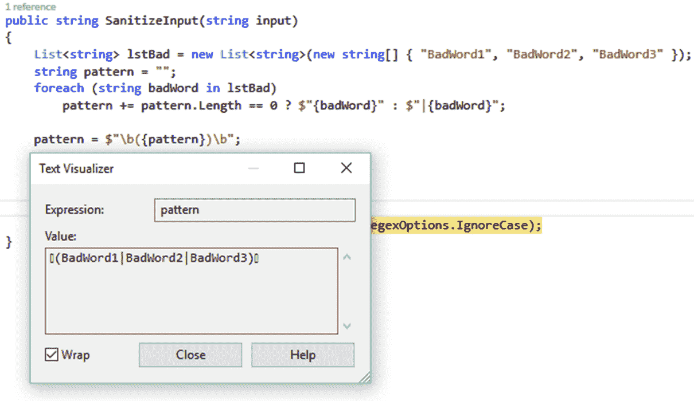
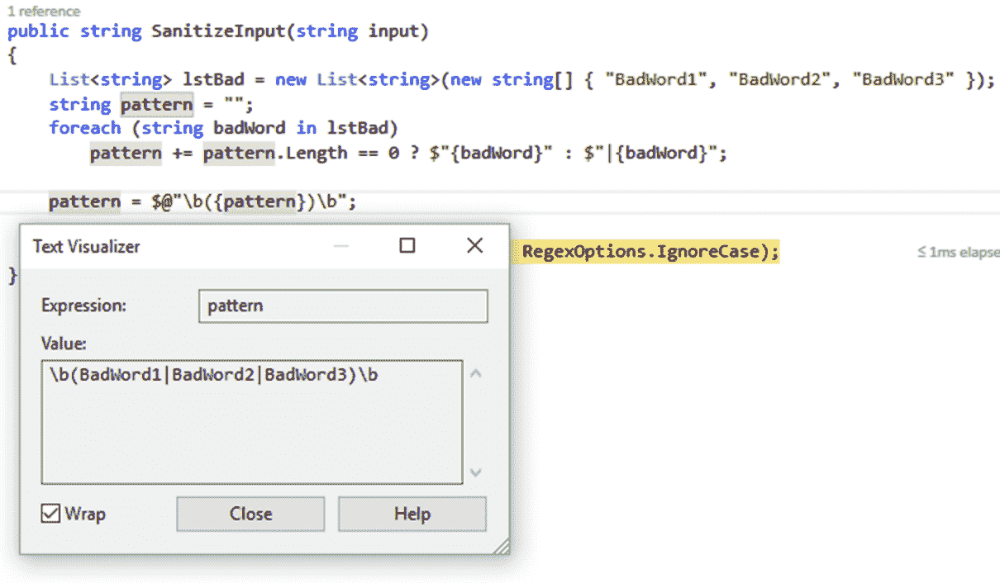
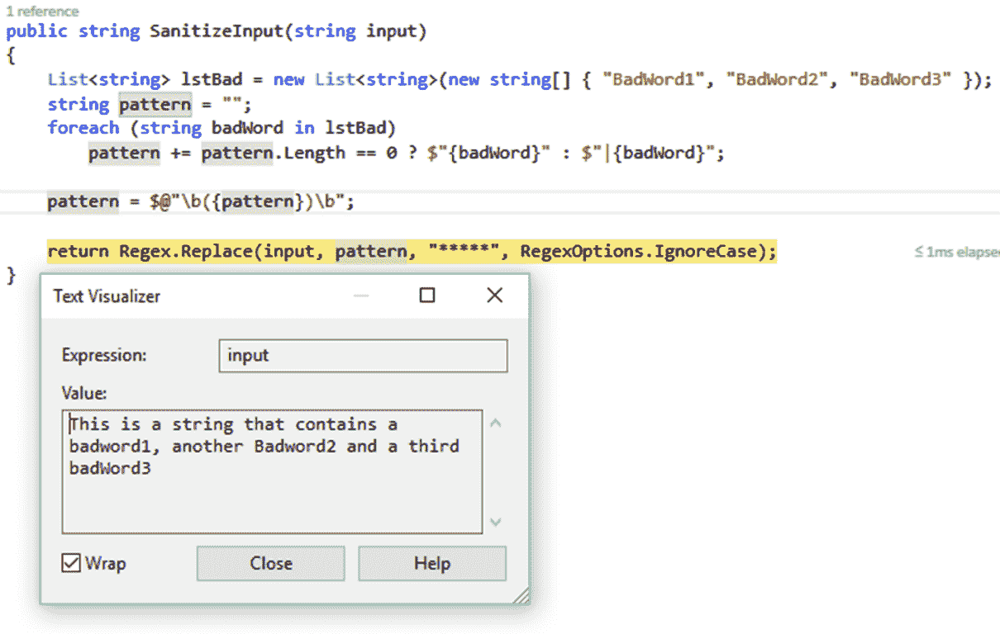

# 五、正则表达式

**正则表达式** ( **正则表达式**)对于许多开发人员来说是一个谜。我们承认它们是我们经常使用的东西，足以保证对它们如何工作有更深的理解。另一方面，互联网上有太多经过尝试和测试的正则表达式模式，仅仅重用一个已经存在的模式比自己创建一个更容易。regex 的主题比这本书的单个章节所能解释的要大得多。

因此，在本章中，我们将仅仅介绍正则表达式的一些概念。为了更深入地了解 regex，还需要进一步的研究。然而，出于本书的目的，我们将仔细研究正则表达式是如何创建的，以及它们如何应用于一些常见的编程问题。在本章中，我们将介绍以下食谱:

*   正则表达式入门-匹配有效日期
*   净化输入
*   动态正则表达式匹配

# 介绍

正则表达式是一种通过使用特殊字符来描述字符串的模式，这些字符表示要匹配的特定文本位。正则表达式的使用在编程中并不是一个新概念。要让 regex 工作，它需要使用一个 regex 引擎来完成所有的繁重工作。

在.NET 框架，微软已经提供了对正则表达式的使用。要使用 regex，您需要将`System.Text.RegularExpressions`程序集导入到项目中。这将允许编译器使用您的正则表达式模式，并将其应用于您需要匹配的特定文本。

其次，正则表达式有一组特定的元字符，对正则表达式引擎有特殊的意义。这些字符是`[ ]`、`{ }`、`( )`、`*`、`+`、`?`、`|`、`$`、`.`、`^`。

例如，大括号`{ }`的使用使开发人员能够指定特定字符集需要出现的次数。另一方面，使用方括号准确定义了需要匹配的内容。

例如，如果我们指定`[abc]`，模式将寻找小写的 As、Bs 和 Cs。因此，regex 还允许您定义一个范围，例如`[a-c]`，其解释方式与`[abc]`模式完全相同。

正则表达式还允许您使用`^`字符定义要排除的字符。因此，键入`[^a-c]`会找到小写的 D 到 Z，因为模式告诉正则表达式引擎排除小写的 As、Bs 和 Cs。

正则表达式还分别为`[0-9]`和`[^0-9]`定义了一种快捷方式。因此，`d`匹配所有数值，`D`匹配所有非数值。另一个快捷方式是`w`和`W`，它们匹配从小写字母 A 到 Z 的任何字符，无论大小写，从 0 到 9 的所有数值，以及下划线字符。所以`w`是`[a-zA-Z0-9_]`，而`W`是`[^a-zA-Z0-9_]`。

正则表达式的基础很容易理解，但是你可以用正则表达式做更多的事情。

# 正则表达式入门-匹配有效日期

如果您还没有这样做，创建一个新的控制台应用，并向名为`RegExDemo`的项目中添加一个类。此时您的代码应该如下所示:

```cs
class Program
{
   static void Main(string[] args)
   {
   }
}

public class RegExDemo
{

}

```

# 准备好了

出于本书的目的，我们使用一个控制台应用来说明正则表达式的使用。实际上，您可能不会将这种逻辑混合到您的生产代码中，因为这将导致代码被重写。添加诸如 regex 之类的东西的最佳位置是在扩展方法中的助手类中。

# 怎么做...

1.  在控制台应用中，添加下面的`using`语句，这样我们就可以在中使用 regex 程序集.NET:

```cs
        using System.Text.RegularExpressions;

```

2.  我们将创建一个正则表达式来验证 yyyy-mm-dd、yyy/mm/dd 或 yyyy.mm.dd 的日期模式。起初，正则表达式看起来令人望而生畏，但请原谅我。当您完成代码并运行应用后，我们将剖析正则表达式。希望表达逻辑会变得清晰。

3.  在`RegExDemo`类中，创建一个名为`ValidDate()`的新方法，该方法以字符串为参数。该字符串将是我们想要验证的日期模式:

```cs
        public void ValidDate(string stringToMatch) 
        { 

        }

```

4.  将以下正则表达式模式添加到方法中的变量中:

```cs
        string pattern = $@"^(19|20)dd[-./](0[1-9]|1[0-2])
                         [-./](0[1-9]|[12][0-9]|3[01])$";

```

5.  最后，添加正则表达式以匹配提供的字符串参数:

```cs
        if (Regex.IsMatch(stringToMatch, pattern)) 
            Console.WriteLine($"The string {stringToMatch} 
                              contains a valid date."); 
        else 
            Console.WriteLine($"The string {stringToMatch} DOES 
                              NOT contain a valid date.");

```

6.  完成此操作后，您的方法应该如下所示:

```cs
        public void ValidDate(string stringToMatch) 
        { 
          string pattern = $@"^(19|20)dd[-./](0[1-9]|1[0-2])
                           [-./](0[1-9]|[12][0-9]|3[01])$"; 

          if (Regex.IsMatch(stringToMatch, pattern)) 
              Console.WriteLine($"The string {stringToMatch} contains
                                a valid date."); 
          else 
              Console.WriteLine($"The string {stringToMatch} DOES 
              NOT contain a valid date.");             
        }

```

7.  回到您的控制台应用，添加以下代码并通过单击开始调试您的应用:

```cs
        RegExDemo oRecipe = new RegExDemo(); 
        oRecipe.ValidDate("1912-12-31"); 
        oRecipe.ValidDate("2018-01-01"); 
        oRecipe.ValidDate("1800-01-21"); 
        oRecipe.ValidDate($"{DateTime.Now.Year}
                          .{DateTime.Now.Month}.{DateTime.Now.Day}"); 
        oRecipe.ValidDate("2016-21-12");  
        Console.Read();

```

You will notice that if you add the `using static System.Console;` namespace, you then just need to call `Read()` instead of `Console.Read()`. This new feature where you could import static namespaces was added in C# 6.0.

8.  日期字符串被传递给正则表达式，模式与参数中的日期字符串匹配。输出显示在控制台应用中:


9.  如果你仔细看输出，你会注意到有一个错误。我们正在验证格式为 yyyy-mm-dd、yyy/mm/dd 和 yyyy.mm.dd 的日期字符串。如果我们使用此逻辑，我们的正则表达式将有效日期错误地标记为无效。这是日期`2016.4.10`，是 2016 年 4 月 10 日，事实上是相当有效的。

We will explain shortly why the date `1800-01-21` is invalid.

10.  回到你的`ValidDate()`方法，将正则表达式改为如下:

```cs
        string pattern = $@"^(19|20)dd[-./](0[1-9]|1[0-2]|[1-9])
                         [-./](0[1-9]|[12][0-9]|3[01])$";

```

11.  再次运行控制台应用并查看输出:


这次正则表达式适用于所有给定的日期字符串。但是我们到底做了什么？这就是它的工作原理。

# 它是如何工作的...

让我们仔细看看前面代码示例中使用的两个表达式。将它们相互比较，您可以看到我们用黄色做出的改变:


在我们了解这种变化意味着什么之前，让我们分解表达式并查看各个组件。我们的正则表达式基本上是说，我们必须匹配所有以 19 或 20 开头的字符串日期，并且具有以下分隔符:

*   破折号(`-`)
*   十进制 （ `.` ）
*   正斜杠(`/`)

为了更好地理解表达式，我们需要理解表达式的以下格式 *<有效年份> <有效分隔符> <有效月份> <有效分隔符> <有效天数>* 。

我们还需要能够告诉 regex 引擎考虑一种*或*另一种模式。单词*或*由`|`元字符象征。为了让正则表达式引擎考虑单词*或*而不分割整个表达式，我们将其包装在括号`()`中。

以下是正则表达式中使用的符号:

| **条件或** | **描述** |
| `&# 124;` | 这表示*或*元字符。 |
| **年部分** | **描述** |
| `(19&# 124;20)` | 只允许 19 或 20 个 |
| `dd` | 匹配 0 到 9 之间的两位数字。要只匹配 0 到 9 之间的一个数字，可以使用`d`。 |
| **有效的分隔符字符集** | **描述** |
| `[-./]` | 匹配字符集中的以下任何字符。这些是我们的有效分隔符。要匹配空格日期分隔符，您可以将其更改为`[- ./]`，在字符集中的任何位置添加空格。我们在破折号和小数点之间加了空格。 |
| **月和日的有效数字** | **描述** |
| `0[1-9]` | 匹配从零开始后跟 1 到 9 之间的任何数字的任何部分。这将匹配 01、02、03、04、05、06、07、08 和 09。 |
| `1[0-2]` | 匹配以 1 开头，后跟 0 到 2 之间的任何数字的任何部分。这将匹配 10、11 或 12。 |
| `[1-9]` | 匹配 1 到 9 之间的任何数字。 |
| `[12][0-9]` | 匹配以 1 或 2 开头，后跟 0 到 9 之间的任何数字的任何部分。这将匹配 10 到 29 之间的所有数字字符串。 |
| `3[01]` | 匹配任何以 3 开头，后面跟 0 或 1 的部分。这将匹配 30 或 31。 |
| **字符串的开始和结束** | **描述** |
| `^` | 告诉正则表达式引擎从要匹配的给定字符串的开头开始。 |
| `$` | 告诉正则表达式引擎在给定字符串的末尾停止匹配。 |

我们创建的第一个正则表达式解释如下:

*   `^`:从要匹配的字符串开头开始
*   `(19|20)`:检查字符串是以 19 还是 20 开头
*   `dd`:勾选后，跟在 0 和 9 之间的两位数字后面
*   `[-./]`:年份部分以日期分隔符结束
*   `(0[1-9]|1[0-2])`:查找月份逻辑，查找从 0 开始的数字，然后是 1 到 9 之间的任意数字，*或*从 1 开始的数字，然后是 0 到 2 之间的任意数字
*   `[-./]`:月份逻辑以日期分隔符结束
*   `(0[1-9]|[12][0-9]|3[01])`:然后，通过查找从 0 开始的数字，然后是 1 到 9 之间的数字，或从 1 或 2 开始的数字，然后是 0 到 9 之间的任何数字，或匹配 3 的数字，然后是 0 到 1 之间的任何数字来找到日逻辑
*   `$`:这样做，直到字符串结束

我们的第一个正则表达式是不正确的，因为我们的月份逻辑是不正确的。我们的月份逻辑要求寻找月份逻辑，寻找以 0 开头的数字，然后是 1 到 9 之间的任何数字，或者以 1 开头的数字，然后是 0 到 2 之间的任何数字`(0[1-9]|1[0-2])`。

这将找到 01、02、03、04、05、06、07、08、09 或 10、11、12。不匹配的日期是`2016.4.10`(这里的日期分隔符没有区别)。这是因为我们的月份是以个位数出现的，我们在寻找个位数以零开始的月份。为了解决这个问题，我们必须修改月份逻辑的表达式，使其只包含 1 到 9 之间的个位数。我们通过在末尾的表达式中添加`[1-9]`来做到这一点。

修改后的正则表达式如下所示:

*   `^`:从要匹配的字符串开头开始
*   `(19|20)`:检查字符串是以 19 还是 20 开头
*   `dd`:勾选后，跟在 0 和 9 之间的两位数字后面
*   `[-./]`:年份部分以日期分隔符结束
*   `(0[1-9]|1[0-2])`:查找月份逻辑，查找从 0 开始的数字，然后是 1 到 9 之间的任意数字，或从 1 开始的数字，然后是 0 到 2 之间的任意数字或 1 到 9 之间的任意单个数字
*   `[-./]`:月份逻辑以日期分隔符结束
*   `(0[1-9]|[12][0-9]|3[01])`:然后，通过查找从 0 开始的数字，然后是 1 到 9 之间的数字，或从 1 或 2 开始的数字，然后是 0 到 9 之间的任何数字，或匹配 3 的数字，然后是 0 到 1 之间的任何数字来找到日逻辑
*   `$`:这样做，直到字符串结束

这是一个基本的正则表达式，我们说基本是因为我们可以做更多的事情来使表达式更好。我们可以包含考虑替代日期格式的逻辑，如 mm-dd-yyyy 或 dd-mm-yyyy。我们可以添加逻辑来检查二月，并验证它只包含 28 天，除非是闰年，在这种情况下，我们需要允许二月的第二十九天。此外，我们还可以扩展正则表达式，以检查 1 月、3 月、5 月、7 月、8 月、10 月和 12 月是否有 31 天，而 4 月、6 月、9 月和 11 月仅包含 30 天。

# 消毒输入

有时，您需要净化输入。这可能是为了防止 SQL 注入或确保输入的网址有效。在这个食谱中，我们将考虑用星号替换字符串中的不良单词。我们确信有更优雅和代码高效的方法来使用正则表达式编写卫生逻辑(尤其是当我们有大量黑名单单词时)，但是我们想在这里说明一个概念。

# 准备好了

请确保您已经向类中添加了正确的程序集。在代码文件的顶部，添加下面一行代码(如果您还没有这样做的话):

```cs
using System.Text.RegularExpressions;

```

# 怎么做...

1.  在你的`RegExDemo`类中创建一个名为`SanitizeInput()`的新方法，并让它接受一个字符串参数:

```cs
        public string SanitizeInput(string input) 
        { 

        }

```

2.  向包含我们要从输入中删除的不良单词的方法中添加类型列表`List<string>`:

```cs
        List<string> lstBad = new List<string>(new string[]
        {  "BadWord1", "BadWord2", "BadWord3" });

```

In reality, you might make use of a database call to read the blacklisted words from a table in the database. You would usually not hardcode them in a list like this.

3.  开始构建正则表达式，我们将使用它来查找黑名单上的单词。您可以将单词与`|`(或)元字符连接起来，这样正则表达式将匹配任何单词。列表完成后，您可以将`b`表达式追加到正则表达式的两侧。这表示单词边界，因此将只匹配整个单词:

```cs
        string pattern = ""; 
        foreach (string badWord in lstBad) 
        pattern += pattern.Length == 0 ? $"{badWord}" 
          :  $"|{badWord}"; 

        pattern = $@"b({pattern})b";

```

4.  最后，我们将添加`Regex.Replace()`方法，该方法接受输入并查找模式中定义的单词的出现，同时忽略大小写并用`*****`替换不良单词:

```cs
        return Regex.Replace(input, pattern, "*****", 
                             RegexOptions.IgnoreCase);

```

5.  完成此操作后，您的`SanitizeInput()`方法将如下所示:

```cs
        public string SanitizeInput(string input) 
        { 
          List<string> lstBad = new List<string>(new string[]
          { "BadWord1", "BadWord2", "BadWord3" }); 
          string pattern = ""; 
          foreach (string badWord in lstBad) 
          pattern += pattern.Length == 0 ? $"{badWord}" : $"|{badWord}"; 

          pattern = $@"b({pattern})b"; 

          return Regex.Replace(input, pattern, "*****", 
                               RegexOptions.IgnoreCase);             
        }

```

6.  在控制台应用中，添加以下代码来调用`SanitizeInput()`方法并运行您的应用(如果您已经在前面的配方中实例化了`RegExDemo`的实例，则无需再次执行):

```cs
        string textToSanitize = "This is a string that contains a  
          badword1, another Badword2 and a third badWord3"; 
        RegExDemo oRecipe = new RegExDemo(); 
        textToSanitize = oRecipe.SanitizeInput(textToSanitize); 
        WriteLine(textToSanitize); 
        Read();

```

7.  运行应用时，您将在控制台窗口中看到以下内容:


让我们仔细看看生成的正则表达式。

# 它是如何工作的...

让我们一步一步地通过代码来理解正在发生的事情。我们需要得到一个正则表达式，如下所示:`b(wordToMatch1|wordToMatch2|wordToMatch3)b`。

这基本上说的是“给我找任何一个单词，只找用`b`表示的整个单词”。当我们查看我们创建的列表时，我们会看到我们想要从输入字符串中删除的单词:


然后，我们创建了一个简单的循环，使用 OR 元字符创建要匹配的单词列表。在`foreach`循环完成后，我们得到了一个`BadWord1|BadWord2|BadWord3`模式。但是，这仍然不是有效的正则表达式:


为了完成产生有效正则表达式的模式，我们需要在模式的两边添加`b`表达式，告诉正则表达式引擎只匹配整个单词。如您所见，我们正在使用字符串插值。

然而，正是在这里，我们需要非常小心。从编写代码开始，完成没有`@`符号的模式，如下所示:

```cs
pattern = $"b({pattern})b";

```

如果您运行您的控制台应用，您将看到不良单词没有被匹配和过滤掉。这是因为我们没有逃过`b`之前的人物。因此，编译器解释这一行代码:



生成的表达式`[](BadWord1| BadWord2| BadWord3)[]`不是有效的表达式，因此不会净化输入字符串。

为了纠正这一点，我们需要在字符串前添加`@`符号，告诉编译器将字符串视为文字。这意味着任何转义序列都会被忽略。正确格式化的代码行如下所示:

```cs
pattern = $@"b({pattern})b";

```

一旦这样做了，编译器会逐字解释模式的字符串，并生成正确的正则表达式模式:



使用我们正确的正则表达式模式，我们调用了`Regex.Replace()`方法。它接受要检查的输入、要匹配的正则表达式、要替换匹配单词的文本，并可选地允许忽略大小写:



当字符串返回到控制台应用中的调用代码时，该字符串将被正确清理:


Regex 可能变得非常复杂，可以用来执行大量任务来格式化和验证输入和其他文本。

# 动态正则表达式匹配

动态正则表达式匹配到底意味着什么？嗯，这不是一个官方术语，但这是一个我们用来解释正则表达式的术语，正则表达式在运行时使用变量来生成特定的表达式。假设您正在开发一个文档管理系统，该系统需要为一家名为 ACME Corporation 的公司实现文档版本控制。为此，系统验证文档是否具有有效的文件名。

业务规则规定，在特定日期上传的任何文件的文件名必须以`acm`(对于 ACME)和今天的日期为前缀，格式为 yyyy-mm-dd。只能是文本文件、Word 文档(仅限`.docx`)和 Excel 文档(仅限`.xlsx`)。任何不符合此文件格式的文档都将由另一种方法处理，该方法负责归档和无效文档。

您的方法需要执行的唯一任务是将新文档作为第一版文档进行处理。

In a production system, further logic will probably be needed to determine whether the same document has been uploaded previously on the same day. This, however, is beyond the scope of this chapter. We are just trying to set the scene.

# 准备好

请确保您已经向类中添加了正确的程序集。在代码文件的顶部，添加下面一行代码(如果您还没有这样做的话):

```cs
using System.Text.RegularExpressions;

```

# 怎么做...

1.  一个很好的方法是使用扩展方法。这样，您可以直接在 filename 变量上调用扩展方法，并对其进行验证。在您的控制台应用中，首先添加一个名为`CustomRegexHelper`的带有`public static`修饰符的新类:

```cs
        public static class CustomRegexHelper 
        { 

        }

```

2.  将常用的扩展方法代码添加到`CustomRegexHelper`类中，并调用`ValidAcmeCompanyFilename`方法:

```cs
        public static bool ValidAcmeCompanyFilename(this string  value) 
        { 

        }

```

3.  在您的`ValidAcmeCompanyFilename`方法中，添加以下正则表达式。我们将在*中解释这个正则表达式的组成是如何工作的...*这个食谱的一节:

```cs
        return Regex.IsMatch(value,  $@"^acm[_]{DateTime.Now.Year}[_]
          ({DateTime.Now.Month}|0[{DateTime.Now.Month}])[_]
          ({DateTime.Now.Day}|0[{DateTime.Now.Day}])(.txt|.docx|.xlsx)$");

```

4.  完成此操作后，您的扩展方法应该如下所示:

```cs
        public static class CustomRegexHelper 
        { 
          public static bool ValidAcmeCompanyFilename(this String value) 
          { 
            return Regex.IsMatch(value, $@"^acm[_]{DateTime.Now.Year}[_]
              ({DateTime.Now.Month}|0[{DateTime.Now.Month}])[_]
              ({DateTime.Now.Day}|0[{DateTime.Now.Day}])(.txt|.docx|.xlsx)$"); 
          } 
        }

```

5.  回到控制台应用，创建一个名为`DemoExtensionMethod()`的返回类型为`void`的方法:

```cs
        public static void DemoExtensionMethod() 
        { 

        }

```

6.  添加一些输出文本以显示当前日期和有效的文件名类型:

```cs
        Console.WriteLine($"Today's date is: {DateTime.Now.Year}-
                          {DateTime.Now.Month}-{DateTime.Now.Day}");
        Console.WriteLine($"The file must match:  acm_{DateTime.Now.Year}
          _{DateTime.Now.Month}_{DateTime.Now.  Day}.txt including 
          leading month and day zeros");
        Console.WriteLine($"The file must match:  acm_{DateTime.Now.Year}
          _{DateTime.Now.Month}_{DateTime.Now.  Day}.docx including 
          leading month and day zeros");
        Console.WriteLine($"The file must match:  acm_{DateTime.Now.Year}
          _{DateTime.Now.Month}_{DateTime.Now.  Day}.xlsx including 
          leading month and day zeros");

```

7.  然后，添加文件名检查代码:

```cs
        string filename = "acm_2016_04_10.txt"; 
        if (filename.ValidAcmeCompanyFilename()) 
          Console.WriteLine($"{filename} is a valid file name"); 
        else 
          Console.WriteLine($"{filename} is not a valid file name"); 

        filename = "acm-2016_04_10.txt"; 
        if (filename.ValidAcmeCompanyFilename()) 
          Console.WriteLine($"{filename} is a valid file name"); 
        else 
          Console.WriteLine($"{filename} is not a valid file name");

```

8.  您会注意到`if`语句包含对包含文件名的变量的扩展方法的调用:

```cs
        filename.ValidAcmeCompanyFilename()

```

9.  如果您已经完成了这一步，您的方法应该如下所示:

```cs
        public static void DemoExtensionMethod() 
        { 
          Console.WriteLine($"Today's date is: {DateTime.Now.Year}-
          {DateTime.Now.Month}-{DateTime.Now.Day}");    
          Console.WriteLine($"The file must match: acm_{DateTime.Now.Year}
            _{DateTime.Now.Month}_{DateTime.Now.Day}.txt including leading 
            month and day zeros");    
          Console.WriteLine($"The file must match: acm_{DateTime.Now.Year}
            _{DateTime.Now.Month}_{DateTime.Now.Day}.docx including leading
            month and day zeros");    
          Console.WriteLine($"The file must match: acm_{DateTime.Now.Year}
            _{DateTime.Now.Month}_{DateTime.Now.Day}.xlsx including leading
            month and day zeros"); 

          string filename = "acm_2016_04_10.txt"; 
          if (filename.ValidAcmeCompanyFilename()) 
            Console.WriteLine($"{filename} is a valid file name"); 
          else 
            Console.WriteLine($"{filename} is not a valid file name"); 

          filename = "acm-2016_04_10.txt"; 
          if (filename.ValidAcmeCompanyFilename()) 
            Console.WriteLine($"{filename} is a valid file name"); 
          else 
            Console.WriteLine($"{filename} is not a valid file name"); 
        }

```

10.  回到控制台应用，添加以下简单调用`void`方法的代码。这只是为了模拟前面谈到的版本控制方法:

```cs
        DemoExtensionMethod();

```

11.  完成后，运行控制台应用:


# 它是如何工作的...

让我们仔细看看生成的正则表达式。我们看到的代码行是扩展方法中的`return`语句:

```cs
return Regex.IsMatch(value,  $@"^acm[_]{DateTime.Now.Year}[_]({DateTime.Now.Month}|0[{DateTime.  Now.Month}])[_]({DateTime.Now.Day}|0[{DateTime.Now.Day}])(.txt|.docx|.xlsx)$");

```

为了理解正在发生的事情，我们需要将这个表达分解成不同的部分:

| **条件或** | **描述** |
| `&# 124;` | 这表示*或*元字符。 |
| **文件前缀和分隔符** | **描述** |
| `acm` | 文件必须以文本`acm`开头。 |
| `[_]` | 日期部分和文件名前缀之间唯一有效的分隔符是下划线。 |
| **日期部分** | **描述** |
| `{DateTime.Now.Year}` | 文件名日期的内插年份部分。 |
| `{DateTime.Now.Month}` | 文件名日期的内插月份部分。 |
| `0[{DateTime.Now.Month}]` | 日期的内插月份部分，文件名的前导零。 |
| `{DateTime.Now.Day}` | 文件名日期的内插日部分。 |
| `0[{DateTime.Now.Day}]` | 日期的内插日部分，文件名以零开头。 |
| **有效文件格式** | **描述** |
| `(.txt&# 124;.docx&# 124;.xlsx)` | 匹配文本文档、Word 文档或 Excel 文档的任何文件扩展名。 |
| **字符串的开始和结束** | **描述** |
| `^` | 告诉正则表达式引擎从要匹配的给定字符串的开头开始 |
| `$` | 告诉正则表达式引擎在给定字符串的末尾停止匹配 |

以这种方式创建正则表达式让我们可以一直保持最新。由于我们必须始终将当前日期与正在验证的文件相匹配，这就产生了一个独特的挑战，使用字符串插值、`DateTime`和正则表达式*或*语句可以轻松克服这个挑战。

看看正则表达式中一些更有用的部分，你会发现这一章甚至还没有开始触及可以完成的事情的表面。还有很多东西需要探索和学习。互联网上有许多资源，以及一些免费(一些在线)和商业工具，将帮助您创建正则表达式。