# 使用文件、流和序列化

作为开发人员，处理文件、流和序列化是您要做很多次的事情。创建导入文件、将数据导出到文件、持久化应用状态、使用文件定义构建文件，以及许多其他场景将在您职业生涯中的某个时刻出现。在本章中，我们将了解以下内容:

*   创建和提取 ZIP 存档
*   内存中的流压缩和解压缩
*   异步和等待文件处理
*   如何使自定义类型可序列化
*   使用 ISerializable 对文件流进行自定义序列化
*   使用 XmlSerializer
*   JSON 序列化程序

# 介绍

作为一名开发人员，能够处理文件肯定会给你带来优势。现在有太多的框架可以用来处理开发人员可用的文件，以至于人们往往会忘记您想要的一些功能已经被集成到.NET 框架本身。让我们看看我们能对文件做些什么。

If you ever find that you need to create Excel files in ASP.NET applications, do have a look at the excellent EPPlus .NET library available on CodePlex. At the time of writing, the URL was: [https://epplus.codeplex.com/](https://epplus.codeplex.com/) and is licensed under the GNU **Library General Public License** (**LGPL**). Also consider donating to EPPlus. These folks wrote an incredible library that is very easy to use and well documented.
On March 31, 2017 it was announced that CodePlex would be shut down completely on December 15, 2017\. According to the DISCUSSIONS tab on the EPPlus CodePlex page ([https://epplus.codeplex.com/discussions/662424](https://epplus.codeplex.com/discussions/662424)) the source code will be moved to GitHub before CodePlex goes into read-only mode in October 2017.

# 创建和提取 ZIP 存档

你能做的最基本的事情之一就是处理 ZIP 文件。那个.NET Framework 在提供这种开箱即用的功能方面做得很好。您可能需要在需要将几个文件上传到网络共享的应用中提供 ZIP 功能。能够压缩几个文件并上传一个压缩文件比上传几个较小的文件更有意义。

# 准备好

请执行以下步骤:

1.  创建一个控制台应用，并将其称为`FilesExample`:

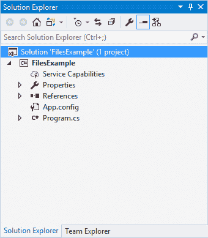

2.  右键单击“引用”节点，然后选择“添加引用”...从上下文菜单中:


3.  在参考管理器中，搜索单词`compression`。添加对系统的引用。压缩和系统。将文件系统压缩到您的项目中，然后单击确定按钮。

At the time of writing, there was a System.IO.Compression version 4.1.0.0 and System.IO.Compression version 4.0.0.0 available from the Reference Manager. The example I created just used version 4.1.0.0.

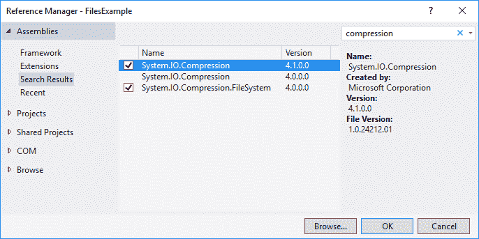

4.  添加参考资料后，您的解决方案应该如下所示:


5.  在您的`temp`文件夹中创建一个名为`Documents`的文件夹:


6.  在这个文件夹中，创建几个不同大小的文件:


您现在可以编写一些代码了。

# 怎么做...

1.  将以下`using`语句添加到您的`Program.cs`文件顶部:

```cs
        using System.IO;
        using System.IO.Compression;

```

2.  创建一个名为`ZipIt()`的方法，并向其中添加代码来压缩`Documents`目录。代码很容易理解。然而，我想强调一下`CreateFromDirectory()`方法的使用。请注意，我们已经将压缩级别设置为`CompressionLevel.Optimal`，并将`includeBaseDirectory`参数设置为`false`:

```cs
        private static void ZipIt(string path)
        {
          string sourceDirectory = $"{path}Documents";

          if (Directory.Exists(sourceDirectory))
          {
            string archiveName = $"{path}DocumentsArchive.zip";
            ZipFile.CreateFromDirectory(sourceDirectory, archiveName, 
                                        CompressionLevel.Optimal, false);
          } 
        }

```

3.  运行您的控制台应用，再次查看`temp`文件夹。您将看到创建了以下 ZIP 文件:


4.  查看 ZIP 文件的内容将显示我们之前看到的`Documents`文件夹中包含的文件:

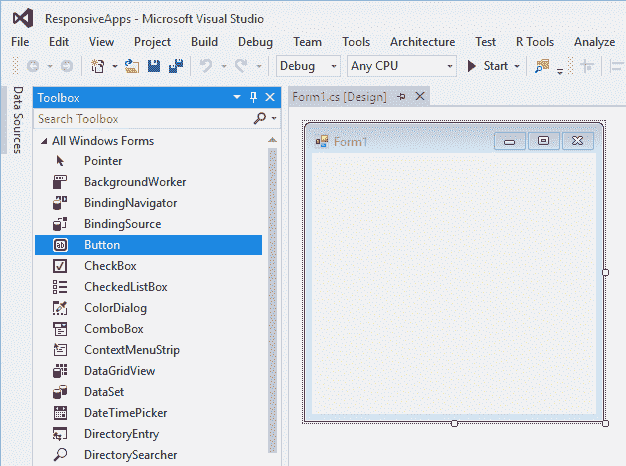

5.  查看 ZIP 文件的属性，您会看到它已经被压缩到 36 KB:

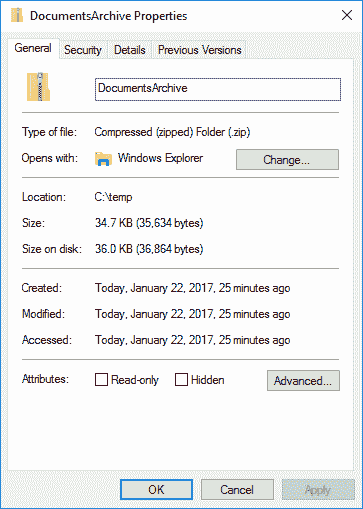

6.  提取一个 ZIP 文件也同样容易。创建一个名为`UnZipIt()`的方法，并将`temp`文件夹的路径传递给它。然后，指定解压文件的目录，并设置名为`destinationDirectory`的变量。调用`ExtractToDirectory()`方法并将`archiveName`和`destinationDirectory`变量作为参数传递给它:

```cs
        private static void UnZipIt(string path)
        {
          string destinationDirectory = $"{path}DocumentsUnzipped";

          if (Directory.Exists(path))
          {
            string archiveName = $"{path}DocumentsArchive.zip";
            ZipFile.ExtractToDirectory(archiveName, destinationDirectory);
          }
        }

```

7.  运行控制台应用并查看输出文件夹:

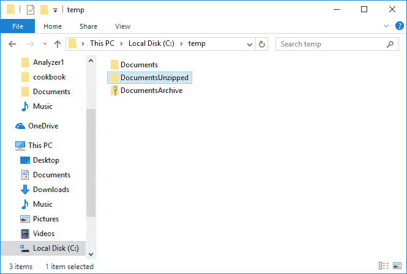

8.  查看`DocumentsUnzipped`文件夹中提取的文件，您会看到我们开始时的原始文件:

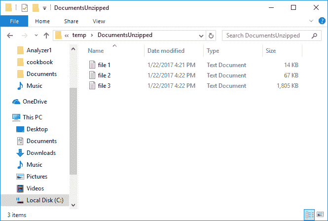

# 它是如何工作的...

在中处理 ZIP 文件.NET 真的很简单。那个.NET Framework 为创建档案等平凡的任务做了大量繁重的工作。它还允许开发人员维护一定标准的代码，而不必“滚动他们自己的”归档方法。

# 内存中的流压缩和解压缩

有时，您需要对大量文本执行一些内存压缩。您可能想要将此写入文件或数据库。也许您需要将文本作为附件通过电子邮件发送，然后由另一个系统接收并解压缩。不管是什么原因，内存压缩和解压缩是一个非常有用的特性。最好的方法是使用扩展方法。如果你到现在还没有弄明白这一点，我非常喜欢使用扩展方法。

# 准备好了

代码非常简单。你不需要事先做太多准备。只需确保在项目中包含以下`using`语句，并且在以下路径`C:\temp\Documents\file 3.txt`处有一个包含名为`file 3.txt`的文本的文件。您可以继续使用在前面的配方中创建的控制台应用。

```cs
using System.IO.Compression;
using System.Text;
using static System.Console;

```

# 怎么做...

1.  创建一个名为`ExtensionMethods`的类，它将包含两个名为`CompressStream()`和`DecompressStream()`的扩展方法。这两种扩展方法都会作用于一个字节数组并返回一个字节数组:

```cs
        public static class ExtensionMethods
        {
          public static byte[] CompressStream(this byte[] originalSource)
          {

          }

          public static byte[] DecompressStream(this byte[] originalSource)
          {

          }
        }

```

2.  查看`CompressStream()`扩展方法，需要新建一个`MemoryStream`返回调用代码。利用`using`语句，当物体移出范围时，对其进行适当的处理。接下来，添加一个`new GZipStream`对象，它将把我们给它的任何东西压缩到`outStream`对象中。您会注意到`CompressionMode.Compress`作为参数传递给了`GZipStream`对象。最后将`originalSource`写入`GZipStream`对象，压缩后返回调用方法:

```cs
        public static byte[] CompressStream(this byte[] originalSource)
        {
          using (var outStream = new MemoryStream())
          {
            using (var gzip = new GZipStream(outStream, 
                   CompressionMode.Compress))
            {
              gzip.Write(originalSource, 0, originalSource.Length);
            }

            return outStream.ToArray();
          } 
        }

```

3.  接下来把注意力转向`DecompressStream()`延伸法。过程其实真的很简单。从`originalSource`创建一个新的`MemoryStream`，并将其称为`sourceStream`。创建另一个名为`outStream`的`MemoryStream`返回到调用代码。接下来，创建一个新的`GZipStream`对象，并在设置`CompressionMode.Decompress`值的同时传递它`sourceStream`。将解压缩后的流复制到`outStream`并返回到调用代码:

```cs
        public static byte[] DecompressStream(this byte[] originalSource)
        {
          using (var sourceStream = new MemoryStream(originalSource))
          {
            using (var outStream = new MemoryStream())
            {
              using (var gzip = new GZipStream(sourceStream, 
                     CompressionMode.Decompress))
             {
               gzip.CopyTo(outStream); 
             }
             return outStream.ToArray();
           }
         }
       }

```

4.  我创建了一个名为`InMemCompressDecompress()`的方法来说明内存压缩和解压缩的使用。我正在将文件的内容读入一个名为`inputString`的变量。然后，我使用默认编码来获取字节、原始长度、压缩长度和解压缩长度。如果你想找回原始文本，一定要在代码中包含`newString = Encoding.Default.GetString(newFromCompressed);`行，并将其输出到控制台窗口。不过，提醒一句:如果你正在阅读大量文本，在控制台窗口中显示这些文本可能没有多大意义。请将其写入文件，以检查文本是否与压缩文本相同:

```cs
        private static void InMemCompressDecompress()
        {
          string largeFile = @"C:\temp\Documents\file 3.txt";

          string inputString = File.ReadAllText(largeFile);
          var bytes = Encoding.Default.GetBytes(inputString);

          var originalLength = bytes.Length;
          var compressed = bytes.CompressStream();
          var compressedLength = compressed.Length;

          var newFromCompressed = compressed.DecompressStream();
          var newFromCompressedLength = newFromCompressed.Length;

          WriteLine($"Original string length = {originalLength}");
          WriteLine($"Compressed string length = {compressedLength}");
          WriteLine($"Uncompressed string length = 
                    {newFromCompressedLength}");

          // To get the original Test back, call this
          //var newString = Encoding.Default.GetString(newFromCompressed);
        }

```

5.  如前所述，确保在正确的目录中有一个名为`File 3.txt`的文件。另外，确保文件包含一些文本。您可以看到，我要在内存中压缩的文件大小约为 1.8 MB:


6.  运行控制台应用将显示文件的原始长度、压缩长度和解压缩长度。正如预期的那样，解压缩后的长度与原始字符串长度相同:


# 它是如何工作的...

内存压缩和解压缩允许开发人员在处理包含大数据的对象时使用动态压缩和解压缩。例如，当您需要向数据库读写日志信息时，这非常有用。这是另一个例子.NET Framework 为开发人员提供了构建世界一流解决方案的完美平台。

# 异步和等待文件处理

借助 acync 和 wait，开发人员可以在执行文件处理等密集型任务时保持应用的完全响应。这是使用异步代码的最佳选择。如果您有几个需要复制的大文件，异步和等待方法将是保持表单响应的完美解决方案。

# 准备好

确保您已经在代码文件的顶部添加了以下`using`语句:

```cs
using System.IO;
using System.Threading;

```

为了让异步代码工作，我们需要包含线程命名空间。

# 怎么做...

1.  创建两个名为`AsyncDestination`和`AsyncSource`的文件夹:

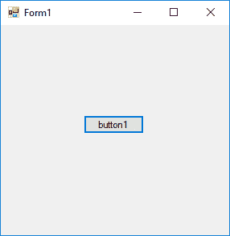

2.  在`AsyncSource`文件夹中，添加几个要处理的大文件:

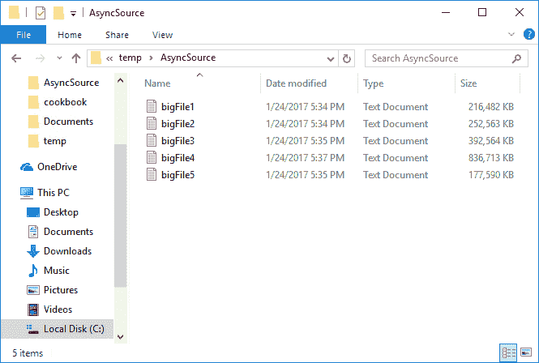

3.  创建一个新的 WinForms 应用，并在表单中添加一个 forms times 控件、一个按钮和一个名为`lblTimer`的标签。调用定时器 asyncTimer，并将其间隔设置为`1000`毫秒(1 秒):


4.  在构造函数上方的代码中，将`CancellationTokenSource`对象和`elapsedTime`变量添加到`Form1`类中:

```cs
        CancellationTokenSource cts;
        int elapsedTime = 0;

```

5.  在构造函数中，设置计时器标签文本:

```cs
        public Form1()
        {
          InitializeComponent();

          lblTimer.Text = "Timer Stopped";
        }

```

6.  在按钮点击事件处理程序中，添加两个 if 条件。第一个将在第一次单击按钮时运行。第二个将在再次单击按钮取消该过程时运行。请注意，这是`btnCopyFileAsync`的`async`事件处理程序:

```cs
        private async void btnCopyFilesAsync_Click(
          object sender, EventArgs e)
        {
          if (btnCopyFilesAsync.Text.Equals("Copy Files Async"))
          {

          }

          if (btnCopyFilesAsync.Text.Equals("Cancel Async Copy"))
          {

          }
        }

```

7.  为计时器添加一个`Tick`事件，并更新计时器标签文本:

```cs
        private void asyncTimer_Tick(object sender, EventArgs e)
        {
          lblTimer.Text = $"Duration = {elapsedTime += 1} seconds";
        }

```

8.  看看按钮点击里面的第二个`if`条件。将按钮文本设置回原来的样子，然后调用`CancellationTokenSource`对象的`Cancel()`方法:

```cs
        if (btnCopyFilesAsync.Text.Equals("Cancel Async Copy"))
        {
          btnCopyFilesAsync.Text = "Copy Files Async";
          cts.Cancel();

```

9.  在第一个`if`语句中，设置源目录和目标目录。还要更新按钮文本，以便再次单击它时，它将运行取消逻辑。实例化`CancellationTokenSource`，将`elapsedTime`变量设置为`0`，然后启动定时器。我们现在可以开始枚举源文件夹中的文件，并将结果存储在`fileEntries`变量中:

```cs
        if (btnCopyFilesAsync.Text.Equals("Copy Files Async"))
        {
          string sourceDirectory = @"C:\temp\AsyncSource\";
          string destinationDirectory = @"C:\temp\AsyncDestination\";
          btnCopyFilesAsync.Text = "Cancel Async Copy";
          cts = new CancellationTokenSource();
          elapsedTime = 0;
          asyncTimer.Start();

          IEnumerable<string> fileEntries = Directory
            .EnumerateFiles(sourceDirectory);
        }

```

10.  首先，遍历源文件夹中的文件，并将文件从源文件夹异步复制到目标文件夹。这一点可以在代码`await sfs.CopyToAsync(dfs, 81920, cts.Token);`一行看到。值`81920`只是缓冲区大小，取消令牌`cts.Token`被传递给异步方法:

```cs
        foreach (string sourceFile in fileEntries)
        {
          using (FileStream sfs = File.Open(sourceFile, FileMode.Open))
          {
            string destinationFilePath = $"{destinationDirectory}{
              Path.GetFileName(sourceFile)}";
            using (FileStream dfs = File.Create(destinationFilePath))
            {
              try
              {
                await sfs.CopyToAsync(dfs, 81920, cts.Token);
              }
              catch (OperationCanceledException ex)
              {
                asyncTimer.Stop();
                lblTimer.Text = $"Cancelled after {elapsedTime} seconds";
              }
            }
          }
        }

```

11.  最后，如果令牌没有被取消，请停止计时器并更新计时器标签:

```cs
        if (!cts.IsCancellationRequested)
        {
          asyncTimer.Stop();
          lblTimer.Text = $"Completed in {elapsedTime} seconds";
        }

```

12.  将所有代码放在一起，您会发现它们是如何结合在一起的:

```cs
        private async void btnCopyFilesAsync_Click(object sender, 
          EventArgs e)
        {
          if (btnCopyFilesAsync.Text.Equals("Copy Files Async"))
          {
            string sourceDirectory = @"C:\temp\AsyncSource\";
            string destinationDirectory = @"C:\temp\AsyncDestination\";
            btnCopyFilesAsync.Text = "Cancel Async Copy";
            cts = new CancellationTokenSource();
            elapsedTime = 0;
            asyncTimer.Start();

            IEnumerable<string> fileEntries = Directory
              .EnumerateFiles(sourceDirectory);

            //foreach (string sourceFile in Directory
                       .EnumerateFiles(sourceDirectory))
            foreach (string sourceFile in fileEntries)
            {
              using (FileStream sfs = File.Open(sourceFile, FileMode.Open))
              {
                string destinationFilePath = $"{destinationDirectory}
                {Path.GetFileName(sourceFile)}";
                using (FileStream dfs = File.Create(destinationFilePath))
                {
                  try
                  {
                    await sfs.CopyToAsync(dfs, 81920, cts.Token);
                  }
                  catch (OperationCanceledException ex)
                  {
                    asyncTimer.Stop();
                    lblTimer.Text = $"Cancelled after {elapsedTime}
                      seconds";
                  }
                }
              }
            }

            if (!cts.IsCancellationRequested)
            {
              asyncTimer.Stop();
              lblTimer.Text = $"Completed in {elapsedTime} seconds";
            }
          }
          if (btnCopyFilesAsync.Text.Equals("Cancel Async Copy"))
          {
            btnCopyFilesAsync.Text = "Copy Files Async";
            cts.Cancel();
          }
        }

```

# 它是如何工作的...

当窗口窗体第一次打开时，您会看到计时器标签默认为计时器停止。单击复制文件异步按钮开始复制过程:

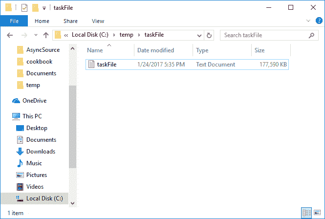

当应用完成处理后，您将看到大型文件已被复制到目标文件夹:


当复制过程正在运行时，您的 Windows 窗体保持活动和响应状态。计时器标签也继续计数。通常，在这样的过程中，表单会没有响应:

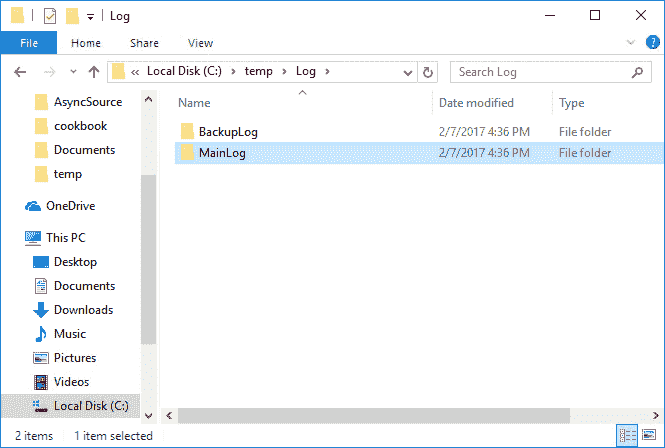

文件复制完成后，计时器标签将显示异步复制过程的持续时间。一个有趣的实验是摆弄这段代码，看看你能优化多少来提高复制速度:

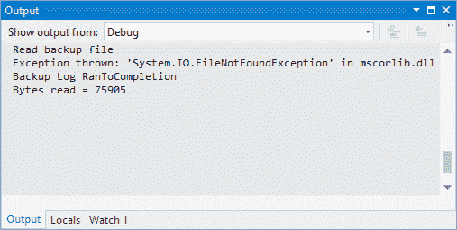

Windows 窗体不仅保持响应，还允许您随时取消该过程。当您单击复制文件异步按钮时，文本将更改为取消异步复制:

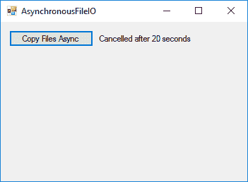

单击取消按钮或将`CancellationTokenSource`对象设置为取消，这又会停止异步文件复制过程。

# 如何使自定义类型可序列化？

序列化是将一个对象的状态转换成一组字节的过程(取决于所使用的序列化类型，它可以是 XML、二进制、JSON)，然后可以保存在流中(想想`MemoryStream`或`FileStream`)或通过 WCF 或网络应用编程接口传输。使自定义类型可序列化意味着您可以通过添加`System.SerializableAttribute`将序列化应用于自定义类型。自定义类型的示例如下:

*   类和泛型类
*   结构
*   枚举数

序列化的一个真实例子是为特定对象创建恢复机制。想象一个工作流场景。在某个时间点，需要保持工作流的状态。您可以序列化该对象的状态，并将其存储在数据库中。当工作流需要在未来某个时间点继续时，您可以从数据库中读取对象，并将其反序列化为持久化到数据库之前的确切状态。

Trying to serialize a non-serializable type will result in your code throwing a `SerializationException`.

# 准备好

如果从控制台应用运行此示例，请确保控制台应用通过将`using System`添加到`Program.cs`文件的顶部来导入`System`命名空间。还要确保添加了`using System.Runtime.Serialization.Formatters.Binary`。

# 怎么做...

1.  首先添加一个名为`Cat`的抽象类。这个类只是定义了`Weight`和`Age`的字段。请注意，为了使您的类可序列化，您需要向它添加`[Serializable]`属性。

```cs
        [Serializable]
        public abstract class Cat
        {
          // fields
          public int Weight;
          public int Age; 
        }

```

2.  接下来，创建一个名为`Tiger`的类，它是从`Cat`类派生的。请注意，`Tiger`类还必须添加`[Serializable]`属性。这是因为序列化不是从基类继承的。每个派生类必须自己实现序列化:

```cs
        [Serializable]
        public class Tiger : Cat
        {
          public string Trainer;
          public bool IsTamed;
        }

```

3.  接下来，我们需要创建一个方法来序列化`Tiger`类。创建一个类型为`Tiger`的新对象，并为其设置一些值。然后，我们使用`BinaryFormatter`将`Tiger`类序列化为`stream`类，并将其返回到调用代码:

```cs
        private static Stream SerializeTiger()
        {
          Tiger tiger = new Tiger();
          tiger.Age = 12;
          tiger.IsTamed = false;
          tiger.Trainer = "Joe Soap";
          tiger.Weight = 120;

          MemoryStream stream = new MemoryStream();
          BinaryFormatter fmt = new BinaryFormatter();
          fmt.Serialize(stream, tiger);
          stream.Position = 0;
          return stream;
        }

```

4.  反序列化甚至更容易。我们创建一个`DeserializeTiger`方法并将`stream`传递给它。然后我们再次使用`BinaryFormatter`将`stream`反序列化为类型为`Tiger`的对象:

```cs
        private static void DeserializeTiger(Stream stream)
        {
          stream.Position = 0;
          BinaryFormatter fmt = new BinaryFormatter();
          Tiger tiger = (Tiger)fmt.Deserialize(stream);
        }

```

5.  要查看序列化和反序列化的结果，请将`SerializeTiger()`方法的结果读入一个新的`Stream`中，并在控制台窗口中显示它。然后，调用`DeserializeTiger()`方法:

```cs
        Stream str = SerializeTiger();
        WriteLine(new StreamReader(str).ReadToEnd());
        DeserializeTiger(str);

```

# 它是如何工作的...

当序列化数据写入控制台窗口时，您将看到一些识别信息。然而，大部分看起来会很混乱。这是因为显示的是二进制序列化数据。

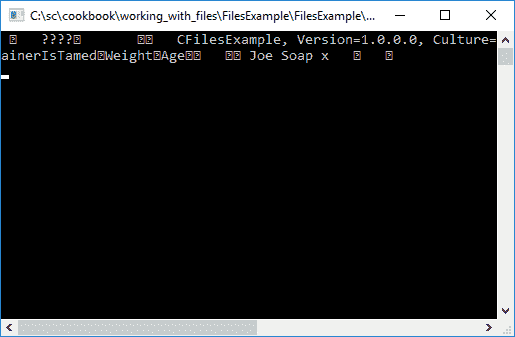

当该序列化数据被反序列化时，它被转换回类型为`Tiger`的对象。您可以清楚地看到字段的原始值在反序列化对象中是如何可见的。


# 使用 ISerializable 对文件流进行自定义序列化

如果你想对序列化的内容有更多的控制，你应该在你的对象上实现`ISerializable`。这使开发人员可以完全控制序列化的内容。请注意，您仍然需要向对象添加`[ISerializable]`属性。最后，开发人员还需要实现反序列化构造函数。然而，使用`ISerializable`确实有一个警告。根据 MSDN，您的对象与较新版本的.NET 框架和对序列化框架的任何改进可能不适用于您的对象。您还需要在对象的所有派生类型上实现`ISerializable`。

# 准备好了

我们将使用`ISerializable`创建一个想要控制自己序列化的新类。确保您的应用将`using System.Runtime.Serialization;`添加到`using`声明中。

# 怎么做...

1.  创建一个名为`Vehicle`的类。你会注意到这个类实现`ISerializable`的同时仍然具有`[Serializable]`属性。您必须这样做，以便公共语言运行库可以将此类标识为可序列化的:

```cs
        [Serializable]
        public class Vehicle : ISerializable
        {

        }

```

2.  向该类添加以下字段和构造函数:

```cs
        // Primitive fields
        public int VehicleType;
        public int EngineCapacity;
        public int TopSpeed;

        public Vehicle()
        {

        }

```

3.  当你在你的`Vehicle`类上实现`ISerilizable`时，Visual Studio 会提醒你在你的类内没有实现`ISerializable`接口。通过单击带下划线的接口名称旁边的灯泡并接受更正来添加实现。Visual Studio 现在将在您的类中添加`GetObjectData()`方法。请注意，添加方法时有一个异常，如果不在方法中添加一些代码，该异常将引发`NotImplementedException`。在此添加非常基本的代码，简单地将字段值添加到`SerializationInfo`对象:

```cs
        public void GetObjectData(SerializationInfo info, 
          StreamingContext context)
        {
          info.AddValue("VehicleType", VehicleType);
          info.AddValue("EngineCapacity", EngineCapacity);
          info.AddValue("TopSpeed", TopSpeed);
        }

```

4.  如前所述，我们需要添加反序列化构造函数来反序列化字段。这个，你手动添加:

```cs
        // Deserialization constructor
        protected Vehicle(SerializationInfo info, StreamingContext context)
        {
          VehicleType = info.GetInt32("VehicleType");
          EngineCapacity = info.GetInt32("EngineCapacity");
          TopSpeed = info.GetInt32("TopSpeed");
        }

```

5.  添加所有代码后，您的类应该如下所示:

```cs
        [Serializable]
        public class Vehicle : ISerializable
        {
          // Primitive fields
          public int VehicleType;
          public int EngineCapacity;
          public int TopSpeed;

          public Vehicle()
          {

          }
          public void GetObjectData(SerializationInfo info, 
            StreamingContext context)
          {
            info.AddValue("VehicleType", VehicleType);
            info.AddValue("EngineCapacity", EngineCapacity);
            info.AddValue("TopSpeed", TopSpeed);
          }

          // Deserialization constructor
          protected Vehicle(SerializationInfo info, 
            StreamingContext context)
          {
            VehicleType = info.GetInt32("VehicleType");
            EngineCapacity = info.GetInt32("EngineCapacity");
            TopSpeed = info.GetInt32("TopSpeed");
          }
        }

```

6.  我们只是将序列化的类写入一个文件。出于这个方法的目的，只需为文件硬编码一个输出路径。接下来，创建`Vehicle`类的新实例，并为字段设置一些值:

```cs
        string serializationPath = @"C:\temp\vehicleInfo.dat";
        Vehicle vehicle = new Vehicle();
        vehicle.VehicleType = (int)VehicleTypes.Car;
        vehicle.EngineCapacity = 1600;
        vehicle.TopSpeed = 230;

        if (File.Exists(serializationPath))
          File.Delete(serializationPath);

```

7.  还要确保将`VehicleTypes`枚举器添加到您的类的顶部:

```cs
        public enum VehicleTypes
        {
          Car = 1,
          SUV = 2,
          Utility = 3
        }

```

8.  然后，我们将序列化该类的代码添加到您在硬编码路径中指定的文件中。为此，我们添加一个`FileStream`和一个`BinaryFormatter`对象来将`vehicle`序列化到文件中:

```cs
        using (FileStream stream = new FileStream(serializationPath, 
          FileMode.Create))
        {
          BinaryFormatter fmter = new BinaryFormatter();
          fmter.Serialize(stream, vehicle);
        }

```

9.  最后，我们添加代码来读取包含序列化数据的文件，并创建包含序列化时`Vehicle`状态的`Vehicle`对象。虽然反序列化代码在序列化代码之后立即运行，但请注意，这只是为了演示。`Vehicle`反序列化可以通过读取文件在未来任何时间点发生:

```cs
        using (FileStream stream = new FileStream(serializationPath, 
          FileMode.Open))
        {
          BinaryFormatter fmter = new BinaryFormatter();
          Vehicle deserializedVehicle = (Vehicle)fmter.Deserialize(stream);
        }

```

# 它是如何工作的...

运行代码后，您会发现`vehicleInfo.dat`文件已经在您指定的路径上创建:


在文本编辑器中打开文件将显示序列化信息。正如您可能注意到的，一些课程信息仍然可见:

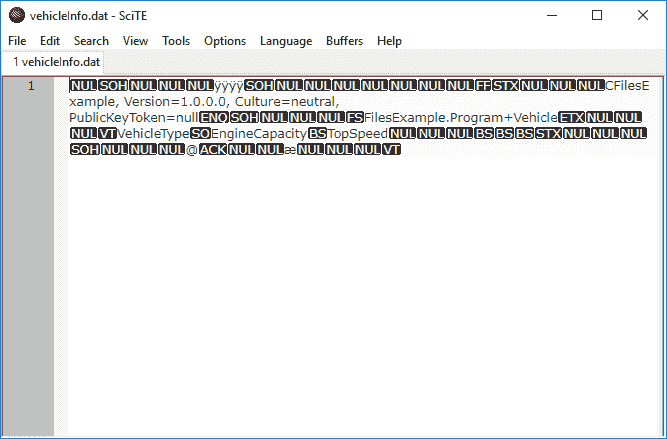

如果我们在反序列化代码中添加一个断点，并检查创建的`deserializedVehicle`对象，您将看到`Vehicle`状态已经*重新水合*到序列化之前的状态:


# 使用 XmlSerializer

从名字上你可能猜到了`XmlSerializer`将数据序列化为 XML。它让您可以更好地控制序列化数据的 XML 结构。使用此序列化程序的典型现实示例是保持与 XML web 服务的兼容性。当使用某种类型的消息队列(如 MSMQ 或拉比 MQ)传输数据时，它也是一种易于使用的介质。

`XmlSerializer`的默认行为是序列化公共字段和属性。使用来自`System.Xml.Serialization`命名空间的属性，您可以控制您的 XML 的结构。

# 准备好了

由于我们将在本例中使用`List<>`，请确保您已经添加了`using System.Collections.Generic;`名称空间。我们还希望对 XML 的结构有更多的控制，因此也包括使用`System.Xml.Serialization;`命名空间，以便我们可以使用适当的属性。最后，对于 LINQ 查询，您需要添加`using System.Linq;`名称空间。

# 怎么做...

1.  首先创建一个`Student`类。

```cs
        public class Student
        {
          public string StudentName;
          public double SubjectMark;
        }

```

2.  接下来，为名为`FundamentalProgramming`的主题创建一个类。几个属性已应用于该类的字段:
    *   `XmlRoot`
    *   `XmlElement`
    *   `XmlIgnore`
    *   `XmlAttribute`
    *   `XmlArray`

我们可以看到`XmlRoot`属性指定`ElementName`被称为`FundamentalsOfProgramming`。因此，该属性定义了生成的 XML 的根。`XmlElement`指定了一个名为`LecturerFullName`的元素，而不是`Lecturer`。`XmlIgnore`属性将导致`XmlSerializer`在序列化期间忽略该字段，而`XmlAttribute`将在生成的 XML 的根元素上创建一个属性。最后，我们用`XmlArray`属性序列化`List<Student>`集合:

```cs
        [XmlRoot(ElementName = "FundamentalsOfProgramming", 
          Namespace = "http://serialization")]
        public class FundamentalProgramming
        {
          [XmlElement(ElementName = "LecturerFullName", 
            DataType = "string")]
          public string Lecturer;

          [XmlIgnore]
          public double ClassAverage;

          [XmlAttribute]
          public string RoomNumber;

          [XmlArray(ElementName = "StudentsInClass", 
            Namespace = "http://serialization")]
          public List<Student> Students; 
        }

```

3.  在调用代码中，设置`Student`对象并将它们添加到`List<Student>`对象`students`中:

```cs
        string serializationPath = @"C:tempclassInfo.xml";
        Student studentA = new Student()
        {
          StudentName = "John Smith"
          , SubjectMark = 86.4
        };
        Student studentB = new Student()
        {
          StudentName = "Jane Smith"
          , SubjectMark = 67.3
        };
        List<Student> students = new List<Student>();
        students.Add(studentA);
        students.Add(studentB);

```

4.  现在我们创建我们的`FundementalProgramming`类并填充字段。`ClassAverage`被忽略的原因是因为我们总是会计算这个字段值:

```cs
        FundamentalProgramming subject = new FundamentalProgramming();
        subject.Lecturer = "Prof. Johan van Niekerk";
        subject.RoomNumber = "Lecture Auditorium A121";
        subject.Students = students;
        subject.ClassAverage = (students.Sum(mark => mark.SubjectMark) / 
          students.Count());

```

5.  添加以下代码来序列化`subject`对象，注意将对象的类型作为`typeof(FundamentalProgramming)`传递给`XmlSerializer`:

```cs
        using (FileStream stream = new FileStream(serializationPath, 
          FileMode.Create))
        {
          XmlSerializer xmlSer = new XmlSerializer(typeof(
            FundamentalProgramming));
          xmlSer.Serialize(stream, subject);
        }

```

6.  最后，添加代码将 XML 反序列化回`FundamentalProgramming`对象:

```cs
        using (FileStream stream = new FileStream(serializationPath, 
          FileMode.Open))
        {
          XmlSerializer xmlSer = new XmlSerializer(typeof(
            FundamentalProgramming));
          FundamentalProgramming fndProg = (FundamentalProgramming)
            xmlSer.Deserialize(stream);
        }

```

# 它是如何工作的...

当您运行控制台应用时，您会发现它在代码中指定的路径上创建了一个 XML 文档。查看这个 XML 文档，您可以看到 XML 元素是按照我们在类中使用属性指定的方式定义的。注意`FundamentalsOfProgramming`根元素有`RoomNumber`字段作为属性。字段`ClassAverage`已被忽略，不在 XML 中。最后，您可以看到`List<Student>`对象被很好地序列化为 XML 文件。

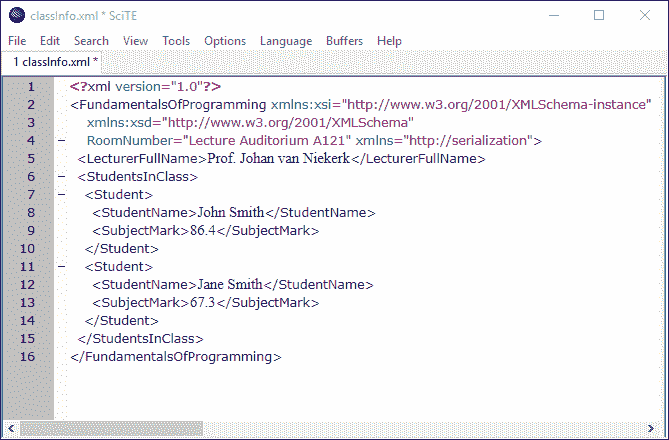

在对 XML 进行反序列化时，您会注意到显示了序列化的值。`ClassAverage`；但是，没有值，因为它从一开始就没有序列化过。

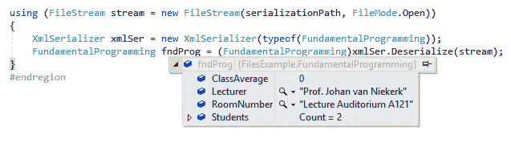

# JSON 序列化程序

与`BinaryFormatter`不同，JSON 序列化以人类可读的格式序列化数据。使用`XmlSerializer`也产生了人类可读的 XML，但是 JSON 序列化产生的数据比`XmlSerializer`小。JSON 主要用于交换数据，可以与许多不同的编程语言一起使用(XML 也是如此)。

# 准备好了

从“工具”菜单中，转到“获取包管理器”，然后单击“管理解决方案的获取包”...菜单。在“浏览”选项卡中，搜索牛顿英尺。Json 并安装 NuGet 包。牛顿英尺。Json 是. NET 的一个高性能 JSON 框架，一旦安装好，你会看到引用 Newtonsoft。Json 已经添加到您的项目“参考”中。

在类的`using`语句中，将以下名称空间`using Newtonsoft.Json;`和`using Newtonsoft.Json.Linq;`添加到代码中。

# 怎么做...

1.  首先创建我们之前在`XmlSerializer`中使用的`FundamentalProgramming`和`Student`类。这一次，移除所有属性以生成以下代码:

```cs
        public class FundamentalProgramming
        {
          public string Lecturer;
          public double ClassAverage;
          public string RoomNumber;
          public List<Student> Students;
        }

        public class Student
        {
          public string StudentName;
          public double SubjectMark;
        }

```

2.  在调用代码中，如前所述设置`Student`对象，并将它们添加到`List<Student>`:

```cs
        string serializationPath = @"C:\temp\classInfo.txt";
        Student studentA = new Student()
        {
          StudentName = "John Smith"
          , SubjectMark = 86.4
        };
        Student studentB = new Student()
        {
          StudentName = "Jane Smith"
          , SubjectMark = 67.3
        };
        List<Student> students = new List<Student>();
        students.Add(studentA);
        students.Add(studentB);

```

3.  创建类型为`FundamentalProgramming`的`subject`对象，并将值分配给字段:

```cs
        FundamentalProgramming subject = new FundamentalProgramming();
        subject.Lecturer = "Prof. Johan van Niekerk";
        subject.RoomNumber = "Lecture Auditorium A121";
        subject.Students = students;
        subject.ClassAverage = (students.Sum(mark => mark.SubjectMark) / 
          students.Count());
        WriteLine($"Calculated class average = {subject.ClassAverage}");

```

4.  向代码中添加一个`JsonSerializer`对象，并将格式设置为缩进。使用`JsonWriter`，将`subject`序列化到`serializationPath`到文件`classInfo.txt`:

```cs
        JsonSerializer json = new JsonSerializer();
        json.Formatting = Formatting.Indented;
        using (StreamWriter sw = new StreamWriter(serializationPath))
        {
          using (JsonWriter wr = new JsonTextWriter(sw))
          {
            json.Serialize(wr, subject);
          }
        }
        WriteLine("Serialized to file using JSON Serializer");

```

5.  下一段代码将从先前创建的文件`classInfo.txt`中读取文本，并创建一个名为`jobj`的`JObject`，该文件使用`Newtonsoft.Json.Linq`命名空间来查询 JSON 对象。使用`JObject`解析从文件返回的字符串。这就是使用`Newtonsoft.Json.Linq`名称空间的力量变得显而易见的地方。我可以使用 LINQ 查询`jobj`对象返回学生分数并计算平均值:

```cs
        using (StreamReader sr = new StreamReader(serializationPath))
        {
          string jsonString = sr.ReadToEnd();
          WriteLine("JSON String Read from file");
          JObject jobj = JObject.Parse(jsonString);
          IList<double> subjectMarks = jobj["Students"].Select(
            m => (double)m["SubjectMark"]).ToList();
          var ave = subjectMarks.Sum() / subjectMarks.Count();
          WriteLine($"Calculated class average using JObject = {ave}");
        }

```

6.  如果需要反序列化 JSON 对象，反序列化器逻辑很容易实现。我们使用`JsonReader`从文件中获取文本并反序列化它:

```cs
        using (StreamReader sr = new StreamReader(serializationPath))
        {
          using (JsonReader jr = new JsonTextReader(sr))
          {
            FundamentalProgramming funProg = json.Deserialize
              <FundamentalProgramming>(jr);
          }
        }

```

# 它是如何工作的...

运行控制台应用后，您可以查看由 JSON 序列化程序创建的文件。

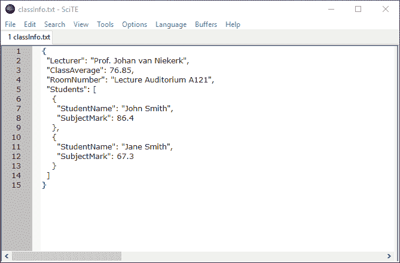

对该类的类平均值计算结果和对 JSON 对象的 LINQ 查询结果完全相同。


最后，当向代码中添加断点并检查`funProg`对象时，可以看到文件中 JSON 文本的反序列化对象。如您所见，对象状态与序列化到文件之前相同。

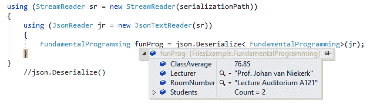

你还记得在这个食谱的开头，我提到 JSON 产生的数据比 XML 少得多吗？我在`List<Student>`创建了包含一万名学生的`Student`类，并使用 XML 和 JSON 进行了序列化。这两种文件大小的比较非常惊人。JSON 显然会生成一个小得多的文件。

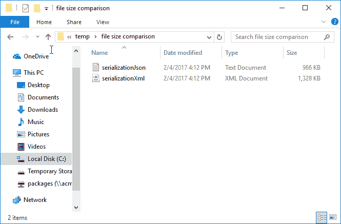