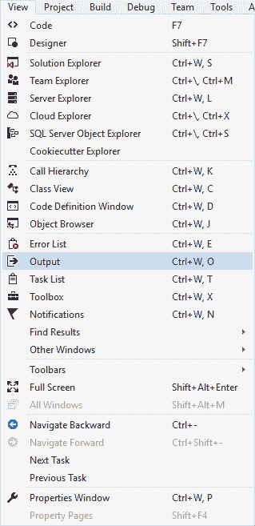

# 七、通过异步编程使应用响应

本章将向您介绍异步编程。它将涵盖以下食谱:

*   异步函数的返回类型
*   异步编程中的任务处理
*   异步编程中的异常处理

# 介绍

异步编程是 C# 中令人兴奋的特性。它允许您在长时间运行的任务完成执行时，继续在主线程上执行程序。当这个长时间运行的任务完成时，线程池中的一个线程将返回到包含的方法，以便长时间运行的任务可以继续执行。学习和理解异步编程的最好方法是体验它。下面的食谱将向你展示一些基础知识。

# 异步函数的返回类型

在异步编程中，`async`方法可以有三种可能的返回类型。这些措施如下:

*   `void`
*   `Task`
*   `Task<TResult>`

我们将在下面的食谱中看看每种返回类型。

# 准备好

在异步方法中`void`返回类型有什么用？通常，`void`用于事件处理程序。只要记住`void`不退货，你就等不及了。因此，如果您调用`void`返回类型异步方法，您的调用代码应该能够继续执行代码，而不必等待异步方法完成。

对于返回类型为`Task`的异步方法，可以使用`await`运算符暂停当前线程的执行，直到被调用的异步方法完成。请记住，返回类型`Task`的异步方法基本上不返回操作数。所以，如果写成同步方法，就是`void`返回式方法。这种说法可能会令人困惑，但在下面的食谱中会变得很清楚。

最后，带有`return`语句的异步方法的返回类型为`TResult`。换句话说，如果异步方法返回一个布尔值，您将创建一个返回类型为`Task<bool>`的异步方法。

先说`void`返回式异步方法。

# 怎么做...

1.  在 Visual Studio 中创建新的 Windows 窗体项目，名为`winformAsync`。我们将创建一个新的 Windows 窗体应用，这样我们就可以创建一个按钮点击事件。

2.  在 winformAsync 窗体设计器上，打开工具箱并选择按钮控件，该控件位于“所有 Windows 窗体”节点下:


3.  将按钮控件拖到窗体 1 设计器上。

4.  选中 Button 控件后，双击该控件以在后面的代码中创建 click 事件。Visual Studio 将为您插入事件代码:

```cs
      namespace winformAsync 
      { 
          public partial class Form1 : Form 
          { 
              public Form1() 
              { 
                  InitializeComponent(); 
              } 

              private void button1_Click(object sender, EventArgs e) 
              { 

              } 
          } 
      }

```

5.  更改`button1_Click`事件，并将`async`关键字添加到点击事件中。这是一个`void`返回异步方法的例子:

```cs
      private async void button1_Click(object sender, EventArgs e) 
      { 
      }

```

6.  接下来，创建一个名为`AsyncDemo`的新类:

```cs
      public class AsyncDemo 
      { 
      }

```

7.  要添加到`AsyncDemo`类的下一个方法是返回`TResult`的异步方法(在本例中，是一个布尔值)。这个方法只是检查当前年份是否是闰年。然后，它向调用代码返回一个布尔值:

```cs
      async Task<bool> TaskOfTResultReturning_AsyncMethod() 
      { 
          return await Task.FromResult<bool>
          (DateTime.IsLeapYear(DateTime.Now.Year)); 
      }

```

8.  下一个要添加的方法是`void`返回方法，它返回一个`Task`类型，这样您就可以`await`该方法。方法本身不返回任何结果，成为`void`返回方法。但是，为了使用`await`关键字，您需要从这个异步方法返回`Task`类型:

```cs
      async Task TaskReturning_AsyncMethod() 
      { 
          await Task.Delay(5000); 
          Console.WriteLine("5 second delay");     
      }

```

9.  最后，添加一个方法，该方法将调用前面的异步方法并显示闰年检查的结果。您会注意到我们在两个方法调用中都使用了`await`关键字:

```cs
      public async Task LongTask() 
      { 
         bool isLeapYear = await TaskOfTResultReturning_AsyncMethod();    
         Console.WriteLine($"{DateTime.Now.Year} {(isLeapYear ? " is " : 
                           "  is not  ")} a leap year"); 
         await TaskReturning_AsyncMethod(); 
      }

```

10.  在按钮单击中，添加以下异步调用长期运行任务的代码:

```cs
      private async void button1_Click(object sender, EventArgs e) 
      { 
          Console.WriteLine("Button Clicked"); 
          AsyncDemo oAsync = new AsyncDemo(); 
          await oAsync.LongTask(); 
          Console.WriteLine("Button Click Ended"); 
      }

```

11.  运行应用将显示 Windows 窗体应用:


12.  在单击按钮 1 按钮之前，确保输出窗口可见。为此，请单击查看，然后单击输出。也可以只按住 *Ctrl* + *W* + *O* 。



13.  显示输出窗口将允许我们看到我们在`AsyncDemo`类和窗口应用中添加到代码中的`Console.Writeline()`输出。
14.  点击按钮 1 按钮将显示输出到我们的输出窗口。在整个代码执行过程中，表单保持响应:


15.  最后，您也可以在单独的呼叫中使用`await`运算符。在`LongTask()`方法中修改代码如下:

```cs
      public async Task LongTask() 
      { 
          Task<bool> blnIsLeapYear = TaskOfTResultReturning_AsyncMethod(); 

          for (int i = 0; i <= 10000; i++) 
          { 
              // Do other work that does not rely on 
              // blnIsLeapYear before awaiting 
          } 

          bool isLeapYear = await TaskOfTResultReturning_AsyncMethod();    
          Console.WriteLine($"{DateTime.Now.Year} {(isLeapYear ?      
                            " is " : "  is not  ")} a leap year"); 

          Task taskReturnMethhod = TaskReturning_AsyncMethod(); 

          for (int i = 0; i <= 10000; i++) 
          { 
              // Do other work that does not rely on 
              // taskReturnMethhod before awaiting 
          } 

          await taskReturnMethhod; 
      }

```

# 它是如何工作的...

在前面的代码中，我们看到了在`button1_Click`事件中使用的`void`返回类型异步方法。我们还创建了一个不返回任何东西的`Task`返回方法(如果在同步编程中使用的话，那将是一个`void`，但是返回一个`Task`类型允许我们`await`该方法。最后，我们创建了一个`Task<TResult>`返回方法，它执行一个任务并将结果返回给调用代码。

# 异步编程中的任务处理

**基于任务的异步模式** ( **TAP** )现在是创建异步代码的推荐方法。它在线程池中的一个线程上异步执行，而不在应用的主线程上同步执行。它允许我们通过调用`Status`属性来检查任务的状态。

# 准备好

我们将创建一个任务来读取一个非常大的文本文件。这将使用异步`Task`来完成。确保您已经将`using System.IO;`命名空间添加到您的 Windows 窗体应用中。

# 怎么做...

1.  创建一个大的文本文件(我们称之为我们的`taskFile.txt`)并将其放入名为`C:\temp\taskFile\`的文件夹中:


2.  在`AsyncDemo`类中，创建一个名为`ReadBigFile()`的方法，该方法返回一个`Task<TResult>`类型，该类型将用于返回从我们的大文本文件中读取的整数字节:

```cs
      public Task<int> ReadBigFile() 
      {     
      }

```

3.  添加以下代码来打开和读取文件字节。您将会看到，我们正在使用`ReadAsync()`方法，该方法从流中异步读取一个字节序列，并根据从该流中读取的字节数来提升该流的位置。您还会注意到，我们正在使用一个缓冲区来读取这些字节:

```cs
      public Task<int> ReadBigFile() 
      { 
          var bigFile = File.OpenRead(@"C:\temp\taskFile\taskFile.txt"); 
          var bigFileBuffer = new byte[bigFile.Length]; 
          var readBytes = bigFile.ReadAsync(bigFileBuffer, 0,
          (int)bigFile.Length); 

          return readBytes; 
      }

```

The exceptions you can expect to handle from the `ReadAsync()` method are `ArgumentNullException`, `ArgumentOutOfRangeException`, `ArgumentException`, `NotSupportedException`, `ObjectDisposedException`, and `InvalidOperatorException`.

4.  最后，在`var readBytes = bigFile.ReadAsync(bigFileBuffer, 0, (int)bigFile.Length);`行之后添加最后一段代码，该代码使用 lambda 表达式来指定任务需要执行的工作。在这种情况下，需要读取文件中的字节:

```cs
      public Task<int> ReadBigFile() 
      { 
          var bigFile = File.OpenRead(@"C:temptaskFile.txt"); 
          var bigFileBuffer = new byte[bigFile.Length]; 
          var readBytes = bigFile.ReadAsync(bigFileBuffer, 0, 
          (int)bigFile.Length); 
          readBytes.ContinueWith(task => 
          { 
              if (task.Status == TaskStatus.Running) 
                  Console.WriteLine("Running"); 
              else if (task.Status == TaskStatus.RanToCompletion) 
                  Console.WriteLine("RanToCompletion"); 
              else if (task.Status == TaskStatus.Faulted) 
                  Console.WriteLine("Faulted"); 

              bigFile.Dispose(); 
          }); 
          return readBytes; 
      }

```

5.  如果您在前面的方法中没有这样做，请在您的 Windows 窗体应用的窗体设计器中添加一个按钮。在 winformAsync 窗体设计器中，打开工具箱并选择按钮控件，该控件位于“所有 Windows 窗体”节点下:


6.  将按钮控件拖到窗体 1 设计器上:

7.  选中 Button 控件后，双击该控件以在后面的代码中创建 click 事件。Visual Studio 将为您插入事件代码:

```cs
      namespace winformAsync 
      { 
          public partial class Form1 : Form 
          { 
              public Form1() 
              { 
                  InitializeComponent(); 
              } 

              private void button1_Click(object sender, EventArgs e) 
              { 

              } 
          } 
      }

```

8.  更改`button1_Click`事件，并将`async`关键字添加到点击事件中。这是一个`void`返回异步方法的例子:

```cs
      private async void button1_Click(object sender, EventArgs e) 
      { 

      }

```

9.  现在，确保您添加了异步调用`AsyncDemo`类的`ReadBigFile()`方法的代码。请记住将方法的结果(读取的字节数)读入一个整数变量:

```cs
      private async void button1_Click(object sender, EventArgs e) 
      { 
          Console.WriteLine("Start file read"); 
          AsyncDemo oAsync = new AsyncDemo(); 
          int readResult = await oAsync.ReadBigFile(); 
          Console.WriteLine("Bytes read = " + readResult); 
      }

```

10.  运行应用将显示 Windows 窗体应用:


11.  在单击按钮 1 按钮之前，确保输出窗口可见:


12.  在视图菜单中，点击输出菜单项或输入 *Ctrl* + *W* + *O* 显示输出窗口。这将允许我们看到我们在`AsyncDemo`类和窗口应用中添加到代码中的`Console.Writeline()`输出。
13.  点击按钮 1 按钮将显示输出到我们的输出窗口。在整个代码执行过程中，表单保持响应:


Take note, though, that the information displayed in your Output window will differ from the screenshot. This is because the file you used is different from mine.

# 它是如何工作的...

任务在线程池之外的单独线程上执行。这允许应用在处理大文件时保持响应。任务可以通过多种方式来改进代码。这个食谱只是一个例子。

# 异步编程中的异常处理

异步编程中的异常处理一直是一个挑战。在接球区尤其如此。以下特性(在 C# 6.0 中引入)允许您在异常处理程序的`catch`和`finally`块中编写异步代码。

# 准备好

应用将模拟读取日志文件的操作。假设第三方系统总是在另一个应用中处理日志文件之前对其进行备份。在此过程中，会删除并重新创建日志文件。然而，我们的应用需要定期读取这个日志文件。因此，我们需要为文件不存在于我们期望的位置的情况做好准备。因此，我们将故意省略主日志文件，以便我们可以强制出错。

# 怎么做...

1.  创建一个文本文件和两个文件夹来包含日志文件。然而，我们将只在`BackupLog`文件夹中创建一个日志文件。命名你的文本文件`taskFile.txt`并将其复制到`BackupLog`文件夹。`MainLog`文件夹将保持为空:


2.  在我们的`AsyncDemo`类中，编写一个方法来读取`enum`值指定的文件夹中的日志文件:

```cs
      private async Task<int> ReadLog(LogType logType)
      {
         string logFilePath = String.Empty;
         if (logType == LogType.Main)
            logFilePath = @"C:\temp\Log\MainLog\taskFile.txt";
         else if (logType == LogType.Backup)
            logFilePath = @"C:\temp\Log\BackupLog\taskFile.txt";

         string enumName = Enum.GetName(typeof(LogType), (int)logType);

         var bigFile = File.OpenRead(logFilePath);
         var bigFileBuffer = new byte[bigFile.Length];
         var readBytes = bigFile.ReadAsync(bigFileBuffer, 0, 
         (int)bigFile.Length);
         await readBytes.ContinueWith(task =>
         {
            if (task.Status == TaskStatus.RanToCompletion)
               Console.WriteLine($"{enumName} Log RanToCompletion");
            else if (task.Status == TaskStatus.Faulted)
               Console.WriteLine($"{enumName} Log Faulted");

            bigFile.Dispose();
         });
         return await readBytes;
      }

```

3.  如下所示创建`enum`值:

```cs
      public enum LogType { Main = 0, Backup = 1 }

```

4.  然后我们将创建一个尝试读取主日志文件的主`ReadLogFile()`方法。由于我们没有在`MainLog`文件夹中创建日志文件，代码将抛出一个`FileNotFoundException`。然后，它将运行异步方法并将它放在`ReadLogFile()`方法的`catch`块中(这在以前的 C# 版本中是不可能的)，将读取的字节返回给调用代码:

```cs
      public async Task<int> ReadLogFile()
      {
         int returnBytes = -1;
         try
         {
            returnBytes = await ReadLog(LogType.Main);
         }
         catch (Exception ex)
         {
            try
            {
               returnBytes = await ReadLog(LogType.Backup);
            }
            catch (Exception)
            {
               throw;
            }
         }
         return returnBytes;
      }

```

5.  如果您在前面的方法中没有这样做，请在您的 Windows 窗体应用的窗体设计器中添加一个按钮。在 winformAsync 窗体设计器上，打开工具箱并选择按钮控件，该控件位于“所有 Windows 窗体”节点下:


6.  将按钮控件拖到窗体 1 设计器上:

7.  选中 Button 控件后，双击该控件以在后面的代码中创建 click 事件。Visual Studio 将为您插入事件代码:

```cs
      namespace winformAsync 
      { 
          public partial class Form1 : Form 
          { 
              public Form1() 
              { 
                  InitializeComponent(); 
              } 

              private void button1_Click(object sender, EventArgs e) 
              { 

              } 
          } 
      }

```

8.  更改`button1_Click`事件，并将`async`关键字添加到点击事件中。这是一个`void`返回异步方法的例子:

```cs
      private async void button1_Click(object sender, EventArgs e) 
      { 

      }

```

9.  接下来，我们将编写代码来创建`AsyncDemo`类的新实例，并尝试读取主日志文件。在一个真实的例子中，此时代码不知道主日志文件不存在:

```cs
      private async void button1_Click(object sender, EventArgs  e) 
      { 
          Console.WriteLine("Read backup file");
          AsyncDemo oAsync = new AsyncDemo();
          int readResult = await oAsync.ReadLogFile();
          Console.WriteLine("Bytes read = " + readResult);
      }

```

10.  运行应用将显示 Windows 窗体应用:


11.  在单击按钮 1 按钮之前，确保输出窗口可见:


12.  在视图菜单中，点击输出菜单项或输入 *Ctrl* + *W* + *O* 显示输出窗口。这将允许我们看到我们在`AsyncDemo`类和窗口应用中添加到代码中的`Console.Writeline()`输出。
13.  为了模拟文件未发现异常，我们从`MainLog`文件夹中删除了该文件。您将看到异常被抛出，`catch`块运行代码来读取备份日志文件:


# 它是如何工作的...

事实上，我们可以在`catch`和`finally`块中等待，这给了开发人员更多的灵活性，因为异步结果可以在整个应用中一直等待。从我们编写的代码中可以看到，一旦抛出异常，我们就异步读取备份文件的文件读取方法。