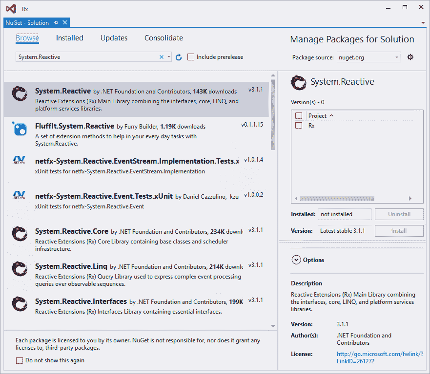
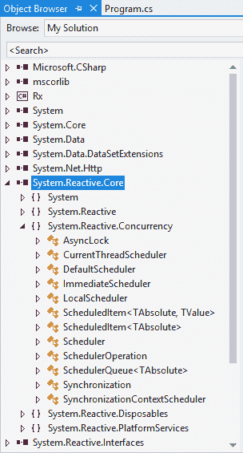
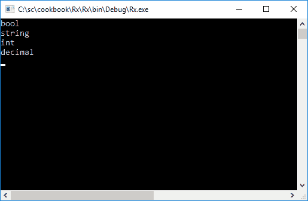
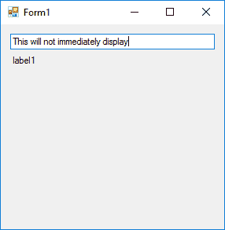
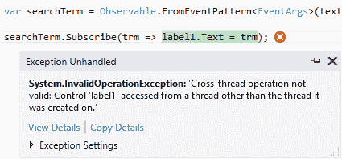
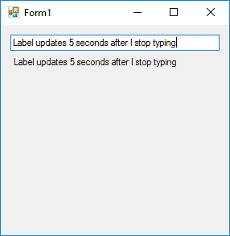
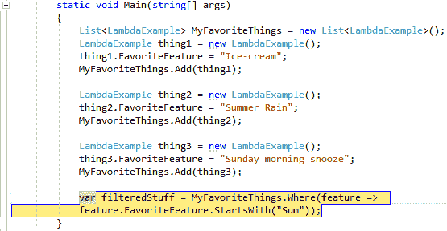
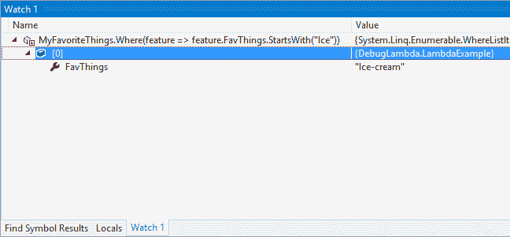

# 使用反应式扩展编写基于事件的程序

本章讨论**无功扩展** ( **Rx** )。为了理解 Rx，我们将介绍以下配方:

*   安装 Rx
*   事件与可观察
*   使用 LINQ 执行查询
*   在 Rx 中使用调度程序
*   调试 lambda 表达式

# 介绍

通常，在用 C# 开发应用的日常工作中，您将不得不使用异步编程。您可能还需要处理许多数据源。想象一下一个返回当前汇率的 web 服务，一个返回相关数据流的 Twitter 搜索，甚至是多台计算机生成的不同事件。Rx 以`IObserver<T>`接口的形式提供了一个优雅的解决方案。

您可以使用`IObserver<T>`界面订阅事件。然后，`IObserver<T>`接口列表的`IObservable<T>`接口会通知他们状态的改变。本质上，Rx 将把生成数据的多个数据源(社交媒体、RSS 提要、UI 事件等)粘在一起。因此，Rx 将这些数据源汇集在一个接口中。事实上，Rx 可以被认为由三个部分组成:

*   **可观察的东西**:汇集并表示所有这些数据流的接口
*   **语言集成查询** ( **LINQ** ):使用 LINQ 查询这些多个数据流的能力
*   **调度器**:使用调度器参数化并发

许多人心中的问题可能是为什么开发人员应该使用(或找到使用)Rx。下面是几个 Rx 真正有用的例子。

*   创建具有自动完成功能的搜索。您不希望代码对您在搜索区域中键入的每个值执行搜索。Rx 允许你限制搜索。
*   使应用的用户界面更具响应性。
*   当数据改变时得到通知，而不是必须轮询数据的改变。想想实时股价。

想了解 Rx 的最新动态，可以看看[https://github.com/Reactive-Extensions/Rx.NET](https://github.com/Reactive-Extensions/Rx.NET)GitHub 页面[。](https://github.com/Reactive-Extensions/Rx.NET)

# 安装 Rx

在我们开始探索 Rx 之前，我们需要安装它。最简单的方法是使用 NuGet。

# 准备好

对于关于 Rx 的这一章，我们将不创建单独的类。所有代码都将在控制台应用中编写。

# 怎么做...

1.  创建一个控制台应用，然后右键单击您的解决方案并选择管理获取解决方案的软件包...从上下文菜单中。

2.  在随后显示的窗口中，在搜索文本框中键入`System.Reactive`，并搜索 NuGet 安装程序:



3.  在撰写本书时，最后一个稳定版本是 3.1.1 版。如果您有多个项目，请选择要安装 Rx 的项目。看到我们只有一个单一的控制台应用，就选择 Rx 为整个项目安装。

4.  显示的下一个屏幕是确认对话框，要求您确认对项目的更改。它将显示对每个项目所做更改的预览。如果您对更改感到满意，请单击“确定”按钮。

5.  许可协议可能会在最后一个对话框屏幕中呈现给您，您需要接受它。要继续，请单击“我接受”按钮。
6.  安装完成后，您将在项目的“引用”节点下看到添加到接收的引用。这些措施如下:

*   `System.Reactive.Core`
*   `System.Reactive.Interfaces`
*   `System.Reactive.Linq`
*   `System.Reactive.PlatformServices`

# 它是如何工作的...

到目前为止，NuGet 是向项目中添加额外组件的最简单的方法。从添加的引用中可以看到，`System.Reactive`是主程序集。要更好地理解`System.Reactive`，请在对象浏览器中查看组件。为此，请双击项目的“引用”选项中的任何程序集。这将显示对象浏览器:



`System.Reactive.Linq`包含 Rx 中所有的查询功能。您还会注意到`System.Reactive.Concurrency`包含了所有的调度器。

# 事件与可观察

作为开发人员，我们都应该对事件非常熟悉。自从我们开始编写代码以来，大多数开发人员一直在创建事件。事实上，如果您甚至在窗体上放置了一个按钮控件，并双击该按钮来创建处理按钮单击的方法，那么您已经创建了一个事件。英寸 NET 中，我们可以使用`event`关键字声明事件，通过调用它发布到事件，并通过向事件添加处理程序来订阅该事件。因此，我们有以下操作:

*   声明
*   出版
*   订阅

使用 Rx，我们有一个类似的结构，我们声明一个数据流，向该流发布数据，并订阅它。

# 准备好

首先，我们将看到一个事件在 C# 中是如何工作的。然后，我们将使用 Rx 来查看事件的工作情况，并在此过程中突出显示差异。

# 怎么做...

1.  在您的控制台应用中，添加一个名为`DotNet`的新类。向该类添加一个名为`AvailableDatatype`的属性:

```cs
        public class DotNet 
        { 
          public string  AvailableDatatype { get; set; } 
        }

```

2.  在主程序类中，添加一个名为`types`的新静态动作事件。基本上，这只是一个委托，将获得一些价值；在我们这里，可用的。NET 数据类型:

```cs
        class Program 
        { 
          // Static action event 
          static event Action<string> types; 

          static void Main(string[] args) 
          { 

          } 
        }

```

3.  在`void Main`内部，创建一个名为`lstTypes`的`List<DotNet>`类。在该列表中，添加几个类型为`DotNet`类的值。在这里，我们将只添加中某些数据类型的硬编码数据。NET:

```cs
        List<DotNet> lstTypes = new List<DotNet>(); 
        DotNet blnTypes = new DotNet(); 
        blnTypes.AvailableDatatype = "bool"; 
        lstTypes.Add(blnTypes); 

        DotNet strTypes = new DotNet(); 
        strTypes.AvailableDatatype = "string"; 
        lstTypes.Add(strTypes); 

        DotNet intTypes = new DotNet(); 
        intTypes.AvailableDatatype = "int"; 
        lstTypes.Add(intTypes); 

        DotNet decTypes = new DotNet(); 
        decTypes.AvailableDatatype = "decimal"; 
        lstTypes.Add(decTypes);

```

4.  我们的下一个任务是用一个事件处理程序订阅这个事件，这个事件处理程序只是将 *x* 的值输出到控制台窗口。然后，每次循环通过`lstTypes`列表时，我们通过添加行`types(lstTypes[i].AvailableDatatype);`来引发事件:

```cs
        types += x => 
        { 
          Console.WriteLine(x); 
        }; 

        for (int i = 0; i <= lstTypes.Count - 1; i++) 
        { 
          types(lstTypes[i].AvailableDatatype); 
        } 

        Console.ReadLine();

```

In reality, before raising an event we should always check that the event isn't null. Only after this check should we raise the event. For brevity, we have not added this check before raising the event.

5.  当您添加了从步骤 1 到步骤 4 的所有代码后，您的控制台应用应该如下所示:

```cs
        class Program 
        { 
          // Static action event 
          static event Action<string> types; 

          static void Main(string[] args) 
          { 
            List<DotNet> lstTypes = new List<DotNet>(); 
            DotNet blnTypes = new DotNet(); 
            blnTypes.AvailableDatatype = "bool"; 
            lstTypes.Add(blnTypes); 

            DotNet strTypes = new DotNet(); 
            strTypes.AvailableDatatype = "string"; 
            lstTypes.Add(strTypes); 

            DotNet intTypes = new DotNet(); 
            intTypes.AvailableDatatype = "int"; 
            lstTypes.Add(intTypes); 

          DotNet decTypes = new DotNet(); 
            decTypes.AvailableDatatype = "decimal"; 
            lstTypes.Add(decTypes); 

            types += x => 
            { 
              Console.WriteLine(x); 
            }; 

            for (int i = 0; i <= lstTypes.Count - 1; i++) 
            { 
              types(lstTypes[i].AvailableDatatype); 
            } 

            Console.ReadLine(); 
          } 
        }

```

6.  运行您的应用将使用值设置我们的列表，然后引发创建的事件，将列表的值输出到控制台窗口:



7.  让我们看看使用 Rx 的事件的工作方式。添加`string`的静态`Subject`。您可能还需要将`System.Reactive.Subjects`命名空间添加到您的项目中，因为`Subjects`位于这个单独的命名空间中:

```cs
        class Program 
        { 

            static Subject<string> obsTypes = new Subject<string>(); 

         static void Main(string[] args) 
          { 

          } 
        }

```

8.  在创建了`DotNet`列表的代码之后，我们使用`+=`来连接一个事件处理程序。这一次，我们将使用`Subscribe`。这是代码的`IObservable`部分。添加此内容后，使用`OnNext`关键字引发事件。这是代码的`IObserver`部分。因此，当我们遍历列表时，我们将调用`OnNext`将值泵出到订阅的`IObservable`界面:

```cs
        // IObservable 
        obsTypes.Subscribe(x => 
        { 
          Console.WriteLine(x); 
        }); 

        // IObserver 
        for (int i = 0; i <= lstTypes.Count - 1; i++) 
        { 
          obsTypes.OnNext(lstTypes[i].AvailableDatatype); 
        } 

        Console.ReadLine();

```

9.  添加完所有代码后，您的应用应该如下所示:

```cs
        class Program 
        {      
          static Subject<string> obsTypes = new Subject<string>(); 

          static void Main(string[] args) 
          { 
            List<DotNet> lstTypes = new List<DotNet>(); 
            DotNet blnTypes = new DotNet(); 
            blnTypes.AvailableDatatype = "bool"; 
            lstTypes.Add(blnTypes); 

            DotNet strTypes = new DotNet(); 
            strTypes.AvailableDatatype = "string"; 
            lstTypes.Add(strTypes); 

            DotNet intTypes = new DotNet(); 
            intTypes.AvailableDatatype = "int"; 
            lstTypes.Add(intTypes); 

            DotNet decTypes = new DotNet(); 
            decTypes.AvailableDatatype = "decimal"; 
            lstTypes.Add(decTypes); 

            // IObservable 
            obsTypes.Subscribe(x => 
            { 
              Console.WriteLine(x); 
            }); 

            // IObserver 
            for (int i = 0; i <= lstTypes.Count - 1; i++) 
            { 
              obsTypes.OnNext(lstTypes[i].AvailableDatatype); 
            } 

            Console.ReadLine(); 
          } 
        }

```

10.  当您运行应用时，您将看到相同的项目输出到控制台窗口，就像它之前所做的那样。

# 它是如何工作的...

在 Rx 中，我们可以用`Subject`关键字声明一个事件流。因此，我们可以使用`OnNext`发布事件源。为了在控制台窗口中查看这些值，我们使用`Subscribe`订阅了事件流。

Rx 允许你拥有仅仅是发布者或者仅仅是订阅者的对象。这是因为`IObservable`和`IObserver`接口实际上是分开的。此外，请注意，在 Rx 中，可观察值可以作为参数传递，作为结果返回，并存储在变量中，这使它们成为第一类。


Rx 还允许您指定事件流已完成或发生了错误。这确实将 Rx 与. NET 中的事件区分开来。此外，需要注意的是，在项目中包含`System.Reactive.Linq`命名空间允许开发人员在`Subject`类型上编写查询，因为`Subject`是一个`IObservable`接口:


这是将 Rx 与. NET 中的事件区分开来的另一个特性

# 使用 LINQ 执行查询

Rx 允许开发人员使用代表同步数据流的`IObservable`接口，使用 LINQ 来编写查询。概括地说，Rx 可以被认为由三个部分组成:

*   **可观察的东西**:汇集并表示所有这些数据流的接口
*   **语言集成查询** ( **LINQ** ):使用 LINQ 查询这些多个数据流的能力
*   **调度器**:使用调度器参数化并发

在本食谱中，我们将更详细地了解 Rx 的 LINQ 功能。

# 准备好

由于可观测值只是数据流，我们可以使用 LINQ 来查询它们。在下面的食谱中，我们将基于 LINQ 查询向屏幕输出文本。

# 怎么做...

1.  首先向解决方案中添加一个新的 Windows 窗体项目。

2.  调用项目`winformRx`并点击确定按钮:

3.  在工具箱中，搜索文本框控件并将其添加到表单中。

4.  最后，在表单中添加一个标签控件:


5.  右键单击您的`winformRx`项目，并选择管理获取软件包...从上下文菜单中。

6.  在搜索文本框中，输入`System.Reactive`搜索 NuGet 包，然后点击安装按钮。

7.  Visual Studio 将要求您检查它将要对您的项目所做的更改。点击确定按钮。

8.  在安装开始之前，您可能需要通过单击“我接受”按钮来接受许可协议。
9.  安装完成后，如果您展开项目的参考，您应该会看到新添加的对您的`winformRx`项目的参考:

10.  最后，右键单击项目，通过单击上下文菜单中的设置为启动项目，将`winformRx`设置为您的启动项目。

11.  双击窗口窗体上的任意位置，为窗体创建窗体加载事件处理程序。在此表单中，添加`Observable`关键字。你会注意到关键词会立即加下划线。这是因为您遗漏了对`System.Reactive`LINQ 组件的引用。

12.  要添加此项，请按 *Ctrl* + *。*(句号)提出解决问题的可能建议。选择将`using System.Reactive.Linq`命名空间添加到您的项目中。

13.  继续向窗体加载事件中添加以下代码。基本上，您使用的是 LINQ，并告诉编译器，您希望从事件模式中选择与名为`textBox1`的表单上文本框的文本更改事件相匹配的文本。完成后，向变量添加一个订阅，并告诉它将在文本中找到的任何内容输出到名为`label1`的表单标签中:

```cs
        private void Form1_Load(object sender, EventArgs e) 
        { 
          var searchTerm = Observable.FromEventPattern<EventArgs>(
            textBox1, "TextChanged").Select(x => ((TextBox)x.Sender).Text); 

          searchTerm.Subscribe(trm => label1.Text = trm); 
        }

```

When we added the textbox and label to our form, we left the control names as default. If, however, you changed the default names, you would need to specify those names instead of `textBox1` and `label1` for the controls on the form.

14.  单击运行按钮运行您的应用。窗口表单将显示文本框和标签。

15.  请注意，当您键入时，文本会输出到表单上的标签:


16.  让我们通过在 LINQ 声明中增加一个`Where`条件来使事情变得更有生气。我们将指定`text`字符串只能在以句点结尾时选择文本。这意味着文本将仅在每个完整句子后显示在标签中。如你所见，我们在这里没有做什么特别的事情。我们只是使用标准 LINQ 查询我们的数据流，并将结果返回给我们的`searchTerm`变量:

```cs
        private void Form1_Load(object sender, EventArgs e) 
        { 
          var searchTerm = Observable.FromEventPattern<EventArgs>(
            textBox1, "TextChanged").Select(x => ((TextBox)x.Sender)
            .Text).Where(text => text.EndsWith(".")); 

          searchTerm.Subscribe(trm => label1.Text = trm); 
        }

```

17.  运行应用并开始键入一行文本。您将会看到，当您键入时，没有任何东西输出到标签控件，这在我们在`Where`条件中添加之前的前一个示例中很明显:



18.  添加句号并开始添加第二行文本:


19.  您将看到，只有在每个周期之后，输入的文本才会添加到标签中。因此，我们的`Where`条件是完美的:


# 它是如何工作的...

Rx 的 LINQ 方面允许开发者构建可观察的东西。以下是一些例子:

*   `Observable.Empty<>`:返回一个空的可观察序列
*   `Observable.Return<>`:返回包含单个元素的可观察序列
*   `Observable.Throw<>`:这将返回一个可观察到的序列，终止于一个异常
*   `Observable.Never<>`:这将返回一个持续时间无限的非终止可观测序列

Rx 中 LINQ 的使用允许开发人员操纵和过滤数据流，以准确返回他们需要的内容。

# 在 Rx 中使用调度程序

有时，我们需要在特定时间运行`IObservable`订阅。想象一下，必须跨不同地理区域和时区的服务器同步事件。您可能还需要从队列中读取数据，同时保持事件发生的顺序。另一个例子是执行某种可能需要一些时间才能完成的输入/输出任务。在这种情况下，调度器非常有用。

# 准备好了

此外，您可以考虑阅读更多关于在 MSDN 上使用调度程序的信息。来看看[https://msdn . Microsoft . com/en-us/library/hh 242963(v = vs . 103). aspx .](https://msdn.microsoft.com/en-us/library/hh242963(v=vs.103).aspx)

# 怎么做...

1.  如果您还没有这样做，创建一个新的 Windows 窗体应用，并将其称为`winformRx`。打开表单设计器，在工具箱中搜索文本框控件并将其添加到表单中。

2.  接下来，向表单中添加一个标签控件。

3.  双击您的 Windows 窗体设计器来创建 onload 事件处理程序。在这个处理程序中，添加一些代码来读取输入到文本框中的文本，并且只在用户停止键入 5 秒后显示该文本。这是使用`Throttle`关键字实现的。向`searchTerm`变量添加订阅，将文本输入的结果写入标签控件的文本属性:

```cs
        private void Form1_Load(object sender, EventArgs e) 
        { 
          var searchTerm = Observable.FromEventPattern<EventArgs>(
            textBox1, "TextChanged").Select(x => ((TextBox)x.Sender)
            .Text).Throttle(TimeSpan.FromMilliseconds(5000)); 

          searchTerm.Subscribe(trm => label1.Text = trm); 
        }

```

Note that you might need to add `System.Reactive.Linq` in your `using` statements.

4.  运行您的应用，并开始在文本框中键入一些文本。我们将立即收到一个例外。这是一个跨线程的违规。当试图从后台线程更新用户界面时，就会出现这种情况。`Observable`界面运行的是`System.Threading`的定时器，和 UI 不在一个线程上。幸运的是，有一个简单的方法可以克服这一点。事实证明，用户界面线程功能存在于不同的程序集中，我们发现最容易通过包管理器控制台获得:



5.  导航到视图|其他窗口|包管理器控制台以访问包管理器控制台。

6.  输入以下命令:

```cs
      PM> Install-Package System.Reactive.Windows.Forms

```

这将添加系统。对你的`winformRx`项目作出反应。因此，您应该在输出中看到以下内容:成功安装的系统。反应式. Windows.Forms 3.1.1 '到 winformRx

Note that you need to ensure that the Default project selection is set to `winformRx` in the Package Manager Console. If you don't see this option, resize the Package Manager Console screen width ways until the option is displayed. This way you can be certain that the package is added to the correct project.

7.  安装完成后，在 onload 事件处理程序中修改您的代码，并将执行订阅的`searchTerm.Subscribe(trm => label1.Text = trm);`更改为如下所示:

```cs
        searchTerm.ObserveOn(new ControlScheduler(this)).Subscribe(trm => label1.Text = trm);

```

你会注意到我们这里使用的是`ObserveOn`方法。这基本上告诉编译器的是，`new ControlScheduler(this)`中的`this`关键字实际上是对我们的 Windows 窗体的引用。因此，`ControlScheduler`将使用 Windows 窗体计时器创建时间间隔来更新我们的 UI。消息发生在正确的线程上，我们不再有跨线程冲突。

8.  如果您没有将`System.Reactive.Concurrency`命名空间添加到您的项目中，Visual Studio 将用一条曲线在`ControlScheduler`代码行下面画线。按下 *Ctrl* + *。*(句号)将允许您添加缺少的命名空间。

9.  这意味着`System.Reactive.Concurrency`包含一个调度器，可以与 Windows 窗体控件进行对话，这样就可以进行调度。再次运行应用，并开始在文本框中键入一些文本:


10.  在我们停止键入大约 5 秒后，油门条件满足，文本输出到我们的标签:



# 它是如何工作的...

从我们创建的代码中，我们需要记住的是有`ObserveOn`和`Subscribe`。你不应该混淆这两者。大多数情况下，在处理调度程序时，你会用到`ObserveOn`。`ObserveOn`方法允许您参数化`OnNext`、`OnCompleted`和`OnError`消息的运行位置。借助`Subscribe`，我们可以参数化实际的订阅和取消订阅代码的运行位置。

我们还需要记住，Rx 使用线程计时器(`System.Threading.Timer`)作为默认值，这就是我们之前遇到跨线程冲突的原因。正如您所看到的，我们使用调度器来参数化使用哪个定时器。调度程序实现这一点的方式是公开三个组件。这些措施如下:

*   调度程序执行某些操作的能力
*   要执行的动作或工作的执行顺序
*   允许调度程序有时间概念的时钟

时钟的使用很重要，因为它允许开发人员在远程机器上使用定时器；例如(在你和他们之间可能存在时间差的情况下)，告诉他们在特定时间执行某个操作。

# 调试 lambda 表达式

自 Visual Studio 2015 以来，调试 lambda 表达式的能力就一直存在。这是对我们最喜欢的集成开发环境的一个极好的补充。它允许我们动态检查 lambda 表达式的结果，并修改表达式以测试不同的场景。

# 准备好

我们将创建一个非常基本的 lambda 表达式，并在 Watch 窗口中对其进行更改，以产生不同的值。

# 怎么做...

1.  创建一个控制台应用，并在控制台应用中添加一个名为`LambdaExample`的类。给这个类添加一个名为`FavThings`的属性:

```cs
        public class LambdaExample
        {
          public string FavThings { get; set; }
        }

```

2.  在控制台应用中，创建一个`List<LambdaExample>`对象，并将一些您喜欢的东西添加到该列表中:

```cs
        List<LambdaExample> MyFavoriteThings = new List<LambdaExample>();
        LambdaExample thing1 = new LambdaExample();
        thing1.FavThings = "Ice-cream";
        MyFavoriteThings.Add(thing1);

        LambdaExample thing2 = new LambdaExample();
        thing2.FavThings = "Summer Rain";
        MyFavoriteThings.Add(thing2);

        LambdaExample thing3 = new LambdaExample();
        thing3.FavThings = "Sunday morning snooze";
        MyFavoriteThings.Add(thing3);

```

3.  然后，创建一个表达式，只返回以字符串`"Sum"`开头的东西。在这里，我们显然期望看到`Summer Rain`的结果:

```cs
        var filteredStuff = MyFavoriteThings.Where(feature =>         feature.FavThings.StartsWith("Sum"));

```

4.  在表达式上放置断点并运行应用。当代码在断点处停止时，可以复制 lambda 表达式:



5.  将λ表达式`MyFavoriteThings.Where(feature => feature.FavThings.StartsWith("Sum"))`粘贴到您的手表窗口中，并将`StartsWith`方法中的字符串从`Sum`更改为`Ice`。您将看到结果已经改变，现在显示一个`Ice-cream`字符串:



Note that if you are using Visual Studio 2017 RC, debugging lambda expressions will probably not work. You will receive anything from Internal error in the expression evaluator to a message stating Expression cannot contain lambda expression.

# 它是如何工作的...

通过这种方式，我们能够轻松地更改和调试 lambda 表达式。这在 Visual Studio 2015 之前的早期版本中是不可能的。在使用这些表达式时，了解这个技巧显然非常重要。

需要注意的另一点是，您可以在 Visual Studio 2017 的“立即”窗口中做同样的事情，也可以从 lambda 表达式中固定变量。