# 选择和使用源代码控制策略

源代码控制是每个开发人员工具包中必不可少的部分。不管你是业余爱好者还是专业程序员，当你从办公桌上站起来回家时，你最好确保你的代码是安全的。在本章中，我们将研究选择和使用源代码控制策略。我们将探讨的一些主题包括:

*   设置 Visual Studio 帐户管理并确定哪种源代码管理解决方案最适合您
*   设置 Visual Studio GitHub 集成，首次签入代码，并签入更改
*   作为一个团队使用 GitHub，处理和解决代码中的冲突

# 介绍

在我的职业生涯中，我使用了视觉资源安全，SVN，VSTS，比特桶和 GitHub。如何处理并不重要，重要的是保持源代码的安全性和版本。当我第一次开始使用源代码管理时，我工作的公司使用了 Visual SourceSafe。如果你不熟悉这个软件，谷歌一下就可以了。你会看到返回的结果包含诸如讨厌、不愉快、糟糕和微软的源代码销毁系统等词语。你懂的。

在他辞职并移民到另一个国家后，我们有一名员工的休假档案专门交给了他。我开始怀疑公司强制使用 SourceSafe 的政策是否不是他移民的原因。但是除了笑话，它给我们带来了无尽的问题。将 SourceSafe 放在一个大项目上，你可能会以灾难告终。然而，如今，开发人员有了很好的选择。

最突出的两个显然是微软团队服务和 GitHub。两者都有一个免费层，但选择使用其中一个还是另一个完全取决于您的独特情况。

# 设置 Visual Studio 帐户管理并确定哪种源代码管理解决方案最适合您

Visual Studio 允许开发人员创建帐户并登录。如果您经常伏案工作或在不同机器上的多个位置工作(例如工作和家庭电脑)，这尤其有益，因为 Visual Studio 将自动在您登录的机器之间同步您的设置。

# 准备好

本食谱将假设您刚刚在您的机器上完成安装 Visual Studio 2017。安装了 Visual Studio 2017 的试用版还是授权版并不重要。

# 怎么做...

1.  安装完成后，打开 Visual Studio。

2.  在 Visual Studio 的右上角，您会看到一个登录链接:

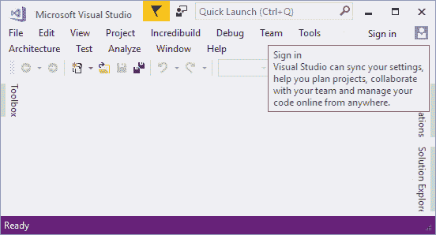

3.  点击登录链接，您将被允许在此输入您的电子邮件地址。我发现只使用我的 Outlook 电子邮件地址很有用。在我看来，这是最好的网络邮件之一。

Note that I'm not endorsing Outlook for any other reason other than I really think it is a great product. I also have a Gmail account as well as an iCloud e-mail account.

4.  添加电子邮件帐户后，Visual Studio 会将您重定向到登录页面。

5.  因为我已经有一个 Outlook 帐户，所以 Visual Studio 只允许我用它登录。但是，如果您需要创建帐户，可以通过登录到 Visual Studio 表单上的注册链接来创建:

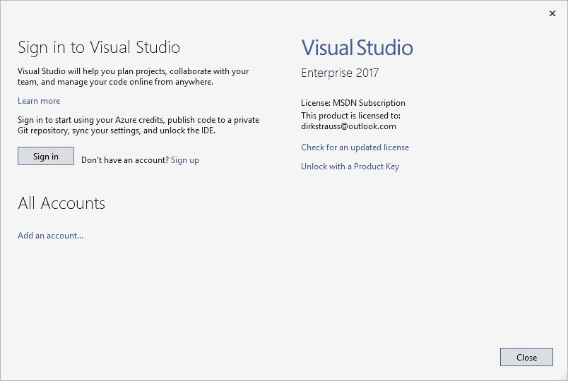

6.  Visual Studio 现在会将您重定向到注册页面，您可以在其中创建帐户:

7.  创建帐户后，将提示您返回 Visual Studio 进行登录。登录后，Visual Studio 将在集成开发环境的右上角显示您的详细信息:

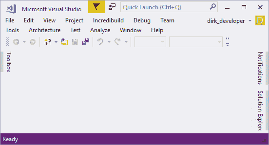

8.  单击帐户名旁边的向下箭头，您可以查看您的帐户设置....

9.  这将显示您的帐户摘要，您可以在其中进一步个性化您的帐户:

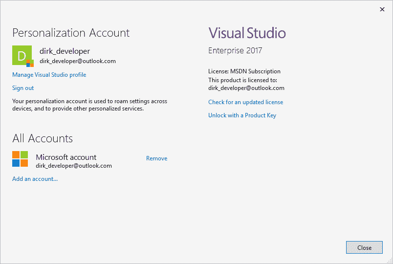

# 它是如何工作的...

源代码管理的选择是每个开发人员都有强烈意见的话题。不幸的是，如果你为老板工作，这个决定甚至可能不由你决定。许多公司已经按照他们喜欢的方式建立了他们的源代码管理系统，你需要遵守公司的程序。事情就是这样。然而，作为一个独立开发者，了解你可以选择的方案是很好的。

所有优秀的开发人员也应该在自己的时间里编写代码。当你坐着工作的时候，你不仅仅是一个开发者。我们吃，呼吸，睡觉，并活代码。这是我们是谁和我们是什么的一部分。我会说，为了让你在作为开发人员的工作中变得更好，你必须在自己的时间里玩代码。开始一个宠物项目，找一些朋友在一起，决定一起写一些软件。这不仅会让你们做的更好，而且你们会从彼此身上学到很多东西。

如果你是一名远程开发人员，不每天通勤到办公室工作，你仍然可以与开发人员社区联系。有这么多资源可供开发人员使用，开发人员社区非常乐意团结在新手周围，帮助他们成长。如果你不保证代码的安全，开始一个单独的或者宠物的项目是没有用的。要做到这一点，你也不需要支付一美元。 **Visual Studio Online** (现名为**团队服务**)和 GitHub 为开发人员提供了一个绝佳的平台来保护您的代码安全。

让我们从团队服务开始。将浏览器指向[https://www.visualstudio.com/team-services/](https://www.visualstudio.com/team-services/)，即可找到该网站。

在这里，您将看到微软为开发人员提供了一个使用团队服务的绝佳机会。最多五个用户绝对免费。这意味着你和你的伙伴可以在下一件大事上合作，同时确保你的代码保持安全。注册就像点击免费入门链接一样简单:

For information on pricing, visit the following link:
[https://www.visualstudio.com/team-services/pricing/](https://www.visualstudio.com/team-services/pricing/)

第二个优秀的选项是 GitHub。它的免费服务略有不同，它要求开发者在免费账户上使用公共存储库。如果你不介意你的代码本质上是开源的，那么 GitHub 是一个很好的选择。通过 GitHub，你可以拥有无限的合作者和公共存储库:

For information on pricing, visit the following link:
[https://github.com/pricing](https://github.com/pricing)

源代码控制的选择本质上取决于代码的开放性。如果你能让其他开发人员看到并下载你的代码，那么 GitHub 是一个很好的选择。如果你需要你的代码保持私有并且只在特定的人之间共享，那么付费的 GitHub 账户会更适合你。如果你还不想掏钱，那么团队服务将是你最好的选择。

# 设置 Visual Studio GitHub 集成，首次签入代码，并签入更改

GitHub 已经做了这么多年的巡回演出。有开发者以此发誓。事实上，它是使用苹果 Xcode IDE 时的默认选项。不管你出于什么原因决定使用 GitHub，请放心，你和你的代码都在好的手中。

# 准备好

下面的方法将假设您已经注册了 GitHub，并且已经启用了双因素身份验证。如果你还没有注册 GitHub 账号，你可以去[https://github.com/](https://github.com/)创建一个新账号。要在您的 GitHub 帐户上启用双因素身份验证(我个人强烈建议)，请执行以下操作:

1.  单击个人资料图像旁边的向下箭头，然后选择设置:

2.  从出现在下一个网页左侧的“个人设置”菜单中，选择“安全性:

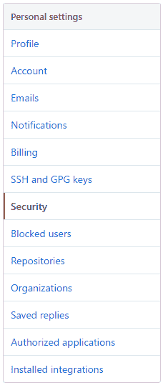

3.  安全页面的第一部分将是您的双因素身份验证状态。要开始设置，请单击设置双因素身份验证按钮。

4.  然后将向您简要介绍什么是双因素身份验证，并让您选择使用应用程序设置(我推荐)还是使用短信设置。使用应用程序是迄今为止最简单的，如果你有智能手机或平板电脑，你可以从适用的应用商店下载认证器应用程序。从那以后，按照 GitHub 给你的提示完成双因素身份验证设置。
5.  完成设置后，您的双因素身份验证将会打开。

# 怎么做...

1.  将 GitHub 扩展添加到 Visual Studio 中很容易，只需从以下链接下载 visx 并安装即可:[https://visualstudio.github.com/downloads/GitHub.VisualStudio.vsix](https://visualstudio.github.com/downloads/GitHub.VisualStudio.vsix) 。

2.  假设您有一个要添加到 GitHub 的现有应用程序，将其添加到新存储库中的过程非常简单。我只是用模板代码创建了一个控制台应用程序，但是您可以向 GitHub 添加任何项目类型和大小。

3.  在 Visual Studio 2017 的“视图”菜单上，选择“团队资源管理器”选项。

4.  在托管服务提供商部分，您将看到两个选项。现在，我们将选择 GitHub，因为我们已经有一个帐户，我们将点击连接...

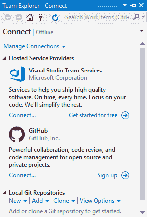

5.  现在，您将看到 GitHub 登录页面。如果您没有现有的 GitHub 帐户，也有机会从这里注册:

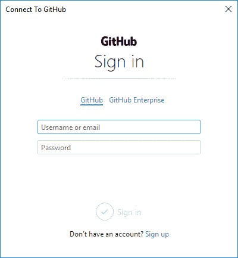

6.  因为我在 GitHub 帐户上设置了双因素身份验证，所以系统会提示我使用身份验证器应用程序输入生成的身份验证代码并验证自己:

7.  通过身份验证后，您将返回到管理连接屏幕。如果您的项目没有显示在本地 Git 存储库下，您可以添加它:

8.  接下来，您需要单击主页图标，这是团队资源管理器窗口顶部的一个小房子的图片。在主屏幕上，单击同步按钮:

9.  这将向您显示“发布”窗口。在 GitHub 下，单击发布到 GitHub 按钮。这将把你的项目发布到 GitHub 上的一个新的存储库中。

Remember, if you are using the free GitHub, all your repositories are public. If you are writing code that can't be made public (is not open source), then sign up for one of the paid GitHub accounts that include private repositories.

10.  然后 GitHub 会提示您添加此次发布的详细信息。因为你之前连接过 GitHub，你的用户名已经在下拉菜单中被选中了。准备就绪后，单击发布:

11.  项目发布到 GitHub 后，您将自动返回主屏幕:

12.  在线查看您的 GitHub 帐户，您会看到项目已经添加:

13.  接下来，让我们对`GitHubDemo`应用程序进行一些更改。只需在项目中添加一个新类。我叫我的`NewClass.cs`，但是你可以随便叫你的。

14.  您会注意到，一旦对项目进行了更改，解决方案就会用红色勾号标记更改的项目。您的班级标有绿色加号:

15.  要将更改添加到您的 GitHub 存储库中，您可以遵循两条路线。第一个选项是转到团队资源管理器-主页窗口，然后单击“更改”按钮。

16.  第二个(在我看来更方便)选项是在解决方案资源管理器中右键单击解决方案，然后单击提交...上下文菜单中的菜单项。

17.  GitHub 可能会在您第一次执行提交时询问您的用户信息。

18.  在允许您提交更改之前，您必须填写所需的提交消息。在一个真实的团队项目中，在提交消息中尽可能地描述。考虑使用任务项代码(或积压代码)来唯一标识要添加的代码。这将在未来的某个时候为您(或其他开发人员)节省开支，我保证:

19.  需要注意的一点是，如果您单击“全部提交”按钮旁边的向下箭头，您可以使用三个提交选项。“全部提交”按钮将只记录您在本地计算机上所做的更改。换句话说，更改不会反映在远程存储库中。“全部提交”和“推送”按钮将在您的本地机器上记录更改，并将这些更改推送至您的远程 GitHub 存储库。“全部提交并同步”按钮将在您的本地机器上记录更改，然后它将从远程存储库中提取任何更改，最后它将执行推送操作。如果你在一个团队中工作，你会想要这样做。然而，对于这个方法，我将只做一个全部提交和推送，因为我是唯一一个从事这个报告的开发人员:

20.  提交完成后，“团队资源管理器-同步”窗口将通知您提交成功:

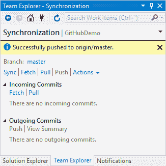

21.  前往 GitHub online，您将看到新推送的更改反映在您的 GitHub 存储库中，以及提交消息:

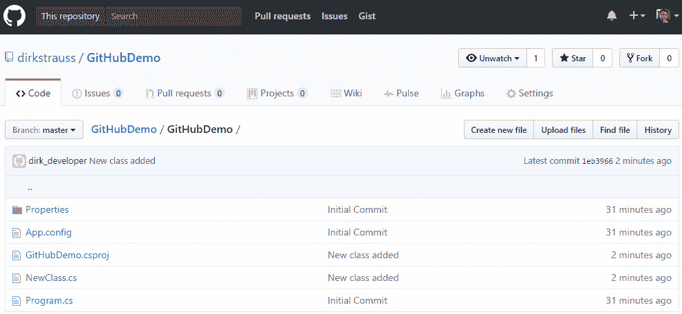

22.  GitHub 对任何开发人员来说都是一个非常棒的源代码管理解决方案。考虑创建一个开源项目。这比你想象的更有益。

More and more these days, prospective employers are reviewing developers' GitHub repos when considering applicants for developer positions. Keep that in mind, because a GitHub repo is a resume in itself.

# 它是如何工作的...

免费的 GitHub 帐户允许你创建公共存储库。这意味着任何人都可以从 GitHub 搜索、查看和克隆您的项目到他们自己的桌面。这是 GitHub 背后的中心思想。对于不想花钱的独立开发者和公司来说，这显然是一个关键因素。企业比独立开发人员更能负担得起，但我认为一些公司更喜欢推出自己的，而不是使用托管在云上的服务提供商。这意味着他们更喜欢通过在自己的公司服务器上建立源代码管理系统来控制源代码。让 GitHub 成为独立开发者的一个选择是一个很棒的解决方案。对于那些需要私人回购的人来说，费用也不是绊脚石。

# 作为一个团队使用 GitHub，处理和解决代码中的冲突

当在团队中工作时，GitHub 和团队服务真正有了自己的特色。协作努力的效果是相当强大的。不过，有时候可能有点挑战性。让我们看看如何使用 GitHub 在团队设置中工作。

# 准备好

我们将使用现有的`GitHubDemo`应用程序登录 GitHub。让我们假设一个新的开发人员(让我们称他为约翰)加入了团队。在您可以让他将代码推送到您的分支之前，您需要将他添加为合作者。要做到这一点，登录 GitHub，点击`GitHubDemo`存储库中的设置选项卡。单击左侧菜单中的协作者。

然后，您可以通过输入 GitHub 用户名、全名或电子邮件地址来搜索要添加的协作者:

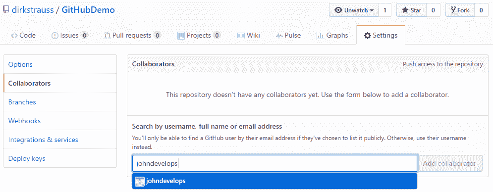

完成后，单击“添加合作者”按钮，将约翰添加为您项目的合作者:

约翰会收到一封电子邮件，首先需要回复您的合作邀请。

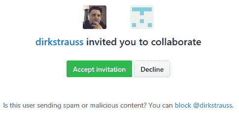

# 怎么做...

1.  约翰开始设置他的 Visual Studio 环境，包括通过单击菜单中的团队并单击管理连接来连接到 GitHub....

2.  他用自己的电子邮件地址和密码登录了 GitHub。

Take note that if you have just signed up to GitHub, you will need to click on the verification e-mail sent to the e-mail address you specified when signing up. Without verifying your e-mail address, you will not be able to log in from Visual Studio.

3.  连接后，约翰看到他的 GitHub 详细信息被加载:

4.  他现在想在`GitHubDemo`应用程序上工作，并通过名称搜索在 GitHub 上找到它:

5.  他现在从“克隆”或“下载”按钮复制“克隆 HTTPS”文本框中的网址:

6.  回到 Visual Studio，约翰展开了本地 Git 存储库，并点击了克隆。他将复制的网址粘贴到 Git 存储库路径，并指定代码应该克隆到硬盘的哪个位置。然后他点击克隆:

7.  克隆代码时，它将位于 John 之前指定的文件夹路径中。

8.  是时候对代码进行一些更改了。他像往常一样在 Visual Studio 中打开项目。约翰决定处理`NewClass`类，并添加了一个返回倒数整数的新函数:

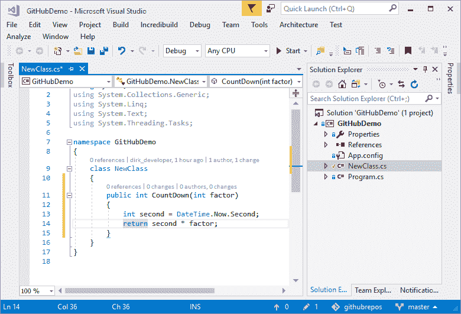

9.  代码更改完成后，约翰准备提交他刚刚添加到`GitHubDemo`项目中的代码。

10.  添加提交消息后，他点击全部提交和同步。

One important thing to note is that you have three commit options available to you if you click on the down arrow next to the Commit All button. This button will just record the changes you make on your local machine. In other words, the change will not be reflected in the remote repository. The Commit All and Push button will record the changes on your local machine and push those changes to your remote GitHub repository. The Commit All and Sync button will record the changes on your local machine, then it will pull any changes from the remote repository, and finally it will do the push.

11.  John 的更改被提交到 GitHub 存储库中:

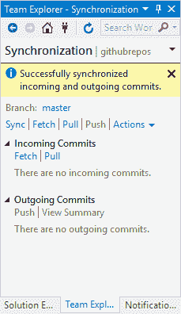

12.  在办公室的另一边，我正在处理同样的代码。唯一的问题是，我用自己实现的`CountDown`逻辑添加了同样的方法:

13.  我准备好并向 GitHub 提交我的更改:

14.  GitHub 立即阻止我这样做。这是因为如果我的代码被推送，那么 John 之前的提交将会丢失。GitHub 在 GitHub Help 中有一个关于这个主题的很棒的帮助文件，网址为[https://Help . GitHub . com/articles/处理非快进错误/](https://help.github.com/articles/dealing-with-non-fast-forward-errors/) 。

“输出”窗口包含更具描述性的错误消息:

<q>推送至远程存储库时遇到错误:被拒绝的更新被拒绝，因为远程包含您本地没有的工作。这通常是由另一个存储库推送到同一个引用引起的。您可能希望在再次推送之前先集成远程更改。</q>

15.  要解决这个问题，请单击“拉”以获取约翰所做的最新提交。您的代码将处于冲突状态。这听起来很糟糕，但事实并非如此。它让你能够决定使用哪些代码。您可以看到，请求显示有冲突的文件，还有 John 添加的传入提交消息:

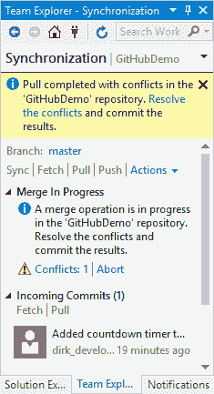

16.  要查看冲突，请单击消息弹出窗口中的解决冲突链接:

17.  然后，您将看到“解决冲突”屏幕，其中列出了冲突的文件。单击一个文件会将其展开为一个简短的摘要和操作选项屏幕。单击“比较文件”链接查看冲突文件之间的区别总是明智的:

18.  代码中的差异是显而易见的。从现在开始，你所遵循的过程取决于你们作为一个团队是如何一起工作的。通常，冲突可能相当复杂，与关注未来发展的开发人员交谈总是一个好主意:

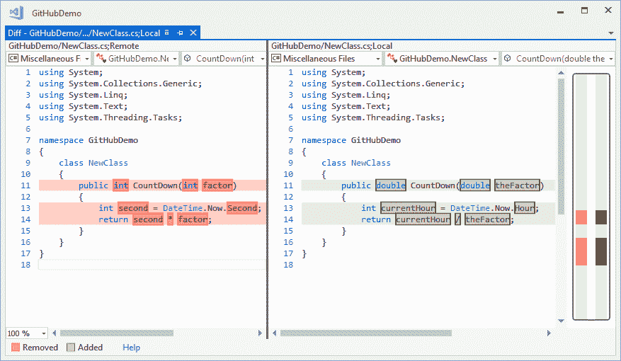

19.  在这种情况下，约翰和我认为他的代码更好、更简洁。因此，决定只需点击“远程获取”并使用约翰的代码。单击链接后，您需要单击提交合并:

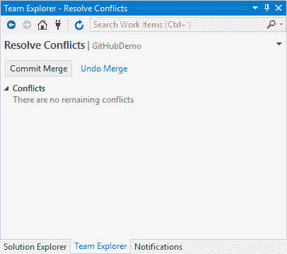

20.  添加提交消息后，您可以将代码推送到 repo。在这种情况下，我只是用 John 的代码替换了我所有的代码，但是可能会出现这样的情况:您将使用您的一些代码和另一个开发人员的一些代码。GitHub 允许我们轻松处理这些冲突:

21.  将代码推送到远程后，GitHub 会通知您代码已成功同步:

# 它是如何工作的...

GitHub 免去了提交、解决冲突和合并代码的痛苦。毫无疑问，它是任何开发人员工具包中必不可少的工具，对开发团队来说也是必不可少的。即使你没有专业地使用它，为自己创建一个回购也是一个好主意。开始用它来检查你下班后做的宠物项目。将你的知识扩展到日常工作之外，会让你成为更好的开发人员。