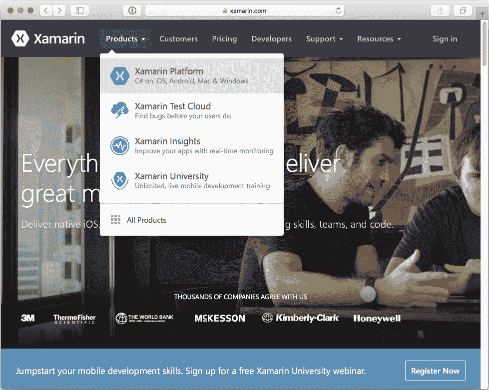
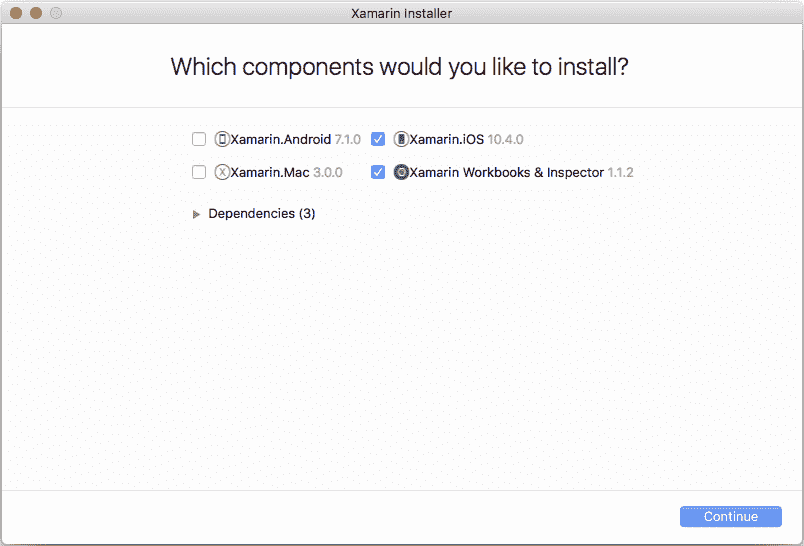
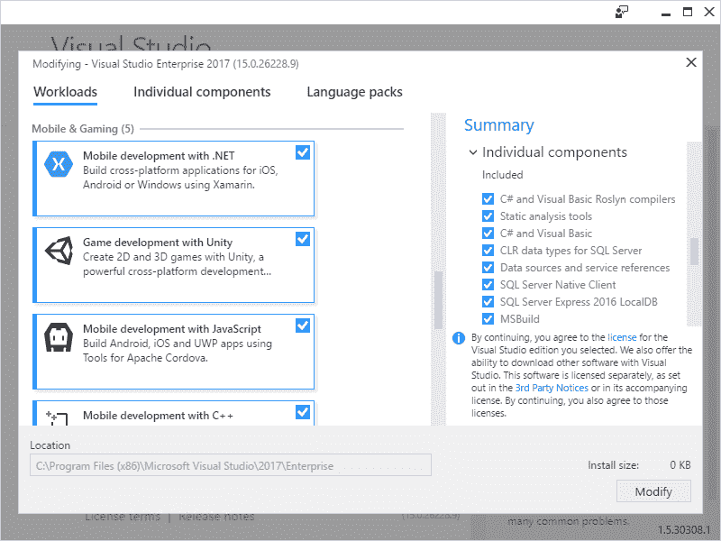
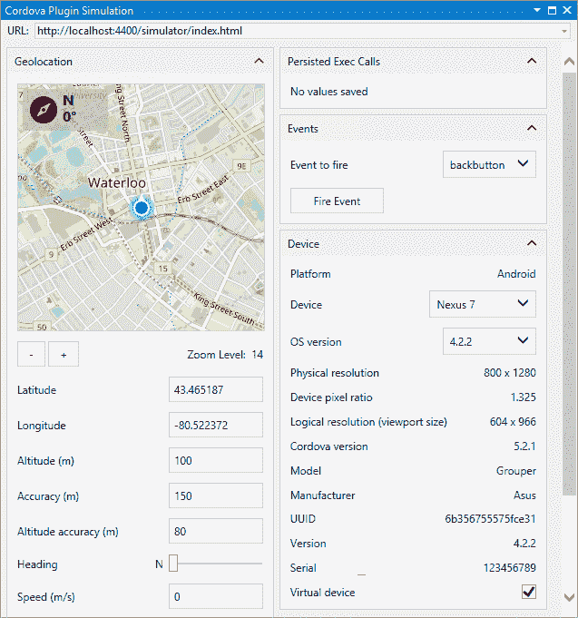
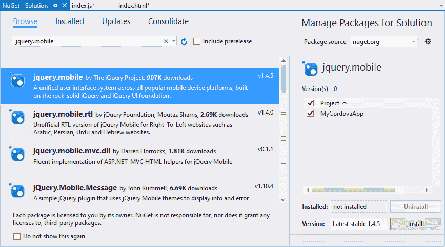
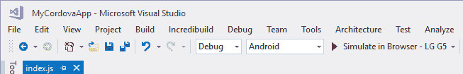
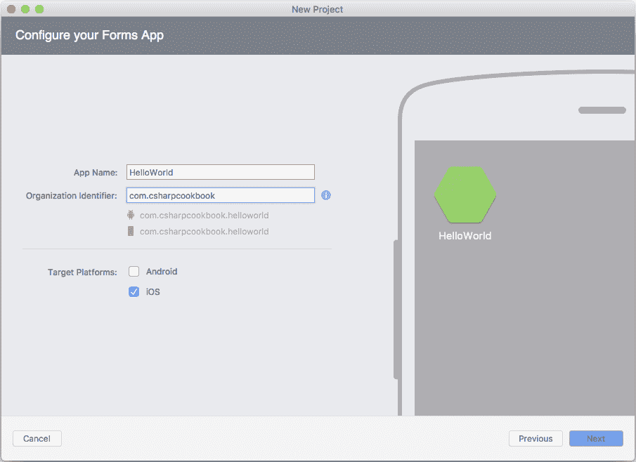
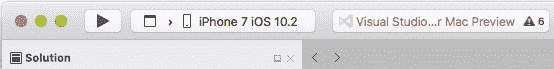
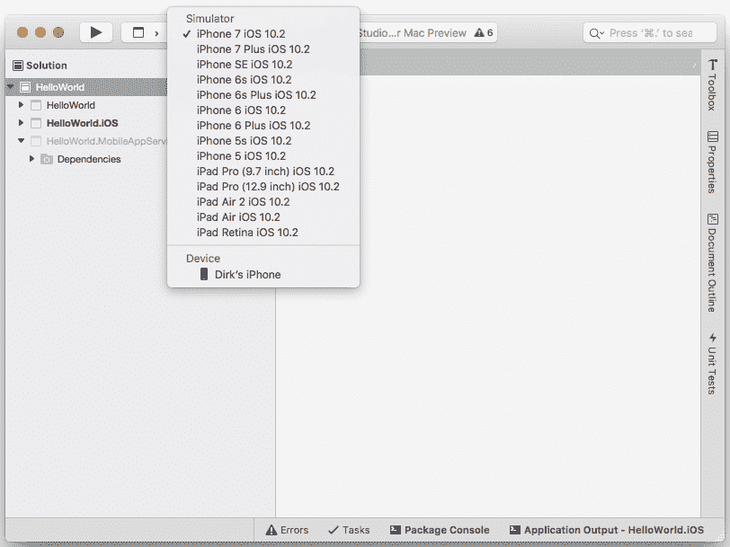
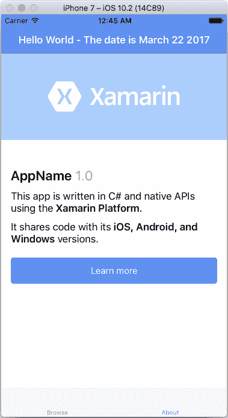

# 在 Visual Studio 中创建移动应用程序

Visual Studio 是**集成开发环境** ( **IDEs** )的*巡德力*。这是毫无疑问的。作为一名开发人员，您可以通过为各种平台创建应用程序来随心所欲地发挥自己的能力。其中一个平台是移动开发。开发人员开始创建移动应用程序，但不想使用不同的 IDE。有了 Visual Studio，就不必了。它将允许你创建安卓和(现在有**Xarin**)iOS 和苹果应用程序。

因此，本章将研究以下概念:

*   在您的 Windows 电脑和 Mac 上安装 Xamarin 和其他必需的组件
*   使用 Apache Cordova 创建移动应用程序
*   使用 Xamarin 创建 iOS 应用程序。Mac 的窗体和 Visual Studio

# 介绍

如果您没有听说过 Xamarin，我们鼓励您对该工具进行谷歌搜索。传统上，开发人员需要使用 **Xcode** 或 **NetBeans** 来创建 iOS 和 Android 应用程序。开发人员面临的挑战是，这意味着学习一种新的编程语言。例如，如果您创建了一个要部署到 iOS、Android 和 Windows 的应用程序，您需要了解 Objective-C 或 Swift、Java 和. NET 语言。

这也给开发带来了额外的挑战，因为这意味着必须维护多个代码库。如果要对应用程序的 Windows 版本进行更改，还必须对 iOS 和 Android 代码库进行更改。有时公司会为每个平台管理不同的开发团队。您可以想象在多个平台上跨多个团队管理变更所涉及的复杂性。如果您正在处理一个大的代码库，这一点尤其正确。

Xamarin 通过允许。NET 开发人员使用标准。NET 库来使用 Visual Studio 创建 iOS 和安卓应用程序。作为一名. NET 开发人员，您现在可以使用已经掌握的技能来完成这项工作。简而言之，您将为您的应用程序创建一个共享库，然后为不同的平台提供不同的外观。第二种选择是使用 Xamarin。表单来创建一个 Visual Studio 项目，并以所有三个平台为目标。这使得开发人员很容易瞄准多个平台。

# 在您的 Windows 电脑和 Mac 上安装 Xamarin 和其他必需的组件

Xamarin 到底是如何工作的？这看起来很神奇，对吧？我的意思是，在 Visual Studio 中编写 C#并在另一端编译一个本机 iOS、Mac 或 Android 应用程序确实看起来很神奇。许多技术已经发展到给予开发者这样做的能力。对于 iOS 和 Mac 应用程序，这个过程有些复杂。如果你想以 iOS 或 Mac 为目标，需要注意的一点是，你需要使用 Mac 来构建你的 iOS 应用程序。有一些服务可以让 Macs 用于远程测试和编译(比如 MacinCloud、[http://www.macincloud.com/](http://www.macincloud.com/))。然而，这些确实会产生每月费用。当 Xamarin 编译您的 C#代码时，它是针对 Mono 框架的一个特殊子集进行编译的。

Mono is sponsored by Microsoft and is an open source implementation of the .NET Framework. This is based on the ECMA standards for **C#** and the **Common Language Runtime**. For more information on the Mono framework, take a look at [http://www.mono-project.com/](http://www.mono-project.com/).

具体来看 iOS，这个特殊子集包括允许访问 iOS 平台特定功能的库。Xamarin.iOS 编译器会把你的 C#代码编译成一种叫做 ECMA·CIL 的中间语言。这个**通用中间语言** ( **CIL** )然后被第二次编译成 iPhone 或 iPad 可以运行的原生 iOS 代码。然后，您还可以将其部署到模拟器中进行测试。

现在，你可能想知道为什么需要一台苹果电脑来编译你的应用程序？为什么不能全部从 Visual Studio 内部发生呢？嗯，这是因为苹果对 iOS 内核在运行时生成代码的能力施加了(相当巧妙的)限制。它根本不允许这种情况发生。如您所知(这是极其简化的解释)，当您的 C#源代码被编译用于测试时，它被编译成中间语言。**即时** ( **JIT** )编译器随后将中间语言编译成适合您目标体系结构的汇编代码。因为 iOS 内核不允许 JIT 编译器进行这种按需编译，所以使用**提前** ( **AOT** )编译静态编译代码。

To view the limitations of Xamarin.iOS, take a look at the following link:
[https://developer.xamarin.com/guides/ios/advanced_topics/limitations/](https://developer.xamarin.com/guides/ios/advanced_topics/limitations/) For a list of available assemblies in Xamarin.iOS, Xamarin.Mac, and Xamarin.Android, take a look at the following support document:
[https://developer.xamarin.com/guides/cross-platform/advanced/available-assemblies/.](https://developer.xamarin.com/guides/cross-platform/advanced/available-assemblies/)

这背后的技术相当令人印象深刻。难怪微软收购了 Xamarin，并将其作为 Visual Studio 的一部分。为开发人员提供这一系列跨平台开发的选择是微软的宗旨:授权开发人员创建世界一流的应用程序。

# 准备好了

在本食谱中，我们将在运行 Visual Studio 2017 的 Windows 电脑上安装 Xamarin。安装 Visual Studio 2017 时，Xamarin 可以作为工作负载的一部分进行安装。现在，让我们假设 Xamarin 尚未安装，并且在安装了 Visual Studio 之后，您现在需要这样做。到[https://www.visualstudio.com/](https://www.visualstudio.com/)的 Visual Studio 网站，下载你安装的 Visual Studio 版本的安装程序。

You can also run the installer from the New Project dialog screen in Visual Studio 2017\. If you collapse the installed templates, you will see a section that allows you to open the Visual Studio Installer.

你还需要安装 Xcode，这是苹果的开发环境。这可以从苹果应用商店免费下载。

Note that you will need to have an iTunes login to download Xcode and complete setting up your Mac. Chances are, if you have a Mac, you most definitely will have an iTunes login too.

# 怎么做...

1.  双击从 Visual Studio 网站下载的安装程序。您将看到显示您的 Visual Studio 2017 版本，并且“修改”按钮可见。点击修改按钮:


2.  这将为您显示可用的工作负载。在移动和游戏部分下，确保您选择了使用. NET 进行移动开发。然后，单击右下角的修改按钮:


3.  如果我们想使用 Xamarin 来定位 iOS 应用程序，我们还需要采取第二步。我们必须在苹果电脑上安装所需的软件。前往你的苹果电脑上的 Xamarin 网站。网址是[https://www.xamarin.com/](https://www.xamarin.com/)。单击产品下拉列表，并从列表中选择 Xamarin 平台:



4.  也可以通过[https://www.xamarin.com/platform](https://www.xamarin.com/platform)进入所需页面。点击现在免费下载按钮将在你的苹果电脑上安装一个叫做 **Xamarin 工作室社区**的东西。您需要注意的是，当安装在苹果电脑上时，Xamarin Studio 无法创建 Windows 应用程序。它只允许你在苹果电脑上创建 iOS 和安卓应用。除了 Xamarin Studio，您还将获得 Xamarin Mac 代理(以前称为 Xamarin 构建主机)。这是一个必需的组件，以便您可以将电脑链接到 Mac，从而构建您的 iOS 应用程序。最后，个人电脑和苹果电脑还必须能够通过网络相互连接(稍后将详细介绍)。

5.  在苹果电脑上下载安装程序后，安装就很简单了。您会注意到，在安装屏幕上有几个选项可供选择:Xamarin。安卓，Xamarin.iOS，Xamarin。Mac 和 Xamarin 工作簿和检查器。如果你想把安卓作为一个平台，你应该安装 Xamarin.Android。要瞄准 iOS (iPhone 或 iPad)，你需要选择 Xamarin.iOS。要创建完全原生的 Mac 应用程序，你必须选择 Xamarin.Mac。最后，Xamarin Workbooks & Inspector 为开发人员提供了一个交互式 C#控制台，该控制台与应用程序调试相集成，以帮助开发人员检查正在运行的应用程序。目前，我们只对 Xamarin.iOS 感兴趣，只需按照屏幕提示完成安装即可。根据您的选择，安装程序将下载所需的依赖项并将其安装在您的 Mac 上。根据您的互联网连接，您可能想去喝杯咖啡:



6.  最后，如果您还没有从苹果应用商店安装 Xcode，您应该现在就安装，然后再继续:


# 它是如何工作的...

我们之前在安装 Xamarin 时采取的步骤将允许我们针对 Mac、iOS 和 Android(如果我们选择了 Xamarin。Android)平台在开发跨平台时。以前(在 Visual Studio 2015 之前)，开发人员必须学习一种新的集成开发环境，以便掌握为其他平台创建应用程序的技能。就我个人而言，我觉得 Xcode(用于创建原生 iOS 和 Mac 应用程序的苹果开发者 IDE)有点学习曲线。这不是因为它太复杂，而是因为它的工作方式显然不同于我在 Visual Studio 中习惯的方式。如果你对学习另一种编程语言很认真，想走 Xcode 路线，可以看看 Swift。例如，这是一门极好的语言，我发现它比 Objective-C 更容易与 C#联系起来。

然而，如果你更愿意坚持你所知道的并且感到舒适的东西，那么 Xamarin 是你开发跨平台应用程序的最佳选择。你也不必出去买一台 MacBook 来编译你的应用程序。当你想开始为 iOS 和 Mac 开发时，一台 Mac mini 就足够了。这是对你的开发工具集的投资，对你有好处。作为开发人员，您还可以使用云选项(如 MacinCloud)。使用 Xamarin，您可以坚持使用 C#并在您熟悉的环境中进行开发。

还有第三个也是最后一个选项可供开发人员使用，这是我们将在本章的最终食谱中看到的一个选项。本食谱中的步骤适用于您需要在 Windows 电脑上创建应用程序并在 Mac 或 MacinCloud 解决方案上编译它们的情况。

# 使用 Apache Cordova 创建移动应用程序

使用 Apache Cordova 创建移动应用程序一点也不复杂。如果你熟悉网络开发，那么你会觉得这很自然。对于那些以前没有开发过 web 应用程序的人来说，这将帮助你熟悉这个过程。这是因为科尔多瓦的本质在于网络应用。您引用诸如 JS 文件和 CSS 文件之类的文件，并使用一个可以在浏览器中调试的`index.html`文件。

科尔多瓦应用程序为您提供了定位 iOS、Android 或 Windows 应用程序的灵活性。这个食谱将说明一个简单的应用程序，当用户点击应用程序中的一个按钮时，显示当前日期。

# 准备好了

作为 Visual Studio 2017 安装过程的一部分，您需要安装带有 JavaScript 工作负载的移动开发。现在，让我们假设您在安装 Visual Studio 2017 时没有安装它，现在需要再次运行安装程序。

You can also run the installer from the New Project dialog screen in Visual Studio 2017\. If you collapse the installed templates, you will see a section that allows you to open the Visual Studio Installer.

到[https://www.visualstudio.com/](https://www.visualstudio.com/)的 Visual Studio 网站，下载你已经安装的 Visual Studio 版本的安装程序。还要注意的是，你需要在你的机器上安装谷歌浏览器，以便启动科尔多瓦应用模拟器。

# 怎么做...

1.  双击从 Visual Studio 网站下载的安装程序。这将启动安装程序，并使用“修改”按钮列出您的计算机上安装的 Visual Studio 2017 版本。点击修改按钮:


2.  从移动和游戏组中，选择带有 JavaScript 工作负载的移动开发。然后，点击修改按钮。根据您的具体要求，可能会安装其他组件，例如支持**安卓软件开发工具包**和**谷歌安卓模拟器**:



3.  Apache Cordova 使用 HTML、CSS 和 JavaScript 等网络技术来构建将在 Android、iOS 和 Windows 设备上运行的移动应用程序。从 Visual Studio 中，创建一个新的应用程序，并从其他语言模板中选择 JavaScript。然后选择空白应用程序(Apache Cordova)模板。这只是一个空白项目，使用 Apache Cordova 为 Android、iOS、**通用 Windows 平台** ( **UWP** )搭建移动应用。我刚刚给我的应用打了个电话 MyCordovaApp。
4.  一旦 Visual Studio 创建了您的应用程序，您会注意到它有一个非常特定的文件夹结构:
    *   `merges`:展开`merges`文件夹，会发现有三个子文件夹，分别是`android`、`ios`和`windows`。开发人员可以根据目标移动平台使用这些文件夹来交付不同的内容。
    *   `www`:这是你大部分发展的地方。`index.html`文件将成为您的科尔多瓦应用程序的主要入口点。当您的移动应用程序启动时，科尔多瓦会寻找这个索引文件并首先加载它。您还会注意到`www`文件夹下的子文件夹。把这些看作是一个常规的 web 应用程序文件夹结构，因为这正是它们。`css`子文件夹将包含您需要使用的任何样式表。
        您需要在移动应用程序中使用的任何图像都将存储在`images`子文件夹中。最后，您将在`scripts`子文件夹中添加您的移动(网络)应用程序使用的任何 JavaScript 文件。如果您展开`scripts`子文件夹，您会注意到一个名为`platformOverrides.js`的 JavaScript 文件。这与`merges`文件夹结合使用，根据您的目标移动平台交付特定的 JavaScript 代码。
    *   `res`:`res`文件夹将用于存储不同的本地移动应用程序可能使用的非网络应用程序资源。这些资源可以是闪屏、图像、图标、签名证书等:


您还会注意到几个配置文件。这些是`bower.json`、`build.json`、`config.xml`和`package.json`。虽然我不会详细讨论这些配置文件中的每一个，但我想简要提及`config.xml`和`package.json`文件。`package.json`文件在编写时，Cordova 当前没有使用。旨在最终取代`config.xml`文件。目前，`config.xml`文件包含特定于您的移动应用程序的设置。双击该文件，查看科尔多瓦应用程序的自定义编辑器。自定义编辑器提供了一个标准的窗口表单，您可以在其中输入特定于应用程序的设置，从而避免了直接编辑 XML 文件的复杂性。作为开发人员，您可以使用的设置包括应用程序名、作者名、应用程序描述、设备方向、插件配置等。

It is imperative that you do not delete the `config.xml` file. Doing so will break your solution and the Cordova SDK will not be able to build and deploy your mobile application without it.

5.  此时，您可以从调试下拉列表中选择一个设备并运行您的移动应用程序。如果您必须选择在浏览器中模拟- Nexus 7(平板电脑)，Visual Studio 将启动谷歌 Chrome 并显示默认的科尔多瓦应用程序。这是每个科尔多瓦应用程序的默认设置，实际上不包含任何功能。它只是让您知道您的科尔多瓦应用程序已经正确启动。有趣的是，当模拟器启动时，您会在 Visual Studio 中看到一个新的选项卡打开。它被称为科尔多瓦插件模拟，默认为地理定位插件。这允许开发人员与插件交互，并在应用程序在模拟器中运行时触发特定事件。添加到科尔多瓦应用程序的任何新插件都将在科尔多瓦插件模拟中显示附加窗格:



6.  接下来，将 NuGet 包 jQuery.mobile 添加到解决方案中。NuGet 将在您的解决方案中安装 jQuery.1.8.0 和 jquery.mobile.1.4.5。在撰写本书时，出于兼容性原因，建议不要将 jQuery.1.8.0 升级到最新版本:



7.  在您的解决方案中，NuGet 将向项目的`Scripts`文件夹添加几个 JS 文件。将所有这些 JS 文件拖到您的`www/scripts`文件夹中。对项目的`Content`文件夹进行同样的操作。将所有 CSS 文件和`images`子文件夹拖到`www/css`文件夹:


8.  回到并打开你的`index.html`文件。您将看到`<body></body>`标签之间的部分，如下所示:

```cs
        <div class="app">
          <h1>Apache Cordova</h1>
          <div id="deviceready" class="blink">
            <p class="event listening">Connecting to Device</p>
            <p class="event received">Device is Ready</p>
          </div>
        </div>

```

这是模板添加的默认样板代码，我们不会使用它。用下面的代码替换它，并在正文部分的底部添加`<script src="scripts/jquery-1.8.0.min.js"></script>`和`<script src="scripts/jquery.mobile-1.4.5.min.js"></script>`，其他脚本引用在这里。

Note that your versions of the JS files might differ from the previously referenced versions.

完成后，您的`<body></body>`部分应如下所示:

```cs
        <body>
          <div role="main" class="ui-content">
            <form>
              <label id="current-date">The date is:</label>
              <button id="get-date-btn" data-role="button" 
                data-icon="search">
                Get Current Date</button>
            </form>
          </div>
          <script src="scripts/jquery-1.8.0.min.js"></script>
          <script src="scripts/jquery.mobile-1.4.5.min.js"></script>
          <script src="cordova.js"></script>
          <script type="text/javascript" src="cordova.js"></script>
          <script type="text/javascript" src=
            "scripts/platformOverrides.js"></script>
          <script type="text/javascript" src="scripts/index.js"></script>
        </body>

```

9.  然后，在`<head></head>`标签之间，将`<link rel="stylesheet" href="css/jquery.mobile-1.4.5.min.css" />`样式引用添加到现有的`<link rel="stylesheet" type="text/css" href="css/index.css">`引用之上。

Note that your versions of the CSS files might differ from the versions referenced earlier.

完成后，您的代码应该如下所示:

```cs
        <head>
          <!--
            Meta references omitted for brevity
          -->
          <link href="css/jquery.mobile-1.4.5.min.css" rel="stylesheet" />
          <link rel="stylesheet" type="text/css" href="css/index.css">
          <title>MyCordovaApp</title>
        </head>

```

10.  您的应用程序现在包括所需的 jQuery 库，这些库将使您的移动应用程序具有移动性和触控优化。您的移动应用程序现在也对它将在其上显示的设备做出响应。我们现在需要给应用程序添加一些基本的样式。打开您的`index.html`文件的`<head></head>`部分中引用的`index.css`文件。这个应该在`www/css/index.css`里。用以下代码替换内容。`#get-date-btn`只是参考我们表单上的按钮，并将字体大小设置为 22 像素。`form`被设计为在 1 像素宽的底部包含一个实心边框:

```cs
        form {
          border-bottom: 1px solid #ddd;
          padding-bottom: 5px;
        }

        #get-date-btn {
          font-size: 22px;
        }

```

11.  我们现在需要为用户点击获取当前日期按钮时添加一个点击事件。为此，打开位于`www/scripts/index.js`的`index.js`文件。找到`onDeviceReady()`方法，修改代码如下:

```cs
        function onDeviceReady() {
          // Handle the Cordova pause and resume events
          document.addEventListener( 'pause', onPause.bind(
            this ), false );
          document.addEventListener( 'resume', onResume.bind(
            this ), false );

          $('#get-date-btn').click(getCurrentDate);
        };

```

12.  将这段代码想象成`get-date-btn`按钮的事件处理程序。它实际上是在按钮上添加一个点击监听器，每当用户点击按钮时，该监听器就会调用`getCurrentDate`功能。这可能是提及包含`onDeviceReady()`功能的`(function () { ... })();`功能的好时机。这被称为**匿名自调用函数**，这实际上只是一个你可以认为是表单加载事件的东西。您会注意到它为`onDeviceReady()`方法添加了一个事件处理程序。
13.  最后，将`getCurrentDate()`功能添加到`index.js`文件中。

For the purposes of this recipe, I'll keep it simple and add the `getCurrentDate()` function to the `index.js` file because the code isn't really that complex. For more complex code, it would be better to create a separate JS file and reference that JS file in your `index.html` page (at the bottom of the `<body></body>` section) along with the other JS file references.

`getCurrentDate()`功能没什么特别的。它只是获取日期并将其格式化为`yyyy/MM/dd`格式，并将其显示在`index.html`页面的标签中。您的功能应该如下所示:

```cs
        function getCurrentDate()
        {
          var d = new Date();
          var day = d.getDate();
          var month = d.getMonth();
          var year = d.getFullYear();
          $('#current-date').text("The date is: " + year + "/"
            + month + "/" + day);
        }

```

# 它是如何工作的...

现在可以开始调试应用程序了。让我们在 Visual Studio 中选择一个不同的模拟器。选择浏览器中的模拟- LG G5，然后按 *F5* :



Chrome 将启动并显示您的科尔多瓦应用程序:


单击获取当前日期按钮，当前日期将显示在您刚刚单击的按钮上方:


当模拟器打开时，打开添加了`getCurrentDate()`功能的`index.js`文件，并在显示`$('#current-date').text("The date is: " + year + "/" + month + "/" + day);`的行上放置一个断点。然后再次单击获取当前日期按钮:


您会注意到您的断点被命中，现在您可以像习惯做的那样，逐步检查您的代码变量并调试您的应用程序。您甚至可以设置条件断点。这简直太棒了。

使用 Cordova 开发应用程序还有很多需要学习的地方。Web 开发人员会发现这个过程很熟悉，应该很容易理解。您现在可以在任何平台上运行这个应用程序，因为它是完全跨平台的。接下来您可以尝试使用一个可用的安卓模拟器运行您的科尔多瓦应用程序。玩这个例子，并添加一些更多的功能代码。考虑访问一个 web 服务来检索值或者玩玩样式。

能够使用 Visual Studio 从单个解决方案瞄准不同的移动设备，允许开发人员自由地进行实验，并找到最适合他们及其开发风格的解决方案。科尔多瓦挺身而出，为那些不使用 Xamarin 这样的东西的开发人员提供了一个绝妙的解决方案。

# 使用 Xamarin 创建 iOS 应用程序。Mac 的窗体和 Visual Studio

许多开发人员想尝试编写一个 iOS 应用程序。最大的缺点一直是学习新的编程语言和新的 IDE。对一些人来说，这可能不是问题，因为他们想学习新的东西。但对很多人来说。NET 开发人员，能够坚持使用他们所知道的 IDE 和编程语言是非常有利的。这正是 Xamarin。窗体和 Visual Studio 实现。

Please note that I am not including Xamarin.Android here as a consideration. I'm purely focusing on writing native iOS and Mac applications.

Xamarin 给出。NET 开发人员能够使用 Visual Studio 编写可以轻松跨平台运行的应用程序，而无需为每个应用程序创建单独的代码库。因此，您的应用程序只有一个代码库，可以在 Windows、iOS/macOS 和 Android 上运行。如果你想开始开发原生的 iOS/macOS 应用程序，你基本上有(在我看来)四个可行的选择。它们如下:

*   给自己买一台 Mac，自学 Xcode、Swift 和/或 Objective-C。
*   给自己买一台 Mac，安装 Parallels，在这里可以安装 Windows、Visual Studio 和其他基于 Windows 的软件(Mac 不是专门用于开发的)。你可以在几年前我创建的**开发者社区** YouTube 频道上看到一段视频([https://www.youtube.com/developercommunity](https://www.youtube.com/developercommunity))。在那个视频中，我向您展示了如何使用 Parallels 在 Mac 上安装 Visual Studio 2013。
*   给自己买一台 Mac，下载 **Visual Studio for Mac** (撰写本文时，目前还在预览版)并安装到你的 Mac 上(Mac 专门用于开发安卓和 iOS/macOS 应用)。
*   给自己买一台苹果电脑，用它来编译在运行 Visual Studio 的 Windows 电脑上开发的 iOS/macOS 应用程序。如果您需要创建除了安卓和 iOS/macOS 之外仍然可以针对基于 Windows 的平台的应用程序，请执行此操作。

If you are going to be using **Visual Studio for Mac** and Xamarin.Forms, then you will not be able to create Xamarin.Forms projects for Windows and Windows phone because these cannot be build on macOS. Also note that I didn't consider MacinCloud here because somewhere along the development process, I believe that it is really beneficial to own a physical Apple Mac device.

从前面列出的几点来看，很明显你需要一台苹果电脑。虽然当机器在同一个本地网络上时，将 Visual Studio 安装在您的 Windows 电脑上并连接到 Xamarin Mac 代理是完全可能的，但是当您需要尝试远程访问 Mac(例如，从您的办公室)时，这确实会带来一些不便。虽然理论上这应该是可能的，但你需要做一些跑腿的工作来使这一切正常。首先，您可能需要在路由器上添加某种端口转发，以允许远程连接到您的 Mac。您还需要为您的 Mac 分配一个静态 IP 地址(或者甚至为您的路由器购买一个静态 IP 地址)，以便在远程工作时，如果由于电源故障而重新启动，您仍然可以访问您的 Mac 进行 Visual Studio 构建。

在你的苹果电脑上安装 Parallels 很棒，当你有其他基于 Windows 的软件想在你的苹果电脑上使用时，它会派上用场。如果你(像我一样)将你的苹果电脑专门用于开发目的，那么 Parallels 可能不是一个可行的解决方案。这就把 **Visual Studio 留给了 Mac** ，如果你只打算开发 iOS/macOS 和安卓应用，这是一个很好的选择。

要为 Mac 下载 Visual Studio，请前往[https://developer.xamarin.com/visual-studio-mac/](https://developer.xamarin.com/visual-studio-mac/)并点击下载链接。安装过程有点类似于本章第一个食谱中的安装过程。这里的区别在于，实际的 Visual Studio 应用程序将安装在 Mac 上，而不是同一网络上的 Windows PC 上。

# 准备好

下载 Visual Studio for Mac 后，开始安装过程。这与第一个配方中概述的过程非常相似。可能需要一段时间才能完成，所以再一次，去给自己弄杯咖啡。对于来说，使用 Visual Studio 为 Mac 创建应用程序是一种熟悉的体验。NET 开发人员从用于 Windows 的 Visual Studio 中走出来。

Visual Studio for Mac 的核心是用于重构和智能感知的罗斯林编译器。构建引擎是 MSBuild，调试器引擎对于 Xamarin 和是相同的。NET 核心应用程序。Mac 的 Xamarin 开发和 Visual Studio 的软件需求如下:

*   您将需要一台运行操作系统 X El Capitan (10.11)或 macOS Sierra 的 Mac。
*   需要 Xcode 8 附带的 iOS 10 SDK。只要你有有效的 iTunes 账号，Xcode 就可以免费下载。
*   用于 Mac 的 Visual Studio 需要。NET Core，可按照[https://www.microsoft.com/net/core#macos](https://www.microsoft.com/net/core#macos)中概述的步骤下载。您必须完成列出的所有步骤，以确保。NET Core 安装正确。当你在那里的时候，记下观看肯德拉·海文斯第九频道的一些关于入门的视频。网芯，在[https://channel9.msdn.com/](https://channel9.msdn.com/)。当你在看的时候，看看第九频道的其他精彩内容。
*   如果您计划向苹果应用商店提交您的应用，那么您将需要购买开发者许可证，目前的价格为 99 美元/年。但是，您可以在不购买开发人员许可证的情况下开发应用程序。

Note that if you plan to install Visual Studio for Mac alongside Xamarin Studio, then you need to be aware that Visual Studio for Mac requires Mono 4.8\. Installing Xamarin Studio will downgrade Mono to an older version. To get around this, you need to opt out of the Mono 4.6 selection during the Xamarin Studio update screen.

有了这个相当详细的需求清单，让我们准备创建一个 iOS 应用程序。

# 怎么做...

1.  启动 Visual Studio for Mac 并使用您的微软帐户详细信息登录。您会注意到入门部分列出了许多有用的文章，帮助开发人员开始使用 Visual Studio for Mac:


2.  接下来，单击新建项目...并从 Xamarin 中选择表单应用程序项目。多平台应用程序模板中的表单组。然后，点击下一步:


3.  然后，我们需要给我们的应用程序一个名称和一个组织标识符。我简单的调用了我的应用`HelloWorld`，然后只选择了目标平台下的 iOS。单击下一步继续:



4.  最后，决定是否要将项目配置为使用 Git 进行版本控制和 Xamarin 测试云。配置完所需内容后，单击创建:


5.  创建项目时，您会注意到您可以通过单击“调试”按钮旁边的向下箭头来选择要模拟的设备:



6.  这将列出您可以使用的不同模拟器，以及与您的 Mac 相连的任何设备(在本例中，是我的 iPhone):



7.  单击“运行”按钮将启动所选设备的模拟器，并显示在创建 Xamarin 时为您创建的默认应用程序。表单 iOS 应用程序:


8.  模拟器中的应用程序功能齐全，您可以与它进行交互，以了解模拟器的工作原理。如前所述，如果您有一个连接到您的苹果电脑的 iOS 设备，您甚至可以在您的设备上启动应用程序来测试它。例如，单击关于选项卡将显示关于页面:


9.  在 Visual Studio 中单击停止按钮返回到您的解决方案。展开`ViewModels`和`Views`文件夹。你会看到一个非常熟悉的结构:


10.  在`ViewModels`文件夹中，打开`AboutViewModel.cs`文件。在`AboutViewModel()`构造器中，您将看到以下代码:

```cs
        public AboutViewModel()
        {
          Title = "About";
          OpenWebCommand = new Command(() => Device.OpenUri(new 
            Uri("https://xamarin.com/platform")));
        }

```

11.  现在，为了说明 C#的使用，请将这里的代码更改为下面的代码列表。你注意到第一行代码了吗？`var titleText =`之后的部分是插值字符串`$"Hello World - The date is {DateTime.Now.ToString("MMMM dd yyyy")}";`。C# 6.0 中引入了插值字符串。点击播放按钮，在模拟器中启动应用程序:

```cs
        public AboutViewModel()
        {
          var titleText = $"Hello World - The date is {
            DateTime.Now.ToString("MMMM dd yyyy")}";
          Title = titleText;
          OpenWebCommand = new Command(() => Device.OpenUri(new 
            Uri("https://xamarin.com/platform")));
        }

```

12.  现在，再次单击“关于”选项卡并查看标题。标题已更改为显示你好世界和当前日期:



# 它是如何工作的...

嗯，我会第一个承认我们写的代码一点也不惊天动地。事实上，我们基本上是在一个现有的应用程序上搭载的，只是修改了一点代码来显示 Hello World 和当前日期。不过，这里需要记住的一件事是，我们已经编写了 C#代码，并将其编译为本机 iOS 应用程序。

还有很多东西要学。我们甚至还没有触及到 Visual Studio 现在为 Mac、Xamarin 提供的东西的表面。表单和跨平台 C#应用程序。Xamarin 有非常好的文档，可以帮助您浏览使用 Xamarin 开发应用程序的新原因。一个很好的案例研究是 Tasky 案例研究，可以在[https://developer . xamarin . com/guides/跨平台/application _ foundation/building _ cross _ platform _ applications/case _ study-Tasky/](https://developer.xamarin.com/guides/cross-platform/application_fundamentals/building_cross_platform_applications/case_study-tasky/)找到。这将使您对使用 Xamarin 开发跨平台应用程序的相关内容有一个很好的了解。

你为什么不试着在我们刚刚创建的应用程序上多玩一会儿呢？例如，看看在处理数据库逻辑和读取用户输入方面有哪些可能和差异。Visual Studio for Mac 为开发人员打开了一个新世界，让开发原生 iOS 应用程序变得前所未有的容易。