# 在 Azure 服务结构上创建微服务

本章讨论令人兴奋的微服务世界和 **Azure 服务结构**。在本章中，我们将介绍以下食谱:

*   下载和安装服务结构
*   使用无状态参与者服务创建服务结构应用
*   使用服务结构资源管理器

# 介绍

传统上，开发人员以整体的方式编写应用。这意味着一个单独的可执行文件通过类等被分解成组件。单片应用需要大量的测试，由于单片应用庞大，部署非常繁琐。即使您可能有多个开发团队，他们都需要对整个应用有一个坚实的理解。

微服务是一种旨在解决围绕单片应用的问题和开发应用的传统方式的技术。使用微服务，您可以将应用分成更小的部分(服务)，这些部分可以独立运行，而不依赖于任何其他服务。这些较小的服务可以是无状态的或有状态的，并且功能规模也较小，使得它们更容易开发、测试和部署。您还可以独立于其他微服务来版本化每个微服务。如果一个微服务接收的负载比其他微服务多，您只能扩展该服务以满足对它的需求。对于单片应用，您必须尝试扩展整个应用，以满足应用中单个组件的需求。

以一家受欢迎的在线网络商店为例。它可以包括购物车、购物者档案、订单管理、后端登录、库存管理、计费、退货等等。传统上，创建一个 web 应用来提供所有这些服务。使用微服务，您可以将每个服务隔离为独立的、独立的功能和代码库。您还可以指派一个开发团队来处理 web 商店的单个部分。如果这个团队负责库存管理微服务，他们将处理它的每个方面。例如，这意味着从编写代码和增强功能到测试和部署的一切。

微服务的另一个出色的副作用是，它允许您轻松隔离任何可能遇到的故障。最后，您还可以用任何您想要的技术(C#、Java 和 VB)创建微服务.NET)，因为它们与语言无关。

Azure 服务结构允许您轻松扩展微服务，并提高应用可用性，因为它实现了故障转移。当微服务与服务结构一起使用时，微服务成为一种非常强大的技术。将 Azure 服务结构视为一个**平台即服务** ( **PaaS** )解决方案，您的微服务位于该解决方案之上。我们将微服务所在的集合称为服务结构集群。每个微服务都位于虚拟机上，虚拟机被称为服务结构集群中的一个节点。该服务结构集群可以位于云中或本地机器上。如果某个节点由于任何原因变得不可用，服务结构群集将自动将微服务重新分配给其他节点，以便应用保持可用。

最后，这里介绍一下有状态和无状态微服务之间的区别。您可以创建无状态或有状态的微服务。当微服务依赖外部数据存储来保存数据时，它本质上是无状态的。这仅仅意味着微服务不在内部维护它的状态。另一方面，有状态微服务通过将其本地存储在其所在的服务器上来维护自己的状态。可以想象，有状态微服务非常适合金融交易。如果一个节点由于某种原因不得不关闭，那么当故障转移发生时，该事务的状态将保持不变，并在新节点上的中断处继续。

# 下载和安装服务结构

在创建和测试服务结构应用之前，您必须在电脑上安装和设置本地服务结构集群。本地服务结构群集是一个功能齐全的群集，就像在实时环境中一样。

# 准备好了

我们将从 Azure 网站下载并安装**微软 Azure 服务架构 SDK** 。这将允许您在本地开发计算机上创建本地服务结构集群。更多信息，请看[https://docs . Microsoft . com/en-us/azure/service-fabric/service-fabric-入门](https://docs.microsoft.com/en-us/azure/service-fabric/service-fabric-get-started)。

服务结构工具现在是 Visual Studio 2017 中 Azure 开发和管理工作负载的一部分。安装 Visual Studio 2017 时启用此工作负载。您还需要启用 ASP.NET 和 web 开发工作负载:


Note that if you do not have the original installer for Visual Studio anymore, and didn't enable the Azure Development and Management workload during installation, you can still enable this. Download the web platform installer for the version of Visual Studio 2017 you have and click on it. This will launch the installer, but will allow you to modify your existing Visual Studio 2017 installation. You can also run the installer from the New Project dialog screen in Visual Studio 2017\. If you collapse the installed templates, you will see a section that allows you to open the Visual Studio Installer.

除此之外，您还可以使用前面链接中的网络平台安装程序安装微软 Azure 服务结构软件开发工具包。它将显示为安装微软 Azure 服务结构软件开发工具包。为了获得最佳安装体验，建议使用互联网浏览器或边缘浏览器启动网络平台安装程序。

# 怎么做...

1.  从微软 Azure 网站下载微软 Azure 服务结构 SDK，并从[https://Azure . Microsoft . com/en-us/documentation/learning-path/Service-Fabric/](https://azure.microsoft.com/en-us/documentation/learning-paths/service-fabric/)访问其他资源，例如通过服务结构学习路径的文档。当您单击 WPI 启动器时，您应该会看到以下屏幕:


2.  在安装开始之前，您需要接受许可条款。

3.  然后，网络平台安装程序开始下载微软 Azure 服务结构运行时。允许此过程完成。

4.  下载完成后，安装过程将开始:


5.  安装完成后，将安装以下产品，这在下面的截图中也很明显:

*   微软 Visual C++ 2012 SP1 可再发行软件包
*   Microsoft Azure 服务结构运行时
*   微软 Azure 服务结构软件开发工具包

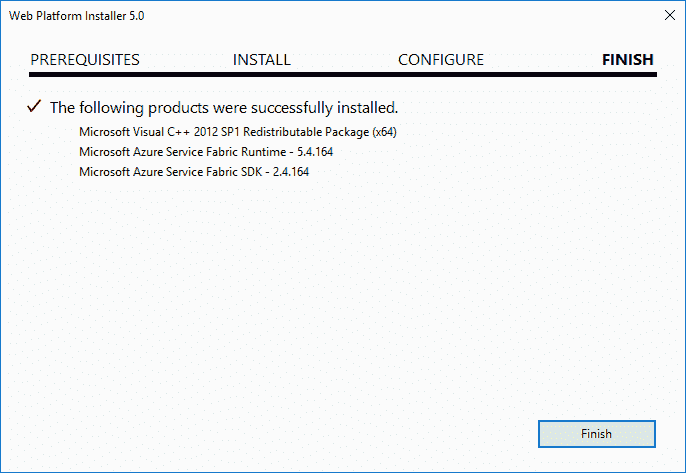

Your installation might differ from the screenshot, depending on your specific pre-installed components.

6.  下一个任务是以管理员身份打开 PowerShell。在 Windows 10 开始菜单中，输入`PowerShell`字样，搜索将立即返回桌面应用结果。右键单击桌面应用，并从上下文菜单中选择以管理员身份运行:

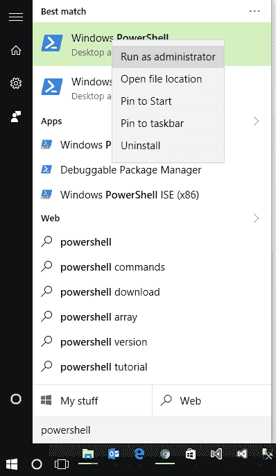

7.  Windows PowerShell 打开后，运行`Set-ExecutionPolicy -ExecutionPolicy Unrestricted -Force -Scope CurrentUser`命令。原因是服务结构使用 PowerShell 脚本来创建本地开发集群。它也用于部署 Visual Studio 开发的应用。运行此命令可防止窗口阻止这些脚本:


8.  接下来，创建本地服务结构集群。进入`& "$ENV:ProgramFiles\Microsoft SDKs\Service Fabric\ClusterSetup\DevClusterSetup.ps1"`命令。

这将创建托管服务结构应用所需的本地集群:

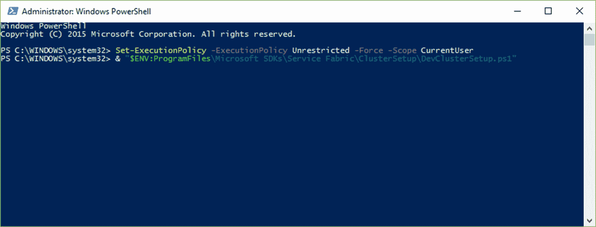

B06434_17_07

9.  创建集群后，PowerShell 将启动服务:


10.  该过程可能需要几分钟。一定要让它完成:

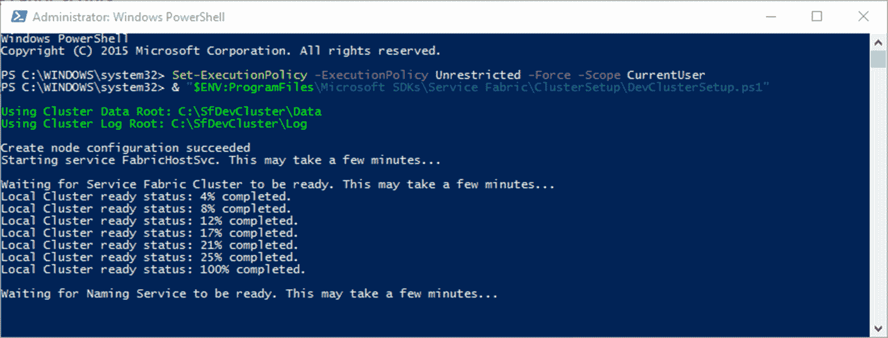

11.  命名服务准备就绪后，您可以关闭 PowerShell:


12.  要查看创建的集群，您可以导航到本地机器上的`http://localhost:19080/Explorer`。

这将为您提供群集运行状况和状态的快照。它还将显示集群中运行的任何应用:


# 它是如何工作的...

如您所见，服务结构集群对于创建和运行在 Visual Studio 中创建的应用至关重要。这将允许我们在将应用发布到云中之前，直接在您的本地机器上测试它们。如前所述，这不是服务结构集群的淡化版本。它与您将在其上安装服务结构应用的任何一台计算机上安装的版本完全相同。

# 使用无状态参与者服务创建服务结构应用

作为本章介绍的一部分，我们研究了有状态和无状态微服务之间的区别。可用的服务结构应用模板进一步分为**可靠服务**(有状态/无状态)和**可靠参与者**。何时使用哪一个取决于应用的具体业务需求。

简单地说，如果您想创建一个在任何时候都应该向您的应用的许多用户公开的服务，可靠的服务可能是一个很好的选择。想象一下，有一项服务可以同时显示许多用户或应用可以使用的最新汇率。

再次回顾本章的介绍，我们使用了带有购物车的在线网络商店的示例。一个可靠的演员可能非常适合每一个购买商品的顾客，所以你可以有一个购物车演员。作为服务结构框架一部分的可靠参与者是基于虚拟参与者模式的。看看[http://research.microsoft.com/en-us/projects/orleans/](http://research.microsoft.com/en-us/projects/orleans/)虚拟演员模式的文章。

为了向您展示使用无状态参与者服务创建微服务有多容易，我们将使用 Visual Studio 向 Service Fabric 集群发布服务，并从控制台(客户端)应用调用该服务。

# 准备好了

要完成此方法，您必须确保已在本地计算机上安装了本地服务结构集群。您还需要确保已经安装了 Visual Studio 2017 中的 Azure 开发和管理工作负载。安装 Visual Studio 2017 时启用此工作负载。如果您没有将工作负载安装为 Visual Studio 2017 的一部分，您可以通过单击 Visual Studio 2017 的网络平台安装程序并维护安装来完成。

# 怎么做...

1.  在 Visual Studio 中，通过转到文件|新建|项目来创建新项目。

2.  在 Visual C# 节点中，展开节点，直到看到“云”节点。当您单击它时，您将看到 Visual Studio 现在列出了一个新的服务结构应用模板。选择服务结构应用模板，称之为`sfApp`，点击确定:


3.  接下来，从弹出的服务模板窗口中选择参与者服务。我们刚刚称我们的为`UtilitiesActor`:

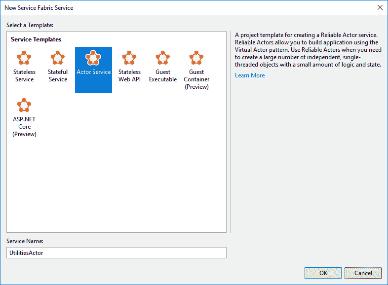

4.  创建解决方案后，您会注意到它由三个项目组成:

*   `sfApp`
*   `UtilitiesActor`
*   `UtilitiesActor.Interfaces`

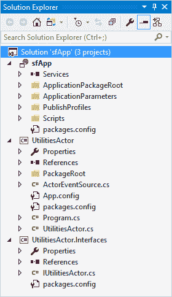

5.  我们将从修改`UtilitiesActor.Interfaces`项目中的`IUtilitiesActor`界面开始。这个接口只需要`UtilitiesActor`实现一个名为`ValidateEmailAsync`的方法，该方法将电子邮件地址作为参数，并返回一个布尔值来指示它是否是有效的电子邮件地址:

```cs
        namespace UtilitiesActor.Interfaces 
        { 
          public interface IUtilitiesActor : IActor 
          { 
            Task<bool> ValidateEmailAsync(string emailToValidate); 
          } 
        }

```

6.  接下来，打开你的`UtilitiesActor`项目，查看类`UtilitiesActor.cs`。在第 22 行寻找内部类定义`internal class UtilitiesActor : Actor, IUtilitiesActor`。`IUtilitiesActor`接口名称会用红色波浪线加下划线，因为它没有实现接口成员`ValidateEmailAsync()`。

7.  使用 *Ctrl* + *。*(期间)，实现接口。删除所有其他不必要的默认代码(如果有)。

8.  为您插入的实现的接口代码应该如下所示。目前只包含`NotImplementedException`。我们将在这里实现代码来验证电子邮件地址:

```cs
        namespace UtilitiesActor 
        { 
          internal class UtilitiesActor : StatelessActor, IUtilitiesActor 
          { 
            public UtilitiesActor(ActorService actorService, 
              ActorId actorId) : base(actorService, actorId)
            {
            }
            public async Task<bool> ValidateEmailAsync(string 
              emailToValidate) 
            { 
              throw new NotImplementedException(); 
            }         
          } 
        }

```

9.  我们将使用正则表达式来验证通过参数传递给此方法的电子邮件地址。正则表达式非常强大。然而，在我多年的编程生涯中，我从未写过自己的表达式。这些在互联网上很容易获得，您可以为自己的项目创建一个实用程序类(或扩展方法类)来重用。您可以使用正则表达式和其他常用的代码。

最后，你会注意到`ActorEventSource`代码。这只是简单地为 Windows 创建**事件跟踪** ( **ETW** )事件，这些事件将帮助您从 Visual Studio 中的诊断事件窗口查看应用中发生的情况。要打开诊断事件窗口，请转到查看，其他窗口，然后单击诊断事件:

```cs
        public async Task<bool> ValidateEmailAsync(string emailToValidate)
        {
          ActorEventSource.Current.ActorMessage(this, "Email Validation");
          return await Task.FromResult(Regex.IsMatch(emailToValidate, 
          @"A(?:[a-z0-9!#$%&'*+/=?^_&grave;{|}~-]+(?:.[
          a-z0-9!#$%&'*+/=?^_&grave;{|}~-]+) *@(?:[a-z0-9](?:[a-z0-9-]
          *[a-z0-9])?.)+[a-z0-9](?:[a-z0-9-]*[a-z0-9])?)
          Z", RegexOptions.IgnoreCase));
        }

```

10.  请务必添加对`System.Text.RegularExpressions`命名空间的引用。没有它，您将无法使用正则表达式。如果您在代码中添加了正则表达式而没有添加引用，Visual Studio 将在`Regex`方法下显示一条红色的曲线。

11.  使用 *Ctrl* + *。*(句号)，将`using`语句添加到您的项目中。这将使正则表达式命名空间进入范围。

12.  既然我们已经创建了接口并添加了该接口的实现，现在是时候添加一个我们将用于测试的客户端应用了。右键单击您的解决方案并添加新项目。

13.  最简单的方法是添加一个简单的控制台应用。调用您的客户端应用`sfApp.Client`并点击确定按钮。

14.  将控制台应用添加到解决方案后，您的解决方案应该如下所示:


15.  您现在需要添加对客户端应用的引用。右键单击`sfApp.Client`项目中的`References`节点，并从上下文菜单中选择添加引用。

16.  首先添加对`UtilitiesActor.Interfaces`项目的引用。

17.  您还需要添加对几个服务结构**动态链接库** ( **动态链接库**)的引用。当您创建服务结构应用时，它应该已经将名为`packages`的文件夹添加到您的项目文件夹结构中。浏览到此文件夹，并从那里添加您的服务结构 dll。添加所需的 dll 后，您的项目应该如下所示:

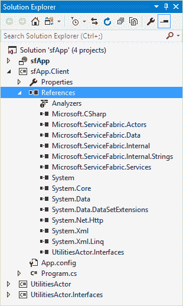

18.  在控制台应用的`Program.cs`文件中，您需要向`Main`方法添加以下代码:

```cs
        namespace sfApp.Client 
        { 
          class Program 
          { 
            static void Main(string[] args)
            {
              var actProxy = ActorProxy.Create<IUtilitiesActor>
                (ActorId.CreateRandom(), "fabric:/sfApp");
              WriteLine("Utilities Actor {0} - Valid Email?:{1}", 
              actProxy.GetActorId(), actProxy.ValidateEmailAsync(
              "validemail@gmail.com").Result);
              WriteLine("Utilities Actor {0} - Valid Email?:{1}", 
              actProxy.GetActorId(), actProxy.ValidateEmailAsync(
              "invalid@email@gmail.com").Result);
              ReadLine();
            } 
          }   
        }

```

请务必将以下`using`语句添加到您的控制台应用中:

```cs
        using Microsoft.ServiceFabric.Actors;
        using Microsoft.ServiceFabric.Actors.Client;
        using UtilitiesActor.Interfaces;
        using static System.Console;

```

我们所做的就是为我们的参与者创建一个代理，并将电子邮件验证的输出写入控制台窗口。您的客户端应用现已就绪。

# 它是如何工作的...

然而，在我们可以运行客户端应用之前，我们需要首先发布我们的服务。在解决方案资源管理器中，右键单击`sfApp`服务，然后单击发布...从上下文菜单中:

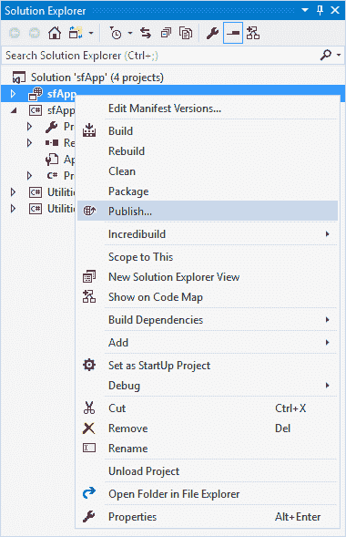

现在将显示发布服务结构应用窗口。点击选择...“连接端点”文本框旁边的按钮。选择本地集群作为连接端点，然后单击确定。将目标配置文件和应用参数文件更改为`Local.1Node.xml`。完成后，单击发布按钮:

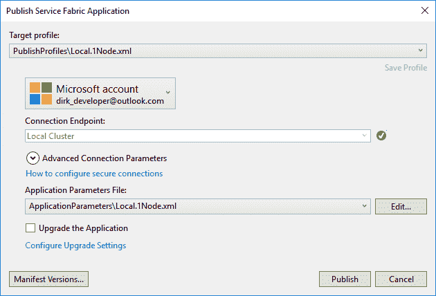

如果您导航到`http://localhost:19080/Explorer`，您将注意到您创建的服务已经发布到您的本地服务结构集群:

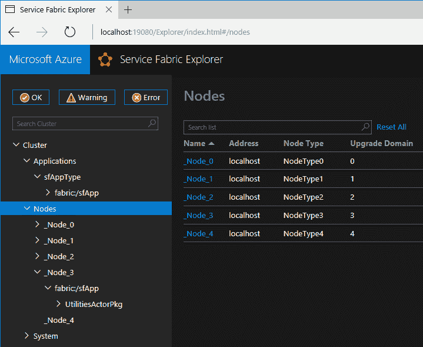

您现在可以运行客户端应用了。右键单击`sfApp.Client`项目，从上下文菜单中选择调试并启动新实例。控制台应用调用`validate`方法检查电子邮件地址，并将结果显示在控制台窗口中。结果如预期:

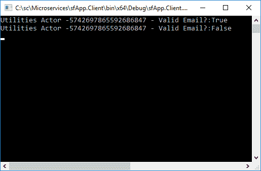

If you receive a `System.BadImageFormatException` when trying to run your console application, check to see what platform your console application is targeting. You might have compiled your console application as Any CPU while the other projects in your solution target x64\. Modify this from the Configuration Manager and make the console application also target x64.

然而，在创建参与者标识时，我们可以更加具体。在前面的代码清单中，我们使用`CreateRandom()`方法生成了一个`ActorId`。我们现在可以给它一个具体的名字。修改你的代理代码，创建一个新的`ActorId`实例，并给它任何字符串值。在下面的代码清单中，我只是调用了我的`Utilities`:

```cs
var actProxy = ActorProxy.Create<IUtilitiesActor>(new ActorId("Utilities"), "fabric:/sfApp");

```

The `ActorId` method can take a parameter of type `Guid`, `long`, or `string`.

当您再次调试客户端应用时，您会注意到`Utilities Actor`现在有了一个逻辑名称(与您在创建新的`ActorId`实例时作为字符串值传递的名称相同):


创建您的服务结构应用并在本地发布它是在将应用发布到云之前测试它的完美解决方案。创建小型、独立的微服务允许开发人员获得许多与测试、调试和部署高效、健壮的代码相关的好处，您的应用可以利用这些好处来确保最大的可用性。

# 使用服务结构资源管理器

还有另一种工具可用于可视化服务结构集群。这是一个独立的工具，你可以通过导航到`%Program Files%\Microsoft SDKs\Service Fabric\Tools\ServiceFabricExplorer`的本地安装路径并点击`ServiceFabricExplorer.exe`来找到。当您运行应用时，它将自动连接到您的本地服务结构集群。它可以显示关于集群上的应用、集群节点、应用和节点的健康状态以及集群中应用的任何负载的丰富信息。

# 准备好了

您必须已经在本地计算机上完成了服务结构的安装，服务结构资源管理器才能工作。如果您还没有这样做，请按照本章中的*下载和安装服务结构*方法进行操作。

# 怎么做...

1.  启动服务结构资源管理器时，将出现以下窗口:

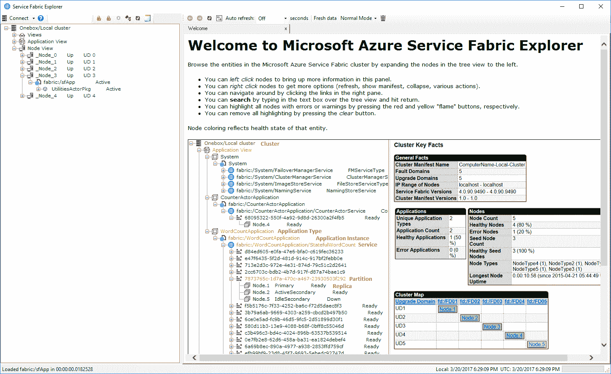

2.  请注意，左侧的树视图显示应用视图和节点视图:

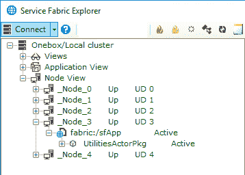

3.  右侧的窗格将显示有关本地集群的信息。这使您可以轻松查看本地服务群集的整体运行状况:

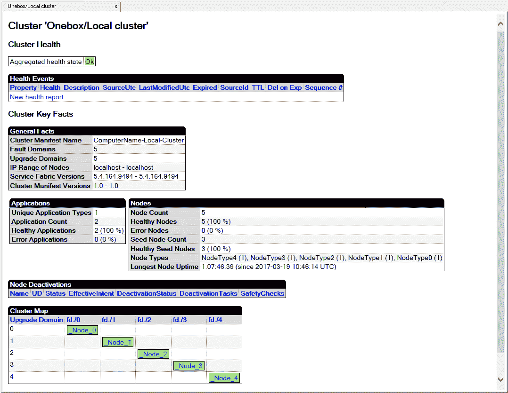

4.  当您展开应用视图时，您会注意到我们的`sfApp`服务已经发布。将它进一步扩展，您将看到`sfApp`服务已经在 Node_3 上发布。展开节点视图和 Node_3，查看该节点上的活动服务:


5.  为了说明微服务的可伸缩性，右键单击 Node_3，并从上下文菜单中选择节点上的激活/停用和停用(删除数据)。然后，单击窗口顶部的刷新按钮来刷新节点和应用。

6.  如果现在展开应用视图并再次查看服务，您会注意到服务结构集群注意到 Node_3 已被禁用。然后，它会自动将服务推送到一个新的健康节点(在本例中为 Node_2):


7.  服务结构资源管理器右侧面板中的本地群集节点视图也报告 Node_3 已禁用。单击节点视图查看:

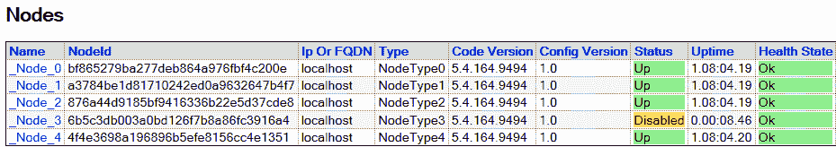

# 它是如何工作的...

服务结构资源管理器将允许您查看所选节点的信息，并且您将能够深入查看有关服务结构集群应用的大量信息。除了浏览器中提供的服务结构资源管理器之外，它只是管理员可以使用的另一个实用程序。

对于开发人员应该以何种方式来处理微服务架构，存在一些激烈的争论。有些人认为，当您作为开发人员的目标是应用的微服务架构时，您需要从整体优先的角度来对待它。也就是说，首先编写大的单片应用，因为这个过程是一种熟悉的开发方法。完成这些工作后，规划并将单个应用分割成更小的微服务。这里的论点是，当创建一个单一的应用时，上市时间要快得多。更快的上市时间意味着更快的投资回报。

那么争论的另一面是，从整块石头开始恰恰是错误的做法。开始考虑如何将应用分割成几部分的正确时间是在设计阶段。然而，做出的让步是，开发团队可能需要理解他们需要构建的系统。另一个让步是，在创建现有整体的第二个版本时，从微服务方法开始可能会更好。根据定义，单片应用的所有部分都是紧密耦合的。将这些服务分解成更小的微服务需要多长时间？

无论你决定采取哪种方法，都必须在仔细考虑所有利益相关者的所有事实后做出决定。不幸的是，没有公式或硬性规定来帮助你做出决定。关于应用架构的决定(单片还是微服务)将因项目而异。