# 跨平台。网络核心系统信息管理器

在本章中，我们将创建一个简单的*信息仪表板*应用，显示我们正在运行的计算机的信息以及该机器所在位置的天气情况。这是使用 IP 地址完成的，虽然可能不是 100%准确(因为给我的位置是一个城镇左右的距离)，但我想在这里证明的概念不是位置准确性。

关于我们正在创建的应用，我们将执行以下操作:

*   在 Windows 上设置应用
*   查看`Startup.cs`文件，添加控制器和视图
*   在 Windows 上运行应用
*   在 macOS 上运行应用
*   在 Linux 上设置和运行应用

这一章是关于什么是 ASP.NET 核心。对于那些不知道的人来说。NET Core 允许我们创建将在 Windows、macOS 和 Linux 上运行的应用。

.NET Core includes ASP.NET Core and EF Core.

微软对 ASP.NET 核心的定义如下:

"ASP.NET Core is a cross-platform, high-performance, open-source framework for building modern, cloud-based, Internet-connected applications."

是的。NET Core 是开源的。你可以在 https://github.com/dotnet/core 的 GitHub 上找到它。使用的好处。NET Core 在文档网站上列出——[https://docs.microsoft.com/en-us/aspnet/core/](https://docs.microsoft.com/en-us/aspnet/core/)。这些措施如下:

*   构建网络用户界面和网络应用接口的统一故事
*   现代客户端框架和开发工作流的集成
*   云就绪、基于环境的配置系统
*   内置依赖注入
*   轻量级、高性能和模块化的 HTTP 请求管道
*   能够在 **IIS** ( **互联网信息服务**)上托管或在自己的进程中自行托管
*   可以继续运行。NET Core，它支持真正的并行应用版本控制
*   简化现代 web 开发的工具
*   能够在 Windows、macOS 和 Linux 上构建和运行
*   开源和以社区为中心

I encourage you to have a look at the Microsoft document site for this topic at—[https://docs.microsoft.com/en-us/aspnet/core/](https://docs.microsoft.com/en-us/aspnet/core/).

实际上，ASP.NET 核心只包括适用于您的项目的 NuGet 包。这意味着应用更小、性能更好。在本章中，NuGet 的使用将变得显而易见。

让我们开始吧。接下来让我们创建第一个跨平台的 ASP.NET 核心 MVC 应用。

# 在 Windows 上设置项目

我们需要做的第一件事就是设置。NET Core 2.0。出于本书的目的，我用一台 Windows 电脑来说明这一步，但实际上，您可以在 macOS 或 Linux 上设置一个. NET Core 应用。

我将举例说明如何设置。在本章的后面部分。这个过程对于 macOS 来说是相似的，但是我发现在 Linux 上有点棘手。因此，我选择为 Linux 一步步展示这一点。

对于 macOS，我将向您展示如何运行在 Windows PC 上创建的这个应用。这才是真正的美。NET 核心。这是一项真正的跨平台技术，能够在三种平台(Windows、macOS 和 Linux)中的任何一种上完美运行:

1.  将您的浏览器指向[https://www.microsoft.com/net/core](https://www.microsoft.com/net/core)并下载。网络核心软件开发工具包:


安装也很简单。如果您看一下这个屏幕，您会注意到这和 Linux 安装之间的相似之处。两者都有一个注释，通知您它将在安装过程中运行一个命令来提高项目恢复速度:

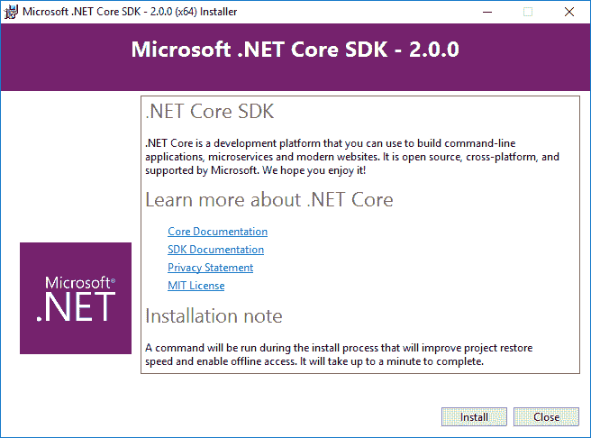

安装完成后，您会发现一些指向资源、文档、教程和发行说明的链接:


2.  启动 Visual Studio 并创建一个新的 ASP.NET 核心网络应用。另外，选择。NET 框架 4.6.2:

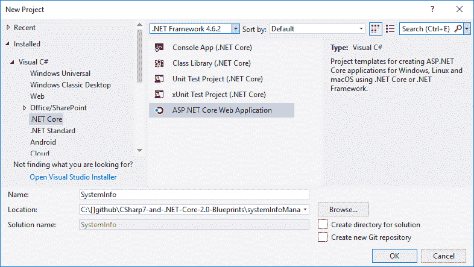

3.  在下一个屏幕上，从模板中选择网络应用(模型-视图-控制器 **)** ，并确保您选择了 ASP.NET 核心 2.0。准备就绪后，单击确定按钮创建您的 ASP.NET 核心项目:


创建项目后，您将在解决方案资源管理器中看到熟悉的 MVC 结构。模型-视图-控制器架构模式需要一点时间来适应，尤其是如果你是来自传统 ASP.NET 网络表单方法的网络开发人员。

我向你保证，使用 MVC 一段时间后，你不会想回到 ASP.NET 网络表单。使用 MVC 非常有趣，而且在许多方面都更有价值，尤其是如果这对于您来说还是全新的:

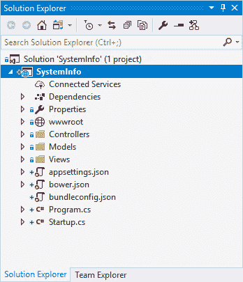

4.  就像现在的应用一样，你可以通过按住 *Ctrl* + *F5* 或者在 Visual Studio 中点击调试按钮来运行它。当应用启动时，浏览器将显示 MVC 应用的标准视图:


5.  停止调试会话，并在解决方案资源管理器中右键单击该项目。从弹出的上下文菜单中，点击管理包**...**，这将打开 NuGet 表单。

我们要添加的第一个 NuGet 包是`Newtonsoft.Json`。这是为了使我们能够在应用中使用 JSON。

6.  单击安装按钮将最新版本添加到您的应用中:

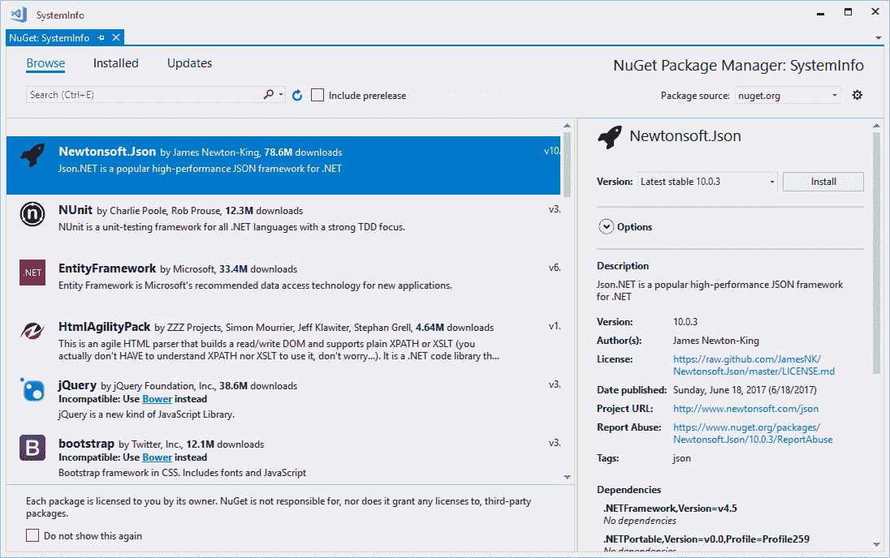

我们要添加的下一个 NuGet 包叫做`DarkSkyCore`。这是一个使用黑暗天空应用编程接口的. NET 标准库。

我已经可以看到问号出现在语句 a .NET 标准库中。我们正在处理。NET Core 在这里，对吗？那么。NET 标准？

以下网站(。NET Core Tutorials)解释得真好([https://dotnetcoretutories . com/2017/01/13/NET-standard-vs-NET-Core-what-difference/](https://dotnetcoretutorials.com/2017/01/13/net-standard-vs-net-core-whats-difference/)):

"If you write a library that you want working on .net Core, UWP, Windows Phone and .net Framework, you will need to only use classes that are available on all of those platforms. How do you know what classes are available on all platforms? The .net Standard!"

那个。NET 标准就是这样，一个标准。如果你想瞄准更多的平台，你需要瞄准更低版本的标准。如果你想获得更多的 API，你需要瞄准更高版本的标准。有一个 GitHub 存储库，[https://github.com/dotnet/standard](https://github.com/dotnet/standard)，你可以查看，为了一个方便的图表显示每个平台的哪个版本实现了每个版本的标准，转到—[https://GitHub . com/dotnet/standard/blob/master/docs/versions . MD](https://github.com/dotnet/standard/blob/master/docs/versions.md)查看。

7.  回到`DarkSkyCore`。单击安装按钮获取最新版本:

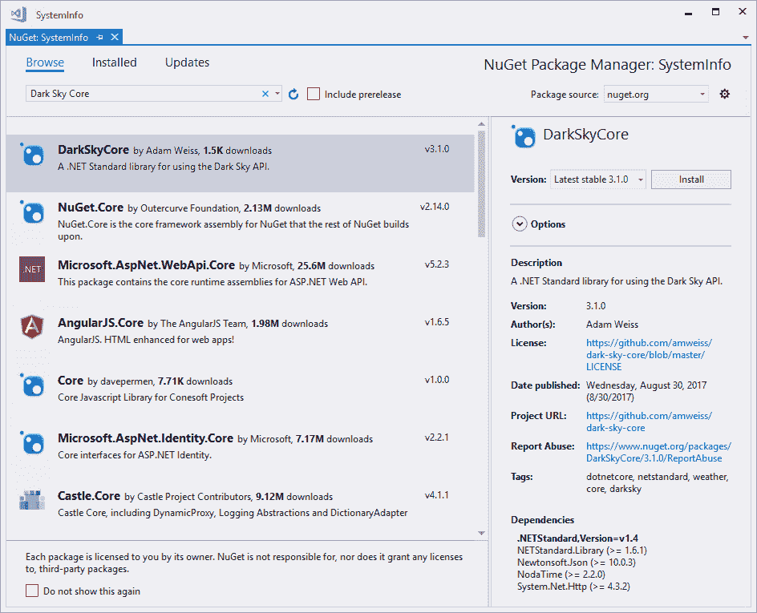

现在我们已经有了我们的 NuGet 包，让我们更详细地看看这个项目。

# 详细的项目

在我添加了所有必需的资源、控制器、视图和模型后，查看项目，您会注意到我添加了一些额外的文件夹。

我的解决方案如下:

*   `_docs`(下图截图中标注 **1** :我个人的一个偏好就是保留一个文件夹，我可以在里面做笔记，保留我觉得对项目有用的相关链接
*   `climacons` ( **2** ):这是包含将作为天气图标的 SVG 文件的文件夹
*   `InformationController` ( **3** ):这是项目的负责人
*   `InformationModel` ( **4** ):这是项目的模型
*   `GetInfo` ( **5** ):这是我控制器上`GetInfo()`方法对应的视图

除了`Models`、`Views`和`Controllers`文件夹，你可以把其他文件夹放在你认为合适的地方。请记住将它们的引用与您的解决方案相关联:

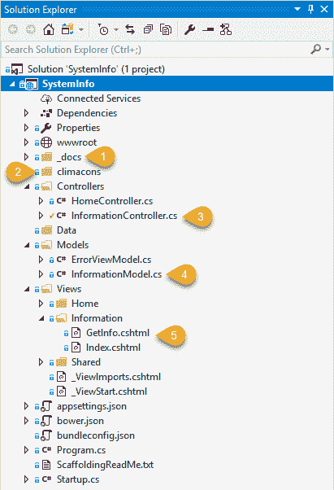

# Climacons

亚当·惠特克罗夫特为网络应用和用户界面设计者创造了 75 个气候分类象形图。我们需要下载它们才能在我们的应用中使用:

1.  前往[http://adamwhitcroft.com/climacons/](http://adamwhitcroft.com/climacons/)并下载该集合以将其包含在您的项目中。

Always remember to provide attribution back to the creators of resources you use in your applications.

2.  要将文件夹包含在项目中，只需将 SVG 文件放在项目的文件夹中:


# Startup.cs 文件

深入挖掘代码，我们从`Startup.cs`文件开始。它应该在默认情况下创建，如下面的代码清单所示，但是为了完整起见，我也将其包含在这里。

As a standard naming convention, the name `Startup` is used for this file. In reality, though, you can call it whatever you like. Just be sure to rename it in the `Program.cs` file too.

以下`using`语句应包含在`Startup.cs`文件中:

```cs
using Microsoft.AspNetCore.Builder; 
using Microsoft.AspNetCore.Hosting; 
using Microsoft.Extensions.Configuration; 
using Microsoft.Extensions.DependencyInjection; 
```

`Startup`文件中包含的代码对您来说是相同的，默认情况下是在创建应用时生成的。我们不会在本章中修改这个文件，但是，通常情况下，如果您想要添加任何中间件，您可以使用`Configure()`方法:

```cs
public class Startup 
{ 
    public Startup(IConfiguration configuration) 
    { 
        Configuration = configuration; 
    } 

    public IConfiguration Configuration { get; } 

    // This method gets called by the runtime. Use this method to add 
      services to the container. 
    public void ConfigureServices(IServiceCollection services) 
    { 
        services.AddMvc(); 
    } 

    // This method gets called by the runtime. Use this method
     to configure the HTTP request pipeline. 
    public void Configure(IApplicationBuilder app, IHostingEnvironment 
    env) 
    { 
        if (env.IsDevelopment()) 
        { 
            app.UseDeveloperExceptionPage(); 
            app.UseBrowserLink(); 
        } 
        else 
        { 
            app.UseExceptionHandler("/Home/Error"); 
        } 

        app.UseStaticFiles(); 

        app.UseMvc(routes => 
        { 
            routes.MapRoute( 
                name: "default", 
                template: "{controller=Home}/{action=Index}/{id?}"); 
        }); 
    } 
} 
```

# 信息模型类

这个应用的模型非常简单。所有这些都将公开在我们的控制器中获得的值，并提供对这些值的视图访问。要添加模型，右键单击`Models`文件夹并添加名为`InformationModel`的新类:

```cs
public class InformationModel 
{         
    public string OperatingSystem { get; set; } 
    public string InfoTitle { get; set; } 
    public string FrameworkDescription { get; set; } 
    public string OSArchitecture { get; set; } 
    public string ProcessArchitecture { get; set; } 
    public string Memory { get; set; } 
    public string IPAddressString { get; set; } 
    public string WeatherBy { get; set; } 
    public string CurrentTemperature { get; set; } 
    public string CurrentIcon { get; set; } 
    public string DailySummary { get; set; } 
    public string CurrentCity { get; set; } 
    public string UnitOfMeasure { get; set; } 
} 
```

然后可以添加属性，如前面的代码清单所示。

# 信息控制器类

我们需要采取的下一步是为我们的应用添加控制器:

1.  右键单击`Controllers`文件夹并选择添加，然后从上下文菜单中单击控制器:


2.  通过从添加支架屏幕中选择 MVC 控制器-空，添加一个名为`InformationController`的新控制器。控制器需要增加以下`using`语句:

```cs
using DarkSky.Models; 
using DarkSky.Services; 
using Microsoft.AspNetCore.Hosting; 
using Microsoft.AspNetCore.Mvc; 
using Newtonsoft.Json; 
using System.Globalization; 
using System.IO; 
using System.Net.Http; 
using System.Runtime.InteropServices; 
using System.Threading.Tasks; 
using static System.Math; 
```

微软文档说明如下:

"The IHostingEnvironment service provides the core abstraction for working with environments. This service is provided by the ASP.NET hosting layer, and can be injected into your startup logic via Dependency Injection." To read more on this, browse to [https://docs.microsoft.com/en-us/aspnet/core/fundamentals/environments](https://docs.microsoft.com/en-us/aspnet/core/fundamentals/environments) and check out the documentation.

3.  将下列属性添加到我们的控制器中的前面的构造函数中。您会注意到我们已经在类中添加了`IHostingEnvironment`界面:

```cs
public string PublicIP { get; set; } = "IP Lookup Failed"; 
public double Long { get; set; } 
public double Latt { get; set; } 
public string City { get; set; } 
public string CurrentWeatherIcon { get; set; } 
public string WeatherAttribution { get; set; } 
public string CurrentTemp { get; set; } = "undetermined"; 
public string DayWeatherSummary { get; set; } 
public string TempUnitOfMeasure { get; set; } 
private readonly IHostingEnvironment _hostEnv; 

public InformationController(IHostingEnvironment hostingEnvironment) 
{ 
    _hostEnv = hostingEnvironment; 
} 
```

4.  创建一个名为`GetInfo()`的空方法。控制器(以及包含在其中的方法)、视图和模型的命名是经过深思熟虑的。MVC 设计模式遵循一组约定，如果遵守这些约定，绑定将变得非常容易:

```cs
public IActionResult GetInfo() 
{ 

}
```

5.  如果您还记得的话，`Startup`类在`Configure()`方法中定义了一个`MapRoute`调用:


这段代码`{controller=Home}/{action=Index}/{id?}`叫做**路线模板**。MVC 应用使用标记化来提取路由值。

这意味着:

这意味着，如果我不给应用一个路由(或网址)，它将使用在`MapRoute`调用中设置的默认值。

但是，如果我给应用一个`http://localhost:50239/Information/GetInfo`的路径，它将重定向到`InformationController`上的`GetInfo()`方法。

For more information on routing, go to—[https://docs.microsoft.com/en-us/aspnet/core/mvc/controllers/routing](https://docs.microsoft.com/en-us/aspnet/core/mvc/controllers/routing) and read through the documentation.

6.  在我们的`Controllers`文件夹中，添加一个名为`LocationInfo`的类。在调用位置信息应用编程接口后，我们将使用它来绑定 JSON 字符串:

```cs
public class LocationInfo 
{ 
    public string ip { get; set; }  
    public string city { get; set; }  
    public string region { get; set; }  
    public string region_code { get; set; } 
    public string country { get; set; } 
    public string country_name { get; set; } 
    public string postal { get; set; } 
    public double latitude { get; set; } 
    public double longitude { get; set; }  
    public string timezone { get; set; }  
    public string asn { get; set; }  
    public string org { get; set; }          
} 
```

要获取位置信息，您可以使用许多位置 API 中的一个。我在 https://ipapi.co T2 使用了一个应用编程接口来为我提供位置信息。`GetLocationInfo()`方法只是调用 API，并将返回的 JSON 反序列化到刚才创建的`LocationInfo`类中。

个人觉得`ipapi`这个名字真的很聪明。这是一件不容易忘记的事情。他们还在定价中提供免费等级，即每天 1，000 个请求。这非常适合个人使用:

```cs
private async Task GetLocationInfo() 
{ 
    var httpClient = new HttpClient(); 
    string json = await 
     httpClient.GetStringAsync("https://ipapi.co/json"); 
    LocationInfo info = JsonConvert.DeserializeObject<LocationInfo>
    (json); 

    PublicIP = info.ip; 
    Long = info.longitude; 
    Latt = info.latitude; 
    City = info.city; 
}
```

7.  我们将使用的下一个应用编程接口是**黑暗天空**。您需要在[https://darksky.net/dev](https://darksky.net/dev)注册一个帐户，以获取您的 API 密钥:


我喜欢黑暗天空的一点是，他们的 API 还允许你每天进行 1000 次免费的 API 调用:

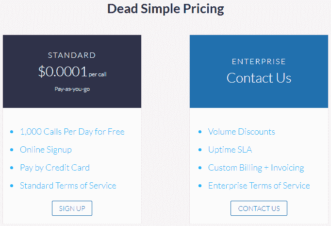

这使得它非常适合个人使用。如果你有大量用户，即使是现收现付的选择也一点都不贵。

Please note that if you make use of the Dark Sky API for a commercial application, you cannot require each user of your application to register for a Dark Sky API key. All users of your Dark Sky application must use the specific API key you generated via the online portal.

对于那些感兴趣的人来说，常见问题解答提供了关于这个问题和许多其他重要问题的清晰信息:

"...your end-users should not sign up for Dark Sky API keys: the API key should be associated with your app or service, not your users.
The 1,000 free calls per day are intended to facilitate personal use and application development, not to provide free weather data to your app. It costs us money to develop and maintain the infrastructure that supports the Dark Sky API. If your application were to grow in popularity, we would have to pay for the use of resources necessary to handle increased traffic (to the benefit of your service and your users) without the financial means to support it. For this reason, applications that ask users to register for an API key are prohibited by our terms of service."

跟踪应用编程接口调用也非常容易，可以通过在线门户查看:

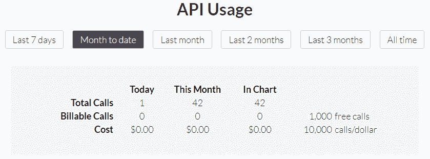

对黑暗天空应用编程接口注册进行排序后，我们希望了解应用是否运行在使用公制或英制度量单位的地区。

8.  创建一个名为`GetUnitOfMeasure()`的方法，返回一个`DarkSkyService.OptionalParameters`对象。所有这些本质上都是使用`RegionInfo`类来检查当前区域是否是公制的。

然后它设置`optParms`变量并将其返回给调用类。我还冒昧地偷偷输入了`TempUnitOfMeasure`属性的摄氏或华氏符号:

```cs
private DarkSkyService.OptionalParameters GetUnitOfMeasure() 
{ 
    bool blnMetric = RegionInfo.CurrentRegion.IsMetric; 
    DarkSkyService.OptionalParameters optParms = new 
     DarkSkyService.OptionalParameters(); 
    if (blnMetric) 
    { 
        optParms.MeasurementUnits = "si"; 
        TempUnitOfMeasure = "C"; 
    } 
    else 
    { 
        optParms.MeasurementUnits = "us"; 
        TempUnitOfMeasure = "F"; 
    } 
    return optParms; 
} 
```

9.  下一个要添加的方法叫做`GetCurrentWeatherIcon()`，它将用于确定要在我们的网页上显示的黑暗天空图标。还有很多可供选择，但为了简洁起见，我选择只包含这几个图标名称。这些图标名称对应于我们解决方案中`climacons`文件夹中的 SVG 文件名填充列表:

```cs
private string GetCurrentWeatherIcon(Icon ic) 
{ 
    string iconFilename = string.Empty; 

    switch (ic) 
    { 
        case Icon.ClearDay: 
            iconFilename = "Sun.svg"; 
            break; 

        case Icon.ClearNight: 
            iconFilename = "Moon.svg"; 
            break; 

        case Icon.Cloudy: 
            iconFilename = "Cloud.svg"; 
            break; 

        case Icon.Fog: 
            iconFilename = "Cloud-Fog.svg"; 
            break; 

        case Icon.PartlyCloudyDay: 
            iconFilename = "Cloud-Sun.svg"; 
            break; 

        case Icon.PartlyCloudyNight: 
            iconFilename = "Cloud-Moon.svg"; 
            break; 

        case Icon.Rain: 
            iconFilename = "Cloud-Rain.svg"; 
            break; 

        case Icon.Snow: 
            iconFilename = "Snowflake.svg"; 
            break; 

         case Icon.Wind: 
            iconFilename = "Wind.svg"; 
            break; 
         default: 
            iconFilename = "Thermometer.svg"; 
            break; 
    } 
    return iconFilename; 
} 
```

10.  接下来要创建的方法是`GetWeatherInfo()`方法。所有这些都是调用`DarkSkyService`类，并将您之前在黑暗天空门户中生成的 API 密钥传递给它。你会注意到代码根本不是真正的火箭科学。

该类中的步骤如下:

因此，您的代码需要如下所示:

```cs
private async Task GetWeatherInfo() 
{ 
    string apiKey = "YOUR_API_KEY_HERE"; 
    DarkSkyService weather = new DarkSkyService(apiKey);             
    DarkSkyService.OptionalParameters optParms =
     GetUnitOfMeasure(); 
    var foreCast = await weather.GetForecast(Latt, Long, optParms); 

    string iconFilename = 
     GetCurrentWeatherIcon(foreCast.Response.Currently.Icon); 
    string svgFile = Path.Combine(_hostEnv.ContentRootPath, 
     "climacons", iconFilename); 
    CurrentWeatherIcon = System.IO.File.ReadAllText($"{svgFile}"); 

    WeatherAttribution = foreCast.AttributionLine; 
    DayWeatherSummary = foreCast.Response.Daily.Summary; 
    if (foreCast.Response.Currently.Temperature.HasValue) 
        CurrentTemp = 
     Round(foreCast.Response.Currently.Temperature.Value, 
      0).ToString(); 
} 
```

11.  最后但同样重要的是，我们需要向`GetInfo()`方法添加适当的代码。该方法的第一部分涉及查找运行应用的计算机的系统信息。这显然会根据我们运行的操作系统而改变。NET Core 应用位于:

```cs
public IActionResult GetInfo() 
{ 
    Models.InformationModel model = new Models.InformationModel(); 
    model.OperatingSystem = RuntimeInformation.OSDescription; 
    model.FrameworkDescription = 
     RuntimeInformation.FrameworkDescription; 
    model.OSArchitecture = 
     RuntimeInformation.OSArchitecture.ToString(); 
    model.ProcessArchitecture = 
     RuntimeInformation.ProcessArchitecture.ToString(); 

    string title = string.Empty; 
    string OSArchitecture = string.Empty; 

    if (model.OSArchitecture.ToUpper().Equals("X64")) { 
     OSArchitecture = "64-bit"; } else { OSArchitecture = 
     "32-bit"; } 

    if (RuntimeInformation.IsOSPlatform(OSPlatform.Windows)) {
     title 
     = $"Windows {OSArchitecture}"; } 
    else if (RuntimeInformation.IsOSPlatform(OSPlatform.OSX)) { 
     title = $"OSX {OSArchitecture}"; } 
    else if (RuntimeInformation.IsOSPlatform(OSPlatform.Linux)) { 
     title = $"Linux {OSArchitecture}"; } 

    GetLocationInfo().Wait(); 
    model.IPAddressString = PublicIP; 

    GetWeatherInfo().Wait(); 
    model.CurrentIcon = CurrentWeatherIcon; 
    model.WeatherBy = WeatherAttribution; 
    model.CurrentTemperature = CurrentTemp; 
    model.DailySummary = DayWeatherSummary; 
    model.CurrentCity = City; 
    model.UnitOfMeasure = TempUnitOfMeasure; 

    model.InfoTitle = title; 
    return View(model); 
}
```

`GetInfo()`方法的最后一部分涉及确定我们在前面步骤中制作的天气信息。

下一部分工作将需要创建我们的视图。一旦我们完成了，真正的乐趣就开始了。

# GetInfo 视图

把这种观点综合起来很简单。我选择了一种非常简约的方法(除了天气图标)，但你可以在这里尽情发挥创造力:

1.  右键单击`Views`文件夹，添加一个名为`Information`的新文件夹。在`Information`文件夹中，通过右键单击文件夹并选择添加，然后单击视图，添加一个名为`GetInfo`的新视图...从上下文菜单中:


视图的命名也遵循 MVC 中使用的命名约定。

Refer to the *The project in detail* section earlier in this chapter for an image of the Visual Studio solution displaying the layout of the `Views` folder.

已经创建的视图使用 Razor 语法。Razor 是开发人员直接在网页内添加 C# 代码(服务器代码)的一种方式。`GetInfo.cshtml`页面内的代码如下:

```cs
@model SystemInfo.Models.InformationModel 

@{ 
    ViewData["Title"] = "GetInfo"; 
} 

<h2> 
    System Information for: @Html.DisplayFor(model => model.InfoTitle)          
</h2> 

<div> 

    <hr /> 
    <dl class="dl-horizontal"> 
        <dt> 
            Operating System 
        </dt>         
        <dd> 
            @Html.DisplayFor(model => model.OperatingSystem)             
        </dd> 
        <dt> 
            Framework Description 
        </dt> 
        <dd> 
            @Html.DisplayFor(model => model.FrameworkDescription) 
        </dd> 
        <dt> 
            Process Architecture 
        </dt> 
        <dd> 
            @Html.DisplayFor(model => model.ProcessArchitecture) 
        </dd>         
        <dt> 
            Public IP 
        </dt> 
        <dd> 
            @Html.DisplayFor(model => model.IPAddressString) 
        </dd>        

    </dl> 
</div> 

<h2> 
    Current Location: @Html.DisplayFor(model => model.CurrentCity) 
</h2> 
<div> 
    <div style="float:left">@Html.Raw(Model.CurrentIcon)</div><div><h3>@Model.CurrentTemperature&deg;@Model.UnitOfMeasure</h3></div> 
</div> 

<div> 
    <h4>@Html.DisplayFor(model => model.DailySummary)</h4> 
</div> 
<div> 
    Weather Info: @Html.DisplayFor(model => model.WeatherBy) 
</div> 
```

可以看到，MVC 在 Razor 的白话中加入了`@model`关键词。通过这样做，您允许视图指定视图的`Model`属性的类型。语法是`@model class`并且包含在第一行`@model` `SystemInfo.Models.InformationModel`中，这将视图强有力地输入到`InformationModel`类中。

有了这种灵活性，您可以将 C# 表达式直接添加到客户端代码中。

2.  您需要添加的最后一位代码是`Views/Shared`文件夹中的`_Layout.cshtml`文件:


我们只是在这里添加一个菜单链接来导航到我们的`InformationController`类。您会注意到代码遵循控制器和动作的约定，其中`asp-controller`指定了`InformationController`类，`asp-action`指定了该控制器内部的`GetInfo`方法。

3.  在这个阶段，应用应该可以运行了。建造它，并确保你得到一个干净的建筑。运行应用，然后单击信息仪表板菜单项。

信息仪表板将显示运行的计算机信息以及机器当前位置(或附近)的天气信息:


对于本章的 Windows 部分，我使用了 Azure，因此服务器位于美国。这就是为什么显示的信息是基于美国的。

4.  最后，让我们从 Razor 视图中查看一下生成的 HTML 代码。如果您使用内置的开发工具(我使用的是 Chrome)并查看页面源，您会发现从 Razor 视图创建的 HTML 非常不起眼:

```cs
<h2> 
    System Information for: Windows 64-bit          
</h2> 

<div> 

    <hr /> 
    <dl class="dl-horizontal"> 
        <dt> 
            Operating System 
        </dt>         
        <dd> 
            Microsoft Windows 10.0.14393              
        </dd> 
        <dt> 
            Framework Description 
        </dt> 
        <dd> 
            .NET Core 4.6.00001.0 
        </dd> 
        <dt> 
            Process Architecture 
        </dt> 
        <dd> 
            X64 
        </dd>         
        <dt> 
            Public IP 
        </dt> 
        <dd> 
            13.90.213.135 
        </dd>        

    </dl> 
</div> 
```

说到底，这一切都只是 HTML。然而，值得注意的是，我们使用 Razor 来访问模型上的属性，并将它们直接放在视图的 HTML 中。

# 在 macOS 上运行应用

在这一章的这一部分，我将假设你使用的是一台已经用过的苹果电脑。已安装. NET Core 1.1。如果你没有。NET Core 安装在您的 Mac 上，前往[https://www.microsoft.com/net/core# macos](https://www.microsoft.com/net/core# macos)并遵循安装步骤(或跟随):

1.  简单来说，从你的。NET 核心解决方案，只需发布。NET 核心应用。然后，将发布的文件复制到您的 Mac 上。我只是把我发布的文件放在一个名为`netCoreInfoDash`的桌面文件夹中:


2.  打开 Mac 上的终端，将工作目录改为`netCoreInfoDash`文件夹。输入命令`dotnet SystemInfo.dll`并点击*进入*:


因为这个项目是为。NET Core 2.0，而我们的 Mac 只有。NET Core 1.1 中，我们将在终端中看到以下错误消息:

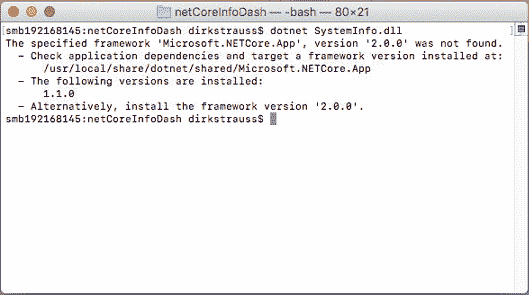

3.  我们需要更新的版本。. NET Core 在 Mac 上升级到 2.0 版本。为此，请前往[https://www.microsoft.com/net/core# macos](https://www.microsoft.com/net/core# macos)进行安装。NET 核心 2.0。

安装。NET Core SDK 非常简单:


很快。网络核心 2.0 安装在你的苹果电脑上:


4.  回到终端，输入`dotnet SystemInfo.dll`并点击*进入*。这一次，您将在终端窗口中看到以下信息输出。你会看到指定了地址`http://localhost:5000`。为您列出的端口可能会改变，但`5000`通常是给定的端口:


5.  打开 Mac 上的浏览器(可以是 Safari，但我用的是 Chrome)，导航至— `http://localhost:5000`。您将看到显示熟悉的应用起始页。如果您单击信息控制面板菜单项，您将看到我们创建的页面与在 Windows 机器上显示的页面完全一样:


这里唯一的区别是 Mac 不在 Azure 上，事实上在我南非的办公室里。温度信息已更改为摄氏度，显示的机器信息是我的苹果电脑的信息。这是南非春天的一个美好夜晚。

# 在 Linux 上安装应用

每个人都在不停地谈论。NET Core 来运行跨平台，甚至在 Linux 上。因此，我决定试一试。我知道很多人可能对 Linux 不感兴趣，但是能够使用像 Linux 这样强大的操作系统确实有一种满足感。

如果你正在发展。NET 核心应用，我会鼓励你设置一个 Linux 盒子用于测试。你可以有很多方法去做这件事。如果您可以访问 Azure，您可以在 Azure 上设置一个 Linux 虚拟机。

您还可以使用虚拟化软件在本地机器上提供功能齐全的虚拟机。我选择的选项是使用 **VirtualBox** 以及在 **Parallels** 上测试流程。这两种方法都很容易，但是 VirtualBox 可以自由使用，所以这是一个很好的选择。您可以从[https://www.virtualbox.org/wiki/Downloads](https://www.virtualbox.org/wiki/Downloads)免费下载最新版本的 VirtualBox。

您还可以通过从各种在线网站下载现成的 VirtualBox 图像来节省安装时间。只要确保它们是信誉良好的网站，例如位于–[http://www.osboxes.org/virtualbox-images/](http://www.osboxes.org/virtualbox-images/)的**操作系统盒子**。

无论您选择走哪条路线，本章的其余部分都将假设您已经设置了您的 Linux 环境，并且准备好设置您的。NET 核心应用。

让我们看看如何安装。面向 Linux 的. NET 内核:

1.  找到安装说明。NET Core 2.0 适合您独特的 Linux 风格—来自[https://www.microsoft.com/net/download/linux](https://www.microsoft.com/net/download/linux):


2.  我用的是 **Ubuntu 16.04** ，点击`sudo apt-get install dotnet-sdk-2.0.0`链接会带我到安装步骤。
3.  通过输入*Ctrl*+*Alt*+*T*打开 Linux Ubuntu(或 Linux Mint)上的终端窗口。

鉴于我正在运行一个全新的 Linux 版本，我需要先安装 **cURL** 。这个工具允许我在服务器和本地机器之间传输数据。

4.  运行以下命令获取 cURL:

```cs
sudo apt-get install curl
```

5.  终端会询问您的密码。输入密码在屏幕上不起作用，但继续输入并点击*进入*:

The password that doesn't display a masked output to the screen as you type is by design when working with Linux. It's a feature.

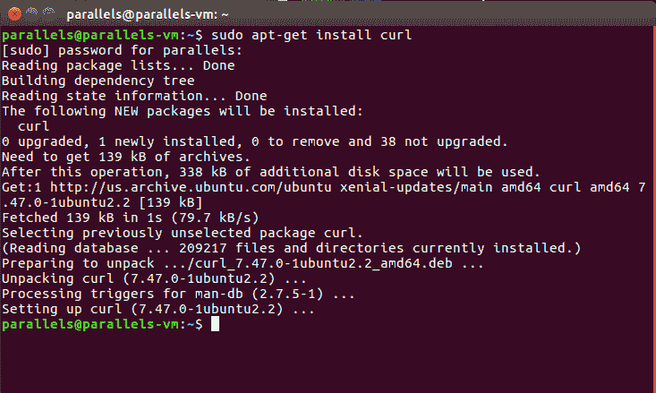

6.  现在，我们需要注册可信的微软签名密钥。键入以下内容:

```cs
curl https://packages.microsoft.com/keys/microsoft.asc | gpg --dearmor > microsoft.gpg
```


7.  完成后，键入以下内容:

```cs
    sudo mv microsoft.gpg /etc/apt/trusted.gpg.d/microsoft.gpg
```

8.  现在，我们需要为 Ubuntu 16.04 注册微软产品提要。为此，请键入以下内容:

```cs
sudo sh -c 'echo "deb [arch=amd64] https://packages.microsoft.com/repos/microsoft-ubuntu-xenial-prod xenial main" > /etc/apt/sources.list.d/dotnetdev.list'
```

9.  然后，紧接着键入以下内容:

```cs
    sudo apt-get update
```

10.  现在，我们可以安装。通过键入以下内容，创建. NET Core 2.0 软件开发工具包:

```cs
    sudo apt-get install dotnet-sdk-2.0.0
```

11.  终端问我们是否想继续，我们会继续。所以，输入`Y`并点击*进入*:

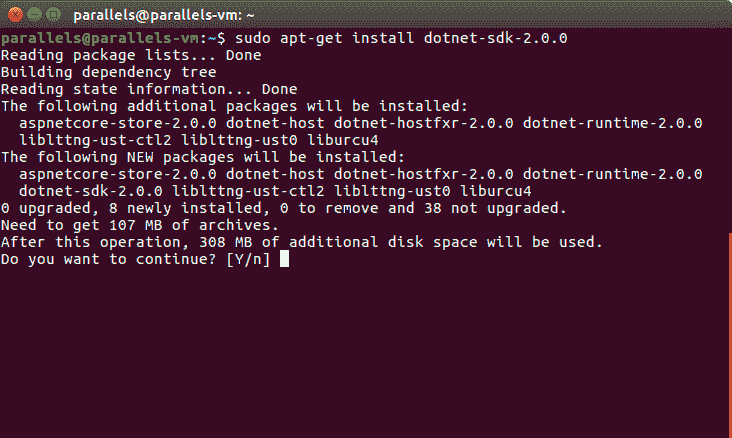

当这个过程完成后，你会看到光标在`~$`旁边准备输入:


12.  检查哪个版本的？NET Core 已安装，请键入以下命令:

```cs
    dotnet --version  
```

13.  这应该显示 2.0.0。我们现在有了。NET Core 2.0 安装在我们的 Linux 机器上。首先，创建一个名为`testapp`的新目录，并通过键入以下内容将您的工作目录更改为`testapp`目录:

```cs
    mkdir testapp
    cd testapp  
```

考虑以下截图:


14.  我们只想看看。NET Core 正在我们的 Linux 机器上工作，所以当您在`testapp`目录中时，键入以下内容:

```cs
    dotnet new razor
```

是的，就是这么简单。这刚刚在 Linux 上为我们创建了一个新的 MVC Web 项目:

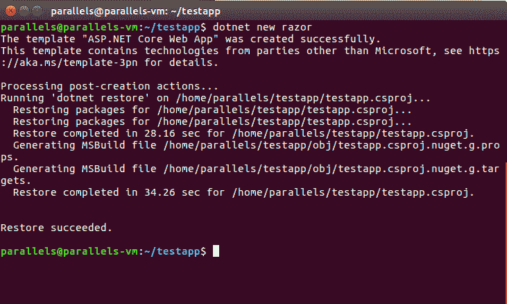

15.  正如我们在 Mac 上所做的那样，键入以下命令:

```cs
    dotnet run  
```

请看下面的截图:

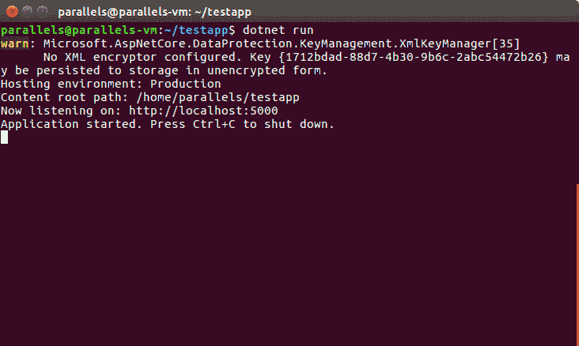

16.  在终端的输出中，您会注意到本地主机显示了相同的端口号。不像 macOS，在 Ubuntu 上我可以点击终端窗口里面的`http://localhost:5000`。这将打开我们刚刚创建的应用:


既然我们知道了。NET Core 2.0 在 Linux 上运行正常，让我们将项目文件复制到我们的 Linux 机器上:

1.  在桌面上创建一个文件夹；你可以随便叫它什么。复制的项目文件。NET Core 应用复制到该文件夹中(不要将发布的文件复制到该文件夹中):

You will remember that on macOS, we only copied the published files. This is different on Linux. Here, you need to copy all your project files.


2.  右键单击文件夹，然后选择在终端中打开。

现在我们已经在包含解决方案文件的文件夹中，键入以下内容:

```cs
    dotnet restore  
```

该命令恢复我们项目的依赖关系和工具:


3.  因为我们正在处理解决方案文件，所以我需要向下导航一个文件夹并键入以下内容:

```cs
dotnet run
```

请看下面的截图:

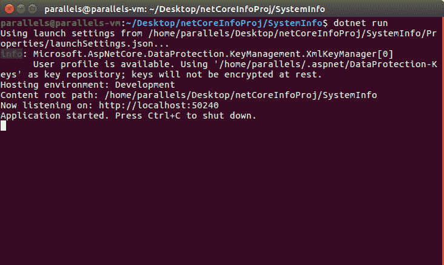

4.  导航到终端窗口中显示的`http://localhost:50240`将我带到我的应用的起始页:

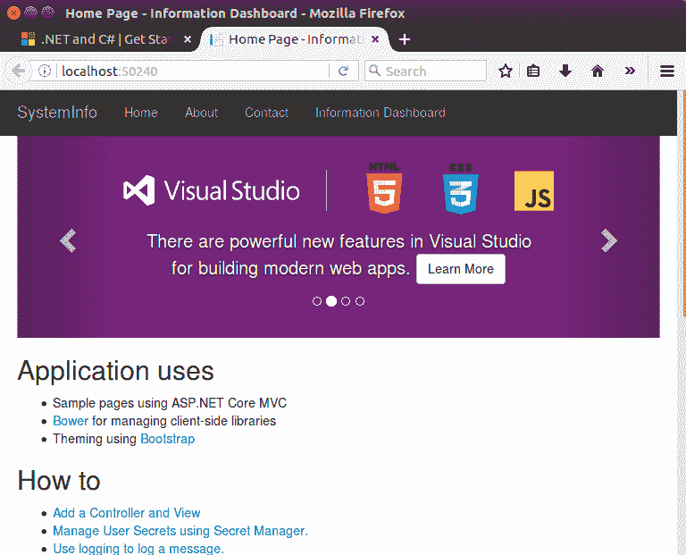

5.  单击信息仪表板菜单项将带我们进入我们创建的页面:

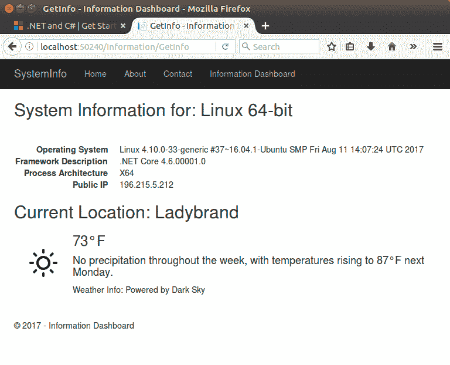

仅此而已。我们有一个在 Windows 电脑上使用 Visual Studio 2017 Enterprise 创建的 ASP.NET Core MVC 应用，它运行在 Linux 机器上。最棒的是，我们没有改变一行代码来让我们的应用在不同的平台上运行。

# 摘要

回顾这一章，我们看到了在 Windows 上设置 ASP.NET 核心应用。我们研究了添加视图和控制器，如果你熟悉 ASP.NET MVC，那么你会有宾至如归的感觉。如果不是，ASP.NET 的 MVC 真的很容易。

最后，我们看了一下是什么造成的。NET Core 通过在 Windows、macOS 和 Linux 上运行相同的应用而变得如此强大。

的力量。NET Core 现在应该对您很明显了。它允许开发人员使用. NET 编写真正跨平台的应用。这项技术是游戏规则的改变者，也是每个开发人员必须掌握的东西。

接下来，您可能会想，当我们想要将数据库连接到. NET Core 应用时，我们需要做什么。在下一章中，我们将研究在 ASP.NET 核心 MVC 应用上使用 MongoDB。

你可能会想，我们为什么要使用 MongoDB？嗯，MongoDB 是免费的、开源的、灵活的。话说回来，为什么我们不想使用 MongoDB？下一章再见！