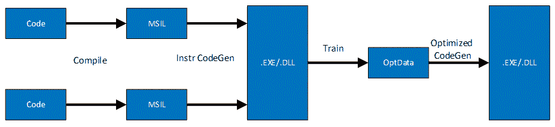
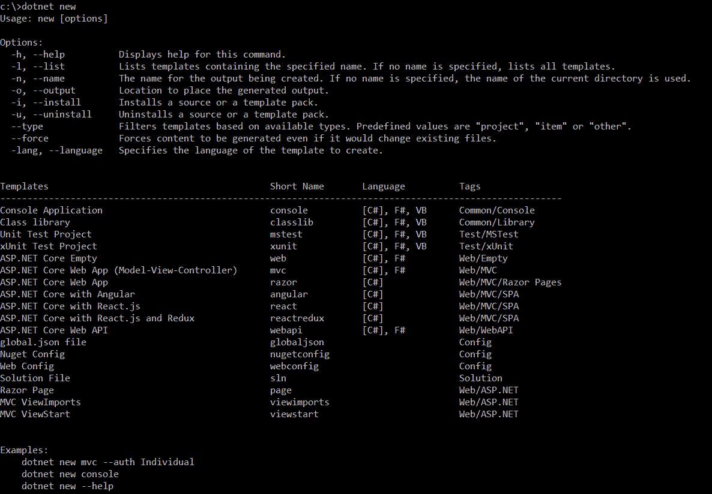
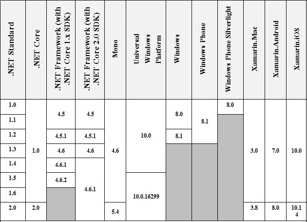
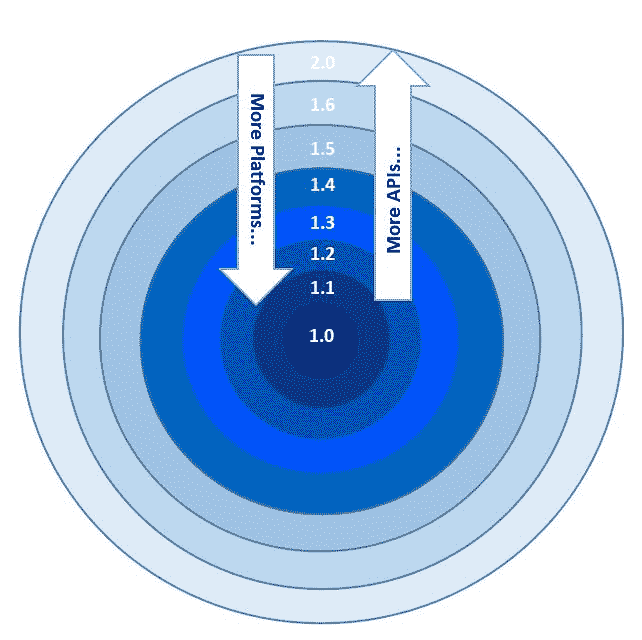
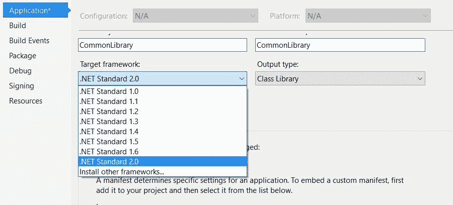
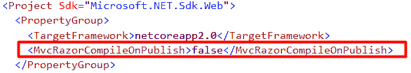
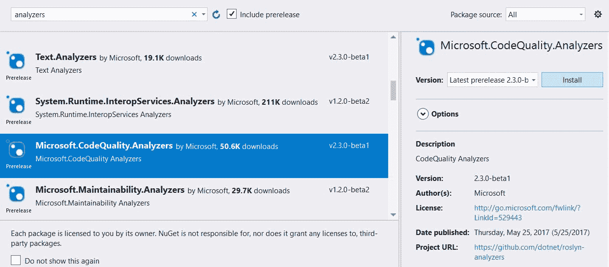
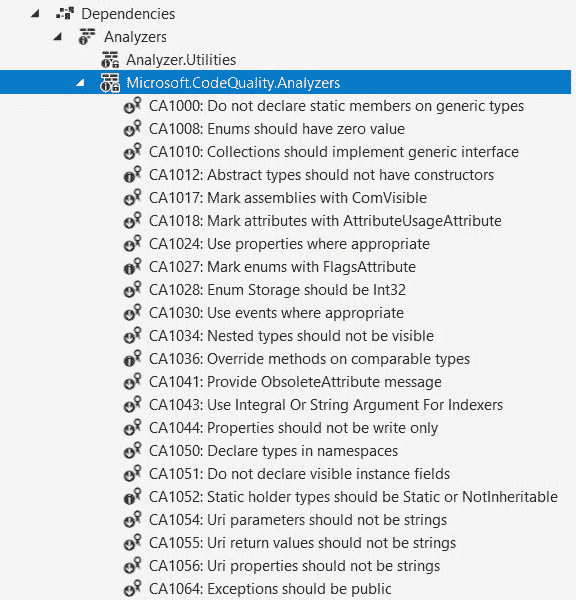
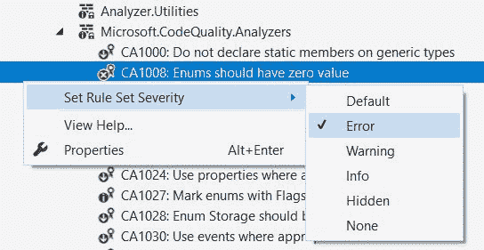

# 最新动态。NET Core 2 和 C# 7？

。NET Core 是微软开发的跨平台运行的开发平台，由微软和 GitHub 的社区维护。由于其性能和平台可移植性，它是开发社区中最新兴和最流行的框架。它面向每一个可以为任何平台开发任何应用程序的开发人员，包括网络、云、移动、嵌入式和物联网场景。

和。NET Core，我们可以使用 C#、F#开发应用程序，现在也可以使用 VB.NET。然而，C#是开发人员中使用最广泛的语言。

在本章中，您将学习以下主题:

*   中的性能改进。网络核心 2.0
*   正在从升级路径。NET Core 1.x 到 2.0
*   。网络标准 2.0
*   ASP.NET 核心 2.0 带来了什么
*   C# 7.0 中的新特性

# 的进化。网

2002 年初，微软首次推出。NET Framework，它面向的是在经典 ASP 或 VB 6 平台上工作的开发人员，因为他们没有任何引人注目的框架来开发企业级应用程序。随着。NET 框架，开发人员有了一个开发应用程序的平台，可以从 VB.NET、C#和 F#中选择任何一种语言。不管选择什么语言，代码都是可互操作的，开发人员可以用 VB.NET 创建一个项目，并在他们的 C#或 F#项目中引用它，反之亦然。

的核心组件。NET 框架包括**公共语言运行时** ( **CLR** )、**框架类库** ( **FCL** )、**基础类库** ( **BCL** )以及一套应用模型。较新版本的引入了新功能和修补程序。NET Framework，它是随着 Windows 的新版本一起发布的，开发人员不得不等待一年左右的时间来获得这些改进。微软的每个团队都在开发不同的应用程序模型，每个团队都必须等待新框架发布的日期来移植他们的修复和改进。Windows 窗体和 Web 窗体是当时被广泛使用的主要应用程序模型。NET 开发人员。

当网络表单第一次被引入时，它是一个突破，吸引了从事经典 ASP 的网络开发人员和从事 Visual Basic 6.0 的桌面应用程序开发人员。开发人员的体验很吸引人，提供了一组不错的控件，可以轻松地拖放到屏幕上，然后是它们的事件和属性，可以通过视图文件(`.aspx`)或代码隐藏文件进行设置。后来，微软推出了**模型视图控制器** ( **MVC** )应用模型，实现了关注点分离的设计原则，使视图、模型和控制器成为独立的实体。视图是呈现模型的用户界面，其中模型代表业务实体并保存数据，控制器处理请求并更新模型并将其注入视图。MVC 是一个突破，它让开发人员编写更干净的代码，并使用模型绑定将他们的模型与 HTML 控件绑定在一起。随着时间的推移，更多的功能被添加和核心。NET web assembly `System.Web`变得相当大和臃肿，并且包含了许多包和 API，这些包和 API 并不总是对每种类型的应用程序都有用。然而，有了。NET 中，引入了几个突破性的变化，`System.Web`被拆分成了可以根据需求单独引用和添加的 NuGet 包。

。NET Core(代码名。NET vNext)于 2014 年首次推出，下面是使用的核心好处。网络核心:

| **利益** | **描述** |
| **跨平台** | 。NET Core 可以在 Windows、Linux 和 macOS 上运行 |
| **主机不可知** | 。服务器端的 NET Core 不依赖于 IIS，通过两个轻量级服务器*红隼*和 *WebListener* ，它可以作为 Console 应用程序进行自我托管，也可以通过反向代理选项与成熟的服务器(如 IIS、Apache 和其他服务器)进行组合 |
| **模块化** | 作为 NuGet 包发货 |
| **开源** | 整个源代码通过。网络基金会 |
| **CLI 工装** | 命令行工具，用于从命令行创建、构建和运行项目 |

。NET Core 是一个跨平台的开源框架，它实现了。NET 标准。它提供了一个名为。NET Core CLR，框架类库，这是称为 *CoreFX、*的原语库，以及类似于什么的 API。NET Framework 具有，但占用空间较小(对其他程序集的依赖性较小):


。NET Core 提供了如下灵活的部署选项:

*   **框架依赖部署(FDD)** :需求。要安装在机器上的网络核心软件开发工具包
*   **独立部署(SCD)** :无全机安装。机器上需要. NET Core SDK。NET Core CLR 和框架类库是应用程序包的一部分

To install .NET Core 2.0, you can navigate to the following link [https://www.microsoft.com/net/core](https://www.microsoft.com/net/core) and go through the options for installing it on Windows, Linux, MAC, and Docker.

# 中的新改进。网络核心 2.0

的最新版本。NET Core 2.0 有许多改进。。NET Core 2.0 是有史以来最快的版本，可以在多个平台上运行，包括各种 Linux 发行版、macOS(操作系统)和 Windows。

Distros stands for Linux distribution (often abbreviated as distro), and it is an operating system made from a software collection, which is based upon the Linux kernel and, often, a package management system.

# 性能提升

。NET Core 更健壮，性能更高效，而且由于它是开源的，微软团队和其他社区成员正在带来更多的改进。

以下是部分改进。NET 核心 2.0。

# 中的 RyuJIT 编译器。净核心

RyuJIT 是下一代 JIT 编译器，它是对 **Just In Time** ( **JIT** )编译器的完全重写，并生成了高效得多的本机代码。它的速度是以前 64 位编译器的两倍，编译速度快 30%。最初，它只在 X64 架构上运行，但现在它也支持 X86，开发人员可以在 X64 和 X86 上使用 RyuJIT 编译器。。NET Core 2.0 对 X86 和 X64 平台都使用了 RyuJIT。

# 轮廓导向优化

**轮廓引导优化** ( **PGO** )是 C++编译器用来生成优化代码的编译技术。它适用于运行时和 JIT 的内部本机编译组件。它分两步执行编译，如下所示:

1.  它记录关于代码执行的信息。
2.  根据这些信息，它会生成更好的代码。

下图描述了如何编译代码的生命周期:



英寸 NET Core 1.1，微软已经发布了适用于 Windows X64 架构的 PGO，但是在。NET Core 2.0，这是为 Windows X64 和 X86 架构添加的。此外，根据天文台的结果，注意到实际启动时间大部分是由`coreclr.dll`和`clrjit.dll`为窗口获取的。或者，在 Linux 上，分别有`libcoreclr.so`和`libclrjit.so`。

将 RyuJIT 与被称为 JIT32 的旧 JIT 编译器进行比较，RyuJIT 在代码生成方面效率更高。JIT32 的启动时间比 RyuJIT 快；但是，代码效率不高。为了克服 RyuJIT 编译器的初始启动时间，微软使用了 PGO，这使得性能更接近 JIT32 的性能，并在启动时实现了高效的代码和性能。

对于 Linux，每个发行版的编译器工具链是不同的，微软正在开发一个独立的 Linux 版本。NET，它使用适用于所有发行版的 PGO 优化。

# 简化包装

和。NET Core，我们可以从 NuGet 向我们的项目添加库。所有框架和第三方库都可以作为 NuGet 包添加。对于引用多个库的大型应用程序，逐个添加每个库是一个麻烦的过程。。NET Core 2.0 简化了打包机制，并引入了元包，这些元包可以作为一个包含所有与之链接的程序集的包来添加。

例如，如果你想在 ASP.NET 核心工作。NET Core 2.0，你只需要添加一个单独的包，`Microsoft.AspNetCore.All`，使用 NuGet。

以下是将此包安装到项目中的命令:

```cs
Install-Package Microsoft.AspNetCore.All -Version 2.0.0
```

# 正在从升级路径。NET Core 1.x 到 2.0

。NET Core 2.0 带来了许多改进，这是人们想要迁移他们现有的。NET 核心应用程序从 1.x 到 2.0。但是，我们将在本主题中查看一个清单，以确保顺利迁移。

# 1.安装。网络核心 2.0

首先，安装。NET Core 2.0 软件开发工具包。它会将最新的程序集安装到您的计算机上，这将帮助您执行进一步的步骤。

# 2.升级目标框架

这是最重要的一步，也是需要在中升级不同版本的地方。NET 核心项目文件。既然我们知道，有了`.csproj`类型，我们就没有`project.json`了，要修改框架和其他依赖关系，我们可以使用任何 Visual Studio 编辑器编辑现有的项目，并修改 XML。

需要更改的 XML 节点是`TargetFramework`。为了。NET Core 2.0，我们要把`TargetFramework`的绰号改成`netcoreapp2.0`，如下图:

```cs
<TargetFramework>netcoreapp2.0</TargetFramework>
```

接下来，您可以开始构建将升级。NET 核心对 2.0 的依赖。然而，它们中的一些可能仍然引用旧版本，升级这些依赖关系需要使用 NuGet 包管理器显式完成。

# 3.更新。NET Core SDK 版本

如果您的项目中添加了`global.json`，则必须将 SDK 版本更新为`2.0.0`，如下图所示:

```cs
{ 
  "sdk": { 
    "version": "2.0.0" 
  } 
} 
```

# 4.更新。核心命令行界面

。NET Core CLI 也是您的。NET 核心项目文件。迁移时需要将`DotNetCliToolReference`版本升级到`2.0.0`，如下图:

```cs
<ItemGroup> 
  <DotNetCliToolReference Include=
  "Microsoft.VisualStudio.Web.CodeGeneration.Tools" Version="2.0.0" /> 
</ItemGroup> 
```

根据您是否使用实体框架核心、用户机密和其他工具，可能会添加更多工具。你必须更新他们的版本。

# ASP.NET 核心身份的变化

ASP.NET 核心身份模型有了更多的改进和变化。有些类被重命名了，你可以在:[http://docs.microsoft.com/en-us/aspnet/core/migration](http://docs.microsoft.com/en-us/aspnet/core/migration)找到它们。

# 探索。核心命令行界面和新项目模板

**命令行界面** ( **CLI** )是一个非常流行的工具几乎是所有流行框架都喜欢的 Yeoman Generator、Angular 等。它允许开发人员执行命令来创建、构建和运行项目、恢复包等等。

。NET CLI 提供了一个工具集，其中有一些命令可以从命令行界面执行来创建。NET 核心项目，恢复依赖项，以及生成和运行项目。线下，Visual Studio 2015/2017 和 Visual Studio Code 甚至使用这个工具来执行开发人员从他们的 IDE 中获取的不同选项；例如，使用创建新项目。NET 命令行界面，我们可以运行以下命令:

```cs
dotnet new 
```

它将列出创建项目时可用的模板和短名称。

下面是包含项目模板列表的截图，这些模板可用于使用创建/脚手架项目。核心命令行界面:



通过运行以下命令，将创建一个新的 ASP.NET 核心 MVC 应用程序:

```cs
dotnet new mvc 
```

下面的屏幕截图显示了运行前面的命令后新 MVC 项目的配置。它在运行命令的同一目录中创建项目，并恢复所有依赖关系:


安装。NET Core CLI 工具集，有一些本机安装程序可用于 Windows、Linux 和 macOS。这些安装程序可以安装和设置。NET 命令行界面工具，开发人员可以从命令行界面运行命令。

下面是中提供的命令列表及其说明。核心命令行界面:

| **命令** | **描述** | **例** |
| `new` | 基于选定的模板创建新项目 | `dotnet new razor` |
| `restore` | 恢复项目中定义的所有依赖关系 | `dotnet restore` |
| `build` | 构建项目 | `dotnet build` |
| `run` | 无需任何额外编译即可运行源代码 | `dotnet run` |
| `publish` | 将应用程序文件打包到文件夹中进行部署 | `dotnet publish` |
| `test` | 用于执行单元测试 | `dotnet test` |
| `vstest` | 从指定的文件执行单元测试 | `dotnet vstest [<TEST_FILE_NAMES>]` |
| `pack` | 将代码打包到 NuGet 包中 | `dotnet pack` |
| `migrate` | 迁移。NET Core 预览版 2 到。网络核心 1.0 | `dotnet migrate` |
| `clean` | 清除项目的输出 | `dotnet clean` |
| `sln` | 修改. NET 核心解决方案 | `dotnet sln` |
| `help` | 显示可通过执行的命令列表。NET 命令行界面 | `dotnet help` |
| `store` | 将指定的程序集存储在运行时包存储中 | `dotnet store` |

以下是一些项目级命令，可用于添加新的 NuGet 包、删除现有包、列出引用等:

| **命令** | **描述** | **例** |
| `add package` | 向项目添加包引用 | `dotnet add package Newtonsoft.Json` |
| `remove package` | 从项目中移除包引用 | `dotnet remove package Newtonsoft.Json` |
| `add reference` | 向项目添加项目引用 | `dotnet add reference chapter1/proj1.csproj` |
| `remove reference` | 从项目中移除项目引用 | `dotnet remove reference chapter1/proj1.csproj` |
| `list reference` | 列出项目中的所有项目引用 | `dotnet list reference` |

以下是一些常见的实体框架核心命令，可用于添加迁移、删除迁移、更新数据库等。

| **命令** | **描述** | **例** |
| `dotnet ef migrations add` | 添加新的迁移 | `dotnet ef migrations add Initial`- `Initial` is the name of migration |
| `dotnet ef migrations list` | 列出可用的迁移 | `dotnet ef migrations list` |
| `dotnet ef migrations remove` | 删除特定迁移 | `dotnet ef migrations remove Initial`- `Initial` is the name of migration |
| `dotnet ef database update` | 将数据库更新到指定的迁移 | `dotnet ef database update Initial`- `Initial` is the name of migration |
| `dotnet ef database drop` | 删除数据库 | `dotnet ef database drop` |

以下是一些服务器级命令，可用于从机器的实际源存储库中删除 NuGet 包，将 NuGet 包添加到机器上的实际源存储库中，等等:

| **命令** | **描述** | **例** |
| `nuget delete` | 从服务器中删除包 | `dotnet nuget delete Microsoft.AspNetCore.App 2.0` |
| `nuget push` | 将包推送到服务器并发布它 | `dotnet nuget push foo.nupkg` |
| `nuget locals` | 列出本地 NuGet 资源 | `dotnet nuget locals -l all` |
| `msbuild` | 构建项目及其所有依赖项 | `dotnet msbuild` |
| `dotnet install script` | 要安装的脚本。NET 命令行界面工具和共享运行时 | `./dotnet-install.ps1 -Channel LTS` |

要运行前面的命令，我们可以从命令行使用称为 dotnet 的工具，并指定后面的实际命令。当。NET Core CLI 已安装，在 Windows 操作系统中设置为 PATH 变量，可以从任何文件夹访问。因此，例如，如果您在项目根文件夹中，想要恢复依赖项，您可以只调用以下命令，它将恢复项目文件中定义的所有依赖项:

```cs
dotnet restore 
```

前面的命令将开始恢复项目文件中定义的依赖项或特定于项目的工具。工具和依赖关系的恢复是并行完成的:


我们也可以使用`--packages`参数设置包可以恢复的路径。但是，如果没有指定，它将使用系统用户文件夹下的`.nuget/packages`文件夹。例如，Windows 操作系统的默认 NuGet 文件夹分别是 Linux 操作系统的`{systemdrive}:\Users\{user}\.nuget\packages`和`/home/{user}`。

# 理解。网络标准

在。NET 生态系统，有很多运行时。我们有。NET Framework，这是一个安装在 Windows 操作系统上的全机框架，为**Windows Presentation Foundation**(**WPF**)、Windows 窗体和 ASP.NET 提供应用模型。然后，我们有了。NET Core，面向跨平台操作系统和设备，提供 ASP.NET Core、**通用 Windows 平台** ( **UWP** )和 Mono 运行时，面向 Xamarin 应用和开发者，他们可以使用 Mono 运行时在 Xamarin 上开发应用，并在 iOS、Android 和 Windows OS 上运行。

下图描述了。NET 标准库提供了。. NET 框架。NET Core 和 Xamarin 以及常见的构造块:


所有这些运行时都实现了一个名为。NET 标准，其中。NET 标准是的规范。NET 应用编程接口，每个运行时都有实现。这使得您的代码可以跨不同的平台移植。这意味着为一个运行时创建的代码也可以由另一个运行时执行。。NET Standard 是我们之前使用的下一代**可移植类库** ( **PCL** )。简单回顾一下，PCL 是一个以. NET 的一个或多个框架为目标的类库，在创建 PCL 的时候，我们可以选择这个库需要用到的目标框架，它将程序集最小化，只使用所有框架通用的那些。

那个。NET Standard 不是一个可以下载或安装的 API 或可执行文件。它是定义每个平台实现的应用编程接口的规范。每个运行时版本实现一个特定的。NET 标准版。下表显示了的版本。NET 标准每个平台实现:



我们可以看到。NET Core 2.0 实现。NET 标准 2.0 和那个。NET 框架 4.5 实现。NET 标准 1.1。例如，如果我们开发了一个类库。NET Framework 4.5，这可以很容易地添加到。NET Core 项目，因为它实现了更高版本的。NET 标准。另一方面，如果我们想引用。NET 核心程序集。NET 框架 4.5，我们可以通过更改。NET 标准版升级到 1.1 版，无需重新编译和构建我们的项目。

据我们所知。NET Standard 是在不同的运行时之间共享代码，但是它与 PCL 的不同之处如下所示:

| **可移植类库(PCL)** | **。净标准** |
| 代表微软平台，目标是一组有限的平台 | 平台不可知 |
| API 是由您的目标平台定义的 | 精心策划的一套宣传材料 |
| 它们不是线性版本 | 线性版本化 |

。NET Standard 也映射到 PCL，所以如果你有一个你想要转换的现有 PCL 库。NET 标准，可以参考下表:

| **PCL 配置文件** | **。净标准** | **PCL 平台** |
| seven | One point one | 。NET 框架 4.5，Windows 8 |
| Thirty-one | One | Windows 8.1，Windows Phone Silverlight 8.1 |
| Thirty-two | One point two | Windows 8.1，Windows Phone 8.1 |
| forty-four | One point two | 。NET 框架 4.5.1，Windows 8.1 |
| forty-nine | One | 。NET 框架 4.5，Windows Phone Silverlight 8 |
| seventy-eight | One | 。NET 框架 4.5，Windows 8，Windows Phone Silverlight 8 |
| Eighty-four | One | Windows Phone 8.1，Windows Phone Silverlight 8.1 |
| One hundred and eleven | One point one | 。NET 框架 4.5，Windows 8，Windows Phone 8.1 |
| One hundred and fifty-one | One point two | 。NET 框架 4.5.1，Windows 8.1，Windows Phone 8.1 |
| One hundred and fifty-seven | One | Windows 8.1、Windows Phone 8.1、Windows Phone Silverlight 8.1 |
| Two hundred and fifty-nine | One | 。NET Framework 4.5，Windows 8，Windows Phone 8.1，Windows Phone Silverlight 8 |

考虑到前面的表格，如果我们有一个目标为。. NET Framework 4.5.1、Windows 8.1 和 Windows Phone 8.1 在将 PCL 配置文件设置为 151 的情况下，可以将其转换为。. NET 标准库，版本 1.2。

# 版本控制。网络标准

与 PCL 不同，每个版本的。NET 标准是线性版本化的，包含以前版本的 API 等等。一旦该版本被发送，它就被冻结并且不能被更改，应用程序可以很容易地锁定该版本。

下图展示了。NET 标准进行了版本控制。版本越高，可用的 API 就越多，而版本越低，可用的平台就越多:



# 中的新改进。网络标准 2.0

。NET Core 2.0 的目标是。NET 标准 2.0，并提供了两个主要的好处。这包括以前版本提供的 API 数量的增加及其兼容模式，我们将在本章中进一步讨论。

# 更多 API 在。网络标准 2.0

更多的 API 被添加到。NET 标准 2.0，数量几乎是之前的两倍。NET 标准，1.0。此外，像数据集、集合、二进制序列化、XML 模式等 API 现在也是的一部分。NET 标准 2.0 规范。这增加了代码的可移植性。. NET 框架转换为。NET 核心。

下图描述了每个区域中添加的 API 的分类视图:


# 兼容模式

虽然加入了 33K 以上的 API。NET 标准 2.0，许多 NuGet 包仍然是目标。NET 框架，并将它们移动到。NET 标准是不可能的，因为它们的依赖关系仍然不是目标。NET 标准。然而，有了。NET 标准 2.0，我们仍然可以添加显示警告的包，但是不要阻止将这些包添加到我们的。NET 标准库。

在引擎盖下。NET Standard 2.0 使用兼容性垫片，解决了第三方库的兼容性问题，使得引用这些库变得容易。在 CLR 世界中，程序集的标识是类型标识的一部分。这意味着当我们在说`System.Object`的时候。NET 框架，我们引用的是`[mscorlib]System.Object`和。NET 标准，我们引用的是`[netstandard]System.Object`，所以如果我们引用的是任何组件的一部分。NET 框架，它不容易运行。NET 标准，因此出现了兼容性问题。为了解决这个问题，他们使用了类型转发，它提供了一个假的`mscorlib`组件，类型转发所有类型到。NET 标准实现。

下面是。NET 框架库可以在任何。NET 使用类型转发方法的标准实现:


另一方面，如果我们有一个. NET Framework 库，并且想要引用一个. NET Standard 库，那么它会添加`netstandard`伪程序集，并使用。NET 框架实现:


To suppress warnings, we can add NU1701 for particular NuGet packages whose dependencies are not targeting .NET Standard.

# 创建. NET 标准库

若要创建. NET 标准库，可以使用 Visual Studio 或。NET 核心命令行界面工具集。从 Visual Studio 中，我们只需点击。NET 标准选项，如下图所示，并选择类库(。NET 标准)。

一旦。NET Standard 库创建后，我们可以将其引用到任何项目中，并根据需要更改版本，具体取决于我们要引用的平台。可以从属性面板更改版本，如下图所示:



# ASP.NET 核心 2.0 带来了什么

ASP.NET 核心是开发跨平台运行的云就绪和企业网络应用程序的最强大平台之一。微软在 ASP.NET 核心 2.0 中增加了许多功能，其中包括新的项目模板、Razor Pages、应用洞察的简化配置、连接池等。

以下是 ASP.NET 核心 2.0 的一些新改进。

# ASP.NET 核心剃刀页面

基于 Razor 语法的页面已经在 ASP.NET 核心中引入。现在，开发人员可以在没有控制器的情况下开发应用程序并在 HTML 上编写语法。相反，文件后面有一个代码，可以处理其他事件和逻辑。后端页面类继承自`PageModel`类，其成员变量和方法可以使用 Razor 语法中的`Model`对象来访问。下面是一个简单的例子，它包含在`code-behind`类中定义的`GetTitle`方法，并在视图页面中使用:

```cs
public class IndexModel : PageModel 
{ 
  public string GetTitle() => "Home Page"; 
}
```

这里是`Index.cshtml`文件，通过调用`GetCurrentDate`方法显示日期:

```cs
@page 
@model IndexModel 
@{ 
  ViewData["Title"] = Model.GetTitle(); 
} 
```

# 发布时自动页面和视图编译

在发布 ASP.NET Core Razor 页面项目时，所有视图都被编译成一个单独的程序集，并且发布的文件夹大小相对较小。如果我们希望在发布过程中生成视图和所有`.cshtml`文件，我们必须添加一个条目，如下所示:



# C# 7.1 的剃刀支持

现在，我们可以使用 C# 7.1 的特性，例如推断的元组名称、与泛型的模式匹配以及表达式。为了添加这种支持，我们必须在项目文件中添加一个如下所示的 XML 标记:

```cs
<LangVersion>latest</LangVersion>
```

# 应用洞察的简化配置

借助 ASP.NET 核心 2.0，您只需单击一下即可启用应用洞察。用户只需右键单击项目并点击添加|应用洞察遥测，然后通过简单的向导即可启用应用洞察。这允许您监控应用程序，并从 Azure 应用程序洞察提供完整的诊断信息。

我们还可以从应用洞察搜索窗口中查看 Visual Studio 2017 IDE 的完整遥测数据，并从应用洞察趋势中监控趋势。这两个窗口都可以从“视图|其他窗口”菜单中打开。

# 实体框架核心 2.0 中的连接池

随着实体框架 Core 2.0 的最新发布，我们可以通过使用`Startup`类中的`AddDbContextPool`方法来池化连接。我们已经知道，在 ASP.NET Core 中，我们必须在`Startup`类中的`ConfigureServices`方法中使用**依赖注入** ( **DI** )来添加`DbContext`对象，当它在控制器中使用时，将注入`DbContext`对象的新实例。为了优化性能，微软提供了这个`AddDbContextPool`方法，它首先检查可用的数据库上下文实例，并将其注入到任何需要的地方。另一方面，如果数据库上下文实例不可用，则会创建并注入一个新实例。

下面的代码展示了如何在`Startup`类的`ConfigureServices`方法中添加`AddDbContext`:

```cs
services.AddDbContextPool<SampleDbContext>( 
  options => options.UseSqlServer(connectionString)); 
```

There are some more features added to Owned Types, Table splitting, Database Scalar Function mapping, and string interpolation that you can refer to from the following link: [https://docs.microsoft.com/en-us/ef/core/what-is-new/](https://docs.microsoft.com/en-us/ef/core/what-is-new/).

# C# 7.0 中的新特性

C#是世界上最流行的语言。NET 生态系统，并首次与。NET 框架。C#目前稳定的版本是 7。下图显示了 C# 7.0 的发展历程以及不同年份推出的版本:


下面是 C# 7.0 引入的一些新特性:

*   元组
*   模式匹配
*   参考回报
*   作为表达式的异常
*   本地功能
*   输出变量文字
*   异步主

# 元组

元组解决了从一个方法返回多个值的问题。传统上，我们可以使用作为引用变量的输出变量，如果从调用方法中修改了这些变量，那么值就会改变。但是没有参数，有一些局限性，比如不能和`async`方法一起使用，不建议和外部服务一起使用。

元组具有以下特征:

*   它们是值类型。
*   它们可以转换成其他元组。
*   元组元素是公共的和可变的。

元组表示为`System.Tuple<T>`，其中`T`可以是任何类型。以下示例显示了元组如何与方法一起使用，以及如何调用值:

```cs
static void Main(string[] args) 
{ 
  var person = GetPerson(); 
  Console.WriteLine($"ID : {person.Item1}, 
  Name : {person.Item2}, DOB : {person.Item3}");       
} 
static (int, string, DateTime) GetPerson() 
{ 
  return (1, "Mark Thompson", new DateTime(1970, 8, 11)); 
}
```

您可能已经注意到，项目是动态命名的，第一个项目命名为`Item1`，第二个命名为`Item2`，依此类推。另一方面，我们还可以命名这些项目，以便主叫方应该知道该值，这可以通过为元组中的每个参数添加参数名来实现，如下所示:

```cs
static void Main(string[] args) 
{ 
  var person = GetPerson(); 
  Console.WriteLine($"ID : {person.id}, Name : {person.name}, 
  DOB : {person.dob}");  
} 
static (int id, string name, DateTime dob) GetPerson() 
{ 
  return (1, "Mark Thompson", new DateTime(1970, 8, 11)); 
} 
```

To learn more about Tuples, please check the following link:
[https://docs.microsoft.com/en-us/dotnet/csharp/tuples](https://docs.microsoft.com/en-us/dotnet/csharp/tuples).

# 模式

模式匹配是对值执行语法测试以验证它是否匹配特定模型的过程。有三种类型的模式:

*   恒定模式。
*   类型模式。
*   不同的模式。

# 恒定模式

常量模式是检查常量值的简单模式。考虑下面的例子:如果`Person`对象为空，它将返回并退出`body`方法。

`Person`类如下:

```cs
class Person 
{ 
  public int ID { set; get; } 
  public string Name { get; set; } 

  public DateTime DOB { get; set; } 
} 
```

在前面的代码片段中，我们有一个包含三个属性的`Person`类，即`ID`、`Name`和`DOB`(出生日期)。

以下语句检查具有空常数值的`person`对象，如果该对象为空，则返回该对象:

```cs
if (person is null) return; 
```

# 类型模式

类型模式可以与对象一起使用，以验证它是否与类型匹配，或者是否满足基于指定条件的表达式。假设我们需要检查`PersonID`是否为`int`；将`ID`分配给另一个变量`i`，并在程序中使用它，否则`return`:

```cs
if (!(person.ID is int i)) return; 

Console.WriteLine($"Person ID is {i}"); 
```

我们还可以使用多个逻辑运算符来评估更多条件，如下所示:

```cs
if (!(person.ID is int i) && !(person.DOB>DateTime.Now.AddYears(-20))) return;   
```

前面的语句检查`Person.ID`是否为空，人是否大于 20 岁。

# Var 模式

var 模式检查`var`是否等于某个类型。以下示例显示了如何使用`var`模式检查类型并打印`Type`名称:

```cs
if (person is var Person) Console.WriteLine($"It is a person object and type is {person.GetType()}"); 
```

To learn more about patterns, you can refer to the following link: [https://docs.microsoft.com/en-us/dotnet/csharp/whats-new/csharp-7#pattern-matching](https://docs.microsoft.com/en-us/dotnet/csharp/whats-new/csharp-7#pattern-matching).

# 参考回报

引用返回允许方法将对象作为引用而不是其值返回。我们可以通过在方法签名中的类型之前以及从方法本身返回对象时添加`ref`关键字来定义引用返回值。

下面是允许引用返回的方法的签名:

```cs
public ref Person GetPersonInformation(int ID); 

Following is the implementation of the GetPersonInformation method that uses the ref keyword while returning the person's object.  

Person _person; 
public ref Person GetPersonInformation(int ID) 
{ 
  _person = CallPersonHttpService(); 
  return ref _person; 
} 
```

# 扩展的表达式主体成员

表达式主体成员是在 C# 6.0 中引入的，其中方法的语法表达式可以用更简单的方式编写。在 C# 7.0 中，我们可以将这个特性用于构造函数、析构函数、异常等等。

以下示例显示了如何使用表达式主体成员简化构造函数和析构函数的语法表达式:

```cs
public class PersonManager 
{ 
  //Member Variable 
  Person _person; 

  //Constructor 
  PersonManager(Person person) => _person = person; 

  //Destructor 
  ~PersonManager() => _person = null; 
} 
```

有了属性，我们还可以简化语法表达式，下面是如何编写的基本示例:

```cs
private String _name; 
public String Name 
{ 
  get => _name; 
  set => _name = value; 
} 
```

我们还可以使用带有异常的表达式体语法表达式，并简化表达式，如下所示:

```cs
private String _name; 
public String Name 
{ 
  get => _name; 
  set => _name = value ?? throw new ArgumentNullException(); 
} 
```

在前面的例子中，如果值为空，将会抛出一个新的`ArgumentNullException`。

# 创建本地函数

在函数中创建的函数称为局部函数。这些主要用于定义必须在函数本身范围内的辅助函数。下面的例子展示了如何通过编写一个局部函数并递归调用它来获得数字的阶乘:

```cs
static void Main(string[] args) 
{ 
  Console.WriteLine(ExecuteFactorial(4));          
} 

static long ExecuteFactorial(int n) 
{ 
  if (n < 0) throw new ArgumentException("Must be non negative", 
  nameof(n)); 

  else return CheckFactorial(n); 

  long CheckFactorial(int x) 
  { 
    if (x == 0) return 1; 
    return x * CheckFactorial(x - 1); 
  } 
}
```

# 输出变量

有了 C# 7.0，我们在使用`out`变量的时候可以写出更干净的代码。众所周知，要使用`out`变量，我们必须先声明它们。有了新的语言增强，我们现在可以只写`out`作为前缀，并指定我们需要赋值的变量的名称。

为了阐明这个概念，我们将首先看到传统的方法，如下所示:

```cs
public void GetPerson() 
{ 
  int year; 
  int month; 
  int day; 
  GetPersonDOB(out year, out month, out day); 
} 

public void GetPersonDOB(out int year, out int month, out int day ) 
{ 
  year = 1980; 
  month = 11; 
  day = 3; 
} 
```

这里用 C# 7.0，我们可以简化前面的`GetPerson`方法，如下所示:

```cs
public void GetPerson() 
{ 
  GetPersonDOB(out int year, out int month, out int day); 
} 
```

# 异步主

我们已经知道，在。NET 框架中，`Main`方法是操作系统执行应用/程序的主要入口点。例如，在 ASP.NET 核心中，`Program.cs`是定义`Main`方法的主要类，它创建一个`WebHost`对象，运行红隼服务器，并加载`Startup`类中配置的 HTTP 管道。

在以前版本的 C#中，`Main`方法有以下签名:

```cs
public static void Main();
public static void Main(string[] args);
public static int Main();
public static int Main(string[] args);
```

在 C# 7.0 中，我们可以使用 Async Main 来执行异步操作。异步/等待功能最初发布于。NET 框架 4.5，以便异步执行方法。今天，许多应用编程接口提供异步/等待方法来执行异步操作。

以下是 C# 7.1 中添加的`Main`方法的一些附加签名:

```cs
public static Task Main();
public static Task Main(string[] args);
public static Task<int> Main();
public static Task<int> Main(string[] args);
```

由于前面的异步签名，我们现在可以从`Main`入口点本身调用`async`方法，并使用等待来执行异步操作。下面是 ASP.NET 核心的一个简单例子，它调用`RunAsync`方法而不是`Run`:

```cs
public class Program
{
  public static async Task Main(string[] args)
  {
    await BuildWebHost(args).RunAsync();
  }
  public static IWebHost BuildWebHost(string[] args) =>
    WebHost.CreateDefaultBuilder(args)
    .UseStartup<Startup>()
    .Build();
}
```

Async Main 是 C# 7.1 的一项功能，要在 Visual Studio 2017 中启用这项功能，您可以转到项目属性，单击“高级”按钮，并将语言版本设置为 C#最新次要版本(最新)，如下所示:


# 编写质量代码

对于每一个性能高效的应用程序，代码质量都起着重要的作用。我们已经知道，Visual Studio 是目前最流行的**集成开发环境** ( **IDE** )进行开发。NET 应用程序，并自罗斯林(。NET Compiler SDK)将编译器平台公开为 API，引入了许多特性，这些特性不仅扩展了 Visual Studio 的功能，还增强了开发体验。

实时静态代码分析是 Visual Studio 在开发中可以使用的核心功能之一。NET 应用程序，它在开发过程中提供代码分析，同时编写代码。由于该功能使用罗斯林应用编程接口，许多其他第三方公司也推出了可以使用的分析仪。我们还可以针对特定需求开发自己的分析仪，这不是一个非常复杂的过程。让我们快速了解一下如何在中使用实时静态代码分析。NET Core 项目，以及它如何通过分析代码并给出警告、错误和潜在的修复来改善开发体验。

我们可以添加分析器作为 NuGet 包。在 NuGet.org，有很多可用的分析器，一旦我们在项目中添加了任何分析器，它就会在项目的*依赖*部分添加一个新的*分析器*节点。然后，我们可以自定义规则，隐藏警告或错误，等等。

让我们在中添加一个来自 Visual Studio 的新分析器。NET 核心项目。如果不知道要添加哪个分析仪，只需在 NuGet Package manager 窗口中键入*分析仪*，系统会为您列出所有分析仪。我们将只添加`Microsoft.CodeQuality.Analyzers`分析器，它包含一些体面的规则:



一旦选定的分析器被添加，一个新的`Analyzers`节点被添加到我们的项目中:


在上图中，我们可以看到`Analyzers`节点增加了三个节点，为了查看/管理规则，我们可以展开子节点`Microsoft.CodeQuality.Analyzers`和`Microsoft.CodeQuality.CSharp.Analyzers`，如下图所示:



此外，我们还可以通过右键单击规则并选择严重性来更改规则严重性，如下所示:



在上图中，规则 CA1008 规定枚举的值应该为零。让我们测试一下，看看它是如何工作的。

创建一个简单的`Enum`并指定值，如下所示:

```cs
public enum Status 
{ 
  Create =1, 
  Update =2, 
  Delete =3, 
} 
```

您会注意到，一旦您编写了这段代码，它将显示以下错误，并提供潜在的修复:


最后，这里是我们可以应用的修复，错误将消失:


您还可以使用一个流行的 Visual Studio 扩展，称为 Roslynator，它可以从以下链接下载。它包含 190 多个基于 C#的项目的分析器和重构:[https://marketplace.visualstudio.com/items?itemName=josefpihrt。Roslynator](https://marketplace.visualstudio.com/items?itemName=josefpihrt.Roslynator) 。

实时静态代码分析是一个很好的特性，可以帮助开发人员编写符合最佳准则和实践的高质量代码。

# 摘要

在本章中，我们了解了。NET 核心框架和一些新的改进。NET 核心 2.0。我们还研究了 C# 7 的新特性，以及如何编写更简洁的代码和简化语法表达式。最后，我们讨论了编写高质量代码的主题，以及如何利用 Visual Studio 2017 中提供的代码分析功能将分析器添加到我们的项目中，从而满足我们的需求。下一章将深入探讨。NET Core，将涵盖以下主题。NET 核心内部和性能改进。