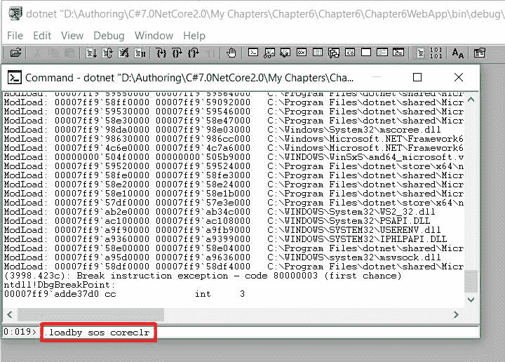
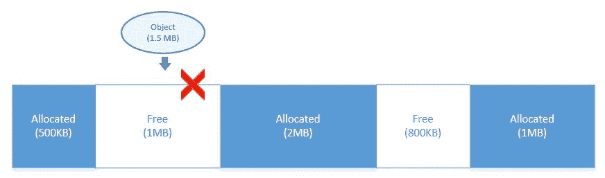
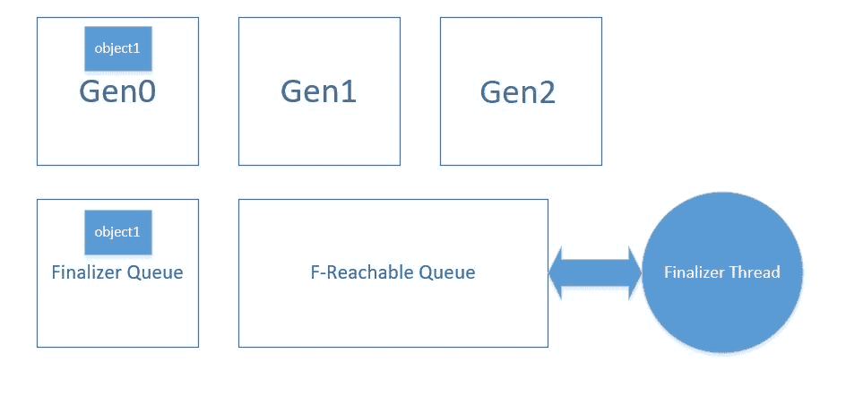

# 六、.NETCore 中的内存管理技术

内存管理会显著影响任何应用的性能。当应用运行时.NET CLR(公共语言运行时)在内存中分配许多对象，它们会一直保留在内存中，直到不需要它们，直到创建新对象并分配空间，或者直到 GC 运行(就像它偶尔做的那样)来释放未使用的对象并为其他对象腾出更多空间。大部分工作是由垃圾收集器自己完成的，垃圾收集器智能地运行，并通过移除那些不需要的对象来为对象释放空间。但是，有一些做法可以帮助任何应用避免性能问题并平稳运行。

在[第二章](2.html# 1O8H60-84c100e6bea3438e8844d99ae7f5dfa9)*了解.NETCore内部和测量性能*，我们已经了解了垃圾收集是如何工作的，以及如何在. NET 中维护世代。在这一章中，我们将重点介绍一些推荐的最佳实践和模式，它们可以避免内存泄漏，并使应用具有高性能。

以下是我们将学习的主题:

*   内存分配过程概述
*   通过 SOS 调试分析内存
*   内存碎片
*   避免终结器
*   处置中对象的最佳实践。净核心

# 内存分配过程概述

内存分配是应用运行时在内存中分配对象的过程。这是由**公共语言运行时** ( **CLR** )完成的。当对象初始化时(使用`new`关键字)，垃圾收集器检查生成是否达到阈值，并执行垃圾收集。这意味着当系统内存达到其极限时，将调用垃圾收集。当一个应用运行时，垃圾收集寄存器本身会收到一个关于系统内存的事件通知，当系统达到其特定限制时，它会调用垃圾收集。

另一方面，我们也可以使用`GC.Collect`方法以编程方式调用 GC。但是，由于垃圾收集是一种经过高度微调的算法，并且会根据内存分配模式自动运行，因此显式调用它会影响性能，因此强烈建议您不要在生产中使用它。

# 通过中的 SOS 调试器分析 CLR 内部。净核心

SOS 是 Windows 附带的调试扩展，也适用于 Linux。这有助于调试.NET Core 应用，方法是提供关于 CLR 内部的信息，尤其是内存分配、创建的对象数量以及关于 CLR 的其他细节。我们可以在中使用紧急呼救分机.NET Core 来调试本机代码，这是每个平台特有的。

To install the SOS extension for Windows, install the **Windows Driver Kit** (**WDK**) from [https://developer.microsoft.com/en-us/windows/hardware/download-kits-windows-hardware-development.](https://developer.microsoft.com/en-us/windows/hardware/download-kits-windows-hardware-development)

当安装了 Windows 驱动程序工具包后，我们可以使用各种命令来分析关于应用的 CLR 内部，并识别哪些对象占用了堆中最多的内存，并对它们进行相应的优化。

正如我们所知.NET Core，没有生成可执行文件，我们可以使用 *dotnet cli* 命令来执行.NETCore应用。运行.NETCore应用如下:

*   `dotnet run`
*   `dotnet applicationpath/applicationname.dll`

我们可以运行上述任一命令来运行.NETCore应用。在 ASP.NETCore应用的情况下，我们可以转到应用文件夹的根目录，在那里存在`Views`、`wwwroot`、`Models`、`Controllers`等文件，并运行以下命令:


另一方面，调试工具通常需要`.exe`文件或进程 ID 来转储与 CLR 内部相关的信息。要运行 SOS 调试器，我们可以转到安装 Windows 驱动工具包的路径(目录路径将为`{driveletter}:Program Files (x86)Windows Kits10Debuggersx64`)并运行以下命令:

```cs
windbg dotnet {application path}
```

下面是一个截图，展示了如何使用`windbg`命令运行 ASP.NETCore应用:


运行上述命令后，它将打开 Windbg 窗口和调试器，如下所示:


您可以通过单击调试|中断并运行`SOS`命令加载有关的信息来停止调试器.NETCore CLR。

在 Windbg 窗口执行以下命令，点击*进入*:

```cs
.loadby sos coreclr
```

下面的屏幕截图是您可以键入和运行前面命令的界面:



最后，我们可以运行`!DumpHeap`命令来查看对象堆的完整统计信息:


在上一个截图中，如下图所示的前三列分别代表了每种方法的`Address`、`Method`表和`Size`:


使用前面的信息，它提供了按类型对存储在堆上的对象进行分类的统计信息。`MT`是该类型的方法表，`Count`是该类型的实例总数，`TotalSize`是该类型所有实例占用的总内存大小，`Classname`表示占用堆上该空间的实际类型。

我们还可以使用一些命令来获取具体的细节，如下所示:

| **开关** | **命令** | **描述** |
| **统计** | `!DumpHeap -stat` | 仅显示统计详细信息 |
| **类型** | `!DumpHeap -type TypeName` | 显示堆中存储的特定类型的统计信息 |
| **终结队列** | `!FinalizationQueue` | 显示终结器的详细信息 |

这个工具帮助开发人员调查对象是如何在堆上分配的。在一个实际的场景中，我们可以通过在后台运行这个工具并检查特定时间点存储在堆上的对象的详细统计信息，在测试或暂存服务器上运行我们的应用。

# 内存碎片

内存碎片是中性能问题的主要原因之一.NET 应用。当对象被实例化时，它占用内存中的空间，当不需要它时，它被垃圾收集，并且分配的内存块变得可用。当对象相对于该内存段/块中的可用空间分配了更大的空间，并等待直到空间变得可用时，就会出现这种情况。当大部分内存被分配到大量非连续块中时，就会出现内存碎片问题。当较大大小的对象存储或占用较大的内存块，而内存只包含较小的可用空闲块块时，这将导致碎片，并且系统无法在内存中分配该对象。

.NET 维护两种类型的堆，即**小对象堆** ( **SOH** )和**大对象堆** ( **LOH** )。大于 85，000 字节的对象存储在 LOH 中。SOH 和 LOH 的主要区别在于，在 LOH 中，GC 没有进行压缩。压缩是在垃圾收集时完成的过程，其中存储在 SOH 中的对象被移动，以消除可用的较小空闲空间块，并增加可用的总空间，作为一种可以被其他对象使用的大内存块形式，从而减少碎片。然而，在杂合性缺失中，GC 并没有隐含地进行压缩。大型对象存储在 LOH 中，会产生碎片问题。此外，如果我们将 LOH 与 SOH 进行比较，LOH 的压缩成本相当高，并且涉及大量开销，其中 GC 需要两倍的内存空间来移动对象进行碎片整理。这是杂合性丢失没有被垃圾收集器隐式碎片整理的另一个原因。

以下是内存碎片的表示，其中白色块表示未分配的内存空间，后面是已分配的块:


假设一个大小为 1.5 兆字节的对象想要分配一些内存。即使可用内存总量为 1.8 MB，它也找不到任何可用空间。原因是内存碎片:



另一方面，如果对内存进行碎片整理，对象可以很容易地使用可用的空间，并将被分配:


英寸 NET Core，我们可以使用`GCSettings`显式地在 LOH 中执行压缩，如下所示:

```cs
GCSettings.LargeObjectHeapCompactionMode = GCLargeObjectHeapCompactionMode.CompactOnce; 
GC.Collect(); 
```

# 避免终结器

在中使用终结器不是一个好的做法.NETCore应用。使用终结器的对象在内存中停留的时间更长，最终会影响应用的性能。

应用在特定时间点不需要的对象会保留在内存中，以便调用它们的`Finalizer`方法。例如，如果对象在第 0 代中被 GC 认为是死的，它将始终在第 1 代中存活。

英寸 NET Core，CLR 维护一个单独的线程来运行`Finalizer`方法。包含`Finalizer`方法的所有对象都被放入终结队列。应用不再需要的任何对象都被放在 F-可达队列中，然后由专用的终结器线程执行。

下图显示了一个包含`Finalizer`方法的`object1`对象。`Finalizer`方法被放在终结队列中，对象占用第 0 代堆中的内存空间:



当对象不再需要时，它将从第 0 代(第 0 代)移动到第 1 代(第 1 代)，并从终结器队列移动到 F-可达队列 *:*


一旦终结器线程运行了 F-可达队列中的方法，它将被垃圾收集器从内存中移除。

英寸 NET Core 中，终结器可以定义如下:

```cs
public class FileLogger 
{ 
  //Finalizer implementation 
   ~FileLogger() 
  { 
    //dispose objects 
  } 
} 
```

通常，此方法用于处置非托管对象，并包含一些代码。然而，代码可能包含影响性能的错误。例如，我们有三个对象在终结队列中排队，然后终结队列等待终结器线程释放第一个对象，以便处理它们。现在，假设第一个`Finalizer`方法中的一个错误导致了一个问题，并延迟了终结器线程返回和处理其余方法。一段时间后，更多的对象将进入终结队列，等待终结器线程处理，从而影响应用和性能。

处置对象的最佳实践是使用`IDisposable`接口，而不是实现`Finalizer`方法。如果由于某种原因使用`Finalizer`方法，那么也实现`IDisposable`接口并通过调用`GC.SuppressFinalize`方法来抑制终结总是好的。

# 中处理对象的最佳实践。净核心

在上一节中，我们已经了解了.NET Core 是由 GC 自动完成的。尽管如此，在代码中处理对象始终是一种很好的做法，当您使用非托管对象时，强烈建议这样做。在本节中，我们将探索一些最佳实践，这些实践可用于在中编写代码时处置对象.NETCore。

# IDisposable 界面简介

`IDisposable`是一个简单的界面，包含一个`Dispose`方法，不带参数，返回`void`:

```cs
public interface IDisposable 
{ 
  void Dispose(); 
} 
```

它用于释放非托管资源。因此，如果任何类实现了`IDisposable`接口，这意味着该类包含非托管资源，这些资源必须通过调用该类的`Dispose`方法来释放。

# 什么是非托管资源？

任何超出应用边界的资源都被视为非托管资源。它可以是数据库、文件系统、web 服务或类似的资源。为了访问数据库，我们使用托管的.NET API 打开或关闭连接并执行各种命令。但是，与数据库的实际连接不受管理。我们使用托管的文件系统和 web 服务也是如此.NET APIs 与它们交互，但是它们使用后端中不受管理的非托管资源。`IDisposable`界面最适合所有这样的场景。

# 使用 IDisposable

这里有一个简单的`DataManager`类，它使用`System.Data.SQL`应用编程接口在一个 SQL server 数据库上执行数据库操作:

```cs
public class DataManager : IDisposable 
{ 
  private SqlConnection _connection; 

  //Returns the list of users from database 
  public DataTable GetUsers() 
  { 
    //Invoke OpenConnection to instantiate the _connection object 

    OpenConnection(); 

    //Executing command in a using block to dispose command object 
    using(var command =new SqlCommand()) 
    { 
      command.Connection = _connection; 
      command.CommandText = "Select * from Users"; 

      //Executing reader in a using block to dispose reader object 
      using (var reader = command.ExecuteReader()) 
      { 
        var dt = new DataTable(); 
        dt.Load(reader); 
        return dt; 
      } 

    } 
  } 
  private void OpenConnection() 
  { 
    if (_connection == null) 
    { 
      _connection = new SqlConnection(@"Integrated Security=SSPI;
      Persist Security Info=False;Initial Catalog=SampleDB;
      Data Source=.sqlexpress"); 
      _connection.Open(); 
    } 
  } 

  //Disposing _connection object 
  public void Dispose() { 
    Console.WriteLine("Disposing object"); 
    _connection.Close(); 
    _connection.Dispose(); 
  } 
} 
```

在前面的代码中，我们实现了`IDisposable`接口，该接口又实现了`Dispose`方法来清理 SQL 连接对象。我们还调用了连接的`Dispose`方法，它将在管道中链接进程并关闭底层对象。

从调用程序中，我们可以使用`using`块来实例化`DatabaseManager`对象，该对象在调用`GetUsers`方法后调用`Dispose`方法:

```cs
static void Main(string[] args) 
{ 
  using(DataManager manager=new DataManager()) 
  { 
    manager.GetUsers(); 
  } 
} 
```

`using`块是一个 C# 构造，由编译器在`try finally`块中呈现，并调用`finally`块中的`Dispose`方法。这意味着当您使用`using`块时，我们不必显式调用`Dispose`方法。或者，前面的代码也可以用下面的方式编写，这种特殊的代码格式由`using`块内部管理:

```cs
static void Main(string[] args) 
{ 
  DataManager _manager; 
  try 
  { 
    _manager = new DataManager(); 
  } 
  finally 
  { 
    _manager.Dispose(); 
  } 
} 
```

# 何时实现 IDisposable 接口

我们已经知道，每当我们需要释放非托管资源时，都应该使用`IDisposable`接口。然而，在处理物体的处置时，有一个标准规则应该加以考虑。该规则规定，如果类内的实例实现了`IDisposable`接口，我们也应该在消费类上实现`IDisposable`。例如，前面的类`DatabaseManager`类使用`SqlConnection`，其中`SqlConnection`内部实现`IDisposable`接口。为了解决这个规则，我们将实现`IDisposable`接口并调用实例的`Dispose`方法。

这里有一个更好的例子，它从`DatabaseManager Dispose`方法调用`protected Dispose`方法，并传递一个`Boolean`值，指示对象正在被处理。最终，我们将调用`GC.SuppressFinalize`方法，该方法告诉垃圾收集器对象已经被清理，从而防止调用冗余的垃圾收集:

```cs
public void Dispose() { 
  Console.WriteLine("Disposing object"); 
  Dispose(true); 
  GC.SuppressFinalize(this); 
} 
protected virtual void Dispose(Boolean disposing) 
{ 
  if (disposing) 
  { 
    if (_connection != null) 
    { 
      _connection.Close(); 
      _connection.Dispose(); 
      //set _connection to null, so next time it won't hit this block 
      _connection = null; 
    } 
  } 
} 
}
```

我们保留参数化的`Dispose`方法`protected`和`virtual`的原因是，如果子类是从`DatabaseManager`类派生的，那么子类可以覆盖`Dispose`方法并清理自己的资源。这确保了对象树中的每个类都将清理其资源。子类处置自己的资源，在基类上调用`Dispose`等等。

# 终结器和处置

`Finalizer`方法由 GC 调用，而`Dispose`方法必须由开发人员在程序中显式调用。垃圾收集器不知道这个类是否包含一个`Dispose`方法，它需要在对象释放时被调用来清理非托管资源。在这个场景中，我们需要严格清理资源，而不是依赖调用者调用对象的`Dispose`方法，我们应该实现`Finalizer`方法。

以下是实现`Finalizer`方法的`DatabaseManager`类的修改示例:

```cs
public class DataManager : IDisposable 
{ 
  private SqlConnection _connection; 
  //Returns the list of users from database 
  public DataTable GetUsers() 
  { 
    //Invoke OpenConnection to instantiate the _connection object 

    OpenConnection(); 

    //Executing command in a using block to dispose command object 
    using(var command =new SqlCommand()) 
    { 
      command.Connection = _connection; 
      command.CommandText = "Select * from Users"; 

      //Executing reader in a using block to dispose reader object 
      using (var reader = command.ExecuteReader()) 
      { 
        var dt = new DataTable(); 
        dt.Load(reader); 
        return dt; 
      } 
    } 
  } 
  private void OpenConnection() 
  { 
    if (_conn == null) 
    { 
      _connection = new SqlConnection(@"Integrated Security=SSPI;
      Persist Security Info=False;Initial Catalog=SampleDB;
      Data Source=.sqlexpress"); 
      _connection.Open(); 
    } 
  } 

  //Disposing _connection object 
  public void Dispose() { 
    Console.WriteLine("Disposing object"); 
    Dispose(true); 
    GC.SuppressFinalize(this); 
  } 

  private void Dispose(Boolean disposing) 
  { 
    if(disposing) { 
      //clean up any managed resources, if called from the 
      //finalizer, all the managed resources will already 
      //be collected by the GC 
    } 
    if (_connection != null) 
    { 
      _connection.Close(); 
      _connection.Dispose(); 
      //set _connection to null, so next time it won't hit this block 
      _connection = null; 
    } 

  } 

  //Implementing Finalizer 
  ~DataManager(){ 
    Dispose(false); 
  } 
}
```

在前面的代码片段中，我们修改了`Dispose`方法，并使用析构函数语法`~DataManager`添加了终结器。当气相色谱运行时，终结器被调用，并通过传递一个假标志作为布尔参数来调用`Dispose`方法。在`Dispose`方法中，我们将清理`connection`对象。在终结阶段，托管资源已经被垃圾收集器清理掉了，所以`Dispose`方法现在只清理终结器中的非托管资源。但是，开发人员可以通过调用`Dispose`方法并传递一个真标志作为布尔参数来清理托管资源，从而显式地处置对象。

# 摘要

本章的重点是内存管理。我们学习了一些最佳实践以及在. NET 中如何进行内存管理的实际底层过程。我们探索了调试工具，开发人员可以使用该工具来调查对象在堆上的内存分配。我们还学习了内存碎片、终结器，以及如何通过实现`IDisposable`接口实现一个 dispose 模式来清理资源。

在下一章中，我们将创建一个遵循微服务架构的应用。微服务体系结构是一种高性能和可扩展的体系结构，有助于应用轻松扩展。下一章让您全面了解如何按照最佳实践和原则开发应用。