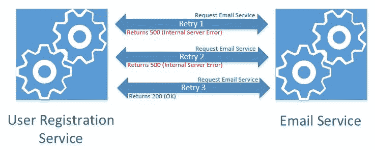
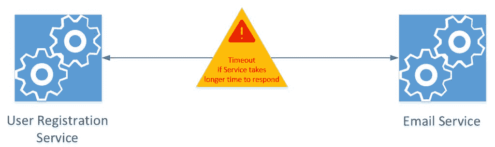
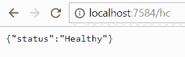
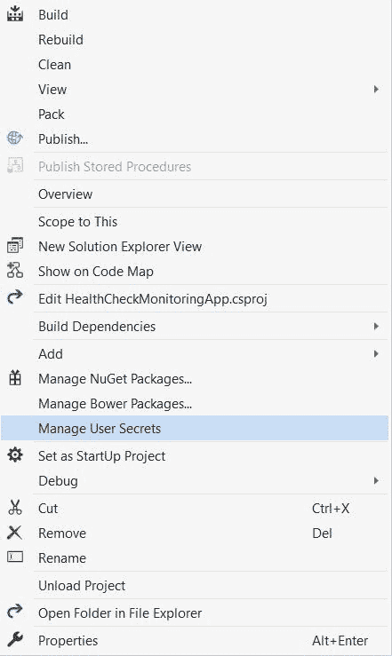
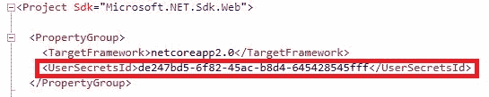
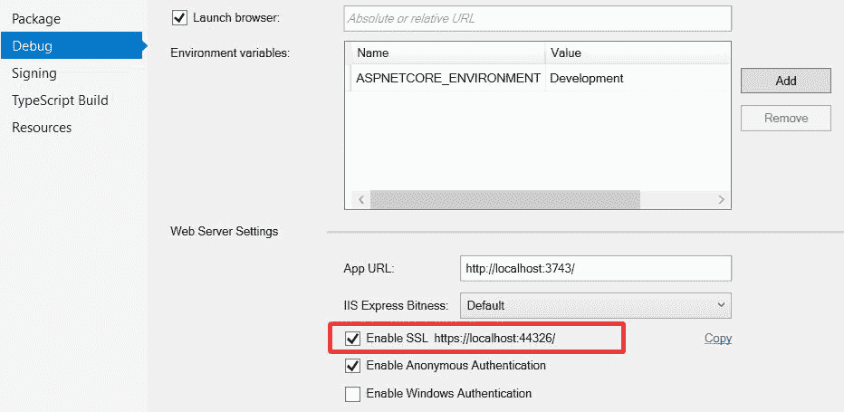
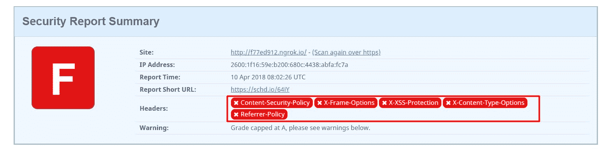
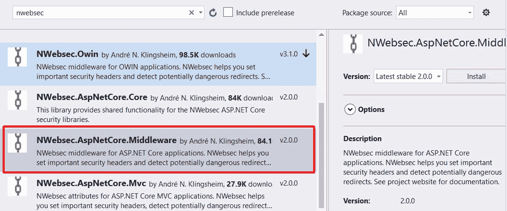
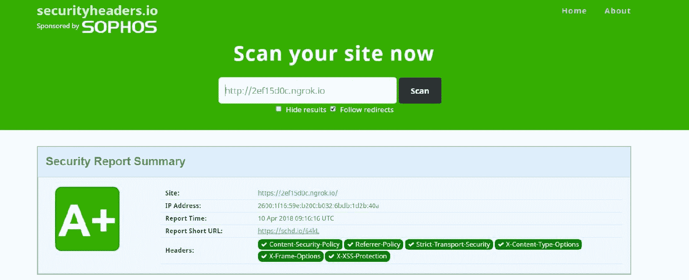
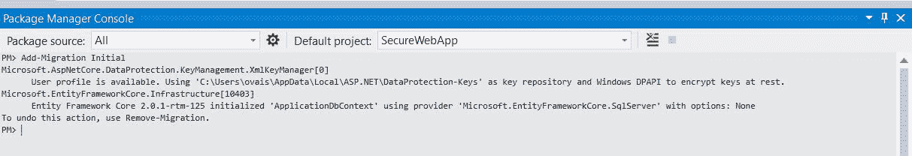

# 在中保护和实施弹性.NETCore应用

安全性和弹性是开发任何规模的应用时都应该考虑的两个重要方面。安全性保护应用的秘密，执行身份验证，并提供对安全内容的授权访问，而弹性则在应用出现故障时保护应用，以便它可以适度降级。弹性使应用高度可用，并允许应用在发生错误或处于故障状态时正常运行。它广泛用于微服务体系结构，其中一个应用被分解成多个服务，每个服务与其他服务通信来执行一个操作。

中有各种可用的技术和库。NET Core，我们可以用它来实现安全性和弹性。在 ASP.NETCore应用中，我们可以使用身份来实现用户身份验证/授权，这是一个流行的 Polly 框架，用于实现断路器、重试模式等模式。

在本章中，我们将研究以下主题:

*   弹性应用介绍
*   实施运行状况检查以监控应用性能
*   在 ASP.NETCore应用中实现重试模式，以便对瞬时故障重试操作
*   实现断路器模式以防止可能失败的呼叫
*   使用身份框架保护 ASP.NETCore应用并实现身份验证和授权
*   使用安全存储来存储应用机密

# 弹性应用介绍

将弹性作为一个重要因素来开发应用，总能让您的客户感到满意。如今，应用本质上是分布式的，涉及大量的有线通信。当服务由于网络故障而关闭或没有及时响应时，就会出现问题，这最终会导致客户端操作终止前的延迟。弹性的目的是使您的应用从故障中恢复，并使其再次响应。

当您调用一个服务，而该服务调用另一个服务时，复杂性会增加，以此类推。在一个长的运营链中，考虑弹性很重要。这就是为什么它是微服务架构中最广泛采用的原则之一。

# 弹性政策

弹性策略分为两类:

*   反应性政策
*   积极的政策

在本章中，我们将使用 Polly 框架来实施被动和主动策略，该框架可用于.NETCore应用。

# 反应性政策

根据被动策略，如果请求在第一次尝试时失败，我们应该立即重试服务请求。为了实现被动策略，我们可以使用以下模式:

*   **重试**:请求失败后立即重试
*   **断路器**:停止所有处于故障状态的服务请求
*   **回退**:如果服务处于故障状态，返回默认响应

# 实现重试模式

重试模式用于多次重试出现故障的服务，以获得响应。它广泛应用于涉及服务之间相互通信的场景，其中一个服务依赖于另一个服务来执行特定的操作。当服务分别托管并通过网络通信时，很可能是通过 HTTP 协议，会出现短暂的故障。

下图显示了两种服务:一种是用户注册服务，它将用户的记录注册并保存在数据库中；另一种是电子邮件服务，它向用户发送确认电子邮件，以便他们可以激活自己的帐户。假设电子邮件服务没有响应。这将返回某种错误，如果实现了重试模式，它将重试请求的次数，如果失败，它将调用电子邮件服务:



**用户注册服务**和**电子邮件服务**是 ASP.NETCore网络应用编程接口项目，用户注册实现重试模式。我们将使用 Polly 框架，将它作为一个 NuGet 包添加到用户注册服务中。要添加 Polly，我们可以从 Visual Studio 中的 NuGet 包管理器控制台窗口执行以下命令:

```cs
Install-Package Polly
```

波利框架基于政策。您可以定义包含与您正在实现的模式相关的特定配置的策略，然后通过调用其`ExecuteAsync`方法来调用该策略。

这里是`UserController`，它包含一个 POST 方法，实现一个重试模式来调用电子邮件服务:

```cs
[Route("api/[controller]")] 
public class UserController : Controller 
{ 

  HttpClient _client; 
  public UserController(HttpClient client) 
  { 
    _client = client; 
  } 

  // POST api/values 
  [HttpPost] 
  public void Post([FromBody]User user) 
  { 

    //Email service URL 
    string emailService = "http://localhost:80/api/Email"; 

    //Serialize user object into JSON string 
    HttpContent content = new StringContent(JsonConvert.SerializeObject(user)); 

    //Setting Content-Type to application/json 
    _client.DefaultRequestHeaders 
    .Accept 
    .Add(new MediaTypeWithQualityHeaderValue("application/json")); 

    int maxRetries = 3; 

    //Define Retry policy and set max retries limit and duration between each retry to 3 seconds 
    var retryPolicy = Policy.Handle<HttpRequestException>().WaitAndRetryAsync(
    maxRetries, sleepDuration=> TimeSpan.FromSeconds(3)); 

    //Call service and wrap HttpClient PostAsync into retry policy 
    retryPolicy.ExecuteAsync(async () => { 
      var response =  _client.PostAsync(emailService, content).Result; 
      response.EnsureSuccessStatusCode(); 
    }); 

  }    
}
```

在前面的代码中，我们使用了`HttpClient`类向电子邮件服务 API 发出 RESTful 请求。`HTTP POST`方法接收包含以下五个属性的用户对象:

```cs
public class User 
{ 
  public string FirstName { get; set; } 
  public string LastName { get; set; } 
  public string EmailAddress { get; set; }  
  public string UserName { get; set; } 
  public string Password { get; set; } 
}  
```

由于请求将以 JSON 格式发送，我们必须将`Content-Type`头值设置为`application/json`。然后，我们必须定义重试策略，以等待并每三秒重试一次操作，最大重试次数为三次。最后，我们调用`ExecuteAsync`方法来调用`client.PostAsync`方法，以便它调用电子邮件服务。

运行前面的示例后，如果电子邮件服务关闭或抛出异常，将重试三次，以尝试获得所需的响应。

# 实施断路器

当调用通过网络通信的服务时，实现重试模式是一种很好的做法。但是，调用机制本身会占用资源和带宽来执行操作并延迟响应。如果服务已经处于故障状态，那么对每个请求重试多次并不总是一个好的做法。这就是断路器发挥作用的地方。

断路器在三种状态下工作，如下图所示:


最初，断路器处于**闭合状态**，这意味着服务之间的通信正在工作，目标远程服务正在响应。如果目标远程服务失败，断路器变为**打开状态**。当状态变为打开时，所有后续请求都无法在特定的指定时间内调用目标远程服务，并将响应直接返回给调用方。一旦时间过去，电路转到**半开状态**，并尝试调用目标远程服务以获得响应。如果成功接收到响应，断路器变回**闭合状态**，或者如果失败，状态变回闭合，并在配置中指定的时间内保持闭合。

为了实现断路器模式，我们将使用相同的 Polly 框架，您可以从 NuGet 包中添加该框架。我们可以如下添加断路器策略:

```cs
var circuitBreakerPolicy = Policy.HandleResult<HttpResponseMessage>(result => !result.IsSuccessStatusCode) 
  .CircuitBreakerAsync(3, TimeSpan.FromSeconds(10), OnBreak, OnReset, OnHalfOpen); 
```

在`Startup`类的`ConfigureServices`方法中添加前面的断路器策略。在`Startup`类中定义它的原因是通过**依赖注入** ( **DI** )将断路器对象作为单例对象注入。因此，所有请求将共享同一个实例，状态将得到适当维护。

在定义断路器策略时，我们将断开电路之前允许的事件数设置为三，这将检查请求失败了多少次，并在达到阈值三时断开电路。它将保持断路器*打开*10 秒钟，然后当时间过去后第一个请求到来时，将状态变为*半开*。

最后，如果远程服务仍然失败，电路状态再次变为*打开*状态；否则，设置为*关闭*。我们还定义了当电路状态改变时调用的`OnBreak`、`OnReset`和`OnHalfOpen`委托。如果需要，我们可以将这些信息记录在数据库或文件系统的某个地方。在`Startup`类中添加这些委托方法:

```cs
private void OnBreak(DelegateResult<HttpResponseMessage> responseMessage, TimeSpan timeSpan) 
{ 
  //Log to file system 
} 
private void OnReset() 
{ 
  //log to file system 
} 
private void OnHalfOpen() 
{ 
  // log to file system 
}
```

现在，我们将在`Startup`类的`ConfigureServices`方法中使用 DI 添加`circuitBreakerPolicy`和`HttpClient`对象:

```cs
services.AddSingleton<HttpClient>(); 
  services.AddSingleton<CircuitBreakerPolicy<HttpResponseMessage>>(circuitBreakerPolgicy);
```

这是我们的`UserController`，它在参数化构造函数中接受`HttpClient`和`CircuitBreakerPolicy`对象:

```cs
public class UserController : Controller 
{ 
  HttpClient _client; 
  CircuitBreakerPolicy<HttpResponseMessage> _circuitBreakerPolicy; 
  public UserController(HttpClient client, 
  CircuitBreakerPolicy<HttpResponseMessage> circuitBreakerPolicy) 
  { 
    _client = client; 
    _circuitBreakerPolicy = circuitBreakerPolicy; 
  } 
} 
```

这是使用断路器策略并调用电子邮件服务的`HTTP POST`方法:

```cs
// POST api/values 
[HttpPost] 
public async Task<IActionResult> Post([FromBody]User user) 
{ 

  //Email service URL 
  string emailService = "http://localhost:80/api/Email"; 

  //Serialize user object into JSON string 
  HttpContent content = new StringContent(JsonConvert.SerializeObject(user)); 

  //Setting Content-Type to application/json 
  _client.DefaultRequestHeaders 
  .Accept 
  .Add(new MediaTypeWithQualityHeaderValue("application/json")); 

  //Execute operation using circuit breaker 
  HttpResponseMessage response = await _circuitBreakerPolicy.ExecuteAsync(() => 
  _client.PostAsync(emailService, content)); 

  //Check if response status code is success 
  if (response.IsSuccessStatusCode) 
  { 
    var result = response.Content.ReadAsStringAsync(); 
    return Ok(result); 
  } 

  //If the response status is not success, it returns the actual state 
  //followed with the response content 
  return StatusCode((int)response.StatusCode, response.Content.ReadAsStringAsync()); 
} 
```

这是经典的断路器例子。Polly 还附带了一个高级断路器，这在您必须根据特定时间内失败请求的百分比来断开电路的情况下更有用。当处理大型应用或一分钟内涉及大量事务的应用时，有 2%到 5%的事务可能会因其他非瞬时故障问题而失败，因此我们不希望电路中断。在这种情况下，我们可以实现高级断路器模式，并在我们的`ConfigureServices`方法中定义策略，如下所示:

```cs
public void ConfigureServices(IServiceCollection services) 
{ 

  var circuitBreakerPolicy = Policy.HandleResult<HttpResponseMessage>(
  result => !result.IsSuccessStatusCode) 
  .AdvancedCircuitBreaker(0.1, TimeSpan.FromSeconds(60),5, TimeSpan.FromSeconds(10), 
  OnBreak, OnReset, OnHalfOpen); 
  services.AddSingleton<HttpClient>(); 
  services.AddSingleton<CircuitBreakerPolicy<HttpResponseMessage>>(circuitBreakerPolicy); 
}
```

`AdvancedCircuitBreakerAsync`方法中的第一个参数包含 0.1 的值，这是在第二个参数中指定的时间范围内失败的请求的百分比，即`60`秒。定义`5`值的第三个参数是在该特定时间内被服务的请求的最小吞吐量，如第二个参数 60 秒中所指定的。最后，第四个参数定义了在任何请求失败时电路保持打开的时间，并在时间过去后尝试再次处理该请求。其他参数只是在每个状态改变时调用的委托方法，这与前面的经典断路器示例相同。

# 重试包装断路器

到目前为止，我们已经学习了如何使用 Polly 框架来使用和实现断路器和重试模式。重试模式用于在请求失败指定时间后重试请求，其中断路器保持电路的状态，并根据失败请求的阈值，使电路断开，并在一段时间内停止调用远程服务，如配置中所指定的，以节省网络带宽。

使用 Polly 框架，我们可以结合使用重试和断路器模式，并且如果重试模式达到失败请求阈值限制的计数，则用重试模式包装断路器以断开电路。

在本节中，我们将开发一个自定义的`HttpClient`类，该类提供`GET`、`POST`、`PUT`和`DELETE`等方法，并使用重试和断路器策略使其具有弹性。

新建`IResilientHttpClient`界面，增加 HTTP `GET`、`POST`、`PUT`、`DELETE`四种方式:

```cs
public interface IResilientHttpClient 
{ 
  HttpResponseMessage Get(string uri); 

  HttpResponseMessage Post<T>(string uri, T item); 

  HttpResponseMessage Delete(string uri); 

  HttpResponseMessage Put<T>(string uri, T item); 
} 
```

现在，创建一个名为`ResilientHttpClient`的新类，实现`IResilientHttpClient`接口。我们将添加一个参数化构造函数来注入断路器策略和一个`HttpClient`对象，该对象将用于发出 HTTP `GET`、`POST`、`PUT`和`DELETE`请求。以下是`ResilientHttpClient`类的构造函数实现:

```cs
public class ResilientHttpClient : IResilientHttpClient 
{ 

  static CircuitBreakerPolicy<HttpResponseMessage> _circuitBreakerPolicy; 
  static Policy<HttpResponseMessage> _retryPolicy; 
  HttpClient _client; 

  public ResilientHttpClient(HttpClient client, 
  CircuitBreakerPolicy<HttpResponseMessage> circuitBreakerPolicy) 
  { 
    _client = client; 
    _client.DefaultRequestHeaders.Accept.Clear(); 
    _client.DefaultRequestHeaders.Accept.Add(
    new MediaTypeWithQualityHeaderValue("application/json")); 

    //circuit breaker policy injected as defined in the Startup class 
    _circuitBreakerPolicy = circuitBreakerPolicy; 

    //Defining retry policy 
    _retryPolicy = Policy.HandleResult<HttpResponseMessage>(x => 
    { 
      var result = !x.IsSuccessStatusCode; 
      return result; 
    })
    //Retry 3 times and for each retry wait for 3 seconds 
    .WaitAndRetry(3, sleepDuration => TimeSpan.FromSeconds(3)); 

  } 
} 
```

在前面的代码中，我们已经定义了`CircuitBreakerPolicy<HttpResponseMessage>`和`HttpClient`对象，它们是通过 DI 注入的。我们已经定义了重试策略，并将重试阈值设置为三次，每次重试将等待三秒钟，然后再调用服务。

接下来，我们将创建`ExecuteWithRetryandCircuitBreaker`方法，该方法采用一个 URI 函数和一个委托函数，这些函数将在重试和断路器策略中执行。以下是`ExecuteWithRetryandCircuitBreaker`方法的代码片段:

```cs
//Wrap function body in Retry and Circuit breaker policies 
public HttpResponseMessage ExecuteWithRetryandCircuitBreaker(string uri, Func<HttpResponseMessage> func) 
{ 

  var res = _retryPolicy.Wrap(_circuitBreakerPolicy).Execute(() => func()); 
  return res; 
} 
```

我们将从 GET、POST、PUT 和 DELETE 实现中调用这个方法，并定义将在重试和断路器策略中执行的代码。

下面分别是 GET、POST、PUT 和 DELETE 方法的实现:

```cs
public HttpResponseMessage Get(string uri) 
{ 
  //Invoke ExecuteWithRetryandCircuitBreaker method that wraps the code 
  //with retry and circuit breaker policies 
  return ExecuteWithRetryandCircuitBreaker(uri, () => 
  { 
    try 
    { 
      var requestMessage = new HttpRequestMessage(HttpMethod.Get, uri); 
      var response = _client.SendAsync(requestMessage).Result; 
      return response; 
    }
    catch(Exception ex) 
    { 
      //Handle exception and return InternalServerError as response code 
      HttpResponseMessage res = new HttpResponseMessage(); 
      res.StatusCode = HttpStatusCode.InternalServerError;   
      return res; 
    } 
  }); 
} 

//To do HTTP POST request 
public HttpResponseMessage Post<T>(string uri, T item) 
{ 
  //Invoke ExecuteWithRetryandCircuitBreaker method that wraps the code 
  //with retry and circuit breaker policies 
  return ExecuteWithRetryandCircuitBreaker(uri, () => 
  { 
    try 
    { 
      var requestMessage = new HttpRequestMessage(HttpMethod.Post, uri); 

      requestMessage.Content = new StringContent(JsonConvert.SerializeObject(item), 
      System.Text.Encoding.UTF8, "application/json"); 

      var response = _client.SendAsync(requestMessage).Result; 

      return response; 

    }catch (Exception ex) 
    { 
      //Handle exception and return InternalServerError as response code 
      HttpResponseMessage res = new HttpResponseMessage(); 
      res.StatusCode = HttpStatusCode.InternalServerError; 
      return res; 
    } 
  }); 
} 

//To do HTTP PUT request 
public HttpResponseMessage Put<T>(string uri, T item) 
{ 
  //Invoke ExecuteWithRetryandCircuitBreaker method that wraps 
  //the code with retry and circuit breaker policies 
  return ExecuteWithRetryandCircuitBreaker(uri, () => 
  { 
    try 
    { 
      var requestMessage = new HttpRequestMessage(HttpMethod.Put, uri); 

      requestMessage.Content = new StringContent(JsonConvert.SerializeObject(item), 
      System.Text.Encoding.UTF8, "application/json"); 

      var response = _client.SendAsync(requestMessage).Result; 

      return response; 
    } 
    catch (Exception ex) 
    { 
    //Handle exception and return InternalServerError as response code 
    HttpResponseMessage res = new HttpResponseMessage(); 
    res.StatusCode = HttpStatusCode.InternalServerError; 
    return res; 
    } 

  }); 
} 

//To do HTTP DELETE request 
public HttpResponseMessage Delete(string uri) 
{ 
  //Invoke ExecuteWithRetryandCircuitBreaker method that wraps the code 
  //with retry and circuit breaker policies 
  return ExecuteWithRetryandCircuitBreaker(uri, () => 
  { 
    try 
    { 
      var requestMessage = new HttpRequestMessage(HttpMethod.Delete, uri); 

      var response = _client.SendAsync(requestMessage).Result; 

      return response; 

    } 
    catch (Exception ex) 
    { 
      //Handle exception and return InternalServerError as response code 
      HttpResponseMessage res = new HttpResponseMessage(); 
      res.StatusCode = HttpStatusCode.InternalServerError; 
      return res; 
    } 
  }); 

} 
```

最后，在我们的启动类中，我们将如下添加依赖项:

```cs
public void ConfigureServices(IServiceCollection services) 
{ 

  var circuitBreakerPolicy = Policy.HandleResult<HttpResponseMessage>(x=> { 
    var result = !x.IsSuccessStatusCode; 
    return result; 
  }) 
  .CircuitBreaker(3, TimeSpan.FromSeconds(60), OnBreak, OnReset, OnHalfOpen); 

   services.AddSingleton<HttpClient>(); 
   services.AddSingleton<CircuitBreakerPolicy<HttpResponseMessage>>(circuitBreakerPolicy); 

   services.AddSingleton<IResilientHttpClient, ResilientHttpClient>(); 
   services.AddMvc(); 
   services.AddSwaggerGen(c => 
   { 
     c.SwaggerDoc("v1", new Info { Title = "User Service", Version = "v1" }); 
   }); 
 } 
```

在我们的`UserController`类中，可以通过 DI 注入我们自定义的`ResilientHttpClient`对象，修改 POST 方法，如下图所示:

```cs
[Route("api/[controller]")] 
public class UserController : Controller 
{ 

  IResilientHttpClient _resilientClient; 

  HttpClient _client; 
  CircuitBreakerPolicy<HttpResponseMessage> _circuitBreakerPolicy; 
  public UserController(HttpClient client, IResilientHttpClient resilientClient) 
  { 
    _client = client; 
    _resilientClient = resilientClient; 

  } 

  // POST api/values 
  [HttpPost] 
  public async Task<IActionResult> Post([FromBody]User user) 
  { 

    //Email service URL 
    string emailService = "http://localhost:80/api/Email"; 

    var response = _resilientClient.Post(emailService, user); 
    if (response.IsSuccessStatusCode) 
    { 
      var result = response.Content.ReadAsStringAsync(); 
      return Ok(result); 
    } 

    return StatusCode((int)response.StatusCode, response.Content.ReadAsStringAsync()); 

  } 
} 
```

通过这种实现，当应用启动时，电路将最初闭合。当向`EmailService`发出请求时，如果服务没有响应，它将尝试调用服务三次，每次请求等待三秒钟。如果服务没有响应，电路将断开，对于所有后续请求，将停止调用电子邮件服务，并将在 60 秒内将异常返回给用户，如断路器策略中所指定的。60 秒后，将向`EmailService`发出下一个请求，断路器状态将变为半开。如果它响应，电路状态再次变为闭合；否则，它将在接下来的 60 秒内保持打开状态。

# 带有断路器的回退策略，然后重试

Polly 还提供了一个回退策略，如果服务失败，它会返回一些默认响应。它可以与重试和断路器策略结合使用。后退背后的基本思想是向消费者发送默认响应，而不是在响应中返回实际错误。响应应该向用户提供一些特定于应用性质的有意义的信息。当您的服务被应用的外部消费者使用时，这是非常有益的。

我们可以修改前面的示例，并为重试和断路器例外添加回退策略。在`ResilientHttpClient`类中，我们将添加这两个变量:

```cs
static FallbackPolicy<HttpResponseMessage> _fallbackPolicy; 
static FallbackPolicy<HttpResponseMessage> _fallbackCircuitBreakerPolicy; 
```

接下来，我们添加断路器策略来处理断路器异常，并返回带有自定义内容消息的`HttpResponseMessage`。在`ResilientHttpClient`类的参数化构造函数中添加以下代码:

```cs
_fallbackCircuitBreakerPolicy = Policy<HttpResponseMessage> 
.Handle<BrokenCircuitException>() 
.Fallback(new HttpResponseMessage(HttpStatusCode.OK) 
  { 
    Content = new StringContent("Please try again later[Circuit breaker is Open]") 
  } 
);
```

然后，我们将添加另一个回退策略，它将包装断路器以处理任何其他非断路器异常的异常:

```cs
_fallbackPolicy = Policy.HandleResult<HttpResponseMessage>(r => r.StatusCode == HttpStatusCode.InternalServerError) 
.Fallback(new HttpResponseMessage(HttpStatusCode.OK) { 
  Content = new StringContent("Some error occured") 
}); 

```

最后，我们将修改`ExecuteWithRetryandCircuitBreaker`方法，并将重试和断路器策略包装在回退策略中，这将向用户返回带有 200 状态代码的一般消息:

```cs
public HttpResponseMessage ExecuteWithRetryandCircuitBreaker(string uri, Func<HttpResponseMessage> func) 
{ 

  PolicyWrap<HttpResponseMessage> resiliencePolicyWrap = 
  Policy.Wrap(_retryPolicy, _circuitBreakerPolicy); 

  PolicyWrap<HttpResponseMessage> fallbackPolicyWrap = 
  _fallbackPolicy.Wrap(_fallbackCircuitBreakerPolicy.Wrap(resiliencePolicyWrap)); 

  var res = fallbackPolicyWrap.Execute(() => func()); 
  return res; 
}
```

通过这种实现，用户将不会在响应中得到任何错误。内容包含实际错误，如下图所示，取自 Fiddler:


# 积极的政策

根据主动策略，如果请求导致失败，我们应该主动响应请求。我们可以使用超时、缓存和运行状况检查等技术来主动监控应用性能，并在出现故障时主动做出响应。

*   **超时**:如果一个请求花费的时间超过了通常的时间，它将结束该请求
*   **缓存**:缓存之前的响应，并将其用于未来的请求
*   **运行状况检查**:监控应用的性能，并在出现故障时调用警报

# 实现超时

超时是一种主动策略，适用于目标服务需要很长时间才能响应的场景，我们不会让客户端等待响应，而是返回一条一般消息或响应。我们可以使用相同的 Polly 框架来定义超时策略，它也可以与我们之前学习的重试和断路器模式结合使用:



在上图中，用户注册服务正在调用电子邮件服务来发送电子邮件。现在，如果电子邮件服务在超时策略中指定的特定时间内没有响应，将引发超时异常。

要添加超时策略，请在`ResilientHttpClient`类中声明一个`_timeoutPolicy`变量:

```cs
static TimeoutPolicy<HttpResponseMessage> _timeoutPolicy; 
```

然后，添加以下代码来初始化超时策略:

```cs
_timeoutPolicy = Policy.Timeout<HttpResponseMessage>(1); 
```

最后，我们将包装超时策略并将其添加到`resiliencyPolicyWrap`中。以下是`ExecuteWithRetryandCircuitBreaker`方法的修改代码:

```cs
public HttpResponseMessage ExecuteWithRetryandCircuitBreaker(string uri, Func<HttpResponseMessage> func) 
{ 

  PolicyWrap<HttpResponseMessage> resiliencePolicyWrap = 
  Policy.Wrap(_timeoutPolicy, _retryPolicy, _circuitBreakerPolicy); 

  PolicyWrap<HttpResponseMessage> fallbackPolicyWrap = 
  _fallbackPolicy.Wrap(_fallbackCircuitBreakerPolicy.Wrap(resiliencePolicyWrap)); 

  var res = fallbackPolicyWrap.Execute(() => func()); 
  return res; 
} 
```

# 实现缓存

当发出 web 请求或调用远程服务时，Polly 可以用来缓存来自远程服务的响应，并提高应用响应时间的性能。Polly 缓存分为两个缓存，即内存缓存和分布式缓存。我们将在本节中配置内存缓存。

首先，我们需要从 NuGet 添加另一个`Polly.Caching.MemoryCache`包。添加后，我们将修改我们的`Startup`类，并将`IPolicyRegistry`添加为成员变量:

```cs
private IPolicyRegistry<string> _registry; 
```

在`ConfigurationServices`方法中，我们将初始化注册表，并通过 DI 将其添加为单例对象:

```cs
_registry = new PolicyRegistry();
services.AddSingleton(_registry);
```

在 configure 方法中，我们将定义缓存策略，该策略使用缓存提供程序和缓存响应的时间。由于我们使用内存缓存，我们将初始化内存缓存提供程序，并在策略中指定如下:

```cs
Polly.Caching.MemoryCache.MemoryCacheProvider memoryCacheProvider = new MemoryCacheProvider(memoryCache); 

CachePolicy<HttpResponseMessage> cachePolicy = Policy.Cache<HttpResponseMessage>(memoryCacheProvider, TimeSpan.FromMinutes(10)); 
```

最后，我们将把`cachepolicy`添加到我们的注册表中，它是在`ConfigurationServices`方法中初始化的。我们将我们的注册地命名为`cache`T3:

```cs
_registry.Add("cache", cachePolicy); 
```

修改我们的`UserController`类并声明通用的`CachePolicy`如下:

```cs
CachePolicy<HttpResponseMessage> _cachePolicy;
```

我们现在将修改我们的`UserController`构造函数并添加注册表，该注册表将通过 DI 注入。该注册表对象用于获取`Configure`方法中定义的缓存。

以下是`UserController`类的修改后的构造函数:

```cs
public UserController(HttpClient client, IResilientHttpClient resilientClient, IPolicyRegistry<string> registry) 
{ 
  _client = client; 
  // _circuitBreakerPolicy = circuitBreakerPolicy; 
  _resilientClient = resilientClient; 

  _cachePolicy = registry.Get<CachePolicy<HttpResponseMessage>>("cache"); 
} 
```

最后，我们将定义一个`GET`方法，该方法调用另一个服务来获取用户列表并将其缓存在内存中。为了缓存响应，我们将使用缓存策略的`Execute`方法包装我们的自定义弹性客户端 GET 方法，如下所示:

```cs
[HttpGet] 
public async Task<IActionResult> Get() 
{ 
  //Specify the name of the Response. If the method is taking    
  //parameter, we can append the actual parameter to cache unique 
  //responses separately 
  Context policyExecutionContext = new Context($"GetUsers"); 

  var response = _cachePolicy.Execute(()=>   
  _resilientClient.Get("http://localhost:7637/api/users"), policyExecutionContext); 
  if (response.IsSuccessStatusCode) 
  { 
    var result = response.Content.ReadAsStringAsync(); 
    return Ok(result); 
  } 

  return StatusCode((int)response.StatusCode, response.Content.ReadAsStringAsync()); 
}
```

当请求返回时，它将检查缓存上下文是空的还是过期的，并且该请求将被缓存 10 分钟。在此期间，所有后续请求都将从内存缓存存储中读取响应。一旦缓存过期，根据设置的时间限制，它将再次调用远程服务并缓存响应。

# 实施健康检查

健康检查是主动策略的一部分，可以及时监控服务的健康状况。它们还允许您在任何服务没有响应或处于故障状态时主动采取措施。

在 ASP.NETCore中，我们可以通过使用`HealthChecks`库轻松实现健康检查，该库以 NuGet 包的形式提供。要使用`HealthChecks`，我们只需将以下 NuGet 包添加到我们的 ASP.NETCore MVC 或网络应用编程接口项目中:

```cs
Microsoft.AspNetCore.HealthChecks
```

我们必须将这个包添加到监控服务的应用以及需要监控其健康状况的服务中。

在用于检查服务运行状况的应用的`Startup`类的`ConfigureServices`方法中添加以下代码:

```cs
services.AddHealthChecks(checks => 
{ 
  checks.AddUrlCheck(Configuration["UserServiceURL"]); 
  checks.AddUrlCheck(Configuration["EmailServiceURL"]); 
}); 
```

在前面的代码中，我们添加了两个服务端点来检查运行状况。这些端点在`appsettings.json`文件中定义。

运行状况检查库使用`AddUrlCheck`方法检查指定服务的运行状况。但是，其运行状况需要由外部应用或服务监控的服务需要在`Startup`类中进行一些修改。我们必须向所有服务添加以下代码片段，以返回它们的健康状态:

```cs
services.AddHealthChecks(checks => 
{ 
  checks.AddValueTaskCheck("HTTP Endpoint", () => new 
  ValueTask<IHealthCheckResult>(HealthCheckResult.Healthy("Ok"))); 
});
```

如果他们的健康状况良好，服务正在响应，它将返回`Ok`。

最后，我们可以在监控应用中添加 URI，它将触发健康检查中间件来检查服务的健康并显示健康状态。我们必须添加`UseHealthChecks`并指定用于触发服务健康状态的端点:

```cs
public static IWebHost BuildWebHost(string[] args) => 
WebHost.CreateDefaultBuilder(args) 
.UseHealthChecks("/hc") 
.UseStartup<Startup>() 
.Build(); 
```

当我们运行我们的监控应用并访问 URI 时，例如，`http://{base_address}/hc`获取健康状态，如果所有服务都处于工作状态，我们应该会看到以下响应:



# 使用应用机密存储敏感信息

每个应用都有一些保存敏感信息的配置，例如数据库连接字符串、某些第三方提供者的密钥以及通常存储在配置文件或数据库中的其他敏感信息。保护所有敏感信息以保护这些资源免受入侵者的攻击总是一个更好的选择。Web 应用通常托管在服务器上，只需导航到服务器的路径并访问文件就可以读取这些信息，即使服务器始终具有受保护的访问权限，并且只有授权用户才有资格访问数据。然而，以纯文本形式保存信息并不是一种好的做法。

英寸 NET Core，我们可以使用秘密管理器工具来保护应用的敏感信息。秘密管理器工具允许您将信息存储在`secrets.json`文件中，该文件不存储在应用文件夹本身中。相反，该文件保存在不同平台的以下路径中:

```cs
Windows: %APPDATA%microsoftUserSecrets{userSecretsId}secrets.json
Linux: ~/.microsoft/usersecrets/{userSecretsId}/secrets.json
Mac: ~/.microsoft/usersecrets/{userSecretsId}/secrets.json
```

`{userSecretId}`是与您的应用相关联的唯一标识(GUID)。由于该文件保存在单独的路径中，每个开发人员必须在`UserSecrets`目录下自己的目录中定义或创建该文件。这限制了开发人员为源代码管理签入同一个文件，并使信息对每个用户都是独立的。在某些情况下，开发人员使用自己的帐户凭据进行数据库身份验证，这样有助于将某些信息与其他信息隔离开来。

在 Visual Studio 中，我们可以通过右键单击项目并选择管理用户机密选项来简单地添加`secrets.json`文件，如下所示:



当您选择管理用户机密时，Visual Studio 会创建一个`secrets.json`文件，并在 Visual Studio 中打开它，以 JSON 格式添加配置设置。如果打开项目文件，您会看到存储在项目文件中的`UserSecretsId`条目:



所以，如果不小心关闭了`secrets.json`文件，可以从`UserSecretsId`所在的路径打开`secrets.json`文件，该路径是用户机密路径内的子文件夹，如前面的截图所示。

以下是包含日志信息、远程服务网址和连接字符串的`secrets.json`文件的示例内容:

```cs
{ 
  "Logging": { 
    "IncludeScopes": false, 
    "Debug": { 
      "LogLevel": { 
        "Default": "Warning" 
      } 
    }, 
    "Console": { 
      "LogLevel": { 
        "Default": "Warning" 
      } 
    } 
  }, 
  "EmailServiceURL": "http://localhost:6670/api/values", 
  "UserServiceURL": "http://localhost:6546/api/user", 
  "ConnectionString": "Server=OVAISPC\sqlexpress;Database=FraymsVendorDB;
  User Id=sa;Password=P@ssw0rd;" 
} 

```

要在 ASP.NETCore应用中访问它，我们可以在我们的`Startup`类中添加以下名称空间:

```cs
using Microsoft.Extensions.Configuration;
```

然后，注入`IConfiguration`对象并将其分配给`Configuration`属性:

```cs
public Startup(IConfiguration configuration) 
{ 
  Configuration = configuration; 
} 
public IConfiguration Configuration { get; } 
```

最后，我们可以使用`Configuration`对象访问变量，如下所示:

```cs
var UserServicesURL = Configuration["UserServiceURL"] 
services.AddEntityFrameworkSqlServer() 
.AddDbContext<VendorDBContext>(options => 
{ 
  options.UseSqlServer(Configuration["ConnectionString"], 
  sqlServerOptionsAction: sqlOptions => 
  { 
    sqlOptions.MigrationsAssembly(typeof(Startup)
    .GetTypeInfo().Assembly.GetName().Name); 
    sqlOptions.EnableRetryOnFailure(maxRetryCount: 10, 
    maxRetryDelay: TimeSpan.FromSeconds(30), errorNumbersToAdd: null); 
  }); 
}, ServiceLifetime.Scoped 
); 
} 
```

# 保护 ASP.NETCore原料药

保护 web 应用是任何企业级应用的一个重要里程碑，不仅可以保护数据，还可以保护数据免受恶意站点的不同攻击。

对于任何 web 应用来说，安全性都是一个重要因素，这种情况有多种:

*   通过网络发送的信息包含敏感信息。
*   API 是公开的，由用户用来执行批量操作。
*   API 托管在服务器上，用户可以使用一些工具进行数据包嗅探和读取敏感数据。

为了应对上述挑战并保护我们的应用，我们应该考虑以下选项:

# 安全套接字层

在传输或网络级别增加安全性，当数据从客户端发送到服务器时，应该对其进行加密。 **SSL** ( **安全套接字层**)是保护通过网络发送的信息的推荐方式。在 web 应用中使用 SSL 来加密从客户端浏览器通过网络发送到服务器的所有数据，在服务器级别对这些数据进行解密。显然，这看起来像是一个性能开销，但由于当今世界我们拥有的服务器资源的规格，这似乎可以忽略不计。

# 在 ASP.NETCore应用中启用 SSL

为了在我们的 ASP.NETCore项目中启用 SSL，我们可以在我们的`Startup`类的`ConfigureServices`方法中定义的`AddMvc`方法中添加过滤器。过滤器用于过滤 HTTP 调用并采取某些操作:

```cs
services.AddMvc(options => 
{ 
  options.Filters.Add(new RequireHttpsAttribute()) 
}); 
```

在`AddMvc`方法中添加的过滤器是全局过滤器，中断所有的 HTTP 请求，而不考虑特定的控制器或动作。我们添加了`RequireHttpsAttribute`过滤器，它验证传入的请求，并检查该请求是在 HTTP 上还是在 HTTPS 上。如果请求是在 HTTP 上，它会自动将请求重定向到 HTTPS，并使用默认端口，在 HTTPS 的情况下是`443`。添加前面的代码片段不足以在 SSL 上运行我们的应用。我们还需要告诉`launchSettings.json`文件使用 HTTPS 端口并为我们的项目启用 SSL。一种方法是从 Visual Studio 项目属性窗口的“调试”选项卡中启用 SSL，如下所示:



这也修改了`launchSettings.json`文件并添加了 SSL。另一种方法是直接从`launchSetttings.json`文件本身修改端口号。这里是`launchsettings.json`文件，使用端口`44326`进行 SSL，已经添加到`iisSettings` *:* 下

```cs
{ 
  "iisSettings": { 
    "windowsAuthentication": false, 
    "anonymousAuthentication": true, 
    "iisExpress": { 
      "applicationUrl": "http://localhost:3743/", 
      "sslPort": 44326 
    } 
  }, 
```

前面代码中显示的默认 HTTP 端口被设置为`*3743*`。如同在`AddMvc`中间件中一样，我们已经指定了一个过滤器来对所有传入的请求使用 SSL。它将自动重定向到 HTTPS 并使用港口`44326`。

要在 IIS 上托管 ASP.NETCore，请参考以下链接。网站启动并运行后，可以通过 IIS 中的站点绑定选项添加 HTTPS 绑定:[https://docs . Microsoft . com/en-us/aspnet/core/host-and-deploy/IIS/index？tab = aspnetcore2x](https://docs.microsoft.com/en-us/aspnet/core/host-and-deploy/iis/index?tabs=aspnetcore2x)

# 防止 CSRF(跨站点请求伪造)攻击

CSRF 攻击是一种代表经过身份验证的用户在 web 应用上执行未经请求的操作的攻击。由于攻击者无法伪造请求的响应，因此它主要涉及`HTTP POST`、`PUT`和`DELETE`方法，这些方法用于修改服务器上的插入、更新或删除数据。

ASP.NETCore提供了一个内置令牌来防止 CSRF 攻击，你可以在`Startup`类的`ConfigureServices`方法中添加 MVC 的同时添加`ValidateAntiForgeryTokenAttribute`过滤器来自己完成。以下是向您的 ASP.NETCore应用全局添加防伪造令牌的代码:

```cs
public void ConfigureServices(IServiceCollection services)
{
services.AddMvc(options => { options.Filters.Add(new ValidateAntiForgeryTokenAttribute()); });
 }
```

或者，我们也可以在具体的控制器动作方式上增加`ValidateAntyForgeryToken`。在这种情况下，我们不需要在`Startup`类的`ConfigureServices`方法中添加`ValidateAntiForgeryTokenAttribute`过滤器。以下是保护`HTTP POST`行动方法免受 CSRF 攻击的代码:

```cs
[HttpPost]

[ValidateAntiForgeryToken]
public async Task<IActionResult> Submit()
{
  return View();
}
CORS (Cross Origin Security)
```

第二个选项是为认证的源、头和方法启用`CORS (Cross-Origin Security)`。设置 CORS 允许您的 API 只能从已配置的源访问。在 ASP.NETCore中，可以通过添加中间件和定义其策略来轻松设置 CORS。

`ValidateAntiForgery`属性告诉 ASP.NETCore将令牌放在表单中，当它被提交时，它会验证并确保令牌有效。这通过为每个`HTTP POST`、`PUT`和其他 HTTP 请求验证令牌来防止您的应用受到 CSRF 攻击，并防止表单被恶意发布。

# 加强安全标头

许多现代浏览器提供了额外的安全功能。如果响应包含这些标题，则运行您的站点的浏览器会自动启用这些安全功能。在本节中，我们将讨论如何在我们的 ASP.NETCore应用中添加这些标题，并在浏览器中启用额外的安全性。

为了调查我们的应用中缺少哪些标题，我们可以使用 [www。SecurityHeaders.io](http://www.SecurityHeaders.io) 网站。然而，为了使用这个，我们需要我们的网站在互联网上公开。

或者，我们可以使用`ngrok`建立一个到本地应用的 HTTP 隧道，这使得我们的网站可以从互联网访问。`ngrok`工具可从以下链接下载:[https://ngrok.com/download](https://ngrok.com/download)。

您可以选择您拥有的操作系统版本，并相应地下载特定的安装程序。

一旦`ngrok`安装完毕，就可以打开并运行以下命令。请注意，在执行以下命令之前，您的站点应该在本地运行:

```cs
ngrok http -host-header localhost 7204
```

您可以将`localhost`替换为您的服务器 IP，并将`7204`替换为您的应用正在监听的端口。

运行前面的命令将生成公共网址，如`Forwarding`属性中所指定的，如下所示:


我们现在可以在 [www.securityheaders.io](http://www.securityheaders.io) 中使用这个公共 URL，它会扫描我们的网站并给出结果。它对网站进行了分类，并提供了一个从 A 到 F 的字母表，其中 A 是一个优秀的分数，这意味着该网站包含所有的安全头，F 意味着该网站不安全，不包含安全头。扫描默认模板生成的默认 ASP.NETCore网站得分为 F，如下所示。它还显示了丢失的标题，用红色方框表示:



首先，我们应该在我们的网站上启用 HTTPS。要启用 HTTPS，请参考与 SSL 相关的部分。接下来，我们将从 NuGet 添加`NWebsec.AspNetCore.Middleware`包，如下所示:



NWebsec 附带了各种中间件，可以从`Startup`类的`Configure`方法添加到我们的应用中。

# 添加 HTTP 严格传输安全头

严格的传输安全报头是一个出色的特性，它通过获取用户代理并强制其使用 HTTPS 来加强 **TLS** ( **传输级安全**)的实施。我们可以通过在`Startup`类的`Configure`方法中添加以下中间件来添加严格的传输安全头:

```cs
app.UseHsts(options => options.MaxAge(days:365).IncludeSubdomains());
```

这个中间件加强了你的站点，因此它只能在 HTTPS 访问一年。这也适用于子域。

# 添加 X-内容-类型-选项标题

该标题阻止浏览器尝试`MIME-sniff`内容类型，并强制其坚持声明的内容类型。我们可以在`Startup`类的`Configure`方法中如下添加这个中间件:

```cs
app.UseXContentTypeOptions();
```

# 添加 X 帧选项标题

此标题允许浏览器保护您的站点不被呈现在框架内。通过使用下面的中间件，我们可以防止我们的站点被诬陷，这样我们就可以防御不同的攻击，其中最著名的就是 clickjacking:

```cs
app.UseXfo(options => options.SameOrigin());
```

# 添加 X-Xss-保护标头

当浏览器检测到跨站点脚本攻击时，此标题允许浏览器停止加载页面。我们可以在`Startup`类的`Configure`方法中添加这个中间件，如下所示:

```cs
app.UseXXssProtection(options => options.EnabledWithBlockMode());
```

# 添加内容-安全-策略标题

*内容-安全-策略*标题通过将批准内容的来源列入白名单并防止浏览器加载恶意资源来保护您的应用。这可以通过从 NuGet 添加`NWebsec.Owin`包并在`Startup`类的`Configure`方法中定义如下来添加:

```cs
app.UseCsp(options => options
.DefaultSources(s => s.Self())
.ScriptSources(s => s.Self()));
```

在前面的代码中，我们提到了`DefaultSources`和`ScriptSources`从同一个原点加载所有资源。如果有任何脚本或图像需要从外部源加载，我们可以按如下方式定义自定义源:

```cs
app.UseCsp(options => options
  .DefaultSources(s => s.Self()).ScriptSources(s => s.Self().CustomSources("https://ajax.googleapis.com")));
```

有关该主题的完整文档，请参考以下网址:[https://docs . nwebsec . com/en/4.1/nwebsec/configuration-CSP . html](https://docs.nwebsec.com/en/4.1/nwebsec/Configuring-csp.html)。

# 添加推荐人-策略标题

当用户导航站点并单击指向其他站点的链接时，目标站点通常会收到关于用户来自的源站点的信息。referrer 头允许您控制应该在头中显示哪些信息，目的站点可以读取这些信息。我们可以在`Startup`类的`Configure`方法中添加推荐者策略中间件，如下所示:

```cs
app.UseReferrerPolicy(opts => opts.NoReferrer());
```

`NoReferrer`选项表示不会向目标站点发送推荐人信息。

在我们的 ASP.NETCore应用中启用所有前面的中间件之后，当我们扫描 [securityheaders.io](http://securityheaders.io) 站点时，我们会看到一个带有 A+的安全报告摘要，这意味着该站点是完全安全的:



# 在 ASP.NETCore应用中启用 CORS

CORS 代表跨来源资源共享，它受到浏览器的限制，以防止跨域的应用编程接口请求。例如，我们有一个在浏览器上运行的 SPA(单页应用)，它使用像 Angular 或 React 这样的客户端框架来调用托管在另一个域上的 Web APIs，比如我的 SPA 站点有一个域([*【mychapter8webapp.com】*](http://mychapter8webapp.com))并访问另一个域([【appservices.com】](http://appservices.com))的 API，这是受限制的。对托管在其他服务器和域上的服务进行调用受到浏览器的限制，用户将无法调用这些 API。在服务器端启用 CORS 解决了这个问题。

要在我们的 ASP.NETCore项目中启用 CORS，我们可以在`ConfigureServices`方法中添加 CORS 支持:

```cs
services.AddCors(); 
```

在`Configure`方法中，我们可以通过调用`UseCors`方法并定义允许跨域请求的策略来使用 CORS。下面的代码允许从任何头、源或方法发出请求，还允许我们在请求头中传递凭据:

```cs
app.UseCors(config => { 
  config.AllowAnyHeader(); 
  config.AllowAnyMethod(); 
  config.AllowAnyOrigin(); 
  config.AllowCredentials(); 
});
```

前面的代码将允许 CORS 在全球范围内应用。或者，我们也可以定义 CORS 策略，并根据不同的场景在特定的控制器上启用它们。

下表定义了定义 CORS 时使用的基本术语:

| **术语** | **描述** | **样品** |
| 页眉 | 允许在请求中传递的请求头 | 内容-类型、接受等 |
| 方法 | 请求的 HTTP 动词 | 获取、发布、删除、投放等等 |
| 起源 | 域或请求网址 | [http://techframeworx.com](http://techframeworx.com) |

要定义策略，我们可以在`ConfigureServices`方法中添加 CORS 支持时添加策略。下面的代码显示了在添加 CORS 支持时定义的两个策略:

```cs
services.AddCors(config => 
{ 
  //Allow only HTTP GET Requests 
  config.AddPolicy("AllowOnlyGet", builder => 
  { 
    builder.AllowAnyHeader(); 
    builder.WithMethods("GET"); 
    builder.AllowAnyOrigin(); 
  }); 

  //Allow only those requests coming from techframeworx.com 
  config.AddPolicy("Techframeworx", builder => { 
    builder.AllowAnyHeader(); 
    builder.AllowAnyMethod(); 
    builder.WithOrigins("http://techframeworx.com"); 
  }); 
});
```

`AllowOnlyGet`策略将只允许发出`GET`请求的请求；`Techframeworx`政策将只允许来自*的请求。*

通过使用`EnableCors`属性并指定属性的名称，我们可以在控制器和操作上使用这些策略:

```cs
[EnableCors("AllowOnlyGet")] 
public class SampleController : Controller 
{ 

 } 
```

# 认证和授权

安全 API 只允许经过身份验证的用户访问。在 ASP.NETCore中，我们可以使用 ASP.NETCore身份框架对用户进行身份验证，并提供对受保护资源的授权访问。

# 使用 ASP.NETCore身份进行身份验证和授权

一般来说，安全性分为两种机制，如下所示:

*   证明
*   批准

# 证明

身份验证是通过获取用户的用户名、密码或身份验证令牌，然后从后端数据库或服务中进行验证，从而对用户的访问进行身份验证的过程。一旦用户通过身份验证，就会执行某些操作，包括在浏览器中设置 cookie 或向用户返回令牌，以便在请求消息中传递令牌来访问受保护的资源。

# 批准

授权是在用户身份验证后完成的过程。授权用于了解用户访问资源的权限。即使用户经过身份验证，也不意味着所有受保护或受保护的资源都是可访问的。这就是授权发挥作用的地方，它只允许用户访问他们被允许访问的资源。

# 使用 ASP.NETCore身份框架实现身份验证和授权

ASP.NETCore身份是微软开发的安全框架，现在由开源社区提供。这允许开发人员在 ASP.NETCore应用中启用用户身份验证和授权。它提供了在数据库中存储用户身份、角色和声明的完整系统。它包含用于用户身份、角色等的某些类，这些类可以进一步扩展以支持更多的属性，具体取决于需求。它使用第一个模型的实体框架核心代码来创建后端数据库，并且可以很容易地与现有的数据模型或应用的特定表集成。

在本节中，我们将创建一个简单的应用来从头添加 ASP.NETCore身份，并修改`IdentityUser`类来定义其他属性，并使用基于 cookie 的身份验证来验证请求和保护 ASP.NET MVC 控制器。

创建 ASP.NETCore项目时，我们可以将身份验证选项更改为“个人用户帐户”身份验证，这将构建所有特定于安全的类，并在您的应用中配置安全性:


这将创建一个`AccountController`和`PageModels`来注册、登录、忘记密码和其他用户管理相关页面。

`Startup`类还包含一些与安全相关的条目。下面是`ConfigureServices`方法，它添加了一些特定于安全性的代码:

```cs
public void ConfigureServices(IServiceCollection services) 
{ 
  services.AddDbContext<ApplicationDbContext>(options => 
  options.UseSqlServer(Configuration.GetConnectionString("DefaultConnection"))); 

  services.AddIdentity<ApplicationUser, IdentityRole>() 
  .AddEntityFrameworkStores<ApplicationDbContext>() 
  .AddDefaultTokenProviders(); 

  services.AddMvc() 
  .AddRazorPagesOptions(options => 
  { 
    options.Conventions.AuthorizeFolder("/Account/Manage"); 
    options.Conventions.AuthorizePage("/Account/Logout"); 
  }); 

  services.AddSingleton<IEmailSender, EmailSender>(); 
} 
```

`AddDbContext`使用 SQL 服务器在数据库中创建身份表，如`DefaultConnection`键中所指定的，如下所示:

*   `services.AddIdentity`用于在我们的应用中启用身份。它采用`ApplicationUser`和`IdentityRole`并定义`ApplicationDbContext`作为实体框架，用于存储创建的实体。
*   `AddDefaultTokenProviders`定义为生成用于重置密码、更改电子邮件、更改电话号码和双因素身份验证的令牌。

在`Configure`方法中，增加了`UseAuthentication`中间件，支持认证，保护配置为授权请求的页面或控制器。以下是在管道中启用身份验证的`Configure`方法。定义的中间件是按顺序执行的。因此，`UseAuthentication`中间件被定义在`UseMvc`中间件之前，因此将调用控制器的所有请求将首先被认证:

```cs
public void Configure(IApplicationBuilder app, IHostingEnvironment env) 
{ 
  if (env.IsDevelopment()) 
  { 
    app.UseBrowserLink(); 
    app.UseDeveloperExceptionPage(); 
    app.UseDatabaseErrorPage(); 
  } 
  else 
  { 
    app.UseExceptionHandler("/Error"); 
  } 

  app.UseStaticFiles(); 

  app.UseAuthentication(); 

  app.UseMvc(); 
} 
```

# 在用户表中添加更多属性

`IdentityUser`是基类，包含与用户相关的电子邮件、密码、电话号码等属性。当我们创建 ASP.NETCore应用时，它会创建一个从`IdentityUser`类继承而来的空`ApplicationUser`类。在`ApplicationUser`类中，我们可以添加更多的属性，这些属性将在实体框架迁移运行后创建。我们将在`ApplicationUser`类中添加`FirstName`、`LastName`和`MobileNumber`属性，这些属性将在创建表时考虑:

```cs
public class ApplicationUser : IdentityUser 
{ 
  public string FirstName { get; set; } 
  public string LastName { get; set; } 
  public string MobileNumber { get; set; } 
} 
```

在运行迁移之前，确保在`Startup`类的`ConfigureServices`方法中指定的`DefaultConnection`字符串有效。

我们可以从 Visual Studio 的包管理器控制台或通过 *dotnet CLI* 工具集运行迁移。从 Visual Studio 中，选择特定项目并运行`Add-Migration`命令，指定迁移名称，在我们的例子中是 Initial:



前面的命令创建了包含`Up`和`Down`方法的`{timestamp}_Initial`类文件。`Up`方法用于发布后端数据库中的更改，而`Down`方法用于恢复数据库中所做的更改。为了将更改应用到后端数据库，我们将运行`Update-Database`命令，该命令创建一个包含`AspNet`相关表的数据库，这些表是身份框架的一部分。如果在设计模式下打开`AspNetUsers`表，会看到自定义列`FirstName`、`LastName`和`MobileNumber`都在:


我们可以运行应用，并使用注册选项创建用户。为了保护我们的 API，我们必须将`Authorize`属性添加到`Controller`或`Action`级别。当请求到来并且用户通过身份验证时，该方法将被执行；否则，它会将请求重定向到登录页面。

# 摘要

在本章中，我们了解了弹性，这是在中开发高性能应用时非常重要的因素.NETCore。我们了解了不同的策略，并在中使用了 Polly 框架来使用这些策略.NETCore。我们还学习了安全存储机制以及如何在开发环境中使用它们，以便将敏感信息与项目存储库分开。在本章的最后，我们了解了一些核心基础知识，包括 SSL、CSRF、CORS、启用安全头和保护 ASP.NETCore应用的 ASP.NETCore身份框架。

在下一章中，我们将了解一些关键指标和必要的工具来监控的性能.NETCore应用。