# 微服务架构

在软件行业，微服务应用开发正在快速发展。它被广泛用于开发弹性、可扩展、分布式和云就绪的高性能应用。许多组织和软件公司正在将其应用转变为微服务架构风格。亚马逊、易贝和优步是将应用转变为微服务的公司的好例子。

微服务将应用水平和垂直地分割成更小的组件，这些组件相互独立，并通过端点进行通信。随着容器行业的最新发展，我们可以使用容器来部署/运行微服务，这些微服务可以独立地扩展或缩小，而不依赖于应用的其他组件，并与现收现付模型一起使用。

今天，我们可以使用 **Azure 容器服务** ( **ACS** )或服务结构进行部署。NET 核心应用，并与 Docker、Kubernetes 和其他第三方组件的联合体一起提供容器化模型。

在这一章中，我们将学习微服务架构的基础及其挑战，并根据微服务的原则和实践创建一个基本的应用。

以下是我们将在本章中学习的主题:

*   微服务架构
*   好处和标准做法
*   无状态与有状态微服务
*   分解数据库及其挑战
*   在中开发微服务。净核心
*   跑步。Docker 上的 NET 核心微服务

# 微服务架构

微服务架构是一种应用松散耦合的架构风格；它根据业务能力或领域划分为组件，并独立扩展，而不影响应用的其他服务或组件。这与整体架构形成对比，在整体架构中，完整的应用部署在服务器或**虚拟机** ( **虚拟机**)上，横向扩展不是一个经济高效或简单的解决方案。对于每个横向扩展操作，都必须克隆一个新的虚拟机实例，并且需要部署应用。

下图显示了单体应用的体系结构，其中大部分功能被隔离在单个流程中，向外扩展到多台服务器需要在另一台服务器上完全部署应用:

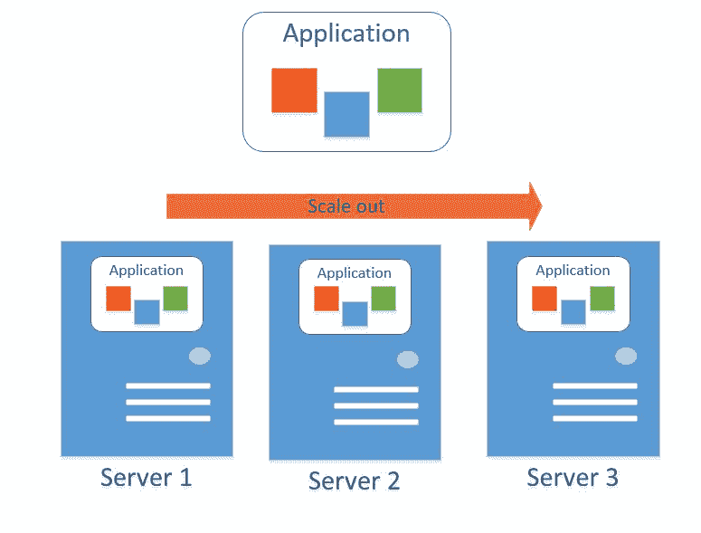

以下是微服务体系结构的表示，它将应用分成较小的服务，并根据工作负载独立扩展:

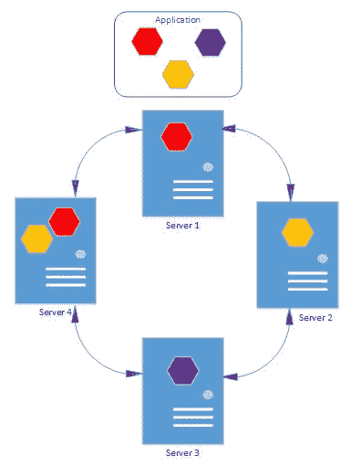

在微服务体系结构中，应用被划分为松散耦合的服务，每个服务公开一个端点，并部署在一个单独的服务器上，或者很可能部署在一个容器上。每个服务都通过某个端点与其他服务进行通信。

# 微服务架构的优势

微服务架构有各种好处，如下所示:

*   微服务是自治的，它公开了一个独立的功能单元，与其他服务有松散耦合的依赖关系
*   它通过定义良好的 API 契约向调用者公开特性
*   如果有任何服务失败，它会优雅地降级
*   它可以独立地纵向扩展和横向扩展
*   它最适合容器化部署，与虚拟机相比，这是一种经济高效的解决方案
*   每个组件都可以通过端点重用，修改任何服务都不会影响其他服务
*   与单片架构相比，开发速度更快
*   由于每个微服务都提供了特定的业务能力，因此它很容易重用和组合
*   由于每个服务都是独立的，所以使用旧的体系结构或技术不是问题。
*   它具有弹性，消除了整体故障转移的情况

# 开发微服务的标准实践

作为标准实践，微服务是基于业务能力或业务领域来设计和分解的。业务域分解遵循**域驱动设计** ( **DDD** )模式，其中每个服务都被开发来提供业务域的特定功能。这与分层体系结构方法形成对比，在分层体系结构方法中，应用被分为多个层，其中每一层都依赖于另一层，并对其具有紧密的依赖性，移除任何一层都会破坏整个应用。

下图说明了分层架构和微服务架构之间的区别:

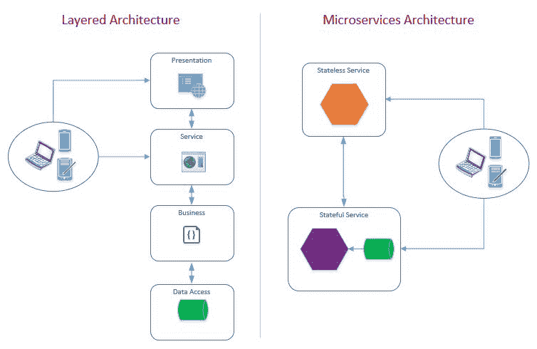

# 微服务的类型

微服务分为两类，如下所示:

*   无状态微服务
*   有状态微服务

# 无状态微服务

无状态服务要么没有状态，要么可以从外部数据存储中检索状态。由于状态是分开存储的，多个实例可以同时运行。

# 有状态微服务

有状态服务在其自己的上下文中维护状态。一次只有一个实例处于活动状态。但是，该状态也会复制到其他非活动实例中。

# 三帝

DDD 模式强调应用的业务领域。当按照 DDD 模式构建应用时，我们根据业务域来划分应用，其中每个域都有一个或多个有界上下文，有界上下文代表业务需求。用技术术语来说，每个有界上下文都有自己的代码和持久性机制，并且相互独立。考虑一个供应商管理系统，其中供应商向网站注册，登录网站，更新他们的个人资料，并附上报价。每种类型的动作将被称为有界上下文，并且独立于其他动作。一组供应商操作可以称为供应商域。

DDD 将需求分成特定领域的块，称为有界上下文，其中每个有界上下文都有自己的模型、逻辑和数据。由于一个服务提供的核心功能，它有可能被许多服务使用。例如，供应商注册服务使用身份服务来创建新用户，而同一身份服务可能被其他服务用来登录系统。

# 微服务的数据操作

一般来说，每个服务都向用户提供特定的业务功能，包括**创建**、**读取**、**更新**和**删除** ( **CRUD** )操作。在企业应用中，我们有一个或多个包含许多表的数据库。遵循 DDD 模式，我们可以设计每个专注于特定领域的服务。但是，在某些情况下，我们需要从服务域范围之外的一些其他数据库或表中提取数据。然而，有两种选择来应对这一挑战:

*   在应用编程接口网关后面包装微服务
*   出于读取/查询目的，将数据分解为平面模式

# 在应用编程接口网关后面包装微服务

基于微服务架构的企业应用包含许多服务。一个**实体资源规划** ( **ERP** )系统包含很多模块，如**人力资源** ( **HR** )、财务、请购等。每个模块可能有许多提供特定业务功能的服务。例如，人力资源模块可能包含以下三项服务:

*   个人记录管理
*   评估管理
*   招聘管理

个人记录管理服务公开了创建、更新或删除员工基本信息的某些方法。评估管理服务公开了为员工创建评估请求的特定方法，招聘管理服务执行新的招聘决策。假设我们需要开发一个网页，其中包含基本的员工信息和过去五年中完成的评估总数。在这种情况下，我们将调用两个服务，即个人记录管理和评估管理，并且调用者将对这些服务进行两次单独的调用。或者，我们可以使用一个应用编程接口网关将这两个调用打包成一个调用。解决这种情况的技术被称为**原料药组成**，在*中讨论什么是原料药组成？*章节稍后。

# 出于读取/查询目的，将数据反规范化为平面模式

这是另一种技术，在这种技术中，我们希望使用服务来读取来自异构源的数据。它可能来自多个表或数据库。为了将多个服务调用转换为单个调用，我们可以设计每个服务，并使用模式(如发布者/订阅者或中介者)来侦听要在任何服务上执行的任何 CRUD 操作，将数据保存到平面模式中，并开发仅从该表中读取数据的服务。解决这种情况的技术被称为**命令查询责任分离** ( **CQRS** )并在本章后面的 CQRS 部分讨论。

# 跨业务场景的一致性

我们知道每项服务都是为特定的业务功能而设计的，让我们举一个订单管理系统的例子，客户来到网站下订单。一旦下了订单，就会反映在库存中。在这个场景中，我们可以有两个微服务:一个是下订单并在订单数据库中创建数据库记录的服务，另一个是对库存相关表执行 CRUD 的库存服务:


当实现端到端业务场景并在多个微服务之间实现一致性时，要遵循的重要实践是保持数据和模型特定于它们的域。考虑到前面的例子，订单放置服务不应该访问或执行除订单表之外的 CRUD 操作，如果有必要访问该服务域之外的任何数据，它应该直接调用该服务。

原子性、一致性、完整性和持久性是另一个挑战。我们可能有多个服务为一个完整的事务服务，其中每个事务都在后面，并由一个单独的服务来操作。为了适应具有微服务架构风格的 ACID 事务，我们可以实现**异步事件驱动通信**，这将在本章后面讨论。

# 与微服务的通信

在微服务架构中，每个微服务都托管在某个服务器上，很可能是一个容器，并公开一个端点。这些端点可用于与该服务通信。我们可以使用许多协议，但是基于 REST 的 HTTP 端点由于其在许多平台上的可访问性支持而被最广泛地使用。在 ASP.NET 核心中，我们可以使用 ASP.NET 核心 MVC 框架创建微服务，并通过 RESTful 端点使用它们。有些微服务也使用其他微服务来完成特定的操作，这可以使用中的`HttpClient`类轻松完成。NET 核心。然而，我们应该以这样一种方式进行设计，即我们的服务提供弹性并处理瞬时故障。

# 微服务中的数据库体系结构

使用微服务体系结构，每个服务都提供一定的功能，并且对其他服务的依赖最小。然而，将关系数据库移植到较小的集合中是一个挑战，因为每个集合代表一个特定的域，并且包含与该域相关的表。基于域分离表并使它们成为单独的数据库需要适当的考虑。

让我们考虑提供**企业对消费者** ( **B2C** )和 **B** **企业对企业** ( **B2B** )流程并涉及以下操作的供应商管理系统:

*   供应商在网站上注册
*   供应商添加可由其他供应商或客户购买的产品
*   供应商下单购买产品

为了实现前面的场景，我们可以基于以下两种模式分解数据库:

*   每个服务的表格
*   每个服务的数据库

# 每个服务的表格

通过这种设计，每个服务都被设计为使用数据库中的特定表。在这种情况下，数据库集中托管在一个地方。其他微服务也连接到同一个数据库，但是处理它们自己的特定于域的表:

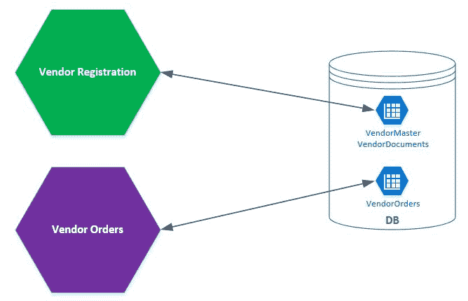

这有助于我们使用中央数据库，但是模式中的任何修改都可能会破坏或需要更新一个或多个微服务。

# 每个服务的数据库

通过这种设计，每个服务都有自己的数据库，并且应用是松散耦合的。数据库中的修改不会损害或破坏任何其他服务，并提供完全隔离。这种设计非常适合部署场景，因为每个服务都包含部署在自己的容器中的自己的数据库:

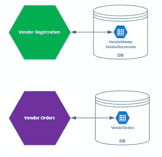

# 按服务隔离表或数据库的挑战

建议根据业务能力或业务领域来隔离表或数据库，以限制依赖性，并使其与领域模型保持一致。但也伴随着一些挑战。例如，我们有两种服务:供应商服务和订单服务。供应商服务用于在其自己的供应商数据库中创建供应商记录，订单服务用于为特定供应商下订单。当我们需要将供应商及其订单的汇总记录返回给用户时，挑战就来了。要解决这个问题，我们可以使用以下两种方法之一:

*   原料药组成
*   CQRS(消歧义)

# 什么是 API 组成？

API 组合是一种技术，其中多个微服务被组合以向用户公开一个端点并提供聚合视图。在单个数据库中，通过进行 SQL 查询连接并从不同的表中获取数据，很容易做到这一点。

让我们考虑一下供应商管理系统，我们有两种服务。一个用于注册新的供应商，并有一个相应的数据库来保存供应商的人口统计数据、地址和其他信息。另一种服务是订单服务，用于存储供应商的交易数据，包含订单编号、数量等订单信息。假设我们有一个要求，显示所有订单已完成的供应商列表。在这种情况下，我们可以在供应商注册服务中提供一种方法，首先从自己的数据存储中加载供应商详细信息，然后通过调用订单服务加载他们的订单，最后返回聚合的数据。

# CQRS(消歧义)

CQRS 是一个原则，其中应用命令，如创建，更新和删除是由读取操作分离。它在基于事件的模型上工作，当在 API 上执行任何创建、更新或删除操作时，会调用事件处理程序，并将该信息存储到自己相应的数据存储中。我们可以在前面的供应商注册示例中实现 CQRS，这将有助于从单个服务中查询供应商及其订单。当对供应商或订单服务执行任何命令(创建、更新、删除)操作时，它将调用调用查询服务的处理程序，以将更新的数据保存到其存储中。

我们可以将数据保存在平面模式中，或者使用 NoSQL 数据库保存所有关于供应商及其订单的信息，并在需要时读取这些信息:

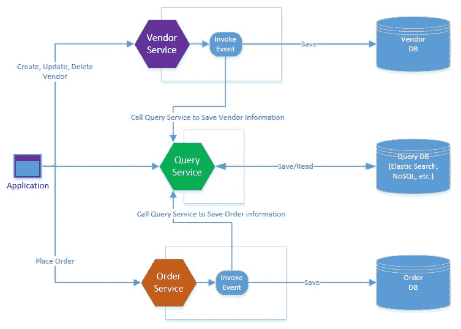

上图表示三种服务:供应商服务、订单服务和查询服务。当在供应商服务上执行任何创建、更新或删除操作时，将引发事件，并调用相应的处理程序，该处理程序对查询服务发出 HTTP POST、PUT 或 delete 请求以保存或更新其数据存储。订单服务也是如此，它调用查询服务并存储与订单相关的信息。最后，查询服务用于在一次调用中读取独立服务的累积数据。

这种方法的好处如下:

*   我们可以通过定义集群和非集群索引来优化查询数据库
*   我们可以使用一些其他的数据库模型，如 NoSQL、MongoDB 或 Elasticsearch，为用户提供更快的检索和搜索体验
*   每个服务都有自己的数据存储，但是通过这种方法，我们可以在一个地方聚合数据
*   我们可以将查询数据用于报告目的

CQRS 可以使用中介模式来实现，我们将在本章后面讨论。

# 使用开发微服务架构。净核心

到目前为止，我们已经了解了微服务的基本原理和 DDD 的重要性。在本节中，我们将为包含以下特性的示例应用开发一个微服务体系结构:

*   身份服务
*   供应商服务

# 在中创建示例应用。使用微服务架构的网络核心

在本节中，我们将在中创建一个示例应用。NET Core 并定义包括授权服务器、供应商服务和订单服务的服务。首先，我们可以使用 Visual Studio 2017 或 Visual Studio Code，并使用 dotnet **命令行界面** ( **CLI** )工具创建项目。选择 Visual Studio 2017 的优势在于，它在创建项目时提供了一个选项，以启用 Docker 支持，添加 Docker 相关文件，并使 Docker 成为启动项目:

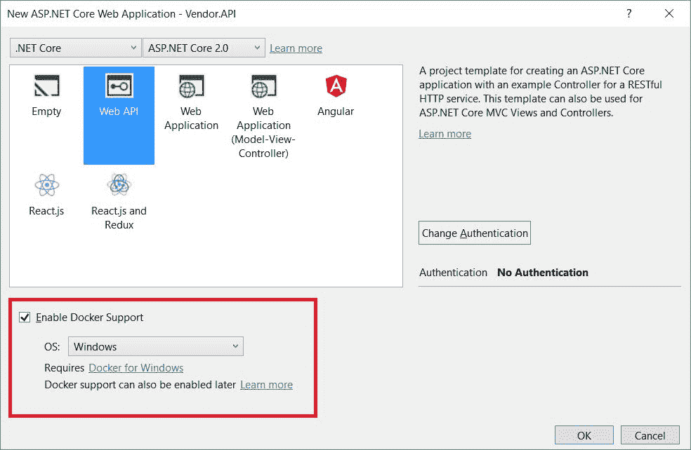

# 解决方案结构

解决方案的结构如下所示:

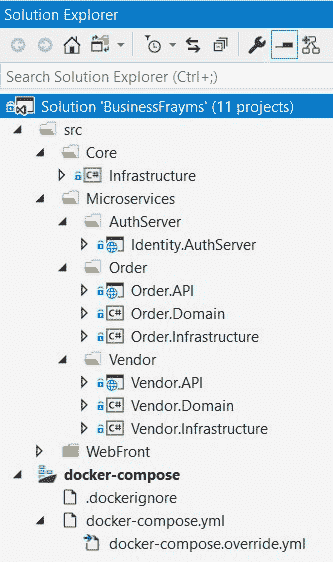

在前面的结构中，我们有根文件夹，即`Core`、`Microservices`和`WebFront`。公共和核心组件驻留在`Core`中，所有微服务驻留在`Microservices`文件夹中，`WebFront`包含前端项目，很可能是 ASP.NET MVC 核心项目、移动应用等等。

在指定的文件夹中创建项目为解决方案赋予了适当的含义，并使其易于理解解决方案的整体情况。

下表显示了在每个文件夹中创建的项目:

| **文件夹** | **项目名称** | **项目类型** | **描述** |
| `Core` | `Infrastructure` | 。网络标准 2.0 | 包含存储库类`UnitOfWork`和`BaseEntity` |
| `Core` | `APIComponents` | 。网络标准 2.0 | 包含`BaseController`、`LoggingActionFilter`和`ResilientHttpClient` |
| `Microservices > AuthServer` | `Identity.AuthServer` | ASP.NET 核心 2.0 网络应用编程接口 | 使用 OpenIddict 和 ASP.NET 核心身份的授权服务器 |
| `Microservices >``Vendor` | `Vendor.API` | ASP.NET 核心 2.0 网络应用编程接口 | 包含供应商应用编程接口控制器 |
| `Microservices >``Vendor` | `Vendor.Domain` | 。网络标准 2.0 | 包含特定于供应商领域的领域模型 |
| `Microservices >``Vendor` | `Vendor.Infrastructure` | 。网络标准 2.0 | 包含特定于供应商的存储库和数据库上下文 |
| `WebFront` | `FraymsWebApp` | ASP.NET 核心 2.0 网络应用 | 包含前端视图、页面和客户端框架 |

# 逻辑架构

示例应用的逻辑架构代表两个微服务，即身份服务和供应商服务。身份服务用于执行用户身份验证和授权，而供应商服务用于执行供应商注册:


我们将使用 DDD 方法来阐明数据模型，其中每个服务都有自己相应的表。

供应商服务基于业务域，分为三层，即公开 HTTP 端点并由客户端使用的应用编程接口、包含域实体、聚合和 DDD 模式的域，以及包含所有公共类的基础架构层，这些公共类包括存储库、**实体框架** ( **EF** )、核心上下文和其他助手类。

对于特定的业务场景，域层是定义业务逻辑和实体的实际层，通常是**普通旧 CLR 对象** ( **POCO** )。它不应该直接依赖于任何数据库框架或**对象关系映射** ( **ORM** )如 EF、Hibernate 等。但是，对于 EF Core，我们有一个条款来保持实体与其他程序集分离，并将它们定义为 POCO 实体，从 EF Core 库中移除依赖项。

当请求到达应用编程接口时，它使用域层来执行特定的业务场景，并传递它接收的数据。域层执行业务逻辑，并使用基础结构层对数据库执行 CRUD。最后，响应从一个应用编程接口发送回调用者:

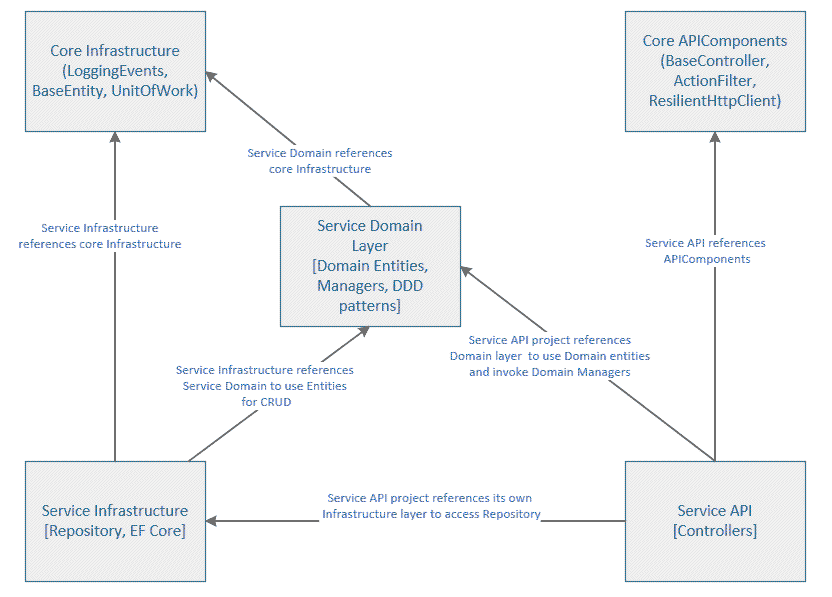

# 开发核心基础设施项目

这个项目包含应用使用的核心类和组件。它将包含一些通用类或基类、外观以及其他在整个应用中常见的辅助类。

我们将创建以下类，并讨论它们如何对其他特定于微服务的项目有用。

# 创建基本实体类

`BaseEntity`类包含微服务项目中所有领域模型使用的公共属性。通常，对于所有的交易表，我们存储`CreatedBy`、`CreatedOn`、`UpdatedBy`和`UpdatedOn`字段。当为每个服务设计实体模型时，我们将从`BaseEntity`类继承，因此所有这些公共属性将在迁移运行时添加到表中。以下是`BaseEntity`类的代码片段:

```cs
public abstract class BaseEntity 
{ 

  public BaseEntity() 
  { 
    this.CreatedOn = DateTime.Now; 
    this.UpdatedOn = DateTime.Now; 
    this.State = (int)EntityState.New; 

  } 
  public string CreatedBy { get; set; } 
  public DateTime CreatedOn { get; set; } 
  public string UpdatedBy { get; set; } 
  public DateTime UpdatedOn { get; set; } 

} 

```

Any property being annotated with the `NotMapped` attribute does not create corresponding fields in the backend database.

# 统一工作模式

我们将实现`UnitOfWork`模式，以便在对后端数据库的一次调用中保存上下文变化。每次对象状态改变时更新数据库并不是好的做法，会降低应用的性能。考虑一个表单示例，该表单包含一个表格，其中每行都是可编辑的。在每次行更新时提交数据库中的更改会降低应用的性能。更好的方法是将每行状态保存在内存中，并在表单发布后更新数据库。使用工作单元模式，我们可以定义一个包含以下四种方法的接口:

```cs
public interface IUnitOfWork: IDisposable 
{ 
  void BeginTransaction(); 

  void RollbackTransaction(); 

  void CommitTransaction(); 

  Task<bool> SaveChangesAsync(); 

} 
```

该界面包含事务相关方法，即`BeginTransaction`、`RollbackTransaction`、`CommitTransaction`，其中`SaveChangesAsync`用于将更改保存到数据库中。每个服务都有自己的数据库上下文实现，并实现`IUnitOfWork`接口来提供事务处理和保存对后端数据库的更改。

# 创建存储库界面

我们将创建一个通用的存储库接口，该接口将由每个服务的存储库类实现，因为每个服务都将遵循 DDD 方法，并有自己的存储库，以便根据业务领域向开发人员提供有意义的信息。在这个界面中，我们可以保留`All`、`Contains`等泛型方法和一个返回`UnitOfWork`的属性:

```cs
public interface IRepository<T> where T : BaseEntity 
{ 
  IUnitOfWork UnitOfWork { get; } 

  IQueryable<T> All<T>() where T : BaseEntity; 
  T Find<T>(Expression<Func<T, bool>> predicate) where T : BaseEntity; 

  bool Contains<T>(Expression<Func<T, bool>> predicate) where T : BaseEntity; 
} 
```

# 记录

日志是任何企业应用必不可少的一部分。通过日志记录，我们可以在应用运行时跟踪或排除实际错误。在任何好的产品中，我们通常看到每个错误都有一个错误代码。定义错误代码，然后在记录异常时使用它们，直观地告诉开发人员或支持团队进行故障排除，并到达实际错误发生的位置并提供解决方案。对于所有的应用级错误，我们可以创建一个`LoggingEvents`类，并指定在开发过程中可以进一步使用的常量值。这里是包含一些`GET`、`CREATE`、`UPDATE`和其他事件代码的`LoggingEvents`类。我们可以在`Infrastructure`项目中的`Façade`文件夹下创建这个类:

```cs
public static class LoggingEvents 
{ 
  public const int GET_ITEM = 1001; 
  public const int GET_ITEMS = 1002; 
  public const int CREATE_ITEM = 1003; 
  public const int UPDATE_ITEM = 1004; 
  public const int DELETE_ITEM = 1005; 
  public const int DATABASE_ERROR = 2000; 
  public const int SERVICE_ERROR = 2001; 
  public const int ERROR = 2002; 
  public const int ACCESS_METHOD = 3000; 
} 
```

接下来，我们将添加另一个类`LoggerHelper`，它将在整个应用中使用，以从异常中获取异常堆栈跟踪。以下是`LoggerHelper`类的代码片段:

```cs
public static string GetExceptionDetails(Exception ex) 
{ 

  StringBuilder errorString = new StringBuilder(); 
  errorString.AppendLine("An error occured. "); 
  Exception inner = ex; 
  while (inner != null) 
  { 
    errorString.Append("Error Message:"); 
    errorString.AppendLine(ex.Message); 
    errorString.Append("Stack Trace:"); 
    errorString.AppendLine(ex.StackTrace); 
    inner = inner.InnerException; 
  } 
  return errorString.ToString(); 
} 
```

# 创建 APIComponents 基础设施项目

APIComponents 项目包含微服务特有的组件。在这个项目中，我们将创建一个`BaseController`类，它将添加一些与日志记录相关的类，并且还可以扩展以添加具体控制器使用的更多公共对象。在`APIComponents`项目内的`Controllers`文件夹下添加一个`BaseController`类。以下是`BaseController`类的代码片段:

```cs
public class BaseController : Controller 
{ 
  private ILogger _logger; 
  public BaseController(ILogger logger) 
  { 
    _logger = logger; 
  } 

  public ILogger Logger { get { return _logger; } } 
  public HttpResponseMessage LogException(Exception ex) 
  { 
    HttpResponseMessage message = new HttpResponseMessage(); 
    message.Content = new StringContent(ex.Message); 
    message.StatusCode = System.Net.HttpStatusCode.ExpectationFailed; 
    return message; 
  } 
} 
```

`BaseController`取参数化构造函数`ILogger`，通过 ASP.NET 岩心内置的**依赖注入** ( **DI** )组件注入。

`LogException`方法用于记录异常，并在出现错误时将派生控制器将返回的`HttpResponseMessage`返回给用户。

接下来，我们将在`APIComponents`项目中添加`Filters`文件夹，并添加微服务控制器可以使用的所有公共过滤器。现在，我们只需添加`LoggingActionFilter`，它可以通过注释微服务控制器的`Action`方法来使用，并在请求进来和响应出去时自动记录信息。以下是`LoggingActionFilter`类的代码片段:

```cs
public class LoggingActionFilter: ActionFilterAttribute 
{ 
  public override void OnActionExecuting(ActionExecutingContext context) 
  { 

    Log("OnActionExecuting", context.RouteData, context.Controller); 

  } 

  public override void OnActionExecuted(ActionExecutedContext context) 
  { 
    Log("OnActionExecuted", context.RouteData, context.Controller); 

  } 

  public override void OnResultExecuted(ResultExecutedContext context) 
  { 
    Log("OnResultExecuted", context.RouteData, context.Controller); 
  } 

  public override void OnResultExecuting(ResultExecutingContext context) 
  { 
    Log("OnResultExecuting", context.RouteData, context.Controller); 
  } 

  private void Log(string methodName, RouteData routeData, Object controller) 
  { 
    var controllerName = routeData.Values["controller"]; 
    var actionName = routeData.Values["action"]; 
    var message = String.Format("{0} controller:{1} action:{2}", 
    methodName, controllerName, actionName); 
    BaseController baseController = ((BaseController)controller); 
    baseController.Logger.LogInformation(LoggingEvents.ACCESS_METHOD, message); 
  } 
} 
```

在这个项目中，我们还有在[第 7 章](7.html# 54VHA0-84c100e6bea3438e8844d99ae7f5dfa9)、*中了解到的【保护和实施弹性】。网络核心应用*。

# 开发用于用户授权的身份服务

在 ASP.NET 核心网，我们可以选择来自各种身份验证提供商的身份验证应用。在微服务架构中，服务分别部署和托管在不同的容器中。我们可以使用 ASP.NET 核心身份，并将其作为中间件添加到服务本身中，或者我们可以使用身份服务器并开发一个中央认证服务器来集中执行认证和授权，访问所有在**中央认证服务器** ( **CAS** )注册的服务，并通过传递令牌来访问受保护的资源。

身份服务基本上充当注册企业中所有服务的 CAS。当请求到达服务时，它请求可以从授权服务器获得的令牌。一旦获得令牌，就可以使用它来访问资源服务。

有多种库可以构建身份验证服务器，如下所示:

*   **identity server 4**:identity server 4 是 ASP.NET 核心的 OpenID Connect 和 OAuth 2.0 框架
*   **OpenIddict** :在 ASP.NET 核心项目中实现 OpenID Connect 服务器的易插解决方案

*   **ASOS (AspNet。安全。OpenIdConnect.Server)** : ASOS 是一款高级的 OpenIdConnect 服务器，旨在提供一种低级协议优先的方法

我们将在身份服务中使用 OpenIddict。

# OpenIddict 连接流

OpenIddict 提供了各种类型的流，包括授权代码流、密码流、客户端凭证流等。但是，我们在本章中使用了隐式流。

在隐式流中，通过传递用户名和密码，通过授权端点检索令牌。所有通信都是在一次往返中与授权服务器完成的。身份验证完成后，令牌会添加到重定向 URI 中，以后可以通过传入后续请求的请求头来使用。下图描述了隐式流的工作原理:


隐式流广泛用于**单页应用** ( **SPAs** )。当 SPA 网络应用想要从资源服务器访问受保护的网络应用编程接口时，该过程开始。由于 web API 受到保护，它需要一个令牌来验证请求并验证调用方。要获得令牌(通常称为承载令牌)，SPA web 应用首先进入授权服务器并输入用户名和密码。身份验证成功后，授权服务器返回令牌，并将其附加到重定向 URI 本身。网络应用解析**统一资源定位符** ( **网址**)并检索令牌，进而用于访问受保护的资源。

# 创建身份服务项目

身份服务是 ASP.NET 核心网络应用编程接口项目。要使用 OpenIddict 库，我们必须向我们的 Visual Studio 包源对话框添加一个`aspnet-contrib`引用。要从 Visual Studio 添加此源，请右键单击项目，然后点击设置按钮，单击“获取包管理器”，如下图所示:

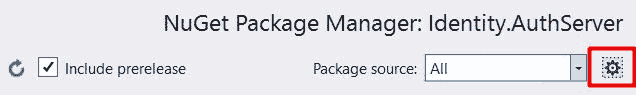

然后添加`aspnet-contrib`条目，来源为[https://www.myget.org/F/aspnet-contrib/api/v3/index.json](https://www.myget.org/F/aspnet-contrib/api/v3/index.json):


一旦添加了这个，我们现在可以很容易地从 NuGet 包管理器窗口添加 OpenIddict 包。

Remember to check that the Include prerelease checkbox is selected.

以下是我们可以直接添加到项目文件或从 Visual Studio 中的“获取包管理器”窗口添加的包:

```cs
<PackageReference Include="AspNet.Security.OAuth.Validation" Version="2.0.0-rc1-final" /> 
<PackageReference Include="AspNet.Security.OpenIdConnect.Server" Version="2.0.0-rc1-final" /> 
<PackageReference Include="Microsoft.AspNetCore.Identity" Version="2.0.1" /> 
<PackageReference Include="Microsoft.AspNetCore.Identity.EntityFrameworkCore" Version="2.0.1" /> 
<PackageReference Include="Microsoft.VisualStudio.Web.CodeGeneration.Design" Version="2.0.2" /> 
<PackageReference Include="OpenIddict" Version="2.0.0-rc2-0797" /> 
<PackageReference Include="OpenIddict.Core" Version="2.0.0-rc2-0797" /> 
<PackageReference Include="OpenIddict.EntityFrameworkCore" Version="2.0.0-rc2-0797" /> 
<PackageReference Include="OpenIddict.Models" Version="2.0.0-rc2-0797" /> 
<PackageReference Include="OpenIddict.Mvc" Version="2.0.0-rc2-0797" /> 
```

**添加自定义用户实体和用户角色类**

ASP.NET 核心身份包含`IdentityUser`和`IdentityRole`类，并使用 EF 核心创建后端数据库。但是，如果我们想要自定义默认表，我们可以通过从这些基类继承来实现。

我们将通过创建自定义`UserEntity`类并添加以下四个字段来创建`Models`文件夹并自定义`IdentityUser`:

```cs
public class UserEntity : IdentityUser<Guid> 
{ 

  public int VendorId { get; set; } 

  public string FirstName { get; set; } 
  public string LastName { get; set; } 

  public DateTimeOffset CreatedAt { get; set; } 

} 
```

我们已经添加了这些字段，因此当供应商注册时，我们将在此表中保留他们的名字、姓氏和 ID。接下来，我们添加另一个类`UserRole`，它从`IdentityRole`派生而来，并添加参数化的构造函数，如下所示:

```cs
public class UserRoleEntity : IdentityRole<Guid> 
{ 
  public UserRoleEntity() : base() { } 

  public UserRoleEntity(string roleName) : base(roleName) { } 
} 
```

我们将添加从`IdentityDbContext`派生的自定义数据库上下文类，并指定`UserEntity`和`UserRoleEntity`类型，如下所示:

```cs
public class BFIdentityContext : IdentityDbContext<UserEntity, UserRoleEntity, Guid> 
{ 
  public BFIdentityContext(Microsoft.EntityFrameworkCore.DbContextOptions options) : 
  base(options) { } 
} 
```

我们可以运行英孚核心迁移来创建 ASP.NET 身份表，并且我们可以使用英孚命令行界面工具来运行迁移。在运行迁移之前，我们在`Startup`类的`ConfigureServices`方法中添加以下条目:

```cs
public void ConfigureServices(IServiceCollection services) 
{ 
  var connection= Configuration["ConnectionString"]; 

  services.AddDbContext<BFIdentityContext>(options => 
  { 
    // Configure the context to use Microsoft SQL Server. 
    options.UseSqlServer(connection); 
  }); 

  services.AddIdentity<UserEntity, UserRole>().AddEntityFrameworkStores<BFIdentityContext>(); 

  services.AddMvc(); 
}   
```

您可以从 Visual Studio 包管理器控制台窗口运行 EF 迁移。要添加迁移，首先运行以下命令:

```cs
Add-Migration Initial
```

`Add-Migration`是 EF CLI 工具集的命令，其中`Initial`是迁移的名称。一旦我们运行了这个命令，它会将`Migrations`文件夹添加到我们的项目中，并将包含`Up`和`Down`方法的`Initial`类添加到数据库中，以应用或删除对数据库的更改。接下来，我们可以运行加载`Initial`类的`Update-Database`命令，并将更改应用到后端数据库。

现在我们在`Startup`类中添加与 OpenIddict 隐式流相关的配置。下面是添加 OpenIddict 隐式流的修改后的`ConfigureServices`方法:

```cs
public void ConfigureServices(IServiceCollection services) 
{ 

  var connection = @"Server=.sqlexpress;Database=FraymsIdentityDB;
  User Id=sa;Password=P@ssw0rd;"; 

  services.AddDbContext<BFIdentityContext>(options => 
  { 
    // Configure the context to use Microsoft SQL Server. 
    options.UseSqlServer(connection); 

    // Register the entity sets needed by OpenIddict. 
    // Note: use the generic overload if you need 
    // to replace the default OpenIddict entities. 
    options.UseOpenIddict(); 
  }); 

  services.AddIdentity<UserEntity, UserRoleEntity>() 
  .AddEntityFrameworkStores<BFIdentityContext>(); 

  // Configure Identity to use the same JWT claims as OpenIddict instead 
  // of the legacy WS-Federation claims it uses by default (ClaimTypes), 
  // which saves you from doing the mapping in your authorization controller. 
  services.Configure<IdentityOptions>(options => 
  { 
    options.ClaimsIdentity.UserNameClaimType = OpenIdConnectConstants.Claims.Name; 
    options.ClaimsIdentity.UserIdClaimType = OpenIdConnectConstants.Claims.Subject; 
    options.ClaimsIdentity.RoleClaimType = OpenIdConnectConstants.Claims.Role; 
  }); 

  // Register the OpenIddict services. 
  services.AddOpenIddict(options => 
  { 
    // Register the Entity Framework stores. 
    options.AddEntityFrameworkCoreStores<BFIdentityContext>(); 

    // Register the ASP.NET Core MVC binder used by OpenIddict. 
    // Note: if you don't call this method, you won't be able to 
    // bind OpenIdConnectRequest or OpenIdConnectResponse parameters. 
    options.AddMvcBinders(); 

    // Enable the authorization, logout, userinfo, and introspection endpoints. 
    options.EnableAuthorizationEndpoint("/connect/authorize") 
    .EnableLogoutEndpoint("/connect/logout") 
    .EnableIntrospectionEndpoint("/connect/introspect") 
    .EnableUserinfoEndpoint("/api/userinfo"); 

    // Note: the sample only uses the implicit code flow but you can enable 
    // the other flows if you need to support implicit, password or client credentials. 
    options.AllowImplicitFlow(); 

    // During development, you can disable the HTTPS requirement. 
    options.DisableHttpsRequirement(); 

    // Register a new ephemeral key, that is discarded when the application 
    // shuts down. Tokens signed using this key are automatically invalidated. 
    // This method should only be used during development. 
    options.AddEphemeralSigningKey(); 

    options.UseJsonWebTokens(); 
  }); 

  services.AddAuthentication() 
  .AddOAuthValidation(); 

  services.AddCors(); 
  services.AddMvc(); 
}  
```

在前面的方法中，我们首先在`AddDbContext`选项中添加`UseOpenIddict`方法，该方法将在数据库中创建与 OpenIddict 相关的表。然后，我们通过如下设置将身份配置为使用与 OpenIddict 相同的 **JSON 网络令牌(JWT** **)** 声明:

```cs
services.Configure<IdentityOptions>(options => 
{ 
  options.ClaimsIdentity.UserNameClaimType = OpenIdConnectConstants.Claims.Name; 
  options.ClaimsIdentity.UserIdClaimType = OpenIdConnectConstants.Claims.Subject; 
  options.ClaimsIdentity.RoleClaimType = OpenIdConnectConstants.Claims.Role; 
}); 
```

最后，我们注册 OpenIddict 特性并通过调用`services.AddOpenIddict`方法指定值。

这里是首先启用**跨来源资源共享** ( **CORS** )的`Configure`方法，它允许来自任何头、来源和方法的请求。然后，添加身份验证并调用`InitializeAsync`方法，用应用和资源(服务)信息填充 OpenIddict 表:

```cs
public void Configure(IApplicationBuilder app) 
{ 
  app.UseCors(builder => 
  { 
    builder.AllowAnyOrigin(); 
    builder.AllowAnyHeader(); 
    builder.AllowAnyMethod(); 
  }); 

  app.UseAuthentication(); 

  app.UseMvcWithDefaultRoute(); 

  // Seed the database with the sample applications. 
  // Note: in a real world application, this step should be part of a setup script. 
  InitializeAsync(app.ApplicationServices, CancellationToken.None).GetAwaiter().GetResult(); 
} 
```

这里`InitializeAsync`的方法如下所示:

```cs
private async Task InitializeAsync(IServiceProvider services, CancellationToken cancellationToken) 
{ 
  // Create a new service scope to ensure the database context 
  // is correctly disposed when this methods returns. 
  using (var scope = services.GetRequiredService<IServiceScopeFactory>().CreateScope()) 
  { 
    var context = scope.ServiceProvider.GetRequiredService<BFIdentityContext>(); 
    await context.Database.EnsureCreatedAsync(); 

    var manager = scope.ServiceProvider.GetRequiredService
    <OpenIddictApplicationManager<OpenIddictApplication>>(); 

    if (await manager.FindByClientIdAsync("bfrwebapp", cancellationToken) == null) 
    { 
      var descriptor = new OpenIddictApplicationDescriptor 
      { 
        ClientId = "bfrwebapp", 
        DisplayName = "Business Frayms web application", 
        PostLogoutRedirectUris = { new Uri("http://localhost:8080/signout-oidc") }, 
        RedirectUris = { new Uri("http://localhost:8080/signin-oidc") } 
      }; 

      await manager.CreateAsync(descriptor, cancellationToken); 
    } 

    if (await manager.FindByClientIdAsync("vendor-api", cancellationToken) == null) 
    { 
      var descriptor = new OpenIddictApplicationDescriptor 
      { 
        ClientId = "vendor-api", 
        ClientSecret = "846B62D0-DEF9-4215-A99D-86E6B8DAB342", 
        //RedirectUris = { new Uri("http://localhost:12345/api") } 
      }; 

      await manager.CreateAsync(descriptor, cancellationToken); 
    } 

  } 
} 
```

在前面的方法中，我们添加了以下三个应用:

*   `bfrwebapp`:ASP.NET 核心网应用。当用户访问 web 应用时，它会根据是否提供了令牌来检查用户是否通过了身份验证。如果用户没有通过身份验证，它会将其重定向到授权服务器。用户输入凭证，成功认证后，将重定向回`bfrwebapp`。在此范围内指定的重定向 URI 是`bfrwebapp`的 URI。
*   `vendor-api`:拥有唯一客户端密钥的厂商微服务。

前面的配置是服务器端配置，我们将看到需要在客户端添加什么配置。

最后，我们将在`Controllers`文件夹下添加`AuthorizationController`，以实现在`Startup`类的`ConfigureServices`方法中为授权服务器定义的端点。以下是`AuthorizationController`的完整代码片段:

```cs
public class AuthorizationController : Controller 
{ 
  private readonly IOptions<IdentityOptions> _identityOptions; 
  private readonly SignInManager<UserEntity> _signInManager; 
  private readonly UserManager<UserEntity> _userManager; 

  public AuthorizationController( 
    IOptions<IdentityOptions> identityOptions, 
    SignInManager<UserEntity> signInManager, 
    UserManager<UserEntity> userManager) 
  { 
    _identityOptions = identityOptions; 
    _signInManager = signInManager; 
    _userManager = userManager; 
  } 

  [HttpGet("~/connect/authorize")] 
  public async Task<IActionResult> Authorize(OpenIdConnectRequest request) 
  { 
    Debug.Assert(request.IsAuthorizationRequest(), 
    "The OpenIddict binder for ASP.NET Core MVC is not registered. " + 
    "Make sure services.AddOpenIddict().AddMvcBinders() is correctly called."); 

    if (!User.Identity.IsAuthenticated) 
    { 
      // If the client application request promptless authentication, 
      // return an error indicating that the user is not logged in. 
      if (request.HasPrompt(OpenIdConnectConstants.Prompts.None)) 
      { 
        var properties = new AuthenticationProperties(new Dictionary<string, string> 
        { 
          [OpenIdConnectConstants.Properties.Error] = 
          OpenIdConnectConstants.Errors.LoginRequired, 
          [OpenIdConnectConstants.Properties.ErrorDescription] = 
          "The user is not logged in." 
        }); 

        // Ask OpenIddict to return a login_required error to the client application. 
        return Forbid(properties, OpenIdConnectServerDefaults.AuthenticationScheme); 
      } 

      return Challenge(); 
    } 

    // Retrieve the profile of the logged in user. 
    var user = await _userManager.GetUserAsync(User); 
    if (user == null) 
    { 
      return BadRequest(new OpenIdConnectResponse 
      { 
        Error = OpenIdConnectConstants.Errors.InvalidGrant, 
        ErrorDescription = "The username/password couple is invalid." 
      }); 
    } 

    // Create a new authentication ticket. 
    var ticket = await CreateTicketAsync(request, user); 

    // Returning a SignInResult will ask OpenIddict to issue 
    the appropriate access/identity tokens. 
    return SignIn(ticket.Principal, ticket.Properties, ticket.AuthenticationScheme); 
  } 

  [HttpGet("~/connect/logout")] 
  public async Task<IActionResult> Logout() 
  { 
    // Ask ASP.NET Core Identity to delete the local and external cookies created 
    // when the user agent is redirected from the external identity provider 
    // after a successful authentication flow (e.g Google or Facebook). 
    await _signInManager.SignOutAsync(); 

    // Returning a SignOutResult will ask OpenIddict to redirect the user agent 
    // to the post_logout_redirect_uri specified by the client application. 
    return SignOut(OpenIdConnectServerDefaults.AuthenticationScheme); 
  } 

  private async Task<AuthenticationTicket> CreateTicketAsync(
  OpenIdConnectRequest request, UserEntity user) 
  { 
    // Create a new ClaimsPrincipal containing the claims that 
    // will be used to create an id_token, a token or a code. 
    var principal = await _signInManager.CreateUserPrincipalAsync(user); 

    // Create a new authentication ticket holding the user identity. 
    var ticket = new AuthenticationTicket(principal, 
    new AuthenticationProperties(), 
    OpenIdConnectServerDefaults.AuthenticationScheme); 

    // Set the list of scopes granted to the client application. 
    ticket.SetScopes(new[] 
    { 
      OpenIdConnectConstants.Scopes.OpenId, 
      OpenIdConnectConstants.Scopes.Email, 
      OpenIdConnectConstants.Scopes.Profile, 
      OpenIddictConstants.Scopes.Roles 
    }.Intersect(request.GetScopes())); 

    ticket.SetResources("vendor-api"); 

    // Note: by default, claims are NOT automatically included in 
    // the access and identity tokens. 
    // To allow OpenIddict to serialize them, you must attach them a destination, that specifies 
    // whether they should be included in access tokens, in identity tokens or in both. 

    foreach (var claim in ticket.Principal.Claims) 
    { 
      // Never include the security stamp in the access and 
      // identity tokens, as it's a secret value. 
      if (claim.Type == _identityOptions.Value.ClaimsIdentity.SecurityStampClaimType) 
      { 
        continue; 
      } 

      var destinations = new List<string> 
      { 
        OpenIdConnectConstants.Destinations.AccessToken 
      }; 

      // Only add the iterated claim to the id_token if 
      // the corresponding scope was granted to the client application. 
      // The other claims will only be added to the access_token, 
      // which is encrypted when using the default format. 
      if ((claim.Type == OpenIdConnectConstants.Claims.Name && 
      ticket.HasScope(OpenIdConnectConstants.Scopes.Profile)) || 
      (claim.Type == OpenIdConnectConstants.Claims.Email && 
      ticket.HasScope(OpenIdConnectConstants.Scopes.Email)) || 
      (claim.Type == OpenIdConnectConstants.Claims.Role && 
      ticket.HasScope(OpenIddictConstants.Claims.Roles))) 
      { 
        destinations.Add(OpenIdConnectConstants.Destinations.IdentityToken); 
      } 

      claim.SetDestinations(destinations); 
    } 

    return ticket; 
  } 
} 
```

`AuthorizationController`暴露两种方法，即`authorize`和`logout`。`authorize`方法检查用户是否通过身份验证，并返回显示登录页面的质询，用户可以在其中输入用户名和密码。一旦输入了正确的凭证，并且从身份表中验证了用户，授权服务器就会创建一个新的身份验证令牌，并根据为`bfrwebapp`指定的重定向 URI 将其返回给客户端应用。要查看工作示例，请参考代码库。

# 实施供应商服务

供应商服务是一个 web API，它公开了一种执行供应商注册的方法。该服务实现了供应商可以注册的供应商系统的实际业务域。正如我们在上一节中了解到的，我们可以根据业务能力或业务领域来分解应用。该服务实现了 DDD 原理，并基于业务域进行分解。它包含以下三个项目:

*   `Vendor.API`:ASP.NET 核心网络应用编程接口项目，公开注册供应商的方法
*   `Vendor.Domain`:。NET Standard 2.0 类库，包含概念验证模型，如`VendorMaster`和`VendorDocument`，以及`IVendorRepository`接口，用于定义供应商领域的基本方法。
*   `Vendor.Infrastructure`:。NET Standard 2.0 类库，包含一个实现`IVendorRepository`接口的`VendorRepository`和一个执行数据库操作的`VendorDBContext`。

# 创建供应商域

创建新的。NET 标准库项目并命名为`Vendor.Domain`。我们将参考之前创建的`Infrastructure`项目，从`BaseEntity`类中派生出我们的概念验证对象实体。

创建一个`VendorMaster`类，并从`BaseEntity`类中派生出来。以下是`VendorMaster`类的代码片段:

```cs
public class VendorMaster : BaseEntity 
{ 
  [Key] 
  public int ID { get; set; } 
  public string VendorName { get; set; } 
  public string ContractNumber { get; set; } 
  public string Email { get; set; } 
  public string Title { get; set; } 
  public string PrimaryContactPersonName{ get; set; } 
  public string PrimaryContactEmail { get; set; } 
  public string PrimaryContactNumber { get; set; } 
  public string SecondaryContactPersonName { get; set; } 
  public string SecondaryContactEmail { get; set; } 
  public string SecondaryContactNumber { get; set; } 
  public string Website { get; set; } 
  public string FaxNumber { get; set; } 
  public string AddressLine1 { get; set; } 
  public string AddressLine2 { get; set; } 
  public string City { get; set; } 
  public string State { get; set; } 
  public string Country { get; set; } 

  public List<VendorDocument> VendorDocuments { get; set; } 

} 
```

`VendorDocument`是另一个包含文档相关字段的 POCO 类。以下是`VendorDocument`类的代码片段:

```cs
public class VendorDocument : BaseEntity 
{ 

  [Key] 
  public int ID { get; set; } 
  public string DocumentName { get; set; } 
  public string DocumentType { get; set; } 
  public Byte[] DocumentContent { get; set; } 
  public DateTime DocumentExpiry { get; set; } 

  public int VendorMasterID { get; set; } 

  [ForeignKey("VendorMasterID")] 
  public VendorMaster VendorMaster { get; set; } 

} 
```

接下来，我们将添加`IVendorRepository`接口来公开特定于供应商域的方法。以下是`IVendorRepository`界面的代码片段:

```cs
public interface IVendorRepository : IRepository<VendorMaster> 
{ 
  VendorMaster Add(VendorMaster vendorMaster); 

  void Update(VendorMaster vendorMaster); 

  Task<VendorMaster> GetAsync(int vendorID); 

  void Add(VendorDocument vendorDocument); 

  void Delete(int vendorDocumentID); 
} 
```

# 创建供应商基础设施

这个项目是一个. NET Standard 2.0 类库项目，引用了核心的`Infrastructure`和`Vendor.Domain`项目。这包含了`VendorRepository`的实际实现和一个与后端 SQL Server 数据库连接的数据库上下文。

以下是从英孚核心的`DbContext`类派生的`VendorDBContext`类，它为`VendorMaster`和`VendorDocument`实体定义了`DbSet`:

```cs
public class VendorDBContext : DbContext, IUnitOfWork 
{ 

  public VendorDBContext(DbContextOptions options) : base(options) 
  { 

  } 

  protected override void OnConfiguring(DbContextOptionsBuilder optionsBuilder) 
  { 
    base.OnConfiguring(optionsBuilder); 
    //  optionsBuilder.UseSqlServer(@"Data Source=.sqlexpress;
    Initial Catalog=FraymsVendorDB;Integrated Security=False; User Id=sa; 
    Password=P@ssw0rd; Timeout=500000;"); 
  } 

  protected override void OnModelCreating(ModelBuilder builder) 
  { 
    base.OnModelCreating(builder); 
  } 

  public void BeginTransaction() 
  { 
    this.Database.BeginTransaction(); 
  } 
  public void RollbackTransaction() 
  { 
    this.Database.RollbackTransaction(); 
  } 
  public void CommitTransaction() 
  { 
    this.Database.CommitTransaction(); 
  } 
  public Task<bool> SaveChangesAsync() 
  { 
    return this.SaveChangesAsync(); 
  } 

  public DbSet<VendorMaster> VendorMaster { get; set; } 
  public DbSet<VendorDocument> VendorDocuments { get; protected set; } 
```

我们还将实现`IUnitOfWork`接口，因此当`VendorRepository`被注入控制器时，我们可以执行事务处理，并在一次调用中将更改保存到关联的数据库中。

这里是实现`IVendorRepository`界面的`VendorRepository`:

```cs
public class VendorRepository : IVendorRepository 
{ 

  VendorDBContext _dbContext; 

  public VendorRepository(VendorDBContext dbContext) 
  { 
    this._dbContext = dbContext; 
  } 

  public IUnitOfWork UnitOfWork 
  { 
    get 
    { 
      return _dbContext; 
    } 
  } 

  public VendorMaster Add(VendorMaster vendorMaster) 
  { 
    var res= _dbContext.Add(vendorMaster); 
    return res.Entity; 
  } 

  public void AddDocument(VendorDocument vendorDocument) 
  { 
    var res = _dbContext.Add(vendorDocument); 
  } 

  public void Update(VendorMaster vendorMaster) 
  { 
    _dbContext.Entry(vendorMaster).State = Microsoft.EntityFrameworkCore.EntityState.Modified; 
  } 

  public async Task<VendorMaster> GetAsync(int vendorID) 
  { 
    var vendorMaster = await _dbContext.VendorMaster.FindAsync(vendorID); 
    if (vendorMaster != null) 
    { 
      await _dbContext.Entry(vendorMaster) 
      .Collection(i => i.VendorDocuments).LoadAsync(); 
    } 
    return vendorMaster; 
  } 

  public IQueryable<T> All<T>() where T : BaseEntity 
  { 
    return _dbContext.Set<T>().AsQueryable(); 
  } 

  public bool Contains<T>(Expression<Func<T, bool>> predicate) where T : BaseEntity 
  { 
    return _dbContext.Set<T>().Count<T>(predicate) > 0; 
  } 

  public T Find<T>(Expression<Func<T, bool>> predicate) where T : BaseEntity 
  { 
    return _dbContext.Set<T>().FirstOrDefault<T>(predicate); 
  }       
}
```

# 创建供应商服务

我们现在将创建一个供应商服务项目，该项目将公开供客户端应用注册供应商使用的方法。首先，让我们创建一个新的 ASP.NET 核心网络应用编程接口项目，并将其命名为`Vendor.API`。

# 在供应商服务中实现中介模式

在微服务体系结构中，一个应用被分成多个服务，其中每个服务通过一个端点连接到其他服务。当事件被调用时，一个服务可能会调用或与多个服务交互。隔离服务之间的交互始终是一种推荐的方法，它解决了对其他服务的紧密依赖。例如，应用调用此服务来注册供应商，然后调用身份服务来创建其用户帐户，并通过调用消息服务来发送电子邮件。我们可以实现中介模式来解决这种情况。

中介模式基于作为发布者/订阅者模型的事件驱动拓扑。当任何事件被调用时，注册的处理程序被调用并执行底层逻辑。这封装了服务如何相互交互的逻辑，为每个交互保持实际的逻辑独立。此外，代码干净且易于更改。

在`Vendor.API`中，我们将使用. NET 的`MediatR`库实现中介器模式。`MediatR`是支持命令处理和域事件发布的中介器模式的实现。在下一节中，我们将在用户注册并调用身份服务来创建新用户和发送电子邮件时实现中介。

要使用`MediatR`，我们必须添加以下两个包:

*   `MediatR`
*   `MediatR.Extensions.Microsoft.DependencyInjection`

添加完这些包后，我们可以通过调用`services.AddMediatR`方法在`ConfigureServices`方法中添加。`MediatR`提供以下两种类型的消息:

*   **请求/响应**:请求是可能返回值也可能不返回值的命令
*   **通知**:通知是可能不返回值的事件

在我们的示例中，我们将实现请求/响应来将供应商记录保存到数据库中，并且一旦它返回布尔值 true 作为响应，我们将调用通知事件来创建供应商用户并发送电子邮件。

为了实现请求/响应，我们应该定义一个实现`IRequestHandler`或`IRequestHandlet<TRequest, TResponse>`接口的类，其中`TRequest`是请求对象类型，`TResponse`是响应对象类型。

在你的`Vendor.API`项目中的`Commands`文件夹下创建一个类`CreateVendorCommand`。以下是`CreateVendorCommand`的代码片段:

```cs
public class CreateVendorCommand : IRequest<bool> 
{ 

  [DataMember] 
  public VendorViewModel VendorViewModel { get; set; } 

  public CreateVendorCommand(VendorViewModel vendorViewModel) 
  { 
    VendorViewModel = vendorViewModel; 
  } 

} 
```

它实现了`IRequest`类，该类返回一个布尔值作为响应。我们还指定了我们的`MediatR`库在调用`VendorController`类中的`send`方法时将注入的`VendorViewModel`。

接下来，我们将创建一个实现通用`IRequestHandler<TRequest,TResponse>`的命令处理程序，其中`TRequest`是`CreateVendorCommand`，而`TResponse`是布尔类型。以下是`CreateVendorCommandHandler`的代码片段:

```cs
public class CreateVendorCommandHandler : IRequestHandler<CreateVendorCommand, bool> 
{ 
  private readonly IVendorRepository _vendorRepository; 

  public CreateVendorCommandHandler(IVendorRepository vendorRepository) 
  { 
    _vendorRepository = vendorRepository; 
  } 

  public async Task<bool> Handle(CreateVendorCommand command, 
  CancellationToken cancellationToken) 
  { 

    _vendorRepository.UnitOfWork.BeginTransaction(); 
    try 
    { 
      _vendorRepository.Add(command.VendorMaster); 
      _vendorRepository.UnitOfWork.CommitTransaction(); 
    }catch(Exception ex) 
    { 
      _vendorRepository.UnitOfWork.RollbackTransaction(); 
    } 
    return await _vendorRepository.UnitOfWork.SaveChangesAsync();            } 
} 
```

当调用该处理程序时，它将调用`Handle`方法并传递命令和取消令牌。从命令对象中，我们可以在调用`VendorController`类中`IMediator`对象的`Send`方法时获得我们已经传递的对象。该方法调用`VendorRepository`的`Add`方法，并将信息保存到数据库中。使用请求/响应方法，即使为命令定义了多个处理程序，也只执行一个命令处理程序。要调用所有的处理程序，我们可以使用通知。我们将扩展前面的示例，并添加通知事件和相应的处理程序，一旦命令成功执行，这些处理程序将被调用。

首先，我们通过创建一个类并实现`INotification`接口来定义通知事件。以下是通知处理程序将使用的`CreateVendorNotification`事件的代码片段:

```cs
public class CreateVendorNotification : INotification 
{  
  public VendorMaster _vendorVM; 
  public CreateVendorNotification(VendorMaster vendorVM) 
  { 
    _vendorVM = vendorVM; 
  }  
} 
```

这里是`CreateUserHandler`的实现，监听要引发的`CreateVendorNotification`事件。一旦事件被引发，它就被调用并执行在`Handle`方法中定义的逻辑。我们使用`CreateUserHandler`通过调用身份服务在 ASP.NET 核心身份数据库中创建用户。以下是`CreateUserHandler`的代码片段:

```cs
public class CreateUserHandler : INotificationHandler<CreateVendorNotification> 
{ 
  IResilientHttpClient _client;  
  public CreateUserHandler(IResilientHttpClient client) 
  { 
    _client = client; 
  } 
  public Task Handle(CreateVendorNotification notification, CancellationToken cancellationToken) 
  { 
    string uri = "http://businessfrayms.com/api/Identity"; 
    string token = "";//read token from user session 
    var response = _client.Post<VendorMaster>(uri, notification._vendorVM,""); 
    return Task.FromResult(0);  
  } 
} 
```

接下来，我们将创建一个`SendEmailHandler`，它监听`CreateVendorNotification`并向供应商发送关于注册的电子邮件通知。以下是`SendEmailHandler`的代码片段:

```cs
public class SendEmailHandler : INotificationHandler<CreateVendorNotification> 
{ 

  MessagingService _service; 

  public SendEmailHandler(MessagingService service) : base() 
  { 
    _service = service; 
  } 

  public Task Handle(CreateVendorNotification notification, CancellationToken cancellationToken) 
  { 
    _service.SendEmail(notification._vendorVM.Email, "Registration", 
    "Thankyou for registration"); 
    return Task.FromResult(0); 
  } 
} 
```

我们可以根据需求添加更多的通知处理程序。例如，如果我们想在供应商记录保存到数据库后启动工作流通知，我们可以创建一个供应商工作流通知处理程序，以此类推。

从`VendorController`端，我们可以通过调用`Send`和`Publish`方法来调用中介模式。`Send`方法调用命令处理程序，`Publish`用于调用通知处理程序。下面是`VendorController`的代码片段:

```cs
[Produces("application/json")] 
[Route("api/Vendor")] 
public class VendorController : BaseController 
{ 
  private readonly IMediator _mediator; 
  private ILogger _logger; 

  public VendorController(IMediator mediator, ILogger logger) : base(logger) 
  { 
    _mediator = mediator; 
    _logger = logger; 
  } 

  [Authorize(AuthenticationSchemes = OAuthIntrospectionDefaults.AuthenticationScheme)] 
  // POST: api/VendorMaster 
  [HttpPost] 
  public void Post([FromBody]VendorMaster value) 
  { 
    try 
    { 

      bool result = _mediator.Send(new CreateVendorCommand(value)).Result; 
      if (result) 
      { 
        //Record saved succesfully, publishing event now 
        _mediator.Publish(new CreateVendorNotification(value)); 
      } 
    } 
    catch (Exception ex) 
    { 
      _logger.LogError(ex.Message); 
    } 
  } 

}
```

在前面的代码中，我们有一个`Post`方法，客户端应用将调用该方法来创建一个新的供应商。它首先调用`Send`方法，该方法调用`CreateVendorCommandHandler`并将记录保存在数据库中，一旦记录被创建并且响应为真，它将调用`SendEmailHandler`发送电子邮件。

You can access the complete sample application from the GitHub link provided with the book.

# 在 Docker 容器上部署微服务

微服务最适合容器化部署。容器是一个过程，它为应用运行提供了一个隔离和受控的环境，而不会影响系统，反之亦然。我们大多数人都体验过在虚拟机中托管应用，这为安装、配置和运行应用以及使用专用资源提供了一个隔离的空间，而不会影响底层系统或应用。与虚拟机相比，容器提供了相同级别的隔离，但在启动时间和开销方面更加轻量级。与虚拟机不同，容器不会预分配资源，如内存、磁盘和 CPU 使用率。我们可以在同一台机器上运行多个容器，其中容器相互隔离，但共享内存、磁盘和 CPU 的使用。这使得在容器中运行的任何应用都可以使用最大的可用资源，而无需预先分配或分配任何资源。

下图描述了虚拟机如何在主机操作系统上运行:

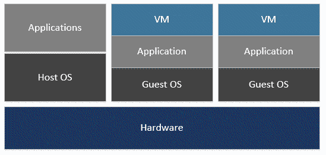

我们在主机操作系统上运行应用，在来宾操作系统上运行虚拟机。虚拟化在硬件级别完成，虚拟机可以使用虚拟机管理程序虚拟化系统中可用的驱动程序与主机硬件进行对话，如主机操作系统所提供的。

以下是容器在主机操作系统上的运行方式:

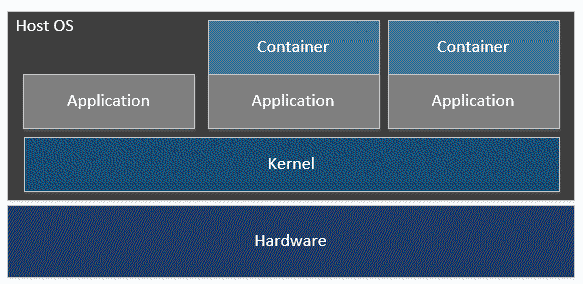

使用容器，内核在多个容器之间共享。内核是操作系统的核心组件，负责与不同的进程和硬件交互，并管理 CPU 周期和虚拟管理等资源。内核是在不同容器之间创建隔离的组件。

# 什么是 Docker？

Docker 是一家提供容器的软件公司。Docker 容器在软件行业运行微服务非常流行。它们最适合微服务应用开发，并提供了一组命令行工具，提供了构建和维护不同容器映像的统一方式。我们可以创建自定义图像或使用现有的注册表，如 Docker Hub([http://hub.docker.com](http://hub.docker.com))。

以下是 Docker 的一些优势:

| **利益** | **描述** |
| 简单 | 为应用创建和编排提供了一个强大的工具 |
| 公开 | 采用开源技术构建，易于集成到现有环境中 |
| 独立性ˌ自立性 | 在应用和基础架构之间建立关注点分离 |

# 将 Docker 与一起使用。净核心

。NET Core 是模块化的，与。NET 框架并帮助并行运行应用，其中每个应用都运行自己的一组 CLR 库和运行时。这使得它非常适合在 Docker 容器上运行。的形象。NET Core 与具有的图像相比要小得多。NET 框架已安装。。NET Core 使用的是 Windows Nano 服务器或 Linux 映像，比 Windows 服务核心映像小很多。作为。NET Core 跨平台运行，我们也可以创建其他平台的 Docker 映像，并在其上运行应用。

借助 Visual Studio 2017，我们可以在创建. NET Core 或 ASP.NET Core 项目时选择 Docker，它会自动构建 Docker 文件，并设置基本配置以在 Docker 上运行应用。以下屏幕截图显示了 Visual Studio 2017 中可用于调配 Docker 容器的 Docker 选项:

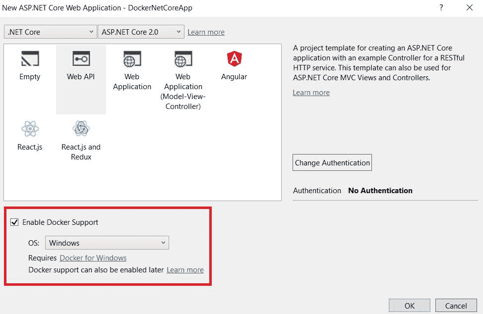

或者，如果项目已经创建，我们可以通过右键单击。NET 核心项目，然后单击添加| Docker 支持选项。

一旦我们在应用中创建或启用了 Docker 支持，它就会在我们的项目中创建 Docker 文件，并且还会添加另一个名为`docker-compose`*的项目，如下所示:*

 *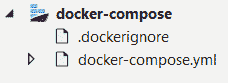

`docker-compose`项目包含一组 YAML ( `.yml`)文件，这些文件包含与容器中托管的应用相关的配置，以及添加 Docker 支持时为项目创建的 Docker 文件路径的引用。这里是示例`docker-compose.yml`文件，它包含两个服务，这些服务具有诸如图像名称、`dockerfile`路径等细节。该文件来自我们之前讨论的示例应用:

```cs
version: '1' 

services: 
  vendor.api: 
    image: vendor.api 
    build: 
      context: . 
      dockerfile: srcmicroservicesVendorVendor.APIDockerfile 

  identity.api: 
    image: identity.api 
    build: 
      context: . 
      dockerfile: srcmicroservicesAuthServerIdentity.AuthServerDockerfile 
```

以下是我们在上面的示例应用中创建的`Vendor.API`项目中的`Dockerfile`的内容:

```cs
FROM microsoft/aspnetcore:2.0-nanoserver-1709 AS base 
WORKDIR /app 
EXPOSE 80 

FROM microsoft/aspnetcore-build:2.0-nanoserver-1709 AS build 
WORKDIR /src    
COPY *.sln ./ 
COPY src/microservices/Vendor/Vendor.API/Vendor.API.csproj src/microservices/Vendor/Vendor.API/ 
RUN dotnet restore 
COPY . . 
WORKDIR /src/src/microservices/Vendor/Vendor.API 
RUN dotnet build -c Release -o /app 

FROM build AS publish 
RUN dotnet publish -c Release -o /app 

FROM base AS final 
WORKDIR /app 
COPY --from=publish /app . 
ENTRYPOINT ["dotnet", "Vendor.API.dll"] 

```

前面的`Dockerfile`开始引用将用于创建 Docker 容器的基础图像`microsoft/aspnetcore:2.0-nanoserver-1709`。`COPY`命令是项目文件所在的实际路径。然后，它将使用 dotnet CLI 命令，如`dotnet restore`恢复容器内的所有 NuGet 包，`dotnet build`构建应用，`dotnet publish`构建编译后的输出并将其发布到容器内的发布文件夹中。

# 正在运行 Docker 映像

我们可以从命令行或直接从 Visual Studio 运行 Docker 图像。正如我们在上一节中看到的，一个新的`docker-compose`项目是在我们的项目中添加 Docker 支持时创建的。运行`docker-compose`项目读取`docker-compose` YAML 文件，并为定义的服务连接容器。Docker 是 Visual Studio 中的一等公民。它不仅支持运行 Docker 容器，还提供了完善的调试功能。

或者，从命令行，我们可以通过转到`docker-compose.yml`文件所在的根路径并运行以下命令来运行 Docker 容器:

```cs
docker-compose up 
```

一旦容器启动，每个应用在运行时都会分配自己的 IP。为了检查在单独容器上运行的每个服务的实际 IP，我们可以运行`docker inspect`命令来检索它。但是，`docker inspect`命令需要容器标识作为参数。要运行容器列表，我们可以首先调用`docker ps`命令，如下所示:

```cs
docker ps 
```

前面的命令显示了容器列表，如下图所示:

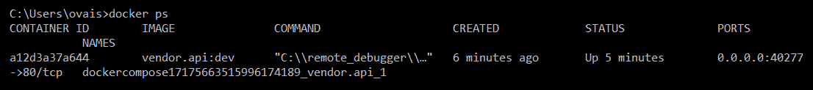

最后，我们可以使用容器标识并执行`docker inspect`命令来获取其 IP 地址，如下所示:

```cs
docker inspect -f "{{range .NetworkSettings.Networks}}{{.IPAddress}}{{end}}" containerid  
```

上述命令将 IP 地址显示如下:


# 摘要

在本章中，我们了解了微服务体系结构，该体系结构用于为基于云的微服务开发高性能和可扩展的应用。我们学习了微服务的一些基础知识，它们的好处，以及设计架构时使用的模式和实践。我们讨论了将企业应用分解成微服务架构风格的某些挑战，并学习了诸如 API 组合和 CQRS 等模式来解决这些挑战。本章稍后，我们在中开发了一个基本应用。NET Core 并讨论了微服务的解决方案结构和组件，开发了身份和供应商服务。

在下一章中，我们将讨论在中保护和实现弹性。NET 核心应用。*