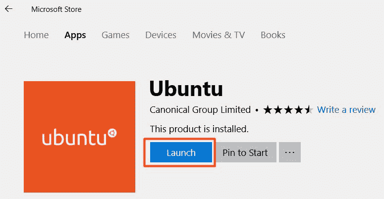
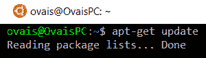
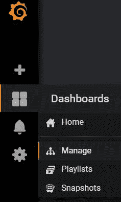
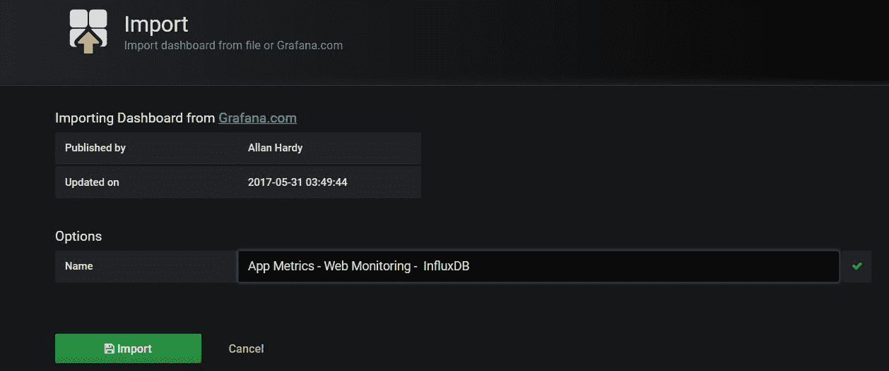
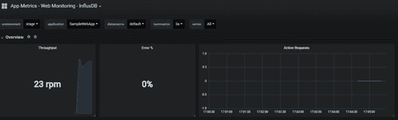
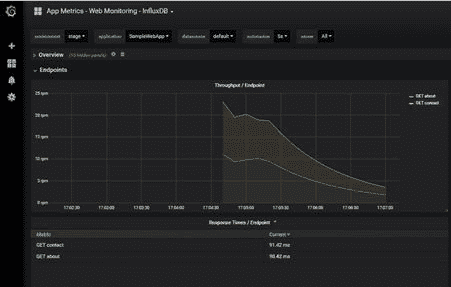

# 使用工具监控应用性能

监控应用性能是大型组织持续监控和改善客户应用体验的一般流程。这是一个重要因素，它围绕着不同的工具和技术来衡量应用的性能并快速做出决策。

在本章中，我们将学习一些建议用于监控的关键指标。NET Core 应用以及探索应用指标，以获得关于关键指标的实时分析和遥测信息。

在本章中，我们将研究以下主题:

*   监控应用性能的关键指标
*   衡量应用性能的工具和技术，包括:

To learn more about App Metrics or to contribute to the open source project, you can access the GitHub repository from the following link and see the complete documentation with some examples: [https://github.com/AppMetrics/AppMetrics](https://github.com/AppMetrics/AppMetrics).

# 应用性能关键指标

以下是基于 web 的应用需要考虑的一些关键指标。

# 平均响应时间

在每个 web 应用中，响应时间是监控应用性能时要考虑的关键指标。响应时间是服务器处理请求所花费的总时间。这是服务器收到请求时计算的时间，然后服务器处理该请求并返回响应所需的时间。它可能会受到网络延迟、活动用户、活动请求数量以及服务器上的 CPU 和内存使用情况的影响。平均响应时间是服务器在特定时间处理的所有请求的总平均时间。

# Apdex 分数

Apdex 是一个用户满意度分数，可以根据应用的性能进行分类。Apdex 评分可以分为满意、容忍或沮丧。

# 错误百分比

这是在特定时间内报告的错误的总百分比。用户可以获得用户遇到的错误的总百分比的概述，并可以立即纠正它们。

# 请求率

请求率是用于扩展应用的一个有价值的指标。如果请求率很高，并且应用的性能不佳，则可以扩展应用以支持该数量的请求。另一方面，如果请求率非常低，这意味着存在问题，或者活动用户的数量正在减少，他们没有使用该应用。在这两种情况下，可以突然做出决定，以提供一致的用户体验。

# 吞吐量/端点

吞吐量是应用在给定时间内可以处理的请求数。通常，在商业应用中，请求的数量非常高，吞吐量允许您在不影响性能的情况下对应用可以处理的响应数量进行基准测试。

# 中央处理器和内存使用

CPU 和内存使用率是另一个重要指标，用于分析 CPU 或内存使用率高的高峰时段，以便您可以调查根本原因。

# 衡量绩效的工具和技术

市场上有各种工具可用于测量和监控应用性能。在本节中，我们将重点关注应用指标，并分析 HTTP 流量、错误和网络性能。

# 介绍应用指标

应用度量是一个开源工具，可以插入 ASP.NETCore应用。它提供了关于应用如何运行的实时见解，并提供了应用运行状况的完整概述。它以 JSON 格式提供指标，并与 Grafana 仪表板集成，以实现可视化报告。应用指标基于。NET 标准，跨平台运行。它提供了各种扩展和报告仪表板，也可以在 Windows 和 Linux 操作系统上运行。

# 使用 ASP.NETCore设置应用指标

我们可以通过以下三个简单的步骤在 ASP.NETCore应用中设置应用指标:

1.  安装应用指标。

应用度量可以作为 NuGet 包安装。这里有两个包可以通过您的.NETCore项目:

```cs
 Install-Package App.Metrics 
      Install-Pacakge App.Metrics.AspnetCore.Mvc 
```

2.  在`Program.cs`中添加应用指标。

在`BuildWebHost`方法中，将`UseMetrics`添加到`Program.cs`，如下所示:

```cs
      public static IWebHost BuildWebHost(string[] args) => 
        WebHost.CreateDefaultBuilder(args) 
          .UseMetrics() 
          .UseStartup<Startup>() 
          .Build(); 
```

3.  在`Startup.cs`中添加应用指标。

最后，我们可以在`Startup`类的`ConfigureServices`方法中添加一个度量资源过滤器，如下所示:

```cs
      public void ConfigureServices(IServiceCollection services) 
      { 
        services.AddMvc(options => options.AddMetricsResourceFilter()); 
      } 
```

4.  运行您的应用。

构建并运行应用。我们可以通过使用 URL 来测试 App Metrics 是否运行良好，如下表所示。只需将网址附加到应用的根网址:

| **URL** | **描述** |
| `/metrics` | 使用配置的指标格式化程序显示指标 |
| `/metrics-text` | 使用配置的文本格式化程序显示度量 |
| `/env` | 显示环境信息，包括操作系统、计算机名、程序集名和版本 |

将`/metrics`或`/metrics-text`附加到应用的根网址可以提供关于应用度量的完整信息。`/metrics`返回 JSON 响应，该响应可以通过一些自定义解析在视图中解析和表示。

# 跟踪中间件

通过应用度量，我们可以手动定义记录遥测信息所必需的典型网络度量。但是，对于 ASP.NETCore，有一个跟踪中间件可以在项目中使用和配置，它包含一些特定于网络应用的内置关键指标。

跟踪中间件记录的指标如下:

*   **Apdex** :用于根据应用的整体性能来监控用户的满意度。Apdex 是一个开放的行业标准，它根据应用的响应时间来衡量用户的满意度。

我们可以为每个请求周期配置时间阈值， *T，*，度量是基于以下条件计算的:

| **用户满意度** | **描述** |
| 令人满意的 | 如果响应时间小于或等于阈值时间( *T* ) |
| 容忍 | 如果响应时间在阈值时间( *T* )和 *4* 之间，则为阈值时间( *T* )的时间(以秒为单位) |
| 令人泄气的 | 如果 response 时间大于阈值时间的 *4* 倍( *T* |

*   **响应时间:**这提供了应用正在处理的请求的总吞吐量以及应用内每条路由花费的持续时间。

*   **活动请求:**这提供了在特定时间内在服务器上接收到的活动请求的列表。

*   **Errors:** 以百分比形式提供错误的聚合结果，包括总错误请求率、每个未捕获异常类型的总计数、每个 HTTP 状态代码的错误请求总数等。

*   **POST 和 PUT 大小:**这提供了 HTTP POST 和 PUT 请求的请求大小。

# 添加跟踪中间件

我们可以将跟踪中间件作为 NuGet 包添加，如下所示:

```cs
Install-Package App.Metrics.AspNetCore.Tracking
```

跟踪中间件提供了一组中间件，用于记录特定指标的遥测数据。我们可以在`Configure`方法中添加以下中间件来度量性能指标:

```cs
app.UseMetricsApdexTrackingMiddleware(); 
app.UseMetricsRequestTrackingMiddleware(); 
app.UseMetricsErrorTrackingMiddleware(); 
app.UseMetricsActiveRequestMiddleware(); 
app.UseMetricsPostAndPutSizeTrackingMiddleware(); 
app.UseMetricsOAuth2TrackingMiddleware();
```

或者，我们也可以使用元包中间件，它添加了所有可用的跟踪中间件，这样我们就可以获得关于前面代码中所有不同指标的信息:

```cs
app.UseMetricsAllMiddleware(); 
```

接下来，我们将在我们的`ConfigureServices`方法中添加跟踪中间件，如下所示:

```cs
services.AddMetricsTrackingMiddleware(); 
```

在主`Program.cs`类中，我们将修改`BuildWebHost`方法并添加`UseMetricsWebTracking`方法，如下所示:

```cs
public static IWebHost BuildWebHost(string[] args) => 
  WebHost.CreateDefaultBuilder(args) 
    .UseMetrics() 
    .UseMetricsWebTracking() 
    .UseStartup<Startup>() 
    .Build();
```

# 设置配置

添加中间件后，我们需要设置默认阈值和其他配置值，以便相应地生成报告。网页跟踪属性可以在`appsettings.json`文件中配置。以下是包含`MetricWebTrackingOptions` JSON 密钥的`appsettings.json`文件的内容:

```cs
"MetricsWebTrackingOptions": { 
  "ApdexTrackingEnabled": true, 
  "ApdexTSeconds": 0.1, 
  "IgnoredHttpStatusCodes": [ 404 ], 
  "IgnoredRoutesRegexPatterns": [], 
  "OAuth2TrackingEnabled": true 
    }, 
```

`ApdexTrackingEnabled`设置为真，以便生成客户满意度报告，`ApdexTSeconds`是决定请求响应时间是令人满意、容忍还是令人沮丧的阈值。`IgnoredHttpStatusCodes`包含状态代码列表，如果响应返回`404`状态，该列表将被忽略。`IgnoredRoutesRegexPatterns`用于忽略与正则表达式匹配的特定 URIs，`OAuth2TrackingEnabled`可以设置为监控和记录每个客户端的指标，并提供每个客户端的请求率、错误率以及 POST 和 PUT 大小的特定信息。

运行应用并进行一些导航。在您的应用网址中添加`/metrics-text`会以文本格式显示完整的报告。以下是文本指标的示例快照:


# 添加可视化报告

有各种各样的扩展和报告插件可以提供可视化的报告仪表板。其中包括 *GrafanaCloud 托管指标*、 *InfluxDB* 、 *Prometheus* 、 *ElasticSearch* 、*石墨*、 *HTTP* 、*控制台*和*文本文件*。在本章中，我们将配置 *InfluxDB* 扩展，看看如何实现可视化报告。

# 设置 InfluxDB

InfluxDB 是由 Influx Data 开发的开源时间序列数据库。它是用 *Go* 语言编写的，广泛用于存储时间序列数据进行实时分析。Grafana 是提供可通过浏览器查看的报告仪表板的服务器。在 Grafana 中可以很容易地将 influxb 作为扩展导入，以显示来自 influxb 数据库的可视化报告。

# 为 Linux 设置窗口子系统

在本节中，我们将在 Windows 子系统上为 Linux 操作系统设置 InfluxDB。

1.  首先，我们需要通过以管理员身份从 PowerShell 执行以下命令来启用 Linux 的 Windows 子系统:

```cs
 Enable-WindowsOptionalFeature -Online -FeatureName 
      Microsoft-Windows-Subsystem-Linux
```

运行上述命令后，重新启动计算机。

2.  接下来，我们将从微软商店安装 Linux 发行版。在我们的例子中，我们将从微软商店安装 Ubuntu。去微软商店，搜索 Ubuntu，安装它。

3.  安装完成后，单击启动:



4.  这将打开控制台窗口，要求您为 Linux 操作系统(操作系统)创建一个用户帐户。
5.  指定将使用的用户名和密码。
6.  运行以下命令，从 bash shell 中将 Ubuntu 更新到最新的稳定版本。要运行 bash，打开命令提示符，写`bash`，点击*进入*:



7.  最后，它会要求您创建一个 Ubuntu 用户名和密码。指定用户名和密码，然后按回车键。

# 安装 InfluxDB

在这里，我们将通过一些步骤在 Ubuntu 中安装 InfluxDB 数据库:

1.  要设置 InfluxDB，请在管理员模式下打开命令提示符，然后运行 bash shell。
2.  对本地电脑上的英菲尼克斯数据库数据存储执行以下命令:

```cs
 $ curl -sL https://repos.influxdata.com/influxdb.key | sudo apt-key add - 
      $ source /etc/lsb-release 
      $ echo "deb https://repos.influxdata.com/${DISTRIB_ID,,} 
      $ {DISTRIB_CODENAME} stable" | sudo tee /etc/apt/sources.list.d/influxdb.list 
```

3.  通过执行以下命令安装 InfluxDB:

```cs
 $ sudo apt-get update && sudo apt-get install influxdb 
```

4.  执行以下命令来运行英夫西数据库:

```cs
 $ sudo influxd
```

5.  通过运行以下命令来启动英菲尼克斯数据库外壳:

```cs
 $ sudo influx 
```

它将打开外壳，在那里可以执行特定于数据库的命令。

6.  通过执行以下命令创建数据库。为数据库指定一个有意义的名称。在我们的情况下，是`appmetricsdb`:

```cs
      > create database appmetricsdb  
```

# 安装 Grafana

Grafana 是一个开源工具，用于在 web 界面中显示仪表板。有各种可用的仪表板，可以从格拉夫纳网站导入，以显示实时分析。格拉夫纳可以简单地从[http://docs.grafana.org/installation/windows/](http://docs.grafana.org/installation/windows/)下载为 zip 文件。下载完成后，我们可以从`bin`目录点击`grafana-server.exe`可执行文件，启动 Grafana 服务器。

Grafana 提供了一个监听端口 *3000* 的网站。如果 Grafana 服务器正在运行，我们可以通过导航到`http://localhost:3000`来访问该站点。

# 添加英菲尼克斯数据库仪表板

Grafana 中有一个现成的 InfluxDB 仪表板，可以从以下链接导入:[https://grafana.com/dashboards/2125](https://grafana.com/dashboards/2125)。

复制仪表板标识，并使用该标识将其导入格拉夫纳网站。

我们可以通过转到 Grafana 网站上的管理选项来导入 InfluxDB 仪表板，如下所示:



在管理选项中，点击 *+仪表盘*按钮，点击*新仪表盘*选项。单击导入仪表板将会引导格拉夫娜向您询问仪表板标识:


将之前复制的仪表盘 ID(例如`2125`)粘贴到框中，点击*选项卡*。系统将显示仪表板的详细信息，单击导入按钮将其导入系统:



# 配置 InfluxDB

我们现在将配置 InfluxDB 仪表板，并添加一个连接到我们刚刚创建的数据库的数据源。

要继续，我们将转到 Grafana 网站上的数据源部分，点击*添加新数据源*选项。以下是为英菲尼克斯数据库添加数据源的配置:


# 在启动中修改配置和配置服务方法

到目前为止，我们已经在我们的机器上建立了 Ubuntu 和 InfluxDB 数据库。我们还设置了 InfluxDB 数据源，并通过 Grafana 网站添加了一个仪表板。接下来，我们将配置我们的 ASP.NETCore网络应用，以将实时信息推送到英菲尼克斯数据库。

下面是修改后的`ConfigureServices`方法，初始化`MetricsBuilder`来定义与应用名称、环境和连接细节相关的属性:

```cs
public void ConfigureServices(IServiceCollection services)
{
  var metrics = new MetricsBuilder()
  .Configuration.Configure(
  options =>
  {
    options.WithGlobalTags((globalTags, info) =>
    {
      globalTags.Add("app", info.EntryAssemblyName);
      globalTags.Add("env", "stage");
    });
  })
  .Report.ToInfluxDb(
  options =>
  {
    options.InfluxDb.BaseUri = new Uri("http://127.0.0.1:8086");
    options.InfluxDb.Database = "appmetricsdb";
    options.HttpPolicy.Timeout = TimeSpan.FromSeconds(10);
  })
  .Build();
  services.AddMetrics(metrics);
  services.AddMetricsReportScheduler();
  services.AddMetricsTrackingMiddleware();         
  services.AddMvc(options => options.AddMetricsResourceFilter());
}
```

在前面的代码中，我们将应用名称`app`设置为程序集名称，将环境`env`设置为`stage`。`http://127.0.0.1:8086`是监听应用推送的遥测数据的 InfluxDB 服务器的 URL。`appmetricsdb`是我们在前一节中创建的数据库。然后，我们添加了`AddMetrics`中间件，并指定了包含配置的指标。`AddMetricsTrackingMiddleware`用于跟踪仪表盘上显示的 web 遥测信息，`AddMetricsReportScheduled`用于将遥测信息推送到数据库。

这里是包含使用应用度量的`UseMetricsAllMiddleware`的`Configure`方法。`UseMetricsAllMiddleware`添加应用度量中所有可用的中间件:

```cs
public void Configure(IApplicationBuilder app, IHostingEnvironment env)
{
  if (env.IsDevelopment())
  {
    app.UseBrowserLink();
    app.UseDeveloperExceptionPage();
  }
  else
  {
    app.UseExceptionHandler("/Error");
  }
  app.UseStaticFiles();
  app.UseMetricsAllMiddleware();
  app.UseMvc();
}
```

除了调用`UseAllMetricsMiddleware`，我们还可以根据需求显式添加单个中间件。以下是可以添加的中间件列表:

```cs
app.UseMetricsApdexTrackingMiddleware();
app.UseMetricsRequestTrackingMiddleware();
app.UseMetricsErrorTrackingMiddleware();
app.UseMetricsActiveRequestMiddleware();
app.UseMetricsPostAndPutSizeTrackingMiddleware();
app.UseMetricsOAuth2TrackingMiddleware();
```

# 测试 ASP.NETCore应用并在格拉夫纳仪表板上报告

要测试 ASP.NETCore应用并在格拉夫纳仪表盘上查看可视化报告，我们将执行以下步骤:

1.  转到`{installation_directory}\bin\grafana-server.exe`启动 Grafana 服务器。
2.  从命令提示符启动 bash，运行`sudo influx`命令。
3.  从命令提示符启动另一个 bash 并运行`sudo influx`命令。
4.  运行 ASP.NETCore应用。
5.  访问`http://localhost:3000`并点击应用指标仪表盘。
6.  这将开始收集遥测信息，并将显示性能指标，如下图所示:

下图显示了每分钟**请求** ( **转速**)中的总吞吐量、错误百分比和活动请求:



这是 Apdex 评分，将用户满意度着色为三种不同的颜色，其中红色令人沮丧，橙色令人容忍，绿色令人满意。下图显示了绿色条上绘制的蓝线，这意味着应用性能令人满意:


下面的快照显示了所有请求的吞吐量图，每个请求都用不同的颜色着色:红色、橙色和绿色。在这种情况下，有两个关于和联系我们页面的 HTTP GET 请求:



下面是响应时间图，显示了两个请求的响应时间:


# 摘要

在本章中，我们学习了一些对监控应用性能至关重要的关键指标。我们探索并建立了 App Metrics，这是一个跨平台运行的免费工具，并提供了许多扩展，可以添加这些扩展来实现更多的报告。我们浏览了关于如何配置和设置应用指标和相关组件(如 InfluxDb 和 Grafana)的分步指南，以便在 Grafana 基于网络的工具中存储和查看遥测数据，并将其与 ASP.NETCore应用集成。