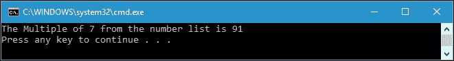
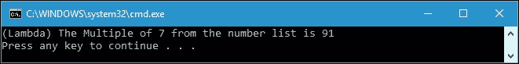
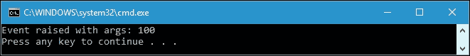

# 第三章。用 Lambda 表达式表示匿名方法

我们在前一章中介绍了委托，因为这是理解匿名方法和 lambda 表达式的先决条件，这是本章的主题。通过使用匿名方法，我们可以创建委托实例，而不需要单独的方法。通过使用 lambda 表达式，我们可以为匿名方法创建一个简写语法。在本章中，我们将挖掘匿名方法以及 Lambda 表达式。本章的主题如下:

*   应用委托创建和使用匿名方法
*   匿名方法到 lambda 表达式的转换
*   理解表达式树及其与λ的关系
*   使用 lambda 表达式订阅事件
*   阐述 lambda 表达式在函数式编程中的好处

# 了解匿名方法

在前一章中，我们已经讨论了如何使用命名方法声明委托。当使用命名方法时，我们必须首先创建一个方法，给它一个名称，然后将它与委托相关联。为了刷新我们的记忆，提供了一个与命名方法关联的简单委托声明，如下所示:

```cs
delegate void DelDelegate(int x); 
void DoSomething(int i) { /* Implementation */ } 
DelDelegate d = DoSomething; 

```

从前面的代码中，我们简单地创建了一个名为`DelDelegate`的委托数据类型，我们还创建了一个名为`DoSomething`的方法。有了命名方法后，我们可以将委托与方法关联起来。幸运的是，C# 2.0 中宣布了匿名方法，以方便委托的使用。它们为我们提供了一个快捷方式来创建一个简单而简短的方法，该方法将被使用一次。声明匿名方法的语法如下:

```cs
delegate([parameters]) { implementation } 

```

匿名方法语法的每个元素的解释如下:

*   **委托**:初始化委托需要用到的关键字。
*   **参数**:我们分配给这个委托的方法所采用的参数列表。
*   **实现**:方法将要执行的代码。如果方法需要返回值，它可以应用 return 语句。

从前面的语法中，我们可以看到匿名方法是一种没有名称的方法。我们只需要定义参数和方法的实现。

## 创建匿名方法

为了进一步讨论，让我们创建一个简单的匿名方法，可以在`SimpleAnonymousMethods.csproj`项目中找到，如下所示:

```cs
public partial class Program 
{ 
  static Func<string, string> displayMessageDelegate = 
    delegate (string str) 
  { 
    return String.Format("Message: {0}", str); 
  }; 
} 

```

我们现在有一个匿名方法，我们分配给委托`displayMessageDelegate`委托。我们使用`Func`内置委托创建`displayMessageDelegate`委托，该委托只接受一个字符串参数和一个返回字符串值。如果我们需要运行匿名方法，我们可以如下调用委托:

```cs
public partial class Program 
{ 
  static void Main(string[] args) 
  { 
    Console.WriteLine( 
      displayMessageDelegate( 
          "A simple anonymous method sample.")); 
  } 
} 

```

运行上述代码后，我们将在控制台上获得以下输出:


正如我们在输出控制台窗口中看到的，我们通过调用委托名称成功地调用了匿名方法。现在，让我们回到上一章，使用其中的一些代码，并将其重构为一个匿名方法。我们将重构`SimpleDelegates.csproj`的代码，我们在上一章已经讨论过了。以下是匿名方法的声明，可以在`SimpleDelegatesRefactor.csproj`项目中找到:

```cs
public partial class Program 
{ 
  private static Func<int, int, int> AreaRectangleDelegate = 
    delegate (int a, int b) 
  { 
    return a * b; 
  }; 

  private static Func<int, int, int> AreaSquareDelegate = 
    delegate (int x, int y) 
  { 
    return x * y; 
  }; 
} 

```

在前面的代码中，我们有两个匿名方法。我们还使用`Func`委托，我们在上一章中讨论过的内置委托。要调用这些方法，我们可以调用委托名，如下所示:

```cs
public partial class Program 
{ 
  static void Main(string[] args) 
  { 
    int i = AreaRectangleDelegate(1, 2); 
    int j = AreaSquareDelegate(2, 3); 
    Console.WriteLine("i = " + i); 
    Console.WriteLine("j = " + j); 
  } 
} 

```

如果我们运行该项目，我们将获得如下输出:


与`SimpleDelegates.csproj`项目中的代码相比，我们在前面的`SimpleDelegatesRefactor.csproj`项目中的代码变得更加简单和简短，因为我们不需要声明委托。委托是在创建匿名方法的同时声明的，例如下面的代码片段:

```cs
private static Func<int, int, int> AreaRectangleDelegate = 
  delegate (int a, int b) 
{ 
  return a * b; 
}; 

```

这是我们在上一章中使用的代码，名为`SimpleDelegates.csproj`:

```cs
public partial class Program 
{ 
  private delegate int AreaCalculatorDelegate(int x, int y); 
  static int Square(int x, int y) 
  { 
    return x * y; 
  } 
} 

```

使用匿名委托，与前一章中生成的代码相比，我们简化了代码。

## 使用匿名方法作为参数

我们现在已经执行了一个匿名方法。但是，匿名方法也可以作为参数传递给方法。我们来看看下面的代码，可以在`AnonymousMethodAsArgument.csproj`项目中找到:

```cs
public partial class Program 
{ 
  private static bool IsMultipleOfSeven(int i) 
  { 
    return i % 7 == 0; 
  } 
} 

```

首先，我们在这个项目中有一个名为`FindMultipleOfSeven`的方法。该方法将被传递给以下方法的参数:

```cs
public partial class Program 
{ 
  private static int FindMultipleOfSeven(List<int> numList) 
  { 
    return numList.Find(IsMultipleOfSeven); 
  } 
} 

```

然后，我们从下面的方法中调用`FindMultipleOfSeven()`方法:

```cs
public partial class Program 
{ 
  private static void PrintResult() 
  { 
    Console.WriteLine( 
      "The Multiple of 7 from the number list is {0}", 
      FindMultipleOfSeven(numbers)); 
  } 
} 

```

我们也可以定义下面的`List`变量传递给`FindMultipleOfSeven()`方法参数:

```cs
public partial class Program 
{ 
  static List<int> numbers = new List<int>() 
  { 
    54, 24, 91, 70, 72, 44, 61, 93, 
    73, 3, 56, 5, 38, 60, 29, 32, 
    86, 44, 34, 25, 22, 44, 66, 7, 
    9, 59, 70, 47, 55, 95, 6, 42 
  }; 
} 

```

如果我们调用`PrintResult()`方法，我们将得到如下输出:



前面程序的目标是从数字列表中找到一个乘以 7 的数字。由于`91`是第一个符合该标准的数字，`FindMultipleOfSeven()`方法返回该数字。

在`FindMultipleOfSeven()`方法内部，我们可以找到传递`IsMultipleOfSeven()`方法作为参数的`Find()`方法，如下面的代码片段所示:

```cs
return numList.Find(IsMultipleOfSeven); 

```

如果我们愿意，我们可以用匿名方法替换这个方法，如下所示:

```cs
public partial class Program 
{ 
  private static int FindMultipleOfSevenLambda( 
    List<int> numList) 
  { 
    return numList.Find( 
      delegate(int i) 
      { 
        return i % 7 == 0; 
      } 
    ); 
  } 
} 

```

我们现在有了`FindMultipleOfSevenLambda()`方法，它调用`Find()`方法并将匿名方法传递给方法参数。既然已经过了匿名法，就不再需要`FindMultipleOfSeven()`法了。我们可以使用`PrintResultLambda()`方法调用`FindMultipleOfSevenLambda()`方法，如下所示:

```cs
public partial class Program 
{ 
  private static void PrintResultLambda() 
  { 
    Console.WriteLine( 
      "({0}) The Multiple of 7 from the number list is {1}", 
      "Lambda", 
      FindMultipleOfSevenLambda(numbers)); 
  } 
} 

```

执行`PrintResultLambda()`方法后，我们将获得以下输出:



从输出窗口中可以看到，我们仍然检索`91`作为`7`的数字相乘的结果。但是，我们已经成功地将匿名方法作为方法参数传递了。

## 写匿名方法——一些指南

在编写匿名方法时，我们应该记住以下几点:

*   An anonymous method has no return type in its declaration. Consider the following code snippet:

    ```cs
            delegate (int a, int b) 
            { 
              return a * b; 
            }; 

    ```

    ### 注

    在前面的委托声明中，我们没有找到返回类型，尽管我们在方法实现中找到了`return`关键字。这是因为编译器根据委托签名推断返回类型。

*   We have to match the declaration of the delegate's signature with the method's argument. This will be similar to assigning a named method to a delegate. Let's take a look at the following code snippet:

    ```cs
            private static Func<int, int, int> AreaRectangleDelegate = 
              delegate (int a, int b) 
            { 
              return a * b; 
            }; 

    ```

    ### 注

    在前面的代码片段中，我们声明了一个接受两个 int 参数并返回一个 int 值的委托。参考代表签名；我们在声明匿名方法时使用相同的签名。

*   我们不允许声明名称与所声明的匿名方法的变量冲突的变量。看看下面的代码片段:

    ```cs
            public partial class Program 
            { 
              private static void Conflict() 
              { 
                for (int i = 0; i < numbers.Count; i++) 
                { 
                  Action<int> actDelegate = delegate(int i) 
                  { 
                    Console.WriteLine("{0}", i); 
                  }; 
                  actDelegate(i); 
                } 
              } 
            } 

    ```

### 注

我们将永远无法编译前面的代码，因为我们在`Conflict()`方法和`actDelegate`委托中声明了变量`i`两次。

## 匿名方法的优点

以下是使用匿名方法的一些优点:

*   因为我们不为方法附加名称，所以如果我们只想调用一次方法，它们是一个很好的解决方案。
*   我们可以就地编写代码，而不是在代码的其他部分编写逻辑。
*   我们不需要声明匿名方法的返回类型，因为它将从分配给匿名方法的委托的签名中推断出来。
*   我们可以从匿名方法访问外部方法的局部变量。外部变量在匿名方法中捕获。
*   我们不需要为被调用一次的逻辑片段创建一个命名方法。

# λ表达式

我们现在有一个想法，匿名方法可以帮助我们创建一个简单而简短的方法。然而，在 C# 3.0 中，为了补充匿名方法，lambda 表达式被宣布，以提供一种简写符号来创建匿名方法。事实上，lambda 表达式成为编写新代码的首选方式。

现在，让我们检查最简单的 lambda 表达式语法，如下所示:

```cs
([parameters]) => expression; 

```

在 lambda 表达式语法中，我们只找到两个元素，分别是`parameters`和`expression`。像任何方法一样，lambda 表达式有一个由参数符号化的参数。lambda 表达式的实现由表达式符号化。如果只需要一个参数，我们也可以省略参数的括号。

让我们创建一个简单的 lambda 表达式，可以在`SimpleLambdaExpression.csproj`项目中找到，如下所示:

```cs
public partial class Program 
{ 
  static Func<string, string> displayMessageDelegate = 
    str => String.Format(Message: {0}", str); 
} 

```

在前面的代码中，我们声明了`displayMessageDelegate`委托，并使用 lambda 表达式将其分配给`Func`委托。类似于`SimpleDelegates.csproj`项目中的方法，为了调用委托，我们使用以下代码:

```cs
public partial class Program 
{ 
  static void Main(string[] args) 
  { 
    Console.WriteLine( 
      displayMessageDelegate( 
      "A simple lambda expression sample.")); 
  } 
} 

```

我们把`displayMessageDelegate`委托叫做方法名。输出将被发送到控制台，如下所示:


现在，让我们比较一下`SimpleAnonymousMethods.csproj`中的匿名方法和`SimpleLambdaExpression.csproj`项目中的 lambda 表达式之间的方法声明:

```cs
static Func<string, string> displayMessageDelegate = 
  delegate (string str) 
{ 
  return String.Format("Message: {0}", str); 
}; 

```

前面的代码片段是一个匿名方法声明，它比命名方法声明更短、更简单。

```cs
static Func<string, string> displayMessageDelegate = 
  str => String.Format("Message: {0}", str); 

```

前面的代码片段是一个 lambda 表达式声明，比匿名方法更短更简单。与匿名方法相比，lambda 表达式很简单。

## 将匿名方法转换为 lambda 表达式

现在，让我们讨论匿名方法到 lambda 表达式的转换。我们有以下匿名方法:

```cs
delegate (string str) 
{ 
  return String.Format("Message: {0}", str); 
}; 

```

And we want to transform it to a lambda expression, as follows:

```cs
str => String.Format("Message: {0}", str); 

```

首先，我们取出`delegate`关键词，因为我们不再需要它了；所以，代码如下:

```cs
(string str) 
{ 
  return String.Format("Message: {0}", str); 
}; 

```

然后，我们用`=>` lambda 运算符取代花括号，使其成为内联 lambda 表达式:

```cs
(string str) => return String.Format("Message: {0}", str); 

```

我们也可以删除`return`关键字，因为它只是一个返回值的单行代码。代码如下:

```cs
(string str) => String.Format("Message: {0}", str); 

```

由于前面的语法现在是表达式，而不是完整的语句，因此可以从前面的代码中删除分号，代码如下:

```cs
(string str) => String.Format("Message: {0}", str); 

```

前面的表达式是有效的 lambda 表达式。然而，为了利用 lambda 表达式，我们可以进一步简化代码。代码如下:

```cs
(str) => String.Format("Message: {0}", str); 

```

既然我们已经取出`string`数据类型，我们现在也可以取出括号:

```cs
str => String.Format("Message: {0}", str); 

```

前面的语法是我们最终的 lambda 表达式。正如我们所看到的，现在，我们的代码因为简单而变得更易读。

### 注

如果 lambda 表达式的参数列表中的括号只包含一个参数，则可以省略它。

使用 lambda 表达式，我们实际上可以在匿名方法中创建委托和表达式树类型。现在，让我们在即将到来的主题中找出这两种类型的区别。

## 使用 lambda 表达式创建委托类型

当我们在`SimpleLambdaExpression.csproj`项目中创建代码时，我们讨论了委托类型中的 lambda 表达式。现在，让我们创建另一个项目名称，通过参考以下代码来讨论这个问题:

```cs
public partial class Program 
{ 
  private static Func<int, int, int> AreaRectangleDelegate = 
    (a, b) => a * b; 
  private static Func<int, int, int> AreaSquareDelegate = 
    (x, y) => x * y; 
} 

```

同样，我们重构`SimpleDelegatesRefactor.csproj`项目，并用 lambda 表达式替换匿名方法。正如我们所看到的，lambda 表达式被赋给了一个变量类型化委托。这里，我们在委托类型中创建一个 lambda 表达式。我们可以使用在`SimpleDelegatesRefactor.csproj`项目中使用的`Main()`方法来调用`AreaRectangleDelegate`和`AreaSquareDelegate`。两个项目的结果将完全相同。

## 表达式树和λ表达式

除了创建委托，我们还可以创建表达式树，表达式树是将表达式元素(表达式、项、因子)表示为树的数据结构。通过遍历树，我们可以解释表达式树，或者我们可以变异树中的一个节点来转换代码。用编译器的说法，表达式树被称为**抽象语法树** ( **AST** )。

现在，让我们看一下下面的代码片段，以便将 lambda 表达式分配给前面讨论过的委托:

```cs
Func<int, int, int> AreaRectangleDelegate = 
  (a, b) => a * b; 

```

正如我们所看到的，在前面的陈述中有三个部分。它们如下:

*   **变量类型的委托声明** : `Func<int, int, int> AreaRectangleDelegate`
*   **一个平等的操作员** : `=`
*   **λ表达式** : `(a, b) => a * b`

我们将把前面的代码语句翻译成数据。为了实现这个目标，我们需要创建一个`Expression<T>`类型的实例，`T`是委托类型。`Expression<T>`类型在`System.Linq.Expressions`命名空间中定义。在项目中使用这个名称空间后，我们可以将前面的代码翻译成表达式树，如下所示:

```cs
public partial class Program 
{ 
  static void Main(string[] args) 
  { 
    Expression<Func<int, int, int>> expression = 
      (a, b) => a * b; 
  } 
} 

```

我们已经将前面的委托 lambda 表达式转换为声明为类型`Expression<T>`的表达式树。前面代码中的变量表达式不是可执行代码，而是称为表达式树的数据结构。`Expression<T>`类中有四个基本属性，我们将详细讨论。它们如下:

*   **正文**:这里包含了正文的表述
*   **参数**:包含λ表达式的参数
*   **节点类型**:包含树中节点的`ExpressionType`类型
*   **类型**:包含表达式的静态类型

现在，让我们在表达式变量中添加一个断点，并通过在`LambdaExpressionInExpressionTree.csproj`项目中按下 **F5** 来运行调试过程。执行表达式声明行后，我们可以在 Visual Studio IDE 中查看变量窗口，我们将获得以下截图:


从前面的截图中，我们有一个包含`{(a * b)}`、`NodeType`包含 Lambda、`Type`包含带有三个模板的`Func`委托的`Body`属性，并且是两个参数。如果我们在变量窗口中展开`Body`信息，我们将得到类似于下面截图所示的结果:


从前面的截图中，我们可以看到我们有包含`{a}`的`Left`属性和包含`{b}`的`Right`属性。使用这些属性，我们还可以以编程方式探索表达式树的主体。下面的代码是`exploreBody()`方法，将探索`Body`的属性:

```cs
public partial class Program 
{ 
  private static void exploreBody( 
    Expression<Func<int, int, int>> expr) 
  { 
    BinaryExpression body = 
      (BinaryExpression)expr.Body; 
    ParameterExpression left = 
      (ParameterExpression)body.Left; 
    ParameterExpression right = 
      (ParameterExpression)body.Right; 
    Console.WriteLine(expr.Body); 
    Console.WriteLine( 
      "\tThe left part of the expression: {0}\n" + 
      "\tThe NodeType: {1}\n" + 
      "\tThe right part: {2}\n" + 
      "\tThe Type: {3}\n", 
      left.Name, 
      body.NodeType, 
      right.Name, 
      body.Type); 
  } 
} 

```

如果我们运行前面的`exploreBody()`方法，我们将得到如下输出:


在前面的代码中，我们以编程方式访问`Expression<T>`的 Body 属性。我们需要创建一个`BinaryExpression`数据类型来获取`Body`内容，以及`ParameterExpression`来获取`Left`和`Right`属性内容。`BinaryExpression`和`ParameterExpression`数据的代码片段如下:

```cs
BinaryExpression body = 
  (BinaryExpression)expr.Body; 
ParameterExpression left = 
  (ParameterExpression)body.Left; 
ParameterExpression right = 
  (ParameterExpression)body.Right; 

```

我们已经成功地从表达式树中的代码创建了一个数据结构。如果我们愿意，我们可以通过编译表达式将这些数据转换回代码。我们的表达式如下:

```cs
Expression<Func<int, int, int>> expression = 
  (a, b) => a * b; 

```

因此，我们可以使用以下`compilingExpr()`方法编译表达式并运行表达式中的代码:

```cs
public partial class Program 
{ 
  private static void compilingExpr( 
    Expression<Func<int, int, int>> expr) 
  { 
    int a = 2; 
    int b = 3; 
    int compResult = expr.Compile()(a, b); 
    Console.WriteLine( 
      "The result of expression {0}"+ 
      " with a = {1} and b = {2} is {3}", 
      expr.Body, 
      a, 
      b, 
      compResult); 
  } 
} 

```

如果我们运行`compilingExpr()`方法，控制台窗口将显示以下输出:


可以看到，我们已经在表达式类中使用`Compile()`方法编译了表达式，如下所示:

```cs
int compResult = expr.Compile()(a, b); 

```

`expr.Compile()`方法根据表达式的类型产生类型为`Func<int, int, int>`的委托。我们给`Compile()`方法基于其签名的参数`a`和`b`，然后它返回`int`值。

# 使用 lambda 表达式订阅事件

在 C#中，一个对象或一个类可以用来在某件事情发生时通知其他对象或类，这就是所谓的事件。事件中有两种类，它们是发布者和订阅者。发布者是发送(或引发)事件的类或对象，而订阅者是接收(或处理)事件的类或对象。幸运的是，lambda 表达式也可以用来处理事件。让我们看看下面的代码，进一步讨论事件:

```cs
public class EventClassWithoutEvent 
{ 
  public Action OnChange { get; set; } 
  public void Raise() 
  { 
    if (OnChange != null) 
    { 
      OnChange(); 
    } 
  } 
} 

```

前面的代码可以在`EventsInLambda.csproj`项目中找到。我们可以看到，项目中已经创建了一个名为`EventClassWithoutEvent`的类。该类有一个名为`OnChange`的属性。该属性的作用是存储订阅该类的操作，并将在调用`Raise()`方法时运行。现在，让我们使用下面的代码来使用`Raise()`方法:

```cs
public partial class Program 
{ 
  private static void CreateAndRaiseEvent() 
  { 
    EventClassWithoutEvent ev = new EventClassWithoutEvent(); 
    ev.OnChange += () => 
      Console.WriteLine("1st: Event raised"); 
    ev.OnChange += () => 
      Console.WriteLine("2nd: Event raised"); 
    ev.OnChange += () => 
      Console.WriteLine("3rd: Event raised"); 
    ev.OnChange += () => 
      Console.WriteLine("4th: Event raised"); 
    ev.OnChange += () => 
      Console.WriteLine("5th: Event raised"); 
    ev.Raise(); 
  } 
} 

```

如果我们运行前面的`CreateAndRaiseEvent()`方法，我们将在控制台上检索以下输出:


从代码中，我们可以看到当我们调用`CreateAndRaiseEvent()`方法时，代码实例化了一个`EventClassWithoutEvent`类。然后，它在 lambda 表达式中用五种不同的方法订阅事件，然后通过调用`Raise()`方法引发事件。下面的代码片段将进一步解释这一点:

```cs
EventClassWithoutEvent ev = new EventClassWithoutEvent(); 
ev.OnChange += () => 
  Console.WriteLine("1st: Event raised"); 
ev.Raise(); 

```

从前面的代码片段中，我们可以看到 lambda 表达式可以用于订阅事件，因为它使用委托来存储订阅的方法。然而，在前面的代码中仍然有一个弱点。看看这段代码的最后一个`OnChange`赋值:

```cs
ev.OnChange += () => 
  Console.WriteLine("5th: Event raised"); 

```

现在，假设我们把它改成:

```cs
ev.OnChange = () => 
  Console.WriteLine("5th: Event raised"); 

```

然后，我们将删除所有四个以前的订户。另一个弱点是`EventClassWithoutEvent`引发事件，但是没有什么可以阻止类的用户引发这个事件。通过调用`OnChange()`，该类的所有用户都可以向所有订阅者发起事件。

## 使用事件关键字

使用`event`关键字可以解决我们前面的问题，因为它将强制该类的用户仅使用`+=`或`-=`运算符订阅某些内容。让我们看看下面的代码来进一步解释这一点:

```cs
public class EventClassWithEvent 
{ 
  public event Action OnChange = () => { }; 
  public void Raise() 
  { 
    OnChange(); 
  } 
} 

```

从前面的代码中，我们可以看到我们不再使用公共属性，而是使用`EventClassWithEvent`类中的公共字段。使用`event`关键字，编译器将保护我们的字段免受不必要的访问。事件关键字还将保护订阅列表，因为它不能使用`=`运算符分配给任何 lambda 表达式，而必须与`+=`或`-=`运算符一起使用。现在，让我们看看下面的代码来证明这一点:

```cs
public partial class Program 
{ 
  private static void CreateAndRaiseEvent2() 
  { 
    EventClassWithEvent ev = new EventClassWithEvent(); 
    ev.OnChange += () => 
      Console.WriteLine("1st: Event raised"); 
    ev.OnChange += () => 
      Console.WriteLine("2nd: Event raised"); 
    ev.OnChange += () => 
      Console.WriteLine("3rd: Event raised"); 
    ev.OnChange += () => 
      Console.WriteLine("4th: Event raised"); 
    ev.OnChange = () => 
      Console.WriteLine("5th: Event raised"); 
    ev.Raise(); 
  } 
} 

```

我们现在有一个名为`CreateAndRaiseEvent2()`的方法，它与`CreateAndRaiseEvent()`方法完全相同，只是最后一个`OnChange`赋值使用了`=`运算符而不是`+=`运算符。但是，由于我们将事件关键字应用到了`OnChange`字段，因此无法编译代码，将出现`CS0070`错误代码，如下图截图所示:


不再有风险，因为事件关键字限制了`=`运算符的使用。`event`关键字还防止类的外部用户引发事件。只有类中定义事件的部分才能引发事件。我们来看看`EventClassWithoutEvent`和`EventClassWithEvent`班的区别:

```cs
public partial class Program 
{ 
  private static void CreateAndRaiseEvent3() 
  { 
    EventClassWithoutEvent ev = new EventClassWithoutEvent(); 
    ev.OnChange += () => 
      Console.WriteLine("1st: Event raised"); 
    ev.OnChange += () => 
      Console.WriteLine("2nd: Event raised"); 
    ev.OnChange += () => 
      Console.WriteLine("3rd: Event raised"); 
    ev.OnChange(); 
    ev.OnChange += () => 
      Console.WriteLine("4th: Event raised"); 
    ev.OnChange += () => 
      Console.WriteLine("5th: Event raised"); 
    ev.Raise(); 
  } 
} 

```

前面`CreateAndRaiseEvent3()`法的参考是`CreateAndRaiseEvent()`，但是我们插入`ev.OnChange()`；在第三个事件和第四个事件之间。如果我们运行该方法，它将成功运行，并且我们将在控制台上看到以下输出:


从输出中我们可以看到，`EventClassWithoutEvent`类中的`OnChange()`可以引发事件。与`EventClassWithEvent`类相比，如果我们在任何订阅事件之间插入`OnChange()`，编译器将创建一个编译错误，如以下代码所示:

```cs
public partial class Program 
{ 
  private static void CreateAndRaiseEvent4() 
  { 
    EventClassWithEvent ev = new EventClassWithEvent(); 
    ev.OnChange += () => 
      Console.WriteLine("1st: Event raised"); 
    ev.OnChange += () => 
      Console.WriteLine("2nd: Event raised"); 
    ev.OnChange += () => 
      Console.WriteLine("3rd: Event raised"); 
    ev.OnChange(); 
    ev.OnChange += () => 
      Console.WriteLine("4th: Event raised"); 
    ev.OnChange += () => 
      Console.WriteLine("5th: Event raised"); 
    ev.Raise(); 
  } 
} 

```

如果我们编译前面的代码，我们将再次得到`CS0070`错误代码，因为我们插入了`ev.OnChange()`；在第三个事件和第四个事件之间。

## 使用事件处理程序或事件处理程序< T >

实际上，C#有一个名为`EventHandler`或`EventHandler<T>`的类，我们可以用它来初始化一个事件，而不是使用`Action`类。一个`EventHandler`类接受一个发送者对象和事件参数。发送方是引发事件的对象。使用`EventHandler<T>`，我们可以定义事件参数的类型。我们来看看下面的代码，可以在`EventWithEventHandler.csproj`项目中找到:

```cs
public class MyArgs : EventArgs 
{ 
  public int Value { get; set; } 
  public MyArgs(int value) 
  { 
    Value = value; 
  } 
} 
public class EventClassWithEventHandler 
{ 
  public event EventHandler<MyArgs> OnChange = 
    (sender, e) => { }; 
  public void Raise() 
  { 
    OnChange(this, new MyArgs(100)); 
  } 
} 

```

我们有两个班，分别叫`MyArgs`和`EventClassWithEventHandler`。`EventClassWithEventHandler`类使用`EventHandler<MyArgs>`，这定义了事件参数的类型。我们在提出这个事件时需要举一个`MyArgs`的例子。事件的订阅者可以访问参数并使用它们。现在，我们来看看下面的`CreateAndRaiseEvent()`方法代码:

```cs
public partial class Program 
{ 
  private static void CreateAndRaiseEvent() 
  { 
    EventClassWithEventHandler ev = 
      new EventClassWithEventHandler(); 
    ev.OnChange += (sender, e) 
      => Console.WriteLine( 
          "Event raised with args: {0}", e.Value); 
    ev.Raise(); 
  } 
} 

```

如果我们运行前面的代码，我们将在控制台上获得以下输出:



从前面的代码中，我们可以看到 lambda 表达式扮演了订阅事件的角色，如下所示:

```cs
ev.OnChange += (sender, e) 
  => Console.WriteLine( 
      "Event raised with args: {0}", e.Value); 

```

# 在函数式编程中使用 lambda 表达式的优点

Lambda 表达式不仅是为匿名方法提供速记符号的强大方法，而且也用于函数式编程。在本节中，我们将介绍在函数式编程环境中使用 lambda 表达式的优势。

## 一级功能

在[第 1 章](01.html "Chapter 1. Tasting Functional Style in C#")、*品尝 C#* 中的函数风格，我们在讨论函数编程的时候讨论了一级函数的思想。如果函数是火类函数，函数服从值语义。它们可以作为参数传递，从函数返回，等等。如果我们回到前面关于 lambda 表达式的主题，我们有一个名为`SimpleLambdaExpression.csproj`的项目，它有以下简单的 lambda 表达式:

```cs
public partial class Program 
{ 
  static Func<string, string> displayMessageDelegate = 
    str => String.Format(Message: {0}", str); 
} 

```

然后，我们可以将以下`firstClassConcept()`方法添加到项目中，以便使用 lambda 表达式演示一级函数:

```cs
public partial class Program 
{ 
  static private void firstClassConcept() 
  { 
    string str = displayMessageDelegate( 
      "Assign displayMessageDelegate() to variable"); 
      Console.WriteLine(str); 
  } 
} 

```

如我们所见，我们已经成功地将`displayMessageDelegate()`方法分配给名为`str`的变量，如下所示:

```cs
string str = displayMessageDelegate( 
  "Assign displayMessageDelegate() to variable"); 

```

如果我们运行代码，我们将在控制台上获得以下输出:


我们也可以传递 lambda 表达式作为另一个函数的参数。使用`displayMessageDelegate`，我们来看看下面的代码:

```cs
public partial class Program 
{ 
  static private void firstClassConcept2( 
    Func<string, string> funct, 
    string message) 
  { 
    Console.WriteLine(funct(message)); 
  } 
} 

```

我们有一个叫`firstClassConcept2`的方法，取`Func`和字符串参数。我们可以按如下方式运行该方法:

```cs
public partial class Program 
{ 
  static void Main(string[] args) 
  { 
    firstClassConcept2( 
      displayMessageDelegate, 
      "Pass lambda expression to argument"); 
  } 
} 

```

如我们所见，我们将λ表达式`displayMessageDelegate`传递给`firstClassConcept2()`方法。如果我们运行该项目，我们将在控制台窗口上看到以下输出:


既然我们已经成功地将一个函数赋给了一个变量，并将一个函数传递给了另一个函数参数，那么我们可以说 lambda 表达式是在函数式编程中创建一流函数的有力工具。

## 关闭

闭包是一个函数，它能够用自由变量赋给变量(一级函数)，自由变量在词法环境中被绑定。自由变量是不是参数的变量；或者它是一个局部变量。在闭包中，任何未绑定的变量都将从定义闭包的词法环境中捕获。为了避免混淆这个术语，让我们来看看下面的代码，我们可以在`Closure.csproj`项目中找到:

```cs
public partial class Program 
{ 
  private static Func<int, int> GetFunction() 
  { 
    int localVar = 1; 
    Func<int, int> returnFunc = scopeVar => 
    { 
      localVar *= 2; 
      return scopeVar + localVar; 
    }; 
  return returnFunc; 
  } 
} 

```

从前面的代码中，我们可以看到我们得到了一个名为`localVar`的局部变量，当调用`GetFunction()`方法时，它将被乘以 2。当返回`returnValue`时，`localVar`变量被绑定在 lambda 表达式中。通过分析前面的代码而不运行它，我们可能会猜测`GetFunction()`将返回`returnFunc`，每次它被传递给同一个参数时都会返回相同的值。这是因为每次调用`GetFunction()`时`localVar`总是 *1* ，因为它是一个局部变量。正如我们在编程中所学的，局部变量是在堆栈上创建的，当方法完成执行时，它们就会消失。现在，让我们使用下面的代码调用`GetFunction()`方法来证明我们的猜测:

```cs
public partial class Program 
{ 
  static void Main(string[] args) 
  { 
    Func<int, int> incrementFunc = GetFunction(); 
    for (int i = 0; i < 10; i++) 
    { 
      Console.WriteLine( 
        "Invoking {0}: incrementFunc(1) = {1}", 
        i, 
        incrementFunc(1)); 
    } 
  } 
} 

```

我们要调用`incrementFunc()`方法，这是`GetFunction()`方法十次的返回值，但是我们总是传递 1 作为参数。根据我们之前的猜测，我们可以说`incrementFunc(1)`方法对于所有十次调用总是会返回`3`。现在，让我们运行该项目，我们将在控制台上看到以下输出:


根据前面的输出，我们做了一个错误的猜测。`localVar`变量与`GetFunction()`方法一起存在。它在每次调用方法时乘以 2 后存储其值。我们已经成功地在词法环境中绑定了一个自由变量，这就是我们所说的闭包。

# 总结

在本章中，我们发现匿名方法是一种没有名称的方法。我们只需要定义参数和方法的实现。这是代表们的速记符号。然后，我们看了 lambda 表达式，这是函数式编程中的强大工具，可以提供匿名方法的简写符号。

lambda 表达式还可以用来形成一个表达式树，当我们需要用常规 C#表达代码、解构代码、检查代码和解释代码时，这个表达式树会很有用。表达式树就像是对代码的解释。如果我们有一个`<Func<int, int, int>>`表达式，它解释了如果我们给代码两个整数，它将如何提供一个`int`返回。

订阅事件也是通过 lambda 表达式完成的。事件中有两种类，它们是发布者和订阅者，我们可以使用 lambda 表达式订阅事件。不管我们使用`event`关键字还是`EventHandler`关键字，lambda 总是用于订阅事件。

第一类函数概念也由 lambda 表达式实现，因为通过使用它，我们可以将函数赋给一个变量，或者将函数作为其他函数的参数传递。使用 lambda 表达式，我们还可以应用闭包概念，这使得一个局部变量存在于函数中。

目前，讨论 lambda 表达式就足够了。然而，当我们在[第 5 章](05.html "Chapter 5. Querying Any Collection Easily with LINQ")、*和 LINQ* 中讨论 LINQ 时，我们将再次更详细地讨论λ表达式。并且，在下一章中，我们将讨论可用于扩展方法能力的扩展方法。