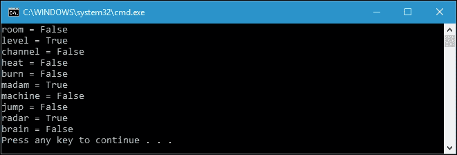
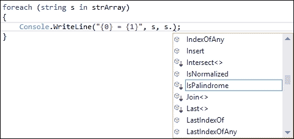
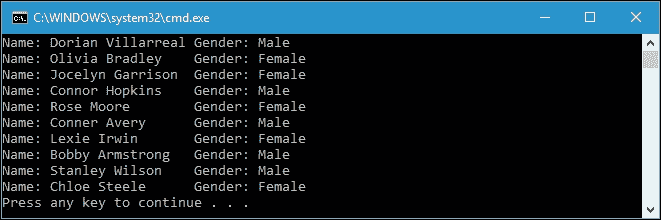
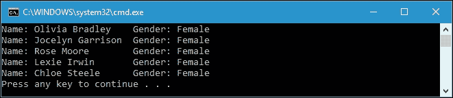

# 第四章。用扩展方法扩展对象功能

正如我们在上一章中已经提到的，我们将在本章中更详细地讨论扩展方法。在下一章中，当我们谈到 LINQ 时，这将是很有帮助的，这是 C#中函数式编程的基本技术。以下是我们将在本章中讨论的主题:

*   练习扩展方法的使用，并在智能感知中获得这种新方法
*   从其他程序集中调用扩展方法
*   为接口、集合、枚举和其他对象创建新方法
*   扩展方法相对于函数式编程的优势
*   可拓方法的局限性

# 越来越接近可拓方法

扩展方法是一种能力，它可以扩展现有类或类型的能力，而无需对现有类或类型进行任何修改。这意味着扩展方法使我们能够向现有的类或类型添加方法，而不必创建新的派生类型或重新编译。

扩展方法是在 C# 3.0 中引入的，可以应用于我们自己的类型或. NET 中的现有类型。扩展方法将在函数式编程中大量使用，因为它适合方法链接概念，我们已经在[第 1 章](01.html "Chapter 1. Tasting Functional Style in C#")、*中使用了该概念，在以函数式重构代码时，在 C#* 中尝试函数式。

## 创建扩展方法

扩展方法必须在静态、非泛型和非嵌套类中声明。它们是静态类中的静态方法。要创建扩展方法，首先我们必须创建一个`public static`类，因为扩展方法必须包含在`static`类中。成功创建`public static`类后，我们在类中定义一个方法，并在第一个方法参数中添加`this`关键字，以表明它是一个`extension`方法。方法中具有`this`关键字的第一个参数必须引用我们想要扩展的类的特定实例。为了让解释更清晰，我们来看看下面的代码，创建一个我们可以在`Palindrome.csproj`项目中找到的扩展方法:

```cs
public static class ExtensionMethods 
{ 
  public static bool IsPalindrome(this string str) 
  { 
    char[] array = str.ToCharArray(); 
    Array.Reverse(array); 
    string backwards = new string(array); 
    return str == backwards; 
  } 
} 

```

现在让我们剖析前面的代码，了解扩展方法是如何创建的。首先，我们必须成功创建`public static`类，如下面的代码片段所示:

```cs
public static class ExtensionMethods 
{ 
  ... 
} 

```

然后，我们在类内部创建一个`static`方法，如下面的代码片段所示:

```cs
public static bool IsPalindrome(this string str) 
{ 
  ... 
} 

```

正如我们在前面的方法中看到的，我们在方法的第一个参数中添加了`this`关键字。这表明该方法是一种`extension`方法。另外，第一个参数的类型是 string，表示我们想要扩展的类型是`string`数据类型。现在，通过为`string`类型定义`IsPalindrome()`扩展方法，字符串的所有实例都有`IsPalindrome()`方法。让我们看看下面的代码来证明这一点:

```cs
public class Program 
{ 
  static void Main(string[] args) 
  { 
    string[] strArray = { 
      "room", 
      "level", 
      "channel", 
      "heat", 
      "burn", 
      "madam", 
      "machine", 
      "jump", 
      "radar", 
      "brain" 
    }; 
    foreach (string s instrArray) 
    { 
      Console.WriteLine("{0} = {1}", s, s.IsPalindrome()); 
    } 
  } 
} 

```

前面的`Main()`函数将检查`strArray`数组的所有成员，无论它是否是回文。我们可以从`s`变量中调用`IsPalindrome()`方法，其中它是一个`string`类型的变量。从字符串类型的实例调用`IsPalindrome()`方法时的代码片段如下:

```cs
foreach (string s instrArray) 
{ 
  Console.WriteLine("{0} = {1}", s, s.IsPalindrome()); 
} 

```

如果我们运行`Palindrome.csproj`项目，我们可以在控制台上获得以下输出:



由于回文是一个单词或另一个字符序列，无论我们向前还是向后阅读都是一样的，所以如果我们调用`IsPalindrome()`方法，只有`level`、`madam`和`radar`会返回`true`。我们的扩展方法已经成功创建并运行。

## 代码中的扩展方法智能感知

例如，当我们创建一个扩展方法时，对于一个类型，与类或类型中的现有方法相比，没有明显的区别。这是因为我们在调用扩展方法或实际在类型中定义的方法时会做同样的事情。但是，我们可以检查代码 IntelliSense，以了解类型内部的方法是否是扩展方法，因为扩展方法将显示在 IntelliSense 中。以下截图为`IsPalindrome()`扩展方法尚未定义时字符串实例的方法列表:


下面的截图是定义`IsPalindrome()`扩展方法时字符串实例的方法列表:



从前面两张图片中我们可以看到，扩展将在 Visual Studio 的代码 IntelliSense 中列出。然而，我们现在可以找到扩展方法和实际定义在图标类型中的方法之间的区别。有一个箭头指向扩展方法的图标，尽管我们在一个类型中实际定义的方法中找不到它。这是因为图标不同，但是我们调用方法的方式完全相同。

# 调用其他程序集中的扩展方法

我们已经成功创建了上一节中的`IsPalindrome()`扩展方法。调用扩展方法非常容易，因为它是在与调用方方法相同的命名空间中定义的。换句话说，`IsPalindrome()`扩展方法和`Main()`方法在同一个名称空间中。我们不需要添加对任何模块的引用，因为方法和调用者在一起。然而，在通常的实践中，我们可以在其他程序集中创建扩展方法，我们通常称之为类库。库的使用将简化扩展方法的使用，因为它可以被重用，所以我们可以在许多项目中使用扩展方法。

## 引用命名空间

我们将在`Class Library`中创建一个扩展方法，并在另一个项目中调用它。让我们创建一个名为`ReferencingNamespaceLib.csproj`的新`Class Library`项目，并将以下代码插入到`ExtensionMethodsClass.cs`文件中:

```cs
using System; 
namespaceReferencingNamespaceLib 
{ 
  public static class ExtensionMethodsClass 
  { 
    public static byte[] ConvertToHex(this string str) 
    { 
      int i = 0; 
      byte[] HexArray = new byte[str.Length]; 
      foreach (char ch in str) 
      { 
        HexArray[i++] = Convert.ToByte(ch); 
      } 
      returnHexArray; 
    } 
  } 
} 

```

从前面的代码中，我们可以看到我们在`ReferencingNamespaceLib`命名空间的`ExtensionMethodsClass`类中创建了`ConvertToHex()`扩展方法。`ConvertToHex()`扩展方法的使用是将字符串中的每个字符转换为 ASCII 码，并将其存储在字节数组中。现在让我们看看下面的代码，它将调用扩展方法，我们可以在`ReferencingNamespace.csproj`项目中找到它:

```cs
using System; 
using ReferencingNamespaceLib; 
namespace ReferencingNamespace 
{ 
  class Program 
  { 
    static void Main(string[] args) 
    { 
      int i = 0; 
      string strData = "Functional in C#"; 
      byte[] byteData = strData.ConvertToHex(); 
      foreach (char c in strData) 
      { 
        Console.WriteLine("{0} = 0x{1:X2} ({2})", 
        c.ToString(), 
        byteData[i], 
        byteData[i++]); 
      } 
    } 
  } 
} 

```

从前面的代码中，我们可以看到我们从字符串的实例中调用`ConvertToHex()`扩展方法，即`strData`，如下所示:

```cs
string strData = "Functional in C#"; 
byte[] byteData = strData.ConvertToHex(); 

```

但是，为了从字符串实例中调用`ConvertToHex()`方法，我们必须引用`ReferencingNamespaceLib`程序集，并且还要导入引用程序集的命名空间。要导入程序集，我们必须使用`using`和`ReferencingNamespaceLib`，如以下代码片段所示:

```cs
usingReferencingNamespaceLib; 

```

如果我们运行`ReferencingNamespace.csproj`项目，我们将在控制台上获得以下输出:


如我们所见，C#语句中的每个字符都被转换成 ASCII 代码，并通过引用十六进制和十进制格式的命名空间来调用我们为字符串类型创建的扩展方法。这也证明了我们已经在另一次组装中成功了。

## 搭载命名空间

如果我们愿意，我们可以搭载在字符串类型所在的命名空间上，这就是`System`命名空间，这样我们就不需要导入自定义的命名空间来使用扩展方法。搭载一个名称空间对我们的标准编程方法也是有好处的。让我们使用下面的代码重构我们之前的`ReferencingNamespaceLib.csproj`代码，我们可以在`PiggybackingNamespaceLib.csproj`项目中找到:

```cs
namespace System 
{ 
  public static class ExtensionMethodsClass 
  { 
    public static byte[] ConvertToHex(this string str) 
    { 
      int i = 0; 
      byte[] HexArray = new byte[str.Length]; 
      foreach (char ch in str) 
      { 
        HexArray[i++] = Convert.ToByte(ch); 
      } 
      return HexArray; 
    } 
  } 
} 

```

如果我们观察类名、`ConvertToHex()`方法签名或者方法的实现，我们会发现`ReferencingNamespaceLib.csproj`和`PiggybackingNamespaceLib.csproj`项目没有区别。但是，如果我们看名字空间名称，我们会发现现在是`System`而不是`PiggybackingNamespaceLib`。我们使用`System`命名空间的原因是为了在选定的命名空间中创建一个扩展方法。既然我们想要扩展存在于`System`名称空间中的字符串类型的能力，我们也必须扩展`System`名称空间。我们不需要使用`using`关键字导入`System`名称空间，因为`ConvertToHex()`方法位于`System`名称空间中。现在，让我们看看下面的代码，以便调用`System`命名空间中的`ConvertToHex()`方法，我们可以在`PiggybackingNamespace.csproj`项目中找到该方法:

```cs
using System; 
namespace PiggybackingNamespace 
{ 
  class Program 
  { 
    static void Main(string[] args) 
    { 
      int i = 0; 
      string strData = "Piggybacking"; 
      byte[] byteData = strData.ConvertToHex(); 
      foreach (char c in strData) 
      { 
        Console.WriteLine("{0} = 0x{1:X2} ({2})", 
        c.ToString(), 
        byteData[i], 
        byteData[i++]); 
      } 
    } 
  } 
} 

```

我们从`ReferencingNamespace.csproj`项目中重构了前面的代码，同样，我们没有发现`PiggybackingNamespace.csproj`和`ReferencingNamespace.csproj`项目之间有任何区别，除了没有导入到`PiggybackingNamespace.csproj`项目中的自定义命名空间，而`ReferencingNamespace.csproj`项目有:

```cs
using ReferencingNamespaceLib; 

```

我们不需要导入自定义的名称空间，因为我们在`System`名称空间中创建了扩展方法。但是，我们仍然需要引用定义扩展方法的程序集。我们可以预期如下图所示的输出:


我们已经成功调用了`ConvertToHex()`扩展方法，并发现它对于从字符串数据类型中获取 ASCII 代码非常有用。

# 利用接口、集合和对象

不仅类和类型可以应用扩展方法，接口、集合和任何其他对象也可以使用扩展方法进行功能扩展。我们将在接下来的章节中讨论这个问题。

## 扩展接口

我们可以像在类或类型中扩展方法一样，在接口中扩展方法。我们仍然需要`public static`类和`public static`方法。通过扩展接口能力，我们可以在创建扩展方法后立即使用它，而不需要在从接口继承的类中创建实现，因为实现是在我们声明扩展方法时完成的。我们来看看下面的`DataItem`课，可以在`ExtendingInterface.csproj`项目中找到:

```cs
namespace ExtendingInterface 
{ 
  public class DataItem 
  { 
    public string Name { get; set; } 
    public string Gender { get; set; } 
  } 
} 

```

我们还有以下`IDataSource`界面:

```cs
namespace ExtendingInterface 
{ 
  public interface IDataSource 
  { 
    IEnumerable<DataItem> GetItems(); 
  } 
} 

```

我们可以看到，`IDataSource`界面只有一个方法的签名，名为`GetItems()`，返回`IEnumerable<DataItem>`。现在，我们可以创建一个类来继承`IDataSource`接口，我们给它起了个名字，`ClubMember`；它有`GetItems()`方法的实现，如下所示:

```cs
public partial class ClubMember : IDataSource 
{ 
  public IEnumerable<DataItem> GetItems() 
  { 
    foreach (var item in DataItemList) 
    { 
      yield return item; 
    } 
  } 
} 

```

从前面的类中，`GetItems()`方法将产生`DataItemList`中的所有数据，其内容如下:

```cs
public partial class ClubMember : IDataSource 
{ 
  List<DataItem> DataItemList = new List<DataItem>() 
  { 
    newDataItem{ 
      Name ="Dorian Villarreal", 
      Gender ="Male"}, 
    newDataItem{ 
      Name ="Olivia Bradley", 
      Gender ="Female"}, 
    newDataItem{ 
      Name ="Jocelyn Garrison", 
      Gender ="Female"}, 
    newDataItem{ 
      Name ="Connor Hopkins", 
      Gender ="Male"}, 
    newDataItem{ 
      Name ="Rose Moore", 
      Gender ="Female"}, 
    newDataItem{ 
      Name ="Conner Avery", 
      Gender ="Male"}, 
    newDataItem{ 
      Name ="Lexie Irwin", 
      Gender ="Female"}, 
    newDataItem{ 
      Name ="Bobby Armstrong", 
      Gender ="Male"}, 
    newDataItem{ 
      Name ="Stanley Wilson", 
      Gender ="Male"}, 
    newDataItem{ 
      Name ="Chloe Steele", 
      Gender ="Female"} 
  }; 
} 

```

`DataItemList`里有十个`DataItem`班。借助`GetItems()`方法，我们可以显示`DataItemList`中的所有项目，如下所示:

```cs
public class Program 
{ 
static void Main(string[] args) 
  { 
    ClubMember cm = new ClubMember(); 
    foreach (var item in cm.GetItems()) 
    { 
      Console.WriteLine( 
        "Name: {0}\tGender: {1}", 
          item.Name, 
            item.Gender); 
    } 
  } 
} 

```

正如我们在前面的代码中可以看到的，由于我们已经将`ClubMember`类继承到了`IDataSource`接口，并且已经实现了`GetItems()`方法，所以`ClubMember`的实例，也就是`cm`，可以调用`GetItems()`方法。当我们运行项目时，输出将如下面的截图所示:



现在，如果我们想将方法添加到接口而不必修改它，我们可以为接口创建一个方法扩展。考虑我们将要在`IDataSource`界面添加`GetItemsByGender()`方法；我们可以如下创建扩展方法:

```cs
namespaceExtendingInterface 
{ 
  public static class IDataSourceExtension 
  { 
    public static IEnumerable<DataItem>
      GetItemsByGender(thisIDataSourcesrc,string gender) 
    { 
      foreach (DataItem item in src.GetItems()) 
      { 
        if (item.Gender == gender) 
          yield return item; 
      } 
    } 
  } 
} 

```

通过创建前面的扩展方法，`ClubMember`类的实例现在有了一个名为`GetItemsByGender()`的方法。我们可以像使用方法类一样使用这个扩展方法，如下所示:

```cs
public class Program 
{ 
  static void Main(string[] args) 
  { 
    ClubMember cm = new ClubMember(); 
    foreach (var item in cm.GetItemsByGender("Female")) 
    { 
      Console.WriteLine( 
        "Name: {0}\tGender: {1}", 
        item.Name, 
        item.Gender); 
    } 
  } 
} 

```

`GetItemsByGender()`方法将返回`DataItemList`所选性别的`IEnumerable`界面。由于我们只需要获取列表中的所有女性成员，因此输出如下:



我们现在可以在接口中扩展该方法，并且不需要在继承的类中实现该方法，因为它已经在扩展方法定义中实现了。

## 扩展集合

在我们之前的讨论中，我们发现我们应用`IEnumerable`界面是为了收集我们需要的所有数据。我们还可以扩展`IEnumerable`接口，这是一个集合类型，这样我们就可以在一个集合类型的实例中添加一个方法。

以下是`ExtendingCollection.csproj`项目中的代码，我们仍然使用`DataItem.cs`和`IDataSource.cs`，我们在`ExtendingInterface.csproj`项目中使用它们。让我们看看下面的代码:

```cs
public static partial class IDataSourceCollectionExtension 
{ 
  public static IEnumerable<DataItem>
    GetAllItemsByGender_IEnum(thisIEnumerablesrc,string gender) 
  { 
    var items = new List<DataItem>(); 
    foreach (var s in src) 
    { 
      var refDataSource = s as IDataSource; 
      if (refDataSource != null) 
      { 
        items.AddRange(refDataSource.GetItemsByGender(gender)); 
       } 
    } 
    return items; 
  } 
} 

```

前面的代码是`IEnumerable`类型的扩展方法。为了防止错误的发生，我们必须使用下面的代码片段强制转换所有源项的类型:

```cs
var refDataSource = s as IDataSource; 

```

我们也可以扩展`IEnumerable<T>`类型，如下:

```cs
public static partial class IDataSourceCollectionExtension 
{ 
  public static IEnumerable<DataItem> 
  GetAllItemsByGender_IEnumTemplate
    (thisIEnumerable<IDataSource> src, string gender) 
  { 
    return src.SelectMany(x =>x.GetItemsByGender(gender)); 
  } 
} 

```

使用前面的方法，我们可以扩展`IEnumerable<T>`类型，得到一个名为`GetAllItemsByGender_IEnumTemplate()`的方法，用于按特定性别获取项目。

现在，我们准备好调用这两个扩展方法。但是，在我们调用它们之前，让我们创建以下两个类，命名为`ClubMember1`和`ClubMember2`:

```cs
public class ClubMember1 : IDataSource 
{ 
  public IEnumerable<DataItem> GetItems() 
  { 
    return new List<DataItem> 
    { 
      newDataItem{ 
        Name ="Dorian Villarreal", 
        Gender ="Male"}, 
      newDataItem{ 
        Name ="Olivia Bradley", 
        Gender ="Female"}, 
      newDataItem{ 
        Name ="Jocelyn Garrison", 
        Gender ="Female"}, 
      newDataItem{ 
        Name ="Connor Hopkins", 
        Gender ="Male"}, 
      newDataItem{ 
        Name ="Rose Moore", 
        Gender ="Female"} 
    }; 
  } 
} 
public class ClubMember2 : IDataSource 
{ 
  public IEnumerable<DataItem> GetItems() 
  { 
    return new List<DataItem> 
    { 
      newDataItem{ 
        Name ="Conner Avery", 
        Gender ="Male"}, 
      newDataItem{ 
        Name ="Lexie Irwin", 
        Gender ="Female"}, 
      newDataItem{ 
        Name ="Bobby Armstrong", 
        Gender ="Male"}, 
      newDataItem{ 
        Name ="Stanley Wilson", 
        Gender ="Male"}, 
      newDataItem{ 
        Name ="Chloe Steele", 
        Gender ="Female"} 
    }; 
  } 
} 

```

现在，我们将调用`GetAllItemsByGender_IEnum()`和`GetAllItemsByGender_IEnumTemplate()`扩展方法。代码如下:

```cs
public class Program 
{ 
  static void Main(string[] args) 
  { 
    var sources = new IDataSource[] 
    { 
      new ClubMember1(), 
      new ClubMember2() 
    }; 
    var items = sources.GetAllItemsByGender_IEnum("Female"); 
    Console.WriteLine("Invoking GetAllItemsByGender_IEnum()"); 
    foreach (var item in items) 
    { 
      Console.WriteLine( 
        "Name: {0}\tGender: {1}", 
        item.Name, 
        item.Gender); 
    } 
  } 
} 

```

从前面的代码中，我们首先创建一个包含`IDataSource`数组的`sources`变量。我们从`ClubMember1`和`ClubMember2`班获得`sources`的数据。由于源是`IDataSource`的集合，`GetAllItemsByGender_IEnum()`方法可以应用于它。如果我们运行前面的`Main()`方法，控制台上将显示以下输出:


我们已经成功调用了`GetAllItemsByGender_IEnum()`扩展方法。现在，让我们尝试使用以下代码调用`GetAllItemsByGender_IEnumTemplate`扩展方法:

```cs
public class Program 
{ 
  static void Main(string[] args) 
  { 
    var sources = new List<IDataSource> 
    { 
      new ClubMember1(), 
      new ClubMember2() 
    }; 
    var items = 
      sources.GetAllItemsByGender_IEnumTemplate("Female"); 
    Console.WriteLine(
      "Invoking GetAllItemsByGender_IEnumTemplate()"); 
    foreach (var item in items) 
    { 
      Console.WriteLine("Name: {0}\tGender: {1}", 
        item.Name,item.Gender); 
    } 
  } 
} 

```

我们在尚未显示的代码中声明`sources`变量，与我们在之前的`Main()`方法中声明的方式相同。同样，我们可以将`GetAllItemsByGender_IEnumTemplate()`扩展方法应用于源变量。如果我们运行前面的代码，输出将如下所示:


通过比较输出的两幅图像，我们可以看到它们之间没有区别，尽管它们扩展了不同的集合类型。

## 延伸物体

我们不仅可以扩展一个接口和一个集合，我们还可以扩展一个对象，这意味着我们可以扩展一切。为了讨论这个，我们来看看下面的代码，我们可以在`ExtendingObject.csproj`项目中找到:

```cs
public static class ObjectExtension 
{ 
  public static void WriteToConsole(this object o,    stringobjectName) 
  { 
    Console.WriteLine(
      String.Format(
        "{0}: {1}\n",
        objectName,
        o.ToString())); 
  } 
} 

```

我们有一个名为`WriteToConsole()`的方法扩展，它可以应用于 C#中的所有对象，因为它扩展了`Object`类。为了使用它，我们可以将其应用于各种对象，如下面的代码所示:

```cs
public class Program 
{ 
  static void Main(string[] args) 
  { 
    var obj1 = UInt64.MaxValue; 
    obj1.WriteToConsole(nameof(obj1)); 
    var obj2 = new DateTime(2016, 1, 1); 
    obj2.WriteToConsole(nameof(obj2)); 
    var obj3 = new DataItem 
    { 
      Name = "Marcos Raymond", 
      Gender = "Male" 
    }; 
    obj3.WriteToConsole(nameof(obj3)); 
    IEnumerable<IDataSource> obj4 =new List<IDataSource> 
    { 
      new ClubMember1(), 
      new ClubMember2() 
    }; 
    obj4.WriteToConsole(nameof(obj4)); 
  } 
} 

```

在我们剖析前面的代码之前，让我们运行这个`Main()`方法，我们将在控制台上获得以下输出:


从前面的代码中，我们可以看到所有为`UInt64`、`DateTime`、`DataItem`和`IEnumerable<IDataSource>`的对象都可以调用我们声明的`WriteToConsole()`扩展方法，使用`this`对象作为参数。

### 类型

在对象类型中创建扩展方法会导致框架中的所有类型都能够访问该方法。我们必须确保方法的实现可以应用于框架支持的不同类型。

# 函数式编程中使用可拓方法的优势

函数式编程中的方法链接依赖于扩展方法。正如我们已经在[第 1 章](01.html "Chapter 1. Tasting Functional Style in C#")、*中讨论的，在 C#* 中尝试函数风格，方法链接将使我们的代码更容易阅读，因为它可以减少代码的行数。为了扩展方法中代码的可读性，我们来看看下面的代码，可以在`CodeReadability.csproj`项目中找到:

```cs
using System.Linq; 
namespace CodeReadability 
{ 
  public static class HelperMethods 
  { 
    public static string TrimAllSpace(string str) 
    { 
      string retValue = ""; 
      foreach (char c in str) 
      { 
        retValue +=!char.IsWhiteSpace(c) ?c.ToString() :""; 
      } 
      return retValue; 
    } 
    public static string Capitalize(string str) 
    { 
      string retValue = ""; 
      string[] allWords = str.Split(' '); 
      foreach (string s inallWords) 
      { 
        retValue += s.First() 
        .ToString() 
        .ToUpper() 
        + s.Substring(1) 
        + " "; 
      } 
      return retValue.Trim(); 
    } 
  } 
} 

```

前面的代码是`static`类中的`static`方法。这不是一个扩展方法，因为我们没有在方法参数中使用`this`关键字。我们可以在`HelperMethods.cs`文件中找到。使用`TrimAllSpace()`方法是从字符串中删除所有空白字符，而使用`Capitalize()`方法是使字符串的第一个字母在句子中大写。我们还有和`HelperMethods`完全一样的方法，可以在`ExtensionMethods.cs`文件中找到。我们来看下面的代码，其中我们声明`TrimAllSpace()`和`Capitalize()`为扩展方法:

```cs
using System.Linq; 
namespace CodeReadability 
{ 
  public static class ExtensionMethods 
  { 
    public static string TrimAllSpace(this string str) 
    { 
      string retValue = ""; 
      foreach (char c in str) 
      { 
        retValue +=!char.IsWhiteSpace(c) ?c.ToString() :""; 
      } 
      return retValue; 
    } 
    public static string Capitalize(string str) 
    { 
      string retValue = ""; 
      string[] allWords = str.Split(' '); 
      foreach (string s inallWords) 
      { 
        retValue += s.First() 
          .ToString() 
          .ToUpper() 
          + s.Substring(1) 
          + " "; 
      } 
      return retValue.Trim(); 
    } 
  } 
} 

```

现在，我们将创建代码来修剪给定字符串中的所有空白，然后将句子中的每个字符串大写。以下是在`HelperMethods`类中实现的代码:

```cs
static void Main(string[] args) 
{ 
  string sntc = ""; 
  foreach (string str in sentences) 
  { 
    string strTemp = str; 
    strTemp = HelperMethods.TrimAllSpace(strTemp); 
    strTemp = HelperMethods.Capitalize(strTemp); 
    sntc += strTemp + " "; 
  } 
  Console.WriteLine(sntc.Trim()); 
} 

```

我们还声明了一个名为`sentences`的字符串数组，如下所示:

```cs
static string[] sentences = new string[] 
{ 
  " h o w ", 
  " t o ", 
  " a p p l y ", 
  " e x t e n s i o n ", 
  " m e t h o d s ", 
  " i n ", 
  " c s h a r p ", 
  " p r o g r a m mi n g " 
}; 

```

前面的代码将给出以下输出:


如果我们愿意，我们可以使用我们已经创建的扩展方法，简化前面使用`HelperMethods`的`Main()`方法，如下所示:

```cs
static void Main(string[] args) 
{ 
  string sntc = ""; 
  foreach (string str in sentences) 
  { 
    sntc += str.TrimAllSpace().Capitalize() + " "; 
  } 
  Console.WriteLine(sntc.Trim()); 
} 

```

如果我们运行前面的`Main()`方法，我们将在控制台上直接获得相同的输出。但是，我们已经重构了以下代码片段:

```cs
string strTemp = str; 
strTemp = HelperMethods.TrimAllSpace(strTemp); 
strTemp = HelperMethods.Capitalize(strTemp); 
sntc += strTemp + " "; 

```

使用扩展方法，我们只需要这一行代码来替换这四行代码:

```cs
sntc += str.TrimAllSpace().Capitalize() + " "; 

```

关键是我们已经减少了代码行，所以它现在变得更简单，可读性更强，流程也更清晰。

# 扩展方法的局限性

虽然扩展方法是实现我们的函数式编程的强大工具，但是这种技术仍然有一些局限性。在这里，我们详细说明扩展方法面临的限制，以便我们可以避免使用它们。

## 扩展静态类

当我们进一步讨论扩展方法时，我们知道扩展方法是一种静态方法，它在同样具有公共可访问性的静态类中具有公共可访问性。扩展方法将出现在我们的目标类型或类中。但是，并不是所有的类都可以使用扩展方法进行扩展。现有的静态类将无法扩展。例如，`Math`类是由. NET 提供的，即使这个类提供了一个我们通常使用的数学功能，但有时我们可能需要向`Math`类添加另一个功能。

然而，由于`Math`类是一个静态类，几乎不可能通过向它添加一个方法来扩展这个类。假设我们要加上`Square()`方法，求一个数乘以自身的结果。下面是代码，我们可以在`ExtendingStaticClass.csproj`项目中找到，如果我们尝试将扩展方法添加到`Math`类:

```cs
public static class StaticClassExtensionMethod 
{ 
  public static int Square(this Math m, inti) 
  { 
    return i * i; 
  } 
} 

```

当我们编译前面的代码时，会出现一个类似于下面截图所示的错误:


错误消息说`Math`静态方法不能作为`Square()`扩展方法的参数。我们现在可以做的就是扩展类型而不是`Math`类来克服这个限制。我们可以通过添加`Square()`方法来扩展`int`类型，而不是扩展`Math`类。下面是扩展`int`类的代码:

```cs
public static class StaticClassExtensionMethod 
{ 
  public static int Square(this inti) 
  { 
    return i * i; 
  } 
} 

```

如我们所见，我们扩展了`int`类型，因此如果我们想要调用`Square()`方法，我们可以使用以下代码来调用它:

```cs
public class Program 
{ 
  static void Main(string[] args) 
  { 
    int i = 60; 
    Console.WriteLine(i.Square()); 
  } 
} 

```

然而，使用这种技术，我们还需要扩展其他类型，如`float`和`double`，以适应各种数据类型中的`Square()`功能。

## 修改现有类或类型中的方法实现

虽然扩展方法可以应用于现有的类和类型，但是我们不能修改类或类型的现有方法的实现。我们可以用下面的代码来试试，可以在`ModifyingExistingMethod.csproj`项目中找到:

```cs
namespace ModifyingExistingMethod 
{ 
  public static class ExtensionMethods 
  { 
    public static string ToString(this string str) 
    { 
      return "ToString() extension method"; 
    } 
  } 
} 

```

在前面的代码中，我们试图用前面代码中的`ToString()`扩展方法来替换现有的`ToString()`方法，该方法是字符串类型的。幸运的是，代码将能够成功编译。现在，让我们将以下代码添加到项目中的`Main()`方法中:

```cs
namespace ModifyingExistingMethod 
{ 
  public class Program 
  { 
    static void Main(string[] args) 
    { 
      stringstr = "This is string"; 
      Console.WriteLine(str.ToString()); 
    } 
  } 
} 

```

但是如果我们运行项目，`ToString()`扩展方法永远不会执行。我们将改为从现有的`ToString()`方法获得输出。

# 总结

扩展方法为我们提供了一种简单的方法，可以将新方法添加到现有的类或类型中，而不必修改原始的类或类型。此外，我们不需要重新编译代码，因为就在我们创建扩展方法之后，它将被项目中的代码识别。扩展方法必须在静态类中声明为静态方法。由于与类或类型中的现有方法相比没有明显的区别，因此该方法也将出现在智能感知中。

扩展方法也可以在另一个程序集中声明，我们必须引用静态类的命名空间，该静态类定义了存储在其他程序集中的方法。但是，我们可以使用捎带命名空间技术，它使用现有的命名空间，这样我们就不再需要引用任何其他的命名空间。我们不仅可以扩展类和类型功能，还可以扩展接口、集合和框架中的任何对象。

像其他 C#技术一样，扩展方法也有其优势和局限性。与函数式编程相关的一个优点是，扩展方法将使我们的代码应用方法链，这样它就可以应用函数式方法。但是，我们不能扩展静态，也不能修改现有类或类型中的方法实现，这是扩展方法的一个限制。

在下一章中，我们将深入研究 LINQ 技术，因为我们已经对委托、lambda 表达式和扩展方法有了足够的了解。我们还将讨论编码 LINQ 提供的功能程序的便捷方式。