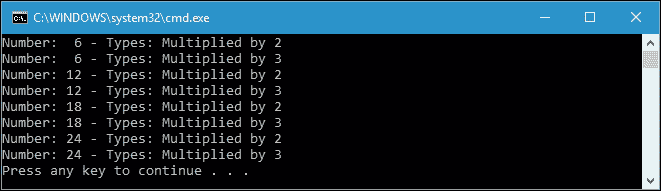
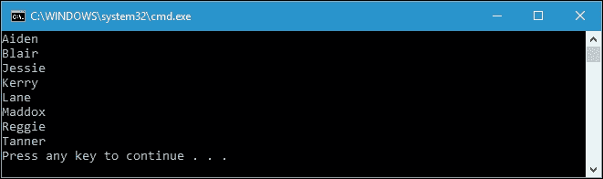
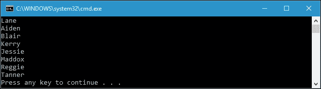
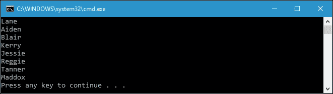
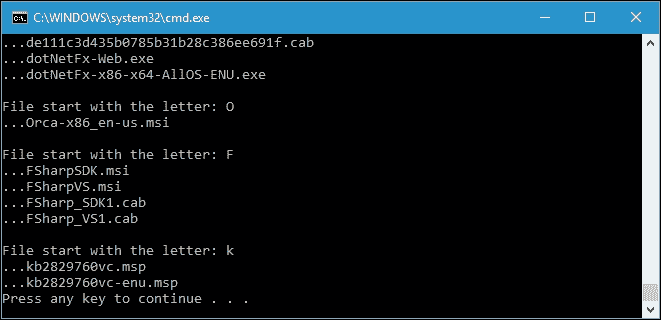
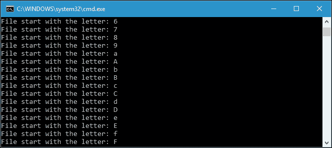
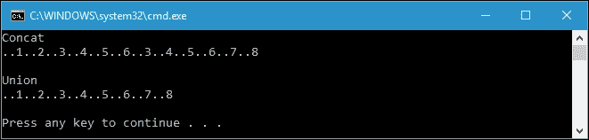
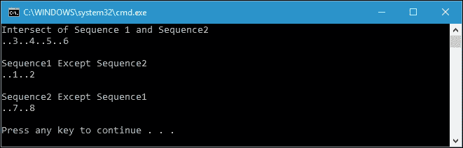
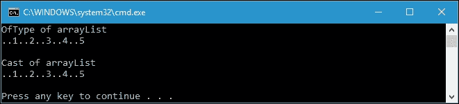
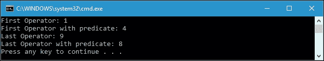

# 五、使用 LINQ 轻松查询任何集合

在讨论了委托、lambda 表达式和扩展方法之后，我们现在准备继续讨论 LINQ。在这一章中，我们将深入研究 LINQ，这在编写函数代码中是必不可少的。在这里，我们将讨论以下主题:

*   介绍 LINQ 查询
*   理解 LINQ 的延期执行
*   比较 LINQ 流畅语法和 LINQ 查询表达式语法
*   枚举 LINQ 算子

# 从 LINQ 开始

在 C# 3.0 中引入的**语言集成查询** ( **LINQ** )是的一个语言特性.NET 框架，使我们能够通过实现`IEnumerable<T>`接口轻松查询集合中的数据，如`ArrayList<T>`、`List<T>`、一个 XML 文档和一个数据库。查询集合中的任何数据变得更加容易，因为使用 LINQ，我们不需要为不同的数据源学习不同的语法。例如，当数据源是数据库时，如果我们使用 LINQ，我们不需要学习 SQL。同样，使用 LINQ，当我们处理一个 XML 文档时，我们不需要学习 XQuery。幸运的是，LINQ 简化了我们对所有数据源的通用语法的使用。

LINQ 有两个基本数据单位；它们是序列，包括任何实现`IEnumerable<T>`的对象，以及元素，包括序列中的项目。假设我们有以下名为`intArray`的`int`阵:

```cs
int[] intArray = 
{ 
  0,  1,  2,  3,  4,  5,  6,  7,  8,  9, 
  10, 11, 12, 13, 14, 15, 16, 17, 18, 19, 
  20, 21, 22, 23, 24, 25, 26, 27, 28, 29, 
  30, 31, 32, 33, 34, 35, 36, 37, 38, 39, 
  40, 41, 42, 43, 44, 45, 46, 47, 48, 49 
}; 

```

从前面的集合中，我们可以说`intArray`是一个序列，数组的内容，包括从 0 到 49 的数字，就是元素。

可以使用一种称为查询运算符的方法来转换序列。查询操作符接受输入序列，然后生成转换后的序列。该查询将在枚举序列时对其进行转换。查询至少由一个输入序列和一个运算符组成。让我们看看下面的代码，我们可以在`SequencesAndElements.csproj`项目中找到，它将从我们前面的集合`intArray`中寻找质数:

```cs
public partial class Program 
{  
  public static void ExtractArray() 
  { 
    IEnumerable<int> extractedData = 
      System.Linq.Enumerable.Where 
      (intArray, i => i.IsPrime()); 
    Console.WriteLine 
      ("Prime Number from 0 - 49 are:"); 
    foreach (int i in extractedData) 
      Console.Write("{0} \t", i); 
    Console.WriteLine(); 
  } 
} 

```

`IsPrime()`扩展方法将有如下实现:

```cs
public static class ExtensionMethods 
{ 
  public static bool IsPrime(this int i) 
  { 
    if ((i % 2) == 0) 
    { 
      return i == 2; 
    } 
    int sqrt = (int)Math.Sqrt(i); 
    for (int t = 3; t <= sqrt; t = t + 2) 
    { 
      if (i % t == 0) 
      { 
        return false; 
      } 
    } 
    return i != 1; 
  } 
} 

```

从前面的代码中，我们可以看到，我们使用`System.Linq.Enumerable`类中的`Where`运算符将`intArray`序列转换为`extractedData`序列，如下面的代码片段所示:

```cs
IEnumerable<int> extractedData = 
  System.Linq.Enumerable.Where 
    (intArray, i => i.IsPrime()); 

```

`extractedData`集合现在将包含从`intArray`集合获得的素数。如果我们运行该项目，我们将在控制台上获得以下输出:


我们实际上可以用更简单的方式修改前面的代码片段，因为所有查询操作符都是扩展方法，可以直接在集合中使用。前面代码片段的修改如下:

```cs
IEnumerable<int> extractedData = 
  intArray.Where(i => i.IsPrime()); 

```

通过修改`Where`运算符的调用，我们将得到完整的实现，如下所示:

```cs
public partial class Program 
{ 
  public static void ExtractArrayWithMethodSyntax() 
  { 
    IEnumerable<int> extractedData = 
       intArray.Where(i => i.IsPrime()); 
    Console.WriteLine("Prime Number from 0 - 49 are:"); 
    foreach (int i in extractedData) 
      Console.Write("{0} \t", i); 
    Console.WriteLine(); 
  } 
} 

```

如果我们运行前面的`ExtractArrayWithMethodSyntax()`方法，我们将获得与`ExtractArray()`方法完全相同的输出。

# 推迟对 LINQ 的处决

当我们从集合中查询数据时，LINQ 实现了一个延迟执行的概念。这意味着查询不会在构造函数中执行，而是在枚举过程中执行。例如，我们使用`Where`运算符查询集合中的数据。实际上，直到我们枚举它，查询才会被执行。我们可以使用`foreach`操作调用`MoveNext`命令来枚举查询。为了更详细地讨论延迟执行，让我们看看下面的代码，我们可以在`DeferredExecution.csproj`项目中找到它:

```cs
public partial class Program 
{ 
  public static void DeferredExecution() 
  { 
    List memberList = new List() 
    { 
      new Member 
      { 
        ID = 1, 
        Name = "Eddie Morgan", 
        Gender = "Male", 
        MemberSince = new DateTime(2016, 2, 10) 
      }, 
      new Member 
      { 
        ID = 2, 
        Name = "Millie Duncan", 
        Gender = "Female", 
        MemberSince = new DateTime(2015, 4, 3) 
      }, 
      new Member 
      { 
        ID = 3, 
        Name = "Thiago Hubbard", 
        Gender = "Male", 
        MemberSince = new DateTime(2014, 1, 8) 
      }, 
      new Member 
      { 
        ID = 4, 
        Name = "Emilia Shaw", 
        Gender = "Female", 
        MemberSince = new DateTime(2015, 11, 15) 
      } 
    }; 
    IEnumerable<Member> memberQuery = 
      from m in memberList 
      where m.MemberSince.Year > 2014 
      orderby m.Name 
      select m; 
      memberList.Add(new Member 
      { 
        ID = 5, 
        Name = "Chloe Day", 
        Gender = "Female", 
        MemberSince = new DateTime(2016, 5, 28) 
      }); 
    foreach (Member m in memberQuery) 
    { 
      Console.WriteLine(m.Name); 
    } 
  } 
} 

```

正如您在前面`DeferredExecution()`方法的实现中所看到的，我们构建了一个名为`memberList`的`List<Member>`成员列表，其中包含了每个已经加入俱乐部的成员的四个实例。`Member`类本身如下:

```cs
public class Member 
{ 
  public int ID { get; set; } 
  public string Name { get; set; } 
  public string Gender { get; set; } 
  public DateTime MemberSince { get; set; } 
} 

```

构建`memberList`后，我们从`memberList`查询数据，其中包括 2014 年后加入的所有成员。在这里，我们可以确认四个成员中只有三个满足要求。当然，他们是埃迪·摩根、米莉·邓肯和艾米利亚·肖，按照升序排列，因为我们在查询中使用了`orderby m.Name`短语。

在我们有了查询之后，我们向`memberList`添加一个新成员，然后运行`foreach`操作以便枚举查询。接下来会发生的是，因为大部分查询操作符都实现了延迟执行，只在枚举过程中执行，所以我们在枚举查询后会有四个成员，因为我们添加到`memberList`的最后一个成员满足查询要求。为了说明这一点，让我们看看调用`DeferredExecution()`方法后在控制台上获得的以下输出:


可以看到，查询结果中也包含了最后一个加入俱乐部的成员`Chloe Day`。这就是延迟执行发挥作用的地方。

几乎所有查询操作符都提供延迟执行，但不提供以下操作符:

*   返回标量值或单个元素，如`Count`和`First`。
*   转换查询结果，如`ToList`、`ToArray`、`ToDictionary`和`ToLookup`。它们也被称为转换运算符。

`Count()`和`First()`方法会立即执行，因为它们返回单个对象，所以几乎不可能提供延迟执行和转换运算符。使用转换运算符，我们可以获得查询结果的缓存副本，并且可以避免由于延迟执行中的重新评估操作而重复该过程。现在，让我们看看下面的代码，我们可以在`NonDeferredExecution.csproj`项目中找到这些代码，来演示非强制执行过程:

```cs
public partial class Program 
{ 
  private static void NonDeferred() 
  { 
    List<int> intList = new List<int> 
    { 
      0,  1,  2,  3,  4,  5,  6,  7,  8,  9 
    }; 
    IEnumerable<int> queryInt = intList.Select(i => i * 2); 
    int queryIntCount = queryInt.Count(); 
    List<int> queryIntCached = queryInt.ToList(); 
    int queryIntCachedCount = queryIntCached.Count(); 
    intList.Clear(); 
    Console.WriteLine( 
      String.Format( 
        "Enumerate queryInt.Count {0}.", queryIntCount)); 
    foreach (int i in queryInt) 
    { 
      Console.WriteLine(i); 
    } 
    Console.WriteLine(String.Format( 
      "Enumerate queryIntCached.Count {0}.",
      queryIntCachedCount)); 
    foreach (int i in queryIntCached) 
    { 
      Console.WriteLine(i); 
    } 
  } 
} 

```

首先，在前面的代码中，我们有一个名为`intList`的`List<int>`整数列表，其中包含从`0`到`9`的数字。然后我们创建一个名为`queryInt`的查询，以便选择`intList`的所有成员并将其乘以`2`。我们还使用`Count()`方法计算查询数据的总数。由于`queryInt`尚未执行，我们创建了一个名为`queryIntCached`的新查询，使用`ToList()`转换运算符将`queryInt`转换为`List<int>`。我们还计算该查询中的数据总数。我们现在有两个查询，`queryInt`和`queryIntCached`。然后我们清除`intList`并枚举两个查询。以下是它们在控制台上显示的结果:


如您在前面的控制台中所见，`queryInt`的枚举不会产生任何项目。这很清楚，因为我们已经移除了所有`intList`物品，所以`queryInt`在`intList`中找不到任何物品。但是`queryInt`在我们清除`intList`之前已经运行了`Count()`方法，并且该方法在我们构建之后立即执行，因此被算作十项。与`queryInt`相比，我们在列举`queryIntCached`时有十个项目的数据。这是因为我们已经调用了`ToList()`转换操作符，它也会立即执行。

### 注

还有一种延期执行。例如，当我们在`Select`方法之后链接`OrderBy`方法时，就会发生这种情况。`Select`方法在必须产生一个元素时只检索一个元素，而`OrderBy`方法在返回第一个元素之前必须消耗整个输入序列。因此，当我们在`Select`方法之后链接一个`OrderBy`方法时，执行将被延迟，直到我们检索到第一个元素，然后`OrderBy`方法将向`Select`请求所有元素。

# 在流畅语法和查询表达式语法之间进行选择

从前面的讨论中，我们发现了两种类型的查询语法。让我们通过区分这两种语法来进一步讨论这个问题。

```cs
IEnumerable<int> queryInt = 
  intList.Select(i => i * 2); 
int queryIntCount = queryInt.Count(); 

```

前面的代码片段是流畅的语法类型。我们通过调用`Enumerable`类中的扩展方法来调用`Select`和`Count`操作符。使用流畅的语法，我们还可以将方法链接起来，这样它就可以按照如下方式进行函数式编程:

```cs
IEnumerable<int> queryInt = 
  intList 
    .Select(i => i * 2); 
    .Count(); 

```

我们在 LINQ 查询数据时可以使用的另一种语法类型是查询表达式语法。在上一个主题中讨论延迟执行时，我们应用了这种语法类型。查询表达式语法的代码片段如下:

```cs
IEnumerable<Member> memberQuery = 
  from m in memberList 
  where m.MemberSince.Year > 2014 
  orderby m.Name 
  select m; 

```

事实上，流畅的语法和查询表达式语法会做同样的事情。它们之间的区别只是语法。查询表达式语法中的每个关键字在`Enumerable`类中都有自己的扩展方法。为了证明这一点，我们可以将前面的代码片段重构为以下流畅的语法类型:

```cs
IEnumerable<Member> memberQuery = 
  memberList 
  .Where(m => m.MemberSince.Year > 2014) 
  .OrderBy(m => m.Name) 
  .Select(m => m); 

```

事实上，对于这两种语法，我们将获得完全相同的输出。然而，流畅的语法比查询表达式语法更接近函数式方法。

## 理解 LINQ 流畅的句法

基本上，LINQ 流畅的语法是在`Enumerable`类中找到的扩展方法。该方法将扩展任何实现`IEnumerable<T>`接口的变量。流畅的语法将 lambda 表达式作为参数来表示将在序列枚举中执行的逻辑。正如我们前面所讨论的，流畅的语法实现了方法链，因此它可以用于功能方法。在本章的开头，我们还讨论了扩展方法，通过该方法，可以使用其类中的静态方法直接调用查询运算符，该类就是`Enumerable`类。然而，通过直接从它的类调用方法，我们不能实现我们通常在函数方法中使用的方法链。让我们看看下面的代码，我们可以在`FluentSyntax.csproj`项目中找到，通过调用扩展方法而不是传统的`static`方法来演示流畅语法的优势:

```cs
public partial class Program 
{ 
  private static void UsingExtensionMethod() 
  { 
    IEnumerable<string> query = names 
      .Where(n => n.Length > 4) 
      .OrderBy(n => n[0]) 
      .Select(n => n.ToUpper()); 
    foreach (string s in query) 
    { 
      Console.WriteLine(s); 
    } 
  } 
} 

```

我们在前面的代码中使用的 names 集合如下:

```cs
public partial class Program 
{ 
  static List<string> names = new List<string> 
  { 
    "Howard", "Pat", 
    "Jaclyn", "Kathryn", 
    "Ben", "Aaron", 
    "Stacey", "Levi", 
    "Patrick", "Tara", 
    "Joe", "Ruby", 
    "Bruce", "Cathy", 
    "Jimmy", "Kim", 
    "Kelsey", "Becky", 
    "Scott", "Dick" 
  }; 
} 

```

如您所见，在前面的代码中，当我们查询集合中的数据时，我们使用了三个查询运算符。他们是`Where`、`OrderBy`和`Select`操作员。让我们看一下下面的代码片段来明确这一点:

```cs
IEnumerable<string> query =  
  names 
  .Where(n => n.Length > 4) 
  .OrderBy(n => n[0]) 
  .Select(n => n.ToUpper()); 

```

基于前面的查询，我们将获得字符串集合，其中每个字符串包含四个以上的字符。集合将按其第一个字母的升序排序，字符串将使用大写字符。下面是我们在控制台上运行`UsingExtensionMethod()`方法得到的结果，如下图所示:


现在，让我们重构前面的查询，使用传统的静态方法。但是在我们完成之前，下面是我们在前面的查询中使用的三种方法的签名:

```cs
public static IEnumerable<TSource> Where<TSource>( 
  this IEnumerable<TSource> source, 
  Func<TSource, bool> predicate 
) 

public static IEnumerable<TSource> OrderBy<TSource, TKey>( 
  this IEnumerable<TSource> source, 
  Func<TSource, TKey> keySelector 
) 

public static IEnumerable<TResult> Select<TSource, TResult>( 
  this IEnumerable<TSource> source, 
  Func<TSource, TResult> selector 
) 

```

可以看到，三种方法都以`IEnumerable<TSource>`为第一个参数，也返回`IEnumerable<TResult>`。我们可以使用这种相似性，以便第一个方法的返回可以被馈送到第二个方法的参数，第二个方法的返回可以被馈送到第三个方法的参数，以此类推。

在`Where()`方法中，我们使用第二个参数，谓词，根据它过滤序列。这是一个`Func<TSource, bool>`委托，所以我们可以在这里使用一个 lambda 表达式。`Func<TSource, TKey>`委托也可以在`OrderBy()`方法的第二个参数中找到，该参数用作按升序对序列元素进行排序的键。可以通过匿名的方式进行反馈。最后一种是`Select()`方法，我们使用它的第二个参数`selector`，将序列中的每个元素投影到新的表单中。匿名方法也可以用作参数。

基于我们在前面`UsingExtensionMethod()`方法中使用的方法的签名，我们可以重构查询如下:

```cs
IEnumerable<string> query = Enumerable.Select(
  Enumerable.OrderBy(Enumerable.Where(names, n => n.Length > 4),
  n => n[0]), n => n.ToUpper());
```

下面是完整的`UsingStaticMethod()`方法，这是我们用常规静态方法代替扩展方法时的重构代码:

```cs
public partial class Program 
{ 
  private static void UsingStaticMethod() 
  { 
    IEnumerable<string> query = 
     Enumerable.Select( 
      Enumerable.OrderBy( 
       Enumerable.Where( 
        names, n => n.Length > 4),  
         n => n[0]), n => n.ToUpper()); 
    foreach (string s in query) 
    { 
      Console.WriteLine(s); 
    } 
  } 
} 

```

通过运行`UsingStaticMethod()`方法，与`UsingExtensionMethod()`方法相比，我们将在控制台上获得准确的输出。

## 理解 LINQ 查询表达式语法

LINQ 查询表达式语法是一种简写语法，我们可以使用它来执行 LINQ 查询。在查询表达式语法中.NET 框架为每个查询运算符提供关键字，但不是所有运算符。通过使用查询语法，我们可以像在数据库中使用 SQL 查询数据一样调用运算符。当我们使用查询表达式语法时，我们的代码将更易读，并且需要更少的编码。

在流畅的语法讨论中，我们创建了一个查询，从包含四个以上字符的字符串列表中提取字符串，按照第一个字母的升序排序，并转换为大写字符。我们可以使用查询表达式语法来做到这一点，如下面的代码所示，我们可以在`QueryExpressionSyntax.csproj`项目中找到:

```cs
public partial class Program 
{ 
  private static void InvokingQueryExpression() 
  { 
    IEnumerable<string> query = 
      from n in names 
      where n.Length > 4 
      orderby n[0] 
      select n.ToUpper(); 
    foreach (string s in query) 
    { 
      Console.WriteLine(s); 
    } 
  } 
} 

```

正如您所看到的，我们已经重构了前面的代码，它使用流畅的语法作为查询表达式语法。事实上，如果我们运行`InvokingQueryExpression()`方法，将显示与`UsingExtensionMethod()`方法完全相同的输出。

不幸的是，有几个 LINQ 运算符在查询表达式语法中没有关键字，例如`distinct`运算符，因为它不采用 lambda 表达式。在这种情况下，我们必须使用流畅的语法，至少在某种程度上，如果我们仍然想使用它。以下是查询表达式语法中有关键字的运算符:

*   `Where`
*   `Select`
*   `SelectMany`
*   `OrderBy`
*   `ThenBy`
*   `OrderByDescending`
*   `ThenByDescending`
*   `GroupBy`
*   `Join`
*   `GroupJoin`

### 类型

实际上，编译器在编译过程中将查询表达式语法转换成流畅的语法。虽然查询表达式语法有时更容易阅读，但我们无法使用它执行所有操作；相反，我们必须使用流畅的语法，例如`count`运算符，就像我们在*推迟 LINQ 执行*主题中讨论的那样。我们在查询表达式语法中所写的也可以用流畅的语法来写。因此，当我们使用 LINQ 编码时，流畅的语法是最好的方法，尤其是在函数方法中。

# 枚举标准查询运算符

`System.Linq`命名空间包含的`Enumerable`类中有 50 多个查询运算符。它们也被称为标准查询运算符。根据操作符的功能，我们可以将它们分为几个操作。在这里，我们将讨论在 LINQ 提供的所有查询运算符.NET 框架。

## 过滤

筛选是一种操作，它将评估数据元素，以便只选择满足条件的元素。有六个过滤运算符；分别是`Where`、`Take`、`Skip`、`TakeWhile`、`SkipWhile`和`Distinct`。正如我们所知，我们已经在前面的示例代码中讨论了`Where`运算符，包括流畅语法和查询表达式语法，并且有一个想法，即它将返回满足谓词给定条件的元素子集。既然我们对`Where`运算符已经足够清楚，我们可以跳过它，继续剩下的五个过滤运算符。

`Take`操作员返回第一个`n`元素并转储其余元素。相比之下，`Skip`运算符忽略第一个`n`元素并返回其余元素。让我们看看来自`FilteringOperation.csproj`项目的以下代码:

```cs
public partial class Program 
{ 
  public static void SimplyTakeAndSkipOperator() 
  { 
    IEnumerable<int> queryTake = 
       intList.Take(10); 
    Console.WriteLine("Take operator"); 
    foreach (int i in queryTake) 
    { 
      Console.Write(String.Format("{0}\t", i)); 
    } 
    Console.WriteLine(); 
    IEnumerable<int> querySkip = intList.Skip(10); 
    Console.WriteLine("Skip operator"); 
    foreach (int i in querySkip) 
    { 
      Console.Write(String.Format("{0}\t", i)); 
    } 
    Console.WriteLine(); 
  } 
} 

```

我们在前面的代码中有两个查询，`queryTake`应用`Take`运算符，`querySkip`应用`Skip`运算符。它们都消耗`intList`，这实际上是一个包含以下数据的整数列表:

```cs
public partial class Program 
{ 
static List<int> intList = new List<int> 
  { 
    0,  1,  2,  3,  4, 
    5,  6,  7,  8,  9, 
    10, 11, 12, 13, 14, 
    15, 16, 17, 18, 19 
  }; 
} 

```

如果我们运行前面的`SimplyTakeAndSkipOperator()`方法，我们将得到如下输出:


前面的`Take`和`Skip`运算符示例是简单的代码，因为它处理的集合只包含 20 个元素。事实上，`Take`和`Skip`操作符在我们处理大量集合或者数据库时非常有用，可以方便用户访问数据。假设我们有一百万个整数集合的元素，我们正在寻找乘以 2 和 7 的元素。不使用`Take`和`Skip`操作符，我们会得到大量的结果，如果我们在控制台上显示它们，它们会使控制台显示混乱。让我们看看下面的代码来证明这一点:

```cs
public partial class Program 
{ 
  public static void NoTakeSkipOperator() 
  { 
    IEnumerable<int> intCollection = 
       Enumerable.Range(1, 1000000); 
    IEnumerable<int> hugeQuery = 
        intCollection 
      .Where(h => h % 2 == 0 && h % 7 == 0); 
    foreach (int x in hugeQuery) 
    { 
      Console.WriteLine(x); 
    } 
  } 
} 

```

正如你在这里看到的，我们有包含大量数据的`hugeQuery`。如果我们运行这个方法，大约需要十秒钟来完成所有元素的迭代。如果要检索`hugeQuery`包含的实际元素，也可以添加`Count`运算符，即 *71428* 元素。

现在，我们可以通过在`foreach`循环周围添加`Take`和`Skip`运算符来修改代码，如下代码所示:

```cs
public partial class Program 
{ 
  public static void TakeAndSkipOperator() 
  { 
    IEnumerable<int> intCollection = 
       Enumerable.Range(1, 1000000); 
    IEnumerable<int> hugeQuery = 
       intCollection 
         .Where(h => h % 2 == 0 && h % 7 == 0); 
    int pageSize = 10; 
    for (int i = 0; i < hugeQuery.Count()/ pageSize; i++) 
    { 
      IEnumerable<int> paginationQuery =hugeQuery 
        .Skip(i * pageSize) 
        .Take(pageSize); 
      foreach (int x in paginationQuery) 
      { 
        Console.WriteLine(x); 
      } 
      Console.WriteLine( 
         "Press Enter to continue, " + 
           "other key will stop process!"); 
      if (Console.ReadKey().Key != ConsoleKey.Enter) 
        break; 
    } 
  } 
} 

```

在前面的`TakeAndSkipOperator()`方法中，我们在高亮显示的行中添加了几行代码。现在，虽然我们有很多数据，但是当我们运行该方法时，输出将被方便地显示，如下所示:


如您所见，整个结果不会显示在控制台上，每次只有十个整数。如果用户想继续读取其余数据，可以按**进入**键。这就是我们通常所说的分页。`Take`和`Skip`运营商已经做了很好的工作来实现它。

除了讨论`Take`和`Skip`算子，我们还要讨论过滤算子中的`TakeWhile`和`SkipWhile`算子。在`TakeWhile`运算符中，将枚举输入集合，并将每个元素发送到查询，直到谓词为`false`。相比之下，输入集合将被枚举，当谓词为`true`时，元素将被发送到查询。现在，让我们看看下面的代码来演示`TakeWhile`和`SkipWhile`运算符:

```cs
public partial class Program 
{ 
  public static void TakeWhileAndSkipWhileOperators() 
  { 
    int[] intArray = { 10, 4, 27, 53, 2, 96, 48 }; 
    IEnumerable<int> queryTakeWhile = 
       intArray.TakeWhile(n => n < 50); 
    Console.WriteLine("TakeWhile operator"); 
    foreach (int i in queryTakeWhile) 
    { 
      Console.Write(String.Format("{0}\t", i)); 
    } 
    Console.WriteLine(); 
    IEnumerable<int> querySkipWhile = 
       intArray.SkipWhile(n => n < 50); 
    Console.WriteLine("SkipWhile operator"); 
    foreach (int i in querySkipWhile) 
    { 
      Console.Write(String.Format("{0}\t", i)); 
    } 
    Console.WriteLine(); 
  } 
} 

```

当我们运行前面的方法时，我们将在控制台上获得以下输出:


由于谓词中有`n < 50`，在`TakeWhile`中，枚举将发出元素，直到到达`53`，在`SkipWhile`中，当枚举到达`53`时，元素开始发出。

在这个过滤操作中，我们还有`Distinct`操作符。`Distinct`操作者将返回没有任何重复元素的输入序列。假设我们有以下代码:

```cs
public partial class Program 
{ 
  public static void DistinctOperator() 
  { 
    string words = "TheQuickBrownFoxJumpsOverTheLazyDog"; 
       IEnumerable <char> queryDistinct = words.Distinct(); 
    string distinctWords = ""; 
    foreach (char c in queryDistinct) 
    { 
      distinctWords += c.ToString(); 
    } 
    Console.WriteLine(distinctWords); 
  } 
} 

```

在前面的代码中，我们有一个字符串，我们打算删除该字符串中所有重复的字母。我们使用`Distinct`运算符获取查询，然后枚举它。结果如下:


如您所见，由于使用了`Distinct`运算符，有些字母已经消失了。这种情况下不会出现重复的字母。

## 投影

投影是一种将物体转换成新形式的操作。有两个投影运算符；它们是`Select`和`SelectMany`。使用`Select`运算符，我们可以基于给定的 lambda 表达式转换每个输入元素，而使用`SelectMany`运算符，我们可以转换每个输入元素，然后通过连接它们将结果序列展平为一个序列。

当我们讨论推迟执行 LINQ 时，我们已经应用了`Select`运算符。以下是使用`Select`运算符的代码片段，我们从延迟 LINQ 执行主题的示例中提取了该运算符:

```cs
IEnumerable<Member> memberQuery = 
  from m in memberList 
  where m.MemberSince.Year > 2014 
  orderby m.Name 
  select m; 

```

如您所见，我们使用`Select`运算符，这是`Select`关键字，因为我们使用查询表达式语法，选择所有由`Where`关键字过滤的结果元素。从`Select`运算符中我们知道，对象可以转换成另一种形式，我们可以使用以下代码将该元素类型的`Member`类对象转换成元素类型的`RecentMember`类对象:

```cs
IEnumerable<RecentMember> memberQuery = 
  from m in memberList 
  where m.MemberSince.Year > 2014 
  orderby m.Name 
  select new RecentMember{ 
    FirstName = m.Name.GetFirstName(), 
    LastName = m.Name.GetLastName(), 
    Gender = m.Gender, 
    MemberSince = m.MemberSince, 
    Status = "Valid" 
}; 

```

使用前面的代码，我们假设有一个名为`RecentMember`的类，如下所示:

```cs
public class RecentMember 
{ 
  public string FirstName { get; set; } 
  public string LastName { get; set; } 
  public string Gender { get; set; } 
  public DateTime MemberSince { get; set; } 
  public string Status { get; set; } 
} 

```

从前面的代码片段中，我们可以看到我们使用`Select`操作符转换了每个输入元素。我们可以将代码片段插入到以下完整的源代码中:

```cs
public partial class Program 
{ 
  public static void SelectOperator() 
  { 
    List<Member> memberList = new List<Member>() 
    { 
      new Member 
      { 
        ID = 1, 
        Name = "Eddie Morgan", 
        Gender = "Male", 
        MemberSince = new DateTime(2016, 2, 10) 
      }, 
      new Member 
      { 
        ID = 2, 
        Name = "Millie Duncan", 
        Gender = "Female", 
        MemberSince = new DateTime(2015, 4, 3) 
      }, 
      new Member 
      { 
        ID = 3, 
        Name = "Thiago Hubbard", 
        Gender = "Male", 
        MemberSince = new DateTime(2014, 1, 8) 
      }, 
      new Member 
      { 
        ID = 4, 
        Name = "Emilia Shaw", 
        Gender = "Female", 
        MemberSince = new DateTime(2015, 11, 15) 
      } 
    }; 
    IEnumerable<RecentMember> memberQuery = 
      from m in memberList 
      where m.MemberSince.Year > 2014 
      orderby m.Name 
      select new RecentMember{ 
        FirstName = m.Name.GetFirstName(), 
        LastName = m.Name.GetLastName(), 
        Gender = m.Gender, 
        MemberSince = m.MemberSince, 
        Status = "Valid" 
      }; 
    foreach (RecentMember rm in memberQuery) 
    { 
      Console.WriteLine( 
         "First Name  : " + rm.FirstName); 
      Console.WriteLine( 
         "Last Name   : " + rm.LastName); 
      Console.WriteLine( 
         "Gender      : " + rm.Gender); 
      Console.WriteLine 
         ("Member Since: " + rm.MemberSince.ToString("dd/MM/yyyy")); 
      Console.WriteLine( 
         "Status      : " + rm.Status); 
      Console.WriteLine(); 
    } 
  } 
} 

```

由于我们已经使用`foreach`迭代器枚举了查询，并使用`Console.WriteLine()`方法将元素写入了控制台，在运行了前面的`SelectOperator()`方法之后，我们将在控制台上获得以下输出:


从前面的控制台截图中，我们可以看到我们已经成功地将`Member`类型的输入元素转换成了`RecentMember`类型的输出元素。我们还可以使用流畅的语法来产生完全相同的结果，如下面的代码片段所示:

```cs
IEnumerable<RecentMember> memberQuery = 
   memberList 
  .Where(m => m.MemberSince.Year > 2014) 
  .OrderBy(m => m.Name) 
  .Select(m => new RecentMember 
{ 
  FirstName = m.Name.GetFirstName(), 
  LastName = m.Name.GetLastName(), 
  Gender = m.Gender, 
  MemberSince = m.MemberSince, 
  Status = "Valid" 
}); 

```

现在，让我们继续讨论`SelectMany`运算符。使用这个操作符，我们可以选择多个序列，然后将结果展平为一个序列。假设我们有两个集合，我们将选择所有集合；我们可以使用以下代码来实现这个目标:

```cs
public partial class Program 
{ 
  public static void SelectManyOperator() 
  { 
    List<string> numberTypes = new List<string>() 
    { 
      "Multiplied by 2", 
      "Multiplied by 3" 
    }; 
    List<int> numbers = new List<int>() 
    { 
      6, 12, 18, 24 
    }; 
    IEnumerable<NumberType> query = 
       numbers.SelectMany( 
          num => numberTypes,  
          (n, t) =>new NumberType 
          { 
            TheNumber = n, 
            TheType = t 
          }); 
    foreach (NumberType nt in query) 
    { 
      Console.WriteLine(String.Format( 
         "Number: {0,2} - Types: {1}", 
           nt.TheNumber, 
             nt.TheType)); 
    } 
  } 
} 

```

如您所见，我们有两个名为`numberTypes`和`numbers`的集合，并希望从它们的元素中提取任何可能的组合。结果以新的形式输入`NumberType`，定义如下:

```cs
public class NumberType 
{ 
  public int TheNumber { get; set; } 
  public string TheType { get; set; } 
} 

```

如果我们运行前面的`SelectManyOperator()`方法，控制台上会显示以下输出:



在这段代码中，我们实际上迭代两个集合来构造两个集合的组合，因为`SelectMany`运算符的实现如下:

```cs
public static IEnumerable<TResult> SelectMany<TSource, TResult>( 
  this IEnumerable<TSource> source, 
  Func<TSource, IEnumerable<TResult>> selector) 
{ 
  foreach (TSource element in source) 
  foreach (TResult subElement in selector (element)) 
  yield return subElement; 
} 

```

我们还可以使用以下代码片段应用查询表达式语法来替换前面的流畅语法:

```cs
IEnumerable<NumberType> query = 
  from n in numbers 
  from t in numberTypes 
  select new NumberType 
{ 
  TheNumber = n, 
  TheType = t 
}; 

```

查询表达式语法的输出将与流畅语法完全相同。

### 注

`from`关键字在查询表达式语法中有两种不同的含义。当我们在语法的开头使用关键字时，它会引入原始的范围变量和输入序列。当我们在开头以外的任何地方使用关键字时，它将被翻译成`SelectMany`运算符。

## 加入

连接是一种将没有直接对象模型关系的不同源序列啮合成单个输出序列的操作。然而，每个源中的元素必须共享一个值，可以进行比较以实现平等。LINQ 有两家加盟运营商；它们是`Join`和`GroupJoin`。

`Join`运算符使用查找技术来匹配两个序列中的元素，然后返回一个平面结果集。为了进一步解释这一点，让我们看看下面的代码，我们可以在`Joining.csproj`项目中找到:

```cs
public partial class Program 
{ 
  public static void JoinOperator() 
  { 
    Course hci = new Course{ 
      Title = "Human Computer Interaction", 
      CreditHours = 3}; 
    Course iis = new Course{ 
      Title = "Information in Society", 
      CreditHours = 2}; 
    Course modr = new Course{ 
      Title = "Management of Digital Records", 
      CreditHours = 3}; 
    Course micd = new Course{ 
      Title = "Moving Image Collection Development", 
      CreditHours = 2}; 
    Student carol = new Student{ 
      Name = "Carol Burks", 
      CourseTaken = modr}; 
    Student river = new Student{ 
      Name = "River Downs", 
      CourseTaken = micd}; 
    Student raylee = new Student{ 
      Name = "Raylee Price", 
      CourseTaken = hci}; 
    Student jordan = new Student{ 
      Name = "Jordan Owen", 
      CourseTaken = modr}; 
    Student denny = new Student{ 
      Name = "Denny Edwards", 
      CourseTaken = hci}; 
    Student hayden = new Student{ 
      Name = "Hayden Winters", 
      CourseTaken = iis}; 
    List<Course> courses = new List<Course>{
      hci, iis, modr, micd};
    List<Student> students = new List<Student>{
      carol, river, raylee, jordan, denny, hayden}; 
    var query = courses.Join( 
      students, 
      course => course, 
      student => student.CourseTaken, 
      (course, student) => 
        new {StudentName = student.Name, 
          CourseTaken = course.Title }); 
    foreach (var item in query) 
    { 
      Console.WriteLine( 
        "{0} - {1}", 
        item.StudentName, 
        item.CourseTaken); 
    } 
  } 
} 

```

前面的代码使用了`Student`和`Course`类，实现如下:

```cs
public class Student 
{ 
  public string Name { get; set; } 
  public Course CourseTaken { get; set; } 
} 
public class Course 
{ 
  public string Title { get; set; } 
  public int CreditHours { get; set; } 
} 

```

如果我们运行前面的`JoinOperator()`方法，我们将在控制台上获得以下输出:


从前面的代码中，我们可以看到我们有两个序列，分别是`courses`和`students`。我们可以使用`Join`操作符连接这两个序列，然后创建一个匿名类型作为结果。我们还可以使用查询表达式语法来连接这两个序列。以下是我们在之前的查询创建中必须替换的代码片段:

```cs
var query = 
from c in courses 
join s in students on c.Title equals s.CourseTaken.Title 
select new { 
  StudentName = s.Name, 
  CourseTaken = c.Title }; 

```

如果我们再次运行`JoinOperator()`方法，我们将在控制台上获得完全相同的输出。

`GroupJoin`运算符使用与`Join`运算符相同的技术，但它返回一个分层结果集。让我们看看下面解释`GroupJoin`运算符的代码:

```cs
public partial class Program 
{ 
  public static void GroupJoinOperator() 
  { 
    Course hci = new Course{ 
      Title = "Human Computer Interaction", 
      CreditHours = 3}; 

    Course iis = new Course{ 
      Title = "Information in Society", 
      CreditHours = 2}; 

    Course modr = new Course{ 
      Title = "Management of Digital Records", 
      CreditHours = 3}; 

    Course micd = new Course{ 
      Title = "Moving Image Collection Development", 
      CreditHours = 2}; 

    Student carol = new Student{ 
      Name = "Carol Burks", 
      CourseTaken = modr}; 

    Student river = new Student{ 
      Name = "River Downs", 
      CourseTaken = micd}; 

    Student raylee = new Student{ 
      Name = "Raylee Price", 
      CourseTaken = hci}; 

    Student jordan = new Student{ 
      Name = "Jordan Owen", 
      CourseTaken = modr}; 

    Student denny = new Student{ 
      Name = "Denny Edwards", 
      CourseTaken = hci}; 

    Student hayden = new Student{ 
      Name = "Hayden Winters", 
      CourseTaken = iis}; 

    List<Course> courses = new List<Course>{ 
      hci, iis, modr, micd}; 

    List<Student> students = new List<Student>{ 
      carol, river, raylee, jordan, denny, hayden}; 

    var query = courses.GroupJoin( 
      students, 
      course => course, 
      student => student.CourseTaken, 
      (course, studentCollection) => 
      new{ 
        CourseTaken = course.Title, 
        Students =  
        studentCollection 
        .Select(student => student.Name) 
      }); 

      foreach (var item in query) 
      { 
        Console.WriteLine("{0}:", item.CourseTaken); 
        foreach (string stdnt in item.Students) 
        { 
          Console.WriteLine("  {0}", stdnt); 
        } 
      } 
    } 
} 

```

前面的代码类似于我们前面讨论的 Join 运算符代码。不同之处在于我们创建查询的方式。在`GroupJoin`运算符中，我们用一个键将两个序列连接成另一个序列。让我们调用前面的`GroupJoinOperator()`方法，我们将在控制台上获得以下输出:


正如您在输出中看到的，我们将所有选修特定课程的学生分组。然后，我们枚举查询以获得结果。

## 订购

排序是使用默认比较器对输入序列中的返回序列进行排序的操作。例如，如果我们在字符串类型中有一个序列，默认的比较器将执行从 A 到 z 的字母排序。让我们看看下面的代码，我们可以在`Ordering.csproj`项目中找到:

```cs
public partial class Program 
{ 
  public static void OrderByOperator() 
  { 
    IEnumerable<string> query = 
      nameList.OrderBy(n => n); 

    foreach (string s in query) 
    { 
      Console.WriteLine(s); 
    } 
  } 
} 

```

对于我们必须提供给查询的序列，代码如下:

```cs
public partial class Program 
{ 
  static List<string> nameList = new List<string>() 
  { 
    "Blair", "Lane", "Jessie", "Aiden", 
    "Reggie", "Tanner", "Maddox", "Kerry" 
  }; 
} 

```

如果我们运行前面的`OrderByOperator()`方法，我们将在控制台上获得以下输出:



如您所见，我们使用默认的比较器执行排序操作，因此序列是按字母顺序排序的。我们还可以使用查询表达式语法来替换以下代码片段:

```cs
IEnumerable<string> query = 
  nameList.OrderBy(n => n); 

```

下面的代码片段显示了序列的查询表达式语法:

```cs
IEnumerable<string> query = 
  from n in nameList 
  orderby n 
  select n; 

```

我们可以创建自己的比较器作为键选择器，根据每个元素中的最后一个字符对序列进行排序；下面是我们可以使用`IComparer<T>`界面来实现这一点的代码。假设我们想要对之前的序列进行排序:

```cs
public partial class Program 
{ 
  public static void OrderByOperatorWithComparer() 
  { 
    IEnumerable<string> query = 
      nameList.OrderBy( 
       n => n,  
      new LastCharacterComparer()); 
    foreach (string s in query) 
    { 
      Console.WriteLine(s); 
    } 
  } 
} 

```

我们还创建了一个继承了`IComparer<string>`接口的新类`LastCharacterComparer`，如下所示:

```cs
public class LastCharacterComparer : IComparer<string> 
{ 
  public int Compare(string x, string y) 
  { 
    return string.Compare( 
     x[x.Length - 1].ToString(), 
      y[y.Length - 1].ToString()); 
  } 
} 

```

当我们运行前面的`OrderByOperatorWithComparer()`方法时，我们将在控制台上获得以下输出:


如您所见，我们现在有了一个有序的序列，但是排序键是每个元素的最后一个字符。这是在我们的定制比较器的帮助下实现的。不幸的是，自定义比较器只能使用流畅的语法。换句话说，我们不能在查询表达式方法中使用它。

当我们对序列进行排序时，可以有多个比较器作为条件。在调用`OrderBy`方法后，我们可以对第二个条件使用`ThenBy`扩展方法。让我们看看下面的代码来演示这一点:

```cs
public partial class Program 
{ 
  public static void OrderByThenByOperator() 
  { 
    IEnumerable<string> query = nameList 
      .OrderBy(n => n.Length) 
      .ThenBy(n => n); 
    foreach (string s in query) 
    { 
      Console.WriteLine(s); 
    } 
  } 
} 

```

从前面的代码中，我们按照每个元素的长度对序列进行排序，然后按照字母顺序对结果进行排序。如果我们调用`OrderByThenByOperator()`方法，我们将得到如下输出:



当我们需要使用两个条件对序列进行排序时，也可以使用查询表达式语法，如下面的代码片段所示:

```cs
IEnumerable<string> query = 
  from n in nameList 
  orderby n.Length, n 
  select n; 

```

如果我们在用查询表达式语法替换查询操作后再次运行`OrderByThenByOperator()`方法，我们将获得与使用流畅语法时完全相同的输出。但是查询表达式语法中没有`ThenBy`关键字。我们需要做的就是用逗号分隔条件。

我们也可以在使用`ThenBy`方法时使用我们的自定义比较器。让我们看看下面的代码来尝试一下:

```cs
public partial class Program 
{ 
  public static void OrderByThenByOperatorWithComparer() 
  { 
    IEnumerable<string> query = nameList 
      .OrderBy(n => n.Length) 
      .ThenBy(n => n, new LastCharacterComparer()); 
    foreach (string s in query) 
    { 
      Console.WriteLine(s); 
    } 
  } 
} 

```

在这段代码中，我们使用了与在`OrderByOperatorWithComparer()`方法中使用的相同的`LastCharacterComparer`类。如果我们调用`OrderByThenByOperatorWithComparer()`方法，下面是我们将在控制台上得到的输出:



除了升序排序，我们还有降序排序。在流畅的语法中，我们可以简单地使用`OrderByDescending()`和`ThenByDescending()`方法。代码中的用法与按升序排序的代码完全相同。但是，在查询表达式语法中，我们有降序关键字来实现这个目标。我们在`orderby`关键字中定义条件后使用这个关键字，如下面的代码所示:

```cs
public partial class Program 
{ 
  public static void OrderByDescendingOperator() 
  { 
    IEnumerable<string> query = 
      from n in nameList 
      orderby n descending 
      select n; 
    foreach (string s in query) 
    { 
      Console.WriteLine(s); 
    } 
  } 
} 

```

正如您所看到的，在同样的代码中有一个降序关键字。实际上，我们可以用升序关键字替换降序关键字，以便以升序方式对序列进行排序。但是，升序排序是 LINQ 的默认排序，所以可以省略升序关键字。下面是我们运行代码并调用`OrderByDescendingOperator()`方法的输出:


## 分组

分组是生成一系列`IGrouping<TKey, TElement>`对象的操作，这些对象由`TKey`键值分组。例如，我们将按照路径地址文件的首字母对它们进行分组。以下代码可以在`Grouping.csproj`项目文件中找到，并将在`G:\packages`中搜索所有文件，这是 Visual Studio 2015 社区版的设置文件。您可以根据计算机上的驱动器号和文件夹名来调整驱动器号和文件夹名。

```cs
public partial class Program 
{ 
  public static void GroupingByFileNameExtension() 
  { 
    IEnumerable<string> fileList =  
      Directory.EnumerateFiles( 
        @"G:\packages", "*.*",  
        SearchOption.AllDirectories); 
    IEnumerable<IGrouping<string, string>> query = 
      fileList.GroupBy(f => 
      Path.GetFileName(f)[0].ToString()); 
    foreach (IGrouping<string, string> g in query) 
    { 
      Console.WriteLine(); 
      Console.WriteLine( 
         "File start with the letter: " +  
           g.Key); 
      foreach (string filename in g) 
      Console.WriteLine( 
         "..." + Path.GetFileName(filename)); 
     } 
  } 
} 

```

前面的代码将找到`G:\packages`文件夹中的所有文件(包括所有子目录)，然后根据文件名中的第一个字母对它们进行分组。如您所见，当我们使用`foreach`循环枚举一个查询时，我们有`g.Key`，它是对字符串列表进行分组的键选择器。如果我们运行`GroupingByFileNameExtension()`方法，我们将在控制台上获得以下输出:



`GroupBy`扩展方法也有一个子句，以便在查询表达式语法中使用。我们可以使用的条款是`group`和`by`。以下代码片段可以替换我们之前代码中的查询:

```cs
IEnumerable<IGrouping<string, string>> query = 
  from f in fileList 
  group f by Path.GetFileName(f)[0].ToString(); 

```

尽管我们使用查询表达式语法替换了查询，但我们仍然会得到与流畅语法输出相同的输出。如您所见，LINQ 的分组操作只对序列进行分组；它不排序。我们可以使用 LINQ 提供的`OrderBy`运算符对结果进行排序。

在前面的查询表达式语法中，我们看到不再需要 select 子句，因为 group 子句也将结束查询。但是，如果我们添加了查询延续子句，那么在使用 group 子句时仍然需要 select 子句。现在让我们看一下下面的代码，它应用查询延续子句对序列进行排序:

```cs
public partial class Program 
{ 
  public static void GroupingByInto() 
  { 
    IEnumerable<string> fileList = 
      Directory.EnumerateFiles( 
        @"G:\packages", "*.*", 
        SearchOption.AllDirectories); 
    IEnumerable<IGrouping<string, string>> query = 
      from f in fileList 
      group f  
        by Path.GetFileName(f)[0].ToString() 
        into g 
      orderby g.Key 
      select g; 
    foreach (IGrouping<string, string> g in query) 
    { 
      Console.WriteLine( 
        "File start with the letter: " + g.Key); 
      //foreach (string filename in g) 
      Console.WriteLine(           "..." + Path.GetFileName(filename)); 
    } 
  } 
} 

```

正如您在前面的代码中看到的，我们通过添加查询延续子句和`orderby`运算符来对序列结果进行排序，从而修改了查询。我们使用的查询延续子句是`into`关键字。使用`into`关键字，我们存储分组结果，然后我们再次操作分组。如果我们运行前面的代码，我们将在控制台上获得以下输出:



我们故意去掉每个组的元素，因为我们现在要检查的是关键本身。现在，我们可以看到键是按升序排列的。这是因为我们首先存储分组结果，然后以升序方式对关键字进行排序。

## 设置操作

set 操作是一种返回结果集的操作，该结果集基于相同或单独集合中是否存在等效元素。LINQ 提供四个集合运算符；分别是`Concat`、`Union`、`Intersect`和`Except`。对于所有四个集合运算符，都没有查询表达式关键字。

先说`Concat`和`Union`。使用`Concat`运算符，我们将得到第一个序列的所有元素，然后是第二个序列的所有元素。`Union`使用`Concat`运算符执行此操作，但对于重复的元素只返回一个元素。下面的代码，我们可以在`SetOperation.csproj`项目中找到，演示了`Concat`和`Union`的区别:

```cs
public partial class Program 
{ 
  public static void ConcatUnionOperator() 
  { 
    IEnumerable<int> concat = sequence1.Concat(sequence2); 
    IEnumerable<int> union = sequence1.Union(sequence2); 
    Console.WriteLine("Concat"); 
    foreach (int i in concat) 
    { 
      Console.Write(".." + i); 
    } 
    Console.WriteLine(); 
    Console.WriteLine(); 
    Console.WriteLine("Union"); 
    foreach (int i in union) 
    { 
      Console.Write(".." + i); 
    } 
    Console.WriteLine(); 
    Console.WriteLine(); 
  } 
} 

```

我们有如下两个序列:

```cs
public partial class Program 
{ 
  static int[] sequence1 = { 1, 2, 3, 4, 5, 6 }; 
  static int[] sequence2 = { 3, 4, 5, 6, 7, 8 }; 
} 

```

我们前面的代码试图使用`Concat`和`Union`运算符。根据我们的讨论，如果我们运行`ConcatUnionOperator()`方法，下面是我们将得到的输出:



`Intersect`和`Except`也是设定操作符。`Intersect`返回两个输入序列中存在的元素。`Except`返回第一个输入序列中的元素，这些元素在第二个输入序列中不存在。以下代码解释了`Intersect`和`Except`的区别:

```cs
public partial class Program 
{ 
  public static void IntersectExceptOperator() 
  { 
    IEnumerable<int> intersect = sequence1.Intersect(sequence2); 
    IEnumerable<int> except1 = sequence1.Except(sequence2); 
    IEnumerable<int> except2 = sequence2.Except(sequence1); 
    Console.WriteLine("Intersect of Sequence"); 
    foreach (int i in intersect) 
    { 
      Console.Write(".." + i); 
    } 
    Console.WriteLine(); 
    Console.WriteLine(); 
    Console.WriteLine("Except1"); 
    foreach (int i in except1) 
    { 
      Console.Write(".." + i); 
    } 
    Console.WriteLine(); 
    Console.WriteLine(); 
    Console.WriteLine("Except2"); 
    foreach (int i in except2) 
    { 
      Console.Write(".." + i); 
    } 
    Console.WriteLine(); 
    Console.WriteLine(); 
  } 
} 

```

如果我们调用`IntersectExceptOperator()`方法，控制台屏幕上将显示以下输出:



我们将之前在`ConcatUnionOperator()`方法中使用的两个序列作为输入。从前面的控制台截图可以看到，在`Intersect`操作中，只返回复制元素。在`Except`操作中，只返回唯一元素。

## 转换方法

转换方法的主要作用是将一种类型的集合转换为其他类型的集合。在这里，我们将讨论 LINQ 提供的转换方法；分别是`OfType`、`Cast`、`ToArray`、`ToList`、`ToDictionary`和`ToLookup`。

`OfType`和`Cast`方法功能相似；他们将`IEnumerable`转换成`IEnumerable<T>`。不同的是`OfType`会丢弃错误的类型元素，如果有，而`Cast`会抛出异常，如果有错误的类型元素。我们来看看下面的代码，可以在`ConversionMethods.csproj`项目中找到:

```cs
public partial class Program 
{ 
  public static void OfTypeCastSimple() 
  { 
    ArrayList arrayList = new ArrayList(); 
    arrayList.AddRange(new int[] { 1, 2, 3, 4, 5 }); 

    IEnumerable<int> sequenceOfType = arrayList.OfType<int>(); 
    IEnumerable<int> sequenceCast = arrayList.Cast<int>(); 

    Console.WriteLine( 
      "OfType of arrayList"); 
    foreach (int i in sequenceOfType) 
    { 
      Console.Write(".." + i); 
    } 
    Console.WriteLine(); 
    Console.WriteLine(); 

    Console.WriteLine( 
      "Cast of arrayList"); 
    foreach (int i in sequenceCast) 
    { 
      Console.Write(".." + i); 
    } 
    Console.WriteLine(); 
    Console.WriteLine(); 
  } 
} 

```

前面的代码是使用`OfType`和`Cast`转换的一个简单例子。我们有一个只包含`int`元素的数组。事实上，它们很容易转化。如果我们运行`OfTypeCastSimple()`方法，输出如下:



### 注

英寸 NET Core，`ArrayList`的定义在于`System.Collections.NonGeneric.dll`。因此，我们必须在[https://www.nuget.org/packages/System.下载 NuGet 包 Collections.NonGeneric/](https://www.nuget.org/packages/System.Collections.NonGeneric/)

现在让我们在前面的代码中添加几行代码。现在代码如下:

```cs
public partial class Program 
{ 
  public static void OfTypeCastComplex() 
  { 
    ArrayList arrayList = new ArrayList(); 
    arrayList.AddRange( 
      new int[] { 1, 2, 3, 4, 5 }); 

    arrayList.AddRange( 
       new string[] {"Cooper", "Shawna", "Max"}); 
    IEnumerable<int> sequenceOfType = 
       arrayList.OfType<int>(); 
    IEnumerable<int> sequenceCast = 
       arrayList.Cast<int>(); 

    Console.WriteLine( 
      "OfType of arrayList"); 
    foreach (int i in sequenceOfType) 
    { 
      Console.Write(".." + i); 
    } 
    Console.WriteLine(); 
    Console.WriteLine(); 

    Console.WriteLine( 
       "Cast of arrayList"); 
    foreach (int i in sequenceCast) 
    { 
      Console.Write(".." + i); 
    } 
    Console.WriteLine(); 
    Console.WriteLine(); 
  } 
} 

```

从前面的代码中，我们可以看到我们将方法名更改为`OfTypeCastComplex`，并插入代码向`arrayList`添加一个字符串元素。如果我们运行该方法，`OfType`转换将成功运行，并且只返回`int`元素，而`Cast`转换将抛出异常，因为输入序列中有一些字符串元素。

其他转换方式有`ToArray()`和`ToList()`。它们之间的区别在于`ToArray()`将把序列转换成数组，`ToList()`将转换成通用列表。此外，`ToDictionary()`和`ToLookup()`方法名称可用于转换。`ToDictionary()`将基于指定的键选择器功能从序列中创建`Dictionary<TKey, TValue>`，而`ToLookup()`将基于指定的键选择器和元素选择器功能从序列中创建`Lookup<TKey, TElement>`。

## 元素操作

元素操作是根据索引或使用谓词从序列中提取单个元素的操作。LINQ 有几个元素操作符；分别是`First`、`FirstOrDefault`、`Last`、`Single`、`SingleOrDefault`、`ElementAt`和`DefaultIfEmpty`。让我们使用示例代码来理解所有这些元素操作符的功能。

下面是演示元素操作符的代码，可以在`ElementOperation.csproj`项目中找到:

```cs
public partial class Program 
{ 
  public static void FirstLastOperator() 
  { 
    Console.WriteLine( 
      "First Operator: {0}", 
      numbers.First()); 
    Console.WriteLine( 
      "First Operator with predicate: {0}", 
      numbers.First(n => n % 3 == 0)); 
    Console.WriteLine( 
      "Last Operator: {0}", 
      numbers.Last()); 
    Console.WriteLine( 
      "Last Operator with predicate: {0}", 
      numbers.Last(n => n % 4 == 0)); 
  } 
} 

```

前面的代码演示了`First`和`Last`运算符的用法。数字数组如下:

```cs
public partial class Program 
{ 
  public static int[] numbers = { 
    1, 2, 3, 
    4, 5, 6, 
    7, 8, 9 
  }; 
} 

```

在我们继续之前，如果我们运行`FirstLastOperator()`方法，让我们花点时间看看控制台上的以下输出:



从输出中我们可以发现`First`运算符将返回序列的第一个元素，`Last`运算符将返回最后一个元素。我们还可以为`First`和`Last`运算符使用λ表达式来过滤序列。在前面的例子中，我们将序列过滤为只能除以 4 的数字。

遗憾的是，`First`和`Last`运算符不能返回空值；相反，他们抛出了一个异常。让我们检查以下关于使用`First`运算符的代码，它将返回一个空序列:

```cs
public partial class Program 
{ 
  public static void FirstOrDefaultOperator() 
  { 
    Console.WriteLine( 
      "First Operator with predicate: {0}", 
      numbers.First(n => n % 10 == 0)); 
    Console.WriteLine( 
      "First Operator with predicate: {0}", 
      numbers.FirstOrDefault(n => n % 10 == 0)); 
  } 
} 

```

如果我们取消前面代码中所有注释代码行的注释，该方法将抛出一个异常，因为没有可以除以`10`的数字。为了解决这个问题，我们可以使用`FirstOrDefault`运算符来代替，它将返回默认值，因为数字是整数序列。因此，它将返回整数的默认值，即`0`。

我们还有`Single`和`SingleOrDefault`作为元素操作符，我们可以在下面的代码中看看它们的用法:

```cs
public partial class Program 
{ 
  public static void SingleOperator() 
  { 
    Console.WriteLine( 
      "Single Operator for number can be divided by 7: {0}", 
      numbers.Single(n => n % 7 == 0)); 
    Console.WriteLine( 
      "Single Operator for number can be divided by 2: {0}", 
      numbers.Single(n => n % 2 == 0)); 

    Console.WriteLine( 
      "SingleOrDefault Operator: {0}", 
      numbers.SingleOrDefault(n => n % 10 == 0)); 

    Console.WriteLine( 
      "SingleOrDefault Operator: {0}", 
      numbers.SingleOrDefault(n => n % 3 == 0)); 
  } 
} 

```

如果我们运行前面的代码，则会由于以下代码片段而引发异常:

```cs
Console.WriteLine( 
  "Single Operator for number can be divided by 2: {0}", 
  numbers.Single(n => n % 2 == 0)); 

```

此外，以下代码片段会导致错误:

```cs
Console.WriteLine( 
  "SingleOrDefault Operator: {0}", 
  numbers.SingleOrDefault(n => n % 3 == 0)); 

```

出现错误是因为`Single`运算符只能有一个匹配元素。在第一个代码片段中，我们得到了`2`、`4`、`6`和`8`作为结果。在第二个代码片段中，我们得到了`3`、`6`和`9`作为结果。

`Element`操作也有`ElementAt`和`ElementAtOrDefault`操作符从序列中获取第 n 个元素。让我们看看下面的代码来演示操作符:

```cs
public partial class Program 
{ 
  public static void ElementAtOperator() 
  { 
    Console.WriteLine( 
      "ElementAt Operator: {0}", 
      numbers.ElementAt(5)); 

    //Console.WriteLine( 
      //"ElementAt Operator: {0}", 
      //numbers.ElementAt(11)); 

    Console.WriteLine( 
      "ElementAtOrDefault Operator: {0}", 
      numbers.ElementAtOrDefault(11)); 
  } 
} 

```

像`First`和`Last`运算符一样，`ElementAt`也必须返回值。前面代码中的注释代码行将引发异常，因为索引`11`中没有元素。但是，我们可以使用`ElementAtOrDefault`来克服这个问题，然后被评论的行将返回`int`的默认值。

元素操作中的最后一个是`DefaultIfEmpty`运算符，如果在输入序列中没有找到元素，该运算符将返回序列中的默认值。以下代码将演示`DefaultIfEmpty`操作员:

```cs
public partial class Program 
{ 
  public static void DefaultIfEmptyOperator() 
  { 
    List<int> numbers = new List<int>(); 

    //Console.WriteLine( 
      //"DefaultIfEmpty Operator: {0}", 
      //numbers.DefaultIfEmpty()); 

    foreach (int number in numbers.DefaultIfEmpty()) 
    { 
      Console.WriteLine( 
        "DefaultIfEmpty Operator: {0}", number); 
    } 
  } 
} 

```

由于`DefaultIfEmpty`运算符的返回是`IEnumerable<T>`，所以我们必须枚举它，尽管它只包含一个元素。正如您在前面的代码中看到的，我们对 numbers 变量的直接访问进行了注释，因为它将返回变量的类型，而不是变量的值。相反，我们必须枚举数字查询来获得存储在`IEnumerable<T>`变量中的唯一值。

# 总结

LINQ 使我们查询集合的任务变得更加容易，因为我们不需要学习太多的语法来访问不同类型的集合。它实现了延迟执行的概念，这意味着查询不会在构造函数时间执行，而是在枚举过程中执行。几乎所有的查询操作符都提供了延迟执行的概念；但是，执行以下操作的操作员也有例外:

返回标量值或单个元素，如`Count`和`First`。

转换查询结果；分别是`ToList`、`ToArray`、`ToDictionary`和`ToLookup`。它们也被称为转换运算符。

换句话说，返回序列的方法实现延迟执行，例如`Select`方法`(IEnumerable<X>-> Select -> IEnumerable<Y>)`和返回单个对象的方法不实现延迟执行，例如`First`方法`(IEnumerable<X>-> First -> Y)`。

有两种类型的 LINQ 查询语法；它们是流畅的语法和查询表达式语法。前者采用参数的 lambda 表达式来表示将在序列枚举中执行的逻辑。后者是一种简写语法，我们可以使用它来执行 LINQ 查询。在查询表达式语法中.NET Framework 为每个查询运算符提供关键字，但不是所有运算符。当我们使用查询表达式语法时，我们的代码将更易读，并且需要更少的编码。然而，流畅的语法和查询语法都会做同样的事情。它们之间的区别只是语法。查询表达式语法中的每个关键字在`Enumerable`类中都有自己的扩展方法。

通过理解 LINQ，我们现在已经有足够的知识来创建函数式编程。在下一章中，我们将讨论异步编程，以增强代码响应性，从而构建用户友好的应用。