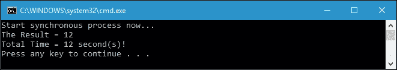
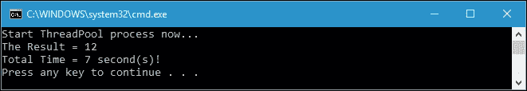
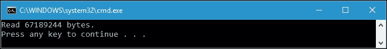
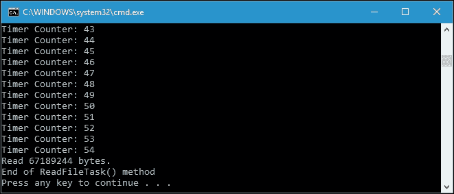
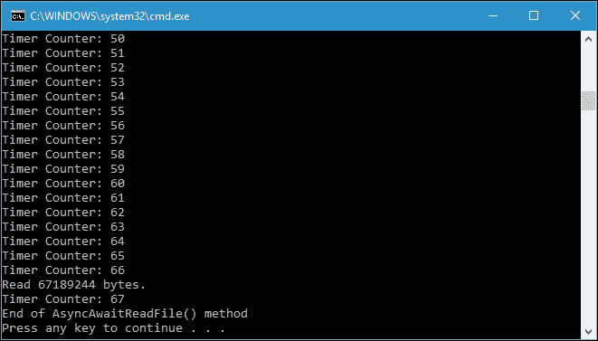

# 第六章。用异步编程提高功能程序的响应能力

在当今的编程方法中，响应应用是必不可少的。它们可以提高应用本身的性能，并使我们的应用具有用户友好的界面。我们需要在程序中异步运行代码执行过程，以获得一个响应的应用。为了实现这一目标，在本章中，我们将讨论以下主题:

*   使用线程和线程池构建响应性应用
*   了解异步编程模型模式
*   了解基于任务的异步模式
*   使用 async 和 wait 关键字构建异步编程
*   在函数式方法中应用异步方法

# 构建响应性应用

第一次。NET 框架宣布后，程序的流程被依次执行。这个执行流程的缺点是，我们的应用必须等待操作完成，然后才能执行下一个操作。它将冻结我们的应用，这将是一个不愉快的用户体验。

为了尽量减少这个问题。NET Framework 引入了线程，这是最小的执行单元，可以由操作系统独立调度。异步编程意味着您在一个单独的线程上运行一段代码，释放原始线程并在任务完成时做其他事情。

## 同步运行程序

让我们从创建一个将同步运行所有操作的程序开始讨论。下面是演示同步操作的代码，我们可以在`SynchronousOperation.csproj`项目中找到:

```cs
public partial class Program 
{ 
  public static void SynchronousProcess() 
  { 
    Stopwatch sw = Stopwatch.StartNew(); 
    Console.WriteLine( 
      "Start synchronous process now..."); 
    int iResult = RunSynchronousProcess(); 
    Console.WriteLine( 
      "The Result = {0}",iResult); 
    Console.WriteLine( 
      "Total Time = {0} second(s)!", 
      sw.ElapsedMilliseconds/1000); 
  } 
  public static int RunSynchronousProcess() 
  { 
    int iReturn = 0; 
    iReturn += LongProcess1(); 
    iReturn += LongProcess2(); 
    return iReturn; 
  } 
  public static int LongProcess1() 
  { 
    Thread.Sleep(5000); 
    return 5; 
  } 
  public static int LongProcess2() 
  { 
    Thread.Sleep(7000); 
    return 7; 
  } 
} 

```

正如我们在前面的代码中看到的，`RunSynchronousProcess()`方法执行两个方法；它们是`LongProcess1()`和`LongProcess2()`方法。现在我们调用前面的`RunSynchronousProcess()`方法，在控制台上会得到如下输出:



这两种方法`LongProcess1()`和`LongProcess2()`是独立的，每种方法都需要特定的时间来完成。由于是同步执行，所以完成这两个方法需要 12 秒。`LongProcess1()`法需要 5 秒完成，`LongProcess2()`法需要 7 秒完成。

## 在程序中应用线程

我们可以改进以前的代码，通过重构一些代码并向代码中添加线程，使其成为响应程序。重构的代码如下，我们可以在`ApplyingThreads.csproj`项目中找到:

```cs
public partial class Program 
{ 
  public static void AsynchronousProcess() 
  { 
    Stopwatch sw = Stopwatch.StartNew(); 
    Console.WriteLine( 
      "Start asynchronous process now..."); 
    int iResult = RunAsynchronousProcess(); 
    Console.WriteLine( 
      "The Result = {0}", 
      iResult); 
    Console.WriteLine( 
      "Total Time = {0} second(s)!", 
      sw.ElapsedMilliseconds / 1000); 
  } 
  public static int RunAsynchronousProcess() 
  { 
    int iResult1 = 0; 
    // Creating thread for LongProcess1() 
    Thread thread = new Thread( 
      () => iResult1 = LongProcess1()); 
    // Starting the thread 
    thread.Start(); 
    // Running LongProcess2() 
    int iResult2 = LongProcess2(); 
    // Waiting for the thread to finish 
    thread.Join(); 
    // Return the the total result 
    return iResult1 + iResult2; 
  } 
  public static int LongProcess1() 
  { 
    Thread.Sleep(5000); 
    return 5; 
  } 
  public static int LongProcess2() 
  { 
    Thread.Sleep(7000); 
    return 7; 
  } 
} 

```

可以看到，我们将前面代码中的`RunSynchronousProcess()`方法重构为`RunAsynchronousProcess()`方法。如果我们运行`RunAsynchronousProcess()`方法，我们将在控制台上获得以下输出:


与`RunSynchronousProcess()`方法相比，我们现在在`RunAsynchronousProcess()`方法中有一个更快的过程。我们创建一个运行`LongProcess1()`方法的新线程。线程在开始使用`Start()`方法之前不会运行。看看下面的代码片段，我们在其中创建并运行线程:

```cs
// Creating thread for LongProcess1() 
Thread thread = new Thread( 
  () => 
  iResult1 = LongProcess1()); 
// Starting the thread 
thread.Start(); 

```

线程运行后，我们可以运行另一个操作，在这种情况下，就是`LongProcess2()`方法。当这个操作完成后，我们必须等待线程完成，这样我们就可以从线程实例中使用`Join()`方法。下面的代码片段将对此进行解释:

```cs
// Running LongProcess2() 
int iResult2 = LongProcess2(); 
// Waiting for the thread to finish 
thread.Join(); 

```

`Join()`方法将阻塞当前线程，直到正在执行的另一个线程完成。其他线程结束后，`Join()`方法返回，然后当前线程被解除阻塞。

## 使用线程池创建线程

除了使用线程本身，我们还可以使用`System.Threading.ThreadPool`类预创建一些线程。如果我们需要处理线程池中的线程，我们就使用这个类。在使用线程池时，更可能只使用`QueueUserWorkItem()`方法。此方法将向线程池队列添加一个执行请求。如果线程池中有可用的线程，请求将立即执行。让我们看一下下面的代码，以演示线程池的使用，这可以在`UsingThreadPool.csproj`项目中找到:

```cs
public partial class Program 
{ 
  public static void ThreadPoolProcess() 
  { 
    Stopwatch sw = Stopwatch.StartNew(); 
    Console.WriteLine( 
      "Start ThreadPool process now..."); 
    int iResult = RunInThreadPool(); 
    Console.WriteLine("The Result = {0}", 
      iResult); 
    Console.WriteLine("Total Time = {0} second(s)!", 
      sw.ElapsedMilliseconds / 1000); 
  } 
  public static int RunInThreadPool() 
  { 
    int iResult1 = 0; 
    // Assignin work LongProcess1() to idle thread  
    // in the thread pool  
    ThreadPool.QueueUserWorkItem((t) => 
      iResult1 = LongProcess1()); 
    // Running LongProcess2() 
    int iResult2 = LongProcess2(); 
    // Waiting the thread to be finished 
    // then returning the result 
    return iResult1 + iResult2; 
  } 
    public static int LongProcess1() 
  { 
    Thread.Sleep(5000); 
    return 5; 
  } 
  public static int LongProcess2() 
  { 
    Thread.Sleep(7000); 
    return 7; 
  } 
} 

```

在线程池中，我们可以调用`QueueUserWorkItem()`方法将新的工作项放入队列中，当我们需要运行长时间运行的进程而不是创建新的线程时，由线程池进行管理。当我们将工作发送到线程池时，有三种处理工作的可能性；它们如下:

*   线程池中有一个或多个可用的空闲线程，因此工作可以由空闲线程处理并立即运行。
*   没有可用的线程，但是`MaxThreads`属性尚未到达，因此线程池将创建一个新线程，分配工作，并立即运行工作。
*   线程池中没有可用的线程，线程池中的线程总数已经达到`MaxThreads`。在这种情况下，工作项将在队列中等待第一个可用的线程。

现在，让我们运行`ThreadPoolProcess()`方法，我们将在控制台上获得以下输出:



正如我们在前面的截图中所看到的，当我们应用我们在前面部分中讨论的新线程时，我们用相似的处理时间得到了相同的结果。

# 异步编程模型模式

**异步编程模型** ( **APM** )是以`IAsyncResult`接口为设计模式的异步操作。也叫`IAsyncResult`模式。为此，框架提供了名为`BeginXx`和`EndXx`的方法，其中`Xx`是操作名，例如`BeginRead`和`EndRead`由`FileStream`类提供，用于异步读取文件中的字节。

同步`Read()`方法与`BeginRead()`和`EndRead()`的区别可以从方法的声明中识别出来，如下所示:

```cs
public int Read( 
  byte[] array, 
  int offset, 
  int count 
) 
public IAsyncResult BeginRead( 
  byte[] array, 
  int offset, 
  int numBytes, 
  AsyncCallback userCallback, 
  object stateObject 
) 
public int EndRead( 
  IAsyncResult asyncResult 
) 

```

我们可以看到，在同步`Read()`方法中，我们需要三个参数；它们是`array`、`offset`和`numBytes`。在`BeginRead()`方法中，还有两个参数添加；它们是`userCallback`，异步读取操作完成时将调用的方法，以及`stateObject`，用户提供的对象，用于区分异步读取请求和其他请求。

## 使用同步读取()方法

现在，让我们看看下面的代码，我们可以在`APM.csproj`项目中找到这些代码，以便更清楚地区分异步`BeginRead()`方法和同步`Read()`方法:

```cs
public partial class Program 
{ 
  public static void ReadFile() 
  { 
    FileStream fs = 
      File.OpenRead( 
        @"..\..\..\LoremIpsum.txt"); 
    byte[] buffer = new byte[fs.Length]; 
    int totalBytes = 
      fs.Read(buffer, 0, (int)fs.Length); 
    Console.WriteLine("Read {0} bytes.", totalBytes); 
    fs.Dispose(); 
  } 
} 

```

前面的代码将同步读取`LoremIpsum.txt`文件(包含在`APM.csproj`项目中)，这意味着读取过程必须在执行下一个过程之前完成。如果我们运行前面的`ReadFile()`方法，我们将在控制台上获得以下输出:



## 使用 BeginRead()和 EndRead()方法

现在，让我们从下面的代码中比较使用`Read()`方法的同步读取过程和使用`BeginRead()`和`EndRead()`方法的异步读取过程:

```cs
public partial class Program 
{ 
  public static void ReadAsyncFile() 
  { 
    FileStream fs =  
      File.OpenRead( 
        @"..\..\..\LoremIpsum.txt"); 
    byte[] buffer = new byte[fs.Length]; 
    IAsyncResult result = fs.BeginRead(buffer, 0, (int)fs.Length,
      OnReadComplete, fs); 
    //do other work while file is read 
    int i = 0; 
    do 
    { 
      Console.WriteLine("Timer Counter: {0}", ++i); 
    } 
    while (!result.IsCompleted); 
    fs.Dispose(); 
  } 
  private static void OnReadComplete(IAsyncResult result) 
  { 
    FileStream fStream = (FileStream)result.AsyncState;
    int totalBytes = fStream.EndRead(result);
    Console.WriteLine("Read {0} bytes.", totalBytes);fStream.Dispose(); 
  } 
} 

```

我们可以看到，我们有两种方法，分别叫做`ReadAsyncFile()`和`OnReadComplete()`。`ReadAsyncFile()`方法将异步读取`LoremIpsum.txt`文件，然后在刚刚读取完文件后调用`OnReadComplete()`方法。我们有额外的代码来确保异步操作使用下面的`do-while`循环代码片段正确运行:

```cs
//do other work while file is read 
int i = 0; 
do 
{ 
  Console.WriteLine("Timer Counter: {0}", ++i); 
} 
while (!result.IsCompleted); 

```

前面的`do-while`循环将迭代直到异步操作完成，如`IAsyncResult`的`IsComplete`属性所示。当调用`BeginRead()`方法时，异步操作开始，如下面的代码片段所示:

```cs
IAsyncResult result = 
  fs.BeginRead( 
    buffer, 0, (int)fs.Length, OnReadComplete, fs); 

```

之后，它将在读取文件时继续下一个进程。当读取过程结束时将调用`OnReadComplete()`方法，由于`OnReadComplete()`方法的实现将`IsFinish`变量设置为真，它将停止我们的`do-while`循环。

通过运行`ReadAsyncFile()`方法，我们将获得如下输出:


从前面输出的截图中，我们可以看到`do-while`循环的迭代在读取过程运行时也成功执行了。读取过程在`do-while`循环的第 64 次迭代中完成。

## 在 BeginRead()方法调用中添加 LINQ

我们也可以使用 LINQ 定义`OnReadComplete()`方法，这样我们就可以使用匿名方法替换该方法，如下所示:

```cs
public partial class Program 
{ 
  public static void ReadAsyncFileAnonymousMethod() 
  { 
    FileStream fs = 
      File.OpenRead( 
        @"..\..\..\LoremIpsum.txt"); 
    byte[] buffer = new byte[fs.Length]; 
    IAsyncResult result = fs.BeginRead(buffer, 0, (int)fs.Length,
      asyncResult => { int totalBytes = fs.EndRead(asyncResult); 
    Console.WriteLine("Read {0} bytes.", totalBytes); 
      }, null); 
    //do other work while file is read 
    int i = 0; 
    do 
    { 
      Console.WriteLine("Timer Counter: {0}", ++i); 
    } 
    while (!result.IsCompleted); 
    fs.Dispose(); 
  } 
} 

```

如我们所见，我们用下面的代码片段替换`BeginRead()`方法的调用:

```cs
IAsyncResult result = 
  fs.BeginRead( 
    buffer, 
    0, 
    (int)fs.Length, 
    asyncResult => 
    { 
      int totalBytes = 
        fs.EndRead(asyncResult); 
      Console.WriteLine("Read {0} bytes.", totalBytes); 
    }, 
  null); 

```

从前面的代码中，我们可以看到我们不再有`OnReadComplete()`方法，因为它已经由匿名方法表示了。我们删除回调中的`FileStream`实例，因为 lambda 中的匿名方法将使用闭包访问它。如果我们调用`ReadAsyncFileAnonymousMethod()`方法，我们将获得与`ReadAsyncFile()`方法完全相同的输出，除了迭代次数，因为它取决于 CPU 速度。

除了`IsCompleted`属性用于获取表示异步操作是否完成的值外，我们在处理`IAsyncResult`时还可以使用三个属性；它们如下:

*   `AsyncState`:用于检索用户定义的对象，该对象限定或包含关于异步操作的信息
*   `AsyncWaitHandle`:用于检索`WaitHandle`(操作系统中等待独占访问共享资源的对象)，表示异步操作完成
*   `CompletedSynchronously`:用于检索表示异步操作是否同步完成的值

不幸的是，在应用 APM 时有几个缺点，例如无法取消。这意味着我们无法取消异步操作符，因为从`BeginRead`的调用直到回调被触发，都没有办法取消后台进程。如果`LoremIpsum.txt`是一个千兆字节的文件，我们要等到异步操作完成，而不是取消操作。

### 注

由于技术过时，新开发中不再推荐使用 APM 模式。

# 基于任务的异步模式

基于任务的异步模式 ( **TAP** )是一种用于表示任意异步操作的模式。这种模式的概念是在一个方法中表示异步操作，并将操作的状态和用于与这些操作符交互的应用编程接口结合起来，使它们成为一个对象。对象是`System.Threading.Tasks`命名空间中的`Task`和`Task<TResult>`类型。

## 介绍任务和任务<结果>类

`Task`和`Task<TResult>`班于 2009 年宣布。NET 框架 4.0 来表示异步操作。它使用存储在线程池中的线程，但提供了如何创建任务的灵活性。当我们需要运行一个方法作为任务但不需要返回值时，我们使用`Task`类；否则，当我们需要获取返回值时，我们使用`Task<TResult>`类。

### 注

我们可以在 MSDN 网站的[上找到一个完整的参考，包括方法和属性，在`Task`和`Task<TResult>`里面。aspx](https://msdn.microsoft.com/en-us/library/dd321424(v=vs.110).aspx) 。

## 应用简单的 TAP 模型

让我们从创建下面的代码开始对 TAP 的讨论，我们可以在`TAP.csproj`项目中找到这些代码，并使用它异步读取一个文件:

```cs
public partial class Program 
{ 
  public static void ReadFileTask() 
  { 
    bool IsFinish = false; 
    FileStream fs = File.OpenRead( 
      @"..\..\..\LoremIpsum.txt"); 
    byte[] readBuffer = new byte[fs.Length]; 
    fs.ReadAsync(readBuffer,  0,  (int)fs.Length) 
      .ContinueWith(task => { 
      if (task.Status ==  
        TaskStatus.RanToCompletion) 
        { 
          IsFinish = true; 
          Console.WriteLine( 
          "Read {0} bytes.", 
          task.Result); 
        } 
        fs.Dispose();}); 
    //do other work while file is read 
    int i = 0; 
    do 
    { 
      Console.WriteLine("Timer Counter: {0}", ++i); 
    } 
    while (!IsFinish); 
    Console.WriteLine("End of ReadFileTask() method"); 
  } 
} 

```

正如我们在前面的代码中看到的那样，`FileStream`类中的`ReadAsync()`方法将返回`Task<int>`，在这种情况下，它将指示已经从文件中读取的字节数。调用`ReadAsync()`方法后，我们使用方法链接调用`ContinueWith()`扩展方法，如[第 1 章](01.html "Chapter 1. Tasting Functional Style in C#")、*在 C#* 中品尝功能类型所述。允许我们指定`Action<Task<T>>`，异步操作完成后运行。

通过在任务完成后调用`ContinueWith()`方法，委托将立即以同步操作运行。如果我们运行前面的`ReadFileTask()`方法，我们会在控制台上获得以下输出:



## 使用 WhenAll()扩展方法

在前一节中，我们成功地应用了一个简单的 TAP。现在，我们将继续异步读取两个文件，然后仅当两个读取操作都完成时才处理另一个操作。让我们看看下面的代码，它将展示我们的需求:

```cs
public partial class Program 
{ 
  public static void ReadTwoFileTask() 
  { 
    bool IsFinish = false; 
    Task readFile1 = 
      ReadFileAsync( 
      @"..\..\..\LoremIpsum.txt"); 
    Task readFile2 = 
      ReadFileAsync( 
      @"..\..\..\LoremIpsum2.txt"); 
    Task.WhenAll(readFile1, readFile2) 
      .ContinueWith(task => 
      { 
        IsFinish = true; 
        Console.WriteLine( 
        "All files have been read successfully."); 
      }); 
      //do other work while file is read 
      int i = 0; 
      do 
      { 
        Console.WriteLine("Timer Counter: {0}", ++i); 
      } 
      while (!IsFinish); 
      Console.WriteLine("End of ReadTwoFileTask() method"); 
    } 
    public static Task<int> ReadFileAsync(string filePath) 
    { 
      FileStream fs = File.OpenRead(filePath); 
      byte[] readBuffer = new byte[fs.Length]; 
      Task<int> readTask = 
        fs.ReadAsync( 
        readBuffer, 
        0, 
        (int)fs.Length); 
      readTask.ContinueWith(task => 
      { 
        if (task.Status == TaskStatus.RanToCompletion) 
        Console.WriteLine( 
          "Read {0} bytes from file {1}", 
          task.Result, 
          filePath); 
        fs.Dispose(); 
      }); 
      return readTask; 
    } 
} 

```

如我们所见，我们使用`Task.WhenAll()`方法将作为参数传入的两个任务包装成一个更大的异步操作。然后，它返回一个代表这两个异步操作组合的任务。我们不需要等待这两个文件的读取操作完成，但是它为这两个文件何时被成功读取增加了一个延续。

如果我们运行前面的`ReadTwoFileTask()`方法，我们会在控制台上获得以下输出:


正如我们前面讨论的，APM 模式的缺点是我们不能取消后台进程，现在让我们通过重构前面的代码来尝试取消 TAP 中的任务列表。完整的代码将如下所示:

```cs
public partial class Program 
{ 
  public static void ReadTwoFileTaskWithCancellation() 
  { 
    bool IsFinish = false; 

    // Define the cancellation token. 
    CancellationTokenSource source = 
      new CancellationTokenSource(); 
    CancellationToken token = source.Token; 

    Task readFile1 = 
      ReadFileAsync( 
      @"..\..\..\LoremIpsum.txt"); 
    Task readFile2 = 
      ReadFileAsync( 
      @"..\..\..\LoremIpsum2.txt"); 

    Task.WhenAll(readFile1, readFile2) 
      .ContinueWith(task => 
      { 
        IsFinish = true; 
        Console.WriteLine( 
          "All files have been read successfully."); 
      } 
      , token 
    ); 

    //do other work while file is read 
    int i = 0; 
    do 
    { 
      Console.WriteLine("Timer Counter: {0}", ++i); 
      if (i > 10) 
      { 
        source.Cancel(); 
        Console.WriteLine( 
          "All tasks are cancelled at i = " + i); 
         break; 
       } 
     } 
     while (!IsFinish); 

     Console.WriteLine( 
       "End of ReadTwoFileTaskWithCancellation() method"); 
    } 
} 

```

从前面的代码中我们可以看到，我们添加了`CancellationTokenSource`和`CancellationToken`来通知取消过程。然后，我们将令牌传递给`Task.WhenAll()`函数。任务运行后，我们可以使用`source.Cancel()`方法取消任务。

如果运行前面的代码，下面是我们将在控制台上获得的输出:


前面的输出告诉我们，任务已经在第 11 个计数器中成功取消，因为计数器已经高于 10。

## 将 APM 包装到 TAP 模型中

如果框架没有为异步操作提供 TAP 模型，我们可以使用`Task.FromAsync`方法将 APM `BeginXx`和`EndXx`方法包装到 TAP 模型中。让我们看一下下面的代码，以演示包装过程:

```cs
public partial class Program 
{ 
  public static bool IsFinish; 
  public static void WrapApmIntoTap() 
  { 
    IsFinish = false; 
    ReadFileAsync( 
      @"..\..\..\LoremIpsum.txt"); 
      //do other work while file is read 
      int i = 0; 
    do 
    { 
      Console.WriteLine("Timer Counter: {0}", ++i); 
    } 
    while (!IsFinish); 
    Console.WriteLine( 
      "End of WrapApmIntoTap() method"); 
  } 
  private static Task<int> ReadFileAsync(string filePath) 
  { 
    FileStream fs = File.OpenRead(filePath); 
    byte[] readBuffer = new Byte[fs.Length]; 
    Task<int> readTask = 
      Task.Factory.FromAsync( 
      (Func<byte[], 
      int, 
      int, 
      AsyncCallback, 
      object, 
      IAsyncResult>) 
    fs.BeginRead, 
    (Func<IAsyncResult, int>) 
    fs.EndRead, 
    readBuffer, 
    0, 
    (int)fs.Length, 
    null); 
    readTask.ContinueWith(task => 
    { 
      if (task.Status == TaskStatus.RanToCompletion) 
      { 
        IsFinish = true; 
        Console.WriteLine( 
          "Read {0} bytes from file {1}", 
          task.Result, 
          filePath); 
      } 
      fs.Dispose(); 
    }); 
    return readTask; 
  } 
} 

```

从前面的代码中，我们可以看到我们使用了`BeginRead()`和`EndRead()`方法，它们实际上是 APM 模式，但是我们在 TAP 模型中使用了它们，如下面的代码片段所示:

```cs
Task<int> readTask = 
  Task.Factory.FromAsync( 
    (Func<byte[], 
    int, 
    int, 
    AsyncCallback, 
    object, 
    IAsyncResult>) 
    fs.BeginRead, 
    (Func<IAsyncResult, int>) 
    fs.EndRead, 
    readBuffer, 
    0, 
    (int)fs.Length, 
  null); 

```

如果我们运行前面的`WrapApmIntoTap()`方法，我们将在控制台上获得以下输出:


正如我们在输出结果的截图中看到的，我们已经使用包装到 TAP 模型中的`BeginRead()`和`EndRead()`方法成功读取了`LoremIpsum.txt`文件。

# 使用异步和等待关键字的异步编程

`async`和`await`这两个关键词在 C# 5.0 中被公布，成为了 C# 异步编程中最新最伟大的东西。C# 是从 TAP 模式发展而来的，它将这两个关键词集成到语言本身中，使语言变得简单易读。使用这两个关键词，`Task`和`Task<TResult>`类仍然成为异步编程的核心构件。我们仍将使用`Task.Run()`方法构建新的`Task`或`Task<TResult>`数据类型，如前一节所述。

现在让我们看看下面的代码，它演示了`async`和`await`关键词，我们可以在`AsyncAwait.csproj`项目中找到这些关键词:

```cs
public partial class Program 
{ 
  static bool IsFinish; 
  public static void AsyncAwaitReadFile() 
  { 
    IsFinish = false; 
    ReadFileAsync(); 
    //do other work while file is read 
    int i = 0; 
    do 
    { 
      Console.WriteLine("Timer Counter: {0}", ++i); 
    } 
    while (!IsFinish); 
    Console.WriteLine("End of AsyncAwaitReadFile() method"); 
  } 
  public static async void ReadFileAsync() 
  { 
    FileStream fs = 
      File.OpenRead( 
      @"..\..\..\LoremIpsum.txt"); 
    byte[] buffer = new byte[fs.Length]; 
    int totalBytes = 
      await fs.ReadAsync( 
      buffer, 
      0, 
      (int)fs.Length); 
    Console.WriteLine("Read {0} bytes.", totalBytes); 
    IsFinish = true; 
    fs.Dispose(); 
  } 
} 

```

正如我们在前面的代码中所看到的，我们通过在读取文件流时添加`await`关键字来重构上一个主题的代码，如下面的代码片段所示:

```cs
int totalBytes = 
  await fs.ReadAsync( 
    buffer, 
    0, 
    (int)fs.Length); 

```

另外，我们在方法名前面使用`async`关键字，如下面的代码片段所示:

```cs
public static async void ReadFileAsync() 
{ 
  // Implementation 
} 

```

从前面两个代码片段中，我们可以看到`await`关键字只能在标记有`async`关键字的方法内部调用。当到达`await`时——在这种情况下，它在等待`fs.ReadAsync()`中——调用该方法的线程将跳出该方法，并继续前往其他地方。异步代码然后在一个单独的线程上发生(就像我们如何使用`Task.Run()`方法)。然而，等待之后的一切都被安排在任务完成时执行。如果我们运行前面的`AsyncAwaitReadFile()`方法，我们将在控制台上获得以下输出:



与 TAP 模型一样，我们在这里也获得了异步结果。

# 函数编程中的异步函数

现在，使用链接方法，我们将在函数式编程中使用`async`和`await`关键字。假设我们有三个任务，如下面的代码片段所示，我们需要将它们链接在一起:

```cs
public async static Task<int> FunctionA( 
  int a) => await Task.FromResult(a * 1); 
public async static Task<int> FunctionB( 
  int b) => await Task.FromResult(b * 2); 
public async static Task<int> FunctionC( 
  int c) => await Task.FromResult(c * 3); 

```

为此，我们必须为名为`MapAsync`的`Task<T>`创建一个新的扩展方法，实现如下:

```cs
public static class ExtensionMethod 
{ 
  public static async Task<TResult> MapAsync<TSource, TResult>( 
    this Task<TSource> @this, 
    Func<TSource, Task<TResult>> fn) => await fn(await @this); 
} 

```

`MapAsync()`方法允许我们将方法定义为`async`，接受从`async`方法返回的任务，以及`await`对委托的调用。以下是我们用来链接在`AsyncChain.csproj`项目中找到的三个任务的完整代码:

```cs
public partial class Program 
{ 
  public async static Task<int> FunctionA( 
    int a) => await Task.FromResult(a * 1); 
  public async static Task<int> FunctionB( 
    int b) => await Task.FromResult(b * 2); 
  public async static Task<int> FunctionC( 
    int c) => await Task.FromResult(c * 3); 
  public async static void AsyncChain() 
  { 
    int i = await FunctionC(10) 
    .MapAsync(FunctionB) 
    .MapAsync(FunctionA); 
    Console.WriteLine("The result = {0}", i); 
  } 
} 

```

如果我们运行前面的`AsyncChain()`方法，我们将在控制台上获得以下输出:


# 总结

异步编程是我们可以用来开发响应性应用的一种方式，我们成功地应用了`Thread`和`ThreadPool`来实现这个目标。我们可以创建一个新的线程来运行工作，或者我们可以重用线程池中的可用线程。

我们还学习了异步编程模型模式，这是一种使用`IAsyncResult`接口作为其设计模式的异步操作。在这个模式中，我们使用了前面有`Begin`和`End`的两种方法；例如，在我们的讨论中，这些是`BeginRead()`和`EndRead()`方法。`BeginRead()`方法调用时启动异步操作，然后`EndRead()`方法停止操作，这样我们就可以获取操作的返回值。

除了异步编程模型模式之外。NET Framework 还有一个基于任务的异步模式来运行异步操作。这种模式的概念是在一个方法中表示异步操作，并将操作的状态和用于与这些操作符交互的 API 组合成一个对象。我们在这个模式中使用的对象是`Task`和`Task<TResult>`，我们可以在`System.Threading.Tasks`命名空间中找到它们。在这种模式下，我们还可以取消作为后台进程运行的活动任务。

然后 C# 宣布`async`和`await`完成异步技术，我们可以选择。它是从基于任务的异步模式发展而来的，其中`Task`和`Task<TResult>`类成为异步编程的核心构件。我们在本章中做的最后一件事是，我们尝试使用基于使用`async`和`await`关键词的扩展方法来链接这三个任务。

在下一章中，我们将讨论在函数式编程中有用的递归，以便简化代码。我们将学习递归的用法以及如何基于递归减少代码行。