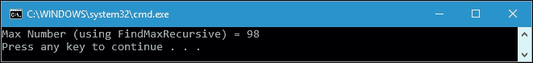
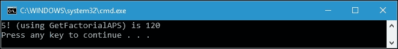
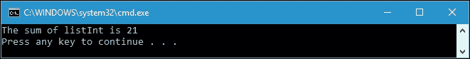
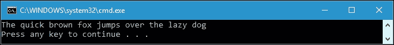

# 七、学习递归

在函数式编程的第一次发布中，许多函数式语言没有循环特性来迭代序列。我们所要做的就是构造递归过程来迭代序列。虽然 C# 有`for`和`while`这样的迭代特性，但是如果我们在函数方法中讨论递归会更好。递归也将简化我们的代码。为此，在本章中，我们将讨论以下主题:

*   理解递归例程如何工作
*   将迭代重构为递归
*   区分累加器传递方式和延续传递方式的尾部递归
*   理解间接递归而不是直接递归
*   使用聚合 LINQ 算子在泛函方法中应用递归

# 探索递归

递归函数是调用自身的函数。像迭代循环一样，例如`while`和`for`循环——它被用来一次一件地解决一个复杂的任务并组合结果。但是`for`环和`while`环是有区别的。迭代将不断重复，直到任务完成，而递归将把任务分解成更小的部分，以便解决更大的问题，然后组合结果。在函数式方法中，递归更接近数学方法，因为它通常比迭代短，尽管它在某种程度上更难设计和测试。

在[第 1 章](01.html "Chapter 1. Tasting Functional Style in C#")、*品尝 C#、*中的函数风格中，当我们讨论函数编程的概念时，我们熟悉了递归函数。在那里，我们用命令和函数的方法分析了名为`GetFactorial()`的阶乘函数。为了刷新我们的记忆，下面是`GetFactorial()`功能的实现，我们可以在`SimpleRecursion.csproj`项目中找到:

```cs
public partial class Program 
{ 
  private static int GetFactorial(int intNumber) 
  { 
    if (intNumber == 0) 
    { 
      return 1; 
    } 
    return intNumber * GetFactorial(intNumber - 1); 
  } 
} 

```

从我们在[第一章](01.html "Chapter 1. Tasting Functional Style in C#")、*中的讨论，我们知道非负整数`N`的阶乘是所有小于或等于`N`的正整数的乘积。所以，假设我们有下面的函数来计算 5 的阶乘:*

```cs
private static void GetFactorialOfFive() 
{ 
  int i = GetFactorial(5); 
  Console.WriteLine("5! is {0}",i); 
} 

```

正如我们可以预测的那样，如果我们调用前面的`GetFactorialOfFive()`方法，我们将在控制台上获得以下输出:


再次回到`GetFactorial()`法；我们看到在这个方法的实现中有结束递归的代码，如下面的代码片段所示:

```cs
if (intNumber == 0) 
{ 
  return 1; 
} 

```

我们可以看到前面的代码是递归的基本情况，递归通常有基本情况。这种基本情况将定义递归链的结束，因为在这种情况下，每次递归运行时，方法将改变`intNumber`的状态，如果`intNumber`为零，链将停止。

## 递归例程的工作

为了理解递归例程是如何工作的，让我们检查一下`intNumber`的状态，如果我们找到 5 的阶乘，如程序的以下流程所示:

```cs
int i = GetFactorial(5) 
  (intNumber = 5) != 0 
  return (5 * GetFactorial(4)) 
    (intNumber = 4) != 0 
    return (4 * GetFactorial(3)) 
      (intNumber = 3) != 0 
      return (3 * GetFactorial(2)) 
        (intNumber = 2) != 0 
        return (2 * GetFactorial(1)) 
          (intNumber = 1) != 0 
          return (1 * GetFactorial(0)) 
            (intNumber = 0) == 0 
            return 1 
          return (1 * 1 = 1) 
        return (2 * 1 = 2) 
      return (3 * 2 = 6) 
    return (4 * 6 = 24) 
  return (5 * 24 = 120) 
i = 120 

```

使用前面的流程，可以更清楚递归是如何工作的。我们的基本案例定义了递归链的结尾。当适用时，编程语言编译器将递归的特定情况转换为迭代，因为基于循环的实现通过消除对函数调用的需要而变得更加有效。

### 类型

在程序逻辑中应用递归时要小心。如果你错过了一个基本情况或者给它一个错误的值，你可能会进入一个无限递归。例如，在前面的`GetFactorial()`方法中，如果我们通过`intNumber < 0`，那么我们的程序将永远不会结束。

## 重构递归的迭代

递归使我们的程序更易读，这在函数式编程方法中是必不可少的。在这里，我们将把 for 循环迭代重构为递归方法。我们来看看下面的代码，可以在`RefactoringIterationToRecursion.csproj`项目中找到:

```cs
public partial class Program 
{ 
  public static int FindMaxIteration( 
     int[] intArray) 
  { 
    int iMax = 0; 
    for (int i = 0; i < intArray.Length; i++) 
    { 
      if (intArray[i] > iMax) 
      { 
        iMax = intArray[i]; 
      } 
    } 
    return iMax; 
  } 
} 

```

前面的`FindMaxIteration()`方法是用来挑选数字数组中最大的数字。考虑我们有以下代码来运行`FindMaxIteration()`方法:

```cs
public partial class Program 
{ 
  static void Main(string[] args) 
  { 
    int[] intDataArray =  
       {8, 10, 24, -1, 98, 47, -101, 39 }; 
    int iMaxNumber = FindMaxIteration(intDataArray); 
    Console.WriteLine( 
       "Max Number (using FindMaxRecursive) = " + 
         iMaxNumber); 
  } 
} 

```

正如我们所料，我们将在控制台窗口中看到以下输出:


现在，让我们将`FindMaxIteration()`方法重构为递归函数。以下是`FindMaxRecursive()`方法的实现，它是`FindMaxIteration()`方法的递归版本:

```cs
public partial class Program 
{ 
  public static int FindMaxRecursive( 
     int[] intArray,  
      int iStartIndex = 0) 
  { 
    if (iStartIndex == intArray.Length - 1) 
    { 
      return intArray[iStartIndex]; 
    } 
    else 
    { 
      return Math.Max(intArray[iStartIndex],
        FindMaxRecursive(intArray,iStartIndex + 1)); 
    } 
  } 
} 

```

我们可以使用与在`FindMaxIteration()`方法中相同的代码调用前面的`FindMaxRecursive()`方法，如下所示:

```cs
public partial class Program 
{ 
  static void Main(string[] args) 
  { 
    int[] intDataArray = {8, 10, 24, -1, 98, 47, -101, 39 }; 
    int iMaxNumber = FindMaxRecursive(intDataArray); 
    Console.WriteLine"Max Number(using FindMaxRecursive) = " +
        iMaxNumber); 
  } 
} 

```

正如我们在前面的方法中看到的，我们有以下基本情况来定义递归链的结尾:

```cs
if (iStartIndex == intArray.Length - 1) 
{ 
  return intArray[iStartIndex]; 
} 

```

如果我们运行前面的代码，我们将得到与我们在前面的方法中得到的结果相同的结果，如下面的控制台截图所示:



现在，让我们看看下面的流程，了解当我们使用递归函数时，如何获得这个结果:

```cs
Array = { 8, 10, 24, -1, 98, 47, -101, 39 }; 
Array.Length - 1 = 7 
int iMaxNumber = FindMaxRecursive(Array, 0) 
  (iStartIndex = 0) != 7 
  return Max(8, FindMaxRecursive(Array, 1)) 
    (iStartIndex = 1) != 7 
    return Max(10, FindMaxRecursive(Array, 2)) 
      (iStartIndex = 2) != 7 
      return Max(24, FindMaxRecursive(Array, 3)) 
        (iStartIndex = 3) != 7 
        return Max(-1, FindMaxRecursive(Array, 4)) 
          (iStartIndex = 4) != 7 
           return Max(98, FindMaxRecursive(Array, 5)) 
            (iStartIndex = 5) != 7 
            return Max(47, FindMaxRecursive(Array, 6)) 
              (iStartIndex = 6) != 7 
              return Max(-101, FindMaxRecursive(Array, 7)) 
                (iStartIndex = 7) == 7 
                return 39 
              return Max(-101, 39) = 39 
            return Max(47, 39) = 47 
          return Max(98, 47) = 98 
        return Max(-1, 98) = 98 
      return Max(24, 98) = 98 
    return Max(10, 98) = 98 
  return Max(8, 98) = 98 
iMaxNumber = 98 

```

使用前面的流程，我们可以在每次调用`FindMaxRecursive()`方法时得到的最大数中区分每个状态变化。然后，我们可以证明给定数组中的最大数是`98`。

# 使用尾部递归

在我们之前讨论的`GetFactorial()`方法中，传统的递归用于计算阶乘数。这个递归模型首先执行递归调用并返回值，然后计算结果。使用这个递归模型，在递归调用完成之前，我们不会得到结果。

除了传统的递归模型，我们还有另一个递归，叫做尾部递归。尾部调用成为函数中的最后一件事，它在递归之后什么也不做。我们来看看下面的代码，可以在`TailRecursion.csproj`项目中找到:

```cs
public partial class Program 
{ 
  public static void TailCall(int iTotalRecursion) 
  { 
    Console.WriteLine("Value: " + iTotalRecursion); 
    if (iTotalRecursion == 0) 
    { 
      Console.WriteLine("The tail is executed"); 
      return; 
    } 
    TailCall(iTotalRecursion - 1); 
  } 
} 

```

从前面的代码来看，尾部是在`iTotalRecursion`到达`0`时执行的，如下面的代码片段所示:

```cs
if (iTotalRecursion == 0) 
{ 
  Console.WriteLine("The tail is executed"); 
  return; 
} 

```

如果我们运行前面的`TailCall()`方法并为`iTotalRecursion`参数传递`5`，我们将在控制台上获得以下输出:


现在，让我们在这段代码中检查每次递归调用函数时的状态变化:

```cs
TailCall(5) 
  (iTotalRecursion = 5) != 0 
  TailCall(4) 
    (iTotalRecursion = 4) != 0 
    TailCall(3) 
      iTotalRecursion = 3) != 0 
      TailCall(2) 
        iTotalRecursion = 2) != 0 
        TailCall(1) 
          iTotalRecursion = 1) != 0 
          TailCall(0) 
            iTotalRecursion = 0) == 0 
            Execute the process in tail 
        TailCall(1) => nothing happens 
      TailCall(2) => nothing happens 
    TailCall(3) => nothing happens 
  TailCall(4) => nothing happens 
TailCall(5) => nothing happens 

```

从前面的递归流来看，该过程只在最后一次递归调用中运行。之后，其他递归调用不会发生任何变化。换句话说，我们可以得出结论，流量实际上会如下:

```cs
TailCall(5) 
   (iTotalRecursion = 5) != 0 
  TailCall(4) 
    (iTotalRecursion = 4) != 0 
    TailCall(3) 
      iTotalRecursion = 3) != 0 
      TailCall(2) 
        iTotalRecursion = 2) != 0 
        TailCall(1) 
          iTotalRecursion = 1) != 0 
          TailCall(0) 
            iTotalRecursion = 0) == 0 
            Execute the process in tail 
Finish! 

```

现在，我们尾部递归的流程是显而易见的。尾部递归的思想是尽量减少堆栈的使用，堆栈有时是我们拥有的昂贵资源。使用尾部递归，代码不需要记住下一步返回时必须返回的最后一个状态，因为在这种情况下累加器参数中有临时结果。下面的主题是跟在尾部递归后面的两种风格；分别是**传累加器式** ( **APS** )和**续传式** ( **CPS** )。

## 累加器传递方式

在**累加器传递方式** ( **APS** )中，递归首先执行计算，执行递归调用，然后将当前步骤的结果传递给下一个递归步骤。让我们来看一下我们从`GetFactorial()`方法重构的尾部递归代码的如下累加器传递风格，我们可以在`AccumulatorPassingStyle.csproj`项目中找到:

```cs
public partial class Program 
{ 
  public static int GetFactorialAPS(int intNumber, 
    int accumulator = 1) 
  { 
    if (intNumber == 0) 
    { 
      return accumulator; 
    } 
    return GetFactorialAPS(intNumber - 1, 
       intNumber * accumulator); 
  } 
} 

```

与`GetFactorial()`方法相比，我们现在在`GetFactorialAPS()`方法中有了第二个名为累加器的参数。由于阶乘`0`的结果是`1`，我们给累加器参数的默认值是 1。它不再只是返回值，而是在每次调用递归函数时返回阶乘的计算结果。为了证明这一点，考虑我们有以下代码来调用`GetFactorialAPS()`方法:

```cs
public partial class Program 
{ 
  private static void GetFactorialOfFiveUsingAPS() 
  { 
    int i = GetFactorialAPS(5); 
    Console.WriteLine( 
       "5! (using GetFactorialAPS) is {0}",i); 
  } 
} 

```

如果我们运行前面的方法，我们将在控制台上获得以下输出:



现在，让我们检查`GetFactorialAPS()`方法的每个调用，从程序的以下流程中查看方法内部的状态变化:

```cs
int i = GetFactorialAPS(5, 1) 
  accumulator = 1 
  (intNumber = 5) != 0 
  return GetFactorialAPS(4, 5 * 1) 
    accumulator = 5 * 1 = 5 
    (intNumber = 4) != 0 
    return GetFactorialAPS(3, 4 * 5) 
      accumulator = 4 * 5 = 20 
      (intNumber = 3) != 0 
      return GetFactorialAPS(2, 3 * 20) 
        accumulator = 3 * 20 = 60 
        (intNumber = 2) != 0 
        return GetFactorialAPS(1, 2 * 60) 
          accumulator = 2 * 60 = 120 
          (intNumber = 1) != 0 
          return GetFactorialAPS(0, 1 * 120) 
            accumulator = 1 * 120 = 120 
            (intNumber = 0) == 0 
            return accumulator 
          return 120 
        return 120 
      return 120 
    return 120 
  return 120 
i = 120 

```

从前面的流程中我们可以看到，由于它每次被调用时都会执行计算，所以我们现在有了函数最后一次调用时的计算结果，此时`intNumber`参数已经达到了`0`，如下面的代码片段所示:

```cs
return GetFactorialTailRecursion(0, 1 * 120) 
  accumulator = 1 * 120 = 120 
  (intNumber = 0) == 0 
  return accumulator 
return 120 

```

我们也可以将前面的`GetFactorialAPS()`方法重构为`GetFactorialAPS2()`方法，这样就不会返回值了，所以尾部递归的 APS 是如何工作的会变得更加明显。代码如下:

```cs
public partial class Program 
{ 
  public static void GetFactorialAPS2( 
      int intNumber,int accumulator = 1) 
  { 
    if (intNumber == 0) 
    { 
      Console.WriteLine("The result is " + accumulator); 
      return; 
    } 
    GetFactorialAPS2(intNumber - 1, intNumber * accumulator); 
  } 
} 

```

假设我们有以下`GetFactorialOfFiveUsingAPS2()`方法来调用`GetFactorialAPS2()`方法:

```cs
public partial class Program 
{ 
  private static void GetFactorialOfFiveUsingAPS2() 
  { 
    Console.WriteLine("5! (using GetFactorialAPS2)"); 
    GetFactorialAPS2(5); 
  } 
} 

```

因此，如果我们调用前面的`GetFactorialOfFiveUsingAPS2()`方法，我们将在控制台上获得以下输出:


现在`GetFactorialAPS2()`方法的流程变得更加清晰，如下图程序流程所示:

```cs
GetFactorialAPS2(5, 1) 
  accumulator = 1 
  (intNumber = 5) != 0 
  GetFactorialAPS2(4, 5 * 1) 
    accumulator = 5 * 1 = 5 
    (intNumber = 4) != 0 
    GetFactorialAPS2(3, 4 * 5) 
      accumulator = 4 * 5 = 20 
      (intNumber = 3) != 0 
      GetFactorialAPS2(2, 3 * 20) 
        accumulator = 3 * 20 = 60 
        (intNumber = 2) != 0 
        GetFactorialAPS2(1, 2 * 60) 
          accumulator = 2 * 60 = 120 
          (intNumber = 1) != 0 
          GetFactorialAPS2(0, 1 * 120) 
            accumulator = 1 * 120 = 120 
            (intNumber = 0) == 0 
            Show the accumulator value 
Finish! 

```

从前面的流程可以看出，我们每次调用`GetFactorialAPS2()`方法都会计算累加器。这种递归类型的结果是，我们不再需要使用堆栈，因为函数在调用函数本身时不需要记住它的开始位置。

## 续传风格

**延续传递风格** ( **CPS** )在使用尾部调用实现递归函数时与 APS 有相同的目的，但在处理操作时有明确的延续。CPS 函数的返回将传递给延续函数。

现在，让我们将`GetFactorial()`方法重构为下面的`GetFactorialCPS()`方法，我们可以在`ContinuationPassingStyle.csproj`项目中找到:

```cs
public partial class Program 
{ 
  public static void GetFactorialCPS(int intNumber, Action<int> 
         actCont) 
  { 
    if (intNumber == 0) 
      actCont(1); 
    else 
      GetFactorialCPS(intNumber - 1,x => actCont(intNumber * x)); 
  } 
} 

```

如我们所见，我们现在使用`Action<T>`来委托一个匿名方法，而不是像在`GetFactorialAPS()`方法中那样使用累加器，我们将其用作延续。假设我们有以下代码来调用`GetFactorialCPS()`方法:

```cs
public partial class Program 
{ 
  private static void GetFactorialOfFiveUsingCPS() 
  { 
    Console.Write("5! (using GetFactorialCPS) is "); 
    GetFactorialCPS(5,  x => Console.WriteLine(x)); 
  } 
} 

```

如果我们运行前面的`GetFactorialOfFiveUsingCPS()`方法，我们将在控制台上获得以下输出:


事实上，与`GetFactorial()`方法或`GetFactorialAPS2()`方法相比，我们得到了相同的结果。然而，递归的流程现在变得有点不同，如下图所示:

```cs
GetFactorialCPS(5, Console.WriteLine(x)) 
  (intNumber = 5) != 0 
  GetFactorialCPS(4, (5 * x)) 
    (intNumber = 4) != 0 
    GetFactorialCPS(3, (4 * x)) 
      (intNumber = 3) != 0 
      GetFactorialCPS(2, (3 * x)) 
        (intNumber = 2) != 0 
        GetFactorialCPS(1, (2 * x)) 
          (intNumber = 1) != 0 
          GetFactorialCPS(0, (1 * x)) 
            (intNumber = 0) != 0 
            GetFactorialCPS(0, (1 * 1)) 
          (1 * 1 = 1) 
        (2 * 1 = 2) 
      (3 * 2 = 6) 
    (4 * 6 = 24) 
  (5 * 24 = 120) 
Console.WriteLine(120) 

```

每个递归的返回现在被传递给延续过程，在这种情况下，是`Console.WriteLine()`函数。

## 直接递归上的间接递归

我们之前讨论过递归方法。实际上，在我们之前的讨论中，我们应用了直接递归，因为我们只处理一个方法，并且我们一遍又一遍地调用它，直到基本用例被执行。然而，还有另一种递归类型，叫做间接递归。间接递归至少涉及两个函数，例如函数 A 和函数 B，在间接递归的应用中，函数 A 调用函数 B，然后函数 B 回调函数 A，这被认为是递归，因为当方法 B 调用方法 A 时，函数 A 在调用函数 B 时实际上是活动的，换句话说，当函数 B 再次调用函数 A 时，函数 A 的调用还没有完成。让我们看看下面的代码，它演示了我们可以在`IndirectRecursion.csproj`项目中找到的间接递归:

```cs
public partial class Program 
{ 
  private static bool IsOdd(int targetNumber) 
  { 
    if (targetNumber == 0) 
    { 
      return false; 
    } 
    else 
    { 
      return IsEven(targetNumber - 1); 
    } 
  } 
  private static bool IsEven(int targetNumber) 
  { 
    if (targetNumber == 0) 
    { 
      return true; 
    } 
    else 
    { 
      return IsOdd(targetNumber - 1); 
    } 
  } 
} 

```

在前面的代码中，我们有两个函数:`IsOdd()`和`IsEven()`。每次比较结果`false`时，每个函数调用另一个函数。当`targetNumber`不为零时，`IsOdd()`功能将调用`IsEven()`，`IsEven()`功能也将调用。每个函数的逻辑都很简单。例如，`IsOdd()`方法通过调查前一个数字`targetNumber - 1`是否为偶数来决定`targetNumber`是否为奇数。类似地，`IsEven()`方法通过调查先前的数字是否为奇数来决定`targetNumber`是否为偶数。他们都把`targetNumber`减 1，直到变成零，因为零是偶数，所以现在很容易确定`targetNumber`是奇数还是偶数。现在，我们添加以下代码来检查数字`5`是否为偶数:

```cs
public partial class Program 
{ 
  private static void CheckNumberFive() 
  { 
    Console.WriteLine("Is 5 even number? {0}", IsEven(5)); 
  } 
} 

```

如果我们运行前面的`CheckNumberFive()`方法，我们将在控制台上获得以下输出:


现在，为了更清楚地说明这一点，让我们看看下面涉及`IsOdd()`和`IsEven()`方法的间接递归流程:

```cs
IsEven(5) 
  (targetNumber = 5) != 0 
  IsOdd(4) 
    (targetNumber = 4) != 0 
    IsEven(3) 
      (targetNumber = 3) != 0 
      IsOdd(2) 
        (targetNumber = 2) != 0 
        IsEven(1) 
          (targetNumber = 1) != 0 
            IsOdd(0) 
            (targetNumber = 0) == 0 
              Result = False 

```

从前面的流程中，我们可以看到，当我们检查数字 5 是否为偶数时，我们向下移动到数字 4，并检查它是否为奇数。然后我们检查数字 3，以此类推，直到我们到达 0。通过达到 0，我们可以很容易地确定它是奇数还是偶数。

# 使用 LINQ 聚合的函数方法中的递归

当我们处理阶乘公式时，我们可以使用 LINQ 聚合将递归函数重构为函数方法。LINQ 聚合将累加给定的序列，然后我们将从累加器得到递归的结果。在[第 1 章](01.html "Chapter 1. Tasting Functional Style in C#")、*在 C#* 中品尝功能风格，我们已经做了这个重构。让我们借用章节中的代码来分析`Aggregate`方法的使用。以下代码将使用`Aggregate`方法，我们可以在`RecursionUsingAggregate.csproj`项目中找到该方法:

```cs
public partial class Program 
{ 
  private static void GetFactorialAggregate(int intNumber) 
  { 
    IEnumerable<int> ints =  
       Enumerable.Range(1, intNumber); 
    int factorialNumber =  
       ints.Aggregate((f, s) => f * s); 
    Console.WriteLine("{0}! (using Aggregate) is {1}",
       intNumber, factorialNumber); 
  } 
} 

```

如果我们运行前面的`GetFactorialAggregate()`方法并传递`5`作为参数，我们将在控制台上获得以下输出:


正如我们在前面的控制台截图中看到的，与使用非聚集递归得到的结果相比，我们得到了完全相同的结果。

## 探究聚合方法

如前所述，`Aggregate`方法将累加给定的序列。让我们来看看下面的代码，它可以在`AggregateExample.csproj`项目文件中找到，来演示`Aggregate`方法是如何工作的:

```cs
public partial class Program 
{ 
  private static void AggregateInt() 
  { 
    List<int> listInt = new List<int>() { 1, 2, 3, 4, 5, 6 }; 
    int addition = listInt.Aggregate( 
       (sum, i) => sum + i); 
    Console.WriteLine("The sum of listInt is " + addition); 
  } 
} 

```

从前面的代码中，我们可以看到我们有一个`int`数据类型的列表，其中包含从 1 到 6 的数字。然后我们调用`Aggregate`方法来总结`listInt`的成员。下面是前面代码的流程:

```cs
(sum, i) => sum + i 
sum = 1 
sum = 1 + 2 
sum = 3 + 3 
sum = 6 + 4 
sum = 10 + 5 
sum = 15 + 6 
sum = 21 
addition = sum 

```

如果我们运行前面的`AggregateInt()`方法，我们将在控制台上获得以下输出:



其实`Aggregate`方法不仅加了数字，还加了字符串。让我们检查下面的代码，它演示了用于添加字符串序列的`Aggregate`方法:

```cs
public partial class Program 
{ 
  private static void AggregateString() 
  { 
    List<string> listString = new List<string>()
      {"The", "quick", "brown", "fox", "jumps", "over",
              "the", "lazy", "dog"};
    string stringAggregate = listString.Aggregate((strAll, str) => 
              strAll + " " + str); 
    Console.WriteLine(stringAggregate); 
  } 
} 

```

如果我们运行前面的`AggregateString()`方法，我们将在控制台上获得以下输出:



以下是我们在 MSDN 可以找到的`Aggregate`方法的声明:

```cs
public static TSource Aggregate<TSource>( 
  this IEnumerable<TSource> source, 
  Func<TSource, TSource, TSource> func 
) 

```

以下是基于之前声明的`AggregateUsage()`方法的流程:

```cs
(strAll, str) => strAll + " " + str 
strAll = "The" 
strAll = strAll + " " + str 
strAll = "The" + " " + "quick" 
strAll = "The quick" + " " + "brown" 
strAll = "The quick brown" + " " + "fox" 
strAll = "The quick brown fox" + " " + "jumps" 
strAll = "The quick brown fox jumps" + " " + "over" 
strAll = "The quick brown fox jumps over" + " " + "the" 
strAll = "The quick brown fox jumps over the" + " " + "lazy" 
strAll = "The quick brown fox jumps over the lazy" + " " + "dog" 
strAll = "The quick brown fox jumps over the lazy dog" 
stringAggregate = str 

```

从前面的流程中，我们可以使用`Aggregate`方法连接`listString`中的所有字符串。这证明了不仅`int`数据类型可以处理，字符串数据类型也可以处理。

# 总结

虽然 C# 有一个使用`for`或`while`循环迭代序列的特性，但是我们最好使用递归来迭代序列来接近函数式编程。我们已经讨论了递归例程如何工作，并将迭代重构为递归。我们知道在递归中，我们有一个定义递归链末端的基本情况。

在传统的递归模型中，递归调用首先执行，然后返回值，然后计算结果。在递归调用完成之前，不会显示结果。然而，尾部递归在递归之后根本不起任何作用。尾部递归有两种风格；它们是 APS 和 CPS。

除了直接递归，我们还讨论了间接递归。间接递归至少涉及两个函数。然后，我们使用聚集 LINQ 算子将递归应用到函数方法中。我们还深入研究了聚合运算符，并讨论了它的工作原理。

在下一章中，我们将讨论优化技术，使我们的代码更加高效。我们将使用惰性思维，这样代码将在完美的时间执行，并且还使用缓存技术，这样代码就不需要在每次需要时都执行。