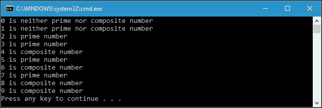
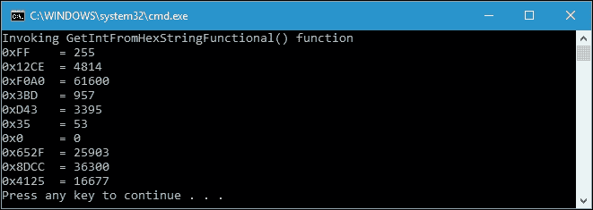
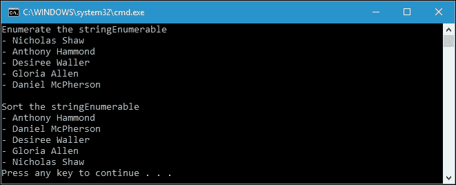

# 第九章。使用模式

在前一章中，我们讨论了优化代码以开发高效的代码。现在，我们将讨论使我们的代码以规则的顺序流动的模式，以便更容易维护和理解程序的流程。本章我们要讨论的主要主题是模式匹配和 Monad 作为设计模式。模式匹配将使用数学方法匹配条件，这样我们将获得事物的功能性体验。Monad 是函数式编程不可分割的一部分，因为它是软件设计中复杂问题的设计模式。使用 Monad，我们可以通过放大现有数据类型的行为来赋予它们更多的权力。本章将进一步探讨模式匹配和`Monad`，我们将讨论以下主题:

*   理解函数式编程中的模式匹配
*   使用模式匹配转换数据和切换决策
*   简化模式匹配，使其更加实用
*   在 C# 7 中测试模式匹配特性
*   找出哪些 C#类型自然实现了 Monad
*   生成一元类型
*   理解单子的规则

# 剖析函数式编程中的模式匹配

在函数式编程中，模式匹配是一种调度形式，用于选择要调用的函数的正确变体。它实际上是受一个标准数学符号的启发，用语法来表达条件执行。我们可以借用[第 1 章](01.html "Chapter 1. Tasting Functional Style in C#")、*在 C#* 中品尝函数风格的代码，开始我们关于匹配模式的讨论，当时我们谈到了递归。下面是我们用来检索阶乘值的`GetFactorial()`函数:

```cs
public partial class Program 
{ 
  private static intGetFactorial(intintNumber) 
  { 
    if (intNumber == 0) 
    { 
      return 1; 
    } 
    returnintNumber * GetFactorial(intNumber - 1); 
  } 
} 

```

正如我们在前面的代码中看到的，它给了我们两个定义。在这种情况下，根据实际`intNumber`参数模式是否匹配 0 来选择调度器。模式匹配的使用更接近这个`if`条件表达式，因为我们必须通过提供特定的输入来决定选择哪个部分。

## 使用模式匹配转换数据

模式匹配是以某种方式转换数据。让我们借用上一章的另一个函数来继续讨论。我们可能还记得，在扩展方法中有一个函数叫做`IsPrime()`来检查它是否是一个质数。我们将再次使用它来演示模式匹配来转换数据。对于那些忘记执行`IsPrime()`功能的人，下面是代码:

```cs
public static class ExtensionMethods 
{ 
  public static bool IsPrime(this int i) 
  { 
    if ((i % 2) == 0) 
    { 
      return i == 2; 
    } 
    int sqrt = (int)Math.Sqrt(i); 
    for (int t = 3; t <= sqrt; t = t + 2) 
    { 
      if (i % t == 0) 
      { 
        return false; 
      } 
    } 
    return i != 1; 
  } 
} 

```

同样，我们使用模式匹配来确定该数是质数、复合数还是两者都不是。但是，现在我们将把`int`数字转换成文本，正如我们在下面的`NumberFactorType()`函数中看到的，我们可以在`MatchingPattern.csproj`项目中找到:

```cs
public partial class Program 
{ 
  public static string NumberFactorType( 
    int intSelectedNumber) 
  { 
    if (intSelectedNumber < 2) 
    { 
      return "neither prime nor composite number"; 
    } 
    else if (intSelectedNumber.IsPrime()) 
    { 
      return "prime number"; 
    } 
    else 
    { 
      return "composite number"; 
    } 
  } 
} 

```

正如我们在前面的代码中看到的，我们使用`if...else`条件语句来匹配条件，而不是我们在前面的示例中使用的`if`条件语句。现在，让我们调用`NumberFactorType()`函数来匹配我们给出的整数，并使用以下`TransformIntIntoText()`函数将其转换为文本:

```cs
public partial class Program 
{ 
  public static void TransformIntIntoText() 
  { 
    for (int i = 0; i < 10; i++) 
    { 
      Console.WriteLine( 
        "{0} is {1}", i, NumberFactorType(i)); 
    } 
  } 
} 

```

我们将数字 0 到 9 传入`NumberFactorType()`函数，得到匹配结果。如果我们运行`TransformIntIntoText()`功能，我们会在控制台上获得以下输出:



从前面的截图中可以看到，我们已经成功使用模式匹配将`int`转换为文本。

## 切换模式匹配

我们知道模式匹配可以将数据转换成另一种形式。这实际上类似于 LINQ 的`Select()`方法，概念上类似于 switch case 语句。现在让我们来看看下面的`HexCharToByte()`函数将一个十六进制字符转换成`byte`:

```cs
public partial class Program 
{ 
  public static byte HexCharToByte( 
    char c) 
  { 
    byte res; 

    switch (c) 
    { 
      case '1': 
        res = 1; 
        break; 
      case '2': 
        res = 2; 
        break; 
      case '3': 
        res = 3; 
        break; 
      case '4': 
        res = 4; 
        break; 
      case '5': 
        res = 5; 
        break; 
      case '6': 
        res = 6; 
        break; 
      case '7': 
        res = 7; 
        break; 
      case '8': 
        res = 8; 
        break; 
      case '9': 
        res = 9; 
        break; 
      case 'A': 
      case 'a': 
        res = 10; 
        break; 
      case 'B': 
      case 'b': 
        res = 11; 
        break; 
      case 'C': 
      case 'c': 
        res = 12; 
        break; 
      case 'D': 
      case 'd': 
        res = 13; 
        break; 
      case 'E': 
      case 'e': 
        res = 14; 
        break; 
      case 'F': 
      case 'f': 
        res = 15; 
        break; 
      default: 
        res = 0; 
        break; 
    } 

    return res; 
  } 
} 

```

然后，我们添加一个包装器，将字符串中的十六进制转换为`int`，如下图`HexStringToInt()`函数所示:

```cs
public partial class Program 
{ 
  public static intHexStringToInt( 
    string s) 
  { 
    int iCnt = 0; 
    int retVal = 0; 
    for (inti = s.Length - 1; i>= 0; i--) 
    { 
      retVal += HexCharToByte(s[i]) *  
        (int) Math.Pow(0x10, iCnt++); 
    } 
    return retVal; 
  } 
} 

```

从前面的代码中，我们可以看到我们调用`HexCharToByte()`函数来获取每个十六进制字符的每个`int`值。然后，我们用 16 的幂得到所有的十六进制值。假设我们有以下`GetIntFromHexString()`函数将一个字符串中的几个十六进制数字转换成`int`:

```cs
public partial class Program 
{ 
  private static void GetIntFromHexString() 
  { 
    string[] hexStrings = { 
      "FF", "12CE", "F0A0", "3BD", 
      "D43", "35", "0", "652F", 
      "8DCC", "4125" 
    }; 
    for (int i = 0; i < hexStrings.Length; i++) 
    { 
      Console.WriteLine( 
        "0x{0}\t= {1}", 
        hexStrings[i], 
        HexStringToInt(hexStrings[i])); 
    } 
  } 
} 

```

如果我们运行`GetIntFromHexString()`功能，我们会在控制台上获得以下输出:


正如您在前面的截图中看到的，字符串中的每个十六进制字符都被转换为`int`值，然后它将所有结果相加。

### 类型

要将一个十六进制字符转换成一个字节，我们可以使用`Parse`和`TryParse`方法，或者使用`String.Format`对其进行格式化。`HexCharToByte()`功能我们之前讨论过，仅供示例使用。

## 简化模式匹配

我们已经成功地使用了`switch`语句来实现模式匹配。然而，这个例子没有应用函数方法，因为在执行过程中`HexCharToByte()`函数中的`res`变量发生了变化。现在，我们将重构`HexCharToByte()`函数，以便应用功能方法。我们来看看下面的`HexCharToByteFunctional()`功能，可以在`SimplifyingPatternMatching.csproj`项目中找到:

```cs
public partial class Program 
{ 
  public static byte HexCharToByteFunctional( 
    char c) 
  { 
    return c.Match() 
      .With(ch =>ch == '1', (byte)1) 
      .With(ch =>ch == '2', 2) 
      .With(ch =>ch == '3', 3) 
      .With(ch =>ch == '4', 4) 
      .With(ch =>ch == '5', 5) 
      .With(ch =>ch == '6', 6) 
      .With(ch =>ch == '7', 7) 
      .With(ch =>ch == '8', 8) 
      .With(ch =>ch == '9', 9) 
      .With(ch =>ch == 'A', 10) 
      .With(ch =>ch == 'a', 10) 
      .With(ch =>ch == 'B', 11) 
      .With(ch =>ch == 'b', 11) 
      .With(ch =>ch == 'C', 12) 
      .With(ch =>ch == 'c', 12) 
      .With(ch =>ch == 'D', 13) 
      .With(ch =>ch == 'd', 13) 
      .With(ch =>ch == 'E', 14) 
      .With(ch =>ch == 'e', 14) 
      .With(ch =>ch == 'F', 15) 
      .With(ch =>ch == 'f', 15) 
      .Else(0) 
      .Do(); 
  } 
} 

```

前面的`HexCharToByteFunctional()`函数是从`HexCharToByte()`函数重构而来的，现在实现了函数方法。如您所见，我们有四种类似于`switch`声明或`if...else`条件声明的方法:`Match()`、`With()`、`Else()`和`Do()`。我们来看看前面的`HexCharToByteFunctional()`功能所使用的下面的`Match()`功能:

```cs
public static class PatternMatch 
{ 
  public static PatternMatchContext<TIn> Match<TIn>( 
    this TIn value) 
  { 
    return new PatternMatchContext<TIn>(value); 
  } 
} 

```

可以看到，`Match()`函数返回新的`PatternMatchContext`数据类型。`PatternMatchContext`类实现如下:

```cs
public class PatternMatchContext<TIn> 
{ 
  private readonlyTIn _value; 
  internal PatternMatchContext(TIn value) 
  { 
    _value = value; 
  } 

  public PatternMatchOnValue<TIn, TOut> With<TOut>( 
    Predicate<TIn> condition,  
    TOut result) 
  { 
    return new PatternMatchOnValue<TIn, TOut>(_value) 
      .With(condition, result); 
  } 
} 

```

当`Match()`函数生成`PatternMatchContext`的新实例时，其构造函数存储作为参数传递给`_value`私有变量的值，如以下代码片段所示:

```cs
internal PatternMatchContext(TIn value) 
{ 
  _value = value; 
} 

```

在这个`PatternMatchContext`类中，还有一个叫做`With()`的方法，我们可以和`_value`值进行对比。该方法将调用`PatternMatchOnValue`类中的`With()`方法，其实现如下:

```cs
public class PatternMatchOnValue<TIn, TOut> 
{ 
  private readonlyIList<PatternMatchCase> _cases =  
    new List<PatternMatchCase>(); 
  private readonlyTIn _value; 
  private Func<TIn, TOut> _elseCase; 

  internal PatternMatchOnValue(TIn value) 
  { 
    _value = value; 
  } 

  public PatternMatchOnValue<TIn, TOut> With( 
    Predicate<TIn> condition,  
    Func<TIn, TOut> result) 
  { 
    _cases.Add(new PatternMatchCase 
    { 
      Condition = condition, 
      Result = result 
    }); 

    return this; 
  } 

  public PatternMatchOnValue<TIn, TOut> With( 
    Predicate<TIn> condition,  
    TOut result) 
  { 
    return With(condition, x => result); 
  } 

  public PatternMatchOnValue<TIn, TOut> Else( 
  Func<TIn, TOut> result) 
  { 
    if (_elseCase != null) 
    { 
      throw new InvalidOperationException( 
        "Cannot have multiple else cases"); 
    } 
    _elseCase = result; 
    return this; 
  } 

  public PatternMatchOnValue<TIn, TOut> Else( 
    TOut result) 
  { 
    return Else(x => result); 
  } 

  public TOut Do() 
  { 
    if (_elseCase != null) 
    { 
      With(x => true, _elseCase); 
      _elseCase = null; 
    } 

    `foreach (var test in _cases) 
    { 
      if (test.Condition(_value)) 
      { 
        returntest.Result(_value); 
      } 
    } 

    throw new IncompletePatternMatchException(); 
  } 

  private structPatternMatchCase 
  { 
    public Predicate<TIn> Condition; 
    publicFunc<TIn, TOut> Result; 
  } 
} 

```

从前面的代码中可以看到，当属于`PatternMatchContext`类的`With()`方法返回一个新的`PatternMatchOnValue`实例时，它的构造函数也会将该值存储到`_value`私有变量中，如下面的代码片段所示:

```cs
internal PatternMatchOnValue(TIn value) 
{ 
  _value = value; 
} 

```

然后它调用`With()`方法，该方法被传递一个匿名方法作为`condition`和一个期望值作为`result`，如下面的代码片段所示:

```cs
public PatternMatchOnValue<TIn, TOut> With( 
  Predicate<TIn> condition, 
  TOut result) 
{ 
  return With(condition, x => result); 
} 

```

这个`With()`方法然后调用另一个`With()`方法，这个方法通过`Predicate<T>`和`Func<T1, T2>`，如下面的代码片段所示:

```cs
public PatternMatchOnValue<TIn, TOut> With( 
  Predicate<TIn> condition, 
  Func<TIn, TOut> result) 
{ 
  _cases.Add(new PatternMatchCase 
  { 
    Condition = condition, 
    Result = result 
  }); 

  return this; 
} 

```

该`With()`方法收集所有案例并存储在类型为`PatternMatchCase`的`_cases`列表中，其实现如下:

```cs
private structPatternMatchCase 
{ 
  public Predicate<TIn> Condition; 
  publicFunc<TIn, TOut> Result; 
} 

```

一旦我们提供了所有的条件，我们就调用`Else()`方法，它包含默认的结果。`Else()`方法的实现如下面的代码片段所示:

```cs
public PatternMatchOnValue<TIn, TOut> Else( 
  TOut result) 
{ 
  return Else(x => result); 
} 

```

然后我们调用另一个传递`Func<T1, T2>`的`Else()`方法，如下面的代码片段所示:

```cs
public PatternMatchOnValue<TIn, TOut> Else( 
  Func<TIn, TOut> result) 
{ 
  if (_elseCase != null) 
  { 
    throw new InvalidOperationException( 
      "Cannot have multiple else cases"); 
  } 
  _elseCase = result; 
  return this; 
} 

```

在我们收集了所有的`_cases`和`_elseCase`变量之后，我们必须调用`Do()`方法来比较所有的情况。`Do()`方法的实现可以在下面的代码片段中看到:

```cs
public TOut Do() 
{ 
  if (_elseCase != null) 
  { 
    With(x => true, _elseCase); 
    _elseCase = null; 
  } 
  foreach (var test in _cases) 
  { 
    if (test.Condition(_value)) 
    { 
      returntest.Result(_value); 
    } 
  } 
  throw new IncompletePatternMatchException(); 
} 

```

如您所见，`Do(`方法将使用`With()`方法将`_elseCase`变量(如果有)分配给`_cases`列表，如以下代码片段所示:

```cs
if (_elseCase != null) 
{ 
  With(x => true, _elseCase); 
  _elseCase = null; 
} 

```

然后，它使用`foreach`循环比较所有`_cases`列表成员，使用以下代码片段找到正确的 _ `value`值:

```cs
foreach (var test in _cases) 
{ 
  if (test.Condition(_value)) 
  { 
    return test.Result(_value); 
  } 
} 

```

虽然调用`Else()`方法是可选的，但是必须匹配所有`With()`方法调用中的一个。如果没有，则`Do()`方法将抛出`IncompletePatternMatchException`异常，如以下代码片段所示:

```cs
throw new IncompletePatternMatchException(); 

```

目前，我们不需要在`IncompletePatternMatchException`异常中实现任何东西，所以我们只需要创建一个新的类实现`Exception`类，如下代码所示:

```cs
public class IncompletePatternMatchException : 
  Exception 
{ 
} 

```

在此之前，我们已经成功地将`HexCharToByte()`函数重构为`HexCharToByteFunctional()`函数。我们可以修改`HexStringToInt()`函数来调用`HexCharToByteFunctional()`函数，如下代码所示:

```cs
public partial class Program 
{ 
  public static intHexStringToInt( 
    string s) 
  { 
    int iCnt = 0; 
    int retVal = 0; 
    for (int i = s.Length - 1; i >= 0; i--) 
    { 
      retVal += HexCharToByteFunctional(s[i]) * 
      (int)Math.Pow(0x10, iCnt++); 
    } 

    return retVal; 
  } 
} 

```

然而，`HexStringToInt()`函数并不实现函数方法。我们可以将其重构为`HexStringToIntFunctional()`函数，如下面的代码所示:

```cs
public partial class Program 
{ 
  public static intHexStringToIntFunctional( 
    string s) 
  { 
    returns.ToCharArray() 
     .ToList() 
     .Select((c, i) => new { c, i }) 
     .Sum((v) => 
       HexCharToByteFunctional(v.c) * 
         (int)Math.Pow(0x10, v.i)); 
  } 
} 

```

从前面的`HexStringToIntFunctional()`函数中，我们可以看到，首先，我们通过颠倒列表的顺序，将字符串转换成一个字符列表。这是因为我们需要分配最低索引的最低有效字节。然后，我们选择列表中的每个成员，并创建一个包含字符本身和索引的新类。然后，我们根据它们的指数和价值对它们进行总结。现在，我们有下面的`GetIntFromHexStringFunctional()`函数，它调用`HexStringToIntFunctional()`函数:

```cs
public partial class Program 
{ 
  private static void GetIntFromHexStringFunctional() 
  { 
    string[] hexStrings = { 
      "FF", "12CE", "F0A0", "3BD", 
      "D43", "35", "0", "652F", 
      "8DCC", "4125" 
    }; 
    Console.WriteLine( 
      "Invoking GetIntFromHexStringFunctional() function"); 
    for (int i = 0; i<hexStrings.Length; i++) 
    { 
      Console.WriteLine( 
        "0x{0}\t= {1}", 
        hexStrings[i], 
        HexStringToIntFunctional( 
          hexStrings[i])); 
    } 
  } 
} 

```

这实际上类似于`MatchingPattern.csproj`项目中的`GetIntFromHexString()`功能。如果我们运行`GetIntFromHexStringFunctional()`功能，我们将在控制台上获得以下输出:



如您所见，与`MatchingPattern.csproj`项目中的`GetIntFromHexString()`函数相比，我们得到了完全相同的输出，因为我们已经成功地将其重构为功能模式匹配。

### 注

对于模式匹配中更简单的方法，我们可以使用`Simplicity` NuGet 包，我们可以使用**包管理器控制台**并键入`Install-PackageSimplicity`直接从 Visual Studio 下载。

## 欢迎 C# 7 中模式匹配特性的到来

C# 7 中计划的语言特性包括模式匹配，模式匹配扩展了`is`运算符。我们现在可以在类型之后引入一个新的变量，这个变量被分配给`is`运算符的左侧操作数，但是类型被指定为右侧操作数。让我们用下面的代码片段来说明这一点，我们可以在`MatchingPatternCSharp7.csproj`项目中找到:

```cs
public partial class Program 
{ 
  private static void IsOperatorBeforeCSharp7() 
  { 
    object o = GetData(); 
    if (o is String) 
    { 
      var s = (String)o; 
      Console.WriteLine( 
        "The object is String. Value = {0}", 
          s); 
    } 
  } 
} 

```

`GetData()`功能实现如下:

```cs
public partial class Program 
{ 
  private static object GetData( 
      bool objectType = true) 
  { 
    if (objectType) 
        return "One"; 
    else 
        return 1; 
  } 
} 

```

在前面的`IsOperatorBeforeCSharp7()`函数中，我们在检查了`if`语句中`o`对象变量的内容后，应该给`s`变量赋值`o`。这是我们在 C# 7 引入模式匹配特性之前可以做的事情。现在，让我们将前面的代码与下面的`IsOperatorInCSharp7()`功能进行比较:

```cs
public partial class Program 
{ 
  private static void IsOperatorInCSharp7() 
  { 
    object o = GetData(); 
    if (o is String s) 
    { 
      Console.WriteLine( 
          "The object is String. Value = {0}", 
           s); 
    } 
  } 
} 

```

正如我们所看到的，我们现在可以用`o`变量的内容分配`s`变量，但是用字符串数据类型，正如我们前面讨论的。检查条件时，我们在`if`语句中分配`s`变量。

幸运的是，这个特性也可以在 switch 语句中应用，正如我们在下面的代码片段中看到的:

```cs
public partial class Program 
{ 
  private static void SwitchCaseInCSharp7() 
  { 
    object x = GetData( 
        false); 
    switch (x) 
    { 
      case string s: 
          Console.WriteLine( 
              "{0} is a string of length {1}", 
              x, 
              s.Length); 
          break; 
      case int i: 
          Console.WriteLine( 
              "{0} is an {1} int", 
              x, 
              (i % 2 == 0 ? "even" : "odd")); 
          break; 
      default: 
          Console.WriteLine( 
              "{0} is something else", 
              x); 
          break; 
    } 
  } 
} 

```

正如我们在前面的`SwitchCaseInCSharp7()`函数中所看到的，我们可以用`case`检查中`x`变量的内容来分配`s`和`i`变量，所以我们不需要再次分配该变量。

### 注

关于 C# 7 中模式匹配特性的更多信息，我们可以在[https://GitHub . com/dotnet/Roslyn/blob/features/patterns/docs/features/patterns . MD](https://github.com/dotnet/roslyn/blob/features/patterns/docs/features/patterns.md)的官方 Roslyn GitHub 页面找到

# 引入 Monad 作为设计模式

用 C#这样的**面向对象编程** ( **OOP** )语言来解释 **Monad** 是相当困难的。然而，在 OOP 中，有一个有用的想法可以解释 Monad:设计模式。设计模式是软件设计中复杂问题的可重用解决方案。想象一下建筑中的设计模式。这个世界上的很多建筑一定有相同的格局:门、窗、墙等等。如果我们比较架构中的设计模式和软件设计中的设计模式，我们会意识到它们都有相同的想法。在软件设计的设计模式中，我们有函数、类型、变量等等。这些设计模式已经在 C#语言中可用，并将一起构建一个应用程序。

考虑到这个设计模式定义，我们现在有了 Monad 本身的定义。Monad 是一种使用 Monad 模式的类型。而 Monad 模式是针对类型的设计模式。

在 C#中，有一些类型实际上已经自然实现了 Monad 分别是`Nullable<T>`、`IEnumerable<T>`、`Func<T>`、`Lazy<T>`和`Task<T>`。前一章已经讨论了其中的一些类型。然而，我们将结合对单子的解释再次讨论它们。

这五种类型有几个共同点；显然，它们是只接受一个参数`T`的泛型类型。它们自然地实现 monad，因为它们有特定的规则，提供了特定的操作；换句话说，它们是类型放大器。他们可以把一种类型变成一种特殊的类型。

我们可以说`Nullable<T>`是一个类型的放大器，因为它可以将例如`int`变成零，如果不使用`Nullable<T>`这是不可能的，因为`int`只能处理`-2,147,483,648`到`2,147,483,647`。

我们来看看下面的代码，可以在`AmplifierOfTypes.csproj`项目中找到:

```cs
public partial class Program 
{ 
  private static Nullable<int> WordToNumber(string word) 
  { 
    Nullable<int> returnValue; 
    if (word == null) 
    { 
      return null; 
    } 
    switch (word.ToLower()) 
    { 
      case "zero": 
        returnValue = 0; 
        break; 
      case "one": 
        returnValue = 1; 
        break; 
      case "two": 
        returnValue = 2; 
        break; 
      case "three": 
        returnValue = 3; 
        break; 
      case "four": 
        returnValue = 4; 
        break; 
      case "five": 
        returnValue = 5; 
        break; 
      default: 
        returnValue = null; 
        break; 
    } 

    return returnValue; 
  } 
} 

```

前面的代码将把`string`类型的数字转换成`int`类型。但是，由于`string`类型允许为空，因此`int`类型将无法处理该数据类型。为此，我们使用`Nullable<int>`作为返回类型；所以现在，返回值可以是 null，如下面的代码片段所示:

```cs
if (word == null) 
{ 
  return null; 
} 

```

然后，我们可以使用下面的`PrintStringNumber()`函数调用前面的`WordToNumber()`函数:

```cs
public partial class Program 
{ 
  private static void PrintStringNumber( 
    string stringNumber) 
  { 
    if (stringNumber == null && 
      WordToNumber(stringNumber) == null) 
    { 
      Console.WriteLine( 
        "Word: null is Int: null"); 
    } 
    else 
    { 
      Console.WriteLine( 
        "Word: {0} is Int: {1}", 
        stringNumber.ToString(), 
        WordToNumber(stringNumber)); 
    } 
  } 
} 

```

现在，我们可以将`null`返回到`int`数据类型，因为它已经变成了`Nullable`类型，如下面的代码片段所示:

```cs
if (stringNumber == null && 
  WordToNumber(stringNumber) == null) 

```

前面的代码片段将处理传递给`WordToNumber()`函数的空字符串输入。现在我们可以使用下面的代码调用前面的`PrintStringNumber()`函数:

```cs
public partial class Program 
{ 
  private static void PrintIntContainingNull() 
  { 
    PrintStringNumber("three"); 
    PrintStringNumber("five"); 
    PrintStringNumber(null); 
    PrintStringNumber("zero"); 
    PrintStringNumber("four"); 
  } 
} 

```

如果我们运行`PrintIntContainingNull()`功能，我们将在控制台上获得以下输出:


从前面的截图中，你可以看到我们现在可以给出`int`数据类型的`null`值，因为它已经自然地实现了 monad，并且已经使用类型放大器进行了放大。

`IEnumerable<T>`还实现了 monad，因为它可以放大我们传递给`IEnumerable<T>`的`T`类型。假设我们想使用`IEnumerable<T>`放大字符串类型，以便对其进行枚举和排序；我们可以使用以下代码:

```cs
public partial class Program 
{ 
  private static void AmplifyString() 
  { 
    IEnumerable<string> stringEnumerable 
      = YieldNames(); 
    Console.WriteLine( 
      "Enumerate the stringEnumerable"); 

    foreach (string s -> in stringEnumerable) 
    { 
      Console.WriteLine( 
        "- {0}", s); 
    } 

    IEnumerable<string>stringSorted =  
      SortAscending(stringEnumerable); 

    Console.WriteLine(); 
    Console.WriteLine( 
      "Sort the stringEnumerable"); 

    foreach (string s -> in stringSorted) 
    { 
      Console.WriteLine( 
        "- {0}", s); 
    } 
  } 
} 

```

在`AmplifyString()`函数中，我们将展示我们可以利用`string`类型来存储多个值并表示枚举和排序，如以下代码片段所示，以初始化可枚举字符串:

```cs
IEnumerable<string> stringEnumerable 
  = YieldNames(); 

```

我们可以使用以下代码片段对可枚举字符串进行排序:

```cs
IEnumerable<string> stringSorted = 
  SortAscending(stringEnumerable); 

```

我们用来初始化可枚举字符串的`YieldNames()`函数的实现如下:

```cs
public partial class Program 
{ 
  private static IEnumerable<string> YieldNames() 
  { 
    yield return "Nicholas Shaw"; 
    yield return "Anthony Hammond"; 
    yield return "Desiree Waller"; 
    yield return "Gloria Allen"; 
    yield return "Daniel McPherson"; 
  } 
} 

```

我们用来对可枚举字符串进行排序的`SortAscending()`函数的实现如下:

```cs
public partial class Program 
{ 
  private static IEnumerable<string> SortAscending( 
    IEnumerable<string> enumString) 
  { 
    returnenumString.OrderBy(s => s); 
  } 
} 

```

如您所见，在`YieldNames()`函数实现中，该函数将产生五个人名类型的字符串。这些人的名字将保存在输入的`IEnumerable<string>`变量中。很明显`stringEnumerable`现在已经被利用，因此它可以处理多个值。而在`SortAscending()`功能中，我们可以看到`stringEnumerable`已经被杠杆化了，可以进行排序和排序。如果我们运行前面的`AmplifyString()`功能，我们将在控制台上获得以下输出:



从前面的截图中，我们可以看到我们已经成功地放大了`string`类型，因此它现在可以枚举多个`string`值，并可以对它们的值进行排序。

正如我们在上一章中以多种方式讨论的那样，`Func<T>`是一个封装方法，它返回由`T`参数指定的类型的值，而不需要传递任何参数。为此，我们将在我们的`AmplifiedFuncType.csproj`项目中创建以下`Func<T>`方法:

```cs
public partial class Program 
{ 
  Func<int> MultipliedFunc; 
} 

```

`MultipliedFunc`是一个委托，它将处理一个返回`int`值而不传递参数的函数。下面的代码将解释`Func<T>`自然也实现了单子。然而，在我们完成`Func<T>`解释之前，我们将使用前面讨论的`Nullable`类型创建一个包装器。我们来看看下面的`MultipliedByTwo()`功能:

```cs
public partial class Program 
{ 
  private static Nullable<int>MultipliedByTwo( 
    Nullable<int>nullableInt) 
  { 
    if (nullableInt.HasValue) 
    { 
      int unWrappedInt =  
        nullableInt.Value; 
      int multipliedByTwo =  
        unWrappedInt * 2; 
      return GetNullableFromInt( 
        multipliedByTwo); 
    } 
    else 
    { 
      return new Nullable<int>(); 
    } 
  } 
} 

```

`MultipliedByTwo()`功能中的`GetNullableFromInt()`功能实现如下:

```cs
public partial class Program 
{ 
  private static Nullable<int> GetNullableFromInt( 
    int iNumber) 
  { 
    return new Nullable<int>( 
      iNumber); 
  } 
} 

```

`MultipliedByTwo()`功能很简单。显然，在我们对解包裹的值执行乘法运算后，它将包裹解包裹的值。假设我们有以下`RunMultipliedByTwo()`功能:

```cs
public partial class Program 
{ 
  private static void RunMultipliedByTwo() 
  { 
    for (int i = 1; i <= 5; i++) 
    { 
      Console.WriteLine( 
        "{0} multiplied by to is equal to {1}", 
        i, MultipliedByTwo(i)); 
    } 
  } 
} 

```

如果我们运行前面的`RunMultipliedByTwo()`功能，我们将在控制台上有以下输出:


从前面的截图中，您可以看到函数提供了一个通用模式。展开的 1，2，3，4，5 将乘以 2，并被包装成 2，4，6，8，10。

现在，我们来解释`Func<T>`。让我们创建下面的`GetFuncFromInt()`函数，它将返回类型为`Func<int>`的值:

```cs
public partial class Program 
{ 
  private static Func<int> GetFuncFromInt( 
    int iItem) 
  { 
    return () => iItem; 
  } 
} 

```

前面的`GetFuncFromInt()`函数将从`int`值生成一个全新的`Func<T>`方法。同样，我们将创建`MultipliedByTwo()`函数，但使用不同的签名，如下所示:

```cs
public partial class Program 
{ 
  private static Func<int> MultipliedByTwo( 
   Func<int> funcDelegate) 
  { 
    int unWrappedFunc =  
      funcDelegate(); 
    int multipliedByTwo =  
      unWrappedFunc* 2; 
    return GetFuncFromInt( 
      multipliedByTwo); 
  } 
} 

```

前面的将成功编译。但是，假设我们有以下代码:

```cs
public partial class Program 
{ 
  private static void RunMultipliedByTwoFunc() 
  { 
    Func<int> intFunc = MultipliedByTwo( 
    () => 1 + 1); 
  } 
} 

```

如果我们运行前面的`RunMultipliedByTwoFunc()`函数，我们将得到固定的结果`4`而不是公式`(1 + 1) * 4`。为了解决这个问题，我们可以创建如下新代码:

```cs
public partial class Program 
{ 
  private static Func<int> MultipliedByTwoFunction( 
    Func<int> funcDelegate) 
  { 
    return () => 
    { 
      int unWrappedFunc =  
        funcDelegate(); 
      int multipliedByTwo =  
        unWrappedFunc * 2; 
      return multipliedByTwo; 
    }; 
  } 
} 

```

使用前面的`MultipliedByTwoFunction()`函数，每次请求新值时，原始的函数委托值都会被保留。现在我们可以得出结论，我们之前的代码将使用展开的值，然后对其执行一些操作。使用`Nullable<int>`操作和`Func<int>`操作有所不同，例如如何创建包装类型结果。使用`Nullable`单子，我们可以直接使用解包裹的值，执行计算，然后产生包裹的值。然而，使用`Func`单子，我们必须变得更聪明，因为，正如我们之前讨论的，我们必须产生一个委托，以便保留先前的`Func`单子。

而在 Monad 中，我们可以看到，通过将两个相乘到包装的`int`中，函数可以产生另一个包装的`int`，这样我们就可以称之为*放大*。

## 创建一元 M < T >类型

现在，我们将通过重构之前的代码来实现 monad 中的高阶编程。我们来看看下面的`MultipliedByTwoFunction()`功能，可以在`GeneratingMonadInCSharp.csproj`项目中找到:

```cs
public partial class Program 
{ 
  private static Nullable<int> MultipliedByTwoFunction( 
    Nullable<int> iNullable, 
    Func<int,int> funcDelegate) 
  { 
    if (iNullable.HasValue) 
    { 
      int unWrappedInt = 
        iNullable.Value; 
      int multipliedByTwo = 
        funcDelegate(unWrappedInt); 
      return new Nullable<int>( 
        multipliedByTwo); 
    } 
    else 
    { 
      return new Nullable<int>(); 
    } 
  } 
} 

```

从前面的`MultipliedByTwoFunction()`函数中，可以看到我们现在使用`Func<int, int>`，它传递一个整数参数来产生一个整数结果。我们现在也直接从参数中得到`Nullable<int>`参数。而我们可以通过下面的`MultipliedByTwo()`函数得到乘以二的值:

```cs
public partial class Program 
{ 
  private static Nullable<int> MultipliedByTwo( 
    Nullable<int> iNullable) 
  {  
    return MultipliedByTwoFunction( 
      iNullable, 
      (int x) => x * 2); 
  } 
} 

```

在前面的`MultipliedByTwo()`函数中，我们看到定义了`iNullable`值和匿名方法，如下面的代码片段所示:

```cs
return MultipliedByTwoFunction( 
  iNullable, 
 (int x) => x * 2);

```

假设我们有下面的`RunMultipliedByTwo()`函数来调用`MultipliedByTwo()`函数:

```cs
public partial class Program 
{ 
  private static void RunMultipliedByTwo() 
  { 
    Console.WriteLine( 
      "RunMultipliedByTwo() implementing " + 
      "higher-order programming"); 

    for (int i = 1; i <= 5; i++) 
    { 
      Console.WriteLine( 
        "{0} multiplied by to is equal to {1}", 
        i, MultipliedByTwo(i)); 
    } 
  } 
} 

```

如果我们运行前面的`RunMultipliedByTwo()`功能，我们将在控制台屏幕上获得以下输出:


从前面的屏幕截图中可以看到，我们已经在`AmplifiedFuncType.csproj`项目中成功重构了我们的`MultipliedByTwo()`函数。

## 将泛型数据类型实现为 Monad

我们还可以通过实现泛型使我们之前的`MultipliedByTwo()`函数更加通用，如下面的代码所示:

```cs
public partial class Program 
{ 
  private static Nullable<T> MultipliedByTwoFunction<T>( 
    Nullable<T> iNullable, 
    Func<T,T> funcDelegate) 
    where T : struct 
  { 
    if (iNullable.HasValue) 
    { 
      T unWrappedInt = iNullable.Value; 
      T multipliedByTwo = funcDelegate(unWrappedInt); 
      return new Nullable<T>( 
        multipliedByTwo); 
    } 
    else 
    { 
      return new Nullable<T>(); 
    } 
  } 
} 

```

如果出于某种原因，我们需要一个传递整数值的函数，但结果是双精度的，例如，我们想要除以一个整数，我们可以放大这个函数，这样它就可以将数值从`int`修改为`double`，如下面的代码所示:

```cs
public partial class Program 
{ 
  private static Nullable<R> MultipliedByTwoFunction<V, R>( 
    Nullable<V> iNullable, 
    Func<V,R> funcDelegate) 
  where V : struct 
  where R : struct 
  { 
    if (iNullable.HasValue) 
    { 
      V unWrappedInt = iNullable.Value; 
      R multipliedByTwo = funcDelegate(unWrappedInt); 
      return new Nullable<R>(multipliedByTwo); 
    } 
    else 
    { 
      return new Nullable<R>(); 
    } 
  } 
} 

```

由于`Nullable`是前面`MultipliedByTwoFunction()`方法中类型的放大，我们可以将其修改为任何其他类型，如下所示:

```cs
public partial class Program 
{ 
  static Lazy<R> MultipliedByTwoFunction<V,R>( 
    Lazy<V> lazy, 
  Func<V, R> function) 
  where V : struct 
  where R : struct 
  { 
    return new Lazy<R>(() => 
    { 
      V unWrappedInt = lazy.Value; 
      R multipliedByTwo = function(unWrappedInt); 
      return multipliedByTwo; 
    }); 
  } 
} 

```

正如我们前面讨论的，`MultipliedByTwoFunction()`有一个单子模式，因为它传递一个特定类型的值，并将其转换为放大类型的值。换句话说，我们有一个函数，它有一个模式，把从`V`到`R`的函数变成从`M<V>`到`M<R>`的函数，其中`M<R>`是一个放大类型。这样我们就可以编写一个这样的 Monad 模式的方法:

```cs
public partial class Program 
{ 
  private static M<R> MonadFunction<V, R>( 
    M<V> amplified, 
    Func<V, R> function) 
  { 
    // Implementation 
  } 
} 

```

现在，我们有一个一元`M<T>`类型，如果我们需要在函数中实现一个一元模式，就要用到这个类型。但是，如果我们看一下我们之前的`MultipliedByTwoFunction<V, R>()`方法，我们可以看到它有我们可以改进的地方，如下面的代码所示:

```cs
public partial class Program 
{ 
  private static Nullable<R> 
  MultipliedByTwoFunctionSpecial<V, R>( 
    Nullable<V> nullable, 
    Func<V, Nullable<R>> function) 
  where V : struct 
  where R : struct 
  { 
    if (nullable.HasValue) 
    { 
      V unWrappedInt = nullable.Value; 
      Nullable<R >multipliedByTwo = function(unWrappedInt); 
      return multipliedByTwo; 
    } 
    else 
    { 
      return new Nullable<R>(); 
    } 
  } 
} 

```

我们已经将第二个参数从`Func<V, R>`修改为`Func<V, Nullable<R>>`。这样做是为了防止一个不合适的结果，比如`Nullable<Nullable<double>>`，如果我们期望返回类型`Nullable<double>`。我们还可以将其实现为另一种类型，如`Func<T>`，如下面的代码所示:

```cs
public partial class Program 
{ 
  private static Func<R> 
  MultipliedByTwoFunctionSpecial<V, R>( 
    Func<V> funcDelegate, 
    Func<V, Func<R>> function) 
  { 
    return () => 
    { 
      V unwrappedValue = funcDelegate(); 
      Func<R> resultValue = function(unwrappedValue); 
      return resultValue(); 
    }; 
  } 
} 

```

## 实现单子到懒< T >和任务< T >

除了类型`Func<T>`，我们还可以实现 Monad 到`Lazy<T>`和`Task<T>`，如下代码所示:

```cs
public partial class Program 
{ 
  private static Lazy<R> 
  MultipliedByTwoFunctionSpecial<V, R>( 
    Lazy<V> lazy, 
    Func<V, Lazy<R>> function) 
  { 
    return new Lazy<R>(() => 
    { 
      V unwrappedValue = lazy.Value; 
      Lazy<R>resultValue = function(unwrappedValue); 
      return resultValue.Value; 
    }); 
  } 

  Private static async Task<R> 
  MultipliedByTwoFunctionSpecial<V, R>( 
    Task<V> task, 
    Func<V, Task<R>> function) 
  { 
    V unwrappedValue = await task; 
    Task<R>resultValue = function(unwrappedValue); 
    return await resultValue; 
  } 
} 

```

还有，我们可以为`IEnumerable<T>`实现。代码如下:

```cs
public partial class Program 
{ 
  staticIEnumerable<R> 
  MultipliedByTwoFunctionSpecial<V, R>( 
    IEnumerable<V> sequence, 
    Func<V, IEnumerable<R>> function) 
  { 
    foreach (V unwrappedValue in sequence) 
    { 
      IEnumerable<R> resultValue = function(unwrappedValue); 
      foreach (R r in resultValue) 
      yield return r; 
    } 
  } 
} 

```

在我们剖析了各种数据类型的`MultipliedByTwoFunctionSpecial()`函数后，如`Nullable`、`Func`、`Lazy`、`Task`和`IEnumerable`，我们可以看到一元类型已经将`M<M<R>>`展平为`M<R>`。我们可以看到，在使用`Nullable`类型时，我们必须通过检查通过的`Nullable`类型的参数是否有值来避免制作`Nullable<Nullable<R>>`。如果没有，就返回一个空的`Nullable<R>`类型，如下面的代码片段所示:

```cs
if (nullable.HasValue) 
{ 
  V unWrappedInt = nullable.Value; 
  Nullable<R> multipliedByTwo = function(unWrappedInt); 
  return multipliedByTwo; 
} 
else 
{ 
  return new Nullable<R>(); 
} 

```

我们在使用 task 的时候，也要先等待外部任务，再等待内部任务，避免创建`<Task<R>>`任务，如下面的代码片段所示:

```cs
private static async Task<R> 
MultipliedByTwoFunctionSpecial<V, R>( 
  Task<V> task, 
  Func<V, Task<R>> function) 
{ 
  V unwrappedValue = await task; 
  Task<R> resultValue = function(unwrappedValue); 
  return await resultValue; 
} 

```

其他一元类型具有相同的模式。

## 单子模式的规则

我们已经讨论过，Monad 模式总是将类型化的值`T`包装到`M<T>`的实例中，如下面的代码片段所示:

```cs
public partial class Program 
{ 
 private static M<T> MonadFunction <T>(Titem) 
  { 
    // Implementation 
  } 
} 

```

同样，在 monad 模式中，如果我们有一个从`V`到`R`的函数，我们可以将`M<V>`的实例转换为`M<R>`的实例，如下面的代码片段所示:

```cs
public partial class Program 
{ 
  private static M<R> MultipliedByTwoFunction <V, R>( 
    M<V> wrapped, Func<V, R> function) 
  { 
    // Implementation 
  } 
} 

```

Monad 模式的另一个规则是，如果我们有一个从`V`到`M<R>`的函数，我们可以将`V`的类型转换为`M<R>`的实例，然后将其应用于`M<V>`的实例，如以下代码片段所示:

```cs
public partial class Program 
{ 
  private static Func<R> 
  MultipliedByTwoFunctionSpecial<V, R>( 
    Func<V> funcDelegate, 
    Func<V, Func<R>> function) 
  { 
    // Implementation 
  } 
} 

```

# 总结

模式匹配是一种调度形式，用于选择要调用的函数的正确变体。换句话说，它的概念接近于`if`条件表达式，因为我们必须通过提供特定的输入来决定正确的选择。匹配过程可以简化，使其实现功能方法。我们讨论了`switch`案例，然后使用 LINQ 重构了它，使它变得实用。

我们学习了 monad 本身的定义:一种使用 Monad 模式的类型，这是一种针对类型的设计模式。在 C#中，有一些类型已经自然实现了 Monad 分别是`Nullable<T>`、`IEnumerable<T>`、`Func<T>`、`Lazy<T>`和`Task<T>`。

目前，我们已经对 C#中的函数式编程有了足够的了解。在下一章中，我们将使用您在这一章和前一章中学到的所有知识来开发一个实现功能方法的应用程序。在接下来的章节中，我们将把命令式代码转换成函数式代码。