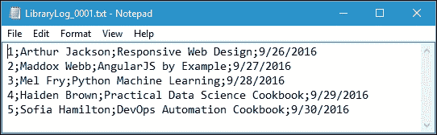
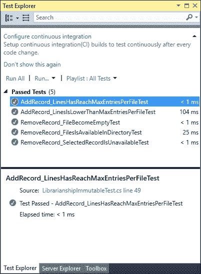

# 第十一章。编码最佳实践和测试功能代码

我们在前一章开发了一个功能性应用。为了在函数式方法中创建更好的代码，我们必须遵循最佳实践规则，并在代码中实现它们。在这一章中，我们将讨论泛函方法的概念，它是一个纯函数，使我们的函数类似于一个数学函数。本章将涉及的主题如下:

*   防止不诚实签名
*   创建不可变的类
*   避免`Temporal Coupling`
*   处理副作用
*   将代码分为`Domain Logic`和`Mutable Shell`
*   测试功能代码

# 用函数式 C# 编写最佳实践

函数方法有纯函数的概念。这意味着，只要我们传递完全相同的输入，函数就会产生相同的结果。现在，让我们开始讨论，通过遵循这里概述的编码最佳实践来创建更好的功能代码。

## 防止不诚实签名

正如我们在[第 1 章](01.html "Chapter 1. Tasting Functional Style in C#")*中讨论的，在 C#* 中品尝函数风格，我们使用数学方法来构建函数编程中的代码。换句话说，函数式编程就是用数学函数编程。数学函数必须满足两个要求，它们是:

*   每当我们提供相同的参数时，数学函数应该总是返回相同的结果。
*   数学函数的签名应该传递可能接受的输入值和可能产生的输出的所有信息。

现在让我们来看看下面的代码片段，我们可以在`HonestSignature.csproj`项目中找到它:

```cs
public partial class Program 
{ 
  public static int SumUp( 
    int a, int b) 
  { 
    return a + b; 
  } 
} 

```

通过检查前面的`SumUp()`函数，我们可以说，每次传递相同的输入时，我们都会检索相同的输出。现在让我们检查以下`GenerateRandom()`功能，我们也可以在`HonestSignature.csproj`项目中找到该功能:

```cs
public partial class Program 
{ 
  public static int GenerateRandom( 
    int max) 
  { 
    Random rnd = new Random( 
      Guid.NewGuid() 
      .GetHashCode()); 
    return rnd.Next(max); 
  } 
} 

```

从前面的代码中，我们可以看到，虽然我们不断地传递相同的输入，但是我们将检索不同的输出。假设我们有以下`RunGenerateRandom()`函数:

```cs
public partial class Program 
{ 
  public static void RunGenerateRandom() 
  { 
    for (int i = 0; i < 10; i++) 
    { 
      Console.WriteLine( 
        String.Format( 
          "Number {0} = {1}", 
          i, 
          GenerateRandom(100))); 
    } 
  } 
} 

```

如果我们运行前面的`RunGenerateRandom()`功能，我们将在控制台上获得以下输出:


从前面的代码片段中，我们通过传递完全相同的参数，即 100，调用了`GenerateRandom()`函数 10 次。正如您在上图中看到的，该函数为 10 次调用中的每一次返回不同的输出。因此，我们必须避免像`GenerateRandom()`函数这样的函数，以便创建一个纯函数，因为它不是数学函数。

现在我们来看看下面的`Divide()`函数，它将第一个参数除以第二个参数:

```cs
public partial class Program 
{ 
  public static int Divide( 
    int a, int b) 
  { 
    return a / b; 
  } 
} 

```

`Divide()`函数看起来类似于`SumUp()`函数，因为`Divide()`函数的签名接受任意两个整数并返回另一个整数。因此，如果我们传递完全相同的参数，它将返回相同的输出。然而，如果我们传递 1 和 0 作为输入参数呢？`Divide()`函数将抛出`DivideByZeroException`错误，而不是返回整数值。在这种情况下，我们可以得出结论，函数的签名没有提供足够的关于操作结果的信息。看起来该函数可以处理整数类型的任意两个参数，但实际上不能。为了解决这个问题，我们可以将前面的`Divide()`函数重构为下面的函数:

```cs
public partial class Program 
{ 
  public static int? Divide( 
    int a, int b) 
  { 
    if (b == 0) 
    return null; 
    return a / b; 
  } 
} 

```

正如您在前面的`Divide()`函数中看到的，我们通过在`int`后面添加一个问号来添加`nullable`类型，这样函数的返回可以为空。我们还添加了一个`if`语句，以确保`DivideByZeroException`错误永远不会被抛出。

## 将可变类重构为不可变类

不变性在函数式编程中非常重要，因为可变操作会使我们的代码不诚实。正如我们之前讨论的，我们需要防止不诚实的操作，以便创建我们的纯函数方法。不变性应用于数据结构——例如，一个类意味着这个类的对象在它们的生命周期内不能被改变。换句话说，如果一个类的实例可以以某种方式改变，那么这个类就是可变的，而如果我们一旦创建了这个类的实例就不能修改它，那么这个类就是不可变的。

现在我们来看看下面的代码，可以在`Immutability.csproj`项目中找到，继续我们的讨论:

```cs
namespace Immutability 
{ 
  public class UserMembership 
  { 
    private User _user; 
    private DateTime _memberSince; 
    public void UpdateUser( 
      int userId, string name) 
    { 
      _user = new User( 
       userId, 
       name); 
    } 
  } 
  public class User 
  { 
    public int Id { get; } 
    public string Name { get; } 
    public User( 
      int id, 
      string name) 
    { 
      Id = id; 
      Name = name; 
    } 
  } 
} 

```

正如您在前面的代码中看到的，我们有一个简单的组合。`UserMembership`类由`_user`和`_memberSince`属性组成。我们还可以看到`User`类是不可变的，因为所有的属性都被定义为只读的。由于不变性，`UserMembership`方法更新`_user`字段的唯一方法是创建一个新的`User`实例并用它替换旧的实例。注意`Use` r 类本身不包含这里的状态，而`UserMembership`类包含。我们可以说`UpdateUser`方法通过改变物体的状态留下了副作用。

现在让我们重构`UpdateUser`方法，使其不变。以下代码是重构`UpdateUser`方法的结果:

```cs
namespace Immutability 
{ 
  public class UserMembership 
  { 
    private readonly User _user; 
    private readonly DateTime _memberSince; 

    public UserMembership( 
      User user, 
      DateTime memberSince) 
    { 
       _user = user; 
       _memberSince = memberSince; 
    } 
 public UserMembership UpdateUser(int userId,string name) { 
      var newUser = new User(userId,name);
      return new UserMembership(newUser,_memberSince);
    } 
  } 

  public class User 
  { 
    public int Id { get; } 
    public string Name { get; } 
    public User( 
      int id, 
      string name) 
    { 
      Id = id; 
      Name = name; 
    } 
  } 
} 

```

可以看到，`UpdateUser()`方法不再更新`UserMembership`类的结构。相反，它会创建一个新的`UserMembership`实例，并将其作为操作的结果返回。通过重构`UpdateUser`方法，我们消除了该方法的副作用。现在很清楚操作的实际输出是什么了。不可变数据的使用使代码更具可读性，也有助于不用太多努力就能很好地理解正在发生的事情。

## 避免可变性和时间耦合

有时，使用带有副作用的方法会损害可读性。一个方法的调用与另一个方法的调用相结合。为了把事情说清楚，我们来看看下面的代码，我们可以在`TemporalCoupling.csproj`项目中找到:

```cs
public class MembershipDatabase 
{ 
  private Address _address; 
  private Member _member; 
  public void Process( 
    string memberName, 
    string addressString) 
  { 
    CreateAddress( 
      addressString); 

    CreateMember( 
      memberName); 
    SaveMember(); 
  } 

  private void CreateAddress( 
    string addressString) 
  { 
    _address = new Address( 
      addressString); 
  } 

  private void CreateMember( 
    string name) 
  { 
    _member = new Member( 
    name, 
    _address); 
  } 

  private void SaveMember() 
  { 
    var repository = new Repository(); 
    repository.Save(_member); 
  } 
} 

public class Address 
{ 
  public string _addressString { get; } 
  public Address( 
    string addressString) 
  { 
    _addressString = addressString; 
  } 
} 

public class Member 
{ 
  public string _name { get; } 
  public Address _address { get; } 

  public Member( 
    string name, 
    Address address) 
  { 
    _name = name; 
    _address = address; 
  } 
} 

public class Repository 
{ 
  public static List<Member> customers { get; } 

  public void Save( 
    Member customer) 
  { 
    customers.Add(customer); 
  } 
} 

```

从前面的代码中，您可以看到我们有一个`MembershipDatabase`类，它处理一个新成员。它检索名为`memberName`和`addressString`的输入参数，并使用它们在数据库中插入一个新成员。`MembershipDatabase`类中的`Process()`方法首先调用`CreateAddress`方法，该方法将创建地址，然后将其保存到私有字段中。`CreateMember()`方法然后检索地址并使用它实例化一个新的`Member`参数，该参数保存在另一个名为`member`的私有字段中。最后一种方法`SaveMember()`方法将成员保存到数据库中(在本例中，我们使用`list`)。这里有一个问题。`Process()`方法中的调用与时间耦合相耦合。我们必须总是以正确的顺序调用这三个方法，这样代码才能正常工作。

如果我们没有按照正确的顺序放置方法——例如，如果我们放置`CreateAddress()`方法调用，在`CreateMember()`方法调用之后，结果成员实例将是无效的，因为成员将不会检索到所需的依赖地址。同样，如果我们将`SaveMember()`方法调用置于其他方法调用之上，它将抛出`NullReferenceException`，因为当它试图保存一个成员时，该成员实例仍然为空。

时间耦合是方法签名不诚实的结果。`CreateAddress()`方法有一个输出，创建了一个`address`实例，但是这个输出隐藏在副作用之下，因为我们变异了`MembershipDatabase`类中的`Address`字段。`CreateMember()`方法也隐藏了操作的结果。它将`member`保存到私有字段，但也隐藏了它的一些输入。从`CreateMember()`方法的签名来看，我们可能认为它只需要名称参数来创建`member`，而它实际上指的是全局状态`address`字段。

这也发生在`SaveMember()`方法上。为了消除时间耦合，我们必须显式地指定方法签名中的所有输入和输出，或者换句话说，将所有副作用和依赖项移到签名级别。现在，让我们将前面包含副作用的代码重构为下面的代码:

```cs
public class MembershipDatabase 
{ 
  public void Process( 
    string memberName, 
    string addressString) 
  { 
    Address address = CreateAddress( 
      addressString); 
    Member member = CreateMember( 
      memberName, 
      address); 
    SaveMember(member); 
  } 

  private Address CreateAddress( 
    string addressString) 
  { 
    return new Address( 
      addressString); 
  } 

  private Member CreateMember( 
    string name, 
    Address address) 
  { 
    return new Member( 
      name, 
      address); 
  } 

  private void SaveMember( 
    Member member) 
  { 
    var repository = new Repository(); 
    repository.Save( 
      member); 
  } 
} 

public class Address 
{ 
  public string _addressString { get; } 
  public Address( 
    string addressString) 
  { 
    _addressString = addressString; 
  } 
} 

public class Member 
{ 
  public string _name { get; } 
  public Address _address { get; } 
  public Member( 
    string name, 
    Address address) 
  { 
    _name = name; 
    _address = address; 
  } 
} 

public class Repository 
{ 
  public static List<Member> customers { get; } 

  public void Save( 
    Member customer) 
  { 
    customers.Add(customer); 
  } 
} 

```

从突出显示的代码中，我们可以看到我们已经重构了`CreateAddress()`、`CreateMember()`、`SaveMember()`和`Process()`方法。

`CreateAddress()`方法现在返回`Address`，而不是保存到私有字段。在`CreateMember()`方法中，我们添加了一个新参数`address`，并且还更改了返回类型。对于`SaveMember()`方法，我们现在不引用客户私有字段，而是将其指定为方法签名中的依赖项。在`Process()`方法中，我们现在可以移除字段，并且我们已经成功地移除了与此变化的时间耦合。

现在我们不可能把`CreateAddress()`调用方法放在`CreateMember()`调用方法之后，因为不会编译代码。

## 处理副作用

虽然我们需要在函数式编程中创建一个纯函数，但我们不能完全避免副作用。正如您在前面的`MembershipDatabase`类中看到的，我们有`SaveMember()`方法，它会将成员字段保存到数据库中。下面的代码片段将清楚地解释这一点:

```cs
private void SaveMember( 
  Member member) 
{ 
  var repository = new Repository(); 
  repository.Save( 
    member); 
} 

```

为了处理副作用，我们可以使用**命令-查询分离** ( **CQS** )原理来分离产生副作用的方法和不产生副作用的方法。我们可以为产生副作用的方法调用命令，为不会产生副作用的方法调用查询。如果方法改变了一部分状态，它应该是 void 类型的方法。否则，它应该返回一些东西。利用这个 CQS 原理，我们可以通过观察一个方法的签名来确定它的目的。如果该方法返回一个值，它将是一个查询，不会发生任何变化。如果方法什么都不返回，那么它一定是一个命令，并且会在系统中留下一些副作用。

从前面的`MembershipDatabase`类中，我们现在可以识别出`Process()`和`SaveMember()`方法是命令类型，并且会留下一些副作用，因为它们不返回任何东西。相比之下，`CreateAddress()`和`CreateMember()`方法是查询，不会改变任何东西，因为它们会返回一些东西。

# 从域逻辑和可变外壳中分离代码

有时候，当我们的代码处理一个业务事务时，它会多次变异一些数据。在面向对象编程语言的世界中，这是一种相当常见的模式。然后，我们可以将代码分成域逻辑和可变外壳。在领域逻辑中，我们简化代码，并使用数学函数以函数方式编写业务逻辑。因此，这个领域逻辑将变得易于测试。在可变外壳中，我们放置一个可变表达式；在完成业务逻辑之后，我们将这样做。

## 检查含有副作用的代码

现在，让我们检查下面的代码，它包含许多我们将要重构的副作用，我们可以在`DomainLogicAndMutatingState.csproj`项目中找到它:

```cs
public class Librarianship 
{ 
  private readonly int _maxEntriesPerFile; 
  public Librarianship( 
    int maxEntriesPerFile) 
  { 
    _maxEntriesPerFile = 
    maxEntriesPerFile; 
  } 

  public void AddRecord( 
    string currentFile, 
    string visitorName, 
    string bookTitle, 
    DateTime returnDate) 
  { 
     // The rest of code can be found  
     // in the downloaded source code  
  } 

  private string GetNewFileName( 
        string existingFileName) 
  { 
    // The rest of code can be found  
    // in the downloaded source code  
  } 

  public void RemoveRecord( 
      string visitorName,  
      string directoryName) 
  { 
    foreach (string fileName in Directory.GetFiles( 
            directoryName)) 
    { 
      // The rest of code can be found  
      // in the downloaded source code  
    } 
  } 
} 

```

正如您在前面的代码中看到的，它是以一种简单的方式编写的。我们将把它的职责分成两部分:包含所有域逻辑的不可变核心和包含所有可变表达式的可变外壳。

`Librarianship`班将跟踪图书馆的所有借书者，并记录还书日期。该类使用日志文件存储借书人的姓名、借书的标题和还书日期。日志文件内容的模式是索引号、分号、借书人姓名和分号、书名和分号，最后是还书日期。以下是日志文件内容的示例:

```cs
1;Arthur Jackson;Responsive Web Design;9/26/2016 
2;Maddox Webb;AngularJS by Example;9/27/2016 
3;Mel Fry;Python Machine Learning;9/28/2016 
4;Haiden Brown;Practical Data Science Cookbook;9/29/2016 
5;Sofia Hamilton;DevOps Automation Cookbook;9/30/2016 

```

该类必须能够在日志文件中添加一个新行，比如我们在`AddRecord()`方法中可以看到的。但是在调用方法之前，我们必须在构造类时指定`_maxEntriesPerFile`字段的值。

当我们调用`AddRecord()`方法时，将使用`_maxEntriesPerFile`字段的值。如果`_maxEntriesPerFile`大于当前日志文件的总行数，它将使用以下代码将访问者身份插入日志文件:

```cs
if (lines.Length < _maxEntriesPerFile) 
{ 
  int lastIndex = int.Parse( 
    lines.Last() 
    .Split(';')[0]); 

  string newLine = 
    String.Format( 
    "{0};{1};{2};{3}", 
    (lastIndex + 1), 
    visitorName, 
    bookTitle, 
    returnDate 
    .ToString("d") 
  ); 

  File.AppendAllLines( 
    currentFile, 
    new[] { 
    newLine }); 
} 

```

否则，如果当前日志文件的总行数已经达到`_maxEntriesPerFile`，则`AddRecord()`方法创建一个新的日志文件，如下代码所示:

```cs
else 
{ 
  string newLine = 
    String.Format( 
    "1;{0};{1};{2}", 
    visitorName, 
    bookTitle, 
    returnDate 
    .ToString("d") 
    ); 
  string newFileName = 
    GetNewFileName( 
    currentFile); 
  File.WriteAllLines( 
    newFileName, 
    new[] { 
    newLine }); 
  currentFile = newFileName; 
} 

```

从前面的代码片段中，我们找到了`GetNewFileName()`方法，根据当前的日志文件名生成一个新的日志文件名。`GetNewFileName()`方法的实施如下:

```cs
private string GetNewFileName( 
  string existingFileName) 
{ 
  string fileName =  
    Path.GetFileNameWithoutExtension( 
      existingFileName); 
  int index = int.Parse( 
    fileName 
    .Split('_')[1]); 

  return String.Format( 
    "LibraryLog_{0:D4}.txt", 
    index + 1); 
} 

```

从前面`GetNewFileName()`方法的实现中，我们可以看到日志文件名的模式是`LibraryLog _0001.txt`、`LibraryLog _0002.txt`等等。

如果没有找到指定的日志文件名，`AddRecord(`)方法也会创建一个新的日志文件。这项任务的执行情况如下:

```cs
if (!File.Exists(currentFile)) 
{ 
  string newLine = 
    String.Format( 
    "1;{0};{1};{2}", 
    visitorName, 
    bookTitle, 
    returnDate 
    .ToString("d") 
    ); 

  File.WriteAllLines( 
    currentFile, 
    new[] { 
    newLine }); 
} 

```

该类还有`RemoveRecord()`方法从日志文件中删除访问者身份。该方法的实现如下:

```cs
public void RemoveRecord( 
    string visitorName,  
    string directoryName) 
{ 
    foreach (string fileName in Directory.GetFiles( 
        directoryName)) 
    { 
        string tempFile = Path.GetTempFileName(); 
        List<string> linesToKeep = File 
            .ReadLines(fileName) 
            .Where(line => !line.Contains(visitorName)) 
            .ToList(); 

        if (linesToKeep.Count == 0) 
        { 
            File.Delete( 
                fileName); 
        } 
        else 
        { 
            File.WriteAllLines( 
                tempFile,  
                linesToKeep); 

            File.Delete( 
                fileName); 

            File.Move( 
                tempFile,  
                fileName); 
        } 
    } 
} 

```

在`RemoveRecord()`方法的实现中，您可以看到它从所选目录的可用日志文件中移除了所选访问者，如以下代码片段所示:

```cs
List<string> linesToKeep = File
 .ReadLines(fileName)
 .Where(line => !line.Contains(visitorName))
 .ToList();

```

如果`linesToKee` p 不包含数据，我们可以使用以下代码安全地删除文件:

```cs
if (linesToKeep.Count == 0)
{
 File.Delete(
 fileName);
}

```

否则，我们只需要使用以下代码从日志文件中删除访问者身份:

```cs
else
{
 File.WriteAllLines(
 tempFile, 
 linesToKeep);
 File.Delete(
 fileName);
 File.Move(
 tempFile, 
 fileName);
}

```

现在是时候试试我们的`Librarianship`课了。首先，我们将准备一个包含作者和书名的数据列表，如下面的代码所示:

```cs
public partial class Program 
{ 
    public static List<Book> bookList = 
        new List<Book>() 
        { 
            new Book( 
                "Arthur Jackson", 
                "Responsive Web Design"), 
            new Book( 
                "Maddox Webb", 
                "AngularJS by Example"), 
            new Book( 
                "Mel Fry", 
                "Python Machine Learning"), 
            new Book( 
                "Haiden Brown", 
                "Practical Data Science Cookbook"), 
            new Book( 
                "Sofia Hamilton", 
                "DevOps Automation Cookbook") 
        }; 
} 

```

我们的`Book`结构如下:

```cs
public struct Book 
{ 
    public string Borrower { get; } 
    public string Title { get; } 

    public Book( 
        string borrower, 
        string title) 
    { 
        Borrower = borrower; 
        Title = title; 
    } 
} 

```

我们将调用下面的`LibrarianshipInvocation()`方法来消耗`Librarianship`类:

```cs
public partial class Program 
{ 
    public static void LibrarianshipInvocation() 
    { 
        Librarianship librarian =  
            new Librarianship(5); 

        for (int i = 0; i < bookList.Count; i++) 
        { 
            librarian.AddRecord( 
                GetLastLogFile( 
                    AppDomain.CurrentDomain.BaseDirectory), 
                bookList[i].Borrower, 
                bookList[i].Title, 
                DateTime.Now.AddDays(i)); 
        } 
    } 
} 

```

正如您在前面的`LibrarianshipInvocation()`方法中看到的，我们调用`GetLastLogFile()`方法来查找最后一个可用的日志文件。该方法的实现如下:

```cs
public partial class Program 
{ 
    public static string GetLastLogFile( 
        string LogDirectory) 
    { 
        string[] logFiles = Directory.GetFiles( 
            LogDirectory,  
            "LibraryLog_????.txt"); 

        if (logFiles.Length > 0) 
        { 
            return logFiles[logFiles.Length - 1]; 
        } 
        else 
        { 
            return "LibraryLog_0001.txt"; 
        } 
    } 
} 

```

当我们调用`GetLastLogFile()`方法时，它会在我们指定的目录中查找所有具有`LibraryLog_????.txt`模式的文件。然后它将返回字符串数组的最后一个成员。如果字符串数组不包含数据，将返回`LibraryLog_0001.txt`作为默认日志文件名。

如果我们运行`LibrarianshipInvocation()`方法，我们将什么也看不到，但是我们将获得一个包含以下文本的新`LibraryLog_0001.txt`文件:



从前面的输出文件日志中，我们可以看到我们已经按照预期成功创建了`Librarianship`类。

## 重构 AddRecord()方法

现在是时候重构`Librarianship`类，使其成为不可变的。首先，我们将使`AddRecord()`方法成为一个数学函数。要做到这一点，我们必须确保它不会直接访问磁盘，当我们使用`File.Exists()`、`File.ReadAllLines()`、`File.AppendAllLines()`和`File.WriteAllLines()`方法时，我们会这样做。我们将重构`AddRecord()`方法如下:

```cs
public FileAction AddRecord( 
    FileContent currentFile,  
    string visitorName, 
    string bookTitle, 
    DateTime returningDate) 
{ 
    List<DataEntry> entries = Parse(currentFile.Content); 

    if (entries.Count < _maxEntriesPerFile) 
    { 
        entries.Add( 
            new DataEntry( 
                entries.Count + 1,  
                visitorName,  
                bookTitle,  
                returningDate)); 

        string[] newContent =  
            Serialize( 
                entries); 

        return new FileAction( 
            currentFile.FileName,  
            ActionType.Update,  
            newContent); 
    } 
    else 
    { 
        var entry = new DataEntry( 
            1, 
            visitorName, 
            bookTitle, 
            returningDate); 

        string[] newContent =  
            Serialize( 
                new List<DataEntry> { entry }); 

        string newFileName =  
            GetNewFileName( 
                currentFile.FileName); 

        return new FileAction( 
            newFileName,  
            ActionType.Create,  
            newContent); 
    } 
} 

```

正如您在前面的代码中看到的，我们修改了`AddRecord()`方法签名，这样它现在就不会传递任何文件名，而是传递一个`FileContent`数据类型，该数据类型由以下实现构成:

```cs
public struct FileContent 
{ 
    public readonly string FileName; 
    public readonly string[] Content; 

    public FileContent( 
        string fileName, 
        string[] content) 
    { 
        FileName = fileName; 
        Content = content; 
    } 
} 

```

如您所见，`FileContent`结构现在将处理文件名及其内容。并且`AddRecord()`方法现在也返回`FileAction`数据类型。`FileAction`数据类型的实现如下:

```cs
public struct FileAction 
{ 
    public readonly string FileName; 
    public readonly string[] Content; 
    public readonly ActionType Type; 

    public FileAction( 
        string fileName,  
        ActionType type,  
        string[] content) 
    { 
        FileName = fileName; 
        Type = type; 
        Content = content; 
    } 
} 

```

`ActionType`列举如下:

```cs
public enum ActionType 
{ 
    Create, 
    Update, 
    Delete 
} 

```

我们还有一个新的数据类型，就是`DataEntry`。`DataEntry`结构的实现如下:

```cs
public struct DataEntry 
{ 
    public readonly int Number; 
    public readonly string Visitor; 
    public readonly string BookTitle; 
    public readonly DateTime ReturningDate; 

    public DataEntry( 
        int number,  
        string visitor, 
        string bookTitle, 
        DateTime returningDate) 
    { 
        Number = number; 
        Visitor = visitor; 
        BookTitle = bookTitle; 
        ReturningDate = returningDate; 
    } 
} 

```

`DataEntry`结构将处理我们想要写入日志文件的所有数据。如果我们再次检查`AddRecord()`方法，我们没有找到确保日志文件存在的过程，因为这将在单独的过程中完成。

我们注意到`AddRecord()`方法调用了两个新方法:`Parse()`和`Serialize()`方法。使用`Parse()`方法解析日志文件内容中的所有行，然后根据日志文件的内容形成`DataEntry`列表。该方法的实现如下:

```cs
private List<DataEntry> Parse( 
    string[] content) 
{ 
    var result = new List<DataEntry>(); 

    foreach (string line in content) 
    { 
        string[] data = line.Split(';'); 
        result.Add( 
            new DataEntry( 
                int.Parse(data[0]),  
                data[1],  
                data[2], 
                DateTime.Parse(data[3]))); 
    } 

    return result; 
} 

```

另一方面，使用`Serialize()`方法将`DataEntry`列表序列化为字符串数组。该方法的实现如下:

```cs
private string[] Serialize( 
    List<DataEntry> entries) 
{ 
    return entries 
        .Select(entry =>  
            String.Format( 
                "{0};{1};{2};{3}", 
                entry.Number, 
                entry.Visitor, 
                entry.BookTitle, 
                entry.ReturningDate 
                    .ToString("d"))) 
        .ToArray(); 
} 

```

## 重构 RemoveRecord()方法

现在，我们回到我们的`Librarianship`类，重构`RemoveRecord()`方法。实施情况如下:

```cs
public IReadOnlyList<FileAction> RemoveRecord( 
  string visitorName, 
  FileContent[] directoryFiles) 
{ 
  return directoryFiles 
    .Select(file => 
    RemoveRecordIn( 
      file, 
      visitorName)) 
  .Where(action => 
  action != null) 
  .Select(action => 
  action.Value) 
  .ToList(); 
} 

```

`RemoveRecord()`方法现在有了新的签名。它传递一个`FileContent`数组，而不仅仅是目录名。它还返回一个只读的`FileAction`列表。`RemoveRecord()`方法还需要一个额外的`RemoveRecordIn()`方法，用于获取指定的文件名和文件内容，以定位将被删除的记录。`RemoveRecordIn()`方法的实施如下:

```cs
private FileAction? RemoveRecordIn( 
    FileContent file,  
    string visitorName) 
{ 
    List<DataEntry> entries = Parse( 
        file.Content); 
    List<DataEntry> newContent = entries 
        .Where(x =>  
            x.Visitor != visitorName) 
        .Select((entry, index) =>  
            new DataEntry( 
                index + 1,  
                entry.Visitor,  
                entry.BookTitle, 
                entry.ReturningDate)) 
        .ToList(); 
    if (newContent.Count == entries.Count) 
        return null; 
    if (newContent.Count == 0) 
    { 
        return new FileAction( 
            file.FileName, 
            ActionType.Delete, 
            new string[0]); 
    } 
    else 
    { 
        return new FileAction( 
            file.FileName,  
            ActionType.Update,  
            Serialize( 
                newContent)); 
    } 
} 

```

现在，我们有了领域逻辑代码，它是完全不可变的，可以在单元测试环境中运行这个领域逻辑。

## 在单元测试中运行域逻辑

领域逻辑是一个不可变的源，它是一个纯函数，所以我们可以一遍又一遍地运行单元测试，而不必改变测试规则。在这里，我们将在`LibrarianshipImmutable`课上测试`AddRecord()`和`RemoveRecord()`方法。我们将对这两种方法进行五次测试。对于`AddRecord()`方法，我们将测试文件是否溢出。对于`RemoveRecord()`方法，我们将测试要删除的所选记录是否可用。然后，如果所选记录为空或所选记录不可用，文件将变为空。

### 测试 AddRecord()方法

现在我们来看看下面的`AddRecord_LinesIsLowerThanMaxEntriesPerFileTest()`测试方法，它会在现有的日志文件中添加一条记录:

```cs
[TestMethod] 
// Add record to existing log file  
// but the lines is lower then maxEntriesPerFile  
public void AddRecord_LinesIsLowerThanMaxEntriesPerFileTest() 
{ 
    LibrarianshipImmutable librarian =  
        new LibrarianshipImmutable(5); 

    FileContent file = new FileContent( 
        "LibraryLog_0001.txt",  
        new[]{ 
            "1;Arthur Jackson;Responsive Web Design;9/26/2016" 
        }); 

    FileAction action = librarian.AddRecord( 
        file, 
        "Maddox Webb", 
        "AngularJS by Example", 
        new DateTime( 
            2016, 9, 27, 0, 0, 0)); 

    Assert.AreEqual( 
        ActionType.Update,  
        action.Type); 
    Assert.AreEqual( 
        "LibraryLog_0001.txt",  
        action.FileName); 
    CollectionAssert.AreEqual( 
        new[]{ 
            "1;Arthur Jackson;Responsive Web Design;9/26/2016", 
            "2;Maddox Webb;AngularJS by Example;9/27/2016" 
        }, 
        action.Content); 
} 

```

在`AddRecord_LinesIsLowerThanMaxEntriesPerFileTest()`测试方法中，首先我们创建一个包含`1;Arthur Jackson;Responsive Web Design;9/26/2016`的`LibraryLog_0001.txt`文件，然后我们添加一个新的记录，如下代码所示:

```cs
FileAction action = librarian.AddRecord( 
  file, 
  "Maddox Webb", 
  "AngularJS by Example", 
  new DateTime( 
    2016, 9, 27, 0, 0, 0)); 

```

从现在开始，我们要保证`action.The type`必须是`ActionType.Update`、`action.FileName`必须是`LibraryLog_0001.txt`、`action.Content`必须是两条线，第一条线为`1;Arthur Jackson;Responsive Web Design;9/26/2016`，第二条线为`2;Maddox Webb;AngularJS by Example;9/27/2016`。

### 类型

`Assert.AreEqual()`方法用于验证指定值是否相等。不幸的是，使用此方法不会覆盖数组数据。为了比较数组，我们需要使用`CollectionAssert.AreEqual()`方法，该方法将验证两个指定的集合是否相等。

另一种单元测试是`AddRecord_LinesHasReachMaxEntriesPerFileTest()`测试方法。该测试的实施如下:

```cs
[TestMethod] 
// Add record to a new log file  
// becausecurrent log file has reached maxEntriesPerFile  
public void AddRecord_LinesHasReachMaxEntriesPerFileTest() 
{ 
    LibrarianshipImmutable librarian =  
        new LibrarianshipImmutable(3); 

    FileContent file = new FileContent( 
        "LibraryLog_0001.txt",  
        new[]{ 
            "1;Arthur Jackson;Responsive Web Design;9/26/2016", 
            "2;Maddox Webb;AngularJS by Example;9/27/2016", 
            "3;Mel Fry;Python Machine Learning;9/28/2016" 
        }); 

    FileAction action = librarian.AddRecord( 
        file, 
        "Haiden Brown", 
        "Practical Data Science", 
        new DateTime(2016, 9, 29, 0, 0, 0)); 

    Assert.AreEqual( 
        ActionType.Create,  
        action.Type); 
    Assert.AreEqual( 
        "LibraryLog_0002.txt",  
        action.FileName); 
    CollectionAssert.AreEqual( 
        new[]{ 
            "1;Haiden Brown;Practical Data Science;9/29/2016" 
        },  
        action.Content); 
} 

```

在这个测试方法中，我们希望确保如果当前的日志文件行已经达到`maxEntriesPerFile`，则创建一个新的日志文件。首先，我们实例化`LibrarianshipImmutable`并用`3`填充`maxEntriesPerFile`字段，然后用三个访问者填充日志文件，如下代码所示:

```cs
LibrarianshipImmutable librarian =  
  new LibrarianshipImmutable(3); 
FileContent file = new FileContent( 
  "LibraryLog_0001.txt", 
  new[]{ 
    "1;Arthur Jackson;Responsive Web Design;9/26/2016", 
    "2;Maddox Webb;AngularJS by Example;9/27/2016", 
    "3;Mel Fry;Python Machine Learning;9/28/2016" 
  }); 

```

之后，我们使用以下代码添加一条新记录:

```cs
FileAction action = librarian.AddRecord( 
  file, 
  "Haiden Brown", 
  "Practical Data Science", 
  new DateTime(2016, 9, 29, 0, 0, 0)); 

```

现在，我们必须确保`action.Type`是`ActionType.Update`，它会创建一个名为`LibraryLog_0002.txt`的新日志文件。另外，新日志文件的内容是`1;Haiden Brown;Practical Data Science;9/29/2016`。

### 测试 RemoveRecord()方法

正如我们之前讨论的，我们有三个`RemoveRecord()`方法的测试。首先，我们将测试从目录中的文件中删除一条记录。代码如下:

```cs
[TestMethod] 
// Remove selected record from files in the directory 
public void RemoveRecord_FilesIsAvailableInDirectoryTest() 
{ 
    LibrarianshipImmutable librarian =  
        new LibrarianshipImmutable(10); 

    FileContent file = new FileContent( 
        "LibraryLog_0001.txt",  
        new[] 
        { 
            "1;Arthur Jackson;Responsive Web Design;9/26/2016", 
            "2;Maddox Webb;AngularJS by Example;9/27/2016", 
            "3;Mel Fry;Python Machine Learning;9/28/2016" 
        }); 

    IReadOnlyList<FileAction> actions =  
        librarian.RemoveRecord( 
            "Arthur Jackson",  
            new[] { 
                file }); 

    Assert.AreEqual( 
        1,  
        actions.Count); 

    Assert.AreEqual( 
        "LibraryLog_0001.txt",  
        actions[0].FileName); 

    Assert.AreEqual( 
        ActionType.Update,  
        actions[0].Type); 

    CollectionAssert.AreEqual( 
        new[]{ 
            "1;Maddox Webb;AngularJS by Example;9/27/2016", 
            "2;Mel Fry;Python Machine Learning;9/28/2016" 
        },  
        actions[0].Content); 
} 

```

在这个`RemoveRecord_FilesIsAvailableInDirectoryTest()`测试方法中，我们首先创建一个包含三条记录的`LibraryLog_0001.txt`文件。然后，我们删除第一条记录，并确保`LibraryLog_0001.txt`将只包含两个具有正确订单号的剩余日志。

另一个测试是`RemoveRecord_FileBecomeEmptyTest()`，实现如下:

```cs
[TestMethod] 
// Remove selected record from files in the directory 
// If file becomes empty, it will be deleted 
public void RemoveRecord_FileBecomeEmptyTest() 
{ 

    LibrarianshipImmutable librarian = 
        new LibrarianshipImmutable(10); 

    FileContent file = new FileContent( 
        "LibraryLog_0001.txt", 
        new[] 
        { 
            "1;Arthur Jackson;Responsive Web Design;9/26/2016" 
        }); 

    IReadOnlyList<FileAction> actions = 
        librarian.RemoveRecord( 
            "Arthur Jackson",  
            new[] { 
                file }); 

    Assert.AreEqual( 
        1,  
        actions.Count); 

    Assert.AreEqual( 
        "LibraryLog_0001.txt",  
        actions[0].FileName); 

    Assert.AreEqual( 
        ActionType.Delete,  
        actions[0].Type); 
} 

```

`RemoveRecord_FileBecomeEmptyTest()`测试方法将确保记录被删除后，如果日志文件为空，则删除日志文件。首先，我们用一条记录创建一个新的日志文件，然后使用`RemoveRecord()`方法删除它。

`RemoveRecord()`方法的最后一个测试是`RemoveRecord_SelectedRecordIsUnavailableTest()`，如果所选记录不可用，该测试将不会删除任何内容。测试方法的实现如下:

```cs
[TestMethod] 
// Remove nothing if selected record is unavailable 
public void RemoveRecord_SelectedRecordIsUnavailableTest() 
{ 
    LibrarianshipImmutable librarian = 
        new LibrarianshipImmutable(10); 

    FileContent file = new FileContent( 
        "LibraryLog_0001.txt", 
        new[] 
        { 
            "1;Sofia Hamilton;DevOps Automation;9/30/2016" 
        }); 

    IReadOnlyList<FileAction> actions = 
        librarian.RemoveRecord( 
            "Arthur Jackson", 
            new[] { 
                file }); 

    Assert.AreEqual( 
        0,  
        actions.Count); 
} 

```

如您所见，我们创建了包含索菲亚·汉密尔顿作为访问者名称的日志文件，但是我们试图删除名为亚瑟·杰克逊的访问者。在这种情况下，`RemoveRecord()`方法不会移除任何东西。

### 执行测试

现在，是时候为所有五种测试方法运行单元测试了。以下是我们运行测试后将获得的结果:



## 将可变外壳添加到代码中

到目前为止，我们已经成功地创建了不可变的核心和覆盖单元测试。现在，我们准备为访问磁盘的其余代码实现可变外壳。我们将创建两个类，`FileProcessor`和`AppService`。`FileProcessor`班将做所有的磁盘交互。`AppService`班将成为`LibrarianshipImmutable`班和`FileProcessor`班之间的桥梁。

现在我们来看看下面的`FileProcessor`类实现，可以在`FileProcessor.cs`文件中找到:

```cs
namespace DomainLogicAndMutatingState 
{ 
    public class FileProcessor 
    { 
        public FileContent ReadFile( 
            string fileName) 
        { 
            return new FileContent( 
                fileName,  
                File.ReadAllLines( 
                    fileName)); 
        } 

        public FileContent[] ReadDirectory( 
            string directoryName) 
        { 
            return Directory 
                .GetFiles( 
                    directoryName) 
                .Select(x =>  
                    ReadFile(x)) 
                .ToArray(); 
        } 

        public void ApplyChanges( 
            IReadOnlyList<FileAction> actions) 
        { 
            foreach (FileAction action in actions) 
            { 
                switch (action.Type) 
                { 
                    case ActionType.Create: 
                    case ActionType.Update: 
                        File.WriteAllLines( 
                            action.FileName,  
                            action.Content); 
                        continue; 

                    case ActionType.Delete: 
                        File.Delete( 
                            action.FileName); 
                        continue; 

                    default: 
                        throw new InvalidOperationException(); 
                } 
            } 
        } 

        public void ApplyChange( 
            FileAction action) 
        { 
            ApplyChanges( 
                new List<FileAction> { 
                    action }); 
        } 
    } 
} 

```

前面`FileProcessor`类有四种方法；分别是`ReadFile()`、`ReadDirectory()`，以及两个不同签名的`ApplyChanges()`方法。使用`ReadFile()`方法读取所选文件并将其形成`FileContent`数据类型。使用`ReadDirectory()`方法读取所选目录中的所有文件，并将其形成`FileContent`数据数组。`ApplyChanges()`方法用于对所选文件进行执行。如果动作是`Create`或`Update`，则调用`File.WriteAllLines()`方法。如果动作是`Delete`，则调用`File.Delete()`方法。否则会抛出`InvalidOperationException`异常。

完成`FileProcessor`类后，就该创建`AppService`类了。该类的实现如下，我们可以在`AppService.cs`文件中找到:

```cs
namespace DomainLogicAndMutatingState 
{ 
    public class AppService 
    { 
        private readonly string _directoryName; 
        private readonly LibrarianshipImmutable _librarian; 
        private readonly FileProcessor _fileProcessor; 

        public AppService( 
            string directoryName) 
        { 
            _directoryName = directoryName; 
            _librarian = new LibrarianshipImmutable(10); 
            _fileProcessor = new FileProcessor(); 
        } 

        public void AddRecord( 
            string visitorName, 
            string bookTitle, 
            DateTime returningDate) 
        { 
            FileInfo fileInfo = new DirectoryInfo( 
                _directoryName) 
                    .GetFiles() 
                    .OrderByDescending(x =>  
                        x.LastWriteTime) 
                    .First(); 

            FileContent file =  
                _fileProcessor.ReadFile( 
                    fileInfo.Name); 

            FileAction action =  
                _librarian.AddRecord( 
                    file,  
                    visitorName, 
                    bookTitle, 
                    returningDate); 

            _fileProcessor.ApplyChange( 
                action); 
        } 

        public void RemoveRecord( 
            string visitorName) 
        { 
            FileContent[] files =  
                _fileProcessor.ReadDirectory( 
                    _directoryName); 

            IReadOnlyList<FileAction> actions = 
                _librarian.RemoveRecord( 
                    visitorName, files); 

            _fileProcessor.ApplyChanges( 
                actions); 
        } 
    } 
} 

```

正如我们之前讨论的，AppService 类被用作`LibrarianshipImmutable`类和`FileProcessor`类之间的桥梁。我们在这个 AppService 类中有两个方法，它们的签名与`LibrarianshipImmutable`类中的方法完全相同；它们是`AddRecord()`和`RemoveRecord()`方法。作为一个桥梁，我们可以看到在类构造函数中，`LibrarianshipImmutable`和`FileProcessor`类构造函数被调用来创建一个新的实例。通过调用`AppService`类中的`AddRecord(`方法，我们实际上调用了`LibrarianshipImmutable`类中的`AddRecord()`方法，然后调用了`FileProcessor`类中的`ApplyChange()`方法。同样，调用`AppService`类中的`RemoveRecord()`方法将调用`LibrarianshipImmutable`类中的`RemoveRecord()`方法，然后调用`FileProcessor`类中的`ApplyChange()`方法。

# 总结

诚实的签名不仅在函数式方法中很重要，而且在我们每次编码时也很重要，因为基本上，签名必须传递关于可能接受的输入值和可能产生的输出的所有信息。通过实现诚实签名，我们将知道传递给方法参数的值。我们必须确保我们也有一个不可变的类，以便获得功能，因为可变操作会使我们的代码不诚实。

尽管我们必须避免纯函数中的副作用，但要真正避免代码中的副作用几乎是不可能的。我们能做的就是处理它。我们可以使用**命令-查询分离** ( **CQS** )原理来分离产生副作用的方法和不产生副作用的方法。如果该方法返回一个值，它将是一个查询，不会发生任何变化。如果方法什么都不返回，那么它一定是一个命令，并且会在系统中留下一些副作用。

为了处理副作用，我们还可以将代码分成域逻辑和可变外壳。领域逻辑将是我们的核心程序，它必须是不可变的。所有可变处理都将存储在可变外壳中。通过创建域逻辑，我们可以轻松地在其上运行单元测试。我们不需要修改测试场景或者运行领域逻辑的模拟测试，因为它是一个纯函数。