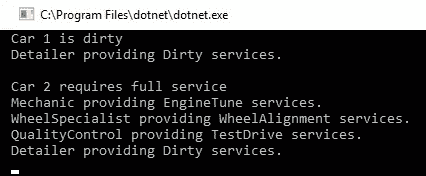
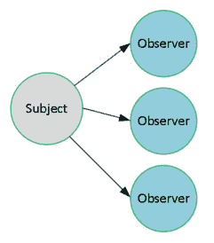
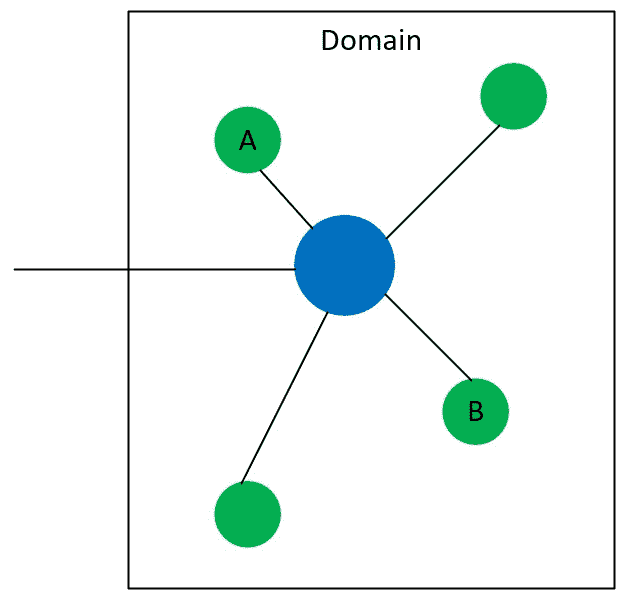
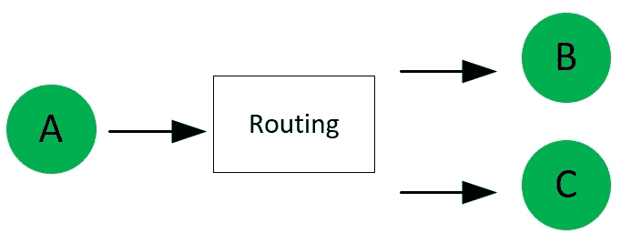
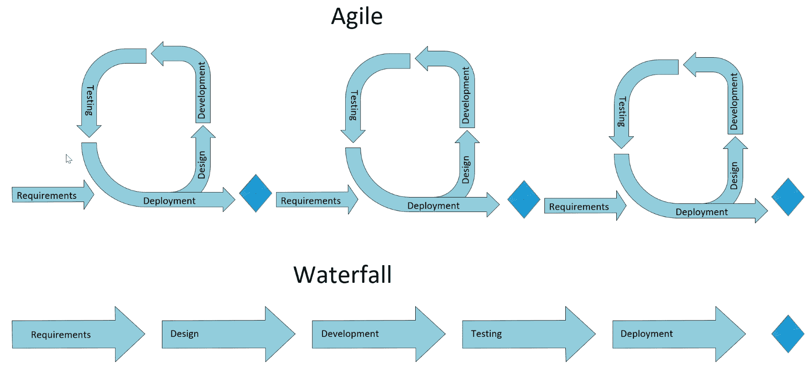

# 二、现代软件设计模式与原则

在上一章中，我们讨论了**面向对象编程**（**OOP**），为探索不同的模式做准备。由于许多模式依赖于 OOP 中的概念，因此引入和/或重新审视这些概念很重要。类之间的继承允许我们定义一个*is-a-type-of 关系*。这提供了更高程度的抽象。例如，通过继承可以执行比较，例如*猫*是*动物*的一种，而*狗*是*动物*的一种。封装提供了一种控制类细节的可见性和访问的方法。多态性提供了使用同一接口处理不同对象的能力。通过 OOP，可以实现更高级别的抽象，从而为处理大型解决方案提供更易于管理和理解的方式。

本章对现代软件开发中使用的不同模式进行分类和介绍。这本书对模式是什么有着非常广阔的视野。软件开发中的模式是软件程序员在开发过程中面临的一般问题的任何解决方案。它们是根据经验建立起来的，即哪些有效，哪些无效。此外，这些解决方案在各种情况下由众多开发人员进行试验和测试。使用模式的好处是基于这一过去的活动，既不重复工作，又保证问题将在不引入缺陷或问题的情况下得到解决。

特别是在考虑特定于技术的模式时，一本书中涉及的内容太多，因此本章将重点介绍特定的模式，以说明不同类型的模式。我们试图根据自己的经验挑选出最常见、最具影响力的模式。在随后的章节中，将更详细地探讨具体的模式。

本章将介绍以下主题：

*   设计原则，包括实体
*   模式目录，包括**四人帮**（**GoF**）模式和**企业集成模式**（**EIP**）
*   软件开发生命周期模式
*   解决方案开发、云开发和服务开发的模式和实践

# 技术要求

本章包含各种代码示例来解释这些概念。代码保持简单，仅用于演示目的。大多数示例都涉及用 C# 编写的.NETCore 控制台应用。

要运行和执行代码，您需要以下内容：

*   Visual Studio 2019（您也可以使用 Visual Studio 2017 版本 3 或更高版本运行应用）
*   .NETCore
*   SQL Server（本章使用快速版）

# 安装 Visual Studio

要运行这些代码示例，您需要安装 VisualStudio，或者可以使用首选 IDE。要执行此操作，请遵循以下说明：

1.  从以下链接下载 Visual Studio:[https://docs.microsoft.com/en-us/visualstudio/install/install-visual-studio](https://docs.microsoft.com/en-us/visualstudio/install/install-visual-studio) 。
2.  按照随附的安装说明进行操作。Visual Studio 安装有多个版本。在本章中，我们将使用 Visual Studio for Windows。

# 设置.NETCore

如果未安装.NET Core，则需要遵循以下说明：

1.  从以下链接下载.NETCore：[https://www.microsoft.com/net/download/windows](https://www.microsoft.com/net/download/windows) 。
2.  遵循安装说明和相关库：[https://dotnet.microsoft.com/download/dotnet-core/2.2](https://dotnet.microsoft.com/download/dotnet-core/2.2) 。

The complete source code is available in GitHub. The source code shown in the chapter might not be complete so it is advisable to retrieve the source in order to run the examples: [https://github.com/PacktPublishing/Hands-On-Design-Patterns-with-C-and-.NET-Core/tree/master/Chapter2](https://github.com/PacktPublishing/Hands-On-Design-Patterns-with-C-and-.NET-Core/tree/master/Chapter2).

# 设计原则

可以说，好的软件开发最重要的方面是软件设计。开发功能准确且易于维护的软件解决方案具有挑战性，并且在很大程度上依赖于使用良好的开发原则。随着时间的推移，项目早期做出的一些决策可能会导致解决方案的维护和扩展成本过高，迫使系统重写，而其他具有良好设计的软件可以随着业务需求和技术变化而扩展和调整。有许多软件开发设计原则，本节将重点介绍一些您需要熟悉的流行和重要的原则。

# 干燥-不要重复你自己

**不要重复自己**（**DRY**原则）背后的指导思想是重复是浪费时间和精力。重复可以采取过程和代码的形式。多次处理同一需求是一种浪费精力的行为，并且会在解决方案中造成混乱。当第一次看到这个原理时，可能不清楚系统最终如何复制一个进程或代码。例如，一旦有人确定了如何执行某个需求，为什么其他人会努力复制相同的功能？在软件开发中有很多情况会发生这种情况，理解为什么会发生这种情况是理解这一原则的价值的关键。

以下是代码重复的一些常见原因：

*   **缺乏理解**：在大型解决方案中，开发人员可能不完全了解现有解决方案和/或不知道如何应用抽象来解决现有功能的问题。
*   **复制粘贴**：简单来说，代码在多个类中复制，而不是重构解决方案以允许多个类访问共享功能

# 吻——保持简单，愚蠢

与 DRY 类似，**保持简单愚蠢**（**亲吻**）多年来一直是软件开发中的一个重要原则。KISS 强调简单应该是目标，而复杂应该避免。这里的关键是避免不必要的复杂性，从而减少出错的机会。

# 雅格尼——你不会需要它的

**您不需要它**（**雅格尼**）只是简单地说，只有在需要时才应该添加功能。有时在软件开发中，有一种趋势，就是在某些东西发生变化的情况下，对设计进行*未来验证*。这可能会创建当前或将来实际上不需要的需求：

"Always implement things when you actually need them, never when you just foresee that you need them."

*-罗恩·杰弗里斯*

# MVP–最低可行产品

通过采用**最低可行产品**（**MVP**方法，一项工作的范围仅限于最小的需求集，以产生有效的可交付成果。MVP 通常与敏捷软件开发相结合（参见本章后面的*软件开发生命周期模式*一节），将需求限制在可设计、开发、测试和交付的可管理范围内。这种方法非常适合于较小的网站或应用开发，在这些网站或应用开发中，功能集可以在单个开发周期内一直发展到生产。

In [Chapter 3](03.html), *Implementing Design Patterns - Basics Part 1*, MVP will be illustrated in a fictitious scenario where the technique will be used to limit the scope of changes as well as to help the team focus during the design and requirement gathering phases.

# 固体

SOLID 是最具影响力的设计原则之一，我们将在[第 3 章](03.html)、*实现设计模式-基础第 1 部分*中详细介绍。SOLID 实际上由五个设计原则组成，其目的是鼓励更易于维护和理解的设计。这些原则鼓励更容易修改的代码库，并降低引入问题的风险。

In [Chapter 3](03.html), *Implementing Design Patterns - Basics Part 1,* SOLID will be covered in more detail by being applied to a C# application.

# 单一责任原则

一个类应该只有一个职责。这个原则的目标是简化我们的类并逻辑地构造它们。具有多重职责的类更难理解和修改，因为它们更复杂。在这种情况下，责任只是改变的一个原因。看待责任的另一种方式是将其定义为功能的单个部分：

"A class should have one, and only one, reason to change."

*-罗伯特·C·马丁*

# 开闭原理

打开/关闭原则最好用 OOP 来描述。类的设计应该以继承作为扩展其功能的手段。换言之，在设计课程的过程中，对变化进行规划和考虑。通过定义和使用类实现的接口，应用了打开/关闭原则。该类为*打开*修改，其描述接口为*关闭*修改。

# 里氏代换原则

能够在运行时替换对象是 Liskov 替换原则的基础。在 OOP 中，如果类继承自基类或实现接口，则可以将其作为基类或接口的对象引用。用一个简单的例子更容易描述这一点。

我们将为一个动物定义一个接口，并实现两个动物`Cat`和`Dog`，如下所示：

```cs
interface IAnimal
{
     string MakeNoise();
}
class Dog : IAnimal
{
   public string MakeNoise()
     {
        return "Woof";
     }
}
class Cat : IAnimal
{
    public string MakeNoise()
    {
        return "Meouw";
    }
}
```

那么我们可以将`Cat`和`Dog`称为动物，如下所示：

```cs
var animals = new List<IAnimal> { new Cat(), new Dog() };

foreach(var animal in animals)
{
    Console.Write(animal.MakeNoise());
}
```

# 界面分离原理

与单一责任原则类似，接口分离原则规定，接口应仅限于包含与单一责任相关的方法。通过降低接口的复杂性，代码变得更易于重构和理解。在系统中坚持这一原则的一个重要好处是，它通过减少依赖项的数量来帮助系统解耦。

# 依赖倒置原则

**依赖倒置原则**（**DIP**）也称为依赖注入原则，规定模块不应该依赖细节，而应该依赖抽象。这一原则鼓励编写松散耦合的代码，以增强可读性和维护性，特别是在大型复杂代码库中。

# 软件模式

多年来，许多模式被编入目录。本节将使用两个目录作为说明。第一个目录是**GoF**的 OOP 相关模式的集合。第二个问题涉及系统集成，在技术上仍然不可知。在这一章的末尾，有一些参考资料，可以参考其他目录和资源。

# GoF 模式

最具影响力和知名度的 OOP 模式集合可能来自于*GoF 的*设计模式：可重用面向对象软件的元素*一书。*本书中模式的目标是在较低的层次上，即对象创建和交互，而不是更大的软件架构关注点。该集合包含可应用于特定场景的模板，目标是生成坚实的构建块，同时避免面向对象开发中的常见陷阱。

*Erich Gamma, John Vlissides, Richard Helm*, and *Ralph Johnson* are referred to as the GoF because of their widely influential publications in the 1990s. The book *Design Patterns: Elements of Reusable Object-Oriented Software *has been translated into several languages and contains examples in both C++ and Smalltalk. 

该集合分为三类：创造模式、结构模式和行为模式，将在以下部分中解释。

# 创建模式

以下五种模式与对象的实例化有关：

*   **抽象工厂**：用于创建属于类家族的对象的模式。特定对象在运行时确定。
*   **Builder**：对于更复杂的对象来说，一种有用的模式，其中对象的构造由构造类的外部控制。
*   **工厂方法**：一种模式，用于创建从运行时确定特定类的类派生的对象。
*   **原型**：复制或克隆对象的模式
*   **Singleton**：只强制一个类的一个实例的模式。

In [Chapter 3](03.html), *Implementing Design Patterns - Basics Part 1*, the Abstract Factory pattern will be explored in more detail. In [Chapter 4](04.html), *Implementing Design Patterns - Basics Part 2*, the Singleton and Factory Method patterns will be explored in detail, including using the .NET Core framework support for these patterns.

# 结构模式

以下模式与定义类和对象之间的关系有关：

*   **适配器**：提供两个不同类之间匹配的模式
*   **桥接**：允许替换类的实现细节而不需要修改类的模式
*   **复合**：用于在树状结构中创建类的层次结构
*   **Decorator**：用于在运行时替换类功能的模式
*   **立面**：用于简化复杂系统的模式
*   **Flyweight**：用于减少复杂模型资源使用的模式
*   **代理**：用于表示另一个对象的模式，允许在调用对象和被调用对象之间进行额外级别的控制

# 装饰图案

为了说明结构模式，让我们通过一个例子来更仔细地观察装饰器模式。此示例将在控制台应用上打印消息。首先，使用相应的接口定义基本消息：

```cs
interface IMessage
{
    void PrintMessage();
}

abstract class Message : IMessage
{
    protected string _text;
    public Message(string text)
    {
        _text = text;
    }
    abstract public void PrintMessage();
}
```

基类允许存储文本字符串，并要求子类实现`PrintMessage()`方法。然后将其扩展为两个新类。

第一个类是`SimpleMessage`，它将给定的文本写入控制台：

```cs
class SimpleMessage : Message
{
    public SimpleMessage(string text) : base(text) { }

    public override void PrintMessage()
    {
        Console.WriteLine(_text);
    }
}
```

第二个类是一个`AlertMessage`，它也会将给定的文本写入控制台，但也会发出嘟嘟声：

```cs
class AlertMessage : Message
{
    public AlertMessage(string text) : base(text) { }
    public override void PrintMessage()
    {
        Console.Beep();
        Console.WriteLine(_text);
    }
}
```

两者的区别在于`AlertMessage`类将发出嘟嘟声，而不是像`SimpleMessage`类那样只将文本打印到屏幕上。

接下来，将定义一个基本装饰器类，该类将包含对`Message`对象的引用，如下所示：

```cs
abstract class MessageDecorator : IMessage
{
    protected Message _message;
    public MessageDecorator(Message message)
    {
        _message = message;
    }

    public abstract void PrintMessage();
}
```

以下两个类通过为`Message`的现有实现提供附加功能来说明 Decorator 模式。

第一个是打印前景为绿色的消息的`NormalDecorator`：

```cs
class NormalDecorator : MessageDecorator
{
    public NormalDecorator(Message message) : base(message) { }

    public override void PrintMessage()
    {
        Console.ForegroundColor = ConsoleColor.Green;
        _message.PrintMessage();
        Console.ForegroundColor = ConsoleColor.White;
    }
}
```

`ErrorDecorator`在打印到控制台时，使用红色前景色使消息更加明显：

```cs

class ErrorDecorator : MessageDecorator
{
    public ErrorDecorator(Message message) : base(message) { }

    public override void PrintMessage()
    {
        Console.ForegroundColor = ConsoleColor.Red;
        _message.PrintMessage();
        Console.ForegroundColor = ConsoleColor.White;
    }
}
```

`NormalDecorator`将以绿色打印文本，`ErrorDecorator`将以红色打印文本。本例中重要的一点是，装饰程序正在扩展引用的`Message`对象的行为。

为了完成该示例，以下内容显示了如何使用新消息：

```cs
static void Main(string[] args)
{
    var messages = new List<IMessage>
    {
        new NormalDecorator(new SimpleMessage("First Message!")),
        new NormalDecorator(new AlertMessage("Second Message with a beep!")),
        new ErrorDecorator(new AlertMessage("Third Message with a beep and in red!")),
        new SimpleMessage("Not Decorated...")
    };
    foreach (var message in messages)
    {
        message.PrintMessage();
    }
    Console.Read();
}
```

运行该示例将说明如何使用不同的装饰器模式来更改引用的功能，如下所示：


这是一个简化的示例，但请想象一个场景，其中向项目添加了新的需求。应播放感叹号的系统声音，而不是使用嘟嘟声

```cs
class AlertMessage : Message
{
    public AlertMessage(string text) : base(text) { }
    public override void PrintMessage()
    {
        System.Media.SystemSounds.Exclamation.Play();
        Console.WriteLine(_text);
    }
}
```

由于我们有一个适当的结构来处理这个问题，所以修改是一个单行更改，如前面的代码块所示。

# 行为模式

以下行为模式可用于定义类和对象之间的通信：

*   **职责**的**链****：处理对象集合之间请求的模式**
*   **命令**：用于表示请求的模式
*   **解释器**：为程序中的指令定义语法或语言的模式
*   **迭代器**：遍历项集合的模式，而不需要详细了解集合中的元素
*   **中介体**：一种简化类间通信的模式
*   **Memento**：用于捕获和存储对象状态的模式
*   **观察者**：一种模式，允许对象被通知另一个对象状态的变化
*   **状态**：当对象的状态改变时，改变其行为的模式
*   **策略**：用于实现一组算法的模式，其中特定算法可以在运行时应用
*   **模板****方法**：定义算法步骤，同时将实现细节留在子类中的模式
*   **访问者**：一种促进数据和功能之间松散耦合的模式，允许在不需要更改数据类的情况下添加额外的操作

# 责任链

您需要熟悉的一个有用的模式是责任链模式，因此我们将以它为例。使用此模式，我们将建立一个类集合或类链来处理请求。其思想是请求将通过每个类，直到得到处理。本图使用了一个汽车服务中心，每辆汽车将通过该中心的不同部分，直到服务完成。

让我们从定义一组标志开始，这些标志将用于指示所需的服务：

```cs
[Flags]
enum ServiceRequirements
{
    None = 0,
    WheelAlignment = 1,
    Dirty = 2,
    EngineTune = 4,
    TestDrive = 8
}
```

The `FlagsAttribute` in C# is a great way of using a bit field to hold a collection of flags. The single field will be used to indicate the enum values that are *turned on* by using bitwise operations. 

`Car`将包含一个用于捕获所需服务的字段，以及一个在服务完成时返回 true 的字段：

```cs
class Car
{
    public ServiceRequirements Requirements { get; set; }

    public bool IsServiceComplete
    {
        get
        {
            return Requirements == ServiceRequirements.None;
        }
    }
}
```

需要指出的一点是，`Car`被视为在完成所有需求后完成其服务，如`IsServiceComplete`属性所示。

抽象基类将用于以以下方式表示我们的每个服务技术人员：

```cs
abstract class ServiceHandler
{
    protected ServiceHandler _nextServiceHandler;
    protected ServiceRequirements _servicesProvided;

    public ServiceHandler(ServiceRequirements servicesProvided)
    {
        _servicesProvided = servicesProvided;
    }
}
```

请注意，扩展`ServiceHandler`类的类提供的服务，即技术人员，需要传入。

然后通过使用逐位`NOT`操作（`~`来*关闭*给定`Car`上的位来执行该服务，表明在`Service`方法中需要该服务：

```cs
public void Service(Car car)
{
    if (_servicesProvided == (car.Requirements & _servicesProvided))
    {
        Console.WriteLine($"{this.GetType().Name} providing {this._servicesProvided} services.");
        car.Requirements &= ~_servicesProvided;
    }

    if (car.IsServiceComplete || _nextServiceHandler == null)
        return;
    else
        _nextServiceHandler.Service(car);
}
```

如果车辆上的所有服务都已完成和/或没有其他服务，则链将停止。如果有另一个服务，而一辆车还没有准备好，那么将调用下一个服务处理程序。

此方法要求设置链，前面的示例显示了使用`SetNextServiceHandler()`方法设置要执行的下一个服务：

```cs
public void SetNextServiceHandler(ServiceHandler handler)
{
    _nextServiceHandler = handler;
}
```

服务专员包括一名`Detailer`、`Mechanic`、`WheelSpecialist`和一名`QualityControl`工程师。代表`Detailer`的`ServiceHandler`代码如下所示：

```cs
class Detailer : ServiceHandler
{
    public Detailer() : base(ServiceRequirements.Dirty) { }
}
```

技师的专业是调整发动机，其代码如下所示：

```cs
class Mechanic : ServiceHandler
{
    public Mechanic() : base(ServiceRequirements.EngineTune) { }
}
```

车轮专家显示在以下代码中：

```cs
class WheelSpecialist : ServiceHandler
{
    public WheelSpecialist() : base(ServiceRequirements.WheelAlignment) { }
}
```

最后是质量控制，谁来试驾这辆车：

```cs
class QualityControl : ServiceHandler
{
    public QualityControl() : base(ServiceRequirements.TestDrive) { }
}
```

维修中心的技术人员已经确定，所以下一步是维修几辆车。这将在`Main`代码块中进行说明，首先构建所需的对象：

```cs
static void Main(string[] args)
{ 
    var mechanic = new Mechanic();
    var detailer = new Detailer();
    var wheels = new WheelSpecialist();
    var qa = new QualityControl();
```

下一步是设置不同服务的处理顺序：

```cs
    qa.SetNextServiceHandler(detailer);
    wheels.SetNextServiceHandler(qa);
    mechanic.SetNextServiceHandler(wheels);
```

然后将向机修工打两个电话，这是责任链的起点：

```cs
    Console.WriteLine("Car 1 is dirty");
    mechanic.Service(new Car { Requirements = ServiceRequirements.Dirty });

    Console.WriteLine();

    Console.WriteLine("Car 2 requires full service");
    mechanic.Service(new Car { Requirements = ServiceRequirements.Dirty | 
                                                ServiceRequirements.EngineTune | 
                                                ServiceRequirements.TestDrive | 
                                                ServiceRequirements.WheelAlignment });

    Console.Read();
}
```

需要注意的一个重要事项是链的设置顺序。对于该维修中心，技工首先进行调谐，然后对车轮进行校准。然后，进行路试，然后对汽车进行详细的检查。最初，试驾通常作为最后一步进行，但服务中心确定，在下雨天，这需要重复车辆详细信息。这是一个愚蠢的例子，但它说明了以灵活的方式定义责任链的好处。



前面的屏幕截图显示了我们的两辆车维修后的显示。

# 观察者模式

一个需要更详细探索的有趣模式是**观察者模式**。此模式允许在另一个实例中发生特定事件时通知实例。这样，就有许多观察者和一个单一的主题。下图说明了此模式：



让我们通过创建一个简单的 C# 控制台应用来提供一个示例，该应用将创建一个`Subject`类的单个实例和多个`Observer`实例。当`Subject`类中的数量值发生变化时，我们希望通知每个`Observer`实例。

`Subject`类包含一个私有数量字段，该字段由公共`UpdateQuantity`方法更新：

```cs
class Subject
{
    private int _quantity = 0;

    public void UpdateQuantity(int value)
    {
        _quantity += value;

        // alert any observers
    }
}
```

为了提醒任何观察者，我们使用 C# 关键字、`delegate`和`event`。`delegate`关键字定义将被调用的格式或处理程序。更新数量时要使用的委托显示在以下代码中：

```cs
public delegate void QuantityUpdated(int quantity);
```

委托将`QuantityUpdated`定义为接收整数且不返回任何值的方法。然后将一个事件添加到`Subject`类中，如下所示：

```cs
public event QuantityUpdated OnQuantityUpdated;
```

在`UpdateQuantity`方法中，调用如下：

```cs
public void UpdateQuantity(int value)
{
    _quantity += value;

    // alert any observers
    OnQuantityUpdated?.Invoke(_quantity);
}
```

在本例中，我们将在`Observer`类中定义一个与`QuantityUpdated`委托具有相同签名的方法：

```cs
class Observer
{
    ConsoleColor _color;
    public Observer(ConsoleColor color)
    {
        _color = color;
    }

    internal void ObserverQuantity(int quantity)
    {
        Console.ForegroundColor = _color;
        Console.WriteLine($"I observer the new quantity value of {quantity}.");
        Console.ForegroundColor = ConsoleColor.White;
    }
}
```

当`Subject`实例的数量发生变化时，此实现将发出警报，并以特定颜色向控制台打印消息。

让我们把这些放在一个简单的应用中。在应用开始时，将创建一个`Subject`和三个`Observer`对象：

```cs
var subject = new Subject();
var greenObserver = new Observer(ConsoleColor.Green);
var redObserver = new Observer(ConsoleColor.Red);
var yellowObserver = new Observer(ConsoleColor.Yellow);
```

接下来，每个`Observer`实例都会注册，当数量发生变化时`Subject`会发出警报：

```cs
subject.OnQuantityUpdated += greenObserver.ObserverQuantity;
subject.OnQuantityUpdated += redObserver.ObserverQuantity;
subject.OnQuantityUpdated += yellowObserver.ObserverQuantity;
```

然后，我们将更新数量两次，如下所示：

```cs
subject.UpdateQuantity(12);
subject.UpdateQuantity(5); 
```

当应用运行时，我们会为每个 update 语句打印三条不同颜色的消息，如以下屏幕截图所示：


这是一个使用 C# `event`关键字的简单示例，但希望它能说明如何使用此模式。这里的优点是它将主体与观察者松散地结合在一起。受试者不必知道不同的观察者，甚至不必知道是否存在任何观察者。

# 企业集成模式

**集成**是软件开发的一门学科，它从利用他人的知识和经验中获益匪浅。考虑到这一点，许多 EIP 目录已经存在，其中一些是技术不可知的，而另一些是针对特定的技术堆栈定制的。本节将重点介绍一些流行的集成模式。

*Enterprise Integration Patterns*, by *Gregor Hohpe* and *Bobby Woolf*, provides a solid resource for many integration patterns across a variety of technologies. This book is often referenced when discussing EIPs. The book is available at [https://www.enterpriseintegrationpatterns.com/](https://www.enterpriseintegrationpatterns.com/).

# 拓扑学

企业集成的一个重要考虑因素是所连接系统的拓扑结构。一般来说，有两种不同的拓扑：中心辐射和企业服务总线。

**集线器和辐条**（集线器）拓扑描述了一种集成模式，其中集线器是一个单一组件，它与每个应用进行显式通信。这将集中通信，以便集线器只需要了解其他应用，如下图所示：



该图以蓝色显示了 hub，它明确知道如何与不同的应用通信。这意味着，当消息从 a 发送到 B 时，它从 a 发送到集线器，然后转发到 B。对于企业来说，这种方法的优点是，到 B 的连接必须只在一个地方定义和维护，即集线器。这里的意义在于，安全控制和维护在一个中心位置

**企业服务总线**（**ESB**依赖于由发布者和订阅者（Pub-Sub）组成的消息传递模型。发布者向总线提交消息，订阅者注册以接收发布的消息。下图说明了此拓扑结构：


在上图中，如果要将消息从**a**路由到**B**，则**B**订阅 ESB 以获取从**a**发布的消息。当**A**发布新消息时，该消息被发送到**B**。实际上，订阅可能更复杂。例如，在订购系统中，优先级订单和正常订单可能有两个订户。在这种情况下，优先级顺序可能会与正常顺序不同。

# 模式

如果我们将两个系统之间的集成定义为具有不同的步骤，那么我们可以在每个步骤中定义模式。让我们看一下下面的图表来讨论一个集成流水线：


此管道被简化，因为管道中可能有更多或更少的步骤，这取决于所使用的技术。该图的目的是在我们查看一些常见的集成模式时提供一些上下文。这些可分为以下几类：

*   **消息传递**：与消息处理相关的模式
*   **转换**：与更改消息内容相关的模式
*   **路由**：与消息交换相关的模式

# 消息传递

与消息传递相关的模式可以采用消息构造和通道的形式。在此上下文中，通道是端点和/或消息进入和退出集成管道的方式。构建相关模式的一些示例如下：

*   **消息序列**：该消息包含一个序列，用于指示特定的处理顺序。
*   **相关标识符**：该消息包含一个识别相关消息的媒介。
*   **返回地址**：消息标识返回响应消息的信息。
*   **到期**：该消息有一个被认为有效的有限时间。

在《拓扑结构》中，我们介绍了一些与通道相关的模式，但以下是在集成时应该考虑的附加模式：

*   **竞争消费者**：多个进程可以处理同一条消息。
*   **选择性消费者**：消费者使用标准来确定要处理的消息。
*   **死信通道**：处理未成功处理的消息。
*   **保证传递**：确保消息的可靠处理，不会丢失任何消息。
*   **事件驱动的使用者：**消息的处理基于已发布的事件。
*   **轮询消费者：**处理从源系统检索的消息。

# 转型

在集成复杂的企业系统时，转换模式允许灵活地处理系统中的消息。通过转换，可以更改和/或增强两个应用之间的消息。以下是一些与转换相关的模式：

*   **内容充实器**：消息通过添加信息*充实*。
*   **规范数据模型**：将消息转换为与应用无关的消息格式。
*   **消息翻译器**：将一条消息翻译成另一条消息的模式。

**规范数据模型**（**CDM**是一个很好的模式。使用此模式，可以在多个应用之间交换消息，而无需对每个特定的消息类型执行转换。多个系统交换消息的示例最能说明这一点，如下图所示：


在图中，应用**A**和**C**希望以其格式向应用**B**和**D**发送消息。如果我们使用消息转换器模式，那么只有处理转换的流程需要知道如何从**A**到**B**和从**A**到**D**以及从**C**到**B**和**C**到进行翻译**D**。随着应用数量的增加以及发布者可能不知道其消费者的详细信息，这变得越来越困难。有了 CDM，**A**和**B**的源应用消息被转换为中性模式 X。

Canonical schema
A canonical schema is sometimes referred to as a neutral schema, meaning it is not aligned directly with a source or destination system. The schema is then thought of as being impartial.

然后将中性模式格式的消息转换为**B**和**D**的消息格式，如下图所示：


在企业中，如果没有一些标准，这将变得难以管理，幸运的是，许多组织已经被创建来生产和管理许多行业的标准，包括以下示例（但还有更多！）：

*   **行政、商业和运输电子数据交换****EDIFACT**：国际贸易标准
*   **IMS 问题与测试互操作性规范****QTI****表示**信息管理系统******IMS****全球学习联盟**产生的评估内容和结果的标准（**GLC**）****
*****   **酒店业技术集成标准（HITIS）**：美国酒店和汽车旅馆协会维护的物业管理系统标准*   **X12 EDI（X12）**：由认证标准委员会 X12 维护的医疗、保险、政府、金融、交通和其他行业的模式集合*   **业务流程框架****eTOM**：TM 论坛维护的电信运营模式****

 ****# 路由

路由模式提供了处理消息的不同方法。以下是属于这一类别的一些模式示例：

*   **基于内容的路由**：路由或目的地应用由消息中的内容决定。
*   **消息过滤**：只将感兴趣的消息转发到目标应用。
*   **拆分器**：一条消息生成多条消息。
*   **聚合器**：多条消息生成一条消息。
*   **分散-聚集**：处理多条消息广播并将响应聚合为单个消息的模式。

分散-聚集模式是一种非常有用的模式，由于它结合了拆分器和聚合器模式，因此它是一个很好的示例。使用此模式，可以对更复杂的业务流程进行建模。

在我们的场景中，我们将实现一个小部件订购系统。好消息是，一些供应商出售小部件，但小部件的价格经常波动。那么，哪家供应商的价格变化最好？使用分散-聚集模式，订购系统可以查询多个供应商，选择最佳价格，然后将结果返回给调用系统

拆分器模式将用于向供应商生成多条消息，如下图所示：



然后，路由将等待，直到收到供应商的响应。收到响应后，使用聚合器模式将结果编译成一条消息，发送给调用应用：


值得注意的是，这种模式有很多变化和情况。分散-聚集模式可能需要所有供应商响应，或者只需要其中一些供应商响应。另一种情况可能需要限制流程等待供应商响应的时间。某些消息可能需要毫秒才能返回响应，而其他情况可能需要几天才能返回响应

An integration engine is software that supports many integration patterns. The integration engine can range from locally installed services to cloud-based solutions. Some of the more popular engines are Microsoft BizTalk, Dell Boomi, MuleSoft Anypoint Platform, IBM WebSphere, and SAS Business Intelligence.

# 软件开发生命周期模式

管理软件开发的方法有很多，最常见的两种**软件开发生命周期**（**SDLC**）模式是**瀑布**和**敏捷**。这两种 SDLC 方法有许多变体，组织通常会调整一种方法以适应项目和团队以及公司文化

The Waterfall and Agile SDLCs patterns are just two examples and there are several other patterns for software development that may suit a company's culture, software maturity, and industry better than others. 

# 瀑布 SDLC

瀑布式方法包括一个项目或一件工作按顺序经历的不同阶段。从概念上讲，它很容易理解，并且遵循其他行业中使用的模式。以下是不同阶段的示例：

*   **需求阶段**：收集并记录所有需要实施的需求。
*   **设计阶段**：使用上一步生成的文档，完成要实施的设计。
*   **开发阶段**：使用上一步的设计，实现变更。
*   **测试阶段**：对上一步实施的变更按照规定要求进行验证。
*   **部署阶段**：测试完成后，部署项目执行的变更。

瀑布模型有很多优点。该模型易于理解和管理，因为每个阶段都有一个明确的定义，即每个阶段必须做什么以及必须交付什么。通过一系列阶段，可以定义里程碑，从而更容易地报告进度。此外，通过不同的阶段，可以更容易地规划所需资源的角色和责任。

但是如果事情没有按计划进行或者事情发生了变化怎么办？瀑布式 SDLC 确实有一些缺点，其中许多缺点源于它缺乏更改的灵活性，或者当发现问题时，需要从上一步输入。在瀑布中，如果发生需要来自前一阶段的信息的情况，则重复前一阶段。这带来了几个问题。由于可能会报告阶段，报告变得很困难，因为项目（已通过阶段或里程碑）现在正在重复该阶段。这可能会促进一种*政治迫害*公司文化，在这种文化中，人们的努力被转移到寻找责任，而不是采取措施防止问题再次发生。此外，资源可能不再可用，因为它们已转移到其他项目和/或已离开公司。

下图说明了在发现问题的各个阶段，成本和时间是如何增加的：


由于与变更相关的成本，瀑布式 SDLC 往往适合变更风险较低的较小项目。更大、更复杂的项目增加了变更的可能性，因为需求可能会发生变化，或者业务驱动因素会在项目期间发生变化。

# 敏捷 SDLC

软件开发的敏捷 SDLC 方法试图接受变化和不确定性。这是通过使用一种模式来实现的，该模式允许在项目或产品开发期间发现的问题发生变化和/或发生。关键概念是将项目分解为更小的开发迭代，通常称为开发周期。在每个周期中，基本瀑布阶段都是重复的，因此每个周期都有需求、设计、开发、测试和部署阶段。

这是一种简化，但将项目分解为多个周期的策略比瀑布式有几个优点：

*   范围越小，业务需求变化的影响就越小。
*   涉众比瀑布更早地获得一个可见的工作系统。虽然不完整，但这提供了价值，因为它允许将反馈更早地纳入到产品中。
*   资源配置可能会受益，因为资源类型的波动较小。



上图总结了这两种方法。

# 总结

在本章中，我们讨论了上一章介绍的现代软件开发中使用的主要设计模式。我们首先讨论了各种软件开发原则，如 DRY、KISS、YAGNI、MVP 和 SOLID 编程原则。然后，我们介绍了软件开发模式，包括 GoF 和 EIP。介绍了 SDLC 的方法论，包括瀑布法和敏捷法。本章的目的是说明如何在软件开发的所有级别上使用模式

随着软件行业的成熟，模式随着经验的发展、技术的发展和技术的进步而出现。已经开发了一些模式来帮助 SDLC 的不同阶段。例如，在[第 3 章](03.html)中，将探讨*实现设计模式-基础第 1 部分***测试驱动开发**（**TDD**），其中测试的定义用于在开发阶段提供可测量的进度和清晰的需求。随着章节的进展，我们将讨论软件开发中更高层次的抽象，包括 web 开发模式以及内部部署和基于云的解决方案的现代架构模式

在下一章中，我们将首先在.NETCore 中构建一个虚拟应用。此外，我们还将解释本章中讨论的各种模式，包括 SOLID 等编程原则，并举例说明几种 GoF 模式。

# 问题

以下问题将使您能够整合本章中包含的信息：

1.  在 SOLID 中，S 代表什么？什么是责任？
2.  哪种 SDLC 方法是围绕周期构建的：瀑布法还是敏捷法？
3.  装饰图案是创意图案还是结构图案
4.  酒吧-酒吧-酒吧一体化代表什么？****