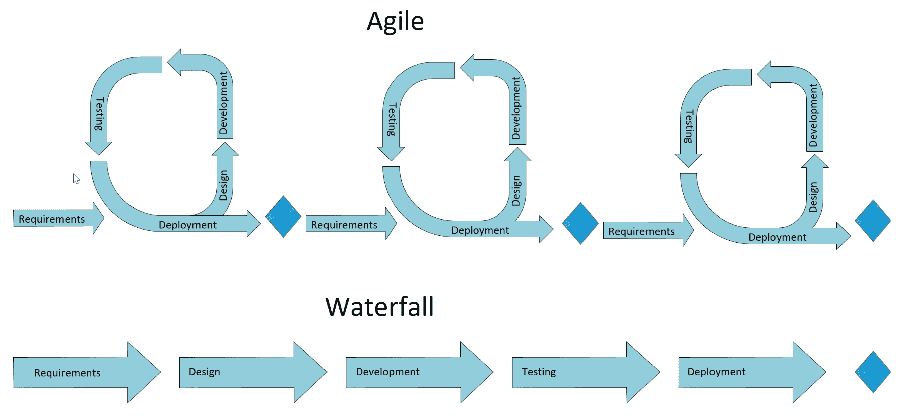
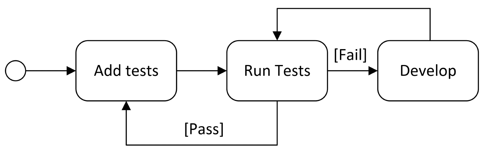
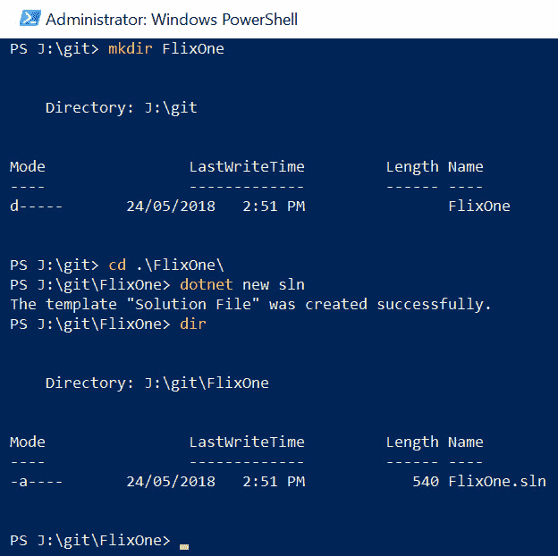
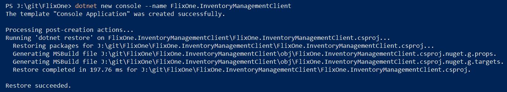
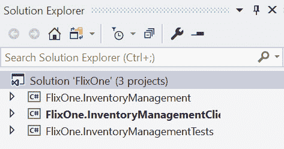
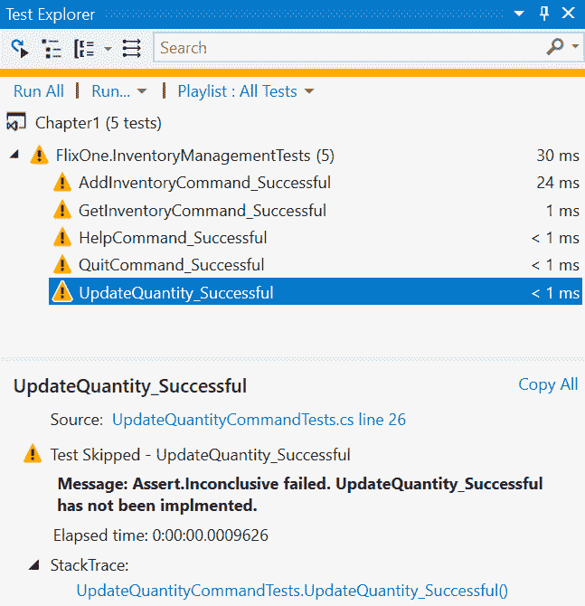
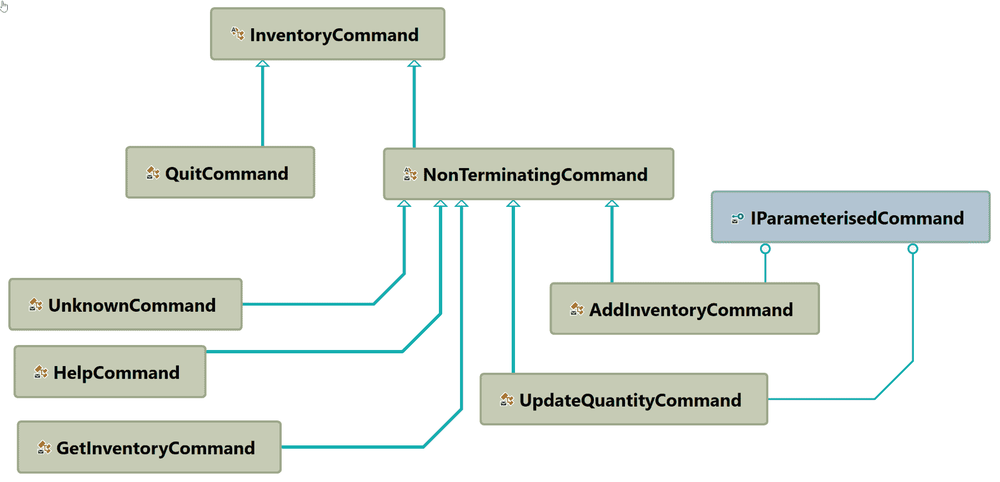

# 实现设计模式-基础知识第 1 部分

在前两章中，我们介绍并定义了一系列与**软件开发生命周期**（**SDLC**）相关的现代模式和实践，从低级开发模式到高级解决方案体系结构模式。本章在示例场景中应用其中一些模式，以便提供上下文和对定义的进一步理解。该场景是创建一个解决方案来管理电子商务书商的库存。

选择该场景是因为它提供了足够的复杂性来说明模式，而概念相对简单。公司需要一种管理库存的方法，包括允许用户订购产品。公司需要尽快安装一个应用程序，以允许他们跟踪其库存，但还有许多附加功能，包括允许客户订购产品和提供评论。随着场景的发展，所请求的特性数量会增长到开发团队不知道从哪里开始的地步。幸运的是，通过应用一些好的实践来帮助管理期望和需求，开发团队能够简化其初始交付并回到正轨。此外，通过使用模式，他们能够建立一个坚实的基础，以帮助扩展的解决方案，因为新的特征被添加。

本章将介绍新项目的启动和应用程序第一个版本的创建。本章对以下模式进行了说明：

*   **最小可行产品**（**MVP**）
*   **测试驱动开发**（**TDD**）
*   抽象工厂模式（四人帮）
*   坚实的原则

# 技术要求

本章包含各种代码示例来解释这些概念。代码保持简单，仅用于演示目的。大多数示例都涉及用 C# 编写的.NET 核心控制台应用程序。

要运行和执行代码，您需要以下内容：

*   Visual Studio 2019（您也可以使用 Visual Studio 2017 版本 3 或更高版本运行应用程序）
*   .NET 核心
*   SQL Server（本章使用 Express Edition）

# 安装 Visual Studio

要运行这些代码示例，您需要安装 VisualStudio，或者可以使用首选 IDE。要执行此操作，请遵循以下说明：

1.  从以下链接下载 Visual Studio:[https://docs.microsoft.com/en-us/visualstudio/install/install-visual-studio](https://docs.microsoft.com/en-us/visualstudio/install/install-visual-studio) 。
2.  按照随附的安装说明进行操作。Visual Studio 安装有多个版本。在本章中，我们将使用 Visual Studio for Windows。

# 设置.NET 内核

如果未安装.NET Core，则需要遵循以下说明：

1.  从以下链接下载.NET 核心：[https://www.microsoft.com/net/download/windows](https://www.microsoft.com/net/download/windows) 。
2.  遵循安装说明和相关库：[https://dotnet.microsoft.com/download/dotnet-core/2.2](https://dotnet.microsoft.com/download/dotnet-core/2.2) 。

The complete source code is available in GitHub. The source code shown in the chapter might not be complete, so it is advisable to retrieve the source in order to run the examples: [https://github.com/PacktPublishing/Hands-On-Design-Patterns-with-C-and-.NET-Core/tree/master/Chapter3](https://github.com/PacktPublishing/Hands-On-Design-Patterns-with-C-and-.NET-Core/tree/master/Chapter3).

# 最简化可实行产品

本节介绍启动新项目以构建软件应用程序的初始阶段。这有时被称为项目启动或项目启动，其中收集应用程序的初始特性和功能（换句话说，需求收集）。

Many approaches, which can be viewed as patterns, exist for the determining the features of a software application. Best practices around how to effectively model, conduct interviews and workshops, brainstorm and other techniques are outside the scope of this book. Instead, one approach, Minimum Viable Product, is described to provide an example of what these patterns might contain.

该项目针对的是一个假设情况，公司 FlixOne 希望使用库存管理应用程序来管理其不断增长的图书收藏。员工将使用此新应用程序管理库存，客户也将使用此应用程序浏览和创建新订单。该应用程序需要具有可扩展性，并且作为业务的基本系统，计划在可预见的未来使用。

公司大致分为*业务用户*和*开发团队*，其中业务用户主要关注系统的功能，开发团队关注满足需求，并关注系统的可维护性。这是一种简化；然而，组织不一定组织得那么整齐，个人可能无法正确地归入某一类别。例如，**业务分析师**（**BA**）或**主题专家**（**SME**）通常同时代表业务用户和开发团队成员。

由于这是一本技术书籍，我们将主要从开发团队的角度来查看场景，并讨论用于实现库存管理应用程序的模式和实践

# 要求

在几次会议中，业务团队和开发团队讨论了新库存管理系统的需求。在定义一组清晰的需求方面进展缓慢，最终产品的愿景也不清晰。开发团队决定将庞大的需求列表缩减到足够的功能，以便关键人员可以开始记录一些库存信息。这将允许进行简单的库存管理，并为业务扩展提供基础。然后，可以将每一组新的需求添加到初始版本中。

Minimum Viable Product (MVP)
A Minimum Viable Product is the smallest set of features of an application that can still be released and have enough value for a user base.

MVP 方法的一个优点是，它通过缩小应用程序的范围，为业务和开发团队提供了一个关于需要交付什么的简化视图。通过减少将要交付的功能，确定需要做什么的工作变得更加集中。在 FlixOne 场景中，会议的价值通常会降低到讨论某个功能的细节，尽管该功能对产品的最终版本很重要，但需要在发布之前发布几个功能。例如，围绕面向客户的网站的设计分散了团队对库存管理系统中存储的数据的关注。

MVP is very useful in situations where the complexity of requirements is not fully understood and/or the final vision is not well defined. It is important though to still maintain a product vision to avoid the risk of developing functionality that may not be required in the final version of the application.

业务和开发团队能够为初始库存管理应用程序定义以下功能需求：

*   应用程序应为控制台应用程序：
    *   它应该打印包含程序集版本的欢迎消息。
    *   它应该循环，直到发出 quit 命令。
    *   如果给定的命令不成功或不被理解，那么它应该打印一条有用的消息。
*   应用程序应该响应简单的不区分大小写的文本命令。
*   每个命令都应该有一个单字符的短格式和一个长格式。
*   如果命令具有其他参数：
    *   每一项都应按顺序输入，并随返回键一起提交。
    *   每一个都应该有一个提示`Enter {parameter}:`，其中`{parameter}`是参数的名称。
*   应提供帮助命令（`?`）：
    *   打印可用命令的摘要。
    *   打印每个命令的示例用法。
*   应提供退出命令（`q`、`quit`：
    *   打印一封告别信
    *   结束应用程序
*   应提供添加库存命令（`"a"`、`"addinventory"`：
    *   字符串类型的`name`参数。
    *   它应该向数据库中添加一个具有给定名称和 0 数量的条目。
*   更新数量命令（`"u"`、`"updatequantity"`应可用：
    *   字符串类型的`name`参数。
    *   正整数或负整数的`quantity`参数。
    *   它应该通过添加给定数量来更新具有给定名称的书籍的数量值。
*   获取库存命令（`"g"`、`"getinventory"`应该可用：
    *   返回数据库中的所有书籍及其数量。

定义了以下非功能性需求：

*   除了操作系统提供的安全性之外，不需要其他安全性。
*   命令的简短形式是为了可用性，而命令的长形式是为了可读性。

FlixOne 的例子说明了如何使用 MVP 来帮助集中和简化 SDLC。值得强调的是，**概念验证**（**PoC**）和 MVP 之间的差异将因组织而异。在本书中，PoC 与 MVP 的不同之处在于，生成的应用程序不会被视为一次性的或不完整的。对于商业产品，这意味着可以销售最终产品，对于内部企业解决方案，应用程序可以为组织增加价值

# MVP 如何适应未来的发展？

使用 MVP 关注和包含需求的另一个好处是它与敏捷软件开发的协同作用。将开发周期划分为更小的开发周期是一种软件开发技术，它比传统的瀑布式开发更受欢迎。驱动概念是需求和解决方案在应用程序的生命周期中不断发展，并涉及开发团队和最终用户之间的协作。通常，敏捷软件开发框架有一个很短的发布周期，在这个周期中设计、开发、测试和发布新的功能。当应用程序包含附加功能时，将重复发布周期。当工作范围符合发布周期时，MVP 很适合敏捷开发。

Scrum and Kanban are popular software development frameworks based on agile software development.

初始 MVP 需求的范围保持在一个可以通过敏捷周期进行设计、开发、测试和发布的规模。在下一个周期中，将向应用程序添加额外的需求。挑战在于将新功能的范围限制在一个周期内可以完成的范围内。每一个新的功能版本都仅限于基本需求或其 MVP。这里的原则是，通过使用迭代方法进行软件开发，最终版本的应用程序将比使用要求预先定义所有需求的单一版本对最终用户有更大的好处。

下图总结了敏捷和瀑布式软件开发方法之间的差异：



# 测试驱动开发

对于**测试驱动开发**（**TDD**）存在不同的方法，*测试*可以从开发期间按需运行的单元测试，到项目构建期间运行的单元测试，再到将作为**用户验收测试**一部分运行的测试脚本（**UAT**）。类似地，*测试*可以是描述用户为验证需求而执行的步骤的代码或文档。原因之一是对于 TDD 试图实现的目标存在不同的观点。对于一些团队来说，TDD 是一种在编写代码之前细化需求的技术，而其他团队则将 TDD 视为衡量或验证交付的代码的一种方式

UAT
UAT is a term used for the activity during the SDLC where the product or project is verified to fulfill specified requirements. This is typically performed by members of the business or a selection of customers. Depending on the circumstances, this phase can be broken further into alpha and beta stages where alpha testing is performed by the development team and beta by the end users.

# 团队为什么选择 TDD？

开发团队决定使用 TDD 有几个原因。首先，团队想要一种在开发过程中清晰测量进度的方法。其次，他们希望能够在后续开发周期中重用测试，以便在添加新功能时继续验证现有功能。出于这些原因，团队将使用单元测试来验证所编写的功能是否满足团队的给定需求。

下图说明了 TDD 的基本原理：



添加测试并更新代码库，直到所有定义的测试通过。重要的是要注意，这是重复的。在每次迭代中，添加新的测试，直到所有测试（新的和现有的）通过，测试才被认为通过。

FlixOne 开发团队决定将单元测试和 UAT 合并到单个敏捷周期中。在每个周期开始时，将确定新的验收标准。这将包括要交付的功能，以及在开发周期结束时如何对其进行验证或接受。这些验收标准将用于向项目中添加测试。然后，开发团队将构建解决方案，直到新的和现有的测试通过，然后准备一个构建以进行验收测试。然后，将运行验收测试，如果检测到任何问题，开发团队将根据失败定义新的测试或修改现有的测试。该应用程序将再次开发，直到所有测试通过，并准备新的构建。这将重复进行，直到通过验收测试。然后，部署应用程序并开始新的开发周期。

下图说明了这种方法：


团队现在有了一个计划，让我们开始编码吧！

# 设立项目

在此场景中，我们将使用**Microsoft 单元测试**（**MSTest**框架。本节提供了一些使用.NET 核心**命令行界面**（**CLI**工具创建初始项目的说明。这些步骤可以使用**集成开发环境**（**IDE**）完成，例如 Visual Studio 或 Visual Studio 代码。此处提供的说明说明了如何使用 CLI 来补充 IDE。

CLI
.NET Core CLI tools are cross-platform utilities for developing .NET applications and are the basis for more sophisticated tooling, such as IDEs. Please see the documentation for more information: [https://docs.microsoft.com/en-us/dotnet/core/tools](https://docs.microsoft.com/en-us/dotnet/core/tools).

本章的解决方案将包括三个项目：控制台应用程序、类库和测试项目。让我们创建解决方案目录 FlixOne，以包含三个项目的解决方案和子目录。在创建的目录中，以下命令将创建新的解决方案文件：

```cs
dotnet new sln
```

以下屏幕截图演示了如何创建目录和解决方案（注意：到目前为止，只创建了一个空的解决方案文件）：



类库`FlixOne.InventoryManagement`将包含我们的业务实体和逻辑。在后面的章节中，我们将把它们拆分为单独的库，但由于我们的应用程序仍然很小，它们包含在单个程序集中。创建项目的`dotnet`核心 CLI 命令如下所示：

```cs
dotnet new classlib --name FlixOne.InventoryManagement
```

注意，在以下屏幕截图中，创建了一个包含新类库项目文件的新目录：


应使用以下命令从解决方案中引用新类库：

```cs
dotnet sln add .\FlixOne.InventoryManagement\FlixOne.InventoryManagement.csproj
```

要创建新的控制台应用程序项目，应使用以下命令：

```cs
dotnet new console --name FlixOne.InventoryManagementClient
```

下面的屏幕截图显示了正在恢复的`console`模板：



console 应用程序需要对类库的引用（注意：该命令需要在将添加引用的项目文件所在的目录中运行）：

```cs
dotnet add reference ..\FlixOne.InventoryManagement\FlixOne.InventoryManagement.csproj
```

将使用以下命令创建一个新的`MSTest`项目：

```cs
dotnet new mstest --name FlixOne.InventoryManagementTests
```

以下屏幕截图显示了 MSTest 项目的创建，应在与解决方案 FlixOne 相同的文件夹中运行（请注意，作为包含所需 MSTest NuGet 软件包的命令的一部分还原的软件包）：


测试项目还需要对类库的引用（注意：此命令需要在与 MSTest 项目文件相同的文件夹中运行）：

```cs
dotnet add reference ..\FlixOne.InventoryManagement\FlixOne.InventoryManagement.csproj
```

最后，应通过在与解决方案文件相同的目录中运行以下命令，将 console 应用程序和 MSTest 项目添加到解决方案中：

```cs
dotnet sln add .\FlixOne.InventoryManagementClient\FlixOne.InventoryManagementClient.csproj
dotnet sln add .\FlixOne.InventoryManagementTests\FlixOne.InventoryManagementTests.csproj
```

从视觉上看，解决方案如下所示：



既然解决方案的初始结构已经准备好了，那么让我们首先添加单元测试定义。

# 初始单元测试定义

开发团队首先将需求转录到一些基本单元测试中。由于还没有设计或编写任何内容，这些内容主要采取记录应该验证哪些功能的形式。随着设计和开发的进展，这些测试也将朝着完成的方向发展；例如，需要添加库存：

An add inventory command ("a", "addinventory") is available:

*   字符串类型的`name`参数。
*   在数据库中添加一个具有给定名称和`0`数量的条目。

为了捕获此需求，开发团队创建了以下单元测试作为占位符：

```cs
[TestMethod]
private void AddInventoryCommand_Successful()
{
  // create an instance of the command
  // add a new book with parameter "name"
  // verify the book was added with the given name with 0 quantity

  Assert.Inconclusive("AddInventoryCommand_Successful has not been implemented.");
}
```

随着应用程序设计的了解和开发的开始，现有测试将扩展并创建新的测试，如下所示：



非决定性测试的重要性在于，它们向团队传达需要完成的内容，并在开发过程中提供度量。随着开发的进展，非决定性和失败的测试将表明要进行的工作，成功的测试将表明完成当前任务集的进展。

# 抽象工厂设计模式

为了说明我们的第一种模式，让我们浏览一下 help 命令和初始控制台应用程序的开发。控制台应用程序的初始版本如下所示：

```cs
private static void Main(string[] args)
{
    Greeting();

    // note: inline out variable introduced as part of C# 7.0
    GetCommand("?").RunCommand(out bool shouldQuit); 

    while (!shouldQuit)
    { 
        // handle the commands
        ...
    }

    Console.WriteLine("CatalogService has completed."); 
}
```

当应用程序启动时，会显示问候语和帮助命令的结果。然后，应用程序将处理输入的命令，直到输入 quit 命令。

下面显示了处理命令的详细信息：

```cs
    while (!shouldQuit)
    { 
        Console.WriteLine(" > ");
        var input = Console.ReadLine();
        var command = GetCommand(input);

        var wasSuccessful = command.RunCommand(out shouldQuit);

        if (!wasSuccessful)
        {
            Console.WriteLine("Enter ? to view options.");
        }
    }
```

在应用程序解决方案退出之前，应用程序将继续提示用户输入命令，如果命令未成功处理，则会显示帮助文本。

RunCommand(out bool shouldQuit)
C# 7.0 introduces a more fluid syntax for creating `out` parameters. This will declare the variables in the scope of the command block. This is illustrated with the following, where the `shouldQuit` Boolean is not declared ahead of time.

# InventoryCommand 抽象类

关于最初的控制台应用程序，首先要指出的是团队正在使用**面向对象编程**（**OOP**）来创建处理命令的标准方式。团队从这个初始设计中学到的是，所有命令都将包含一个`RunCommand()`方法，该方法将返回两个布尔值，指示命令是否成功以及程序是否应该终止。例如，`HelpCommand()`将简单地向控制台显示一条帮助消息，不应导致程序结束。然后，两个返回布尔值将为*true*，表示命令运行成功，*false，*表示应用程序不应终止。以下显示初始版本：

The ... indicates additional statements and, in this particular example, additional `Console.WriteLine()` statements.

```cs
public class HelpCommand
{
    public bool RunCommand(out bool shouldQuit)
    {
        Console.WriteLine("USAGE:");
        Console.WriteLine("\taddinventory (a)");
        ...
        Console.WriteLine("Examples:");
        ...

        shouldQuit = false;
        return true;
    }
}
```

`QuitCommand`将显示一条消息，然后导致程序结束。最初的`QuitCommand`如下：

```cs
public class QuitCommand
{
    public bool RunCommand(out bool shouldQuit)
    {
        Console.WriteLine("Thank you for using FlixOne Inventory Management System");

        shouldQuit = true;
        return true;
    }
}
```

团队决定要么创建两个类都实现的接口，要么创建两个类都从中继承的抽象类。两者都可以实现所需的动态多态性，但团队选择使用抽象类，因为所有命令都具有共享功能。

In OOP and in particular C#, polymorphism is supported in three main ways: function overloading, generics, and subtyping or dynamic polymorphism. 

使用抽象工厂设计模式，团队创建了一个抽象类，命令将从`InventoryCommand`继承。`InventoryCommand`类有一个方法`RunCommand`，它将执行命令并返回命令是否成功执行以及应用程序是否应该退出。该类是抽象的，这意味着该类包含一个或多个抽象方法。在这种情况下，`InternalCommand()`方法是抽象的，目的是从`InventoryCommand`类派生的类将实现具有特定命令功能的`InternalCommand`方法。例如，`QuitCommand`将扩展`InventoryCommand`并为`InternalCommand()`方法提供具体实现。下面的代码片段显示了使用抽象`InternalCommand()`方法的`InventoryCommand`抽象类：

```cs
public abstract class InventoryCommand
{
    private readonly bool _isTerminatingCommand;
    internal InventoryCommand(bool commandIsTerminating)
    {
        _isTerminatingCommand = commandIsTerminating; 
    }
    public bool RunCommand(out bool shouldQuit)
    {
        shouldQuit = _isTerminatingCommand;
        return InternalCommand();
    }

    internal abstract bool InternalCommand();
}
```

然后在每个派生类中实现抽象方法，如图`HelpCommand`所示。`HelpCommand`只是将一些信息打印到控制台，然后返回`true`，表示命令执行成功：

```cs
public class HelpCommand : InventoryCommand
{
    public HelpCommand() : base(false) { }

    internal override bool InternalCommand()
    { 
        Console.WriteLine("USAGE:");
        Console.WriteLine("\taddinventory (a)");
        ...
        Console.WriteLine("Examples:");
        ... 
        return true;
    }
}
```

然后，开发团队决定对`InventoryCommand`进行另外两项更改。他们不喜欢的第一件事是`shouldQuit`布尔值如何作为*out*变量返回。因此，他们决定使用 C# 7 的新元组特性来代替返回单个`Tuple<bool,bool>`对象，如下所示：

```cs
public (bool wasSuccessful, bool shouldQuit) RunCommand()
{
    /* additional code hidden */

    return (InternalCommand(), _isTerminatingCommand);
}
```

Tuple
The tuple is a C# type that provides a lightweight syntax for packaging multiple values into a single object easily. The disadvantage over defining a class is you lose inheritance and other object-oriented functionality. For more information, please see [https://docs.microsoft.com/en-us/dotnet/csharp/tuples](https://docs.microsoft.com/en-us/dotnet/csharp/tuples).

另一个变化是引入另一个抽象类来指示该命令是否为非终止命令；换句话说，一个不会导致解决方案退出或结束的命令。

如下面的代码所示，这个命令仍然是抽象的，因为它没有实现`InventoryCommand`的`InternalCommand`方法，但是它将一个假值传递给基类：

```cs
internal abstract class NonTerminatingCommand : InventoryCommand
{
    protected NonTerminatingCommand() : base(commandIsTerminating: false)
    {
    }
}
```

这里的优点是，现在不会导致应用程序结束的命令（换句话说，是非终止命令）有了更简单的定义：

```cs
internal class HelpCommand : NonTerminatingCommand
{
    internal override bool InternalCommand()
    {
        Interface.WriteMessage("USAGE:");
        /* additional code hidden */

        return true;
    }
}
```

下面的类图显示了`InventoryCommand`抽象类的继承：



只有一个终止命令`QuitCommand`，而其他命令扩展了`NonTerminatingCommand`抽象类。还值得注意的是，只有`AddInventoryCommand`和`UpdateQuantityCommand`需要参数，`IParameterisedCommand`的使用将在*利斯科夫替代原理*一节中解释。图中的另一个微妙之处是，除基`InventoryCommand`之外的所有类型都不是公共的（对外部程序集可见）。这将在本章后面的*访问修饰符*一节中介绍

# 坚实的原则

当团队通过使用模式简化代码时，他们还使用可靠的原则来帮助识别问题。通过简化代码，团队的目标是使代码更易于维护，让新的团队成员更容易理解。这种用一组原则来检查代码的方法在编写只做它们需要实现的事情的简明类时非常有用，并且在抽象层中加入一个抽象层，帮助编写更易于修改和理解的代码。

# 单一责任原则（SRP）

团队采用的第一个原则是**单一责任原则**（**SRP**）。团队发现，写入控制台的实际机制不是`InventoryCommand`类的责任。因此，引入了一个负责与用户交互的`ConsoleUserInterface`类。SRP 将有助于保持`InventoryCommand`类更小，并避免重复相同代码的情况。例如，应用程序应该有一种统一的方式来提示用户输入信息，并显示消息和警告。这个逻辑不是在`InventoryCommand`类中重复，而是封装在`ConsoleUserInterface`类中

`ConsoleUserInteraface`将包括三种方法，如下所示：

```cs
public class ConsoleUserInterface
{
    // read value from console

    // message to the console

    // writer warning message to the console
}
```

第一种方法将用于从控制台读取输入：

```cs
public string ReadValue(string message)
{
    Console.ForegroundColor = ConsoleColor.Green;
    Console.Write(message);
    return Console.ReadLine();
}
```

第二种方法将使用绿色将消息打印到控制台：

```cs
public void WriteMessage(string message)
{
    Console.ForegroundColor = ConsoleColor.Green;
    Console.WriteLine(message);
}
```

最后一种方法将使用暗黄色将消息打印到控制台，指示警告消息：

```cs
public void WriteWarning(string message)
{
    Console.ForegroundColor = ConsoleColor.DarkYellow;
    Console.WriteLine(message);
}
```

通过`ConsoleUserInterface`类，我们可以减少更改对我们与用户交互方式的影响。随着解决方案的开发，我们可能会发现界面从控制台变为 web 应用程序。理论上，我们将用一个`WebUserInterface`替换`ConsoleUserInterface`。如果我们没有将用户界面简化为一个类，那么这种更改的影响很可能会更具破坏性。

# 开/闭原理（OCP）

**开/关原理**是实心的 O，由不同的`InventoryCommand`类表示。团队可以定义一个包含多个`if`语句的类，而不是每个命令都有`InventoryCommand`类的实现。每个`if`语句都将确定要执行的功能。例如，以下说明了团队如何打破这一原则：

```cs
internal bool InternalCommand(string command)
{
    switch (command)
    {
        case "?":
        case "help":
            return RunHelpCommand(); 
        case "a":
        case "addinventory":
            return RunAddInventoryCommand(); 
        case "q":
        case "quit":
            return RunQuitCommand();
        case "u":
        case "updatequantity":
            return RunUpdateInventoryCommand();
        case "g":
        case "getinventory":
            return RunGetInventoryCommand();
    }
    return false;
}
```

上述方法打破了这一原则，因为添加新命令将改变代码的行为。该原则的思想是**关闭**修改*改变*行为，而**打开**扩展类以支持其他行为。这是通过拥有抽象类`InventoryCommand`和派生类（例如，`QuitCommand`、`HelpCommand`和`AddInventoryCommand`来实现的。这样做的一个令人信服的原因，尤其是当和其他原则相结合时，是因为它导致了更易于维护和理解的简洁代码

# 利斯科夫替换原理（LSP）

quit、help 和 get inventory 命令不需要参数，`AddInventory`和`UpdateQuantityCommand`需要参数。有几种方法可以处理这个问题，团队决定引入一个界面来识别这些命令，如下所示：

```cs
public interface IParameterisedCommand
{
    bool GetParameters();
}
```

通过应用**Liskov 替换原理**（**LSP**），只有那些需要参数的命令才能实现`GetParameters()`方法。例如，在`AddInventory`命令上，使用在`InventoryCommand`基础上定义的方法实现`IParameterisedCommand`：

```cs
public class AddInventoryCommand : InventoryCommand, IParameterisedCommand
{
    public string InventoryName { get; private set; }

    /// <summary>
    /// AddInventoryCommand requires name
    /// </summary>
    /// <returns></returns>
    public bool GetParameters()
    {
        if (string.IsNullOrWhiteSpace(InventoryName))
            InventoryName = GetParameter("name");

        return !string.IsNullOrWhiteSpace(InventoryName);
    }    
}
```

`InventoryCommand`类上的`GetParameter`方法只是使用`ConsoleUserInterface`从控制台读取一个值。该方法将在本章后面介绍。在 C# 中，有一种方便的语法可以很好地说明如何使用 LSP 将功能仅应用于特定接口的对象。在`RunCommand`方法的第一行，`is`关键字用于测试当前对象是否实现`IParameterisedCommand`接口，以及将该对象强制转换为新对象：`parameterisedCommand`。以下代码段中以粗体显示：

```cs
public (bool wasSuccessful, bool shouldQuit) RunCommand()
{
    if (this is IParameterisedCommand parameterisedCommand)
    {
        var allParametersCompleted = false;

        while (allParametersCompleted == false)
        {
            allParametersCompleted = parameterisedCommand.GetParameters();
        }
    }

    return (InternalCommand(), _isTerminatingCommand);
}
```

# 接口隔离原则（ISP）

处理带参数和不带参数的命令的一种方法是在`InventoryCommand`抽象类上定义另一个方法`GetParameters`，对于那些不需要参数的方法，只需返回 true，以指示已接收到所有（在本例中为否）参数。例如，`QuitCommand`、`**HelpCommand**`和`GetInventoryCommand`都将具有类似于以下内容的实现：

```cs
internal override bool GetParameters()
{
    return true;
}
```

这会起作用，但它确实打破了**接口隔离原则**（**ISP**），该原则规定接口只应包含所需的方法和属性。与适用于类的 SRP 类似，ISP 适用于接口，并能有效地保持接口的小型化和集中化。在我们的示例中，只有`AddInventoryCommand`和`UpdateQuantityCommand`类将实现`InventoryCommand`接口。

# 依赖倒置原则

**依赖项反转原则**（**DIP**），也称为**依赖项注入****原则**（**DIP**），模块不应该依赖于细节，而应该依赖于抽象。这一原则鼓励编写松散耦合的代码，以增强可读性和维护性，特别是在大型复杂代码库中。

如果我们回顾前面介绍的`ConsoleUserInterface`类（在*单一责任原则*部分中），我们可以使用没有`QuitCommand`的类，如下所示：

```cs
internal class QuitCommand : InventoryCommand
{
    internal override bool InternalCommand()
    {
        var console = new ConsoleUserInterface();
        console.WriteMessage("Thank you for using FlixOne Inventory Management System");

        return true;
    }
}
```

这打破了几个坚实的原则，但就倾角而言，`QuitCommand`和`ConsoleUserInterface`之间存在紧密耦合。想象一下，控制台不再是向用户显示信息的手段，或者如果`ConsoleUserInterface`的构造函数需要额外的参数，该怎么办？

通过应用 DIP 原理，执行了以下重构。首先引入了一个新接口`IUserInterface`，其中包含`ConsoleUserInterface`中实现的方法的定义。接下来，`InventoryCommand`类中使用的是接口，而不是具体类。最后，对实现`IUserInterface`的对象的引用被传递到`InventoryCommand`类的构造函数中。这种方法可以保护`InventoryCommand`类不受`IUserInterface`类的实现细节变化的影响，并提供了一种机制，随着代码库的发展，可以更容易地替换`IUserInterface`的不同实现

倾角用`QuitCommand`表示如下，是本章课程的最终版本：

```cs
internal class QuitCommand : InventoryCommand
{
    public QuitCommand(IUserInterface userInterface) : 
           base(commandIsTerminating: true, userInteface: userInterface)
    {
    }

    internal override bool InternalCommand()
    {
        Interface.WriteMessage("Thank you for using FlixOne Inventory Management System");

        return true;
    }
}
```

请注意，该类扩展了`InventoryCommand`抽象类，提供了处理命令的通用方法以及共享功能。构造函数要求在实例化对象时注入`IUserInterface`依赖关系，同时注意`QuitCommand`实现了一个方法`InternalCommand()`，保持`QuitCommand`简洁易懂。

为了完成这幅图，让我们来看最后一个`InventoryCommand`基类。下面显示了构造函数和属性：

```cs
public abstract class InventoryCommand
{
    private readonly bool _isTerminatingCommand;
    protected IUserInterface Interface { get; }

    internal InventoryCommand(bool commandIsTerminating, IUserInterface userInteface)
    {
        _isTerminatingCommand = commandIsTerminating;
        Interface = userInteface;
    }
    ...
}
```

注意，`IUserInterface`被传递到构造函数中，以及一个指示命令是否终止的布尔值。然后，将`IUserInterface`作为`Interface`属性提供给`InventoryCommand`的所有实现

`RunCommand`是类上唯一的公共方法：

```cs
public (bool wasSuccessful, bool shouldQuit) RunCommand()
{
    if (this is IParameterisedCommand parameterisedCommand)
    {
        var allParametersCompleted = false;

        while (allParametersCompleted == false)
        {
            allParametersCompleted = parameterisedCommand.GetParameters();
        }
    }

    return (InternalCommand(), _isTerminatingCommand);
}

internal abstract bool InternalCommand();
```

此外，`GetParameter`方法是`InventoryCommand`所有实现都通用的方法，因此它是内部的：

```cs
internal string GetParameter(string parameterName)
{
    return Interface.ReadValue($"Enter {parameterName}:"); 
}
```

DIP and IoC
The DIP and **Inversion of Control** (**IoC**) are closely related and all address the same issues but in slightly different ways. IoC and its specialized form, the **Service Locator Pattern** (**SLP**), use a mechanism to supply an implementation of an abstraction on demand. So, instead of injecting the implementation, IoC acts as a proxy to supply the details that are required. In the next chapter, .NET Core support for these patterns will be explored.

# InventoryCommand 单元测试

随着`InventoryCommand`类的形成，让我们重新审视单元测试，这样我们就可以开始验证到目前为止编写的内容，并确定任何缺失的需求。坚实的原则将在这里显示其价值。因为我们保持了类（SRP）和接口（ISP）的小型化，并且只关注所需的最小功能量（LSP），所以我们的测试也应该更易于编写和验证。例如，关于其中一个命令的测试不需要验证控制台上消息的显示（例如，颜色或文本大小），因为这不是`InventoryCommand`类的责任，而是`IUserInterface`的实现的责任。此外，通过依赖项注入，我们将能够将测试隔离到 inventory 命令。下图说明了这一点，因为单元测试将只验证绿色框中包含的内容：


By keeping the unit test's scope limited, it will be easier to handle change as the application changes. In some situations where it is more difficult to separate the functionality due to interdependencies within classes (in other words, when SOLID is not followed), a test can span a larger section of the application including repositories. These tests are usually referred to as integration tests instead of unit tests.

# 访问修饰符

访问修饰符是通过封装代码来处理类型和类型成员可见性的一种重要方式。通过使用清晰的访问策略，可以传达和实施程序集及其类型应如何使用的意图。例如，在 FlixOne 应用程序中，只有应该由控制台直接访问的类型被标记为 public。这意味着控制台应用程序应该能够看到数量有限的类型和方法。这些类型和方法已标记为 public，而控制台不应访问的类型和方法已标记为 internal、private 或 protected。

Please see the Microsoft docs programming guide for more information on access modifiers: 
[https://docs.microsoft.com/en-us/dotnet/csharp/programming-guide/classes-and-structs/access-modifiers](https://docs.microsoft.com/en-us/dotnet/csharp/programming-guide/classes-and-structs/access-modifiers)

`InventoryCommand`抽象类公开，因为控制台应用程序将使用`RunCommand`方法处理该命令。

在下面的代码段中，请注意如何保护构造函数和接口以允许访问子类：

```cs
public abstract class InventoryCommand
{
    private readonly bool _isTerminatingCommand;
    protected IUserInterface Interface { get; }

    protected InventoryCommand(bool commandIsTerminating, IUserInterface userInteface)
    {
        _isTerminatingCommand = commandIsTerminating;
        Interface = userInteface;
    }
    ...
}
```

在下面的代码片段中，请注意，`RunCommand`方法是公开的，`InternalCommand`是内部的：

```cs
public (bool wasSuccessful, bool shouldQuit) RunCommand()
{
    if (this is IParameterisedCommand parameterisedCommand)
    {
        var allParametersCompleted = false;

        while (allParametersCompleted == false)
        {
            allParametersCompleted = parameterisedCommand.GetParameters();
        }
    }

    return (InternalCommand(), _isTerminatingCommand);
}

internal abstract bool InternalCommand();
```

类似地，`InventoryCommand`的实现被标记为内部，以防止它们被直接引用到程序集之外。用`QuitCommand`说明如下：

```cs
internal class QuitCommand : InventoryCommand
{
    internal QuitCommand(IUserInterface userInterface) : base(true, userInterface) { }

    protected override bool InternalCommand()
    {
        Interface.WriteMessage("Thank you for using FlixOne Inventory Management System");

        return true;
    }
}
```

由于不同实现的访问将不会直接对单元测试项目可见，因此需要额外的步骤来使内部类型可见。`assembly`指令可以放在任何编译文件中，对于 FlixOne 应用程序，添加了一个包含 assembly 属性的`assembly.cs`：

```cs
using System.Runtime.CompilerServices;
[assembly: InternalsVisibleTo("FlixOne.InventoryManagementTests")]
```

In situations where the assembly is signed, the `InternalsVisibleTo()` requires a public key. Please see the Microsoft Docs C# Guide for more information: [https://docs.microsoft.com/en-us/dotnet/csharp/programming-guide/concepts/assemblies-gac/how-to-create-signed-friend-assemblies](https://docs.microsoft.com/en-us/dotnet/csharp/programming-guide/concepts/assemblies-gac/how-to-create-signed-friend-assemblies).

# 助手 TestUserInterface

作为`InventoryCommand`实现之一的单元测试的一部分，我们不想测试引用的依赖项。幸运的是，由于命令遵循 DIP，我们可以创建一个`helper`*类来验证与依赖项的实现交互。其中一个依赖项是`IUserInterface`，它被传递到构造函数中的实现中。以下是对接口方法的提醒：*

```cs
public interface IUserInterface : IReadUserInterface, IWriteUserInterface { }

public interface IReadUserInterface
{
    string ReadValue(string message);
}

public interface IWriteUserInterface
{
    void WriteMessage(string message);
    void WriteWarning(string message);
}
```

通过实现一个`helper`类，我们可以提供`ReadValue`方法所需的信息，并验证在`WriteMessage`和`WriteWarning`方法中是否收到了适当的消息。在测试项目中，创建了一个名为`TestUserInterface`的新类，该类实现了`IUserInterface`接口。该类包含三个列表，其中包含预期的`WriteMessage`、`WriteWarning`和`ReadValue`调用，并跟踪已调用的次数。

例如，`WriteWarning`方法如下所示：

```cs
public void WriteWarning(string message)
{
    Assert.IsTrue(_expectedWriteWarningRequestsIndex < _expectedWriteWarningRequests.Count,
                  "Received too many command write warning requests.");

    Assert.AreEqual(_expectedWriteWarningRequests[_expectedWriteWarningRequestsIndex++], message,                             "Received unexpected command write warning message");
}
```

`WriteWarning`方法执行两个断言。第一个验证方法的调用次数是否没有超出预期，第二个验证收到的消息是否与预期消息匹配。

`ReadValue`方法与此类似，但它还向调用`InventoryCommand`实现返回一个值。这将模拟用户在控制台中输入信息：

```cs
public string ReadValue(string message)
{
    Assert.IsTrue(_expectedReadRequestsIndex < _expectedReadRequests.Count,
                  "Received too many command read requests.");

    Assert.AreEqual(_expectedReadRequests[_expectedReadRequestsIndex].Item1, message, 
                    "Received unexpected command read message");

    return _expectedReadRequests[_expectedReadRequestsIndex++].Item2;
}
```

作为额外的验证步骤，在测试方法结束时，调用`TestUserInterface`以验证是否收到了预期数量的`ReadValue`、`WriteMessage`和`WriteWarning`请求：

```cs
public void Validate()
{
    Assert.IsTrue(_expectedReadRequestsIndex == _expectedReadRequests.Count, 
                  "Not all read requests were performed.");
    Assert.IsTrue(_expectedWriteMessageRequestsIndex == _expectedWriteMessageRequests.Count, 
                  "Not all write requests were performed.");
    Assert.IsTrue(_expectedWriteWarningRequestsIndex == _expectedWriteWarningRequests.Count, 
                  "Not all warning requests were performed.");
}
```

`TestUserInterface`类说明了如何模拟依赖项以提供存根功能，以及提供断言以帮助验证预期行为。在后面的章节中，我们将使用第三方软件包提供一个更复杂的框架来模拟依赖项。

# 单元测试示例–quitt 命令

从`QuitCommand`开始，要求非常简单：命令应该打印一条告别消息，然后导致应用程序结束。我们设计了`InventoryCommand`返回两个布尔值，以指示应用程序是否应该退出以及命令是否成功结束：

```cs
[TestMethod]
public void QuitCommand_Successful()
{
    var expectedInterface = new Helpers.TestUserInterface(
        new List<Tuple<string, string>>(), // ReadValue()
        new List<string> // WriteMessage()
        {
            "Thank you for using FlixOne Inventory Management System"
        },
        new List<string>() // WriteWarning()
    );

    // create an instance of the command
    var command = new QuitCommand(expectedInterface);

    var result = command.RunCommand();

    expectedInterface.Validate();

    Assert.IsTrue(result.shouldQuit, "Quit is a terminating command.");
    Assert.IsTrue(result.wasSuccessful, "Quit did not complete Successfully.");
}
```

测试使用`TestUserInterface`验证文本`"Thank you for using FlixOne Inventory Management System"`*是否发送到`WriteMessage`方法，并且没有收到`ReadValue`或`WriteWarning`请求。最后两个标准通过`expectedInterface.Validate()`调用进行验证。通过检查`shouldQuit`和`wasSuccessful`布尔值是否为真来验证`QuitCommand`的结果。*

*In the FlixOne scenario, the text to be shown is *hardcoded* in the solution for simplicity. A better approach would be to use resource files. Resource files provide a way of maintaining the text separate from the functionality as well as supporting localizing the data for different cultures.

# 总结

本章介绍了一个在线书商 FlixOne 想要构建一个用于管理其库存的应用程序的场景。本章涵盖了开发团队在开发应用程序时可以使用的一系列模式和实践。该团队使用 MVP 帮助将初始交付的范围保持在可管理的水平，并帮助将业务重点放在确定对组织有最大好处的需求上。团队决定使用 TDD 来验证交付是否符合要求，并帮助团队衡量进度。创建了基本项目以及单元测试框架 MSTest。随着应用程序的新增强，团队还使用了可靠的原则来帮助以一种既有助于可读性又有助于维护代码库的方式构建代码。第一组四人模式，抽象工厂设计模式，用于为所有库存命令提供基础。

在下一章中，团队将继续构建初始库存管理项目，以满足 MVP 中定义的需求。团队将使用四人帮的单例模式和工厂方法模式。这些特性将在.NET Core 中支持的机制存在和不存在的情况下显示。

# 问题

以下问题将使您能够整合本章中包含的信息：

1.  在为组织开发软件时，为什么有时很难确定需求？
2.  瀑布式软件开发与敏捷软件开发相比有哪些优点和缺点？
3.  在编写单元测试时，依赖注入有何帮助？
4.  为什么下面的陈述是错误的？使用 TDD，您不再需要人员来测试新的软件部署。**