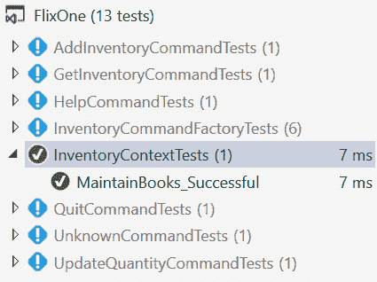
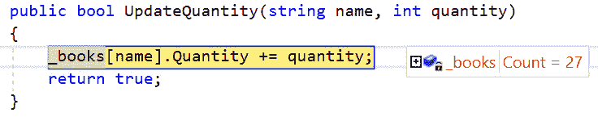
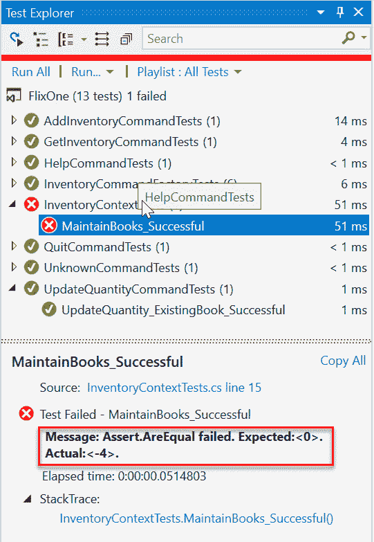
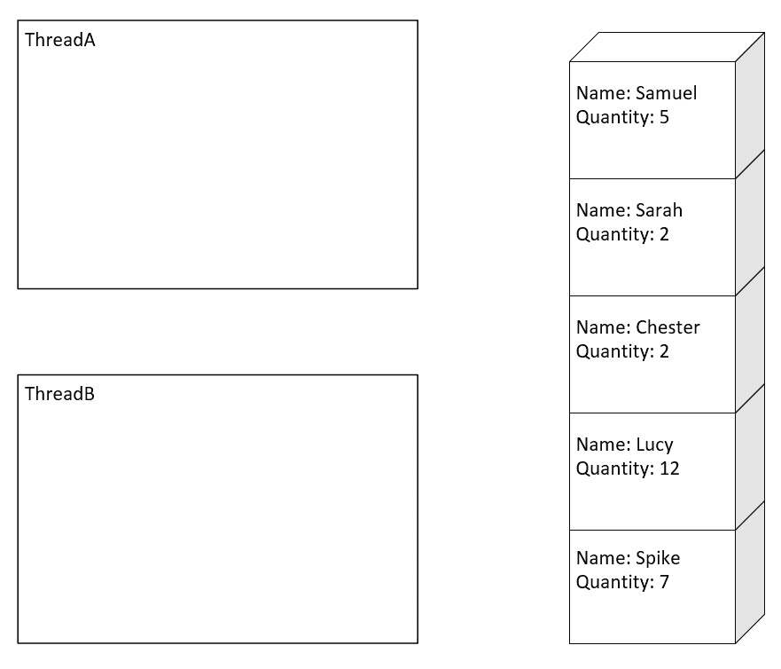
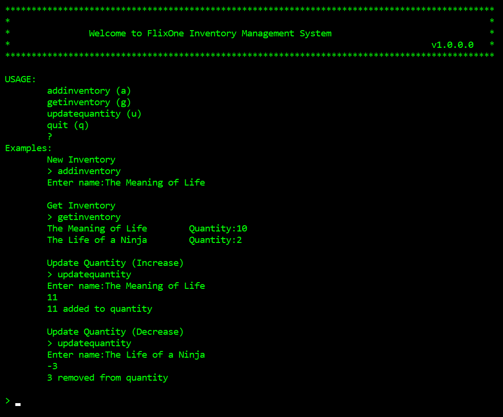
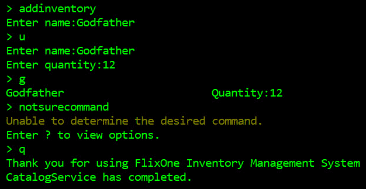

# 实现设计模式-基础知识第 2 部分

在上一章中，我们介绍了 FlixOne 和一个新的库存管理应用程序的初步开发。开发团队使用了几种模式，从旨在限制可交付成果范围的模式，如**最低可行产品**（**MVP**）到协助项目开发的模式，如**测试驱动开发**（**TDD**）。**四人帮**（**GoF**中的几种模式也被用作解决方案，以利用其他人在过去解决类似问题的方式，从而避免我们重复常见错误。单一责任原则、开放-封闭原则、Liskov 替代原则、界面分离原则，依赖项反转原则（SOLID principles）被应用于确保我们正在创建一个稳定的代码库，这将有助于我们应用程序的管理和未来开发

本章将继续通过合并更多模式来解释 FlixOne 库存管理应用程序的构建。将使用更多的 GoF 模式，包括 singleton 和 factory 模式。将使用单例模式来说明用于维护 FlixOne 图书集合的存储库模式。工厂模式将进一步理解**依赖注入**（**DI**）。最后，我们将使用.NET 核心框架来促进**控制反转**（**IoC**容器，该容器将用于完成初始库存管理控制台应用程序。

本章将介绍以下主题：

*   单一模式
*   工厂模式
*   NET 内核的特性
*   控制台应用程序

# 技术要求

本章包含解释这些概念的各种代码示例。代码保持简单，仅用于演示目的。大多数示例都涉及用 C# 编写的.NET 核心控制台应用程序。

要运行和执行代码，您需要以下内容：

*   Visual Studio 2019（您也可以使用 Visual Studio 2017 版本 3 或更高版本运行应用程序）
*   .NET 核心
*   SQL Server（本章使用快速版）

# 安装 Visual Studio

要运行这些代码示例，您需要安装 Visual Studio 或更高版本。您可以使用首选的 IDE。要执行此操作，请遵循以下说明：

1.  从以下链接下载 Visual Studio:[https://docs.microsoft.com/en-us/visualstudio/install/install-visual-studio](https://docs.microsoft.com/en-us/visualstudio/install/install-visual-studio) 。
2.  按照随附的安装说明进行安装。Visual Studio 的安装有多个版本；在本章中，我们将使用 Visual Studio for Windows。

# 设置.NET 内核

如果未安装.NET Core，则需要遵循以下说明：

1.  从以下链接下载.NET 核心：[https://www.microsoft.com/net/download/windows](https://www.microsoft.com/net/download/windows) 。
2.  遵循相关库的安装说明：[https://dotnet.microsoft.com/download/dotnet-core/2.2](https://dotnet.microsoft.com/download/dotnet-core/2.2) 。

The complete source code is available in GitHub. The source code that is shown in this chapter might not be complete, so it is recommended that you retrieve the source code in order to run the examples ([https://github.com/PacktPublishing/Hands-On-Design-Patterns-with-C-and-.NET-Core/tree/master/Chapter4](https://github.com/PacktPublishing/Hands-On-Design-Patterns-with-C-and-.NET-Core/tree/master/Chapter4)). 

# 单一模式

singleton 模式是另一个 GoF 设计模式，用于将类的实例化限制为一个对象。它用于需要协调系统内的操作或需要限制数据访问的情况。例如，如果在应用程序中需要将对文件的访问限制为单个写入程序，则可以使用单例来防止多个对象同时尝试写入文件。在我们的场景中，我们将使用单例来维护书籍集合及其库存。

单例模式的价值在使用示例进行说明时更为明显。本节将从一个基本类开始，然后确定 singleton 模式解决的不同问题。这些问题将被识别，类将被更新，然后通过单元测试进行验证。

singleton 模式只应在必要时使用，因为它可能会给应用程序带来潜在的瓶颈。有时，模式被视为反模式，因为它引入了全局状态。对于全局状态，应用程序中会引入未知的依赖项，然后不清楚有多少类型可能依赖于该信息。此外，许多框架和存储库已经在需要时限制了访问，因此引入额外的机制可能会不必要地限制性能。

.NET Core provides support for a number of the patterns discussed. In the next chapter, we will take advantage of the `ServiceCollection`class's support for both the factory method and the singleton pattern.

在我们的场景中，singleton 模式将用于保存一个内存存储库，其中包含一组书籍。单线程将防止一次更新多个线程的图书集合。这将要求我们*锁定*代码的一部分，以防止不可预知的更新。

在应用程序中引入单例的复杂性是微妙的；因此，为了深入了解该模式，我们将介绍以下主题：

*   .Net Framework 对进程和线程的处理
*   存储库模式
*   比赛条件
*   识别竞争条件的单元测试

# 进程和线程

为了理解单例模式，我们需要提供一些上下文。在.Net Framework 中，应用程序将由称为应用程序域的轻量级托管子进程组成，这些子进程可以包含一个或多个托管线程。为了理解 singleton 模式，让我们将其定义为包含一个或多个同时运行的线程的多线程应用程序。从技术上讲，线程实际上并不是同时运行的，但这是通过在线程之间分配可用的处理器时间来实现的，这样每个线程将执行一小段时间，然后线程将暂停活动，允许另一个线程执行。

回到单线程模式，在多线程应用程序中，需要特别注意确保对单线程的访问受到限制，以便一次只有一个线程进入特定的逻辑区域。由于线程的这种同步，一个线程可以检索一个值并对其进行更新，在存储该值之前，另一个线程也可以更新该值。

The potential for more than one thread to access the same shared data and update it with unpredictable results can be referred to as a **race condition**.

为了避免数据被错误地更新，需要一些限制来防止多个线程同时执行同一逻辑块。Net 框架中支持多种机制，在 singleton 模式中，使用了`lock`关键字。在下面的代码中，`lock`关键字表示一次只有一个线程可以执行高亮显示的代码，而所有其他线程都将被阻塞：

```cs
public class Inventory
{
   int _quantity;
    private Object _lock = new Object();

    public void RemoveQuantity(int amount)
    {
        lock (_lock)
        {
            if (_quantity - amount < 0)
 {
 throw new Exception("Cannot remove more than we have!");
 }
 _quantity -= amount;
        }
    }
}
```

锁是一种限制对代码段访问的简单方法，可以应用于对象实例（如前面的示例所示）和标记为静态的代码段

# 存储库模式

引入到项目中的单例模式应用于一个类，该类用于维护库存的书籍集合。singleton 将防止多个线程的访问被错误地处理，另外一种模式，即 repository 模式，将用于在所管理的数据上创建外观

存储库模式在存储库上提供了一个抽象，以在应用程序的业务逻辑和底层数据之间提供一个层。这提供了几个优点。通过清晰的分离，我们的业务逻辑可以独立于底层数据进行维护和单元测试。通常，同一存储库模式类可以被多个业务对象重用。这方面的一个例子可以是`GetInventoryCommand`、`AddInventoryCommand`和`UpdateInventoryCommand`对象；所有这些对象都使用相同的存储库类。这使我们能够独立于存储库测试这些命令中的逻辑。该模式的另一个优点是，它使集中式数据相关策略更容易实现，例如缓存。

首先，让我们考虑下面的接口，描述存储库将实现的方法；它包含检索书籍、添加书籍和更新书籍数量的方法：

```cs
internal interface IInventoryContext
{
    Book[] GetBooks();
    bool AddBook(string name);
    bool UpdateQuantity(string name, int quantity);
}
```

存储库的初始版本如下所示：

```cs
internal class InventoryContext : IInventoryContext
{ 
    public InventoryContext()
    {
        _books = new Dictionary<string, Book>();
    }

    private readonly IDictionary<string, Book> _books; 

    public Book[] GetBooks()
    {
        return _books.Values.ToArray();
    }

    public bool AddBook(string name)
    {
        _books.Add(name, new Book { Name = name });
        return true;
    }

    public bool UpdateQuantity(string name, int quantity)
    {
        _books[name].Quantity += quantity;
        return true;
    }
}
```

In this chapter, the book collection is being maintained in the form of an in-memory cache, and, in later chapters, this will be moved to a repository providing persistent data. Of course, this implementation is not ideal, as, once the application ends, all the data will be lost. However, it serves to illustrate the singleton pattern.

# 单元测试

为了说明 singleton 模式解决的问题，让我们从一个简单的单元测试开始，该测试向存储库添加 30 本书，更新不同书的数量，然后验证结果。下面的代码显示了整个单元测试，我们将分别解释每个步骤：

```cs
 [TestClass]
public class InventoryContextTests
{ 
    [TestMethod]
    public void MaintainBooks_Successful()
    { 
        var context = new InventoryContext();

        // add thirty books
        ...

        // let's update the quantity of the books by adding 1, 2, 3, 4, 5 ...
        ...

        // let's update the quantity of the books by subtracting 1, 2, 3, 4, 5 ...
        ...

        // all quantities should be 0
        ...
    } 
}
```

`context`实例用于将`Book_1`*的图书添加到`Book_30`：*

```cs
        // add thirty books
        foreach(var id in Enumerable.Range(1, 30))
        {
            context.AddBook($"Book_{id}"); 
        }
```

下一节通过将`1`到`10`的数字添加到每本书的数量来更新书的数量：

```cs
        // let's update the quantity of the books by adding 1, 2, 3, 4, 5 ...
        foreach (var quantity in Enumerable.Range(1, 10))
        {
            foreach (var id in Enumerable.Range(1, 30))
            {
                context.UpdateQuantity($"Book_{id}", quantity);
            }
        }
```

然后，在下一节中，我们将从每本书的数量中减去从`1`到`10`的数字：

```cs
        foreach (var quantity in Enumerable.Range(1, 10))
        {
            foreach (var id in Enumerable.Range(1, 30))
            {
                context.UpdateQuantity($"Book_{id}", -quantity);
            }
        }
```

由于我们为每本书添加和删除了相同的数量，我们测试的最后一部分将验证最终数量为`0`：

```cs
        // all quantities should be 0
        foreach (var book in context.GetBooks())
        {
            Assert.AreEqual(0, book.Quantity);
        }
```

运行测试后，我们可以看到测试通过：



因此，当测试在单个进程中运行时，存储库会按需要工作。但是，如果更新请求是在单独的线程中执行的呢？为了测试这一点，单元测试将被重构，以在单独的线程中执行对`InventoryContext`类的调用

书籍的添加被移动到一个方法，该方法将书籍作为任务（即在其自己的线程中）进行添加：

```cs
public Task AddBook(string book)
{
    return Task.Run(() =>
    {
        var context = new InventoryContext();
        Assert.IsTrue(context.AddBook(book));
    });
}
```

此外，更新数量步骤被移动到另一个具有类似方法的方法中：

```cs
public Task UpdateQuantity(string book, int quantity)
{
    return Task.Run(() =>
    {
        var context = new InventoryContext();
        Assert.IsTrue(context.UpdateQuantity(book, quantity));
    });
}
```

然后更新单元测试以调用新方法。值得注意的是，单元测试将等待所有书籍添加完毕，然后再更新数量

`add thirty books`部分如下所示：

```cs
    // add thirty books
    foreach (var id in Enumerable.Range(1, 30))
    {
        tasks.Add(AddBook($"Book_{id}"));
    }

    Task.WaitAll(tasks.ToArray());
    tasks.Clear();
```

同样地，更新数量也被更改为同时调用任务中的`Add`和`subtract`方法：

```cs
    // let's update the quantity of the books by adding 1, 2, 3, 4, 5 ...
    foreach (var quantity in Enumerable.Range(1, 10))
    {
        foreach (var id in Enumerable.Range(1, 30))
        {
            tasks.Add(UpdateQuantity($"Book_{id}", quantity));
        }
    }

    // let's update the quantity of the books by subtractin 1, 2, 3, 4, 5 ...
    foreach (var quantity in Enumerable.Range(1, 10))
    {
        foreach (var id in Enumerable.Range(1, 30))
        {
            tasks.Add(UpdateQuantity($"Book_{id}", -quantity));
        }
    }

    // wait for all adds and subtracts to finish
    Task.WaitAll(tasks.ToArray());
```

重构之后，单元测试不再成功完成，并且当单元测试现在运行时，会报告一个错误，表明在集合中找不到该书。这将被报告为`"The given key was not present in the dictionary."`，这是因为每次实例化上下文时，都会创建一个新的图书集合。第一步是限制上下文的创建。这是通过更改构造函数的访问权限来实现的，这样就不能再直接实例化类了。相反，添加了一个新的公共`static`属性，该属性仅支持`get`操作。此属性将返回`InventoryContext`类的基础`static`**实例，如果缺少该实例，将创建该实例：**

```cs
internal class InventoryContext : IInventoryContext
{ 
    protected InventoryContext()
    {
        _books = new Dictionary<string, Book>();
    }

    private static InventoryContext _context;
    public static InventoryContext Singleton
    {
        get
        {
            if (_context == null)
            {
                _context = new InventoryContext();
            }

            return _context;
        }
    }
    ...
}    
```

这仍然不足以修复损坏的单元测试，但这是由于不同的原因造成的。为了识别问题，单元测试在调试模式下运行，并在`UpdateQuantity`方法中设置断点。第一次运行此功能时，我们可以看到已经创建了 28 本书并加载到图书集合中，如以下屏幕截图所示：


在单元测试的这一点上，我们预计会有 30 本书；但是，在开始调查之前，让我们再次运行单元测试。这一次，当我们试图访问 books collection 以添加新书时，我们得到一个**对象引用未设置为对象的实例**错误，如下面的屏幕截图所示：


另外，当第三次运行单元测试时，没有遇到**对象引用未设置为对象**实例的错误，但我们的藏书只有 27 本，如下图所示：



这种不可预测的行为是典型的竞争条件，表明共享资源（即，`InventoryContext`单例）正在由多个线程处理，而不同步访问。静态对象的构造仍然允许创建多个`InventoryContext`单例实例：

```cs
public static InventoryContext Singleton
{
    get
    {
        if (_context == null)
        {
            _context = new InventoryContext();
        }

        return _context;
    }
}
```

竞态条件是多个线程将`if`语句求值为 true，并尝试构造`_context`对象。所有操作都将成功，但这样做将覆盖先前构造的值。当然，这是低效的，尤其是当构造函数是一个代价高昂的操作时，但是单元测试发现的问题是，`_context`对象实际上是由一个线程在另一个或多个线程更新了图书集合之后构造的。这就是为什么藏书集`_books`在运行之间有不同数量的元素。

为了防止此问题，模式在构造函数周围使用锁，如下所示：

```cs
private static object _lock = new object();
public static InventoryContext Singleton
{
    get
    { 
        if (_context == null)
        {
 lock (_lock)
            {
                _context = new InventoryContext();
            }
        }

        return _context;
    }
}
```

不幸的是，单元测试仍然失败。这是因为，尽管一次只能有一个线程进入锁，但一旦阻塞线程完成，所有被阻塞的实例仍将进入锁。如果施工已经完成，模式通过在锁内进行额外检查来处理这种情况：

```cs
public static InventoryContext Singleton
{
    get
    { 
        if (_context == null)
        {
            lock (_lock)
            {
 if (_context == null)
                {
                    _context = new InventoryContext();
                }
            }
        }

        return _context;
    }
}
```

前面的锁非常重要，因为它可以防止静态`InventoryContext`对象多次实例化。不幸的是，我们的测试仍然没有始终如一地通过；随着每次更改，单元测试变得更接近通过。某些单元测试运行将在没有错误的情况下完成，但有时测试会以失败的结果完成，如以下屏幕截图所示：



我们对静态存储库的实例化现在是线程安全的，但是我们对图书集合的访问不是线程安全的。需要注意的一点是，所使用的`Dictionary`类不是线程安全的。幸运的是，作为.Net Framework 的一部分，有线程安全的集合可用。这些类确保为多线程进程编写集合中的**添加和删除**。请注意，只有添加和删除是线程安全的，因为这将在稍后变得很重要。更新后的构造函数显示在以下代码中：

```cs
protected InventoryContext()
{
    _books = new ConcurrentDictionary<string, Book>();
}
```

Microsoft recommends using the thread-safe collections in `System.Collections.Concurrent` over the corresponding collections in `System.Collections`, unless the application is targeting .Net Framework 1.1 or earlier.

再次运行单元测试后，引入`ConcurrentDictionary`类仍然不足以防止错误地维护书籍。单元测试仍然失败。并发字典可以防止不可预知地添加和删除多个线程，但不会对集合中的项本身提供任何保护。这意味着对集合中对象的更新不是线程安全的。

让我们更仔细地研究多线程环境中的竞争条件，以理解为什么会出现这种情况。

# 竞赛条件说明

以下一系列图从概念上显示了两个线程之间发生的情况：**ThreadA**和**ThreadB**。第一个图显示了两个线程，但没有集合中的任何值：



下图显示了从名为`Chester`的书籍集合中读取的两条线程：


下图显示**ThreadA**通过增加`4`数量更新书籍，而**ThreadB**通过增加`3`数量更新书籍：


然后，当更新的书籍被持久化回集合时，我们得到了一个未知的数量，如下图所示：


为了避免这种争用情况，我们需要在更新操作发生时阻止其他线程。在`InventoryContext`中，阻塞其他线程的形式是围绕书籍数量更新的锁：

```cs
public bool UpdateQuantity(string name, int quantity)
{
    lock (_lock)
    {
        _books[name].Quantity += quantity;
    }

    return true;
}
```

单元测试现在无误完成，因为附加的锁可以防止不可预知的竞争条件。

The `InventoryContext` class is still not complete as it has been completed just enough to illustrate the singleton and repository patterns. In later chapters, the `InventoryContext` class will be adapted to use Entity Framework, an **Object Relational Mapping** (**ORM**) framework. At this point, the `InventoryContext` class will be improved to support additional functionality.

# AddInventoryCommand

有了我们的存储库，三个`InventoryCommand`类就可以完成了。第一个`AddInventoryCommand`如下所示：

```cs
internal class AddInventoryCommand : NonTerminatingCommand, IParameterisedCommand
{
    private readonly IInventoryContext _context;

    internal AddInventoryCommand(IUserInterface userInterface, IInventoryContext context) 
                                                            : base(userInterface)
    {
        _context = context;
    }

    public string InventoryName { get; private set; }

    /// <summary>
    /// AddInventoryCommand requires name
    /// </summary>
    /// <returns></returns>
    public bool GetParameters()
    {
        if (string.IsNullOrWhiteSpace(InventoryName))
            InventoryName = GetParameter("name");

        return !string.IsNullOrWhiteSpace(InventoryName);
    }

    protected override bool InternalCommand()
    {
        return _context.AddBook(InventoryName); 
    }
}
```

首先要注意的是，存储库`IInventoryContext`与上一章中描述的`IUserInterface`接口一起注入到构造函数中。该命令还需要提供一个参数`name`*。这是在实现`IParameterisedCommand`接口的`GetParameters`方法中检索到的，这也在上一章中介绍过。然后，该命令在`InternalCommand`方法中运行，该方法仅在存储库上执行`AddBook`方法，并返回一个 bool，指示该命令是否已成功执行。*

 *# TestInventoryContext

与上一章中使用的`TestUserInterface`类似，`TestInventoryContext`类将通过实现`IInventoryContext`接口来模拟我们存储库的行为。这个类将支持接口的三个方法，以及两个额外的方法，用于检索在单元测试期间添加到集合中的书籍和检索在单元测试期间更新的书籍。

为了支持`TestInventoryContext`类，将使用两个集合：

```cs
private readonly IDictionary<string, Book> _seedDictionary;
private readonly IDictionary<string, Book> _books;
```

第一个用于存储开始收集的书籍，而第二个用于存储最终收集的书籍。构造函数显示在以下代码中；请注意这些词典是如何相互复制的：

```cs
public TestInventoryContext(IDictionary<string, Book> books)
{
    _seedDictionary = books.ToDictionary(book => book.Key,
                                         book => new Book { Id = book.Value.Id, 
                                                            Name = book.Value.Name, 
                                                            Quantity = book.Value.Quantity });
    _books = books;
}
```

`IInventoryContext`方法被编写为只更新和返回其中一个集合，如下所示：

```cs
public Book[] GetBooks()
{
    return _books.Values.ToArray();
}

public bool AddBook(string name)
{
    _books.Add(name, new Book() { Name = name });

    return true;
}

public bool UpdateQuantity(string name, int quantity)
{
    _books[name].Quantity += quantity;

    return true;
}
```

在单元测试结束时，剩下的两种方法可用于确定开始集合和结束集合之间的差异：

```cs
public Book[] GetAddedBooks()
{
    return _books.Where(book => !_seedDictionary.ContainsKey(book.Key))
                                                    .Select(book => book.Value).ToArray();
}

public Book[] GetUpdatedBooks()
{ 
    return _books.Where(book => _seedDictionary[book.Key].Quantity != book.Value.Quantity)
                                                    .Select(book => book.Value).ToArray();
}
```

There is some confusion in the software industry around the differences between mocks, stubs, fakes, and other terms used to identify and/or categorize types or services used in testing that are not suitable for production but are necessary for the unit test. These dependencies may have functionality that is different, missing, and/or the same as their *real* counterparts.

For example, the `TestUserInterface` class could be referred to as a mock as it provides some expectation (for example, assert statements) of the unit test while the `TestInventoryContext` class would be a fake, as it provides a working implementation. In this book, we will not follow these classifications too strictly.

# AddInventoryCommandTest

团队更新了`AddInventoryCommandTest`以验证`AddInventoryCommand`功能。此测试将验证是否将一本书添加到现有库存中。测试的第一部分是定义接口的预期内容，它只是接收新书名称的单个提示（记住，`TestUserInterface`类接受三个参数：预期输入、预期消息和预期警告）：

```cs
const string expectedBookName = "AddInventoryUnitTest";
var expectedInterface = new Helpers.TestUserInterface(
    new List<Tuple<string, string>>
    {
        new Tuple<string, string>("Enter name:", expectedBookName)
    },
    new List<string>(),
    new List<string>()
);
```

`TestInventoryContext`类将使用一本模拟现有藏书集的书进行初始化：

```cs
var context = new TestInventoryContext(new Dictionary<string, Book>
{
    { "Gremlins", new Book { Id = 1, Name = "Gremlins", Quantity = 7 } }
});
```

以下代码段显示了`AddInventoryCommand`的创建、命令的运行以及用于验证命令是否成功运行的断言语句：

```cs
// create an instance of the command
var command = new AddInventoryCommand(expectedInterface, context);

// add a new book with parameter "name"
var result = command.RunCommand();

Assert.IsFalse(result.shouldQuit, "AddInventory is not a terminating command.");
Assert.IsTrue(result.wasSuccessful, "AddInventory did not complete Successfully.");

// verify the book was added with the given name with 0 quantity
Assert.AreEqual(1, context.GetAddedBooks().Length, "AddInventory should have added one new book.");

var newBook = context.GetAddedBooks().First();
Assert.AreEqual(expectedBookName, newBook.Name, "AddInventory did not add book successfully."); 
```

运行命令后，将验证结果是否运行无误，并且该命令不是终止命令。`Assert`语句的其余部分验证了只有一本书添加了预期名称的预期。

# UpdateQuantityCommand

`UpdateQuantityCommand`与`AddInventoryCommand`非常相似，其来源如下：

```cs
internal class UpdateQuantityCommand : NonTerminatingCommand, IParameterisedCommand
{
    private readonly IInventoryContext _context; 

    internal UpdateQuantityCommand(IUserInterface userInterface, IInventoryContext context) 
                                                                            : base(userInterface)
    {
        _context = context;
    }

    internal string InventoryName { get; private set; }

    private int _quantity;
    internal int Quantity { get => _quantity; private set => _quantity = value; }

    ...
}
```

与`AddInventoryCommand`一样，`UpdateInventoryCommand`命令是带有参数的非终止命令。因此，它扩展了`NonTerminatingCommand`基类并实现了`IParameterisedCommand`接口。类似地，`IUserInterface`和`IInventoryContext`的依赖项被注入构造函数中：

```cs
    /// <summary>
    /// UpdateQuantity requires name and an integer value
    /// </summary>
    /// <returns></returns>
    public bool GetParameters()
    {
        if (string.IsNullOrWhiteSpace(InventoryName))
            InventoryName = GetParameter("name");

        if (Quantity == 0)
            int.TryParse(GetParameter("quantity"), out _quantity);

        return !string.IsNullOrWhiteSpace(InventoryName) && Quantity != 0;
    }   
```

`UpdateQuantityCommand`类确实有一个额外的参数*数量*，它是`GetParameters`方法的一部分。

最后，通过`InternalCommand`覆盖方法中存储库的`UpdateQuantity`方法更新图书数量：

```cs
    protected override bool InternalCommand()
    {
        return _context.UpdateQuantity(InventoryName, Quantity);
    }
```

既然`UpdateQuantityCommand`类已经定义，下面的小节将添加一个单元测试来验证该命令。

# UpdateQuantityCommandTest

`UpdateQuantityCommandTest`包含一个测试，用于验证在现有收藏中更新书籍的场景。预期接口和现有集合的创建如以下代码所示（注意，测试涉及将`6`添加到现有书籍的数量中）：

```cs
const string expectedBookName = "UpdateQuantityUnitTest";
var expectedInterface = new Helpers.TestUserInterface(
    new List<Tuple<string, string>>
    {
        new Tuple<string, string>("Enter name:", expectedBookName),
        new Tuple<string, string>("Enter quantity:", "6")
    },
    new List<string>(),
    new List<string>()
);

var context = new TestInventoryContext(new Dictionary<string, Book>
{
    { "Beavers", new Book { Id = 1, Name = "Beavers", Quantity = 3 } },
    { expectedBookName, new Book { Id = 2, Name = expectedBookName, Quantity = 7 } },
    { "Ducks", new Book { Id = 3, Name = "Ducks", Quantity = 12 } }
});
```

以下代码块显示了命令的运行以及成功运行非终止命令的初始验证：

```cs
// create an instance of the command
var command = new UpdateQuantityCommand(expectedInterface, context);

var result = command.RunCommand();

Assert.IsFalse(result.shouldQuit, "UpdateQuantity is not a terminating command.");
Assert.IsTrue(result.wasSuccessful, "UpdateQuantity did not complete Successfully.");
```

测试的预期是不会增加新的书籍，现有书籍的数量 7 将增加 6，从而产生新的数量 13：

```cs
Assert.AreEqual(0, context.GetAddedBooks().Length, 
                    "UpdateQuantity should not have added one new book.");

var updatedBooks = context.GetUpdatedBooks();
Assert.AreEqual(1, updatedBooks.Length, 
                    "UpdateQuantity should have updated one new book.");
Assert.AreEqual(expectedBookName, updatedBooks.First().Name, 
                    "UpdateQuantity did not update the correct book.");
Assert.AreEqual(13, updatedBooks.First().Quantity, 
                    "UpdateQuantity did not update book quantity successfully.");
```

添加了`UpdateQuantityCommand`类后，下一节将添加检索库存的功能。

# GetInventory 命令

`GetInventoryCommand`命令与前两个命令不同，因为它不需要任何参数。它确实使用`IUserInterface`依赖项和`IInventoryContext`依赖项来编写集合的内容。具体情况如下：

```cs
internal class GetInventoryCommand : NonTerminatingCommand
{
    private readonly IInventoryContext _context;
    internal GetInventoryCommand(IUserInterface userInterface, IInventoryContext context) 
                                                           : base(userInterface)
    {
        _context = context;
    }

    protected override bool InternalCommand()
    {
        foreach (var book in _context.GetBooks())
        {
            Interface.WriteMessage($"{book.Name,-30}\tQuantity:{book.Quantity}"); 
        }

        return true;
    }
}
```

执行了`GetInventoryCommand`命令后，下一步是添加一个新的测试。

# GetInventoryCommandTest

`GetInventoryCommandTest`介绍了使用`GetInventoryCommand`命令检索书籍集合的场景。测试将定义测试用户界面时将出现的预期消息（请记住，第一个参数用于参数，第二个参数用于消息，第三个参数用于警告）：

```cs
var expectedInterface = new Helpers.TestUserInterface(
    new List<Tuple<string, string>>(),
    new List<string>
    {
        "Gremlins                      \tQuantity:7",
        "Willowsong                    \tQuantity:3",
    },
    new List<string>()
);
```

这些消息将对应于模拟存储库，如下所示：

```cs
var context = new TestInventoryContext(new Dictionary<string, Book>
{
    { "Gremlins", new Book { Id = 1, Name = "Gremlins", Quantity = 7 } },
    { "Willowsong", new Book { Id = 2, Name = "Willowsong", Quantity = 3 } },
});
```

单元测试使用模拟依赖项运行命令。它验证执行的命令没有错误，并且该命令不是终止命令：

```cs
// create an instance of the command
var command = new GetInventoryCommand(expectedInterface, context); 
var result = command.RunCommand();

Assert.IsFalse(result.shouldQuit, "GetInventory is not a terminating command.");
```

预期的消息正在`TestUserInterface`中验证，因此，单元测试要做的唯一一件事就是确保没有书籍被命令神秘地添加或更新：

```cs
Assert.AreEqual(0, context.GetAddedBooks().Length, "GetInventory should not have added any books.");
Assert.AreEqual(0, context.GetUpdatedBooks().Length, "GetInventory should not have updated any books.");
```

现在已经为`GetInventoryCommand`类添加了合适的单元测试，我们将引入工厂模式来管理特定命令的创建。

# 工厂模式

团队应用的下一个模式是 GoF 工厂模式。该模式引入了一个**创建者**，其职责是实例化特定类型的实现。其目的是封装围绕构造类型的复杂性。工厂模式通过限制与构造是否在调用类中相比所需的更改量，允许在应用程序更改时具有更大的灵活性。这是因为构造的复杂性在一个位置，而不是分布在应用程序的多个位置。

在 FlixOne 示例中，`InventoryCommandFactory`实现了该模式并屏蔽了构建每个不同`InventoryCommand`实例的细节。在此场景中，从控制台应用程序接收的输入将用于确定返回的`InventoryCommand`的具体实现。需要注意的是，返回类型是`InventoryCommand`抽象类，因此屏蔽了调用类与具体类的细节。

`InventoryCommandFactory`显示在下面的代码块中。但是，现在，请关注`GetCommand`方法，因为它实现了工厂模式：

```cs
public class InventoryCommandFactory : IInventoryCommandFactory
{
    private readonly IUserInterface _userInterface;
    private readonly IInventoryContext _context = InventoryContext.Instance;

    public InventoryCommandFactory(IUserInterface userInterface)
    {
        _userInterface = userInterface;
    }

    ...
}
```

`GetCommand`使用给定字符串确定`InventoryCommand`返回的具体实现：

```cs
public InventoryCommand GetCommand(string input)
{
    switch (input)
    {
        case "q":
        case "quit":
            return new QuitCommand(_userInterface);
        case "a":
        case "addinventory":
            return new AddInventoryCommand(_userInterface, _context);
        case "g":
        case "getinventory":
            return new GetInventoryCommand(_userInterface, _context);
        case "u":
        case "updatequantity":
            return new UpdateQuantityCommand(_userInterface, _context);
        case "?":
            return new HelpCommand(_userInterface);
        default:
            return new UnknownCommand(_userInterface);
    }
}
```

所有命令都需要提供`IUserInterface`，但有些命令还需要访问存储库。这些将随`IInventoryContext`的单例实例一起提供。

The factory pattern is often used with an Interface as the return type. It is illustrated here as the `InventoryCommand` base class.

# 单元测试

乍一看，为这样一个简单的类构建单元测试的想法似乎是在浪费团队的时间。通过构造可能未被发现的单元测试，发现了两个重要问题

# 问题 1–未知命令

第一个问题是当接收到与任何定义的`InventoryCommand`输入不匹配的命令时该怎么办。审查需求后，团队注意到他们忽略了此需求，如以下屏幕截图所示：


团队决定引入一个新的`InventoryCommand`类`UnknownCommand`来处理这种情况。`UnknownCommand`类应该向控制台打印一条警告消息（通过`IUserInterface``WriteWarning`方法），不应该导致应用程序结束，并且应该返回 false 以指示命令未成功运行。实现细节如以下代码所示：

```cs
internal class UnknownCommand : NonTerminatingCommand
{ 
    internal UnknownCommand(IUserInterface userInterface) : base(userInterface)
    {
    }

    protected override bool InternalCommand()
    { 
        Interface.WriteWarning("Unable to determine the desired command."); 

        return false;
    }
}
```

为`UnknownCommand`创建的单元测试将测试警告消息以及`InternalCommand`方法返回的两个布尔值：

```cs
[TestClass]
public class UnknownCommandTests
{
    [TestMethod]
    public void UnknownCommand_Successful()
    {
        var expectedInterface = new Helpers.TestUserInterface(
            new List<Tuple<string, string>>(),
            new List<string>(),
            new List<string>
            {
                "Unable to determine the desired command."
            }
        ); 

        // create an instance of the command
        var command = new UnknownCommand(expectedInterface);

        var result = command.RunCommand();

        Assert.IsFalse(result.shouldQuit, "Unknown is not a terminating command.");
        Assert.IsFalse(result.wasSuccessful, "Unknown should not complete Successfully.");
    }
}
```

`UnknownCommandTests`涵盖了需要测试的命令。接下来，围绕`InventoryCommandFactory`进行测试。

# 目录命令工厂测试

`InventoryCommandFactoryTests`包含与`InventoryCommandFactory`相关的单元测试。由于每个测试都有一个类似的模式，即构造`InventoryCommandFactory`及其`IUserInterface`依赖项，然后运行`GetCommand`方法，因此创建了一个共享方法，该方法将在测试初始化时运行：

```cs
[TestInitialize]
public void Initialize()
{
    var expectedInterface = new Helpers.TestUserInterface(
        new List<Tuple<string, string>>(),
        new List<string>(),
        new List<string>()
    ); 

    Factory = new InventoryCommandFactory(expectedInterface);
}
```

`Initialize`方法构造存根`IUserInterface`并设置`Factory`属性。然后，单个单元测试采用一种简单的形式来验证返回的对象是否是正确的类型。首先，当用户输入`"q"`或`"quit"`时，应返回`QuitCommand`类的实例，如下所示：

```cs
[TestMethod]
public void QuitCommand_Successful()
{ 
    Assert.IsInstanceOfType(Factory.GetCommand("q"), typeof(QuitCommand), 
                                                            "q should be QuitCommand");
    Assert.IsInstanceOfType(Factory.GetCommand("quit"), typeof(QuitCommand), 
                                                            "quit should be QuitCommand");
}
```

`QuitCommand_Successful`测试方法验证运行`InventoryCommandFactory`方法`GetCommand`时，返回的对象是`QuitCommand`类型的特定实例。`HelpCommand`仅在提交`"?"`时可用：

```cs
[TestMethod]
public void HelpCommand_Successful()
{
    Assert.IsInstanceOfType(Factory.GetCommand("?"), typeof(HelpCommand), "h should be HelpCommand"); 
}
```

团队确实为`UnknownCommand`添加了一个测试，验证了`InventoryCommand`在给定的值与现有命令不匹配时的响应方式：

```cs
[TestMethod]
public void UnknownCommand_Successful()
{
    Assert.IsInstanceOfType(Factory.GetCommand("add"), typeof(UnknownCommand), 
                                                        "unmatched command should be UnknownCommand");
    Assert.IsInstanceOfType(Factory.GetCommand("addinventry"), typeof(UnknownCommand), 
                                                        "unmatched command should be UnknownCommand");
    Assert.IsInstanceOfType(Factory.GetCommand("h"), typeof(UnknownCommand), 
                                                        "unmatched command should be UnknownCommand");
    Assert.IsInstanceOfType(Factory.GetCommand("help"), typeof(UnknownCommand), 
                                                        "unmatched command should be UnknownCommand");
}
```

有了测试方法，我们现在可以讨论一个场景，其中给出的命令与应用程序中的已知命令不匹配

# 问题 2–不区分大小写的文本命令

再次审查需求时，发现了第二个问题，指出命令不应区分大小写：


在对`UpdateInventoryCommand`进行测试时，通过以下测试发现`InventoryCommandFactory`区分大小写：

```cs
[TestMethod]
public void UpdateQuantityCommand_Successful()
{
    Assert.IsInstanceOfType(Factory.GetCommand("u"), 
                            typeof(UpdateQuantityCommand), 
                            "u should be UpdateQuantityCommand");
    Assert.IsInstanceOfType(Factory.GetCommand("updatequantity"), 
                            typeof(UpdateQuantityCommand), 
                            "updatequantity should be UpdateQuantityCommand");
    Assert.IsInstanceOfType(Factory.GetCommand("UpdaTEQuantity"), 
                            typeof(UpdateQuantityCommand), 
                            "UpdaTEQuantity should be UpdateQuantityCommand");
}
```

幸运的是，通过在确定命令之前对输入应用`ToLower()`方法，该测试很容易解决，如下所示：

```cs
public InventoryCommand GetCommand(string input)
{
    switch (input.ToLower())
    {
        ...
    }
}
```

该场景强调了`Factory`方法的价值，以及利用单元测试在开发过程中帮助验证需求而不依赖用户测试的价值。

# .NETCore 中的功能

[第 3 章](03.html)、*实现设计模式-基础第 1 部分、*和本章第一部分在不使用任何框架的情况下说明了 GoF 模式。值得一提的是，有时框架不适用于特定模式，也不适用于特定场景。此外，了解框架提供的功能非常重要，以便知道何时应该使用模式。本章的其余部分将介绍.NETCore 提供的几个功能，这些功能支持到目前为止我们已经介绍过的一些模式。

# IServiceCollection

.NET 内核的设计是在框架中内置了**依赖项注入**（**DI**）。通常，.NET 核心应用程序的开始包含应用程序的 DI 设置，该应用程序主要包含服务集合的创建。当应用程序需要依赖项时，框架使用这些服务来提供依赖项。这些服务提供了一个鲁棒的 Ty5 T5 倒置控制项 T6（To.T7 的 IOC SUT8）框架，并且可以说是.NETCARE 最酷的特性之一。这个部分将完成控制台应用程序，并演示.NETCAREL 如何支持基于 Hyt T0}接口构建一个复杂的 IOC 框架。

`IServiceCollection`接口用于定义实现`IServiceProvider`接口的容器可用的服务。服务本身是应用程序需要时在运行时注入的类型。例如，前面定义的`ConsoleUserInterface`接口将是在运行时注入的服务。这在以下代码中显示：

```cs
IServiceCollection services = new ServiceCollection();
services.AddTransient<IUserInterface, ConsoleUserInterface>();
```

在前面的代码中，`ConsoleUserInterface`接口被添加为实现`IUserInterface`接口的服务。如果 DI 提供了另一种需要`IUserInterface`接口依赖关系的类型，则将使用`ConsoleUserInterface`接口。例如，`InventoryCommandFactory`也被添加到服务中，如下代码所示：

```cs
services.AddTransient<IInventoryCommandFactory, InventoryCommandFactory>();
```

`InventoryCommandFactory`有一个需要实现`IUserInterface`接口的构造函数：

```cs
public class InventoryCommandFactory : IInventoryCommandFactory
{
    private readonly IUserInterface _userInterface;

    public InventoryCommandFactory(IUserInterface userInterface)
    {
        _userInterface = userInterface;
    }
    ...
}
```

稍后，请求`InventoryCommandFactory`的实例，如下所示：

```cs
IServiceProvider serviceProvider = services.BuildServiceProvider();
var service = serviceProvider.GetService<IInventoryCommandFactory>();
service.GetCommand("a");
```

然后，实例化`IUserInterface`的实例（在本申请中是注册的`ConsoleUserInterface`），并提供给`InventoryCommandFactory`的构造函数。

There are different types of service *lifetimes *that can be specified when registering a service. A lifetime governs how the types will be instantiated and include Transient, Scoped, and Singleton. Transient means the service is created each time it is requested. Scope will be covered later when we look at website-related patterns and in particular where services are created per web request. Singleton behaves like the singleton pattern we covered earlier, and will also be covered later in this chapter.

# 目录服务

`CatalogService`接口代表团队正在构建的控制台应用程序，描述为具有单个`Run`方法，如`ICatalogService`接口所示：

```cs
interface ICatalogService
{
    void Run();
}
```

服务有两个依赖项，`IUserInterface`和`IInventoryCommandFactory`，它们将被注入构造函数并存储为局部变量：

```cs
public class CatalogService : ICatalogService
{
    private readonly IUserInterface _userInterface;
    private readonly IInventoryCommandFactory _commandFactory;

    public CatalogService(IUserInterface userInterface, IInventoryCommandFactory commandFactory)
    {
        _userInterface = userInterface;
        _commandFactory = commandFactory;
    }
    ...
}
```

`Run`方法基于[第 3 章](03.html)*实现设计模式-基础第 1 部分所示的团队早期设计。*打印问候语，然后循环，直到用户输入退出库存命令。每个循环将执行该命令，如果命令不成功，它将打印一条帮助消息：

```cs
public void Run()
{
    Greeting();

    var response = _commandFactory.GetCommand("?").RunCommand();

    while (!response.shouldQuit)
    {
        // look at this mistake with the ToLower()
        var input = _userInterface.ReadValue("> ").ToLower();
        var command = _commandFactory.GetCommand(input);

        response = command.RunCommand();

        if (!response.wasSuccessful)
        {
            _userInterface.WriteMessage("Enter ? to view options.");
        }
    }
}
```

现在我们已经准备好了`CatalogService`接口，下一步就是把所有的东西放在一起。下一节将使用.NETCore 来实现这一点。

# IServiceProvider

定义了`CatalogService`之后，团队最终能够将所有内容整合到.NET 核心中。所有应用程序（即 EXE 程序）的启动都是`Main`方法，而.NET Core 也不例外。程序显示在以下代码中：

```cs
class Program
{
    private static void Main(string[] args)
    {
        IServiceCollection services = new ServiceCollection();
        ConfigureServices(services);
        IServiceProvider serviceProvider = services.BuildServiceProvider();

        var service = serviceProvider.GetService<ICatalogService>();
        service.Run();

        Console.WriteLine("CatalogService has completed.");
    }

    private static void ConfigureServices(IServiceCollection services)
    {
        // Add application services.
        services.AddTransient<IUserInterface, ConsoleUserInterface>(); 
        services.AddTransient<ICatalogService, CatalogService>();
        services.AddTransient<IInventoryCommandFactory, InventoryCommandFactory>(); 
    }
}
```

在`ConfigureServices`方法中，IoC 容器添加了不同的类型，包括`ConsoleUserInterface`、`CatalogService`和`InventoryCommandFactory`类。将根据需要注入`ConsoleUserInterface`和`InventoryCommandFactory`类，`CatalogService`类将从包含添加类型的`ServiceCollection`对象构建的`IServiceProvider`接口显式检索。程序*运行*直到`CatalogService``Run`方法完成

In [Chapter 5](05.html), *Implementing Design Patterns - .NET Core*, the singleton pattern will be revisited to use the .NET Core built-in capabilities by using the `IServiceCollection`, `AddSingleton` method to control the `InventoryContext` instance.

# 控制台应用程序

控制台应用程序在从命令行运行时是简单的，但它是一个良好设计的代码的基础，它遵循在《To.T00》第 3 章中的坚实原则。运行时，应用程序提供简单的问候语并显示帮助消息，包括命令的支持和示例：



然后，应用程序循环执行这些命令，直到收到退出命令。以下屏幕截图说明了其功能：



这不是最令人印象深刻的控制台应用程序，但它说明了许多原则和模式。

# 总结

与[第 3 章](03.html)类似，*实现设计模式-基础第 1 部分，*本章继续描述为 FlixOne 构建库存管理控制台应用程序，以展示使用**面向对象编程**（**OOP**的实际示例设计模式。在本章中，*GoF 的单例模式和工厂模式是重点。这两种模式在.NET 核心应用程序中扮演着特别重要的角色，将在下面的章节中经常使用。本章还介绍了如何使用内置框架提供 IoC 容器。*

 *本章根据[第 3 章](03.html)、*实现设计模式-基础第 1 部分*中确定的需求，完成了一个正在运行的库存管理控制台应用程序。这些要求是两章中创建的单元测试的基础，并用于说明 TDD。团队有更高的信心，应用程序将通过**用户验收测试**（**UAT**），通过一系列测试来验证此开发阶段所需的功能。

在下一章中，我们将继续描述如何构建库存管理应用程序。重点将从基本的 OOP 模式转移到使用.NET 核心框架来实现不同的模式。例如，本章中介绍的 singleton 模式将被重构，以使用`IServiceCollection`的功能创建 singleton，我们还将更仔细地了解它的 DI 功能。此外，该应用程序将被扩展，以支持使用各种日志提供程序进行日志记录。

# 问题

以下问题将使您能够整合本章中包含的信息：

1.  举例说明为什么使用单例**不是限制对共享资源访问的好机制。**
2.  以下说法正确吗？为什么？`ConcurrentDictionary`防止集合中的项目一次被多个线程更新。
3.  什么是比赛条件？为什么要避免？
4.  工厂模式如何帮助简化代码？
5.  .NET 核心应用程序是否需要第三方 IoC 容器*****