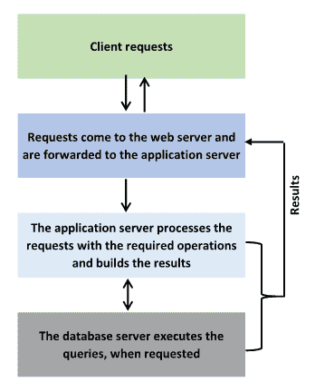
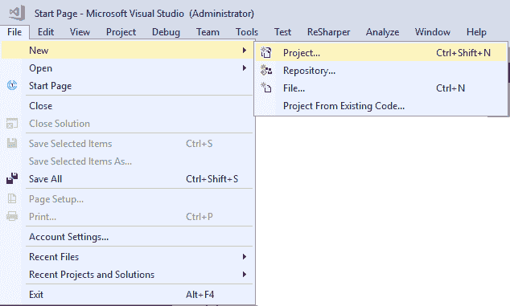
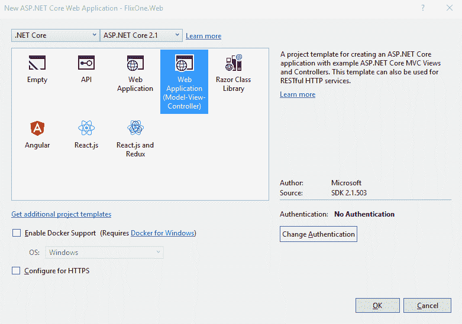
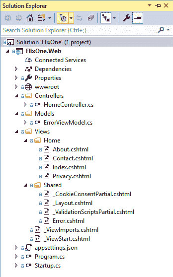
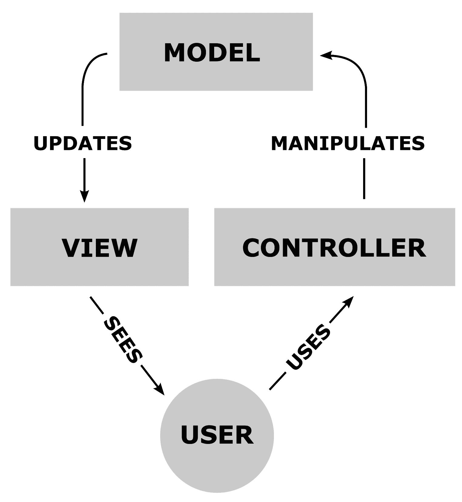
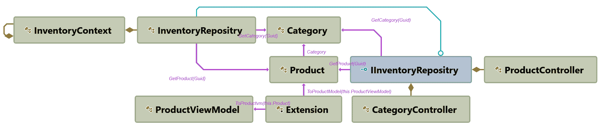

# Web 应用程序设计模式的实现.第 1 部分

在本章中，我们将继续构建**FlixOne**库存管理应用程序（参见[第 3 章](03.html)、*实现设计模式基础—第 1 部分*），并讨论控制台应用程序到 web 应用程序的转换。web 应用程序应该比控制台应用程序更吸引用户；在这里，我们还将讨论为什么我们要进行这种改变。

本章将介绍以下主题：

*   创建.NET 核心 web 应用程序
*   制作 web 应用程序
*   实现 CRUD 页面

If you have not looked at the earlier chapters yet, please note that the **FlixOne Inventory Management** web application is an imaginary product. We are creating this application to discuss the various design patterns required in web projects.

# 技术要求

本章包含各种代码示例来解释这些概念。代码保持简单，仅用于演示目的。大多数示例都涉及用 C#编写的**.NET 核心**控制台应用程序。

要运行和执行代码，您需要以下内容：

*   Visual Studio 2019（您也可以使用 Visual Studio 2017 Update 3 或更高版本运行应用程序）
*   .NET 核心的环境设置
*   SQL Server（本章使用快速版）

# 安装 Visual Studio

要运行这些代码示例，您需要安装 Visual Studio（2017）或更高版本，如 2019（或者您可以使用首选 IDE）。要执行此操作，请执行以下步骤：

1.  从[下载 Visual Studiohttps://docs.microsoft.com/en-us/visualstudio/install/install-visual-studio](https://docs.microsoft.com/en-us/visualstudio/install/install-visual-studio) 。
2.  按照随附的安装说明进行操作。Visual Studio 安装有多个版本。在本章中，我们将使用 Visual Studio for Windows。

# 设置.NET 内核

如果未安装.NET Core，则需要执行以下步骤：

1.  下载.NET Core 自：[https://www.microsoft.com/net/download/windows](https://www.microsoft.com/net/download/windows) 。
2.  按照安装说明和相关库进行操作：[https://dotnet.microsoft.com/download/dotnet-core/2.2](https://dotnet.microsoft.com/download/dotnet-core/2.2) 。

# 安装 SQL Server

如果未安装 SQL Server，则需要按照以下说明操作：

1.  从[下载 SQL Serverhttps://www.microsoft.com/en-in/download/details.aspx?id=1695](https://www.microsoft.com/en-in/download/details.aspx?id=1695) 。
2.  您可以在以下位置找到安装说明：[https://docs.microsoft.com/en-us/sql/ssms/download-sql-server-management-studio-ssms?view=sql-服务器-2017](https://docs.microsoft.com/en-us/sql/ssms/download-sql-server-management-studio-ssms?view=sql-server-2017)。

For troubleshooting and for more information, refer to: [https://www.blackbaud.com/files/support/infinityinstaller/content/installermaster/tkinstallsqlserver2008r2.htm](https://www.blackbaud.com/files/support/infinityinstaller/content/installermaster/tkinstallsqlserver2008r2.htm).

本节旨在提供开始使用 web 应用程序的先决条件信息。我们将在后续章节中了解更多详细信息。在本章中，我们将使用代码示例详细说明各种术语和章节。

The complete source code is available at: [https://github.com/PacktPublishing/Hands-On-Design-Patterns-with-C-and-.NET-Core/tree/master/Chapter6](https://github.com/PacktPublishing/Hands-On-Design-Patterns-with-C-and-.NET-Core/tree/master/Chapter6).

# 创建.Net 核心 web 应用程序

在本章的开头，我们讨论了基于 FlixOne 控制台的应用程序，业务团队认为使用 web 应用程序有多种原因。现在是对应用程序进行更改的时候了。在本节中，我们将开始为现有的 FlixOne 应用程序创建一个新的 UI，并提供新的外观和感觉。我们还将讨论所有需求和初始化。

# 启动项目

为了延续我们现有的 FlixOne 控制台应用程序，管理层决定用许多功能改进我们的 FlixOne 库存控制台应用程序。管理层得出结论，我们必须将现有控制台应用程序转换为基于 web 的解决方案。

技术团队和业务团队坐在一起，确定了决定放弃当前控制台应用程序的各种原因：

*   界面不是交互式的。
*   该应用程序并非无处不在。
*   维护起来很复杂。
*   不断增长的业务需要具有更高性能和适应性的可扩展系统。

# 开发需求

下列要求清单是讨论的结果。确定的高级别要求如下：

*   产品分类
*   产品添加
*   产品更新
*   产品删除

业务需求的实际需求落在开发人员身上。这些技术要求包括以下内容：

*   **登录或主页**：这应该是一个包含各种小部件的仪表板，并且应该显示商店的摘要。
*   **产品页面**：应该能够添加、更新和删除产品和类别。

# 制作 web 应用程序

根据刚才讨论的需求，我们的主要目标是将现有的控制台应用程序转换为 web 应用程序。在这个转换过程中，我们将讨论 web 应用程序的各种设计模式，以及这些设计模式在 web 应用程序上下文中的重要性。

# Web 应用程序及其工作方式

Web 应用程序是客户机-服务器体系结构的最佳实现之一。Web 应用程序可以是一小段代码、一个程序，也可以是用户使用浏览器相互交互或与服务器交互的问题或业务场景的完整解决方案。Web 应用程序通过浏览器为请求和响应提供服务，主要通过使用**超文本传输协议**（**HTTP**）。

Whenever any communication occurs between the client and the server, two things happen: the client initiates the request and the server generates the response. This communication is made up of HTTP requests and HTTP responses. For more information, refer to the documentation at: [https://www.w3schools.com/whatis/whatis_http.asp](https://www.w3schools.com/whatis/whatis_http.asp).

在下图中，您可以看到 web 应用程序及其工作方式的概述：


从这个图中，您可以很容易地看到，通过使用浏览器（作为客户端），您为数百万用户打开了大门，他们可以从世界任何地方访问网站，并可以作为用户与您进行交互。使用 web 应用程序，您和您的客户可以轻松沟通。通常，只有当您捕获并存储数据以及业务和用户所需的所有必要信息时，才能实现有效的参与。然后处理这些信息，并将结果显示给用户。

In general, web applications use a combination of server-side code to handle the storage and retrieval of the information, and client-side scripts to present the information to the users.

web 应用程序需要一个 web 服务器（如**IIS**或**Apache**）来管理来自客户端的请求（如上图所示，来自浏览器）。执行请求的任务还需要应用程序服务器（如 IIS 或 Apache Tomcat）。有时还需要一个数据库来存储信息。

Put simply, both a web server and an application server are designed to serve HTTP content, but with certain variations. Web servers serve static HTTP content, such as HTML pages. Application servers can, apart from serving static HTTP content, also serve dynamic content, using different programming languages. For more information, refer to [https://stackoverflow.com/questions/936197/what-is-the-difference-between-application-server-and-web-server](https://stackoverflow.com/questions/936197/what-is-the-difference-between-application-server-and-web-server).

我们可以如下详细说明 web 应用程序的工作流。这些被称为 web 应用程序的五步工作流程：

1.  客户端（浏览器）通过 internet 使用 HTTP（在大多数情况下）向 web 服务器触发请求。这通常通过 web 浏览器或应用程序的用户界面实现。
2.  请求在 web 服务器上产生，web 服务器将请求转发给应用服务器（对于不同的请求，将有不同的应用服务器）。
3.  在应用服务器中，已完成请求的任务。这可能涉及查询数据库服务器、从数据库检索信息、处理信息和生成结果。
4.  生成的结果（请求的信息或处理的数据）将发送到 web 服务器。
5.  最后，响应从 web 服务器发送回请求者（客户机），并包含请求的信息。这将显示在用户的显示器上。

下图显示了这五个步骤的图形概述：



在下面的章节中，我将描述使用**模型视图控制器**（**MVC**模式）的 web 应用程序的工作过程。

# 对 web 应用程序进行编码

到目前为止，我们已经了解了需求，并研究了我们的目标，即将控制台应用程序转换为基于 web 的平台或应用程序。在本节中，我们将使用 VisualStudio 开发实际的 web 应用程序。

执行以下步骤以使用 Visual Studio 创建 web 应用程序：

1.  打开 VisualStudio 实例。
2.  点击文件新建项目或按*Ctrl+Shift+N*键，如下图所示：



3.  从“新建项目”窗口中，选择 Web |.NET Core | ASP.NET Core Web 应用程序。

4.  命名它（例如，`FlixOne.Web`），选择位置，然后可以更新解决方案名称。默认情况下，解决方案名称将与项目名称相同。选中“为解决方案创建目录”复选框。您还可以选择选中“创建新的 Git 存储库”复选框（如果要为此创建新存储库，则需要有效的 Git 帐户）。

以下屏幕截图显示了新项目的创建过程：


5.  下一步是为 web 应用程序和.NET 核心版本选择合适的模板。我们不会为这个项目启用 Docker 支持，因为我们不会使用 Docker 作为容器来部署我们的应用程序。我们将只使用 HTTP 协议，而不是 HTTPS。因此，“启用 Docker 支持”和“配置 HTTPs”复选框都应保持未选中状态，如以下屏幕截图所示：



现在，我们有了一个完整的项目，其中包含了使用 MVC 框架的模板和示例代码。以下屏幕截图显示了我们目前的解决方案：



Architectural patterns are a way of implementing best practices within the design of the user interface and application itself. They provide us with reusable solutions to common problems. These patterns also allow us to easily implement a separation of concerns.

The most popular architectural patterns are as follows:

*   **模型视图控制器**（**MVC**）
*   **模型视图演示者**（**MVP**）
*   **模型视图视图模型**（**MVVM**）

您可以通过点击*F5*来尝试运行应用程序。以下屏幕截图显示了 web 应用程序的默认主页：


在接下来的章节中，我将讨论 MVC 模式，并创建**CRUD**（**创建**、**更新**、**删除**页面与用户交互。

# 实现 CRUD 页面

在本节中，我们将开始创建功能页面来创建、更新和删除产品。要开始，请打开您的`FlixOne`解决方案，并将以下类添加到指定的文件夹中：

**`Models`**：在解决方案的`Models`文件夹中添加以下文件：

*   `Product.cs`：`Product`类的代码片段如下：

```cs
public class Product
{
   public Guid Id { get; set; }
   public string Name { get; set; }
   public string Description { get; set; }
   public string Image { get; set; }
   public decimal Price { get; set; }
   public Guid CategoryId { get; set; }
   public virtual Category Category { get; set; }
}
```

`Product`类表示产品的几乎所有元素。它有一个`Name`、一个完整的`Description`、一个`Image`、一个`Price`和一个独特的`ID`，因此我们的系统能够识别它。`Product`类也有本产品所属的`Category ID`。它还包括对`Category`的完整定义。

**Why should we define a `virtual` property?**
In our `Product` class, we have defined a `virtual` property. This is because, in the **Entity Framework** (**EF**), this property helps to create a proxy for the virtual property. In this way, the property can support lazy loading and more efficient change tracking. This means that data is available on demand. EF loads the data when you request to use the `Category` property.

*   `Category.cs`：`Category`类的代码片段如下：

```cs
public class Category
{
    public Category()
    {
        Products = new List<Product>();
    }

    public Guid Id { get; set; }
    public string Name { get; set; }
    public string Description { get; set; }
    public virtual IEnumerable<Product> Products { get; set; }
}
```

我们的`Category`类代表产品的实际类别。一个类别有一个唯一的`ID`、一个`Name`、一个完整的`Description`和一个属于该类别的`Products`集合。每当我们初始化`Category`类时，它就会初始化`Product`类。

*   `ProductViewModel.cs`：`ProductViewModel`类的代码片段如下：

```cs
public class ProductViewModel
{
    public Guid ProductId { get; set; }
    public string ProductName { get; set; }
    public string ProductDescription { get; set; }
    public string ProductImage { get; set; }
    public decimal ProductPrice { get; set; }
    public Guid CategoryId { get; set; }
    public string CategoryName { get; set; }
    public string CategoryDescription { get; set; }
}
```

我们的`ProductViewModel`类表示一个完整的`Product`，它具有唯一的`ProductId`、一个`ProductName`、一个完整的`ProductDescription`、一个`ProductImage`、一个`ProductPrice`、一个唯一的`CategoryId`、一个`CategoryName`和一个完整的`CategoryDescription`等属性。

`Controllers`：将以下文件添加到解决方案的`Controllers`文件夹中：

*   `ProductController`负责与产品相关的所有操作。让我们来看看在这个控制器中我们试图实现的代码和操作：

```cs
public class ProductController : Controller
{
    private readonly IInventoryRepositry _repositry;
    public ProductController(IInventoryRepositry inventoryRepositry) => _repositry = inventoryRepositry;

...
}
```

在这里，我们定义了继承自`Controller`类的`ProductController`。我们使用了**依赖注入**，这是 ASP.NET 核心 MVC 框架的内置支持。

We discussed the inversion of control in detail in [Chapter 5](05.html), *Implementing Design Patterns - .Net Core;* `Controller` is a base class for an MVC controller. For more information, refer to: [https://docs.microsoft.com/en-us/dotnet/api/microsoft.aspnetcore.mvc.controller](https://docs.microsoft.com/en-us/dotnet/api/microsoft.aspnetcore.mvc.controller).

我们已经创建了主控制器`ProductController`。现在让我们开始为 CRUD 操作添加功能。

以下代码只是一个`Read`或`Get`操作，请求存储库（`_``inventoryRepository`）列出所有可用的产品，然后将此产品列表转换为`ProductViewModel`类型并返回一个`Index`视图：

```cs
   public IActionResult Index() => View(_repositry.GetProducts().ToProductvm());
   public IActionResult Details(Guid id) => View(_repositry.GetProduct(id).ToProductvm());
```

在前面的代码片段中，`Details`方法根据其唯一的`Id`返回特定`Product`的详细信息。这也是一个与我们的`Index`方法类似的`Get`操作，但它提供了一个对象而不是列表。

The methods of the **MVC controller** are also called **action methods** and have the return type of `ActionResult`. In this case, we are using `IActionResult`. In general, you can say that `IActionResult` is an interface of the `ActionResult` class. It also provides us a way to return many things, including the following:

*   `EmptyResult`
*   `FileResult`
*   `HttpStatusCodeResult`
*   `ContentResult`
*   `JsonResult`
*   `RedirectToRouteResult`
*   `RedirectResult`

We are not going to discuss all of these in detail, as these are beyond the scope of this book. To find out more about return types, refer to: [https://docs.microsoft.com/en-us/aspnet/core/web-api/action-return-types](https://docs.microsoft.com/en-us/aspnet/core/web-api/action-return-types).

在下面的代码中，我们正在创建一个新产品。下面的代码段有两个操作方法。一个有`[HttpPost]`属性，另一个没有该属性：

```cs
public IActionResult Create() => View();
[HttpPost]
[ValidateAntiForgeryToken]
public IActionResult Create([FromBody] Product product)
{
    try
    {
        _repositry.AddProduct(product);
        return RedirectToAction(nameof(Index));
    }
    catch
    {
        return View();
    }
}
```

第一个方法只是返回一个`View`。这将返回一个`Create.cshtml`页面。

If any of the action methods in the **MVC framework** do not have any attribute, it will use the `[HttpGet]` attribute by default. In other views, by default, action methods are `Get` requests. Whenever a user views a page, we use `[HttpGet]`, or a `Get` request. Whenever a user submits a form or performs an action, we use `[HttpPost]`, or a `Post` request.

If we did not explicitly mention the view name in our action method, then the MVC framework looks like a view name in this format: `actionmethodname.cshtml` or `actionmethodname.vbhtml`. In our case, the view name is `Create.cshtml` because we are using the C# language. It would be `vbhtml` if we used Visual Basic. It first looks in the folder that has a name that is similar to the controller's folder name. If it does not find a file in this folder, it looks in the `shared` folder.

前面代码片段中的第二个操作方法使用了`[HttpPost]`属性，这意味着它处理`Post`请求。此操作方法通过调用`_repository`的`AddProduct`方法简单地添加产品。在这个动作方法中，我们使用了`[ValidateAntiForgeryToken]`属性和`[FromBody]`，这是一个模型绑定器。

MVC 框架通过提供`[ValidateAntiForgeryToken]`属性，提供了很多安全性来保护我们的应用程序免受**跨站点脚本**/**跨站点请求伪造**（**XSS/CSRF**）攻击。这些类型的攻击通常包括一些危险的客户端脚本代码。

MVC 中的模型绑定将数据从`HTTP`请求映射到动作方法参数。使用动作方法的常用模型绑定属性如下：

*   `[FromHeader]`
*   ``[FromQuery]``
*   `[FromRoute]`
*   `[FromForm]`

我们不打算更详细地讨论这些，因为这超出了本书的范围。但是，您可以在[的官方文件中找到完整的详细信息 https://docs.microsoft.com/en-us/aspnet/core/mvc/models/model-binding](https://docs.microsoft.com/en-us/aspnet/core/mvc/models/model-binding) 。

在前面的代码片段中，我们讨论了`Create`和`Read`操作。现在是为`Update`操作编写代码的时候了。在下面的代码中，我们有两种动作方式：一种是`Get`，另一种是`Post`请求：

```cs
public IActionResult Edit(Guid id) => View(_repositry.GetProduct(id));

[HttpPost]
[ValidateAntiForgeryToken]
public IActionResult Edit(Guid id, [FromBody] Product product)
{
    try
    {
        _repositry.UpdateProduct(product);
        return RedirectToAction(nameof(Index));
    }
    catch
    {
        return View();
    }
}
```

前面代码的第一个动作方法在`ID`的基础上得到一个`Product`，并返回一个`View`。第二个动作方法从视图中获取数据，并根据其 ID 更新请求的`Product`：

```cs
public IActionResult Delete(Guid id) => View(_repositry.GetProduct(id));

[HttpPost]
[ValidateAntiForgeryToken]
public IActionResult Delete(Guid id, [FromBody] Product product)
{
    try
    {
        _repositry.RemoveProduct(product);
        return RedirectToAction(nameof(Index));
    }
    catch
    {
        return View();
    }
}
```

最后，前面的代码表示我们的`CRUD`操作中的`Delete`操作。它还有两种作用方式；一个从存储库中检索数据并将其提供给视图，另一个接收数据请求并根据其 ID 删除特定的`Product`。

`CategoryController`负责`Product`类的所有操作。向控制器添加以下代码，它表示`CategoryController`，我们使用依赖注入来初始化我们的`IInventoryRepository`：

```cs
public class CategoryController: Controller
{
  private readonly IInventoryRepositry _inventoryRepositry;
  public CategoryController(IInventoryRepositry inventoryRepositry) => _inventoryRepositry = inventoryRepositry;
 //code omitted
}
```

下面的代码包含两个操作方法。第一个获取类别列表，第二个是基于其唯一 ID 的特定类别：

```cs
public IActionResult Index() => View(_inventoryRepositry.GetCategories());
public IActionResult Details(Guid id) => View(_inventoryRepositry.GetCategory(id));
```

以下代码用于在系统中创建新类别的`Get`和`Post`请求：

```cs
public IActionResult Create() => View();
    [HttpPost]
    [ValidateAntiForgeryToken]
    public IActionResult Create([FromBody] Category category)
    {
        try
        {
            _inventoryRepositry.AddCategory(category);

            return RedirectToAction(nameof(Index));
        }
        catch
        {
            return View();
        }
    }
```

在下面的代码中，我们正在更新现有的类别。该代码包含有`Get`和`Post`请求的`Edit`动作方法：

```cs
public IActionResult Edit(Guid id) => View(_inventoryRepositry.GetCategory(id));
    [HttpPost]
    [ValidateAntiForgeryToken]
    public IActionResult Edit(Guid id, [FromBody]Category category)
    {
        try
        {
            _inventoryRepositry.UpdateCategory(category);

            return RedirectToAction(nameof(Index));
        }
        catch
        {
            return View();
        }
    }
```

最后，我们有一个`Delete`动作方法。这是我们`CRUD`页面删除`Category`的最终操作，如下代码所示：

```cs
public IActionResult Delete(Guid id) => View(_inventoryRepositry.GetCategory(id));

    [HttpPost]
    [ValidateAntiForgeryToken]
    public IActionResult Delete(Guid id, [FromBody] Category category)
    {
        try
        {
            _inventoryRepositry.RemoveCategory(category);

            return RedirectToAction(nameof(Index));
        }
        catch
        {
            return View();
        }
    }
```

`Views`：将以下视图添加到各自的文件夹中：

*   `Index.cshtml`
*   `Create.cshtml`
*   `Edit.cshtml`
*   `Delete.cshtml`
*   `Details.cshtml`

`Contexts`：将`InventoryContext.cs`文件添加到`Contexts`文件夹中，代码如下：

```cs
public class InventoryContext : DbContext
{
    public InventoryContext(DbContextOptions<InventoryContext> options)
        : base(options)
    {
    }

    public InventoryContext()
    {
    }

    public DbSet<Product> Products { get; set; }
    public DbSet<Category> Categories { get; set; }
}
```

前面的代码提供了使用 EF 与数据库交互所需的各种方法。在运行代码时，您可能会遇到以下异常：


要修复此异常，您应该映射到`Startup.cs`文件中的`IInventoryRepository`，如下图所示：


我们现在已经向 web 应用程序添加了各种功能，我们的解决方案现在如以下屏幕截图所示：


Refer to the GitHub repository for this chapter ([https://github.com/PacktPublishing/Hands-On-Design-Patterns-with-C-and-.NET-Core/tree/master/Chapter6](https://github.com/PacktPublishing/Hands-On-Design-Patterns-with-C-and-.NET-Core/tree/master/Chapter6)).

如果我们要可视化 MVC 模型，那么它将如下图所示工作：



前一幅图片改编自[https://commons.wikimedia.org/wiki/File:MVC-Process.svg](https://commons.wikimedia.org/wiki/File:MVC-Process.svg)

如前一张图所示，每当用户提出请求时，它都会到达控制器并触发动作方法，以便在需要时对模型进行进一步操作或更新，然后将视图提供给用户。

在我们的例子中，当用户请求`/Product`时，请求进入`ProductController`的`Index`动作方法，在获取产品列表后服务`Index.cshtml`视图。您将获得如下屏幕截图所示的产品列表：


前面的屏幕截图是一个简单的产品列表，它代表了`CRUD`操作的`Read`部分。在该屏幕上，应用程序显示可用的产品总数及其类别。

下图描述了我们的应用程序如何交互：



它显示了我们申请过程的图形概述。`InventoryRepository`依赖`InventoryContext`进行数据库操作，并与我们的模型类`Category`和`Product`交互。我们的`Product`和`Category`控制器使用`IInventoryRepository`接口与 CRUD 操作库交互。

# 总结

本章的主要目标是启动一个基本的 web 应用程序。

本章首先讨论了业务需求、为什么需要 web 应用程序以及为什么要升级控制台应用程序。然后，我们介绍了在 MVC 模式下使用 VisualStudio 逐步创建 web 应用程序的过程。我们还讨论了 web 应用程序如何作为客户机-服务器模型工作，并研究了用户界面模式。我们还开始构建 CRUD 页面。

在下一章中，我们将继续讨论 web 应用程序，并讨论更多 web 应用程序的设计模式。

# 问题

以下问题将使您能够整合本章中包含的信息：

1.  什么是 web 应用程序？
2.  根据您的选择制作一个 web 应用程序，并描述它是如何工作的。
3.  什么是控制反转？
4.  我们在本章中讨论的架构模式是什么？你喜欢哪一个？为什么？

# 进一步阅读

祝贺你已经完成了这一章。我们已经介绍了许多与身份验证、授权和测试项目相关的内容。这不是你学习的终点；这只是一个开始，你可以参考更多的书来提高你的理解力。以下书籍深入介绍了 RESTful web 服务和测试驱动开发：

*   *使用.NET 核心*构建 RESTful Web 服务，作者为*Gaurav Aroraa*，*Tadit Dash*，作者为*Packt Publishing*，网址为：[https://www.packtpub.com/application-development/building-restful-web-services-net-core](https://www.packtpub.com/application-development/building-restful-web-services-net-core)
*   *C#和.NET 核心测试驱动开发*，作者*阿约巴米·阿德沃勒*，摘自*Packt Publishing*，网址：[https://www.packtpub.com/application-development/c-and-net-core-test-driven-development](https://www.packtpub.com/application-development/c-and-net-core-test-driven-development)